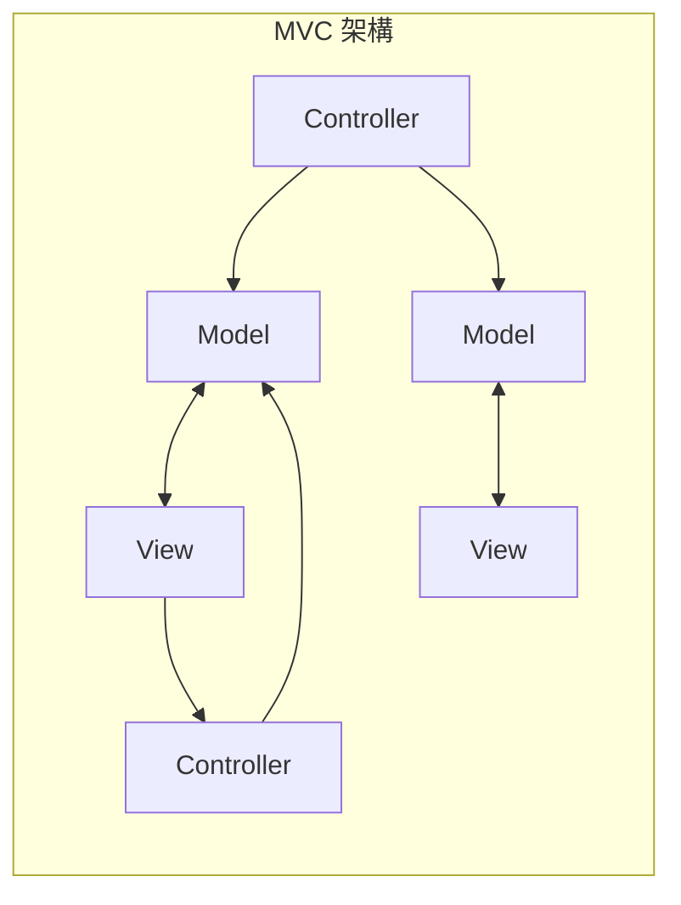
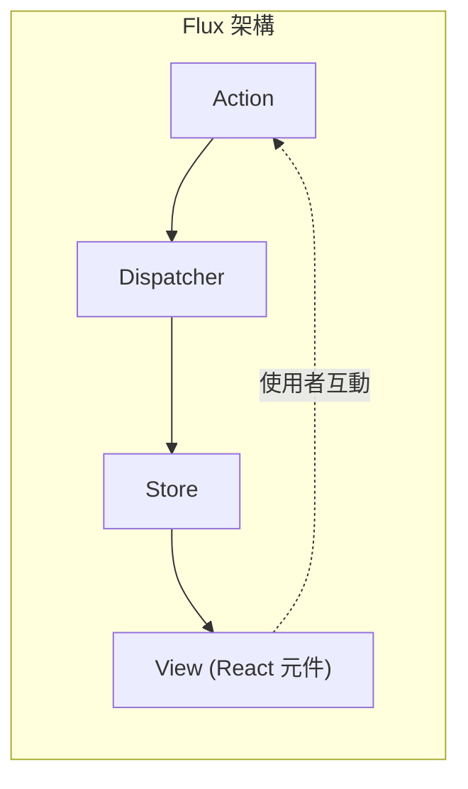
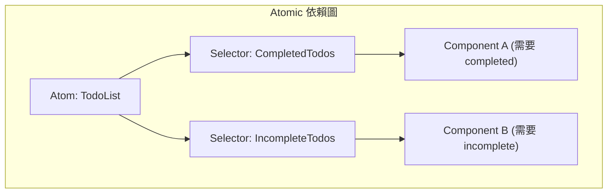

# 前言

在現代 Web 前端開發中， **狀態管理** （State Management）是無法避免且非常重要的主題。特別是在以 React 為中心的生態系中，至今已經誕生了許多狀態管理套件與架構，並持續進化。

本文將回顧前端開發中狀態管理的歷史變遷，深入探討各種架構是為了解決什麼問題而誕生，以及又產生了什麼新的挑戰。從傳統 MVC 模型所面臨的極限開始，Flux 架構的誕生、Redux 帶來的典範轉移（Paradigm Shift）、React Context API 的功過、以 Recoil 和 Jotai 為代表的 Atomic State、MobX 和 Valtio 等 Proxy-based 的方法，一直到深受現代開發者喜愛的 Zustand 等輕量級套件，我們將詳細解說其進化的軌跡。

---

## 1. 狀態管理的黎明：MVC 及其極限

在 React 和 Vue 等現代 UI 套件出現之前，Web 前端世界主要依賴 jQuery 直接操作 DOM。然而，隨著應用程式越來越複雜，手動同步狀態（資料）與 UI（DOM）成為了產生 bug 的溫床。

為了解決這個問題，在後端取得成功的 **MVC** （Model-View-Controller）和 **MVVM** （Model-View-ViewModel）等架構模式被引入到前端（代表例子：Backbone.js、AngularJS 等）。

### MVC 所面臨的挑戰

MVC 模式將職責分為管理資料的 Model、描繪 UI 的 View，以及處理使用者輸入來更新 Model 或 View 的 Controller。雖然在中小型應用程式中運作良好，但在 Facebook（現 Meta）這類大型應用程式中卻發生了嚴重的問題。

那就是 **雙向資料綁定帶來的狀態不可預測性** 。Model 的變更更新了 View，View 上的操作又更新了另一個 Model，接著這又去更新了另一個 View……當這種連鎖更新（Cascade Update）發生時，資料流會變得錯綜複雜，使得追蹤 bug 變得極為困難。



就這樣，由於資料流向多個方向，使得我們無法掌握「現在哪個資料為什麼改變了」。

---

## 2. Flux 架構的誕生與單向資料流

Facebook 對於 MVC 複雜化問題的解答是 **Flux** 架構。Flux 最大的發明是徹底實施 **單向資料流** （Unidirectional Data Flow）。

在 Flux 中，應用程式的資料永遠只朝單一方向流動。



- **Action** ：表示使用者操作或系統事件的物件。
- **Dispatcher** ：接收 Action，並將 Action 派發給所有已註冊 Store 的中央樞紐。
- **Store** ：保存應用程式狀態與邏輯。接收來自 Dispatcher 的 Action 以更新自身，並通知 View 進行變更。
- **View** ：從 Store 接收狀態並描繪 UI。偵測使用者的操作以發出新的 Action。

透過將資料流向限縮為單一方向，狀態變更過程變得容易追蹤，應用程式的可預測性有了戲劇性的提升。這成為了後來狀態管理基礎的重要典範轉移。

---

## 3. Redux：Single Source of Truth（單一職責樹）的時代

儘管 Flux 的概念非常出色，但由於存在多個 Store 而導致依賴關係管理等實作上的複雜性依然存在。由 Dan Abramov 等人開發的 **Redux** 將其洗鍊並昇華至終極形態。

### Redux 的 3 原則

Redux 基於以下三個基本原則：

1. **Single source of truth** （單一的信任來源）：整個應用程式的狀態被儲存在一個物件樹（Store）中。
2. **State is read-only** （狀態是唯讀的）：改變狀態的唯一方法是發出（dispatch）一個描述發生什麼事的 Action。
3. **Changes are made with pure functions** （變更透過純函數進行）：為了指定 Action 如何轉換狀態樹，必須撰寫純函數的 Reducer。

Redux 使得時間旅行除錯（狀態的倒轉與重播）成為可能，開發者體驗（DX）得到了飛躍性的提升。

### 使用 Redux Toolkit 的 ToDo App 實作範例

過去常被批評為「樣板程式碼（Boilerplate）太多」的 Redux，現在 **Redux Toolkit** （RTK）已成為標準，能夠非常簡潔地撰寫。

```typescript
// Redux Toolkit (用來與 Zustand 或 Context 比較的範例)
import { configureStore, createSlice, PayloadAction } from '@reduxjs/toolkit';
import { useSelector, useDispatch } from 'react-redux';

// 1. 定義 State 型別
interface Todo {
  id: string;
  text: string;
  completed: boolean;
}

// 2. 定義 Slice（Reducer 與 Action）
const todoSlice = createSlice({
  name: 'todos',
  initialState: [] as Todo[],
  reducers: {
    addTodo: (state, action: PayloadAction<string>) => {
      // 在 RTK 中因為有 Immer 在運作，可以寫成可變（mutable）的形式
      state.push({ id: Date.now().toString(), text: action.payload, completed: false });
    },
    toggleTodo: (state, action: PayloadAction<string>) => {
      const todo = state.find(t => t.id === action.payload);
      if (todo) {
        todo.completed = !todo.completed;
      }
    }
  }
});

export const { addTodo, toggleTodo } = todoSlice.actions;
export const store = configureStore({ reducer: { todos: todoSlice.reducer } });

// 3. 在元件中使用
function TodoApp() {
  const todos = useSelector((state: { todos: Todo[] }) => state.todos);
  const dispatch = useDispatch();

  return (
    <div>
      <button onClick={() => dispatch(addTodo('新任務'))}>新增</button>
      <ul>
        {todos.map(todo => (
          <li key={todo.id} onClick={() => dispatch(toggleTodo(todo.id))}>
            {todo.completed ? '<s>' : ''}{todo.text}{todo.completed ? '</s>' : ''}
          </li>
        ))}
      </ul>
    </div>
  );
}
```

雖然 Redux 在大型專案中仍然是強大的選擇，但對於小型應用程式來說有點大材小用（Overkill），且因為是全域的單一樹狀結構，為了防止不必要的重新渲染，在調整選擇器（Selector，`useSelector`）時也會面臨困難。

---

## 4. React Context API：內建的共享機制及其陷阱

在 React 16.3 翻新的 **Context API** ，是作為解決 Props Drilling（像傳水桶一樣將屬性傳遞到元件的深層階層）的 React 標準功能而登場。伴隨著 Hooks 的出現（`useContext` 和 `useReducer`），曾引發了「是不是已經不需要 Redux 了？」的討論。

### 使用 Context + Reducer 的 ToDo App 實作範例

```typescript
import React, { createContext, useContext, useReducer, ReactNode } from 'react';

// 1. 型別定義
interface Todo { id: string; text: string; completed: boolean; }
type Action = { type: 'ADD'; payload: string } | { type: 'TOGGLE'; payload: string };

// 2. 定義 Reducer
function todoReducer(state: Todo[], action: Action): Todo[] {
  switch (action.type) {
    case 'ADD':
      return [...state, { id: Date.now().toString(), text: action.payload, completed: false }];
    case 'TOGGLE':
      return state.map(t => t.id === action.payload ? { ...t, completed: !t.completed } : t);
    default:
      return state;
  }
}

// 3. 建立 Context
const TodoContext = createContext<{ state: Todo[]; dispatch: React.Dispatch<Action> } | undefined>(undefined);

// 4. 提供 Provider
export function TodoProvider({ children }: { children: ReactNode }) {
  const [state, dispatch] = useReducer(todoReducer, []);
  return (
    <TodoContext.Provider value={{ state, dispatch }}>
      {children}
    </TodoContext.Provider>
  );
}

// 5. 在元件中使用
function TodoApp() {
  const context = useContext(TodoContext);
  if (!context) throw new Error('Must be used within Provider');
  const { state: todos, dispatch } = context;

  return (
    <div>
      <button onClick={() => dispatch({ type: 'ADD', payload: '任務' })}>新增</button>
      {/* 描繪處理 */}
    </div>
  );
}
```

### Context API 的課題（不必要的重新渲染）

Context 確實解決了 Props Drilling，但它 **並不是狀態管理套件** 。Context 終究只是一種「依賴注入（DI）」機制。

Context 最大的問題在於 **「當 Context 的值更新時，所有訂閱該 Context（使用 `useContext`）的元件都會被強制重新渲染」** 。如果在一個 Context 中管理巨大的物件，連只需要部分屬性的元件都會不必要地被渲染，導致效能惡化。為了防止這種情況而將 Context 拆分得很細，又會陷入 Provider 地獄（Provider Hell）。

---

## 5. Atomic State Management：透過 Recoil 和 Jotai 解決

為了解決 Context 的重新渲染問題與 Redux 的樣板程式碼問題而提出來的，是採用 **Atomic 架構** 的狀態管理。由 Facebook（現 Meta）實驗性發表的 **Recoil** ，以及更輕量、洗鍊的 **Jotai** 便是代表例子。

### 什麼是 Atomic 架構？

將應用程式的狀態不視為單一巨大的樹狀結構，而是作為獨立的微小狀態顆粒（ **Atom** ）來處理。由於各個元件只會訂閱（Subscribe）需要的 Atom，當狀態更新時，只有依賴該狀態的元件才會精準地重新渲染。



### 使用 Recoil（或 Jotai）的 ToDo App 實作範例

這裡介紹類似 Jotai，或使用 Recoil 且非常直觀的寫法。

```typescript
// Recoil 範例
import { atom, useRecoilState, RecoilRoot } from 'recoil';

// 1. 定義 Atom（狀態的最小單位）
const todosState = atom<Todo[]>({
  key: 'todosState',
  default: [],
});

// 2. 在元件中使用 (與 React 的 useState 幾乎相同的介面)
function TodoApp() {
  const [todos, setTodos] = useRecoilState(todosState);

  const addTodo = () => {
    setTodos([...todos, { id: Date.now().toString(), text: '任務', completed: false }]);
  };

  const toggleTodo = (id: string) => {
    setTodos(todos.map(t => t.id === id ? { ...t, completed: !t.completed } : t));
  };

  return (
    <div>
      <button onClick={addTodo}>新增</button>
      {/* 描繪處理 */}
    </div>
  );
}

// 必須: 用 RecoilRoot 包覆應用程式的根目錄
function App() {
  return <RecoilRoot><TodoApp /></RecoilRoot>;
}
```

樣板程式碼幾乎消失，能以類似 React 標準 `useState` 的感覺來處理全域狀態。此外，在處理非同步資料或計算衍生狀態（Derived State）時也非常強大。

---

## 6. Proxy-based State Management：MobX 與 Valtio

另一個強大的方法是活用 JavaScript `Proxy` 物件的 **可變（Mutable）狀態管理** 。React 原則上要求「不可變（Immutable）的狀態更新」，但透過使用 Proxy，可以做到「只要直接改寫物件，就能偵測變更並自動更新元件」。

以前 **MobX** 很出名，但近年來與 React Hooks 親和性更高的 **Valtio** （與 Zustand 同一位作者）備受矚目。因為 Proxy-based 可以撰寫直觀的 JavaScript，所以在管理具有複雜巢狀結構的資料時能發揮威力。

---

## 7. 現代的主流：輕量、高速的 Zustand

在各種架構林立的情況下，現在成為許多開發者「首選」的是 **Zustand** （德文中「狀態」的意思）。

Zustand 與 Redux 一樣採用基於 Flux 的「單一 Store」方法，但徹底排除了 Redux 中複雜的概念（Reducer、Action types、Dispatch、用 Provider 包覆）。它非常輕量、程式碼量少，且提供基於 Hook 的簡單 API。

### 使用 Zustand 的 ToDo App 實作範例

```typescript
import { create } from 'zustand';

// 1. State 與 Action 的型別定義
interface TodoState {
  todos: Todo[];
  addTodo: (text: string) => void;
  toggleTodo: (id: string) => void;
}

// 2. 建立 Store
const useTodoStore = create<TodoState>((set) => ({
  todos: [],
  addTodo: (text) => 
    set((state) => ({ 
      todos: [...state.todos, { id: Date.now().toString(), text, completed: false }] 
    })),
  toggleTodo: (id) => 
    set((state) => ({
      todos: state.todos.map(t => t.id === id ? { ...t, completed: !t.completed } : t)
    })),
}));

// 3. 在元件中使用
function TodoApp() {
  // 只選擇並取得需要的狀態與動作（防止不必要的渲染）
  const todos = useTodoStore(state => state.todos);
  const addTodo = useTodoStore(state => state.addTodo);
  const toggleTodo = useTodoStore(state => state.toggleTodo);

  return (
    <div>
      <button onClick={() => addTodo('Zustand 任務')}>新增</button>
      <ul>
        {todos.map(todo => (
          <li key={todo.id} onClick={() => toggleTodo(todo.id)}>
            {todo.text}
          </li>
        ))}
      </ul>
    </div>
  );
}
```

### Zustand 受支持的理由

- **不需要 Provider** ：不需要用 `<Provider>` 包覆應用程式，在 React 樹之外（一般的函數或非同步處理中）也能讀寫狀態。
- **簡潔性** ：樣板程式碼極少，可以在一個檔案中緊湊地定義 Store。
- **效能** ：透過使用選擇器函數（`state => state.todos`），和 Redux 一樣，只有在訂閱的值改變時才會渲染元件。漂亮地克服了 Context API 的課題。

---

## 總結：未來的狀態管理

前端狀態管理從 MVC 的破綻開始，經歷了透過 Flux/Redux 獲得的穩健性、對使用 Context 達到 API 標準化的摸索，到現在已經進化為 Atomic（Jotai/Recoil）或輕量級 Store（Zustand）、Proxy（Valtio）等多樣且洗鍊的工具群。

在目前專案中的選型基準大約如下：

- **巨大複雜的企業級領域，或需要嚴格追蹤狀態轉移** ：Redux Toolkit
- **不依賴元件樹形狀，靈活且直觀的狀態共享** ：Jotai 或 Recoil
- **簡單、學習成本低，且高效能的全域 Store** ：Zustand
- **想要直觀、可變地處理深層巢狀結構的複雜物件** ：Valtio

前端架構的進化不會停止，但透過理解各個套件 **「是為了解決什麼痛點而誕生的」** ，你將能在自己的專案中做出最適合的技術選型。
