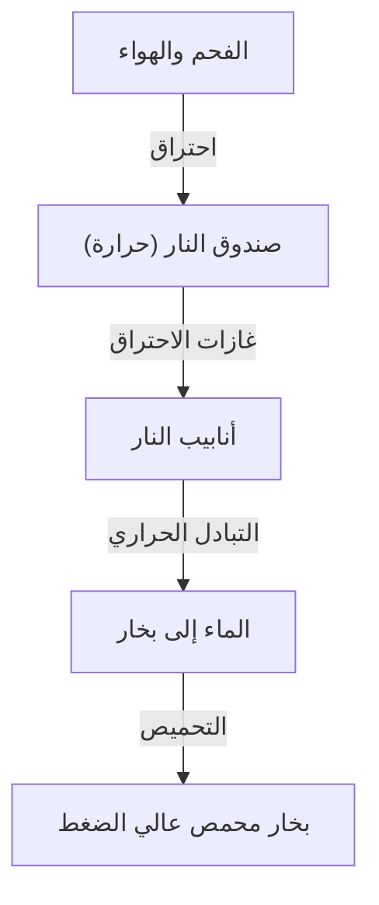

القاطرة البخارية هي رمز للثورة الصناعية التي غيرت تاريخ البشرية بشكل أساسي، وتمثل تتويجاً للديناميكا الحرارية والهندسة الميكانيكية. في هذه المقالة، نقوم بتحليل العملية من احتراق الفحم إلى دوران العجلات الضخمة.

## 1. التبادل الحراري في الغلاية: ولادة الطاقة
قلب القاطرة البخارية هو الغلاية. يتم حرق الفحم في صندوق النار، وتنتقل غازات الاحتراق عالية الحرارة الناتجة عبر أنابيب نار طويلة وضيقة نحو صندوق الدخان. الأنابيب محاطة بالماء، الذي يغلي من خلال التبادل الحراري، ليصبح بخارًا مشبعًا عالي الضغط. المرور عبر المحمص يحوله إلى بخار محمص أكثر كثافة في الطاقة.

## 2. الأسطوانة والمكبس: من الضغط إلى الحركة الترددية
يتم إرسال البخار عالي الضغط المولد إلى الأسطوانة عبر صمام الخانق. داخل الأسطوانة، يتم حقن البخار بالتناوب عبر منافذ البخار، مما يدفع المكبس بقوة ذهابًا وإيابًا. يتم طرد البخار المتمدد عبر المدخنة. يعزز تأثير السحب هذا الاحتراق في صندوق النار، مما يخلق نظامًا مكتفيًا ذاتيًا.

## 3. آلية الكرنك: من الحركة الترددية إلى الدوارة
تنتقل الحركة الترددية الخطية للمكبس إلى القضيب الرئيسي عبر قضيب المكبس ورأس التصالب. يتصل القضيب الرئيسي بمسمار الكرنك على عجلة القيادة، حيث يتم تحويل الحركة الترددية إلى حركة دورانية سلسة. تربط القضبان الجانبية عجلات قيادة متعددة معًا، مما يولد قوة جر هائلة.

## 4. ترس صمام والشيرت: الآلية النهائية
يتحكم ترس الصمام بدقة في توقيت سحب البخار وعادمه. يستخدم "ترس صمام والشيرت" المستخدم على نطاق واسع كرنك عودة ووصلة تمدد لضبط كمية وتوقيت البخار الداخل إلى الأسطوانة (القطع) بسلاسة. يوازن هذا بين عزم الدوران العالي عند بدء التشغيل والكفاءة عند السرعات العالية، ويسمح بالتبديل بين الأمام والخلف. تعتبر الحركة المرتبطة بشكل معقد لهذه القضبان قمة الجمال الميكانيكي.\n