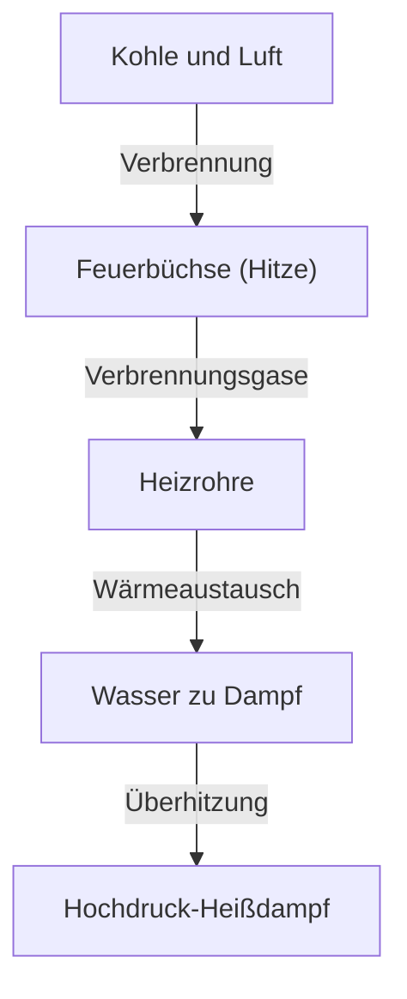

Die Dampflokomotive ist ein Symbol der industriellen Revolution, das die Menschheitsgeschichte grundlegend verändert hat und den Höhepunkt der Thermodynamik und des Maschinenbaus darstellt. In diesem Artikel analysieren wir den Prozess von der Verbrennung der Kohle bis zur Rotation massiver Räder.

## 1. Wärmeaustausch im Kessel: Die Geburt der Energie
Das Herzstück einer Dampflokomotive ist der Kessel. Kohle wird in der Feuerbüchse verbrannt, und die entstehenden heißen Verbrennungsgase strömen durch lange, schmale Heizrohre in die Rauchkammer. Die Heizrohre sind von Wasser umgeben, das durch Wärmeaustausch siedet und zu Hochdruck-Sattdampf wird. Durch einen Überhitzer wird er in noch energiedichteren Heißdampf umgewandelt.

## 2. Zylinder und Kolben: Von Druck zu Hin- und Herbewegung
Der erzeugte Hochdruckdampf wird über das Regler-Ventil in den Zylinder geleitet. Im Zylinder wird abwechselnd Dampf durch Dampfkanäle eingeblasen, der den Kolben heftig hin und her drückt. Der expandierte Dampf wird durch den Schornstein ausgestoßen. Dieser Saugzugeffekt fördert die Verbrennung in der Feuerbüchse weiter und schafft so ein autarkes System.

## 3. Kurbelmechanismus: Von der Hin- und Herbewegung zur Drehbewegung
Die lineare Hin- und Herbewegung des Kolbens wird über die Kolbenstange und den Kreuzkopf auf die Treibstange übertragen. Die Treibstange ist mit dem Kurbelzapfen am Treibrad verbunden, wo die Hin- und Herbewegung in eine gleichmäßige Drehbewegung umgewandelt wird. Kuppelstangen verbinden mehrere Treibräder miteinander und erzeugen so eine enorme Zugkraft.

## 4. Walschaerts-Steuerung: Der ultimative Mechanismus
Die Steuerung regelt den Zeitpunkt von Dampfeinlass und -auslass genau. Die weit verbreitete "Walschaerts-Steuerung" (auch Heusinger-Steuerung genannt) verwendet eine Gegenkurbel und eine Schwinge, um die Menge und den Zeitpunkt des in den Zylinder einströmenden Dampfes stufenlos einzustellen (Füllung). Dies gleicht ein hohes Drehmoment beim Anfahren mit Effizienz bei hohen Geschwindigkeiten aus und ermöglicht das Umschalten zwischen Vorwärts- und Rückwärtsfahrt. Die kompliziert verbundene Bewegung dieser Stangen ist der Höhepunkt mechanischer Schönheit.\n