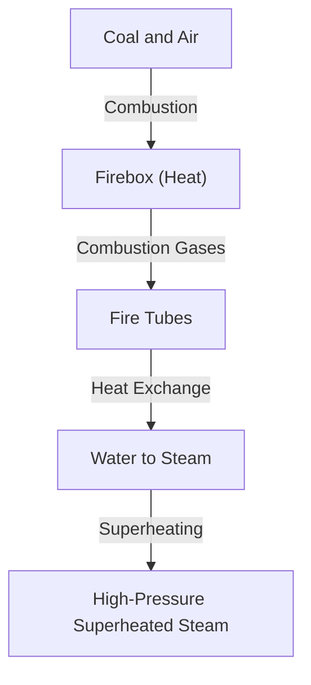

The steam locomotive is a symbol of the Industrial Revolution that fundamentally changed human history, representing the culmination of thermodynamics and mechanical engineering. In this article, we dissect the process from the combustion of coal to the rotation of massive wheels.

## 1. Heat Exchange in the Boiler: The Birth of Energy
The heart of a steam locomotive is the boiler. Coal is burned in the firebox, and the resulting high-temperature combustion gases travel through long, narrow fire tubes towards the smokebox. The fire tubes are surrounded by water, which boils through heat exchange, becoming high-pressure saturated steam. Passing through a superheater transforms it into even more energy-dense superheated steam.

## 2. Cylinder and Piston: From Pressure to Reciprocating Motion
The generated high-pressure steam is sent into the cylinder via the throttle valve. Inside the cylinder, steam is alternately injected through steam ports, violently pushing the piston back and forth. The expanded steam is exhausted through the chimney. This draft effect further promotes combustion in the firebox, creating a self-sustaining system.

## 3. Crank Mechanism: From Reciprocating to Rotary Motion
The linear reciprocating motion of the piston is transmitted to the main rod via the piston rod and crosshead. The main rod connects to the crankpin on the driving wheel, where reciprocating motion is converted into smooth rotary motion. Side rods link multiple driving wheels together, generating immense tractive effort.

## 4. Walschaerts Valve Gear: The Ultimate Mechanism
The valve gear precisely controls the timing of steam intake and exhaust. The widely used "Walschaerts valve gear" employs a return crank and expansion link to seamlessly adjust the amount and timing of steam entering the cylinder (cutoff). This balances high torque at startup with efficiency at high speeds, and allows switching between forward and reverse. The intricately linked movement of these rods is the pinnacle of mechanical beauty.\n