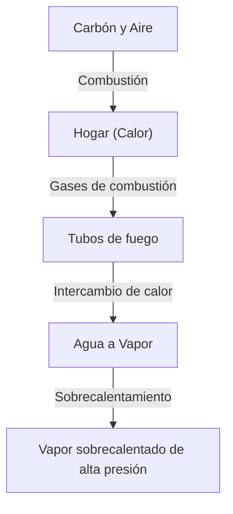

La locomotora de vapor es un símbolo de la Revolución Industrial que cambió fundamentalmente la historia de la humanidad, representando la culminación de la termodinámica y la ingeniería mecánica. En este artículo, analizamos el proceso desde la combustión del carbón hasta la rotación de ruedas masivas.

## 1. Intercambio de calor en la caldera: El nacimiento de la energía
El corazón de una locomotora de vapor es la caldera. El carbón se quema en el hogar, y los gases de combustión de alta temperatura viajan a través de tubos de fuego largos y estrechos hacia la caja de humo. Los tubos de fuego están rodeados de agua, que hierve por intercambio de calor, convirtiéndose en vapor saturado de alta presión. Pasar a través de un sobrecalentador lo transforma en vapor sobrecalentado aún más denso en energía.

## 2. Cilindro y pistón: De la presión al movimiento alternativo
El vapor de alta presión generado se envía al cilindro a través de la válvula de mariposa. Dentro del cilindro, el vapor se inyecta alternativamente a través de los puertos de vapor, empujando violentamente el pistón hacia adelante y hacia atrás. El vapor expandido se expulsa por la chimenea. Este efecto de tiro promueve aún más la combustión en el hogar, creando un sistema autosostenible.

## 3. Mecanismo de manivela: Del movimiento alternativo al rotatorio
El movimiento alternativo lineal del pistón se transmite a la biela principal a través de la biela del pistón y la cruceta. La biela principal se conecta a la muñequilla del cigüeñal en la rueda motriz, donde el movimiento alternativo se convierte en un movimiento rotatorio suave. Las bielas de acoplamiento conectan múltiples ruedas motrices juntas, generando un inmenso esfuerzo de tracción.

## 4. Engranaje de válvulas Walschaerts: El mecanismo definitivo
El engranaje de válvulas controla con precisión el tiempo de admisión y escape del vapor. El ampliamente utilizado "engranaje de válvulas Walschaerts" emplea una manivela de retorno y un enlace de expansión para ajustar sin problemas la cantidad y el momento del vapor que ingresa al cilindro (corte). Esto equilibra el alto par en el arranque con la eficiencia a altas velocidades, y permite cambiar entre marcha adelante y marcha atrás. El movimiento intrincadamente vinculado de estas bielas es el pináculo de la belleza mecánica.\n