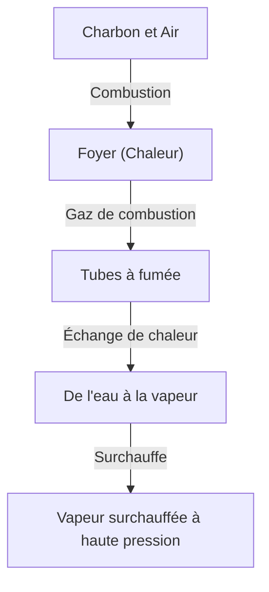

La locomotive à vapeur est un symbole de la révolution industrielle qui a fondamentalement changé l'histoire de l'humanité, représentant l'aboutissement de la thermodynamique et du génie mécanique. Dans cet article, nous disséquons le processus de la combustion du charbon à la rotation de roues massives.

## 1. Échange de chaleur dans la chaudière : La naissance de l'énergie
Le cœur d'une locomotive à vapeur est la chaudière. Le charbon est brûlé dans le foyer et les gaz de combustion à haute température traversent de longs et étroits tubes à fumée vers la boîte à fumée. Les tubes sont entourés d'eau, qui bout par échange de chaleur, devenant de la vapeur saturée à haute pression. Le passage à travers un surchauffeur la transforme en vapeur surchauffée encore plus dense en énergie.

## 2. Cylindre et piston : De la pression au mouvement alternatif
La vapeur à haute pression générée est envoyée dans le cylindre via la soupape de régulateur. À l'intérieur du cylindre, la vapeur est alternativement injectée à travers les orifices de vapeur, poussant violemment le piston d'avant en arrière. La vapeur détendue est évacuée par la cheminée. Cet effet de tirage favorise encore la combustion dans le foyer, créant un système autonome.

## 3. Mécanisme de manivelle : Du mouvement alternatif au mouvement rotatif
Le mouvement alternatif linéaire du piston est transmis à la bielle motrice via la tige de piston et la crosse. La bielle motrice se connecte au maneton de la roue motrice, où le mouvement alternatif est converti en mouvement rotatif continu. Les bielles d'accouplement relient plusieurs roues motrices entre elles, générant un immense effort de traction.

## 4. Distribution Walschaerts : Le mécanisme ultime
La distribution contrôle avec précision la synchronisation de l'admission et de l'échappement de la vapeur. La "distribution Walschaerts", largement utilisée, emploie une contre-manivelle et une coulisse pour ajuster en douceur la quantité et le moment de la vapeur entrant dans le cylindre (détente). Cela équilibre le couple élevé au démarrage avec l'efficacité à grande vitesse, et permet de passer de la marche avant à la marche arrière. Le mouvement complexe de ces bielles est le summum de la beauté mécanique.\n