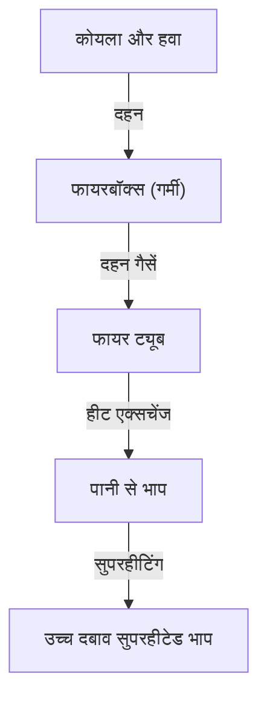

भाप इंजन औद्योगिक क्रांति का एक प्रतीक है जिसने मानव इतिहास को मौलिक रूप से बदल दिया, जो ऊष्मप्रवैगिकी और मैकेनिकल इंजीनियरिंग की परिणति का प्रतिनिधित्व करता है। इस लेख में, हम कोयले के दहन से लेकर विशाल पहियों के घूमने तक की प्रक्रिया का विश्लेषण करते हैं।

## 1. बॉयलर में हीट एक्सचेंज: ऊर्जा का जन्म
भाप इंजन का दिल बॉयलर है। फायरबॉक्स में कोयला जलाया जाता है, और जिसके परिणामस्वरूप उच्च तापमान वाली दहन गैसें लंबी, संकीर्ण फायर ट्यूबों के माध्यम से स्मोकबॉक्स की ओर जाती हैं। फायर ट्यूब पानी से घिरे होते हैं, जो हीट एक्सचेंज के माध्यम से उबलता है, उच्च दबाव वाला संतृप्त भाप बन जाता है। सुपरहीटर से गुजरने से यह और भी अधिक ऊर्जा-सघन सुपरहीटेड भाप में बदल जाता है।

## 2. सिलेंडर और पिस्टन: दबाव से पारस्परिक गति तक
उत्पन्न उच्च दबाव वाली भाप को थ्रॉटल वाल्व के माध्यम से सिलेंडर में भेजा जाता है। सिलेंडर के अंदर, स्टीम पोर्ट के माध्यम से भाप को बारी-बारी से इंजेक्ट किया जाता है, जो पिस्टन को हिंसक रूप से आगे और पीछे धकेलता है। विस्तारित भाप चिमनी के माध्यम से बाहर निकल जाती है। यह ड्राफ्ट प्रभाव फायरबॉक्स में दहन को और बढ़ावा देता है, जिससे एक आत्मनिर्भर प्रणाली बनती है।

## 3. क्रैंक तंत्र: पारस्परिक से घूर्णी गति तक
पिस्टन की रैखिक पारस्परिक गति पिस्टन रॉड और क्रॉसहेड के माध्यम से मुख्य रॉड में प्रेषित होती है। मुख्य रॉड ड्राइविंग व्हील पर क्रैंकपिन से जुड़ती है, जहां पारस्परिक गति चिकनी घूर्णी गति में परिवर्तित हो जाती है। साइड रॉड कई ड्राइविंग पहियों को एक साथ जोड़ते हैं, जिससे अत्यधिक ट्रैक्टिव प्रयास उत्पन्न होता है।

## 4. वाल्शर्ट्स वाल्व गियर: अंतिम तंत्र
वाल्व गियर भाप के सेवन और निकास के समय को ठीक से नियंत्रित करता है। व्यापक रूप से इस्तेमाल किया जाने वाला "वाल्शर्ट्स वाल्व गियर" सिलेंडर में प्रवेश करने वाली भाप (कटऑफ) की मात्रा और समय को मूल रूप से समायोजित करने के लिए रिटर्न क्रैंक और विस्तार लिंक को नियोजित करता है। यह उच्च गति पर दक्षता के साथ स्टार्टअप पर उच्च टोक़ को संतुलित करता है, और आगे और पीछे के बीच स्विच करने की अनुमति देता है। इन छड़ों का जटिल रूप से जुड़ा हुआ आंदोलन यांत्रिक सुंदरता का शिखर है।\n