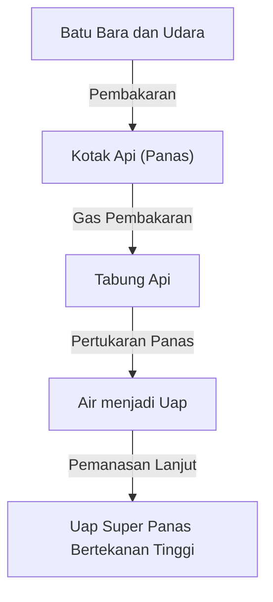

Lokomotif uap adalah simbol Revolusi Industri yang secara fundamental mengubah sejarah manusia, mewakili puncak termodinamika dan teknik mesin. Pada artikel ini, kami membedah proses dari pembakaran batu bara hingga putaran roda besar.

## 1. Pertukaran Panas di Boiler: Kelahiran Energi
Jantung lokomotif uap adalah boiler. Batu bara dibakar di kotak api, dan gas pembakaran bersuhu tinggi yang dihasilkan bergerak melalui tabung api yang panjang dan sempit menuju kotak asap. Tabung api dikelilingi oleh air, yang mendidih melalui pertukaran panas, menjadi uap jenuh bertekanan tinggi. Melewati superheater mengubahnya menjadi uap super panas yang lebih padat energi.

## 2. Silinder dan Piston: Dari Tekanan ke Gerakan Bolak-balik
Uap bertekanan tinggi yang dihasilkan dikirim ke dalam silinder melalui katup throttle. Di dalam silinder, uap secara bergantian disuntikkan melalui port uap, dengan keras mendorong piston bolak-balik. Uap yang mengembang dibuang melalui cerobong asap. Efek draf ini selanjutnya mendorong pembakaran di kotak api, menciptakan sistem yang mandiri.

## 3. Mekanisme Engkol: Dari Gerakan Bolak-balik ke Putar
Gerakan bolak-balik linier dari piston ditransmisikan ke batang utama melalui batang piston dan crosshead. Batang utama terhubung ke crankpin pada roda penggerak, di mana gerakan bolak-balik diubah menjadi gerakan putar yang halus. Batang samping menghubungkan beberapa roda penggerak bersama-sama, menghasilkan upaya traksi yang sangat besar.

## 4. Roda Gigi Katup Walschaerts: Mekanisme Utama
Roda gigi katup secara tepat mengontrol waktu masuk dan keluarnya uap. "Roda gigi katup Walschaerts" yang banyak digunakan menggunakan engkol balik dan tautan ekspansi untuk menyesuaikan jumlah dan waktu uap yang memasuki silinder (cutoff) dengan mulus. Ini menyeimbangkan torsi tinggi saat startup dengan efisiensi pada kecepatan tinggi, dan memungkinkan peralihan antara maju dan mundur. Pergerakan batang-batang yang terkait erat ini adalah puncak dari keindahan mekanis.\n