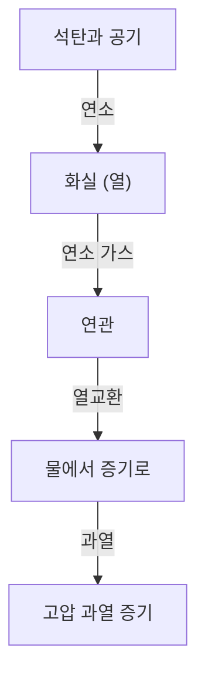

증기 기관차는 인류의 역사를 근본적으로 바꾼 산업혁명의 상징이며, 열역학과 기계 공학의 결정체입니다. 이 글에서는 석탄의 연소부터 거대한 바퀴의 회전에 이르기까지의 과정을 해부합니다.

## 1. 보일러에서의 열교환: 에너지의 탄생
증기 기관차의 심장부는 보일러입니다. 화실에서 석탄을 연소시키고, 발생한 고온의 연소 가스가 가늘고 긴 연관을 통과하여 연실로 향합니다. 연관 주위에는 물이 채워져 있으며, 열교환을 통해 물은 끓어 고압의 포화 증기가 됩니다. 또한 과열기를 통과함으로써 에너지 밀도가 더 높은 과열 증기로 변합니다.

## 2. 실린더와 피스톤: 압력에서 왕복 운동으로
발생한 고압 증기는 가감변을 거쳐 실린더로 보내집니다. 실린더 내에서는 스팀 포트에서 번갈아 증기가 주입되어 피스톤을 앞뒤로 격렬하게 밀어냅니다. 팽창을 마친 증기는 배기로서 굴뚝으로 방출되지만, 이때의 드래프트 효과가 화실의 연소를 더욱 촉진하는 자기 완결적인 시스템으로 되어 있습니다.

## 3. 크랭크 기구: 왕복 운동에서 회전 운동으로
피스톤의 직선적인 왕복 운동은 피스톤 로드와 크로스헤드를 통해 주연봉(메인 로드)에 전달됩니다. 주연봉은 동륜의 크랭크 핀에 연결되어 있으며, 여기서 왕복 운동이 부드러운 회전 운동으로 변환됩니다. 연결봉(사이드 로드)에 의해 여러 동륜이 연동되어 거대한 견인력을 만들어냅니다.

## 4. 왈샤트식 밸브 기어: 궁극의 메커니즘
증기의 흡배기 타이밍을 정확하게 제어하는 것이 밸브 장치(밸브 기어)입니다. 특히 널리 보급된 '왈샤트식 밸브 기어'는 리턴 크랭크와 가감 링크를 사용하여 실린더로의 증기 유입량과 타이밍(컷오프)을 무단으로 조정합니다. 이를 통해 발진 시의 큰 토크와 고속 주행 시의 효율성을 양립시키고, 전진과 후진의 전환도 가능하게 합니다. 그 복잡하게 연동되는 로드류의 움직임은 기계미의 극치라고 할 수 있습니다.\n