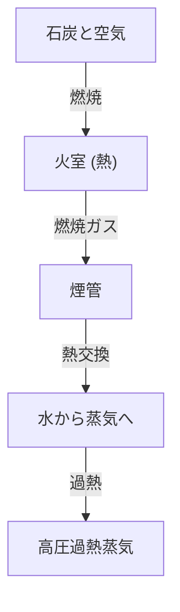

蒸気機関車は、人類の歴史を根本から変えた産業革命の象徴であり、熱力学と機械工学の結晶です。本記事では、石炭の燃焼から巨大な車輪の回転に至るまでのプロセスを解剖します。

## 1. ボイラーでの熱交換：エネルギーの誕生
蒸気機関車の心臓部はボイラーです。火室（ファイヤーボックス）で石炭を燃焼させ、発生した高温の燃焼ガスが細長い煙管（えんかん）を通って煙室へ向かいます。煙管の周囲には水が満たされており、熱交換によって水は沸騰し、高圧の飽和蒸気となります。さらに過熱器を通ることで、よりエネルギー密度の高い過熱蒸気へと変化します。

## 2. シリンダーとピストン：圧力から往復運動へ
発生した高圧蒸気は、加減弁を経てシリンダーに送り込まれます。シリンダー内では、スチームポートから交互に蒸気が注入され、ピストンを前後に激しく押し出します。膨張し終えた蒸気は排気として煙突から放出されますが、この際のドラフト効果が火室の燃焼をさらに促進する自己完結型のシステムとなっています。

## 3. クランク機構：往復運動から回転運動へ
ピストンの直線的な往復運動は、ピストン棒とクロスヘッドを介して主連棒（メインロッド）に伝達されます。主連棒は動輪のクランクピンに接続されており、ここで往復運動が滑らかな回転運動へと変換されます。連結棒（サイドロッド）によって複数の動輪が連動し、巨大な牽引力を生み出します。

## 4. ワルシャート式弁装置：究極のメカニズム
蒸気の吸排気タイミングを正確に制御するのが弁装置（バルブギア）です。特に広く普及した「ワルシャート式弁装置」は、リターンクランクと加減リンクを用いて、シリンダーへの蒸気流入量とタイミング（カットオフ）を無段階に調整します。これにより、発進時の大トルクと高速走行時の効率性を両立させ、前進・後進の切り替えも可能にしています。その複雑に連動するロッド類の動きは、機械美の極致と言えます。\n