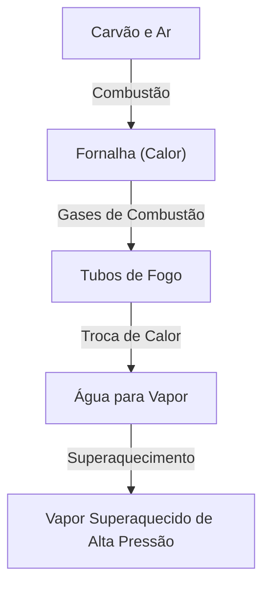

A locomotiva a vapor é um símbolo da Revolução Industrial que mudou fundamentalmente a história humana, representando o culminar da termodinâmica e da engenharia mecânica. Neste artigo, dissecamos o processo desde a combustão do carvão até a rotação de rodas maciças.

## 1. Troca de calor na caldeira: O nascimento da energia
O coração de uma locomotiva a vapor é a caldeira. O carvão é queimado na fornalha, e os gases de combustão de alta temperatura resultantes viajam através de tubos de fogo longos e estreitos em direção à caixa de fumaça. Os tubos de fogo são cercados por água, que ferve por meio de troca de calor, tornando-se vapor saturado de alta pressão. Passar por um superaquecedor o transforma em vapor superaquecido ainda mais denso em energia.

## 2. Cilindro e pistão: Da pressão ao movimento alternativo
O vapor de alta pressão gerado é enviado para o cilindro através da válvula de aceleração. Dentro do cilindro, o vapor é injetado alternadamente através de portas de vapor, empurrando violentamente o pistão para frente e para trás. O vapor expandido é exausto através da chaminé. Esse efeito de tiragem promove ainda mais a combustão na fornalha, criando um sistema autossustentável.

## 3. Mecanismo de manivela: Do movimento alternativo ao rotativo
O movimento alternativo linear do pistão é transmitido para a haste principal através da haste do pistão e da cruzeta. A haste principal se conecta ao pino da manivela na roda motriz, onde o movimento alternativo é convertido em movimento rotativo suave. As hastes laterais ligam várias rodas motrizes juntas, gerando imenso esforço de tração.

## 4. Engrenagem de válvulas Walschaerts: O mecanismo definitivo
A engrenagem de válvulas controla com precisão o tempo de admissão e exaustão do vapor. A amplamente utilizada "engrenagem de válvulas Walschaerts" emprega uma manivela de retorno e um link de expansão para ajustar perfeitamente a quantidade e o tempo do vapor que entra no cilindro (corte). Isso equilibra o alto torque na partida com a eficiência em altas velocidades e permite alternar entre avanço e retrocesso. O movimento intrincadamente ligado dessas hastes é o ápice da beleza mecânica.\n