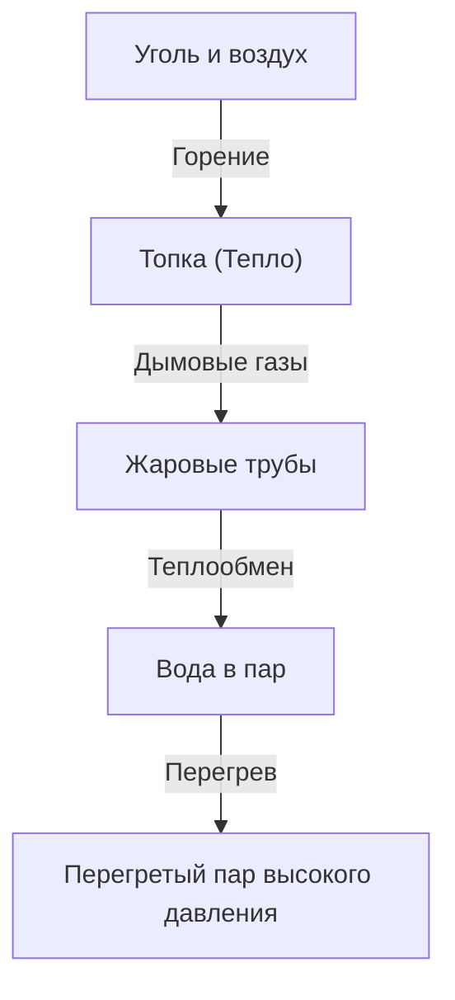

Паровоз — это символ промышленной революции, в корне изменившей историю человечества, представляющий собой кульминацию термодинамики и машиностроения. В этой статье мы подробно разбираем процесс от сжигания угля до вращения массивных колес.

## 1. Теплообмен в котле: Рождение энергии
Сердце паровоза — котел. Уголь сжигается в топке, и образующиеся высокотемпературные дымовые газы проходят через длинные узкие жаровые трубы в дымовую коробку. Трубы окружены водой, которая за счет теплообмена закипает, превращаясь в пар высокого давления. Проходя через пароперегреватель, он превращается в еще более энергоемкий перегретый пар.

## 2. Цилиндр и поршень: От давления к возвратно-поступательному движению
Образующийся пар под высоким давлением поступает в цилиндр через дроссельный клапан. Внутри цилиндра пар попеременно впрыскивается через паровые окна, с силой толкая поршень вперед и назад. Отработанный пар выбрасывается через дымовую трубу. Этот эффект тяги дополнительно стимулирует горение в топке, создавая замкнутую систему.

## 3. Кривошипный механизм: От возвратно-поступательного к вращательному движению
Линейное возвратно-поступательное движение поршня передается на главный шатун через шток поршня и крейцкопф. Главный шатун соединен с кривошипом на ведущем колесе, где возвратно-поступательное движение преобразуется в плавное вращательное. Сцепные дышла связывают вместе несколько ведущих колес, создавая огромное тяговое усилие.

## 4. Парораспределительный механизм Вальсхарта: Совершенный механизм
Парораспределительный механизм точно контролирует время впуска и выпуска пара. Широко распространенный "механизм Вальсхарта" использует контркривошип и кулису для плавной регулировки количества и времени поступления пара в цилиндр (отсечка). Это обеспечивает баланс между высоким крутящим моментом при трогании с места и эффективностью на высоких скоростях, а также позволяет переключаться между передним и задним ходом. Сложно связанное движение этих тяг является вершиной механической красоты.\n