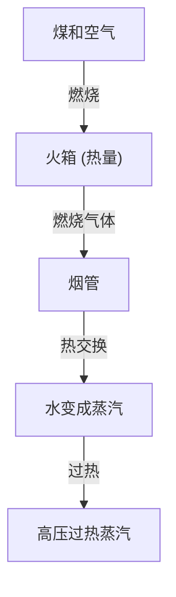

蒸汽机车是从根本上改变人类历史的工业革命的象征，是热力学和机械工程的结晶。在本文中，我们将剖析从煤炭燃烧到巨大车轮旋转的整个过程。

## 1. 锅炉中的热交换：能量的诞生
蒸汽机车的心脏是锅炉。煤炭在火箱中燃烧，产生的高温燃烧气体通过细长的烟管流向烟箱。烟管周围充满水，通过热交换使水沸腾，成为高压饱和蒸汽。通过过热器后，它转化为能量密度更高的过热蒸汽。

## 2. 汽缸和活塞：从压力到往复运动
产生的高压蒸汽通过调节阀送入汽缸。在汽缸内，蒸汽交替地从蒸汽口注入，猛烈地前后推动活塞。膨胀后的蒸汽作为废气从烟囱排出，此时的抽风效应进一步促进了火箱的燃烧，形成一个自给自足的系统。

## 3. 曲柄机构：从往复运动到旋转运动
活塞的直线往复运动通过活塞杆和十字头传递给主连杆。主连杆连接到动轮的曲柄销上，在这里往复运动被转化为平滑的旋转运动。侧连杆将多个动轮连接在一起，产生巨大的牵引力。

## 4. 华氏气门装置：极致的机械机构
气门装置精确控制蒸汽进排气的正时。广泛使用的“华氏气门装置”（Walschaerts valve gear）采用回程曲柄和膨胀连杆，无级调节进入汽缸的蒸汽量和正时（截止）。这平衡了启动时的大扭矩和高速行驶时的效率，并允许在前进和后退之间切换。这些连杆错综复杂的联动运动可以说是机械美的极致。\n