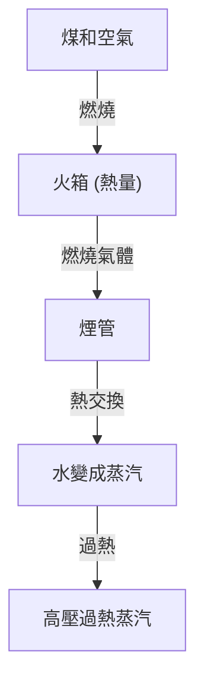

蒸汽機車是從根本上改變人類歷史的工業革命的象徵，是熱力學和機械工程的結晶。在本文中，我們將剖析從煤炭燃燒到巨大車輪旋轉的整個過程。

## 1. 鍋爐中的熱交換：能量的誕生
蒸汽機車的心臟是鍋爐。煤炭在火箱中燃燒，產生的高溫燃燒氣體透過細長的煙管流向煙箱。煙管周圍充滿水，透過熱交換使水沸騰，成為高壓飽和蒸汽。通過過熱器後，它轉化為能量密度更高的過熱蒸汽。

## 2. 汽缸和活塞：從壓力到往復運動
產生的高壓蒸汽透過調節閥送入汽缸。在汽缸內，蒸汽交替地從蒸汽口注入，猛烈地前後推動活塞。膨脹後的蒸汽作為廢氣從煙囪排出，此時的抽風效應進一步促進了火箱的燃燒，形成一個自給自足的系統。

## 3. 曲柄機構：從往復運動到旋轉運動
活塞的直線往復運動透過活塞桿和十字頭傳遞給主連桿。主連桿連接到動輪的曲柄銷上，在這裡往復運動被轉化為平滑的旋轉運動。側連桿將多個動輪連接在一起，產生巨大的牽引力。

## 4. 華氏氣門裝置：極致的機械機構
氣門裝置精確控制蒸汽進排氣的正時。廣泛使用的“華氏氣門裝置”（Walschaerts valve gear）採用回程曲柄和膨脹連桿，無段調節進入汽缸的蒸汽量和正時（截止）。這平衡了啟動時的大扭矩和高速行駛時的效率，並允許在前進和後退之間切換。這些連桿錯綜複雜的聯動運動可以說是機械美的極致。\n