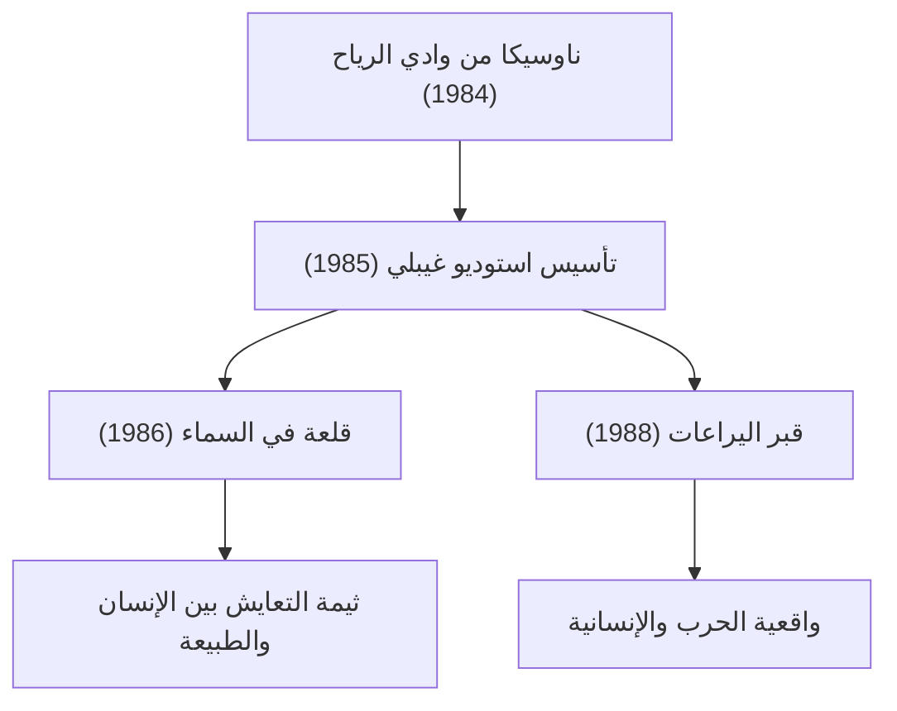

# مسار أفلام غيبلي: رسائل الحياة والطبيعة كما يرسمها التحريك

يتجاوز استوديو غيبلي مجرد كونه شركة لإنتاج الرسوم المتحركة، إذ يحتل مكانة استثنائية وفريدة ليس فقط في اليابان، بل في الثقافة البصرية العالمية ككل. فمنذ تأسيسه في عام 1985، قاد هذا الصرح اثنان من المبدعين العباقرة—هاياو ميازاكي وإيساو تاكاهاتا—ليقدما للعالم سلسلة من الروائع التاريخية الخالدة. نستعرض في هذه المقالة تاريخ استوديو غيبلي، وتطوره التقني، والتحولات في الموضوعات والثيمات المتأصلة في أعماله، مع التعمق فيها من منظور فيزيائي وتاريخي وتقني.

## تأسيس استوديو غيبلي والتحديات الأولى

بدأ تاريخ استوديو غيبلي بالنجاح الباهر الذي حققه فيلم "ناوسيكا من وادي الرياح" (Nausicaä of the Valley of the Wind) الذي عُرض عام 1984. على الرغم من أن هذا العمل أُنتج تقنياً قبل التأسيس الرسمي للاستوديو، إلا أن العمل الجماعي ورأس المال والخبرات التي تم بناؤها خلال مرحلة إنتاجه شكّلت حجر الأساس لتأسيس الاستوديو لاحقاً.

في فيلم "قلعة في السماء" (Laputa: Castle in the Sky) الذي أُنتج مباشرة بعد التأسيس، سعى الاستوديو إلى بلوغ ذروة تقنيات الرسوم المتحركة التقليدية باستخدام شرائح السيلولويد (السل - Cel). وتجلى ذلك بوجه خاص في توظيف تقنيات التركيب البصري المتاحة آنذاك إلى أقصى حد للتعبير عن إشعاع حجر الطيران وتدرجات الغيوم. إن إعادة إنتاج الظواهر الفيزيائية مثل تشتت الضوء وانكساره عبر شرائح السيلولويد المرسومة يدوياً وتطبيق تقنيات الفلاتر أثناء التصوير، أسهمت في رفع المعايير العالمية لصناعة الرسوم المتحركة بشكل ملحوظ في ذلك الوقت.

## النمو الاقتصادي وفانتازيا الحياة اليومية: أواخر الثمانينيات إلى التسعينيات

في الوقت الذي كانت فيه اليابان تعيش ذروة ازدهار "اقتصاد الفقاعة"، خاض استوديو غيبلي تحدياً غير مسبوق عبر العرض المزدوج والمتزامن لفيلمي "جاري توتورو" (My Neighbor Totoro) و"قبر اليراعات" (Grave of the Fireflies). رسم الأول الطبيعة الريفية الهادئة والأرواح في حقبة الثلاثينيات من عصر شووا (خمسينيات القرن الماضي)، بينما وثّق الثاني الواقع المأساوي القاسي في أواخر الحرب العالمية الثانية. ويجسد هذان التياران المتناقضان تماماً الأبعاد المتعددة والعميقة التي يحملها استوديو غيبلي.

من الناحية التقنية، شهدت هذه الفترة تطوراً وصقلاً كبيراً في التعبير عن العمق الفضائي باستخدام كاميرا الطبقات المتعددة (Multiplane camera). تقوم هذه التقنية على تقسيم الخلفيات إلى طبقات متعددة وتحريك كل طبقة بسرعة مختلفة، مما يخلق إحساساً فيزيائياً بالعمق ثلاثي الأبعاد على الشاشة ثنائية الأبعاد (تأثير اختلاف المنظر أو البارالاكس - Parallax effect). وكان هذا الابتكار البصري بمثابة إرهاص مبكر لتمثيل الفضاء والمكان باستخدام تقنيات الرسوم ثلاثية الأبعاد (3DCG) في العصر الرقمي اللاحق.

## علم البيئة والخيال الأسطوري: صدمة "الأميرة مونونوكي"

شكّل فيلم "الأميرة مونونوكي" (Princess Mononoke) الذي عُرض عام 1997 نقطة تحول كبرى لاستوديو غيبلي، سواء من حيث التقنية أو الموضوع. فقد جسد الفيلم صراعاً ضارياً بين آلهة الغابة والبشر، مقدماً رسالة معقدة وعميقة تتجاوز ثنائية الخير والشر التبسيطية.

الأمر الجدير بالملاحظة هنا هو تجسيد ديناميكا السوائل (Fluid dynamics) في الرسوم المتحركة. فقد استُخدمت التقنيات الرقمية (CGI) جزئياً في تصوير التموجات اللزجة للعنة التي تحيط بإله الشر ("تاتاريغامي")، وتطاير الدماء، وحركة تدفق المياه. ومع ذلك، ظل جوهر هذا الإنجاز معتمداً على مراقبة الرسامين لقوانين الفيزياء وإعادة بنائها بأيديهم. إن قدرتهم على الاستيعاب الحدسي لميكانيكا نيوتن وتطويعها بالمبالغة والتحوير الفني—كما في حركة الأجسام ذات اللزوجة، والشعور بكتلة المواد المتهاوية تحت تأثير الجاذبية—أحدثت صدمة وإلهاماً واسعاً بين صناع المحتوى والمبدعين حول العالم.

## الانتقال إلى العصر الرقمي والاعتراف الدولي: "المخطوفة" (رحلة تشيهيرو)

حقق فيلم "المخطوفة" أو "رحلة تشيهيرو" (Spirited Away) في عام 2001 نجاحاً تاريخياً كاسحاً حطم به الأرقام القياسية في شباك التذاكر الياباني، ونال جائزة الأوسكار لأفضل فيلم رسوم متحركة طويل، مما رسخ الاعتراف والمكانة العالمية للاستوديو بصورة حاسمة.

بدءاً من هذا العمل، انتقل غيبلي كلياً من شرائح السيلولويد التقليدية إلى التلوين الرقمي (Digital paint). ومع ذلك، لم يستخدموا التكنولوجيا الرقمية بهدف "زيادة الكفاءة"، بل لـ "توسيع آفاق التعبير الإبداعي". فمن خلال إدخال المحاكاة الفيزيائية الرقمية—مثل التدرجات اللونية اللانهائية، والمعالجة المعقدة لمصادر الضوء، وتجسيد شفافية المياه—ابتكر الاستوديو مسار عمل فريداً يحافظ تماماً على دفء الرسم اليدوي دون أي مساومة.

## ابتكارات إيساو تاكاهاتا وذروة الواقعية: "حكاية الأميرة كاغويا"

بينما كان هاياو ميازاكي يصوغ عوالمه من خلال الفانتازيا، واصل إيساو تاكاهاتا خوض تحديات طليعية تعيد التساؤل باستمرار حول جوهر الرسوم المتحركة وحدودها الفنية. وتجسدت ذروة هذا المسار في تحفته "حكاية الأميرة كاغويا" (The Tale of the Princess Kaguya).

اتبع الفيلم مقاربة سيكولوجية متقدمة من خلال ترك خطوط الرسم متقطعة عن عمد واستخدام ألوان مائية باهتة وشفافة، مما يدفع ذهن المشاهد إلى "استكمال" تفاصيل الصورة لا شعورياً. وفي مشهد الركض الملحمي الذي تتفجر فيه الطاقة الحركية، تم رسم الخلفيات بلمسات فرشاة خشنة وسريعة، ليعكس بصرياً تشوه الفضاء والإحساس المفرط بالسرعة بما يشبه المفاهيم النسبية. كانت هذه التقنية التعبيرية نقيضاً تاماً للواقعية الفوتوغرافية، حيث استغلت ببراعة آليات الإدراك والمعرفة الحسية لدى الإنسان.

## الإرث للأجيال القادمة وآفاق فن الرسوم المتحركة

لا تقتصر أعمال استوديو غيبلي على كونها مجرد ترفيه، بل تواصل طرح أسئلة جوهرية حول القضايا البيئية التي تواجه البشرية، وكيفية التعايش مع التكنولوجيا، والمعنى الحقيقي والأساسي لـ "العيش". إن الانتقال من شرائح السيلولويد إلى الرقمي، والسعي الدؤوب وراء الملمس التناظري الدافئ، والموقف المخلص في مواجهة قضايا العصر—كل هذه المحطات والمسارات تبرهن لنا على الإمكانات اللامحدودة التي يحملها فن الرسوم المتحركة كوسيلة تعبيرية.

في العوالم التي يبدعها غيبلي، تسكن أنفاس الحياة وجمال القوانين الفيزيائية في كل حركة نسيم وكل بريق ماء. وسيظل من واجبنا أن نواصل سبر أغوار الرسائل التي تركوها لنا، ونقل إرثهم وحكاياتهم إلى الأجيال القادمة.
