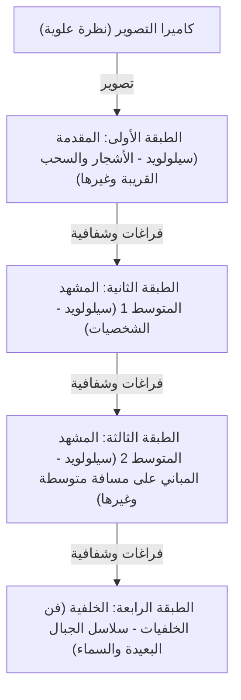
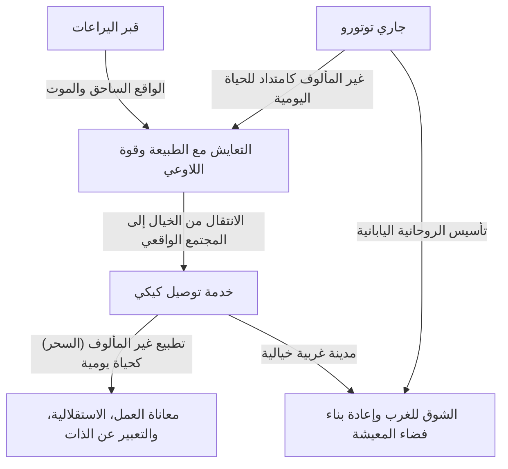
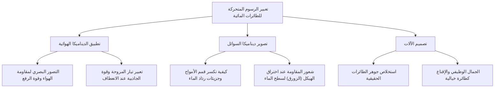
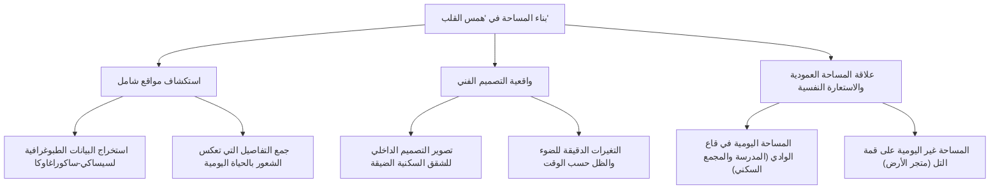
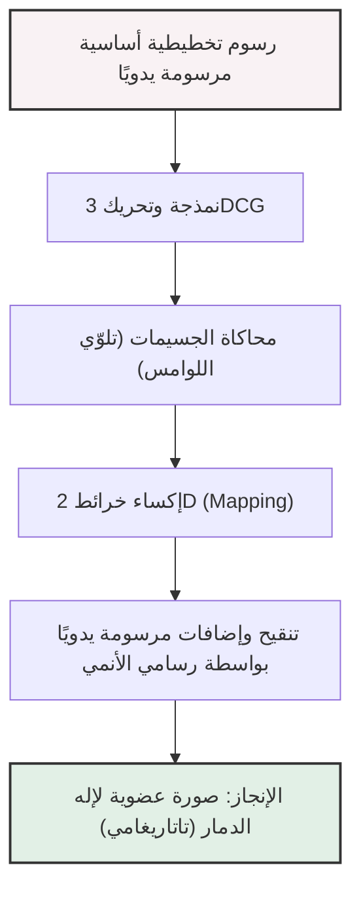
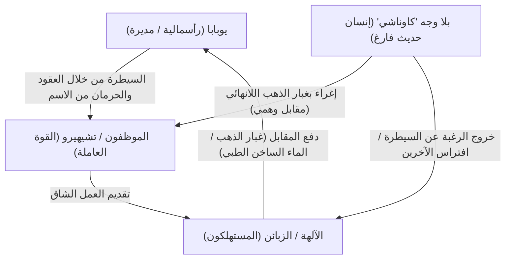
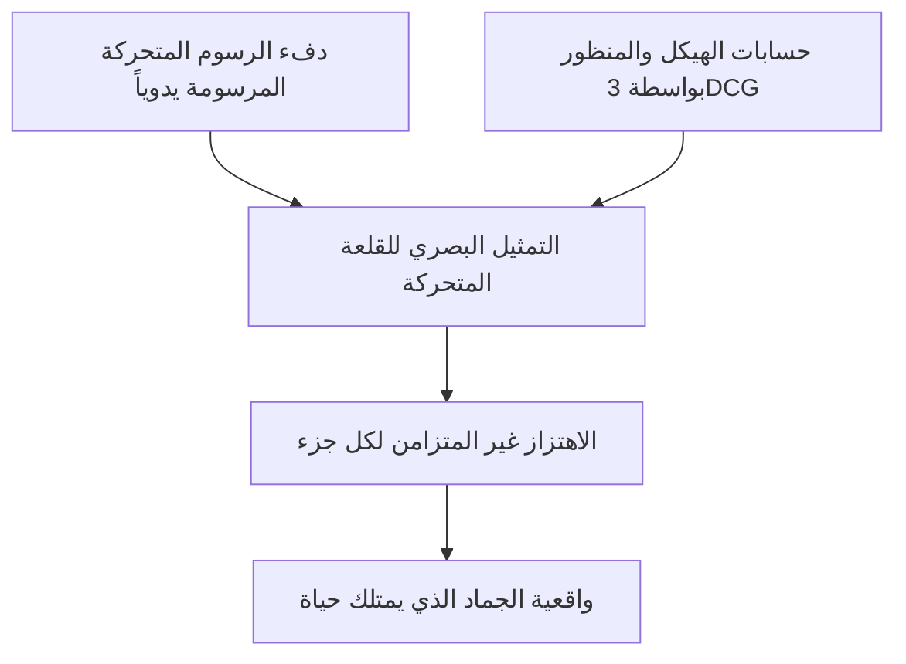
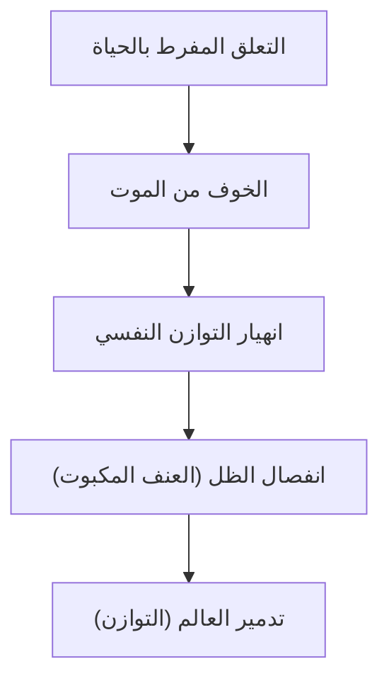
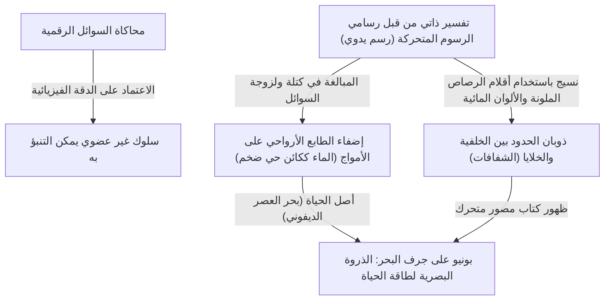
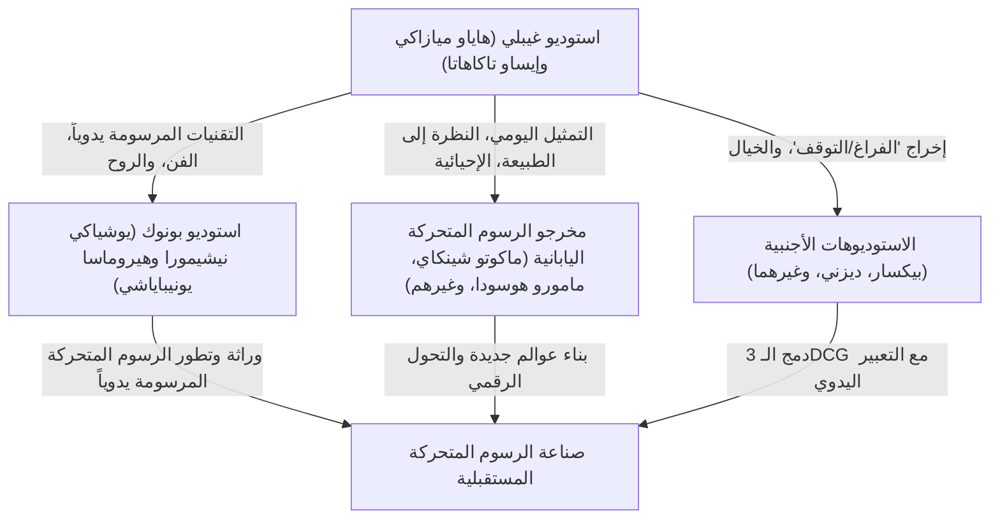

# الفصل الأول: التأسيس والروائع المبكرة (ناوسيكا أميرة وادي الرياح، قلعة في السماء لابوتا)

## 1.1 نقطة التفرد في تاريخ الرسوم المتحركة: ولادة استوديو غيبلي

عند إلقاء نظرة شاملة على صناعة الرسوم المتحركة اليابانية، بل وعلى تاريخ الرسوم المتحركة العالمي، لا يمكن تجاهل "الحادثة" التي وقعت في منتصف الثمانينيات. إنها بالتحديد تأسيس استوديو غيبلي. تاريخ غيبلي ليس مجرد تاريخ شركة أو استوديو إنتاج، بل هو تاريخ ذروة التعبير التي وصلت إليها التكنولوجيا التناظرية المتمثلة في رسم السيلولويد (الرسوم المتحركة بالخلايا)، وتاريخ الاندماج الإعجازي بين "الجماهيرية" و"الفنية" التي يمتلكها وسيط الرسوم المتحركة. في هذا الفصل، سنسرد تفاصيل تأسيس استوديو غيبلي، مع التركيز على نقطة انطلاقه الفعلية في فيلم "ناوسيكا أميرة وادي الرياح" (1984)، وأول عمل يحمل اسم استوديو غيبلي "قلعة في السماء لابوتا" (1986)، ونناقش كيف تمكن العبقريان إيزاو تاكاهاتا وهاياو ميازاكي من اختراق حدود التعبير في الرسوم المتحركة.

عشية تأسيس استوديو غيبلي، كانت الرسوم المتحركة التلفزيونية اليابانية قد تطورت بشكل فريد من خلال تقنية تُعرف بـ "الرسوم المتحركة المحدودة". على عكس الرسوم المتحركة الكاملة بأسلوب ديزني التي تستخدم 24 إطاراً في الثانية بشكل كامل، بدأت هذه التقنية التي تقلل من عدد الإطارات مع استخدام الصور الثابتة وحركة الكاميرا (التحريك الأفقي، الإمالة، إلخ) لخلق ديناميكية كشر لا بد منه لتقليل التكاليف، ولكنها سرعان ما ترسخت كقواعد لغوية بصرية فريدة. ومع ذلك، فإن ما كان يطمح إليه إيزاو تاكاهاتا وهاياو ميازاكي لم يكن لينحصر ضمن هذه الحدود. لقد كانا يتوقان بشدة إلى تحقيق رسوم متحركة تسعى إلى البناء الدقيق للفضاء، وواقعية أداء الحياة اليومية، وقبل كل شيء "الفرح الجذري بالحركة"، وهي مهارات صقلاها منذ أيامهما في استوديو توي أنيميشن (توي أنيميشن حالياً)، وذلك من خلال أسمى صيغة وهي الأفلام الروائية الطويلة.

## 1.2 السمات الإبداعية لإيزاو تاكاهاتا وهاياو ميازاكي: التقاطع الإعجازي بين الموضوعية والذاتية

من أجل فهم أعمال استوديو غيبلي بعمق، من الضروري إدراك طبيعة الموهبتين المختلفتين اللتين تشكلان جوهره، وهما إيزاو تاكاهاتا وهاياو ميازاكي، بالإضافة إلى التفاعل بينهما. كلاهما ينحدران من توي أنيميشن وارتبطا بروابط عميقة من خلال الأنشطة النقابية وغيرها، ولكن ليس من المبالغة القول إن توجهاتهما كمخرجين للرسوم المتحركة كانت على طرفي نقيض.

تتميز إبداعات هاياو ميازاكي بـ "إدراك مكاني ذاتي" ساحق و"شغف مفرط بالحركة". فالشاشات التي يرسمها ميازاكي تتجاوز أحياناً قوانين الفيزياء، إلا أنها تمتلك قوة إقناع شديدة تخاطب الحواس الجسدية للمشاهدين مباشرة. إن الإحساس بالطفو في مشاهد الطيران، والثقل الذي يجعلك تشعر بصدى صوت عميق عند تحرك جسم ذي كتلة هائلة، وتدفقات الرياح الدقيقة ولمعان سطح الماء؛ هذا الإحساس بأن العالم بأسره ينبض ككائن حي هو نتيجة لترسيخ الرؤى الموجودة في عقل ميازاكي على رسوم السيلولويد من خلال أجساد رسامي الرسوم المتحركة. وفي تصميم التخطيط (تكوين الشاشة)، يستخدم ميازاكي بكثرة تشويهات تشبه عدسات الزاوية الواسعة ومنظورات فريدة، ليتحكم ببراعة في عمق الشاشة وخطوط الحركة.

في المقابل، تتميز إبداعات إيزاو تاكاهاتا بـ "موضوعية" تامة و"بناء منطقي". ولأنه مخرج لا يرسم بنفسه، فقد كان قادراً على النظر إلى شاشة الرسوم المتحركة من منظور وصفي أعلى. يركز إخراجه على الوصول بواقعية نفسية الشخصيات، والبنية الاجتماعية، والحركات اليومية التافهة إلى أقصى حدودها. من الترتيب المكاني والإضاءة إلى دوافع الشخصيات، كل شيء مبني على حسابات دقيقة، ورغم أنه يحث الجمهور على التعاطف العاطفي، إلا أنه يمتلك أيضاً تأثيراً تغريبياً بريختياً يجعلهم يراقبون العالم دائماً من منظور متراجع خطوة إلى الوراء.

كان هذا التفاعل بين موهبتي "ميازاكي الذاتي والحدسي" و"تاكاهاتا الموضوعي والمنطقي"، اللذين كانا يكبحان بعضهما البعض ويحترمان بعضهما البعض ليصبحا الركيزة الأساسية لاستوديو واحد، هو الدافع الأكبر وراء إنتاج أعمال غيبلي الغنية. في أعمال غيبلي المبكرة، لعب تاكاهاتا دوراً بالغ الأهمية كمنتج من خلال التحكم في اندفاع ميازاكي وفي الوقت نفسه تعزيز الهيكل الأساسي للعمل.

## 1.3 نقطة التفرد التقني في رسوم السيلولويد وكاميرا المستويات المتعددة

تكمن عظمة استوديو غيبلي ليس فقط في عمق مواضيعه، بل أيضاً في البراعة التقنية الساحقة التي تدعمها. ولا سيما في الفترة من "ناوسيكا" إلى "لابوتا"، كانت تقنية الرسوم المتحركة التناظرية باستخدام السيلولويد تصل إلى شكل من أشكال الكمال، أو "نقطة تفرد تقنية".

ينبع الكم الهائل من المعلومات والواقعية الموجودة في شاشات أعمال غيبلي من فن الخلفيات المرسوم بدقة بالغة، وطبقات السيلولويد المتراكبة في مستويات عدة. وما يجب تسليط الضوء عليه هنا هو ذروة التعبير المكاني باستخدام "كاميرا المستويات المتعددة" (Multiplane Camera).

كاميرا المستويات المتعددة هي جهاز يتكون من عدة طبقات (مستويات) من الزجاج أسفل الكاميرا، يتم فيها وضع رسومات السيلولويد والخلفيات لتصويرها. وبهذه الطريقة، عند تحرك الكاميرا (تحريك أفقي، إمالة، تقريب، وما إلى ذلك)، يمكن تغيير سرعة حركة كل طبقة لإنشاء عمق ثلاثي الأبعاد وهمي (تزيح أو اختلاف المنظر). رغم أن هذه التقنية استخدمت منذ فترة طويلة من قبل استوديوهات مثل ديزني، إلا أن استخدام غيبلي لكاميرا المستويات المتعددة كان استثنائياً في دقته وتعقيده.

تستفيد "مشاهد الطيران" التي لا غنى عنها في أعمال ميازاكي بأقصى قدر من هذه التقنية. فعلى سبيل المثال، الفضاء المعقد الذي يضم بحر السحب الممتد في الأسفل، والقوارب الطائرة التي تنسج طريقها عبرها، والأرض المرئية في العمق؛ كل هذه الطبقات تتدفق بسرعات مختلفة لتمنح الجمهور إدراكاً مكانياً قوياً وانغماساً وكأنهم يطيرون حقاً في السماء. علاوة على ذلك، من خلال تقنية "الضوء النافذ" التي تسلط الضوء من خلف السيلولويد، وتعبيرات التدرج اللوني الدقيقة باستخدام البخاخة، والاستثمار الهائل للجهد الجنوني في تحريك النباتات التي تتأرجح في الريح برسمها يدوياً ورقة ورقة، تبدأ الرياح بالهبوب والهواء بالتدفق في الشاشة. في عصر لم تكن فيه التقنيات الرقمية (CGI) موجودة، استخدموا السحر المتمثل في الأفلام المادية والألوان والضوء لبناء مساحات افتراضية أكثر واقعية من الواقع نفسه.

## 1.4 "ناوسيكا أميرة وادي الرياح" (1984): تحفة خالدة من فترة ما قبل التأسيس وأعماق الإيكولوجيا

فيلم "ناوسيكا أميرة وادي الرياح" الذي عُرض عام 1984، رغم أنه من الناحية الرسمية من إنتاج شركة "توب كرافت" قبل تأسيس استوديو غيبلي، إلا أنه صُنع بتشكيلة مكونة من إخراج هاياو ميازاكي وإنتاج إيزاو تاكاهاتا، ويُعد فعلياً "العمل رقم 0" أو "العمل الأول" الذي حدد اتجاه غيبلي اللاحق.

يعتمد هذا العمل على المانغا التي تحمل نفس الاسم والتي كان هاياو ميازاكي ينشرها في المجلة الشهرية "أنيميج"، لكن النسخة السينمائية أعادت بناء الجزء الأولي منها وجعلتها تكتمل كقصة مستقلة. يتمثل الإنجاز الأكبر الذي حققته "ناوسيكا" في تاريخ الرسوم المتحركة في نجاحها في تصوير مواضيع خيال علمي عميقة جداً مثل "القضايا البيئية (الإيكولوجيا)" و"كرامة الحياة" و"حماقة البشرية"، ضمن إطار ترفيهي، وبجماليات بصرية ساحقة.

بعد مرور 1000 عام على انهيار الحضارة الصناعية بسبب حرب نهاية العالم المعروفة بـ "أيام النار السبعة". يتسع نطاق غابة من الفطريات تُعرف بـ "بحر الفساد" تبعث غازات سامة، وتهيمن حشرات عملاقة على العالم. هذا الإعداد اليائس للعالم يعكس إحساس ميازاكي القوي بالأزمة تجاه الخوف من الحرب النووية خلال الحرب الباردة، والتدمير البيئي المتفاقم. ومع ذلك، لا يقع ميازاكي في فخ الثنائيات البسيطة مثل "حماية الطبيعة" أو "شر البشرية". التحول الكبير في القصة، والذي يكشف أن بحر الفساد هو في الواقع نظام لتنقية الأرض الملوثة، يبرز قدرة الطبيعة المرعبة على التعافي الذاتي، وضآلة الإنسان أمامها.

من الناحية التقنية، لا يمكن الحديث عن "ناوسيكا" دون ذكر التعبير عن الحشرات العملاقة، وعلى رأسها "الأومو". حركة هذه الكائنات الغريبة ذات المفاصل والعيون المتعددة، والتي تتقدم بشكل متموج، تم إنشاؤها من خلال تقنيات رسم خاصة تستخدم المطاط (مثل تحريك أجزاء متعددة من السيلولويد أثناء التصوير) وحسابات توقيت دقيقة، مما أضفى عليها ثقلاً هائلاً ورهبة، فضلاً عن نوع من الجلالة. بالإضافة إلى ذلك، في مشاهد طيران الـ "ميفي" (الآلة الطائرة التي تركبها ناوسيكا)، فإن حركة القماش التي تجعلك تشعر بمقاومة الرياح، والمسار السلس الذي يبدو وكأنه يجسد العلاقة بين الجاذبية والرفع، قد عرّفت العالم على "تطهير الروح من خلال الطيران" الذي يمثل جوهر رسوم ميازاكي المتحركة.

كان تصميم شخصية البطلة "ناوسيكا" مبتكراً أيضاً. فهي ليست مجرد "فتاة بحاجة لمن يحميها"، بل هي محاربة تقود الـ ميفي بنفسها، وتطلق النار، وتلوح بالسيف، وفي الوقت نفسه هي كائن أمومي يحمل عطفاً عميقاً تجاه كل أشكال الحياة. هذه الشخصية المعقدة التي تجمع بين القوة واللطف، والغضب والحزن، أصبحت نقطة ذروة ونقطة انطلاق لصورة البطلة الأنثوية ليس فقط في أعمال غيبلي اللاحقة، بل وفي الخيال المعاصر.

## 1.5 تأسيس استوديو غيبلي و"قلعة في السماء لابوتا" (1986): أقصى درجات المغامرة الحركية

بعد نجاح "ناوسيكا"، وباستخدام أرباحه كرأس مال، تم تأسيس "استوديو غيبلي" رسمياً في عام 1985. كان هدف التأسيس واحداً فقط: "الاستمرار في صنع أفلام رسوم متحركة روائية طويلة عالية الجودة". وُلد غيبلي ليكون قاعدة مستقلة تسعى للوصول إلى جودة لا تقبل المساومة، ليميز نفسه عن الإنتاج الكمي المبتذل في الرسوم المتحركة التلفزيونية.

وفي عام 1986، تم عرض "قلعة في السماء لابوتا" كأول فيلم روائي طويل لا يُنسى يحمل اسم استوديو غيبلي. استند هذا العمل إلى فكرة تصورها هاياو ميازاكي في أيام دراسته الابتدائية، واستوحى من جزيرة لابوتا الطافية في رواية جوناثان سويفت "رحلات غوليفر"، ليجمع كافة العناصر الكلاسيكية المعتادة لقصص المغامرات (فتى يلتقي بفتاة): لقاء بين فتى وفتاة، حجر طيران غامض، قراصنة جويين، وجيش ذو طموحات شريرة، ليكون تحفة فنية يمكن وصفها حقاً بـ "ذروة أفلام الحركة والمغامرات".

تكمن روعة "لابوتا" في الزخم القصصي الذي يحبس الأنفاس، والهوس الاستثنائي بالتفاصيل المنتشرة في كل زاوية من الشاشة. فمنذ المشهد الافتتاحي لهجوم عائلة دورا على المنطاد الجوي (تايغر موث)، إلى مطاردة السكك الحديدية في وادي السلاغ حيث يهرب بازو وشيتا، تظل الشاشة "ديناميكية" باستمرار. التصاميم الميكانيكية لوادي السلاغ، وحركة مكابس المحركات البخارية، ودوران التروس، وانطلاق عربات المناجم. هذه الآلات والمركبات لم تُصوّر كمجرد خلفيات أو إكسسوارات، بل رُسمت بحيوية وكأنها تمتلك حياة خاصة بها. شغف ميازاكي بـ "الآلات" وسعيه لتجسيد "الحرارة والروائح التي تنبعث منها" في رسوماته، أضفى واقعية مذهلة على عالمه الخيالي.

فيما يخص المواضيع، تطرح "لابوتا" قضية "انفصال التكنولوجيا المتقدمة عن الإنسان"، و"الارتباط بالأرض". القوة العلمية الفائقة لإمبراطورية لابوتا التي حكمت العالم ذات يوم كانت في النهاية سبب دمارها. الرؤية في ذروة الفيلم، حيث ترتفع "شجرة عملاقة" تحتضن حجر الطيران العملاق من أعماق لابوتا المنهارة نحو الفضاء، هي رمزية إلى أبعد الحدود. هذه النهاية، حيث تنهار الأشياء الاصطناعية التي ترمز إلى التكنولوجيا، ولا يبقى سوى الشجرة العظيمة التي ترمز للحياة، تتلخص في مقولة شيتا: "لنجذر أنفسنا في الأرض، ولنعش مع الريح. لنتجاوز الشتاء مع البذور، ولنغنِ للربيع مع الطيور. مهما امتلكتم من أسلحة مرعبة، أو تحكمتم في الكثير من الروبوتات البائسة، لا يمكنكم العيش بعيداً عن الأرض." هذا يمثل نقداً لاذعاً من ميازاكي للحضارة الحديثة مستمراً منذ "ناوسيكا"، وصلوات عالمية من أجل العودة إلى الطبيعة.

علاوة على ذلك، فإن إسهام المخرجين الفنيين توشيرو نوزاكي ونيزو ياماموتو في فن الخلفيات لهذا العمل لا يُقدر بثمن. عند الوصول إلى لابوتا، وانقشاع بحر السحب، ليظهر بستان عملاق مكسو بالطحالب مع جنود الروبوتات؛ فإن الجمال الهادئ لهذا المشهد يثبت كيف تحدد رسومات الخلفيات مستوى الرقي في الرسوم المتحركة. هنا تحقق الاندماج المثالي بين إخراج ميازاكي الحركي والفن الساكن للخلفيات.

## 1.6 الخاتمة: بداية الأسطورة

"ناوسيكا أميرة وادي الرياح" و"قلعة في السماء لابوتا". في هاتين التحفتين المبكرتين، استطاع هاياو ميازاكي وإيزاو تاكاهاتا وفريق عمل استوديو غيبلي استخراج الإمكانات الكامنة في أسلوب التعبير بالرسوم المتحركة إلى أقصى حد. لقد أعطوا الآليات الخيالية ثقلاً وملمساً، ونفخوا الواقعية في النظم البيئية المتخيلة، وقاموا بدمج انتقادات اجتماعية معقدة ومواضيع فلسفية داخل ترفيه يحبس أنفاس المشاهدين من جميع الأعمار والأجناس. لقد أنجزوا هذا العمل الجبار الهائل من خلال كميات ضخمة من رسوم السيلولويد، وعمل يدوي يمكن وصفه بجنون الحرفيين.

لقد رفعت هاتان العملان المعايير التقنية والتعبيرية إلى آفاق بعيدة، ليصبحا "جدار غيبلي العملاق" الذي يقف أمام صناعة الرسوم المتحركة اليابانية اللاحقة. وفي الوقت نفسه، كان هذا الاستوديو الصغير يشكل حرفياً "الفصل الأول" من أسطورة ملحمية ستثير فيما بعد ظاهرة ثقافية عالمية وتعيد كتابة تاريخ الرسوم المتحركة نفسه. إن المسارات التي قادت فيما بعد إلى أعمال مثل "جاري توتورو"، "قبر اليراعات"، و"الأميرة مونونوكي"، قد بدأت جميعها من رياح "ناوسيكا" وسماء "لابوتا".

# الفصل الثاني: تقاطع الحياة اليومية وغير اليومية - العالم الذي رسمته أفلام "جاري توتورو"، "قبر اليراعات"، و"خدمة توصيل كيكي"

عند النظر في تاريخ استوديو غيبلي، كان النصف الأخير من الثمانينيات فترة تمثل نقطة تحول حاسمة. فبعد العمل السابق "قلعة في السماء" (1986) الذي صور مغامرة ملحمية تحلق في السماء أو قصة "سيف وسحر"، تحول غيبلي بشكل كبير نحو "الحياة اليومية"، سواء في المناظر الأصلية لليابان أو في حياة عامة الناس في الغرب. في هذا الفصل، سنتناول ثلاثة أعمال: "جاري توتورو" و"قبر اليراعات"، اللذان حققا عرضاً متزامناً إعجازياً في عام 1988، بالإضافة إلى فيلم "خدمة توصيل كيكي" الذي حقق نجاحاً كبيراً في عام 1989. سنقوم بتحليل شامل للثورة التقنية والموضوعية التي حفرتها هذه الأعمال في تاريخ الرسوم المتحركة.

## 1. جنون ومعجزة العرض المتزامن: هياو ميازاكي وإيساو تاكاهاتا، عالمان من "شوا"

في ربيع عام 1988، تحقق شكل من أشكال العرض الذي لا يمكن تصوره اليوم، وهو العرض المتزامن لـ "جاري توتورو" و"قبر اليراعات". لم يكن هذا مجرد تعبئة تجارية، بل كان ثمرة "جنون ومعجزة" أطلقا شرارتها تنظيم استوديو غيبلي، وتحديداً المبدعين العبقريين هياو ميازاكي وإيساو تاكاهاتا.

### 1-1. الحياة والموت ظهراً لظهر
تدور أحداث "جاري توتورو" في قرية يابانية خلال فترة الثلاثينيات من عصر شوا (الخمسينيات)، وهو نشيد للحياة يصور التفاعل بين أرواح الطبيعة والأطفال. من ناحية أخرى، تدور أحداث "قبر اليراعات" في كوبي خلال فترة العشرينيات من عصر شوا (1945) حول نهاية الحرب، حيث يصور بواقعية قاسية الواقع المروع لأخ وأخت يفقدان حياتهما في خضم نيران الحرب. على الرغم من أن الفارق الزمني بين القصتين حوالي عشر سنوات فقط، إلا أن هذين العملين يتضمنان موضوعين متناقضين تماماً ومتلاصقين ظهراً لظهر: "الحياة والموت" و"الخيال المثالي والواقع القاسي".

في ذلك الوقت، أسس استوديو غيبلي نظام إنتاج يمكن وصفه بالمتهور من خلال تفعيل موهبتين ضخمتين في وقت واحد. نشأ صراع على موظفي الرسوم، واقترب الجدول الزمني من حافة الانهيار. ومع ذلك، أدت هذه البيئة القاسية في النهاية إلى رفع جودة العملين إلى أقصى حد. كمعارضة لواقعية تاكاهاتا الدقيقة، بنى هياو ميازاكي عالم "توتورو" بقوة أكبر حيث تنبض قوة الحياة اللاواعية. بالمقابل، وللتنافس مع خيال ميازاكي، ارتقى تاكاهاتا بالتعبير في الرسوم المتحركة اليابانية إلى مستوى وثائقي.

### 1-2. التمييز في رسم عصر شوا وولادة "الرسوم المتحركة الوثائقية"
كان إخراج إيساو تاكاهاتا في "قبر اليراعات" بمثابة تحطيم للقواعد التقليدية للرسوم المتحركة. مسار سقوط القنابل الحارقة الناتجة عن قصف طائرات B-29، تمايل ألسنة اللهب في المنازل المحترقة، وقبل كل شيء، التدهور الجسدي لسيتا وسيتسوكو بسبب الجوع. للتعبير عن ذلك، سعى فريق تصميم الألوان بقيادة ميتشيو ياسودا إلى تحقيق "لون بني صدئ مغطى بالطين والدم والسخام" والذي لم يكن ممكناً التعبير عنه بالكامل بألوان الرسوم المتحركة التقليدية.

في المقابل، في فيلم "جاري توتورو"، أعاد هياو ميازاكي بناء "اليابان الجميلة التي ربما كانت موجودة في الماضي" من ذكرياته. لم يكن ذلك مجرد تصوير واقعي، بل كان محاولة لتثبيت "إشراق" العالم كما يراه الأطفال على لوحات السيلولويد. هذا التمييز في تصوير "شوا" أثبت السعة التعبيرية القصوى لوسيط الرسوم المتحركة، وأصبح معلماً بارزاً في تاريخ السينما اليابانية.

## 2. ثورة الخلفيات الفنية: "الهواء والرطوبة" اللذان خلقهما كازو أوغا ونيزو ياماموتو

القوة المقنعة الساحقة لأعمال غيبلي لا تعتمد فقط على أداء الشخصيات، بل تعتمد بشكل كبير على قوة الخلفيات الفنية التي تمتد وراءها. في هذه الفترة، وصلت الخلفيات الفنية لاستوديو غيبلي إلى إحدى ذرواتها.

### 2-1. الغلاف الجوي الرطب لـ "غابة توتورو" الذي رسمه كازو أوغا
ليس من المبالغة القول إن إنجازات كازو أوغا، الذي تم تعيينه كمخرج فني لفيلم "جاري توتورو"، قد غيرت تاريخ الفن في الرسوم المتحركة اليابانية. الطبيعة التي رسمها أوغا استفادت من خصائص ألوان البوستر (Poster colors) إلى أقصى حد. على الرغم من استخدامه لألوان بوستر معتمة بدلاً من الألوان المائية الشفافة، فقد تمكن من التعبير حتى عن "الرطوبة" الخاصة بالمناخ الياباني، و"رائحة العشب الخانقة"، وحتى "درجة حرارة أشعة الشمس التي تتخلل الأشجار"، وذلك بفضل توازن دقيق للماء ولمسات الفرشاة.

تبرز بشكل خاص الخلفية الفنية في المشهد الذي تلتقي فيه ساتسوكي وماي مع توتورو في محطة الحافلات تحت المطر. ملمس الأسفلت المبلل بالمطر، عمق غابة الضريح الغارقة في الظلام، وطبقات الهواء التي يخلقها ضوء المصباح. لم يكن فن أوغا مجرد "نسخ للمناظر الطبيعية"، بل كان سحراً يصور "المعلومات غير المرئية" مثل الرياح التي تهب هناك، درجة الحرارة، والرطوبة.

### 2-2. الشوق للغرب والواقعية المعمارية
من ناحية أخرى، مدينة كوريكو التي تدور فيها أحداث "خدمة توصيل كيكي"، هي مدينة خيالية تم إنشاؤها بدمج عناصر من مدن أوروبية مختلفة مثل ستوكهولم في السويد، فيسبي في جزيرة غوتلاند، بالإضافة إلى لشبونة وباريس. الخلفيات الفنية هنا كان لها اتجاه معاكس تماماً لتلك في "توتورو" التي صورت المناظر الطبيعية اليابانية.

المباني الحجرية الأوروبية، تسلسل الأسطح القرميدية، والطرق المنحدرة التي تؤدي إلى البحر. من أجل رسم هذه العناصر بقوة إقناع، قام فريق الفن في غيبلي ببحوث موقعية شاملة ودراسة للهياكل المعمارية. حتى ملمس الحجر الواحد تم حساب درجة تآكله وانعكاس أشعة الشمس عليه، وترجمته إلى الألوان التي تبدو الأجمل كخلفية لرسوم متحركة. قدرة هذا الفن على عدم ترك "الشوق للغرب" مجرد خيال، بل تصويره كفضاء يعيش فيه الناس حقاً ويعملون، هي مذهلة.

## 3. الموضوع المعاصر في "خدمة توصيل كيكي": "العمل والركود"

عند إصداره، حظي فيلم "خدمة توصيل كيكي" بدعم حماسي من العديد من الشباب، وخاصة النساء العاملات. السبب في ذلك هو أن هذا العمل، رغم كونه سطحياً قصة خيالية عن "نمو فتاة ساحرة"، كان في جوهره دراما واقعية تتناول موضوع "العمل والموهبة (الركود)" بشكل معاصر وعالمي للغاية.

### 3-1. اللحظة التي تتحول فيها الموهبة إلى "عمل"
تبدأ البطلة كيكي عملاً في خدمة توصيل الطرود مستفيدة من موهبتها السحرية الفطرية في "الطيران في السماء". هذا يتطابق تماماً مع عملية انضمام المبدعين أو العاملين المستقلين المعاصرين إلى المجتمع من خلال استخدام مهاراتهم ومواهبهم كـ "رأس مال". بالنسبة لكيكي في البداية، كان الطيران فرحاً وتعبيراً عن الذات. ولكن عندما يصبح ذلك "عملاً (شغلاً)" وتواجه طلبات غير منطقية من العملاء (مثل حلقة فطيرة الرنجة)، وتتلقى أموالاً كتعويض، يتغير معنى السحر بداخلها.

### 3-2. الركود وفقدان الهوية
في منتصف الفيلم، تفقد كيكي فجأة قدرتها السحرية، وتعجز عن الطيران، كما أنها لا تعود تفهم كلمات قطها الأسود جيجي. هذا يمثل تذبذب هوية فتاة في سن المراهقة، وفي الوقت نفسه هو استعارة مثالية لـ "نضوب الموهبة (الركود)" الذي يواجهه المبدعون.

تلعب أورسولا، طالبة الفن التي ترسم لوحات في كوخ الغابة، دوراً مهماً هنا. تقول أورسولا لكيكي: "في أوقات كهذه، ليس لديك خيار سوى الاستمرار في المحاولة"، "ارسمي، ارسمي، استمري في الرسم"، "إذا لم ينجح ذلك، توقفي عن الرسم. امشي، انظري إلى المناظر، خذي قيلولة، لا تفعلي شيئاً". هذه الكلمات تعبر عن المعاناة التي يواجهها رسامو الرسوم المتحركة، بمن فيهم هياو ميازاكي نفسه، وكل شخص يشارك في الأنشطة الإبداعية، وهي في ذات الوقت وصفة العلاج نفسها.

### 3-3. العزم على "الطيران بالدم"
تتحدث أورسولا عن لوحتها قائلة: "في الماضي، كنت أستطيع الرسم دون التفكير في أي شيء، لكن الأمر مختلف الآن. يجب أن أرسم لوحتي الخاصة بي". سحر كيكي مشابه لذلك. لقد انتهى زمن اللاوعي حيث كانت قادرة على الطيران فقط بموهبتها الفطرية (السحر)، وعليها أن "تستعيد" السحر من خلال إرادتها وجهدها الخاصين. في ذروة الفيلم، المشهد الذي تمتطي فيه كيكي مكنسة خشنة وتطير في السماء بتعابير وجه يائسة، لم يعد خيالاً أنيقاً. إنها تمثل صورة المحترف الحقيقي الذي يواجه حدوده الشخصية ويمارس "تقنيته" بمشاعر تشبه نزف الدم.

## 4. بنية الموضوع والتفاعلات المتبادلة

للوهلة الأولى، يبدو أن كل عمل من هذه الأعمال الثلاثة له عالمه المستقل، ولكن عند النظر من خلال محور الهوية الفنية لغيبلي، نجد استمرارية واضحة وتقاطعاً في الموضوعات.

"غير المألوف (الخيال) الكامن في الحياة اليومية" الذي قدمه "توتورو"، اكتسب طابعاً أسطورياً أقوى من خلال التباين مع الواقعية القصوى في "قبر اليراعات". كما أن أساليب التعبير وتقنيات الرسوم المتحركة التي تم تأسيسها هناك أصبحت سلاحاً قوياً في "خدمة توصيل كيكي" لتصوير الموضوع المتناقض حول "كيف يمكن لكيان غير عادي (ساحرة) أن يندمج في الحياة اليومية (العمل) للمجتمع الحديث".

## 5. الخاتمة: حجر الأساس للمرحلة التالية

خلال هذه الفترة بين عامي 1988 و1989، تجاوز استوديو غيبلي كل الحدود القصوى التي يمكن للرسوم المتحركة أن تصورها، من "الحياة والموت"، "اليابان والغرب"، "الخيال والواقعية"، إلى "الموهبة والعمل"، كل ذلك في غضون سنوات قليلة. التكنولوجيا التي تم تطويرها هنا لمراقبة وتصوير أداء الحياة اليومية بدقة، وقوة الخلفيات الفنية التي تضفي جواً ومشاعر على المناظر الطبيعية، تم توريثها للأعمال اللاحقة ذات الموضوعات المعقدة والموجهة للبالغين بشكل أكبر مثل "مطر الذكريات" (1991) و"بوركو روسو" (1992).

الأعمال الثلاثة "جاري توتورو"، "قبر اليراعات"، و"خدمة توصيل كيكي" ليست مجرد سرد لروائع كلاسيكية. إنها نصب تاريخي يوثق اللحظة الأكثر حرارة وألماً لانبثاق وسيط الرسوم المتحركة وانتقاله من كونه ترفيهاً للأطفال إلى "فن شامل" يصور أعماق الروح البشرية والمعاناة الهيكلية للمجتمع.

# الفصل الثالث: الشوق إلى الطيران ورومانسية البالغين —— ذروة الواقعية في "بوركو روسو" و"همس القلب"

عند استعراض تاريخ استوديو غيبلي، قد تبدو الأعمال التي صدرت في النصف الأول إلى منتصف التسعينيات، مثل "بوركو روسو" (1992) و"همس القلب" (1995)، للوهلة الأولى وكأنها على طرفي نقيض. فالأول هو عمل خيالي تدور أحداثه في البحر الأدرياتيكي، ويصور صراعات وأحزان طيار صائد جوائز تحول إلى خنزير بسبب لعنة، في حين أن الأخير هو دراما شبابية تدور أحداثها في مدينة تاما الجديدة (تاما نيو تاون) المعاصرة، وتصور الحب البريء وصراعات المسار المستقبلي بين فتى وفتاة في المدرسة الإعدادية.

ومع ذلك، فإن ما يجمع بين هذين العملين هو السعي الدؤوب لاستوديو غيبلي، أو بالأحرى للمبدعين الاستثنائيين هاياو ميازاكي ويوشيفومي كوندو، للوصول إلى أقصى درجات "الواقعية" باستخدام أسلوب التعبير المتمثل في الرسوم المتحركة. وفي صميم ذلك، يوجد شوق قوي لـ "الطيران" —— سواء كان الطيران الجسدي في السماء، أو التحليق الروحي متجاوزين حدود الذات. في هذا الفصل، سنتعمق في كيفية احتلال هذين العملين لمكانة فريدة في تاريخ الرسوم المتحركة، والإنجازات الفنية والموضوعية التي حققاها، من خلال استكشاف الخلفية التاريخية والنظريات التقنية.

## 1. "بوركو روسو" —— ذروة الديناميكا الهوائية ورثاء حقبة ضائعة

"بوركو روسو" (الاسم الأصلي: Il Porco Rosso) يتميز بأصوله الفريدة، حيث كان مخططاً له في الأصل أن يكون فيلماً قصيراً يُعرض على متن طائرات الخطوط الجوية اليابانية، لكنه تطور ليصبح فيلماً طويلاً متأثراً بظلال حرب يوغوسلافيا الواقعية الثقيلة. هذا الفيلم هو عمل يحمل لمسة شخصية للغاية، ابتكره هاياو ميازاكي لنفسه، وكـ "فيلم للرجال في منتصف العمر الذين تعبوا وأصبحت خلايا أدمغتهم مثل التوفو".

### 1.1 هاياو ميازاكي والطائرات: الولع بالآلات والوصف الدقيق للديناميكا الهوائية

هوس هاياو ميازاكي بـ "الطيران" معروف جيداً، لكن تصوير الطائرات المائية في "بوركو روسو" يمثل التعبير الأكثر نقاءً عن ولعه الشخصي بالآلات وفهمه العميق للديناميكا الهوائية. الطائرات المائية التي تظهر في هذا العمل —— مثل طائرة سافويا S.21 القرمزية التي يحبها البطل بوركو روسو (وهي تصميم أصلي يمزج بين عناصر من طائرات حقيقية مثل ماكي M.33 وسافويا ماركيتي S.59)، وطائرة منافسه كيرتس، والمجموعة المتنوعة من طائرات اتحاد قراصنة الجو —— ليست مجرد خلفيات أو إكسسوارات، بل تنبض بالحياة كشخصيات مستقلة بحد ذاتها.

ما يستحق الذكر بشكل خاص هو التوازن الرائع في التحكم بين "أكاذيب وحقائق القوانين الفيزيائية" في الرسوم المتحركة، بدءاً من مقاومة الهواء، وقوة الرفع، وعزم الدوران للمروحة، واهتزاز المحرك، وصولاً إلى التعبيرات الديناميكية للسوائل عند الإقلاع والهبوط على سطح الماء.

في المشهد الذي يُشغل فيه بوركو محرك طائرة السافويا، يتم التعبير عن سلسلة العملية بأكملها — بدءاً من اشتعال الأسطوانات، وبدء اهتزاز هيكل الطائرة بأكمله باهتزازات دقيقة، وصولاً إلى خروج الدخان الأسود من أنبوب العادم — من خلال الاهتزازات الدقيقة للوحات السيلولويد والتعريض المتعدد (تقنيات التصوير التناظري في ذلك الوقت). وفي مشاهد المعارك الجوية (Dogfight)، يتم تصوير العبء الجسدي على الطيار وهو يتحمل قوة الجاذبية (G) أثناء الانعطاف، والحركات الدقيقة لعصا التحكم ودواسات التوجيه للتحكم في الطائرة على حافة فقدان الرفع (Stall)، بتوقيت دقيق للغاية (تحديد الإطارات). هذا هو نتيجة تتبع "الحس الجسدي للطيران" الموجود في عقل هاياو ميازاكي بشكل مثالي على السيلولويد من خلال أيدي رسامي الرسوم المتحركة.

### 1.2 مقاومة الفاشية واللاسلطوية التي يتردد صداها في سماء البحر الأدرياتيكي

مسرح هذا العمل هو إيطاليا في أواخر العشرينيات، في منطقة البحر الأدرياتيكي. كخلفية تاريخية، هو عصر من الصخب والقلق حيث لا تزال آثار الحرب العالمية الأولى باقية، ويصعد فيه الحزب الفاشي بقيادة موسوليني. كان بوركو روسو (واسمه الحقيقي ماركو باغوت) طياراً مقاتلاً بارعاً في القوات الجوية الإيطالية، لكنه يئس من نظام الدولة والجيش، فألقى لعنة على نفسه ليصبح خنزيراً، واختار العيش كخارج عن القانون (لاسلطوي) يعمل كصائد جوائز.

مقولة بوركو الشهيرة "أن أكون خنزيراً أفضل من أن أكون فاشياً" ليست مجرد عبارة قاسية ومؤثرة. بل هي رفض للانخراط في جهاز العنف الضخم المسمى بالدولة، وسعي نحو الحرية الشخصية والكرامة في مساحة السماء الخالية من الجنسية، وهي تعبير قوي عن مناهضة الفاشية واللاسلطوية التي يتبناها هاياو ميازاكي نفسه.

في النصف الثاني من الفيلم، يعكس مشهد لقاء بوركو السري في دار السينما مع رفيق سلاحه السابق فيرارين (الذي أصبح الآن رائداً في القوات الجوية الفاشية) الخلفية السياسية للعمل بوضوح. يتذمر فيرارين قائلاً: "يجب علينا الطيران حاملين على ظهورنا رعاة سخيفين كالدولة أو الأمة". هنا، يتم تصوير كيف تتحول المتعة النقية للطيران إلى أداة لأيديولوجية الدولة والحرية بشكل بارد وموضوعي. لا يتم توضيح سبب تحول بوركو إلى خنزير صراحةً، ولكنه يأس عميق من عالم عبثي يقتل فيه البشر بعضهم البعض، وهو آلية دفاعية لعزل نفسه عن مجتمع يزيد من ضغط الامتثال، أو ربما يعمل كتعبير عن مفارقة مفادها "لا يمكنك الحفاظ على كرامتك كإنسان طالما بقيت في هيئة إنسان".

### 1.3 "الخنزير الذي لا يطير هو مجرد خنزير" —— رومانسية الرجال في منتصف العمر، الإحباط، واللعنة

إن ما يجعل "بوركو روسو" يأسر قلوب الكثير من البالغين ولا يتركها هو أن هذا العمل يعتبر مرثاة (Elegy) حزينة على "ما فُقد". يحمل بوركو شعوراً عميقاً بالفقد تجاه رفاق السلاح الذين سقطوا في الحرب العالمية الأولى (مشهد الوهم للطائرات وهي تصعد نحو سهول السحاب هو مشهد خالد في تاريخ السينما)، ويشعر بـ "ذنب الناجي" (Survivor's Guilt).

كما ترمز أغنية الشانسون "زمن الكرز" (Le Temps des cerises) التي تغنيها جينا (والمعروفة كأغنية ترثي سقوط كومونة باريس)، يمتلئ هذا الفيلم بحنين عميق للأيام الخوالي التي مضت، والشباب الذي لا يمكن استعادته أبدًا، والفقدان الذي لا رجعة فيه. إن التصوير الناضج للحب بين بوركو وجينا، مع تلك المسافة التي تمنع تقاطعهما أبدًا، يحتل مكانة فريدة بين أعمال غيبلي. هناك جانب من بوركو يستخدم "اللعنة" كعذر للهروب من حب جينا والمشاركة في المجتمع الواقعي. وراء الشعار الإعلاني "الجاذبية، هي هكذا"، تختبئ قصة مؤلمة عن "تقبل الذات لدى الرجل في منتصف العمر"، قصة تتحدث عن وحدة التضحية من أجل الجماليات الشخصية، وتقبل الذات التي تصبح متخلفة عن العصر.

## 2. "همس القلب" —— الواقعية المؤلمة للمراهقة وسحر المكان

"همس القلب"، الذي صدر عام 1995، هو عمل تذكاري تولى فيه هاياو ميازاكي أدوار الإنتاج والسيناريو واللوحات القصصية، بينما عمل يوشيفومي كوندو، رسام الرسوم المتحركة الأساسي في استوديو غيبلي، كمخرج لفيلم طويل للمرة الوحيدة. على الرغم من أن العمل مقتبس من قصة مصورة للفتيات (شوجو مانغا) تحمل نفس الاسم للمؤلفة أوي هيراغي، إلا أنه، بفضل أيدي ميازاكي وكوندو، تجاوز حدود كونه مجرد قصة حب، ليرتقي إلى صورة واقعية للمراهقة التي تتأرجح بين القلق بشأن المسار المستقبلي، والموهبة، وتحقيق الذات.

### 2.1 نظرة يوشيفومي كوندو: جوهر الرسوم المتحركة الكامن في الإيماءات اليومية

يكمن الجاذب الأكبر لهذا العمل، والذي يمكن اعتباره إنجازاً تقنياً، في اهتمام المخرج يوشيفومي كوندو الدقيق بـ "الأداء اليومي". في عالم الرسوم المتحركة، يعتبر رسم "الحركات اليومية العادية" كالمشي، والجلوس، وصب الشاي، أو الركض صعوداً على الدرج بشكل دقيق وبمصاحبة المشاعر، أصعب بكثير من رسم الحركات "غير العادية (المذهلة)" مثل السحر، والانفجارات، ومعارك الروبوتات.

كان يوشيفومي كوندو مديراً للرسوم في أعمال المخرج إيساو تاكاهاتا (مثل "قبر اليراعات" و"مطر الذكريات")، وكان خبيراً في "أداء الحياة اليومية" الذي يعكس حركة هيكل وعضلات الشخصيات، ونقل مركز الثقل، والحالة النفسية في الحركات. وفي "همس القلب"، تجلت قوة ملاحظته الفائقة بكل وضوح.

على سبيل المثال، التغير في وضعية البطلة شيزوكو تسوكيشيما وهي تقرأ كتاباً في المكتبة، وطريقة خطواتها عندما تنزل الدرج بعجلة، أو تغير نظراتها وطريقة هز كتفيها في تفاعلها مع سيجي أماساوا وهي في حالة مزيج من مشاعر الحب والانزعاج. كل هذه الرسوم المتحركة الدقيقة تخلق إحساساً قوياً بالوجود الواقعي لفتاة تُدعى شيزوكو، وأنها تتنفس حقاً هناك. هذا هو جوهر الرسوم المتحركة الذي يصور "الحياة البشرية" الراسخة على الأرض، وهو يختلف عن متعة التحليق في العوالم الخيالية في أعمال ميازاكي.

### 2.2 استكشاف المواقع وبناء المساحة: "المدينة الحية" في تاما نيو تاون

البطل الآخر في هذا العمل هو المدينة نفسها التي كانت مسرحاً للأحداث. بناءً على عمليات استكشاف مواقع مكثفة في منطقة سيساكي-ساكوراغاوكا في طوكيو (بالقرب من تاما نيو تاون)، تم بناء الخلفيات الفنية للعمل بواقعية مذهلة.

الخلفيات التي رسمها المخرج الفني ساتوشي كورودا وآخرون، تصور ببراعة نسيج الخرسانة البارد للمجمعات السكنية، والمنحدرات الشديدة، والأزقة الضيقة، ومشهد المدينة عند الغسق. وما يلفت الانتباه بشكل خاص هو تصوير "الشقة الضيقة" التي تعيش فيها شيزوكو. الكتب المتناثرة، طاولة الطعام الفوضوية، وغرفة الأختين الضيقة التي تحتوي على سرير بطابقين. هذا التصوير لمساحة المعيشة الواقعية الخانقة (ولكن الدافئة) يدعم توق شيزوكو للتحليق، وهو رغبتها في "الخروج من هنا والذهاب إلى عالم أوسع" (= الدافع لكتابة قصة).

بالإضافة إلى ذلك، فإن طبوغرافيا المدينة (الفرق في الارتفاع) تعمل كاستعارة نفسية ببراعة. فالحياة اليومية لشيزوكو (المدرسة والمجمع السكني) توجد في "الأسفل"، بينما متجر التحف "متجر الأرض" الذي تصل إليه بتوجيه من قط غامض (مون) يقع على "قمة التل" بعد صعود منحدر شديد. هذا الفرق في الارتفاع يمثل بصرياً طموح شيزوكو الروحي للارتقاء، وصعوبة الخطو نحو المجهول.

### 2.3 مصدر الشغف للإبداع وألم تحقيق الذات: "الطيران الداخلي" الذي يقوده البارون

"همس القلب" هو فيلم رومانسي، وفي الوقت نفسه هو "قصة تطوير ذاتي للمبدعين" قوية. في مواجهة سيجي الذي يسعى للدراسة في إيطاليا (الطيران) نحو هدف واضح ليصبح صانع كمان، تشعر شيزوكو بالقلق وتبدأ بكتابة قصة (رواية خيالية تمثل القصة داخل القصة في "همس القلب") من أجل التحقق من "الحجر الكريم الخام" بداخلها.

المثير للاهتمام هنا هو إدراج تسلسل في عالم القصة داخل القصة، حيث "تطير شيزوكو في السماء" مع البارون، القط النبيل. هذا المشهد الخيالي، الذي عمل على خلفياته الفنية الرسام ناوهيسا إينوي المعروف بعالم "إيبلارد"، يصور "الطيران الداخلي" كتحرير للخيال، وهو ما يقف على النقيض من الطيران الجسدي في "بوركو روسو".

ومع ذلك، فإن هذا العمل لا ينتهي كونه مجرد قصة حالمة. فبعد أن قرأ صاحب متجر الأرض الرواية التي كتبتها دون نوم أو راحة، تدرك شيزوكو بمرارة أن عملها خشن وغير ناضج، وتجهش بالبكاء. إن الألم في هذا المشهد، حيث تواجه جدار الإبداع القاسي وتدرك حدود موهبتها (بأن الحجر الخام لا يلمع إذا بقي كما هو)، يمس قلب كل إنسان يعمل في مجال الصنع والإبداع. لقد تجنب هاياو ميازاكي ويوشيفومي كوندو تصوير النجاح السهل، وبدلاً من ذلك صورا أخلاقيات الحرفي الصارمة التي تقول: "ومع ذلك، يجب الاستمرار في النحت والتلميع"، من خلال شخصية فتاة في المدرسة الإعدادية.

## 3. الخاتمة: الطائرات والكمان، قصص "الحرفيين" المتنوعة

"بوركو روسو" و"همس القلب". خنزير في منتصف العمر يحلق في سماء البحر الأدرياتيكي، وطالبة إعدادية تركب دراجتها صعوداً على منحدرات تاما نيو تاون. هاتان القصتان، اللتان تبدوان للوهلة الأولى بلا أي نقاط تماس، ترتبطان بقوة من خلال محور "احترام الحرفية".

فيو والعاملات في شركة بيكولو، اللواتي يقمن بإصلاح وضبط طائرة بوركو المفضلة بشكل مثالي. وكذلك سيجي، الذي يجتهد في التدرب على صناعة الكمان في كريمونا، وصاحب متجر الأرض الذي يستمر في إصلاح الساعات العتيقة. لطالما عزفت أعمال غيبلي، بشكل مستمر، ترنيمة عظمى لأولئك "الحرفيين" الذين يصنعون الأشياء بأيديهم ويستمرون في صقل مهاراتهم.

كما يقاتل بوركو لحماية حرية السماء، تتناول شيزوكو أيضاً الكلمات كسلاح لتنسج صوتها الداخلي (قصتها). "الطيران" المادي و"التحليق" من خلال الخيال. وعلى الرغم من اختلاف طرق التعبير، فإن ذروة الواقعية التي وصل إليها استوديو غيبلي في تلك الفترة، قد رسخت في أشرطة السينما الإرادة السامية للإنسان الذي يقاوم جاذبية العالم الواقعي (قيود المجتمع وحدود الذات)، ومع ذلك يسعى للتحليق عالياً، كل ذلك بجمال بصري آسر. في الفصل التالي، سنناقش الصراع بين الطبيعة والإنسان في فيلم "الأميرة مونونوكي"، الملحمة غير المسبوقة التي ولدت من اندماج هذه الواقعية الشاملة والطبيعية مع الخيال الأسطوري.

# الفصل الرابع: البيئة والخيال الأسطوري (الأميرة مونونوكي)

يُعد فيلم "الأميرة مونونوكي" (Princess Mononoke)، الذي صدر عام 1997، نموذجًا تذكاريًا شكّل نقطة تحول واضحة في مسيرة استوديو غيبلي والمخرج هاياو ميازاكي. لقد تجاوز هذا العمل إطار كونه مجرد فيلم رسوم متحركة، ليُحدث تأثيرًا ثقافيًا وصناعيًا هائلاً لدرجة أنه أعاد كتابة تاريخ السينما اليابانية نفسه. في هذا الفصل، سنعمل على تفكيك وشرح المواضيع المتعددة الطبقات التي يتناولها هذا العمل بأقصى درجات التفصيل - تفكيك تاريخ العصور الوسطى اليابانية، والأبعاد غير المزدوجة للخير والشر، والدمج بين الرسومات الحاسوبية (CG) كَنقطة تحول تقنية والرسوم المتحركة التقليدية على السيلوليد.

## 1. السياق الصناعي: انفجار تكاليف الإنتاج وتحطيم الأرقام القياسية في شباك التذاكر

كان إنتاج فيلم "الأميرة مونونوكي" مشروعًا ضخمًا غير مسبوق راهن فيه استوديو غيبلي على مصير الشركة. منذ البداية، دخل المخرج هاياو ميازاكي المشروع بقرار حازم بأن "هذا قد يكون عملي الأخير قبل التقاعد"، وأدت رؤيته الفنية التي لا تقبل المساومة إلى تضخم فترة الإنتاج والميزانية بلا حدود. ويُقال إن إجمالي تكلفة الإنتاج بلغت حوالي 2 مليار ين، وهو مبلغ كان يُعتبر خارجًا عن المألوف بالنسبة للأفلام اليابانية في ذلك الوقت. وصل عدد الرسوم إلى حوالي 144,000 رسمة، وهو ما يعادل ضعفي أو ثلاثة أضعاف ما تتطلبه أفلام الرسوم المتحركة الطويلة العادية.

ولاسترداد هذه المخاطرة الهائلة، نفذ المنتج توشيو سوزوكي استراتيجية إعلانية ومزيجًا إعلاميًا على نطاق غير مسبوق. الشعار الإعلاني القوي "عِش." (生きろ) الذي صاغه شيغيساتو إيتوي، كان بمثابة إجابة على حالة الانغلاق والشعور بنهاية القرن التي كانت تخيم على المجتمع الياباني آنذاك (صدمات عام 1995 مثل زلزال هانشين أواجي العظيم وحادثة غاز السارين في مترو طوكيو).

ونتيجة لذلك، سجل الفيلم حضور 14.2 مليون مشاهد وإيرادات بلغت 19.3 مليار ين. وقد حطم الأرقام القياسية لإيرادات شباك التذاكر في تاريخ السينما اليابانية في ذلك الوقت (وهو الرقم الذي كان يحتفظ به فيلم "إي تي" E.T.)، ورسّخ مكانة استوديو غيبلي كصانع لـ "أفلام وطنية" في اليابان. أثبت هذا النجاح الصناعي أن الرسوم المتحركة اليابانية يمكن أن تتحول إلى عمل تجاري ضخم حتى وإن تناولت مواضيع عميقة وموجهة للبالغين، وكان له تأثير كبير على نماذج الأعمال في صناعة الأنمي لاحقًا.

## 2. الإعداد الزمني وإعادة البناء الأسطوري: لماذا فترة موروماتشي؟

اختار هاياو ميازاكي عمدًا "فترة موروماتشي"، وهي فترة انتقالية في التاريخ الياباني، لتكون مسرحًا لأحداث هذا الفيلم. إن اختياره لعصر مليء بالفوضى مثل فترة موروماتشي، بدلاً من فترة إيدو (مجتمع مسالم ومنظم حيث كان النظام الطبقي ثابتًا) أو فترة الممالك المتحاربة "سينغوكو" (صراعات القوة بين القادة العسكريين) التي كانت تفضلها الدراما التاريخية التقليدية، كان يحمل نوايا فكرية عميقة.

فترة موروماتشي هي العصر الذي بدأ فيه الانتقال من مجتمع زراعي إلى اقتصاد نقدي، وتطورت فيه الحرف اليدوية، والأهم من ذلك، ظهر فيه "تفوق التكنولوجيا البشرية على الطبيعة" بوضوح. فبينما بدأ إنتاج الحديد (تاتارا) يتخذ طابعًا جديًا وما صاحبه من إزالة للغابات، كانت لا تزال هناك غابات بدائية عميقة في الجبال، وكان يُعتقد بوجود آلهة حقيقية. بعبارة أخرى، لقد كان عصرًا يمثل خطًا حدوديًا حيث تتصادم وتتصارع الإنسانية مع الطبيعة، أو الحداثة مع ما قبل الحداثة.

متأثرًا بشدة بأبحاث المؤرخ يوشيهيكو أمينو حول "غير المزارعين" (الحرفيين، والتجار، والمومسات، والفنانين، وغيرهم) ومفهوم (الملاذ، والحدود المشتركة، والحرية)، قام ميازاكي بتفكيك النظرة المتجانسة التقليدية للتاريخ الياباني كـ "أرض السنابل الوفيرة". يتم تصوير "بلدة الحديد" (تاتارا-با) في الفيلم كنوع من الملاذ الآمن (ملاذ - منطقة حرة) الذي لا يخضع لسيطرة الإمبراطور أو الزعماء الإقطاعيين (الدايميو). هناك، يحقق المرضى المصابون بالجذام (المرضى) والنساء اللواتي تم بيعهن، والذين دُفعوا إلى هوامش المجتمع، استقلالهم من خلال المهارات التكنولوجية المتقدمة لإنتاج الحديد، ويبنون مدينتهم الفاضلة الخاصة (يوتوبيا).

وهكذا، لم يكن فيلم "الأميرة مونونوكي" مجرد خيال، بل كان محاولة لتسليط الضوء على الجوانب المظلمة من التاريخ، وإعادة بناء الهوية اليابانية ونظرتها للطبيعة انطلاقًا من المستوى الأسطوري.

## 3. السيدة إيبوشي وسان: اللاثنائية بين الخير والشر

أكثر ما يميز هذا العمل هو تخليه التام عن النموذج التقليدي لهوليوود أو ديزني القائم على "مكافأة الخير ومعاقبة الشر". فهو لا يدين البشر، الذين هم الجانب المدمر للطبيعة، كـ "شر" محض، بل يصور بقوة سعيهم في الحياة وكرامتهم.

رمز ذلك هو السيدة إيبوشي، زعيمة بلدة الحديد. فهي السبب الرئيسي في تدمير الطبيعة حيث تقتل آلهة الجبال وتزيل الغابات، ولكنها في الوقت نفسه إنسانية بارزة وثورية تحمي المستضعفين الذين تخلى عنهم المجتمع، وتمنحهم هدفًا للعيش وكرامة. إيبوشي لا تدمر الغابة أبدًا من أجل جشع شخصي. فلكي يخرج البشر من الفقر والتمييز ويتمكنوا من العيش باستقلالية، ليس أمامهم خيار سوى قهر الطبيعة وإنتاج الحديد. هذا التناقض المتمثل في "الدوافع الخيرة التي تؤدي في النهاية إلى التعدي على مجال الآخر (الطبيعة)" هو بالضبط جوهر الكارما البشرية (الطبيعة البشرية).

في المقابل، سان (الأميرة مونونوكي) هي فتاة تخلى عنها البشر وربتها ذئاب الجبال. إنها تكره البشر وتستهدف حياة إيبوشي لحماية الغابة، لكنها هي نفسها كائن حدودي لا يمكنه أن يصبح "وحشًا" كاملاً. يقف أشيتاكا بين هاتين العدالتين المتعارضتين - "حق البشر في البقاء" و"قدسية الطبيعة" - ويحاول أن "يرى بعينين غير محجوبتين بالكراهية، ويقرر"، لكنه حتى هو لا يجد حلاً واضحًا.

في نهاية القصة، يستعيد إله الغابة (شيشيغامي) رأسه ويتلاشى، وتُفقد الغابة القديمة. ومع ذلك، تنهار بلدة الحديد أيضًا، ويتعهد الناس بالبدء من الصفر قائلين: "لنجعل من هذا المكان قرية جيدة". يختار أشيتاكا وسان العيش معًا، لكنهما لا يعيشان تحت سقف واحد. حيث يعيش أشيتاكا في بلدة الحديد وسان في الغابة، متخذين شكلاً من أشكال التعايش وهو "الذهاب للزيارة من حين لآخر". هذا هو رفض للتنفيس (الكاثارسيس) السهل للانسجام التام بين الإنسان والطبيعة، وهو رسالة قاسية ولكنها مليئة بالأمل تدعو إلى "العيش" في وسط علاقة من التوتر الأبدي.

## 4. نقطة التحول التقنية: الدمج المتقدم بين الرسوم الحاسوبية (CG) والرسوم المتحركة المرسومة يدويًا

يجب أن يُذكر فيلم "الأميرة مونونوكي" أيضًا كونه العمل الأول الذي تم فيه إدخال الرسومات الحاسوبية (CG) بشكل جدي في استوديو غيبلي. لطالما كان هاياو ميازاكي متمسكًا تمامًا بالمهارات الحرفية للرسم اليدوي (سيل أنيميشن) لسنوات عديدة، ولكن من أجل تحقيق الديناميكية والتعقيد الساحقين اللذين كان يجب التعبير عنهما في هذا العمل، كان إدخال التكنولوجيا الرقمية أمرًا لا مفر منه.

ومع ذلك، لم يكن استخدام غيبلي للـ CG انتقالاً كاملاً إلى الرسوميات ثلاثية الأبعاد (3DCG)، بل كان عبارة عن "تركيب رقمي" و"دمج بين 3D/2D" لتوسيع وتكملة القدرة التعبيرية للرسم اليدوي. وعلى الرغم من أن لقطات الـ CG لم تتجاوز المئة بقليل من أصل 1620 لقطة، إلا أن تأثيرها كان هائلاً.

### تجسيد إله الدمار (تاتاريغامي)

أكثر ما كان رمزيًا وصعبًا من الناحية التقنية هو تجسيد إله الدمار (تاتاريغامي - إله الخنزير الملعون) في بداية الفيلم. إن مشهد اللوامس التي تشبه عددًا لا يحصى من الثعابين (اللعنة الشبيهة بالثعابين) وهي تتلوى وتتشابك كالوحل أثناء تقدمها، كان سيمثل كابوسًا من حيث حجم العمل لرسامي الرسوم المتحركة اليدوية.

هنا اعتمد فريق الإنتاج تقنية تجمع بين محاكاة الجسيمات (Particles) بتقنية 3DCG والرسوم المرسومة يدويًا. أولاً، تم بناء الحركة الأساسية والهيكل العظمي للوامس باستخدام 3DCG، ثم تم إكساءها بنسيج مرسوم يدويًا (Mapping). علاوة على ذلك، قام رسامو الأنمي بإضافة تفاصيل (تنقيح) يدويًا فوق مادة الـ CG، مما أدى إلى محو البرودة الجامدة المميزة للـ CG، والوصول إلى تعبير عضوي وحي، يبدو تمامًا وكأنه "الضغينة" تتجسد.

### الإكساء الرقمي وحركة الكاميرا الديناميكية

ابتكار آخر كان المعالجة الرقمية للخلفيات (الفن). في السابق، في مجال الرسوم المتحركة على السيلوليد، كانت الحركة البانورامية ثلاثية الأبعاد للكاميرا (الدوران) تعتمد على مهارة حرفية متقدمة للغاية (حساب المنظور) تتمثل في رسم الخلفية بشكل مشوه.

في فيلم "الأميرة مونونوكي"، في المشهد الذي يغادر فيه أشيتاكا القرية، والمشهد الذي يعبر عن عمق غابة إله الغابة، تم استخدام تقنية "التخطيط ثلاثي الأبعاد" (3D Mapping) حيث تم لصق خلفيات فنية جميلة رسمها طاقم الفن يدويًا كـ "نسيج" (Texture) على نماذج تضاريس مبنية بتقنية 3DCG. هذا جعل من الممكن الحفاظ على دفء الرسم اليدوي والجمال التصويري، مع توفير عمق مكاني وحركة كاميرا ديناميكية تتحرك بحرية في جميع الاتجاهات، كما هو الحال في الأفلام الحية.

بالإضافة إلى ذلك، فإن دورة الحياة المتمثلة في إنبات النباتات ونموها ثم ذبولها في لحظة تحت أقدام إله الغابة، تم التعبير عنها أيضًا باستخدام تقنية التحول (Morphing) والتركيب الرقمي. وهكذا، فإن الرسومات الحاسوبية في "الأميرة مونونوكي" لم تكن بأي حال من الأحوال تهدف إلى التباهي التكنولوجي، بل عملت كفرشاة (أداة) لا غنى عنها لتثبيت الرؤية الأسطورية والساحرة التي في عقل هاياو ميازاكي على شاشة الواقع.

## الخاتمة

يُمثل فيلم "الأميرة مونونوكي" إحدى أقصى الذرى التي وصل إليها استوديو غيبلي. فعلى الرغم من تجذره العميق في التربة التاريخية للعصور الوسطى اليابانية، إلا أن القضايا البيئية واللاثنائية بين الخير والشر التي يتناولها، أصبحت تكتسب معنى حقيقيًا وأكثر راهنية في المجتمع العالمي الحديث. علاوة على ذلك، يفتخر الجمال البصري الذي دمج بين الرسم اليدوي والرقمي في توازن إعجازي بمستوى لا مثيل له من الاكتمال سواء قبل ذلك أو بعده. في الفصل التالي "الفصل الخامس: السحر اليومي والحنين (المخطوفة / Spirited Away)"، سننتقل من هذا النطاق الأسطوري، لنستكشف التحول الجديد لغيبلي في الغوص داخل المشهد النفسي لفتاة معاصرة.

# الفصل الخامس: الانتقال الرقمي والتقدير العالمي (المخطوفة، عودة القط)

في تاريخ استوديو غيبلي، كانت أوائل العقد الأول من القرن الحادي والعشرين فترة مثلت نقطة التحول الأكثر دراماتيكية من الناحية التكنولوجية والتعبيرية والتجارية. يفصل هذا الفصل من وجهة نظر احترافية كيف دفع الانتقال من الرسوم المتحركة الخلوية (السل) إلى البيئة الرقمية بالكامل التعبير البصري لأعمال غيبلي إلى مناطق غير مسبوقة، وكيف أحدثت ثمرة هذا الانتقال "المخطوفة" (Spirited Away - 2001) وحجر الأساس للجيل القادم "عودة القط" (The Cat Returns - 2002) تقديراً عالمياً وتأثيراً ثقافياً تجاوز حدود اليابان.

## 1. من التناظري إلى الرقمي: التحول النموذجي التكنولوجي لاستوديو غيبلي وإعادة بناء الجماليات

لا يعني "التحول الرقمي" في إنتاج الرسوم المتحركة مجرد تبسيط العمل أو تقليل التكاليف. بل كان تحولاً نموذجياً جذرياً في إنتاج الفيديو، حيث جعل جميع العناصر المرئية الموجودة على الشاشة قابلة للتحكم بالكامل كبيانات رقمية. تم تقديم التكنولوجيا الرقمية في استوديو غيبلي بشكل تجريبي في فيلم "الأميرة مونونوكي" (Princess Mononoke - 1997) من خلال تماوج مخالب إله التاتاري، والملمس شبه الشفاف للديدارابوتشي، وبعض خلفيات 3DCG، تلا ذلك اعتماد التلوين الرقمي بالكامل في فيلم "جيراني عائلة يامادا" (My Neighbors the Yamadas - 1999). ومع ذلك، في أعمال المخرج هاياو ميازاكي، كان فيلم "المخطوفة" هو الأول الذي حقق تماماً المهمة الشاقة المتمثلة في الحفاظ على الملمس الحيوي الذي تميزت به الرسوم المتحركة الخلوية التقليدية مع إعادة بنائها بدقة في الفضاء الرقمي.

مع هذا الانتقال الكامل إلى النظام الرقمي بالكامل، اختفت "الرسوم الخلوية" و"ألوان الرسوم المتحركة" المادية من موقع الإنتاج. تم إنشاء سير عمل حيث يتم مسح الرسوم الأصلية والمتحركة المرسومة على الورق ضوئياً بدقة عالية، ويتم تطبيق التلوين الرقمي على البرنامج. ونتيجة لذلك، تحرروا أخيراً من القيود المادية الخاصة بالعصر التناظري، مثل توهين الضوء المنقول (الظاهرة التي تصبح فيها الصورة مظلمة) الناتج عن تراكب العديد من الرسوم الخلوية المادية، والخدوش على الخلايا أو دخول الغبار.

والأكثر ابتكاراً من ذلك كان التحسن الهائل في القوة التعبيرية خلال عملية "التصوير (التركيب)". أصبح من الممكن التعبير عن عمق متعدد الطبقات يحاكي عدسة كاميرا الأفلام الواقعية، من خلال تقسيم الكائنات على الشاشة (الشخصيات، البزاقة في المقدمة، المباني في الخلفية، التأثيرات، إلخ) إلى طبقات غير محدودة وإعطاء كل منها عمق تركيز (عمق المجال) مختلف. التعبير المكاني الذي كان محدوداً ببضع طبقات في معدات الكاميرا متعددة المستويات في العصر التناظري أصبح من الممكن أن يمتلك طبقات غير محدودة في الفضاء الرقمي، مما جعل الضخامة الشاهقة للحمام (أبويا) والعمق الذي لا يسبر غوره للدرج المؤدي إلى الهاوية يقتربان من أعين الجمهور بمنظور ساحق.

## 2. تصميم الألوان وخيمياء ميتشيو ياسودا: التوسع اللانهائي في التعبير اللوني الذي جلبه التلوين الرقمي بالكامل

العنصر الذي استفاد بشكل أكبر من هذا الانتقال الرقمي هو "اللون". نجحت ميتشيو ياسودا، خبيرة التلوين العبقرية التي لطالما دعمت تصميم الألوان لأعمال هاياو ميازاكي وإيساو تاكاهاتا حتى قبل تأسيس استوديو غيبلي، في إلقاء سحر غير مسبوق على الشاشة من خلال الانتقال الكامل إلى التلوين الرقمي.

في عصر استخدام الألوان المادية، كان هناك حد واضح لعدد الألوان المتاحة. كان الحد الأقصى لعدد أنواع الألوان المستخدمة في عمل واحد حوالي مئات الألوان، وللتعبير عن الظلال المعقدة والتغيرات الدقيقة في الإضاءة المحيطة عند الغسق، لم يكن هناك خيار سوى استهداف تأثيرات الوهم البصري ضمن لوحة ألوان محدودة. ومع ذلك، مع الانتقال إلى البيئة الرقمية، أصبح من الممكن نظرياً التعامل مع عدد لا حصر له من الألوان يبلغ حوالي 16.77 مليون لون (ألوان 24 بت).

في فيلم "المخطوفة"، استخدمت ميتشيو ياسودا هذه اللوحة اللانهائية ليس من أجل "مخططات ألوان مخدرة وغريبة"، بل من أجل "إعادة إنتاج الإضاءة المحيطة بواقعية تامة" و"التعبير الدقيق عن مشاعر الشخصيات". الإضاءة شديدة التلوين للمدينة الغامضة التي تتجول فيها تشيهيرو، و"الحمام" حيث تريح ثمانية ملايين من الآلهة تعبها، ليست مجرد إضاءة مبهرجة. الطريقة التي ينعكس بها ضوء الفوانيس الحمراء بشكل عشوائي على الأرضيات الحجرية المبللة، والظلال الدقيقة التي تسقط على خدي تشيهيرو، والملمس الدهني لطعام العالم الآخر الذي يلتهمه والداها اللذان تحولا إلى خنازير، واللون الأخضر الزمردي الحيوي والشفاف لحراشف هاكو عندما يتحول إلى تنين، كل هذه العناصر تتحكم فيها بشكل دقيق بناءً على تأثير مصادر الضوء عليها، متزامنة مع الوقت من اليوم ورطوبة المكان.

الأمر المذهل بشكل خاص هو "الانسجام" (التناغم) بين الشخصيات والخلفيات الفنية. في العصر التناظري، كان من المحتم أن يكون هناك انقطاع في الملمس بين الخلفيات المرسومة يدوياً والرسوم الخلوية، ولكن مع إدخال التركيب الرقمي، أصبح من الممكن معالجة المرشحات الرقمية الدقيقة لمزج جو الخلفية (الضوء المحيط) مع ألوان الشخصيات. في المشهد حيث يستقلون قطار المحيط متجهين إلى قاع المستنقع، فإن التغير في درجات ألوان السماء وسطح الماء أثناء انتقالها من الغسق إلى وقت حلول الظلام، ثم إلى الليل، مع الظلال شبه الشفافة للركاب التي تسقط هناك، هو قصيدة بصرية في تاريخ الرسوم المتحركة حيث يندمج التحكم الدقيق في التدرج الرقمي بشكل رائع مع الإحساس اللوني الحاد لياسودا.

## 3. الأرواحية اليابانية وفولكلور "الاختفاء الغامض"

السبب في أن هذا العمل حصل على تقدير عالمي لا مثيل له، بالإضافة إلى جماله البصري الساحق، هو أنه تمكن ببراعة من الارتقاء برؤية العالم "الأرواحية" (الإيمان بوجود أرواح في كل شيء) اليابانية للغاية إلى قصة طقوس عبور (مبادرة) لفتاة عصرية.

تبدو الفكرة نفسها المتمثلة في مجيء ثمانية ملايين من الآلهة إلى الحمام للتعافي من إرهاقهم اليومي جديدة وعميقة للغاية من منظور القيم الغربية التوحيدية. المشهد الذي يظهر فيه إله النهر وهو مغطى بالحمأة والدراجات والقمامة الضخمة التي تخلص منها البشر بشكل غير قانوني، ليتحول إلى "روح نتنة" (أوكوساري-ساما)، هو رسالة مباشرة ضد الدمار البيئي الحديث، وفي الوقت نفسه هو تجسيد للمفهوم الجذري في الشنتوية المتمثل في "التطهير من الدنس". ترتبط هذه الزخارف الفولكلورية المحلية (الأصلية) بسلاسة بالقضايا البيئية العالمية (الشاملة).

علاوة على ذلك، وكما يشير عنوان "الاختفاء الغامض" (Kamikakushi)، فإن هذا العمل هو قصة تتجول على الخط الفاصل بين الحياة والموت. إن الملاهي المهجورة التي تقع بعد عبور النفق، ومن هناك الحمام الموجود عبر النهر، هي بوضوح استعارات "للعالم الآخر" أو "العالم السفلي". في الفولكلور الياباني، هناك محرم يُعرف باسم "يوموتسوهيغوي" (تناول طعام العالم السفلي)، والذي ينص على أن من يتعرض للاختفاء الغامض ويأكل من طعام العالم الآخر لا يمكنه العودة إلى عالمه الأصلي. تم دمج هذا المفهوم في المشهد الذي تتلقى فيه تشيهيرو طعاماً غامضاً من هاكو، مما يثبت أن الثقافة الفولكلورية العميقة لهاياو ميازاكي تدعم بقوة الهيكل الأساسي للقصة.

## 4. نظام الحمام (أبويا) والنقد الشامل للرأسمالية والمجتمع الاستهلاكي

على الرغم من أنها تكتسي بتصميم الأرواحية، إلا أن واقع "الحمام" الذي يُعد المسرح الرئيسي للقصة يعمل كاستعارة للبيروقراطية الحديثة للغاية والمجتمع الرأسمالي. إن النمط المعماري للحمام، والذي يبدو وكأنه اندماج بشع بين النمط المعماري شبه الغربي من فترة ميجي والنزل اليابانية التقليدية للينابيع الساخنة (مزيج بين النمطين الياباني والغربي)، يرمز بحد ذاته إلى التحديث الفوضوي لليابان.

هذا الحمام الضخم الذي تتربع يوبابا على قمته هو مجتمع هرمي صارم، وهو مساحة يُحدد فيها كل إجراء من خلال "العقود" و"العمل". أولئك الذين يعملون هنا يُحرمون من "أسمائهم". المشهد الذي يتم فيه اختزال تشيهيرو إلى حرف واحد "سين" هو حرمان من الهوية، واستعارة ثاقبة للعملية التي يتم من خلالها توحيد البشر ليصبحوا "قوة عاملة" و"تروساً" قابلة للاستبدال داخل نظام رأسمالي ضخم. إن القاعدة التي تقضي بأن رفض العمل يؤدي إلى التحول إلى حيوانات (خنازير أو فحم) تواجهنا بالواقع القاسي للمجتمع الحديث المتمثل في أن "من لا يعمل لا يُسمح له بالبقاء".

علاوة على ذلك، تعمل الشخصية الفريدة "بلا وجه" (كاوناشي) التي تظهر في هذا العمل كرمز للأمراض التي ينتجها المجتمع الاستهلاكي الحديث. فهو لا يملك صوتاً خاصاً به، ولا يمكنه التواصل إلا من خلال التلبية اللانهائية لرغبات الآخرين (غبار الذهب). ومن خلال ابتلاع الآخرين، يقوم بتضخيم ذاته من خلال استعارة أصواتهم وشخصياتهم. إن شخصية كاوناشي هذه ليست سوى كاريكاتير للإنسان الحديث الذي فقد التواصل الحقيقي مع الآخرين، ويحاول ملء فراغه الداخلي فقط من خلال الاستهلاك المادي وقوة المال. المشهد الذي يتزاحم فيه موظفو الحمام على الأموال التي ينثرها كاوناشي، ليتم ابتلاعهم في النهاية، يُظهر النظرة النقدية الباردة لهاياو ميازاكي حول كيف تدمر رأسمالية الرغبات الإنسانية وتؤدي إلى انهيار المجتمعات.

## 5. اكتساب التقدير العالمي: الصدمة التي أحدثها الفوز بجائزة الأوسكار وتحقيق أرقام قياسية في شباك التذاكر

فيلم "المخطوفة"، الذي يدمج بين هذه الموضوعات العميقة المتشابكة في طبقات متعددة والجمال البصري الاستثنائي الناتج عن التلوين الرقمي بالكامل، تجاوز بسهولة حدود الرسوم المتحركة كوسيط، ليحفر اسمه في تاريخ السينما العالمية.

في الدورة الثانية والخمسين لمهرجان برلين السينمائي الدولي في عام 2002، تفوق على العديد من روائع الأفلام الواقعية، ليفوز بأعلى جائزة وهي "الدب الذهبي"، ليصبح ثاني فيلم رسوم متحركة في التاريخ يفوز بها (بعد حوالي نصف قرن منذ فيلم "سندريلا"). كان هذا الإنجاز الرائع لحظة تاريخية تم فيها الاعتراف عالمياً بأن الرسوم المتحركة ليست مجرد ترفيه للأطفال، بل هي عمل فني عالي المستوى. علاوة على ذلك، في العام التالي 2003، فاز بجائزة أفضل فيلم رسوم متحركة في حفل توزيع جوائز الأوسكار الخامس والسبعين. في صناعة السينما الأمريكية حيث أصبحت أعمال 3DCG من ديزني وبيكسار هي السائدة، كان لتربع الرسوم المتحركة اليابانية ثنائية الأبعاد المرسومة يدوياً (والتي تتضمن المعالجة الرقمية) على القمة أهمية لا تقدر بثمن.

على وجه الخصوص، لعب تولي جون لاسيتر، الشخصية المركزية في بيكسار والحليف القديم لهاياو ميازاكي، منصب المنتج التنفيذي للنسخة الخاصة بأمريكا الشمالية، دوراً حاسماً في التوسع العالمي لأعمال غيبلي. بفضل جهود لاسيتر، تم إصدار الفيلم في جميع أنحاء الولايات المتحدة عبر شبكة توزيع ديزني، مما رسخ بعمق وجود "Ghibli" (غيبلي) في أذهان المبدعين حول العالم.

في اليابان أيضاً، كان تأثيره الاجتماعي هائلاً. إن إيرادات شباك التذاكر التي بلغت 31.68 مليار ين جعلت منه نجاحاً ساحقاً غير مسبوق، محطماً الرقم القياسي السابق لأعلى إيرادات في تاريخ السينما اليابانية في ذلك الوقت بضعف الرقم تقريباً، وأثار ظاهرة اجتماعية قيل فيها إن "واحداً من كل أربعة مواطنين شاهده في دور السينما". غيّر هذا النجاح بشكل كبير نموذج الأعمال في صناعة السينما اليابانية بأكملها، وأثبت تماماً أن أفلام الرسوم المتحركة تمتلك قوة هائلة في شباك التذاكر تتجاوز الأفلام الواقعية.

## 6. "عودة القط" وتوظيف مخرجين من الجيل القادم: تنويع غيبلي واستقرار النظام الرقمي

مباشرة بعد الحماس التاريخي الذي أحدثه "المخطوفة"، تم إصدار فيلم "عودة القط" من إخراج هيرويوكي موريتا في عام 2002. يُعتبر هذا العمل فيلماً متوسط الطول (مدة العرض 75 دقيقة) يمثل قصة فرعية (Spin-off) كُتبت بواسطة شيزوكو تسوكيشيما، بطلة فيلم "همس القلب"، وله أصل فريد حيث بدأ في مرحلة التخطيط كـ "مشروع القط" المخصص للمتنزهات الترفيهية.

كانت محاولة توظيف مخرجين شباب وخارجيين غير العملاقين اللذين يتمتعان بكاريزما ساحقة، هاياو ميازاكي وإيساو تاكاهاتا، لتنويع خط إنتاج الاستوديو، مهمة صعبة ومهمة دائماً لغيبلي. يجسد فيلم "عودة القط" أسلوباً خفيفاً وسلساً في صناعة الأفلام، وهو ما أصبح ممكناً فقط لأن نظام الإنتاج الرقمي بالكامل قد ترسخ تكنولوجياً داخل الاستوديو.

على النقيض من فيلم "المخطوفة"، الذي أذهل عقول المشاهدين بموضوعاته العميقة وكمية التفاصيل الهائلة، يصور "عودة القط" بلمسة خفيفة ومريحة مغامرة هارو، وهي طالبة مدرسة ثانوية عادية تتجول في عالم آخر (مملكة القطط) يقع بجوار الحياة اليومية مباشرة. يمكننا أن نرى هنا الاستراتيجية طويلة المدى للاستوديو لجعل التكنولوجيا الرقمية تعمل ليس فقط في الأعمال "الضخمة والعميقة"، بل أيضاً كبنية تحتية لإنتاج "أعمال خيالية أنيقة" بجدول زمني مستقر وجودة عالية.

علاوة على ذلك، فإن براعة السيناريو الذي كتبته ريكو يوشيدا، وتصميم الشخصيات الجذابة مثل البارون (البارون هامبرت فون جيكينجن) وموتا، وطريقة التعامل مع موضوع "من لا يستطيع أن يعيش وقته الخاص، يفقد نفسه (يتحول إلى قط)" كانت كلها ممتازة. للوهلة الأولى، يبدو الفيلم وكأنه مغامرة أكشن كوميدية مشرقة، لكن الخوف من أن فقدان الحق في تقرير المصير يؤدي إلى تغيير الهوية (التحول إلى قط) هو في الواقع موضوع حديث للغاية يتقاطع مع الخوف من "فقدان الاسم" في "المخطوفة"، ويجب أن يحظى بتقدير كبير لكونه قد تم هضمه ببراعة ضمن إطار ترفيهي.

## 7. ملخص الفصل الخامس: النقطة المدهشة التي وصل إليها دمج التقاليد والابتكار

كانت أوائل العقد الأول من القرن الحادي والعشرين فترة ذهبية لاستوديو غيبلي، حيث تقاطع "الابتكار" التكنولوجي (الانتقال إلى بيئة الإنتاج الرقمي بالكامل) و"التقاليد" التعبيرية (الملمس الحيوي للرسوم المتحركة المرسومة يدوياً والأرواحية اليابانية) في توازن معجزة، ووصلت إلى آفاق غير مسبوقة.

لم تُستخدم التكنولوجيا الرقمية في غيبلي أبداً كمجرد أداة لتبسيط العمل أو لتسطيح الصور (مثل رسومات 3DCG التي تقلد الرسوم الخلوية ببساطة). بل تم ترويضها تماماً لتكون "الأداة الأرقى لتحرير قوة الخطوط المرسومة بيد الإنسان وإمكانيات الرسم من القيود المادية، وجعلها أكثر عمقاً وثراءً". كما أثبت تصميم الألوان لميتشيو ياسودا بشكل مثالي، فإن التكنولوجيا المتطورة لا تصل إلى ذروتها الفنية الحقيقية إلا عندما تقترن بالحس الجمالي الاستثنائي للحرفيين المهرة.

القوة الساحقة للرؤية الفنية والعالمية التي طرحها "المخطوفة"، والقدرة الإنتاجية المستقرة للاستوديو وإمكانيات تعاقب الأجيال والتنويع التي أظهرها "عودة القط". بعد هذا العصر المضطرب، حطم استوديو غيبلي تماماً قالب كونه مجرد استوديو للرسوم المتحركة في دولة واحدة، وتحول إلى علامة تجارية عالمية فريدة تقود التعبير السينمائي العالمي. ومع ذلك، فإن هذا النمو الهائل غير المسبوق والشهرة العالمية فرضا في الوقت نفسه بشكل هادئ مهمة ثقيلة ومستمرة في عمق الاستوديو: التحدي التالي (والذي لا يزال يزعج غيبلي حتى اليوم) المتمثل في "التخلص من النظام الذي يعتمد بشكل مفرط على العبقرية الاستثنائية لهاياو ميازاكي".

# الفصل السادس: مناهضة الحرب والحب، وآليات السحر (قلعة هاول المتحركة، حكايات من الأرض بحر)

## مقدمة: فجر عصر جديد لجيبلي وعالم مضطرب

في منتصف العقد الأول من القرن الحادي والعشرين، كان استوديو جيبلي يقف عند نقطة تحول كبرى. المخرج هاياو ميازاكي، الذي أرسى معلماً بارزاً في تاريخ السينما اليابانية من خلال فيلم "المخطوفة" (Spirited Away)، حاز على جائزة الأوسكار ورسخ سمعته العالمية بشكل لا يتزعزع. ولكن، تحت قدميه، كان العالم الحقيقي يضطرب بشدة. من الهجمات الإرهابية المتزامنة في عام 2001 التي أدت إلى الحرب على الإرهاب، إلى اندلاع حرب العراق في عام 2003. بينما كان العالم يُبتلع في دوامة من الانقسام والعنف، اتجهت أنظار ميازاكي بشكل مباشر أكثر نحو "الحرب وحماقة الإنسان".

في الوقت نفسه، كان التحدي الهائل المتمثل في تعاقب الأجيال يتجلى بوضوح داخل استوديو جيبلي نفسه. في هذا الفصل، سنقوم بدراسة متعمقة لعملين يحتلان مكانة فريدة جداً في تاريخ جيبلي: "قلعة هاول المتحركة" (2004)، حيث جسد ميازاكي غضبه الشديد تجاه حرب العراق وقبول "الشيخوخة" بتقنيات رسوم متحركة مذهلة، وفيلم "حكايات من الأرض بحر" (2006)، الذي شكل الظهور الإخراجي الأول لنجل ميازاكي الأكبر، غورو ميازاكي، في تعيين استثنائي، وتحدى التعبير عن موضوعات فلسفية والنزاع مع المؤلفة الأصلية. سنستكشف هذين العملين من جوانبهما التقنية والتاريخية والموضوعية إلى أقصى درجات العمق.

---

## "قلعة هاول المتحركة": ذروة الـ "ستيم بانك" وصرخة مناهضة للحرب

على الرغم من استناد الفيلم إلى رواية الأطفال "قلعة هاول المتحركة" للكاتبة ديانا وين جونز، إلا أن هاياو ميازاكي ضخ فيه أسلوبه الفني القوي، وبنى قصة أصلية تختلف بشكل كبير عن العمل الأصلي. إنها في الوقت نفسه قصة حب ملحمية تدور في عالم يمتزج فيه السحر بالآلات، وفيلم لاذع مناهض للحرب.

### 1. آليات القلعة المتحركة ونقطة التحول في تقنيات الرسوم المتحركة

بطل الرواية الحقيقي لهذا العمل هو "القلعة المتحركة" التي يحمل الفيلم اسمها. التعبير الحركي لهذه القلعة يمثل نقطة تحول حاسمة بالنسبة لاستوديو جيبلي، وبشكل أوسع، في دمج الرسوم المتحركة المرسومة يدوياً مع رسومات الكمبيوتر ثلاثية الأبعاد (3DCG).

تصميم القلعة عبارة عن بنية خيمرية غريبة، حيث تم تجميع عدد لا يحصى من الأجزاء الخردة معاً، بما في ذلك المدافع والمنازل والمداخن والتروس وأرجل مشي تشبه أرجل طائر عملاق. هذا هو ذروة تصميم الميكانيكا بأسلوب الـ "ستيم بانك" الذي يتفوق فيه ميازاكي. صرير المعادن، وصمامات نفث البخار، ومظهرها أثناء المشي، الذي هو أخرق ولكنه فكاهي بطريقة ما، يفيض بإحساس الحياة ككائن حي ضخم.

النقطة التقنية الجديرة بالذكر هي النهج المتبع لحل تحدي كيفية تحريك هذا الهيكل العملاق المعقد للغاية. استفاد جيبلي بشكل كامل من تقنيات 3DCG المزروعة في أعمال مثل إله تاتاري في "الأميرة مونونوكي" وفيلم "المخطوفة"، لبناء حركات القلعة الأساسية باستخدام CG. ومع ذلك، لم يكن الأمر مجرد عرض لنموذج ثلاثي الأبعاد، بل قاموا بتركيب نسيج وتفاصيل مرسومة يدوياً بدقة فوقه. أدى هذا إلى دمج "النسيج المرسوم يدوياً الدافئ" الفريد لجيبلي و"تغيرات المنظور الديناميكية وثلاثية الأبعاد الخاصة بـ CG" بشكل كامل.

كل جزء من الأجزاء المكونة للقلعة (أجزاء المنزل، والتروس، والأرجل، إلخ) يهتز ويصدر صريراً ويتشوه بتوقيتات مختلفة وفقاً لتأثير المشي. إن عملية حساب هذه "الاهتزازات غير المتزامنة" وجعلها تعمل كرسوم متحركة تطلبت جهداً يمكن وصفه بالجنون. في المشاهد النهائية حيث تنهار القلعة ويتم إعادة بنائها مرة أخرى، يتم التعبير ببراعة عن صراع قوى الجاذبية والسحر من خلال متجهات حركة كل جزء على حدة.

### 2. ظل حرب العراق: رسالة ميازاكي القوية المناهضة للحرب

أثناء إنتاج "قلعة هاول المتحركة"، بدأ الغزو العسكري الأمريكي للعراق في العالم الحقيقي. كان ميازاكي يحمل غضباً وخيبة أمل غير مسبوقين تجاه هذه الحرب. ألقت هذه المشاعر بظلال داكنة وقوية في جميع أنحاء هذا العمل.

لا يتم تصوير الحرب التي تظهر في هذا العمل كصراع للعدالة بين دول معادية محددة بوضوح. لا يُشرح للمشاهدين أبداً من هو العادل ومن هو الشرير؛ كل ما يتم تصويره بشعور طاغ من اليأس هو الطائرات العسكرية الغريبة التي تغطي السماء، وتقصف المدن عشوائياً، وتحولها إلى بحر من النيران. إن رعب هذا "الدمار بلا سبب" هو بالضبط ما يضرب في جوهر الحروب الحديثة.

يهرب البطل، هاول، من تجنيد الجيش كساحر، لكنه يتحول ليلاً إلى شكل يشبه وحش طائر عملاق ويتوجه منفرداً إلى ساحات القتال لتدمير السفن الحربية والقاذفات لكلا البلدين. ومع ذلك، كلما استخدم قوته، كلما فقد إنسانيته واقترب من أن يصبح وحشاً كاملاً. هذه استعارة لكيفية أن تناقض "العنف من أجل السلام" يؤدي في النهاية إلى تآكل وتدمير روح الفرد. في المشهد الذي ينظر فيه هاول إلى المدينة المحترقة ويبصق بكلماته: "سواء كانوا حلفاء أم أعداء، هؤلاء قتلة"، تتداخل صرخة ميازاكي المفجعة تجاه حرب العراق مباشرة.

في أعمال ميازاكي السابقة (مثل "ناوسيكا أميرة وادي الرياح" و"الأميرة مونونوكي")، تم طرح موضوع كيفية العيش وسط الصراع. أما في "هاول"، فإن الموقف السائد هو الرفض التام: "الحرب في حد ذاتها حماقة مطلقة، والمشاركة فيها تعني موت الروح".

### 3. التدفق البصري لـ "الشيخوخة" و"الشباب": ما تعنيه لعنة صوفي

تعبير رائد آخر في هذا العمل هو "التدفق العمري" للبطلة صوفي. أُصيبت صوفي بلعنة من ساحرة النفايات، فتحولت من فتاة تبلغ من العمر 18 عاماً إلى عجوز في التسعين. ومع ذلك، مع تقدم القصة، يستمر مظهرها في التغير بسلاسة من امرأة عجوز إلى فتاة، ومن فتاة إلى امرأة في منتصف العمر، تزامناً مع تقلباتها العاطفية وحالتها العقلية.

في الرسوم المتحركة، يعتبر عدم تثبيت إعداد (تصميم) الشخصية تحدياً غير عادي للغاية. عندما قام مخرج الرسوم المتحركة أكيهيكو ياماشيتا وآخرون برسم صوفي العجوز، لم يكتفوا بإضافة التجاعيد فحسب، بل لاحظوا بتمعن وصوروا تدهور الهيكل العظمي والعضلات، والأهم من ذلك "التغيير في الوضعية بالنسبة للجاذبية". عندما كانت صوفي عجوزاً، كان ظهرها منحنياً، وكان مشيها مصحوباً بالثقل. ومع ذلك، عندما تحاول حماية هاول، أو عندما تستعيد ثقتها وتتحدث بقوة، يستقيم ظهرها، وتختفي تجاعيدها، وحتى نبرة صوتها تصبح أصغر سناً (وقد ساهمت هنا القدرة التمثيلية المذهلة لتشيكو بايشو كممثلة صوتية بشكل كبير).

استخدم هاياو ميازاكي هذه الخدعة البصرية لتصوير موضوع "الشيخوخة ليست مجرد ظاهرة جسدية، بل هي أيضاً حالة نفسية". حتى قبل إلقاء اللعنة عليها، كانت صوفي تعاني من تدني احترام الذات، وكانت منغلقة القلب، وباطنياً كانت قد "شاخت" بالفعل. اللعنة عكست باطنها على مظهرها الخارجي لا أكثر. ولكن من المفارقات أن تحررها من الصفة الاجتماعية لكونها "امرأة عجوز"، جعلها قادرة على التصرف بجرأة وحيوية أكثر مما كانت عليه في أيام طفولتها.

هذا التعبير عن "التدفق العمري" هو ذروة التصوير النفسي الذي يستفيد إلى أقصى حد من خاصية الرسوم المتحركة المتمثلة في "القدرة على تغيير الشكل بحرية"، ويقدم تصوراً في غاية الجمال لمسار الروح البشرية التي تستعيد تأكيد الذات من خلال الحب.

---

## "حكايات من الأرض بحر": الظهور الأول لغورو ميازاكي وفلسفة الظل

في عام 2006، بعد عامين من "قلعة هاول المتحركة"، قام استوديو جيبلي بتحويل الرواية الخيالية العالمية "حكايات من الأرض بحر" للكاتبة أورسولا ك. لي جوين إلى فيلم رسوم متحركة. ولكن من جلس على مقعد المخرج لم يكن هاياو ميازاكي، بل نجله الأكبر، غورو ميازاكي، الذي لم يكن لديه أي خبرة سابقة في إنتاج الأفلام.

### 1. تعيين استثنائي وخلفية الإنتاج

كان تحويل "حكايات من الأرض بحر" إلى فيلم أمنية عزيزة لدى هاياو ميازاكي منذ فترة طويلة. ولكن عندما منحت المؤلفة الأصلية، لي جوين، أخيرًا الإذن بإنتاج الفيلم، كان هاياو ميازاكي في خضم إنتاج "قلعة هاول المتحركة" ولم يتمكن من تولي الإخراج. لذلك وقع اختيار المنتج توشيو سوزوكي على غورو ميازاكي، الذي كان يعمل حينها مديراً لمتحف جيبلي في ميتاكا، وكان يمتلك مسيرة مهنية كمهندس معماري.

رأى توشيو سوزوكي في اللوحات القصصية (الستوري بورد) التي رسمها غورو عن مواجهة آرين مع التنين "ظلاماً معاصراً وواقعية شبابية غير موجودة لدى هاياو ميازاكي". ومع ذلك، عارض هاياو ميازاكي بشدة هذا القرار، وانهارت العلاقة بين الأب والابن إلى حد القطيعة. كانت مخاوف ميازاكي بأن "الشخص الذي لا يفهم شيئاً عن الرسوم المتحركة لا يمكنه إخراج فيلم" مبررة. وُضع غورو في وضع قاسٍ حيث كان عليه أن يواجه ضغطاً هائلاً وحاجزاً مطلقاً يمثله والده، بينما يقوم بإدارة موظفي جيبلي المخضرمين لتوجيه الإنتاج.

### 2. النزاع مع المؤلفة الأصلية أورسولا ك. لي جوين وجوهره

على الرغم من أن فيلم "حكايات من الأرض بحر" المكتمل حقق نجاحاً تجارياً، إلا أنه أثار عاصفة من الآراء المتباينة من النقاد والمعجبين. كان الأمر الأكثر خطورة هو النزاع الحاسم مع المؤلفة الأصلية لي جوين.

نشرت لي جوين تعليقاً على الفيلم على موقعها الشخصي، وانتقدته ببرود قائلة: "إنه ليس كتابي. إنه فيلمك" (It is not my book. It is your movie.). كان ما أثار قلقها هو أن الموضوعات الحساسة والتأملية للعمل الأصلي تم استبدالها بحركة قصيرة النظر وثنائية الخير والشر.

في الكتاب الأول من "حكايات من الأرض بحر"، "الظل" الذي يواجهه بطل الرواية جيد (سبارو هوك) هو تجسيد لغطرسته وضعفه. في النهاية، لا يهزم جيد هذا الظل، بل يعانقه ويدمجه ليؤسس ذاته الحقيقية. هذه فلسفة عميقة تعتمد على المنهج النفسي اليونغي.

ومع ذلك، في النسخة السينمائية (التي تستند أساساً إلى الكتاب الثالث من السلسلة)، ينفصل ظل البطل آرين الداخلي عنه، ويتم تصويره ككيان منفصل. وقد تركزت الذروة النهائية في معركة جسدية ضد كوب، الساحر الشرير الذي يسعى إلى الخلود. في عيني لي جوين، بدا هذا التعديل وكأنه يضر بشكل كبير بجوهر العمل الأصلي: موضوع "النمو العقلي الداخلي والقبول".

### 3. فلسفة الظل والنور: صراع آرين وأمراض المجتمع الحديث

على الرغم من انتقادات لي جوين والعيوب الهيكلية، يمكن إيجاد قيمة فريدة في "حكايات من الأرض بحر" لغورو ميازاكي، من حيث أنه يعكس بوضوح الأمراض المحددة التي عانى منها الشباب الياباني في العقد الأول من القرن الحادي والعشرين.

يطعن البطل آرين والده (الملك) حتى الموت دون أي سبب ويهرب من البلاد. وهو دائماً يعاني من "قلق مجهول الهوية" وممزق بين التمسك بالحياة والخوف من الموت. تتبع شخصية آرين هذه الحالة النفسية للشباب الذين يرتكبون جرائم بشعة دون أسباب واضحة، أو الذين فقدوا معنى الحياة ويقولون "أريد أن أموت"، وذلك في المجتمع الياباني المنغلق الذي تلى انهيار الفقاعة الاقتصادية.

غالباً ما يتم انتقاد جملة ثيرو التي تعتبر الموضوع الرئيسي للفيلم: "أكره أولئك الذين لا يقدرون الحياة"، لكونها مباشرة للغاية ووعظية. ولكن، بالنظر إلى تجربة غورو ميازاكي في مواجهة المشكلات البيئية كمهندس معماري، واللعنة والصراع كونه ابن السيد العظيم هاياو ميازاكي، فإن إحباط آرين المتمثل في "عدم معرفة ما يجب فعله حتى بحياته الخاصة" كان أيضاً صرخة غورو العميقة.

كما أن الساحر كوب، الذي يطمح إلى الخلود ويسعى لتدمير توازن العالم، هو كاريكاتير للبشرية المعاصرة نفسها التي تحاول إنكار قانون الطبيعة المتمثل في "الموت" من خلال التكنولوجيا والتقنيات الطبية الحديثة. مفارقة أن رفض الموت هو بحد ذاته رفض للحياة. صراع آرين وكوب قد يبدو على السطح كمعركة بين الخير والشر، لكن في جوهره يكمن سؤال وجودي: "كيف نتقبل حياتنا المحدودة".

من حيث تقنيات الرسوم المتحركة، يفتقر الفيلم إلى الإحساس الساحق بالطيران كما في أعمال هاياو ميازاكي، وديناميكية الشخصيات الجماهيرية المفعمة بالحياة في كل تفاصيلها. لكن الفن الخلفي الهادئ (خاصة تصوير البحر العاصف حيث تأكل التنانين بعضها البعض، والألوان الكئيبة لبلدة هورت تاون المدمرة) يعبر بمهارة عن جو مروع لعالم يتجه ببطء نحو الموت.

---

## خاتمة: ثمن السحر وتمريره للجيل القادم

"قلعة هاول المتحركة" و"حكايات من الأرض بحر". هذان العملان هما رمزان للمرحلة الانتقالية حيث وصل استوديو جيبلي إلى مرحلة النضج، وفي الوقت نفسه كان عليه مواجهة القلق بشأن المستقبل.

في فيلم "قلعة هاول المتحركة"، استخدم هاياو ميازاكي سحر الرسوم المتحركة إلى أقصى حد، بينما قام بتصوير رعب استخدام هذا السحر (القوة)، واليأس العميق تجاه العنف الحقيقي للحرب. وعهد بالخلاص من كل ذلك إلى "قبول الشيخوخة" و"الحب غير المشروط".

من ناحية أخرى، في فيلم "حكايات من الأرض بحر"، تحدى غورو ميازاكي قلعة السحر الضخمة التي بناها والده، وعلى الرغم من تعرضه للأذى، حاول التحدث عن "قبول الحياة والموت" بصوته الخاص. ربما كان الأمر أخرقًا، لكنه كان أيضاً فيلماً وثائقياً مؤثراً بمثابة استعارة لاستوديو جيبلي نفسه؛ حول كيفية تعامل الجيل القادم مع إرث أسلافهم وكيف يدمجون ظلالهم الخاصة.

السحر (الرسوم المتحركة) ليس قادراً على كل شيء. ومع ذلك، فإن العمل المتمثل في محاولة رسم الضوء في الظلام مع معرفة حدوده وثمنه، هو بالضبط ما يجسد العظمة الكامنة في أعمال جيبلي في هذا العصر.

(نهاية الفصل السادس)

# الفصل السابع: أصل الحياة والعودة إلى الرسم اليدوي (بونيو على جرف البحر، وآريتي المقترضة)

عند النظر إلى تاريخ استوديو غيبلي، بل وتاريخ الرسوم المتحركة اليابانية بأكمله، فإن الفترة من أواخر العقد الأول من القرن الحادي والعشرين إلى أوائل العقد الثاني منه تبرز كنقطة تحول فنية وفكرية فريدة للغاية. في هوليوود، كانت الرسوم المتحركة ثلاثية الأبعاد بالكامل (3DCG)، المتمثلة في أعمال بيكسار ودريم ووركس، تهيمن كمعيار أساسي في سوق السينما، وحتى في الرسوم المتحركة التلفزيونية والأفلام السينمائية داخل اليابان، أصبحت رقمنة عملية الإنتاج (التلوين الرقمي ورسم الخلفيات والآلات باستخدام 3DCG) موجة لا رجعة فيها وثابتة تمامًا.

في ذلك العصر الذهبي للرقمية الذي كانت تحكمه "الكفاءة والدقة المحسوبة"، اتخذ هاياو ميازاكي واستوديو غيبلي منعطفًا قويًا نحو اتجاه معاكس تمامًا. كان هذا الاتجاه هو "العودة الجذرية إلى الرسوم المتحركة المرسومة يدويًا" و"السعي وراء التعبير البدائي عن الحياة". في هذا الفصل، سنسلط الضوء على جنون الرسوم المتحركة الكلية للسوائل في فيلم المخرج هاياو ميازاكي "بونيو على جرف البحر" (2008)، مع مقارنته بإعادة تعريف الإحساس بالحجم وحركة المنظور الدقيق في العمل الإخراجي الأول لهيروماسا يونيباياشي "آريتي المقترضة" (2010)، لنتعمق في الأبعاد التقنية والفلسفية لكيفية تمكن غيبلي من طبع "نفحة الحياة في الرسوم المتحركة" على شريط الفيلم.

## 1. "بونيو على جرف البحر": جنون نبذ الرسوم الحاسوبية (CG) وظهور "الكتاب المصور المتحرك"

لم ينفِ استوديو غيبلي التقنية الرقمية أبدًا. فقد دمج دائمًا أحدث التقنيات بمهارة في سياق الرسوم المتحركة التقليدية (السيل)، مثل التعبير عن الإله تاتاري وإدخال التلوين الرقمي في "الأميرة مونونوكي" (1997)، والمعالجة المكانية في "المخطوفة" (2001)، وحركة القلعة المعقدة باستخدام 3DCG في "قلعة هاول المتحركة" (2004). ومع ذلك، في فيلم "بونيو على جرف البحر"، اتخذ هاياو ميازاكي قرارًا متعمدًا ومخالفًا لتيار العصر بالاستبعاد التام لاستخدام 3DCG.

كان الأساس وراء هذا القرار هو شعور ميازاكي القوي بالخطر المتمثل في أن "الدقة المفرطة" التي تجلبها التقنية الرقمية كانت تسلب الرسوم المتحركة جاذبيتها الأصلية المتمثلة في "متعة التشويه الفني (ديفورميه)" و"الجسدية التي يضفيها رسامو الرسوم المتحركة على خطوط الرسم". ونتيجة لذلك، تجاوز عدد الإطارات المرسومة في هذا الفيلم 170 ألف إطار، وهو رقم استثنائي وغير مسبوق في أعمال غيبلي. في صناعة الرسوم المتحركة اليابانية التي تعتمد على الرسوم المتحركة المحدودة (Limited Animation)، يُعتبر هذا الكم الهائل من العمل جنونًا لا يمت للعقلانية بصلة.

السمة البصرية الأبرز لهذا العمل هي الإبقاء على اللمسات الخشنة لأقلام الرصاص الملونة والألوان المائية كما هي على الشاشة. في الرسوم المتحركة التقليدية (السيل)، كانت القاعدة الثابتة هي الفصل الواضح بين الشخصيات (السيل) والخلفيات الفنية، مع تلوين السيل بلون موحد صلب. لكن في "بونيو"، تم تذويب الحدود بين الخلفية الفنية والسيل عمدًا. تم تطبيق ضربات أقلام الرصاص الملونة ونزيف الألوان المائية على الخطوط الخارجية للشخصيات أيضًا، مما منح الشاشة بأكملها ملمسًا عضويًا يبدو وكأنه يتنفس ككيان واحد يشبه "كتابًا مصورًا متحركًا". يمكن القول إن هذا هو تعبير غاية في العنف عن أسلوب المؤلف، حيث حطم القواعد السيميائية للرسوم المتحركة وصدم الجمهور بـ "الدهشة البدائية من رؤية الصور تتحرك" بشكل مباشر.

## 2. دمج ديناميكا السوائل مع الأرواحية: التفسير الفيزيائي للأمواج

إن الإنجاز الأكبر الذي حققه "بونيو على جرف البحر" والذي سيخلد في تاريخ تقنيات الرسوم المتحركة هو تمثيل "الماء" و"الأمواج". في صناعة الصور المتحركة الحديثة، يُعتبر تمثيل الماء مجالًا حصريًا للرسوم الحاسوبية (CG) باستخدام محاكاة السوائل (نظام الجسيمات). باستخدام الحسابات الفيزيائية، من السهل توليد بحر شديد الواقعية يكاد لا يمكن تمييزه عن الواقع. ومع ذلك، رفض هاياو ميازاكي ذلك، وبنى كل شيء باستخدام "الخطوط" التي رسمها رسامو الرسوم المتحركة بأقلام الرصاص.

الجدير بالذكر بشكل خاص هو المشهد المذهل في منتصف الفيلم - حيث تركض بونيو فوق أمواج على شكل أسماك قديمة عملاقة وهي تطارد سوسكي. البحر هنا ليس مجرد مائع نيوتني تحكمه معادلات نافييه-ستوكس في ديناميكا السوائل (مجموعة من جزيئات H2O). بدلاً من ذلك، قام مشرف الرسوم المتحركة كاتسويا كوندو وكبار رسامي غيبلي الذين تولوا مسؤولية الرسومات الأصلية بإعادة تفسير سلوك الماء (القصور الذاتي، واللزوجة، والتوتر السطحي، والضغط) بشكل بديهي على أنه "نبض العضلات" أو "الكتلة الثقيلة لكائن حي ضخم".

الأمواج التي تركبها بونيو تتضمن في وقت واحد الديناميكية التي تنفجر عندما يتجاوز التوتر السطحي حدوده، والملمس الهلامي عالي اللزوجة الذي ينبعث من أعماق البحر. من خلال الانحراف المتعمد عن الدقة الفيزيائية واستخدام تصور أرواحي مثل رسم "عيون" ضخمة في قمة الأمواج، يُزرع في ذهن الجمهور شعور قوي بأن "البحر نفسه كائن حي ضخم ذو إرادة". حتى رذاذ الماء عندما تتكسر الأمواج ليس جسيمات منتظمة، بل تم تحريكه بالكامل يدويًا كـ "كائنات حية" تمتلك كل واحدة منها شكلًا غير منتظم. كانت عملية "بث الحياة في الماء" تستنزف أرواح وأجساد رسامي الرسوم المتحركة إلى أقصى حد، لكن النتيجة كانت ولادة مشاهد تاريخية تحمل "حرارة" و"إحساسًا بالوزن" لا يمكن للـ CG إنتاجه أبدًا.

## 3. التراجع إلى أصل الحياة: الانفجار الكامبري والبحر الأم

حتى في بنية القصة وبناء عالم الفيلم، يتجه "بونيو" نحو التراجع إلى الحالة الجذرية للحياة. في أفلام الكوارث العادية، كان سيتم تصوير بلدة سوسكي التي غمرتها العاصفة بالكامل كأثر مأساوي لكارثة. ولكن في هذا العمل، يتم تصويرها كمساحة احتفالية وجميلة للغاية تسبح فيها أسماك قديمة (مثل البرمائيات والأسماك المدرعة من العصر الديفوني، مثل دنكليوستيوس وبوتريوليبس) بهدوء فوق البلدة الغارقة.

هذه المدينة المغمورة الجميلة والشفافة هي استعارة للبحر البدائي الذي ولدت فيه الحياة على الأرض، أو لرحم ضخم مليء بالسائل الأمنيوسي. هنا، يصور هاياو ميازاكي بشكل إيجابي عملية ابتلاع الطبيعة (البحر) -التي تمتلك قوة احتواء مدمرة لا تقاوم- للمجتمع الحضاري الهش (اليابسة) الذي بناه البشر، واندماجهما معًا. وجود بونيو نفسه هو كيان يجسد بسرعة هائلة "شجرة التطور" في التطور الفردي، من سمكة إلى نصف إنسان ونصف سمكة، ثم عبر البرمائيات وصولاً إلى إنسان (مخلوق بري). إن الحجم الهائل للرسوم المتحركة المرسومة يدويًا التي تتخلل الفيلم بأكمله هو تعبير في حد ذاته عن "الطاقة الانفجارية للحظة ولادة الحياة ونبضها"، تمامًا مثل الانفجار الكامبري.

## 4. "آريتي المقترضة": منظور هيروماسا يونيباياشي، ساحر الإحساس بالحجم

إذا كان "بونيو" قد صوّر انفجار قوة الحياة على نطاق كلي (ماكرو) مذهل، فإن "آريتي المقترضة"، الذي صدر بعده بعامين، هو تحفة فنية استكشفت الفيزياء والتعبير البصري في عالم دقيق (ميكرو) تمامًا. هذا الفيلم، وهو أول عمل إخراجي لهيروماسا يونيباياشي، أحد أبرز رسامي الرسوم المتحركة في غيبلي والمعروف بلقب "مارو"، مستوحى من أدب الأطفال لماري نورتون. ومع ذلك، فهو لا يكتفي باستخدام فكرة "أقزام بطول 10 سم" كحيلة خيالية بسيطة، بل يرتقي بها إلى واقعية مذهلة من خلال حسابات دقيقة للحجم وحركة منظورية بالغة الدقة.

إن قدرة المخرج يونيباياشي الفائقة على الإدراك المكاني وتقنيات تخطيط المشاهد (Layout) تحول المنزل الياباني الضخم الذي نعيش فيه بشكل يومي، بطريقة درامية بالنسبة لآريتي والأقزام، إلى "منحدرات قاسية"، و"غابات كثيفة"، و"متاهة واسعة وخطيرة". يستخدمون مسمارًا كوطأة قدم لتسلق جدار ضخم، ويستغلون قوة التصاق شريط لاصق مزدوج للانتقال إلى الأماكن المرتفعة، ويحملون دبوس خياطة كسيف للدفاع عن النفس. هذه الحركات ليست مجرد تصغير لحركات البشر. لقد تم بناؤها كرسوم متحركة مقنعة فيزيائيًا للغاية، بناءً على إعادة تعريف لـ "الجاذبية" و"الملمس" و"القوة العضلية" في نطاق 10 سم.

## 5. براعة ديناميكا السوائل والتصميم الصوتي في النطاق المجهري (الميكروسكيل)

أبرز ما يميز تقنيات الرسوم المتحركة في هذا العمل هو التصور الدقيق للقوانين الفيزيائية في النطاق المجهري (خاصة التغيرات في سلوك السوائل والمساحيق بسبب تأثير الحجم). في ديناميكا السوائل، من المعروف أنه عندما يصبح حجم الجسم صغيرًا جدًا، يصبح تأثير التوتر السطحي وقوى اللزوجة مهيمنًا أكثر من الجاذبية (قوة القصور الذاتي).

على سبيل المثال، تذكر المشهد الذي تسكب فيه هوميلي، والدة آريتي، الشاي من الإبريق. في عالم بحجم الإنسان، يتدفق الماء بسلاسة في خط رفيع متأثرًا بالجاذبية. ومع ذلك، في عالم الأقزام البالغ طولهم 10 سم، يصبح تأثير التوتر السطحي للماء هائلاً نسبيًا. لذلك، يتشكل الشاي المسكوب في كتلة كبيرة من قطرات الماء، ويسقط بشكل "بلوب، بلوب" مثل هلام ثقيل واحد. تم إعادة إنتاج ديناميكيات السوائل الفريدة للعالم الدقيق هذه بشكل مثالي من خلال قوة الملاحظة الحادة وتقنيات الرسم لرسامي الرسوم المتحركة. بالإضافة إلى ذلك، فإن التعبير عن الوزن الهائل لقطعة سكر واحدة وكأنها صخرة ضخمة، أو صلابة منديل ورقي عند سحبه وكأنه قماش خيمة سميك، هي عناصر مهمة تجعل الجمهور يختبر الإحساس بحجم الأقزام.

علاوة على ذلك، ما يعزز هذا الإحساس بالحجم هو التصميم الصوتي (Foley Sound) الدقيق والديناميكي للغاية الذي قام به كوجي كاساماتسو. عندما تنتقل الكاميرا إلى منظور آريتي، يتردد صدى وقع أقدام البشر كصوت جهير عميق يشبه زلزالاً ضخمًا، ويصبح صوت محرك الثلاجة كهدير غرفة آلات في مصنع. من ناحية أخرى، يتم تضخيم أصوات احتكاك القماش أو سقوط قطرات الماء بشكل كبير ليتناسب مع دقة سمع الأقزام. من خلال التلاعب الدرامي بالإحساس بالحجم ليس فقط بصريًا ولكن سمعيًا أيضًا، يتم غمر الجمهور (ومزامنته) بالكامل في منظور آريتي البالغ 10 سم.

## 6. التحكم في عمق المجال (Depth of Field) والتخطيط الشبيه بعدسة الماكرو

سمة بصرية أخرى لا يمكن تفويتها في فيلم "آريتي" هي التلاعب المتعمد والمفرط في "عمق المجال (تأثير البوكيه)" في فن الخلفية. عادةً، تُرسَم خلفيات استوديو غيبلي (التي تمثل براعة حرفية لفنانين مثل كازو أوجا ويوجي تاكيشيجي) بدقة فائقة مع تركيز بؤري شامل (Pan-focus) يغطي جميع زوايا الشاشة، لتقديم اتساع العالم.

ومع ذلك، في هذا العمل، في اللقطات التي تصور منظور الأقزام، يتم رسم الأثاث البشري والأدوات اليومية والنباتات في الخلفية خلف آريتي (التي تكون في بؤرة التركيز) بتمويه (بوكيه) مفرط للغاية، كما لو تم التقاطها عن قرب بكاميرا ذات عدسة أحادية عاكسة (DSLR) مزودة بعدسة ماكرو. هذا "التركيز الضحل" هو تقنية تخطيط متقدمة تعبر بصريًا عن التوتر والشعور بالانغلاق الناتج عن كون عالم الأقزام دائمًا مجاورًا للمجهول الضخم وغير المتوقع (عالم البشر). من خلال دمج الأسلوب التناظري والرقمي - ليس فقط بإضافة تأثير البوكيه باستخدام معالجة التصوير الرقمي، ولكن أيضًا من خلال تعمد طمس الحواف منذ مرحلة رسم الخلفية الفنية - يتم التعبير ببراعة عن جو العالم الدقيق (الميكرو).

## 7. الخاتمة: "تألق الحياة" المرسوم من طرفي نقيض في الحجم

"بونيو على جرف البحر" و"آريتي المقترضة". أحدهما صوّر طاقة البحر الأم الهائجة وانفجار الحياة من منظور كلي (ماكرو)، باستخدام جنون أقلام الرصاص الملونة وتقنية الرسم اليدوي بالكامل. والآخر صوّر الأنشطة اليومية الهادئة وبراعة القوانين الفيزيائية الدقيقة من منظور دقيق (ميكرو)، من خلال تخطيط دقيق وتحكم بصري وسمعي محسوب بدقة.

على الرغم من أن اتجاهات نهجهما تقع في طرفي نقيض، كلي ودقيق، إلا أن المستوى الذي وصل إليه استوديو غيبلي في هذه الفترة هو نفسه. إنها الصورة القصوى للرسوم المتحركة التي تقاوم "الدقة غير العضوية" التي تجلبها الرسوم الحاسوبية (CG)، وتهدف إلى بث حياة أرواحية في كل خط يرسمه رسامو الرسوم المتحركة، وفي كل ضربة فرشاة في الخلفية. سواء كان ذلك في تموجات موجة عملاقة أو في قطرة ثقيلة من الشاي، فإن رؤية غيبلي العميقة تجد "تألق الحياة" بشكل متساوٍ في كليهما. يمكن القول إن هذا كان أجمل وأقوى تمرد، مليء بالفخر، قام به المبدعون ضد صناعة الصور الحديثة التي تبتلعها موجة الكفاءة.

# الفصل الثامن: التتويج النهائي للأساتذة والإرث للمستقبل

استوديو غيبلي، الذي استمر في التربع على عرش تاريخ الرسوم المتحركة اليابانية، بل وكان نقطة تحول كبرى في العالم، دخل منذ العقد الأول من القرن الحادي والعشرين في مرحلة فريدة يمكن تسميتها "التتويج النهائي" للمؤسسين، المخرجين العظيمين هاياو ميازاكي وإيساو تاكاهاتا. متجاوزاً حدود الترفيه، وُلدت مجموعة من الأعمال ذات المرجعية الذاتية التي تتأمل في كارما المبدع وفلسفته، بل وتنظر في نهاية الحياة نفسها. في هذا الفصل، سنقوم بتشريح ثلاث روائع فنية تمثل ذروة ما وصل إليه استوديو غيبلي وتتضمن في الوقت نفسه "الدمار والتجديد"، وهي: "مهب الريح" (2013)، "حكاية الأميرة كاغويا" (2013)، و"كيف تعيشون؟" (الصبي والطائر) (2023). وسوف نستعرض بالتفصيل أقصى ما يمكن الوصول إليه من وجهة نظر تقنية وفكرية حول الوصية التي تركوها لصناعة الرسوم المتحركة، والإرث الذي انتقل إلى الجيل القادم.

## 1. "مهب الريح" —— لعنة الإبداع ونهاية الحلم الجميل، اعتراف هاياو ميازاكي بالتناقض

فيلم "مهب الريح" الذي صدر عام 2013 هو عمل يمكن وصفه بالسيرة الذاتية، حيث كشف فيه هاياو ميازاكي عن "التناقض" الذي حمله لسنوات طويلة بشكل أكثر واقعية من أي وقت مضى. بطل هذا العمل، جيرو هوريكوشي، هو شخصية حقيقية ومصمم الطائرة المقاتلة "زيرو"، لكن ميازاكي دمج معه جوهر الكاتب الأدبي من نفس الحقبة، تاتسو هوري، ليرسم بذلك صورة شخصية لـ "المبدع".

### أقصى درجات التناقض الذاتي: جمال الأسلحة ومأساوية الحرب
هاياو ميازاكي مهووس متحمس للأسلحة والطائرات، ولكنه في الوقت نفسه مؤيد قوي للسلام. هذا التناقض المتمثل في "حب الأسلحة الجميلة مع كراهية الحرب التي تُستخدم فيها كأدوات للقتل"، تم تصويره بشكل متقطع في "بوركو روسو" و"قلعة هاول المتحركة". ومع ذلك، في "مهب الريح"، توقف ميازاكي عن تغليف هذا التناقض بغلاف الخيال. رغبة جيرو التقنية الخالصة والمتمثلة في "أريد فقط صنع طائرة جميلة"، تنتهي في النهاية إلى "حلم ملعون" يتجسد في طائرة الزيرو التي أرسلت عدداً لا يحصى من الشباب إلى حتفهم وحولت اليابان إلى أرض محروقة. مصمم الطائرات الإيطالي كابروني، الذي يحاور جيرو في مساحة من الأحلام، يسأله: "أي العالمين تختار، عالم به أهرامات أم عالم بدونها؟" ويخبره قائلاً: "الوقت المتاح للحياة الإبداعية هو 10 سنوات". هذه بصيرة عميقة حول بريق الموهبة وثمنها القاسي، وهي أيضاً بمثابة اعتراف مؤلم حول كيف ضحى هاياو ميازاكي نفسه بحياته ومن حوله من أجل خلق "الخيال الجميل" المسمى بالرسوم المتحركة.

### النهج التجريبي لـ "الرياح" و "الصوت" في تقنيات الرسوم المتحركة
من الناحية التقنية، يُعد فيلم "مهب الريح" تتويجاً لأساليب التعبير عن "الرياح" و"التحليق" التي طورها استوديو غيبلي. من تسلسل الأحلام في البداية، إلى تحليق الطائرة الورقية في كارويزاوا، وصولاً إلى الرحلة التجريبية، تعتبر تقنيات الرسم التي تجعل تدفق الهواء يبدو وكأنه مرئي مذهلة بكل ما تحمله الكلمة من معنى. إن التصوير الدقيق والشغوف لملمس الدورالومين الخاص بهيكل الطائرة، ووصولاً إلى كل مسمار في الهيكل، هو أقصى درجات الحب المفرط للميكانيكا.
وما يستحق الذكر بشكل خاص هو التجربة الجريئة في مجال الصوت. في هذا العمل، تم التعبير عن العديد من المؤثرات الصوتية (SE) باستخدام "الأصوات البشرية"، بدءاً من صوت مروحة الطائرة، مروراً بصوت عادم القطار البخاري، وصولاً إلى أزيز الأرض خلال زلزال كانتو الكبير. بفضل هذا النهج الإحيائي (الأرواحي)، اكتسبت الآلات والكوارث الطبيعية واقعية غريبة وكأنها كائنات حية ضخمة تمتلك إرادة. كما كان اختيار هيدياكي أنو، مخرج "نيون جينيسيس إيفانجيليون"، كصوت للبطل جيرو رمزياً أيضاً. صوت أنو، الذي ليس ممثلاً محترفاً، والذي يتميز ببساطته وتجرده من التقلبات العاطفية، جسّد ببراعة "الجنون النابع من النقاء" لجيرو الذي تسيّره التكنولوجيا. والأيام الجميلة والقاسية مع زوجته ناهوكو التي تعاني من مرض السل تبرز أيضاً واقعية ميازاكي التي تمحو الخطوط الفاصلة بين الأنانية والحب.

## 2. "حكاية الأميرة كاغويا" —— حيوية الحياة التي تحكيها الفراغات وتجربة إيساو تاكاهاتا المطلقة

في نفس العام الذي عبر فيه هاياو ميازاكي عن دواخله في "مهب الريح"، أكمل إيساو تاكاهاتا تجربته المطلقة التي قلبت تاريخ الرسوم المتحركة (الأنميشن الخلوي) من خلال فيلم "حكاية الأميرة كاغويا"، وهو أول عمل إخراجي له منذ 14 عاماً. هذا العمل، الذي استهلك موارد هائلة بلغت تكلفتها الإجمالية 5 مليارات ين وفترة إنتاج استمرت 8 سنوات، يمثل ذروة فنية وسّعت من "الرسومية" في الرسوم المتحركة إلى أقصى حد، ويُعد تحفة تاكاهاتا الأخيرة وأعظم أعماله.

### أسلوب التسجيل المسبق (Prescore) وواقعية الخطوط، ونقيض ديزني
الأسلوب السائد في الرسوم المتحركة اليابانية هو الأنميشن الخلوي، والذي يعتمد في الأساس على تقنية التلوين بلون واحد للمناطق المحاطة بخطوط متجانسة (ما يُعرف بتلوين الأنمي). ومع ذلك، اعتبر تاكاهاتا أن هذا الأسلوب "يسلب الحيوية من الرسم ويجعله شيئاً منتهياً من الماضي". ما كان يبحث عنه هو "حيوية الرسم التقريبي (الشعور بالديناميكية في الوقت الحاضر)" في اللحظة التي يُمرر فيها الرسام فرشاته على القماش. بالاعتماد على رسامي رسوم متحركة مثل كازوو أوغا وأوسامو تانابي كأعمدة رئيسية، تم تنفيذ عمل جنوني في هذا الفيلم يتمثل في تثبيت اللمسات الخشنة لأقلام الرصاص والفحم، والألوان الباهتة التي تشبه الألوان المائية، كما هي على الشاشة.
علاوة على ذلك، تبنى المخرج تاكاهاتا أسلوب "التسجيل المسبق" (Prescoring). وهذا يعني تسجيل أداء مؤديي الأصوات أولاً، ثم يقوم الرسامون برسم الشخصيات بناءً على نبرة الصوت، وتنفسهم، وحتى تعبيرات وجوههم وإيماءاتهم أثناء التسجيل (والتي كانت تُصور باستخدام كاميرا فيديو). بفضل هذا الأسلوب، تزامنت واقعية الأصوات التي أطلقتها آكي أساكورا (في دور الأميرة كاغويا) وكينغو كورا (في دور سوتيمارو) وغيرهما بشكل كامل مع حركات العضلات الدقيقة ومشاعر الشخصيات، مما حقق حضوراً وواقعية هائلة. كان هذا بمثابة نقيض لاذع للرسوم المتحركة الحديثة التي غالباً ما تعتمد على التعبيرات الرمزية للشخصيات.

### جمالية الفراغات وانفجار المشاعر —— صدمة تسلسل الركض السريع
أكبر ميزة تقنية وإخراجية في فيلم "حكاية الأميرة كاغويا" هي "الفراغ (جمالية عدم الرسم الكامل)". أطراف الشاشة مموهة كما في اللوحات المائية، وغالباً ما لا تُستكمل الخلفيات بالكامل. من خلال ترك "مساحة لخيال الجمهور"، شجع تاكاهاتا المشاهدين على المشاهدة النشطة وجعلهم يكملون بأنفسهم عمق العالم الذي يمتد خلف الشاشة.
وقد أظهر هذا الأسلوب أقصى تأثير مذهل له في المشهد الذي تهرب فيه الأميرة كاغويا من مأدبة القصر وتركض بأقصى سرعة نحو الجبال. في اللحظة التي يصل فيها غضبها ويأسها ومقاومتها للقيود إلى ذروتها، يتحول الرسم الخطي الدقيق فجأة إلى لمسات خشنة تشبه الرسم بالحبر، وتنهار الخلفية إلى مستوى الرسم الأولي وكأنها تُبتلع في سيل عارم من المشاعر. هذا المشهد الذي تتداخل فيه الخطوط وتتطاير فيه الألوان، هو اللحظة التي تقفز فيها الرسوم المتحركة من "الرموز المرسومة" إلى "التصوير البصري للمشاعر النقية"، وهو مشهد معجزة يستحق أن يُحفر في تاريخ السينما العالمية. التناقض مع الموسيقى الجافة ذات الطابع البوذي في تصوير عاصمة القمر، يُبرز أيضاً نظرة تاكاهاتا للحياة والموت التي تؤكد على "دنس" الأرض و"فرحة الحياة".

## 3. "كيف تعيشون؟" (الصبي والطائر) —— متاهة الرمزية ووصية للجيل القادم

هاياو ميازاكي، الذي أعلن مرة واحدة اعتزاله صناعة الأفلام الطويلة في عام 2013، أكمل فيلم "كيف تعيشون؟" (2023) بعد مضي 10 سنوات. هذا العمل ليس مغامرة كلاسيكية ملحمية تحمل تطهيراً عاطفياً مثل "المخطوفة" (Spirited Away)، بل هو متاهة شديدة التعقيد والرمزية تتداخل فيها الأحلام والواقع، الحياة والموت، والإبداع والدمار.

### العناصر الذاتية والاستعارة الشاملة للأعمال السابقة
يفقد بطل الرواية، ماهيتو، والدته في حريق وهو في سن مبكرة، وينتقل للعيش مع والده الذي يدير مصنعاً للأسلحة في الريف. هذا الإعداد بحد ذاته يعكس بشدة تجارب طفولة ميازاكي نفسه (الانتقال إلى أوتسونوميا، ذكريات الغارات الجوية، والشوق للأم). طائر مالك الحزين الرمادي (البيلسان) المخيف الذي يغريه للذهاب إلى عالم آخر، يمكن تفسيره على أنه استعارة للمنتج توشيو سوزوكي، حليف ميازاكي وصديقه القديم الذي اصطدم معه بشدة في بعض الأحيان، أو حتى كرمز لشخصية "المخادع" (Trickster) الكامنة بداخل ميازاكي نفسه.
العالم الآخر (العالم السفلي) هو مساحة تبدو وكأنها قد تم فيها تشويه وإعادة بناء الزخارف من أعمال غيبلي السابقة بشكل مرعب. الصخرة العملاقة التي تذكرنا بـ "قلعة في السماء" (Laputa)، والـ "واراوارا" التي تشبه كوداما في "الأميرة مونونوكي"، والقصر المصمم على الطراز الغربي الذي يشبه حمامات "المخطوفة". ومع ذلك، فهذه ليست مجرد خدمات للمعجبين أو محاكاة ساخرة للذات. يبدو وكأن ميازاكي يعرض للجمهور "مقبرة الخيال" المتراكمة في دماغه، أو تراكم الكارما الخاص به. أسراب البجع التي تأكل البشر والببغاوات التي تلمح إلى الفاشية تنتقد بشدة العنف في تاريخ البشرية وجنون الجماهير.

### انهيار "البرج" واستعارة صناعة الرسوم المتحركة
جوهر هذا العمل يكمن في وجود "العم الأكبر" الذي يحافظ على التوازن في العالم الآخر. إنه يحافظ بالكاد على توازن العالم عن طريق تكديس كتل بناء خالية من النوايا الخبيثة داخل نيزك (برج) سقط من الفضاء. لا شك أن هذا العم الأكبر هو استعارة لإيساو تاكاهاتا، أو لهاياو ميازاكي نفسه (= إله الإبداع في استوديو غيبلي). يعهد العم الأكبر لخلافته إلى ماهيتو قائلاً: "اصنع عالمك الجميل الخاص بك بحجارة خالية من النوايا الخبيثة"، لكن ماهيتو يشير إلى الجرح الموجود على رأسه (رمز لكذبته ونواياه الخبيثة) ويرفض وراثة عالم الخيال الخالي من العيوب. ثم ينهار البرج وتُطلق الطيور إلى العالم الحقيقي.
هذا ليس سوى إعلان من هاياو ميازاكي عن "نهاية الإمبراطورية المسماة استوديو غيبلي". البرج السحري للرسوم المتحركة الذي بنوه قد وصل بالفعل إلى نهاية عمره. يجب على الجيل القادم ألا يبقى داخل البرج الآمن والمعقم الذي بناه العمالقة في الماضي، بل يجب أن يعيشوا على أقدامهم في العالم الحقيقي (بحر النيران) المليء بالجروح والنوايا الخبيثة. هذه الرسالة القاسية، ولكن القوية، هي وصية هاياو ميازاكي المتضمنة في عنوان "كيف تعيشون؟".

## 4. إرث استوديو غيبلي ومستقبل الرسوم المتحركة —— النسب إلى بونوك وما بعده

بعد أن وصل المخرجان العظيمان إلى الذروة، وبعد انهيار "البرج"، كيف سينتقل حمض غيبلي النووي إلى المستقبل؟ استوديو غيبلي، الذي كان يعتمد بشكل كبير على الكاريزما الساحقة والعبقرية الإبداعية لميازاكي وتاكاهاتا، كان يعاني دائماً من مشاكل من حيث التجديد التنظيمي والنظام المؤسسي. ومع ذلك، فإن رسامي الرسوم المتحركة الذين قاموا بتربيتهم والروح التي غرسوها قد انتشرت بالتأكيد عبر الصناعة بأكملها وتُنبِت حياة جديدة.

### استوديو بونوك ووراثة الرسوم المتحركة المرسومة يدوياً
الوريث الأكثر مباشرة لذلك هو "استوديو بونوك" (Studio Ponoc)، الذي أسسه يوشياكي نيشيمورا، المنتج السابق في غيبلي. هذا الاستوديو، الذي تأسس حول هيروماسا يونيباياشي، مخرج "آريتي المقترضة" و"عندما مارني كانت هناك"، ينقل التكنولوجيا المتقدمة لـ "الرسوم المتحركة المرسومة يدوياً" والتقاليد الفنية الديناميكية للخلفيات التي طورها غيبلي إلى العصر الحديث من خلال أفلام مثل "ماري وزهرة الساحرة" و"الخيال في العلية" (The Imaginary).
في حين أن إنتاج الرسوم المتحركة الحديثة يشهد تحولاً ملحوظاً نحو الرسومات ثلاثية الأبعاد (3DCG) والأدوات الرقمية، فإن محاولات بونوك للحفاظ على وتطوير الدفء الذي توفره الخطوط المرسومة يدوياً والمبالغة الكرتونية التي تتجاوز قوانين الفيزياء (مثل رسم الأشباح وتشويه الجاذبية) مهمة للغاية. هم لا يقتصرون على تقليد غيبلي، بل يركزون أيضاً على رعاية مبدعين جدد من خلال مختارات الأفلام القصيرة "أبطال متواضعون" (Modest Heroes)، ويحملون التراث التقني الأصيل لضمان عدم انطفاء شعلة الرسوم المتحركة المرسومة يدوياً.

### اتساع التأثير ومستقبل غيبلي
لا يقتصر الحمض النووي لغيبلي على استوديو بونوك فقط. كبار المبدعين في جميع أنحاء العالم، بما في ذلك جون لاسيتر، المدير الإبداعي السابق في استوديوهات بيكسار للرسوم المتحركة، تأثروا بشدة بأساليب إخراج ميازاكي وتاكاهاتا، خاصة في كيفية أخذ "التوقفات" (الما / Ma) والشعور بحياة الشخصيات الكامنة في الحركات اليومية الدقيقة (مثل تناول الطعام، التنظيف، المشي، إلخ). في أعمال مخرجي الرسوم المتحركة اليابانية المعاصرين الرائدين مثل ماكوتو شينكاي ومامورو هوسودا، يمكن بوضوح رؤية بصمة غيبلي محفورة بعمق في تصوير المناظر الطبيعية والنظرة الإحيائية للطبيعة.

قد يكون "البرج" قد انهار، لكن الطيور التي حلقت منه قد انتشرت في جميع أنحاء العالم وتزرع بذوراً جديدة. كارما الإبداع المعروضة في "مهب الريح"، والإمكانيات اللامحدودة للتعبير التي أثبتت في "حكاية الأميرة كاغويا"، والاستعداد لعيش الواقع الذي فُرض علينا في "كيف تعيشون؟". ستتجاوز هذه الأمور إطار الأعمال السينمائية البسيطة وسيتناقلها الناس إلى الأبد كإرث ثقافي للبشرية.
في أواخر عام 2023، انضم استوديو غيبلي إلى شبكة تلفزيون نيبون (Nippon TV)، ودخل مرحلة جديدة كشركة. ومع ذلك، فإن "الفصل الثامن" من استوديو غيبلي يستمر متجاوزاً إطار الاستوديو المادي. الأسئلة التي تركوها وراءهم وتقنيات الرسم اليدوي المذهلة سيتم رسمها على لوحة قماشية جديدة للعصر القادم بأيدي عدد لا يحصى من المبدعين الذين سيولدون في المستقبل. الإرث الحقيقي لغيبلي لا يكمن في الأفلام القديمة، بل قد عُهد به إلى الفعل المستقبلي المتمثل في "كيف نعيش" نحن الذين شاهدنا تلك الأفلام.

