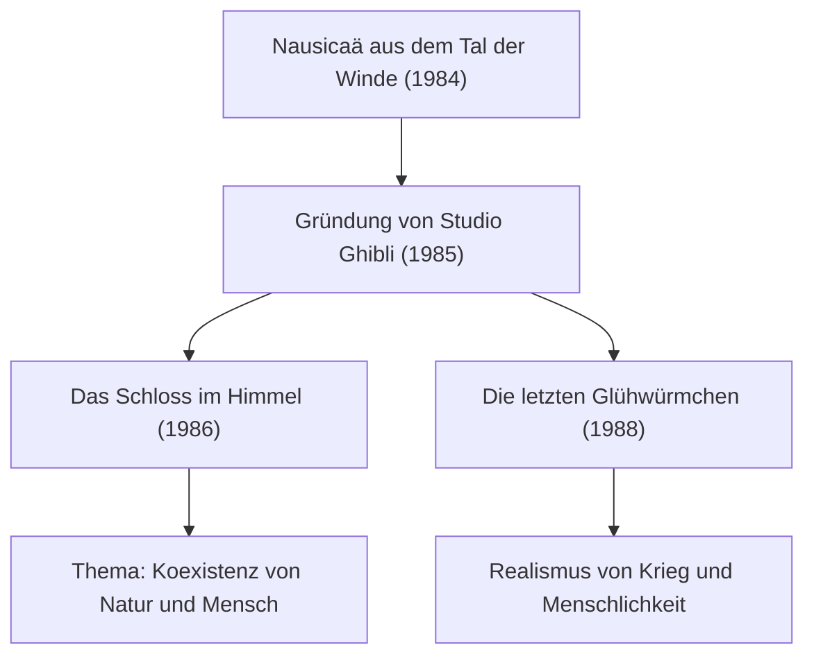

# Die Chronik der Ghibli-Filme: Botschaften über Leben und Natur in der Animation

Studio Ghibli geht weit über den Rahmen eines gewöhnlichen Animationsstudios hinaus und nimmt eine Ausnahmestellung in der Filmkultur Japans und der gesamten Welt ein. Seit seiner Gründung im Jahr 1985 hat das Studio unter der Leitung der beiden visionären Schöpfer Hayao Miyazaki und Isao Takahata eine Vielzahl historischer Meisterwerke hervorgebracht. Dieser Artikel beleuchtet die Geschichte, die technologische Entwicklung und den thematischen Wandel von Studio Ghibli – aus physikalischen, historischen sowie animationstechnischen Perspektiven.

## Die Gründung von Studio Ghibli und die ersten Herausforderungen

Die Geschichte von Studio Ghibli nahm ihren Anfang mit dem Erfolg von *Nausicaä aus dem Tal der Winde* (Kaze no Tani no Naushika) im Jahr 1984. Obwohl dieser Film streng genommen vor der offiziellen Gründung des Studios entstand, bildeten die während der Produktion geknüpften Teamstrukturen und die finanziellen Mittel das unverzichtbare Fundament für das spätere Studio.

Mit dem unmittelbar nach der Gründung produzierten Werk *Das Schloss im Himmel* (Tenkū no Shiro Rapyuta) erreichte die traditionelle Cel-Animation einen technischen Höhepunkt. Insbesondere das Leuchten des Äthersteins (Levitationssteins) und die Darstellung der Wolkenformationen nutzten die damaligen optischen Compositing-Technologien voll aus. Physikalische Phänomene wie Lichtstreuung und Refraktion allein durch handgezeichnete Animationsfolien und ausgefeilte Kamerafiltertechniken einzufangen, setzte damals neue weltweite Maßstäbe.

## Wirtschaftswunder und Alltagsfantasie: Späte 1980er bis 1990er Jahre

Während Japan im wirtschaftlichen Aufschwung der Bubble Economy florierte, wagte Ghibli das beispiellose Experiment eines Doppel-Features: *Mein Nachbar Totoro* und *Die letzten Glühwürmchen* kamen zeitgleich in die Kinos. Einerseits die idyllische Natur und Waldgeister im ländlichen Japan der 1950er Jahre (Shōwa-Ära), andererseits die erschütternde Realität gegen Ende des Zweiten Weltkriegs. Diese beiden gegensätzlichen Vektoren versinnbildlichen eindrucksvoll die Vielschichtigkeit des Studios.

In technischer Hinsicht wurde in dieser Periode die Tiefenwirkung mithilfe der Multiplan-Kamera perfektioniert. Durch die Aufteilung von Hintergründen auf mehrere Bildebenen, die sich mit unterschiedlichen Geschwindigkeiten bewegten, entstand auf der zweidimensionalen Leinwand eine überzeugende räumliche Tiefe (Parallaxeneffekt). Dieser visuelle Kniff kann als direkter Vorläufer moderner Raumdarstellungen in der computergenerierten 3D-Animation (3D-CGI) des Digitalzeitalters betrachtet werden.

## Ökologie und mythische Imagination: Der Meilenstein »Prinzessin Mononoke«

Das 1997 erschienene Werk *Prinzessin Mononoke* (Mononoke Hime) markierte sowohl in thematischer als auch in technischer Hinsicht einen entscheidenden Wendepunkt für Studio Ghibli. Die epische Konfrontation zwischen den Göttern des Waldes und den Menschen brach mit gängigen Gut-Böse-Dichotomien und vermittelte eine differenzierte, tiefgreifende Botschaft.

Besonders bemerkenswert ist hierbei die animierte Darstellung von Strömungsmechanik. Bei den unheimlich wogenden Tentakeln des Fluchgotts (Tatari-gami), Blutspritzern und Wasserströmungen kam erstmals partiell digitale Computeranimation (CGI) zum Einsatz. Dennoch blieb das Fundament stets die präzise Beobachtung und Rekonstruktion physikalischer Gesetze durch die Hände der Animatoren. Die Bewegung viskoser Substanzen oder die Massenwirkung von unter der Schwerkraft zusammenbrechenden Körpern – das intuitive Erfassen der newtonschen Mechanik und deren stilisierte Überhöhung im Zeichentrick beeindruckten Kreative weltweit.

## Der Übergang ins digitale Zeitalter und weltweite Anerkennung: »Chihiros Reise ins Zauberland«

*Chihiros Reise ins Zauberland* (Sen to Chihiro no Kamikakushi) brach 2001 alle bisherigen Einspielrekorde an den japanischen Kinokassen und zementierte mit dem Gewinn des Oscars für den besten animierten Spielfilm den weltweiten Ruhm des Studios endgültig.

Mit diesem Film vollzog Ghibli den vollständigen Übergang von klassischen Folien zu digitaler Kolorierung. Doch das Studio nutzte die digitale Technik nicht bloß zur »Effizienzsteigerung«, sondern vielmehr zur »Erweiterung der Ausdruckskraft«. Durch unendliche Farbabstufungen, komplexe Lichteffekte und die transparente Darstellung von Wasser wurden digitale physikalische Simulationen integriert, ohne die organische Wärme handgezeichneter Kunst zu verlieren – ein einzigartiger Workflow entstand.

## Isao Takahatas Innovation und der Höhepunkt des Realismus: »Die Legende der Prinzessin Kaguya«

Während Hayao Miyazaki die Welt meist durch das Prisma fantastischer Erzählungen erkundete, hinterfragte Isao Takahata zeit seines Lebens unermüdlich die Konventionen der Animation. Den Höhepunkt dieses avantgardistischen Schaffens stellt *Die Legende der Prinzessin Kaguya* (Kaguya-hime no Monogatari) dar.

In diesem Werk wurden Linien bewusst fragmentarisch belassen und zarte Wasserfarben verwendet, was einen raffinierten wahrnehmungspsychologischen Effekt erzeugt: Das Gehirn des Publikums wird angeregt, das Unvollständige selbstständig zu vervollständigen. In der dramatischen Fluchtszene, die vor kinetischer Energie förmlich explodiert, visualisieren dynamisch-raue Pinselstriche ein Gefühl von relativistischer Raumverzerrung und enormer Geschwindigkeit. Eine Technik, die dem reinen Fotorealismus diametral entgegensteht und stattdessen die Mechanismen menschlicher Kognition und visueller Wahrnehmung meisterhaft nutzt.

## Das Erbe für die Zukunft und das Potenzial der Animation

Das Lebenswerk von Studio Ghibli ist weit mehr als reine Unterhaltung: Es stellt fundamentale Fragen zu den ökologischen Herausforderungen unserer Zeit, unserem Umgang mit Technologien und dem Urgrund des menschlichen Daseins. Der Übergang von Cel-Animation zur Digitaltechnik, das Festhalten an analoger Haptik und eine stets aufrichtige Auseinandersetzung mit dem Zeitgeist – dieser Entwicklungsweg offenbart das grenzenlose Potenzial der Animation als Kunstform.

In der von Ghibli geschaffenen Welt birgt jeder Hauch des Windes und jedes Glitzern des Wassers den Atem des Lebens und die Eleganz physikalischer Gesetze. Es bleibt unsere Aufgabe, die in diesen Werken verankerten Botschaften zu reflektieren und an kommende Generationen weiterzugeben.
