# Kapitel 1: Gründung und frühe Meisterwerke (Nausicaä aus dem Tal der Winde, Das Schloss im Himmel)

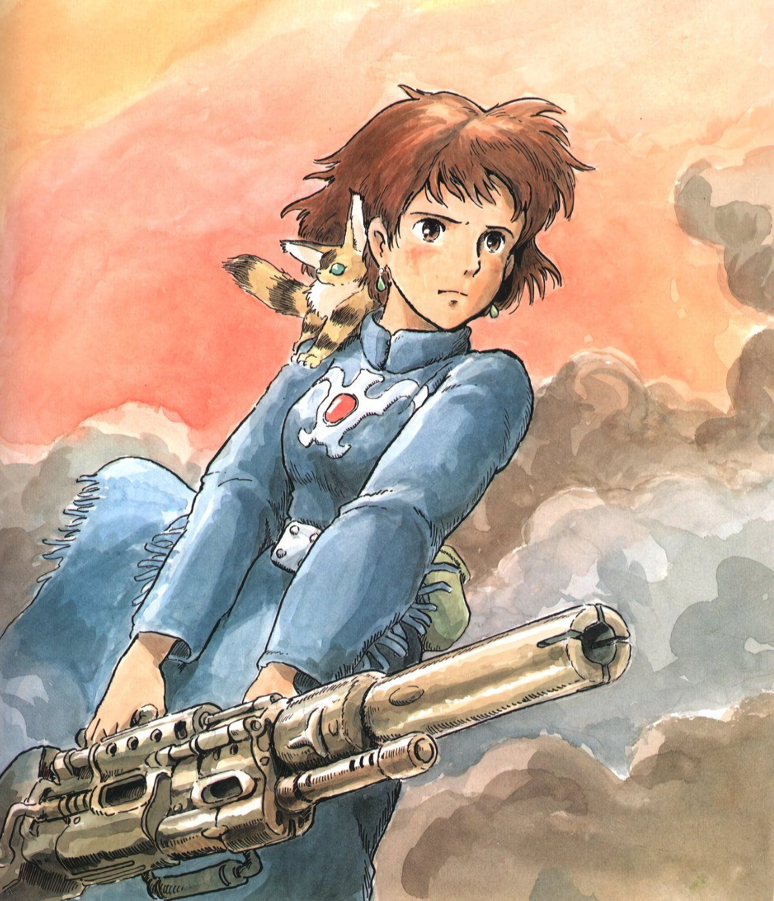
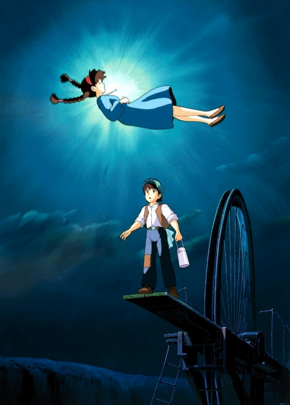

## 1.1 Eine Singularität in der Animationsgeschichte, die Geburt von Studio Ghibli

Wenn man die japanische Animationsindustrie, ja sogar die weltweite Animationsgeschichte überblickt, kann man ein "Ereignis" Mitte der 1980er Jahre nicht ignorieren. Das ist genau die Gründung von Studio Ghibli. Die Geschichte von Ghibli ist nicht einfach die Geschichte eines einzelnen Unternehmens oder eines Produktionsstudios, sondern die Geschichte des Höhepunkts des Ausdrucks, den die analoge Technologie der Cel-Animation erreicht hat, und der wunderbaren Verschmelzung von "Popularität" und "Künstlerischer Qualität", die das Medium der Animation in sich trägt. In diesem Kapitel werden wir, während wir die Hintergründe der Gründung von Studio Ghibli entwirren, den Fokus auf seinen eigentlichen Ursprung "Nausicaä aus dem Tal der Winde" (1984) und das erste Werk unter dem Namen Studio Ghibli, "Das Schloss im Himmel" (1986), legen und diskutieren, wie die beiden Genies Isao Takahata und Hayao Miyazaki die Grenzen des Animationsausdrucks durchbrochen haben.

Am Vorabend der Gründung von Studio Ghibli hatte die japanische Fernsehanimation durch die Methode der "Limited Animation" eine eigene Evolution durchgemacht. Im Gegensatz zur Disney-artigen Full Animation, die volle 24 Bilder pro Sekunde nutzt, begann diese Methode, die die Anzahl der Bilder reduzierte, aber durch den Einsatz von Standbildern und Kameraarbeit (Schwenken, Neigen usw.) Dynamik erzeugte, als ein notwendiges Übel zur Kostensenkung und etablierte sich irgendwann als eigenständige Bildsprache. Das Ziel von Isao Takahata und Hayao Miyazaki passte jedoch nicht in diesen Rahmen. Sie sehnten sich danach, die Animation, die die detaillierte Konstruktion von Raum, den Realismus alltäglicher Handlungen und vor allem die "grundlegende Freude an der Bewegung" verfolgt, welche sie seit ihrer Zeit bei Toei Doga (heute Toei Animation) kultiviert hatten, in dem höchsten Format eines abendfüllenden Kinofilms zu verwirklichen.

## 1.2 Die Autorschaft von Isao Takahata und Hayao Miyazaki: Die wundersame Kreuzung von Objektivität und Subjektivität

Um die Werke von Studio Ghibli tiefgreifend zu verstehen, ist es notwendig, die Natur der zwei verschiedenen Talente in ihrem Kern, Isao Takahata und Hayao Miyazaki, sowie ihre Interaktion zu erfassen. Beide stammen von Toei Doga und waren durch Aktivitäten in der Gewerkschaft und Ähnlichem in einer tiefen Bindung vereint, aber es ist keine Übertreibung zu sagen, dass ihre Ausrichtungen als Animationsregisseure diametral entgegengesetzt waren.

Hayao Miyazakis Autorschaft zeichnet sich durch ein überwältigendes "subjektives Raumverständnis" und einen "Bewegungsfetischismus" aus. Die von Miyazaki gezeichneten Bilder übertreffen manchmal die physikalischen Gesetze, besitzen jedoch eine starke Überzeugungskraft, die die körperlichen Sinne des Betrachters direkt anspricht. Das Gefühl des Schwebens in Flugszenen, das Schweregefühl, das den tiefen Bass spüren lässt, wenn sich Objekte mit riesiger Masse bewegen, sowie das Gefühl, dass die Welt selbst wie ein Lebewesen wimmelt, wie bei feinen Windströmungen oder dem Glitzern der Wasseroberfläche, sind das Ergebnis der Fixierung der Visionen in Miyazakis Gehirn auf Cels durch die Körper der Animatoren. Bei Layouts (Bildkomposition) nutzt er häufig weitwinkelähnliche Verzerrungen und einzigartige Perspektiven, wodurch er die Tiefe und die Bewegungslinien des Bildes geschickt kontrolliert.

Im Gegensatz dazu liegt die Autorschaft von Isao Takahata in einer konsequenten "Objektivität" und einer "logischen Konstruktion". Da Takahata selbst ein Regisseur war, der nicht zeichnete, konnte er die Animationsbilder von einer noch höheren, meta-ähnlichen Perspektive überblicken. Seine Regieführung legt großen Wert darauf, die Psychologie der Charaktere, die sozialen Strukturen und den Realismus trivialer alltäglicher Bewegungen bis zum Äußersten zu verfolgen. Von der räumlichen Anordnung über die Beleuchtung bis hin zur Motivation der Charaktere basiert alles auf präzisen Berechnungen und ermutigt das Publikum zur Empathie, während es gleichzeitig den Brechtschen Verfremdungseffekt beibehält, der sie dazu bringt, die Welt immer aus einer leicht distanzierten Perspektive zu beobachten.

Die Tatsache, dass diese beiden Talente – der "subjektive und intuitive Miyazaki" und der "objektive und logische Takahata" – sich gegenseitig in Schach hielten und respektierten, während sie zum Rückgrat eines einzelnen Studios wurden, war die größte treibende Kraft, die Ghiblis reiches Werkzeug schuf. In den frühen Werken von Ghibli spielte Takahata in der Position des Produzenten eine äußerst wichtige Rolle bei der Kontrolle von Miyazakis Ausschweifungen, während er gleichzeitig das Grundgerüst der Werke festigte.

## 1.3 Die technische Singularität der Cel-Animation und die Multiplan-Kamera

Das Erstaunliche an Studio Ghibli liegt nicht nur in der Tiefe seiner Themen, sondern auch in der überwältigenden technologischen Kompetenz, die sie unterstützt. Insbesondere in der Zeit von "Nausicaä" bis "Das Schloss im Himmel" erreichte die analoge Cel-Animationstechnologie eine Form der Vollendung oder näherte sich einer "technischen Singularität".

Die überwältigende Informationsmenge und das Gefühl von Realität in den Bildern der Ghibli-Werke werden durch detailliert gezeichnete Hintergrundkunst und vielschichtige Cel-Ebenen erzeugt. Besonders erwähnenswert ist hier der Höhepunkt des räumlichen Ausdrucks durch den Einsatz der "Multiplan-Kamera".

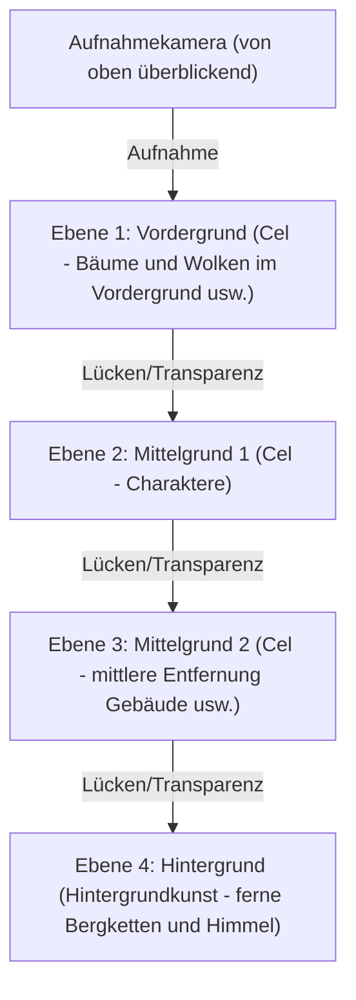
```mermaid
graph TD
    Camera["Aufnahmekamera (von oben überblickend)"]
    Layer1["Ebene 1: Vordergrund (Cel - Bäume und Wolken im Vordergrund usw.)"]
    Layer2["Ebene 2: Mittelgrund 1 (Cel - Charaktere)"]
    Layer3["Ebene 3: Mittelgrund 2 (Cel - mittlere Entfernung Gebäude usw.)"]
    Layer4["Ebene 4: Hintergrund (Hintergrundkunst - ferne Bergketten und Himmel)"]
    
    Camera -- "Aufnahme" --> Layer1
    Layer1 -- "Lücken/Transparenz" --> Layer2
    Layer2 -- "Lücken/Transparenz" --> Layer3
    Layer3 -- "Lücken/Transparenz" --> Layer4
```

Die Multiplan-Kamera ist ein Gerät, bei dem mehrere Glasschichten (Ebenen) unter der Kamera angebracht sind und Cels oder Hintergrundbilder auf jeder Ebene zur Aufnahme platziert werden. Dadurch ist es möglich, eine pseudo-dreidimensionale Tiefe (Parallaxe) zu erzeugen, indem die Bewegungsgeschwindigkeit jeder Ebene verändert wird, wenn sich die Kamera bewegt (Schwenken, Neigen, Kamerafahrt usw.). Diese Technologie selbst wurde bereits in der Vergangenheit von Unternehmen wie Disney genutzt, aber die Anwendung der Multiplan-Kamera bei Ghibli war in Bezug auf ihre Präzision und Komplexität herausragend.

Die für Miyazakis Werke unverzichtbaren "Flugszenen" profitieren maximal von dieser Technologie. Beispielsweise fließen komplexe Räume wie das Wolkenmeer, das sich unterhalb ausbreitet, die Flugboote, die hindurchfliegen, und die Erde, die in der Ferne zu sehen ist, in unterschiedlichen Geschwindigkeiten in jeder Ebene, sodass das Publikum eine starke räumliche Wahrnehmung und Immersion erfährt, als würde es wirklich durch den Himmel fliegen. Darüber hinaus weht durch den Einsatz der "Durchlicht"-Technologie (Licht, das von hinten auf die Cels scheint), der Darstellung subtiler Farbverläufe mit einer Airbrush und dem wahnsinnigen Arbeitsaufwand, bei dem im Wind wehende Pflanzen und Bäume Bild für Bild handgezeichnet werden, Wind und Luft auf der Leinwand. In einer Ära, in der es keine digitale Technologie (CGI) gab, nutzten sie physischen Film, Farbe und die Magie des Lichts, um einen virtuellen Raum zu erschaffen, der realer als die Realität ist.

## 1.4 "Nausicaä aus dem Tal der Winde" (1984): Ein Meilenstein als Vorgeschichte und die Tiefe der Ökologie

Der 1984 erschienene Film "Nausicaä aus dem Tal der Winde" ist offiziell ein Werk, das von "Topcraft" vor der Gründung von Studio Ghibli produziert wurde, aber es wurde mit der Aufstellung von Hayao Miyazaki als Regisseur und Isao Takahata als Produzent erstellt und wird im Wesentlichen als "Werk Null" oder "Erstes Werk" positioniert, das die Richtung der zukünftigen Ghibli-Werke bestimmte.

Dieses Werk basiert auf dem gleichnamigen Manga, den Hayao Miyazaki selbst in der monatlichen Zeitschrift "Animage" als Serie veröffentlichte, aber die Filmversion rekonstruiert dessen Anfangsteil und schließt ihn als eigenständige Geschichte ab. Die größte Errungenschaft, die "Nausicaä" in der Geschichte der Animation hinterlassen hat, ist, dass es die extrem gewichtigen Science-Fiction-Themen wie "Umweltprobleme (Ökologie)", "die Würde des Lebens" und "die Torheit der Menschheit" innerhalb des Rahmens der Unterhaltung und mit überwältigender visueller Schönheit vollständig dargestellt hat.

1000 Jahre nachdem die industrielle Zivilisation durch einen ultimativen Krieg, die "Sieben Tage des Feuers", zusammenbrach. Eine Welt, in der sich ein Wald aus Pilzen, das "Meer der Fäulnis", das giftige Miasma abgibt, ausbreitet und riesige Insekten herrschen. Dieses verzweifelte Weltbild spiegelt Miyazakis starke Krisenwahrnehmung hinsichtlich der Angst vor einem Atomkrieg während des Kalten Krieges und der sich verschärfenden Umweltzerstörung wider. Miyazaki verfällt jedoch nicht in den bloßen Dualismus von "Naturschutz" oder "menschlichem Bösen". Die große Wende im Stück, dass das Meer der Fäulnis tatsächlich ein System zur Reinigung der verschmutzten Erde ist, konfrontiert uns mit der beängstigenden Selbstheilungskraft der Natur und der Winzigkeit der Menschheit davor.

Bei der Diskussion von "Nausicaä" aus technologischer Sicht darf der Ausdruck riesiger Insekten, einschließlich der "Ohmu", nicht fehlen. Die Animation dieser grotesken Kreaturen mit vielen Gliedern und Augen, die wellenförmig voranschreiten, erzeugt durch spezielle Zeichentechniken unter Verwendung von Gummi (wie die Methode, mehrere Cel-Teile zu verschieben und zu fotografieren) und detaillierte Timing-Berechnungen ein überwältigendes Gefühl von Gewicht und Unheimlichkeit sowie eine gewisse Göttlichkeit. Darüber hinaus haben die Flugszenen des Möwe (Nausicaäs Fluggerät), in denen die Bewegung des Stoffes den Windwiderstand spüren lässt und die glatte Flugbahn die Beziehung zwischen Schwerkraft und Auftrieb zu visualisieren scheint, der Welt die "Katharsis des Fliegens" als den wahren Wert von Miyazakis Animationen offenbart.

Auch die Gestaltung der Heldin Nausicaä war innovativ. Sie ist nicht einfach "ein Mädchen, das beschützt werden muss", sondern eine Kriegerin, die selbst das Möwe fliegt, Gewehre abfeuert und Schwerter schwingt, während sie gleichzeitig eine mütterliche Präsenz mit tiefer Zuneigung zu allem Leben ist. Dieses komplexe Charakterbild, das Stärke und Freundlichkeit, Wut und Trauer vereint, wurde zum Höhepunkt und Ursprung des Bildes der weiblichen Heldin nicht nur in nachfolgenden Ghibli-Werken, sondern auch in der modernen Fiktion.

## 1.5 Die Gründung von Studio Ghibli und "Das Schloss im Himmel" (1986): Das ultimative Abenteuer-Action-Spektakel

Nach dem Erfolg von "Nausicaä" wurde 1985 mit den Gewinnen als Kapital offiziell das "Studio Ghibli" gegründet. Sein einziger Gründungszweck war es, "weiterhin hochwertige abendfüllende Kinofilmanimationen zu produzieren". Ghibli wurde als unabhängige Basis geboren, um eine kompromisslose Qualität zu verfolgen und sich deutlich von der Massenproduktion minderer Qualität von Fernsehanimationen abzugrenzen.

Und 1986 wurde "Das Schloss im Himmel" als erster denkwürdiger abendfüllender Film unter dem Namen Studio Ghibli veröffentlicht. Basierend auf einer Idee, die Hayao Miyazaki in seiner Grundschulzeit konzipierte, ist dieses Werk ein Meisterwerk, das man als "den Nordpol des Action-Spektakels" bezeichnen könnte. Es nutzt die fliegende Insel Laputa aus Swifts "Gullivers Reisen" als Motiv und vereint alle königlichen Elemente des klassischen Abenteuer-Action-Spektakels (Boy meets Girl) – die Begegnung zwischen einem Jungen und einem Mädchen, ein mysteriöser Flugstein, Luftpiraten und eine Armee mit bösen Ambitionen.

Die Großartigkeit von "Das Schloss im Himmel" liegt in der atemberaubenden Triebkraft der Geschichte und der außergewöhnlichen Besessenheit vom Detail, die sich über jeden Winkel der Leinwand erstreckt. Von der Szene zu Beginn, in der Dolas Familie das Luftschiff (die Tiger Moth) angreift, bis hin zur Verfolgungsjagd in der Schluchttal-Mine, in die Pazu und Sheeta fliehen, ist das Bild ständig "dynamisch". Die mechanische Gestaltung der Schluchttal-Mine, die Kolbenbewegungen der Dampfmaschinen, das Drehen der Zahnräder und die rasante Fahrt der Loren. Diese Maschinen und Fahrzeuge sind nicht nur Hintergründe oder Requisiten; sie werden so lebendig dargestellt, als hätten sie ein eigenes Leben. Die Zeichenenergie, die versucht, Miyazakis "Liebe zu Maschinen" und sogar "die Hitze und den Geruch, den sie ausstrahlen" einzufangen, verleiht der fiktiven Welt eine überwältigende Realität.

In Bezug auf seine Thematik präsentiert "Das Schloss im Himmel" "die Trennung zwischen fortschrittlicher Technologie und dem Menschen" und "die Verbundenheit mit der Erde". Die transzendente wissenschaftliche Macht des Laputa-Imperiums, das einst die Welt beherrschte, wurde letztendlich zur Ursache seiner eigenen Zerstörung. Im Höhepunkt des Films ist die Vision des riesigen "Großen Baumes", der den riesigen Flugstein aus den Tiefen des zusammenbrechenden Laputa umarmt und in den Weltraum aufsteigt, äußerst symbolisch. Dieses Ende, in dem die künstlichen Objekte, die Symbole der Technologie, zerfallen und nur der große Baum, das Symbol des Leben, bleibt, ist in Sheetas Worten zusammengefasst: "Lass uns im Boden Wurzeln schlagen und mit dem Wind leben. Lass uns den Winter mit den Samen überstehen und im Frühling mit den Vögeln singen. Egal, wie viele schreckliche Waffen du hast, egal, wie viele bemitleidenswerte Roboter du kontrollierst, du kannst nicht fern vom Boden leben." Dies ist Miyazakis scharfe Kritik an der modernen Zivilisation, die sich seit "Nausicaä" fortsetzt, und ein universelles Gebet für eine Rückkehr zur Natur.

Darüber hinaus ist der Beitrag der Hintergrundkunst durch die Art Directors Toshiro Nozaki und Nizo Yamamoto in diesem Werk unermesslich. Die ruhige Schönheit der Szene bei der Ankunft in Laputa, wenn sich das Wolkenmeer lichtet und der riesige moosbedeckte Garten und die Robotersoldaten erscheinen, beweist, wie sehr Hintergrundbilder in der Animation die Würde des Werkes bestimmen. Hier gab es eine perfekte Verschmelzung von Miyazakis dynamischer Regieführung und statischer Kunst.

## 1.6 Schlusswort: Der Beginn der Legende

"Nausicaä aus dem Tal der Winde" und "Das Schloss im Himmel". In diesen beiden frühen Meisterwerken brachten Hayao Miyazaki, Isao Takahata und die Mitarbeiter von Studio Ghibli das Potenzial, das die Ausdrucksmethode der Animation besitzen kann, bis an die äußerste Grenze. Den fiktiven Mechaniken, die Produkte der Vorstellungskraft sind, Gewicht und Textur verleihen, einem imaginären Ökosystem Realität einhauchen und komplexe Sozialkritik und philosophische Themen in Unterhaltung verpacken, die Menschen jeden Alters in Atem hält. Sie haben diese unglaubliche Meisterleistung durch eine immense Anzahl von Cels und Handarbeit erreicht, die an handwerklichen Wahnsinn grenzt.

Diese beiden Werke haben die technischen und ausdrucksstarken Standards in weite Höhen gehoben und standen der nachfolgenden japanischen Animationswelt als "eine riesige Wand namens Ghibli" im Weg. Und gleichzeitig war es buchstäblich das "Kapitel 1" einer epischen Legende, in der dieses kleine Studio schließlich ein weltweites kulturelles Phänomen auslösen und die Geschichte der Animation selbst umschreiben würde. Der Weg, der zu den nachfolgenden Werken "Mein Nachbar Totoro", "Die letzten Glühwürmchen" und "Prinzessin Mononoke" führte, begann alles mit dem Wind von "Nausicaä" und dem Himmel von "Das Schloss im Himmel".

# Kapitel 2: Die Kreuzung von Alltag und Außergewöhnlichem —— Die Welt von "Mein Nachbar Totoro", "Die letzten Glühwürmchen" und "Kikis kleiner Lieferservice"

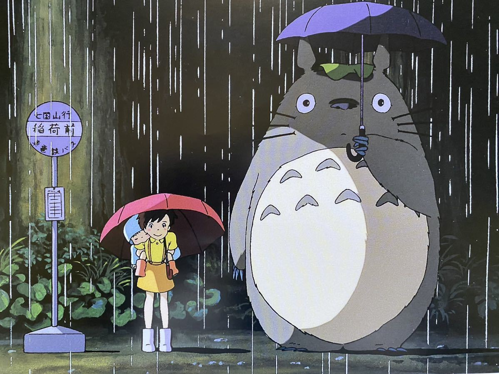
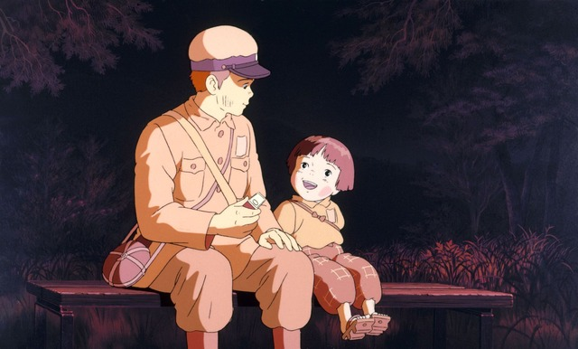
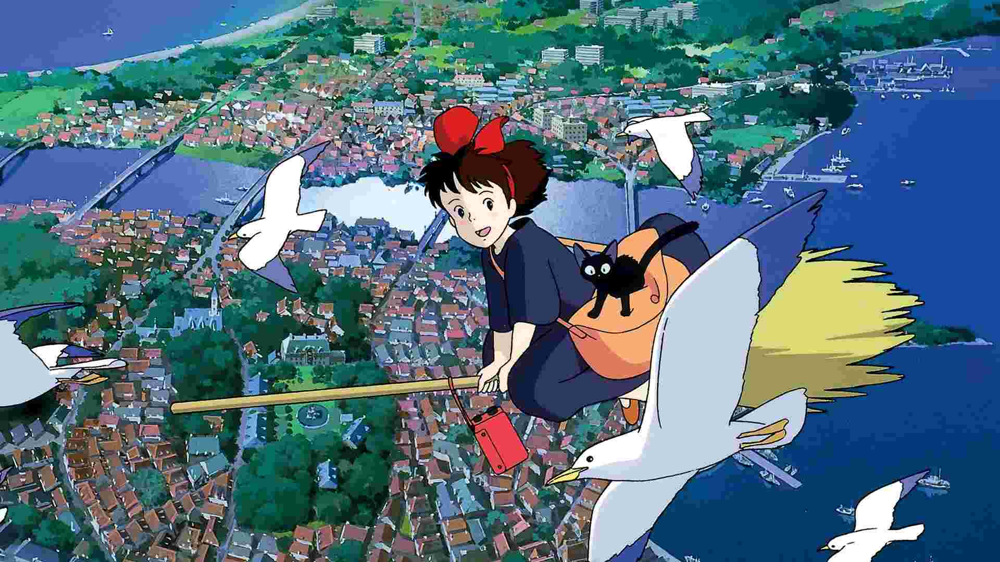

Bei der Entschlüsselung der Geschichte von Studio Ghibli war die zweite Hälfte der 1980er Jahre eine Zeit, die zu einem entscheidenden Wendepunkt wurde. Abkehr von den epischen "Schwertern und Magie" oder "fliegenden Abenteuer-Action-Spektakeln", wie sie im vorherigen Werk "Das Schloss im Himmel" (1986) dargestellt wurden, lenkte Ghibli stark in Richtung des "Alltäglichen" wie den ursprünglichen Landschaften Japans oder dem Leben der gewöhnlichen Menschen im Westen. In diesem Kapitel werden wir uns drei Werke ansehen – "Mein Nachbar Totoro" und "Die letzten Glühwürmchen", die 1988 eine wundersame gleichzeitige Veröffentlichung erreichten, sowie den Blockbuster "Kikis kleiner Lieferservice" von 1989 – und gründlich sezieren, welche technischen und thematischen Revolutionen diese in der Geschichte der Animation hinterlassen haben.

## 1. Der Wahnsinn und das Wunder der gleichzeitigen Veröffentlichung: Hayao Miyazaki und Isao Takahata, zwei "Showa"-Ären

Im Frühjahr 1988 wurde mit der gleichzeitigen Vorführung von "Mein Nachbar Totoro" und "Die letzten Glühwürmchen" eine heute kaum mehr vorstellbare Ausstellungsform realisiert. Dies war nicht nur eine kommerzielle Verpackung, sondern die Kristallisation von "Wahnsinn und Wunder", bei der die Organisation Studio Ghibli und im weiteren Sinne die beiden genialen Schöpfer Hayao Miyazaki und Isao Takahata Funken sprühten.

### 1-1. Leben und Tod Rücken an Rücken

"Mein Nachbar Totoro" ist eine Lobeshymne auf das Leben, die in einem japanischen Bauerndorf der 1950er Jahre (Showa 30er) spielt und die Interaktion zwischen Naturgeistern und Kindern darstellt. Auf der anderen Seite spielte "Die letzten Glühwürmchen" in Kobe um das Ende des Krieges im Jahr 1945 (Showa 20) und stellte die grausame Realität eines Bruders und einer Schwester, die in den Flammen des Krieges ihr Leben verloren, mit absolutem Realismus dar. Obwohl das Zeitalter der Einstellung nur etwa 10 Jahre auseinanderliegt, enthalten diese beiden Werke die völlig entgegengesetzten Themen von "Leben und Tod" und "idealisierter Fantasie und grausamer Realität".

Damals etablierte Studio Ghibli ein nahezu rücksichtsloses Produktionssystem, das zwei riesige Talente gleichzeitig in Betrieb nahm. Ein Kampf um das Zeichenpersonal brach aus, und der Zeitplan stand am Rande des Zusammenbruchs. Im Ergebnis trieb dieses raue Umfeld die Qualität beider Werke jedoch an ihre äußersten Grenzen. Als Antithese zu Isao Takahatas konsequentem Realismus baute Hayao Miyazaki die Welt von "Totoro", in der unbewusste Vitalität stärker pulsiert, auf, während Takahata den Ausdruck der japanischen Animation auf eine dokumentarische Ebene hob, um Miyazakis Fantasie entgegenzuwirken.

### 1-2. Die Differenzierung von Showa und die Geburt der "Animationsdokumentation"

Die Regieführung von Isao Takahata in "Die letzten Glühwürmchen" zerstörte die konventionelle Animationsgrammatik. Die Fallbahnen der Brandbomben aus B-29-Bombenangriffen, das Flackern der Flammen in brennenden Häusern und vor allem die körperlichen Veränderungen von Seita und Setsuko, die an Hunger schwächelten. Um dies auszudrücken, verfolgte der Farbdesigner Michiyo Yasuda und ihr Team akribisch ein "Schlamm-, Blut- und Ruß-braun", das mit herkömmlichen Animationsfarben nicht ausgedrückt werden konnte.

Im Gegensatz dazu rekonstruierte Hayao Miyazaki in "Mein Nachbar Totoro" "das schöne Japan, das vielleicht einmal existiert hat" aus seinen eigenen Erinnerungen. Es war nicht einfach Realismus, sondern ein Versuch, die "Brillanz" der Welt aus der Perspektive eines Kindes auf Cels zu fixieren. Die Differenzierung zwischen diesen beiden "Showa"-Ären zeugt maximal von der Bandbreite des Ausdrucks, die das Medium Animation besitzt, und wurde zu einem Meilenstein in der Geschichte des japanischen Kinos.

## 2. Die Revolution der Hintergrundkunst: "Luft und Feuchtigkeit" erschaffen von Kazuo Oga und Nizo Yamamoto

Die überwältigende Überzeugungskraft der Ghibli-Werke ist in großem Maße nicht nur dem Schauspiel der Charaktere zu verdanken, sondern auch der Kraft der sich dahinter ausbreitenden Hintergrundkunst. In dieser Zeit erreichte die Hintergrundkunst von Studio Ghibli einen Höhepunkt.

### 2-1. Die feuchte Atmosphäre in "Totoros Wald", gezeichnet von Kazuo Oga

Es ist keine Übertreibung zu sagen, dass die Leistung von Kazuo Oga, der als Art Director für "Mein Nachbar Totoro" ausgewählt wurde, die Geschichte der japanischen Animationskunst veränderte. Die von Oga gezeichnete Natur nutzt die Eigenschaften von Plakatfarben in höchstem Maße aus. Obwohl er undurchsichtige Plakatfarben anstelle von transparenten Aquarellfarben verwendete, drückte er durch die exquisite Menge an Wasser und Pinselstrichen sogar die einzigartige "Feuchtigkeit" des japanischen Klimas, den "erstickenden Geruch von Gras" und sogar die "Temperatur des durch die Bäume fallenden Sonnenlichts" aus.

Insbesondere die Hintergrundkunst der Szene, in der Satsuki und Mei an einer regnerischen Bushaltestelle auf Totoro treffen, ist ein Meisterwerk. Die Textur des regennassen Asphalts, die Tiefe des in der Dunkelheit versinkenden Schutzwaldes, die von elektrischem Licht erzeugten Luftschichten. Ogas Kunst war nicht einfach "die Nachahmung von Landschaften", sondern eine Magie, die "unsichtbare Informationen" wie den wehenden Wind, die Temperatur und die Feuchtigkeit visualisierte.

### 2-2. Die Sehnsucht nach dem Westen und der architektonische Realismus

Auf der anderen Seite ist die Stadt Koriko, die der Schauplatz von "Kikis kleiner Lieferservice" ist, eine fiktive Stadt, die durch die Verschmelzung von Elementen verschiedener europäischer Städte wie Stockholm und Visby auf der Insel Gotland in Schweden sowie Lissabon und Paris erschaffen wurde. Die Hintergrundkunst hier hatte einen völlig entgegengesetzten Vektor zu "Totoro", das japanische Landschaften abbildete.

Europäische Steingebäude, Reihen von Ziegeldächern und abfallende Straßen, die zum Meer führen. Um diese überzeugend zu zeichnen, führte das Kunstpersonal von Ghibli gründliche Location-Scoutings und studierte architektonische Strukturen. Selbst bei der Textur eines einzigen Steins wurde der Grad der Verwitterung und das Reflexionsvermögen des Sonnenlichts berechnet und in Farben übersetzt, die als Animationshintergründe am schönsten aussahen. Die Kraft der Kunst, die diese "Sehnsucht nach dem Westen" nicht in bloßer Fantasie enden lässt, sondern sie als einen Raum darstellt, in dem Menschen tatsächlich leben und arbeiten, ist erstaunlich.

## 3. Das zeitgenössische Thema in "Kikis kleiner Lieferservice": "Arbeit und Flaute"

"Kikis kleiner Lieferservice" zog bei seiner Veröffentlichung begeisterte Unterstützung von vielen jungen Menschen, insbesondere berufstätigen Frauen, auf sich. Der Grund dafür ist, dass dieses Werk, während es oberflächlich den Anschein einer Fantasie einer "Coming-of-Age-Geschichte eines Hexenmädchens" trug, im Kern ein extrem zeitgenössisches und universelles echtes Drama rund um "Arbeit und Talent (Flaute)" war.

### 3-1. Der Moment, in dem Talent zur "Arbeit" wird

Die Protagonistin Kiki beginnt ihren Lieferservice, indem sie ihr angeborenes magisches Talent des "Fliegens" nutzt. Dies überschneidet sich perfekt mit dem Prozess, durch den moderne Schöpfer und freiberufliche Arbeiter mit ihren besonderen Fähigkeiten und Talenten als "Kapital" an der Gesellschaft teilnehmen. Für Kiki am Anfang war das Fliegen durch die Luft eine Freude und Selbstausdruck. Als es jedoch zu "Beruf (Arbeit)" wurde, sah sie sich unvernünftigen Forderungen von Kunden gegenüber (wie in der Episode mit dem Heringspastete), und als sie anfing, Geld im Gegenzug zu erhalten, veränderte sich die Bedeutung der Magie in ihr.

### 3-2. Flaute und der Verlust der Identität

In der Mitte verliert Kiki plötzlich ihre magischen Kräfte, kann nicht mehr fliegen und versteht auch die Worte der schwarzen Katze Jiji nicht mehr. Dies ist eine Schwankung in der Identität eines heranwachsenden Mädchens und gleichzeitig eine perfekte Metapher für die "Erschöpfung des Talents (Flaute)", mit der Schöpfer konfrontiert sind.

Wer hier eine wichtige Rolle spielt, ist Ursula, eine Kunststudentin, die in einer Hütte im Wald zeichnet. Ursula sagt zu Kiki: "In solchen Zeiten kann man nur kämpfen", "Zeichnen, zeichnen, weiter zeichnen" und "Wenn das immer noch nicht funktioniert, höre auf zu zeichnen. Geh spazieren, schau dir die Landschaft an, mach ein Nickerchen, tue nichts." Diese Linie ist das Leid und genau das Rezept für Animatoren, einschließlich Hayao Miyazaki selbst, und im weiteren Sinne für alle Menschen, die an expressiven Aktivitäten beteiligt sind, denen sie gegenüberstehen.

### 3-3. Die Entschlossenheit, "mit Blut zu fliegen"

Ursula sagt über ihre eigenen Bilder: „Früher konnte ich malen, ohne an etwas zu denken, aber jetzt ist es anders. Ich muss meine eigenen Bilder malen.“ Kikis Magie ist genauso. Die unbewusste Ära, in der sie nur mit ihrem angeborenen Talent (Magie) fliegen konnte, geht zu Ende, und sie muss die Magie durch ihren eigenen Willen und ihre eigene Anstrengung „wiedererlangen“. Im Höhepunkt, als Kiki rittlings auf einem Schrubber sitzt und mit verzweifeltem Gesichtsausdruck in den Himmel fliegt, ist das keine elegante Fantasie mehr. Es ist genau die Gestalt eines Profis, der sich mit seinen eigenen Grenzen auseinandersetzt und blutige „Technik“ ausübt.

## 4. Themenstruktur und Wechselbeziehungen

Auf den ersten Blick scheinen diese drei Werke jeweils eine unabhängige Weltanschauung zu haben, aber aus der Perspektive von Ghiblis Autorschaft gibt es klare Kontinuitäten und thematische Schnittpunkte.

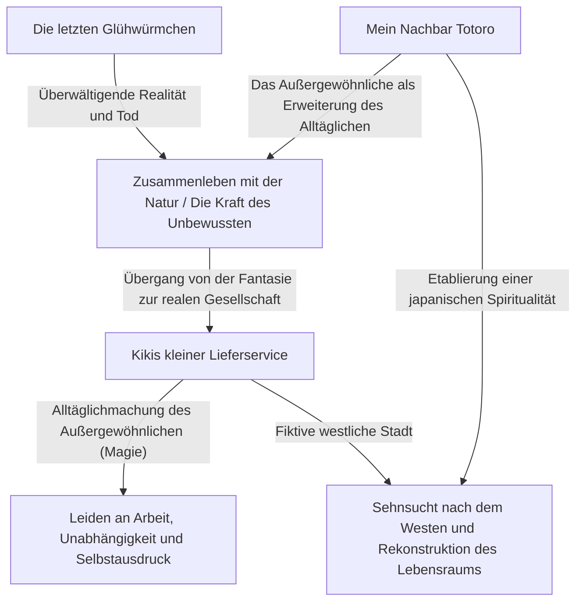
```mermaid
graph TD
    A["Mein Nachbar Totoro"] -- "Das Außergewöhnliche als Erweiterung des Alltäglichen" --> B["Zusammenleben mit der Natur / Die Kraft des Unbewussten"]
    C["Die letzten Glühwürmchen"] -- "Überwältigende Realität und Tod" --> B
    B -- "Übergang von der Fantasie zur realen Gesellschaft" --> D["Kikis kleiner Lieferservice"]
    D -- "Alltäglichmachung des Außergewöhnlichen (Magie)" --> E["Leiden an Arbeit, Unabhängigkeit und Selbstausdruck"]
    A -- "Etablierung einer japanischen Spiritualität" --> F["Sehnsucht nach dem Westen und Rekonstruktion des Lebensraums"]
    D -- "Fiktive westliche Stadt" --> F
```

Das „Außergewöhnliche (Fantasie), das im Alltag verborgen ist“, das von „Totoro“ präsentiert wurde, erlangte durch den Kontrast zum extremen Realismus von „Die letzten Glühwürmchen“ einen noch stärkeren mythologischen Charakter. Und die dort etablierten Ausdrucksmittel und Animationstechniken wurden in „Kikis kleiner Lieferservice“ zu einer mächtigen Waffe, um das paradoxe Thema darzustellen: „Wie sich ein außergewöhnliches Wesen (eine Hexe) in den Alltag (Arbeit) der modernen Gesellschaft integriert“.

## 5. Schlusswort: Die Weichenstellung für die nächste Stufe

In dieser Zeit von 1988 bis 1989 durchlief das Studio Ghibli in nur wenigen Jahren alle Extreme, die die Animation darstellen kann: „Leben und Tod“, „Japan und der Westen“, „Fantasie und Realismus“ sowie „Talent und Arbeit“. Die hier kultivierte Fähigkeit, alltägliche Handlungen gründlich zu beobachten und darzustellen, sowie die Kraft der Hintergrundkunst, die der Landschaft Luft und Emotion einhaucht, wurden an spätere Werke mit komplexeren Themen für ein erwachseneres Publikum weitergegeben, wie „Tränen der Erinnerung – Only Yesterday“ (1991) und „Porco Rosso“ (1992).

Die drei Werke „Mein Nachbar Totoro“, „Die letzten Glühwürmchen“ und „Kikis kleiner Lieferservice“ sind nicht einfach eine Aneinanderreihung von Meisterwerken. Sie sind historische Monumente, die den heißesten und schmerzhaftesten Moment der Metamorphose festhalten, in dem sich das Ausdrucksmedium Animation von einer Unterhaltung für Kinder zu einem „Gesamtkunstwerk“ entwickelte, das selbst die Abgründe des menschlichen Geistes und die strukturellen Leiden der Gesellschaft abbildet.

# Kapitel 3: Sehnsucht nach dem Fliegen und die Romantik der Erwachsenen – Der Höhepunkt des Realismus in „Porco Rosso“ und „Stimme des Herzens“

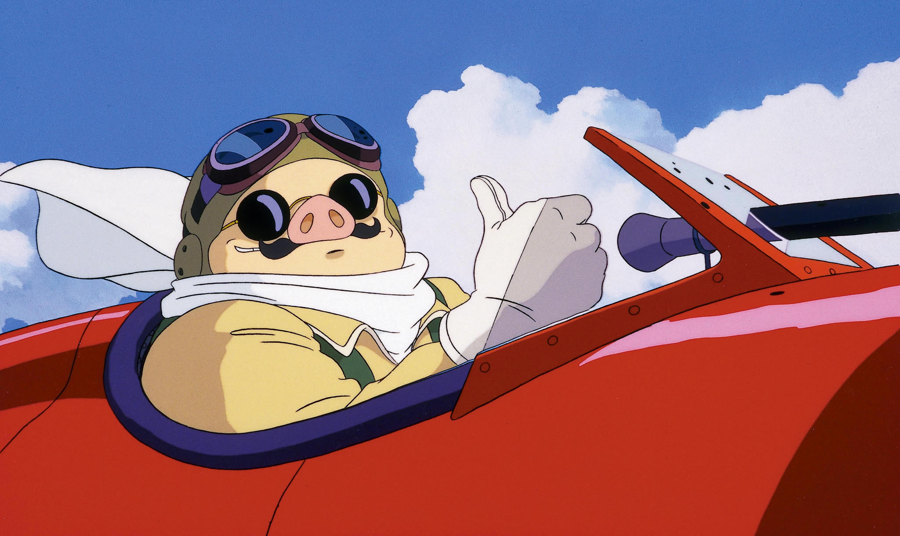
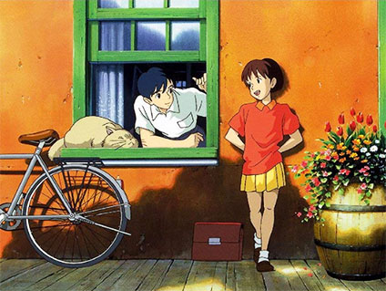

Betrachtet man die Geschichte von Studio Ghibli, so scheinen „Porco Rosso“ (1992) und „Stimme des Herzens“ (1995), die in der ersten Hälfte bis Mitte der 1990er Jahre veröffentlicht wurden, auf den ersten Blick zwei völlig entgegengesetzte Werke zu sein. Während Ersteres eine Fantasie ist, die in der Adria spielt und den Kampf und die Melancholie eines fliegenden Kopfgeldjägers darstellt, der durch einen Fluch in ein Schwein verwandelt wurde, ist Letzteres ein Jugend-Ensembledrama, das in der modernen Tama New Town spielt und die unschuldige Liebe und die Konflikte über den zukünftigen Weg von Mittelschülern schildert.

Was diese beiden Werke jedoch verbindet, ist der unstillbare Forscherdrang von Studio Ghibli, genauer gesagt der außergewöhnlichen Schöpfer Hayao Miyazaki und Yoshifumi Kondo, „Realismus (Wirklichkeitsnähe)“ mit den Ausdrucksmitteln der Animation bis zum Äußersten zu verfolgen. Und an der Basis davon liegt eine intensive Sehnsucht nach dem „Fliegen“ – dem physischen Fliegen am Himmel oder dem mentalen Aufsteigen über die eigenen Grenzen hinaus. In diesem Kapitel werden wir tief in die historische Kulisse und die technische Theorie eintauchen, um herauszufinden, welche einzigartige Position diese beiden Werke in der Geschichte der Animation einnehmen und welche technischen und thematischen Errungenschaften sie erzielt haben.

## 1. „Porco Rosso“ – Der Gipfel der Aerodynamik und eine Elegie auf eine verlorene Zeit

„Porco Rosso“ (Originaltitel: Il Porco Rosso) hat eine einzigartige Entstehungsgeschichte, da es ursprünglich als Kurzfilm für die Bordunterhaltung von Japan Airlines geplant war, sich dann aber zu einem Spielfilm entwickelte, wobei der Jugoslawienkrieg als düsterer Schatten der Realität darüber lag. Dieses Werk hat eine extrem persönliche Note, da Hayao Miyazaki es für sich selbst und als „Film für Männer mittleren Alters, deren Gehirnzellen vor lauter Erschöpfung zu Tofu geworden sind“ geschaffen hat.

### 1.1 Hayao Miyazaki und Flugzeuge: Ein Fetisch für Mechanik und die detaillierte Darstellung von Aerodynamik

Hayao Miyazakis Obsession für das „Fliegen“ ist weithin bekannt, aber in der Darstellung der Flugboote in „Porco Rosso“ kommen sein eigener Fetisch für Mechanik und sein tiefes Verständnis für Aerodynamik in ihrer reinsten Form zum Ausdruck. Die in diesem Werk vorkommenden Flugboote – die scharlachrote Savoia S.21, das geliebte Flugzeug der Hauptfigur Porco Rosso (ein Originalmodell, das Elemente realer Flugzeuge wie der Macchi M.33 und der Savoia-Marchetti S.59 mischt), das Flugzeug des Rivalen Curtis und die bunte Mischung an Flugbooten der Luftpiraten-Allianz – sind nicht nur Hintergründe oder Requisiten, sondern agieren selbst als eigenständige Charaktere.

Besonders erwähnenswert ist die Tatsache, dass „Lüge und Wahrheit physikalischer Gesetze“ in der Animation in einer exquisiten Balance kontrolliert werden, vom Luftwiderstand, dem Auftrieb, dem Drehmoment des Propellers, der Vibration des Motors bis hin zur strömungsmechanischen Darstellung beim Starten vom und Landen auf dem Wasser.

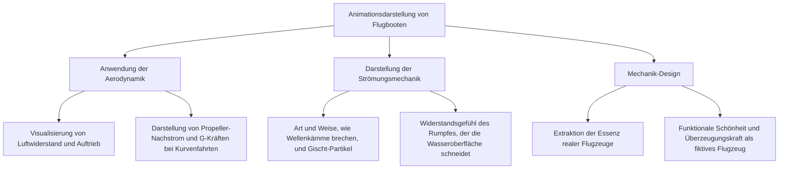
```mermaid
graph TD
    A["Animationsdarstellung von Flugbooten"] --> B["Anwendung der Aerodynamik"]
    A --> C["Darstellung der Strömungsmechanik"]
    A --> D["Mechanik-Design"]
    B --> E["Visualisierung von Luftwiderstand und Auftrieb"]
    B --> F["Darstellung von Propeller-Nachstrom und G-Kräften bei Kurvenfahrten"]
    C --> G["Art und Weise, wie Wellenkämme brechen, und Gischt-Partikel"]
    C --> H["Widerstandsgefühl des Rumpfes, der die Wasseroberfläche schneidet"]
    D --> I["Extraktion der Essenz realer Flugzeuge"]
    D --> J["Funktionale Schönheit und Überzeugungskraft als fiktives Flugzeug"]
```

In der Szene, in der Porcos Savoia den Motor anlässt, wird der gesamte Prozess von der Zündung der Zylinder über das beginnende winzige Vibrieren des gesamten Flugzeugs bis hin zum Ausstoß von schwarzem Rauch aus dem Auspuffrohr durch die feinen Vibrationen der Cel-Animation und Mehrfachbelichtung (eine analoge Aufnahmetechnik der damaligen Zeit) dargestellt. In den Luftkampf-Sequenzen (Dogfights) werden die körperliche Belastung der Piloten, die beim Wenden den G-Kräften (Schwerebeschleunigung) standhalten, und die winzigen Bewegungen von Steuerknüppel und Seitenruderpedalen, mit denen das Flugzeug kurz vor dem Strömungsabriss (Stall) kontrolliert wird, mit extrem präzisem Timing (Frame-Rate) dargestellt. Dies ist das Ergebnis der perfekten Nachzeichnung von Miyazakis im Gehirn existierendem „körperlichem Gefühl des Fliegens“ auf Zelluloid durch die Hände der Animatoren.

### 1.2 Widerstand gegen den Faschismus und Anarchismus, die in den Himmel über der Adria hallen

Schauplatz dieses Werkes ist die Adria und Italien Ende der 1920er Jahre. Es ist eine Zeit des Aufruhrs und der Angst, in der die Narben des Ersten Weltkriegs noch vorhanden sind und die von Mussolini geführte faschistische Partei an die Macht kommt. Porco Rosso (mit bürgerlichem Namen Marco Pagot) war einst ein Elitepilot der italienischen Luftwaffe, verzweifelte aber am System von Staat und Militär, verfluchte sich selbst, um ein Schwein zu werden, und wählte den Weg als Gesetzloser (Anarchist) und Kopfgeldjäger.

Porcos berühmtes Zitat „Lieber ein Schwein als ein Faschist“ ist nicht nur ein hartgekochter Spruch. Es ist ein starkes Statement von Miyazakis eigenem Anti-Faschismus und Anarchismus, in dem er es ablehnt, in den riesigen Gewaltapparat des Staates integriert zu werden, und individuelle Freiheit und Würde im staatenlosen Raum des Himmels sucht.

In der zweiten Hälfte des Films spiegelt die Szene, in der sich Porco heimlich im Kino mit seinem ehemaligen Waffenbruder Ferrarin (jetzt Major der faschistischen Luftwaffe) trifft, den politischen Hintergrund des Werkes stark wider. Ferrarin murmelt: „Wir müssen jetzt für so idiotische Sponsoren wie den Staat oder die Nation fliegen.“ Hier wird unerbittlich der Prozess dargestellt, wie die reine Freude am Fliegen zu einer staatlichen Ideologie oder einem Kriegswerkzeug mutiert. Der Grund, warum Porco zu einem Schwein wurde, wird nicht explizit genannt, aber es fungiert als tiefe Verzweiflung über eine absurde Welt, in der sich Menschen gegenseitig umbringen, als Abwehrmechanismus, um sich von einer Gesellschaft zu entfremden, die den Konformitätsdruck erhöht, oder als Ausdruck des Paradoxons: „Solange man eine menschliche Gestalt hat, kann man die menschliche Würde nicht wahren.“

### 1.3 „Ein Schwein, das nicht fliegt, ist nur ein gewöhnliches Schwein“ – Die Romantik, die Frustration und der Fluch eines Mannes mittleren Alters

Der Grund, warum „Porco Rosso“ die Herzen vieler Erwachsener in seinen Bann zieht, liegt darin, dass dieses Werk eine traurige Elegie auf das „Verlorene“ ist. Porco trägt ein starkes Gefühl des Verlustes und Überlebensschuld (Survivor Guilt) gegenüber seinen Kameraden in sich, die im Ersten Weltkrieg gefallen sind (die Szene mit den Illusionen der Flugzeuge, die zu einer Wolkenebene aufsteigen, ist eine berühmte Szene, die in die Filmgeschichte eingegangen ist).

Wie das von Gina gesungene Chanson „Le Temps des cerises“ (Die Zeit der Kirschen) (bekannt als ein Lied, das den Zusammenbruch der Pariser Kommune betrauert) symbolisiert, ist dieser Film voller tiefer Nostalgie für die guten alten Zeiten, die unerreichbare Jugend und unwiderrufliche Verluste. Die Darstellung der reifen, aber mit einer nie zu überbrückenden Distanz versehenen erwachsenen Liebe zwischen Porco und Gina nimmt unter den Ghibli-Werken eine besondere Stellung ein. Porco benutzt den „Fluch“ als Ausrede und flieht vor Ginas Liebe und der realen gesellschaftlichen Teilhabe. Hinter dem Werbespruch „Das bedeutet es, cool zu sein.“ verbirgt sich die schmerzhafte Geschichte von der „Selbstakzeptanz eines Mannes mittleren Alters“, der die Einsamkeit des Festhaltens an seiner eigenen Ästhetik und die Akzeptanz seiner eigenen Veraltung auf sich nimmt.

## 2. „Stimme des Herzens“ – Der schmerzhafte Realismus der Pubertät und die Magie des Raumes

Das 1995 erschienene „Stimme des Herzens“ ist ein monumentales Werk, das von Hayao Miyazaki produziert, geschrieben und als Storyboard entworfen wurde, während Yoshifumi Kondo, der zentrale Animator von Studio Ghibli, hier seine einzige Regie bei einem abendfüllenden Film führte. Obwohl es auf dem gleichnamigen Mädchen-Manga von Aoi Hiiragi basiert, wurde das Werk durch die Hände von Miyazaki und Kondo über den Rahmen einer bloßen Liebesgeschichte hinaus zu einem realistischen Porträt der Pubertät erhoben, das zwischen dem zukünftigen Weg, dem Talent und der Angst vor der Selbstverwirklichung schwankt.

### 2.1 Der Blick von Yoshifumi Kondo: Die Essenz der Animation, die in alltäglichen Gesten wohnt

Der größte Reiz dieses Werkes, der auch als technische Errungenschaft bezeichnet werden kann, ist die kompromisslose Hingabe von Regisseur Yoshifumi Kondo an das „alltägliche Schauspiel“. In der Animation gilt es als weitaus schwieriger, „beiläufige alltägliche Handlungen“ wie das Gehen, Sitzen, Teekochen oder das Hinauflaufen einer Treppe einer Person genau und mit Emotionen darzustellen, als „außergewöhnliche (spektakuläre)“ Bewegungen wie Magie, Explosionen oder Roboterkämpfe zu zeichnen.

Yoshifumi Kondo war als Animationsdirektor bei Werken von Regisseur Isao Takahata (wie „Die letzten Glühwürmchen“ und „Tränen der Erinnerung – Only Yesterday“) tätig und ein Meister des „Lebensschauspiels“, bei dem er die Skelett- und Muskelbewegungen, die Schwerpunktverlagerung und den psychologischen Zustand der Charaktere in ihren Handlungen widerspiegelte. In „Stimme des Herzens“ kommt diese außergewöhnliche Beobachtungsgabe voll zur Geltung.

Zum Beispiel die Veränderung in der Haltung der Hauptfigur Shizuku Tsukishima, wenn sie in der Bibliothek ein Buch liest, die Fußbewegungen, wenn sie in Eile die Treppe hinunterläuft, oder die Blickwechsel und das Schulterzucken in ihren Interaktionen mit Seiji Amasawa in einem Zustand gemischt aus Liebe und Irritation. Jede dieser winzigen Animationen erzeugt eine starke Präsenz, dass ein Mädchen namens Shizuku wirklich dort existiert und atmet. Dies ist die Essenz von Animation, die „menschliches Leben“ bodenständig darstellt, im Gegensatz zu dem Vergnügen, durch die Fantasiewelten von Miyazakis Anime zu fliegen.

### 2.2 Location-Hunting und Raumgestaltung: Die „lebendige Stadt“ Tama New Town

Ein weiterer Hauptdarsteller dieses Werkes ist die Stadt selbst, in der es spielt. Basierend auf einem gründlichen Location-Hunting rund um Seiseki-Sakuragaoka (in der Nähe von Tama New Town) in Tokio, wurde der künstlerische Hintergrund dieses Werkes mit erstaunlichem Realismus konstruiert.

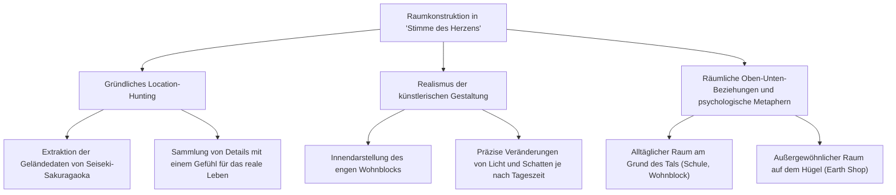
```mermaid
graph TD
    A["Raumkonstruktion in 'Stimme des Herzens'"] --> B["Gründliches Location-Hunting"]
    A --> C["Realismus der künstlerischen Gestaltung"]
    A --> D["Räumliche Oben-Unten-Beziehungen und psychologische Metaphern"]
    B --> E["Extraktion der Geländedaten von Seiseki-Sakuragaoka"]
    B --> F["Sammlung von Details mit einem Gefühl für das reale Leben"]
    C --> G["Innendarstellung des engen Wohnblocks"]
    C --> H["Präzise Veränderungen von Licht und Schatten je nach Tageszeit"]
    D --> I["Alltäglicher Raum am Grund des Tals (Schule, Wohnblock)"]
    D --> J["Außergewöhnlicher Raum auf dem Hügel (Earth Shop)"]
```

Die Hintergrundbilder von Artdirector Satoshi Kuroda und seinem Team fangen die Textur des anorganischen Betons des Wohnblocks, die steilen Hänge, die engen Gassen und das Stadtbild in der Abenddämmerung meisterhaft ein. Besonders bemerkenswert ist die Darstellung des „engen Wohnblocks“, in dem Shizuku lebt. Überquellende Bücher, ein unordentlicher Esstisch, ein enges Schwesternzimmer mit einem Etagenbett. Diese erdrückende (aber gleichzeitig warme) Darstellung des realen Lebensraums untermauert Shizukus Durst nach dem Fliegen (d. h. den Drang, Geschichten zu schreiben) in dem Sinne: „Ich möchte hier ausbrechen und in eine viel weitere Welt gehen.“

Darüber hinaus fungiert die Topographie (Höhenunterschiede) der Stadt hervorragend als psychologische Metapher. Shizukus Alltag (Schule und Wohnblock) befindet sich „unten“, und der Antiquitätenladen „Earth Shop“, zu dem sie geführt von der geheimnisvollen Katze (Moon) gelangt, befindet sich „auf dem Hügel“, nachdem man einen steilen Hang hinaufgestiegen ist. Dieser Höhenunterschied visualisiert Shizukus geistiges Streben nach oben und die Schwierigkeit, in unbekanntes Terrain vorzudringen.

### 2.3 Die Wärmequelle der Schöpfung und der Schmerz der Selbstverwirklichung: Der von Baron geführte „Innere Flug“

„Stimme des Herzens“ ist ein Liebesfilm und gleichzeitig eine eindringliche „Selbstfindungsgeschichte eines Schöpfers“. Gegenüber Seiji, der mit dem klaren Ziel, Geigenbauer zu werden, nach Italien studieren (fliegen) will, gerät Shizuku in Panik und beginnt, eine Geschichte (den Fantasy-Roman in der Geschichte von „Stimme des Herzens“) zu schreiben, um den „Rohdiamanten“ in sich selbst zu überprüfen.

Das Interessante hierbei ist, dass in der Welt der Geschichte in der Geschichte eine Sequenz eingefügt ist, in der Shizuku zusammen mit dem Katzenbaron „in den Himmel fliegt“. Diese fantastische Szene, deren Hintergrundkunst von Naohisa Inoue geschaffen wurde, einem Maler, der für „Iblard“ bekannt ist, stellt einen „inneren Flug“ als Befreiung der Vorstellungskraft dar, der im Gegensatz zu dem physischen Flug in „Porco Rosso“ steht.

Dieser Film endet jedoch nicht als bloße Traumgeschichte. Nachdem Shizuku den Besitzer des Earth Shops gebeten hat, den Roman zu lesen, den sie ohne Schlaf und Pause geschrieben hat, erkennt sie schmerzhaft, dass ihr eigenes Werk ungeschliffen und unausgereift ist, und weint bitterlich. Die Eindringlichkeit dieser Szene, in der sie mit der grausamen Wand der Schöpfung konfrontiert wird und die Grenzen ihres eigenen Talents (dass ein ungeschliffener Rohdiamant nicht glänzt) trifft jeden, der schöpferisch tätig ist, tief ins Herz. Hayao Miyazaki und Yoshifumi Kondo vermeiden es, einen einfachen Erfolg darzustellen, und zeigen durch die Gestalt eines Mittelschulmädchens die strenge Ethik des Handwerkers, die besagt: „Trotzdem muss man weiter feilen und polieren.“

## 3. Fazit: Flugzeuge und Geigen, die Geschichten der jeweiligen „Handwerker“

„Porco Rosso“ und „Stimme des Herzens“. Ein Schwein mittleren Alters, das durch den Himmel über der Adria fliegt, und eine Mittelschülerin, die auf einem Fahrrad die Hänge von Tama New Town hinauffährt. Diese beiden Geschichten, die auf den ersten Blick keinerlei Berührungspunkte zu haben scheinen, sind durch die Achse des „Respekts für das Handwerkertum“ fest miteinander verbunden.

Fio und die Arbeiterinnen der Firma Piccolo, die Porcos geliebtes Flugzeug perfekt reparieren und tunen. Und Seiji, der hart für seine Ausbildung als Geigenbauer in Cremona arbeitet, und der Besitzer des Earth Shops, der weiterhin antike Uhren repariert. Ghibli-Werke haben durchweg ein unübertroffenes Loblied auf die „Handwerker (Artisanen)“ gesungen, die Dinge mit ihren eigenen Händen erschaffen und ihre Fähigkeiten weiter verfeinern.

So wie Porco kämpft, um die Freiheit des Himmels zu verteidigen, ergreift auch Shizuku das Werkzeug der Worte, um ihre eigene innere Stimme (Geschichte) zu spinnen. Der physische „Flug“ und der „Sprung“ der Vorstellungskraft. Auch wenn die Ausdrucksmittel unterschiedlich sind, hat die Perfektion des Realismus, die das Studio Ghibli in dieser Zeit erreichte, den erhabenen Willen des Menschen, der sich gegen die Schwerkraft der realen Welt (gesellschaftliche Bindungen und eigene Grenzen) auflehnt und dennoch versucht, hoch in die Luft zu fliegen, mit überwältigender visueller Schönheit auf Film gebannt. Im nächsten Kapitel werden wir den Konflikt zwischen Natur und Mensch in „Prinzessin Mononoke“ erörtern, einem beispiellosen Epos, das aus der Verbindung dieses kompromisslosen Realismus und Naturalismus mit der mythologischen Vorstellungskraft entstanden ist.

# Kapitel 4: Ökologie und mythologische Vorstellungskraft (Prinzessin Mononoke)

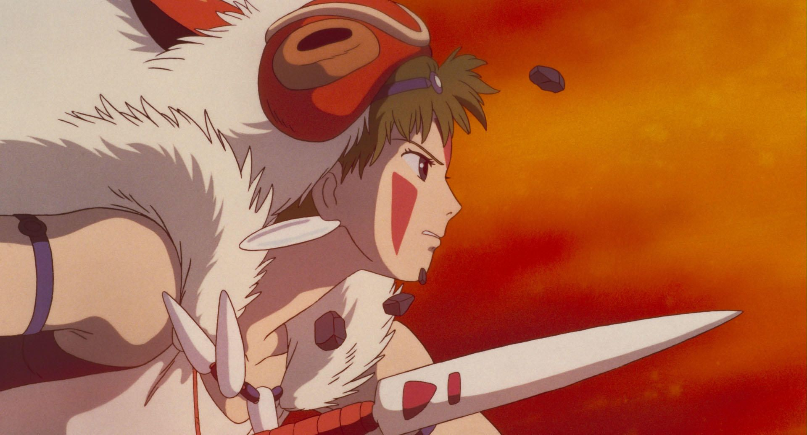

„Prinzessin Mononoke“, veröffentlicht 1997, ist ein monumentaler Prototyp, der zu einem klaren Wendepunkt in der Karriere des Studios Ghibli und des Regisseurs Hayao Miyazaki wurde. Dieses Werk sprengte den Rahmen eines bloßen Animationsfilms und hatte eine so enorme kulturelle und industrielle Wirkung, dass es die Geschichte des japanischen Films neu schrieb. In diesem Kapitel werden wir die vielschichtigen Themen dieses Werkes – die Dekonstruktion der japanischen Geschichte des Mittelalters, die non-dualistische Phase von Gut und Böse und die Verschmelzung von Computergrafik (CG) und traditioneller Cel-Animation als technologischen Wendepunkt – bis ins äußerste Detail aufschlüsseln.

## 1. Industrieller Kontext: Explosion der Produktionskosten und Erneuerung der Kassenrekorde
Die Produktion von „Prinzessin Mononoke“ war ein gewaltiges Projekt von beispiellosem Ausmaß, bei dem das Schicksal von Studio Ghibli auf dem Spiel stand. Von Anfang an ging Regisseur Hayao Miyazaki mit der Entschlossenheit an die Arbeit, dass „dies möglicherweise mein letztes Werk vor dem Ruhestand sein könnte“, und sein kompromissloser Auteurismus ließ die Produktionszeit und das Budget ins Unermessliche ansteigen. Die Gesamtproduktionskosten sollen etwa 2 Milliarden Yen betragen haben, eine für einen damaligen japanischen Film absurde Summe. Die Anzahl der gezeichneten Bilder erreichte etwa 144.000, was dem Zwei- bis Dreifachen eines normalen Animations-Spielfilms entspricht.

Um dieses enorme Risiko wieder hereinzuholen, entfaltete Produzent Toshio Suzuki eine Medienmix- und Werbestrategie von beispiellosem Ausmaß. Der einprägsame Slogan „Lebe.“ von Shigesato Itoi fungierte als eine Antwort auf die von Untergangsstimmung und Beklemmung geprägte Atmosphäre, die die damalige japanische Gesellschaft zum Ende des Jahrhunderts bedeckte (das Trauma des Jahres 1995 mit dem Erdbeben von Kobe und dem Sarin-Giftgasanschlag in der U-Bahn).

Als Ergebnis verzeichnete dieses Werk 14,2 Millionen Kinobesucher und spielte 19,3 Milliarden Yen ein. Es übertraf den damaligen Rekord der höchsten Einspielergebnisse japanischer Filme (ein Rekord, der zuvor von „E.T.“ gehalten wurde) bei weitem und festigte die Position von Studio Ghibli in Japan als Produzent „nationaler Filme“. Dieser industrielle Erfolg bewies, dass japanische Animationen auch bei der Behandlung tiefgründiger Themen für Erwachsene zu einem riesigen Geschäft werden können, und hatte einen enormen Einfluss auf das Geschäftsmodell der späteren Animationsindustrie.

## 2. Zeiteinstellung und mythische Rekonstruktion: Warum die Muromachi-Zeit?

Hayao Miyazaki wählte für die Handlung dieses Werks bewusst die „Muromachi-Zeit“, eine Übergangsphase in der japanischen Geschichte. Dass er sich nicht für die Edo-Zeit (eine friedliche, kontrollierte Gesellschaft mit einem festen Klassensystem) oder die Sengoku-Zeit (Machtkämpfe der Kriegsherren) entschied, die in traditionellen historischen Dramen bevorzugt dargestellt werden, sondern für die von Chaos geprägte Muromachi-Zeit, hat eine tiefgreifende ideologische Absicht.

Die Muromachi-Zeit war eine Ära des Übergangs von einer landwirtschaftlich geprägten Gesellschaft zur Geldwirtschaft, der Entwicklung des Handwerks und vor allem des beginnenden deutlichen Hervortretens der „Überlegenheit der menschlichen Technologie über die Natur“. Die Eisenproduktion (Tatara-Schmelzen) begann in großem Maßstab, und während die damit einhergehende Abholzung voranschritt, blieben in den Bergen immer noch tiefe Urwälder bestehen, in denen man an die reale Existenz von Göttern glaubte. Mit anderen Worten, es war eine Zeit an der Grenze, in der Mensch und Natur oder Moderne und Vormoderne heftig aufeinanderprallten und in Konflikt gerieten.

Stark beeinflusst von den Forschungen des Historikers Yoshihiko Amino über das „nicht-landwirtschaftliche Volk (Handwerker, Kaufleute, Kurtisanen, Unterhaltungskünstler usw.)“ (Muen, Kugai, Raku), dekonstruierte Miyazaki die traditionelle, homogene Sichtweise der japanischen Geschichte als „Land der üppigen Reisähren“. Die im Film erscheinende Tatara-Eisenhütte wird als eine Art Asyl (Zufluchtsort / freier Raum) dargestellt, der nicht der Herrschaft von Kaiser oder Daimyos unterliegt. Dort haben Randgruppen der Gesellschaft wie Leprakranke (Erkrankte) und verkaufte Frauen durch die hochentwickelte Technologie der Eisenproduktion ihre Unabhängigkeit erlangt und ihre eigene Utopie aufgebaut.

Auf diese Weise war „Prinzessin Mononoke“ nicht nur eine einfache Fantasy-Geschichte, sondern der Versuch, Licht auf die dunklen Seiten der Geschichte zu werfen und die Identität und das Naturverständnis der Japaner auf mythischer Ebene zu rekonstruieren.

## 3. Herrin Eboshi und San: Der Nondualismus von Gut und Böse

Der bahnbrechendste Aspekt dieses Werkes besteht darin, dass das traditionelle, hollywood- oder disneyartige Paradigma der „Belohnung des Guten und Bestrafung des Bösen“ vollständig aufgegeben wurde. Die Menschen auf der Seite der Naturzerstörer werden nicht einfach als „böse“ verurteilt, sondern vielmehr werden ihre Lebensweise und ihre Würde kraftvoll dargestellt.

Das Symbol dafür ist Herrin Eboshi, die Anführerin der Tatara-Eisenhütte. Sie ist die Hauptverantwortliche für die Zerstörung der Natur, indem sie die Berggötter tötet und den Wald abholzt, aber gleichzeitig ist sie eine herausragende Humanistin und Revolutionärin, die von der Gesellschaft verstoßene Schwache schützt und ihnen einen Lebenssinn und Würde gibt. Eboshi zerstört den Wald keineswegs aus Eigennutz. Damit die Menschen Armut und Diskriminierung entkommen und unabhängig überleben können, bleibt ihnen nichts anderes übrig, als die Natur zu erobern und Eisen zu produzieren. Gerade dieser Widerspruch, dass „gute Absichten im Ergebnis den Bereich des Anderen (der Natur) verletzen“, ist das Wesen des menschlichen Karmas.

Im Gegensatz dazu ist San (Prinzessin Mononoke) ein Mädchen, das von Menschen ausgesetzt und von Wolfshunden aufgezogen wurde. Sie hasst die Menschen und trachtet Eboshi nach dem Leben, um den Wald zu beschützen, aber sie selbst ist ebenfalls ein Grenzwesen, das nicht vollständig zur „Bestie“ werden kann. Ashitaka steht zwischen diesen beiden unvereinbaren Gerechtigkeiten – dem „Recht des Menschen auf Überleben“ und der „Heiligkeit der Natur“ – und versucht, „mit ungetrübtem Auge zu sehen und zu entscheiden“, doch auch er kann keine klare Lösung finden.

Am Ende der Geschichte bekommt der Waldgott seinen Kopf zurück und löst sich auf, und der uralte Wald ist verloren. Die Tatara-Eisenhütte bricht jedoch ebenfalls zusammen, und die Menschen geloben einen Neuanfang von null, mit den Worten: „Lasst uns hier ein gutes Dorf aufbauen.“ Ashitaka und San entscheiden sich dafür, beide weiterzuleben, werden aber nicht unter einem Dach wohnen. Ashitaka wird in der Tatara-Eisenhütte leben und San im Wald, was eine Form der Koexistenz bedeutet, bei der Ashitaka sagt: „Ich werde dich manchmal besuchen.“ Dies lehnt die oberflächliche Katharsis einer vollkommenen Harmonie zwischen Mensch und Natur ab und ist eine harte, aber hoffnungsvolle Botschaft, im ewig währenden Spannungsverhältnis zu „leben“.

## 4. Technologischer Wendepunkt: Die hochgradige Verschmelzung von CG und handgezeichneter Animation

„Prinzessin Mononoke“ sollte auch als das Werk in Erinnerung bleiben, in dem Studio Ghibli erstmals in großem Umfang Computergrafik (CG) einführte. Hayao Miyazaki bestand viele Jahre absolut auf der handwerklichen Kunst des Handzeichnens (Cel-Animation), doch um die überwältigende Dynamik und Komplexität zu verwirklichen, die in diesem Werk dargestellt werden sollten, war die Einführung digitaler Technologie unumgänglich.

Die Verwendung von CG bei Ghibli war jedoch kein Übergang zu vollständigem 3DCG, sondern vielmehr ein „digitales Compositing“ und eine „Verschmelzung von 3D und 2D“, um die Ausdruckskraft des Handgezeichneten zu erweitern und zu ergänzen. Die CG-Schnitte machten nur etwas mehr als 100 von insgesamt 1620 Schnitten aus, aber ihre Wirkung war enorm.

### Die Darstellung des Tatarigami (Fluchgottes)

Am symbolträchtigsten und technisch am anspruchsvollsten war die Darstellung des Tatarigami (des verfluchten Eber-Gottes) am Anfang. Die Darstellung zahlloser schlangenartiger Tentakel (schlangenförmiger Fluch), die sich winden und wie Schlamm ineinandergreifend vorwärtsbewegen, hätte für handzeichnende Animatoren eine albtraumhafte Menge an Arbeit bedeutet.

Hier wendete das Produktionsteam eine Methode an, die 3DCG-Partikelsimulation mit handgezeichneten Bildern kombinierte. Zunächst wurden die Grundbewegungen und das Skelett der Tentakel in 3DCG konstruiert und mit handgezeichneten Texturen belegt. Darüber hinaus überarbeiteten (retuschierten) die Animatoren dieses CG-Material per Hand, wodurch die CG-typische anorganische Kälte beseitigt wurde und sie zu einem organischen, lebendigen Ausdruck gelangten, der genau wie der „Groll“ selbst wirkte.

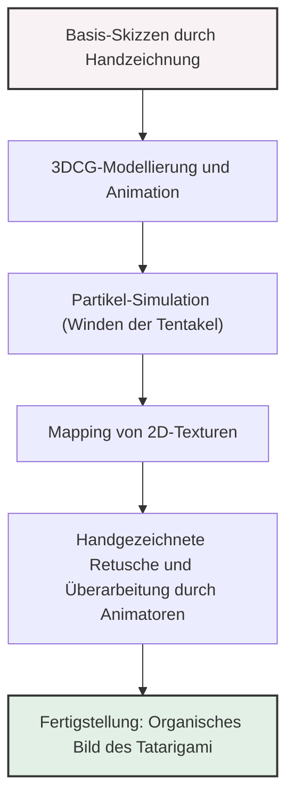
```mermaid
graph TD
    A["Basis-Skizzen durch Handzeichnung"] --> B["3DCG-Modellierung und Animation"]
    B --> C["Partikel-Simulation (Winden der Tentakel)"]
    C --> D["Mapping von 2D-Texturen"]
    D --> E["Handgezeichnete Retusche und Überarbeitung durch Animatoren"]
    E --> F["Fertigstellung: Organisches Bild des Tatarigami"]
    
    style A fill:#f9f2f4,stroke:#333,stroke-width:2px
    style F fill:#e2f0e6,stroke:#333,stroke-width:2px
```

### Digitales Mapping und dynamische Kameraführung

Eine weitere Innovation war die digitale Verarbeitung von Hintergrundbildern (Kunst). Bisher waren dreidimensionale Schwenks (Rundumschwenks), bei denen die Kamera bei Cel-Animationen scheinbar umherfährt, auf eine extrem hochgradige Handwerkskunst angewiesen (Berechnung der Perspektive), bei der der Hintergrund verzerrt gezeichnet werden musste.

In „Prinzessin Mononoke“ wurde in Szenen, in denen Ashitaka sein Dorf verlässt, oder zur Darstellung der Tiefen des Waldes des Shishigami, die „3D-Mapping“-Technologie eingesetzt, bei der wunderschöne, vom Kunstpersonal handgezeichnete Hintergrundbilder als Texturen auf ein in 3DCG erstelltes Geländemodell geklebt wurden. Dies ermöglichte die räumliche Tiefe wie in einem Live-Action-Film und eine dynamische Kameraführung, die sich frei in alle Richtungen bewegen konnte, während die Wärme und malerische Schönheit der Handzeichnung erhalten blieben.

Auch der Lebenszyklus, bei dem Pflanzen zu Füßen des Shishigami augenblicklich keimen, wachsen und verdorren, wurde durch den Einsatz von Morphing-Technologie und digitalem Compositing dargestellt. Auf diese Weise war das CG in „Prinzessin Mononoke“ keineswegs dazu gedacht, mit Technologie zu prahlen, sondern fungierte als ein unverzichtbarer Pinsel (Werkzeug), um die mythischen und betörenden Visionen in Hayao Miyazakis Geist auf der realen Leinwand zu verankern.

## Fazit

„Prinzessin Mononoke“ ist ein Höhepunkt, den Studio Ghibli erreicht hat. Während es tief im historischen Boden des japanischen Mittelalters verwurzelt ist, gewinnen die dort thematisierten ökologischen Fragen und der Nondualismus von Gut und Böse in der modernen globalen Gesellschaft zunehmend an aktueller Bedeutung. Die visuelle Schönheit, in der sich Handzeichnung und Digitaltechnik in einer wunderbaren Balance vereinen, weist zudem eine beispiellose Perfektion auf. Im nächsten Kapitel, „Kapitel 5: Magie des Alltags und Nostalgie (Chihiros Reise ins Zauberland)“, werden wir die neue Wende Ghiblis betrachten, bei der man sich von diesem mythischen Maßstab abwendet und in die seelische Landschaft eines modernen Mädchens eintaucht.

# Kapitel 5: Digitaler Übergang und weltweite Anerkennung (Chihiros Reise ins Zauberland, Das Königreich der Katzen)

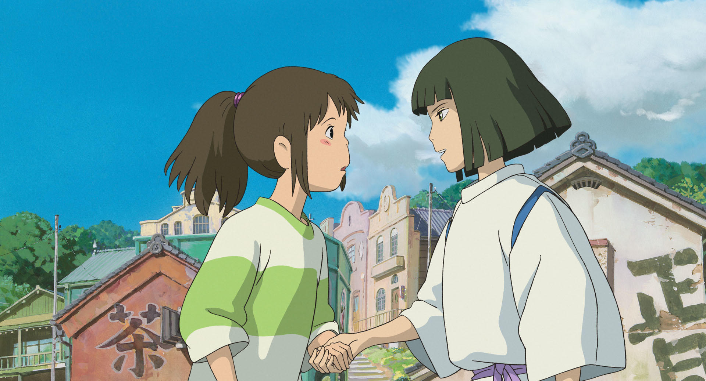
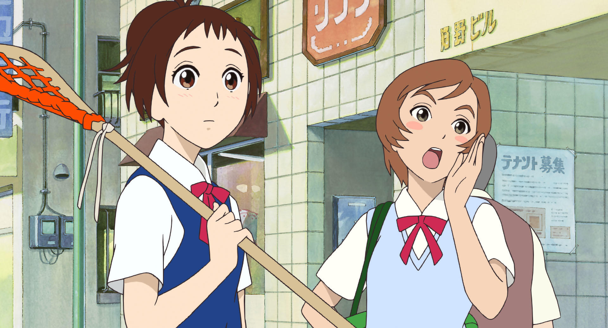

In der Geschichte von Studio Ghibli waren die frühen 2000er Jahre die Ära des dramatischsten technologischen, expressiven und kommerziellen Wendepunkts. In diesem Kapitel wird aus der Perspektive eines Profis im Detail beschrieben, wie der Übergang von der Cel-Animation zu einer vollständig digitalen Umgebung die visuelle Darstellung von Ghibli-Werken in nie dagewesene Sphären ausdehnte und welche weltweite Anerkennung und kulturellen Einfluss die daraus resultierenden Werke „Chihiros Reise ins Zauberland“ (2001) und das als Wegbereiter für die nächste Generation dienende „Das Königreich der Katzen“ (2002) über die Grenzen Japans hinaus brachten.

## 1. Von Analog zu Digital: Der technologische Paradigmenwechsel und die Rekonstruktion der Ästhetik bei Studio Ghibli

Die „Digitalisierung“ in der Animationsproduktion bedeutet nicht einfach nur eine Effizienzsteigerung oder Kostensenkung. Es handelte sich um einen grundlegenden Paradigmenwechsel in der Filmproduktion, bei dem alle im Bild vorhandenen visuellen Elemente als numerische Daten vollständig kontrollierbar wurden. Die Einführung der digitalen Technologie bei Studio Ghibli wurde 1997 in „Prinzessin Mononoke“ probeweise für das Winden der Tentakel des Tatarigami, die halbdurchsichtige Textur des Daidarabotchi und einige 3DCG-Hintergründe getestet, woraufhin 1999 bei „Meine Nachbarn die Yamadas“ vollständig digitales Zeichnen angewendet wurde. Es war jedoch das Werk „Chihiros Reise ins Zauberland“, das in einem Film von Regisseur Hayao Miyazaki als erstes die überaus schwierige Aufgabe vollbrachte, die lebendige Textur traditioneller Cel-Animationen zu bewahren und sie im digitalen Raum minutiös zu rekonstruieren.

Durch diesen vollständigen Übergang zu einem rein digitalen System verschwanden physische „Cels“ und „Animationsfarben“ vom Produktionsort. Es wurde ein Workflow etabliert, bei dem die auf Papier gezeichneten Schlüsselbilder und Inbetween-Animationen hochauflösend eingescannt und per Software digital eingefärbt wurden. Dadurch wurde man endlich von den physischen Einschränkungen befreit, die für die analoge Technik typisch waren, wie etwa die Abschwächung des durchgelassenen Lichts (das Phänomen, dass das Bild dunkler wird), die durch das Aufeinanderlegen mehrerer physischer Cels verursacht wurde, oder Kratzer auf den Cels und das Eindringen von Staub.

Noch innovativer war die enorme Steigerung der Ausdruckskraft im „Kamera (Compositing)“-Prozess. Es wurde eine hochgradige, vielschichtige Tiefendarstellung möglich, die die Kameralinsen von Live-Action-Filmen imitierte, indem Objekte auf dem Bildschirm (Charaktere, die Schnecke im Vordergrund, das Gebäude im Hintergrund, Effekte usw.) in eine unbegrenzte Anzahl von Ebenen unterteilt und jeweils mit einer unterschiedlichen Schärfentiefe versehen wurden. Die räumliche Darstellung, die bei den Multiplan-Kamerasystemen der analogen Ära auf wenige Ebenen beschränkt war, konnte im digitalen Raum unendlich viele Abstufungen haben, sodass die aufragende Größe des Badehauses (Aburaya) oder die unergründliche Tiefe der Treppe, die in den Abgrund führt, mit einer überwältigenden Perspektive auf die Augen der Zuschauer einwirkten.

## 2. Die Alchemie der Farbgestaltung durch Michiyo Yasuda: Die unendliche Erweiterung des Farbausdrucks durch vollständig digitale Kolorierung

Das Element, das am meisten von dieser digitalen Umstellung profitierte, war die „Farbe“. Die geniale Koloristin Michiyo Yasuda, die das Farbdesign in den Werken von Hayao Miyazaki und Isao Takahata schon seit vor der Gründung von Studio Ghibli viele Jahre lang unterstützte, schaffte es durch den vollständigen Übergang zum digitalen Malen, eine beispiellose Magie auf die Leinwand zu zaubern.

In der Zeit, als physische Farben verwendet wurden, gab es eine klare Grenze für die Anzahl der verfügbaren Farben. Die Obergrenze der in einem einzelnen Werk verwendeten Farbarten lag bei einigen hundert Farben, und um komplexe Schatten oder die subtilen Veränderungen des Umgebungslichts in der Abenddämmerung darzustellen, blieb nichts anderes übrig, als optische Täuschungen innerhalb einer begrenzten Palette anzustreben. Durch den Wechsel in eine digitale Umgebung wurde es jedoch theoretisch möglich, eine unendliche Anzahl von etwa 16,77 Millionen Farben (24-Bit-Farben) zu handhaben.

In „Chihiros Reise ins Zauberland“ nutzte Michiyo Yasuda diese unendliche Palette nicht für eine „exzentrische, psychedelische Farbgebung“, sondern für eine „durch und durch realistische Reproduktion des Umgebungslichts“ und einen „präzisen Gefühlsausdruck der Charaktere“. Die geheimnisvolle Stadt, in die sich Chihiro verirrt, und die farbenfrohe Beleuchtung des Badehauses (Aburaya), wo die Millionen Götter ihre Erschöpfung kurieren, sind nicht einfach nur auffällig. Die diffuse Reflexion des Lichts der roten Laternen auf dem nassen Kopfsteinpflaster, der zarte Schatten, der auf Chihiros Wange fällt, die fettige Textur der außerweltlichen Speisen, die ihre in Schweine verwandelten Eltern gierig verschlingen, und das lebendige und doch transparente Smaragdgrün der Schuppen von Haku, wenn er sich in einen Drachen verwandelt – die Einwirkung der Lichtquelle auf all diese Objekte wird entsprechend der Tageszeit und der Luftfeuchtigkeit des Raumes minutiös kontrolliert.

Besonders beeindruckend ist die „Harmonie“ zwischen den Charakteren und dem künstlerischen Hintergrund. In der analogen Ära kam es unweigerlich zu Brüchen in der Textur zwischen handgezeichneten Hintergrundbildern und den Cel-Zeichnungen, aber die Einführung des digitalen Compositings ermöglichte feine digitale Filterprozesse, um die atmosphärische Stimmung (Umgebungslicht) des Hintergrunds an die Farben der Charaktere anzupassen. In der Sequenz, in der Chihiro mit der Meeresbahn zum Sumpfboden fährt, sind die Farbveränderungen des Himmels und der Wasseroberfläche beim Übergang vom späten Nachmittag zur Dämmerung und schließlich zur Nacht sowie die Darstellung der halbdurchsichtigen Schatten der Passagiere, die darauf fallen, ein in die Animationsgeschichte eingehendes visuelles Gedicht, in dem die präzise Steuerung der digitalen Farbverläufe und Yasudas scharfer Sinn für Farben meisterhaft miteinander verschmelzen.

## 3. Japanischer Animismus und die Folklore des „Kamikakushi“

Der Grund dafür, dass dieses Werk weltweit beispiellose Anerkennung erlangte, liegt neben seiner überwältigenden visuellen Schönheit in der Tatsache, dass das extrem japanische Weltbild des „Animismus“ wunderbar in die Geschichte der Initiation eines modernen Mädchens sublimiert wurde.

Das Konzept, dass acht Millionen Götter in ein Badehaus kommen, um sich von der Erschöpfung des Alltags zu erholen, wirkte an sich schon äußerst frisch und tiefgründig aus der Sicht monotheistischer westlicher Werte. Die Darstellung des Flussgottes, der mit Schlamm, von Menschen illegal entsorgten Fahrrädern und Sperrmüll bedeckt ist und sich in einen „Faulgott“ verwandelt hat, ist eine direkte Botschaft an die moderne Umweltzerstörung und gleichzeitig die Visualisierung des grundlegenden shintoistischen Konzepts der „Reinigung von Verunreinigungen“. Solche lokalen (indigenen) folkloristischen Motive werden nahtlos mit globalen (universellen) Umweltproblemen verknüpft.

Zudem ist dieses Werk, wie der Titel „Kamikakushi“ andeutet, eine Geschichte über das Wandeln auf der Grenze zwischen Leben und Tod. Der verlassene Vergnügungspark jenseits des Tunnels und das Badehaus, das durch einen Fluss von ihm getrennt ist, sind eindeutige Metaphern für das „Jenseits“ oder die „Unterwelt“. In der japanischen Folklore gibt es das Tabu des „Yomotsuhegui“ – dass jemand, der verschwindet und im Jenseits isst, nicht in die ursprüngliche Welt zurückkehren kann –, das in der Szene eingebaut wurde, in der Chihiro von Haku eine geheimnisvolle Speise erhält, womit Hayao Miyazakis tiefe folkloristische Bildung das Grundgerüst der Geschichte fest stützt.

## 4. Das System des Badehauses (Aburaya) und die tiefgreifende Kritik an Kapitalismus und Konsumgesellschaft

Obwohl es im Gewand des Animismus daherkommt, funktioniert die Realität des „Badehauses“, das der Hauptschauplatz der Geschichte ist, als Metapher für eine extrem moderne Bürokratie und die kapitalistische Gesellschaft. Der Architekturstil des Badehauses selbst, der an eine groteske Verschmelzung japanischer und westlicher Elemente, pseudowestlicher Architektur der Meiji-Zeit und eines traditionellen heißen Quellen-Gasthauses erinnert, symbolisiert die chaotische Modernisierung Japans an sich.

Dieses riesige Badehaus, an dessen Spitze Yubaba herrscht, ist eine durch und durch hierarchische Gesellschaft und ein Raum, in dem alle Handlungen durch „Vertrag“ und „Arbeit“ bestimmt werden. Denen, die hier arbeiten, werden ihre „Namen“ genommen. Die Darstellung, in der Chihiro auf das einzige Zeichen „Sen“ reduziert wird, ist ein Entzug der Identität und eine scharfe Metapher für den Prozess, durch den Menschen im riesigen kapitalistischen System als austauschbare „Arbeitskräfte“ und „Zahnräder“ standardisiert werden. Die Regel, dass derjenige, der sich weigert zu arbeiten, in ein Tier (Schwein) oder Kohle verwandelt wird, konfrontiert uns mit der grausamen Realität der modernen Gesellschaft, in der es heißt: „Wer nicht arbeitet, darf nicht überleben.“

Darüber hinaus fungiert der einzigartige Charakter „Ohngesicht“ (Kaonashi), der in diesem Werk erscheint, als Symbol für die Pathologie, die von der modernen Konsumgesellschaft hervorgebracht wurde. Er hat keine eigene Stimme und kann nur kommunizieren, indem er unbegrenzt das liefert, was andere begehren (Goldstaub). Indem er dann andere verschlingt, leiht er sich deren Stimmen und Persönlichkeiten, um sein eigenes Selbst aufzublähen. Diese Gestalt des Ohngesichts ist nichts anderes als eine Karikatur des modernen Menschen, der echte Verbindungen zu anderen verloren hat und versucht, seine eigene Leere nur durch materiellen Konsum und die Macht des Geldes zu füllen. Wie sich die Angestellten des Badehauses um das vom Ohngesicht verstreute Geld drängen und schließlich verschlungen werden, zeigt Hayao Miyazakis kühl-analytischen, kritischen Blick darauf, wie der Kapitalismus der Begierde die Menschlichkeit zerstört und die Gemeinschaft zusammenbrechen lässt.

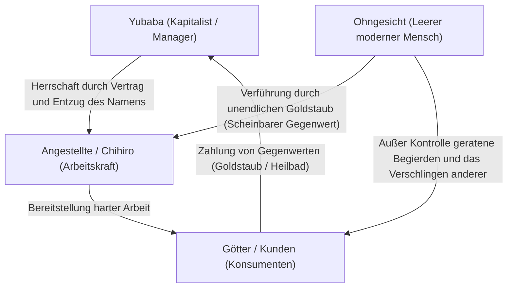
```mermaid
graph TD
    A["Yubaba (Kapitalist / Manager)"] -- "Herrschaft durch Vertrag und Entzug des Namens" --> B["Angestellte / Chihiro (Arbeitskraft)"]
    B -- "Bereitstellung harter Arbeit" --> C["Götter / Kunden (Konsumenten)"]
    C -- "Zahlung von Gegenwerten (Goldstaub / Heilbad)" --> A
    D["Ohngesicht (Leerer moderner Mensch)"] -- "Verführung durch unendlichen Goldstaub (Scheinbarer Gegenwert)" --> B
    D -- "Außer Kontrolle geratene Begierden und das Verschlingen anderer" --> C
```

## 5. Erlangung weltweiter Anerkennung: Der Schock durch den Gewinn des Academy Awards und das Aufstellen von Einspielrekorden

„Chihiros Reise ins Zauberland“, in dem solch eine mehrschichtige, tiefgreifende Thematik und die extreme visuelle Schönheit der vollständig digitalen Kolorierung verschmolzen, überschritt mühelos die Grenzen des Mediums Animation und verewigte seinen Namen in der Weltgeschichte des Kinos.

Auf den 52. Internationalen Filmfestspielen Berlin im Jahr 2002 setzte er sich gegen eine Vielzahl herausragender Live-Action-Meisterwerke durch und gewann den Hauptpreis, den „Goldenen Bären“, als erst zweiter Animationsfilm in der Geschichte (etwa ein halbes Jahrhundert nach „Cinderella“). Dieser großartige Erfolg war ein historischer Moment, in dem Animationen über Kinderunterhaltung hinaus weltweit als anspruchsvolle Kunstwerke anerkannt wurden. Zudem gewann der Film im darauffolgenden Jahr 2003 bei der 75. Oscarverleihung den Academy Award für den besten animierten Spielfilm. In der amerikanischen Filmindustrie, in der die 3DCG-Werke von Disney und Pixar zur Norm wurden, war die Bedeutung der Tatsache, dass ein japanischer handgezeichneter 2D-Animationsfilm (einschließlich digitaler Verarbeitung) an die Spitze gelangte, unermesslich.

Insbesondere die Tatsache, dass John Lasseter, eine Schlüsselfigur von Pixar und langjähriger Verbündeter von Hayao Miyazaki, freiwillig die Gesamtleitung der nordamerikanischen Version übernahm, spielte eine entscheidende Rolle bei der globalen Verbreitung der Ghibli-Werke. Durch Lasseters Einsatz wurde der Film über das Vertriebsnetz von Disney in ganz Amerika veröffentlicht und prägte den Schöpfern auf der ganzen Welt die Existenz von „Ghibli“ tief ein.

Auch innerhalb Japans war sein gesellschaftlicher Einfluss enorm. Die Einspielergebnisse von 31,68 Milliarden Yen stellten einen beispiellosen Megahit dar, der den damaligen Rekord für den ersten Platz in der Geschichte der japanischen Filme mit fast doppelt so viel Umsatz brach und ein gesellschaftliches Phänomen auslöste, bei dem es hieß: „Einer von vier Bürgern hat ihn im Kino gesehen.“ Dieser Erfolg veränderte das Geschäftsmodell der gesamten japanischen Filmindustrie grundlegend und bewies vollkommen, dass Animationsfilme eine gewaltige Kassenschlagkraft besitzen, die Live-Action-Filme übertrifft.

## 6. „Das Königreich der Katzen“ und die Ernennung von Regisseuren der nächsten Generation: Diversifizierung von Ghibli und Stabilisierung des digitalen Systems

Unmittelbar nach der historischen großen Begeisterung für „Chihiros Reise ins Zauberland“ wurde 2002 der Film „Das Königreich der Katzen“ unter der Regie von Hiroyuki Morita veröffentlicht. Bei diesem Werk handelt es sich um einen mittellangen Film (Spieldauer 75 Minuten), der als Spin-off positioniert ist und die von Shizuku Tsukishima, der Protagonistin aus „Stimme des Herzens“, geschriebene Geschichte darstellt. In der Planungsphase begann es als ein einzigartiges „Katzen-Projekt“ für einen Freizeitpark.

Der Versuch, junge und externe Regisseure anstelle der beiden Giganten Hayao Miyazaki und Isao Takahata, die eine überwältigende Ausstrahlung besaßen, zu engagieren und die Produktionslinie des Studios zu diversifizieren, war für Ghibli immer eine wichtige und schwierige Aufgabe. „Das Königreich der Katzen“ verkörpert ein leichtes und agiles Filmschaffen, das nur deshalb möglich wurde, weil das vollständig digitale Produktionssystem technisch im Studio etabliert war.

Im Gegensatz zu „Chihiro“, das den Geist des Publikums mit tiefgründiger Thematik und einer überwältigenden Menge an Details überwältigte, schildert „Das Königreich der Katzen“ das Abenteuer von Haru, einem gewöhnlichen Oberschulmädchen, das sich in eine andere Welt (das Königreich der Katzen) verirrt, die direkt neben dem Alltag existiert, mit einer entspannten und unbeschwerten Note. Hier wird die langfristige Strategie des Studios erkennbar, die digitale Technologie nicht nur für „schwere und gigantische“ Meisterwerke, sondern auch als Infrastruktur fungieren zu lassen, um „schicke kleine Fantasien“ mit einem stabilen Zeitplan und in hoher Qualität in Serie zu produzieren.

Darüber hinaus ist die Raffinesse von Reiko Yoshidas Drehbuch, die Gestaltung von faszinierenden Charakteren wie dem Baron (Baron Humbert von Gikkingen) und Muta sowie die Behandlung des Themas "Wer seine eigene Zeit nicht leben kann, verliert sich selbst (wird zur Katze)" exzellent. Auf den ersten Blick handelt es sich um ein fröhliches, komödiantisches Action-Abenteuer, doch die Angst, dass der Verlust der Selbstbestimmung eine Veränderung der Identität (Katzenwerdung) mit sich bringt, ist tatsächlich ein zutiefst modernes Thema, das mit der Angst, "seines Namens beraubt zu werden", aus "Chihiros Reise ins Zauberland" eine gemeinsame Basis hat. Die Tatsache, dass dies innerhalb des Rahmens der Unterhaltung hervorragend verarbeitet wurde, sollte hoch bewertet werden.

## 7. Zusammenfassung von Kapitel 5: Der wundersame Höhepunkt, geboren aus der Verschmelzung von Tradition und Innovation

In den frühen 2000er Jahren erlebte Studio Ghibli ein goldenes Zeitalter, in dem technische "Innovation (der Übergang zu einer vollständig digitalen Produktionsumgebung)" und "Tradition (die lebendige Textur der handgezeichneten Animation und der japanische Animismus)" in der Darstellung in einer wundersamen Balance aufeinandertrafen und nie dagewesene Höhen erreichten.

Die digitale Technologie bei Ghibli wurde niemals lediglich zur Effizienzsteigerung oder als Werkzeug zur Verflachung der Bilder (wie etwa leichtfertiges 3DCG im Cel-Look) eingesetzt. Sie wurde vielmehr als das "ultimative Werkzeug gezähmt, um die Kraft der von menschlichen Händen gezeichneten Linien und die Möglichkeiten der Malerei von physischen Einschränkungen zu befreien und sie noch tiefer und reicher zu machen". Wie Michiyo Yasudas Farbgestaltung perfekt bewies, erreicht modernste Technologie nur dann einen wahren künstlerischen Höhepunkt, wenn sie sich mit dem herausragenden Sinn für Ästhetik erfahrener Handwerker verbindet.

Die überwältigende Autorschaft und die Intensität der Welt, mit der "Chihiros Reise ins Zauberland" uns konfrontierte, und die stabile Produktionskapazität des Studios sowie die Möglichkeiten des Generationswechsels und der Diversifizierung, die "Das Königreich der Katzen" aufzeigte. Durch diese turbulente Zeit sprengte Studio Ghibli die Grenzen eines bloßen nationalen Animationsstudios vollkommen und verwandelte sich in eine einzigartige, weltweite Marke, die den filmischen Ausdruck auf globaler Ebene vorantreibt. Diese beispiellose, enorme Expansion und der weltweite Ruhm stellten das Studio jedoch gleichzeitig im Verborgenen vor eine neue (und das Studio bis heute plagende) schwere Aufgabe: "die Abkehr von einem System, das extrem von dem eigenartigen Genie Hayao Miyazaki abhängt".

# Kapitel 6: Antikrieg und Liebe, der Mechanismus der Magie (Das wandelnde Schloss, Die Chroniken von Erdsee)

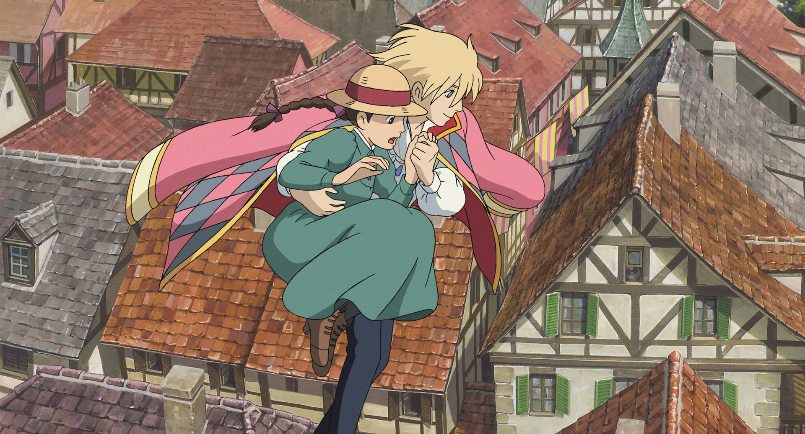
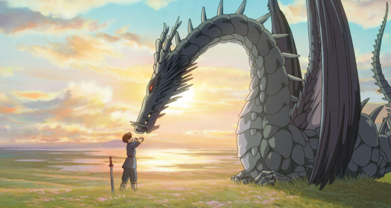

## Einleitung: Der Beginn einer neuen Ghibli-Ära und eine ins Wanken geratene Welt

Mitte der 2000er Jahre stand Studio Ghibli an einem großen Wendepunkt. Hayao Miyazaki hatte mit "Chihiros Reise ins Zauberland" ein Monument in der Geschichte des japanischen Kinos geschaffen, das einen Oscar gewann und seinen weltweiten Ruf festigte. Unter seinen Füßen geriet die reale Welt jedoch ins Wanken. Der "Krieg gegen den Terror", der auf die Terroranschläge von 2001 folgte, und der 2003 ausgebrochene Irakkrieg. Während die Welt in eine Spirale aus Spaltung und Gewalt gerissen wurde, richtete sich Miyazakis Blick zunehmend direkter auf "den Krieg und die Dummheit der Menschheit".

Gleichzeitig kristallisierte sich auch im Inneren von Studio Ghibli die enorme Herausforderung eines Generationswechsels heraus. In diesem Kapitel werden wir zwei Werke tiefgehend untersuchen, die eine äußerst ungewöhnliche Position in der Geschichte von Ghibli einnehmen: "Das wandelnde Schloss" (2004), in dem Hayao Miyazaki seine heftige Wut auf den Irakkrieg und die Akzeptanz des "Alterns" durch überwältigende Animationstechniken darstellte, und "Die Chroniken von Erdsee" (2006), mit dem Miyazakis ältester Sohn Goro Miyazaki in einer außergewöhnlichen Ernennung sein Regiedebüt feierte und sich Konflikten mit der Originalautorin sowie der Darstellung philosophischer Themen stellte. Dabei betrachten wir diese Werke bis zum Äußersten aus technischer, historischer und thematischer Perspektive.

---

## "Das wandelnde Schloss": Der Höhepunkt des Steampunk und ein Schrei gegen den Krieg

Obwohl das Werk auf dem Kinderbuch "Sophie im Schloss des Zauberers" von Diana Wynne Jones basiert, ließ Hayao Miyazaki seine eigene starke Autorschaft einfließen und konstruierte eine eigenständige Geschichte, die sich stark vom Original unterscheidet. Es ist eine epische Liebesgeschichte in einer Welt, in der sich Magie und Maschinen vermischen, und gleichzeitig ein scharfer Antikriegsfilm.

### 1. Der Mechanismus des wandelnden Schlosses und der kritische Punkt der Animationstechnik

Der wahre Protagonist dieses Werks, das auch dem Film seinen Namen gibt, ist das "wandelnde Schloss". Die animierte Darstellung dieses Schlosses zeigt einen kritischen Punkt für Studio Ghibli und letztlich für die Verschmelzung von handgezeichneter Animation und 3DCG auf.

Das Design des Schlosses ist eine groteske Chimären-Architektur, die aus unzähligen Schrottteilen wie Kanonen, Häusern, Schornsteinen, Zahnrädern und laufenden Beinen, die an riesige Vogelklauen erinnern, zusammengeflickt ist. Dies ist der Höhepunkt von Miyazakis typischem mechanischen Steampunk-Design. Die quietschenden Geräusche des Metalls, die dampfausstoßenden Ventile und die ungeschickte, aber irgendwie auch humorvolle Art zu laufen, sind voller Vitalität wie bei einer riesigen lebendigen Kreatur.

Besonders erwähnenswert in technischer Hinsicht ist der Ansatz zur Lösung der Aufgabe, wie diese extrem komplexe, gigantische Struktur animiert werden kann. Ghibli nutzte die 3DCG-Technologie, die es beim Dämonengott (Tatarigami) in "Prinzessin Mononoke" und in "Chihiros Reise ins Zauberland" kultiviert hatte, um die grundlegenden Bewegungen des Schlosses in CG zu konstruieren. Doch anstatt das 3D-Modell einfach nur zu rendern, wurden handgezeichnete Texturen und Details präzise darübergelegt. Dadurch wurde Ghiblis spezifische "warme, handgezeichnete Textur" vollständig mit den "dreidimensionalen und dynamischen Perspektivenänderungen, die nur durch CG möglich sind", verschmolzen.

Jeder Teil, aus dem das Schloss besteht (Häuserteile, Zahnräder, Beine usw.), schwankt, quietscht und verformt sich zu unterschiedlichen Zeiten, passend zum Aufprall beim Gehen. Die Berechnung dieses "asynchronen Schwankens" und deren Umsetzung in eine funktionierende Animation erforderte einen Aufwand, der geradezu als Wahnsinn bezeichnet werden kann. In der Schlusssequenz, in der das Schloss zusammenbricht und wieder neu aufgebaut wird, wird das Kräftemessen zwischen Schwerkraft und Magie durch die Vektoren der Bewegungen jedes einzelnen Teils meisterhaft dargestellt.

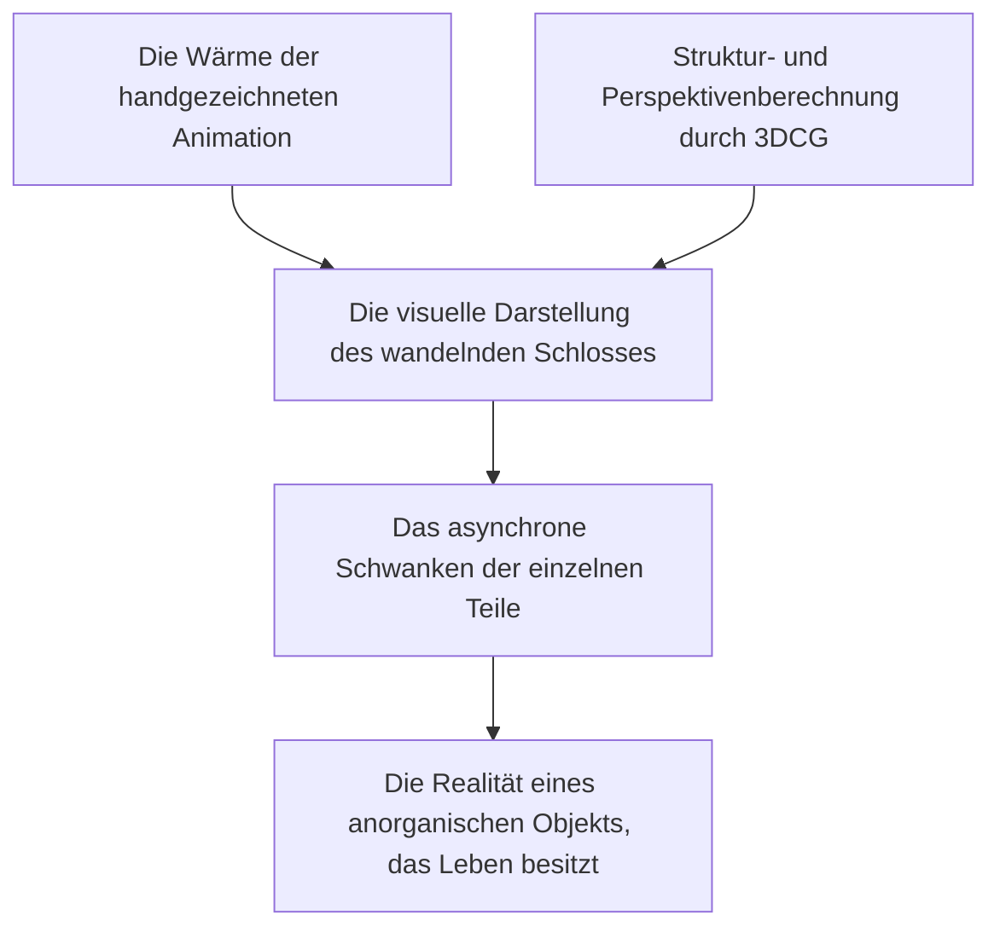
```mermaid
graph TD
    A["Die Wärme der handgezeichneten Animation"] --> C["Die visuelle Darstellung des wandelnden Schlosses"]
    B["Struktur- und Perspektivenberechnung durch 3DCG"] --> C
    C --> D["Das asynchrone Schwanken der einzelnen Teile"]
    D --> E["Die Realität eines anorganischen Objekts, das Leben besitzt"]
```

### 2. Der Schatten des Irakkriegs: Die starke Antikriegsbotschaft von Hayao Miyazaki

Während der Produktion von "Das wandelnde Schloss" begann in der realen Welt die militärische Invasion des Irak durch die USA. Hayao Miyazaki empfand gegenüber diesem Krieg eine beispiellos heftige Wut und Enttäuschung. Diese Emotionen werfen überall in diesem Werk einen starken, dunklen Schatten.

Der Krieg in diesem Werk wird nicht als ein Zusammenstoß der Gerechtigkeit zwischen klar definierten feindlichen Nationen dargestellt. Dem Zuschauer wird in keiner Weise erklärt, wer im Recht und wer im Unrecht ist; es wird lediglich mit überwältigender Verzweiflung gezeigt, wie bizarre Militärflugzeuge, die den gesamten Himmel bedecken, unterschiedslos Städte bombardieren und in ein Feuermeer verwandeln. Gerade dieser Horror der "grundlosen Zerstörung" trifft den Kern moderner Kriege.

Der Protagonist Howl entzieht sich als Zauberer der Einberufung durch das Militär, verwandelt sich jedoch Nacht für Nacht in eine riesige, vogelähnliche Kreatur und begibt sich allein auf das Schlachtfeld, um die Kriegsschiffe und Bomber beider Länder zu zerstören. Doch je mehr er seine Kraft einsetzt, desto mehr verliert er seine Menschlichkeit und nähert sich einem vollkommenen Monster an. Dies ist eine Metapher dafür, wie der Widerspruch der "Gewalt für den Frieden" letztendlich die individuelle Seele aushöhlt und zerstört. Die Szene, in der Howl auf eine brennende Stadt herabblickt und ausspuckt: "Ob Freund oder Feind, alles Mörder", spiegelt Hayao Miyazakis eigenen schmerzlichen Aufschrei gegen den Irakkrieg wider.

Während in früheren Miyazaki-Werken (wie zum Beispiel "Nausicaä aus dem Tal der Winde" oder "Prinzessin Mononoke") das Thema, wie man inmitten von Konflikten lebt, präsentiert wurde, wird in "Das wandelnde Schloss" eine Haltung der völligen Ablehnung beibehalten: "Der Krieg an sich ist eine absolute Torheit, und die bloße Teilnahme daran bedeutet den Tod der Seele."

### 3. Der visuelle Wandel von "Alter" und "Jugend": Was Sophies Fluch bedeutet

Eine weitere bahnbrechende Darstellung in diesem Werk ist der "Wandel des Alters" der Protagonistin Sophie. Von der Hexe aus dem Ödland mit einem Fluch belegt, wird Sophie von einem 18-jährigen Mädchen in eine 90-jährige alte Frau verwandelt. Doch im Verlauf der Geschichte verändert sich ihr Aussehen nahtlos von einer alten Frau zu einem Mädchen und von einem Mädchen zu einer Frau mittleren Alters, synchronisiert mit ihren emotionalen Schwankungen und ihrem mentalen Zustand.

In der Animation ist es eine äußerst seltene Herausforderung, das Charakterdesign (Setting) nicht zu fixieren. Die Animationsdirektoren um Akihiko Yamashita fügten der alten Sophie nicht einfach nur Falten hinzu, sondern beobachteten und zeichneten minutiös den Verfall der Knochenstruktur und der Muskeln sowie vor allem "die Veränderung der Körperhaltung gegenüber der Schwerkraft". Als alte Frau ist Sophies Rücken gebeugt und ihr Gang ist schwerfällig. Doch wenn sie versucht, Howl zu beschützen, oder wenn sie ihr Selbstvertrauen wiedererlangt und kraftvoll spricht, richtet sich ihr Rücken auf, die Falten verschwinden und selbst der Tonfall ihrer Stimme wird jünger (wobei auch Chieko Baishos erstaunliches schauspielerisches Können als Synchronsprecherin hierzu stark beiträgt).

Hayao Miyazaki nutzte diesen visuellen Trick, um das Thema "Altern ist sowohl ein physisches Phänomen als auch ein psychologischer Zustand" darzustellen. Schon bevor sie verflucht wurde, hatte Sophie ein geringes Selbstwertgefühl, hatte ihr Herz verschlossen und war innerlich bereits "gealtert". Der Fluch projizierte lediglich ihr Inneres auf ihr Äußeres. Ironischerweise jedoch, befreit von den gesellschaftlichen Attributen einer jungen Frau, kann sie als alte Frau mutiger und energischer handeln als in ihrer Jugend.

Diese Darstellung des "Alterswechsels" ist der Höhepunkt der psychologischen Beschreibung, der die Eigenschaft der Animation, "Formen frei verändern zu können", maximal ausnutzt. Er visualisiert die Reise der menschlichen Seele, die durch Liebe ihr Selbstwertgefühl wiedererlangt, auf die schönste nur denkbare Weise.

---

## "Die Chroniken von Erdsee": Goro Miyazakis Debüt und die Philosophie des Schattens

Zwei Jahre nach "Das wandelnde Schloss", im Jahr 2006, adaptierte Studio Ghibli Ursula K. Le Guins weltberühmte Fantasy-Literatur "Erdsee" als Animationsfilm. Auf dem Regiestuhl saß jedoch nicht Hayao Miyazaki, sondern sein ältester Sohn Goro Miyazaki, der zuvor keinerlei Erfahrung in der Filmproduktion hatte.

### 1. Eine außergewöhnliche Ernennung und der Hintergrund der Produktion

Eine Verfilmung von "Erdsee" war für Hayao Miyazaki ein langgehegter Traum. Als jedoch die Originalautorin Le Guin endlich die Erlaubnis zur Verfilmung erteilte, steckte Hayao Miyazaki mitten in der Produktion von "Das wandelnde Schloss" und konnte die Regie nicht übernehmen. Der Produzent Toshio Suzuki wählte daraufhin Goro Miyazaki aus, der damals Direktor des Ghibli-Museums in Mitaka war und eine Karriere als Architekt hinter sich hatte.

Toshio Suzuki erkannte in den von Goro gezeichneten Storyboards der Konfrontation zwischen Arren und dem Drachen "eine moderne Dunkelheit und die Realität der Jugend, die Hayao Miyazaki nicht besitzt". Hayao Miyazaki war jedoch vehement gegen diese Entscheidung, was zu einem Bruch in der Vater-Sohn-Beziehung führte. Miyazakis Sorge, dass "jemand, der nichts von Animation versteht, keine Regie führen kann", war absolut berechtigt. Goro war einem enormen Druck und der absoluten Mauer seines Vaters ausgesetzt, während er in die harte Situation geworfen wurde, die erfahrenen Ghibli-Mitarbeiter zusammenzubringen und die Produktion zu leiten.

### 2. Der Konflikt mit der Originalautorin Ursula K. Le Guin und dessen Essenz

Der fertige Film "Die Chroniken von Erdsee" war an den Kinokassen zwar erfolgreich, löste jedoch bei Kritikern und Fans einen Sturm gemischter Reaktionen aus. Am schwerwiegendsten war der entscheidende Konflikt mit der Autorin Le Guin.

Le Guin veröffentlichte auf ihrer eigenen Website einen Kommentar zum Film und urteilte kühl: "Es ist nicht mein Buch. Es ist euer Film." Was sie problematisierte, war die Tatsache, dass die subtilen und introspektiven Themen des Originals durch kurzsichtige Action und einen Dualismus von Gut und Böse ersetzt worden waren.

Im ersten Band der "Erdsee"-Romane ist der "Schatten", dem sich der Protagonist Ged (Sperber) stellt, eine Manifestation seiner eigenen Arroganz und Schwäche. Am Ende besiegt Ged diesen Schatten nicht, sondern umarmt und integriert ihn, um so sein wahres Selbst zu etablieren. Dies ist eine tiefe Philosophie, die auf dem Ansatz der Jungschen Psychologie basiert.

In der Filmversion (die hauptsächlich auf dem dritten Buch basiert) löst sich jedoch Arrens innerer Schatten von ihm und wird als separates Wesen dargestellt. Der endgültige Höhepunkt wurde auf einen physischen Kampf mit dem bösen Zauberer Cob, der Unsterblichkeit sucht, reduziert. In Le Guins Augen untergrub diese Änderung das Kernstück des Originals, nämlich das Thema "des inneren spirituellen Wachstums und der Akzeptanz", erheblich.

### 3. Die Philosophie von Schatten und Licht: Arrens innerer Konflikt und die Pathologie der modernen Gesellschaft

Trotz der Kritik von Le Guin und der Mängel in der Struktur kann man in Goro Miyazakis "Die Chroniken von Erdsee" einen einzigartigen Wert darin sehen, dass der Film auf scharfsinnige Weise die spezifische Pathologie widerspiegelt, unter der die japanische Jugend in den 2000er Jahren litt.

Der Protagonist Arren ersticht ohne ersichtlichen Grund seinen Vater (den König) und flieht aus seinem Land. Er wird ständig von "einer unerklärlichen Angst" gequält und ist zwischen dem Festhalten am Leben und der Angst vor dem Tod zerrissen. Die Figur des Arren zeichnet den psychologischen Zustand der jungen Menschen in der stagnierenden japanischen Gesellschaft nach dem Platzen der Bubble-Wirtschaft nach, die ohne klaren Grund gewalttätige Verbrechen begehen, oder jener, die den Sinn des Lebens verlieren und sagen: "Ich will sterben."

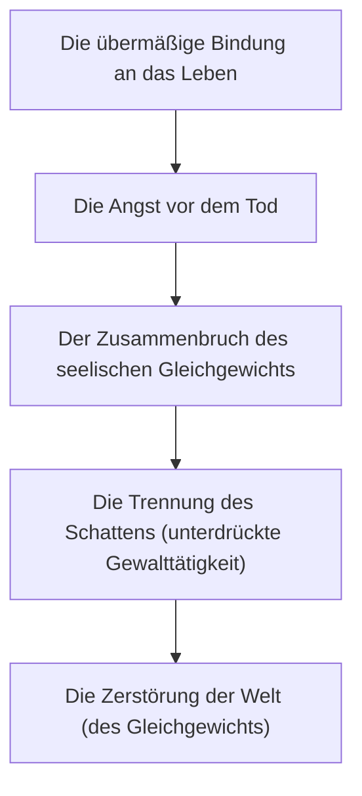
```mermaid
graph TD
    A["Die übermäßige Bindung an das Leben"] --> B["Die Angst vor dem Tod"]
    B --> C["Der Zusammenbruch des seelischen Gleichgewichts"]
    C --> D["Die Trennung des Schattens (unterdrückte Gewalttätigkeit)"]
    D --> E["Die Zerstörung der Welt (des Gleichgewichts)"]
```

Therru's Dialog "Ich hasse Menschen, die das Leben nicht wertschätzen", der ein Hauptthema des Films darstellt, wird oft als zu direkt und belehrend kritisiert. Berücksichtigt man jedoch Goro Miyazakis Erfahrung als Architekt in der Auseinandersetzung mit Umweltproblemen und den Fluch sowie den inneren Konflikt, als Sohn des Meisters Hayao Miyazaki geboren zu sein, so war Arrens Verzweiflung darüber, "nicht einmal zu wissen, was er mit seinem eigenen Leben anfangen soll", auch der schmerzliche Aufschrei von Goro selbst.

Zudem ist der Zauberer Cob, der sich nach Unsterblichkeit sehnt und versucht, das Gleichgewicht der Welt zu zerstören, eine Karikatur der modernen Menschheit an sich, die versucht, durch moderne Technologien und medizinische Techniken das natürliche Gesetz des "Todes" zu leugnen. Das Paradoxon: Den Tod abzulehnen bedeutet, das Leben abzulehnen. Der Konflikt zwischen Arren und Cob mag oberflächlich wie ein Kampf zwischen Gut und Böse aussehen, doch an der Basis liegt die existenzielle Frage: "Wie akzeptieren wir ein endliches Leben?"

Was die Animationstechniken betrifft, so fehlt dem Film zwar das überwältigende Gefühl des Fliegens oder die Dynamik der bis ins Detail lebendigen Hintergrundcharaktere (Mob-Charaktere), die man aus Hayao Miyazakis Werken kennt. Doch die ruhige Hintergrundkunst (insbesondere die Darstellung der stürmischen See, in der sich Drachen gegenseitig fressen, und die düsteren Farben der zerstörten Stadt Hort) bringt die apokalyptische Atmosphäre, dass die Welt langsam dem Tod entgegengeht, geschickt zum Ausdruck.

---

## Schlusswort: Der Preis der Magie und die Weitergabe an die nächste Generation

"Das wandelnde Schloss" und "Die Chroniken von Erdsee". Diese beiden Werke sind Symbole einer Übergangsphase, in der Studio Ghibli seine Reifezeit erreichte und sich gleichzeitig mit den Ängsten der Zukunft auseinandersetzen musste.

Hayao Miyazaki nutzte in "Das wandelnde Schloss" die Magie der Animation bis zum Äußersten, während er gleichzeitig den Schrecken der Ausübung dieser Magie (Macht) und die tiefe Verzweiflung angesichts der realen Gewalt des Krieges darstellte. Und er vertraute die Rettung daraus der "Akzeptanz des Alterns" und der "bedingungslosen Liebe" an.

Goro Miyazaki hingegen forderte in "Die Chroniken von Erdsee" das von seinem Vater erschaffene riesige magische Schloss heraus und versuchte, obwohl er verletzt wurde, mit seiner eigenen Stimme über "die Akzeptanz von Leben und Tod" zu sprechen. Das mag unbeholfen gewesen sein, aber es war auch ein ergreifender Dokumentarfilm als Metapher für Studio Ghibli selbst, wie die nächste Generation mit dem Erbe ihrer Vorgänger umgeht und wie sie ihre eigenen Schatten integriert.

Magie (Animation) ist nicht allmächtig. Doch gerade das Bestreben, ihre Grenzen und ihren Preis zu kennen und dennoch zu versuchen, ein Licht im Dunkeln zu zeichnen, ist die enorme Stärke, die den Ghibli-Werken dieser Ära innewohnt.

(Ende von Kapitel 6)

# Kapitel 7: Der Ursprung des Lebens und die Rückkehr zur handgezeichneten Animation (Ponyo - Das große Abenteuer am Meer, Arrietty – Die wundersame Welt der Borger)

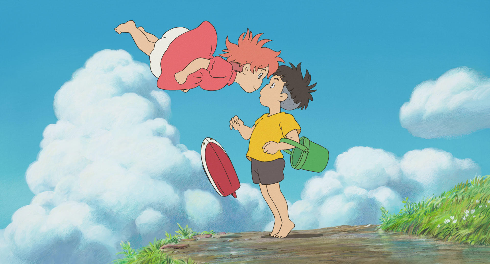
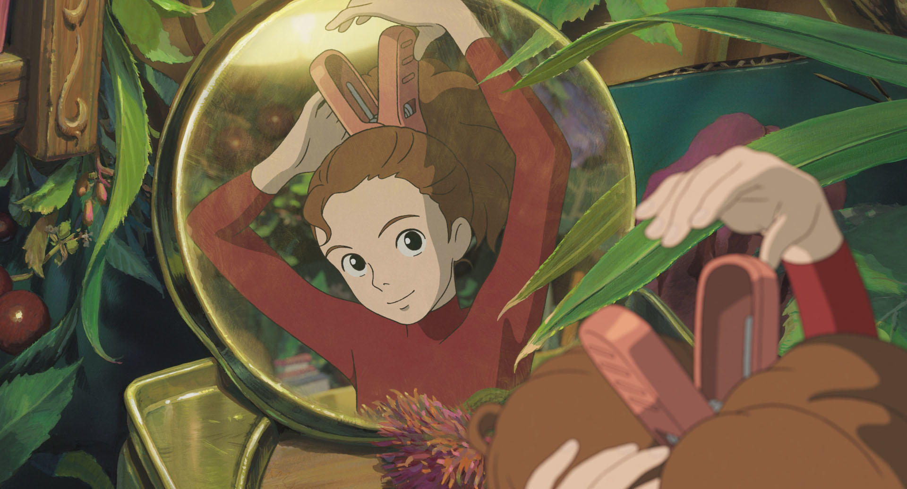

Betrachtet man die Geschichte von Studio Ghibli und letztlich die gesamte Geschichte der japanischen Animation aus der Vogelperspektive, so positioniert sich die Zeit von den späten 2000ern bis zu den frühen 2010er Jahren als ein äußerst außergewöhnlicher technischer und ideologischer Wendepunkt. In Hollywood dominierten vollständig 3DCG-animierte Filme, repräsentiert von Pixar und DreamWorks, als De-facto-Standard den Kinomarkt. Auch in den heimischen japanischen TV-Anime und Kinoproduktionen hatte sich die Digitalisierung des Produktionsprozesses (wie digitales Bemalen und das Zeichnen von Hintergründen sowie Mechanik durch 3DCG) als irreversible Welle vollständig etabliert.

In diesem goldenen Zeitalter der Digitalisierung, das von "Effizienz und berechneter Genauigkeit" beherrscht wurde, steuerten Hayao Miyazaki und Studio Ghibli in eine völlig entgegengesetzte Richtung. Das waren "die kompromisslose Rückkehr zur handgezeichneten Animation" und "das Streben nach einer primitiven Darstellung des Lebens". In diesem Kapitel werden wir tief in die technischen und ideologischen Abgründe eindringen, wie Ghibli "den Atem des Lebens in der Animation" auf Zelluloid bannte. Dabei vergleichen wir den Wahnsinn der makroskopischen Flüssigkeitsanimation in Hayao Miyazakis "Ponyo - Das große Abenteuer am Meer" (2008) mit der Neudefinition von mikroskopischer Perspektivverschiebung und Größenverhältnissen im Regiedebüt von Hiromasa Yonebayashi, "Arrietty – Die wundersame Welt der Borger" (2010).

## 1. "Ponyo - Das große Abenteuer am Meer": Der Wahnsinn der CG-Ablehnung und die Manifestation eines "bewegten Bilderbuchs"

Studio Ghibli hat digitale Technologie nie abgelehnt. Ob die Darstellung des Dämonengottes und die Einführung digitaler Malerei in "Prinzessin Mononoke" (1997), die räumliche Verarbeitung in "Chihiros Reise ins Zauberland" (2001) oder die komplexe, durch 3DCG angetriebene Darstellung des Schlosses in "Das wandelnde Schloss" (2004) – man hat stets neueste Technologien geschickt in den Kontext der Cel-Animation integriert. Doch bei "Ponyo - Das große Abenteuer am Meer" traf Hayao Miyazaki die bewusste und dem Zeitgeist zuwiderlaufende Entscheidung, den Einsatz von 3DCG radikal zu verbannen.

Der Grund für diese Entscheidung war Miyazakis eigene starke Besorgnis, dass die durch digitale Technologie bedingte "übermäßige Präzision" dem ursprünglichen Reiz der Animation, nämlich der "Freude an der Deformation" und der "in den Linien innewohnenden Körperlichkeit des Animators", beraube. Infolgedessen überstieg die Anzahl der gezeichneten Bilder für dieses Werk 170.000 – eine absolute Ausnahme für Ghibli-Produktionen. In der japanischen Animationsindustrie, die primär auf Limited Animation basiert, ist dies eine wahnwitzige Menge an Material, die kaum als vernünftig bezeichnet werden kann.

Das visuell auffälligste Merkmal dieses Films liegt darin, dass die rauen Pinselstriche von Buntstiften und Wasserfarben unverändert auf der Leinwand belassen wurden. In der traditionellen Cel-Animation war es die Regel, Charaktere (Cels) und Hintergrundkunst klar voneinander zu trennen, wobei Cels mit gleichmäßigen Farbflächen gefüllt wurden. In "Ponyo" wird die Grenze zwischen Hintergrundkunst und Cels jedoch absichtlich aufgelöst. Die Buntstiftstriche und Wasserfarbenverläufe werden auch auf die Konturen der Charaktere angewendet, wodurch das gesamte Bild eine organische Textur erhält, als ob es als ein einziges "bewegtes Bilderbuch" vereint atmen würde. Dies lässt sich als äußerst gewaltsamer Ausbruch von Autorenschaft bezeichnen, der die semiotische Grammatik der Animation zerstört und das Publikum direkt mit der "ursprünglichen Überraschung darüber, dass sich ein Bild bewegt", konfrontiert.

## 2. Die Verschmelzung von Strömungsmechanik und Animismus: Eine physikalische Interpretation der Wellen

Die wohl größte Errungenschaft, die "Ponyo" in der Geschichte der Animationstechnik hinterlassen hat, ist die Darstellung von "Wasser" und "Wellen". In der modernen Filmproduktion ist die Darstellung von Wasser eine Domäne der CG, die auf Strömungssimulationen (Partikelsystemen) basiert. Mit physikalischen Berechnungen ist es ein Leichtes, ein fotorealistisches Meer zu generieren, das von einem echten kaum zu unterscheiden ist. Hayao Miyazaki lehnte dies jedoch ab und konstruierte alles aus den "Linien" der Bleistifte der Animatoren.

Besonders erwähnenswert ist die überwältigende Sequenz in der Mitte des Films – die Szene, in der Ponyo auf Wellen, die die Form riesiger antiker Fische angenommen haben, über das Wasser rast und Sousuke verfolgt. Das Meer ist hier nicht einfach eine Newtonsche Flüssigkeit (eine Ansammlung von H2O), die von den Navier-Stokes-Gleichungen der Strömungsmechanik bestimmt wird. Der leitende Animationsdirektor Katsuya Kondo und die Top-Animatoren von Ghibli, die für die Schlüsselbilder verantwortlich waren, interpretierten das Verhalten von Wasser (Trägheit, Viskosität, Oberflächenspannung, Druck) intuitiv als "muskulöse Dynamik" und als die "schwere Masse riesiger Kreaturen" neu.

Die Wellen, auf denen Ponyo reitet, bergen gleichzeitig die Dynamik des Moments, in dem die Oberflächenspannung ihre Grenzen überschreitet und platzt, sowie die hochviskose, geleeartige Materialität, die aus der Tiefsee aufsteigt. Indem sie absichtlich von der physikalischen Genauigkeit abweichen und animistische Visualisierungen vornehmen, wie etwa das Einzeichnen riesiger "Augen" in die Wellenspitzen, pflanzen sie dem Publikum das starke Gefühl ein, dass "das Meer selbst eine gigantische Lebensform mit einem eigenen Willen ist". Selbst die Gischt, wenn die Wellen brechen, wird nicht als regelmäßige Partikel, sondern einzeln als "Lebewesen" mit unregelmäßigen Formen von Hand voll animiert. Diese Zeichenarbeit, "dem Wasser Leben einzuhauchen", forderte von den Animatoren geistig und körperlich den äußersten Tribut. Das Ergebnis war jedoch ein historisches Bild voller "Hitze" und "Schwere", das durch CG niemals erzeugt werden könnte.

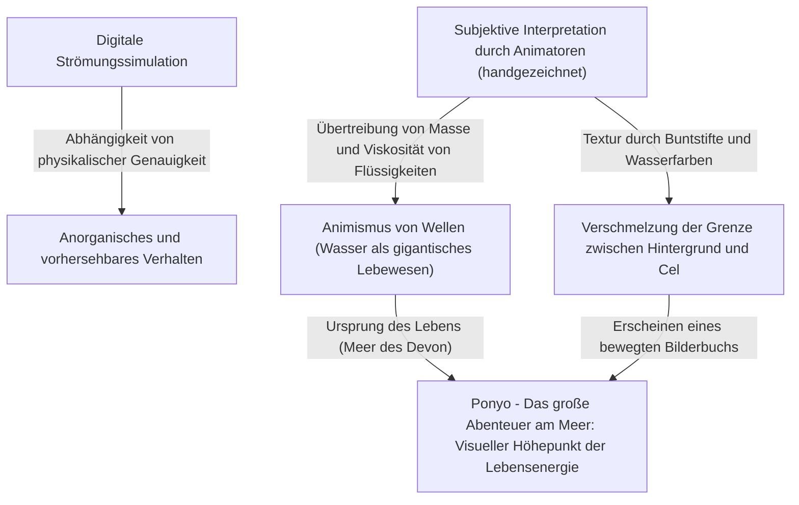
```mermaid
graph TD
    A["Digitale Strömungssimulation"] -- "Abhängigkeit von physikalischer Genauigkeit" --> B["Anorganisches und vorhersehbares Verhalten"]
    C["Subjektive Interpretation durch Animatoren (handgezeichnet)"] -- "Übertreibung von Masse und Viskosität von Flüssigkeiten" --> D["Animismus von Wellen (Wasser als gigantisches Lebewesen)"]
    C -- "Textur durch Buntstifte und Wasserfarben" --> E["Verschmelzung der Grenze zwischen Hintergrund und Cel"]
    D -- "Ursprung des Lebens (Meer des Devon)" --> F["Ponyo - Das große Abenteuer am Meer: Visueller Höhepunkt der Lebensenergie"]
    E -- "Erscheinen eines bewegten Bilderbuchs" --> F
```

## 3. Rückbildung zum Ursprung des Lebens: Kambrische Explosion und die Mutter See

Auch in der narrative Struktur und beim Aufbau der Welt zielt "Ponyo" auf eine Rückbildung zum ursprünglichen Zustand des Lebens ab. In einem typischen Katastrophenfilm würde Sousukes Stadt, die durch einen Sturm vollständig überflutet wurde, als tragische Narbe einer Naturkatastrophe dargestellt. In diesem Werk wird der überflutete Raum jedoch als äußerst festlicher und wunderschöner Ort porträtiert, über dem prähistorische Fische (Amphibien und Panzerfische des Devons wie Dunkleosteus und Bothriolepis) majestätisch schwimmen.

Diese transparente und wunderschöne überflutete Stadt ist eine Metapher für das Urmeer, in dem das Leben auf der Erde entstand, oder für einen gigantischen, mit Fruchtwasser gefüllten Mutterleib. Hayao Miyazaki stellt hier den Prozess positiv dar, in dem die fragile zivilisierte Gesellschaft (das Land), die von der Menschheit aufgebaut wurde, von der Natur (dem Meer), die sowohl überwältigende Geborgenheit als auch zerstörerische Kraft besitzt, verschlungen und mit ihr verschmolzen wird. Ponyo selbst ist ein Wesen, das den "Stammbaum der Evolution" – von Fischen über Halbmenschen und Amphibien bis hin zum Menschen (Landbewohner) – als individuelle Entwicklung in rasantem Tempo verkörpert. Die überwältigende Bewegungsenergie der handgezeichneten Animation, die den gesamten Film durchzieht, ist der Ausdruck jener "explosiven Energie des Augenblicks, in dem das Leben entsteht und pulsiert", ähnlich der Kambrischen Explosion.

## 4. "Arrietty – Die wundersame Welt der Borger": Die Perspektive von Hiromasa Yonebayashi, dem Magier der Maßstäbe

Wenn "Ponyo" die Explosion der Lebenskraft in einem überwältigenden makroskopischen Maßstab darstellte, so ist das zwei Jahre später veröffentlichte Werk "Arrietty – Die wundersame Welt der Borger" ein Meisterwerk, das Physik und visuelle Ausdrucksformen in einer konsequent mikroskopischen Welt erforscht. Dieses Regiedebüt von Hiromasa Yonebayashi, der als brillanter Animator bei Ghibli gilt und unter dem Spitznamen "Maro" bekannt ist, basiert auf der Kinderliteratur von Mary Norton. Es lässt das Setting der "10 cm großen kleinen Menschen" jedoch nicht bei einem bloßen Fantasy-Gimmick bewenden, sondern erhebt es durch strikte Berechnungen der Maßstäbe und präzise perspektivische Verschiebungen zu einem überwältigenden Realismus.

Die herausragende räumliche Wahrnehmung und Layout-Technik (Bildkomposition) von Regisseur Yonebayashi verwandeln ein riesiges japanisches Haus, in dem wir Menschen alltäglich leben, für kleine Menschen wie Arrietty dramatisch in "steile Klippen", "dichte Wälder" und ein "riesiges, gefährliches Labyrinth". Einen Nagel als Trittstufe nutzen, um eine gewaltige Wand zu erklimmen, die Klebekraft von doppelseitigem Klebeband verwenden, um sich in die Höhe zu bewegen, und eine Stecknadel als Schwert zur Selbstverteidigung an der Hüfte tragen. Diese Aktionsdarstellungen sind nicht einfach nur verkleinerte menschliche Bewegungen. Sie sind als äußerst physikalisch überzeugende Animationen konstruiert, basierend auf der Neudefinition von "Schwerkraft", "Textur" und "Muskelkraft" im Maßstab von 10 cm.

## 5. Das Wunder von Strömungsmechanik und Sounddesign im Mikromaßstab

Der Höhepunkt der Animationstechnik in diesem Film ist die präzise Visualisierung der physikalischen Gesetze im Mikromaßstab (insbesondere der Verhaltensänderungen von Flüssigkeiten und Pulvern aufgrund von Skaleneffekten). In der Strömungsmechanik ist bekannt, dass, wenn der Maßstab eines Objekts extrem klein wird, die Auswirkungen von Oberflächenspannung und Viskosität dominanter werden als die der Schwerkraft (Trägheitskraft).

Erinnern Sie sich zum Beispiel an die Szene, in der Arriettys Mutter Homily Tee aus einer Teekanne einschenkt. In einer menschengroßen Welt würde das Wasser der Schwerkraft folgen und geschmeidig als dünner Strahl fließen. In der Welt der 10 cm kleinen Menschen ist der Einfluss der Oberflächenspannung des Wassers jedoch relativ gesehen extrem groß. Deshalb wird der eingegossene Tee zu einer großen Wassertropfenmasse und fällt mit einem schweren, geleeartigen "Plop, Plop" hinab. Die Dynamik der Fluide, die speziell für diese mikroskopische Welt gilt, wird durch die scharfe Beobachtungsgabe der Animatoren und ihre Zeichentechnik perfekt reproduziert. Auch das massive, felsähnliche Gewicht eines einzelnen Stücks Würfelzucker oder der Ausdruck von Steifigkeit, ähnlich einem dicken Segeltuch, beim Herausziehen eines Papiertaschentuchs sind wichtige Elemente, die das Publikum den Maßstab der kleinen Menschen spüren lassen.

Darüber hinaus wird dieses Gefühl für den Maßstab maßgeblich durch das äußerst feinfühlige und dynamische Sounddesign (Foley-Sound) von Koji Kasamatsu bestimmt. Wenn die Kamera auf Arriettys Perspektive wechselt, hallen menschliche Schritte als tiefe Bässe wie ein riesiges Erdbeben wider, und das Motorgeräusch des Kühlschranks wird zum Dröhnen wie im Maschinenraum einer Fabrik. Andererseits werden auch Geräusche wie das Reiben von Stoff oder das Fallen eines Wassertropfens extrem verstärkt und an die Auflösung der Ohren der kleinen Menschen angepasst dargestellt. Indem das Gefühl für Maßstäbe nicht nur visuell, sondern auch akustisch dramatisch manipuliert wird, wird das Publikum vollständig in Arriettys 10-cm-Perspektive eingetaucht (synchronisiert).

## 6. Manipulation der Schärfentiefe und makroobjektivartige Layouts

Ein weiteres filmisches Merkmal von "Arrietty", das nicht übersehen werden darf, ist die bewusste und extreme Manipulation der "Schärfentiefe (Bokeh)" in der Hintergrundkunst. Normalerweise ist die Hintergrundkunst der Studio-Ghibli-Filme (handwerkliches Können, das durch Künstler wie Kazuo Oga und Yoji Takeshige repräsentiert wird) bis in jede Ecke des Bildes detailliert gezeichnet, wobei Panfokus verwendet wird, um die Weite der Welt zu präsentieren.

In den Einstellungen, die die Perspektive der kleinen Menschen in diesem Film darstellen, werden menschliche Möbel, Alltagsgegenstände und Pflanzen hinter Arrietty, auf die fokussiert ist, jedoch extrem unscharf dargestellt – als hätte man sie mit einer Spiegelreflexkamera und einem Makroobjektiv aus nächster Nähe fotografiert. Diese "geringe Schärfentiefe" ist eine ausgeklügelte Layout-Technik, die die Spannung und Klaustrophobie visuell zum Ausdruck bringt, dass die Welt der kleinen Menschen ständig an das gigantische, unberechenbare Unbekannte (die Welt der Menschen) grenzt. Nicht nur durch das Hinzufügen von Unschärfe mithilfe digitaler Fotoverarbeitung, sondern durch die Verschmelzung von Analog und Digital – bei der Konturen bereits in der Phase der Hintergrundkunst absichtlich verschwommen gezeichnet werden – wird die Atmosphäre der Mikrowelt meisterhaft eingefangen.

## 7. Zusammenfassung: "Der Glanz des Lebens" aus beiden Extremen der Maßstäbe

"Ponyo - Das große Abenteuer am Meer" und "Arrietty – Die wundersame Welt der Borger". Auf der einen Seite wurden die tobende Energie der Mutter See und die Explosion des Lebens aus einer makroskopischen Perspektive durch den Wahnsinn von Buntstiften und einer vollständig handgezeichneten Methode porträtiert. Auf der anderen Seite wurden die ruhigen alltäglichen Aktivitäten und das Wunder subtiler physikalischer Gesetze aus einer mikroskopischen Perspektive durch akribische Layouts und eine minutiös berechnete visuelle und auditive Kontrolle dargestellt.

Obwohl die Ausrichtungen der Herangehensweisen an entgegengesetzten Polen von Makro und Mikro liegen, ist die Sphäre, die Studio Ghibli in dieser Phase erreichte, dieselbe. Es ist die ultimative Form der Animation, die der "anorganischen Präzision", die CG mit sich bringt, trotzt und jeder von den Händen der Animatoren gezeichneten Linie sowie jedem Pinselstrich des Hintergrunds ein animistisches Leben einhaucht. Ghiblis tiefe Einsicht, die den "Glanz des Lebens" gleichermaßen in der Wucht einer riesigen Welle wie auch im Tropfen schweren Tees findet. Dies lässt sich wohl als die schönste, kraftvollste und stolzeste Rebellion der Schöpfer gegen die moderne Filmindustrie bezeichnen, die droht, von einer Welle der Effizienz verschlungen zu werden.

# Kapitel 8: Die Zusammenfassung der Meister und das Vermächtnis für die Zukunft

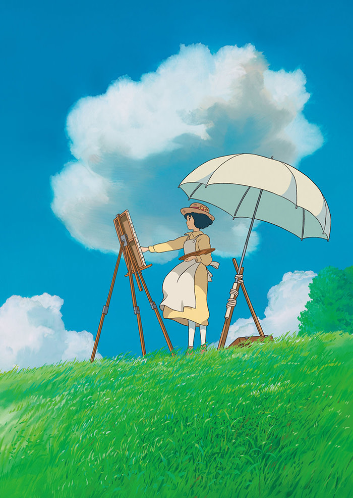
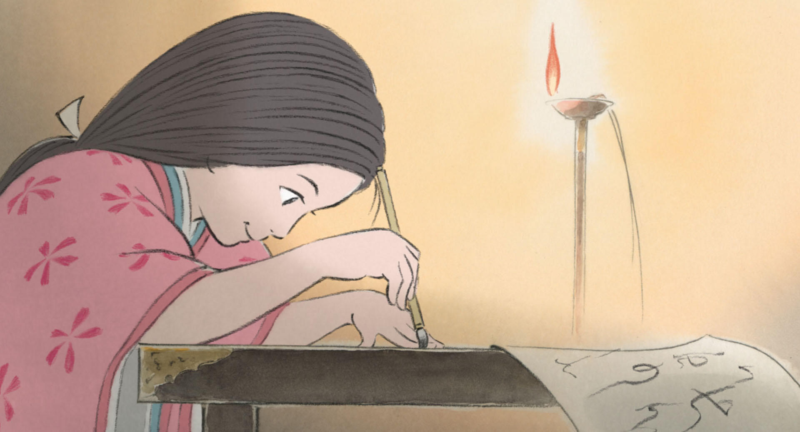
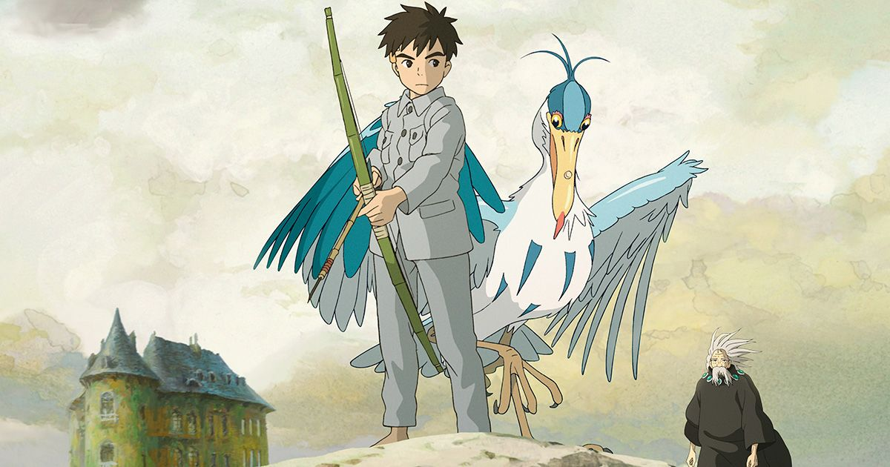

Studio Ghibli, das in der japanischen Animationsgeschichte und als globaler Wegbereiter an der Spitze stand, trat ab den 2010er Jahren in eine einzigartige Phase ein, die als "Zusammenfassung" der beiden Meister und Gründer Hayao Miyazaki und Isao Takahata bezeichnet werden kann. Über den Rahmen bloßer Unterhaltung hinaus entstand eine Reihe selbstreferenzieller Werke, die das Karma und die Philosophie der Schöpfer selbst sowie das Ende ihres eigenen Lebens in den Blick nahmen. In diesem Kapitel sezieren wir drei Meisterwerke – "Wie der Wind sich hebt" (2013), "Die Legende der Prinzessin Kaguya" (2013) und "Der Junge und der Reiher" (2023) –, die die Höhepunkte des Studio Ghibli darstellen und gleichzeitig "Zerstörung und Wiedergeburt" in sich bergen. Wir werden detailliert auf ihr Testament an die Animationsindustrie und ihre Vermächtnisse an die nächste Generation aus technologischer und philosophischer Perspektive eingehen.

## 1. "Wie der Wind sich hebt" – Der Fluch der Schöpfung und das Ende schöner Träume, Miyazakis Geständnis seiner Widersprüche

"Wie der Wind sich hebt", der 2013 in die Kinos kam, ist ein fast schon autobiografisches Werk, in dem Hayao Miyazaki den "Widerspruch", den er so lange in sich trug, lebendiger denn je offenlegte. Der Protagonist des Films, Jiro Horikoshi, ist eine historische Person, der Konstrukteur des trägergestützten Jagdflugzeugs Mitsubishi A6M (Zero Fighter). Miyazaki verschmolz ihn jedoch mit der Essenz des zeitgenössischen Schriftstellers Tatsuo Hori und zeichnete so das Porträt eines einzelnen "Schöpfers".

### Die Schönheit von Waffen und das Elend des Krieges als Höhepunkt des eigenen Widerspruchs
Hayao Miyazaki ist ein leidenschaftlicher Waffen- und Flugzeugfanatiker, aber gleichzeitig ein standhafter Pazifist. Dieser Widerspruch – "die Liebe zu wunderschönen Waffen und der Hass auf den Krieg, in dem sie als Werkzeuge des Tötens eingesetzt werden" – wurde bereits in "Porco Rosso" und "Das wandelnde Schloss" immer wieder thematisiert. In "Wie der Wind sich hebt" hüllte er dies jedoch nicht mehr in den Mantel der Fantasy. Jiros reines technisches Verlangen, "einfach ein wunderschönes Flugzeug bauen zu wollen", mündet letztendlich im Bau des Zero Fighter, einem "verfluchten Traum", der zahllose junge Männer in den Tod schickt und Japan in Schutt und Asche legt. Der italienische Flugzeugkonstrukteur Caproni, der in einem Traumraum mit Jiro spricht, fragt: "Eine Welt mit Pyramiden oder eine Welt ohne – für welche entscheidest du dich?" und erklärt: "Die Lebensdauer für das kreative Leben beträgt zehn Jahre." Dies ist eine tiefe Einsicht in das Leuchten des Talents und seinen grausamen Preis. Es ist zugleich ein schmerzhaftes Bekenntnis von Miyazaki selbst darüber, wie sehr er sein eigenes Leben und das seiner Mitmenschen geopfert hat, um die "wunderschöne Fiktion" der Animation zu erschaffen.

### Ein experimenteller Ansatz für "Wind" und "Sound" in der Animationstechnik
Aus technologischer Sicht ist "Wie der Wind sich hebt" die Bilanz der von Ghibli kultivierten Darstellung von "Wind" und "Fliegen". Von der Traumsequenz am Anfang über den Flug des Papierfliegers in Karuizawa bis hin zum Testflug – die Animationstechnik, durch die die Luftströmungen sichtbar zu werden scheinen, ist schlichtweg atemberaubend. Die Detailbesessenheit, mit der die Textur des Duraluminiums des Flugzeugs und jede einzelne Niete dargestellt wird, ist der Inbegriff der Liebe zur Mechanik.
Darüber hinaus ist das kühne Experiment beim Sounddesign besonders erwähnenswert. In diesem Film wurden viele Soundeffekte (SE), wie das Geräusch der Flugzeugpropeller, der Auspuff einer Dampflokomotive und sogar das Grollen der Erde beim Großen Kanto-Erdbeben, durch "menschliche Stimmen" erzeugt. Durch diesen animistischen Ansatz gewinnen Maschinen und Naturkatastrophen eine unheimliche Lebendigkeit, als wären sie gigantische Lebewesen mit eigenem Willen. Auch die Besetzung des Protagonisten Jiro mit Hideaki Anno, dem Regisseur von "Neon Genesis Evangelion", ist symbolisch. Annos ungeschliffene Stimme als Nicht-Professioneller, bar jeder emotionalen Schwankung, verkörperte Jiros "Wahnsinn aus purer Reinheit", der von der Technik angetrieben wird, auf hervorragende Weise. Die schönen, aber grausamen Tage mit seiner an Tuberkulose erkrankten Frau Naoko unterstreichen Miyazakis Realismus, der die Grenze zwischen Egoismus und Liebe verschwimmen lässt.

## 2. "Die Legende der Prinzessin Kaguya" – Die Dynamik des Lebens im Leerraum und Isao Takahatas ultimatives Experiment

Im selben Jahr, in dem Hayao Miyazaki in "Wie der Wind sich hebt" sein eigenes Inneres darstellte, vollendete Isao Takahata mit "Die Legende der Prinzessin Kaguya", seinem ersten Film als Regisseur seit 14 Jahren, ein ultimatives Experiment, das die Geschichte der Cel-Animation umkrempelte. Mit Produktionskosten von fünf Milliarden Yen und einer Produktionszeit von acht Jahren wurden unvorstellbare Ressourcen in dieses Werk, das die "malerische Qualität" der Animation bis ans Limit treibt – ein künstlerischer Höhepunkt und gleichzeitig Takahatas Vermächtnis und Meisterwerk.

### Das Prescoring-Format, die Lebendigkeit der Linien und die Antithese zu Disney
Die Mainstream-Cel-Animation in Japan basiert auf einer Methode, bei der von gleichmäßigen Linien umschlossene Bereiche mit einfarbigen Flächen ausgefüllt werden (das sogenannte Anime-Coloring). Takahata war jedoch der Ansicht, dass diese Methode "den Bildern ihre Lebenskraft raubt und sie zu etwas Abgeschlossenem und Vergangenem macht". Was er suchte, war die "Lebendigkeit von Skizzen (eine gegenwärtige Dynamik)", die entsteht, wenn ein Maler seinen Pinsel über die Leinwand gleiten lässt. Mit Animatoren wie Kazuo Oga und Osamu Tanabe im Zentrum wurde an diesem Film die verrückte Arbeit geleistet, die rauen Striche von Bleistift oder Kohle und die zarten Farben wie bei einem Aquarellgemälde direkt auf die Leinwand zu bringen.
Darüber hinaus wählte Regisseur Takahata das "Prescoring"-Format. Hierbei wird zuerst die schauspielerische Leistung der Synchronsprecher aufgenommen, und basierend auf den Intonationen, der Atmung, sowie den Gesichtsausdrücken und Gesten während der Aufnahme (die auf Video aufgezeichnet wurden), zeichnen die Animatoren die Bilder. Dadurch synchronisierte sich die Realität der Stimmen von Aki Asakura (Prinzessin Kaguya) und Kengo Kora (Sutemaru) perfekt mit den feinen Muskelbewegungen und den emotionalen Nuancen der Charaktere, wodurch eine überwältigende Präsenz erreicht wurde. Dies war eine scharfe Antithese zur modernen Animation, die dazu neigt, sich auf standardisierte Charakterdarstellungen zu verlassen.

### Die Ästhetik der Leere und die Explosion der Emotionen – Der Schock der Sprint-Sequenz
Das wichtigste technische und inszenatorische Merkmal von "Die Legende der Prinzessin Kaguya" ist die "Leere (die Ästhetik des Nicht-Zeichnens)". Die Ränder des Bildes sind wie bei einem Aquarell verschwommen, und selbst der Hintergrund wird oft überhaupt nicht vollständig gezeichnet. Indem Takahata "Raum für die Vorstellungskraft des Publikums" ließ, forderte er die Zuschauer paradoxerweise dazu auf, die Tiefe der Welt, die sich hinter der Leinwand erstreckt, selbst zu vervollständigen und aktiv am Werk teilzuhaben.
Dieser Ansatz entfaltet seine verheerendste Wirkung in der Sequenz, in der Prinzessin Kaguya vom Bankett im Palast flieht und in die Berge stürmt. Als ihre Wut, ihre Verzweiflung und ihr Widerstand gegen ihre Fesseln ihren Höhepunkt erreichen, verwandeln sich die sorgfältigen Linien plötzlich in raue, tuscheartige Pinselstriche, und der Hintergrund zerfällt auf Skizzenniveau, als würde er von einem reißenden Strom aus Emotionen weggespült. Diese Szene, in der Linien verwildern und Farben spritzen, ist der Moment, in dem die Animation von "gezeichneten Symbolen" zur "Visualisierung reiner Emotionen" wird – ein wundersames Meisterwerk, das in die Weltfilmgeschichte eingegangen ist. Auch der Kontrast zur kalten, buddhistischen Musik bei der Darstellung der Hauptstadt des Mondes verdeutlicht Takahatas Sicht auf Leben und Tod, die die "Unreinheit" der Erde und die "Freude am Leben" bejaht.

## 3. "Der Junge und der Reiher" – Das Labyrinth des Symbolismus und das Vermächtnis für die nächste Generation

Hayao Miyazaki, der 2013 einmal seinen Rücktritt vom abendfüllenden Animationsfilm angekündigt hatte, vollendete nach zehn Jahren "Der Junge und der Reiher" (2023). Dieses Werk ist kein klassisches Action-Abenteuer voller Katharsis wie einst "Chihiros Reise ins Zauberland", sondern ein äußerst komplexes, symbolistisches Labyrinth, in dem Traum und Realität, Leben und Tod sowie Schöpfung und Zerstörung verschmelzen.

### Autobiografische Elemente und eine zusammenfassende Metapher vergangener Werke
Der Protagonist Mahito verliert seine Mutter in jungen Jahren durch ein Feuer und wird mit seinem Vater, der eine Rüstungsfabrik leitet, evakuiert. Dieses Setting selbst spiegelt stark Miyazakis eigene Kindheitserfahrungen (Evakuierung nach Utsunomiya, Erinnerungen an Luftangriffe, Sehnsucht nach der Mutter) wider. Der unheimliche Graureiher, der ihn in die andere Welt lockt, kann als Metapher für den Produzenten Toshio Suzuki verstanden werden – Miyazakis langjähriger Verbündeter, mit dem er oft heftig aneinandergeriet –, oder auch als Miyazakis eigener innerer Trickster.
Die andere Welt (die untere Welt) ist ein Raum, in dem die Motive der bisherigen Ghibli-Filme unheimlich verzerrt und neu zusammengesetzt erscheinen. Ein riesiger Stein, der an "Das Schloss im Himmel" erinnert, die Warawara, die den Kodama aus "Prinzessin Mononoke" ähneln, und ein westliches Herrenhaus, das an das Badehaus aus "Chihiro" erinnert. Aber sie sind kein bloßer Fan-Service oder eine Selbstparodie. Es scheint vielmehr, als präsentiere Miyazaki dem Publikum den in seinem eigenen Gehirn angesammelten "Friedhof der Fantasie" oder eine Anhäufung seines Karmas. Die menschenfressenden Pelikane und die Vogelschwärme der Sittiche, die an den Faschismus erinnern, kritisieren scharf die Gewalttätigkeit der Menschheitsgeschichte und den Wahnsinn der Massen.

### Der einstürzende "Turm" und die Metapher für die Animationsindustrie
Der Kern dieses Werks ist die Existenz des "Großonkels", der das Gleichgewicht in der anderen Welt aufrechterhält. Im Inneren eines Meteoriten (des Turms), der aus dem All auf die Erde gefallen ist, versucht er verzweifelt, das Gleichgewicht der Welt zu bewahren, indem er Bausteine ohne böswillige Absicht stapelt. Es steht außer Frage, dass dieser Großonkel eine Metapher für Isao Takahata oder für Hayao Miyazaki selbst (= den Schöpfergott von Studio Ghibli) ist. Der Großonkel bittet Mahito als seinen Nachfolger, "mit Steinen, die frei von Bösem sind, deine eigene schöne Welt zu erschaffen", aber Mahito weist auf die Wunde an seinem eigenen Kopf (ein Symbol seiner eigenen Lügen und Bösartigkeit) hin und weigert sich, die perfekte, fiktionale Welt zu erben. Und der Turm stürzt ein, die Vögel werden in die reale Welt entlassen.
Das ist nichts anderes als Hayao Miyazakis Erklärung über "das Ende des Imperiums Studio Ghibli". Der von ihnen errichtete Zauberturm der Animation hat das Ende seiner Lebensdauer erreicht. Die nächste Generation darf nicht in dem sicheren, sterilen Turm bleiben, der von den Giganten der Vergangenheit errichtet wurde, sondern muss in der realen Welt (dem Feuermeer) voller Wunden und Bösartigkeit auf eigenen Beinen stehen und leben. Diese fast schon zurückweisende, aber zugleich kraftvolle Botschaft ist das Vermächtnis von Hayao Miyazaki, das in dem Titel "Wie lebt ihr?" (im Original "Kimitachi wa do ikiru ka") mitschwingt.

## 4. Das Vermächtnis von Studio Ghibli und die Zukunft der Animation – Die Abstammung zu Ponoc und darüber hinaus

Wie werden die Gene von Studio Ghibli an die Zukunft weitergegeben, nachdem die beiden Meister ihren ultimativen Höhepunkt erreicht haben und der "Turm" eingestürzt ist? Ghibli, das extrem von der überwältigenden Ausstrahlung und dem genialen Autorenkino von Miyazaki und Takahata abhing, hatte in puncto Erneuerung als Organisation und Systematisierung stets mit Problemen zu kämpfen. Jedoch haben die von ihnen ausgebildeten Animatoren und ihr Geist sich auf jeden Fall auf die gesamte Branche ausgewirkt und lassen neues Leben erblühen.

### Studio Ponoc und das Erbe der handgezeichneten Animation
Der direkteste Nachfolger ist wohl "Studio Ponoc", das vom ehemaligen Ghibli-Produzenten Yoshiaki Nishimura gegründet wurde. Das Studio wurde um Hiromasa Yonebayashi, den Regisseur von "Arrietty – Die wundersame Welt der Borger" und "Erinnerungen an Marnie", herum aufgebaut. Mit Filmen wie "Mary und die Blume der Hexen" und "Der imaginäre Freund" (Yaneura no Rudger) trägt es die von Ghibli kultivierten, hochentwickelten Techniken der "handgezeichneten Animation" und die Tradition der dynamischen Hintergrundkunst in die Moderne weiter.
Die moderne Animationsproduktion vollzieht einen deutlichen Wandel hin zu 3DCG und digitalen Werkzeugen, aber Ponocs Bestrebungen, die Wärme der handgezeichneten Linien und die Übertreibung in der Animation, die über physikalische Gesetze hinausgeht (wie "Obake-Zeichnungen" und die Deformation der Schwerkraft), zu erhalten und weiterzuentwickeln, sind extrem wichtig. Sie beschränken sich nicht darauf, Ghibli bloß zu imitieren, sondern konzentrieren sich beispielsweise durch die Kurzfilm-Anthologie "Modest Heroes" auch auf die Ausbildung neuer Kreativer. So tragen sie die legitime technologische Nachfolge, um das Licht der handgezeichneten Animation am Brennen zu halten.

### Die Ausweitung des Einflusses und Ghiblis Zukunft
Die Gene von Ghibli beschränken sich nicht nur auf Ponoc. Top-Kreative aus aller Welt, angefangen beim ehemaligen CCO der Pixar Animation Studios, John Lasseter, wurden von Miyazakis und Takahatas Regiestil stark beeinflusst – insbesondere von der Nutzung von "Ma" (Pausen) und der Vitalität der Charaktere, die in subtilen alltäglichen Bewegungen (wie Essen, Putzen, Gehen) zum Ausdruck kommt. Auch in den Werken von Regisseuren wie Makoto Shinkai und Mamoru Hosoda, die die moderne japanische Animation anführen, hat Ghibli in Bezug auf die Darstellung von Landschaften und das animistische Naturverständnis tiefe Spuren hinterlassen.

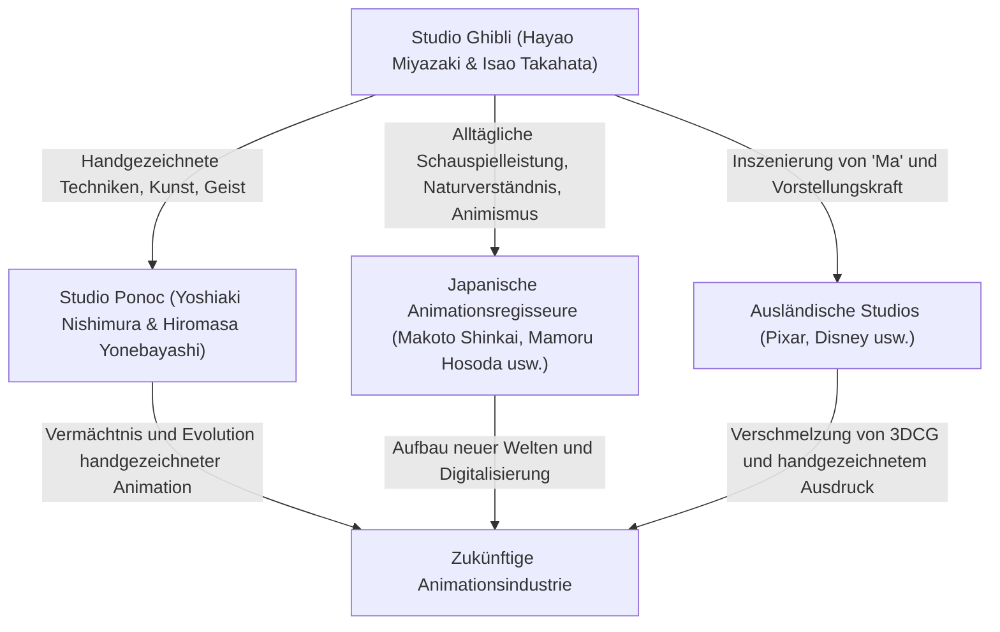
```mermaid
graph TD
    A["Studio Ghibli (Hayao Miyazaki & Isao Takahata)"] -- "Handgezeichnete Techniken, Kunst, Geist" --> B["Studio Ponoc (Yoshiaki Nishimura & Hiromasa Yonebayashi)"]
    A -- "Alltägliche Schauspielleistung, Naturverständnis, Animismus" --> C["Japanische Animationsregisseure (Makoto Shinkai, Mamoru Hosoda usw.)"]
    A -- "Inszenierung von 'Ma' und Vorstellungskraft" --> D["Ausländische Studios (Pixar, Disney usw.)"]
    B -- "Vermächtnis und Evolution handgezeichneter Animation" --> E["Zukünftige Animationsindustrie"]
    C -- "Aufbau neuer Welten und Digitalisierung" --> E
    D -- "Verschmelzung von 3DCG und handgezeichnetem Ausdruck" --> E
```

Der "Turm" mag eingestürzt sein, aber die Vögel, die von dort aufgestiegen sind, haben sich über die ganze Welt verstreut und säen neue Samen. Das Karma des Erschaffens, das in "Wie der Wind sich hebt" gezeigt wurde, die unendlichen Möglichkeiten des Ausdrucks, die in "Die Legende der Prinzessin Kaguya" bewiesen wurden, und die Entschlossenheit, in der Realität zu leben, die in "Der Junge und der Reiher" vor Augen geführt wurde. Diese sprengen den Rahmen von bloßen Filmen und werden als kulturelles Erbe der Menschheit für immer überliefert werden.
Ende 2023 trat Studio Ghibli unter das Dach von Nippon Television und ging als Unternehmen in eine neue Phase über. Aber das "Kapitel 8" von Studio Ghibli wird über die physischen Grenzen des Studios hinaus fortbestehen. Die Fragen, die sie hinterlassen haben, und ihre überwältigenden handgezeichneten Techniken werden von zahllosen noch kommenden Kreativen auf die neue Leinwand der nächsten Ära gemalt werden. Das wahre Vermächtnis von Ghibli liegt nicht in alten Filmen, sondern wurde uns anvertraut – in unserem zukünftigen Handeln, wie wir, die wir diese Filme gesehen haben, "leben werden".
