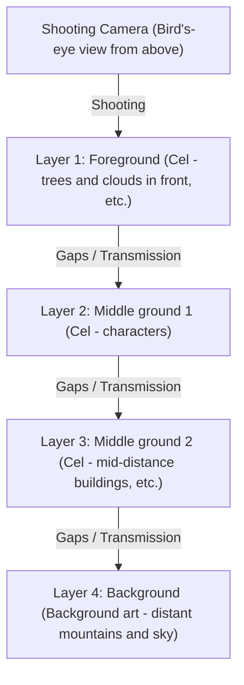
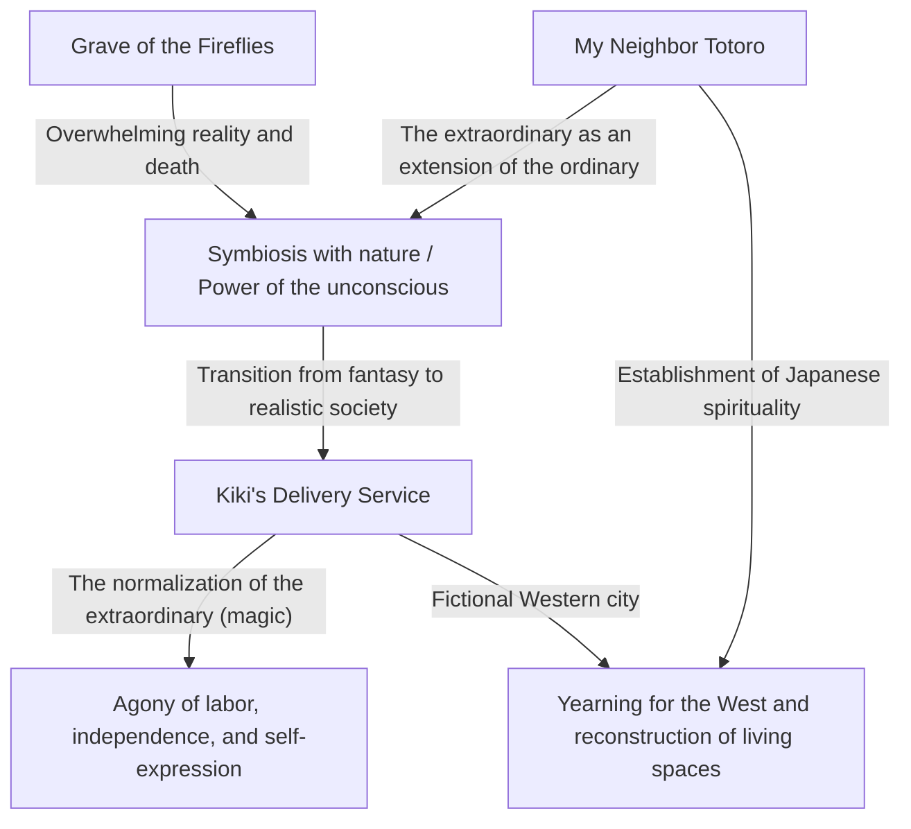
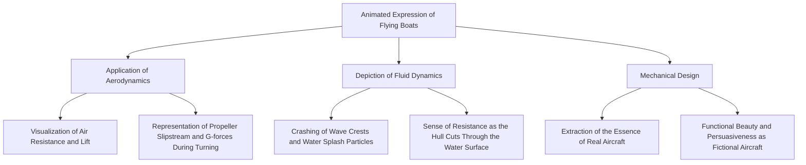
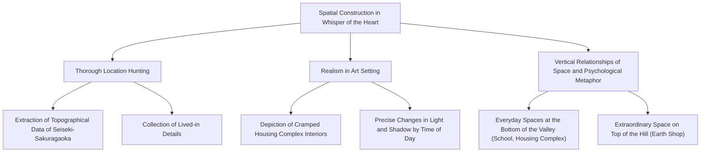
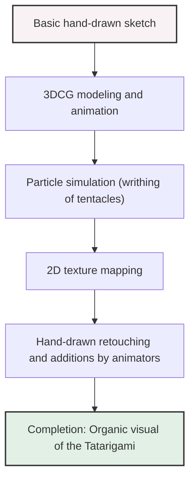
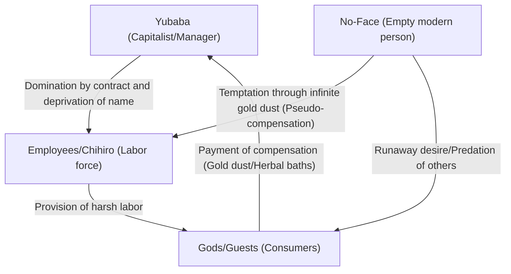
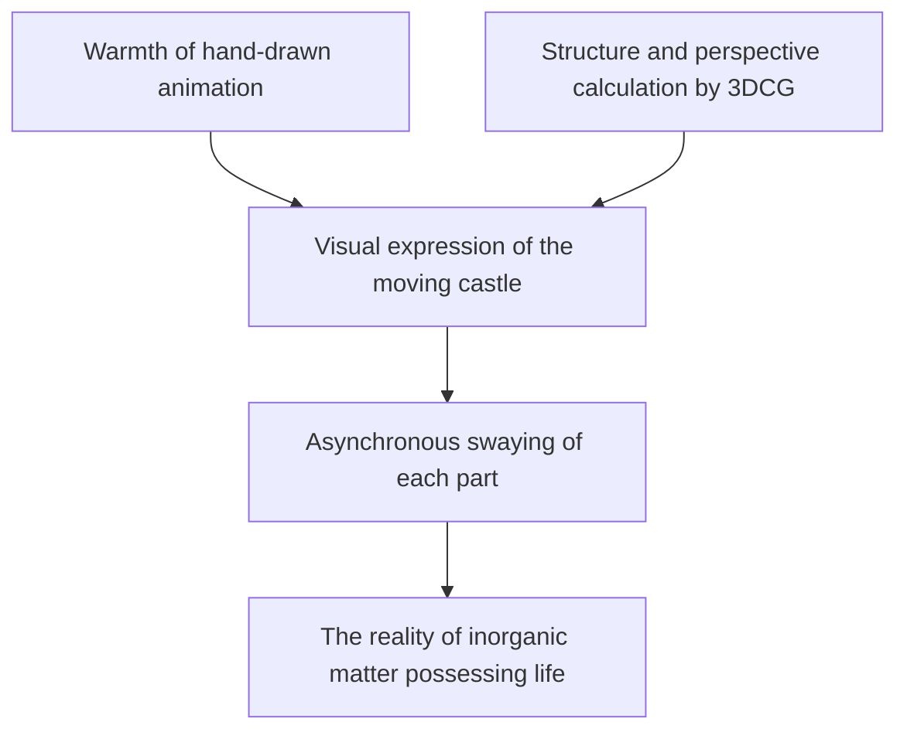
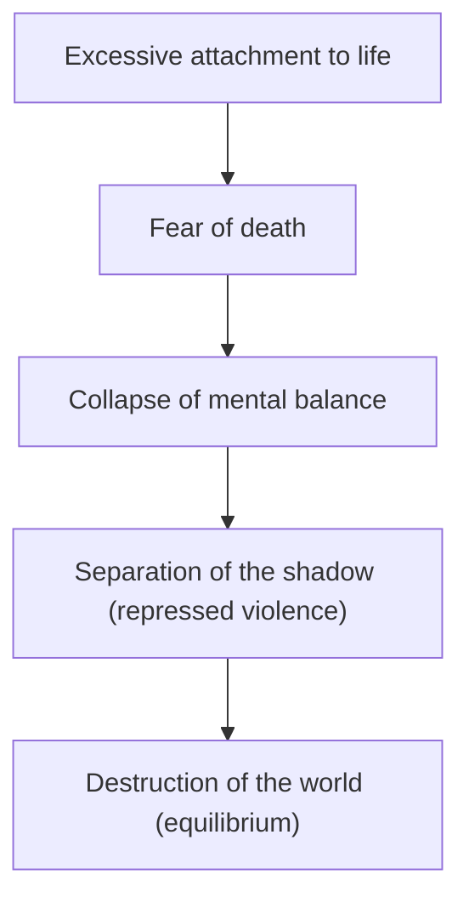
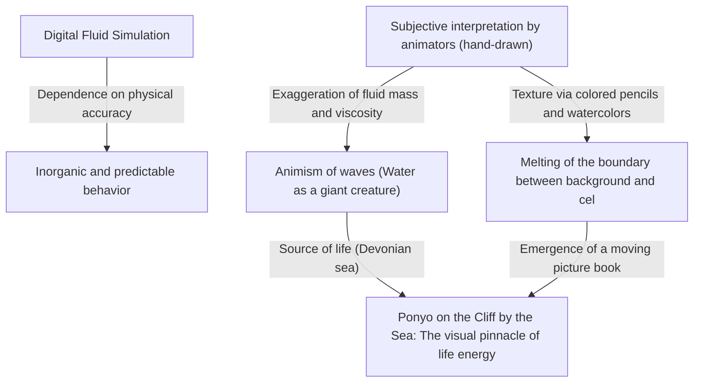
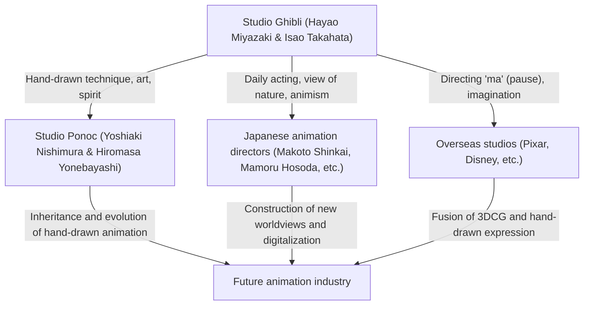

# Chapter 1: Foundation and Early Masterpieces (Nausicaä of the Valley of the Wind, Castle in the Sky)

## 1.1 A Singularity in Animation History: The Birth of Studio Ghibli

When looking at the Japanese animation industry, or indeed the history of world animation, one cannot ignore an "incident" that occurred in the mid-1980s. That was the establishment of Studio Ghibli. The history of Ghibli is not merely the history of a single company or production studio, but rather the very history of the ultimate pinnacle of expression achieved by the analog technique of cel animation, and the miraculous fusion of the "popularity" and "artistry" inherent in the medium of animation. In this chapter, while unraveling the circumstances of Studio Ghibli's founding, we will focus on its practical origin, *Nausicaä of the Valley of the Wind* (1984), and its first work under the Studio Ghibli name, *Castle in the Sky* (1986), discussing how two geniuses, Isao Takahata and Hayao Miyazaki, broke through the limits of animated expression.

On the eve of Studio Ghibli's founding, Japanese television animation had evolved uniquely through a technique called "limited animation." In contrast to Disney-style full animation which uses a full 24 frames per second, this method of reducing the number of frames while making full use of still images and camera work (pan, tilt, etc.) to produce dynamism began as a necessary evil to reduce costs, but eventually established itself as a unique visual grammar. However, what Isao Takahata and Hayao Miyazaki aimed for could not be contained within those bounds. They strongly desired to realize the animation they had cultivated since their days at Toei Doga (currently Toei Animation)—the meticulous construction of space, the reality of everyday acting, and above all, the "fundamental joy of moving"—in the highest format of feature-length theatrical films.

## 1.2 The Authorship of Isao Takahata and Hayao Miyazaki: A Miraculous Intersection of Objectivity and Subjectivity

To deeply understand Studio Ghibli's body of work, it is necessary to grasp the nature of the two distinct talents that form its core, Isao Takahata and Hayao Miyazaki, and their interaction. Both originated from Toei Doga and were connected by deep bonds through labor union activities and the like, but it is no exaggeration to say that their orientations as animation directors were polar opposites.

Hayao Miyazaki's authorship is characterized by an overwhelming "subjective spatial perception" and a "fetishism of movement." The screens Miyazaki draws, while sometimes transcending the laws of physics, possess a powerful persuasiveness that directly appeals to the viewer's physical senses. The feeling of floating in flight scenes, the sense of weight that makes one feel the deep rumble of a massive object moving, and the sensation of the world itself wriggling like a living creature, such as the subtle flow of wind or the sparkling of water surfaces, are the result of fixing the visions in Miyazaki's brain onto cels through the bodies of animators. In his layouts (screen composition), he heavily uses wide-angle lens-like distortions and unique perspectives to skillfully control the depth and flow of the screen.

In contrast, Isao Takahata's authorship lies in thorough "objectivity" and "logical construction." Because Takahata himself was a director who did not draw, he was able to overlook the animation screen from a higher, meta-level perspective. His direction places emphasis on pushing the reality of the characters' psychology, social structures, and trivial everyday movements to the absolute limit. Everything, down to spatial arrangement, lighting, and character motivation, is built on meticulous calculation, and while encouraging the audience to empathize, it always carries a Brechtian alienation effect that makes them observe the world from a step back.

It was the fact that these two talents—the "subjective and intuitive Miyazaki" and the "objective and logical Takahata"—kept each other in check and respected each other while becoming the backbone of a single studio that served as the greatest driving force in creating Ghibli's rich body of work. In the early Ghibli works, Takahata played an extremely important role as a producer, controlling Miyazaki's runaway tendencies while simultaneously solidifying the framework of the works.

## 1.3 The Technological Singularity of Cel Animation and the Multiplane Camera

The awesomeness of Studio Ghibli lies not only in the profundity of its themes but also in the overwhelming technological prowess that supports them. Particularly during the period from *Nausicaä* to *Castle in the Sky*, the analog cel animation technology was reaching a form of completion, or a "technological singularity."

The overwhelming amount of information and sense of reality possessed by the screens of Ghibli works are created by meticulously drawn background art and layers of cel art stacked in multiple levels. What deserves special mention here is the pinnacle of spatial expression using the "multiplane camera."

A multiplane camera is a device where multiple layers (tiers) of glass are set up below the camera, and cels and background drawings are placed on each layer to be photographed. By changing the moving speed of each layer when the camera moves (pan, tilt, track up, etc.), a pseudo three-dimensional depth (parallax) can be created. This technology itself has been used by Disney and others since ancient times, but the operation of the multiplane camera at Ghibli was outstanding in its precision and complexity.

The "flight scenes" indispensable to Miyazaki's works benefit maximally from this technology. For example, a complex space with a sea of clouds spreading below, a flying boat weaving through them, and the earth visible further in the distance flows at different speeds for each layer, giving the audience a strong spatial awareness and immersion as if they are truly flying in the sky. Furthermore, through the "transmitted light" technique of shining light from behind the cels, subtle gradation expressions using airbrushes, and the input of an insane amount of drawing calories to manually animate blowing grass and trees one by one, wind blows and air flows on the screen. In an era without digital technology (CGI), they used physical film, paint, and the magic of light to construct a virtual space that was more real than reality.

## 1.4 Nausicaä of the Valley of the Wind (1984): A Monumental Prehistory and the Depths of Ecology

*Nausicaä of the Valley of the Wind*, released in 1984, was officially produced by "Topcraft" before the establishment of Studio Ghibli, but it was made with the lineup of Director Hayao Miyazaki and Producer Isao Takahata, and is positioned as the practical "Work No. 0" or "Work No. 1" that determined the future direction of Ghibli.

This work is based on the manga of the same name serialized by Hayao Miyazaki himself in the monthly magazine "Animage," but the film version reconstructs its early parts and concludes as an independent story. The greatest achievement *Nausicaä* etched into animation history is that it fully depicted extremely heavy science fiction themes of "environmental issues (ecology)," "the dignity of life," and "human folly" within the framework of entertainment, and with overwhelming visual beauty.

1000 years after the collapse of industrial civilization due to a final war known as the "Seven Days of Fire." A world where a fungal forest called the "Sea of Corruption," emitting toxic miasma, expands and giant insects rule. This despairing world setting reflects Miyazaki's strong sense of crisis regarding the terror of nuclear war during the Cold War and worsening environmental destruction. However, Miyazaki does not fall into the simple dualism of "nature conservation" or "human evil." The major plot twist in the play that the Sea of Corruption is actually a system to purify the polluted Earth confronts humans with the terrifying self-recovery power of nature and human insignificance before it.

Indispensable when discussing *Nausicaä* from a technical aspect is the expression of the giant insects, including the "Ohm." The animation of these grotesque creatures with numerous segments and eyes advancing in an undulating manner creates overwhelming weight, eeriness, and a certain kind of divinity through special drawing techniques using rubber (a method of shooting by shifting the parts of multiple cels) and precise timing calculations. Moreover, the movement of the cloth in the flight scenes of the Mehve (the flying device Nausicaä rides) feeling the resistance of the wind, and the smooth trajectory that seems to visualize the relationship between gravity and lift, showed the world the "catharsis of flying" that is the true essence of Miyazaki anime.

The design of the heroine Nausicaä was also innovative. She is not merely a "girl to be protected"; while being a warrior who flies the Mehve, shoots a gun, and swings a sword herself, she is simultaneously a maternal existence with deep affection for all life. This complex character image, combining strength and kindness, anger and sorrow, became an origin and pinnacle of the female hero image not only in subsequent Ghibli works but also in modern fiction.

## 1.5 The Establishment of Studio Ghibli and Castle in the Sky (1986): The Ultimate Adventure Action

Following the success of *Nausicaä*, "Studio Ghibli" was officially established in 1985 using its profits as capital. Its purpose of establishment was singularly "to continue making high-quality feature-length animations for theaters." Ghibli was born as an independent base to pursue uncompromising quality, drawing a clear line from the mass production of low-quality TV animation.

Then in 1986, *Castle in the Sky* was released as the memorable first feature-length work under the Studio Ghibli name. Based on an idea Hayao Miyazaki had conceived during his elementary school days, with the floating island Laputa from Swift's *Gulliver's Travels* as a motif, this work packs in all the royal road elements of classic adventure action (boy meets girl)—a boy meeting a girl, a mysterious flight stone, sky pirates, and an army with evil ambitions. It is a masterpiece that can truly be called the "zenith of action film."

The brilliance of *Laputa* lies in the breathtaking driving force of its story and its obsessive attention to abnormal levels of detail spread throughout every corner of the screen. From the opening scene of the Dola gang's attack on the airship (Tiger Moth) to the pursuit drama in Slag Ravine where Pazu and Sheeta flee, the screen is constantly "dynamic." The mechanical modeling of Slag Ravine, the piston movements of the steam engines, the rotation of the gears, and the dashing of the minecarts. These machines and vehicles are not mere backgrounds or props; they are drawn full of dynamism as if they themselves possessed life. The passion of the drawing that tries to fixate even Miyazaki's "affection for machines" and "the heat and smell they emit" endows the fictional world with overwhelming reality.

What *Laputa* presents thematically is "the division between advanced technology and humans" and "the connection with the earth." The transcendent scientific power of the Laputa Empire, which once ruled the world, ultimately became the cause of its own destruction. The vision at the film's climax, where a gigantic "great tree" holding a massive flight stone rises into space from the depths of the collapsing Laputa, is extremely symbolic. This conclusion, where the artificial object symbolic of technology crumbles away, leaving only the great tree symbolic of life, is summarized in Sheeta's line: "Let's put our roots in the ground, and live with the wind. Pass the winter with the seeds, and sing of spring with the birds. No matter how many terrifying weapons you hold, no matter how many pitiful robots you control, you cannot live apart from the earth." This is Miyazaki's scathing criticism of modern civilization, continuing from *Nausicaä*, and a universal prayer for a return to nature.

Also, the contribution of the background art by art directors Toshiro Nozaki and Nizo Yamamoto in this work is immeasurable. The tranquil beauty of the scene upon arriving at Laputa, when the sea of clouds clears to reveal a moss-covered giant garden and a robot soldier, proves how background art in animation determines the dignity of a work. Here was the perfect fusion of Miyazaki's dynamic direction and the static art.

## 1.6 Conclusion: The Beginning of a Legend

*Nausicaä of the Valley of the Wind* and *Castle in the Sky*. In these two early masterpieces, Hayao Miyazaki, Isao Takahata, and the staff of Studio Ghibli demonstrated bringing out the potential that the expressive medium of animation could hold to the absolute limit. They gave weight and texture to imaginary mechanics, breathed reality into imaginary ecosystems, and encapsulated complex social criticisms and philosophical themes within entertainment that men and women of all ages would watch breathlessly. They accomplished this staggering feat through an enormous number of cels and manual labor that could be called artisan madness.

These two works raised technical and expressive standards to a far higher level, subsequently standing as a "giant wall called Ghibli" in the Japanese animation world. And at the same time, it was literally "Chapter 1" of a grand legend in which this small studio would eventually stir up a global cultural phenomenon and rewrite the history of animation itself. The path leading to the subsequent *My Neighbor Totoro*, *Grave of the Fireflies*, and *Princess Mononoke* all started from the wind of *Nausicaä* and the sky of *Laputa*.
# Chapter 2: The Intersection of the Ordinary and Extraordinary — The Worlds depicted in "My Neighbor Totoro", "Grave of the Fireflies", and "Kiki's Delivery Service"

When unraveling the history of Studio Ghibli, the late 1980s was a crucial turning point. Shifting completely from the grand "swords and sorcery" or "flying adventure action" depicted in the previous work *Castle in the Sky* (1986), Ghibli took a major turn toward the "ordinary"—the original landscapes of Japan and the everyday lives of regular people in the West. This chapter focuses on three films: *My Neighbor Totoro* and *Grave of the Fireflies*, which achieved a miraculous double feature release in 1988, and the blockbuster hit *Kiki's Delivery Service* in 1989. We will thoroughly dissect the technical and thematic revolutions these works engraved in the history of animation.

## 1. The Madness and Miracle of the Double Feature: Hayao Miyazaki and Isao Takahata, Two "Showas"

In the spring of 1988, the double-feature screening of *My Neighbor Totoro* and *Grave of the Fireflies*—an exhibition format virtually unthinkable today—was realized. This was not mere commercial packaging; it was the crystallization of "madness and miracle," where the organization of Studio Ghibli, and by extension, the two genius creators Hayao Miyazaki and Isao Takahata, sparked against each other.

### 1-1. Back-to-Back Life and Death
*My Neighbor Totoro* is an anthem to life, depicting the interactions between nature's spirits and children, set in a Japanese farming village in the 1950s (Showa 30s). On the other hand, *Grave of the Fireflies* is set in Kobe around the end of the war in 1945 (Showa 20), portraying the gruesome reality of a brother and sister losing their lives amidst the fires of war with absolute realism. Although the time settings differ by only about ten years, these two works contain completely back-to-back themes: "life and death" and "idealized fantasy and cruel reality."

At the time, Studio Ghibli established what could be called a reckless production system of operating two massive talents simultaneously. A struggle for animation staff ensued, and the schedule was on the verge of collapse. However, as a result, this harsh environment pushed the quality of both works to their absolute limits. As an antithesis to Isao Takahata's thorough realism, Hayao Miyazaki constructed the world of *Totoro*, where a more powerful, unconscious vitality leaps about, and Takahata, to counter Miyazaki's fantasy, elevated Japanese animation expression to a documentary-like dimension.

### 1-2. Differentiating Showa and the Birth of "Animation Documentary"
Isao Takahata's direction in *Grave of the Fireflies* was something that destroyed the grammar of conventional animation. The falling trajectories of incendiary bombs from B-29 bombings, the flickering flames of burning houses, and above all, the physical changes in Seita and Setsuko as they weaken from starvation. To express these, color designer Michiyo Yasuda and others thoroughly pursued a "brownish hue smeared with mud, blood, and soot" that could not be fully expressed with conventional anime colors.

In contrast, in *My Neighbor Totoro*, Hayao Miyazaki reconstructed the "beautiful Japan that might have once existed" from his own memories. It was not merely photorealism, but an attempt to fix the "radiance" of the world seen from a child's perspective onto cels. The differentiation in depicting these two "Showa" eras maximally proved the amplitude of expression that the medium of animation possesses, becoming a monumental achievement in Japanese film history.

## 2. The Revolution of Background Art: The "Air and Moisture" Created by Kazuo Oga and Nizo Yamamoto

The overwhelming persuasiveness that Ghibli works possess owes an extremely large part not only to the acting of the characters but to the power of the background art spreading behind them. During this period, Studio Ghibli's background art had reached a pinnacle.

### 2-1. The Moist Atmosphere of "Totoro's Forest" Painted by Kazuo Oga
It is no exaggeration to say that the achievements of Kazuo Oga, who was selected as the art director for *My Neighbor Totoro*, changed the history of Japanese animation art. The nature drawn by Oga maximizes the characteristics of poster colors. Despite using opaque poster colors instead of transparent watercolors, through exquisite water control and brush touches, he managed to express the specific "moisture" of the Japanese climate, the "suffocating smell of grass," and even the "temperature of sunlight filtering through the trees."

Particularly, the background art in the scene where Satsuki and Mei encounter Totoro at the rainy bus stop is a masterpiece. The texture of wet asphalt, the depth of the sacred forest sinking into darkness, the layers of air created by the light of the electric lamp. Oga's art was not merely "copying scenery," but magic that visualized "invisible information" such as the wind blowing there, the temperature, and the humidity.

### 2-2. Yearning for the West and Architectural Realism
On the other hand, the town of Koriko, the setting for *Kiki's Delivery Service*, is a fictional town created by fusing elements from various European cities, such as Stockholm and Visby on Gotland Island in Sweden, as well as Lisbon and Paris. The background art here had a vector diametrically opposed to *Totoro*, which depicted Japanese scenery.

European stone buildings, successions of tile roofs, and sloping streets leading to the sea. To draw these persuasively, Ghibli's art staff conducted thorough location scouting and studied architectural structures. Taking just the texture of stone, they calculated the degree of weathering and the reflectance of sunlight, translating it into colors that look most beautiful as animation backgrounds. The power of the art that did not let this "yearning for the West" end as mere fantasy, but depicted it as a space where people actually live and work, is astounding.

## 3. Contemporary Themes in *Kiki's Delivery Service*: "Labor and Slump"

Upon its release, *Kiki's Delivery Service* gathered enthusiastic support from many young people, especially working women. The reason is that while the work superficially wore the fantasy skin of a "story of a witch girl's growth," in its essence, it was a highly contemporary and universal real drama about "labor and talent (slumps)."

### 3-1. The Moment Talent Turns into "Labor"
The protagonist Kiki starts a delivery job utilizing her innate magical talent of "flying in the sky." This completely overlaps with the process of contemporary creators and freelance workers participating in society by using their special skills and talents as "capital." For Kiki in the early stages, flying was a joy and self-expression. However, when it becomes "work (labor)," and she faces unreasonable demands from clients (like the herring pie episode) and receives money as compensation, the meaning of magic changes within her.

### 3-2. Slumps and the Loss of Identity
In the middle of the story, Kiki suddenly loses her magical powers, becomes unable to fly, and can no longer understand the words of Jiji the black cat. This is an oscillation of an adolescent girl's identity, and at the same time, a perfect metaphor for the "exhaustion of talent (slump)" that creators face.

Playing an important role here is Ursula, an art student drawing pictures in a cabin in the forest. Ursula tells Kiki, "At times like that, all you can do is struggle," "Draw, draw, and draw some more," "And if that still doesn't work, stop drawing. Take walks, look at the scenery, take naps, do nothing." These lines are the very agony faced by animators, including Hayao Miyazaki himself, and by extension, all humans involved in expressive activities, and its prescription itself.

### 3-3. The Resolve to "Fly with Blood"
Ursula speaks about her own paintings: "Before, I could draw without thinking about anything, but now it's different. I have to paint my own pictures." Kiki's magic is the same. The era of unconsciousness where she could fly just with her innate talent (magic) comes to an end, and she must "reacquire" her magic through her own will and effort. In the climax, the scene where Kiki straddles a push broom and desperately leaps into the sky is no longer an elegant fantasy. It is the very figure of a professional facing their limits and exercising their "craft" with the intensity of coughing up blood.

## 4. Structure of Themes and Interrelationships

While these three works seemingly possess independent worldviews at first glance, looking through the axis of Ghibli's auteurism, there exists a clear continuity and intersection of themes.

The "extraordinary (fantasy) lurking in the ordinary" presented by *Totoro* acquired an even stronger mythic quality through its contrast with the extreme realism of *Grave of the Fireflies*. And the expressive techniques and animation technology established there became powerful weapons in *Kiki's Delivery Service* for depicting the paradoxical theme of "how an extraordinary being (a witch) blends into the daily life (labor) of modern society."

## 5. Conclusion: Stepping Stones to the Next Stage

During this period from 1988 to 1989, Studio Ghibli ran through every extreme that animation could depict—"life and death," "Japan and the West," "fantasy and realism," and "talent and labor"—in just a few short years. The techniques cultivated here of thoroughly observing and depicting everyday acting, and the power of background art to imbue landscapes with air and emotion, were passed down to subsequent works with more complex themes aimed at adults, such as *Only Yesterday* (1991) and *Porco Rosso* (1992).

The three works *My Neighbor Totoro*, *Grave of the Fireflies*, and *Kiki's Delivery Service* are not a mere enumeration of masterpieces. They are a historical monument that recorded the hottest, and most painful, moment of emergence when the expressive medium of animation shed its skin from entertainment for children to a "comprehensive art" that depicts even the depths of the human spirit and the structural agonies of society.
# Chapter 3: Yearning for Flight and Adult Romance — The Pinnacle of Realism in *Porco Rosso* and *Whisper of the Heart*

When taking a bird's-eye view of the history of Studio Ghibli, *Porco Rosso* (1992) and *Whisper of the Heart* (1995), released from the early to mid-1990s, might at first glance appear to be works situated at opposite extremes. While the former is a fantasy set in the Adriatic Sea depicting the battles and sorrow of a bounty-hunting flying boat pilot cursed to take the form of a pig, the latter is an ensemble coming-of-age drama set in contemporary Tama New Town depicting the innocent love and career struggles of a junior high school boy and girl.

However, what underlies both of these works is the insatiable inquisitive mind of Studio Ghibli—or rather, the rare creators Hayao Miyazaki and Yoshifumi Kondo—seeking to pursue "realism" to its absolute limit using the expressive medium of animation. At the root of this lies an intense yearning for "flight"—whether flying in the physical sky or transcending one's own limits to make a spiritual leap. This chapter will delve deeply into how these two works occupy a unique position in the history of animation and what technical and thematic achievements they accomplished, exploring them from both historical context and technical theory.

## 1. *Porco Rosso* — The Pinnacle of Aerodynamics and an Elegy to a Lost Era

*Porco Rosso* (original title: *Il Porco Rosso*) has a unique origin: originally planned as a short film for in-flight screening on Japan Airlines, it developed into a feature-length film casting the heavy shadow of the real-world Yugoslav Wars. This work possesses an extremely personal touch, created by Hayao Miyazaki for himself and as "a film for middle-aged men whose brain cells have turned to tofu from exhaustion."

### 1.1 Hayao Miyazaki and Airplanes: Fetishism for Mechanics and Meticulous Depiction of Aerodynamics

Hayao Miyazaki's obsession with "flight" is well known, but the depiction of flying boats in *Porco Rosso* is where his own fetishism for mechanics and deep understanding of aerodynamics are expressed in their most purified form. The flying boats appearing in this work—the protagonist Porco Rosso's beloved crimson Savoia S.21 (an original design blending elements of real aircraft like the Macchi M.33 and the Savoia-Marchetti S.59), his rival Curtis's aircraft, and the motley fleet of flying boats of the sky pirate alliance—are not mere backgrounds or props, but pulse with life as autonomous characters in their own right.

What is particularly noteworthy is the exquisitely balanced control of the "lies and truths of physical laws" in animation, extending to air resistance, lift, propeller torque, engine vibration, and the fluid dynamics of taking off from and landing on water.

In the scene where Porco's Savoia starts its engine, the entire process—from the cylinders firing and the entire aircraft beginning to vibrate slightly, to black smoke being exhausted from the tailpipes—is expressed through the subtle vibration of cels and multiple exposure (analog filming techniques of the time). In the dogfight sequences, the physical strain on the pilots enduring G-forces (gravitational acceleration) during turns, and the minute movements of the control stick and rudder pedals controlling the aircraft on the very edge of stalling, are depicted with extremely precise timing (frame pacing). This is the result of the "physical sensation of flight" existing within Hayao Miyazaki's brain being perfectly traced onto celluloid through the hands of the animators.

### 1.2 Resistance Against Fascism and Anarchism Echoing in the Sky over the Adriatic Sea

The setting of this work is the Adriatic Sea in Italy at the end of the 1920s. In terms of historical background, it is an era of frenzy and anxiety where the scars of World War I remain and the Fascist Party led by Mussolini is rising to power. Porco Rosso (real name Marco Pagot) was once an ace pilot of the Italian Air Force, but despairing of the systems of state and military, he cursed himself to become a pig and chose the path of living as an outlaw (anarchist) bounty hunter.

Porco's famous line, "I'd much rather be a pig than a fascist," is not just a hard-boiled catchphrase. It is a declaration of Hayao Miyazaki's own fierce anti-fascism and anarchism, rejecting integration into the colossal violent apparatus of the state and seeking individual freedom and dignity in the stateless space of the sky.

In the second half of the film, the scene where Porco secretly meets with his former comrade-in-arms Ferrarin (now a major in the Fascist Air Force) at a movie theater strongly reflects the political background of the work. Ferrarin complains, "We have to fly carrying the burden of worthless sponsors like the nation or the people." Here, the process by which the pure joy of flying in the sky is transformed into state ideology and a tool of war is depicted with cold objectivity. The reason why Porco became a pig is not explicitly stated, but it functions as a deep despair towards an absurd world where human beings kill each other, a defense mechanism to alienate himself from a society exerting increasing peer pressure, or an expression of the paradox that "one cannot maintain human dignity while keeping human form."

### 1.3 "A Pig That Doesn't Fly Is Just a Pig" — The Romance, Setbacks, and Curses of Middle-Aged Men

The reason *Porco Rosso* captures and holds the hearts of so many adults is that the work is a sorrowful elegy for "things lost." Porco harbors a strong sense of loss and survivor's guilt for his comrades who fell in World War I (the scene of the phantom airplanes ascending to a plain of clouds is a legendary scene in cinematic history).

As symbolized by the chanson "Le Temps des cerises" (known as a song mourning the fall of the Paris Commune) sung by Gina, this film is filled with a deep nostalgia for the good old days that have passed, a youth that can never be reached, and irreversible loss. The depiction of the mature adult romance between Porco and Gina, maintaining a distance that will never intersect, occupies a unique position even among Ghibli works. Porco also has the aspect of using his "curse" as an excuse to escape from Gina's affection and participation in real-world society. Behind the catchphrase "This is what it means to be cool" lies hidden the poignant story of "middle-aged male self-acceptance"—the loneliness of dying for one's own aesthetics and accepting oneself as becoming obsolete.

## 2. *Whisper of the Heart* — The Poignant Realism of Puberty and the Magic of Space

Released in 1995, *Whisper of the Heart* is a monumental work produced, written, and storyboarded by Hayao Miyazaki, and the only feature film directed by Yoshifumi Kondo, a core animator at Studio Ghibli. Based on the shojo manga of the same name by Aoi Hiiragi, the work was elevated by the hands of Miyazaki and Kondo beyond the framework of a simple love story into a realistic portrait of puberty, wavering with anxieties about future paths, talent, and self-realization.

### 2.1 The Gaze of Yoshifumi Kondo: The Essence of Animation Residing in Everyday Gestures

The greatest charm and technical achievement of this work is Director Yoshifumi Kondo's thorough dedication to "everyday acting." In animation, it is considered far more difficult to accurately depict "casual everyday actions"—such as a person walking, sitting, brewing tea, or running up stairs—with accompanying emotion, than it is to draw "spectacular" movements like magic, explosions, or robot battles.

Yoshifumi Kondo served as animation director for works directed by Isao Takahata (such as *Grave of the Fireflies* and *Only Yesterday*), and was a master of "lifestyle acting," reflecting the skeletal and muscular movements of characters, the shifting of their center of gravity, and their psychological states in their actions. In *Whisper of the Heart*, that outstanding power of observation is fully demonstrated.

For example, the change in posture of the protagonist Shizuku Tsukishima when she reads a book in the library, her footwork when hurrying down the stairs, or the shifting of her gaze and the shrugging of her shoulders during her interactions with Seiji Amasawa in a state mixed with nascent love and irritation. Every single one of these minute animations creates an intense sense of reality that a girl named Shizuku truly exists and breathes right there. This is the essence of animation that depicts grounded "human life," distinct from the thrill of soaring through the fantasy worlds of Miyazaki's anime.

### 2.2 Location Hunting and Spatial Construction: Tama New Town as a "Living City"

Another main character of this work is the city itself, which served as the setting. Based on exhaustive location hunting conducted around Seiseki-Sakuragaoka (near Tama New Town) in Tokyo, the art backgrounds of this work were constructed with astonishing realism.

The background art by art director Satoshi Kuroda and his team masterfully depicts the inorganic concrete textures of the housing complex, the steep sloped roads, the narrow back alleys, and the townscape at dusk. Particularly noteworthy is the depiction of the "cramped housing complex" where Shizuku lives. Overflowing books, a cluttered dining table, a narrow sisters' room with a bunk bed. The depiction of this stifling (yet warm) realistic living space underpins Shizuku's thirst for flight (the urge to write a story): "I want to break out of here and go to a wider world."

Furthermore, the topography (elevation difference) of the town functions brilliantly as a psychological metaphor. Shizuku's everyday life (school and the housing complex) is at the "bottom," while the antique shop "Earth Shop," to which she is guided by a mysterious cat (Moon), is at the "top of the hill" after climbing a steep slope. This difference in elevation visually expresses Shizuku's own spiritual upward mobility and the difficulty of stepping into an unknown realm.

### 2.3 The Heat Source for Creation and the Pain of Self-Realization: The "Inner Flight" Guided by the Baron

*Whisper of the Heart* is a romance film, but at the same time, it is an intense "creator's self-improvement story." In contrast to Seiji, who is about to study abroad (take flight) to Italy toward his clear goal of becoming a violin craftsman, Shizuku, feeling a sense of impatience, begins to write a story (the fantasy novel that is a story-within-a-story in *Whisper of the Heart*) to verify the "rough stone" within herself.

What is interesting here is that a sequence where Shizuku "flies in the sky" with the cat Baron is inserted into the world of the story-within-a-story. This fantastical scene, with background art handled by painter Naohisa Inoue (known for "Iblard"), depicts "inner flight" as the liberation of imagination, completely opposite to the physical flight of *Porco Rosso*.

However, this work does not end as a mere dream story. After having the owner of the Earth Shop read the novel she wrote day and night without sleep, Shizuku keenly realizes that her work is rough and immature, and breaks down crying. The poignancy of this scene, facing the cruel wall of creation and learning the limits of one's own talent (that a rough stone will not shine as it is), pierces the chest of anyone involved in making things. Hayao Miyazaki and Yoshifumi Kondo avoided depicting easy success, and instead portrayed the strict craftsman's ethic of "having to keep whittling and polishing anyway" through the figure of a junior high school girl.

## 3. Conclusion: Airplanes and Violins, Stories of Respective "Craftsmen"

*Porco Rosso* and *Whisper of the Heart*. A middle-aged pig soaring through the skies of the Adriatic Sea, and a junior high school girl pedaling her bicycle up the slopes of Tama New Town. These two stories, which seem to have no connection at first glance, are firmly bound together on the axis of "respect for craftsmanship."

Fio and the female factory workers of the Piccolo company perfectly repairing and tuning up Porco's beloved aircraft. And Seiji devoting himself to training in violin making in Cremona, and the owner of the Earth Shop continuing to repair antique clocks. Ghibli works have consistently played an ultimate hymn of praise to "artisans" who create things with their own hands and continue to hone their skills.

Just as Porco fights to protect the freedom of the sky, Shizuku also takes up the weapon of words to spin her own inner voice (story). Physical "flight" and "leaps" of imagination. Although the methods of expression differ, the pinnacle of realism that Studio Ghibli reached in this period burned onto film, with overwhelming visual beauty, the sublime will of human beings trying to fly high nonetheless, resisting the gravity of the real world (the bonds of society and one's own limits). In the next chapter, we will discuss the conflict between nature and humans in *Princess Mononoke*, an unprecedented epic born from the combination of this thorough realism and naturalism with mythological imagination.
# Chapter 4: Ecology and Mythic Imagination (Princess Mononoke)

Released in 1997, "Princess Mononoke" is a monumental prototype that became a clear watershed in the careers of Studio Ghibli and director Hayao Miyazaki. The work transcended the boundaries of a mere animated film, bringing about a cultural and industrial impact so massive that it rewrote the very history of Japanese cinema. In this chapter, we will unravel in extreme detail the multi-layered themes the work possesses—the deconstruction of medieval Japanese history, the non-dualistic topology of good and evil, and the fusion of CG (computer graphics) and traditional cel animation as a technological turning point.

## 1. Industrial Context: Explosion of Production Costs and Breaking Box Office Records

The production of "Princess Mononoke" was a massive project of unprecedented scale that staked the very fate of Studio Ghibli. From the beginning, director Hayao Miyazaki approached it with the resolve that "this might be my final, retirement work," and his uncompromising auteurism caused the production period and budget to inflate boundlessly. The total production cost is said to have been around 2 billion yen, an exorbitant amount for a Japanese film at the time. The number of animation cels reached approximately 144,000, which is equivalent to two to three times that of a standard feature-length animated film.

To recover this massive risk, producer Toshio Suzuki deployed an unprecedented scale of media mix and promotional strategies. The striking catchphrase "Live." (Ikiro.) by Shigesato Itoi functioned as an answer to the end-of-the-century, suffocating atmosphere that shrouded Japanese society at the time (the trauma of 1995, including the Great Hanshin-Awaji Earthquake and the Tokyo subway sarin attack).

As a result, the film recorded an attendance of 14.2 million viewers and box-office revenues of 19.3 billion yen. It vastly broke the all-time box-office record for films in Japan at the time (a record previously held by "E.T."), solidifying Studio Ghibli's undisputed status as creating "national cinema" in Japan. This industrial success proved that Japanese animation could become a massive business even when tackling profound themes aimed at adults, and it had a tremendous influence on the business models of the subsequent animation industry.

## 2. Historical Setting and Mythic Reconstruction: Why the Muromachi Period?

Hayao Miyazaki deliberately chose the "Muromachi period," a transitional phase in Japanese history, as the setting for this work. There is a deep philosophical intention behind choosing a chaos-filled era like the Muromachi period, rather than the Edo period (a peaceful, controlled society with a fixed class system) or the Sengoku period (power struggles among warlords), which traditional period dramas favored.

The Muromachi period was an era of transition from an agriculture-centric society to a monetary economy, the development of handicrafts, and above all, the time when "the superiority of human technology over nature" began to clearly emerge. While iron production (tatara steelmaking) went into full swing and accompanying deforestation progressed, deep primeval forests still remained in the mountains, and people believed that gods truly existed. In other words, it was a borderline era where humans and nature, or the modern and the pre-modern, violently collided and conflicted.

Heavily influenced by the historian Yoshihiko Amino's research on "non-agricultural people (artisans, merchants, prostitutes, performing artists, etc.)" (Muen, Kugai, Raku), Miyazaki deconstructed the traditional, homogeneous view of Japanese history as the "Land of Vigorous Rice Shoots" (Mizuho no Kuni). The Irontown (Tataraba) that appears in the film is depicted as a kind of asylum (sanctuary/free zone) beyond the reach of the emperor's or feudal lords' rule. There, leprosy patients (the sick) and sold women who had been marginalized to the fringes of society achieve independence through the highly advanced technological capability of iron production, building their own unique utopia.

In this way, "Princess Mononoke" is not merely a fantasy but an attempt to shed light on the dark parts of history, reconstructing Japanese identity and views of nature from a mythic level.

## 3. Lady Eboshi and San: Non-dualism of Good and Evil

The most groundbreaking aspect of this work lies in its complete abandonment of the traditional Hollywood or Disney-esque paradigm of "rewarding good and punishing evil." It does not condemn the humans who destroy nature as simply "evil," but rather powerfully depicts the activities of their lives and their dignity.

The symbol of this is Lady Eboshi, the leader of Irontown. While she is the root cause of nature's destruction—killing the gods of the mountain and clearing the forest—she is simultaneously an outstanding humanist and revolutionary who protects the weak abandoned by society, giving them a purpose to live and dignity. Eboshi is by no means destroying the forest out of selfish greed. For humans to escape poverty and discrimination and to survive independently, they have no choice but to conquer nature and produce iron. This contradiction, where "virtuous motives result in the invasion of the other's (nature's) domain," is the very essence of human karma.

On the other hand, San (Princess Mononoke) is a girl who was abandoned by humans and raised by wolf gods. She hates humans and targets Eboshi's life to protect the forest, but she herself is also a liminal being who cannot become a complete "beast." Ashitaka stands between these two incompatible justices—the "human right to survive" and the "sanctity of nature"—and attempts to "see with unclouded eyes and decide," but even he cannot find a clear solution.

At the conclusion of the story, the Forest Spirit (Shishigami) is returned its head and vanishes, and the primeval forest is lost. However, Irontown also collapses, and the people vow to start anew from scratch, saying, "Let's make this a good village." Ashitaka and San choose to live together, but they do not live under the same roof. They adopt a form of coexistence where Ashitaka lives in Irontown and San in the forest, and Ashitaka promises, "I will go to see you sometimes." This rejects the facile catharsis of complete harmony between humans and nature, offering a harsh yet hopeful message to "live" amidst an eternally continuing tense relationship.

## 4. Technological Turning Point: Advanced Integration of CG and Hand-drawn Animation

"Princess Mononoke" should also be remembered as the work where computer graphics (CG) were first introduced in full scale at Studio Ghibli. For many years, Hayao Miyazaki held an absolute obsession with the artisanal techniques of hand-drawing (cel animation), but the introduction of digital technology was inevitable to realize the overwhelming dynamism and complexity that needed to be expressed in this work.

However, Ghibli's use of CG was not a transition to full 3DCG, but strictly a "digital composite" and a "fusion of 3D/2D" meant to expand and complement the expressive power of hand-drawn animation. CG cuts accounted for only a little over 100 out of a total of 1,620 cuts, but their effect was tremendous.

### Representation of the Tatarigami (Demon God)

The most symbolic and technologically challenging aspect was the representation of the Tatarigami (a boar god afflicted by a curse) at the beginning of the film. The depiction of countless snake-like tentacles (a serpent-like curse) writhing and advancing while tangling like mud would result in a nightmare-like workload for hand-drawn animators.

Here, the production team adopted a method combining 3DCG particle simulation with hand-drawn animation. First, the basic movements and skeleton of the tentacles were constructed in 3DCG, onto which hand-drawn textures were mapped. Furthermore, animators manually retouched and added details over that CG material, erasing the inorganic coldness unique to CG and achieving an organic, raw expression that looked exactly like "grudge" itself.

### Digital Mapping and Dynamic Camera Work

Another innovation was the digital processing of the background art (scenography). Previously, in cel animation, a three-dimensional pan (tracking shot) that circled around the camera relied on an extremely high level of craftsmanship (calculating perspective) by drawing the background distorted.

In "Princess Mononoke," a "3D mapping" technique was used in the scene where Ashitaka leaves his village and scenes expressing the depths of the Forest Spirit's forest. This involved pasting beautiful background art hand-drawn by the art staff as textures onto terrain models constructed in 3DCG. This made it possible to achieve spatial depth like that of a live-action film and dynamic camera work moving freely in all directions, while preserving the warmth of hand-drawn art and its painterly beauty.

Furthermore, the cycle of life where plants instantaneously sprout, grow, and wither at the Forest Spirit's feet was also expressed making full use of morphing technology and digital compositing. In this way, the CG in "Princess Mononoke" was by no means meant to flaunt technology, but functioned as an indispensable brush (tool) to affix the mythic and enchanting visions within Hayao Miyazaki's brain onto the real screen.

## Conclusion

"Princess Mononoke" is one of the pinnacles that Studio Ghibli reached. While taking deep root in the historical soil of the Japanese Middle Ages, the ecological issues and the non-dualism of good and evil narrated therein are beginning to hold increasingly contemporary meaning in the modern global society. And the visual beauty, where hand-drawn and digital animation fused in a miraculous balance, boasts an unparalleled level of perfection, past or future. In the next chapter, "Chapter 5: Everyday Magic and Nostalgia (Spirited Away)," we will examine Ghibli's new turn, plunging from this mythic scale into the mental landscape of a modern girl.
# Chapter 5: Digital Transition and Global Acclaim (Spirited Away, The Cat Returns)

In the history of Studio Ghibli, the early 2000s marked the most dramatic turning point technologically, expressively, and commercially. In this chapter, we will detail to the utmost limit from a professional perspective how the transition from cel animation to a full digital environment pushed the visual expression of Ghibli works into unprecedented territory, and how its fruition, *Spirited Away* (2001), along with *The Cat Returns* (2002) as a stepping stone for the next generation, brought about global acclaim and cultural impact beyond the borders of Japan.

## 1. From Analog to Digital: Studio Ghibli's Technological Paradigm Shift and the Reconstruction of Aesthetics

"Digitalization" in animation production does not simply mean improving work efficiency or reducing costs. It was a fundamental paradigm shift in video production, making all visual elements present on the screen completely controllable as numerical data. The introduction of digital technology at Studio Ghibli was tested experimentally in *Princess Mononoke* (1997) with the writhing tentacles of the Tatarigami, the translucent texture of the Didarabocchi, and some 3DCG backgrounds, followed by the adoption of full digital painting in *My Neighbors the Yamadas* (1999). However, it was *Spirited Away* that first fully achieved the Herculean task in Hayao Miyazaki's works of painstakingly reconstructing the raw texture inherent in traditional cel animation within a digital space while preserving it.

With this complete transition to a full digital system, physical "cel drawings" and "animation paints" disappeared from the production site. A workflow was established where keyframes and in-between frames drawn on paper were imported at high resolution using scanners, and digital coloring was applied via software. This finally freed them from the physical constraints peculiar to analog, such as the attenuation of transmitted light (a phenomenon where the picture becomes dark) caused by layering multiple physical cels, and the inclusion of cel scratches and dust.

Furthermore, what was revolutionary was the dramatic improvement in expressive power during the "photography (composite)" process. It became possible to achieve a highly sophisticated multi-layered depth expression that imitated the camera lens of a live-action film, by dividing objects on the screen (characters, the slug in the foreground, the buildings in the background, effects, etc.) into limitless layers and giving each a different depth of focus (depth of field). The spatial expression, which was limited to a few layers with the multiplane camera equipment of the analog era, could now have infinite hierarchies in the digital space. The towering immensity of the Aburaya (bathhouse) and the bottomless depth of the stairs leading to the abyss began to bear down on the audience's eyes with overwhelming perspective.

## 2. Color Design and Michiyo Yasuda's Alchemy: The Infinite Expansion of Color Expression Brought About by Full Digital Coloring

The element that received the greatest benefit from this digital transition was "color." Michiyo Yasuda, the genius colorist who continuously supported the color design of Hayao Miyazaki and Isao Takahata's works for many years since before the founding of Studio Ghibli, succeeded in casting an unprecedented magic on the screen through the complete transition to digital painting.

In the era of using physical paints, there was a clear limit to the number of usable colors. The maximum number of paint types used in a single work was around several hundred colors, and to express complex shading or the subtle changes in ambient light at dusk, there was no choice but to aim for optical illusion effects within a limited palette. However, the transition to a digital environment theoretically made it possible to handle an infinite number of colors, approximately 16.77 million colors (24-bit color).

In *Spirited Away*, Michiyo Yasuda utilized this infinite palette not for "eccentric, psychedelic color schemes," but for "thoroughly realistic reproduction of ambient light" and "precise emotional expression of the characters." The richly colored lighting of the mysterious town Chihiro wanders into and the "Aburaya" where the myriads of gods heal their fatigue is not simply flashy. The way the light from the red lanterns diffusely reflects on the wet cobblestones, the delicate shadows falling on Chihiro's cheeks, the greasy texture of the otherworldly food devoured by her parents who have been turned into pigs, and the vivid yet translucent emerald green of the scales when Haku takes the form of a dragon—the influence each object receives from the light source is minutely controlled to match the time of day and the humidity of the space.

Particularly breathtaking is the "harmony" between the characters and the art backgrounds. In the analog era, a disconnect in texture between hand-drawn background paintings and cel drawings inevitably tended to occur. However, the introduction of digital composites enabled fine digital filter processing to blend the atmospheric feel (ambient light) of the background into the colors of the characters. In the sequence of heading to the bottom of the marsh on the Sea Railway, the color tone changes of the sky and the water surface shifting from dusk to twilight and then to night, and the depiction of the passengers' translucent shadows falling there, are a visual poem in animation history where the precise control of digital gradation and Yasuda's keen sense of color are brilliantly fused.

## 3. Japanese Animism and the Folklore of "Kamikakushi" (Spiriting Away)

The reason why this work achieved unprecedented acclaim worldwide lies in the fact that, in addition to its overwhelming visual beauty, it masterfully sublimated the extremely Japanese worldview of "animism" into a modern story of a young girl's rite of passage (initiation).

The very premise that the myriads of gods come to a bathhouse to heal their daily fatigue appeared extremely fresh and profound from a monotheistic Western perspective. The depiction of the River Spirit turning into a "Stink Spirit" covered in sludge, bicycles illegally dumped by humans, and oversized garbage is both a direct message against modern environmental destruction and a visualization of the fundamental Shinto concept of "purifying defilement." These local (indigenous) folkloric motifs are seamlessly connected to global (universal) environmental issues.

Moreover, as the title "Kamikakushi" suggests, this work is a story of wandering the boundary between life and death. The ruined theme park beyond the tunnel, and the Aburaya existing across the river from there, are clearly metaphors for the "otherworld" or the "underworld." In Japanese folklore, the taboo of "Yomotsuhegui," which states that a person who is spirited away cannot return to their original world if they eat the food of the otherworld, is incorporated into the scene where Chihiro receives mysterious food from Haku, and Hayao Miyazaki's deep folkloric knowledge strongly supports the framework of the story.

## 4. The System of the Bathhouse (Aburaya) and Thorough Criticism of Capitalism and Consumer Society

While wearing the guise of animism, the reality of the "Aburaya," which serves as the main stage of the story, functions as a metaphor for a highly modern bureaucracy and capitalist society. The architectural style of the Aburaya itself—a grotesque fusion of Japanese and Western styles, Meiji-era pseudo-Western architecture, and a traditional hot spring inn—symbolizes the chaotic modernization of Japan itself.

This gigantic bathhouse, ruled at the top by Yubaba, is a thoroughly hierarchical society and a space where all actions are prescribed by "contracts" and "labor." Those who work here are stripped of their own "names." The depiction of Chihiro being reduced to the single character "Sen" is a deprivation of identity and a sharp metaphor for the process by which human beings are standardized as interchangeable "labor" and "cogs" within a massive capitalist system. The rule that those who refuse to work are turned into animals (pigs or coal) thrusts the cruel reality of modern society that "those who do not work are not allowed to survive."

Furthermore, the unique character "No-Face" (Kaonashi) appearing in this work functions as a symbol of the pathology produced by modern consumer society. He has no voice of his own and can only communicate by endlessly giving what others desire (gold dust). And by swallowing others, he borrows their voices and personalities to inflate himself. The figure of No-Face is nothing but a caricature of modern people who have lost genuine connections with others and attempt to fill their own emptiness only through material consumption and the power of money. The sight of the Aburaya employees swarming to the gold scattered by No-Face and eventually being swallowed up demonstrates Hayao Miyazaki's cold critical eye toward how the capitalism of desire destroys humanity and collapses communities.

## 5. Earning Global Acclaim: The Impact Brought About by the Academy Award Win and the Establishment of Box Office Records

*Spirited Away*, which fused such multi-layered deep thematic elements with the extreme visual beauty of full digital coloring, easily transcended the boundaries of the animation medium and etched its name in world film history.

At the 52nd Berlin International Film Festival in 2002, beating out a slew of live-action masterpieces, it won the highest prize, the "Golden Bear," becoming only the second animated film in history to do so (the first being *Cinderella* about half a century earlier). This monumental achievement was a historical moment when animation was globally recognized not merely as children's entertainment, but as high art. Furthermore, the following year in 2003, it won the Academy Award for Best Animated Feature at the 75th Academy Awards. In the American film industry, where Disney and Pixar's 3DCG works were becoming mainstream, the significance of a Japanese 2D hand-drawn animation (including digital processing) reaching the top is immeasurable.

In particular, the fact that John Lasseter, a central figure at Pixar and a long-time friend of Hayao Miyazaki, took it upon himself to be the executive producer of the North American release played a decisive role in the global expansion of Ghibli works. Thanks to Lasseter's efforts, it was released across the U.S. through Disney's distribution network, deeply engraving the presence of "Ghibli" in the minds of creators worldwide.

Within Japan as well, its social influence was immense. The box office revenue figure of 31.68 billion yen was an unprecedented mega-hit that rewrote the all-time number one record for Japanese films at the time by nearly a double score, creating a social phenomenon described as "one in four citizens saw it in theaters." This success dramatically transformed the business model of the entire Japanese film industry, completely proving that animated films possess a massive box office power that surpasses live-action films.

## 6. The Cat Returns and the Appointment of Next-Generation Directors: Ghibli's Diversification and Stabilization of the Digital System

Immediately following the historic frenzy caused by *Spirited Away*, *The Cat Returns*, directed by Hiroyuki Morita, was released in 2002. This work is a mid-length film (75-minute runtime) positioned as a spin-off—a story written by Shizuku Tsukishima, the protagonist of *Whisper of the Heart*—and has a unique origin, starting out as a "cat project" intended for a theme park in its planning stage.

The attempt to diversify the studio's production lines by appointing young or external directors other than the two giants with overwhelming charisma, Hayao Miyazaki and Isao Takahata, was always an important yet difficult challenge for Ghibli. *The Cat Returns* embodies a light and agile approach to filmmaking, which became possible precisely because the full digital production system had become technologically established within the studio.

In contrast to *Spirited Away*, which overwhelmed the audience's minds with heavy themes and an overwhelming amount of detail, *The Cat Returns* depicts the adventure of Haru, an ordinary high school girl who wanders into another world (the Cat Kingdom) located right next to everyday life, with a relaxed and light touch. Here, one can see the studio's long-term strategy to function digital technology not only for "heavy and massive" blockbusters, but as an infrastructure to mass-produce "chic fantasies" with a stable schedule and high quality.

Furthermore, Reiko Yoshida's skillful scriptwriting, the design of charming characters like the Baron (Baron Humbert von Gikkingen) and Muta, and the handling of the theme "those who cannot live their own time will lose themselves (turn into cats)" are also superb. Although at first glance a cheerful comedy-adventure, the fear that the loss of the right to self-determination brings about an alteration of identity (catification) is actually an extremely modern theme that fundamentally connects with the fear of "being robbed of one's name" in *Spirited Away*. The fact that this is masterfully digested within an entertainment framework deserves high praise.

## 7. Summary of Chapter 5: The Miraculous Pinnacle Born from the Fusion of Tradition and Innovation

Studio Ghibli in the early 2000s was a golden age that reached unprecedented heights, where technological "innovation (the transition to a full digital production environment)" and "tradition" in expression (the raw texture of hand-drawn animation and Japanese animism) intersected in a miraculous balance.

Digital technology at Ghibli was never used simply for efficiency or as a tool to flatten images (such as cheap cel-look 3DCG). It was thoroughly tamed entirely as "a top-tier tool for freeing the power of lines drawn by human hands and the possibilities of painting from physical constraints, and making them even deeper and richer." As Michiyo Yasuda's color design perfectly proved, cutting-edge technology only reaches true artistic heights when combined with the outstanding aesthetic sense possessed by skilled artisans.

The overwhelming auteurism and strength of worldview thrust forward by *Spirited Away*, and the stable production capabilities as a studio and possibilities for generational change and diversification demonstrated by *The Cat Returns*. Through this turbulent period, Studio Ghibli completely shattered the framework of being merely an animation studio of a single country, transforming into a one-of-a-kind global brand that leads the world's cinematic expression. However, this unprecedented gigantism and global fame simultaneously and quietly thrust a heavy new challenge—the "breakaway from a system extremely dependent on the unique genius of Hayao Miyazaki"—deep into the studio, a challenge that continues to torment Ghibli to this day.
# Chapter 6: Anti-War and Love, The Mechanisms of Magic (Howl's Moving Castle, Tales from Earthsea)

## Introduction: The Dawn of a New Era for Ghibli and a Shaking World

In the mid-2000s, Studio Ghibli was facing a major turning point. Director Hayao Miyazaki had established an unprecedented milestone in Japanese film history with "Spirited Away", winning an Academy Award and cementing his worldwide reputation. However, beneath his feet, the real world was shaking dramatically. The war on terror stemming from the September 11 attacks in 2001, and the Iraq War that erupted in 2003. As the world became swallowed up in a chain of division and violence, Miyazaki's gaze turned more directly toward "war and human folly".

At the same time, the monumental challenge of generational transition was becoming apparent within Studio Ghibli itself. In this chapter, we will delve extremely deeply—from technical, historical, and thematic perspectives—into two works that occupy a highly unique position in Ghibli's history: "Howl's Moving Castle" (2004), in which Hayao Miyazaki depicted his intense anger toward the Iraq War and the acceptance of "aging" through overwhelming animation techniques, and "Tales from Earthsea" (2006), where Hayao Miyazaki's eldest son, Goro Miyazaki, made his directorial debut in an unprecedented selection, confronting conflicts with the original author and attempting to express philosophical themes.

---

## "Howl's Moving Castle": The Pinnacle of Steampunk and a Cry Against War

While based on the children's literature "Howl's Moving Castle" by Diana Wynne Jones, Hayao Miyazaki poured his own intense artistic identity into it, constructing a unique story that differs greatly from the original. It is an epic love story set in a world where magic and machinery coexist, as well as a poignant anti-war film.

### 1. The Mechanisms of the Moving Castle and the Critical Point of Animation Technology

The true protagonist of this work could be said to be the eponymous "Moving Castle". The animated expression of this castle represents a critical point for Studio Ghibli, and by extension, the fusion of hand-drawn animation and 3DCG.

The castle's design is a grotesque chimera architecture patched together from countless junk parts—cannons, houses, chimneys, gears, and walking legs resembling those of a giant bird. This is the pinnacle of the steampunk-style mechanical design at which Hayao Miyazaki excels; the sound of creaking metal, valves blowing steam, and the clumsy yet somehow humorous walking gait overflow with a sense of life as a giant living creature.

The technologically remarkable point is the approach to the challenge of animating this extremely complex, giant structure. Ghibli utilized the 3DCG techniques cultivated in the Tatari Gami (Demon) of "Princess Mononoke" and "Spirited Away" to construct the castle's base movements in CG. However, rather than simply rendering a 3D model, by meticulously layering hand-drawn textures and details over it, they completely fused Ghibli's characteristic "warm hand-drawn texture" with the "three-dimensional, dynamic changes in perspective unique to CG".

Each part comprising the castle (the house sections, gears, legs, etc.) sways, creaks, and distorts at different timings in response to the impact of walking. The task of calculating this "asynchronous swaying" and establishing it as animation required an almost insane amount of effort. In the final sequence where the castle collapses and is reconstructed again, the way gravity and magical forces contend is brilliantly expressed through the vectors of movement in each individual part.

### 2. The Shadow of the Iraq War: The Intense Anti-War Message Depicted by Hayao Miyazaki

During the production of "Howl's Moving Castle", the military invasion of Iraq by the United States had begun in the real world. Hayao Miyazaki harbored an unprecedentedly fierce anger and disappointment toward this war. Those emotions cast a strong, dark shadow throughout this work.

The war appearing in this film is not depicted as a clash of justice between clearly defined enemy nations. It is never explained to the audience which side is just and which is evil; instead, grotesque military aircraft filling the sky are depicted indiscriminately bombing the city, turning it into a sea of fire with an overwhelming sense of despair. The terror of this "destruction without reason" pierces the very essence of modern warfare.

The protagonist Howl, while running away from military conscription as a wizard, transforms night after night into a form resembling a giant bird monster, heading to the battlefield alone and destroying the warships and bombers of both nations. However, the more he uses his power, the more he loses his humanity, approaching a complete monster. This is a metaphor for how the contradiction of "violence for the sake of peace" ultimately corrodes and destroys an individual's soul. In the scene where Howl looks down at the burning city and spits out, "Whether friend or foe, they're all murderers," Hayao Miyazaki's own sorrowful cry toward the Iraq War overlaps perfectly.

In previous Miyazaki works (for example, "Nausicaä of the Valley of the Wind" or "Princess Mononoke"), the theme presented was how to live amidst conflict; however, in "Howl", a stance of utter rejection is maintained: "war itself is absolute folly, and participating in it signifies the death of the soul."

### 3. The Visual Flux of "Aging" and "Youth": The Meaning Behind Sophie's Curse

Another groundbreaking expression in this work is the "flux of age" of the protagonist Sophie. Cursed by the Witch of the Waste, Sophie is transformed from an 18-year-old girl into a 90-year-old woman. However, as the story progresses, her appearance continuously and seamlessly changes from old woman to young girl, and from young girl to middle-aged woman, in sync with her emotional ups and downs and mental state.

In animation, not fixing a character's design is an extremely unusual challenge. When drawing the elderly Sophie, supervising animator Akihiko Yamashita and others didn't simply add wrinkles; they meticulously observed and depicted the decline in bone structure and muscles, and above all, "the change in posture against gravity". Sophie as an old woman has a bent back and her walking carries weight. However, when she tries to protect Howl or regains her confidence and speaks forcefully, her back straightens, her wrinkles disappear, and even the tone of her voice becomes younger (Chieko Baisho's astonishing acting ability as a voice actor also contributes greatly here).

Using this visual trick, Hayao Miyazaki depicted the theme that "aging is a physical phenomenon, but at the same time, a psychological state." Even before being cursed, Sophie had low self-esteem, had closed her heart, and was already "aging" internally. The curse merely reflected her interior onto her exterior. Yet, ironically, by being freed from the social attribute of being an old woman, she becomes able to act more boldly and energetically than in her girlhood.

This expression of "age flux" is the pinnacle of psychological depiction, maximizing animation's characteristic ability to "freely change form," and it visualizes the trajectory of a human soul recovering its self-affirmation through love more beautifully than anything else could.

---

## "Tales from Earthsea": Goro Miyazaki's Debut and the Philosophy of Shadows

In 2006, two years after "Howl's Moving Castle", Studio Ghibli adapted Ursula K. Le Guin's world-renowned fantasy literature "Earthsea" into an animated film. However, the person sitting in the director's chair was not Hayao Miyazaki, but his eldest son, Goro Miyazaki, who had absolutely no prior experience in film production.

### 1. An Unprecedented Selection and the Background of Production

Adapting "Earthsea" into a film had been a long-cherished wish for Hayao Miyazaki. However, when permission for the film adaptation was finally granted by the original author Le Guin, Hayao Miyazaki was in the middle of producing "Howl's Moving Castle" and could not take on the role of director. Therefore, producer Toshio Suzuki selected Goro Miyazaki, who at the time was serving as the director of the Ghibli Museum in Mitaka and had a career as an architect.

Toshio Suzuki found "a modern darkness and a youth's reality that Hayao Miyazaki does not possess" in the storyboards drawn by Goro, which depicted the confrontation between Arren and a dragon. However, Hayao Miyazaki fiercely opposed this decision, and the father-son relationship fell into a state of severance. Hayao's concern that "someone who doesn't understand animation at all cannot be a director" was valid, and Goro was placed in the grueling situation of directing veteran Ghibli staff while facing immense pressure and the absolute wall that was his father.

### 2. Friction with Original Author Ursula K. Le Guin and Its Essence

Although the completed film "Tales from Earthsea" was commercially successful, it sparked a storm of mixed reviews from critics and fans. The most serious issue was the decisive friction with the original author, Le Guin.

Le Guin published comments on the film on her website, coolly appraising it: "It is not my book. It is your movie." What she viewed as problematic was that the delicate and introspective themes the original work possessed had been replaced by simplistic action and a dualism of good and evil.

In the first volume of the original "Earthsea" series, the "shadow" that the protagonist Ged (Sparrowhawk) confronts is the embodiment of his own arrogance and weakness; ultimately, Ged does not defeat the shadow, but embraces and integrates it to establish his true self. This is a deep philosophy based on a Jungian psychological approach.

However, in the film version (which is primarily based on the third volume of the original work), the protagonist Arren's inner shadow separates from him and is depicted as a distinct entity. And the final climax was reduced to a physical battle against Cob, an evil wizard seeking immortality. In Le Guin's eyes, this alteration appeared to severely damage the core theme of the original work: "the growth and acceptance of the inner spirit."

### 3. The Philosophy of Light and Shadow: Arren's Conflict and the Pathology of Modern Society

Despite the criticism from Le Guin and structural roughness, unique value can be found in Goro Miyazaki's "Tales from Earthsea" in how it sharply reflects the specific pathology harbored by Japanese youth in the 2000s.

The protagonist Arren stabs his father (the King) to death for no reason and flees the country. He is constantly tormented by an "unidentified anxiety," torn between an attachment to life and a fear of death. This figure of Arren traces the psychological state of young people in post-bubble, stagnating Japanese society who turn to heinous crimes without clear reasons, or young people who lose the meaning of life and say they "want to die."

Therru's line, "I hate people who don't value life," which is the main theme of the film, is often criticized as being too direct and preachy. However, considering Goro Miyazaki's experience facing environmental issues as an architect, and his curse and conflict of being born the son of the maestro Hayao Miyazaki, Arren's impatience of "not even knowing what to do with his own life" was also Goro's own poignant cry.

Furthermore, the wizard Cob, who seeks immortality and attempts to destroy the world's equilibrium (balance), is a caricature of modern humanity itself, which tries to deny the natural providence of "death" through modern technology and medical science. The paradox that to reject death is to reject life. The conflict between Arren and Cob superficially appears to be a battle between good and evil, but at its foundation lies the existential question of "how to accept a finite life."

In terms of animation technique, while it lacks the overwhelming sense of flight of Hayao Miyazaki's works and the vitality of meticulously detailed mob characters, the tranquil background art (especially the depiction of the stormy sea where dragons cannibalize each other, and the gloomy colors of the ruined Hort Town) masterfully expresses an apocalyptic atmosphere that the world is slowly heading toward death.

---

## Conclusion: The Price of Magic and Inheritance to the Next Generation

"Howl's Moving Castle" and "Tales from Earthsea". These two works are symbols of a transitional period when Studio Ghibli reached maturity and simultaneously had to face anxiety about the future.

In "Howl's Moving Castle", Hayao Miyazaki, while utilizing the magic of animation to its utmost limits, depicted the terror of using that magic (power) and a deep despair toward the real-world violence of war. And he entrusted salvation from that to "accepting old age" and "unconditional love."

On the other hand, in "Tales from Earthsea", Goro Miyazaki challenged the giant magical castle his father had built, and though wounded, attempted to speak of "the acceptance of life and death" in his own voice. It might have been clumsy, but it was also a poignant documentary serving as a metaphor for Studio Ghibli itself—how the next generation faces the legacy of their predecessors and how they integrate their own shadows.

Magic (animation) is not omnipotent. However, the very act of knowing its limits and its price, yet still trying to draw light within the darkness, is exactly the profound power that dwells in Ghibli works of this era.

(End of Chapter 6)

# Chapter 7: The Source of Life and the Return to Hand-Drawn Animation (Ponyo on the Cliff by the Sea, The Secret World of Arrietty)

When looking back at the history of Studio Ghibli, and by extension the entire history of Japanese animation, the period from the late 2000s to the early 2010s stands as an extremely unique turning point, both technologically and ideologically. In Hollywood, full 3DCG animation, represented by Pixar and DreamWorks, reigned as the de facto standard of the film market, and even within Japanese domestic television anime and theatrical features, the digitization of the production process (digital painting and the drawing of backgrounds and mechanics using 3DCG) had been completely established as an irreversible wave.

In the midst of the digital golden age, dominated by such "efficiency and calculated precision," Hayao Miyazaki and Studio Ghibli forcefully steered the helm in the complete opposite direction. This was a "thorough return to hand-drawn animation" and the "pursuit of primitive expressions of life." This chapter contrasts the madness of macro fluid animation in Hayao Miyazaki's directed work "Ponyo on the Cliff by the Sea" (2008) with the micro shifts in perspective and redefinition of scale in Hiromasa Yonebayashi's directorial debut "The Secret World of Arrietty" (2010). In doing so, it delves into the technological and ideological depths of how Ghibli burned the "breath of life in animation" onto film.

## 1. "Ponyo on the Cliff by the Sea": The Madness of Rejecting CG and the Emergence of a "Moving Picture Book"

Studio Ghibli has never outright denied digital technology. They have consistently and skillfully incorporated the latest technology into the context of cel animation, such as the expression of the Tatari Gami (Demon God) and the introduction of digital paint in "Princess Mononoke" (1997), spatial processing in "Spirited Away" (2001), and the complex driving expression of the castle using 3DCG in "Howl's Moving Castle" (2004). However, in "Ponyo on the Cliff by the Sea," Hayao Miyazaki made the regressive decision to intentionally and thoroughly reject the use of 3DCG.

At the root of this decision was Miyazaki's own strong sense of crisis that the "excessive precision" brought about by digital technology was stripping away the "pleasure of deformation" and the "physicality of the animator dwelling in the drawn lines," which are the inherent charms of animation. As a result, the number of drawings for this film exceeded 170,000, an exceptional anomaly for a Ghibli production. In the Japanese animation industry, which is fundamentally based on limited animation, this is a maddening volume that borders on insanity.

The greatest visual feature of this work lies in the fact that the rough touches of colored pencils and watercolors are left exactly as they are on the screen. In conventional cel animation, it was the standard practice to clearly separate the characters (cels) and the background art, with cels expressed in uniform, solid colors. However, in "Ponyo," the boundary line between the background art and the cels is intentionally melted away. The strokes of colored pencils and the bleeding of watercolors are also applied to the outlines of characters, and the entire screen acquires an organic texture as if it is unified and breathing as a single "moving picture book." This can be said to be an almost violently expressive manifestation of auteurism, destroying the semiotic grammar of animation and directly striking the audience with the "primitive astonishment of moving pictures."

## 2. The Fusion of Fluid Dynamics and Animism: A Physical Interpretation of Waves

The greatest achievement in "Ponyo on the Cliff by the Sea" that leaves its name in the history of animation technology is the expression of "water" and "waves." In modern video production, the expression of water is the exclusive domain of CG using fluid simulations (particle systems). By using physics calculations, it is easy to generate a photorealistic sea that could be mistaken for the real thing. However, Hayao Miyazaki rejected this, and constructed everything with the "lines" drawn by animators' pencils.

Particularly noteworthy is the overwhelming sequence in the middle of the film—the scene where Ponyo sprints atop a wave shaped like a giant ancient fish, chasing after Sosuke. The sea here is not a mere Newtonian fluid (an aggregate of H2O) governed by the Navier-Stokes equations in fluid dynamics. Supervising animator Katsuya Kondo and the top animators at Ghibli who handled the key animation intuitively reinterpreted the behavior of water (inertia, viscosity, surface tension, pressure) as the "dynamism of muscles" and the "heavy mass of a giant creature."

The wave Ponyo rides concurrently contains the dynamism of the moment when surface tension exceeds its limit and bursts, and the highly viscous jelly-like material sensation welling up from the deep sea. By intentionally deviating from physical accuracy and applying animistic visualizations, such as drawing giant "eyes" at the tips of the waves, they implant a strong sensation in the audience that "the sea itself is a giant living organism with a will." Even the splashes (spray) of breaking waves are not regular particles; each one is fully animated by hand as a "living creature" with an irregular shape. This drawing process of "breathing life into water" shaved down the minds and bodies of the animators to their absolute limits, but as a result, it gave birth to historic imagery accompanied by a "heat" and "sense of weight" that could never be produced by CG.

## 3. Regression to the Source of Life: The Cambrian Explosion and the Mother Sea

In the structure of its story and the construction of its worldview, "Ponyo" aims for a regression to the fundamental nature of life. A town belonging to Sosuke completely submerged by a storm would, in a normal panic movie, be depicted as the tragic scars of a disaster. However, in this film, the space above the submerged town is depicted as an extremely festive and beautiful environment, with ancient fish (Devonian amphibians and placoderms, such as Dunkleosteus and Bothriolepis) swimming leisurely about.

This transparent and beautiful submerged city is a metaphor for the primordial sea where life on Earth was born, or a giant womb filled with amniotic fluid. Here, Hayao Miyazaki positively depicts the process in which the fragile civilized society (land) built by humanity is swallowed up and fused with nature (the sea), which possesses both overwhelming embracing power and destructive power. Ponyo's very existence embodies the "phylogenetic tree of evolution"—rapidly manifesting as an individual's development from a fish to a fish-human, then through amphibian to human (a land creature). The overwhelming kinetic energy of the hand-drawn animation piercing the entire film is an expression of the very "explosive energy of the moment life is born and leaps," much like the Cambrian explosion.

## 4. "The Secret World of Arrietty": Hiromasa Yonebayashi, the Magician of Scale, and His Perspective

If "Ponyo" depicted an explosion of vitality on an overwhelmingly macro scale, "The Secret World of Arrietty," released two years later, is a masterpiece that explored physics and visual expression in a thoroughly micro world. The directorial debut of Hiromasa Yonebayashi, one of Ghibli's most skilled animators known by the nickname "Maro," is based on Mary Norton's children's literature. However, it does not let the premise of a "10cm tall little person" end as a mere fantasy gimmick; through rigorous calculation of scale and meticulous shifts in perspective, it elevates the film to an overwhelming realism.

Director Yonebayashi's outstanding spatial awareness and layout (screen composition) techniques dramatically transform the massive Japanese houses in which we humans live our daily lives into "sheer cliffs," "dense forests," and "vast, dangerous labyrinths" for Arrietty and the little people. They climb giant walls using nails as footholds, move to high places utilizing the adhesive power of double-sided tape, and wear a marking pin at their waist as a sword for self-defense. These action depictions are not merely scaled-down human movements. They are constructed as highly physically persuasive animations, based on a redefinition of "gravity," "texture," and "muscle strength" at a 10cm scale.

## 5. The Marvel of Fluid Dynamics and Sound Design at the Micro Scale

The pinnacle of animation technology in this film is the exquisite visualization of physical laws at a micro scale (especially the changes in the behavior of fluids and powders due to scale effects). In fluid dynamics, it is known that as the scale of an object becomes extremely small, the effects of surface tension and viscous forces become more dominant than gravity (inertial forces).

For example, recall the scene where Arrietty's mother, Homily, pours tea from a teapot. In a human-sized world, water would flow down smoothly in a thin line, obeying gravity. However, in the world of a 10cm little person, the relative influence of water's surface tension is extremely large. Therefore, the poured tea becomes a mass of large droplets, falling with heavy "plop, plop" sounds like a single heavy piece of jelly. The fluid dynamics unique to this micro world are perfectly reproduced through the sharp observational eyes and drawing techniques of the animators. Furthermore, the massive rock-like sense of weight of a single sugar cube, or the expression of rigidity similar to thick canvas when pulling out a tissue paper, also serve as important elements that allow the audience to physically experience the little people's sense of scale.

Additionally, what definitively establishes this sense of scale is the extremely delicate yet dynamic sound design (Foley sound) by Koji Kasamatsu. When the camera switches to Arrietty's perspective, human footsteps resonate as heavy bass like a massive rumbling of the earth, and the motor noise of a refrigerator becomes a roar resembling a factory's machine room. On the other hand, the sound of cloth rubbing or water droplets falling is also expressed by being extremely amplified to match the resolution of a little person's ears. By dramatically manipulating the sense of scale not only through visual expression but also through auditory perception, the audience is completely immersed (synchronized) into Arrietty's 10cm viewpoint.

## 6. Depth of Field Manipulation and Macro Lens Layouts

Another visual feature of "Arrietty" that cannot be overlooked is the intentional and extreme manipulation of the "depth of field (bokeh)" in the background art. Normally, the background art in Studio Ghibli works (the craftsmanship represented by Kazuo Oga and Yoji Takeshige) is densely drawn in pan-focus to every corner of the screen, often presenting the expanse of the world.

However, in this film, in the cuts depicting the little people's perspective, the human furniture, daily necessities, and plants behind Arrietty, who is in focus, are drawn extremely blurred, exactly as if taken close-up with a macro lens attached to a single-lens reflex camera. This "shallow focus" is a highly advanced layout technique that visually expresses the tension and sense of confinement that the world of the little people is always side-by-side with a massive, unpredictable unknown (the human world). It is not merely the addition of bokeh using digital compositing processes; by intentionally blurring the outlines right from the drawing stage of the background art, this fusion of analog and digital magnificently expresses the atmosphere of the micro world.

## 7. Summary: The "Radiance of Life" Drawn from Both Extremes of Scale

"Ponyo on the Cliff by the Sea" and "The Secret World of Arrietty." One depicted the energy of the raging mother sea and the explosion of life from a macro perspective, using the madness of colored pencils and a fully hand-drawn approach. The other depicted the quiet daily life and the marvels of minute physical laws from a micro perspective, using meticulous layouts and perfectly calculated visual and auditory controls.

Although the direction of their approaches lies at the polar opposites of macro and micro, the frontier reached by Studio Ghibli during this period is the same. That is the ultimate form of animation: resisting the "inorganic precision" brought about by CG, and imbuing animistic life into every single line drawn by the animators' hands and every single stroke of the background's brushwork. The deep insight of Ghibli, which finds the "radiance of life" equally within the swells of massive waves and within a single heavy drop of tea. It can be said that this was the most beautiful, the most powerful, and the proudest rebellion by the creators against the modern film industry, which is being swallowed by the wave of efficiency.
# Chapter 8: The Culmination of the Masters and Succession to the Future

Studio Ghibli, which has continued to reign as an epoch-making entity in the history of Japanese animation, and by extension the world, entered a unique phase from the 2010s onwards that could be called the "culmination" of its two master founders, Hayao Miyazaki and Isao Takahata. Surpassing the boundaries of entertainment, a group of self-referential works was born, gazing upon the creators' own karma, philosophy, and the end of life. In this chapter, we dissect three masterpieces—*The Wind Rises* (2013), *The Tale of the Princess Kaguya* (2013), and *The Boy and the Heron* (2023)—which are the pinnacle of Studio Ghibli while simultaneously encompassing "destruction and rebirth," detailing to the utmost limits from technical and ideological perspectives the testament they left to the animation industry and their succession to the next generation.

## 1. *The Wind Rises* — The Curse of Creation and the End of a Beautiful Dream, Hayao Miyazaki's Confession of Contradiction

Released in 2013, *The Wind Rises* is an arguably autobiographical work that vividly exposed the "contradiction" Hayao Miyazaki had harbored for many years like never before. The protagonist of this work, Jiro Horikoshi, is a real historical figure who designed the Mitsubishi A6M Zero fighter aircraft, but Miyazaki fused the essence of contemporary literary figure Tatsuo Hori into him, illustrating the portrait of a single "creator."

### The Extreme Self-Contradiction of the Beauty of Weapons and the Tragedy of War
Hayao Miyazaki is an enthusiastic weapon and aircraft maniac, while simultaneously being a staunch pacifist. This contradiction of "loving beautiful weapons while hating the wars where they are used as tools to kill people" has been intermittently depicted in *Porco Rosso* and *Howl's Moving Castle*. However, in *The Wind Rises*, he no longer bothered to sugarcoat it in fantasy. Jiro's pure technical desire of "just wanting to make beautiful airplanes" ultimately crystallizes into the "cursed dream" of the Zero fighter, which sends countless youths to their deaths and turns Japan into scorched earth. The Italian aircraft designer Caproni, who converses with Jiro in a space of reverie, asks, "Which would you choose: a world with pyramids or a world without them?" and tells him, "The time allotted to a creative life is ten years." This is a deep insight into the brilliance of talent and its cruel price, as well as a poignant confession of how Miyazaki himself has sacrificed his own life and those around him to create the "beautiful fiction" of animation.

### An Experimental Approach to "Wind" and "Sound" in Animation Techniques
From a technical perspective, *The Wind Rises* is the culmination of the expression of "wind" and "flight" that Ghibli has cultivated. From the opening dream sequence, to the paper airplane flight in Karuizawa, and up to the test flights, the animation technique that makes atmospheric flows seemingly visible is simply a masterpiece. The obsessive depiction, down to the texture of the aircraft's duralumin and every single rivet, is the extremity of his bias toward mechanics.
Furthermore, what is particularly noteworthy is the bold experiment in acoustics. In this work, many sound effects (SE)—from the sound of airplane propellers, the exhaust noise of steam locomotives, and even the rumbling of the earth during the Great Kanto Earthquake—were expressed by "human voices." Through this animistic approach, machines and natural disasters acquired a bizarre rawness, as if they were giant creatures possessing a will of their own. Also symbolic was the appointment of Hideaki Anno, the director of *Neon Genesis Evangelion*, as the voice actor for the protagonist, Jiro. Anno, not being a professional actor, provided a rustic voice seemingly stripped of emotional ups and downs, splendidly embodying Jiro's "madness born of purity" driven by technology. The beautiful yet cruel days with his tuberculosis-stricken wife, Nahoko, also highlight Miyazaki's realism, which blurs the boundary between egoism and love.

## 2. *The Tale of the Princess Kaguya* — The Vitality Expressed by Blank Space and Isao Takahata's Ultimate Experiment

In the same year that Hayao Miyazaki thoroughly depicted his inner self in *The Wind Rises*, Isao Takahata completed an ultimate experiment that overturned the history of cel animation in his first directorial work in 14 years, *The Tale of the Princess Kaguya*. Pouring in tremendous resources of 5 billion yen in total production costs and an 8-year production period, this work is an artistic pinnacle that pushed the "painterly quality" of animation to its absolute limits, serving as Isao Takahata's final and greatest masterpiece.

### The Pre-scoring Format and the Rawness of Lines, an Antithesis to Disney
Cel animation, the mainstream of Japanese animation, is basically a method of painting areas enclosed by uniform lines with single colors (so-called anime coloring). However, Takahata believed that this method "deprives the picture of its vitality, rendering it a completed thing of the past." What he sought was the "rawness of a sketch (the dynamism of the present progressive tense)" at the very moment a painter runs their brush across a canvas. With animators like Kazuo Oga and Osamu Tanabe at the core, this work underwent the maddening task of fixing the rough touches of pencil and charcoal, along with pale colors akin to watercolor paintings, directly onto the screen.
Furthermore, Director Takahata adopted the "pre-scoring" format. This is a method where voice actors' performances are recorded first, and animators draw the pictures based on the intonations and breaths of those voices, and even their expressions and gestures during recording (which were filmed with a video camera). As a result, the reality of the voices emitted by Aki Asakura (Princess Kaguya) and Kengo Kora (Sutemaru) perfectly synchronized with the minute muscle movements and emotional subtleties of the characters, acquiring an overwhelming sense of presence. This was a scathing antithesis to modern animation, which tends to rely on symbolized character expression.

### The Aesthetics of Blank Space and the Explosion of Emotion — The Shock of the Sprinting Sequence
The greatest technical and directional feature of *The Tale of the Princess Kaguya* is "blank space (the aesthetics of leaving things unpainted)." The edges of the screen are blurred like a watercolor painting, and even the backgrounds are often not fully drawn in. By leaving "room for the audience's imagination to enter," Takahata instead had the audience supplement the depth of the world expanding behind the screen, prompting an active viewing experience.
The sequence where this method demonstrated its most tremendous effect is when Princess Kaguya flees the banquet at the imperial palace and sprints toward the mountains. At the moment her anger, despair, and resistance to captivity reach their peak, the polite line drawings suddenly transform into rough, ink painting-like touches, and the background collapses to the level of a sketch as if swallowed by a torrent of emotion. This scene, where lines become chaotic and colors scatter, is the moment animation leaps from "drawn symbols" to "the visualization of pure emotion," and it is a miraculous, famous scene that should be etched in global film history. The contrast with the inorganic, Buddhist-style music in the depiction of the Capital of the Moon also highlights Takahata's view of life and death, which affirms the "impurity" and "joy of life" on Earth.

## 3. *The Boy and the Heron* — A Labyrinth of Symbolism and a Testament to the Next Generation

After once declaring his retirement from feature films in 2013, Hayao Miyazaki spent 10 years completing *The Boy and the Heron* (2023). This work is not a royal road action-adventure accompanied by catharsis like *Spirited Away* once was, but rather an extremely abstruse and symbolic labyrinth where dream and reality, life and death, and creation and destruction are tangled together.

### Autobiographical Elements and Comprehensive Metaphors of Past Works
The protagonist, Mahito, loses his mother in a fire at a young age and is evacuated with his father, who runs a munitions factory. This setting itself strongly reflects Miyazaki's own childhood experiences (evacuation to Utsunomiya, memories of air raids, yearning for his mother). The eerie Grey Heron that lures him into the other world can be interpreted as a metaphor for Toshio Suzuki, a producer who has been a longtime ally of Miyazaki and with whom he sometimes fiercely clashed, or perhaps as Miyazaki's own inner trickster.
The other world (the world below) is a space where the motifs of past Ghibli works seem eerily distorted and reconstructed. Megaliths reminiscent of *Castle in the Sky*, Warawara similar to the Kodama in *Princess Mononoke*, and a Western-style mansion echoing the bathhouse in *Spirited Away*. However, these are not mere fan service or self-parody. It seems as though Miyazaki is presenting the audience with the "graveyard of imagination" accumulated in his own brain, or an accumulation of karma. The man-eating pelicans and the flock of parakeets hinting at fascism sharply criticize the inherent violence of human history and the madness of the masses.

### The Collapsing "Tower" and the Metaphor for the Animation Industry
The core of this work is the existence of the "Granduncle," who maintains the equilibrium of the other world. Inside a meteorite (tower) that fell from space, he barely maintains the balance of the world by stacking malice-free building blocks. There is no doubt that this Granduncle is a metaphor for Isao Takahata, or Hayao Miyazaki himself (the creator-god of Studio Ghibli). The Granduncle entrusts Mahito with his succession, saying, "Build your own beautiful world with stones untainted by malice," but Mahito points to the scar on his own head (the symbol of a lie he told and his own malice) and refuses to inherit a flawless fictional world. The tower then collapses, and the birds are unleashed into the real world.
This is nothing other than Hayao Miyazaki's declaration of "the end of the empire known as Studio Ghibli." The magic tower of animation they built up has already reached the end of its life. The next generation must not remain in the safe, sterile tower built by past giant stars, but rather must live on their own two feet in a real world (a sea of fire) filled with wounds and malice. This dismissive yet powerful message is exactly Hayao Miyazaki's testament embedded in the title *How Do You Live?* (Japanese title of *The Boy and the Heron*).

## 4. Studio Ghibli's Legacy and the Future of Animation — The Genealogy to Ponoc and Beyond

After the extremes reached by the two masters and the collapse of that "tower," how will the genes of Studio Ghibli be inherited into the future? Ghibli, which relied on the overwhelming charisma and genius-level authorship of Miyazaki and Takahata, had always faced issues in terms of organizational renewal and systematization. However, the animators they raised and their spirit have certainly rippled throughout the entire industry, sprouting new life.

### Studio Ponoc and the Inheritance of Hand-Drawn Animation
What can be called its most direct successor is "Studio Ponoc," established by former Ghibli producer Yoshiaki Nishimura. Centered around Hiromasa Yonebayashi, who directed *The Secret World of Arrietty* and *When Marnie Was There*, this studio inherits the advanced "hand-drawn animation" techniques and dynamic background art traditions cultivated by Ghibli into the modern era through films like *Mary and The Witch's Flower* and *The Imaginary*.
While modern animation production sees a significant shift towards 3DCG and digital tools, Ponoc's attempts to maintain and develop the warmth of lines unique to hand-drawing and the animatic exaggerations transcending the laws of physics (such as "obake" animation and the deformation of gravity) are extremely important. They do not stop at imitating Ghibli, but also focus on cultivating new creators through works like the short film anthology *Modest Heroes*, bearing the orthodox technical inheritance to keep the flame of hand-drawn animation from going out.

### The Spread of Influence and Ghibli's Future
Ghibli's genetics are not limited to Ponoc alone. Top creators all over the world, including former CCO of Pixar Animation Studios John Lasseter, have been tremendously influenced by the directing methods of Miyazaki and Takahata—especially their use of "ma" (pauses or negative space) and the sense of life in characters residing in minute daily actions (eating, cleaning, walking, etc.). The deep imprint of Ghibli can also be pressed into the landscape depictions and animistic views of nature in the works of directors leading modern Japanese animation, such as Makoto Shinkai and Mamoru Hosoda.

The "tower" may have collapsed, but the birds that flew from it have scattered all over the world, sowing new seeds. The karma of creation shown in *The Wind Rises*, the infinite possibilities of expression proven in *The Tale of the Princess Kaguya*, and the resolve to live in reality thrust upon us in *The Boy and the Heron*. These will surely transcend the boundaries of mere cinematic works and be passed down eternally as human cultural heritage.
At the end of 2023, Studio Ghibli became a subsidiary of Nippon Television, entering a new phase as a company. However, Studio Ghibli's "Chapter 8" continues beyond the framework of a physical studio. The questions they left behind and their overwhelming hand-drawn techniques will be painted onto the new canvases of the coming era by the hands of countless creators yet to be born. Ghibli's true legacy is not entrusted within the films of the past, but within the future actions of us who have seen them—asking "how do we live?"
