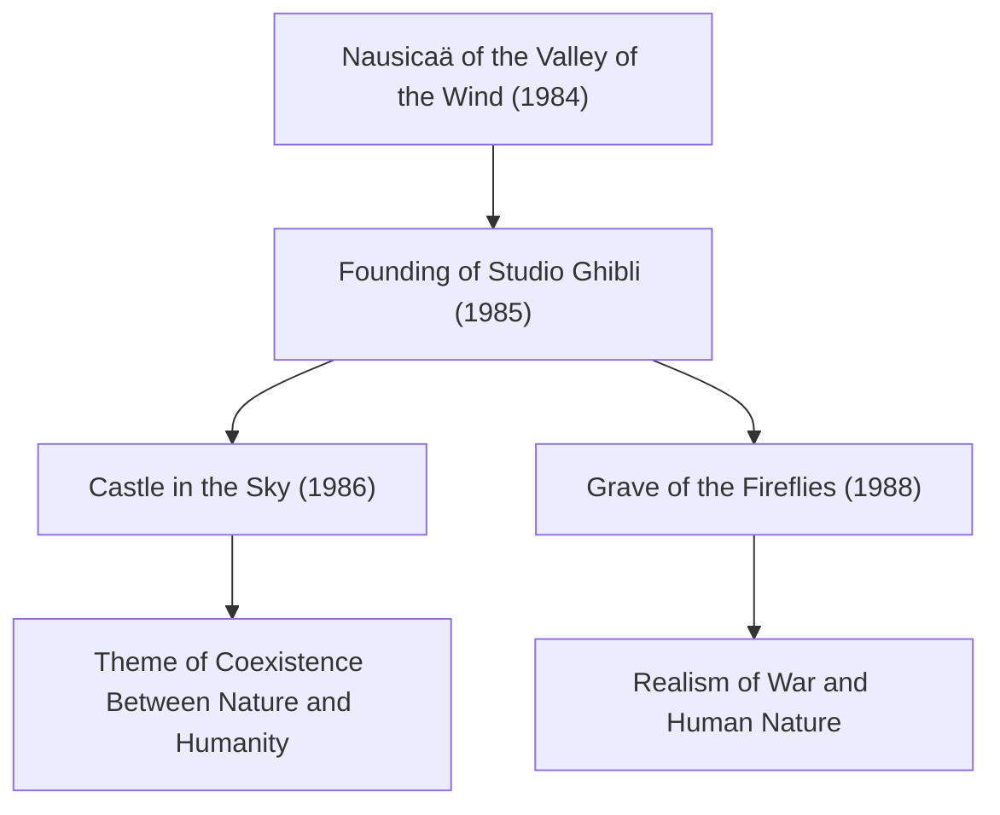

# The Trajectory of Studio Ghibli: Messages of Life and Nature Drawn Through Animation

Studio Ghibli transcends the boundaries of an ordinary animation studio, occupying a singular and revered position in cinematic culture not just in Japan, but worldwide. Since its founding in 1985, centered around two visionary creators—Hayao Miyazaki and Isao Takahata—the studio has produced a succession of historical masterpieces. In this article, we delve deeply into the history of Studio Ghibli, its technical evolution, and the shifting themes underlying its filmography, integrating physical, historical, and technological perspectives.

## The Founding of Studio Ghibli and Early Challenges

The history of Studio Ghibli begins with the success of *Nausicaä of the Valley of the Wind*, released in 1984. While technically produced before the formal establishment of Ghibli, the teamwork and financial foundation cultivated during its production paved the way for the studio's inception.

In *Castle in the Sky* (1986), released shortly after the studio's founding, Ghibli pursued the pinnacle of traditional cel animation techniques. In particular, the depiction of the glowing Levitation Stone and dynamic clouds made full use of optical composite techniques available at the time. Recreating physical phenomena such as light scattering and refraction through hand-drawn cels and camera lens filters set a new global benchmark for the industry.

## Economic Boom and Everyday Fantasy: Late 1980s to 1990s

While Japan was bustling with the Bubble Economy, Ghibli embarked on an unprecedented experiment: the double feature release of *My Neighbor Totoro* and *Grave of the Fireflies*. One portrayed the idyllic nature and spirits of Japan in the mid-1950s, while the other depicted the harrowing reality of the closing months of World War II. These two opposing creative vectors embody the profound multifaceted nature of Studio Ghibli.

Technologically, this era saw the refinement of depth and spatial representation using multiplane camera techniques. By arranging painted background elements across multiple layers and moving each at different speeds, animators created a genuine sense of physical depth—the parallax effect—on a two-dimensional screen. This visual ingenuity served as an early precursor to spatial rendering in the subsequent digital era of 3D computer graphics.

## Ecology and Mythic Imagination: The Impact of Princess Mononoke

Released in 1997, *Princess Mononoke* marked a monumental turning point for Studio Ghibli, both technologically and thematically. Depicting a fierce, tragic conflict between forest gods and humankind, the film presented a nuanced message that defied simple black-and-white dualism.

Of particular note here is the visual depiction of fluid dynamics in animation. Digital technology (CGI) was partially introduced to render the writhing curse surrounding the Demon God (Tatarigami), spurts of blood, and water currents. Yet, at its core, it remained rooted in the animator's keen observation and artistic reconstruction of physical laws. Capturing intuitive Newtonian mechanics—such as the motion of viscous substances and the sensation of mass when objects collapse under gravity—and exaggerating them through animation left creators around the world in awe.

## The Transition to Digital and Global Acclaim: Spirited Away

In 2001, *Spirited Away* achieved historic commercial success, shattering box office records in Japan and securing international acclaim, including the Academy Award for Best Animated Feature.

Starting with this film, Ghibli transitioned completely from traditional physical cels to digital painting. However, they adopted digital technology not merely for "efficiency," but to "expand visual expression." By incorporating digital physics-based simulations for infinite color gradients, complex lighting sources, and transparent water effects, Ghibli established a unique workflow that retained every ounce of the warmth of hand-drawn art.

## Isao Takahata's Innovation and the Pinnacle of Realism: The Tale of the Princess Kaguya

While Hayao Miyazaki often envisioned worlds through fantasy, Isao Takahata consistently pursued avant-garde experimentation that questioned the very framework of animation. The culmination of this lifelong pursuit is *The Tale of the Princess Kaguya*.

In this work, Takahata took a sophisticated psychological approach by intentionally leaving lines broken and incomplete and employing pale, watercolor-like washes, inviting the viewer's mind to actively "complete" the image. In dynamic scenes where kinetic energy erupts into a sprint, depicting the background with rough, frantic brushstrokes visually conveys spatial distortion and speed reminiscent of relativistic physics. This technique stands at the opposite pole of conventional photorealism, masterfully leveraging human perception and cognitive mechanisms.

## Passing the Torch to the Future and the Infinite Possibilities of Animation

The body of work created by Studio Ghibli is far more than mere entertainment; it continuously poses fundamental questions about environmental crises facing humanity, our relationship with technology, and what it truly means to live. From cel to digital, from the pursuit of analog textures to an earnest engagement with their times, Ghibli's journey demonstrates the boundless potential of animation as an artistic medium.

In the worlds crafted by Ghibli, the breath of life and the beauty of physical laws dwell within the flutter of the wind and the shimmer of water. We must continue to decipher the profound messages they have left behind and pass them down to future generations.
