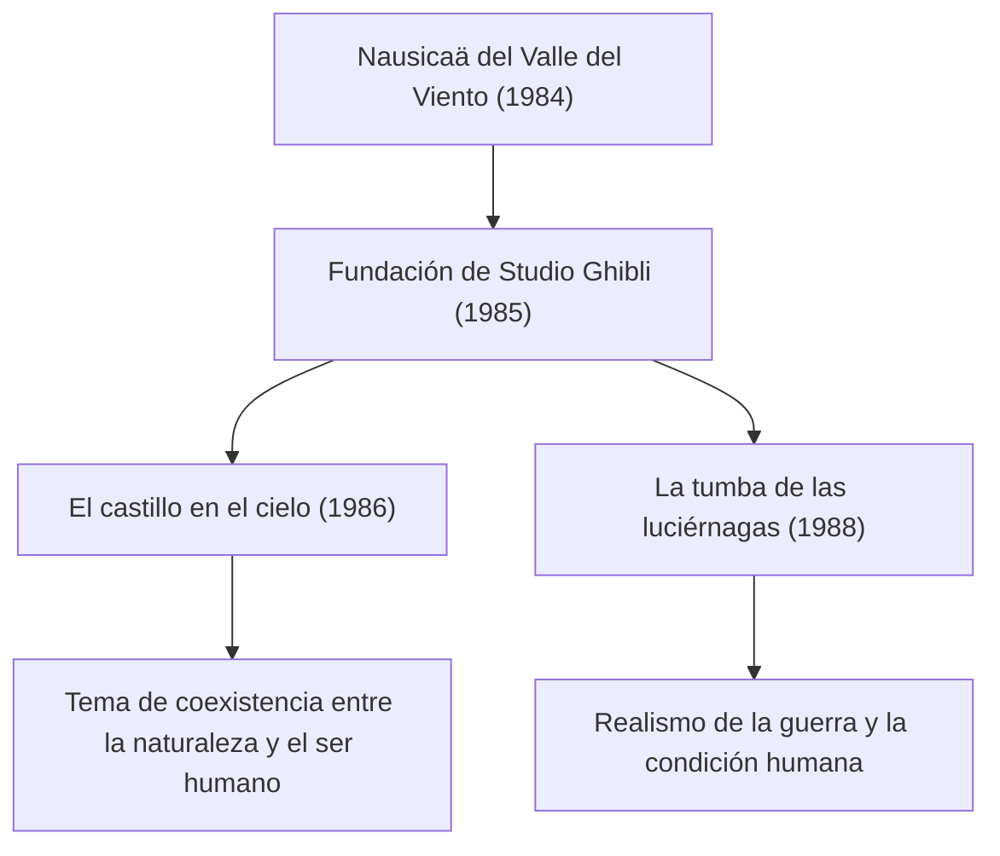

# La trayectoria de las películas de Studio Ghibli: el mensaje de vida y naturaleza a través de la animación

Studio Ghibli va mucho más allá de los límites de un simple estudio de producción de animación; ocupa una posición única en la cultura audiovisual, no solo en Japón sino en todo el mundo. Desde su fundación en 1985, encabezado por dos creadores geniales, Hayao Miyazaki e Isao Takahata, el estudio ha producido innumerables obras maestras históricas. En este artículo, profundizaremos en la historia de Studio Ghibli, su evolución técnica y la transformación de los temas recurrentes que atraviesan sus obras, integrando perspectivas físicas, históricas y tecnológicas.

## La fundación de Studio Ghibli y los primeros desafíos

La historia de Studio Ghibli comienza con el éxito de *Nausicaä del Valle del Viento*, estrenada en 1984. Aunque esta obra se produjo estrictamente antes de la creación formal del estudio, el trabajo en equipo y los recursos financieros cultivados durante su producción se convirtieron en la piedra angular para la posterior fundación de Ghibli.

Inmediatamente después de su fundación, con *El castillo en el cielo* (1986), el estudio persiguió la cumbre de las técnicas tradicionales de animación en acetato (*cel animation*). En particular, la representación de la luz de la piedra de levitación y las formaciones de nubes aprovechó al máximo la tecnología de composición óptica de la época. La técnica de reproducir fenómenos físicos como la dispersión y la refracción de la luz mediante acetatos dibujados a mano y el hábil manejo de filtros fotográficos elevó significativamente los estándares mundiales de aquel momento.

## Crecimiento económico y fantasía cotidiana: finales de los 80 a los 90

En pleno auge de la economía de la burbuja en Japón, Ghibli asumió el reto sin precedentes del estreno simultáneo en doble función de *Mi vecino Totoro* y *La tumba de las luciérnagas*. Una retrataba la naturaleza idílica y los espíritus de la década de 1950 (era Showa 30), mientras que la otra plasmaba la cruda realidad de finales de la Segunda Guerra Mundial. Estos dos vectores contrapuestos simbolizan a la perfección la polifacética identidad de Ghibli.

Desde el punto de vista técnico, en esta época se perfeccionó la expresión de la profundidad mediante el uso de cámaras multiplano (*multiplane camera*). Al disponer las capas de fondo en múltiples niveles y mover cada una a diferentes velocidades, se lograba generar una sensación física de tridimensionalidad (efecto de paralaje) sobre una pantalla bidimensional. Este ingenio visual fue el precursor de la representación espacial que más tarde aportaría la tecnología 3DCG en la era digital.

## Ecología e imaginación mítica: el impacto de *La princesa Mononoke*

El estreno de *La princesa Mononoke* en 1997 marcó un punto de inflexión decisivo para Studio Ghibli, tanto en lo técnico como en lo temático. En esta obra se plasmó el brutal enfrentamiento entre los dioses del bosque y la humanidad, planteando un mensaje complejo que escapa a cualquier maniqueísmo o dualismo simplista entre el bien y el mal.

Un aspecto especialmente destacable es la representación de la dinámica de fluidos en la animación. En los movimientos convulsos de la maldición que envuelve al dios demonio (*tatarigami*), las salpicaduras de sangre y las corrientes de agua, se introdujeron en parte técnicas digitales (CGI). Sin embargo, la esencia fundamental residía en la meticulosa observación y recreación de las leyes de la física por parte de los animadores. La habilidad para captar intuitivamente la mecánica newtoniana —el comportamiento de sustancias viscosas o la sensación de masa y gravedad de objetos que se derrumban— y traducirla mediante la exageración y la deformación artística conmocionó a creadores de todo el mundo.

## Transición digital y reconocimiento internacional: *El viaje de Chihiro*

En 2001, *El viaje de Chihiro* rompió todos los récords de taquilla en Japón, convirtiéndose en un hito histórico. Su consagración mundial se consolidó con galardones como el Premio Óscar a la Mejor Película de Animación.

Con este largometraje, Ghibli realizó la transición definitiva de la animación en acetato tradicional a la pintura digital. No obstante, emplearon las herramientas digitales no con el fin de "ahorrar costes o acelerar tiempos", sino para "expandir su capacidad expresiva". Se estableció así un flujo de trabajo pionero que incorporaba simulaciones físicas propias del entorno digital —infinitas gradaciones de color, complejos tratamientos de fuentes de luz o la transparencia del agua— sin renunciar en absoluto a la calidez y textura del dibujo a mano.

## La innovación de Isao Takahata y la cúspide del realismo: *El cuento de la princesa Kaguya*

Mientras que Hayao Miyazaki construye mundos a través de la fantasía, Isao Takahata mantuvo a lo largo de su carrera un desafío vanguardista permanente, cuestionando el marco mismo de la animación. La culminación de esta búsqueda fue *El cuento de la princesa Kaguya*.

En esta obra, se empleó un sofisticado enfoque psicológico: al dejar los trazos deliberadamente inconclusos y recurrir a tonalidades tenues de acuarela, se invitaba al cerebro del espectador a "completar" la imagen. En las escenas de carrera frenética, donde la energía cinética estalla, el fondo se plasma con trazos enérgicos e imperfectos para transmitir visualmente una sensación de velocidad y distorsión espacial que evoca conceptos de la teoría de la relatividad. Se trata de un método expresivo opuesto al fotorrealismo, que aprovecha magistralmente los mecanismos de la percepción y la cognición humana.

## El legado hacia el futuro y el potencial de la animación

El catálogo de obras de Studio Ghibli trasciende el mero entretenimiento; interpela continuamente sobre los dilemas medioambientales a los que se enfrenta la humanidad, el modo de relacionarnos con la tecnología y el significado fundamental del hecho de "vivir". La transición del acetato al píxel digital, la incesante búsqueda de texturas analógicas y su compromiso constante con la realidad de su tiempo demuestran el potencial ilimitado de la animación como medio expresivo.

En los mundos concebidos por Ghibli, en cada soplo de viento o en el más mínimo destello sobre el agua, reside el hálito vital y la belleza de las leyes de la física. Es nuestra tarea seguir descifrando los mensajes que nos han legado y transmitirlos a las futuras generaciones.
