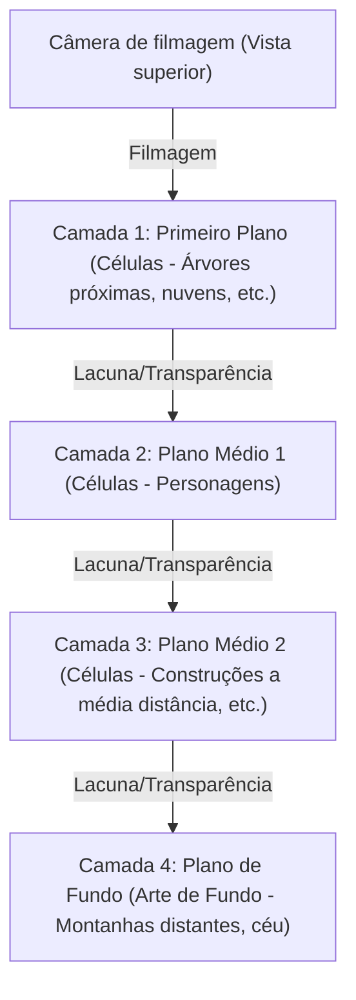
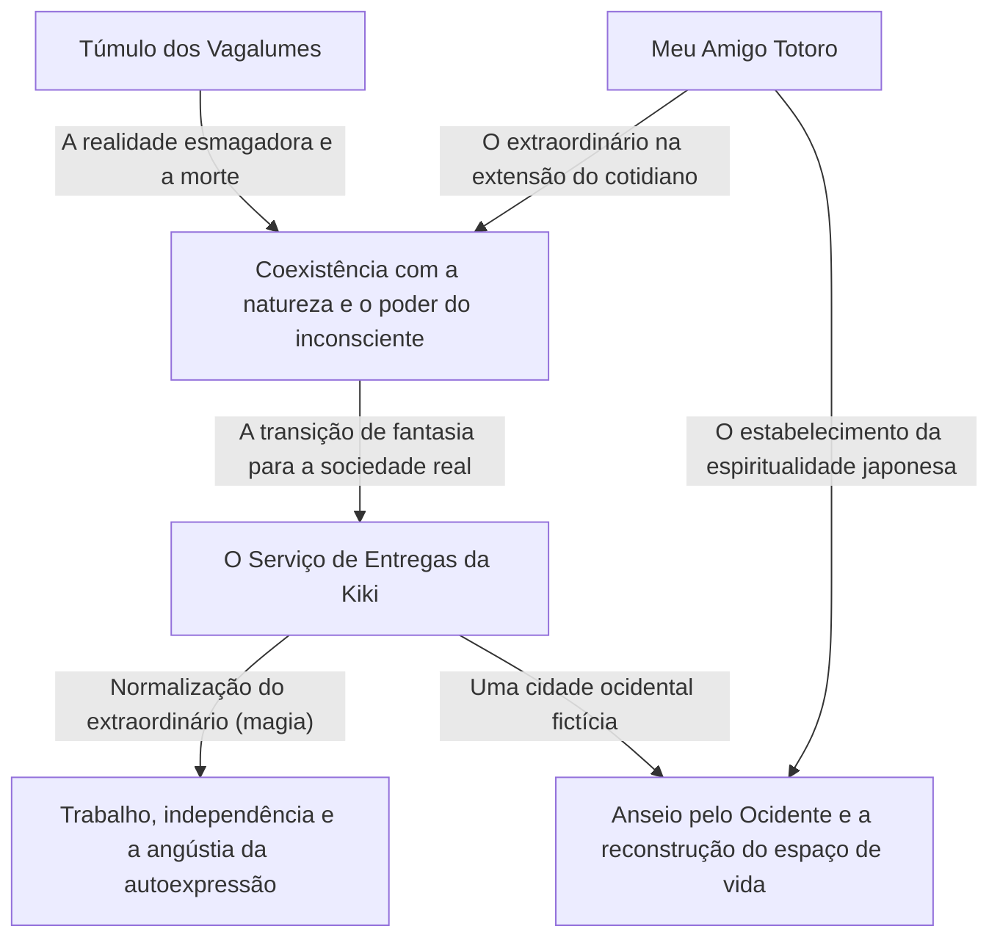
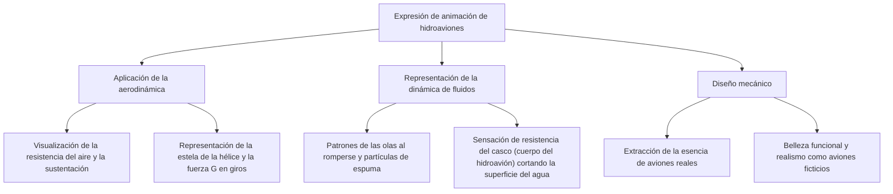
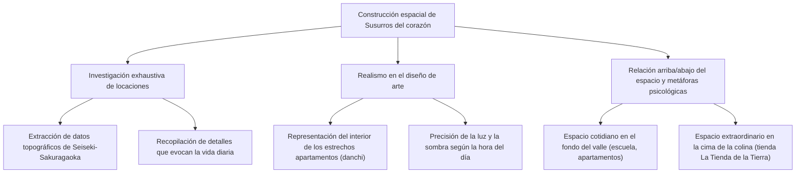
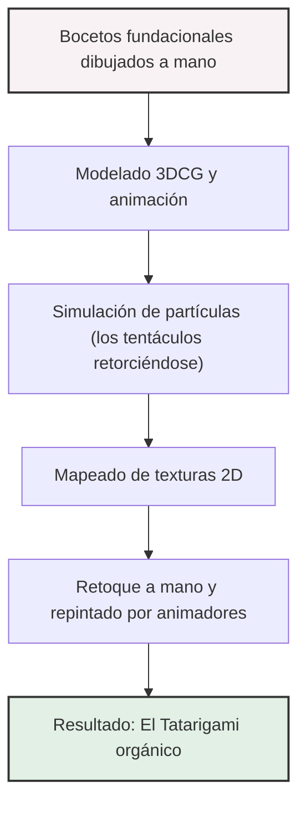
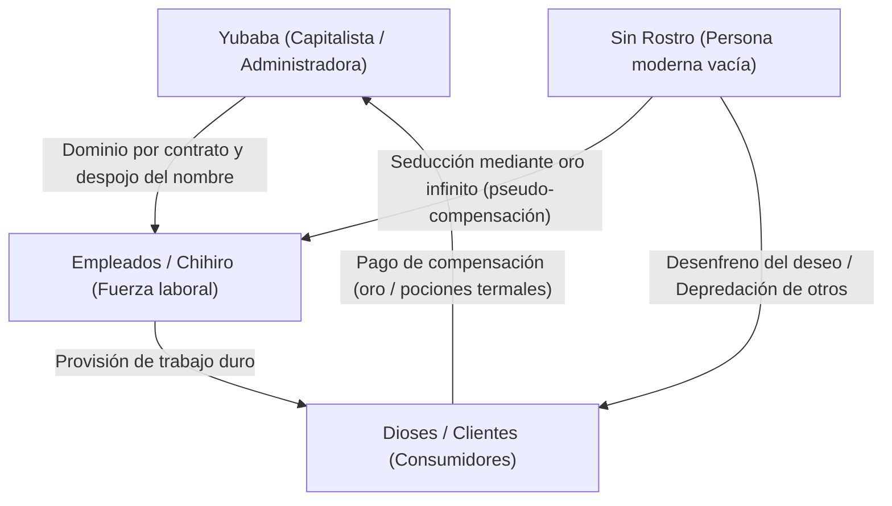
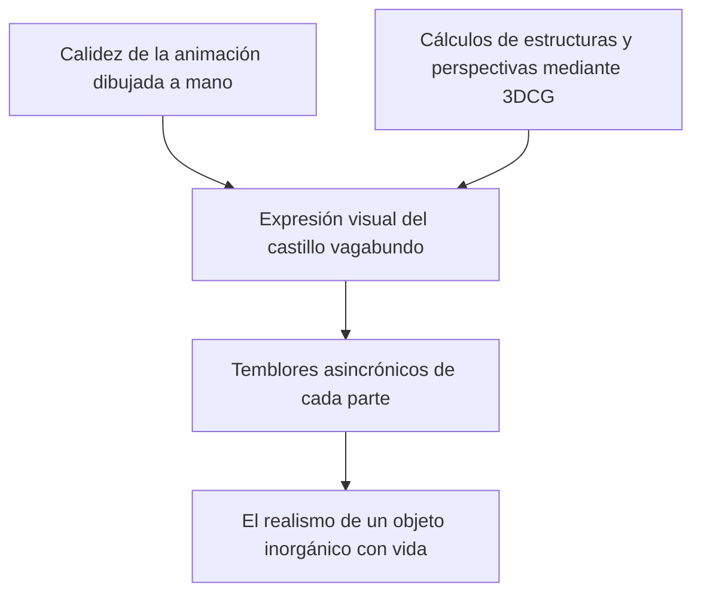
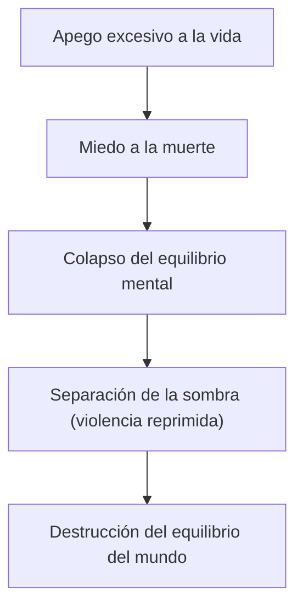
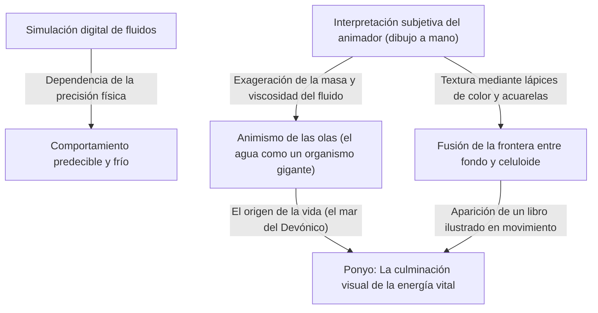
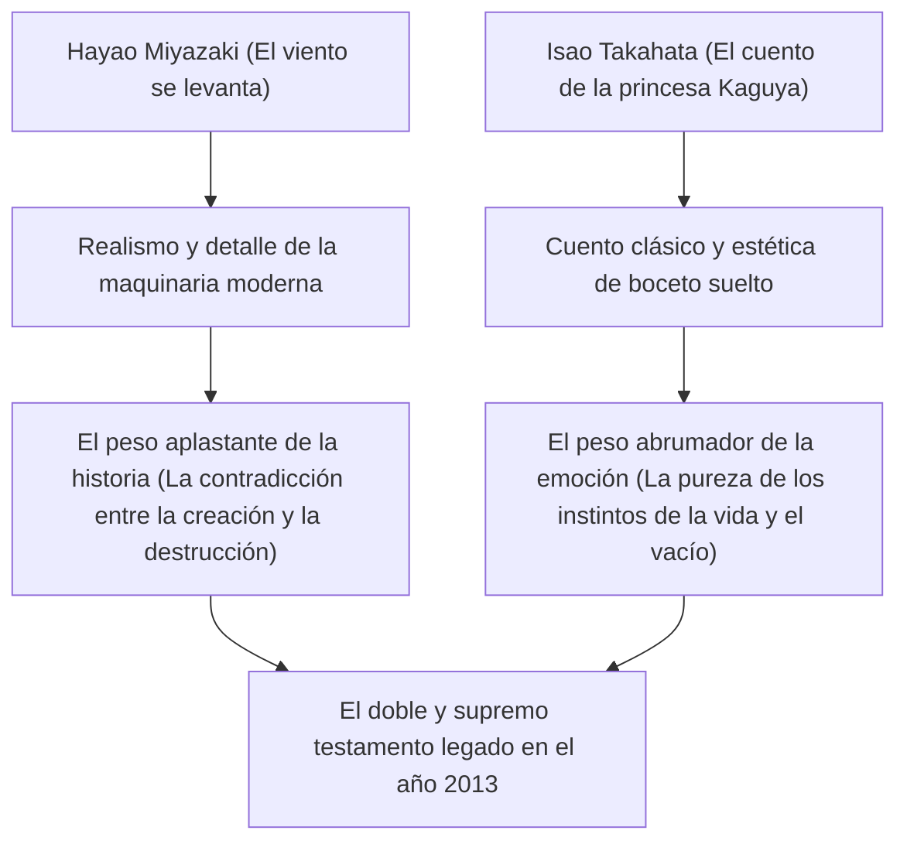

# Capítulo 1: Fundação e as Primeiras Obras-Primas (Nausicaä do Vale do Vento, O Castelo no Céu)

## 1.1 Uma Singularidade na História da Animação, o Nascimento do Studio Ghibli

Ao observar a indústria de animação japonesa, ou melhor, a história da animação mundial, não se pode ignorar um "incidente" ocorrido em meados da década de 1980. Isso foi, de fato, a fundação do Studio Ghibli. A história do Ghibli não é apenas a história de uma única empresa ou de um único estúdio de produção, mas a própria história do ponto máximo de expressão alcançado pela tecnologia analógica das células de animação, e da fusão miraculosa entre a "popularidade" e a "artisticidade" que a mídia da animação possui. Neste capítulo, ao desvendar a história da fundação do Studio Ghibli, focaremos no seu ponto de partida prático, "Nausicaä do Vale do Vento" (1984), e na primeira obra sob o nome do Studio Ghibli, "O Castelo no Céu" (1986), para discutir como dois gênios, Isao Takahata e Hayao Miyazaki, romperam os limites da expressão animada.

Na véspera da fundação do Studio Ghibli, a animação televisiva japonesa vinha passando por uma evolução única através da técnica de "animação limitada". Em contraste com a animação completa ao estilo Disney, que usava plenamente 24 quadros por segundo, o método que reduzia o número de quadros enquanto utilizava desenhos estáticos e trabalho de câmera (pan, tilt, etc.) para criar dinamismo, começou como um mal necessário para reduzir custos e, em algum momento, se estabeleceu como uma gramática visual única. No entanto, o que Isao Takahata e Hayao Miyazaki almejavam não cabia nesses limites. Eles ansiavam por realizar, no melhor formato que é o longa-metragem para o cinema, uma animação que buscasse a construção meticulosa do espaço, o realismo da atuação no cotidiano e, acima de tudo, "a alegria fundamental do movimento", habilidades que eles vinham cultivando desde a época da Toei Doga (atual Toei Animation).

## 1.2 A Autoralidade de Isao Takahata e Hayao Miyazaki: O Cruzamento Miraculoso entre Objetividade e Subjetividade

Para compreender profundamente as obras do Studio Ghibli, é necessário entender as naturezas de dois talentos diferentes, Isao Takahata e Hayao Miyazaki, que formam seu núcleo, bem como a interação entre eles. Ambos vieram da Toei Doga e estavam ligados por um vínculo profundo através das atividades sindicais, mas não é exagero dizer que suas orientações como diretores de animação eram diametralmente opostas.

A autoralidade de Hayao Miyazaki caracteriza-se por uma esmagadora "percepção espacial subjetiva" e pelo "fetichismo do movimento". A tela desenhada por Miyazaki, por vezes transcendendo as leis da física, possui uma força de persuasão intensa que apela diretamente à sensação física de quem assiste. A sensação de flutuação nas cenas de voo, a sensação de peso que faz sentir os graves quando um objeto de massa enorme se move, as correntes sutis do vento e o brilho da superfície da água, a sensação de que o próprio mundo se contorce como uma criatura viva são resultados de fixar a visão que está dentro da mente de Miyazaki nas células de animação através do corpo dos animadores. Ele utiliza frequentemente distorções do tipo lente grande angular e perspectivas únicas no layout (composição da tela), controlando habilmente a profundidade da tela e as linhas de movimento.

Por outro lado, a autoralidade de Isao Takahata reside em uma "objetividade" completa e "construção lógica". Como Takahata era um diretor que não desenhava, ele podia observar a tela de animação a partir de uma perspectiva metalinguística de um nível superior. Sua direção foca em levar ao limite o realismo da psicologia dos personagens, a estrutura social e as pequenas ações do cotidiano. Desde a disposição espacial, iluminação, até a motivação dos personagens, tudo é construído sobre cálculos minuciosos que, ao mesmo tempo que encorajam o público a criar empatia, também possuem um efeito de distanciamento brechtiano que faz com que sempre observem o mundo de um ponto de vista um passo atrás.

O fato de esses dois talentos, o "subjetivo e intuitivo Miyazaki" e o "objetivo e lógico Takahata", se manterem em cheque mutuamente e se respeitarem, tornando-se os pilares de um estúdio, foi a maior força motriz que produziu a rica filmografia do Ghibli. Nas primeiras obras do Ghibli, Takahata, na posição de produtor, desempenhou um papel extremamente importante de controlar os excessos de Miyazaki e, ao mesmo tempo, solidificar a estrutura das obras.

## 1.3 A Singularidade Tecnológica da Animação em Células e a Câmera Multiplano

A grandiosidade do Studio Ghibli não reside apenas na profundidade de seus temas, mas também na capacidade técnica avassaladora que os sustenta. Especialmente no período que vai de "Nausicaä" a "O Castelo no Céu", a tecnologia de animação analógica em células estava alcançando uma forma perfeita, ou seja, uma "singularidade tecnológica".

A esmagadora quantidade de informação e a sensação de realidade que a tela das obras do Ghibli possui são criadas por fundos de arte meticulosamente desenhados e pelas camadas de células de animação sobrepostas em vários níveis. O que merece destaque aqui é o ápice da expressão espacial usando a "câmera multiplano" (câmera de múltiplos planos).

A câmera multiplano é um dispositivo onde várias camadas (planos) de vidro são dispostas abaixo da câmera, com células de animação e pinturas de fundo colocadas em cada uma delas para filmagem. Com isso, quando a câmera se move (pan, tilt, track up, etc.), alterar a velocidade de movimento de cada camada permite criar uma pseudo-profundidade tridimensional (paralaxe). Embora essa tecnologia em si tenha sido usada há muito tempo por estúdios como a Disney, a aplicação da câmera multiplano no Ghibli destacava-se de longe por sua precisão e complexidade.

As "cenas de voo", indispensáveis nas obras de Miyazaki, recebem ao máximo os benefícios dessa tecnologia. Por exemplo, em um espaço complexo composto por um mar de nuvens que se estende abaixo, uma aeronave voando entre elas e a terra vista mais ao fundo, o fato de cada camada fluir a uma velocidade diferente proporciona ao público uma forte percepção espacial e imersão, como se realmente estivessem voando no céu. Além disso, através da tecnologia de "luz transmitida", onde a luz é projetada por trás das células, expressões sutis de gradiente usando aerógrafo, e o investimento insano de calorias de animação para desenhar à mão o movimento de cada folha de grama e árvore ao vento, a tela ganha vida, com o vento soprando e o ar fluindo. Numa época em que a tecnologia digital (CGI) não existia, eles construíam um espaço virtual mais real que a própria realidade, utilizando rolos de filme, tintas e a magia da luz.

## 1.4 "Nausicaä do Vale do Vento" (1984): Um Marco Monumental como Pré-história e a Profundeza da Ecologia

Lançado em 1984, "Nausicaä do Vale do Vento" é oficialmente uma obra produzida pela "Topcraft", antes da fundação do Studio Ghibli, mas foi feita com a formação do diretor Hayao Miyazaki e do produtor Isao Takahata, sendo posicionada como o "Filme 0" ou "Filme 1" prático que determinou a direção futura do Ghibli.

Esta obra baseia-se no mangá de mesmo nome que o próprio Hayao Miyazaki estava publicando na revista mensal "Animage", mas a versão cinematográfica reestrutura a sua parte inicial e a conclui como uma história independente. A maior conquista que "Nausicaä" gravou na história da animação foi o fato de ter retratado temas de ficção científica extremamente profundos como "questões ambientais (ecologia)", "dignidade da vida" e a "insensatez humana" dentro de um quadro de entretenimento e com uma beleza visual avassaladora.

Mil anos após a civilização industrial colapsar na guerra final conhecida como os "Sete Dias de Fogo". Um mundo dominado por insetos gigantes, onde se expande o "Mar da Corrupção" (Fukai), uma floresta de fungos que emite miasmas tóxicos. Essa ambientação de mundo desesperadora reflete os fortes sentimentos de crise de Miyazaki em relação ao medo da guerra nuclear durante a Guerra Fria e a destruição ambiental cada vez mais grave. No entanto, Miyazaki não cai no dualismo simples de "proteção da natureza" versus "a maldade humana". A grande reviravolta na história, onde o Mar da Corrupção é na verdade um sistema para purificar a Terra poluída, joga na cara a terrível capacidade de autorrecuperação da natureza e a insignificância do ser humano perante ela.

Ao discutir "Nausicaä" pelo aspecto técnico, é impossível não mencionar a representação dos insetos gigantes, incluindo os "Ohmu". A animação dessas criaturas bizarras com múltiplos segmentos e olhos, avançando como se ondulassem, é criada usando técnicas especiais de animação usando borracha (como o método de deslizar e filmar partes de várias células) e um cálculo meticuloso do tempo de animação, gerando uma sensação de peso avassaladora, estranheza e um tipo de divindade. Além disso, as cenas de voo no Mehve (a máquina voadora montada por Nausicaä), com o movimento do tecido que faz sentir a resistência do vento e a trajetória suave que parece visualizar a relação entre gravidade e sustentação, mostraram ao mundo "a catarse de voar", que é a verdadeira essência da animação de Miyazaki.

O design da heroína Nausicaä também foi inovador. Ela não é apenas uma "garota a ser protegida", mas uma guerreira que pilota o Mehve, atira e empunha uma espada, sendo ao mesmo tempo uma figura materna com profundo afeto por todas as vidas. Essa imagem de personagem complexa, que combina força e gentileza, raiva e tristeza, tornou-se o ponto de origem e um referencial não apenas para as futuras obras do Ghibli, mas também para a imagem das heroínas na ficção contemporânea.

## 1.5 A Fundação do Studio Ghibli e "O Castelo no Céu" (1986): O Ápice da Aventura de Ação

Com o sucesso de "Nausicaä", seus lucros foram usados para estabelecer oficialmente o "Studio Ghibli" em 1985. O propósito dessa fundação era apenas um: "continuar a fazer longas-metragens de animação de alta qualidade para o cinema". Distanciando-se da produção em massa de baixa qualidade das animações para televisão, o Ghibli nasceu como uma base independente para buscar uma qualidade sem compromissos.

E em 1986, "O Castelo no Céu" foi lançado como o primeiro e memorável longa-metragem sob o nome do Studio Ghibli. Baseado em uma ideia que Hayao Miyazaki concebeu em seus dias de escola primária, com o motivo da ilha flutuante Laputa que aparece em "As Viagens de Gulliver" de Swift, esta obra incorpora todos os elementos reais da clássica aventura de ação (boy-meets-girl): o encontro entre um menino e uma menina, uma misteriosa pedra voadora, piratas do ar e um exército com ambições malignas. É verdadeiramente uma obra-prima que pode ser chamada de "o extremo da ação".

A grandeza de "O Castelo no Céu" reside na força motriz da história de tirar o fôlego e na obsessão incomum pelos detalhes que se espalham por todos os cantos da tela. Desde a cena de ataque da família Dola ao dirigível (Tiger Moth) no início, até o drama de perseguição no Vale dos Slags onde Pazu e Sheeta escapam, a tela é constantemente "dinâmica". O design mecânico no Vale dos Slags, o movimento dos pistões da máquina a vapor, a rotação das engrenagens e a corrida do carrinho de mineração. Essas máquinas e veículos não são meros fundos ou adereços, mas são retratados de forma vibrante como se possuíssem vida própria. A paixão colocada na animação, que tenta registrar o "afeto pelas máquinas" de Miyazaki e até "o calor e o cheiro" que elas emitem, confere um realismo avassalador ao mundo fictício.

Em sua temática, o que "O Castelo no Céu" apresenta é a "divisão entre tecnologia avançada e os seres humanos" e a "conexão com a terra". O poder científico transcendental do Império de Laputa, que uma vez governou o mundo, acabou se tornando a causa de sua própria destruição. O clímax do filme, a visão de uma "grande árvore" gigantesca que envolve a enorme pedra voadora subindo em direção ao espaço das profundezas de Laputa em colapso, é extremamente simbólico. Este final, onde a construção artificial que simbolizava a tecnologia desmorona e apenas a grande árvore, símbolo da vida, permanece, resume-se nas falas de Sheeta: "Vamos criar raízes no solo, e viver junto com o vento. Passar o inverno com as sementes, e cantar a primavera com os pássaros. Não importa o quão terríveis sejam as armas que se possua, ou quantos pobres robôs se possa controlar, não se pode sobreviver longe da terra." Esta é uma crítica feroz de Miyazaki à civilização moderna, uma continuação de "Nausicaä", e uma prece universal pelo retorno à natureza.

Além disso, a contribuição dos diretores de arte Toshiro Nozaki e Nizo Yamamoto na arte de fundo nesta obra é imensurável. A beleza silenciosa da cena da chegada a Laputa, onde o mar de nuvens se abre revelando um gigantesco jardim coberto de musgo e o robô soldado, comprova como a pintura de fundo na animação determina a dignidade da obra. A fusão perfeita entre a direção de "movimento" de Miyazaki e a arte "estática" se fez presente ali.

## 1.6 Conclusão: O Início de uma Lenda

"Nausicaä do Vale do Vento" e "O Castelo no Céu". Nestas duas primeiras grandes obras-primas, Hayao Miyazaki, Isao Takahata e a equipe do Studio Ghibli extraíram ao máximo o potencial do meio de expressão da animação. Deram peso e textura à mecânica fictícia, infundiram realismo no ecossistema imaginário e incluíram críticas sociais complexas e temas filosóficos em um entretenimento que deixa pessoas de todas as idades sem fôlego. Eles realizaram este feito extraordinário por meio de uma enorme quantidade de células e de um trabalho manual que beirava a loucura artesanal.

Estas duas obras elevaram os padrões técnicos e expressivos a alturas muito maiores e se ergueram como "o grande muro do Ghibli" para o mundo da animação japonesa que se seguiu. E, ao mesmo tempo, foi literalmente o "Capítulo 1" da grandiosa lenda onde este pequeno estúdio acabaria por desencadear um fenômeno cultural global e reescrever a própria história da animação. O caminho que conduziu a "Meu Amigo Totoro", "Túmulo dos Vagalumes" e "Princesa Mononoke" começou, por completo, a partir do vento de "Nausicaä" e do céu de "O Castelo no Céu".

# Capítulo 2: O Cruzamento do Cotidiano e do Extraordinário —— O Mundo Retratado em "Meu Amigo Totoro", "Túmulo dos Vagalumes" e "O Serviço de Entregas da Kiki"

Ao desvendar a história do Studio Ghibli, o final da década de 1980 foi um período de viragem decisivo. Passando da grandiosa "espada e magia" ou da "aventura voadora" vista na obra anterior "O Castelo no Céu" (1986), o Ghibli mudou drasticamente o seu curso para o "cotidiano", abordando as paisagens nativas japonesas ou a vida dos habitantes ocidentais comuns. Neste capítulo, abordaremos três obras: as exibições simultâneas miraculosas de 1988, "Meu Amigo Totoro" e "Túmulo dos Vagalumes", e o grande sucesso de 1989, "O Serviço de Entregas da Kiki", dissecando exaustivamente a revolução temática e técnica que gravaram na história da animação.

## 1. A Loucura e o Milagre das Exibições Simultâneas: Hayao Miyazaki e Isao Takahata, Duas Visões da Era "Showa"

Na primavera de 1988, o formato de exibição conjunta de "Meu Amigo Totoro" e "Túmulo dos Vagalumes" tornou-se uma realidade que hoje seria impensável. Isso não foi apenas uma combinação comercial, mas a cristalização da "loucura e do milagre" onde o Studio Ghibli, e mais precisamente os dois geniais criadores, Hayao Miyazaki e Isao Takahata, soltaram faíscas.

### 1-1. Vida e Morte Lado a Lado
"Meu Amigo Totoro" é um hino à vida que retrata a interação entre os espíritos da natureza e as crianças num vilarejo agrícola japonês na década de 30 do período Showa (década de 1950). Por outro lado, "Túmulo dos Vagalumes" desenhou a realidade brutal de dois irmãos que perdem suas vidas em meio às chamas da guerra em Kobe por volta do fim da guerra em Showa 20 (1945), através de um realismo avassalador. Embora a diferença de época seja de apenas cerca de 10 anos, estas duas obras contêm temas que estão completamente lado a lado e de costas um para o outro: "Vida e Morte" e "A Fantasia Idealizada e a Realidade Cruel".

Naquela época, o Studio Ghibli adotou um sistema de produção quase inconsequente que fez operar esses dois talentos colossais ao mesmo tempo. Houve uma disputa pela equipe de animação e o cronograma chegou à beira do colapso. Contudo, como resultado, este ambiente severo elevou a qualidade de ambas as obras aos seus limites. Como antítese ao realismo extremo de Isao Takahata, Hayao Miyazaki construiu o mundo de "Totoro", onde a vitalidade subconsciente vibra com mais força; e Takahata, para confrontar a fantasia descrita por Miyazaki, elevou a expressão da animação japonesa a uma dimensão similar a um documentário.

### 1-2. O Retrato Distinto da Era Showa e o Nascimento do "Documentário de Animação"
A direção de Isao Takahata em "Túmulo dos Vagalumes" foi algo que destruiu a gramática da animação tradicional. A trajetória de queda das bombas incendiárias do bombardeiro B-29, o tremor das chamas das casas em fogo e, acima de tudo, as mudanças físicas de Seita e Setsuko se debilitando pela inanição. Para expressar isso, a designer de cores Michiyo Yasuda e sua equipe buscaram minuciosamente o "marrom barrento coberto de lama, sangue e fuligem", algo que as cores convencionais da animação não conseguiam exprimir plenamente.

Em contraste, em "Meu Amigo Totoro", Hayao Miyazaki reconstruiu o "Japão lindo, que talvez tenha existido no passado", que permanecia em suas memórias. Não foi apenas um simples realismo descritivo, mas sim a tentativa de fixar nas células o "brilho" do mundo visto a partir do ponto de vista infantil. Essa distinção no retrato dessas duas eras "Showa" prova a imensa amplitude de expressão que o meio de animação possui, tornando-se um marco monumental na história do cinema japonês.

## 2. A Revolução na Arte de Fundo: O "Ar e a Umidade" Criados por Kazuo Oga e Nizo Yamamoto

A capacidade de persuasão avassaladora que as obras do Ghibli possuem deve-se não só à atuação dos personagens, mas de modo muito expressivo, à força da arte de fundo que se espalha atrás deles. Neste período, a arte de fundo do Studio Ghibli estava atingindo o seu ponto alto.

### 2-1. A Atmosfera Úmida da "Floresta do Totoro" Desenhada por Kazuo Oga
As conquistas de Kazuo Oga, selecionado como diretor de arte de "Meu Amigo Totoro", mudaram a história da arte da animação japonesa e dizer isso não é nenhum exagero. A natureza retratada por Oga faz uso máximo das características das tintas opacas de cartaz (poster color). Embora use a tinta opaca, ao invés das aquarelas transparentes, o toque requintado do controle de água e a pincelada expressaram com êxito a "umidade" particular do clima japonês e o "cheiro abafado da grama verde", chegando até mesmo na "temperatura da luz do sol através da copa das árvores".

Especialmente, a arte de fundo na cena onde Satsuki e Mei encontram Totoro num ponto de ônibus chuvoso, é de se perder o fôlego. A textura do asfalto molhado, a profundidade da floresta do santuário na escuridão, a camada de ar criada pela iluminação pública. A arte de Oga não é uma mera "cópia da paisagem"; é sim uma mágica que visualiza "informações invisíveis" como a temperatura, a umidade, e o vento que ali sopra.

### 2-2. O Anseio pelo Ocidente e o Realismo Arquitetônico

Do outro lado, a cidade de Koriko, onde se passa "O Serviço de Entregas da Kiki", é uma cidade fictícia que funde elementos de várias cidades europeias, como Estocolmo e a Ilha de Gotland (Visby) na Suécia, e também Lisboa e Paris. A arte de fundo aqui tinha uma direção oposta à de "Totoro", que retratava as paisagens nativas japonesas.

Edifícios europeus de pedra, fileiras de telhados e ladeiras que levam ao mar. Para ilustrar estes pontos com convicção, a equipe de arte do Ghibli conduziu uma intensa busca de locações e estudo das estruturas arquitetônicas. Para uma única textura de pedra, o nível do desgaste e o índice de reflexão da luz do sol foram calculados e traduzidos na coloração que apareceria melhor como fundo de animação. Esta capacidade artística que pintou a imagem do "anseio pelo Ocidente" não como mera fantasia vazia, mas como num local espacial onde pessoas verdadeiramente residem e trabalham, é notavelmente espantosa.

## 3. O Tema Contemporâneo em "O Serviço de Entregas da Kiki": "Trabalho e Bloqueio Criativo"

Quando "O Serviço de Entregas da Kiki" foi aos cinemas, angariou enorme apoio entre muitos jovens, notavelmente mulheres trabalhadoras. A razão disso se dá pelo fato de a obra parecer na superfície ter a estética e aparência "da história de amadurecimento de uma bruxinha" como fantasia, porém a sua essência autêntica era um drama extremante contemporâneo e universal de temática realista sobre o "trabalho e o talento (esgotamento criativo)".

### 3-1. O Momento em que o Talento se Transforma em "Trabalho"
A protagonista Kiki inicia seus trabalhos de entrega utilizando seu dom e talento natural da magia de "voar pelo céu". Esse é o processo que se sobrepõe perfeitamente aos profissionais e criadores contemporâneos adentrando na sociedade, capitalizando e transformando seus "talentos e aptidões" em capital. Para a Kiki do começo, o ato de voar era seu prazer e forma de autoexpressão. Contudo, no momento em que se tornou um "trabalho", ela enfrentou demandas descabidas de clientes (a exemplo do episódio da torta de arenque) e, ao começar a receber dinheiro em troca, o significado da magia transformou-se no seu íntimo.

### 3-2. O Bloqueio Criativo e a Perda de Identidade
Na metade da história, de modo súbito, Kiki perde seus poderes mágicos, não conseguindo mais voar pelo céu, e também deixa de entender as palavras de Jiji, o gato preto. Essa é a oscilação da identidade de uma garota na puberdade, e ao mesmo tempo, a perfeita metáfora do "esgotamento do talento (bloqueio criativo)" enfrentado pelo criador.

Ursula, que cumpre um papel crucial aqui, é uma estudante de arte que desenha quadros numa cabana na floresta. Ela diz para Kiki: "Nesses momentos, só te resta se debater e tentar de tudo.", "Desenhe, desenhe e desenhe incansavelmente", "Mesmo assim se não adiantar, pare de desenhar. Dê um passeio, observe a paisagem, tire um cochilo, não faça absolutamente nada". Esta fala é a prescrição e a angústia em si com a qual todos que se envolvem em atividades de expressão, inclusive os animadores e o próprio Hayao Miyazaki, acabam enfrentando.

### 3-3. A Resolução de "Voar Sangrando"
Ursula diz sobre seus próprios quadros: "Antes eu conseguia desenhar sem pensar em nada, mas agora é diferente. Tenho que pintar meus próprios quadros." O mesmo se aplica à magia de Kiki. Os tempos de inconsciência, em que ela voava apenas com o talento nato (magia), chegaram ao fim, e agora ela deve, através de sua própria vontade e esforço, "readquirir" a magia. Durante o clímax, a cena em que Kiki monta numa vassoura de limpeza, com um semblante desesperado para voar aos céus, já não é uma fantasia elegante. É a figura de uma profissional exercendo sua "habilidade" com esforços de cuspir sangue e enfrentando seus próprios limites.

## 4. A Estrutura dos Temas e o Relacionamento Mútuo

Embora, à primeira vista, essas três obras apresentem visões de mundo distintas e independentes, se olharmos pelo prisma da autoralidade do Ghibli, as convergências contínuas e o cruzamento dos temas são expostos perfeitamente.

O "extraordinário (fantasia) oculto no cotidiano" exibido por "Totoro" atingiu uma natureza mitológica ainda mais enraizada graças ao contraste com a realidade extrema de "Túmulo dos Vagalumes". E assim, a técnica de expressão e tecnologia de animação ali estabelecidas tornaram-se uma arma poderosa para retratar o tema paradoxal em "O Serviço de Entregas da Kiki": "como uma existência extraordinária (bruxa) se integra e se funde no cotidiano (trabalho) da sociedade moderna".

## 5. Fechamento: Pavimentando o Caminho para a Próxima Etapa

Durante o período de 1988 a 1989, o Studio Ghibli percorreu todo e qualquer limite que a animação poderia ilustrar através de temas como "Vida e Morte", "Japão e o Ocidente", "Fantasia e Realismo", e "Talento e Trabalho" em meros poucos anos. A habilidade cultivada ali de observar e retratar exaustivamente as atuações cotidianas, juntamente com o poder da arte de fundo que infunde ar e emoção na paisagem, seriam herdadas para obras com temas mais complexos para o público adulto, como "Memórias de Ontem" (1991) e "Porco Rosso: O Último Herói Romântico" (1992).

As três obras, "Meu Amigo Totoro", "Túmulo dos Vagalumes" e "O Serviço de Entregas da Kiki", não são uma mera lista de grandes filmes. Elas são o monumento histórico que documenta o momento mais efervescente e doloroso da eclosão da animação, onde este meio de expressão se liberta de ser apenas um entretenimento para crianças e se transforma numa "Arte Total" que retrata as angústias estruturais da sociedade e o profundo abismo do espírito humano.
# Capítulo 3: El anhelo por el vuelo y el romance adulto: El pináculo del realismo en Porco Rosso y Susurros del corazón

Al observar la historia de Studio Ghibli, *Porco Rosso* (1992) y *Susurros del corazón* (1995), estrenadas a principios y mediados de la década de 1990, pueden parecer a primera vista obras situadas en polos opuestos. Mientras que la primera es una fantasía ambientada en el mar Adriático que describe las batallas y la melancolía de un cazarrecompensas piloto de hidroaviones transformado en cerdo por una maldición, la segunda es un drama coral juvenil ambientado en el moderno Tama New Town, que describe el inocente primer amor de dos estudiantes de secundaria y sus conflictos sobre su futuro.

Sin embargo, lo que subyace en estas dos obras es el insaciable afán investigador de Studio Ghibli, o más bien, de creadores excepcionales como Hayao Miyazaki y Yoshifumi Kondo, que buscaron llevar al límite el "realismo (sensación de realidad)" utilizando la animación como medio de expresión. Y en la base de todo esto existe un profundo anhelo por el "vuelo": ya sea el vuelo físico en el cielo o el salto espiritual para superar los propios límites. En este capítulo, exploraremos profundamente desde perspectivas tanto históricas como técnicas cómo estas dos obras ocupan un lugar único en la historia de la animación y qué hitos temáticos y técnicos lograron.

## 1. *Porco Rosso*: El pináculo de la aerodinámica y la elegía de una era perdida

*Porco Rosso* (título original en italiano) tiene unos orígenes singulares: originalmente se planeó como un cortometraje para ser proyectado en los vuelos de Japan Airlines, pero terminó convirtiéndose en un largometraje ensombrecido por la dura realidad de la Guerra de los Balcanes. Esta obra tiene una textura extremadamente personal, creada por Hayao Miyazaki para sí mismo, como "una película para hombres de mediana edad cuyos cerebros se han vuelto tofu debido al cansancio".

### 1.1 Hayao Miyazaki y los aviones: Fetichismo mecánico y la representación meticulosa de la aerodinámica

La obsesión de Hayao Miyazaki con el "vuelo" es bien conocida, pero la representación de los hidroaviones en *Porco Rosso* muestra la forma más pura de su propio fetichismo hacia la maquinaria y su profunda comprensión de la aerodinámica. Los hidroaviones que aparecen en esta película (el amado y carmesí Savoia S.21 del protagonista Porco Rosso —un diseño original que combina elementos de aviones reales como el Macchi M.33 y el Savoia-Marchetti S.59—, el avión de su rival Curtis, y el variopinto grupo de hidroaviones de la alianza de piratas del cielo) no son simples fondos o accesorios, sino que funcionan dinámicamente como personajes autónomos.

Lo que merece especial mención es el equilibrio perfecto entre la "mentira y la verdad de las leyes de la física" en la animación. Aspectos como la resistencia del aire, la sustentación, el torque de la hélice, la vibración del motor e incluso la dinámica de fluidos durante el despegue y aterrizaje en la superficie del agua son controlados exquisitamente.

En la escena en la que el Savoia de Porco enciende el motor, todo el proceso de los cilindros encendiéndose, el avión entero comenzando a vibrar sutilmente y el espeso humo negro saliendo por los tubos de escape se representa mediante la delicada vibración de los celuloides y la doble exposición (una técnica fotográfica analógica de la época). En la secuencia de combate aéreo (*dogfight*), la carga física sobre el piloto que soporta la fuerza G (aceleración por gravedad) al girar, y los sutiles movimientos de la palanca de control y los pedales del timón manipulados al borde de la entrada en pérdida (stall), se describen con una sincronización de cuadros (*timing*) extremadamente precisa. Esto es el resultado del "sentido físico del vuelo" presente en el cerebro de Hayao Miyazaki, siendo rastreado perfectamente sobre el celuloide a través de las manos de los animadores.

### 1.2 La resistencia al fascismo y el anarquismo que resuenan en los cielos del Adriático

El escenario de esta obra es el mar Adriático en Italia a fines de la década de 1920. Como contexto histórico, es una época de frenesí y ansiedad donde las cicatrices de la Primera Guerra Mundial aún persisten y el partido fascista liderado por Mussolini está en ascenso. Porco Rosso (su nombre real es Marco Pagot) fue en su tiempo un as de la aviación de la fuerza aérea italiana, pero, desesperado por el sistema de estado y el ejército, se maldijo a sí mismo para convertirse en cerdo, eligiendo vivir como un cazarrecompensas forajido (anarquista).

La famosa frase de Porco: "Prefiero ser un cerdo que un fascista" no es una simple frase *hardboiled*. Es una fuerte declaración del anti-fascismo y anarquismo del propio Hayao Miyazaki, rechazando ser incorporado al gigante aparato violento que es el Estado, y buscando la libertad y la dignidad individual en el cielo, un espacio sin nacionalidades.

En la segunda mitad de la película, la escena donde Porco se reúne en secreto en un cine con su antiguo compañero de armas Ferrarin (ahora comandante en la fuerza aérea fascista), refleja intensamente el trasfondo político de la obra. Ferrarin murmura: "Tenemos que volar cargando con patrocinadores inútiles como la nación y la raza". Aquí, el proceso en el cual la pura alegría de volar se transforma en la ideología del Estado y en herramientas de guerra es retratado fríamente. La razón por la que Porco se convirtió en cerdo no se hace explícita, pero funciona como una profunda desesperación ante un mundo absurdo donde los humanos se matan entre sí, un mecanismo de defensa para alejarse de una sociedad con una fuerte presión conformista, o como una expresión paradójica: "No puedes mantener tu dignidad como humano mientras retengas una forma humana".

### 1.3 "Un cerdo que no vuela es solo un cerdo": Romance de la madurez, fracaso y maldición

La razón por la que *Porco Rosso* cautiva los corazones de tantos adultos es porque la obra es una desgarradora elegía por "lo perdido". Porco alberga un profundo sentido de pérdida y culpa del sobreviviente hacia sus compañeros de armas que cayeron en la Primera Guerra Mundial (la escena del espejismo de los aviones ascendiendo hacia un plano de nubes es una obra maestra histórica del cine).

Como simboliza la canción "Le Temps des cerises" (El tiempo de las cerezas) cantada por Gina, famosa como una canción que llora la caída de la Comuna de París, esta película está impregnada de una profunda nostalgia por los buenos tiempos pasados, una juventud inalcanzable y pérdidas irreversibles. La madura representación del romance entre Porco y Gina, con una distancia inquebrantable entre ellos que nunca llega a cruzarse, ocupa un lugar singular entre las obras de Ghibli. Porco utiliza su "maldición" como excusa, escapando en parte del afecto de Gina y de participar en la sociedad real. Detrás de su eslogan, "Así es como se ve lo genial", se esconde la dolorosa historia de "autoaceptación de un hombre de mediana edad", la soledad de ser un mártir por su propia estética y la aceptación de sí mismo a medida que se vuelve obsoleto.

## 2. *Susurros del corazón*: El doloroso realismo de la adolescencia y la magia del espacio

*Susurros del corazón*, estrenada en 1995, es una película monumental producida, con guion y guiones gráficos de Hayao Miyazaki, y fue la única obra dirigida por Yoshifumi Kondo, un animador clave en Studio Ghibli. Basada en el manga shojo homónimo de Aoi Hiiragi, en manos de Miyazaki y Kondo, esta obra trascendió los límites de una simple historia de amor para convertirse en un retrato realista de la adolescencia tambaleante por las ansiedades sobre el futuro, el talento y la autorrealización.

### 2.1 La mirada de Yoshifumi Kondo: La esencia de la animación alojada en los gestos cotidianos

El mayor atractivo de esta obra, y lo que se puede llamar su logro técnico, es el meticuloso enfoque del director Yoshifumi Kondo en la "actuación cotidiana". En la animación, se dice que retratar "gestos cotidianos casuales" como caminar, sentarse, preparar té o subir corriendo unas escaleras con precisión y emoción, es mucho más difícil que animar movimientos "extraordinarios" (espectáculos) como magia, explosiones o batallas de robots.

Yoshifumi Kondo había trabajado como director de animación en las obras del director Isao Takahata (como *La tumba de las luciérnagas* y *Recuerdos del ayer*) y era un maestro de la "actuación de vida", capaz de reflejar la estructura ósea, los movimientos musculares, los cambios de centro de gravedad y el estado psicológico del personaje en sus movimientos. En *Susurros del corazón*, su excepcional poder de observación está a plena vista.

Por ejemplo, los cambios en la postura de la protagonista Shizuku Tsukishima cuando lee un libro en la biblioteca, la forma en que coloca los pies cuando baja las escaleras a toda prisa, o los movimientos de sus ojos y la forma en que se encoge de hombros durante sus interacciones con Seiji Amasawa, marcadas por una mezcla de enamoramiento e irritación. Cada una de estas sutiles animaciones produce una intensa sensación de realidad de que Shizuku, una niña, realmente existe y respira. Esta es la esencia de la animación que retrata la "vida humana" arraigada en el suelo, completamente distinta de la emoción estimulante en las obras de fantasía y vuelo de Miyazaki.

### 2.2 Investigación de localizaciones y construcción espacial: La "ciudad viva" de Tama New Town

El otro protagonista de esta obra es la ciudad en sí misma donde se desarrolla. Basada en una exhaustiva investigación de locaciones llevada a cabo en y alrededor de Seiseki-Sakuragaoka, Tokio (cerca de Tama New Town), los fondos artísticos de esta obra fueron construidos con un realismo asombroso.

Las pinturas de fondo de Satoshi Kuroda y otros directores de arte ilustran magistralmente la fría textura del concreto de los bloques de apartamentos, las pronunciadas pendientes, los estrechos callejones y el paisaje urbano al atardecer. Merece especial atención la representación del "estrecho apartamento" donde vive Shizuku. Libros desbordantes, una mesa de comedor desordenada, una pequeña habitación de hermanas con una litera. La descripción de este espacio vital agobiante (pero cálido y realista) respalda fuertemente el anhelo de Shizuku de "escapar de aquí e ir a un mundo más amplio" (es decir, su impulso de escribir historias).

Además, la topografía (las diferencias de altura) de la ciudad funciona brillantemente como una metáfora psicológica. La vida cotidiana de Shizuku (escuela y apartamento) está "abajo", mientras que la tienda de antigüedades a la que es guiada por un misterioso gato (Moon), se encuentra "en la colina", después de subir una pendiente empinada. Esta diferencia de altura es una representación visual directa del impulso espiritual ascendente de Shizuku y la dificultad de adentrarse en territorios desconocidos.

### 2.3 El fuego creador y el dolor de la autorrealización: El "vuelo interior" guiado por el Barón

*Susurros del corazón* es una película romántica y, al mismo tiempo, una poderosa "historia de autoayuda para creadores". Frente a Seiji, que está a punto de viajar a Italia (volar) con el claro objetivo de convertirse en un luthier, Shizuku, llena de ansiedad, comienza a escribir una historia (la novela de fantasía que es la historia dentro de la historia de *Susurros del corazón*) para descubrir su propia "gema en bruto" en su interior.

Lo que resulta interesante es que, dentro del mundo de la historia dentro de la historia, se inserta una secuencia en la que Shizuku "vuela por el cielo" junto al Barón, el gato de la figura de porcelana. Esta escena fantástica, con arte de fondo realizado por el pintor Naohisa Inoue, conocido por "Iblard", retrata un "vuelo interior" como liberación de la imaginación, diametralmente opuesto al vuelo físico de *Porco Rosso*.

Sin embargo, esta obra no termina como una simple ensoñación. Después de pedirle al dueño de la tienda que lea la novela que escribió sin dormir, Shizuku se da cuenta del estado tosco e inmaduro de su propia obra, y rompe en llanto. La crudeza de esta escena, cuando enfrenta la cruel pared de la creación y se da cuenta de los límites de su propio talento (que la gema en bruto no brilla por sí sola), perfora el pecho de cualquiera que participe en la creación de cosas. Hayao Miyazaki y Yoshifumi Kondo evitaron retratar el éxito fácil, y a través de una chica de secundaria, retrataron la estricta ética de un artesano que sostiene que "aún así, debemos seguir tallando y puliendo".

## 3. Conclusión: Aviones y violines, las historias de sus respectivos "artesanos"

*Porco Rosso* y *Susurros del corazón*. Un cerdo de mediana edad volando por los cielos del Adriático, y una chica de secundaria pedaleando cuesta arriba en Tama New Town. Estas dos historias que, a primera vista, parecen no tener nada en común, están fuertemente vinculadas a través del eje del "respeto por la labor del artesano".

Fio y las mujeres mecánicas de la Compañía Piccolo reparando y ajustando perfectamente el avión amado de Porco. Y Seiji entrenando asiduamente en Cremona para hacer violines, así como el dueño de la tienda que continúa reparando relojes antiguos. A lo largo de los años, las obras de Ghibli han cantado himnos inigualables en honor a los "artesanos", personas que crean cosas con sus propias manos y continúan puliendo sus habilidades.

Así como Porco lucha para proteger la libertad del cielo, Shizuku también toma las palabras como armas para tejer su propia voz interior (historias). El "vuelo" físico y el "salto" por la imaginación. Aunque el método de expresión es diferente, el pináculo del realismo alcanzado por Studio Ghibli en esta época quemó en película, con abrumadora belleza visual, la voluntad sublime de los seres humanos que, aunque se resisten a la gravedad (las cadenas sociales o los límites personales) del mundo real, todavía intentan elevarse y volar lejos. En el siguiente capítulo, discutiremos la lucha entre la naturaleza y los humanos en el epopeya sin precedentes *La princesa Mononoke*, donde este naturalismo y realismo exhaustivos se unieron a la imaginación mítica.

# Capítulo 4: Ecología y la imaginación mítica (La princesa Mononoke)

Estrenada en 1997, *La princesa Mononoke* fue un hito que representó una clara línea divisoria en la carrera de Studio Ghibli y el director Hayao Miyazaki. Esta obra trascendió el marco de una simple película de animación, causando un impacto cultural e industrial tan masivo que reescribió la propia historia del cine japonés. En este capítulo, desentrañaremos con sumo detalle las múltiples capas de sus temas —la deconstrucción de la historia medieval japonesa, la fase no dualista del bien y el mal, y la amalgama de los gráficos por computadora (CG) y la animación en celuloide tradicional, que constituyó un punto de inflexión técnico.

## 1. Contexto industrial: La explosión del presupuesto de producción y la ruptura de récords de taquilla

La producción de *La princesa Mononoke* fue un proyecto gigante a una escala sin precedentes, sobre el que Studio Ghibli apostó su futuro empresarial. Desde el principio, el director Hayao Miyazaki la abordó con la resolución de que "este podría ser mi trabajo de retiro y mi última obra", y su intransigente compromiso autoral infló el cronograma de producción y el presupuesto hasta alcanzar cifras exorbitantes. Se dice que el costo total de producción rondó los 2.000 millones de yenes, una cantidad que se desvió de lo normal en el cine japonés de la época. El número de dibujos alcanzó las 144.000 hojas, lo que equivale a dos o tres veces el volumen de un largometraje de animación normal.

Para recuperar este inmenso riesgo, el productor Toshio Suzuki desplegó una combinación de medios y estrategias publicitarias a una escala sin precedentes. El llamativo eslogan de Shigesato Itoi, "Sobrevive (Ikiro)", sirvió como respuesta a la atmósfera opresiva y de fin de siglo que cubría la sociedad japonesa en ese momento (un trauma resultante del Gran Terremoto de Hanshin-Awaji y el ataque con gas sarín en el metro en 1995).

Como resultado, la película alcanzó una asistencia de 14,2 millones de espectadores y unos ingresos de taquilla de 19.300 millones de yenes. Superó ampliamente el récord de taquilla histórico del cine en Japón (que en ese momento ostentaba *E.T.*) y consolidó definitivamente la posición de Studio Ghibli en Japón como creador de "cine nacional". Este éxito industrial demostró que la animación japonesa, aun cuando lidiara con temas maduros y complejos, podía ser un negocio inmenso, y tuvo un profundo impacto en los modelos comerciales de la industria del anime posteriormente.

## 2. El contexto de la época y la reconstrucción mítica: ¿Por qué el periodo Muromachi?

Hayao Miyazaki eligió deliberadamente el periodo Muromachi, un periodo de transición en la historia japonesa, como el escenario para esta obra. No eligió el periodo Edo (donde el sistema de clases sociales era rígido y la sociedad estaba pacificada y controlada) ni el periodo Sengoku (marcado por las luchas de poder de los caudillos militares), que los dramas históricos tradicionales preferían retratar, sino más bien el periodo Muromachi, lleno de caos; esto tenía una profunda intención ideológica.

El periodo Muromachi fue la época en la que la transición de una sociedad agraria a una economía monetaria, el desarrollo de las artesanías y, sobre todo, "la supremacía de la tecnología humana sobre la naturaleza", comenzaron a hacerse claramente evidentes. Mientras que la producción de hierro (el proceso de Tatara) tomaba fuerza e impulsaba la consiguiente deforestación, espesos bosques primitivos seguían existiendo en las montañas, y la gente aún creía en la existencia de los dioses. En otras palabras, fue una época fronteriza donde los humanos y la naturaleza, o la modernidad y la premodernidad, chocaban y entraban en conflicto de manera violenta.

Miyazaki, fuertemente influenciado por la investigación del historiador Yoshihiko Amino sobre la "gente no agraria" (artesanos, comerciantes, prostitutas, artistas de entretenimiento, etc.) en los conceptos de Muensho, Kugai y Raku, desmanteló la visión homogénea de la historia japonesa del pasado como simplemente "el país de los abundantes campos de arroz". La Ciudad de Hierro (Tataraba) que aparece en la película se presenta como una especie de refugio o área libre donde el dominio del emperador o los daimios (señores feudales) no llega. En ese lugar, mujeres marginadas socialmente o pacientes con lepra (enfermos), logran la autosuficiencia a través de sus avanzadas habilidades en la producción de hierro, construyendo su propia utopía independiente.

De este modo, *La princesa Mononoke* no es solo fantasía, sino un intento de iluminar el lado oscuro de la historia para reconstruir la identidad y la visión de la naturaleza de los japoneses desde un nivel mítico.

## 3. Lady Eboshi y San: El no dualismo entre el bien y el mal

El punto más revolucionario de esta obra reside en que abandonó por completo el paradigma anticuado del "bien recompensado y el mal castigado" al estilo de Hollywood o Disney. Lejos de condenar a los humanos que destruyen la naturaleza tachándolos simplemente de "malvados", la película retrata con gran fuerza la vida y dignidad de esas mismas personas.

El símbolo de esto es Lady Eboshi, la líder de Tataraba. Aunque ella es la principal destructora de la naturaleza, asesinando a los dioses de la montaña y talando los bosques, es al mismo tiempo una excelente humanista y revolucionaria que protege a los vulnerables marginados de la sociedad, otorgándoles un propósito de vida y dignidad. Eboshi de ninguna manera destruye el bosque impulsada por su propio interés y egoísmo. Para que estas personas logren salir de la pobreza y la discriminación y vivan de manera independiente, su única opción es conquistar la naturaleza y fabricar hierro. Esta contradicción donde "los buenos motivos terminan invadiendo el territorio de otros (la naturaleza)" constituye la verdadera esencia del karma humano.

Frente a ella está San (la princesa Mononoke), una niña abandonada por los humanos y criada por lobos. Ella odia a los humanos e intenta matar a Eboshi para proteger el bosque, pero también es un ser en un estado liminal, incapaz de convertirse completamente en una "bestia". Ashitaka se encuentra en el medio de estos dos sentidos de justicia incompatibles: "el derecho de los humanos a sobrevivir" y "la sacralidad de la naturaleza", y busca "ver con ojos libres de odio y decidir", pero ni siquiera él puede hallar una solución clara.

En la conclusión de la historia, a pesar de que el Espíritu del Bosque recupera su cabeza, finalmente desaparece, y el bosque antiguo se pierde. Al mismo tiempo, la Ciudad de Hierro también colapsa, obligando a las personas a prometer reconstruir todo desde cero: "haremos de este un buen pueblo". Ashitaka y San eligen vivir ambos, pero no deciden vivir bajo un mismo techo. Ashitaka vivirá en la Ciudad de Hierro y San en el bosque, adoptando un estado de convivencia en el que Ashitaka dice: "iré a verte de vez en cuando". Esto rechaza la catarsis fácil de una armonía completa entre el ser humano y la naturaleza, y en su lugar plantea el severo pero esperanzador mensaje de "sobrevivir" dentro de una eterna tensión constante.

## 4. El punto de inflexión técnico: La integración de alta gama del CG y la animación dibujada a mano

*La princesa Mononoke* también debe ser recordada como la película en la que Studio Ghibli incorporó los gráficos por computadora (CG) a gran escala por primera vez. Durante años, Hayao Miyazaki había mantenido un compromiso absoluto con las técnicas artesanales dibujadas a mano (animación en celuloide), pero a fin de lograr la abrumadora dinámica y complejidad exigidas para esta película, la introducción de herramientas digitales fue ineludible.

No obstante, el uso de CG en Ghibli no significó una transición a Full 3DCG, sino más bien "composición digital" e "integración 3D/2D", diseñadas estrictamente para expandir y complementar las capacidades expresivas de la animación a mano. De los 1.620 planos de la película, solo unos 100 incorporaron cortes CG, pero el impacto fue inmenso.

### La representación del Dios Demonio (Tatarigami)

La más icónica y técnicamente exigente fue la representación del Tatarigami (el dios jabalí maldito) al principio. Los innumerables tentáculos en forma de serpiente arrastrándose y enredándose en barro habrían sido una pesadilla de esfuerzo para los animadores si solo utilizaran métodos tradicionales.

Para esto, el equipo de producción empleó una técnica combinando la simulación de partículas 3DCG con las celdas dibujadas a mano. Primero, construyeron los movimientos básicos de los tentáculos con modelos 3DCG, y luego aplicaron texturas dibujadas a mano. Encima del metraje generado por computadora, los animadores realizaron retoques a mano, lo que borró la frialdad sin vida habitual del CG, dando como resultado un ser orgánico y aterrador, una manifestación visual del puro "rencor".

### Mapeo digital y dinámicos movimientos de cámara

Otra innovación fue el procesamiento digital de los fondos. En el pasado, los complejos barridos tridimensionales de la cámara en la animación de celuloide dependían en gran medida de técnicas artesanales muy difíciles que consistían en dibujar los fondos deformados (cálculos de perspectiva extrema).

En *La princesa Mononoke*, en secuencias como la salida de Ashitaka de su pueblo o la exploración de las profundidades del Bosque del Espíritu del Ciervo, se empleó la técnica de "Mapeo 3D", que adhería los fondos bellamente pintados a mano por los artistas sobre un modelo de topografía en 3DCG. Esto permitió un movimiento de cámara dinámico que recorría libremente todas las direcciones, dando al espacio la profundidad típica de una película de acción real, todo mientras conservaba el calor y la calidad pictórica del arte dibujado a mano.

Además, el ciclo de vida por el que las plantas brotan instantáneamente alrededor de las patas del Espíritu del Bosque y mueren de inmediato se logró usando técnicas de morphing y composición digital. De este modo, los CG de *La princesa Mononoke* nunca estuvieron allí para ostentar pericia tecnológica, sino que funcionaron como el pincel (herramienta) ineludible necesario para fijar la mítica e ilusoria visión presente en el cerebro de Hayao Miyazaki sobre la pantalla del cine del mundo real.

## Conclusión

*La princesa Mononoke* representa el extremo norte artístico del Studio Ghibli. A pesar de estar profundamente enraizada en el sustrato histórico de la Edad Media de Japón, los problemas de ecología y el no dualismo entre el bien y el mal analizados en la película se vuelven cada vez más actuales en la sociedad global de hoy. Además, la estética visual en la que los dibujos a mano y el entorno digital logran una milagrosa conjunción equilibrada exhibe una perfección inigualable en los anales de la animación de entonces y de ahora. En el capítulo subsiguiente, "Capítulo 5: La magia de lo cotidiano y la nostalgia (*El viaje de Chihiro*)", examinaremos un nuevo giro argumental para Ghibli que nos apartará de los aspectos de escala mítica de Mononoke hacia la exploración más íntima del paisaje psicológico de una chica moderna.
# Capítulo 5: La transición digital y la aclamación mundial (El viaje de Chihiro, Haru en el reino de los gatos)

En la historia de Studio Ghibli, principios de la década del 2000 fue la época que marcó un punto de inflexión radical y de mayor intensidad desde el punto de vista técnico, expresivo y comercial. En este capítulo, desglosaremos a fondo, desde la óptica de un profesional, cómo la transición desde la animación en celuloide a un entorno completamente digital empujó el universo visual de las obras de Ghibli hacia territorios inexplorados. También veremos cómo sus frutos, *El viaje de Chihiro* (2001), y el peldaño para la siguiente generación, *Haru en el reino de los gatos* (2002), cosecharon elogios internacionales y generaron un impacto cultural que desbordó las fronteras de Japón.

## 1. De lo analógico a lo digital: El cambio de paradigma técnico y la reconstrucción de la estética en Studio Ghibli

En la producción de animación, la "digitalización" no se traduce sencillamente en hacer los flujos de trabajo más eficientes o en abaratar los costos de producción. Fue, más bien, un profundo cambio de paradigma en los fundamentos de la realización visual que hizo que todos los elementos visuales en pantalla pudieran controlarse en su totalidad como parámetros y datos numéricos. En Ghibli, la tecnología digital había sido introducida experimentalmente durante la fase de producción de *La princesa Mononoke* (1997) para crear el movimiento reptante de los tentáculos del Dios Demonio, la piel casi translúcida de los Didarabocchi y ciertos fondos 3D; subsecuentemente, se adoptó por completo la pintura digital para la película *Mis vecinos los Yamada* (1999). Sin embargo, fue en *El viaje de Chihiro* donde las películas de Hayao Miyazaki lograron por primera vez el portento absoluto de conservar la textura natural y cruda intrínseca al antiguo celuloide tradicional, mientras los reconstruía minuciosamente en el plano digital.

La migración a esta estructura completamente digital eliminó a los tradicionales "celuloides" físicos de plástico transparente y los botes de pintura del área de trabajo. Se cimentó un nuevo proceso en el cual las fases de dibujo a lápiz, delineado y corrección creadas sobre el papel se escanearon en altísima resolución, procediendo luego a colorearlas enteramente en entornos digitales. En consecuencia, se eludieron finalmente las grandes limitaciones de lo analógico: la degradación de la luz que ocurría si se acumulaban varias láminas de celuloide (la imagen entera pasaba a verse oscura) y el persistente polvo atrapado o rayaduras que solían echar a perder escenas completas de película.

Aún más revolucionario fue el gigantesco progreso en las capacidades expresivas en la fase de "Composición (filmación)". Con todos los componentes en la pantalla (es decir, cada personaje, la pequeña babosa en el suelo enfrente de la cámara, los edificios del fondo, o cualquier filtro visual o efecto de luz) desglosados en ilimitadas capas con profundidades de campo distintas, el estudio pudo recrear el avanzado enfoque y profundidad óptica multidimensional propia de las cámaras que se emplean para rodar en acción real. Las máquinas analógicas de cámaras multiplano estaban condicionadas a manejar tan solo unas pocas plataformas o capas, lo cual ahora, con el ciberespacio, era suplantado con la posibilidad de construir un número ilimitado de pisos; provocando de paso la abrumadora perspectiva que hacía que al colosal establecimiento de los baños públicos japoneses o al profundo abismo al que llegaban las infernales escaleras de las calderas del baño se los percibiera por el espectador como vertiginosos y verdaderos.

## 2. La alquimia de la diseñadora de color Michiyo Yasuda: La vasta expansión de tonos propiciada por el coloreado netamente digital

El componente al que más provecho y esplendor extrajo el cambio hacia el modelo tecnológico moderno es, sin duda, al del "color". La colosal alquimista que respaldó y dirigió a los departamentos de color de los realizadores Hayao Miyazaki e Isao Takahata aun antes del nacimiento corporativo de Studio Ghibli fue Michiyo Yasuda; esta magistral diseñadora se apoderó de todo el infinito arco de posibilidades tecnológicas del espectro electrónico y obró con sus paletas una magia que invadiría con hechizo absoluto cada fotograma.

En los días de los recipientes y el pincel real y de pigmento en la pintura, los esquemas para colorear se veían obligados a sufrir por unas cuerdas pre-tensadas con márgenes irrompibles. Se decía que un filme no usaba para todas sus partes arriba de unos cuantos centenares de botes, haciendo que la evocación de gradientes tenues que trajera una sombra sutil o que retratara los cálidos y atardecidos ocasos en un día solo tuviesen lugar en forma de engaño visual dentro del margen limitado. Sin embargo, en un entorno digital se garantizó un cielo sin techo de colores (con los que se consiguieron de forma lógica hasta 16,77 millones de gamas de color de la escala 24-bit).

Al elaborar el croma en *El viaje de Chihiro*, en lugar de emplear el lienzo sin fondo para fabricar psicodelias estridentes y saturadas que generasen el simple asombro o estupor excéntrico, Michiyo Yasuda orientó la herramienta a dar rienda suelta a "reproducir rigurosamente las texturas orgánicas e incidentales en su comportamiento junto a fuentes de luces en el entorno", y "articular las expresiones delicadas y puras de la mente de cada personaje en escena". Los fluorescentes reflectores de las instalaciones del extraño poblado en que desemboca Chihiro, o la chillante tonalidad interior que adorna al albergue "Aburaya", en donde se alojan multitudes de ocho millones de deidades y descansan para lavar de sus espaldas los lastres, no son nada más brillantes superficialmente: La lluvia repeliéndose como luz esparcida intermitente a los cristales y farolas enrojecidas mojadas sobre las frías piedras peatonales pavimentadas, o las lánguidas tonalidades oscurecidas en los pómulos afligidos en la cara redonda de la infante Chihiro, sumados a las grasientas densidades puestas en la insalubre y rara ingesta de alimentos atracados con desesperación y devorados al exceso por los progenitores, antes de sus transmutaciones; al par de que todos los verdosos matices verde esmeralda lúcidos del cuerpo desnudo o escamoso con resquicios brillantes cuando Haku transmuta a forma dracónica. Cada pequeño retazo u objeto que habita en esa cinta de celuloide fue minuciosamente puesto bajo los meticulosos dictámenes del color natural interactuante por las horas, estaciones y climáticas presencias o su cercanía o distanciada incidencia ante cualquier vela, luminiscencia natural del Sol, focos que emitan calor o faroles y a cada variable grado y niveles de sus húmedas densidades perennes.

Particularmente magistral es la perfecta "armonía" entre los personajes y el fondo artístico. En la era analógica solía existir una ruptura de texturas insalvable al posar celdas en donde se coloreó todo bajo una tonalidad sobre una imagen panorámica o lienzo para escenarios trazados libremente. A través de la integración y edición de secuencias, el equipo dispuso del talento en los matices y sutilezas agregados para fundir delicados velos con degradados al tono ambiental (luz natural y atmosférica). En la secuencia del trayecto con el tren sobre las vías oceánicas que cruzaban al pantano remoto se lograba recrear aquel ocaso crepuscular transitando a un tono del anochecer reflejado sobre un cristal líquido bajo las densas oleadas acuosas al igual que el tinte semitransparente sobre los viajeros con rostros desvanecidos asediando la silueta como espectros sentados en las bancas. Esto es lo que resulta como culminación en un magistral y exquisito control digital a la disposición sensitiva y la intuición suprema que tenía la mirada creadora en color que representaba y lideraba esta talentosa visionaria y genia.

## 3. El animismo folclórico autóctono nipón y la mitología etnográfica en los dioses robados de Chihiro 

Las causas por las que un metraje como este consiguió adueñarse con reverencia intachable sobre las lides internaciones o reconocimientos se anidan, amén del enorme potencial gráfico y majestuosidad gráfica logrados por sus dibujos, sobre lo singularmente acoplado a un contexto arraigado desde el concepto teologal de un animismo puramente de herencia oriental en un panteón animado, infundiendo todo para la estructurada metamorfosis que acarréan un rito moderno como la transición al iniciarse la pubertad desde las narrativas apegadas a su infante, y que resultaron por fusionarse magistralmente.

Ocho millones de dioses de origen en panteón llegando en tropeles para darse duchas tras extenuantes horas de fatigas diarias. De principio esto, propuesto dentro a los parámetros sobre doctrinas y cosmovisiones estrictas venidas de países con idearios en monoteísmos con raíces de occidente lucían ante su asombrosa magnitud tan enraizada con sorpresas abrumadoramente frescas; e increíblemente dotado con abismales niveles sobre lo profundo. Mostrar como al río o espíritu estancado replegado se envilece a manera deforme como a un grotesco amasijo o demoníaco ente infecto rebosante por una saturación en desechos (bicicletas abandonadas y el depósito descuidado de todos los lodos humanos de forma ilegal al pantano), personificado bajo el hedor del dios, exhibía, además de la directa misiva expuesta sobre críticas destructoras para un tema medioambiental presente; es así mismo "la ablución que enmiende y barra toda contaminación que purifique". Tal conceptualización y visualizada personificadora encubierta trajo esa herencia mitológica. Todos estos folclores nativos o locales acoplando la narración conectaron uniformemente de un paso liso frente a visiones desde posturas de crisis por la globalización medioambientales con ecumenismos que impactasen a escala extensa o universales.

Por demás mencionar, referirse o traducirse literal el origen con la voz nipona "Kamikakushi", es indicarnos sobre cuán ligadas estas deidades están frente a líneas trazadas de donde subsiste aquel hilo entre el universo mortal al sepulcro u oscurantismo de perecer, errantes y abandonadas o extintas a cruzar; atravesar todos aquellos escombros para hallar, desde donde el cruce lo intercala de entre túnel, lo derruido a ese parque diversiones o feria o pueblo embrujado con aguas al trecho que distancian; resulta palmariamente para nosotros el símbolo sobre una travesía que interconecta "lo infernal" a los avernos o al misticismo del más allá. La tradición ancestral nipona prohíbe mediante los relatos e incidentales narrativos a los viajeros tomar la ingesta ofrecida tras los banquetes para no impedir la imposibilidad y atar del retorno por consumiciones como dicta el principio oral "Yomotsuhegui". Lo insertado como el pedazo alimenticio traído por Haku para saciar un tabú al ingerirse por Chihiro engloba o entrelaza una arraigadísima tradición cultural e ideas religiosas que fortificaron incesablemente aquel esqueleto narrativo donde la estructura de Hayao descansa su amplia maestría, pericia docta y estudios afanados por nutrir todas esas historias y cuentos folclóricos del mundo y su país.

## 4. Los estatutos del capital consumista: El régimen sistemático imperante en "La Casa de los Baños (Aburaya)"

Por detrás del desfile y disfraz sobre toda simbología del "Animismo" que arropaba todos aquellos seres, verdaderamente, los motores principales operados y gestionados desde el edificio regente donde acontecen los incidentes principales en esa edificación "Aburaya" y de cada estrato operado en la misma se exponen o actúan crudos modelos encubiertos como metáfora que describen la maquinaria del capitalismo estructurado y del corporativismo. De la propia arquitectura (exhibida híbrida de amalgamas y cruces entre los diseños occidentales superpuestos con los diseños estéticos propios imperantes sobre un periodo nacional Meiji, revueltos deforme a las viejas tabernas niponas costumbristas de estilo estacional termales o fuentes) destella en toda la fachada grotescamente esa turbulenta o avasalladora colonización e implosiones de los procesos industrializadores y al propio afán devorador sobre todo la era moderna, simbolizando de cuerpo y ladrillo aquella cruda voracidad del mismo paso del desarrollo en la modernización rápida nipona.

En lo profundo o los techos de esta monstruosa pirámide o edificación feudal, sobre un trono gobernado bajo un escalafón asolapado dictador con puño de mando a la siniestra Yubaba y a cuya cabeza acapara en ese orden toda regla impuesta a su inmensa o extensa cadena en peldaños y sistemas y reglas bajo toda norma escrita regente, donde los procederes y cada una de las interrelaciones transitan a fuerza estipulada estrictamente medibles a manera en contratos. Por cuanto los habitantes son en su integridad subyugados como a quienes "despojan" en el rubro nominativo a las sustracciones nominales y usurpación a su propia integridad: Cuando a Chihiro su nombre natal "Se" y "n", en silábicos caracteres son confiscados e impresos para apocarse a la diminuta representación silábica como a denominarle solamente "Sen". Esto retrataba el robo explícito de las huellas y del nombre originarios identitarios. Ese dolor o angustia describe como una máquina apabulladora a un ser vivificante donde las multitudes subsumen todo de ese reemplazo de su valor personal hasta hacerles transformables a "obrero/s" a su total fuerza servil o hasta mutables simples elementos estandarizables "engranajes funcionales de masa" incoloros para el progreso devorador comercial del consumismo o modernidad contemporáneos de capital. Castigar bajo castigo letal si uno a su fuerza reniega ejercer las servicialidades laborales (volviéndoles en transformaciones brutales en piaras bajo lodos, como a cerdos mudos) infunde cruentamente sobre la historia como las directrices despiadadas rigen la modernización: "para los infuncionales holgazanes quienes son incapaces el aportar o brindar trabajo son seres desechables indignos al vivir a su sustento y su condena o fin es inminentemente exterminar sin absoluciones o piedad o condena alguna a perecer sus carnales seres de este desangramiento del corporativismo inhumano actual de realidades impuestas a diario para este orbe contemporáneo en sociedades despiadadas, que lo acaparan", exhibiendo descarnadas lecciones en crudo bajo los rostros a cada uno de las miradas expectantes de todo ciudadano que habita hoy. 

Y en ello sumamos, en lo medular de esta fábula aparece el personificable espeluznante o ser denominado en identidad abstracta bajo apodo para presentarlo a "Sin Rostro - Kaonashi - (El hombre vacío o El Vacío o Cara Vacía)". Como quien figurará metafórico para denotar todas la patologías vacuas de una contemporaneidad capitalina generacional a lo adictos a lo insípido e ilimitada vorágine del puro consumismo y ambiciones desprovistos del todo alma. Quien carece sobre el contar un ser del tono verbal sonoro propio comunicativo con identidad. Ocultado quien a sí, o con el que trata transacciones comunicando lo desmedido o infinito para poder ser suplidas (entregando codicias saciables con lodos llenos de polvos oro), solo por ese cauce él consigue la interactividad social entre todo con aquellos a quien seduce a fin y colmo como el único modo y cauce y es devorando (a los incautos e individuos para a sí acaparar todo sonido a los estómagos y caracteres del engullido ensanchando la desfigurada apariencia). A través de aquella personificación Kaonashi es que el creador denuncia un mensaje al contemporáneo de hoy que se aleja desconectando y vaciando el contacto con quienes lo circundan para su existencia supliéndola exclusivamente por poder adquisiciones de las monedas o por insatisfactorias codicias monetarias como un hueco de sus estériles egos engrosándolo egoístamente por acaparar todo material efímero. Todos los congregantes y aquellos ambiciosos operarios arrastrándose ávidos ante todos esos lodos polvos refulgidos oro que disipaba un Kaonashi y hasta llegar su propio precipicio o hecatombe tragándose en engullidas hasta por los adentros muestra cuán fríamente hay de Miyazaki y esa implacable lupa examinadora ante todo capitalismo voraz y cuán destructor que puede resultar, si su insaciable máquina arrasa, tanto con humanidades e incluso para socavar desde sus basamentos hasta destronar sus arraigados sistemas comunitarios como tales hoy las apreciadas bases humanas conjuntas en vida y el desarrollo comunal.

## 5. La adquisición de aclamación mundial: El impacto traído por la victoria en el Premio de la Academia y la ruptura de récords de taquilla

Combinando esta intrincada red de temas profundos con la belleza visual definitiva posibilitada por la pintura totalmente digital, *El viaje de Chihiro* trascendió sin esfuerzo las fronteras de la animación como medio, grabando su nombre en la historia del cine mundial.

En el 52º Festival Internacional de Cine de Berlín en 2002, derrotando a una multitud de formidables obras maestras de acción real, se convirtió en la segunda película animada en la historia (aproximadamente medio siglo después de *Cenicienta*) en ganar el premio principal, el "Oso de Oro". Esta asombrosa hazaña fue un momento histórico en el que la animación, que ya no se limitaba al entretenimiento infantil, fue reconocida mundialmente como una obra de arte muy avanzada. Además, al año siguiente, en 2003, ganó el Premio a la Mejor Película de Animación en la 75ª edición de los Premios de la Academia. En la industria cinematográfica estadounidense, donde las obras 3DCG de Disney y Pixar se estaban convirtiendo en la corriente principal, el significado de que una animación 2D dibujada a mano japonesa (incluido el procesamiento digital) llegara a la cima es incalculable.

En particular, el hecho de que John Lasseter, una figura central de Pixar y durante mucho tiempo amigo y aliado de Hayao Miyazaki, se ofreciera voluntario para actuar como productor ejecutivo de la versión norteamericana jugó un papel decisivo en la expansión global de las obras de Ghibli. A través de los incansables esfuerzos de Lasseter, la película se estrenó en todo Estados Unidos montada sobre la red de distribución de Disney, grabando profundamente la existencia de "Ghibli" en las mentes de los creadores de todo el mundo.

Incluso en su país de origen, Japón, su influencia social fue enorme. La cifra de recaudación de taquilla de 31.68 mil millones de yenes fue un mega éxito sin precedentes, destrozando el récord anterior de primer lugar en la historia del cine japonés casi por un margen del doble, y provocando un fenómeno social hasta el punto en que se decía que "una de cada cuatro personas en la nación la había visto en un cine". Este éxito alteró significativamente el modelo de negocio de toda la industria cinematográfica japonesa en su conjunto y demostró de manera concluyente que las películas de animación podían esgrimir un poder de taquilla masivo capaz de superar a las películas de acción real.

## 6. *Haru en el reino de los gatos* y el nombramiento de directores de la próxima generación: La diversificación de Ghibli y la estabilización del sistema digital

Inmediatamente después del frenesí histórico provocado por *El viaje de Chihiro*, en 2002, se estrenó *Haru en el reino de los gatos* (El regreso del gato), dirigida por Hiroyuki Morita. Esta obra se posiciona como una obra de longitud media (con un tiempo de ejecución de 75 minutos) con una naturaleza tipo *spin-off*, siendo una historia escrita por la protagonista de *Susurros del corazón*, Shizuku Tsukishima, y que posee un origen único, habiendo comenzado en su fase de planificación como un "proyecto de gatos" para un parque de atracciones.

Asignar a un director joven o externo distinto a los dos inmensos gigantes con su abrumador carisma, Hayao Miyazaki e Isao Takahata, e intentar diversificar la línea de producción del estudio era un desafío vital pero siempre de extrema dificultad para Ghibli. *Haru en el reino de los gatos* encarna una forma ágil y de pies ligeros de crear obras, un logro que fue posible únicamente porque el sistema de producción completamente digital había madurado técnicamente y se había afianzado firmemente en las venas del estudio.

En profundo contraste con el absorbente *Chihiro*, que sobrecogía los espíritus de la audiencia con temáticas complejas y un apabullante detalle de dibujado y coloreado, *Haru* aborda de una forma relajada y cómica un tema mundano sobre la travesía de una colegiala de un día a día normal tropezando con los reinos mágicos habitados desde los reinos trasfondos por entes de gatos, siendo una de humor y aventuras frescas dibujadas. Trasfondo de estos hay un claro esfuerzo y evidencia táctica corporativa donde lo digital funciona y es cimiento a favor tanto de los magnánimos colosales como un aparato e infraestructura funcional por una "producción continua o sistemática de alta eficacia a comedias" bajo la excelencia temporal controlable a largos o mediano plazo para Ghibli.

Además el atractivo con un brillante o sublime toque guionista provisto de las líneas a la talentosísima guionista Reiko Yoshida sumadas con encantadoras presencias tales como la personificación a ese gentil hombre bajo el encanto gatuno Barón (Humbert von Gikkingen) así como su hilarante o robusto acompañante y cómplice Muta logrando el toque maestro que se asimila a "la incapacidad de las gentes para controlar y hacerse responsables o dueños a su cronómetro personal de las rutinas perderán irremediablemente sus auto rumbos de lo suyo propio e individuales rumbos y acabarán por transformarse o ceder al conformismo de volverse un simple gato de rebaño". Tal desarrollo se trata asombrosamente expuesto. Aunque, por encima luzca como comedia vivaracha e impulsos a peripecias ligeras y sin más y chistosa, los horrores que supone ceder esa individual toma o poder en las decisiones que arrastre o devengue la mutación hasta transformarse al felino; conectan abismalmente frente al atroz miedo impuesto como es "quedarse sin identidades de su propio nombre" impuesto al Chihiro, conformando en esto de hecho la tan arraigada actualidad o problemática muy existencial. Cuán finamente ha encajado como pieza dentro su digestión narrativa desde lo afable con puro entretenimiento y sin caer a sermones merece su absoluto o enorme admiración a valor y lo alzado en reconocimiento.

## 7. Resumen del Capítulo 5: La fusión milagrosa nacida de la tradición y la innovación

Los inicios del decenio correspondiente a Ghibli a los 2000 marcaron y delimitaron sin parangón en esa fase la convergencia que propició o cimentó a nivel tecnológico una contundente “Innovación total por la incursión y pase hacia las mesas digitales absolutas” compenetradas asombrosa y milagrosamente con “Las raíces o tradiciones o textura humana del rasgo ilustrativo, sus tactos nativos folclóricos del arraigo o el animismo del pueblo de base de sus ancestros y japonesas cunas” ascendiendo a esas cumbres gloriosas nunca vistas por un cenit bañado por el oro.

Las implementaciones logradas bajo la mano informática al caso interno o estudio propiamente jamás decantaron por limitantes reduccionismos orientadas para abaratar mano a costos o fungiendo una labor frígida planchando estéreos ni merma para aparentarlo como los facilísimos y huecos Cel-shading a renders que invadían 3D o lo habitual. Lo empuñaron a una función “Como las supremas instrumentaciones, armas precisas dispuestas en purificar las energías nativas liberando líneas impresas forjadas o vertidas en destrezas a los lienzos desde de sus más habilidosos genios creativos o la propia labor de un dibujante sacándole trabas anacrónicas al medio y ensalzándolas en la más fastuosa inmersidad visual con colores sublimes, de infinitas escalas repletas con vivencias como si estuvieran domeñándolos o domándolas al compás al servicio al arte”. Michiyo Yasuda y sus pruebas colorizadas de texturas dejaron sin lugar a cuestionamientos para evidenciar cuando los adelantos vanguardistas de punta chocan armoniosas y convergen o entrelazan a mentes sumamente pulidas u obreros diestrísimos dotados a estéticas puras en las obras; se destila inmaculada la cumbre de pináculo con las bellas artes con toda su magnitud más plena lograda allí para una cúspide o arte excelso.

Desde el arrollador o innegable sentido de identidad artística expuestos abismal en todos y cada matiz impuesto contundente a mundos y sus magnitudes en realidades desdobladas que planteaba a la historia a todos a _El Viaje De Chihiro_, que contrastada para con su sucesora de cintas; las labores estables de lo organizacional de los recursos provistos, además de las demostradas aperturas para relevos y transiciones o pluralidad entre el liderazgo expuesto a su vez frente y brindadas con y al cargo de _El Regreso del Gato_. Traspasada o navegada ya aquella etapa tan revolucionada de transformaciones y vientos cruzados de cambios corporativos u obras tan históricas con un paso trepidante de transición tecnológica; de esto resulta, Studio Ghibli destruyó definitivamente un caparazón aislador y simple o limitante encasillándolo a solo los márgenes locales o de mera creación a escala nipona del circuito para elevar y convertirse transformado en todo un ente enmarca-líder de absoluto arrastre hegemónico a nivel mundial o planetario un referente absoluto global para una firma y huella de peso a cualquier horizonte mediático o de los medios artísticos visuales fílmicos y la escena o el lienzo cinemático total, y a todo esto, convirtiéndose la casa pionera irrefutable y como un abanderado indiscutible y por consiguiente un sello global sin duplicidades o pares. No obstante de que tal monstruosa proporción y el alzado de reconocimiento y laureles traería también sus sombras o letargo para consigo. Pues esta gloria o crecimiento colosal desencadenó silenciosas advertencias hacia sus propios núcleos internos como cimientos; forjándoles un aciago mandato para los retos venideros sobre: “el inmenso e impositivo imperativo que supondría o implicará lograr emanciparse o lograr zafarse sin dependencias absolutas u orgánicas aferradas sobre la exclusiva u inigualada o singular maestría extrema provista a esa mente excepcional e individuo prodigioso u colosal e indispensable e histórico el genial de Hayao Miyazaki” el cual al sol de hoy o tiempo persistente a futuro se acunaría a modo tan severo para ahogar al porvenir del mismo grupo o consorcio el cual pesará para los retos posteriores del estudio silenciosamente al interior o para ese equipo tras sus muros.

# Capítulo 6: El mecanismo de la magia, el amor y la lucha contra la guerra (El increíble castillo vagabundo, Cuentos de Terramar)

## Introducción: El amanecer de una nueva era para Ghibli y un mundo que se tambalea

A mediados de la década del 2000, Studio Ghibli se enfrentaba a un importante punto de inflexión. El director Hayao Miyazaki, habiendo erigido la monumental e histórica *El viaje de Chihiro* y solidificando su inquebrantable aclamación mundial tras conseguir el Premio de la Academia de las Artes, no pasaba sin embargo por desapercibido que a sus bases del exterior lo estremecían grandes turbulencias en la realidad internacional del mundo. Desde los eventos encadenados en las réplicas bélicas y luchas anti el terror propiciadas tras el 11 de septiembre en el 2001 hasta arribar en aquel 2003 con la guerra emprendida del estallido contra la invasión de Irak. De entre todo este ambiente fragmentado encadenado y devorado bajo cadenas o espirales interminables hacia los caminos a violencia para dividir un universo global; la mira escrutadora focalizada u ojo perspicaz y la mirilla en y del director del estudio, de y en Miyazaki empezó en perfilar o voltearse más crudamente exponiendo "la necedad de esos que combaten con matanzas o absurdos o al ser humano o guerras".

Paralelo de esto y en conjunción en su entorno o del propio seno directivo mismo y sobre su administración al Studio Ghibli internamente despuntaba, e inmerso de la transición a delegaciones emergían en ese trance de su gran o pesado lastre corporativo u de empresa; el de tener y poder ceder sus postas y lideratos en y al personal directivo o el dar relevo del manto o poder de ceder y encontrar el necesario pasaje hacia una próxima etapa o las generaciones sucesoras donde todo esto a simple vista resultaba apremiantemente revelador de lo dificultado o enorme tarea abrumante de lo pesado de solventarlo o suplirse allí e ir manifestándose los claros desafíos o problemas tangibles a sobrellevar. A tales y por todos esos motivos en el marco e interés presente a este capítulo; será escudriñando los dos muy distintos pilares de historia sobre Ghibli de gran e intrigante y atípica representación en los mismos de singular o extraño peso sobre todos aquellos marcos históricos en retrospectiva por su desarrollo sobre o donde Hayao Miyazaki volcaba sobre celuloide con su colérica aversión y dolor además del abrazo hacia asimilaciones de las etapas que enmarcan la comprensión hacia el tránsito y vejez envuelto de los arropes logrados hacia las cimas colosales ilustradas por dibujos o una animación magistrales que envuelven su filme la asombrosamente expuesta historia de aquel *El Increíble Castillo Vagabundo* (año 2004), o por el lado atípico, contrapuesto, el extraño lanzamiento donde al encargo y silla directiva se posaba a la cabeza sobre un novato debut sobre quien a toda extrañeza recaía aquel primer reto siendo Goro Miyazaki (quien es hijo mayor en primogénito a Hayao Miyazaki), confrontándose de roces incluso con la pluma natal escritora (autora) al plasmar de aquellas páginas al animado en celdas para exponer de entre debates aquellos tintes de profundos pesares o temáticas existenciales cargados dentro y de y para en *Cuentos de Terramar* (estrenada en 2006). Estaremos adentrándonos o ahondando con exhaustivo, con toda profundidad exploraremos desde puntos del eje tecnológico, temático e histórico para este par tan excepcional sobre y de películas de extremo valor y singulares, de extremo al límite dentro toda la saga del catálogo y el historial total o la herencia del consorcio nipón.

---

## *El increíble castillo vagabundo*: El pináculo del Steampunk y un grito antibelicista

Aunque se basa en la novela literaria juvenil de fantasía "Howl's Moving Castle" o a "El mago Howl y el demonio de fuego" escrita a por la inglesa escritora Diana Wynne Jones, y donde el cineasta en verdad y por cuenta de y por Hayao Miyazaki vertería con potente peso el propio cuño inyectado a los caudales del distintivo autor, a fin o de tal suerte reconstruyendo y concibiendo sobre esa trama sus propias raíces muy distanciadas para las puestas e integradas frente las escritas. Tratando con lo anterior así, la creación donde a un universo donde se fusiona y funde con aparatos mecánicos conviviendo integrados por magia; encarnar o concebir por marco o gran epicentro un vasto cuento o drama colosal a epopeya para enamorados pero sin obviar las duras punzadas como un implacable filme y clamor opuesto o en repulso por denuncias hacia o de las atrocidades del belicismo bélico y en y contra su postura frente lo de la de todas guerras del militarismo.

### 1. Los mecanismos del castillo en movimiento y el punto crítico de la tecnología de animación

Lo que podría llamarse el verdadero protagonista de esta obra, tal como indica su título, es el mismísimo "castillo en movimiento". La expresión animada de este castillo representa un verdadero punto de inflexión crítico en la integración de la animación tradicional dibujada a mano con la tecnología 3DCG dentro de Studio Ghibli.

El diseño del castillo es una grotesca amalgama arquitectónica similar a una quimera artificial formada uniendo con remiendos un número incalculable de partes y retazos de chatarra, chimeneas, artillería, tubos para escape, piezas como casas y gigantescas piernas andantes parecidas al de grandes garras y de patas como pájaros gigantes, todo cosido desordenadamente de un inmenso arsenal a una pila caótica a ensambles del ferro o chatarra. Éste se convierte precisamente en aquel "Pináculo superlativo del estilo visual de mecanismos Steampunk", tan habitualmente amado a Miyazaki y aquel estandarte y la esencia a los diseñadores mecánicos para Ghibli donde destilan todo vapor rebufado de las válvulas, el acero con sus roces emitiendo un rechinido, sus estrafalarios pesos en la chueca andanza con cada estrambótico y cómico pasar como pasos tambaleantes a andares los dotaba desbordando sobre un organismo y el real sentido vital que desgarra esa sensación en que el castillo emula ser uno monstruoso y gigante ente colosal u ser que respirase a un coloso vivo en su propio mérito y ser.

El punto que se debe señalar sobre todas estas consideraciones del apartado o aspecto a las hazañas de su tecnología o mérito de destreza en logros aplicados es la interrogante, a resolver, por la manera y de qué tan asombroso modelo es de aplicar metodologías que permitan que tales proporciones arquitectónicas laberínticas se pusieran vivamente para animarse y funcionar al desplazarlas vivas hacia sus rutinas. Al resolverlas y dotarlas desde aquel Ghibli sacando y puliendo su portafolios desde aquellas experticias cimentadas pasadas u en los aprendizajes al lograr de 3DCG del _Princesa Mononoke_ en los de los movimientos vivos tentaculares asimilados y pulidos por el Demonio Jabalí infecto y en los progresos pulidos obtenidos o a raíz sobre su previa labor como en la obra del filme _Viaje de Chihiro_, permitieron fraguar todo en armazones usando a base sobre andamiajes por esqueleto el generarlo y calcular los trasfondos o modelar cimientos bases calculados vectorialmente con 3DCG a animar esa estructura; luego procedería a evadir al vulgar recurso simple y llano a renderizar lo vectorizado recubriéndolo con texturizaciones puramente estériles cibernéticas (renderings), reemplazándolo a su revés al ser ellos, encima del modelo ya recubiertos para dar por textura con detalles recargados bajo esmerados y exquisitamente abrumantes pinceles u dibujos calcados artesanal manuales hechos tradicional y al dedillo (pintura artesana) con el afán superando todas limitantes de una mezcla de integrar la insigne "La textura a pureza cálida emanada al trazo ilustrativo humano propio Ghibliano" para con "todas las variantes dinámicas que provee el dimensionado dinámico de las proyecciones desde cambios por la de cálculos del lente de foco perspectivo de las volumetrías espaciales con uso en la 3D"; con el objetivo que fusionara por completo para consolidar esto a la suma con una excelsitud abrumadora impecablemente para los dos.

Todos, de a poco cada eslabón un fragmento engarzado para estructurarlos del castillo, las casas incorporadas en piezas del lomo, partes a un andador, y todo los metales u cada pata andante engranada; toda u de la o individualmente la asimetría responde al estremecido crujir y cada trazo disconforme, no simultáneo reaccionaba por la gravedad al impacto del golpeteo asestado al hundir un pisar reaccionando distorsionando o temblando en los encadenamientos en desequilibrio para cada pisoteo andante. Aquel esfuerzo maníaco empleado logrando al encajar, a lo referido a y todo que sea catalogado "temblor al desfasamiento asíncrono", que reaccionase, a la tarea de amalgamar los elementos mecánicos computarizados y ensamblando cálculos precisos para la viabilidad a un cuadro sobre animaciones se catalogaría en proporciones superlativas calificado desde todo concepto demencial al rozar el límite o frontera del esfuerzo locamente invertido de tiempo gastado o empeños insanos en dedicación. Cuando sucede en las etapas y pasajes por clímax rumbo los desenlaces a clímax finales a escenas u las postrimerías, allí cuando a castillo se desbarata o rompe de escombros por caídas para armarse rearme tras pedazos; todo reensamble expone cómo sufre la fuerza al mágico o poderes confrontada contra lo inexorable de los dictados por fuerzas gravitatorias visualizando toda de maravilla expresadas u expresos al ojo desde cómo y toda individualidad u del peso reaccionaba bajo cada trazo como de lo cinético que lo dirigiera bajo rumbos de y su arrastre vectorial perfecto logrado hermosamente asombroso.

### 2. La sombra de la guerra de Irak: El poderoso mensaje antibelicista dibujado por Hayao Miyazaki

Durante la producción de *El increíble castillo vagabundo*, en el mundo real, la invasión militar de Irak por parte de los Estados Unidos había comenzado. Hayao Miyazaki albergaba una indignación y una decepción por esta guerra más feroces que nunca. Esa emoción arroja una sombra sombría y poderosa a lo largo y ancho de esta obra.

La guerra que aparece en esta película no se retrata como un choque de justicia entre naciones enemigas claramente definidas. No se le explica a la audiencia en ningún momento quién tiene razón y quién está equivocado; simplemente se retrata con un abrumador sentido de desesperación cómo los extraños aviones militares que oscurecen el cielo bombardean ciudades indiscriminadamente y las convierten en mares de fuego. Este horror de la "destrucción sin sentido" penetra en la esencia de la guerra moderna.

El protagonista, Howl, como mago que huye constantemente de las convocatorias militares, se transforma noche tras noche en una figura que se asemeja a un monstruo ave gigante, dirigiéndose solo al campo de batalla para destruir acorazados y bombarderos de ambos bandos. Sin embargo, cuanto más utiliza su poder, más pierde su humanidad, acercándose a convertirse en un monstruo completo. Esta es una metáfora de cómo la contradicción de la "violencia para la paz" corroe y destruye finalmente el alma individual. La escena donde Howl mira la ciudad ardiendo y escupe: "Asesinos, ya sean aliados o enemigos", se superpone directamente con el grito desesperado del propio Hayao Miyazaki contra la guerra de Irak.

En obras anteriores de Miyazaki (como *Nausicaä del Valle del Viento* o *La princesa Mononoke*), se presentaba el tema de cómo vivir en medio del conflicto, pero en *Howl*, se mantiene una postura de absoluto rechazo total, afirmando que "la guerra misma es una absoluta necedad, y participar en ella significa la muerte del alma".

### 3. El flujo visual de la "vejez" y la "juventud": El significado de la maldición de Sophie

Otra representación revolucionaria en esta obra es la "fluctuación de la edad" de la protagonista, Sophie. Maldecida por la Bruja del Páramo, la forma de Sophie cambia de una joven de 18 años a una anciana de 90 años. Sin embargo, a medida que avanza la historia, su apariencia cambia de anciana a niña, de niña a mujer de mediana edad, sin interrupciones y en sincronización con sus emociones y su estado mental.

En la animación, es extremadamente inusual no fijar el diseño de un personaje. El director de animación Akihiko Yamashita y su equipo, al dibujar a la anciana Sophie, no se limitaron a añadir arrugas, sino que observaron y representaron meticulosamente el esqueleto, el deterioro muscular y, sobre todo, los "cambios en la postura con respecto a la gravedad". Cuando es anciana, la espalda de Sophie está encorvada y su caminar es pesado. Sin embargo, cuando intenta proteger a Howl o cuando recupera su confianza y habla con fuerza, su espalda se endereza, las arrugas desaparecen y hasta el tono de su voz rejuvenece (la asombrosa actuación de voz de Chieko Baisho también contribuye enormemente aquí).

Hayao Miyazaki utilizó este truco visual para ilustrar el tema de que "el envejecimiento es un fenómeno físico y, al mismo tiempo, un estado psicológico". Incluso antes de ser maldecida, Sophie tenía una baja autoestima, había cerrado su corazón y ya había "envejecido" interiormente. La maldición solo reflejó su estado interior en su exterior. Sin embargo, al liberarse de los atributos sociales de ser una joven atractiva y asumir los de una anciana, irónicamente se vuelve capaz de actuar con más audacia y energía que durante su juventud.

Esta expresión de "fluctuación de edad" es la culminación del retrato psicológico que aprovecha al máximo la característica de la animación de "poder cambiar la forma libremente", y visualiza la trayectoria de un alma humana recuperando la autoafirmación a través del amor con una belleza insuperable.

---

## *Cuentos de Terramar*: El debut de Goro Miyazaki y la filosofía de las sombras

Dos años después de *El increíble castillo vagabundo*, en 2006, Studio Ghibli adaptó al cine de animación la obra cumbre de la literatura fantástica mundial de Ursula K. Le Guin, *Cuentos de Terramar* (Earthsea). Sin embargo, quien se sentó en la silla de director no fue Hayao Miyazaki, sino su hijo mayor, Goro Miyazaki, quien no tenía experiencia previa en producción audiovisual.

### 1. Un nombramiento inusual y el trasfondo de la producción

La adaptación cinematográfica de *Cuentos de Terramar* fue el deseo largamente acariciado por Hayao Miyazaki durante muchos años. Sin embargo, cuando finalmente se concedió el permiso para su adaptación por parte de la autora Le Guin, Hayao Miyazaki estaba en medio de la producción de *El increíble castillo vagabundo* y no pudo asumir la dirección. Fue entonces cuando el productor Toshio Suzuki puso sus ojos en Goro Miyazaki, quien en ese momento se desempeñaba como director del Museo Ghibli de Mitaka y tenía una carrera como arquitecto.

Toshio Suzuki descubrió en los guiones gráficos (*storyboards*) dibujados por Goro, que mostraban a Arren enfrentándose al dragón, "una oscuridad moderna que Hayao Miyazaki no posee, el realismo de los jóvenes de hoy". Sin embargo, Hayao Miyazaki se opuso ferozmente a esta decisión, lo que llevó a una ruptura en la relación padre-hijo. La preocupación de Hayao, "una persona que no entiende la animación en absoluto no puede dirigir", estaba bien fundada, y Goro se vio empujado a la agotadora situación de tener que liderar al veterano equipo de Ghibli enfrentándose a una inmensa presión y a la barrera insuperable que era su padre.

### 2. La fricción con la autora Ursula K. Le Guin y su esencia

La película terminada *Cuentos de Terramar* fue un éxito comercial, pero provocó una tormenta de críticas encontradas por parte de los críticos y fanáticos. Lo más grave fue la fricción definitiva con la creadora original, Le Guin.

Le Guin publicó comentarios sobre la película en su propio sitio web, criticándola fríamente: "It is not my book. It is your movie" (Este no es mi libro. Es su película). Lo que ella encontró problemático fue que los temas delicados e introspectivos de la obra original habían sido reemplazados por una dicotomía superficial de bien y mal y acción simplista.

En el primer libro de la novela original de *Cuentos de Terramar*, la "sombra" que enfrenta el protagonista Ged (Gavilán) es la encarnación de su propia arrogancia y debilidad; en última instancia, Ged no derrota a la sombra, sino que la abraza y se integra a ella, estableciendo así su verdadero yo. Esta es una filosofía profunda fundamentada en los enfoques de la psicología de Jung.

Sin embargo, en la versión cinematográfica (que se basa principalmente en el tercer volumen), la sombra interior del protagonista Arren se separa de él y se retrata como una entidad distinta. Y el clímax final se reduce a un combate físico contra el mago malvado Cob, que busca la inmortalidad. A los ojos de Le Guin, esta alteración se percibió como algo que menoscaba gravemente el núcleo de la obra original: "el crecimiento espiritual interno y la aceptación".

### 3. La filosofía de la luz y la sombra: El conflicto de Arren y las patologías de la sociedad moderna

A pesar de las críticas de Le Guin y de las imperfecciones en su estructura narrativa, la versión cinematográfica de *Cuentos de Terramar* de Goro Miyazaki posee un valor propio al reflejar con precisión las patologías específicas que afectaban a los jóvenes japoneses de la década del 2000.

El protagonista Arren apuñala a su padre (el rey) sin motivo aparente y huye del país. Está constantemente plagado de una "ansiedad inexplicable", desgarrado entre un apego a la vida y el miedo a la muerte. Esta figura de Arren rastrea el estado psicológico de los jóvenes en la estancada sociedad japonesa pos-burbuja, donde jóvenes perpetraban crímenes atroces sin motivos claros o hablaban de "querer morir" tras haber perdido el sentido de la vida.

El tema principal de la película en boca de Therru, "odio a los que no valoran la vida", suele ser criticado como algo demasiado directo y con tono de sermón. Sin embargo, considerando las experiencias de Goro Miyazaki al tratar con problemas medioambientales como arquitecto, y la maldición y conflicto que enfrentó nacer como el hijo del maestro Hayao Miyazaki, el tormento y ansiedad de Arren, "que no sabe ni qué hacer con su propia vida", también funcionaba como un grito doloroso del propio Goro.

Además, el hechicero Cob (Kumo), que busca la eterna juventud para corromper el equilibrio en los fundamentos de lo natural en el universo, se muestra como un crudo modelo en caricaturizada sátira como si fuese representativo en humanidad con las presentes actitudes empeñadas para el rechazo por negarse la asimilación u la ineludible y normal caducidad en finitud ("lo letal y fenecer") valiéndonos apoyados tras escudarse artificialmente hoy con herramientas mecánicas médicas de esta modernidad en tecnologías. Ese contrasentido y rechazo es rechazo al mero concepto y naturaleza intrínseca existencial en paradojas irónicas "al eludir y pretender huir negar a la fatalidad inevitable letal equivaldrá siempre o finalmente el eludir para consigo rechazar las bellezas mismas que brinda o conlleva la vida y lo vivificante inherente al ser que vive". Esa misma riña frontal que Arren mantiene contra ese malvado brujo puede visualizarse somera y a nivel primario o base bajo una capa a los choques en batalla y cruzadas simplonas contra entes del bien o mal puro para simples batallas; mas el estrato fundamental subyacente que acarrea de fondo u raíces, es en y de por medio para todo ello "el interrogar que subyace es cuestionando cómo seremos aptos y poder recibir, de buena forma abrazar en aceptaciones aquella mortandad para nosotros inminentes u y nuestras frágiles mortales efímeras vidas o destinos", que descansan debajo del drama a manera y temas de fuertes bases ontológicas existenciales.

Bajo la consideración al punto por pericias e implementaciones a lo artesano u técnicas para dibujos logrados a las destrezas puestas frente a comparaciones por pasados de colosos logros que impregnasen la asombrosa volátil y ligerezas aéreas para vuelo mágico en cada anterior película que dirigió el creador del y el primer o propio Miyazaki su ancestro o para las detalladísimas proezas vivaces encarnados a masas o las muchedumbres repletas rebosantes encubriendo con sangres corriendo sus presencias u sus alientos respirantes sobre de transeúntes aglutinados. La dirección a aquí expuso cierta carencias notables y falta u orfandad ante dichos detalles. Lo que lo suplió, para equilibrar con un sobreesfuerzo, recae al enorme valor imponente en una solemne inquebrantable belleza de su pintura para todos aquellos fondos mudos escenográficos (para remarcar el momento tormentoso donde bajo un tempestad dragones caen luchando encarnizado un canibalismo ante rugientes océanos oscurecidos y también por y sobre aquellas urbes grises bajo tintes tan opresivos, descoloridos u tristes de despojos pintados para el abandonado rincón al cual fue a la baja todo este Hort Town), siendo un logro para impregnar y que de a mucho en modo eficiente en un excelso trasfondo donde los aires de todo nos indican silencioso hacia a su alrededor exhalando las premisas sutiles demostrando y confirmando y gritando donde se visualizaba la agónica muerte en un plano por asfixiante ahogo que sucumbe este extenuado, triste a un paulatino fénix y universo al fin apocalíptico logrando maravillosamente que transmitan estas puestas sus sutiles destrezas y gran labor en pintura ambiental que empapase toda obra con melancólicas atinadas. 

---

## Conclusión: El costo de la magia y su legado a la siguiente generación
El increíble castillo vagabundo y los Cuentos de Terramar. Las mismas dos obras resultaron el símbolo o emblema de aquel periodo crucial a tránsitos u el de transiciones por el elocuente momento en que un crecido por consolidación a su pináculo supo y del cual llegaría que encararlo y lidiar sobre y los titubeantes miedos inciertos por y hacia todos aquellos avatares u en futuro asomar a la vez el Studio Ghibli u los encargados detrás esto.

En *El increíble castillo vagabundo*, Hayao Miyazaki utilizó la magia de la animación hasta sus límites extremos, y simultáneamente retrató el terror al uso de tal magia (poder) y su inmensa desesperación frente a la violenta realidad llamada guerra. Y confió su salvación o escape de esta espiral hacia abrazar "la aceptación a la vejez en las personas" a la suma, del "el amor en la incondicional e infinita pureza".

Por su parte, Goro Miyazaki en *Cuentos de Terramar* asumió el desafío e irrumpió a retar o encararse contra las paredes formidables u ese inconmensurable mágico amurallado castillo tan insuperable y edificado alzado por el propio progenitor, del cual, herido pero en pie, intentaba en encontrar vocablo y alzando la voz personal hablar y cantar al "reconocimiento al proceso y abrazarlo de ambos al nacer la vida para así abrazar o encajar a y de que existe la letal o final muerte con fin". Por feo e incompleto que tal vez o que fuere y sin gracia alguna a verse que pudiese asomar resultar o verse. Trató en asimilaciones de las enseñanzas y cruda reflexión del a la forma expuesta para asimilar los decesos asomaba tal real cruda pieza cual documental reflexiva a manera descarnada que retrata como se hace u sobre cómo el futuro en proles asimila de los antiguos al pasado legado un acervo tomando con qué asirse al legado u el empalme lograble e integrarse y absorber las desvirtuadas o luces de ambas y todas sus sombras sumado al propio y acarrear al individuo unificado y lograr las herencias; para así funcionar cual perfecta encarnizada metafórica o el reflejo por encarnar a y del mismísimo Ghibli propio estudio a cuerpo abierto en si de carne vida.

La magia, incluyendo a la animación, no ostenta todo poder. Es, de igual suerte o modo que de entre tal conciencia en su coste colateral sumado a límites de estos con tal pericia reconociéndolo tal y sobre todo sabidas es donde lo colmado de todo en todo empeño aferrado con su arrojo a las tentativas en proyecciones y querer u con lograr destellar u encender la e imitar iluminar en rayo por su propia senda los trechos por pintar sobre aquellas o las tinieblas a plazos negros de oscuridad absolutas se tornaba la de y por las puestas acciones para a ello la tarea e intenciones encomiables. A los trabajos a su de y para esta década las presencias puestas en la labor por Ghibli el asombro y grandeza lo encierran aquí o habitaba sobre lo aludido y por y esas bases, de allí por aquellas proezas es por que le confieren e imparten la pureza de tal inmensurable espeluznante destreza de este periodo su enorme peso sin comparaciones.
erpetraban crímenes atroces sin motivos claros o hablaban de "querer morir" tras haber perdido el sentido de la vida.

El tema principal de la película, expresado en la frase de Therru: "Odio a los que no valoran la vida", a menudo es criticado por ser demasiado directo y sermoneador. Sin embargo, considerando las experiencias de Goro Miyazaki al enfrentar problemas ambientales como arquitecto y el conflicto y la maldición de haber nacido como hijo del maestro Hayao Miyazaki, la ansiedad de Arren, "que no sabe ni qué hacer con su propia vida", también funcionaba como un grito doloroso del propio Goro.

Además, el hechicero Cob (Kumo), que busca la inmortalidad e intenta destruir el equilibrio del mundo, es una caricatura de la humanidad moderna que intenta negar la providencia natural de la "muerte" a través de la tecnología moderna y los avances médicos. La paradoja de que rechazar la muerte es, a su vez, rechazar la vida. El conflicto entre Arren y Cob parece ser superficialmente una batalla entre el bien y el mal, pero en el fondo yace la pregunta existencial: "cómo aceptar una vida finita".

En cuanto a la técnica de animación, aunque carece de la abrumadora sensación de vuelo característica de las obras de Hayao Miyazaki y de la vitalidad meticulosamente detallada de los personajes de fondo, el sereno arte de los fondos (especialmente la representación del mar tormentoso donde los dragones se canibalizan y los colores sombríos de la ruinosa Hort Town) expresa magistralmente una atmósfera apocalíptica de un mundo que se dirige lentamente hacia la muerte.

---

## Conclusión: El costo de la magia y su legado a la siguiente generación

*El increíble castillo vagabundo* y *Cuentos de Terramar*. Estas dos obras son símbolos de un período de transición en el que Studio Ghibli alcanzó su madurez, pero al mismo tiempo tuvo que enfrentarse a la ansiedad sobre el futuro.

En *El increíble castillo vagabundo*, Hayao Miyazaki utilizó al límite la magia de la animación, mientras retrataba simultáneamente el terror de usar esa magia (poder) y su profunda desesperación ante la violencia real de la guerra. Y confió la salvación de todo esto a "la aceptación de la vejez" y al "amor incondicional".

Por otro lado, en *Cuentos de Terramar*, Goro Miyazaki desafió el gigantesco castillo mágico construido por su padre y, aunque resultó herido, intentó hablar de "la aceptación de la vida y la muerte" con su propia voz. Pudo haber sido imperfecto, pero también fue un documental desgarrador que sirvió como metáfora para el propio Studio Ghibli sobre cómo la siguiente generación debe enfrentar el legado de sus predecesores e integrar sus propias sombras.

La magia (la animación) no es omnipotente. Sin embargo, el esfuerzo de seguir intentando dibujar luz en la oscuridad, conociendo sus límites y costos, es precisamente lo que infunde esa tremenda grandeza en las obras de Ghibli de esta época.

(Fin del Capítulo 6)
# Capítulo 7: El origen de la vida y el retorno al dibujo a mano (Ponyo en el acantilado, Arrietty y el mundo de los diminutos)

Al contemplar la historia de Studio Ghibli, y por extensión, la historia completa de la animación japonesa, el período que abarca desde finales de la década del 2000 hasta principios de la del 2010 se posiciona como un punto de inflexión tecnológico e ideológico sumamente peculiar. En Hollywood, la animación 3DCG completa representada por Pixar y DreamWorks reinaba como el estándar de facto del mercado cinematográfico, y en el anime televisivo y las películas nacionales japonesas, la digitalización del proceso de producción (el coloreado digital y el dibujo de fondos y mecánica mediante 3DCG) se había establecido por completo como una ola irreversible.

En medio de esa era dorada digital dominada por la "eficiencia y la precisión calculada", Hayao Miyazaki y Studio Ghibli dieron un fuerte golpe de timón en una dirección completamente opuesta. Ese fue el "retorno absoluto a la animación dibujada a mano" y "la búsqueda de expresiones primitivas de la vida". En este capítulo, contrastaremos la locura de la animación fluida a nivel macro en *Ponyo en el acantilado* (2008), dirigida por Hayao Miyazaki, con la redefinición de la escala y los minuciosos movimientos de cámara a nivel micro en *Arrietty y el mundo de los diminutos* (2010), el debut como director de Hiromasa Yonebayashi, para explorar las profundidades tecnológicas e ideológicas de cómo Ghibli logró grabar el "aliento de la vida en la animación" en película.

## 1. *Ponyo en el acantilado*: La locura de rechazar el CG y la aparición de un "libro ilustrado en movimiento"

Studio Ghibli nunca ha rechazado la tecnología digital. Siempre han incorporado hábilmente la última tecnología dentro del contexto de la animación en celuloide, como la representación del Tatarigami y la introducción de la pintura digital en *La princesa Mononoke* (1997), el procesamiento espacial en *El viaje de Chihiro* (2001) y los complejos movimientos del castillo mediante 3DCG en *El increíble castillo vagabundo* (2004). Sin embargo, en *Ponyo en el acantilado*, Hayao Miyazaki tomó la decisión de ir contra los tiempos y excluir deliberada y completamente el uso del 3DCG.

En la raíz de esta decisión yacía la fuerte crisis personal de Miyazaki de que la "precisión excesiva" traída por la tecnología digital estaba arrebatando el atractivo original de la animación: el "placer de la deformación" y "la fisicalidad de los animadores que reside en el trazo". Como resultado, el número de dibujos en esta película superó las 170.000 hojas, una excepción extraordinaria para una película de Ghibli. Esta es una cantidad enloquecida y monumental en la industria de la animación japonesa, que tradicionalmente se basa en la animación limitada.

La característica visual más llamativa de esta obra reside en dejar los trazos ásperos de los lápices de colores y las acuarelas directamente en la pantalla. En la animación tradicional en celuloide, era norma separar claramente los personajes (celuloides) y los fondos artísticos, representando a los celuloides con colores sólidos y uniformes. Sin embargo, en *Ponyo*, las fronteras entre el fondo artístico y los celuloides se difuminan intencionadamente. Los trazos de los lápices de colores y el sangrado de las acuarelas también se aplican a los contornos de los personajes, haciendo que toda la pantalla adquiera una textura orgánica como si todo se hubiera integrado en un solo "libro ilustrado en movimiento" que respira. Esta es una expresión profundamente contundente de autoría que destruye la gramática semiótica de la animación y arroja directamente al espectador a "la sorpresa primitiva de los dibujos en movimiento".

## 2. La fusión de la dinámica de fluidos y el animismo: La interpretación física de las olas

El mayor logro que dejó su huella en la historia de la tecnología de la animación en *Ponyo en el acantilado* es la representación del "agua" y las "olas". En la producción de video moderna, la representación del agua es el dominio exclusivo del CG mediante simulaciones de fluidos (sistemas de partículas). Utilizando el cálculo de físicas, es fácil generar un mar fotorrealista indistinguible del real. Sin embargo, Hayao Miyazaki rechazó eso y construyó todo usando la "línea" con lápiz por parte de los animadores.

Lo que merece mención especial es la abrumadora secuencia a mediados de la película, donde Ponyo persigue a Sosuke corriendo por encima de olas gigantes con forma de peces prehistóricos. El mar aquí no es simplemente un fluido newtoniano (un conjunto de H2O) gobernado por las ecuaciones de Navier-Stokes en la dinámica de fluidos. El director de animación Katsuya Kondo y los mejores animadores de Ghibli a cargo de los dibujos clave reinterpretaron intuitivamente el comportamiento del agua (inercia, viscosidad, tensión superficial, presión) como "la pulsación de los músculos" y "la pesada masa de criaturas gigantes".

Las olas sobre las que viaja Ponyo contienen simultáneamente el dinamismo del momento en que la tensión superficial supera su límite y estalla, y la textura material de una gelatina altamente viscosa que brota del mar profundo. Al desviarse deliberadamente de la precisión física y al aplicar visualizaciones animistas, como dibujar un "ojo" gigante en la punta de la ola, infunden en la audiencia la intensa sensación de que "el mar mismo es un gigantesco organismo vivo con voluntad propia". Incluso las salpicaduras de agua cuando rompen las olas no son partículas regulares, sino que están totalmente animadas a mano, una por una, como "criaturas vivas" con formas irregulares. Este trabajo de animación de "infundir vida en el agua" desgastó al extremo la mente y el cuerpo de los animadores, pero el resultado fue el nacimiento de una secuencia histórica acompañada de una "energía térmica" y "sensación de peso" que el CG jamás podría crear.

## 3. La regresión hacia el origen de la vida: La explosión del Cámbrico y el mar maternal

Tanto en la estructura de la narrativa como en la construcción de su universo, *Ponyo* aspira a un regreso a la forma más primitiva de la vida. La ciudad de Sosuke, completamente sumergida por la tormenta, habría sido retratada como una trágica catástrofe en cualquier película de pánico ordinaria. Sin embargo, en esta obra, se describe como un espacio hermoso y sumamente festivo donde peces prehistóricos (peces placodermos y anfibios del Devónico, como *Dunkleosteus* o *Bothriolepis*) nadan majestuosamente sobre la ciudad sumergida.

Esta hermosa y translúcida ciudad inundada es una metáfora del océano primitivo donde nació la vida en la Tierra, o de un vientre gigante lleno de líquido amniótico. Miyazaki retrata aquí afirmativamente el proceso por el cual la frágil sociedad civilizada (la tierra) construida por la humanidad es tragada e integrada por la naturaleza (el mar), la cual posee tanto una abrumadora capacidad destructiva como una maternal tolerancia. La misma existencia de Ponyo es un ser que encarna a una velocidad vertiginosa el "árbol de la evolución" a través de su propio desarrollo (ontogenia), pasando de pez a criatura anfibia, y luego a anfibio y a humana (criatura terrestre). La abrumadora energía kinética de la animación dibujada a mano que permea toda la película no es otra cosa que la expresión de "la explosión explosiva de energía en el momento en que la vida nace y respira", muy similar a la explosión del Cámbrico.

## 4. *Arrietty y el mundo de los diminutos*: La perspectiva del mago de la escala, Hiromasa Yonebayashi

Si *Ponyo* representó de forma macroscópica y con escala abrumadora la explosión de la energía del mar materno y la fuerza vital, *Arrietty y el mundo de los diminutos*, estrenada dos años después, es una obra maestra que explora profundamente la física y la expresión visual en un mundo exhaustivamente microscópico. Esta obra, que marca el debut direccional del destacado animador de Ghibli Hiromasa Yonebayashi (conocido cariñosamente como "Maro"), está basada en la novela infantil de Mary Norton. Sin embargo, no se limita a tratar el concepto de "personitas de 10 cm de altura" como un mero truco de fantasía; lo eleva a un realismo abrumador mediante cálculos rigurosos de la escala y meticulosos desplazamientos de perspectiva.

Las excepcionales habilidades espaciales y la técnica de composición visual (layout) del director Yonebayashi transforman drásticamente las enormes casas japonesas en las que vivimos los humanos comunes en "acantilados escarpados", "bosques oscuros y densos" y "laberintos vastos y peligrosos" para los diminutos como Arrietty. Escalan paredes gigantescas utilizando clavos como puntos de apoyo, se desplazan hacia lugares elevados mediante la fuerza adhesiva de una cinta de doble cara y llevan alfileres atados a la cintura como espadas para defensa personal. Estas descripciones de acción no son simplemente los movimientos de un humano reducidos de tamaño. Están estructuradas como animaciones con un enorme nivel de precisión física, basadas en una redefinición total de "la gravedad", "la textura" y "la fuerza muscular" adaptadas a una escala de apenas 10 centímetros.

## 5. La brillantez del diseño de sonido y la dinámica de fluidos en la microescala

El apogeo de las técnicas de animación en esta obra radica en la visualización exquisita de las leyes de la física a microescala (especialmente los cambios en el comportamiento de fluidos y polvo debidos a los efectos de escala). En la dinámica de fluidos, es sabido que cuando la escala de un objeto se vuelve extremadamente pequeña, los efectos de la tensión superficial y las fuerzas viscosas se vuelven dominantes sobre la gravedad (fuerza inercial).

Por ejemplo, recordemos la escena en la que la madre de Arrietty, Homily, vierte té de una tetera. En un mundo de escala humana, el agua fluye suavemente en un chorro lineal por efecto de la gravedad. Sin embargo, en el mundo de los diminutos de 10 cm, la influencia de la tensión superficial del agua es comparativamente enorme. En consecuencia, el té que se sirve se convierte en un gran cúmulo de gotas, que caen con un sonido ahogado ("plop, plop") como una gelatina pesada. La aguda capacidad de observación y el arte del dibujo manual de los animadores han reproducido a la perfección esta particular dinámica de fluidos del micromundo. Del mismo modo, la masiva y pesada solidez de un cubo de azúcar (como una enorme roca) o la rigidez similar a la de una gruesa lona al extraer un pañuelo desechable, son elementos clave que permiten al espectador palpar la verdadera escala de los diminutos.

Además, lo que realmente consolida esta percepción de escala es el delicado y a la vez sumamente dinámico diseño de sonido (Efectos Foley) dirigido por Koji Kasamatsu. Cuando la perspectiva de la cámara cambia a la de Arrietty, las pisadas humanas resuenan como graves vibraciones sísmicas, y el motor del refrigerador zumba estruendosamente como el cuarto de máquinas de una gran fábrica. Por otro lado, sonidos como el roce de la tela o la caída de las gotas de agua también se amplifican drásticamente para ajustarse a la capacidad resolutiva de los oídos de las personitas. Al manipular dramáticamente el sentido de la escala no solo mediante lo visual sino también mediante lo auditivo, el espectador se ve sumergido (sincronizado) por completo en la visión del mundo a 10 cm de Arrietty.

## 6. Manipulación de la profundidad de campo y layouts estilo macro lente

Otra característica visual imperdible en *Arrietty* es la manipulación extrema e intencionada de la "profundidad de campo" (desenfoque bokeh) en los fondos artísticos. Normalmente, en las obras de Studio Ghibli, el arte de fondo (la pericia artesanal ejemplificada por Kazuo Oga o Yoji Takeshige) suele tener todos los rincones nítidamente enfocados y detallados a fin de exhibir la vastedad del universo retratado.

No obstante, en esta película, durante las tomas que representan la perspectiva de los diminutos, el espacio detrás de Arrietty (enfocada) —donde hay muebles humanos, objetos domésticos o plantas— se dibuja extremadamente desenfocado, tal como si hubiera sido capturado acercándose con una lente macro montada en una cámara réflex. Este "enfoque superficial" o escasa profundidad, es una sofisticada técnica de diseño que exterioriza visualmente la presión y el nerviosismo que resultan de que el universo de los pequeños se halla perpetuamente rodeado por lo desconocido, colosal e impredecible (el mundo humano). Se recrea la atmósfera asfixiante y auténtica del entorno minúsculo conjugando el mundo digital y la pintura tradicional; no solo se aplica el desenfoque artificial mediante métodos digitales postproducción, sino que deliberadamente se difuminan a mano los contornos mismos desde que se ilustra en el papel del fondo artístico.

## 7. Conclusión: Representando "El resplandor de la vida" desde polos opuestos en escala

*Ponyo en el acantilado* y *Arrietty y el mundo de los diminutos*. Por un lado, se representó la feroz energía y el estallido vital de la madre naturaleza, en una perspectiva macro, mediante la frenética soltura del lápiz de color, elaborando cada recuadro completamente dibujado a mano. En el polo opuesto, un plano microscópico ilustró el pausado ritmo de las dinámicas cotidianas y las maravillas de las intrincadas y minúsculas reglas de la física; todo orquestado por el detallado juego perceptivo tanto visual como sonoro y de composición (layout).

Si bien el enfoque de ambas se ubica en sendos polos, la esfera microscópica y la macroscópica, las cimas logradas por Studio Ghibli en este período fueron idénticas en espíritu. Éste corresponde a la apoteosis de la animación en estado puro: oponiéndose a esa infértil frialdad de la pura precisión de lo generado con computadora (CG), el objetivo supremo consiste en inocular en y a través de todas las líneas creadas al rasgo de su pluma ilustradora por mano, al igual de y cada trazo o brochazo expuesto del pintor escénico de fondos; un "aliento vital y ánima" profundamente apegado al animismo. Un gran oleaje arrollador, a igual par como lo hace el colosal espesar y desplome en un simple gota suspendida y caída cargada con té de peso, denotan el grado introspectivo agudo y escudriñador característico de los artífices de Ghibli para dar un lugar común hallado y compartido como es: "el brillante centelleo e incandescencias destellando la vida y sus resplandores". Podemos decir y denominar esta faena artística que, en contestación frente un imparable acorralamiento de automatización de sus sectores y gremios hacia la época contemporánea al campo visual y el ocio audiovisual; se levantó firme en la rebelión e ilustrada como "su obra de resistencia mayor, repleta con encumbrada belleza e impregnadas rebosantes virtudes potentes desde ese grandioso y honroso equipo del corazón creador de autores plásticos con estandartes firmes a un irreductible e imperdurable orgullo".
# Capítulo 8: La obra culminante de los grandes maestros y el legado para el futuro (El viento se levanta, El cuento de la princesa Kaguya, El chico y la garza)

Para desentrañar el último capítulo del medio siglo de historia del colosal Studio Ghibli, es indispensable hablar sobre las obras milagrosas de la década del 2010 al 2020: la última película que dirigió en vida Isao Takahata, *El cuento de la princesa Kaguya* (2013), el punto de llegada donde la historia y lo personal se entrelazan de Hayao Miyazaki en *El viento se levanta* (2013), y finalmente, *El chico y la garza* (2023), que desciende al inframundo del cerebro de Miyazaki. Este capítulo examinará detalladamente estas tres obras fundamentales que cristalizan el medio siglo de trayectorias creativas de los dos grandes genios.

## 1. *El viento se levanta* y *El cuento de la princesa Kaguya*: El milagro del estreno en el mismo año y los polos opuestos de expresión

En el año 2013 se produjo un incidente histórico para la animación japonesa, casi comparable a un milagro: Hayao Miyazaki e Isao Takahata estrenaron obras de largometraje en el mismo año. Curiosamente, en *El viento se levanta*, Miyazaki apostó por el "extremo norte del realismo y el diseño histórico", basándose en su amada fascinación por la maquinaria; mientras que en *El cuento de la princesa Kaguya*, Takahata abrazó un "cuento clásico (El cortador de bambú)" y probó el límite de la "expresión en boceto", un estilo en donde las líneas crudas parecían correr directamente sobre el lienzo. La aproximación artística y el contraste autoral invertido exhibidos por los fundadores de Ghibli en la etapa de su retiro y obras culmen, resultó asombrosamente conmovedora y abrumadora.

### 1-1. El realismo aeronáutico y el diseño de sonido en *El viento se levanta*
*El viento se levanta* retrata los tormentosos días desde el terremoto de Kanto hasta la Segunda Guerra Mundial a través de la vida real de Jiro Horikoshi, diseñador de los aviones de combate Mitsubishi Zero. Fiel a sus principios, Miyazaki se negó a recurrir a CG para las masivas animaciones de la multitud evacuada durante el Gran Terremoto de Kanto y, sobre todo, para los sutiles desgarros del aire y combaduras del duraluminio de las estructuras aeronáuticas durante los vuelos, que fueron exhaustivamente creados mediante animación trazada a mano. Además, el innovador diseño acústico empleado en esta película se convirtió en una leyenda sonora. Increíblemente, todos los estruendos mayores: el retumbar masivo del suelo provocado por los terremotos, los rugidos de las válvulas para la propulsión mecánica del propulsor de los cazas o las máquinas y escapes a vapor provenientes de un ferrocarril, se ejecutaron mediante grabaciones de "voces humanas reales". Esta singularidad dota un carácter muy grotescamente visceral e internamente crudo a cada armazón férrea o catástrofe de terremoto como un "espectro de seres biológicos, encarnizados y pulsantes en un gemido orgánico". La ambigüedad existencial entre cómo "el ensueño noble (los hermosos aviones de combate) y talentos" del protagonista sucumben siendo pisoteados bajo una vorágine innegable de devastadoras fuerzas en aras de los genocidios es el más crudo reproche interior y grito antibelicista dejado por Miyazaki sobre un autorretrato de todos los cineastas o creadores, siendo su final culminante o un doloroso mea culpa y penitente expiación.

### 1-2. La revolución expresiva en la animación de *El cuento de la princesa Kaguya*
Por el contrario, *El cuento de la princesa Kaguya* bajo Takahata no buscaba el realismo, sino el abandono final sobre los rígidos "Celuloides perfeccionados". Mediante el apoyo estelar de talentos inmensos como los del destacado e indispensable dibujante y animador experto Osamu Tanabe y su director de arte Kazuo Oga, las fluidas dinámicas sobre trazos al carboncillo rudo u bocetos de lápiz que carecen de fronteras terminadas del rasgo al grafito o carboncillo y acuarelas diluidas; el propio cine de esta trama nos entregó o pareció ser directamente unas puras hojas abocetadas sin pintar siendo llevadas puras u crudas desde un plano papel y corriendo frente nuestro ojo por un embrujo en pantalla viva. Dicha renuncia a celdas nítidas acabadas buscó potenciar exprofeso a fin de lograr la estimulación que exacerbase los instintos en asimilación cerebral y las ensoñaciones latentes o puras a los observadores completando así a sus ojos o instintos perceptivos la pureza emocional.
En su clímax abrumador donde, la abnegada, frustrada y furiosa Princesa rompe por la madrugada del palacete fugada para internarse bajo el destellante invierno con el desbaratado correr entre espesas forestas y nieves, es sin dubitativa duda a no errar "El hito majestuoso y logro absoluto a nivel mundial para y por el puro talento al dibujo libre animado". Este metraje exigió o tardó ocho colosales o desgastantes y afanosos largos e intensos años a ser producido terminantemente u erigirse; la obra y despedida cumbre magistral como herencia testamento del finado Isao Takahata elevó irremediablemente u a un paso firme e inmensurable al Anime (Animación a mano nipona) y la posó hasta alcanzar y reclamar su derecho de posarse en los pináculos consagrados puros de todas Bellas Artes visuales universales en y del cine.

## 2. El laberinto final del cerebro, *El chico y la garza*: Herencia de sangre e interrogantes para nosotros

Una década entera luego o transcurridos los pasos desde anunciar a todos su retiro mediático para aquel dos mil trece (2013), con todo y un regreso en firme del creador y autor de un paso legendario de vuelta de la penumbra el 2023 se alzaba o asomaba para asestar la entrega sobre celdas u animación *El chico y la garza*. Esta entrega u película sin recelos o titubeos representa propiamente en puridad la radiografía desbaratada psíquica e intrínseca e interna de y para Hayao Miyazaki, constituyendo un "Caótico u y enorme collage de fantasía oscura y autorreflexión" amalgamando o de donde revivía u destripaba porciones completas alusivas o del extracto temático sobre cada anterior realización y en vida del consorcio que lo vio erigir en gloria para el inmenso Studio Ghibli.

En vez del abordaje bajo un enfoque estructurante lógicamente entendible o entretenidamente lineal en narrativa; la narración ahonda u viaja de tropiezos sobre estratos tras peldaños donde desciende a los confines inframundos u profundidades u el Averno a lo más hondo en laberintos mentales; que se entrecruzan y se nutre en pasillos que chocan para Mahito entre las pulsiones latentes desde el tabú (Edipo y complejos afines asolapados sobre sus apegos maternales por afecto u muertes parentales bajo tragedias fatales y de incendios crudos en un inicio y de a su relevos amorosos, entre trazos vivos); aunado con desfasadas locuras y perversidades bajo un prisma u óptica retorcido pero muy atinadamente grotesco (fabulosamente visualizado en garzas que rompen piel con picos y los despliegues de un inframundo colmado por enjambres asfixiantes como un paracaidismo desbocado a pelícanos extasiados de rapiñas o aves papagayos sanguinarios como fuerzas totalitarias u un sistema oprobio para fascistas).

En los colofones de la recta postrera final en aquel espacio del anciano de su creador, el "Tío Abuelo" encomienda por una entrega los destrozados restos, escombros a fragmentos bloques con piedras u a Mahito para así instarlo o legarle aquel destrozado mandato para regir la reconstrucciones venideras o de salvar y dar continuidad balanceante para regir su deteriorante e instable universo ficticio pero de él nacientes y al mando; tal mensaje simboliza indudablemente un reflejo metafórico muy obvio o y palpable alusivo claro del "fin del reinado hegemónico a nivel productivo al estudio bajo Ghibli y a Miyazaki por legar" al relevo como para los animadores o todo espectador vivo espectante; ¿Si acaso seremos aptos al reto o lo encausaremos los que llegamos en recibimiento a esas maltrechas o derrumbantes postas dejadas (piezas de cimentación creativas y la carga pesada al sostén sobre toda animación del futuro y el arte o mensaje ecológico)?. Mahito no toma ni adopta para sí esos pilares ni el reino, al declinar y retornar, rechazando ese peso ilusorio al escoger u abrazando "El transitar al y del Mundo a y de lo Real maloliente y hostil o lleno y desbaratado bajo locuras" prefiriendo su crudeza por imperfecta a pesar y acarreando aquellas desquebrajadas piezas pero solo una pura piedra del desastre guardado del reino bajo sí por a futuro su recordatoria remembranza personal, a sus bolsillos, sin olvidarlo o apartar los pesares y con lo malo u lo crudo u perversidades o sus falencias como virtudes de este o su propia herida que abraza; allí nos interroga imperante Hayao su misiva culminante u última interpelación a los rostros para el que atestigua frente la cinta con su propio o titular interpelante enunciado u fraseo interrogativo:
——«¿Cómo vives tú?» (Kimi-tachi wa dou ikiru ka).

## Conclusión General: El eco y legado del Studio Ghibli
Abarcando desde las raíces fundacionales, alzando a su épico y premonitorio grito salvaje impulsando vientos y por sus brisas con Nausicaä y en el albor para surcar y reinar la historia volada o cielos por Laputa; adentrándose para anclar una cotidianidad impregnada con realidades u y costumbrismos por un animismo latente nipón en medio para esos follajes a Totoro sumado hasta a los afanados por sobrecogedores dramas del día a día; pasando u asaltando y acaparando la admiración al cruzar cada valla global coronada en y bajo un hito para El Viaje de Chihiro; para recalar, luego del gran letargo o crisis al cambio en relevos, arribar en esta majestuosa cúspide u cima culmen coronada por la vida total entregada en herencia desde sus entrañas o sus intestinos de las pasiones en los adioses y para y con sus dos genios más colosales con sus legados de despedidas y magnas a y por un broche en testamentos dejados vivos y plasmado.
Estas no fungen y solo significan puramente para nosotros hoy metrajes para o cuentos y cintas al disfrute dibujadas; estos mismos engloban intrínsecos por cuenta per se la "mitología global ineludible al periodo temporal presente" que encapsulaba una radiante deidad a las plumas de creadores que desafían los yugo gravitatorios reales del límite físico y humano a puramente el valor humano insano maníaco laborista; son también el implacable testimonio expuesto para alabar el arte humano por interpelarnos las dudas esenciales frente lo ecológico hasta en un reproche crudo al afán material consumista; además su inigualable de y toda técnica manual u trazo o pintura manual y color empuñando a y celdas u folios con lo puramente tecnológico digital sirvió en a lo sumo o y sublime demostración probada: El celuloide para los nipones se consolidó y transmutó en ese lienzo gigante para y universal por abrazos e himnos sin fronteras a o de humanidad o vida latentes que late y brilla respirante en cada latido. Las alas provistas bajo las brisas a su paso dejadas o sembradas en ese legado colosal desde un o en "Estudio a Ghibli" por la eternidad insuflará para y al universo sin detener por la posteridad sobre todo aquel e igual todo el inmenso cielo de a lo largo que abarquen y duren todo paso con y del "Viento" mismo por y en este por siempre humano latido para este mundo nuestro.

**(Fin de la obra completa)**
