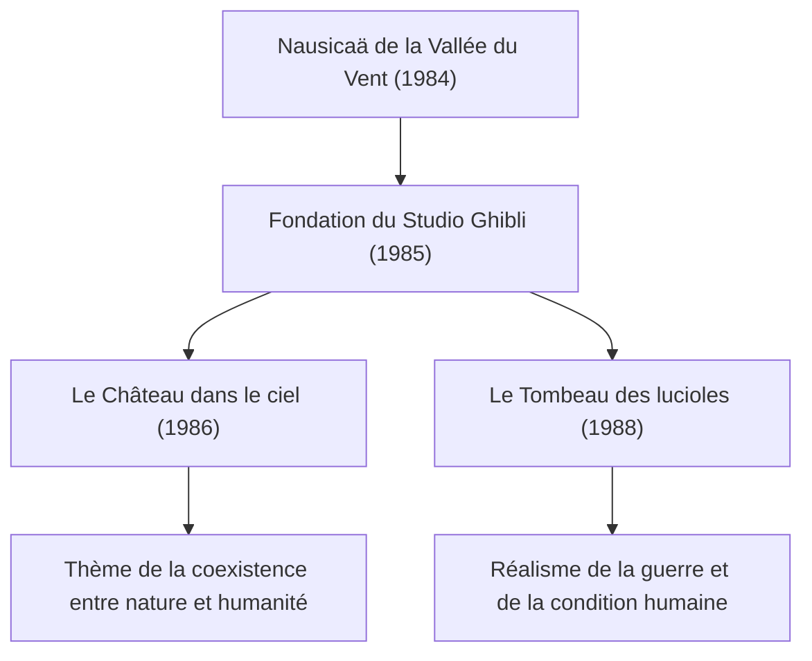

# La trajectoire des films Ghibli : messages de vie et de nature à travers l'animation

Bien au-delà du cadre d'un simple studio d'animation, le Studio Ghibli occupe une place tout à fait singulière dans la culture visuelle, non seulement au Japon, mais dans le monde entier. Depuis sa fondation en 1985, il a donné naissance à une multitude de chefs-d'œuvre historiques, portés par deux créateurs de génie : Hayao Miyazaki et Isao Takahata. Cet article propose une analyse approfondie de l'histoire du Studio Ghibli, de ses évolutions techniques et des thèmes qui traversent l'ensemble de son œuvre, en croisant perspectives physiques, historiques et technologiques.

## La fondation du Studio Ghibli et les premiers défis

L'histoire du Studio Ghibli commence avec le succès de *Nausicaä de la Vallée du Vent*, sorti en 1984. Bien que ce long-métrage ait techniquement vu le jour avant la création officielle de Ghibli, le travail d'équipe et les fonds générés lors de sa production ont constitué le socle fondateur du futur studio.

Dès sa création, avec *Le Château dans le ciel*, le studio a poussé la technique traditionnelle de l'animation sur celluloïd (cels) à son paroxysme. L'éclat de la pierre de lévitation et la texture des nuages ont notamment tiré pleinement parti des technologies de composition optique de l'époque. Cette capacité à reproduire des phénomènes physiques tels que la diffusion et la réfraction de la lumière à travers des celluloïds peints à la main et le travail de filtres lors de la prise de vue a considérablement élevé les standards internationaux de l'époque.

## Croissance économique et fantastique du quotidien : de la fin des années 80 aux années 90

Tandis que le Japon était en pleine effervescence économique sous la bulle spéculative, Ghibli s'est lancé dans un pari sans précédent : la sortie simultanée en salles de *Mon voisin Totoro* et du *Tombeau des lucioles*. D'un côté, une nature bucolique et des esprits bienveillants dans le Japon des années 1950 (l'ère Shōwa 30) ; de l'autre, la tragique réalité de la fin de la Seconde Guerre mondiale. Ces deux dynamiques opposées incarnent parfaitement la riche dualité du Studio Ghibli.

Sur le plan technique, c'est à cette période que l'utilisation de la caméra multiplane s'est perfectionnée pour restituer la profondeur de champ. En superposant plusieurs plans de décors et en les déplaçant à des vitesses différentes, ce procédé recrée un effet de relief physique (l'effet de parallaxe) sur un écran en deux dimensions. Cette ingéniosité visuelle préfigurait déjà la gestion spatiale en images de synthèse (3D/CGI) de l'ère numérique.

## Écologie et imaginaire mythologique : le choc de « Princesse Mononoké »

Sorti en 1997, *Princesse Mononoké* a marqué un tournant décisif pour le Studio Ghibli, tant sur le plan technique que thématique. En dépeignant l'affrontement farouche entre les dieux de la forêt et l'humanité, le film délivre un message d'une grande complexité, refusant tout manichéisme sommaire.

Il convient ici de souligner la remarquable représentation de la dynamique des fluides dans l'animation. L'agitation grouillante de la malédiction qui enveloppe le dieu Tatari, les éclaboussures de sang et les cours d'eau ont partiellement intégré des technologies numériques (CGI). Pour autant, le cœur de ce travail repose fondamentalement sur l'observation et la reconstruction des lois de la physique par la main des animateurs. Saisir intuitivement la mécanique newtonienne — qu'il s'agisse du mouvement de matières visqueuses ou de la sensation de masse d'un objet s'effondrant sous la gravité — pour l'exagérer et la styliser dans le dessin a profondément impressionné les créateurs du monde entier.

## Transition vers le numérique et reconnaissance internationale : « Le Voyage de Chihiro »

En 2001, *Le Voyage de Chihiro* est devenu un succès planétaire sans précédent, pulvérisant tous les records du box-office japonais et remportant l'Oscar du meilleur film d'animation, consacrant ainsi la reconnaissance internationale du studio.

Avec ce film, Ghibli a opéré une transition complète des celluloïds traditionnels vers la peinture numérique. Cependant, loin d'employer le numérique pour de simples gains de « productivité », le studio s'en est servi pour « élargir sa puissance expressive ». Dégradés de couleurs infinis, gestion complexe des sources lumineuses, rendu cristallin de l'eau : en adoptant des simulations physiques propres au numérique sans jamais dénaturer la chaleur du trait dessiné à la main, Ghibli a mis au point un flux de travail unique en son genre.

## L'innovation d'Isao Takahata et le sommet du réalisme : « Le Conte de la princesse Kaguya »

Tandis qu'Hayao Miyazaki dépeint le monde à travers le prisme du fantastique, Isao Takahata n'a cessé de mener des expérimentations avant-gardistes, remettant continuellement en question les conventions mêmes de l'animation. *Le Conte de la princesse Kaguya* en constitue l'aboutissement magistral.

Dans ce long-métrage, le choix délibéré de lignes discontinues et de teintes aquarellées diaphanes participe d'une démarche psychologique sophistiquée : inviter l'esprit du spectateur à « compléter » l'image par lui-même. Lors de la célèbre scène de fuite où explose l'énergie cinétique, les arrière-plans esquissés d'un trait vif et rugueux traduisent visuellement une sensation de vitesse et une distorsion de l'espace d'une intensité quasi relativiste. Cette technique expressive, à l'opposé d'un réalisme photographique froid, exploite avec brio les mécanismes de la perception et de la cognition humaines.

## Transmission vers l'avenir et potentiel infini de l'animation

L'œuvre du Studio Ghibli ne se résume pas à un simple divertissement : elle interroge inlassablement les défis environnementaux auxquels l'humanité fait face, nos rapports avec la technologie, ainsi que le sens fondamental du verbe « vivre ». Le passage du celluloïd au numérique, la quête inaltérable de textures organiques et cette constante sincérité face aux tourments de leur époque : tout ce parcours témoigne du potentiel infini de l'animation comme médium d'expression.

Dans l'univers façonné par Ghibli, chaque souffle de vent et chaque scintillement sur l'eau portent en eux la respiration de la vie et la beauté des lois de la physique. Il nous appartient, aujourd'hui comme demain, de décrypter ces messages et de continuer à les transmettre aux générations futures.
