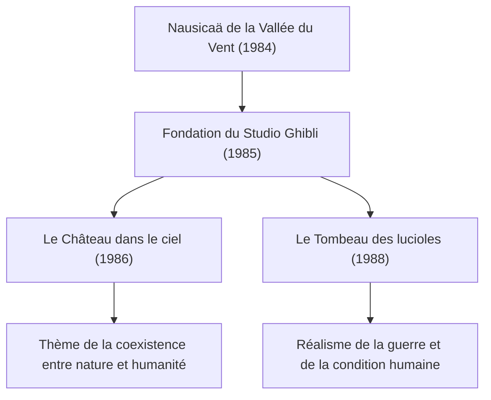
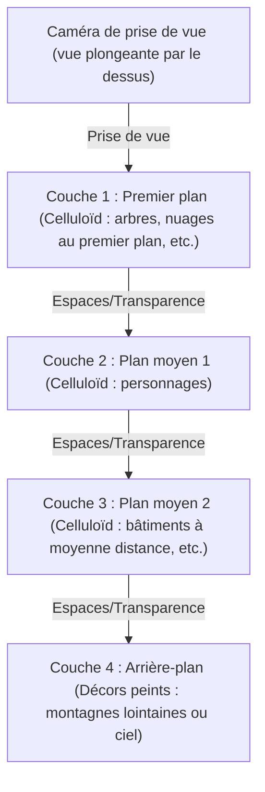
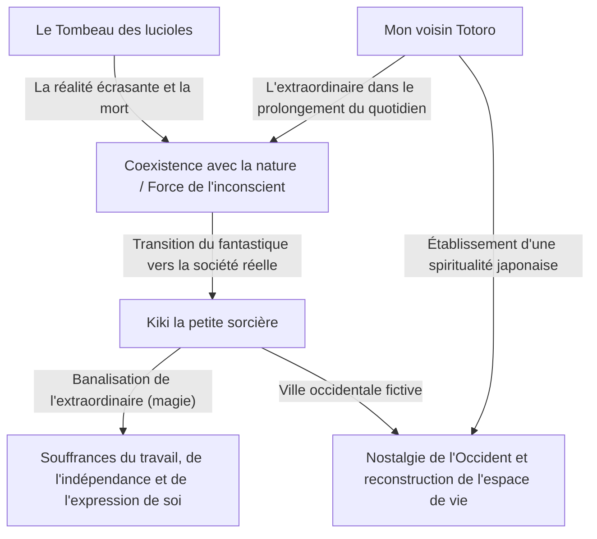
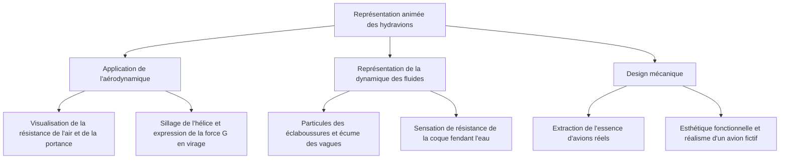
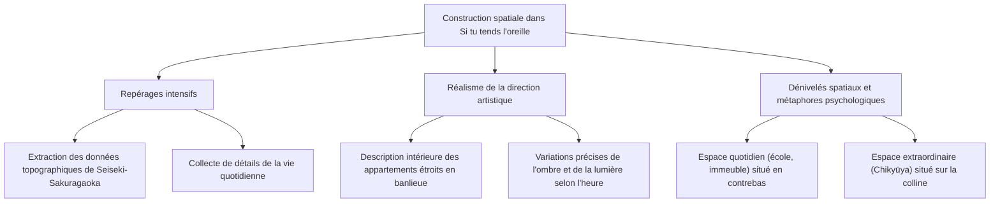
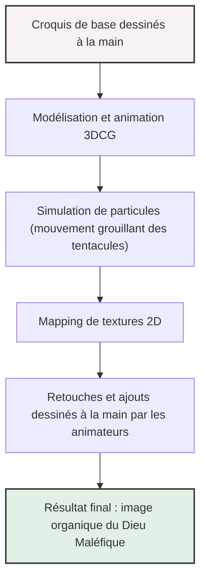
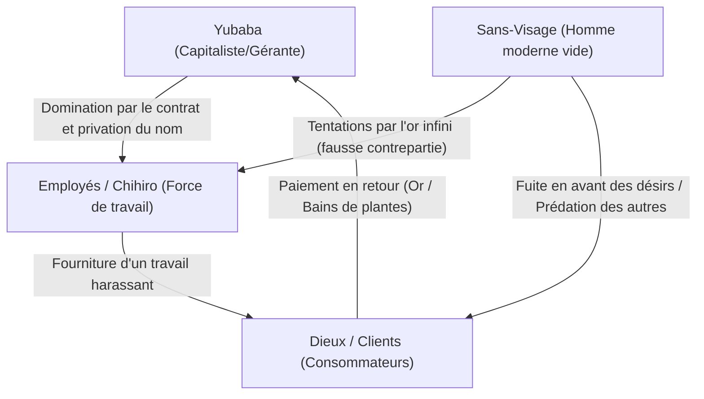
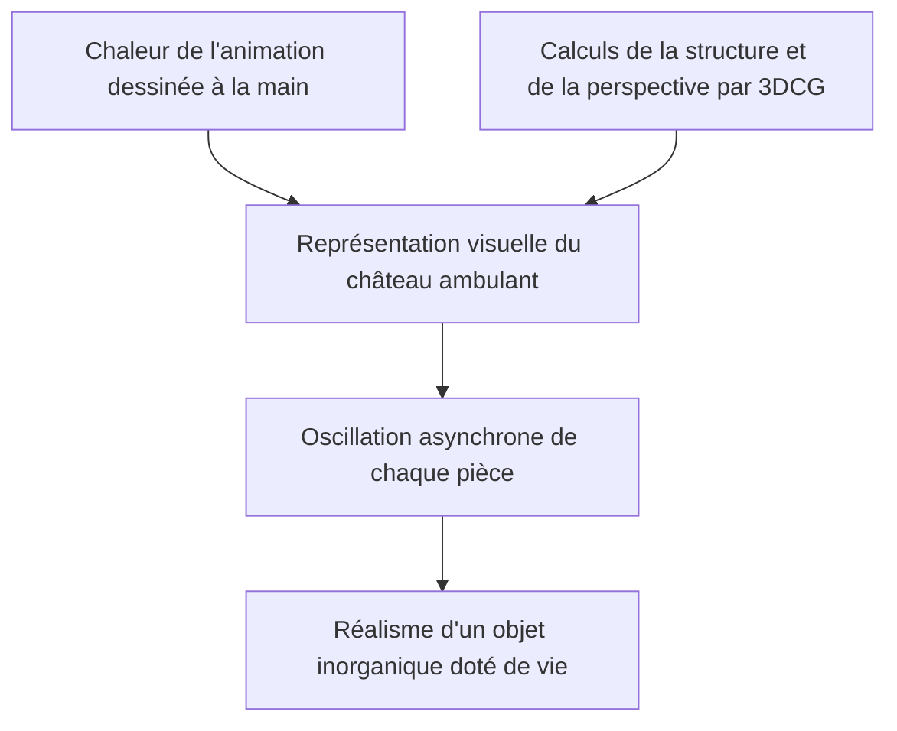
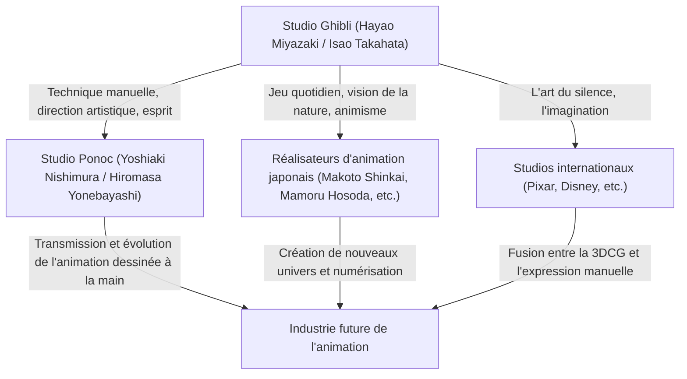

# La trajectoire des films Ghibli : messages de vie et de nature à travers l'animation

Bien au-delà du cadre d'un simple studio d'animation, le Studio Ghibli occupe une place tout à fait singulière dans la culture visuelle, non seulement au Japon, mais dans le monde entier. Depuis sa fondation en 1985, il a donné naissance à une multitude de chefs-d'œuvre historiques, portés par deux créateurs de génie : Hayao Miyazaki et Isao Takahata. Cet article propose une analyse approfondie de l'histoire du Studio Ghibli, de ses évolutions techniques et des thèmes qui traversent l'ensemble de son œuvre, en croisant perspectives physiques, historiques et technologiques.

## La fondation du Studio Ghibli et les premiers défis

L'histoire du Studio Ghibli commence avec le succès de *Nausicaä de la Vallée du Vent*, sorti en 1984. Bien que ce long-métrage ait techniquement vu le jour avant la création officielle de Ghibli, le travail d'équipe et les fonds générés lors de sa production ont constitué le socle fondateur du futur studio.

Dès sa création, avec *Le Château dans le ciel*, le studio a poussé la technique traditionnelle de l'animation sur celluloïd (cels) à son paroxysme. L'éclat de la pierre de lévitation et la texture des nuages ont notamment tiré pleinement parti des technologies de composition optique de l'époque. Cette capacité à reproduire des phénomènes physiques tels que la diffusion et la réfraction de la lumière à travers des celluloïds peints à la main et le travail de filtres lors de la prise de vue a considérablement élevé les standards internationaux de l'époque.

## Croissance économique et fantastique du quotidien : de la fin des années 80 aux années 90

Tandis que le Japon était en pleine effervescence économique sous la bulle spéculative, Ghibli s'est lancé dans un pari sans précédent : la sortie simultanée en salles de *Mon voisin Totoro* et du *Tombeau des lucioles*. D'un côté, une nature bucolique et des esprits bienveillants dans le Japon des années 1950 (l'ère Shōwa 30) ; de l'autre, la tragique réalité de la fin de la Seconde Guerre mondiale. Ces deux dynamiques opposées incarnent parfaitement la riche dualité du Studio Ghibli.

Sur le plan technique, c'est à cette période que l'utilisation de la caméra multiplane s'est perfectionnée pour restituer la profondeur de champ. En superposant plusieurs plans de décors et en les déplaçant à des vitesses différentes, ce procédé recrée un effet de relief physique (l'effet de parallaxe) sur un écran en deux dimensions. Cette ingéniosité visuelle préfigurait déjà la gestion spatiale en images de synthèse (3D/CGI) de l'ère numérique.

## Écologie et imaginaire mythologique : le choc de « Princesse Mononoké »

Sorti en 1997, *Princesse Mononoké* a marqué un tournant décisif pour le Studio Ghibli, tant sur le plan technique que thématique. En dépeignant l'affrontement farouche entre les dieux de la forêt et l'humanité, le film délivre un message d'une grande complexité, refusant tout manichéisme sommaire.

Il convient ici de souligner la remarquable représentation de la dynamique des fluides dans l'animation. L'agitation grouillante de la malédiction qui enveloppe le dieu Tatari, les éclaboussures de sang et les cours d'eau ont partiellement intégré des technologies numériques (CGI). Pour autant, le cœur de ce travail repose fondamentalement sur l'observation et la reconstruction des lois de la physique par la main des animateurs. Saisir intuitivement la mécanique newtonienne — qu'il s'agisse du mouvement de matières visqueuses ou de la sensation de masse d'un objet s'effondrant sous la gravité — pour l'exagérer et la styliser dans le dessin a profondément impressionné les créateurs du monde entier.

## Transition vers le numérique et reconnaissance internationale : « Le Voyage de Chihiro »

En 2001, *Le Voyage de Chihiro* est devenu un succès planétaire sans précédent, pulvérisant tous les records du box-office japonais et remportant l'Oscar du meilleur film d'animation, consacrant ainsi la reconnaissance internationale du studio.

Avec ce film, Ghibli a opéré une transition complète des celluloïds traditionnels vers la peinture numérique. Cependant, loin d'employer le numérique pour de simples gains de « productivité », le studio s'en est servi pour « élargir sa puissance expressive ». Dégradés de couleurs infinis, gestion complexe des sources lumineuses, rendu cristallin de l'eau : en adoptant des simulations physiques propres au numérique sans jamais dénaturer la chaleur du trait dessiné à la main, Ghibli a mis au point un flux de travail unique en son genre.

## L'innovation d'Isao Takahata et le sommet du réalisme : « Le Conte de la princesse Kaguya »

Tandis qu'Hayao Miyazaki dépeint le monde à travers le prisme du fantastique, Isao Takahata n'a cessé de mener des expérimentations avant-gardistes, remettant continuellement en question les conventions mêmes de l'animation. *Le Conte de la princesse Kaguya* en constitue l'aboutissement magistral.

Dans ce long-métrage, le choix délibéré de lignes discontinues et de teintes aquarellées diaphanes participe d'une démarche psychologique sophistiquée : inviter l'esprit du spectateur à « compléter » l'image par lui-même. Lors de la célèbre scène de fuite où explose l'énergie cinétique, les arrière-plans esquissés d'un trait vif et rugueux traduisent visuellement une sensation de vitesse et une distorsion de l'espace d'une intensité quasi relativiste. Cette technique expressive, à l'opposé d'un réalisme photographique froid, exploite avec brio les mécanismes de la perception et de la cognition humaines.

## Transmission vers l'avenir et potentiel infini de l'animation

L'œuvre du Studio Ghibli ne se résume pas à un simple divertissement : elle interroge inlassablement les défis environnementaux auxquels l'humanité fait face, nos rapports avec la technologie, ainsi que le sens fondamental du verbe « vivre ». Le passage du celluloïd au numérique, la quête inaltérable de textures organiques et cette constante sincérité face aux tourments de leur époque : tout ce parcours témoigne du potentiel infini de l'animation comme médium d'expression.

Dans l'univers façonné par Ghibli, chaque souffle de vent et chaque scintillement sur l'eau portent en eux la respiration de la vie et la beauté des lois de la physique. Il nous appartient, aujourd'hui comme demain, de décrypter ces messages et de continuer à les transmettre aux générations futures.
---
title: "Guide Complet des Films du Studio Ghibli : Techniques d'Animation et Messages de la Nature"
description: "De Nausicaä de la Vallée du Vent au Garçon et le Héron. Une analyse complète en 8 chapitres de l'histoire, des techniques d'animation et de l'évolution des thèmes du Studio Ghibli, fierté japonaise dans le monde."
date: "2026-10-02T22:47:17+09:00"
slug: "studio-ghibli-movies-complete-guide"
categories: ["culture", "entertainment"]
tags: ["culture", "movies", "anime", "japan", "ghibli"]
image: "eyecatch.jpg"
---

# Chapitre 1 : Fondation et premiers chefs-d'œuvre (Nausicaä de la Vallée du Vent, Le Château dans le ciel)

## 1.1 Une singularité dans l'histoire de l'animation, la naissance du Studio Ghibli

Si l'on observe l'industrie de l'animation japonaise, ou plutôt l'histoire de l'animation mondiale dans son ensemble, il est impossible d'ignorer un « événement » majeur survenu au milieu des années 1980. Il s'agit de la création du Studio Ghibli. L'histoire de Ghibli n'est pas simplement celle d'une entreprise ou d'un studio de production, c'est l'histoire même de l'apogée de la technique analogique de l'animation sur celluloïd, et de la fusion miraculeuse entre la « culture populaire » et l'« art » que permet le médium de l'animation. Dans ce chapitre, tout en retraçant les circonstances de la fondation du Studio Ghibli, nous nous pencherons sur ses véritables origines avec *Nausicaä de la Vallée du Vent* (1984) et la première œuvre réalisée sous le nom du Studio Ghibli, *Le Château dans le ciel* (1986). Nous verrons comment Isao Takahata et Hayao Miyazaki, deux génies de l'animation, ont repoussé les limites de cette forme d'expression.

À la veille de la fondation du Studio Ghibli, l'animation télévisée japonaise avait connu une évolution unique grâce à la technique de « l'animation limitée ». Contrairement à l'animation complète de type Disney qui utilise pleinement 24 images par seconde, cette technique réduit le nombre de dessins tout en exploitant des images fixes et des mouvements de caméra (panoramiques, inclinaisons, etc.) pour créer du dynamisme. Née d'une nécessité économique, cette approche s'est peu à peu imposée comme une grammaire visuelle à part entière. Cependant, ce que visaient Isao Takahata et Hayao Miyazaki ne pouvait s'inscrire dans ce cadre. Ils aspiraient ardemment à concrétiser, dans le format suprême du long métrage d'animation pour le cinéma, tout ce qu'ils avaient cultivé depuis leurs débuts chez Toei Doga (aujourd'hui Toei Animation) : la construction minutieuse de l'espace, le réalisme des gestes quotidiens et, plus que tout, la « joie fondamentale du mouvement ».

## 1.2 Le style de création d'Isao Takahata et Hayao Miyazaki : l'intersection miraculeuse de l'objectivité et de la subjectivité

Pour comprendre en profondeur les œuvres du Studio Ghibli, il est nécessaire de saisir la nature des deux talents qui en constituent le cœur, Isao Takahata et Hayao Miyazaki, ainsi que leurs interactions. Tous deux sont issus de Toei Doga et étaient liés par des liens profonds forgés notamment à travers des activités syndicales, mais on peut dire sans exagérer que leurs orientations en tant que réalisateurs d'animation étaient aux antipodes.

Le style de Hayao Miyazaki se caractérise par une perception spatiale subjective écrasante et un « fétichisme du mouvement ». Les images dessinées par Miyazaki, tout en transcendant parfois les lois de la physique, possèdent une force de persuasion intense qui fait directement appel aux sensations physiques du spectateur. Le sentiment de flottement dans les scènes de vol, l'impression de lourdeur, évoquant un grondement sourd, lorsqu'un objet d'une masse immense se déplace, les subtils courants d'air ou les reflets sur l'eau : ce sentiment que le monde entier grouille comme un organisme vivant est le résultat de la fixation sur celluloïd de la vision mentale de Miyazaki par l'intermédiaire du corps des animateurs. Dans le *layout* (la composition de l'image), il utilise fréquemment des distorsions dignes d'un objectif grand angle ou des perspectives singulières, contrôlant habilement la profondeur et les lignes de force de l'image.

En revanche, le style d'Isao Takahata repose sur une « objectivité » et une « construction logique » rigoureuses. Parce qu'il était un réalisateur qui ne dessinait pas lui-même, Takahata pouvait observer l'image animée avec un regard plus distant, presque méta. Sa mise en scène accorde une importance primordiale à l'approfondissement jusqu'à l'extrême de la psychologie des personnages, de la structure sociale et du réalisme des moindres gestes du quotidien. De l'agencement de l'espace à l'éclairage en passant par la motivation des personnages, tout repose sur des calculs méticuleux. Tout en invitant le spectateur à l'empathie, il introduit souvent un effet de distanciation brechtien, amenant le public à observer le monde avec un certain recul.

C'est cette opposition et cette complémentarité entre le « Miyazaki subjectif et intuitif » et le « Takahata objectif et logique », ces deux talents qui se tempéraient mutuellement et se respectaient profondément tout en formant la colonne vertébrale d'un même studio, qui ont constitué la force motrice principale à l'origine de la prolifique filmographie de Ghibli. Dans les premières œuvres du studio, Takahata a joué le rôle crucial de producteur, maîtrisant les emballements de Miyazaki tout en renforçant la structure narrative de l'œuvre.

## 1.3 La singularité technologique de l'animation sur celluloïd et la caméra multiplane

La force extraordinaire du Studio Ghibli ne réside pas seulement dans la profondeur de ses thèmes, mais aussi dans l'immense maîtrise technique qui les soutient. En particulier, la période allant de *Nausicaä* à *Laputa* fut celle où la technique analogique de l'animation sur celluloïd approchait de sa forme la plus aboutie, atteignant presque une sorte de « singularité technologique ».

La richesse d'informations et le sentiment de présence écrasant qui se dégagent des plans des films Ghibli sont le fruit de décors peints avec une grande minutie et de dizaines de couches de celluloïd superposées. À cet égard, il convient de souligner l'apogée de la représentation spatiale obtenue grâce à l'utilisation de la « caméra multiplane ».

Une caméra multiplane est un dispositif où plusieurs plaques de verre (ou étages) sont disposées sous l'objectif, chacune accueillant des celluloïds ou des éléments de décor pour la prise de vue. Ce système permet de faire varier la vitesse de déplacement de chaque couche lorsque la caméra effectue un mouvement (panoramique, inclinaison ou travelling avant/arrière), créant ainsi une illusion de profondeur tridimensionnelle (effet de parallaxe). Bien que cette technique ait été employée de longue date par des studios comme Disney, l'utilisation qu'en fait Ghibli s'est distinguée par sa précision et sa complexité sans commune mesure.

Les incontournables « scènes de vol » chères à Miyazaki ont bénéficié au maximum de cette technologie. Par exemple, lorsque l'on observe une mer de nuages s'étendant en contrebas, un aéronef naviguant à travers ceux-ci, et la terre ferme visible à l'arrière-plan, le déplacement de ces différents plans à des vitesses distinctes procure au spectateur une sensation intense de repère spatial et d'immersion, lui donnant véritablement l'impression de voler. De plus, l'utilisation de la technique de « l'éclairage par transparence » (qui consiste à éclairer les celluloïds par en dessous), la création de dégradés subtils à l'aérographe, ainsi que la folie consistant à animer à la main, image par image, la végétation bercée par le vent : tous ces efforts colossaux contribuent à donner l'illusion qu'une véritable brise souffle et que l'air circule au sein de l'image. À une époque où les technologies numériques (CGI) n'existaient pas, ils ont su recréer un espace virtuel plus vrai que nature, en s'appuyant sur la matérialité de la pellicule, des couleurs et sur la magie de la lumière.

## 1.4 *Nausicaä de la Vallée du Vent* (1984) : un chef-d'œuvre fondateur et les racines de l'écologie

Sorti en 1984, *Nausicaä de la Vallée du Vent* a officiellement été produit par le studio Topcraft avant la fondation de Ghibli. Toutefois, réalisé par Hayao Miyazaki et produit par Isao Takahata, ce film s'est imposé comme l'œuvre « numéro 0 » ou « numéro 1 » fondatrice qui a défini l'orientation future du Studio Ghibli.

Le film est basé sur le manga éponyme que Miyazaki publiait lui-même dans le magazine mensuel *Animage*, mais le scénario du film réorganise la première partie de l'histoire pour en faire un récit indépendant et complet. L'apport majeur de *Nausicaä* à l'histoire de l'animation réside dans sa capacité à traiter des thèmes de science-fiction extrêmement profonds tels que les « problèmes environnementaux (l'écologie) », la « dignité de la vie » et la « folie de l'humanité », tout en s'inscrivant dans le cadre du divertissement grand public et en offrant une esthétique visuelle époustouflante.

Mille ans se sont écoulés depuis que la civilisation industrielle a été anéantie lors d'une guerre finale connue sous le nom de « Sept Jours de Feu ». Le monde est désormais envahi par la « mer de la Décomposition » (le *Fukai*), une forêt fongique libérant des miasmes toxiques et dominée par des insectes géants. Cet univers désespéré reflète l'angoisse viscérale de Miyazaki face à la menace d'une guerre nucléaire pendant la guerre froide, ainsi que ses vives inquiétudes concernant la destruction croissante de l'environnement. Toutefois, Miyazaki ne cède pas au simplisme d'une opposition binaire entre « préservation de la nature » et « méchanceté humaine ». La grande révélation du récit, à savoir que la mer de la Décomposition est en réalité un système destiné à purifier une planète polluée, met en évidence la redoutable capacité de résilience de la nature et souligne par contraste l'insignifiance de l'être humain.

D'un point de vue technique, on ne peut évoquer *Nausicaä* sans souligner l'animation des insectes colossaux, et en premier lieu les Ômus. L'animation de ces créatures étranges pourvues d'une multitude de segments et d'yeux, rampant avec un mouvement ondulatoire, confère à ces créatures une impression de poids écrasant, une dimension effrayante, et même une forme de divinité. Ce résultat est le fruit de méthodes d'animation atypiques, impliquant l'usage de caoutchouc (ou de procédés consistant à décaler et photographier des parties distinctes de dessins) et d'un calcul minutieux du *timing*. De plus, lors des séquences où Nausicaä vole sur son *Möwe* (son engin volant), le frémissement de ses vêtements sous la pression du vent et les trajectoires fluides qui semblent visualiser la tension entre gravité et portance, ont démontré au monde entier la « catharsis du vol », l'une des marques de fabrique absolues de l'animation de Miyazaki.

La conception même de l'héroïne, Nausicaä, était tout aussi novatrice. Loin d'être une simple « jeune fille en détresse qu'il faut protéger », elle est une guerrière capable de piloter son Möwe, de manier des armes à feu et des épées, tout en incarnant une figure maternelle éprouvant une compassion infinie pour toutes les formes de vie. Ce personnage complexe alliant force et douceur, colère et tristesse, est devenu un sommet et un modèle fondateur pour les figures héroïques féminines, non seulement dans les œuvres ultérieures de Ghibli, mais aussi dans l'ensemble de la fiction contemporaine.

## 1.5 La création du Studio Ghibli et *Le Château dans le ciel* (1986) : l'aventure épique absolue

Fort du succès de *Nausicaä*, les bénéfices engrangés ont permis de fonder officiellement le « Studio Ghibli » en 1985. L'objectif de cette création était unique : « continuer à produire des longs métrages d'animation pour le cinéma de très haute qualité ». Se démarquant de la production de masse souvent bâclée de l'animation télévisée, Ghibli est né comme un pôle de création indépendant dédié à la recherche d'une qualité sans aucun compromis.

Puis, en 1986, sort le premier long métrage historique produit sous le nom du Studio Ghibli : *Le Château dans le ciel*. S'appuyant sur des idées que Hayao Miyazaki concevait depuis l'école primaire, ce film s'inspire de Laputa, l'île volante des *Voyages de Gulliver* de Jonathan Swift. L'histoire rassemble tous les ingrédients classiques du grand récit d'aventure (*boy meets girl*) : la rencontre d'un garçon et d'une fille, une mystérieuse pierre volante, des pirates du ciel et une armée animée par de sombres ambitions. C'est un chef-d'œuvre que l'on pourrait qualifier de sommet du genre épique.

La splendeur de *Laputa* réside dans son élan narratif haletant et dans l'obsession inouïe des détails qui imprègne chaque recoin de l'image. Dès la séquence d'ouverture montrant l'attaque du dirigeable par la bande à Dola, jusqu'à la course-poursuite frénétique de Pazu et Sheeta dans le ravin de Slag, l'écran est perpétuellement en mouvement (« dynamique »). Le design mécanique de Slag, le mouvement des pistons des machines à vapeur, la rotation des engrenages, et la course effrénée des wagonnets de mine : ces machines et ces véhicules ne sont pas de simples éléments de décor, ils sont dessinés avec une vitalité débordante, comme s'ils étaient eux-mêmes dotés de vie. L'« affection pour les machines » de Miyazaki, alliée à l'énergie créatrice déployée pour immortaliser jusqu'à « la chaleur et l'odeur » que celles-ci dégagent, confèrent une réalité saisissante à cet univers fictif.

Sur le plan thématique, *Laputa* met en lumière « la fracture entre une technologie de pointe et l'humanité », ainsi que « le lien viscéral avec la terre ». La technologie scientifique incommensurable de l'Empire de Laputa, qui dominait jadis le monde, a fini par causer sa propre perte. Le dénouement du film, lorsque, depuis les profondeurs du Laputa en ruines, un immense « grand arbre » abritant le cristal géant s'élève vers l'espace, est éminemment symbolique. La destruction des constructions artificielles, symboles de la technologie, et la survie de ce seul grand arbre, symbole de la vie, se résument dans cette réplique prononcée par Sheeta : « Enracinons-nous dans le sol, vivons avec le vent. Passons l'hiver avec les graines, chantons le printemps avec les oiseaux. Peu importe le nombre d'armes terrifiantes que vous possédez, peu importe le nombre de pauvres robots que vous commandez, on ne peut pas vivre éloigné de la terre. » Il s'agit là de la critique acerbe de la civilisation moderne formulée par Miyazaki dans la continuité de *Nausicaä*, doublée d'une prière universelle pour le retour à la nature.

En outre, la contribution du travail sur les décors, dirigé par les directeurs artistiques Toshirō Nozaki et Nizō Yamamoto, est inestimable. La beauté silencieuse de la scène de la découverte de Laputa, lorsque les nuages se dissipent pour révéler un gigantesque jardin envahi par la mousse et un robot soldat, prouve à quel point les arrière-plans animés peuvent définir le prestige d'une œuvre. La fusion parfaite entre la mise en scène mouvementée de Miyazaki et la quiétude des décors y était accomplie.

## 1.6 Conclusion : Le début d'une légende

*Nausicaä de la Vallée du Vent* et *Le Château dans le ciel*. Avec ces deux chefs-d'œuvre fondateurs, Hayao Miyazaki, Isao Takahata et les équipes du Studio Ghibli ont poussé jusqu'à l'extrême le potentiel de l'animation en tant que moyen d'expression. Ils sont parvenus à donner du poids et de la texture à des mécanismes imaginaires, à insuffler du réalisme à des écosystèmes fictifs, et à intégrer de profondes critiques sociales et des réflexions philosophiques au cœur de divertissements captivants pour tous les âges. Ils ont accompli cet incroyable exploit grâce à une quantité astronomique de celluloïds et à un travail manuel qui relevait d'une frénésie presque artisanale.

Ces deux œuvres ont hissé les standards techniques et artistiques à des niveaux inégalés, dressant le Studio Ghibli comme un « immense mur » incontournable dans le paysage de l'animation japonaise. En même temps, elles marquaient le premier chapitre d'une longue et glorieuse légende : l'histoire de ce petit studio qui allait déclencher un phénomène culturel mondial et réécrire l'histoire même de l'animation. La voie menant à *Mon voisin Totoro*, *Le Tombeau des lucioles* et plus tard à *Princesse Mononoké* prenait sa source ici, portée par le vent de *Nausicaä* et sous le ciel de *Laputa*.

# Chapitre 2 : À la croisée du quotidien et de l'extraordinaire — Les mondes de *Mon voisin Totoro*, *Le Tombeau des lucioles* et *Kiki la petite sorcière*

Si l'on explore l'histoire du Studio Ghibli, la fin des années 1980 marque un tournant décisif. Se détournant des grandes épopées de « cape et d'épée » et des aventures aériennes dépeintes dans *Le Château dans le ciel* (1986), Ghibli opère un virage radical vers le « quotidien », explorant les paysages originels du Japon et la vie ordinaire des Occidentaux. Dans ce chapitre, nous analyserons en profondeur trois œuvres qui ont révolutionné l'histoire de l'animation tant sur le plan technique que thématique : *Mon voisin Totoro* et *Le Tombeau des lucioles*, projetés de façon quasi miraculeuse lors d'une même séance en 1988, ainsi que le grand succès de 1989, *Kiki la petite sorcière*.

## 1. La folie et le miracle d'une double projection : Hayao Miyazaki et Isao Takahata, deux visions de l'ère Showa

Au printemps 1988, le Japon assiste à un modèle d'exploitation en salles impensable de nos jours : la sortie conjointe de *Mon voisin Totoro* et du *Tombeau des lucioles*. Il ne s'agissait pas d'une simple offre commerciale, mais bien du résultat de la confrontation entre deux immenses talents, Miyazaki et Takahata, cristallisant une forme de « folie et de miracle » au sein de la structure créative de Ghibli.

### 1-1. La vie et la mort dos à dos
*Mon voisin Totoro* est une célébration de la vie qui raconte les rencontres d'enfants avec des esprits de la nature dans le monde rural japonais des années Showa 30 (les années 1950). À l'inverse, *Le Tombeau des lucioles* dresse le portrait effroyable et hyperréaliste d'un frère et d'une sœur emportés par la guerre à Kobe, autour de 1945 (Showa 20). Bien que seule une décennie sépare ces deux récits, ils incarnent des thématiques diamétralement opposées : « la vie et la mort », « la fantaisie idéalisée et la réalité tragique ».

À cette époque, le Studio Ghibli adopte une organisation de production téméraire, faisant travailler simultanément ces deux génies. Cela provoque une lutte acharnée pour recruter des animateurs, mettant les plannings en péril. Néanmoins, cet environnement sous pression a poussé la qualité des deux œuvres à son paroxysme. Face au réalisme rigoureux de Takahata, Miyazaki a conçu le monde de *Totoro* avec une vitalité subconsciente encore plus puissante ; et pour rivaliser avec la fantaisie de Miyazaki, Takahata a élevé l'animation japonaise à un niveau quasiment documentaire.

### 1-2. Peindre l'ère Showa : la naissance du « documentaire animé »
La réalisation d'Isao Takahata dans *Le Tombeau des lucioles* brise les conventions classiques de l'animation. La trajectoire des bombes incendiaires lâchées par les B-29, les flammes vacillantes rongeant les maisons, et, surtout, l'évolution physique d'un Seita et d'une Setsuko rongés par la faim. Pour représenter cela, la conceptrice des couleurs, Michiyo Yasuda, et son équipe ont recherché sans relâche un « brun teinté de boue, de sang et de suie » que les palettes classiques de l'animation ne permettaient pas de restituer.
En revanche, dans *Mon voisin Totoro*, Hayao Miyazaki a reconstruit le « beau Japon qui aurait pu exister » à partir de ses propres souvenirs. Il ne s'agit pas de pur réalisme, mais d'une tentative de fixer sur celluloïd l'« éclat » du monde tel qu'il est perçu par un enfant. Ce contraste dans la représentation de deux visages de l'ère Showa démontre avec force l'ampleur des capacités expressives du médium qu'est l'animation, élevant ces œuvres au rang de monuments dans l'histoire du cinéma japonais.

## 2. La révolution des décors : « l'air et l'humidité » créés par Kazuo Oga et Nizō Yamamoto

La force de persuasion écrasante des œuvres de Ghibli repose en grande partie non seulement sur le jeu des personnages, mais aussi sur la puissance des décors qui s'étendent derrière eux. À cette époque, le département artistique du Studio Ghibli a atteint son apogée.

### 2-1. L'atmosphère humide de « la forêt de Totoro » par Kazuo Oga
Il n'est pas exagéré de dire que le travail de Kazuo Oga, propulsé au poste de directeur artistique sur *Mon voisin Totoro*, a changé l'histoire des décors d'animation au Japon. La nature qu'il dessine exploite au maximum les propriétés de la peinture *poster color* (gouache). Bien qu'il utilise des peintures opaques plutôt que de l'aquarelle transparente, Oga parvient, grâce à un dosage délicat de l'eau et à sa touche de pinceau, à retranscrire « l'humidité » propre au climat japonais, « l'odeur suffocante de l'herbe » et même « la température de la lumière filtrant à travers les feuillages ».

En particulier, le décor de la scène où Satsuki et Mei rencontrent Totoro sous la pluie à l'arrêt de bus est saisissant. La texture de l'asphalte mouillé, la profondeur de la forêt sacrée plongée dans l'obscurité, l'épaisseur de l'air créée par la lumière du lampadaire. Les décors d'Oga ne sont pas de simples « reproductions de paysages », ils sont une magie qui rend visibles des « informations invisibles » telles que le vent qui souffle, la température ou l'humidité.

### 2-2. Nostalgie de l'Occident et réalisme architectural
D'autre part, la ville de Koriko, cadre de *Kiki la petite sorcière*, est une ville fictive créée en fusionnant des éléments de diverses villes européennes telles que Stockholm en Suède, Visby sur l'île de Gotland, ainsi que Lisbonne ou Paris. L'orientation de la direction artistique y était aux antipodes de celle de *Totoro* qui dépeignait des paysages japonais.

Les bâtiments en pierre d'Europe, les successions de toits en tuiles, et les rues en pente descendant vers la mer. Pour dessiner tout cela de manière convaincante, l'équipe artistique de Ghibli a effectué des repérages minutieux et étudié les structures architecturales. Même pour la texture d'une simple pierre, ils ont calculé le degré d'érosion et l'indice de réflexion de la lumière solaire, traduisant ces données dans les couleurs les plus esthétiques pour des décors d'animation. La force de cette direction artistique réside dans sa capacité à ne pas limiter cette « nostalgie de l'Occident » à un simple fantasme, mais à la concevoir comme un espace concret où les gens vivent et travaillent au quotidien. C'est tout simplement prodigieux.

## 3. Un thème moderne dans *Kiki la petite sorcière* : « Le travail et le syndrome de la page blanche »

À sa sortie, *Kiki la petite sorcière* a suscité un engouement considérable auprès de nombreux jeunes, et plus particulièrement des femmes actives. La raison en est que sous ses airs de conte fantastique narrant « l'histoire du passage à l'âge adulte d'une petite sorcière », le film cache un drame profondément moderne et universel, traitant avec un grand réalisme des questions du « travail » et du « talent » (la panne d'inspiration).

### 3-1. L'instant où le talent devient un « travail »
L'héroïne, Kiki, met à profit son talent inné et magique de « voler dans les airs » pour lancer un service de livraison. Ce parcours se superpose parfaitement à celui des créateurs et des travailleurs indépendants d'aujourd'hui, qui intègrent la société en utilisant leurs compétences ou leurs talents comme « capital ». Au début, pour Kiki, voler est une joie et un moyen d'expression personnelle. Cependant, lorsque cela devient un « travail » rémunéré, et qu'elle se confronte aux exigences parfois déraisonnables des clients (comme dans l'épisode de la tourte au hareng), la signification de sa magie s'altère en elle.

### 3-2. La panne d'inspiration et la perte d'identité
Au milieu du récit, Kiki perd soudainement ses pouvoirs magiques : elle ne peut plus voler et ne comprend plus les paroles de son chat noir, Jiji. Ce moment incarne la crise d'identité d'une adolescente en pleine puberté, mais c'est également la métaphore parfaite de l'« épuisement du talent » (le syndrome de la page blanche) auquel tout créateur est un jour confronté.

Ici, Ursula, l'étudiante en art qui peint dans une cabane au cœur de la forêt, joue un rôle crucial. Elle dit à Kiki : « Dans ces moments-là, il ne sert à rien de s'agiter », « Je peins, je peins, je peins sans m'arrêter », « Et si ça ne marche toujours pas, j'arrête de peindre. Je vais me promener, je regarde le paysage, je fais la sieste, je ne fais rien du tout ». Cette réplique exprime la souffrance vécue par les animateurs — y compris Hayao Miyazaki lui-même — et plus largement par toute personne engagée dans une activité créative, tout en proposant le remède même à ce mal.

### 3-3. La résolution à « voler avec son sang »
En parlant de sa propre peinture, Ursula confie : « Avant, je pouvais peindre sans réfléchir à rien, mais maintenant c'est différent. Je dois peindre ma propre peinture ». Il en va de même pour la magie de Kiki. L'époque insouciante où elle volait instinctivement grâce à son seul talent inné (la magie) est révolue ; elle doit désormais « reconquérir » sa magie par sa propre volonté et ses efforts. Lors du point culminant du film, la scène où Kiki enfourche un balai-brosse et s'envole avec une expression d'effort désespéré n'a plus rien de l'élégance d'un conte de fées. C'est l'image même du professionnel qui se confronte à ses propres limites et exerce sa « technique » avec une détermination féroce, presque jusqu'à en cracher du sang.

## 4. Structure des thèmes et interrelations

À première vue, ces trois œuvres possèdent des univers indépendants, mais si l'on suit l'axe de la créativité du Studio Ghibli, on y découvre une continuité évidente et des thématiques qui se croisent.

L'« extraordinaire (fantastique) tapi dans le quotidien » présenté dans *Totoro* a acquis une dimension mythologique encore plus forte par sa mise en contraste avec le réalisme extrême du *Tombeau des lucioles*. Les techniques d'expression et d'animation qui y ont été établies sont devenues par la suite de puissantes armes dans *Kiki la petite sorcière* pour dépeindre le thème paradoxal suivant : « comment un être extraordinaire (une sorcière) parvient-il à s'intégrer au quotidien (le monde du travail) de la société moderne ».

## 5. Conclusion : Préparer le terrain pour la prochaine étape

Au cours de cette période allant de 1988 à 1989, le Studio Ghibli a parcouru en l'espace de quelques années seulement tous les extrêmes de ce que l'animation pouvait dépeindre : « la vie et la mort », « le Japon et l'Occident », « le fantastique et le réalisme », et « le talent et le travail ». Les compétences développées alors pour observer et dessiner avec minutie le jeu quotidien, ainsi que la puissance de la direction artistique capable d'insuffler une atmosphère et des émotions aux paysages, seront transmises à des œuvres ultérieures telles que *Souvenirs goutte à goutte* (1991) ou *Porco Rosso* (1992), qui aborderont des thématiques plus complexes destinées à un public plus adulte.

Les trois œuvres que sont *Mon voisin Totoro*, *Le Tombeau des lucioles* et *Kiki la petite sorcière* ne sont pas qu'une simple succession de chefs-d'œuvre. Elles constituent un monument historique consignant le moment de la mue la plus ardente et la plus douloureuse de l'animation en tant que médium expressif, passant d'un simple divertissement pour enfants à un « art total » capable d'explorer les abysses de l'esprit humain et les affres structurelles de la société.

# Chapitre 3 : La fascination pour le vol et le romantisme de l'âge adulte — L'apogée du réalisme dans *Porco Rosso* et *Si tu tends l'oreille*

Si l'on survole l'histoire du Studio Ghibli, *Porco Rosso* (1992) et *Si tu tends l'oreille* (1995), sortis au début et au milieu des années 1990, peuvent de prime abord sembler diamétralement opposés. Le premier est une œuvre fantastique située dans la mer Adriatique, racontant les combats et la mélancolie d'un pilote d'hydravion chasseur de primes transformé en cochon par une malédiction. Le second est une chronique adolescente dépeignant avec fraîcheur le premier amour et les doutes d'orientation d'un garçon et d'une fille de collège, dans le décor de la ville nouvelle de Tama, à notre époque.

Pourtant, ce qui unit ces deux œuvres, c'est l'insatiable quête du Studio Ghibli — ou plutôt de ces créateurs exceptionnels que sont Hayao Miyazaki et Yoshifumi Kondō — de pousser à l'extrême la recherche du « réalisme » par le biais de l'animation. À la base de cette démarche se trouve une fascination ardente pour le « vol » — qu'il s'agisse de voler physiquement dans le ciel ou de s'envoler spirituellement en dépassant ses propres limites. Dans ce chapitre, nous allons analyser en profondeur la place singulière que ces deux œuvres occupent dans l'histoire de l'animation, ainsi que les sommets techniques et thématiques qu'elles ont atteints, tant sous l'angle du contexte historique que de l'approche technique.

## 1. *Porco Rosso* — L'apogée de l'aérodynamique et le chant du cygne d'une époque révolue

*Porco Rosso* (titre original : Il Porco Rosso) possède une genèse singulière : initialement conçu comme un court métrage destiné à être diffusé sur les vols de Japan Airlines, il s'est transformé en un long métrage, teinté par l'ombre pesante des conflits bien réels qui déchiraient alors la Yougoslavie. C'est une œuvre éminemment personnelle, que Hayao Miyazaki a créée pour lui-même et comme « un film pour ces hommes d'âge mûr épuisés, dont les neurones se sont transformés en tofu ».

### 1.1 Hayao Miyazaki et les avions : fétichisme de la mécanique et représentation minutieuse de l'aérodynamique

L'obsession de Hayao Miyazaki pour le « vol » est célèbre, mais dans *Porco Rosso*, la façon dont sont représentés les hydravions est l'expression la plus pure de son fétichisme pour la mécanique et de sa profonde compréhension de l'aérodynamique. Les hydravions qui apparaissent dans le film — que ce soit le rutilant Savoia S.21 rouge, appareil chéri du héros Porco Rosso (une création originale mêlant des éléments d'avions réels tels que le Macchi M.33 ou le Savoia-Marchetti S.59), l'appareil de son rival Curtis, ou le convoi hétéroclite des pirates de l'air — ne sont pas de simples décors ou accessoires ; ils palpitent comme des personnages à part entière.

Il faut particulièrement souligner le contrôle subtil de l'équilibre entre la « fiction et la réalité des lois de la physique » en animation, allant de la résistance de l'air, la portance, le couple de l'hélice, les vibrations du moteur, jusqu'à la représentation hydrodynamique des amerrissages et des décollages sur l'eau.

Dans la scène où le Savoia de Porco démarre son moteur, on voit l'étincelle dans les cylindres, de légères vibrations parcourir l'ensemble de l'appareil, jusqu'à l'expulsion de la fumée noire par les pots d'échappement ; tout ce processus est traduit par les tremblements minutieux des celluloïds et l'usage d'expositions multiples (techniques de prise de vue analogiques de l'époque). Dans les scènes de combats aériens (dogfights), la charge physique encaissée par le pilote en raison de la force G lors des virages, ainsi que les minuscules mouvements du manche à balai et des pédales du palonnier pour contrôler l'appareil à la limite du décrochage, sont décrits avec un *timing* (fréquence d'images) d'une exactitude absolue. C'est le résultat de la retranscription parfaite sur le celluloïd, grâce aux mains des animateurs, des « sensations physiques du vol » présentes dans l'esprit de Hayao Miyazaki.

### 1.2 Anarchisme et résistance au fascisme dans le ciel de l'Adriatique

L'action du film se déroule à la fin des années 1920 en Italie, sur la mer Adriatique. L'époque est marquée par les cicatrices de la Première Guerre mondiale, une période d'agitation et d'inquiétude face à la montée du parti fasciste dirigé par Mussolini. Porco Rosso (de son vrai nom Marco Pagot) était autrefois un pilote d'élite de l'armée de l'air italienne, mais, désespéré par le système de l'État et de l'armée, il s'est infligé une malédiction pour devenir un cochon, choisissant la voie d'un hors-la-loi (anarchiste) en tant que chasseur de primes.

La célèbre réplique de Porco, « Je préfère être un cochon qu'un fasciste », n'est pas seulement une belle formule de *hardboiled*. C'est l'expression du refus absolu de s'intégrer à la gigantesque machine à violence qu'est l'État, et la revendication d'un espace sans frontières — le ciel — pour y chercher la liberté et la dignité individuelle. C'est là la déclaration de l'antifascisme et de l'anarchisme profonds de Hayao Miyazaki lui-même.

Dans la seconde moitié du film, la scène où Porco retrouve secrètement son ancien camarade de combat Ferrarin (devenu major dans l'armée de l'air fasciste) dans une salle de cinéma reflète fortement le contexte politique de l'œuvre. Ferrarin déplore : « On est obligés de voler pour des sponsors à la con comme la nation ou la patrie. » Ici, on nous montre froidement comment la joie pure de voler se pervertit pour devenir l'outil des idéologies d'État et des guerres. La raison pour laquelle Porco est devenu un cochon n'est pas explicitement indiquée, mais on peut la comprendre comme le signe d'un profond désespoir face à un monde absurde où les hommes s'entretuent, un mécanisme de défense pour s'isoler d'une société qui intensifie la pression au conformisme, ou encore l'expression du paradoxe suivant : « en gardant forme humaine, on ne peut plus préserver sa dignité d'humain ».

### 1.3 « Un cochon qui ne vole pas n'est qu'un simple cochon » : Le romantisme, les désillusions et la malédiction d'un homme d'âge mûr

Si *Porco Rosso* captive et retient le cœur de tant d'adultes, c'est parce qu'il s'agit d'une émouvante élégie (un chant du cygne) pour « ce qui est perdu ». Porco porte en lui un intense sentiment de perte et la culpabilité du survivant (le syndrome du survivant) envers ses camarades tombés lors de la Première Guerre mondiale (la scène de l'illusion où les avions montent vers une mer de nuages est l'une des plus célèbres de l'histoire du cinéma).
Comme le symbolise la chanson chantée par Gina, « Le Temps des cerises » (connue pour pleurer la chute de la Commune de Paris), ce film est imprégné d'une profonde nostalgie pour la Belle Époque révolue, pour une jeunesse à jamais inaccessible, et face à une perte irréversible. La description de la romance adulte entre Porco et Gina — mature, mais gardant toujours une distance les empêchant de se croiser — occupe une place à part dans la filmographie de Ghibli. Porco utilise la « malédiction » comme excuse pour fuir l'amour de Gina et la participation à la société réelle. Derrière le slogan promotionnel « Voilà ce que c'est d'être classe » (Kakkoii to wa, kō iu koto sa) se cache une poignante histoire d'« acceptation de soi d'un homme d'âge mûr » : la solitude qui accompagne le fait d'être le martyr de sa propre esthétique, et l'acceptation de soi en tant qu'être dépassé par son époque.

## 2. *Si tu tends l'oreille* — Le réalisme poignant de l'adolescence et la magie de l'espace

Sorti en 1995, *Si tu tends l'oreille* est une œuvre monumentale produite, scénarisée et storyboardée par Hayao Miyazaki, et l'unique long métrage réalisé par Yoshifumi Kondō, un animateur central du Studio Ghibli. Bien qu'il s'agisse de l'adaptation du manga *shōjo* éponyme d'Aoi Hiiragi, le film, entre les mains de Miyazaki et de Kondō, dépasse le simple cadre de l'histoire d'amour pour s'élever au rang de portrait réaliste de l'adolescence, tiraillée par les angoisses liées à l'avenir, au talent et à l'accomplissement de soi.

### 2.1 Le regard de Yoshifumi Kondō : l'essence de l'animation réside dans les gestes du quotidien

Le plus grand charme de cette œuvre, et son triomphe technique, résident dans l'obsession du réalisateur Yoshifumi Kondō pour le « jeu quotidien ». En animation, il est considéré comme beaucoup plus difficile de dessiner avec précision et émotion des « gestes anodins du quotidien » — comme marcher, s'asseoir, préparer du thé ou monter des escaliers en courant — que de dépeindre des mouvements « extraordinaires » (spectaculaires) comme la magie, les explosions ou les combats de robots.

Yoshifumi Kondō avait œuvré comme directeur de l'animation sur des films d'Isao Takahata (tels que *Le Tombeau des lucioles* et *Souvenirs goutte à goutte*), et était un maître du « jeu de la vie quotidienne », capable de refléter dans les mouvements l'ossature, la musculature, le transfert du centre de gravité et l'état psychologique des personnages. Dans *Si tu tends l'oreille*, son sens aigu de l'observation s'exprime pleinement.

Par exemple, le changement de posture de l'héroïne Shizuku Tsukishima lorsqu'elle lit un livre à la bibliothèque, le mouvement de ses pieds lorsqu'elle descend les escaliers précipitamment, ou encore le balayage de son regard et la façon dont elle hausse les épaules lors de ses échanges avec Seiji Amasawa, mêlant sentiment amoureux et irritation. Chacune de ces micro-animations génère un sentiment de présence foudroyant, donnant véritablement l'impression que la jeune Shizuku existe et respire à l'écran. Il s'agit là de l'essence même de l'animation qui peint la « vie humaine » ancrée dans le sol, bien différente du plaisir ressenti lors des vols planés dans les univers fantastiques de Miyazaki.

### 2.2 Repérages et construction spatiale : la ville nouvelle de Tama en tant que « ville vivante »

L'autre protagoniste de cette œuvre est la ville elle-même où se déroule l'histoire. Les décors du film ont été construits avec un réalisme époustouflant, sur la base de repérages intensifs effectués autour de Seiseki-Sakuragaoka (près de la ville nouvelle de Tama), dans la préfecture de Tokyo.

Les décors peints par l'équipe dirigée par le directeur artistique Satoshi Kuroda rendent magnifiquement la texture inorganique du béton des immeubles, les pentes raides, les ruelles étroites et le paysage urbain au crépuscule. La description de l'« appartement exigu » où vit Shizuku mérite une attention particulière : les livres qui débordent, la table à manger encombrée, l'étroite chambre des deux sœurs avec son lit superposé. C'est la description de cet espace de vie réaliste, presque étouffant (mais chaleureux), qui sous-tend la soif d'envol de Shizuku : « Je veux m'échapper d'ici et aller vers un monde plus vaste » (ce qui équivaut à son besoin compulsif d'écrire une histoire).

De plus, la topographie de la ville (ses dénivelés) fonctionne brillamment comme une métaphore psychologique. Le quotidien de Shizuku (son école et son immeuble) se trouve en « bas », tandis que la boutique d'antiquités « Chikyūya » (La Boutique de la Terre), à laquelle elle accède guidée par un chat mystérieux (Moon), se situe sur une « colline », tout en haut d'une pente raide. Ce dénivelé exprime visuellement l'aspiration spirituelle de Shizuku à s'élever, ainsi que la difficulté de s'aventurer en territoire inconnu.

### 2.3 L'ardeur de la création et la douleur de l'accomplissement personnel : le « vol intérieur » guidé par le Baron

*Si tu tends l'oreille* est à la fois un film d'amour et un puissant « récit initiatique pour créateurs ». Face à Seiji, qui s'apprête à partir étudier en Italie (un envol) avec l'objectif clair de devenir luthier, Shizuku, en proie à l'angoisse, se met à écrire une histoire (le roman fantastique imbriqué dans le film) pour s'assurer de la valeur de sa « pierre brute » intérieure.

Il est intéressant de noter que, dans l'univers de son récit, une séquence où Shizuku « vole dans les airs » aux côtés du Baron, le chat aristocrate, est insérée. Cette scène onirique, dont les décors ont été réalisés par le peintre Naohisa Inoue (célèbre pour son univers d'« Iblard »), dépeint un « vol intérieur », une libération de l'imagination, aux antipodes du vol physique de *Porco Rosso*.

Cependant, le film ne s'arrête pas à une simple rêverie. Après avoir fait lire son roman, écrit jour et nuit, au propriétaire du Chikyūya, Shizuku fond en larmes, réalisant à quel point son œuvre est brouillonne et inaboutie. La poignance de cette scène, où elle affronte le mur cruel de la création et découvre les limites de son propre talent (le fait que la pierre brute ne brille pas telle quelle), transperce le cœur de quiconque est impliqué dans un processus créatif. Hayao Miyazaki et Yoshifumi Kondō ont refusé de peindre un succès facile, préférant montrer, à travers la figure de cette collégienne, l'éthique stricte de l'artisan qui dit : « Malgré tout, il faut continuer à tailler et à polir. »

## 3. Conclusion : Des avions et des violons, l'histoire d'« artisans »

*Porco Rosso* et *Si tu tends l'oreille*. Un cochon d'âge mûr filant dans le ciel de l'Adriatique, et un collégien gravissant à vélo les pentes de la ville nouvelle de Tama. Ces deux histoires, qui semblent à première vue n'avoir aucun point commun, sont solidement unies par le respect envers « l'artisanat ».

Que ce soit Fio et les ouvrières de la compagnie Piccolo qui réparent et optimisent parfaitement l'hydravion de Porco, Seiji qui s'applique à apprendre la lutherie à Crémone, ou le maître du Chikyūya qui continue de réparer d'anciennes horloges, les œuvres de Ghibli ont toujours entonné un hymne suprême à ces « artisans » qui créent de leurs propres mains et perfectionnent sans cesse leur technique.

Tout comme Porco se bat pour défendre la liberté du ciel, Shizuku prend les mots comme arme pour tisser sa voix intérieure (son récit). Le « vol » physique et l'« envol » par l'imagination. Bien que les méthodes d'expression diffèrent, le sommet de réalisme atteint par le Studio Ghibli à cette période a permis d'imprimer sur pellicule, avec une beauté visuelle écrasante, la volonté sublime de l'être humain de lutter contre la gravité du monde réel (les entraves de la société et ses propres limites) pour tenter, malgré tout, de s'élever très haut. Dans le chapitre suivant, nous examinerons comment ce réalisme et ce naturalisme radicaux, en s'alliant à une imagination mythologique, ont donné naissance à une épopée sans précédent : *Princesse Mononoké*, et son exploration du conflit entre la nature et l'humanité.

# Chapitre 4 : Écologie et imagination mythologique (Princesse Mononoké)

Sorti en 1997, *Princesse Mononoké* constitue une ligne de partage des eaux incontestable et un prototype monumental dans la carrière du Studio Ghibli et du réalisateur Hayao Miyazaki. L'œuvre a dépassé le simple cadre du film d'animation pour provoquer un impact culturel et industriel colossal, allant jusqu'à réécrire l'histoire même du cinéma japonais. Dans ce chapitre, nous déconstruirons de la manière la plus détaillée possible les thématiques stratifiées de cette œuvre — la déconstruction de l'histoire médiévale japonaise, la dimension non-dualiste du bien et du mal, et la fusion, en tant que tournant technologique, entre les images de synthèse (CG) et l'animation traditionnelle sur celluloïd.

## 1. Contexte industriel : Explosion du budget et records au box-office

La production de *Princesse Mononoké* fut un projet titanesque dans lequel le Studio Ghibli a engagé son avenir à une échelle inédite. Dès le départ, le réalisateur Hayao Miyazaki y a travaillé avec la conviction que « ce serait peut-être sa dernière œuvre avant la retraite ». Son approche d'auteur sans le moindre compromis a fait exploser les délais et le budget. Le coût total de production est estimé à environ 2 milliards de yens, une somme déraisonnable pour le cinéma japonais de l'époque. Le nombre d'intervalles a atteint environ 144 000, soit deux à trois fois plus qu'un long métrage d'animation classique.

Pour récupérer ce risque financier immense, le producteur Toshio Suzuki a déployé un mix média et une stratégie promotionnelle à une échelle sans précédent. L'accroche fulgurante trouvée par Shigesato Itoi, « Ikiro. » (Vis.), a fonctionné comme une réponse à l'atmosphère oppressante et apocalyptique qui recouvrait la société japonaise de l'époque (traumatismes de 1995 liés au séisme de Kobe et à l'attentat au gaz sarin).

Le résultat fut vertigineux : 14,2 millions de spectateurs et des recettes de 19,3 milliards de yens. Le film a largement pulvérisé le record de recettes de tous les temps au Japon (alors détenu par *E.T.*), ancrant définitivement le statut de Ghibli en tant que cinéma « national ». Ce succès industriel a prouvé que l'animation japonaise pouvait constituer une entreprise gigantesque même en traitant des thèmes lourds destinés aux adultes, influençant profondément le modèle économique de l'industrie de l'animation par la suite.

## 2. Période historique et reconstruction mythologique : Pourquoi l'époque de Muromachi ?

Hayao Miyazaki a délibérément choisi l'époque de Muromachi, une période de transition dans l'histoire japonaise, comme cadre de son film. Préférer cette ère chaotique à l'époque d'Edo (société pacifiée et contrôlée avec des castes rigides) ou à l'époque Sengoku (luttes de pouvoir entre seigneurs de guerre), souvent privilégiées par les drames historiques classiques, procède d'une profonde intention idéologique.

L'époque de Muromachi est le moment où s'amorce la transition d'une société agraire vers une économie monétaire, le développement de l'artisanat, et surtout l'émergence claire de la « supériorité de la technologie humaine sur la nature ». Alors que la production de fer (par la méthode *tatara*) s'intensifie, entraînant une déforestation croissante, les montagnes abritent encore de profondes forêts primaires où l'on croit en l'existence réelle des divinités. En d'autres termes, c'est une époque frontière où l'homme et la nature, ou la modernité et la pré-modernité, se heurtent violemment.

Fortement influencé par les recherches de l'historien Yoshihiko Amino sur les « peuples non-agriculteurs » (artisans, marchands, prostituées, artistes nomades, etc.) — les notions de *Muen*, *Kukai* et *Raku* — Miyazaki a déconstruit la vision homogène classique de l'histoire du Japon en tant que « pays du grain d'or ». Le village des forges (Tatara-ba) qui apparaît dans le film est dépeint comme une sorte d'asile (refuge, zone de liberté) échappant à la domination de l'empereur et des seigneurs. Là, des malades de la lèpre (les pestiférés) et des femmes vendues, relégués aux marges de la société, acquièrent leur indépendance grâce à la technologie de pointe que représente la production de fer, et bâtissent leur propre utopie.

Ainsi, *Princesse Mononoké* n'est pas qu'une simple œuvre fantastique ; c'est une tentative de mettre en lumière les zones d'ombre de l'histoire et de reconstruire l'identité et la vision de la nature des Japonais depuis le niveau même du mythe.

## 3. Dame Eboshi et San : Le non-dualisme du bien et du mal

Le point le plus révolutionnaire de cette œuvre est son abandon total du paradigme hollywoodien ou disneyen classique du manichéisme (« le bien récompensé, le mal puni »). Les humains, qui sont ceux qui détruisent la nature, ne sont pas condamnés de manière simpliste comme le « mal » absolu ; au contraire, l'œuvre dresse un portrait puissant de leur lutte pour la vie et de leur dignité.

Dame Eboshi, la dirigeante du Tatara-ba, en est le symbole. Si elle est la cause de la destruction de la nature, abattant les arbres et tuant les divinités de la forêt, elle est aussi une humaniste exceptionnelle et une révolutionnaire qui protège les faibles abandonnés par la société et leur donne un but et une dignité. Eboshi ne détruit en aucun cas la forêt par cupidité personnelle. Pour que les humains puissent s'extirper de la pauvreté et des discriminations et devenir autonomes, ils n'ont d'autre choix que de conquérir la nature et de produire du fer. Cette contradiction — le fait qu'une « motivation bonne enfreigne fatalement le territoire de l'Autre (la nature) » — est l'essence même du karma de l'humanité.

Face à elle, San (la Princesse Mononoké) est une jeune fille abandonnée par les humains et élevée par la déesse-louve. Elle hait l'humanité et veut tuer Eboshi pour protéger la forêt, mais elle est elle-même un être liminal, incapable de devenir une « bête » à part entière. Ashitaka se tient entre ces deux justices irréconciliables — le « droit à la survie des humains » et le « caractère sacré de la nature » — essayant d'observer le monde avec « un regard sans nuage et de prendre une décision », mais lui non plus ne parvient pas à trouver de solution claire.

À la fin de l'histoire, le Dieu-Cerf se dissout après avoir récupéré sa tête, et la forêt primitive est perdue. Cependant, le Tatara-ba est également détruit, et les humains jurent de repartir de zéro : « Faisons-en un beau village. » Ashitaka et San choisissent de vivre ensemble, mais sans partager le même toit. Ashitaka vivra au Tatara-ba, et San dans la forêt, adoptant une forme de coexistence où il « ira la voir de temps en temps ». C'est le rejet de la catharsis facile d'une harmonie parfaite entre l'homme et la nature, et un message cruel mais porteur d'espoir appelant à « vivre », même au sein d'une tension éternelle.

## 4. Tournant technologique : L'intégration sophistiquée de la CG et de l'animation dessinée à la main

*Princesse Mononoké* doit également être retenue comme l'œuvre qui a introduit les images de synthèse (CG) de manière sérieuse au sein du Studio Ghibli. Hayao Miyazaki avait longtemps été absolument attaché à la technique artisanale du dessin à la main (sur celluloïd), mais pour atteindre le dynamisme écrasant et la complexité visuelle requis par ce film, l'introduction de la technologie numérique était inévitable.

Cependant, l'utilisation de la CG par Ghibli n'a pas consisté en un passage à la 3D intégrale, mais plutôt en un « compositing numérique » et une « fusion 2D/3D » visant à étendre et à compléter le pouvoir expressif du dessin à la main. Bien que les plans utilisant la CG ne représentent qu'un peu plus de 100 plans sur les 1620 que compte le film, leur impact fut retentissant.

### La représentation du Dieu Maléfique (Tatari-gami)

La représentation la plus emblématique, et celle qui présenta le plus haut degré de difficulté technique, fut celle du Tatari-gami (le Dieu-Sanglier frappé par la malédiction) au début du film. Animer à la main l'innombrable quantité de tentacules grouillants, semblables à des serpents (la malédiction reptilienne), avançant tout en s'emmêlant comme de la boue, aurait représenté une charge de travail cauchemardesque pour les animateurs.

Pour résoudre ce problème, l'équipe de production a adopté une méthode combinant la simulation de particules en 3DCG et l'animation dessinée à la main. D'abord, le mouvement de base et le squelette des tentacules ont été construits en 3D, puis des textures dessinées à la main y ont été appliquées (mapping). Par-dessus ces éléments en CG, les animateurs ont effectué des retouches à la main, effaçant ainsi la froideur inorganique inhérente à la synthèse numérique pour aboutir à une représentation organique, poisseuse, qui est littéralement l'incarnation de la « rancune ».

### Mapping numérique et jeux de caméra dynamiques

Une autre innovation majeure fut le traitement numérique des décors peints. Auparavant, dans l'animation sur celluloïd, les panoramiques tridimensionnels donnant l'impression que la caméra tourne autour du décor reposaient sur des techniques artisanales extrêmement complexes, consistant à dessiner le décor avec une distorsion calculée (calcul des perspectives).

Dans *Princesse Mononoké*, notamment lors de la scène où Ashitaka quitte son village ou celles exprimant la profondeur de la forêt du Dieu-Cerf, le studio a utilisé la technique du « mapping 3D », qui consiste à plaquer comme texture de magnifiques décors peints à la main sur un modèle de terrain construit en 3DCG. Cela a permis des jeux de caméra dynamiques se déplaçant dans toutes les directions et offrant une profondeur de champ digne d'un film en prise de vues réelles, tout en conservant la chaleur et la beauté picturale du dessin à la main.

De plus, le cycle de vie végétal aux pieds du Dieu-Cerf, où les plantes germent, grandissent et meurent en un instant, a été réalisé en exploitant la technique du *morphing* et le compositing numérique. Ainsi, la CG dans *Princesse Mononoké* n'a jamais eu pour but d'étaler une prouesse technologique, mais a fonctionné comme un pinceau (un outil) indispensable pour fixer sur l'écran les visions mythologiques et hallucinatoires jaillies de l'esprit de Hayao Miyazaki.

## Conclusion

*Princesse Mononoké* est l'un des sommets atteints par le Studio Ghibli. Tout en plongeant ses racines dans le terreau historique du Moyen Âge japonais, les problématiques écologiques et le non-dualisme du bien et du mal qui y sont abordés prennent un sens d'une actualité toujours plus brûlante dans notre société globale moderne. Et la beauté visuelle, fruit d'un équilibre miraculeux entre le dessin à la main et le numérique, se targue d'un niveau de perfection sans précédent ni équivalent. Dans le prochain chapitre, « Chapitre 5 : La magie du quotidien et la nostalgie (*Le Voyage de Chihiro*) », nous examinerons la nouvelle orientation de Ghibli qui, délaissant cette échelle mythologique, plonge dans les paysages mentaux d'une jeune fille contemporaine.

# Chapitre 5 : Transition numérique et reconnaissance mondiale (Le Voyage de Chihiro, Le Royaume des chats)

Dans l'histoire du Studio Ghibli, le début des années 2000 représente l'ère des bouleversements les plus spectaculaires sur les plans technique, expressif et commercial. Ce chapitre détaille à l'extrême, du point de vue des professionnels, comment le passage de l'animation sur celluloïd à un environnement entièrement numérique a étendu les capacités visuelles des œuvres de Ghibli vers des territoires inédits. Nous analyserons les fruits de cette évolution avec *Le Voyage de Chihiro* (2001) et *Le Royaume des chats* (2002), œuvre posant les jalons pour la nouvelle génération, et l'impact culturel et la reconnaissance mondiale qu'ils ont suscités bien au-delà des frontières du Japon.

## 1. De l'analogique au numérique : Changement de paradigme technologique et redéfinition de l'esthétique chez Ghibli

La « numérisation » dans la production d'animation ne signifie pas simplement une rationalisation du travail ou une réduction des coûts. Ce fut un changement de paradigme fondamental dans la création visuelle, permettant de contrôler intégralement sous forme de données numériques tous les éléments visuels présents à l'écran. L'introduction de la technologie numérique chez Ghibli avait été testée dans *Princesse Mononoké* (1997) pour les tentacules du Tatari-gami, la texture translucide du Didarabocchi (le Marcheur de la Nuit) ou certains décors en 3D, puis la colorisation entièrement numérique fut adoptée en 1999 avec *Mes voisins les Yamada*. Cependant, c'est *Le Voyage de Chihiro* qui accomplit pour la première fois l'exploit vertigineux, dans un film réalisé par Hayao Miyazaki, de préserver la texture brute de l'animation traditionnelle sur celluloïd tout en la reconstruisant méticuleusement dans l'espace numérique.

Avec ce passage complet au tout numérique, les éléments physiques tels que les « celluloïds » et les « peintures pour animation » ont disparu des studios de production. Un nouveau flux de travail s'est imposé : les images clés et les intervalles dessinés sur papier sont numérisés en haute résolution via des scanners, puis colorisés numériquement sur ordinateur. Cette évolution a libéré les créateurs des contraintes physiques inhérentes à l'ère analogique, telles que l'atténuation de la lumière due à la superposition de multiples couches de celluloïds (qui assombrissait l'image) ou l'incrustation de poussières et de rayures.

Plus révolutionnaire encore fut l'amélioration fulgurante des capacités expressives lors de l'étape de la « photographie » (le *compositing*). Il est devenu possible de décomposer les objets à l'écran (personnages, limace au premier plan, bâtiment au fond, effets, etc.) sur un nombre illimité de calques, et d'attribuer à chacun une profondeur de champ différente, imitant ainsi les objectifs sophistiqués des caméras de cinéma en prises de vues réelles. Alors que le système de caméra multiplane de l'ère analogique était limité à quelques niveaux, la représentation spatiale dans l'environnement numérique pouvait désormais comporter un nombre infini de strates, offrant aux yeux des spectateurs, avec une perspective écrasante, l'immensité vertigineuse de l'établissement des bains (Aburaya) ou la profondeur insondable des escaliers menant aux abysses.

## 2. L'alchimie de Michiyo Yasuda à la conception des couleurs : L'expansion infinie de l'expression chromatique grâce à la colorisation numérique totale

C'est l'élément de la « couleur » qui a tiré le plus grand bénéfice de cette transition numérique. Michiyo Yasuda, géniale coloriste qui a soutenu la conception des couleurs des films de Hayao Miyazaki et d'Isao Takahata depuis avant même la fondation de Ghibli, a réussi à enchanter l'écran d'une magie sans précédent grâce au passage au numérique.

À l'époque de la peinture physique, le nombre de couleurs utilisables était clairement limité. Le nombre de teintes dans un seul film plafonnait à quelques centaines, et pour exprimer des ombres complexes ou les variations subtiles de la lumière ambiante au crépuscule, il fallait s'en remettre à des illusions d'optique créées à partir d'une palette restreinte. Cependant, avec l'environnement numérique, il devint théoriquement possible de manipuler une infinité de couleurs, environ 16,77 millions (couleurs 24 bits).

Dans *Le Voyage de Chihiro*, Michiyo Yasuda n'a pas utilisé cette palette infinie pour des « combinaisons de couleurs psychédéliques excentriques », mais pour « la reproduction parfaitement réaliste de la lumière ambiante » et « l'expression minutieuse des émotions des personnages ». L'éclairage aux couleurs vives de la ville mystérieuse où s'égare Chihiro, ou celui des bains (Aburaya) où les huit millions de divinités viennent se reposer, n'est pas seulement tape-à-l'œil. La façon dont la lumière des lanternes rouges se reflète sur les pavés mouillés, les ombres délicates qui tombent sur les joues de Chihiro, la texture graisseuse de la nourriture surnaturelle dévorée par ses parents transformés en cochons, et le vert émeraude, à la fois brut et translucide, des écailles de Haku lorsqu'il prend la forme d'un dragon : pour chacun de ces éléments, elle contrôle avec une infime précision l'influence de la source lumineuse en fonction de l'heure et de l'humidité de l'espace.

Le plus impressionnant reste l'« harmonie » entre les personnages et les décors. À l'ère analogique, une rupture de texture se produisait inévitablement entre le décor peint à la main et le celluloïd, mais l'introduction du compositing numérique a permis des traitements via des filtres subtils pour fondre la lumière ambiante (l'atmosphère) du décor dans les couleurs des personnages. Dans la séquence où le train roule sur l'océan vers le Sixième Arrêt (Numa no Soko), les variations de teintes du ciel et de la surface de l'eau passant du crépuscule à l'heure sombre, et l'ombre semi-transparente des passagers qui s'y projette, constituent un poème visuel mémorable dans l'histoire de l'animation. C'est la fusion parfaite entre le contrôle rigoureux des dégradés numériques et la sensibilité chromatique aiguisée de Yasuda.

## 3. L'animisme japonais et le folklore du *Kamikakushi* (la disparition par les esprits)

La raison pour laquelle cette œuvre a acquis une telle reconnaissance mondiale réside non seulement dans son esthétique époustouflante, mais aussi dans sa capacité à sublimer une vision du monde profondément liée à l'« animisme » japonais en un récit initiatique moderne d'une jeune fille.

L'idée même que les huit millions de dieux (*Yaoyorozu no Kami*) se rendent dans des bains publics pour se remettre des fatigues quotidiennes est apparue incroyablement rafraîchissante et profonde du point de vue d'une conception occidentale, souvent monothéiste. La représentation du dieu de la rivière, transformé en « Esprit putride » (*Okusare-sama*) en raison de la boue, des vélos et des déchets encombrants illégalement déversés par les humains, est un message direct sur la destruction moderne de l'environnement, en même temps qu'elle est la visualisation du concept fondamental de la « purification des souillures » dans le shintoïsme. Ces motifs folkloriques locaux (indigènes) sont reliés de manière fluide aux questions environnementales mondiales (universelles).

De plus, comme l'indique le titre original (qui inclut le terme *Kamikakushi*, « caché par les dieux »), l'œuvre est un récit d'errance sur la frontière entre la vie et la mort. Le parc d'attractions en ruine situé au-delà du tunnel, et le palais des bains séparé de celui-ci par une rivière, sont clairement des métaphores de l'« autre monde » ou du « royaume des morts ». Le tabou folklorique japonais du *Yomotsuhegui* (manger la nourriture des enfers), selon lequel une personne emportée dans l'autre monde ne peut plus revenir parmi les vivants si elle consomme la nourriture de ce royaume, est intégré à la scène où Chihiro reçoit un met mystérieux de Haku. C'est ainsi que la profonde érudition folklorique de Miyazaki consolide solidement l'ossature du récit.

## 4. Le système de l'Aburaya et la critique acerbe du capitalisme et de la société de consommation

Bien qu'elle soit vêtue des atours de l'animisme, la véritable nature de l'« Aburaya » (le palais des bains), théâtre principal de l'histoire, fonctionne comme une métaphore très moderne de la bureaucratie et du capitalisme. Le style architectural même de l'Aburaya — une fusion grotesque entre une structure pseudo-occidentale de l'ère Meiji et une auberge thermale traditionnelle, mêlant éléments japonais et occidentaux — symbolise la modernisation chaotique du Japon.

Ce gigantesque palais des bains dirigé par la tyrannique Yubaba est une société extrêmement hiérarchisée, un espace où chaque action est dictée par des « contrats » et le « travail ». Ceux qui y travaillent se voient ravir leur propre « nom ». Le fait que le nom de Chihiro soit réduit à l'unique caractère « Sen » illustre la perte d'identité et constitue une métaphore frappante de la standardisation de l'humain, réduit à une simple « force de travail » ou un « rouage » interchangeable dans le vaste système capitaliste. La règle selon laquelle ceux qui refusent de travailler sont transformés en animaux (cochons ou suies) renvoie à la dure réalité de nos sociétés modernes, où « quiconque ne travaille pas n'a pas le droit d'exister ».

En outre, le personnage singulier du « Sans-Visage » (*Kaonashi*) fonctionne comme le symbole de la pathologie engendrée par la société de consommation contemporaine. Il n'a pas de voix propre et ne parvient à communiquer qu'en distribuant sans limite l'objet des désirs d'autrui (de l'or). Et c'est en engloutissant les autres qu'il se dote d'une voix et d'une personnalité, développant ainsi une hypertrophie de lui-même. Ce Sans-Visage n'est autre que la caricature de l'homme moderne, qui a perdu tout véritable lien avec autrui et tente de combler son vide intérieur uniquement par la consommation matérielle et le pouvoir de l'argent. Le spectacle des employés des bains s'agglutinant autour de l'or distribué par le Sans-Visage, pour finalement être avalés par lui, témoigne du regard critique acéré de Miyazaki sur la manière dont le capitalisme de désir détruit l'humanité et la communauté.

## 5. La reconnaissance mondiale : L'onde de choc du prix aux Oscars et des records d'entrées

La profondeur thématique tissée de multiples couches, alliée à la beauté visuelle absolue permise par la colorisation numérique, ont propulsé *Le Voyage de Chihiro* bien au-delà du simple domaine de l'animation, inscrivant son nom dans l'histoire du cinéma mondial.

En 2002, lors de la 52e édition du Festival international du film de Berlin, le film l'emporte face à de nombreux chefs-d'œuvre en prises de vues réelles et décroche l'Ours d'or, la récompense suprême, devenant ainsi le deuxième film d'animation de l'histoire à recevoir cet honneur (près d'un demi-siècle après *Cendrillon*). Cet exploit a marqué un moment historique, prouvant que l'animation n'était plus perçue comme un simple divertissement pour enfants, mais reconnue à l'échelle mondiale comme une œuvre d'art majeure. L'année suivante, en 2003, il remporte l'Oscar du meilleur film d'animation lors de la 75e cérémonie. Alors que les œuvres en 3DCG de Disney et Pixar devenaient la norme aux États-Unis, le fait que l'animation japonaise 2D dessinée à la main (bien que traitée numériquement) atteigne le sommet eut une importance incommensurable.

Le rôle joué par John Lasseter, figure centrale de Pixar et ami de longue date de Miyazaki, en se portant volontaire pour superviser la version nord-américaine, fut déterminant dans le rayonnement international des films Ghibli. Grâce à ses efforts, le film fut distribué par Disney aux États-Unis, gravant profondément la marque « Ghibli » dans l'esprit des créateurs du monde entier.

Au Japon, l'impact social fut tout aussi phénoménal. Les recettes de 31,68 milliards de yens représentaient un mégahit sans précédent, écrasant le précédent record du box-office japonais en le doublant presque. Ce fut un phénomène de société tel que l'on disait que « près d'un Japonais sur quatre l'avait vu au cinéma ». Ce triomphe a radicalement bouleversé le modèle économique de l'industrie cinématographique japonaise, prouvant de manière irréfutable que le cinéma d'animation disposait d'une puissance commerciale colossale, capable de surpasser le cinéma en prises de vues réelles.

## 6. *Le Royaume des chats* et le recours à une nouvelle génération de réalisateurs : Diversification de Ghibli et stabilisation du système numérique

Peu après l'engouement historique provoqué par *Le Voyage de Chihiro*, le film *Le Royaume des chats*, réalisé par Hiroyuki Morita, sortit en 2002. L'œuvre se présente comme un moyen métrage (75 minutes), spin-off de l'histoire écrite par la protagoniste de *Si tu tends l'oreille*, Shizuku Tsukishima, et trouve son origine dans un projet insolite de « parc d'attractions sur le thème des chats ».

L'un des défis constants et particulièrement ardus pour Ghibli était de diversifier ses lignes de production en faisant appel à de jeunes réalisateurs ou à des talents externes, afin de ne pas se reposer uniquement sur les figures tutélaires écrasantes qu'étaient Hayao Miyazaki et Isao Takahata. *Le Royaume des chats* incarne la volonté de réaliser des œuvres agiles et légères, rendue possible justement parce que la structure de production entièrement numérique s'était techniquement implantée au sein du studio.

Contrairement à *Chihiro*, qui écrasait l'esprit des spectateurs par la lourdeur de ses thèmes et sa densité graphique étouffante, *Le Royaume des chats* décrit d'une manière légère et décontractée les aventures de Haru, une lycéenne ordinaire qui s'égare dans un monde parallèle (le Royaume des chats) proche de son quotidien. On y décèle la stratégie à long terme du studio, cherchant à faire de la technologie numérique non seulement le moteur des grandes épopées sombres, mais aussi l'infrastructure permettant de produire de « charmantes histoires fantastiques » avec des délais maîtrisés et un haut niveau de qualité.

De plus, le talent de Reiko Yoshida à l'écriture du scénario, le charme du design de personnages comme le Baron (Humbert von Gikkingen) ou Muta, ainsi que le traitement du thème selon lequel « ceux qui ne vivent pas leur propre temps perdent la notion d'eux-mêmes (et deviennent des chats) », sont brillants. Sous ses dehors de comédie d'aventure enjouée, la peur de perdre son droit à l'autodétermination et de voir son identité modifiée (la félinisation) fait profondément écho à la peur d'être « dépouillé de son nom » dans *Chihiro*. C'est un thème extrêmement moderne qui est habilement assimilé dans la structure du divertissement, ce qui mérite d'être amplement salué.

## 7. Bilan du Chapitre 5 : Un miracle né de la fusion entre tradition et innovation

Au début des années 2000, le Studio Ghibli a connu son âge d'or, atteignant des sommets inédits grâce à l'équilibre miraculeux entre l'« innovation » technique (le passage au tout numérique) et la « tradition » dans l'expression (la texture brute de l'animation à la main et l'animisme japonais).

Chez Ghibli, les technologies numériques n'ont jamais été utilisées comme de simples outils de rationalisation ou pour aplanir les images (comme c'est le cas avec certaines CG au rendu *cel-shading* peu inspirées). Elles ont été totalement apprivoisées pour servir d'« outil ultime permettant de libérer le trait dessiné par la main de l'homme et le potentiel pictural de leurs contraintes physiques, les rendant plus riches et plus profonds ». Comme l'a parfaitement démontré la conception des couleurs de Michiyo Yasuda, les technologies de pointe n'atteignent leur véritable aboutissement artistique que lorsqu'elles s'allient à la sensibilité esthétique suprême des artisans les plus chevronnés.

L'intensité absolue de la signature et de l'univers imposée par *Le Voyage de Chihiro*, ainsi que la solidité de la production et les possibilités de renouvellement générationnel et de diversification montrées par *Le Royaume des chats*. À travers cette période tumultueuse, le Studio Ghibli a pulvérisé les frontières du simple studio d'animation national pour se métamorphoser en une marque mondiale unique, locomotive du cinéma mondial. Cependant, cette croissance sans précédent et cette renommée internationale posaient aussi secrètement au studio un autre défi de taille (qui continue d'ailleurs de hanter Ghibli jusqu'à nos jours) : « comment s'affranchir d'un système qui dépend à l'extrême du génie singulier d'Hayao Miyazaki ».

# Chapitre 6 : L'anti-guerre et l'amour, les mécanismes de la magie (Le Château ambulant, Les Contes de Terremer)

## Introduction : L'aube d'une nouvelle ère pour Ghibli dans un monde vacillant

Au milieu des années 2000, le Studio Ghibli se trouvait à un tournant majeur. Hayao Miyazaki avait érigé un monument historique dans le cinéma japonais avec *Le Voyage de Chihiro*, remporté un Oscar et consolidé sa réputation mondiale. Cependant, sous ses pieds, le monde réel tremblait. Avec la guerre contre le terrorisme déclenchée à la suite des attentats du 11 septembre 2001, suivie de la guerre d'Irak en 2003, le monde sombrait dans un cycle de divisions et de violences. Dans ce contexte, le regard de Miyazaki se tourne de manière plus frontale vers « la guerre et la folie humaine ».

Parallèlement, au sein même du Studio Ghibli, le défi immense du renouvellement générationnel commençait à émerger. Dans ce chapitre, nous analyserons en profondeur, d'un point de vue technique, historique et thématique, deux œuvres qui occupent une place très particulière dans l'histoire de Ghibli : *Le Château ambulant* (2004), dans lequel Miyazaki traduit sa colère farouche face à la guerre d'Irak et son acceptation de la « vieillesse » par le biais de techniques d'animation époustouflantes, et *Les Contes de Terremer* (2006), où le fils aîné de Miyazaki, Gorō Miyazaki, a fait ses débuts inattendus en tant que réalisateur, affrontant l'opposition de l'auteure originale et les défis liés à la mise en scène d'une thématique philosophique.

---

## *Le Château ambulant* : L'apogée du steampunk et le cri de l'anti-guerre

Tout en s'inspirant du roman de littérature jeunesse de Diana Wynne Jones, *Le Château de Hurle*, Hayao Miyazaki y a insufflé sa propre force créatrice pour bâtir une histoire très différente de l'originale. C'est à la fois une histoire d'amour grandiose se déroulant dans un univers mêlant magie et machines, et un vibrant film anti-guerre.

### 1. Les mécanismes du château ambulant et le point critique de la technique d'animation

Le véritable protagoniste de cette œuvre, qui donne son nom au film, est le « château ambulant ». La représentation animée de ce château marque une sorte de point critique pour le Studio Ghibli, voire pour la fusion entre l'animation traditionnelle à la main et l'imagerie de synthèse (3DCG).

Le design du château est une architecture chimérique difforme, un assemblage chaotique d'innombrables pièces hétéroclites : canons, maisons, cheminées, engrenages, et d'immenses pattes mécaniques semblables à celles d'un oiseau géant. C'est le point culminant du design mécanique steampunk tel qu'affectionné par Miyazaki. Le grincement du métal, les valves qui crachent de la vapeur, et sa démarche maladroite mais teintée d'humour débordent d'une vitalité qui le fait ressembler à une créature gigantesque.

L'aspect technique remarquable réside dans la façon dont cette gigantesque et incommensurable structure a été animée. Ghibli a utilisé les technologies 3DCG développées lors du Tatari-gami de *Princesse Mononoké* ou dans *Le Voyage de Chihiro* pour construire les mouvements de base du château en images de synthèse. Cependant, au lieu de se contenter d'un simple rendu 3D, des textures minutieuses dessinées à la main ont été superposées, parvenant à marier parfaitement « la chaleur des textures dessinées à la main » typiques de Ghibli avec « les variations de perspectives dynamiques et tridimensionnelles propres à la 3DCG ».

Chaque élément constituant le château (les maisons, les engrenages, les pieds, etc.) oscille, grince et se déforme à des rythmes différents sous l'impact de la marche. Calculer cette « oscillation asynchrone » et en faire une animation fonctionnelle a nécessité un travail d'une ampleur frôlant la folie. Dans la séquence finale, où le château s'effondre puis se reconstruit, l'affrontement entre la gravité et la force magique est magistralement retranscrit par les vecteurs de mouvement de chaque petite pièce.

### 2. L'ombre de la guerre d'Irak : Le puissant message pacifiste de Hayao Miyazaki

Durant la production du *Château ambulant*, dans le monde réel, l'invasion militaire de l'Irak par les États-Unis avait débuté. Face à cette guerre, Hayao Miyazaki éprouvait une colère et une déception sans précédent, des émotions qui projettent de sombres et puissantes ombres tout au long du film.

La guerre qui apparaît dans le film n'est pas représentée comme un affrontement clair entre deux nations justes. On n'explique jamais aux spectateurs qui a raison ou tort. On y voit seulement de monstrueux avions militaires obscurcir le ciel et bombarder aveuglément les villes, les transformant en mers de flammes, avec un sentiment de désespoir absolu. C'est cette terreur d'une « destruction sans raison » qui capte l'essence de la guerre moderne.

Hauru (Howl), le personnage principal, est un magicien qui tente d'échapper à la conscription, mais chaque nuit, il se transforme en un être monstrueux semblable à un oiseau géant pour se rendre seul sur le champ de bataille et détruire les navires de guerre et les bombardiers des deux camps. Cependant, plus il utilise ses pouvoirs, plus il perd son humanité, se rapprochant de l'état de pur monstre. C'est la métaphore de la manière dont le paradoxe de « la violence pour la paix » finit par ronger et détruire l'âme de l'individu. La scène où Hauru regarde la ville en flammes et crache « Qu'ils soient alliés ou ennemis, ce ne sont que des assassins » superpose parfaitement le cri de détresse de Miyazaki lui-même face à la guerre d'Irak.

Si, dans ses œuvres précédentes (comme *Nausicaä* ou *Princesse Mononoké*), Miyazaki soulevait la question de « comment vivre au milieu des conflits », dans *Le Château ambulant*, il adopte une posture de rejet catégorique : « La guerre en elle-même est une folie absolue, et y prendre part signifie la mort de l'âme. »

### 3. Les fluctuations visuelles de la « vieillesse » et de la « jeunesse » : La signification de la malédiction de Sophie

Une autre innovation marquante du film est l'« évolution de l'âge » du personnage principal, Sophie. Maudite par la Sorcière des Landes, Sophie passe de jeune fille de 18 ans à une femme de 90 ans. Pourtant, tout au long de l'histoire, son apparence oscille subtilement et sans transition : de vieille femme à jeune fille, de jeune fille à femme d'âge mûr, se synchronisant avec ses fluctuations émotionnelles et son état d'esprit.

Dans le monde de l'animation, refuser de figer le design (l'apparence) d'un personnage constitue un défi extrêmement atypique. Le directeur de l'animation Akihiko Yamashita et son équipe ne se sont pas contentés d'ajouter des rides lorsqu'ils dessinaient la Sophie âgée ; ils ont observé et retranscrit avec minutie la perte de masse osseuse et musculaire, et surtout « le changement de posture face à la gravité ». Lorsqu'elle est âgée, Sophie a le dos voûté et sa démarche est alourdie. Cependant, lorsqu'elle tente de protéger Hauru ou qu'elle reprend confiance en elle et s'exprime avec force, son dos se redresse, ses rides s'effacent, et même le ton de sa voix rajeunit (la prestation vocale époustouflante de Chieko Baisho contribue énormément à ce résultat).

## 4. *Arrietty, le petit monde des chapardeurs* : Le point de vue d'Hiromasa Yonebayashi, magicien des échelles

Si *Ponyo* a dépeint l'explosion de la force vitale à une échelle macroscopique époustouflante, *Arrietty, le petit monde des chapardeurs*, sorti deux ans plus tard, est un chef-d'œuvre explorant de fond en comble la physique et l'expression visuelle dans un monde microscopique. Ce film, qui marque les débuts en tant que réalisateur de l'animateur hors pair de Ghibli Hiromasa Yonebayashi (surnommé « Maro »), s'inspire du roman pour enfants de Mary Norton. Il ne se contente pas d'utiliser le concept de « petits êtres de 10 cm de haut » comme un simple gadget fantastique ; il le sublime par un réalisme saisissant, obtenu grâce à un calcul rigoureux de l'échelle et des jeux de perspective méticuleux.

L'exceptionnelle capacité de perception spatiale de Yonebayashi et sa maîtrise du *layout* (la composition spatiale) transforment radicalement une vaste maison japonaise, banale pour nous humains, en un univers composé de « falaises abruptes », d'« une forêt dense » et d'« un vaste et dangereux labyrinthe » pour Arrietty et les siens. Ils utilisent un clou comme marchepied pour escalader un mur gigantesque, se servent du pouvoir adhésif d'un ruban double-face pour se déplacer en hauteur, et s'équipent d'une épingle en guise d'épée d'autodéfense à la taille. Ces scènes d'action ne sont pas de simples mouvements humains réduits en taille. Elles sont conçues comme des animations physiquement convaincantes, fondées sur une redéfinition de la « gravité », de la « texture » et de la « force musculaire » à l'échelle de 10 centimètres.

## 5. La magie de la mécanique des fluides et du design sonore à l'échelle microscopique

Le point culminant de la technique d'animation de ce film réside dans la visualisation précise des lois de la physique à l'échelle microscopique (en particulier le changement de comportement des fluides et des poudres dû à l'effet d'échelle). En mécanique des fluides, il est connu que lorsque l'échelle d'un objet devient extrêmement petite, l'influence de la tension superficielle et des forces de viscosité devient prédominante par rapport à la gravité (forces d'inertie).

Souvenez-vous, par exemple, de la scène où Homily, la mère d'Arrietty, verse du thé avec une théière. À l'échelle humaine, l'eau s'écoule de manière fluide et continue en un mince filet, soumise à la gravité. Mais dans le monde des petits êtres de 10 cm, l'impact de la tension superficielle de l'eau devient relativement immense. Par conséquent, le thé versé forme une grosse goutte qui tombe avec lourdeur, un peu comme de la gelée, avec un bruit sourd (« ploc, ploc »). La dynamique des fluides propre à ce monde microscopique a été parfaitement reproduite grâce à l'acuité visuelle et à la technique de dessin des animateurs. De même, l'impressionnante lourdeur d'un morceau de sucre ressemblant à un énorme rocher, ou la rigidité d'un mouchoir en papier tiré de sa boîte, évoquant une épaisse toile de tente, sont des éléments cruciaux qui font ressentir aux spectateurs l'échelle des petits êtres.

Ce qui cimente définitivement cette perception de l'échelle, c'est le design sonore (bruitages Foley) extrêmement délicat et dynamique réalisé par Kōji Kasamatsu. Lorsque la caméra adopte le point de vue d'Arrietty, les bruits de pas humains résonnent comme de lourds grondements de terre, et le bruit du moteur du réfrigérateur devient un rugissement semblable à celui d'une salle des machines dans une usine. En revanche, le froissement d'un tissu ou le bruit d'une goutte d'eau qui tombe sont extrêmement amplifiés, adaptés à la résolution auditive des petits êtres. En manipulant l'échelle non seulement par le visuel mais aussi par l'ouïe de manière radicale, le spectateur se retrouve complètement immergé (synchronisé) dans la perspective de 10 cm d'Arrietty.

## 6. Manipulation de la profondeur de champ et cadrages dignes d'objectifs macro

Un autre trait visuel essentiel d'*Arrietty* est la manipulation intentionnelle et extrême de la « profondeur de champ » (le *bokeh*, ou flou artistique) dans les décors de fond. Généralement, les décors du Studio Ghibli (véritables chefs-d'œuvre artisanaux représentés par Kazuo Oga ou Yōji Takeshige) sont dessinés avec une grande précision et une mise au point globale (panfocus) jusqu'aux moindres recoins de l'image, afin de montrer l'immensité du monde.

Cependant, dans ce film, lors des plans illustrant le point de vue des petits êtres, les meubles humains, les objets du quotidien ou les plantes situés derrière Arrietty (sur laquelle la mise au point est faite) sont dépeints avec un flou extrême, comme s'ils avaient été photographiés de très près avec un objectif macro sur un appareil reflex. Cette « faible profondeur de champ » est une technique de cadrage sophistiquée qui exprime visuellement la tension et l'étouffement liés au fait que le monde des petits êtres est toujours contigu à un inconnu immense et imprévisible (le monde des humains). L'atmosphère du monde microscopique est magnifiquement rendue non seulement par l'ajout de flou en post-production numérique, mais aussi par une fusion entre l'analogique et le numérique, où les contours sont intentionnellement floutés dès l'étape du dessin des décors.

## 7. Synthèse : L'« éclat de la vie » dépeint depuis les deux extrémités de l'échelle

*Ponyo sur la falaise* et *Arrietty, le petit monde des chapardeurs*. L'un a dépeint l'énergie déchaînée de l'océan maternel et l'explosion de la vie à une échelle macroscopique, en employant la folie du crayon de couleur et une approche entièrement dessinée à la main. L'autre a décrit de minuscules scènes de la vie quotidienne et les subtilités des lois physiques à une échelle microscopique, grâce à des cadrages minutieux et à un contrôle absolu des éléments visuels et sonores.

Bien que ces approches se situent aux antipodes — l'infiniment grand et l'infiniment petit —, le niveau d'accomplissement atteint par le Studio Ghibli à cette période reste le même. Il s'agit de la forme ultime de l'animation : résister à l'« exactitude inorganique » imposée par la CG et insuffler une vie animiste dans chaque trait tracé par la main de l'animateur, dans chaque coup de pinceau du décor. Cette perspicacité de Ghibli, qui trouve le même « éclat de la vie » dans la houle d'une gigantesque vague que dans une lourde goutte de thé, peut être considérée comme la rébellion la plus magnifique, la plus puissante et la plus fière de ces créateurs contre une industrie visuelle moderne engloutie par la vague de l'optimisation.

# Chapitre 8 : L'aboutissement des maîtres et la transmission aux générations futures

Dans les années 2010, le Studio Ghibli, qui n'avait cessé de trôner comme une icône marquant l'histoire de l'animation japonaise et même mondiale, est entré dans une phase singulière, véritable « aboutissement » de ses fondateurs, les maîtres Hayao Miyazaki et Isao Takahata. Dépassant le simple cadre du divertissement, on a vu naître une série d'œuvres autoréférentielles où les créateurs ont examiné leur propre karma, leur philosophie, et l'approche de la fin de leur existence. Dans ce chapitre, nous analyserons trois chefs-d'œuvre — *Le vent se lève* (2013), *Le Conte de la princesse Kaguya* (2013), et *Le Garçon et le Héron* (2023) —, qui marquent l'apogée du Studio Ghibli tout en portant en eux « destruction et renaissance », afin d'étudier en détail, sous les angles technique et idéologique, le testament laissé à l'industrie de l'animation et l'héritage pour les générations futures.

## 1. *Le vent se lève* — Le fardeau de la création et la fin des beaux rêves, la confession contradictoire de Hayao Miyazaki

Sorti en 2013, *Le vent se lève* est une œuvre quasi autobiographique où Hayao Miyazaki expose avec un réalisme inédit les « contradictions » qu'il porte en lui depuis toujours. Le protagoniste, Jirō Horikoshi, est le concepteur bien réel de l'avion de chasse embarqué Mitsubishi A6M (le fameux chasseur Zéro). Cependant, Miyazaki y fusionne l'essence de l'écrivain de la même époque, Tatsuo Hori, pour dépeindre le portrait d'un véritable « Créateur ».

### Le point culminant de la contradiction : La beauté des armes contre l'horreur de la guerre
Hayao Miyazaki est à la fois un fervent passionné d'armes et d'aviation, et un pacifiste convaincu. Cette contradiction — « aimer les armes magnifiques tout en haïssant la guerre où elles servent d'outils pour tuer » — avait déjà été abordée par intermittence dans *Porco Rosso* ou *Le Château ambulant*. Mais dans *Le vent se lève*, il cesse de l'envelopper sous le voile du fantastique. Le désir technique pur de Jirō, de vouloir « simplement créer de beaux avions », aboutit en fin de compte à l'envoi d'innombrables jeunes hommes à la mort et réduit le Japon en cendres ; c'est le « rêve maudit » incarné par le chasseur Zéro. Caproni, ingénieur aéronautique italien discutant avec Jirō dans l'espace onirique, lui demande de choisir : « Un monde avec des pyramides ou un monde sans ? », avant d'annoncer que « le temps alloué à la vie créative d'un artiste n'est que de dix ans ». C'est une réflexion profonde sur l'éclat du talent et son prix cruel. C'est aussi une poignante confession de Miyazaki, s'interrogeant sur ce qu'il a sacrifié de sa propre vie et de celle de son entourage pour créer la « magnifique fiction » qu'est l'animation.

### Une approche expérimentale du « vent » et du « son » dans l'animation
D'un point de vue technique, *Le vent se lève* est l'aboutissement de toutes les techniques développées par Ghibli pour exprimer le « vent » et le « vol ». De la séquence de rêve en ouverture au vol d'un avion en papier à Karuizawa, jusqu'aux vols d'essai, l'art d'animer les flux d'air de manière presque palpable laisse sans voix. La description obsessionnelle de la texture du duralumin de l'avion et du moindre rivet est l'apogée de l'obsession pour la mécanique.
Il faut particulièrement souligner les expérimentations sonores audacieuses. De nombreux bruitages (SE) du film — le vrombissement de l'hélice de l'avion, le souffle d'échappement de la locomotive à vapeur, et même les grondements du Grand tremblement de terre du Kantō — ont été réalisés avec des « voix humaines ». Grâce à cette approche animiste, les machines et les catastrophes naturelles acquièrent une vitalité étrange, comme si elles étaient des organismes gigantesques doués d'une volonté propre. Le choix symbolique de Hideaki Anno, réalisateur d'*Evangelion*, pour doubler le protagoniste Jirō est également remarquable. La voix dépouillée d'Anno, qui n'est pas acteur professionnel, sans grandes variations émotionnelles, incarnait parfaitement la « folie issue de la pureté » d'un Jirō mû par la technologie. Les jours magnifiques mais cruels qu'il passe avec sa femme malade de la tuberculose, Nahoko, soulignent le réalisme de Miyazaki, rendant floue la frontière entre l'égoïsme et l'amour.

## 2. *Le Conte de la princesse Kaguya* — L'élan de la vie raconté par les espaces vides et l'expérience ultime d'Isao Takahata

La même année où Miyazaki peignait son propre for intérieur avec *Le vent se lève*, Isao Takahata achevait avec *Le Conte de la princesse Kaguya* (son premier film en quatorze ans) une expérience ultime bouleversant l'histoire de l'animation sur celluloïd. Réalisé avec un budget astronomique de 5 milliards de yens et étalé sur 8 années de production, ce film représente un sommet artistique repoussant à l'extrême l'aspect « pictural » de l'animation, constituant à la fois le dernier film et le chef-d'œuvre suprême de Takahata.

### L'enregistrement préalable des voix (prescoring), la vitalité du trait, et l'antithèse à Disney
L'animation sur celluloïd, dominante au Japon, repose essentiellement sur le remplissage d'aplats colorés à l'intérieur de contours lisses et réguliers (le coloriage *anime*). Cependant, Takahata estimait que cette méthode « privait les dessins de leur vitalité, en en faisant des objets passés et figés ». Il recherchait la « vitalité de l'esquisse » (le dynamisme du présent) saisie à l'instant où le peintre donne son premier coup de pinceau sur la toile. Avec les animateurs Kazuo Oga et Osamu Tanabe en première ligne, le film a nécessité le travail titanesque consistant à transposer directement à l'écran les traits rugueux du crayon et du fusain, et les teintes délicates de l'aquarelle.
En outre, le réalisateur a opté pour la méthode du « prescoring » (pré-enregistrement). Il a d'abord enregistré le jeu des acteurs vocaux (dont Aki Asakura et Kengo Kora), puis s'est servi des intonations, de la respiration, ainsi que des expressions faciales et des gestes capturés en vidéo lors de l'enregistrement pour créer l'animation. Ainsi, le réalisme des voix s'est parfaitement synchronisé avec les mouvements musculaires subtils et les nuances émotionnelles des personnages, atteignant une présence foudroyante. Ce choix constituait une critique sévère de l'animation contemporaine, trop dépendante de représentations stéréotypées des personnages.

### L'esthétique de l'espace vide et l'explosion des émotions — Le choc de la séquence de course
La principale caractéristique technique et stylistique du *Conte de la princesse Kaguya* est l'« espace vide » (le refus de tout remplir). Les bords de l'image sont souvent estompés comme une aquarelle, et même les décors restent partiellement inachevés. En laissant « une place à l'imagination des spectateurs », Takahata encourage une perception active, où le public complète par lui-même la profondeur de l'univers qui s'étend au-delà de l'écran.
Cette technique révèle toute sa puissance lors de la séquence saisissante où la princesse Kaguya s'enfuit du banquet à la cour et court vers la montagne. Alors que sa colère, son désespoir et sa révolte face aux contraintes atteignent leur paroxysme, les traits minutieux cèdent soudain la place à des hachures rageuses rappelant une peinture à l'encre noire (sumi-e), tandis que le décor s'effondre jusqu'au stade du brouillon, comme avalé par le torrent de ses émotions. Cette scène, où les lignes se brisent et les couleurs explosent, marque le moment où l'animation bondit du simple statut de « dessin codifié » à la « visualisation pure de l'émotion », une scène miraculeuse gravée dans l'histoire du cinéma. Le contraste avec la musique bouddhiste et inorganique illustrant la Capitale de la Lune met également en relief la philosophie de Takahata, qui affirme joyeusement l'« impureté » de la Terre et la « joie de vivre ».

## 3. *Le Garçon et le Héron* — Le labyrinthe du symbolisme et le testament à la génération future

En 2023, dix ans après avoir déclaré vouloir se retirer des longs métrages, Hayao Miyazaki a achevé *Le Garçon et le Héron* (titre original : *Kimitachi wa dô ikiru ka*). Contrairement à l'aventure initiatique triomphante et cathartique du *Voyage de Chihiro*, cette œuvre est un labyrinthe complexe et profondément symbolique où s'entremêlent rêves et réalités, vie et mort, création et destruction.

### Éléments autobiographiques et allégorie synthétique de ses œuvres passées
Mahito, le héros, a perdu sa mère dans un incendie pendant sa petite enfance et part vivre à la campagne chez son père, directeur d'une usine de munitions. Ce cadre reflète fortement les souvenirs de jeunesse de Miyazaki (l'évacuation vers Utsunomiya, les raids aériens, et l'affection pour sa mère). Le Héron gris, oiseau sinistre qui l'entraîne dans l'autre monde, peut être vu comme une allégorie de son allié de longue date, le producteur Toshio Suzuki, avec lequel il a eu maints conflits, ou comme le trickster intérieur de Miyazaki.
Le monde souterrain ressemble à une redéfinition cauchemardesque des thèmes de ses œuvres passées : des mégalithes rappelant *Le Château dans le ciel*, des Warawara semblables aux Kodamas de *Princesse Mononoké*, une demeure évoquant les bains de *Chihiro*. Pourtant, il ne s'agit pas d'un simple fan service ou de clins d'œil. Miyazaki y étale aux yeux du spectateur le « cimetière de son imagination », le fardeau karmique accumulé dans son esprit. Les pélicans dévorant des humains et la meute de perruches évoquant le fascisme illustrent une critique acerbe de la violence inhérente à l'histoire humaine et de la folie des foules.

### L'effondrement de la « Tour » et la métaphore de l'industrie de l'animation
Le cœur du film réside dans le personnage du Grand-Oncle, qui maintient l'équilibre de l'autre monde. Enfermé dans une météorite (une tour) tombée de l'espace, il parvient difficilement à préserver l'harmonie en empilant des blocs de pierre dépourvus de malice. Ce Grand-Oncle est incontestablement une métaphore d'Isao Takahata, ou de Miyazaki lui-même (en tant que dieu créateur du Studio Ghibli). Il demande à Mahito de reprendre son œuvre : « Utilise ces pierres exemptes de malice pour bâtir ton propre monde idéal ». Mais Mahito, pointant du doigt la blessure sur sa propre tête (symbole de ses mensonges et de sa propre noirceur), refuse d'hériter d'un univers fictif, aseptisé et sans défauts. La tour s'effondre alors, et les oiseaux sont relâchés dans le monde réel.
Il s'agit là de l'annonce par Hayao Miyazaki de « la fin de l'empire Studio Ghibli ». La tour magique de l'animation qu'ils ont bâtie a fait son temps. La génération suivante ne doit pas se cloîtrer dans la tour stérile érigée par les étoiles du passé, mais doit avancer sur ses propres jambes dans le monde réel (la mer de flammes), empli de blessures et de noirceur. Ce message sévère, mais puissant, est le véritable héritage que transmet Hayao Miyazaki à travers la question de son titre : « Comment vivez-vous ? ».

## 4. L'héritage du Studio Ghibli et l'avenir de l'animation — La filiation avec Ponoc et la suite

Après avoir contemplé les sommets atteints par ces deux maîtres et la chute de leur « tour », comment l'ADN du Studio Ghibli sera-t-il transmis à l'avenir ? Ghibli, qui s'appuyait de manière écrasante sur le charisme absolu et le génie d'auteur de Miyazaki et Takahata, a toujours souffert du défi de renouveler ses troupes et de structurer son organisation. Mais les animateurs qu'ils ont formés et l'esprit qu'ils ont instillé se sont propagés dans toute l'industrie, semant les graines d'une nouvelle vie.

### Studio Ponoc et la transmission de l'animation dessinée à la main
Le successeur le plus direct est sans doute le « Studio Ponoc », fondé par Yoshiaki Nishimura, ancien producteur chez Ghibli. Formé autour du réalisateur Hiromasa Yonebayashi, ce studio prolonge la tradition des décors somptueux et l'art virtuose du dessin à la main élaborés par Ghibli, comme on a pu le voir dans *Mary et la Fleur de la sorcière* ou *L'Imaginaire*.
Bien que la production de l'animation moderne bascule massivement vers la 3DCG et les outils numériques, la démarche de Ponoc est d'une importance capitale : préserver et faire évoluer la chaleur des tracés manuels et les exagérations qui transcendent les lois physiques (comme les étirements spectaculaires, dits *obake sakuga*, ou la déformation de la gravité). Loin de se limiter à imiter Ghibli, ils investissent également dans la formation de nouveaux créateurs, par exemple à travers l'anthologie de courts-métrages *Héros modestes*, se posant en dignes héritiers de la flamme de l'animation sur celluloïd.

### Une influence tentaculaire et l'avenir de Ghibli
Mais l'héritage de Ghibli ne s'arrête pas à Ponoc. Aux quatre coins du monde, des créateurs majeurs, à commencer par John Lasseter (ancien directeur créatif de Pixar), se sont imprégnés des techniques de mise en scène de Miyazaki et Takahata : l'art du « silence » (le *ma*) ou le sens profond du vivant qui émane des moindres gestes du quotidien (manger, faire le ménage, marcher). Aujourd'hui encore, des réalisateurs phares de l'animation japonaise tels que Makoto Shinkai et Mamoru Hosoda, portent la marque de Ghibli, particulièrement dans le traitement des paysages et de leur vision de la nature empreinte d'animisme.

La « tour » s'est effondrée, certes, mais les oiseaux qui en ont pris leur envol se sont éparpillés à travers le monde, semant de nouvelles graines. L'acte de création douloureux montré dans *Le vent se lève*, la démonstration d'un potentiel infini de l'expression dans *Le Conte de la princesse Kaguya*, et l'injonction à affronter courageusement la réalité dans *Le Garçon et le Héron*. Toutes ces œuvres dépassent les frontières du cinéma pour s'inscrire à jamais dans l'histoire, tel un héritage culturel universel pour l'humanité.
À la fin de l'année 2023, le Studio Ghibli a rejoint le groupe Nippon Television, amorçant une nouvelle phase en tant qu'entreprise. Toutefois, le « 8e chapitre » du Studio Ghibli s'écrira au-delà des murs de ses locaux. Les questions philosophiques et l'incroyable maîtrise de l'animation manuelle qu'ils laissent en héritage seront reprises par d'innombrables créateurs à naître, qui les redessineront sur la toile de notre nouvelle ère. Le véritable legs de Ghibli ne se trouve pas enfermé sur des pellicules du passé, mais réside plutôt dans l'action future que chacun de nous, en tant que spectateur, entreprendra pour répondre à cette fameuse question : « Comment allez-vous vivre ? ».
