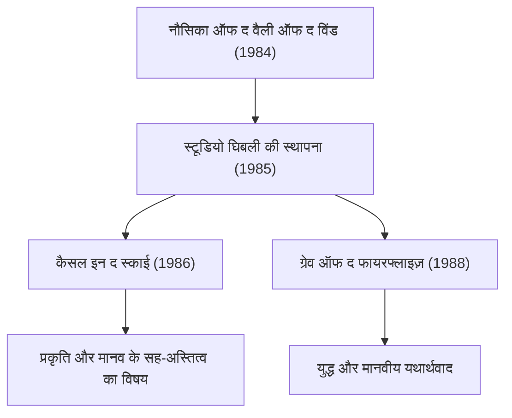

# घिबली फिल्मों की यात्रा: एनिमेशन द्वारा चित्रित जीवन और प्रकृति का संदेश

स्टूडियो घिबली मात्र एक एनिमेशन निर्माण स्टूडियो की सीमाओं से परे, न केवल जापान बल्कि वैश्विक दृश्य संस्कृति में एक अद्वितीय स्थान रखता है। 1985 में अपनी स्थापना के बाद से, हयाओ मियाज़ाकी और इसाओ ताकाहाता जैसे दो प्रतिभाशाली रचनाकारों के नेतृत्व में इसने कई ऐतिहासिक उत्कृष्ट कृतियों का निर्माण किया है। इस लेख में, हम भौतिक, ऐतिहासिक और तकनीकी दृष्टिकोणों को शामिल करते हुए स्टूडियो घिबली के इतिहास, तकनीकी विकास और इसकी कृतियों में निहित विषयों के क्रमिक विकास का गहराई से विश्लेषण करेंगे।

## स्टूडियो घिबली की स्थापना और शुरुआती चुनौतियाँ

स्टूडियो घिबली का इतिहास 1984 में रिलीज़ हुई फिल्म 『नौसिका ऑफ द वैली ऑफ द विंड』 की सफलता से शुरू होता है। कड़ाई से कहें तो यह रचना घिबली की स्थापना से पहले की है, लेकिन इसकी निर्माण प्रक्रिया के दौरान विकसित टीम वर्क और पूंजी ने बाद में स्टूडियो की स्थापना की नींव रखी।

स्थापना के तुरंत बाद आई फिल्म 『कैसल इन द स्काई』 में, सेल एनिमेशन (cel animation) का उपयोग करके पारंपरिक एनिमेशन तकनीक के चरमोत्कर्ष को साधा गया। विशेष रूप से, 'उड़ते पत्थर' (लेविटेशन स्टोन) की रोशनी और बादलों के चित्रण में उस समय की ऑप्टिकल कंपोजिटिंग तकनीकों का भरपूर उपयोग किया गया था। प्रकाश के प्रकीर्णन (scattering) और अपवर्तन (refraction) जैसी भौतिक घटनाओं को हाथ से बनाए गए सेलों और फिल्मांकन के दौरान फिल्टर-वर्क के ज़रिए पुनः प्रस्तुत करने की तकनीक ने तत्कालीन वैश्विक मानकों को काफी ऊंचा उठा दिया।

## आर्थिक वृद्धि और दैनिक जीवन की फंतासी: 80 के दशक के उत्तरार्ध से 90 का दशक

जब जापान अपनी 'बबल इकोनॉमी' (आर्थिक उछाल) के दौर में था, तब घिबली ने 『माय नेबर टोटोरो』 और 『ग्रेव ऑफ द फायरफ्लाइज़』 को एक साथ रिलीज़ करने का अभूतपूर्व साहसिक कदम उठाया। एक तरफ शोवा काल के 30 के दशक (1950 के दशक) की देहाती प्रकृति और आत्माओं को दर्शाया गया, तो दूसरी तरफ द्वितीय विश्व युद्ध के अंतिम दौर की त्रासद वास्तविकता को चित्रित किया गया। ये दो विपरीत दिशाएँ ही घिबली की बहुआयामी प्रकृति का प्रतीक हैं।

तकनीकी दृष्टिकोण से, इसी अवधि से मल्टीप्लेन कैमरे का उपयोग करके गहराई का चित्रण और अधिक परिष्कृत हुआ। पृष्ठभूमि चित्रों को कई परतों में विभाजित करके और प्रत्येक को अलग-अलग गति से चलाकर, द्वि-आयामी (2D) स्क्रीन पर एक भौतिक त्रि-आयामी अहसास (पैरालैक्स प्रभाव) पैदा करने की यह विधि अपनाई गई थी। यह बाद के डिजिटल युग में 3DCG के माध्यम से स्थानिक अभिव्यक्ति का अग्रदूत मानी जाने वाली एक उल्लेखनीय दृश्य युक्ति थी।

## पारिस्थितिकी और पौराणिक कल्पनाशीलता: 『प्रिंसेस मोनोनोके』 का प्रभाव

1997 में रिलीज़ हुई 『प्रिंसेस मोनोनोके』 स्टूडियो घिबली के लिए तकनीकी और वैचारिक दोनों दृष्टियों से एक बड़ा मोड़ साबित हुई। इस फिल्म में जंगल के देवताओं और मनुष्यों के बीच के भीषण संघर्ष को दर्शाया गया, और अच्छाई-बुराई के सीधे द्वंद्व से परे एक जटिल और गहन संदेश प्रस्तुत किया गया।

यहाँ विशेष रूप से ध्यान देने योग्य बात एनिमेशन में द्रव गतिकी (fluid dynamics) का चित्रण है। 'तातारीगामी' (शापित दानव) के शरीर पर रेंगते हुए शाप, खून के छींटे और बहते पानी के प्रवाह को चित्रित करने के लिए आंशिक रूप से डिजिटल तकनीक (CGI) का प्रयोग किया गया था। हालाँकि, इसका मूल आधार एनिमेटरों द्वारा भौतिकी के नियमों का गहन अवलोकन और उनका पुनर्निर्माण ही था। श्यान (viscous) पदार्थों की गति और गुरुत्वाकर्षण के कारण ढहती हुई वस्तुओं के द्रव्यमान का अहसास—न्यूटन के गति नियमों को सहज रूप से समझकर, उन्हें अतिरंजित और रूपांतरित करके चित्रित करने की इस तकनीक ने दुनिया भर के रचनाकारों को आश्चर्यचकित कर दिया।

## डिजिटलीकरण की ओर संक्रमण और अंतर्राष्ट्रीय ख्याति: 『स्पिरिटेड अवे』

2001 की फिल्म 『स्पिरिटेड अवे』 ने जापानी बॉक्स ऑफिस के सभी पुराने रिकॉर्ड तोड़कर एक ऐतिहासिक सफलता हासिल की और अकादमी पुरस्कार (ऑस्कर) में सर्वश्रेष्ठ एनिमेटेड फीचर फिल्म का पुरस्कार जीतकर अपनी वैश्विक ख्याति को सुदृढ़ किया।

इस फिल्म के साथ, घिबली पारंपरिक सेल पेंटिंग से पूरी तरह डिजिटल पेंटिंग में परिवर्तित हो गया। किंतु, उन्होंने डिजिटल तकनीक का उपयोग केवल "दक्षता और गति" बढ़ाने के लिए नहीं, बल्कि "अभिव्यक्ति के विस्तार" के लिए किया। रंगों के अनंत शेड्स, जटिल प्रकाश स्रोत प्रसंस्करण, और पारदर्शी जल का सजीव चित्रण जैसी डिजिटल क्षमताओं के भौतिक सिमुलेशन को अपनाते हुए, उन्होंने हाथ से बनाए गए चित्रों की गर्माहट और आत्मीयता को बनाए रखने वाला एक अनूठा वर्कफ़्लो स्थापित किया।

## इसाओ ताकाहाता का नवाचार और यथार्थवाद की पराकाष्ठा: 『द टेल ऑफ द प्रिंसेस कागुया』

जहाँ हयाओ मियाज़ाकी फंतासी के माध्यम से दुनिया को चित्रित करते हैं, वहीं इसाओ ताकाहाता ने हमेशा एनिमेशन के पारंपरिक ढांचे को चुनौती देते हुए अवंत-गार्डे (प्रायोगिक) प्रयास जारी रखे। उनकी इस साधना का चरमोत्कर्ष 『द टेल ऑफ द प्रिंसेस कागुया』 में देखने को मिलता है।

इस कृति में रेखाओं को जानबूझकर अधूरा छोड़कर और जलरंग (वॉटरकलर) जैसे हल्के रंगों का उपयोग करके दर्शकों के मस्तिष्क में दृश्य को "पूर्ण" करने का एक परिष्कृत मनोवैज्ञानिक दृष्टिकोण अपनाया गया। गतिज ऊर्जा (kinetic energy) से भरपूर भागने के दृश्यों में, पृष्ठभूमि को खुरदुरे और त्वरित ब्रश-स्ट्रोक्स से चित्रित करके सापेक्षतावादी स्थानिक विकृति और गति की तीव्रता को दृश्य रूप में दर्शाया गया है। यह यथार्थवाद के ठीक विपरीत, मानव धारणा और संज्ञान के तंत्र का कुशलतापूर्वक उपयोग करने वाली एक अनोखी अभिव्यक्ति तकनीक है।

## भविष्य को विरासत और एनिमेशन की असीम संभावनाएं

स्टूडियो घिबली की कृतियाँ केवल मनोरंजन तक सीमित नहीं हैं; वे मानवता के सामने मौजूद पर्यावरणीय समस्याओं, प्रौद्योगिकी के साथ हमारे रिश्ते, और "जीने" के मौलिक अर्थ पर निरंतर सवाल उठाती रही हैं। सेल एनिमेशन से डिजिटल में संक्रमण, एनालॉग स्पर्श की निरंतर खोज, और बदलते समय के साथ जुड़ने का उनका ईमानदार दृष्टिकोण—यह पूरी यात्रा हमें दर्शाती है कि एनिमेशन के माध्यम में अभिव्यक्ति की कितनी असीम संभावनाएं निहित हैं।

घिबली द्वारा रचित संसार में हवा के हर झोंके और पानी की हर चमक में जीवन की सांस और भौतिकी के नियमों का सौंदर्य समाया हुआ है। आने वाले समय में भी हमें उनके द्वारा छोड़े गए इन संदेशों को समझना होगा और नई पीढ़ियों तक पहुँचाना होगा।
