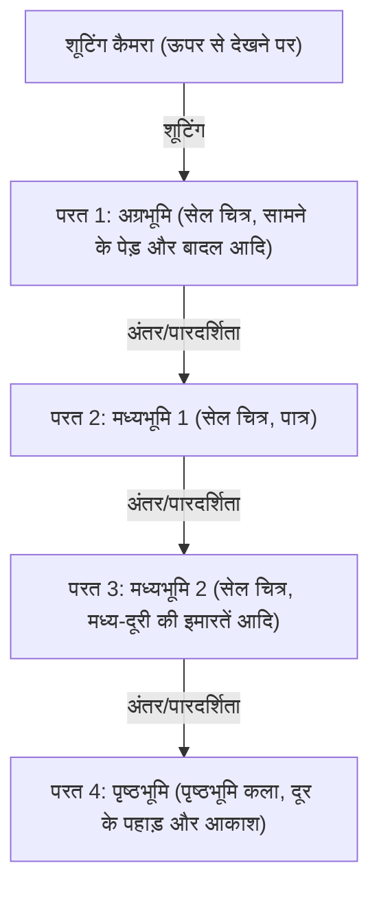
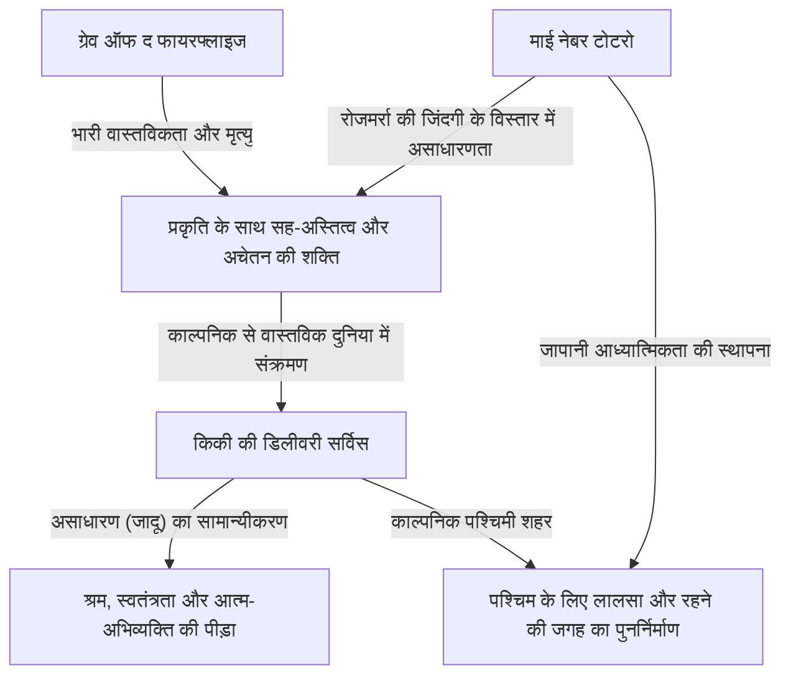
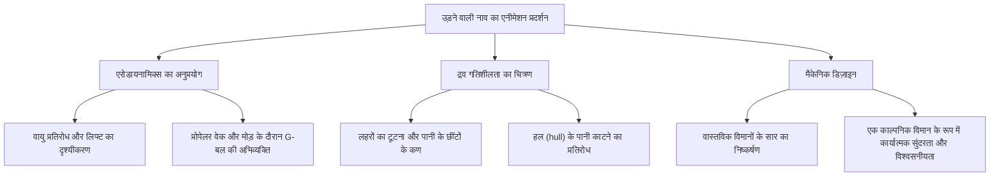
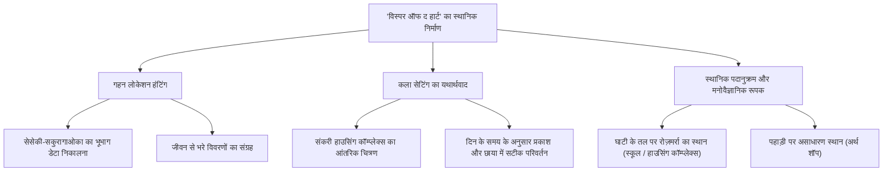
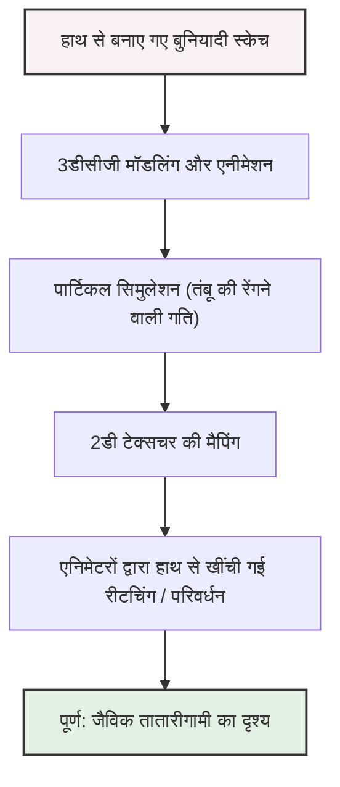
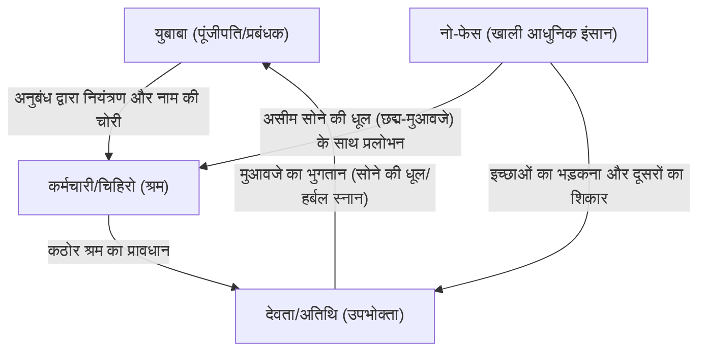
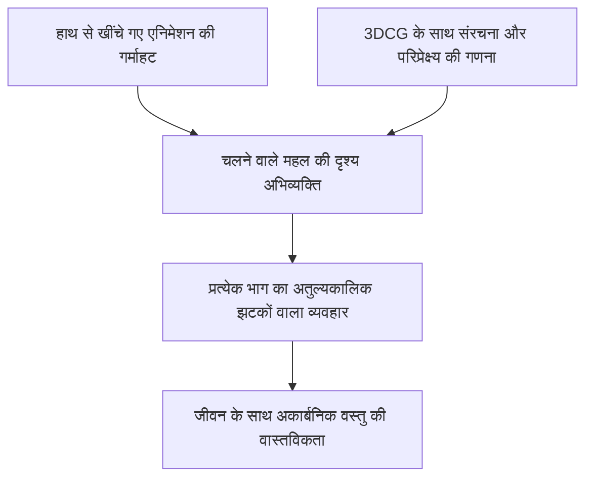
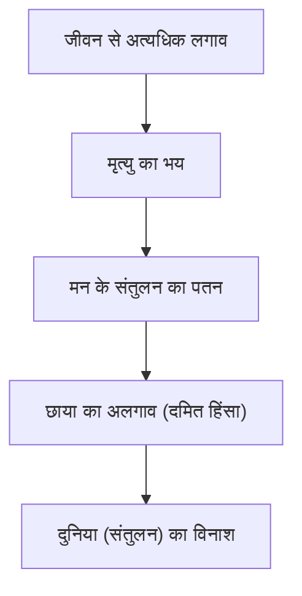
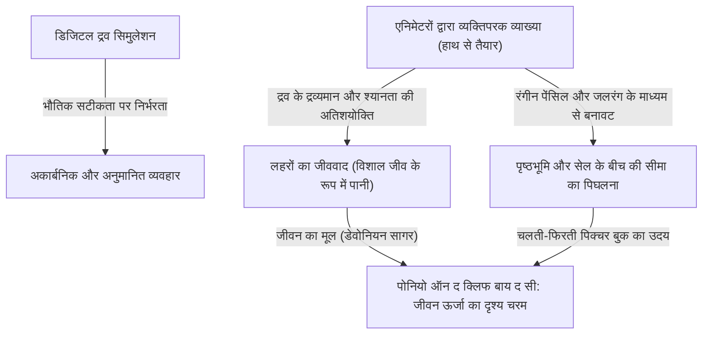
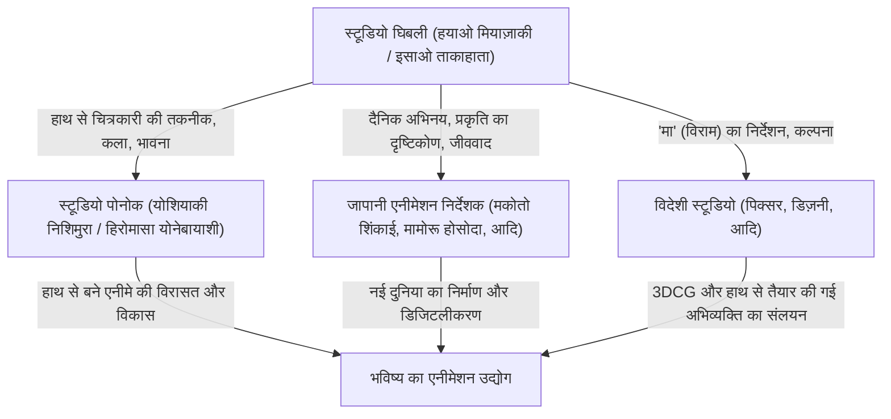

# अध्याय 1: स्थापना और शुरुआती उत्कृष्ट कृतियाँ (नाउसिका ऑफ़ द वैली ऑफ़ द विंड, कैसल इन द स्काई)

## 1.1 एनीमेशन के इतिहास में एक विलक्षणता, स्टूडियो घिबली का जन्म

जापानी एनीमेशन उद्योग, बल्कि विश्व एनीमेशन के इतिहास पर नज़र डालें, तो 1980 के दशक के मध्य में हुई एक "घटना" को नज़रअंदाज़ नहीं किया जा सकता है। वह घटना थी स्टूडियो घिबली की स्थापना। घिबली का इतिहास महज़ एक कंपनी या एक प्रोडक्शन स्टूडियो का इतिहास नहीं है, बल्कि यह सेल एनिमेशन नामक एनालॉग तकनीक की अभिव्यक्ति के चरम बिंदु तक पहुँचने और एनीमेशन माध्यम की "लोकप्रियता" और "कलात्मकता" के चमत्कारी विलय का इतिहास है। इस अध्याय में, हम स्टूडियो घिबली की स्थापना की पृष्ठभूमि को खोलते हुए, इसके वास्तविक शुरुआती बिंदु 'नाउसिका ऑफ़ द वैली ऑफ़ द विंड' (1984) और स्टूडियो घिबली के नाम से पहली फिल्म 'कैसल इन द स्काई' (1986) पर ध्यान केंद्रित करेंगे, और चर्चा करेंगे कि इसाओ ताकाहाता और हयाओ मियाज़ाकी नामक दो प्रतिभावान व्यक्तियों ने कैसे एनीमेशन अभिव्यक्ति की सीमाओं को पार किया।

स्टूडियो घिबली की स्थापना की पूर्व संध्या पर, जापानी टेलीविजन एनीमेशन ने "लिमिटेड एनीमेशन" नामक तकनीक के माध्यम से अपना अनूठा विकास किया था। डिज्नी के फुल एनीमेशन के विपरीत जो प्रति सेकंड पूरे 24 फ्रेम का उपयोग करता है, फ्रेम की संख्या को कम करते हुए स्टिल इमेज और कैमरा वर्क (पैन, टिल्ट आदि) का उपयोग करके गतिशीलता पैदा करने की यह तकनीक लागत कम करने की आवश्यक बुराई से शुरू हुई, और अंततः एक अद्वितीय दृश्य व्याकरण के रूप में स्थापित हो गई। हालांकि, इसाओ ताकाहाता और हयाओ मियाज़ाकी का लक्ष्य इस ढांचे तक सीमित नहीं था। वे टोई डोगा (अब टोई एनीमेशन) के समय से विकसित की गई विस्तृत स्थानिक संरचना, रोजमर्रा के जीवन की वास्तविकता और सबसे बढ़कर "चलने की मौलिक खुशी" को आगे बढ़ाने वाले एनीमेशन को, नाट्य फीचर फिल्म के सर्वोच्च प्रारूप में साकार करने के लिए तरस रहे थे।

## 1.2 इसाओ ताकाहाता और हयाओ मियाज़ाकी की कलात्मकता: वस्तुनिष्ठता और व्यक्तिपरकता का चमत्कारी प्रतिच्छेदन

स्टूडियो घिबली की कृतियों को गहराई से समझने के लिए, इसके मूल में स्थित इसाओ ताकाहाता और हयाओ मियाज़ाकी नामक दो अलग-अलग प्रतिभाओं की प्रकृति और उनकी अंतःक्रिया को समझना आवश्यक है। दोनों टोई डोगा से आए थे और मजदूर संघ की गतिविधियों के माध्यम से गहरे बंधन में बंधे थे, लेकिन यह कहना अतिशयोक्ति नहीं होगी कि एनीमेशन निर्देशकों के रूप में उनके झुकाव एक-दूसरे के बिल्कुल विपरीत थे।

हयाओ मियाज़ाकी की कलात्मकता उनकी भारी "व्यक्तिपरक स्थानिक जागरूकता" और "गति के अंधभक्ति" द्वारा पहचानी जाती है। मियाज़ाकी द्वारा चित्रित स्क्रीन, कभी-कभी भौतिकी के नियमों को पार करते हुए भी, दर्शकों की शारीरिक संवेदनाओं को सीधे आकर्षित करने वाली एक मजबूत प्रेरक शक्ति रखती है। उड़ान के दृश्यों में तैरने का अहसास, भारी द्रव्यमान वाली वस्तुओं के हिलने पर गहरा प्रभाव महसूस कराने वाला भारीपन, और हवा के सूक्ष्म प्रवाह या पानी की सतह की चमक जैसी दुनिया का एक जीवित प्राणी की तरह रेंगने का अहसास, मियाज़ाकी के दिमाग में मौजूद दृष्टि को एनिमेटरों के शरीर के माध्यम से सेल चित्रों पर उकेरने का परिणाम है। वह लेआउट (स्क्रीन संरचना) में वाइड-एंगल लेंस जैसे विरूपण और अद्वितीय परिप्रेक्ष्य का भारी उपयोग करते हैं, और स्क्रीन की गहराई और प्रवाह रेखाओं को कुशलतापूर्वक नियंत्रित करते हैं।

इसके विपरीत, इसाओ ताकाहाता की कलात्मकता पूरी तरह से "वस्तुनिष्ठता" और "तार्किक निर्माण" में निहित है। क्योंकि ताकाहाता खुद एक ऐसे निर्देशक थे जो चित्र नहीं बनाते थे, वह एनीमेशन स्क्रीन को एक उच्च मेटा-परिप्रेक्ष्य से देखने में सक्षम थे। उनका निर्देशन पात्रों के मनोविज्ञान, सामाजिक संरचनाओं और रोजमर्रा की छोटी-छोटी हरकतों की वास्तविकता को चरम सीमा तक धकेलने पर केंद्रित है। स्थानिक व्यवस्था से लेकर प्रकाश व्यवस्था और पात्रों की प्रेरणाओं तक, सब कुछ सावधानीपूर्वक गणना पर आधारित है, जो दर्शकों को भावनात्मक रूप से जुड़ने के लिए प्रोत्साहित करते हुए हमेशा एक कदम पीछे हटने और दुनिया का निरीक्षण करने के लिए ब्रेख्तियन अलगाव प्रभाव भी प्रदान करता है।

"व्यक्तिपरक और सहज मियाज़ाकी" और "वस्तुनिष्ठ और तार्किक ताकाहाता" की इन दो प्रतिभाओं ने एक-दूसरे को नियंत्रित करते हुए, एक-दूसरे का सम्मान करते हुए एक स्टूडियो की रीढ़ की हड्डी के रूप में काम किया, जो घिबली की समृद्ध कृतियों को जन्म देने वाली सबसे बड़ी प्रेरक शक्ति थी। शुरुआती घिबली फिल्मों में, ताकाहाता ने एक निर्माता के रूप में मियाज़ाकी के अनियंत्रित विचारों को नियंत्रित करने और साथ ही काम की संरचना को मजबूत करने में अत्यंत महत्वपूर्ण भूमिका निभाई।

## 1.3 सेल एनीमेशन की तकनीकी विलक्षणता और मल्टीप्लेन कैमरा

स्टूडियो घिबली की महानता केवल इसके विषयों की गहराई में ही नहीं, बल्कि इसका समर्थन करने वाली भारी तकनीकी शक्ति में भी है। विशेष रूप से 'नाउसिका' से लेकर 'लापुता' तक की अवधि वह समय था जब एनालॉग सेल एनीमेशन तकनीक पूर्णता, या "तकनीकी विलक्षणता" तक पहुंच रही थी।

घिबली कृतियों की स्क्रीन की भारी मात्रा में जानकारी और वास्तविकता की भावना सावधानीपूर्वक तैयार की गई पृष्ठभूमि कला और सेल चित्रों की कई परतों से उत्पन्न होती है। यहां विशेष रूप से उल्लेखनीय "मल्टीप्लेन कैमरा (मल्टी-स्टेज कैमरा)" का उपयोग करके स्थानिक अभिव्यक्ति का चरम है।

मल्टीप्लेन कैमरा एक ऐसा उपकरण है जिसमें कैमरे के नीचे कांच की कई परतें (चरण) होती हैं, जिनमें से प्रत्येक पर सेल चित्र या पृष्ठभूमि चित्र रखकर शूटिंग की जाती है। इसके परिणामस्वरूप, जब कैमरा चलता है (पैन, टिल्ट, ट्रैक अप आदि), तो प्रत्येक परत की गति को बदलकर त्रि-आयामी गहराई (लंबन) का एक कृत्रिम भ्रम पैदा किया जा सकता है। हालांकि इस तकनीक का उपयोग डिज्नी और अन्य लोगों द्वारा लंबे समय से किया जाता रहा है, लेकिन घिबली द्वारा मल्टीप्लेन कैमरे का उपयोग इसकी सटीकता और जटिलता में बेजोड़ था।

मियाज़ाकी के कार्यों में आवश्यक "उड़ान दृश्य" इस तकनीक से अत्यधिक लाभान्वित होते हैं। उदाहरण के लिए, नीचे फैला हुआ बादलों का समुद्र, उनके बीच उड़ती हुई उड़ान नाव, और पीछे दिखाई देने वाली पृथ्वी जैसे जटिल स्थानों को विभिन्न गति से बहने वाली प्रत्येक परत के साथ, दर्शक एक मजबूत स्थानिक जागरूकता और विसर्जन प्राप्त करते हैं मानो वे वास्तव में आकाश में उड़ रहे हों। इसके अलावा, सेल के पीछे से प्रकाश चमकाने वाली "पारदर्शी प्रकाश" तकनीक, एयरब्रश का उपयोग करके सूक्ष्म रंग-संक्रमण अभिव्यक्ति, और हवा में उड़ने वाले हर एक पौधे को हाथ से खींचने के पागलपन भरे चित्रण प्रयास के माध्यम से, स्क्रीन पर हवा बहती है और वायु प्रवाहित होती है। ऐसे युग में जब डिजिटल तकनीक (CGI) मौजूद नहीं थी, उन्होंने भौतिक फिल्म, पेंट और प्रकाश के जादू का उपयोग करके वास्तविकता से अधिक वास्तविक आभासी दुनिया का निर्माण किया।

## 1.4 'नाउसिका ऑफ़ द वैली ऑफ़ द विंड' (1984): प्रागितिहास के एक मील के पत्थर और पारिस्थितिकी की गहराई के रूप में

1984 में रिलीज़ हुई 'नाउसिका ऑफ़ द वैली ऑफ़ द विंड' आधिकारिक तौर पर स्टूडियो घिबली की स्थापना से पहले "टॉपक्राफ्ट" द्वारा निर्मित थी, लेकिन इसे निर्देशक हयाओ मियाज़ाकी और निर्माता इसाओ ताकाहाता की टीम ने बनाया था, और इसे व्यावहारिक "शून्य फिल्म" या "पहली फिल्म" के रूप में स्थापित किया गया था जिसने बाद की घिबली की दिशा तय की।

यह काम मियाज़ाकी हयाओ द्वारा खुद मासिक पत्रिका "एनिमेज" में धारावाहिकित इसी नाम के मंगा पर आधारित है, लेकिन फिल्म संस्करण अपने शुरुआती हिस्से को फिर से व्यवस्थित करता है और इसे एक स्वतंत्र कहानी के रूप में पूरा करता है। एनीमेशन के इतिहास में 'नाउसिका' की सबसे बड़ी उपलब्धि "पर्यावरणीय मुद्दों (पारिस्थितिकी)", "जीवन की गरिमा", और "मानव मूर्खता" के अत्यंत गहन वैज्ञानिक-काल्पनिक विषयों को मनोरंजन के ढांचे के भीतर और भारी दृश्य सुंदरता के साथ चित्रित करना है।

"आग के सात दिन" नामक अंतिम युद्ध में औद्योगिक सभ्यता के पतन के 1000 साल बाद। एक ऐसी दुनिया जहां जहरीली गैस छोड़ने वाला "सी ऑफ करप्शन" (जहरीला जंगल) नामक फफूंद का जंगल फैल रहा है और विशाल कीड़ों का शासन है। यह निराशाजनक विश्व दृष्टिकोण शीत युद्ध के तहत परमाणु युद्ध के डर और बिगड़ते पर्यावरणीय विनाश के प्रति मियाज़ाकी के मजबूत संकट की भावना को दर्शाता है। हालांकि, मियाज़ाकी केवल "प्रकृति संरक्षण" या "मानव बुराई" के द्वैतवाद में नहीं पड़ते हैं। नाटक में बड़ा उलटफेर कि जहरीला जंगल वास्तव में प्रदूषित पृथ्वी को शुद्ध करने की एक प्रणाली है, प्रकृति की भयानक आत्म-شفা शक्ति और उसके सामने मनुष्य के छोटेपन का सामना कराता है।

तकनीकी दृष्टिकोण से 'नाउसिका' के बारे में बात करते समय, "ओमू" सहित विशाल कीड़ों की अभिव्यक्ति अपरिहार्य है। रबर (विभिन्न सेल भागों को स्थानांतरित करके शूटिंग जैसी तकनीक) और सावधानीपूर्वक समय की गणना का उपयोग करके एक विशेष ड्राइंग तकनीक द्वारा निर्मित एनीमेशन जिसमें कई जोड़ों और आंखों वाले ये अजीब जीव लहरों की तरह आगे बढ़ते हैं, एक भारी वजन, खौफ और एक निश्चित प्रकार की दिव्यता पैदा करता है। साथ ही, मेवे (नाउसिका का उड़ने वाला उपकरण) के उड़ान दृश्य में कपड़े की गति जो हवा के प्रतिरोध को महसूस कराती है, और गुरुत्वाकर्षण और लिफ्ट के बीच के संबंध को देखने जैसी चिकनी प्रक्षेपवक्र ने दुनिया को "उड़ने के कैथार्सिस" का एहसास कराया जो मियाज़ाकी के एनीमेशन का असली सार है।

नाउसिका के रूप में नायिका का निर्माण भी अभिनव था। वह केवल "सुरक्षित की जाने वाली लड़की" नहीं है, बल्कि एक योद्धा है जो खुद मेवे की सवारी करती है, बंदूक चलाती है और तलवार घुमाती है, लेकिन साथ ही एक मातृ उपस्थिति भी है जिसके मन में सभी जीवन के प्रति गहरा प्यार है। ताकत और कोमलता, क्रोध और उदासी को मिलाने वाली यह जटिल चरित्र छवि न केवल बाद की घिबली फिल्मों के लिए, बल्कि आधुनिक कथा साहित्य में महिला नायक की छवि के लिए भी एक चरमोत्कर्ष और प्रारंभिक बिंदु बन गई।

## 1.5 स्टूडियो घिबली की स्थापना और 'कैसल इन द स्काई' (1986): अंतिम साहसिक एक्शन फिल्म

'नाउसिका' की सफलता के बाद, इसके मुनाफे के साथ, 1985 में आधिकारिक तौर पर "स्टूडियो घिबली" की स्थापना हुई। इसके पीछे केवल एक ही उद्देश्य था, "उच्च गुणवत्ता वाली नाटकीय फीचर एनीमेशन फिल्में बनाना जारी रखना।" टीवी एनीमेशन के बड़े पैमाने पर उत्पादन से खुद को अलग करते हुए, घिबली का जन्म बिना समझौता किए गुणवत्ता को आगे बढ़ाने के लिए एक स्वतंत्र आधार के रूप में हुआ था।

और 1986 में, 'कैसल इन द स्काई' को स्टूडियो घिबली के नाम से पहली स्मारकीय फीचर फिल्म के रूप में रिलीज़ किया गया था। यह फिल्म उस विचार पर आधारित है जिसे हयाओ मियाज़ाकी ने प्राथमिक विद्यालय में सोचा था, जिसमें स्विफ्ट की 'गुलिवर्स ट्रैवल्स' में तैरते द्वीप लापुता को एक रूपांकन के रूप में इस्तेमाल किया गया है। एक लड़के और एक लड़की की मुलाकात, एक रहस्यमय लेविटेशन स्टोन, हवाई समुद्री डाकू, और बुरी महत्वाकांक्षाओं वाली सेना जैसे क्लासिक साहसिक एक्शन (लड़का-लड़की से मिलता है) के सभी शाही तत्वों से भरी हुई, यह वास्तव में एक उत्कृष्ट कृति है जिसे "एक्शन का चरम" कहा जा सकता है।

'लापुता' की महानता कहानी की लुभावनी प्रेरक शक्ति और स्क्रीन के हर कोने में फैले विवरण के प्रति असाधारण जुनून में निहित है। डोला परिवार द्वारा एयरशिप (टाइगर मॉथ) पर शुरुआती हमले के दृश्य से लेकर स्लैग रैविन में पीछा करने वाले दृश्य तक जहां पाज़ू और शीता भाग जाते हैं, स्क्रीन हमेशा "गतिशील" होती है। स्लैग रैविन की यांत्रिक संरचना, भाप के इंजन का पिस्टन संचलन, गियर का घूमना, और खदान की गाड़ियों की दौड़। इन मशीनों और वाहनों को केवल पृष्ठभूमि या प्रॉप्स के रूप में नहीं, बल्कि ऐसे जीवंतता से चित्रित किया गया है मानो उनका अपना जीवन हो। मियाज़ाकी का "मशीनों के प्रति प्रेम" और यहां तक कि "उनके द्वारा उत्सर्जित गर्मी और गंध" को भी स्थापित करने की कोशिश करने वाले एनीमेशन के जुनून ने काल्पनिक दुनिया को एक जबरदस्त वास्तविकता प्रदान की है।

विषयगत रूप से 'लापुता' जो प्रस्तुत करता है वह "उन्नत तकनीक और मनुष्यों के बीच का विभाजन" और "पृथ्वी से संबंध" है। लापुता साम्राज्य की अत्यधिक वैज्ञानिक शक्ति, जिसने कभी दुनिया पर राज किया था, अंततः इसके अपने विनाश का कारण बनी। फिल्म के चरमोत्कर्ष में, एक विशाल "पेड़" का दृश्य, जिसमें ढहते हुए लापुता की गहराई से एक विशाल लेविटेशन स्टोन है और जो अंतरिक्ष में ऊपर उठ रहा है, अत्यंत प्रतीकात्मक है। यह अंत, जिसमें प्रौद्योगिकी के प्रतीक कृत्रिम वस्तुएं नष्ट हो जाती हैं और केवल जीवन का प्रतीक पेड़ ही बचा रहता है, शीता के इन शब्दों में संक्षेप में प्रस्तुत किया गया है: "जमीन में जड़ें जमाओ, हवा के साथ जियो। बीजों के साथ सर्दियां बिताओ, और पक्षियों के साथ वसंत में गाओ। चाहे आपके पास कितने भी भयानक हथियार हों, चाहे आप कितने भी दुखी रोबोटों को नियंत्रित करें, आप पृथ्वी के बिना नहीं रह सकते।" यह 'नाउसिका' से जारी आधुनिक सभ्यता की मियाज़ाकी की तीखी आलोचना है, और प्रकृति में लौटने के लिए एक सार्वभौमिक प्रार्थना है।

साथ ही, इस फिल्म में कला निर्देशक तोशिरो नोज़ाकी और निज़ो यामामोटो द्वारा पृष्ठभूमि कला का योगदान अथाह है। लापुता पहुंचने पर, जब बादलों का समुद्र साफ हो जाता है, और काई से ढका विशाल बगीचा और रोबोट सैनिक दिखाई देते हैं, तो उस दृश्य की शांत सुंदरता साबित करती है कि एनीमेशन में पृष्ठभूमि कला फिल्म की गरिमा को कैसे निर्धारित करती है। मियाज़ाकी के गतिशील निर्देशन और स्थिर कला का एक आदर्श संलयन यहाँ था।

## 1.6 निष्कर्ष: एक किंवदंती की शुरुआत

'नाउसिका ऑफ़ द वैली ऑफ़ द विंड' और 'कैसल इन द स्काई'। इन दो शुरुआती उत्कृष्ट कृतियों में, हयाओ मियाज़ाकी, इसाओ ताकाहाता और स्टूडियो घिबली के कर्मचारियों ने एनीमेशन अभिव्यक्ति की क्षमता को उसकी सीमा तक खींच लिया। काल्पनिक यांत्रिकी को वजन और अनुभव देना, काल्पनिक पारिस्थितिक तंत्र में वास्तविकता को सांस लेना, और जटिल सामाजिक आलोचना और दार्शनिक विषयों को मनोरंजन में शामिल करना जिसे सभी उम्र के लोग सांस रोककर देखते हैं। उन्होंने सेल चित्रों की एक विशाल संख्या और पागलपन की हद तक कारीगरों के हाथों के काम के माध्यम से इस अविश्वसनीय उपलब्धि को हासिल किया।

इन दो कार्यों ने तकनीकी और अभिव्यंजक मानकों को बहुत ऊंचाइयों तक बढ़ाया, और बाद के जापानी एनीमेशन दुनिया में "घिबली की विशाल दीवार" के रूप में खड़े हो गए। और साथ ही, यह शाब्दिक रूप से एक भव्य किंवदंती का "अध्याय 1" था, जिसमें यह छोटा स्टूडियो अंततः एक वैश्विक सांस्कृतिक घटना का कारण बनेगा और एनीमेशन के इतिहास को ही फिर से लिख देगा। इसके बाद की 'माई नेबर टोटरो', 'ग्रेव ऑफ द फायरफ्लाइज' और 'प्रिंसेस मोनोनोके' की ओर जाने वाला मार्ग पूरी तरह से 'नाउसिका' की हवा और 'लापुता' के आकाश से शुरू हुआ था।

# अध्याय 2: रोजमर्रा और गैर-रोजमर्रा का चौराहा——'माई नेबर टोटरो', 'ग्रेव ऑफ द फायरफ्लाइज', 'किकी की डिलीवरी सर्विस' द्वारा चित्रित दुनिया

स्टूडियो घिबली के इतिहास को समझने में, 1980 के दशक का उत्तरार्ध एक निर्णायक मोड़ था। पिछले काम 'कैसल इन द स्काई' (1986) में चित्रित महाकाव्य "तलवार और जादू" या "उड़ने वाले साहसिक एक्शन" से पलटते हुए, घिबली ने जापानी मूल परिदृश्य और आम पश्चिमी लोगों के जीवन के "रोजमर्रा" की ओर एक बड़ा मोड़ लिया। इस अध्याय में, हम 3 फिल्मों - 'माई नेबर टोटरो' और 'ग्रेव ऑफ द फायरफ्लाइज', जिन्होंने 1988 में एक चमत्कारी दोहरी रिलीज़ हासिल की, और 1989 की हिट फिल्म 'किकी की डिलीवरी सर्विस' - को लेंगे, और एनीमेशन के इतिहास में उनके द्वारा उकेरी गई तकनीकी और विषयगत क्रांति को पूरी तरह से विच्छेदित करेंगे।

## 1. दोहरी रिलीज़ का पागलपन और चमत्कार: हयाओ मियाज़ाकी और इसाओ ताकाहाता, दो "शोवा"

1988 के वसंत में, 'माई नेबर टोटरो' और 'ग्रेव ऑफ द फायरफ्लाइज' की दोहरी रिलीज़ हुई, जो वर्तमान समय में लगभग अकल्पनीय वितरण रूप है। यह महज एक व्यावसायिक पैकेजिंग नहीं थी, बल्कि यह स्टूडियो घिबली के संगठन, और हयाओ मियाज़ाकी और इसाओ ताकाहाता नामक दो प्रतिभाशाली रचनाकारों के बीच हुए "पागलपन और चमत्कार" का एक क्रिस्टलीकरण था।

### 1-1. जीवन और मृत्यु एक-दूसरे के विपरीत
'माई नेबर टोटरो' शोवा 30 के दशक (1950 के दशक) में एक जापानी कृषि गांव पर आधारित है, और यह जीवन का उत्सव है जो प्रकृति की आत्माओं और बच्चों के बीच बातचीत को दर्शाता है। दूसरी ओर, 'ग्रेव ऑफ द फायरफ्लाइज' ने पूर्ण यथार्थवाद के साथ युद्ध की आग में अपनी जान गंवाने वाले भाई और बहन की भयानक वास्तविकता को चित्रित किया, जो शोवा 20 (1945) में युद्ध के अंत के आसपास कोबे पर आधारित है। हालांकि समय सेटिंग में केवल 10 साल का अंतर है, इन दोनों कार्यों में "जीवन और मृत्यु" और "आदर्श कल्पना और क्रूर वास्तविकता" जैसे पूरी तरह से विपरीत विषय शामिल हैं।

उस समय स्टूडियो घिबली ने एक ऐसी उत्पादन प्रणाली स्थापित की जिसे दो विशाल प्रतिभाओं को एक साथ संचालित करने के लिए लापरवाह कहा जा सकता था। एनीमेशन कर्मचारियों के लिए लड़ाई हुई, और कार्यक्रम पतन के कगार पर था। हालांकि, परिणामस्वरूप, इस कठोर वातावरण ने दोनों कार्यों की गुणवत्ता को चरम तक धकेल दिया। हयाओ मियाज़ाकी ने इसाओ ताकाहाता के पूर्ण यथार्थवाद के एक विरोधी के रूप में 'टोटरो' की एक दुनिया का निर्माण किया, जो अधिक शक्तिशाली थी और जहां अचेतन जीवन शक्ति स्पंदित होती थी, और ताकाहाता ने मियाज़ाकी की कल्पना का मुकाबला करने के लिए जापानी एनीमेशन अभिव्यक्ति को एक वृत्तचित्र आयाम तक बढ़ा दिया।

### 1-2. शोवा युग के चित्रण में अंतर और "एनीमेशन वृत्तचित्र" का जन्म
'ग्रेव ऑफ द फायरफ्लाइज' में इसाओ ताकाहाता का निर्देशन पारंपरिक एनीमेशन के व्याकरण को नष्ट करने वाला था। बी-29 बमबारी द्वारा आग लगाने वाले बमों का प्रक्षेपवक्र, जलते हुए घरों की लपटों का टिमटिमाना, और सबसे बढ़कर भुखमरी के कारण कमजोर होने पर सीता और सेत्सुको में शारीरिक परिवर्तन। इन्हें व्यक्त करने के लिए, मिचियो यासुदा जैसे रंग डिजाइनरों ने "कीचड़, खून और कालिख से ढका भूरा रंग" का पूरी तरह से पीछा किया जिसे पारंपरिक एनीमेशन रंगों से व्यक्त नहीं किया जा सकता था।

इसके विपरीत, 'माई नेबर टोटरो' में, हयाओ मियाज़ाकी ने "वह खूबसूरत जापान जो कभी अस्तित्व में रहा होगा" का पुनर्निर्माण किया जो उनकी यादों में था। यह महज यथार्थवाद नहीं था, बल्कि बच्चे के दृष्टिकोण से देखी गई दुनिया की "चमक" को सेल चित्रों पर स्थापित करने का एक प्रयास था। इन दो "शोवा" युगों के चित्रण का अंतर अभिव्यक्ति के उस आयाम को अधिकतम रूप से साबित करता है जो एनीमेशन माध्यम के पास है, और यह जापानी फिल्म इतिहास में एक मील का पत्थर बन गया।

## 2. पृष्ठभूमि कला की क्रांति: काज़ुओ ओगा और निज़ो यामामोटो द्वारा निर्मित "हवा और नमी"

घिबली कार्यों की जबरदस्त प्रेरक शक्ति काफी हद तक पात्रों के अभिनय पर ही नहीं, बल्कि उनके पीछे फैली पृष्ठभूमि कला की शक्ति पर भी निर्भर करती है। इस अवधि के दौरान, स्टूडियो घिबली की पृष्ठभूमि कला एक चरम बिंदु पर पहुंच गई थी।

### 2-1. काज़ुओ ओगा द्वारा चित्रित "टोटरो के जंगल" का नम वातावरण
'माई नेबर टोटरो' के कला निर्देशक के रूप में चुने गए काज़ुओ ओगा की उपलब्धि को यह कहना अतिशयोक्ति नहीं होगी कि इसने जापानी एनीमेशन कला के इतिहास को बदल दिया। ओगा द्वारा चित्रित प्रकृति पोस्टर रंगों की विशेषताओं का अधिकतम उपयोग करती है। पारदर्शी जलरंगों के बजाय अपारदर्शी पोस्टर रंगों का उपयोग करते हुए, सही मात्रा में पानी और ब्रश के स्पर्श के साथ, उन्होंने जापानी जलवायु के लिए विशिष्ट "नमी", "दमघोंटू घास की गंध" और यहां तक कि "पेड़ों से छनकर आती धूप के तापमान" को भी व्यक्त किया।

विशेष रूप से, बारिश के बस स्टॉप पर तत्सुकी और मेई का टोटरो से मिलने वाले दृश्य की पृष्ठभूमि कला उत्कृष्ट है। बारिश से भीगे डामर की बनावट, अंधेरे में डूबे श्राइन के जंगल की गहराई, और स्ट्रीटलाइट्स द्वारा बनाई गई हवा की परत। ओगा की कला सिर्फ "परिदृश्य की नकल" नहीं थी, बल्कि "अदृश्य जानकारी" जैसे हवा, तापमान और वहां मौजूद आर्द्रता को देखने का जादू था।

### 2-2. पश्चिम की लालसा और स्थापत्य यथार्थवाद
दूसरी ओर, शहर कोरिको, जहां 'किकी की डिलीवरी सर्विस' आधारित है, एक काल्पनिक शहर है जो स्वीडन के स्टॉकहोम, गोटलैंड के विस्बी और यहां तक कि लिस्बन और पेरिस जैसे विभिन्न यूरोपीय शहरों के तत्वों को मिलाकर बनाया गया है। यहां की पृष्ठभूमि कला में जापानी परिदृश्य को चित्रित करने वाले 'टोटरो' के विपरीत दिशा थी।

यूरोप की पत्थर की इमारतें, टाइलों वाली छतों की श्रृंखला, और समुद्र की ओर जाने वाली ढलान वाली सड़कें। इन्हें ठोस रूप से चित्रित करने के लिए, घिबली के कला कर्मचारियों ने गहन स्थान खोज की और वास्तुकला संरचनाओं का अध्ययन किया। पत्थर की बनावट के लिए भी, अपक्षय की डिग्री और सूर्य के प्रकाश के प्रतिबिंब दर की गणना की गई, और इसे उन रंगों में अनुवादित किया गया जो एनीमेशन पृष्ठभूमि के रूप में सबसे सुंदर लगते थे। इस "पश्चिम की लालसा" को एक मात्र फंतासी के रूप में समाप्त न करते हुए, कला की शक्ति जो इसे उस स्थान के रूप में चित्रित करती है जहां लोग वास्तव में रहते हैं और काम करते हैं, वह आश्चर्यजनक है।

## 3. 'किकी की डिलीवरी सर्विस' में समकालीन विषय: "श्रम और मंदी"

'किकी की डिलीवरी सर्विस' ने रिलीज़ होने पर कई युवाओं, विशेष रूप से कामकाजी महिलाओं से उत्साहपूर्ण समर्थन प्राप्त किया। इसका कारण यह है कि सतह पर, यह फिल्म "एक चुड़ैल लड़की के विकास की कहानी" के रूप में एक फंतासी आवरण पहनती है, लेकिन इसके मूल में, यह अत्यधिक आधुनिक और सार्वभौमिक "श्रम और प्रतिभा (मंदी)" के इर्द-गिर्द एक यथार्थवादी नाटक था।

### 3-1. वह क्षण जब प्रतिभा "श्रम" में बदल जाती है
मुख्य पात्र, किकी, "उड़ने" की अपनी जन्मजात जादुई प्रतिभा का उपयोग करके होम डिलीवरी की नौकरी शुरू करती है। यह आधुनिक रचनाकारों और स्वतंत्र श्रमिकों की उस प्रक्रिया के साथ पूरी तरह से ओवरलैप करता है जिसमें वे अपनी प्रतिभा और कौशल को "पूंजी" के रूप में उपयोग करके समाज में भाग लेते हैं। शुरुआत में किकी के लिए, उड़ना एक खुशी और आत्म-अभिव्यक्ति थी। हालाँकि, जब यह "काम (श्रम)" बन जाता है, और जब उसे ग्राहकों (जैसे हेरिंग पाई के एपिसोड) की अनुचित मांगों का सामना करना पड़ता है और बदले में पैसे मिलते हैं, तो जादू का अर्थ उसके भीतर बदल जाता है।

### 3-2. मंदी और पहचान की हानि
बीच में, किकी अचानक अपनी जादुई शक्ति खो देती है, उड़ नहीं सकती, और अपनी काली बिल्ली, जिजी के शब्दों को नहीं समझ सकती। यह एक किशोर लड़की की पहचान का डगमगाना है, और साथ ही यह उस "प्रतिभा की कमी (मंदी)" का एक आदर्श रूपक है जिसका रचनाकारों को सामना करना पड़ता है।

यहां महत्वपूर्ण भूमिका उर्सुला की है, जो कला की छात्रा है जो जंगल में एक झोपड़ी में पेंट करती है। उर्सुला किकी से कहती है, "ऐसे समय में, आपको बस संघर्ष करना होता है," "पेंट करो, पेंट करो और पेंट करते रहो," "अगर फिर भी काम न बने, तो पेंटिंग करना छोड़ दो। टहलने जाओ, नज़ारे देखो, झपकी लो, कुछ मत करो।" ये पंक्तियां हयाओ मियाज़ाकी सहित एनिमेटरों और यहां तक कि अभिव्यक्ति से जुड़े हर इंसान की पीड़ा और उसके लिए अचूक नुस्खा है।

### 3-3. "खून से उड़ने" का संकल्प
उर्सुला अपने चित्रों के बारे में कहती हैं, "पहले मैं बिना कुछ सोचे-समझे पेंट कर सकती थी, लेकिन अब यह अलग है। मुझे अपनी खुद की पेंटिंग बनानी होगी।" किकी का जादू भी वैसा ही है। बिना सोचे-समझे उड़ने में सक्षम होने का वह युग, जब वह अपनी जन्मजात प्रतिभा (जादू) के बल पर ही उड़ सकती थी, समाप्त हो गया है, और उसे अपनी इच्छा और प्रयास से जादू "फिर से प्राप्त" करना होगा। चरमोत्कर्ष में, वह दृश्य जहां किकी एक डेक ब्रश की सवारी करती है और एक हताश अभिव्यक्ति के साथ आकाश में उड़ जाती है, अब एक सुंदर फंतासी नहीं है। यह एक पेशेवर का रूप है जो अपनी सीमाओं का सामना करता है और खून की उल्टी करने वाली पीड़ा के साथ अपने "कौशल" का उपयोग करता है।

## 4. विषयों की संरचना और उनका अंतर्संबंध

ये तीन फ़िल्में, सतह पर, प्रत्येक का अपना स्वतंत्र विश्व दृष्टिकोण है, लेकिन यदि आप घिबली की कलात्मकता के अक्ष से देखें, तो स्पष्ट निरंतरता और विषयों के प्रतिच्छेदन बिंदु हैं।

'टोटरो' द्वारा प्रस्तुत "रोजमर्रा की जिंदगी में छिपा असाधारण (फंतासी)", 'ग्रेव ऑफ द फायरफ्लाइज' की अत्यधिक यथार्थवाद के विपरीत होने के कारण और भी अधिक मजबूत पौराणिक कथा प्राप्त करता है। और वहां स्थापित अभिव्यंजक तकनीक और एनीमेशन तकनीक, 'किकी की डिलीवरी सर्विस' में इस विरोधाभासी विषय को चित्रित करने के लिए शक्तिशाली हथियार बन गए कि "कैसे एक असाधारण प्राणी (चुड़ैल) आधुनिक समाज के रोजमर्रा के जीवन (श्रम) में घुलमिल जाता है।"

## 5. निष्कर्ष: अगले चरण के लिए एक कदम

1988 से 1989 तक की इस अवधि के दौरान, स्टूडियो घिबली ने केवल कुछ वर्षों में एनीमेशन की हर उस सीमा को पार कर लिया जिसे वह चित्रित कर सकता था, जैसे "जीवन और मृत्यु", "जापान और पश्चिम", "फंतासी और यथार्थवाद", और "प्रतिभा और श्रम"। वहां विकसित रोजमर्रा के अभिनय का पूरी तरह से निरीक्षण और चित्रण करने का कौशल, और परिदृश्यों में हवा और भावना पैदा करने की पृष्ठभूमि कला की शक्ति, बाद की फिल्मों में 'ओनली यस्टरडे' (1991) और 'पोर्को रोस्सो' (1992) जैसी वयस्कों के लिए अधिक जटिल विषयों वाली फिल्मों में पारित की जाएगी।

'माई नेबर टोटरो', 'ग्रेव ऑफ द फायरफ्लाइज' और 'किकी की डिलीवरी सर्विस' की ये तीन फ़िल्में केवल उत्कृष्ट कृतियों की एक श्रृंखला नहीं हैं। वे एक ऐतिहासिक स्मारक हैं जो उस सबसे गर्म और सबसे दर्दनाक पंख निकलने के क्षण को दर्ज करते हैं जब एनीमेशन का अभिव्यंजक माध्यम बच्चों के मनोरंजन से "व्यापक कला" में विकसित हुआ जो मानव मन की गहराई और समाज की संरचनात्मक पीड़ा को भी चित्रित करता है।

# अध्याय 3: उड़ान की लालसा और वयस्कों का रोमांस——"पोरको रोसो" (Porco Rosso) और "विस्पर ऑफ द हार्ट" (Whisper of the Heart) में यथार्थवाद की पराकाष्ठा

स्टूडियो घिबली (Studio Ghibli) के इतिहास को देखते हुए, 1990 के दशक की शुरुआत से मध्य तक रिलीज़ हुई "पोरको रोसो" (1992) और "विस्पर ऑफ द हार्ट" (1995) पहली नज़र में एक-दूसरे के बिल्कुल विपरीत काम लग सकते हैं। जहां पहला एड्रियाटिक सागर पर आधारित एक फंतासी है, जो एक शाप के कारण सुअर बन चुके एक इनामी विमान चालक के संघर्ष और दुख को चित्रित करता है, वहीं दूसरा आधुनिक तामा न्यू टाउन पर आधारित है, जो मिडिल स्कूल के लड़के और लड़की के मासूम प्यार और उनके भविष्य को लेकर संघर्षों को दर्शाने वाला एक यूथ ड्रामा है।

हालाँकि, इन दो कार्यों में जो बात समान है, वह है एनिमेशन की अभिव्यक्ति तकनीक का उपयोग करके "यथार्थवाद" (realism) को उसकी चरम सीमा तक ले जाने की स्टूडियो घिबली, या यों कहें, हयाओ मियाज़ाकी (Hayao Miyazaki) और योशिफुमी कोंडो (Yoshifumi Kondo) जैसे असाधारण रचनाकारों की अथक खोज। और इसके मूल में "उड़ान" के प्रति एक तीव्र लालसा मौजूद है——भौतिक रूप से आकाश में उड़ना, या अपनी सीमाओं को पार कर मानसिक रूप से उड़ान भरना। इस अध्याय में, हम ऐतिहासिक पृष्ठभूमि और तकनीकी सिद्धांत दोनों पहलुओं से गहराई से जांच करेंगे कि इन दोनों कार्यों ने एनीमेशन इतिहास में कितनी विशिष्ट स्थिति हासिल की है और उन्होंने क्या तकनीकी और विषयगत उपलब्धियां प्राप्त की हैं।

## 1. "पोरको रोसो"——एरोडायनामिक्स की पराकाष्ठा और एक खोए हुए युग का शोकगीत

"पोरको रोसो" (मूल शीर्षक: Il Porco Rosso) की शुरुआत एक बहुत ही अनोखी पृष्ठभूमि से हुई, मूल रूप से इसे जापान एयरलाइंस (Japan Airlines) की इन-फ़्लाइट स्क्रीनिंग के लिए एक लघु फिल्म के रूप में योजनाबद्ध किया गया था, लेकिन यूगोस्लाव युद्धों की कठोर वास्तविकता की छाया के तहत यह एक फीचर-लंबाई वाली फिल्म में विकसित हो गई। यह काम मियाज़ाकी हयाओ द्वारा अपने लिए और "उन अधेड़ उम्र के आदमियों के लिए बनाया गया था जो इतने थक गए हैं कि उनके दिमाग के सेल टोफू बन गए हैं," जिसका स्पर्श बहुत ही व्यक्तिगत है।

### 1.1 मियाज़ाकी हयाओ और हवाई जहाज: यांत्रिकी के प्रति लगाव और एरोडायनामिक्स का विस्तृत चित्रण

मियाज़ाकी हयाओ का "उड़ान" के प्रति जुनून सर्वविदित है, लेकिन "पोरको रोसो" में उड़ने वाली नावों का चित्रण उनके अपने यांत्रिकी के प्रति लगाव और एरोडायनामिक्स की गहरी समझ को सबसे शुद्ध रूप में व्यक्त करता है। इस काम में दिखाई देने वाली उड़ने वाली नावें——मुख्य पात्र पोरको रोसो का प्यारा क्रिमसन सावोइया S.21 (Savoia S.21) (जो वास्तविक विमानों जैसे कि मैची M.33 और सावोइया-मार्केटी S.59 के तत्वों को मिलाकर बनाया गया एक मूल डिज़ाइन है), प्रतिद्वंद्वी कर्टिस का विमान, और स्काई पाइरेट्स एलायंस के विविध उड़ने वाले विमान——केवल पृष्ठभूमि या प्रॉप्स नहीं हैं, बल्कि वे स्वयं स्वायत्त पात्रों के रूप में जीवंत हैं।

विशेष रूप से उल्लेखनीय यह है कि एनीमेशन में "भौतिकी के नियमों के झूठ और सच" को वायु प्रतिरोध, लिफ्ट, प्रोपेलर टॉर्क, इंजन कंपन, और पानी की सतह से टेकऑफ़ और लैंडिंग के दौरान द्रव गतिशीलता की अभिव्यक्ति तक एक उत्कृष्ट संतुलन के साथ नियंत्रित किया जाता है।

उस दृश्य में जहाँ पोरको का सावोइया इंजन शुरू करता है, सिलेंडर के जलने, पूरे धड़ के थोड़ा कंपन करने और निकास पाइप से काले धुएं के बाहर निकलने तक की प्रक्रिया को सेल एनीमेशन में सूक्ष्म कंपन और मल्टीपल एक्सपोज़र (उस समय की एनालॉग फोटोग्राफी तकनीक) द्वारा व्यक्त किया गया है। हवाई युद्ध (डॉगफाइट) के दृश्यों में, मुड़ते समय G (गुरुत्वाकर्षण त्वरण) को सहन करने वाले पायलट का शारीरिक तनाव, और स्टॉल के कगार पर विमान को नियंत्रित करने वाले कंट्रोल स्टिक और रूडर पैडल की सूक्ष्म हलचल को अत्यंत सटीक समय (फ्रेमिंग) के साथ चित्रित किया गया है। यह मियाज़ाकी हयाओ के दिमाग में मौजूद "उड़ान की शारीरिक अनुभूति" का परिणाम है जो एनिमेटरों के हाथों से सेल्युलाइड पर पूरी तरह से उकेरा गया है।

### 1.2 एड्रियाटिक सागर के आकाश में गूंजता फासीवाद का प्रतिरोध और अराजकतावाद

यह कार्य 1920 के दशक के अंत में इटली के एड्रियाटिक सागर पर आधारित है। ऐतिहासिक पृष्ठभूमि प्रथम विश्व युद्ध के निशान छोड़े जाने और मुसोलिनी के नेतृत्व वाली फासीवादी पार्टी के उभरने के कारण उन्माद और चिंता का युग है। पोरको रोसो (असली नाम मार्को पैगोट) कभी इतालवी वायु सेना का एक ऐस पायलट था, लेकिन वह राज्य और सेना की व्यवस्था से निराश हो गया, उसने खुद को सुअर बनने का श्राप दिया, और एक बाउन्टी हंटर के रूप में एक आउटलॉ (अराजकतावादी) की तरह जीने का रास्ता चुना।

पोरको की प्रसिद्ध पंक्ति, "फासीवादी होने से सुअर होना बेहतर है," सिर्फ एक कठोर डायलॉग नहीं है। यह मियाज़ाकी हयाओ के अपने मजबूत फासीवाद-विरोधी और अराजकतावाद की घोषणा है, जो राज्य के विशाल हिंसक तंत्र में शामिल होने से इनकार करता है, और आकाश के राज्यविहीन स्थान में व्यक्तिगत स्वतंत्रता और सम्मान चाहता है।

फिल्म के दूसरे भाग में, वह दृश्य जहाँ पोरको अपने पूर्व कॉमरेड फेरारिन (अब फासीवादी वायु सेना में एक प्रमुख) के साथ एक मूवी थियेटर में गुप्त रूप से मिलता है, काम की राजनीतिक पृष्ठभूमि को मजबूती से दर्शाता है। फेरारिन शिकायत करता है, "हमें राष्ट्र या लोगों जैसे मूर्खतापूर्ण प्रायोजकों का बोझ उठाते हुए उड़ना पड़ता है।" यहाँ, यह कठोरता से चित्रित किया गया है कि कैसे उड़ान का शुद्ध आनंद राज्य की विचारधारा और युद्ध के एक उपकरण में बदल जाता है। यह स्पष्ट रूप से नहीं बताया गया है कि पोरको सुअर क्यों बन गया, लेकिन यह उस बेतुकी दुनिया पर गहरी निराशा के रूप में कार्य करता है जहाँ इंसान एक-दूसरे को मारते हैं, ऐसे समाज से खुद को अलग करने के लिए एक रक्षा तंत्र के रूप में जो अनुरूपता के दबाव को बढ़ाता है, या इस विरोधाभास की अभिव्यक्ति के रूप में कि "आप इंसान के रूप में मानवीय गरिमा बनाए नहीं रख सकते।"

### 1.3 "जो सुअर उड़ता नहीं, वह सिर्फ एक सुअर है"——अधेड़ उम्र के पुरुष का रोमांस, निराशा, और शाप

"पोरको रोसो" जो कई वयस्कों के दिलों पर कब्जा कर लेता है और उन्हें जाने नहीं देता, वह इसलिए है क्योंकि यह "खोई हुई चीजों" के लिए एक दुखद शोकगीत (elegy) है। पोरको उन साथियों के लिए नुकसान की तीव्र भावना और उत्तरजीवी अपराधबोध (survivor's guilt) से ग्रस्त है जो प्रथम विश्व युद्ध में मारे गए (विमानों के बादलों के मैदान में चढ़ने वाले भ्रम का दृश्य सिनेमा के इतिहास के सबसे महान दृश्यों में से ഏക है)।

जीना (Gina) द्वारा गाया गया चैनसन "द टाइम ऑफ चेरीज़" (Le Temps des cerises) (जिसे पेरिस कम्यून के पतन का शोक मनाने वाले गीत के रूप में जाना जाता है) के प्रतीक के रूप में, यह फिल्म बीते हुए अच्छे समय, उन युवाओं की गहरी यादों से भरी है जो कभी पहुंच में नहीं आ सकते, और अपरिवर्तनीय नुकसान का प्रतीक है। पोरको और जीना के बीच परिपक्व, लेकिन कभी न पार होने वाली दूरी के साथ वयस्क रोमांस का चित्रण घिबली कार्यों में एक अनूठा स्थान रखता है। पोरको के "शाप" को बहाने के रूप में इस्तेमाल करने का भी एक पहलू है, जो जीना के स्नेह और वास्तविक समाज में भागीदारी से बचता है। कैचफ्रेज़, "यही तो कूल होना है" के पीछे अपनी खुद की सौंदर्यशास्त्र के लिए शहीद होने का अकेलापन और खुद को स्वीकार करने की मार्मिक "अधेड़ उम्र के पुरुष की आत्म-स्वीकृति" की कहानी छिपी है, जो अप्रचलित होती जा रही है।

## 2. "विस्पर ऑफ द हार्ट"——किशोरावस्था का मार्मिक यथार्थवाद और अंतरिक्ष का जादू

1995 में रिलीज़ हुई, "विस्पर ऑफ द हार्ट" एक स्मारकीय कृति है, जिसका निर्माण, लेखन, और स्टोरीबोर्डिंग हयाओ मियाज़ाकी ने किया था, और इसका निर्देशन योशिफुमी कोंडो ने किया था, जो स्टूडियो घिबली के एक मुख्य एनिमेटर थे और यह उनकी एकमात्र फीचर-लंबाई वाली निर्देशित फिल्म थी। हालांकि अओई हिरागी के उसी नाम के शोजो मंगा पर आधारित, मियाज़ाकी और कोंडो के हाथों में, यह काम एक साधारण प्रेम कहानी के ढांचे को पार कर किशोरावस्था का एक यथार्थवादी चित्र बन गया है, जो करियर पथ, प्रतिभा, और आत्म-साक्षात्कार के बारे में चिंताओं से हिल गया है।

### 2.1 योशिफुमी कोंडो की नज़र: रोज़मर्रा के इशारों में रहने वाले एनीमेशन का सार

इस काम की सबसे बड़ी अपील, और जिसे एक तकनीकी उपलब्धि कहा जा सकता है, निर्देशक योशिफुमी कोंडो का "रोज़मर्रा के अभिनय" पर गहन ध्यान है। एनीमेशन में, जादू, विस्फोट, या रोबोट युद्ध जैसी "असाधारण (तमाशा)" गतिविधियों को चित्रित करने की तुलना में, "आकस्मिक रोज़मर्रा की गतिविधियों" जैसे कि किसी व्यक्ति का चलना, बैठना, चाय बनाना, या सीढ़ियां चढ़ना सटीक रूप से और भावना के साथ चित्रित करना बहुत अधिक कठिन माना जाता है।

योशिफुमी कोंडो इसाओ ताकाहाता की फिल्मों (जैसे "ग्रेव ऑफ द फायरफ्लाइज़" और "ओनली यस्टरडे") में एक एनीमेशन निर्देशक थे और "जीवन अभिनय" के उस्ताद थे जो चरित्र के कंकाल और मांसपेशियों की गति, गुरुत्वाकर्षण के केंद्र में बदलाव, और मनोवैज्ञानिक स्थिति को उनकी गतिविधियों में दर्शाते थे। "विस्पर ऑफ द हार्ट" में, उनके उत्कृष्ट अवलोकन कौशल का भरपूर प्रदर्शन किया गया है।

उदाहरण के लिए, पुस्तकालय में किताब पढ़ते समय मुख्य पात्र शिज़ुकु त्सुकिशिमा की मुद्रा में बदलाव, जल्दी में सीढ़ियों से नीचे उतरते समय उसके कदमों की आवाज़, या प्यार और हताशा के मिश्रित अवस्था में सेजी अमासावा के साथ बातचीत में उसकी नज़र और कंधे उचकाने का तरीका। इनमें से प्रत्येक सूक्ष्म एनीमेशन एक मजबूत यथार्थवाद पैदा करता है कि शिज़ुकु नाम की लड़की वास्तव में वहां मौजूद है और सांस ले रही है। यह मियाज़ाकी के एनीमेशन के आनंद से अलग है जो एक फंतासी दुनिया में उड़ता है; यह जमीन से जुड़े "मानव जीवन" को चित्रित करने वाले एनीमेशन का सार है।

### 2.2 लोकेशन हंटिंग और स्थानिक निर्माण: तामा न्यू टाउन एक "जीवित शहर" के रूप में

इस काम का एक और मुख्य पात्र वह शहर ही है जहां यह सेट है। टोक्यो में सेसेकी-सकुरागाओका (तामा न्यू टाउन के पास) के आसपास गहन लोकेशन हंटिंग के आधार पर, इस काम की कला पृष्ठभूमि आश्चर्यजनक यथार्थवाद के साथ बनाई गई थी।

कला निर्देशक सातोशी कुरोदा और अन्य लोगों द्वारा बनाई गई पृष्ठभूमि पेंटिंग हाउसिंग कॉम्प्लेक्स की ठंडी कंक्रीट की बनावट, खड़ी ढलानों, संकरी गलियों, और शाम के समय शहर के नज़ारों को खूबसूरती से चित्रित करती हैं। विशेष रूप से उल्लेखनीय "संकरी हाउसिंग कॉम्प्लेक्स" का चित्रण है जहां शिज़ुकु रहती है। किताबों से भरा हुआ, एक अस्त-व्यस्त डाइनिंग टेबल, एक चारपाई बिस्तर वाली संकरी बहनों का कमरा। इस दमघोंटू (लेकिन गर्म) यथार्थवादी रहने की जगह का चित्रण शिज़ुकु की उड़ान की प्यास ("मैं यहाँ से बाहर निकलकर एक व्यापक दुनिया में जाना चाहती हूँ") (यानी, एक कहानी लिखने की लालसा) का समर्थन करता है।

इसके अलावा, शहर की स्थलाकृति (ऊंचाई में अंतर) एक मनोवैज्ञानिक रूपक के रूप में शानदार ढंग से कार्य करती है। शिज़ुकु का दैनिक जीवन (स्कूल और हाउसिंग कॉम्प्लेक्स) "नीचे" है, और एक रहस्यमय बिल्ली (मून) के मार्गदर्शन में वह जिस एंटीक शॉप "द अर्थ शॉप" तक पहुंचती है, वह एक खड़ी ढलान के अंत में "पहाड़ी के ऊपर" स्थित है। ऊंचाई में यह अंतर नेत्रहीन रूप से शिज़ुकु की मानसिक रूप से ऊपर उठने की इच्छा और अज्ञात क्षेत्र में कदम रखने की कठिनाई को व्यक्त करता है।

### 2.3 सृजन के लिए ऊष्मा स्रोत और आत्म-साक्षात्कार का दर्द: बैरन द्वारा निर्देशित "आंतरिक उड़ान"

"विस्पर ऑफ द हार्ट" एक रोमांटिक फिल्म होने के साथ-साथ एक मजबूत "निर्माता की आत्म-सुधार कहानी" भी है। सेजी के विपरीत, जो एक वायलिन निर्माता बनने के स्पष्ट लक्ष्य के साथ अध्ययन (उड़ान भरने) के लिए इटली जाने का इरादा रखता है, एक निराश शिज़ुकु अपने भीतर के "खुरदरे रत्न" की पुष्टि करने के लिए एक कहानी (एक फंतासी उपन्यास जो "विस्पर ऑफ द हार्ट" के भीतर एक कहानी है) लिखना शुरू करती है।

यहाँ दिलचस्प बात यह है कि कहानी के भीतर की दुनिया में, एक दृश्य डाला गया है जहाँ शिज़ुकु बिल्ली बैरन के साथ "आकाश में उड़ती है।" यह शानदार दृश्य, जिसकी पृष्ठभूमि कला नओहिसा इनौए द्वारा बनाई गई है, जो "इबार्ड" के लिए जाने जाते हैं, "पोरको रोसो" की भौतिक उड़ान के विपरीत, कल्पना की मुक्ति के रूप में "आंतरिक उड़ान" को चित्रित करता है।

हालाँकि, यह काम सिर्फ एक सपने की कहानी के रूप में समाप्त नहीं होता है। अर्थ शॉप के मालिक को बिना सोए लिखा गया अपना उपन्यास पढ़वाने के बाद, शिज़ुकु को तीखा एहसास होता है कि उसका काम खुरदरा और अपरिपक्व है, और वह फूट-फूट कर रोती है। इस दृश्य की मार्मिकता जहाँ वह सृजन की क्रूर दीवार का सामना करती है और अपनी प्रतिभा की सीमाओं को जानती है (कि एक खुरदरा रत्न वैसे ही नहीं चमकता) वह उन सभी के दिलों को भेद देती है जो कुछ बनाने में शामिल हैं। हयाओ मियाज़ाकी और योशिफुमी कोंडो ने आसान सफलता को चित्रित करने से परहेज किया और एक मिडिल स्कूल की लड़की के रूप में "अभी भी तराशने और पॉलिश करने की आवश्यकता" की सख्त शिल्पकार की नैतिकता को चित्रित किया।

## 3. निष्कर्ष: हवाई जहाज और वायलिन, संबंधित "शिल्पकारों" की कहानियां

"पोरको रोसो" और "विस्पर ऑफ द हार्ट"। एक अधेड़ उम्र का सूअर एड्रियाटिक सागर के आसमान में दौड़ रहा है, और एक मिडिल स्कूल का छात्र तामा न्यू टाउन की ढलानों पर साइकिल चला रहा है। पहली नज़र में, ये दो कहानियाँ, जिनका एक-दूसरे से कोई संबंध नहीं लगता, "शिल्प कौशल के प्रति सम्मान" की धुरी से मजबूती से जुड़ी हुई हैं।

फियो और पिकोलो कंपनी की महिला कर्मचारी जो पोरको के प्यारे विमान की पूरी तरह से मरम्मत और ट्यूनिंग करती हैं। और सेजी, जो क्रेमोना में वायलिन बनाने का प्रशिक्षण ले रहा है, और अर्थ शॉप का मालिक जो एंटीक घड़ियों की मरम्मत करना जारी रखता है। घिबली के कार्यों ने लगातार "शिल्पकारों" (artisans) के लिए सर्वोच्च प्रशंसा गीत बजाए हैं जो अपने हाथों से चीजें बनाते हैं और अपने कौशल को निखारते रहते हैं।

जिस तरह पोरको आकाश की स्वतंत्रता की रक्षा के लिए लड़ता है, उसी तरह शिज़ुकु भी अपनी आंतरिक आवाज़ (कहानी) को बुनने के लिए शब्दों का हथियार उठाती है। भौतिक "उड़ान" और कल्पना के माध्यम से "कूद"। हालांकि अभिव्यक्ति के तरीके अलग हैं, स्टूडियो घिबली ने इस अवधि के दौरान यथार्थवाद की जो चरम सीमा हासिल की, उसने वास्तविक दुनिया (समाज के बंधनों और स्वयं की सीमाओं) के गुरुत्वाकर्षण की अवहेलना की, और भारी दृश्य सुंदरता के साथ फिल्म पर अभी भी ऊंची उड़ान भरने की मनुष्य की उदात्त इच्छा को उकेरा। अगले अध्याय में, हम "प्रिंसेस मोनोनोके" में प्रकृति और मानव जाति के बीच संघर्ष पर चर्चा करेंगे, जो एक अभूतपूर्व महाकाव्य है जो इस गहन यथार्थवाद और प्रकृतिवाद को पौराणिक कल्पना के साथ जोड़कर बनाया गया है।

# अध्याय 4: पारिस्थितिकी और पौराणिक कल्पना (प्रिंसेस मोनोनोके)

1997 में रिलीज़ हुई, "प्रिंसेस मोनोनोके", स्टूडियो घिबली और निर्देशक हयाओ मियाज़ाकी के करियर में एक स्पष्ट जलविभाजक और एक स्मारकीय प्रोटोटाइप थी। यह काम केवल एक एनिमेटेड फिल्म होने की सीमाओं को पार कर गया और इतना बड़ा सांस्कृतिक और औद्योगिक प्रभाव लाया कि इसने जापानी सिनेमा के इतिहास को ही फिर से लिख दिया। इस अध्याय में, हम इस काम की बहुस्तरीय थीम को अत्यंत विस्तार से उजागर करेंगे——जापानी मध्ययुगीन इतिहास का विखंडन, अच्छाई और बुराई का गैर-द्वैतवादी चरण, और एक तकनीकी मोड़ के रूप में सीजी (कंप्यूटर ग्राफिक्स) और पारंपरिक सेल एनीमेशन का संलयन।

## 1. औद्योगिक संदर्भ: उत्पादन लागत में विस्फोट और बॉक्स ऑफिस रिकॉर्ड तोड़ना

"प्रिंसेस मोनोनोके" का निर्माण एक विशाल परियोजना थी जिसने स्टूडियो घिबली के लिए अभूतपूर्व पैमाने पर कंपनी के भाग्य को दांव पर लगा दिया था। शुरू से ही, निर्देशक हयाओ मियाज़ाकी इस संकल्प के साथ इसके लिए तैयार थे कि "यह मेरा आखिरी सेवानिवृत्ति का काम हो सकता है," और उनके अडिग ऑटोरिज़्म (auteurism) ने उत्पादन अवधि और बजट को आसमान छूने के लिए प्रेरित किया। कहा जाता है कि कुल उत्पादन लागत लगभग 2 अरब येन थी, जो उस समय एक जापानी फिल्म के लिए एक बेतुकी राशि थी। ड्राइंग्स की संख्या लगभग 144,000 तक पहुंच गई, जो सामान्य फीचर-लंबाई वाले एनीमेशन के दो से तीन गुना के बराबर है।

इस भारी जोखिम की भरपाई करने के लिए, निर्माता तोशियो सुजुकी (Toshio Suzuki) ने एक अभूतपूर्व पैमाने पर मीडिया मिक्स और प्रचार रणनीति विकसित की। शिगेसातो इतोई (Shigesato Itoi) द्वारा दिया गया शानदार कैचफ्रेज़, "जीओ।" (Ikiro.), उस समय जापानी समाज को घेरने वाले सदी के अंत और घुटन भरे माहौल (1995 के आघात जैसे हनशिन-अवाजी भूकंप और टोक्यो सबवे सरीन गैस हमले) के जवाब के रूप में काम करता था।

नतीजतन, फिल्म ने 14.2 मिलियन दर्शकों को आकर्षित किया और 19.3 बिलियन येन का बॉक्स ऑफिस राजस्व दर्ज किया। इसने उस समय जापानी फिल्मों के लिए अब तक के बॉक्स ऑफिस रिकॉर्ड (जो "ई.टी." द्वारा आयोजित किया गया था) को काफी हद तक तोड़ दिया, और जापान में "राष्ट्रीय फिल्म" के रूप में स्टूडियो घिबली की स्थिति को मजबूत किया। इस औद्योगिक सफलता ने साबित कर दिया कि जापानी एनीमेशन एक बहुत बड़ा व्यवसाय हो सकता है, भले ही वह वयस्कों के लिए गंभीर विषयों से संबंधित हो, और बाद के एनीमेशन उद्योग के व्यापार मॉडल पर इसका गहरा प्रभाव पड़ा।

## 2. ऐतिहासिक सेटिंग और पौराणिक पुनर्निर्माण: मुरोमाची काल ही क्यों?

इस फिल्म की सेटिंग के रूप में, मियाज़ाकी हयाओ ने जानबूझकर जापानी इतिहास में एक संक्रमणकालीन अवधि, "मुरोमाची काल" को चुना। ईदो काल (जहां वर्ग व्यवस्था तय थी और एक शांतिपूर्ण और नियंत्रित समाज था) या सेंगोगु काल (जहां जनरलों के बीच सत्ता संघर्ष था) जिसे पारंपरिक ऐतिहासिक नाटकों द्वारा पसंद किया जाता था, के बजाय अव्यवस्था से भरे मुरोमाची काल को चुनने के पीछे गहरे वैचारिक इरादे हैं।

मुरोमाची काल वह समय था जब कृषि-केंद्रित समाज से मुद्रा अर्थव्यवस्था में संक्रमण, हस्तशिल्प का विकास, और सबसे बढ़कर "प्रकृति पर मानवीय तकनीक की श्रेष्ठता" स्पष्ट रूप से उभरने लगी थी। जबकि लोहे का उत्पादन (ततारा-बुकी) जोरों पर था और साथ ही वनों की कटाई भी आगे बढ़ रही थी, पहाड़ों में अभी भी गहरे आदिम जंगल बचे थे, और माना जाता था कि देवता वास्तव में मौजूद थे। दूसरे शब्दों में, यह एक सीमा रेखा का युग था जहां मनुष्य और प्रकृति, या आधुनिक और पूर्व-आधुनिक हिंसक रूप से टकराए और संघर्ष किया।

इतिहासकार योशिहिको अमानो के "गैर-कृषि लोगों (शिल्पकार, व्यापारी, वेश्याएं, मनोरंजनकर्ता, आदि)" (मुएन, कुगई, राकु) पर शोध से काफी प्रभावित होकर, मियाज़ाकी ने एक "मिज़ुहो देश" (Mizuho country) के पारंपरिक समरूप जापानी ऐतिहासिक दृष्टिकोण को नष्ट कर दिया। फिल्म में दिखाई देने वाले ताताराबा (Tatara-ba) को एक प्रकार के शरण (आश्रय / मुक्त क्षेत्र) के रूप में चित्रित किया गया है जो सम्राटों या सामंती प्रभुओं के नियंत्रण से परे है। वहाँ, कुष्ठ रोगी (बीमार) और बेची गई महिलाएँ, जिन्हें समाज के हाशिये पर धकेल दिया गया था, लोहे का उत्पादन करने वाले अपने उच्च तकनीकी कौशल के माध्यम से स्वतंत्र हैं और अपना खुद का यूटोपिया (utopia) बना चुके हैं।

इस तरह, "प्रिंसेस मोनोनोके" केवल एक फंतासी नहीं है, बल्कि इतिहास के अंधेरे पक्ष पर प्रकाश डालने और जापानी पहचान और प्रकृति के दृष्टिकोण को एक पौराणिक स्तर से फिर से बनाने का एक प्रयास था।

## 3. लेडी एबोशी और सैन: अच्छाई और बुराई का गैर-द्वैतवाद

इस काम का सबसे महत्वपूर्ण बिंदु यह है कि इसने पारंपरिक हॉलीवुड-शैली, या डिज्नी-शैली "अच्छाई को पुरस्कृत करने और बुराई को दंडित करने" के प्रतिमान को पूरी तरह से त्याग दिया। यह उन मनुष्यों की निंदा नहीं करता जो प्रकृति को एक साधारण "बुराई" के रूप में नष्ट करते हैं, बल्कि इसके बजाय उनके जीवन और गरिमा को मजबूती से चित्रित करते हैं।

इसका प्रतीक लेडी एबोशी (Lady Eboshi) हैं, जो ताताराबा की नेता हैं। वह पहाड़ों के देवताओं को मारने और जंगलों को साफ़ करने वाले पर्यावरणीय विनाश का मुख्य कारण हैं, लेकिन साथ ही, वह एक उत्कृष्ट मानवतावादी और क्रांतिकारी भी हैं जो समाज द्वारा त्याग दिए गए कमज़ोरों की रक्षा करती हैं और उन्हें जीवन में एक उद्देश्य और गरिमा प्रदान करती हैं। एबोशी कभी भी व्यक्तिगत लाभ के लिए जंगल को नष्ट नहीं कर रही हैं। मनुष्यों को गरीबी और भेदभाव से बचने और स्वतंत्र रूप से जीवित रहने के लिए, उनके पास प्रकृति पर विजय प्राप्त करने और लोहे का उत्पादन करने के अलावा कोई विकल्प नहीं है। यह विरोधाभास कि "अच्छे इरादे के परिणामस्वरूप दूसरों (प्रकृति) के क्षेत्र का उल्लंघन होता है" मानव कर्म का सार है।

दूसरी ओर, सैन (San) (प्रिंसेस मोनोनोके) एक ऐसी लड़की है जिसे इंसानों द्वारा छोड़ दिया गया और पहाड़ के भेड़ियों द्वारा पाला गया। वह मनुष्यों से नफरत करती है और जंगल की रक्षा के लिए एबोशी के जीवन को लक्षित करती है, लेकिन वह स्वयं एक सीमांत अस्तित्व है जो पूरी तरह से "जानवर" नहीं बन सकती। अशिताका (Ashitaka) दो असंगत न्यायों——"मनुष्य के अस्तित्व का अधिकार" और "प्रकृति की पवित्रता"——के बीच खड़ा है, और "बादल रहित आँखों से देखने और निर्णय लेने" का प्रयास करता है, लेकिन वह भी कोई स्पष्ट समाधान नहीं ढूंढ पाता है।

कहानी के अंत में, शिंगामी (Shishigami) का सिर वापस कर दिया जाता है और वह गायब हो जाता है, और प्राचीन जंगल खो जाता है। हालाँकि, ताताराबा भी ढह जाता है, और लोग "चलो इसे एक अच्छा गाँव बनाते हैं" कहते हुए शून्य से फिर से शुरू करने की कसम खाते हैं। अशिताका और सैन एक साथ रहने का चुनाव करते हैं, लेकिन वे एक ही छत के नीचे नहीं रहते। अशिताका ताताराबा में रहता है और सैन जंगल में रहती है, और वे सह-अस्तित्व का रूप लेते हैं जहाँ वे "समय-समय पर एक-दूसरे से मिलने जाते हैं।" यह एक कठोर लेकिन आशाजनक संदेश है जो मनुष्य और प्रकृति के बीच पूर्ण सामंजस्य के आसान रेचन (catharsis) को खारिज करता है, और उन्हें हमेशा के लिए जारी रहने वाले तनावपूर्ण संबंधों के बीच "जीने" के लिए कहता है।

## 4. तकनीकी मोड़: सीजी और हाथ से बनाए गए एनीमेशन का उन्नत संलयन

"प्रिंसेस मोनोनोके" को उस काम के रूप में भी याद किया जाना चाहिए जहाँ स्टूडियो घिबली ने पहली बार पूरी तरह से कंप्यूटर ग्राफिक्स (सीजी) पेश किया था। कई वर्षों से, मियाज़ाकी हयाओ का हाथ से खींची गई (सेल एनीमेशन) शिल्प कौशल से पूर्ण लगाव था, लेकिन इस काम में व्यक्त की जाने वाली भारी गतिशीलता और जटिलता को प्राप्त करने के लिए, डिजिटल प्रौद्योगिकी की शुरुआत अपरिहार्य थी।

हालाँकि, घिबली का सीजी का उपयोग पूर्ण 3डीसीजी में संक्रमण नहीं था, बल्कि हाथ से खींची गई अभिव्यंजक शक्ति का विस्तार और पूरक करने के लिए "डिजिटल कंपोजिट" और "3डी/2डी का संलयन" था। कुल 1620 कट्स में से सीजी कट्स केवल 100 से कुछ अधिक हैं, लेकिन उनका प्रभाव बहुत अधिक था।

### तातारीगामी (Tatarigami) की अभिव्यक्ति

सबसे प्रतीकात्मक और तकनीकी रूप से कठिन काम शुरुआत में तातारीगामी (श्रापित सूअर भगवान) की अभिव्यक्ति थी। अनगिनत सांप जैसे तंबू (सांप के आकार के श्राप) जो रेंगते हुए और कीचड़ की तरह उलझते हुए आगे बढ़ते हैं, उनका चित्रण हाथ से बनाने वाले एनिमेटरों के लिए एक दुःस्वप्न के समान काम है।

यहाँ, प्रोडक्शन टीम ने 3डीसीजी पार्टिकल सिमुलेशन और हाथ से बनाई गई ड्राइंग को संयोजित करने की विधि अपनाई। सबसे पहले, तंबू की बुनियादी गतिविधियों और कंकाल का निर्माण 3डीसीजी में किया गया था, और उन पर हाथ से खींचे गए बनावट (टेक्सचर) को मैप किया गया था। इसके अलावा, एनिमेटरों ने उस सीजी सामग्री के ऊपर हाथ से खींची गई रीटचिंग (परिवर्धन) करके सीजी की विशिष्ट अकार्बनिक शीतलता को मिटा दिया, और एक जैविक और जीवंत अभिव्यक्ति तक पहुंचे जो बिल्कुल "द्वेष" (grudge) जैसी थी।

### डिजिटल मैपिंग और डायनामिक कैमरा वर्क

एक और नवाचार पृष्ठभूमि कला (कला) का डिजिटल प्रसंस्करण था। परंपरागत रूप से, सेल एनीमेशन में कैमरे को घुमाने जैसे त्रि-आयामी पैन (घूमना) एक अत्यंत उन्नत शिल्प कौशल (परिप्रेक्ष्य गणना) पर निर्भर थे जो पृष्ठभूमि को विकृत कर देता था।

"प्रिंसेस मोनोनोके" में, उस दृश्य के लिए जहां अशिताका गांव छोड़ता है और वह दृश्य जो शिंगामी के जंगल की गहराई को व्यक्त करता है, "3डी मैपिंग" तकनीक का उपयोग किया गया था, जहां कला कर्मचारियों द्वारा हाथ से खींची गई सुंदर पृष्ठभूमि को 3डीसीजी में निर्मित इलाके के मॉडल पर बनावट के रूप में चिपकाया गया था। इसने हाथ से खींची गई गर्माहट और सचित्र सुंदरता को बनाए रखते हुए एक लाइव-एक्शन फिल्म जैसी जगह की गहराई और एक डायनामिक कैमरा वर्क को सक्षम किया जो सभी दिशाओं में स्वतंत्र रूप से चलता है।

साथ ही, जीवन का चक्र, जहां शिंगामी के पैरों के नीचे पौधे एक पल में अंकुरित होते हैं, बढ़ते हैं, और फिर मुरझा जाते हैं, उसे मॉर्फिंग तकनीक और डिजिटल कंपोजिट का पूरा उपयोग करके व्यक्त किया गया था। इस तरह, "प्रिंसेस मोनोनोके" में सीजी कभी भी तकनीक को दिखाने के लिए नहीं था, बल्कि मियाज़ाकी हयाओ के दिमाग में पौराणिक और भ्रामक दृष्टिकोणों को वास्तविक स्क्रीन पर स्थापित करने के लिए एक अपरिहार्य ब्रश (उपकरण) के रूप में कार्य करता था।

## निष्कर्ष

"प्रिंसेस मोनोनोके" स्टूडियो घिबली द्वारा पहुंचा गया एक चरम बिंदु है। जापान के मध्य युग की ऐतिहासिक मिट्टी में गहराई से निहित होने के बावजूद, वहां चर्चित पारिस्थितिकी और अच्छाई और बुराई के गैर-द्वैतवाद के मुद्दे आधुनिक वैश्विक समाज में तेजी से वास्तविक अर्थ लेना शुरू कर रहे हैं। और दृश्य सुंदरता, जो हाथ से बनाई गई और डिजिटल का एक चमत्कारी संतुलन है, पूर्णता के उस स्तर का दावा करती है जो पहले या बाद में कभी नहीं देखा गया। अगले अध्याय "अध्याय 5: रोज़मर्रा का जादू और पुरानी यादें (स्पिरिटेड अवे)" में, हम इस पौराणिक पैमाने से हटकर आधुनिक लड़की के मानसिक परिदृश्य में गोता लगाने वाले घिबली के नए मोड़ पर विचार करेंगे。

# अध्याय 5: डिजिटल संक्रमण और वैश्विक मान्यता (Spirited Away, The Cat Returns)

スタジオジブリの歴史において、2000年代初頭は技術的、表現的、そして商業的に最も劇的な転換点となった時代である。本章では、セルアニメーションからフルデジタル環境への移行がいかにしてジブリ作品の映像表現をかつてない領域へと押し広げたのか、そしてその結実たる『千と千尋の神隠し』（2001年）と、次世代への布石としての『猫の恩返し』（2002年）が、日本国内の枠を超えてどのような世界的評価と文化的影響をもたらしたのかを、プロフェッショナルの視座から極限まで詳述する。
स्टूडियो घिब्ली के इतिहास में, 2000 के दशक की शुरुआत तकनीकी, अभिव्यंजक और व्यावसायिक रूप से सबसे नाटकीय टर्निंग पॉइंट का युग था। इस अध्याय में, हम एक पेशेवर के दृष्टिकोण से अत्यधिक विस्तार से बताएंगे कि कैसे सेल एनिमेशन से पूर्ण डिजिटल वातावरण में संक्रमण ने घिब्ली के कार्यों की दृश्य अभिव्यक्ति को अभूतपूर्व क्षेत्रों में धकेल दिया, और कैसे इसके परिणाम 'Spirited Away' (2001) और अगली पीढ़ी के लिए एक कदम के रूप में 'The Cat Returns' (2002) ने जापान की सीमाओं से परे वैश्विक मान्यता और सांस्कृतिक प्रभाव लाया।

## 1. एनालॉग से डिजिटल तक: स्टूडियो घिब्ली का तकनीकी प्रतिमान बदलाव और सौंदर्यशास्त्र का पुनर्निर्माण

एनिमेशन उत्पादन में "डिजिटलीकरण" का अर्थ केवल कार्यकुशलता और लागत में कमी नहीं है। यह वीडियो उत्पादन में एक मौलिक प्रतिमान बदलाव था जिसने स्क्रीन पर मौजूद सभी दृश्य तत्वों को संख्यात्मक डेटा के रूप में पूरी तरह से नियंत्रित करने योग्य बना दिया। स्टूडियो घिब्ली में डिजिटल तकनीक की शुरुआत प्रयोगात्मक रूप से 1997 की 'Princess Mononoke' में ततारी भगवान के जाल के हिलने, डिडाराबोची की पारभासी बनावट और कुछ 3DCG पृष्ठभूमि के साथ की गई थी, जिसके बाद 1999 की 'My Neighbors the Yamadas' में पूरी तरह से डिजिटल पेंटिंग अपनाई गई। हालाँकि, हयाओ मियाज़ाकी के निर्देशन में बनी फिल्मों में, 'Spirited Away' पहली फिल्म थी जिसने डिजिटल स्पेस में इसे सावधानीपूर्वक फिर से बनाते हुए पारंपरिक सेल एनिमेशन के कच्चे एहसास को बनाए रखने के कठिन कार्य को पूरी तरह से हासिल किया।

इस पूर्ण डिजिटल प्रणाली में पूर्ण संक्रमण के साथ, भौतिक "सेल" और "एनिमेशन पेंट" उत्पादन स्थल से गायब हो गए। एक कार्यप्रवाह स्थापित किया गया था जिसमें कागज पर खींचे गए मूल चित्र और एनिमेशन को उच्च रिज़ॉल्यूशन पर एक स्कैनर द्वारा कैप्चर किया गया था और सॉफ़्टवेयर पर डिजिटल रूप से रंगीन किया गया था। इसके परिणामस्वरूप, यह अंततः एनालॉग-विशिष्ट भौतिक बाधाओं से मुक्त हो गया, जैसे कि पारभासी प्रकाश का क्षीणन (वह घटना जहाँ चित्र गहरा हो जाता है) जो भौतिक सेलों की कई परतों को ओवरले करने के कारण होता था, और सेलों में खरोंच या गंदगी का मिश्रण।

इससे भी अधिक अभिनव "फोटोग्राफी (कम्पोजिटिंग)" प्रक्रिया में अभिव्यक्ति शक्ति में नाटकीय सुधार था। लाइव-एक्शन फिल्मों के कैमरा लेंस की नकल करने वाली एक उन्नत बहुस्तरीय गहराई अभिव्यक्ति संभव हो गई, स्क्रीन पर वस्तुओं (पात्र, अग्रभूमि में स्लग, पृष्ठभूमि में इमारतें, प्रभाव, आदि) को असीमित परतों में विभाजित करके और प्रत्येक को एक अलग फोकल गहराई (गहराई क्षेत्र) देकर। स्थानिक अभिव्यक्ति, जो एनालॉग युग में मल्टीप्लेन कैमरा उपकरणों के साथ कुछ परतों तक सीमित थी, अब डिजिटल स्पेस में अनंत पदानुक्रम रख सकती है, और बाथहाउस का विशाल आकार और रसातल तक जाने वाली सीढ़ियों की अथाह गहराई एक भारी परिप्रेक्ष्य के साथ दर्शकों की आंखों के सामने आने लगी।

## 2. रंग डिजाइन / मिचियो यासुदा की कीमिया: पूर्ण डिजिटल रंग द्वारा लाए गए रंग अभिव्यक्ति का असीम विस्तार

इस डिजिटल संक्रमण का सबसे बड़ा लाभार्थी "रंग" का तत्व था। मिचियो यासुदा, एक प्रतिभाशाली कलरिस्ट, जिन्होंने स्टूडियो घिब्ली की स्थापना से पहले ही हयाओ मियाज़ाकी और इसाओ ताकाहाता के कार्यों के रंग डिजाइन का कई वर्षों तक समर्थन किया था, डिजिटल पेंटिंग में पूर्ण संक्रमण के माध्यम से स्क्रीन पर अभूतपूर्व जादू पैदा करने में सफल रहीं।

भौतिक पेंट का उपयोग करने के युग में, उपयोग किए जा सकने वाले रंगों की संख्या की एक स्पष्ट सीमा थी। एक ही काम में इस्तेमाल किए गए पेंट के प्रकारों की ऊपरी सीमा लगभग कुछ सौ रंग थी, और जटिल छायांकन और शाम के समय पर्यावरण के प्रकाश में सूक्ष्म परिवर्तनों को व्यक्त करने के लिए, सीमित पैलेट के भीतर ऑप्टिकल भ्रम प्रभाव का लक्ष्य रखने के अलावा कोई विकल्प नहीं था। हालाँकि, डिजिटल वातावरण में संक्रमण के साथ, सैद्धांतिक रूप से लगभग 16.77 मिलियन रंगों (24-बिट रंग) की असीमित संख्या को संभालना संभव हो गया।

'Spirited Away' में, मिचियो यासुदा ने इस असीमित पैलेट का उपयोग "अजीब साइकेडेलिक रंग योजनाओं" के लिए नहीं, बल्कि "परिवेशी प्रकाश के पूरी तरह से यथार्थवादी प्रजनन" और "पात्रों की उत्तम भावनात्मक अभिव्यक्ति" के लिए किया। जिस रहस्यमय शहर में चिहिरो भटक जाती है, और 'अबूराया' (बाथहाउस) जहाँ आठ लाख देवता अपनी थकान मिटाते हैं, वहां की शानदार रोशनी केवल दिखावटी नहीं है। जिस तरह से लाल लालटेन की रोशनी गीले कोबल्सटोन पर बेतरतीब ढंग से परावर्तित होती है, चिहिरो के गालों पर पड़ने वाली नाजुक छाया, सूअर में बदल दिए गए उसके माता-पिता द्वारा खाए जाने वाले दूसरी दुनिया के भोजन की चिकनी बनावट, और जब हाकू ड्रैगन का रूप धारण करता है तो उसकी स्केल्स का कच्चा लेकिन पारदर्शी पन्ना हरा रंग—प्रत्येक वस्तु पर प्रकाश स्रोत के प्रभाव को दिन के समय और स्थान की नमी के अनुसार बारीक रूप से नियंत्रित किया गया था।

विशेष रूप से उल्लेखनीय पात्रों और कला पृष्ठभूमि का "सामंजस्य (हार्मोनी)" है। एनालॉग युग में, हाथ से खींची गई पृष्ठभूमि और सेल चित्रों के बीच बनावट का एक डिस्कनेक्ट होना अपरिहार्य था, लेकिन डिजिटल कंपोजिटिंग की शुरुआत ने पृष्ठभूमि के वायुमंडलीय अनुभव (परिवेशी प्रकाश) को पात्रों के रंगों में मिश्रित करने के लिए ठीक डिजिटल फ़िल्टरिंग की अनुमति दी। उस दृश्य में जहाँ वे दलदल के तल पर जाने के लिए सी रेलवे पर चढ़ते हैं, आसमान और पानी की सतह का रंग गोधूलि से लेकर शाम और फिर रात में बदलता है, और वहां पड़ने वाली यात्रियों की पारभासी छाया का चित्रण एक दृश्य कविता है जो एनिमेशन के इतिहास में बनी रहेगी, जिसमें डिजिटल ग्रेडेशन का सटीक नियंत्रण और यासुदा की तीक्ष्ण रंग भावना का शानदार संलयन है।

## 3. जापानी जीवात्मवाद और "कामिककुशी (Spiriting Away)" का लोककथा विज्ञान

इस कृति को दुनिया भर में अभूतपूर्व प्रशंसा मिलने का कारण, इसकी भारी दृश्य सुंदरता के अलावा, इस तथ्य में निहित है कि इसने अत्यंत जापानी "जीवात्मवाद (वाद)" के विश्वदृष्टिकोण को एक आधुनिक लड़की के मार्ग के संस्कार (दीक्षा) की कहानी में शानदार ढंग से बदल दिया है।

यह सेटिंग कि आठ लाख देवता अपनी दिन-प्रतिदिन की थकान को मिटाने के लिए एक बाथहाउस में आते हैं, एकेश्वरवादी पश्चिमी मूल्यों के दृष्टिकोण से बहुत ही ताज़ा और गहन लग रही थी। वह चित्रण जहाँ एक नदी देवता कीचड़, मनुष्यों द्वारा अवैध रूप से फेंकी गई साइकिलों और भारी कचरे में लिपटकर "ओकुसारे-सामा (बदबूदार देवता)" में बदल गया है, आधुनिक पर्यावरण विनाश के खिलाफ एक सीधा संदेश होने के साथ-साथ, शिंटो की मूल अवधारणा "अशुद्धता को शुद्ध करना" का एक दृश्य रूप है। इस तरह के स्थानीय (स्वदेशी) लोककथाओं के रूपांकन मूल रूप से वैश्विक (सार्वभौमिक) पर्यावरणीय मुद्दों से जुड़े हुए हैं।

साथ ही, जैसा कि शीर्षक "कामिककुशी (Spirited Away)" से पता चलता है, यह कहानी जीवन और मृत्यु की सीमा के बीच भटकने के बारे में है। सुरंग से परे बर्बाद थीम पार्क, और नदी के पार स्थित बाथहाउस स्पष्ट रूप से "दूसरी दुनिया" या "अंडरवर्ल्ड" के रूपक हैं। जापानी लोककथाओं में, एक निषेध है जिसे "योमोत्सुहेगुई (अंडरवर्ल्ड का भोजन खाना)" कहा जाता है, जहाँ अगर कोई दूर ले जाया गया व्यक्ति दूसरी दुनिया का भोजन खाता है तो वह अपनी मूल दुनिया में वापस नहीं आ सकता है। इसे उस दृश्य में शामिल किया गया है जहाँ चिहिरो को हाकू से रहस्यमय भोजन मिलता है, और हयाओ मियाज़ाकी का गहरा लोककथाओं का ज्ञान कहानी के ढांचे को मजबूती से सहारा देता है।

## 4. बाथहाउस (अबूराया) की प्रणाली और पूंजीवाद तथा उपभोक्ता समाज की गहन आलोचना

हालांकि यह जीवात्मवाद के डिजाइन को पहनता है, कहानी के मुख्य मंच "अबूराया" की वास्तविकता एक अत्यंत आधुनिक नौकरशाही और पूंजीवादी समाज के रूपक के रूप में कार्य करती है। अबूराया की वास्तुकला शैली ही, जो जापानी और पश्चिमी शैलियों का मिश्रण है, मीजी युग की छद्म-पश्चिमी वास्तुकला और एक पारंपरिक सराय का एक विचित्र संलयन है, जो जापानी आधुनिकीकरण के अराजक स्वरूप का प्रतीक है।

यह विशाल बाथहाउस, जिस पर युबाबा राज करती है, एक पूरी तरह से पदानुक्रमित समाज है, और एक ऐसी जगह है जहाँ सभी कार्य "अनुबंध" और "श्रम" द्वारा नियंत्रित होते हैं। यहाँ काम करने वालों से उनका "नाम" छीन लिया जाता है। चिहिरो को एक अक्षर "सेन" में कम कर देने का चित्रण पहचान के अभाव को दर्शाता है, और एक विशाल पूंजीवादी व्यवस्था में मनुष्यों को विनिमेय "श्रम" और "कोग (पहिये का दांत)" के रूप में मानकीकृत करने की प्रक्रिया का एक तीखा रूपक है। काम करने से इंकार करने पर जानवरों (सूअर या कोयले) में बदल दिए जाने का नियम आधुनिक समाज की इस ठंडी वास्तविकता को सामने लाता है कि "जो काम नहीं करते उन्हें जीवित रहने की अनुमति नहीं है।"

इसके अलावा, इस फिल्म में दिखने वाला अजीब चरित्र "नो-फेस (काओनाशी)" आधुनिक उपभोक्ता समाज द्वारा पैदा की गई विकृति के प्रतीक के रूप में कार्य करता है। उसकी अपनी कोई आवाज़ नहीं है, और वह केवल दूसरों की इच्छाओं (सोने की धूल) को असीमित रूप से देकर ही संवाद कर सकता है। और दूसरों को निगलकर, वह उनकी आवाज़ और व्यक्तित्व उधार लेकर खुद को बड़ा करता जाता है। यह नो-फेस का स्वरूप आधुनिक लोगों का एक व्यंग्यचित्र ही है जो दूसरों के साथ वास्तविक संबंध खो चुके हैं और भौतिक उपभोग और पैसे की शक्ति से ही अपने खालीपन को भरने की कोशिश करते हैं। जिस तरह से बाथहाउस के कर्मचारी नो-फेस द्वारा बिखेरे गए पैसे पर टूट पड़ते हैं और अंततः निगल लिए जाते हैं, वह हयाओ मियाज़ाकी की इस बात की ठंडी आलोचना को दर्शाता है कि कैसे इच्छा का पूंजीवाद मानवता को नष्ट करता है और समुदायों को ढहा देता है।

## 5. वैश्विक मान्यता प्राप्त करना: अकादमी पुरस्कार जीतना और बॉक्स ऑफिस रिकॉर्ड स्थापित करने का प्रभाव

गहरी थीम की कई परतों और पूर्ण डिजिटल रंग द्वारा निर्मित अत्यधिक दृश्य सुंदरता के विलय के साथ, 'Spirited Away' ने एनिमेशन माध्यम की सीमाओं को आसानी से पार कर लिया और विश्व सिनेमा के इतिहास में अपना नाम दर्ज कर लिया।

2002 में 52वें बर्लिन अंतर्राष्ट्रीय फिल्म समारोह में, इसने लाइव-एक्शन मास्टरपीस के एक समूह को हरा दिया और सर्वोच्च पुरस्कार, "गोल्डन बियर" जीता, जो इतिहास में किसी एनिमेटेड फिल्म के लिए दूसरी बार (लगभग आधी सदी में 'सिंड्रेला' के बाद) था। यह शानदार उपलब्धि एक ऐतिहासिक क्षण था जब एनिमेशन को बच्चों के मनोरंजन तक सीमित न रहकर एक उच्च कलाकृति के रूप में विश्व स्तर पर मान्यता मिली। इसके अतिरिक्त, अगले वर्ष 2003 में, इसने 75वें अकादमी पुरस्कारों में सर्वश्रेष्ठ एनिमेटेड फीचर फिल्म का पुरस्कार जीता। अमेरिकी फिल्म उद्योग में, जहाँ डिज़नी और पिक्सर के 3DCG कार्य मुख्यधारा बनते जा रहे थे, जापानी 2D हाथ से खींचे गए एनिमेशन (डिजिटल प्रसंस्करण सहित) के शीर्ष पर पहुंचने का महत्व बहुत अधिक है।

विशेष रूप से, पिक्सर के एक प्रमुख व्यक्ति और हयाओ मियाज़ाकी के लंबे समय से सहयोगी रहे जॉन लैसेटर ने उत्तरी अमेरिकी संस्करण के लिए कार्यकारी निर्माता के रूप में कदम रखा, जिसने घिब्ली के कार्यों के वैश्विक विस्तार में एक निर्णायक भूमिका निभाई। लैसेटर के प्रयासों से, इसे डिज़नी के वितरण नेटवर्क के माध्यम से पूरे अमेरिका में रिलीज़ किया गया था, और इसने दुनिया भर के रचनाकारों के मन में "Ghibli" के अस्तित्व को गहराई से उकेर दिया।

जापान में भी, इसका सामाजिक प्रभाव बहुत बड़ा था। 31.68 बिलियन येन के बॉक्स ऑफिस राजस्व का आंकड़ा एक अभूतपूर्व मेगा-हिट था जिसने तत्कालीन जापानी फिल्मों के लिए सर्वकालिक प्रथम स्थान के रिकॉर्ड को लगभग दोगुने स्कोर से तोड़ दिया, और एक ऐसी सामाजिक घटना पैदा की जिसके बारे में कहा जाता है कि "हर 4 में से 1 नागरिक ने इसे सिनेमाघरों में देखा।" इस सफलता ने जापानी फिल्म उद्योग के पूरे बिजनेस मॉडल को काफी हद तक बदल दिया और पूरी तरह से साबित कर दिया कि एनिमेटेड फिल्मों में लाइव-एक्शन फिल्मों से अधिक विशाल बॉक्स ऑफिस शक्ति है।

## 6. 'The Cat Returns' और अगली पीढ़ी के निर्देशकों की नियुक्ति: घिब्ली का विविधीकरण और डिजिटल प्रणाली का स्थिरीकरण

'Spirited Away' से उत्पन्न ऐतिहासिक उत्साह के ठीक बाद, 2002 में हिरोयुकी मोरीता द्वारा निर्देशित 'The Cat Returns' रिलीज़ हुई। यह फिल्म एक मध्यम-लंबाई का काम (75 मिनट का रनिंग टाइम) है जिसे एक स्पिन-ऑफ़ के रूप में तैनात किया गया है, जो 'Whisper of the Heart' की मुख्य पात्र शिज़ुकु त्सुकिशिमा द्वारा लिखी गई एक कहानी है। इसका एक अनूठा मूल है, क्योंकि यह योजना के चरण में एक थीम पार्क के लिए एक "कैट प्रोजेक्ट" के रूप में शुरू हुआ था।

दो दिग्गजों, हयाओ मियाज़ाकी और इसाओ ताकाहाता, जिनके पास भारी करिश्मा है, के अलावा अन्य युवा या बाहरी निर्देशकों को नियुक्त करके स्टूडियो की उत्पादन लाइन में विविधता लाने का प्रयास घिब्ली के लिए हमेशा एक महत्वपूर्ण और कठिन कार्य रहा है। 'The Cat Returns' एक हल्की और फुर्तीली फिल्म निर्माण का प्रतीक है जो केवल इसलिए संभव हो पाया क्योंकि पूर्ण डिजिटल उत्पादन प्रणाली स्टूडियो के भीतर तकनीकी रूप से स्थापित हो गई थी।

'Spirited Away', जिसने अपनी गहरी थीम और भारी मात्रा में विवरण के साथ दर्शकों के मन को अभिभूत कर दिया था, के विपरीत, 'The Cat Returns' एक बहुत ही साधारण हाई स्कूल की लड़की हारू के रोमांच को एक आरामदेह और हल्के स्पर्श के साथ चित्रित करता है, जो रोज़मर्रा की ज़िंदगी के ठीक बगल में मौजूद एक दूसरी दुनिया (बिल्लियों के राज्य) में भटक जाती है। यहाँ हम स्टूडियो की लंबी अवधि की रणनीति देख सकते हैं कि डिजिटल तकनीक का उपयोग केवल "भारी और विशाल" महाकाव्यों के लिए ही नहीं, बल्कि एक स्थिर कार्यक्रम और उच्च गुणवत्ता के साथ "हल्की-फुल्की फंतासी" का बड़े पैमाने पर उत्पादन करने के लिए बुनियादी ढांचे के रूप में किया जाए।

इसके अतिरिक्त, रीको योशिदा की पटकथा का आकर्षण, बैरन (बैरन हम्बर्ट वॉन जिकिंजन) और मुटा जैसे आकर्षक पात्रों का डिज़ाइन, और "जो अपना समय नहीं जी सकता, वह खुद को खो देता है (बिल्ली बन जाता है)" विषय का उपचार उत्कृष्ट है। पहली नज़र में यह एक हल्की-फुल्की कॉमेडी-शैली की साहसिक एक्शन फिल्म लगती है, लेकिन यह डर कि आत्म-निर्णय के अधिकार का नुकसान पहचान के परिवर्तन (बिल्ली में बदलना) की ओर ले जाता है, वास्तव में एक अत्यंत आधुनिक विषय है जो 'Spirited Away' में "अपना नाम छीने जाने" के डर के साथ प्रतिध्वनित होता है। मनोरंजन के ढांचे के भीतर इसे शानदार ढंग से पचाए जाने के तथ्य की अत्यधिक सराहना की जानी चाहिए।

## 7. अध्याय 5 का सारांश: परंपरा और नवाचार के संलयन से पैदा हुआ चमत्कारिक शिखर

2000 के दशक की शुरुआत में स्टूडियो घिब्ली के लिए एक स्वर्ण युग था, जहाँ तकनीकी "नवाचार (पूर्ण डिजिटल उत्पादन वातावरण में संक्रमण)" और अभिव्यक्ति में "परंपरा (हाथ से खींचे गए एनिमेशन का कच्चा एहसास और जापानी जीवात्मवाद)" एक चमत्कारिक संतुलन में प्रतिच्छेदित हुए, और अभूतपूर्व ऊंचाइयों पर पहुंचे।

घिब्ली में डिजिटल तकनीक का इस्तेमाल कभी भी केवल दक्षता के लिए या चित्रों को सपाट बनाने के लिए एक उपकरण के रूप में नहीं किया गया (जैसे कि आसान सेल-लुक 3DCG)। इसे पूरी तरह से "मानव हाथों द्वारा खींची गई रेखाओं की शक्ति और पेंटिंग की संभावनाओं को भौतिक बाधाओं से मुक्त करने और उन्हें और भी गहरा और समृद्ध बनाने के लिए सबसे अच्छे उपकरण" के रूप में वश में किया गया था। जैसा कि मिचियो यासुदा के रंग डिजाइन ने पूरी तरह से साबित कर दिया, अत्याधुनिक तकनीक केवल तभी वास्तविक कलात्मक शिखर तक पहुंचती है जब इसे कुशल कारीगरों के उत्कृष्ट सौंदर्यशास्त्र के साथ जोड़ा जाता है।

'Spirited Away' द्वारा प्रस्तुत जबरदस्त कलात्मकता और विश्वदृष्टिकोण की ताकत, और 'The Cat Returns' द्वारा दिखाई गई स्टूडियो की स्थिर उत्पादन क्षमता और पीढ़ीगत बदलाव तथा विविधीकरण की संभावना। इस उथल-पुथल भरे दौर से गुज़रने के बाद, स्टूडियो घिब्ली ने केवल एक देश के एनिमेशन स्टूडियो की सीमाओं को पूरी तरह से नष्ट कर दिया और एक अद्वितीय वैश्विक ब्रांड में बदल गया जो विश्व सिनेमा अभिव्यक्ति का नेतृत्व करता है। हालाँकि, यह अभूतपूर्व विस्तार और वैश्विक प्रसिद्धि साथ ही शांतिपूर्वक स्टूडियो की गहराई में अगले (और आज तक घिब्ली को परेशान करने वाले) भारी कार्य को प्रस्तुत करेगी: "एक ऐसी प्रणाली से दूर जाना जो हयाओ मियाज़ाकी नामक अद्वितीय प्रतिभा पर अत्यधिक निर्भर है।"

# अध्याय 6: युद्ध-विरोधी और प्यार, जादू का तंत्र (Howl's Moving Castle, Tales from Earthsea)

## परिचय: घिब्ली के एक नए युग की शुरुआत और एक हिलती हुई दुनिया

2000 के दशक के मध्य में, स्टूडियो घिब्ली एक प्रमुख मोड़ पर पहुंच गया था। निर्देशक हयाओ मियाज़ाकी ने जापानी फिल्म इतिहास में 'Spirited Away' के साथ एक मील का पत्थर स्थापित किया था, अकादमी पुरस्कार जीता था, और अपनी वैश्विक प्रतिष्ठा को मजबूत किया था। हालाँकि, उनके पैरों के नीचे, वास्तविक दुनिया बहुत हिल रही थी। 2001 के आतंकवादी हमलों के बाद आतंक के खिलाफ युद्ध, और 2003 में इराक युद्ध का प्रकोप। जैसे-जैसे दुनिया विभाजन और हिंसा के चक्र में घिर रही थी, हयाओ मियाज़ाकी की नज़र सीधे तौर पर "युद्ध और मानव मूर्खता" की ओर मुड़ने लगी।

उसी समय, स्टूडियो घिब्ली के भीतर, पीढ़ीगत परिवर्तन का एक बड़ा मुद्दा स्पष्ट होने लगा था। इस अध्याय में, हम दो कार्यों की जांच करेंगे जो घिब्ली के इतिहास में अत्यधिक अद्वितीय स्थान रखते हैं: 'Howl's Moving Castle' (2004), जिसमें हयाओ मियाज़ाकी ने इराक युद्ध के प्रति अपने तीव्र क्रोध और भारी एनिमेशन तकनीक के साथ "बुढ़ापे" की स्वीकृति को चित्रित किया; और 'Tales from Earthsea' (2006), जिसमें हयाओ मियाज़ाकी के सबसे बड़े बेटे गोरो मियाज़ाकी ने अपनी निर्देशन शुरुआत एक अभूतपूर्व नियुक्ति के माध्यम से की और मूल लेखक के साथ टकराव तथा दार्शनिक विषयों की अभिव्यक्ति का सामना किया। हम इनके तकनीकी, ऐतिहासिक और विषयगत पहलुओं पर अत्यंत गहराई से विचार करेंगे।

---

## 'Howl's Moving Castle': स्टीमपंक का चरम और युद्ध-विरोधी चीख

हालाँकि डायना विने जोन्स के बाल साहित्य 'हाउल्स मूविंग कैसल' पर आधारित, हयाओ मियाज़ाकी ने इसमें अपनी खुद की मजबूत कलात्मकता डाली और एक अनोखी कहानी का निर्माण किया जो मूल कार्य से बहुत अलग है। यह एक ऐसी दुनिया में सेट एक महाकाव्य प्रेम कहानी है जहाँ जादू और मशीनें सह-अस्तित्व में हैं, और साथ ही एक मार्मिक युद्ध-विरोधी फिल्म भी है।

### 1. चलते हुए महल का तंत्र और एनिमेशन तकनीक का महत्वपूर्ण बिंदु

शीर्षक वाला "चलने वाला महल", जिसे इस काम का असली नायक कहा जा सकता है। इस महल की एनिमेशन अभिव्यक्ति स्टूडियो घिब्ली में एक महत्वपूर्ण बिंदु दिखाती है, और विस्तार से, हाथ से खींचे गए एनिमेशन और 3DCG के संलयन में।

महल का डिज़ाइन एक विचित्र काइमेरिक वास्तुकला है जो अनगिनत कबाड़ के हिस्सों जैसे तोप, घर, चिमनी, गियर, और एक विशाल पक्षी के पैरों की तरह चलने वाले पैरों के साथ जोड़ा गया है। यह हयाओ मियाज़ाकी के विशेषता वाले स्टीमपंक-शैली यांत्रिक डिजाइन का चरम है; धातु की चरमराती आवाज़, भाप उगलने वाले वाल्व, और बेढंगे लेकिन किसी तरह हास्यपूर्ण तरीके से चलने का तरीका, एक विशाल जीवित प्राणी के रूप में जीवन की भावना से भरा हुआ है।

तकनीकी रूप से उल्लेखनीय इस अत्यंत जटिल और विशाल संरचना को एनिमेट करने की चुनौती का दृष्टिकोण है। घिब्ली ने 'Princess Mononoke' के ततारी देवता और 'Spirited Away' आदि में विकसित 3DCG तकनीक का उपयोग किया, और CG के साथ महल के आधार की गति का निर्माण किया। हालाँकि, यह केवल 3D मॉडल को प्रस्तुत करने के बजाय, हाथ से खींची गई बनावट और विवरणों को सावधानीपूर्वक परत करके, घिब्ली की विशिष्ट "गर्म हाथ से खींची गई बनावट" और "त्रि-आयामी और गतिशील परिप्रेक्ष्य परिवर्तन जो केवल CG प्रदान कर सकता है" को पूरी तरह से मिला दिया।

महल को बनाने वाला हर हिस्सा (घर का हिस्सा, गियर, पैर, आदि) चलने के झटके के अनुसार अलग-अलग समय पर हिलता, चरमराता और विकृत होता है। इस "अतुल्यकालिक झटकों" की गणना करने और इसे एक एनिमेशन के रूप में स्थापित करने के काम में इतनी मेहनत लगी जिसे पागलपन कहा जा सकता है। अंतिम अनुक्रम में जहाँ महल ढह जाता है और फिर से बन जाता है, गुरुत्वाकर्षण और जादुई शक्तियों के बीच की टक्कर को हर एक हिस्से की गति के वैक्टर द्वारा शानदार ढंग से व्यक्त किया गया है।

### 2. इराक युद्ध की छाया: हयाओ मियाज़ाकी का मजबूत युद्ध-विरोधी संदेश

'Howl's Moving Castle' के निर्माण के दौरान, वास्तविक दुनिया में संयुक्त राज्य अमेरिका द्वारा इराक पर सैन्य आक्रमण शुरू हो गया था। हयाओ मियाज़ाकी में इस युद्ध के प्रति अभूतपूर्व रूप से तीव्र क्रोध और निराशा थी। उस भावना ने पूरी फिल्म में एक मजबूत अंधेरी छाया डाली है।

इस फिल्म में दिखाया गया युद्ध स्पष्ट रूप से विरोधी देशों के बीच न्याय की टक्कर के रूप में चित्रित नहीं किया गया है। दर्शकों को यह बिल्कुल नहीं समझाया गया है कि कौन सही है और कौन गलत है, केवल अजीब सैन्य विमान जो आसमान को ढँक लेते हैं, अंधाधुंध शहरों पर बमबारी करते हैं और उन्हें आग के समुद्र में बदल देते हैं, अत्यधिक निराशा की भावना के साथ चित्रित किया गया है। यह "बिना कारण के विनाश" का डर ही है जो आधुनिक युद्ध के सार को सामने लाता है।

मुख्य पात्र हाऊल, एक जादूगर के रूप में, सेना में भर्ती होने से भागता रहता है, फिर भी वह हर रात एक विशाल पक्षी के राक्षस जैसे रूप में बदल जाता है और दोनों देशों के युद्धपोतों और बमवर्षकों को नष्ट करने लिए अकेले युद्ध के मैदान में जाता है। हालाँकि, वह जितनी अधिक शक्ति का उपयोग करता है, उतना ही वह अपनी मानवता खो देता है और एक पूर्ण राक्षस के करीब पहुंचता है। यह इस विरोधाभास का रूपक है कि कैसे "शांति के लिए हिंसा" अंततः किसी व्यक्ति की आत्मा को नष्ट कर देती है। वह दृश्य जहाँ हाऊल एक जलते हुए शहर को देखता है और थूकता है, "चाहे वे दोस्त हों या दुश्मन, वे हत्यारे हैं," इराक युद्ध के प्रति स्वयं हयाओ मियाज़ाकी की दुखद चीख को सीधे ओवरले करता है।

पिछले मियाज़ाकी कार्यों (जैसे, 'Nausicaä of the Valley of the Wind' या 'Princess Mononoke') में संघर्ष के बीच कैसे जीना है, इस विषय को प्रस्तुत किया गया था, लेकिन 'हाऊल' में पूर्ण अस्वीकृति के रुख को बनाए रखा गया है कि "युद्ध अपने आप में एक पूर्ण मूर्खता है, और इसमें भाग लेने का अर्थ आत्मा की मृत्यु है।"

### 3. "बुढ़ापे" और "यौवन" का दृश्य प्रवाह: सोफी के अभिशाप का क्या अर्थ है

इस काम की एक और महत्वपूर्ण अभिव्यक्ति मुख्य पात्र सोफी की "उम्र का प्रवाह" है। वेस्ट की चुड़ैल द्वारा शाप दिए जाने के कारण सोफी 18 साल की लड़की से 90 साल की बूढ़ी औरत में बदल गई है। हालाँकि, जैसे-जैसे कहानी आगे बढ़ती है, उसका रूप एक बूढ़ी औरत से एक लड़की और एक लड़की से एक मध्यम आयु वर्ग की महिला में निर्बाध रूप से बदलता रहता है, जो उसकी भावनात्मक उतार-चढ़ाव और मानसिक स्थिति के साथ तालमेल बिठाता है।

एनिमेशन में, चरित्र की सेटिंग (डिज़ाइन) को तय न करना एक अत्यंत असामान्य चुनौती है। एनीमेशन निर्देशक अकिहिको यामाशिता और अन्य लोगों ने बूढ़ी सोफी को बनाते समय केवल झुर्रियाँ नहीं जोड़ीं, बल्कि उन्होंने कंकाल की संरचना, मांसपेशियों की गिरावट और सबसे बढ़कर, "गुरुत्वाकर्षण के प्रति मुद्रा में परिवर्तन" को ध्यान से देखा और चित्रित किया। जब सोफी एक बूढ़ी औरत होती है, तो उसकी पीठ झुकी होती है और उसकी चाल भारी होती है। लेकिन जब वह हाऊल की रक्षा करने की कोशिश करती है, या जब वह अपना आत्मविश्वास वापस पा लेती है और दृढ़ता से बोलती है, तो उसकी पीठ सीधी हो जाती है, उसकी झुर्रियाँ गायब हो जाती हैं, और उसकी आवाज़ का लहज़ा भी फिर से युवा हो जाता है (चिएको बैशो के अद्भुत आवाज़ अभिनय कौशल का भी इसमें बहुत बड़ा योगदान है)।

हयाओ मियाज़ाकी ने इस दृश्य चाल का उपयोग यह विषय खींचने के लिए किया कि "बुढ़ापा एक भौतिक घटना होने के साथ-साथ एक मनोवैज्ञानिक स्थिति भी है।" शापित होने से पहले ही सोफी का आत्म-सम्मान कम था, उसने अपना मन बंद कर लिया था और अंदर से पहले ही "बूढ़ी" हो चुकी थी। अभिशाप ने बस उसके भीतर को बाहर से प्रतिबिंबित कर दिया। हालाँकि, एक बूढ़ी औरत के सामाजिक गुण से मुक्त होने के कारण, विडंबना यह है कि वह अपनी लड़की के दिनों की तुलना में अधिक साहसपूर्वक और ऊर्जावान रूप से कार्य करने में सक्षम हो जाती है।

यह "उम्र का प्रवाह" अभिव्यक्ति एनीमेशन की "आकार को स्वतंत्र रूप से बदलने" की विशेषता का अधिकतम लाभ उठाने वाले मनोवैज्ञानिक चित्रण का चरम है, और प्यार के माध्यम से आत्म-पुष्टि को ठीक करने वाली मानव आत्मा की यात्रा को इससे अधिक खूबसूरती से नहीं देखा जा सकता है।

---

## 'Tales from Earthsea': गोरो मियाज़ाकी की शुरुआत और छाया का दर्शन

'Howl's Moving Castle' के दो साल बाद, 2006 में, स्टूडियो घिब्ली ने उर्सुला के. ले गुइन के वैश्विक फंतासी साहित्य 'Tales from Earthsea' को एक एनिमेटेड फिल्म में अनुकूलित किया। हालाँकि, निर्देशक की कुर्सी पर हयाओ मियाज़ाकी नहीं बैठे, बल्कि उनके सबसे बड़े बेटे गोरो मियाज़ाकी बैठे, जिन्हें पहले वीडियो उत्पादन का कोई अनुभव नहीं था।

### 1. अभूतपूर्व चयन और उत्पादन की पृष्ठभूमि

'Tales from Earthsea' का फिल्म अनुकूलन हयाओ मियाज़ाकी की लंबे समय से चली आ रही इच्छा थी। हालाँकि, जब मूल लेखिका ले गुइन से फिल्म के लिए अनुमति मिली, हयाओ मियाज़ाकी 'Howl's Moving Castle' के उत्पादन में व्यस्त थे और निर्देशक का पद नहीं ले सके। इसलिए, निर्माता तोशियो सुजुकी ने गोरो मियाज़ाकी को चुना, जो उस समय मिताका फॉरेस्ट घिब्ली संग्रहालय के निदेशक थे और एक वास्तुकार के रूप में उनका करियर था।

तोशियो सुजुकी ने एरेन और एक ड्रैगन का सामना करने वाले स्टोरीबोर्ड में, जो गोरो ने खींचा था, "एक आधुनिक अंधेरा और युवाओं की वास्तविकता जो हयाओ मियाज़ाकी में नहीं है" पाया। हालाँकि, हयाओ मियाज़ाकी ने इस निर्णय का कड़ा विरोध किया और उनके पिता-पुत्र के रिश्ते में दरार आ गई। मियाज़ाकी की चिंता कि "जो कोई एनिमेशन के बारे में कुछ नहीं जानता वह निर्देशन नहीं कर सकता" पूरी तरह से उचित थी, और गोरो को एक कठोर स्थिति में डाल दिया गया था जहाँ उन्हें घिब्ली के अनुभवी कर्मचारियों को एक साथ लाकर उत्पादन का निर्देशन करना था, जबकि भारी दबाव और अपने पिता की पूर्ण दीवार का सामना करना पड़ रहा था।

### 2. मूल लेखिका उर्सुला के. ले गुइन के साथ टकराव और इसका सार

पूरी हुई फिल्म 'Tales from Earthsea' बॉक्स ऑफिस पर सफल रही, लेकिन इसने आलोचकों और प्रशंसकों के बीच मिश्रित प्रतिक्रियाओं का तूफान खड़ा कर दिया। सबसे गंभीर मुद्दा मूल लेखिका ले गुइन के साथ निर्णायक टकराव था।

ले गुइन ने अपनी साइट पर फिल्म के बारे में एक टिप्पणी पोस्ट की, जिसमें उन्होंने ठंडे दिमाग से कहा, "It is not my book. It is your movie. (यह मेरी किताब नहीं है। यह आपकी फिल्म है।)" उन्होंने इस तथ्य को समस्याग्रस्त पाया कि मूल काम के नाजुक और आत्मनिरीक्षण विषयों को शॉर्ट-सर्किट एक्शन और अच्छे और बुरे के द्वैतवाद से बदल दिया गया था।

मूल 'Tales from Earthsea' की पहली किताब में, "छाया" जिसका नायक जेड (स्पैरोहॉक) सामना करता है, वह उसके स्वयं के अहंकार और कमजोरी का अवतार है, और अंततः जेड उस छाया को हराने के बजाय, उसे गले लगाकर और एकीकृत करके अपने सच्चे स्व को स्थापित करता है। यह जंगियन मनोवैज्ञानिक दृष्टिकोण पर आधारित एक गहरा दर्शन है।

लेकिन फिल्म संस्करण में (मुख्य रूप से मूल काम की तीसरी किताब पर आधारित), नायक एरेन की आंतरिक छाया उससे अलग हो जाती है और एक अलग इकाई के रूप में चित्रित होती है। और अंतिम चरमोत्कर्ष अमरता चाहने वाले दुष्ट जादूगर कॉब के साथ एक भौतिक लड़ाई तक सिमट कर रह गया है। ले गुइन की नज़र में, यह बदलाव मूल के मूल विषय "आंतरिक आध्यात्मिक विकास और स्वीकृति" को काफी नुकसान पहुंचाने वाला लगा।

### 3. छाया और प्रकाश का दर्शन: एरेन का संघर्ष और आधुनिक समाज की विकृति

ले गुइन की आलोचना और संरचनात्मक खुरदरेपन के बावजूद, गोरो मियाज़ाकी की 'Tales from Earthsea' में इस मायने में अनूठा मूल्य पाया जा सकता है कि यह 2000 के दशक में जापानी युवाओं की विशिष्ट विकृति को तीव्रता से दर्शाता है।

नायक एरेन बिना किसी कारण के अपने पिता (राजा) की चाकू मारकर हत्या कर देता है और देश छोड़कर भाग जाता है। वह हमेशा "अज्ञात चिंता" से ग्रस्त रहता है और जीवन के प्रति आसक्ति और मृत्यु के भय के बीच फटा रहता है। एरेन का यह रूप बुलबुले के फूटने के बाद बंद जापानी समाज में युवाओं की मनोवैज्ञानिक स्थिति का पता लगाता है, जो बिना किसी स्पष्ट कारण के जघन्य अपराध करते हैं, या जो युवा जीने का अर्थ खो चुके हैं और कहते हैं कि वे "मरना चाहते हैं।"

फिल्म का मुख्य विषय, थेरू का संवाद "मैं उन लोगों से नफरत करती हूँ जो जीवन को महत्व नहीं देते," की अक्सर बहुत प्रत्यक्ष और उपदेशात्मक होने के लिए आलोचना की जाती है। हालाँकि, गोरो मियाज़ाकी के एक वास्तुकार के रूप में पर्यावरणीय मुद्दों का सामना करने के अनुभव को ध्यान में रखते हुए, और महान हयाओ मियाज़ाकी के बेटे के रूप में पैदा होने के अभिशाप और संघर्ष को देखते हुए, एरेन की निराशा की भावना कि वह "यह भी नहीं जानता कि अपने स्वयं के जीवन के साथ क्या करना है" गोरो की अपनी दर्दनाक चीख भी थी।

इसके अलावा, जादूगर कॉब, जो अमरता चाहता है और दुनिया के संतुलन (बैलेंस) को नष्ट करने की कोशिश करता है, आधुनिक मानवता का ही एक व्यंग्यचित्र है जो आधुनिक तकनीक और चिकित्सा प्रौद्योगिकी के माध्यम से "मृत्यु" के प्राकृतिक नियम को नकारने की कोशिश कर रहा है। यह एक विरोधाभास है कि मृत्यु को अस्वीकार करना जीवन को अस्वीकार करना है। एरेन और कॉब के बीच संघर्ष सतह पर अच्छाई और बुराई के बीच लड़ाई की तरह लगता है, लेकिन इसकी जड़ में एक अस्तित्वगत प्रश्न है: "सीमित जीवन को कैसे स्वीकार किया जाए।"

एनिमेशन तकनीक के संदर्भ में, हालांकि इसमें हयाओ मियाज़ाकी की फिल्मों की तरह भारी उड़ान की भावना या विस्तार से भरे हुए मॉब पात्रों की गतिशीलता का अभाव है, शांत पृष्ठभूमि कला (विशेष रूप से तूफानी समुद्र का चित्रण जहां ड्रेगन एक-दूसरे को खाते हैं, और बर्बाद होर्ट टाउन के उदास रंग) कुशलतापूर्वक इस सर्वनाशपूर्ण वातावरण को व्यक्त करते हैं कि दुनिया धीरे-धीरे मृत्यु की ओर बढ़ रही है।

---

## निष्कर्ष: जादू की कीमत और अगली पीढ़ी को विरासत में मिलना

'Howl's Moving Castle' और 'Tales from Earthsea'। ये दो काम एक संक्रमणकालीन अवधि के प्रतीक हैं जब स्टूडियो घिब्ली अपनी परिपक्वता पर पहुंच गया था और साथ ही उसे भविष्य के बारे में चिंता का सामना करना पड़ा था।

'Howl's Moving Castle' में, हयाओ मियाज़ाकी ने एनिमेशन के जादू का इसकी सीमा तक उपयोग करते हुए उस जादू (शक्ति) का उपयोग करने के डर और युद्ध की वास्तविकता की हिंसा पर गहरी निराशा को चित्रित किया। और उन्होंने वहां से मुक्ति का कार्य "बुढ़ापे को स्वीकार करने" और "बिना शर्त प्यार" को सौंपा।

दूसरी ओर, गोरो मियाज़ाकी ने 'Tales from Earthsea' में अपने पिता द्वारा बनाए गए जादू के विशाल महल को चुनौती दी और चोटिल होने के बावजूद अपनी आवाज में "जीवन और मृत्यु की स्वीकृति" के बारे में बात करने की कोशिश की। यह अजीब हो सकता है, लेकिन यह स्वयं स्टूडियो घिब्ली के एक रूपक के रूप में एक मार्मिक वृत्तचित्र भी था, कि कैसे अगली पीढ़ी अपने पूर्ववर्तियों की विरासत का सामना करेगी और कैसे वे अपनी स्वयं की छाया को एकीकृत करेंगे।

जादू (एनिमेशन) सर्वशक्तिमान नहीं है। हालांकि, अपनी सीमाओं और कीमत को जानने के बाद भी, अंधेरे में प्रकाश खींचने का प्रयास वह महानता है जो इस युग के घिब्ली के कार्यों में निहित है।

(अध्याय 6 समाप्त)

# अध्याय 7: जीवन का मूल और हाथ से चित्रकारी की वापसी (पोनियो ऑन द क्लिफ बाय द सी, द सीक्रेट वर्ल्ड ऑफ एरिएटी)

जब हम स्टूडियो घिबली के इतिहास और संपूर्ण जापानी एनीमेशन इतिहास पर नज़र डालते हैं, तो 2000 के दशक के उत्तरार्ध से 2010 के दशक की शुरुआत तक का समय एक अत्यंत अद्वितीय तकनीकी और वैचारिक टर्निंग पॉइंट के रूप में माना जाता है। हॉलीवुड में पिक्सर और ड्रीमवर्क्स द्वारा दर्शाया गया पूर्ण 3DCG एनीमेशन फिल्म बाजार के वास्तविक मानक के रूप में राज कर रहा था, और जापान के भीतर टीवी एनीमे और नाटकीय कार्यों में भी, उत्पादन प्रक्रिया का डिजिटलीकरण (डिजिटल पेंटिंग और 3DCG के माध्यम से पृष्ठभूमि और यांत्रिकी की ड्राइंग) एक अपरिवर्तनीय लहर के रूप में पूरी तरह से स्थापित हो गया था।

ऐसे डिजिटल स्वर्ण युग में, जहां "दक्षता और गणना की गई सटीकता" का प्रभुत्व था, हयाओ मियाज़ाकी और स्टूडियो घिबली ने पूरी तरह से विपरीत दिशा में एक मजबूत मोड़ लिया। वह था "हाथ से तैयार किए गए एनीमेशन की ओर पूर्ण वापसी" और "आदिम जीवन अभिव्यक्ति की खोज"। इस अध्याय में, हम हयाओ मियाज़ाकी द्वारा निर्देशित "पोनियो ऑन द क्लिफ बाय द सी" (2008) में मैक्रो फ्लूइड एनीमेशन के पागलपन और हिरोमासा योनेबायाशी की पहली निर्देशित फिल्म "द सीक्रेट वर्ल्ड ऑफ एरिएटी" (2010) में सूक्ष्म दृष्टिकोण बदलाव और पैमाने के पुनर्निर्धारण की तुलना करते हुए, इस बात की गहराई में जाएंगे कि घिबली ने फिल्म में "एनीमेशन में जीवन की सांस" को कैसे अंकित किया, और इसके तकनीकी और वैचारिक रहस्यों को उजागर करेंगे।

## 1. "पोनियो ऑन द क्लिफ बाय द सी": सीजी अस्वीकृति का पागलपन और "चलती-फिरती पिक्चर बुक" का उदय

स्टूडियो घिबली ने कभी भी डिजिटल तकनीक को खारिज नहीं किया था। "प्रिंसेस मोनोनोके" (1997) में तातारी-गमी की अभिव्यक्ति और डिजिटल पेंट की शुरूआत, "स्पिरिटेड अवे" (2001) में स्थानिक प्रसंस्करण, और "हाउल्स मूविंग कैसल" (2004) में 3DCG का उपयोग करके महल की जटिल गति की अभिव्यक्ति जैसे उदाहरणों के साथ, उन्होंने हमेशा सेल एनीमेशन के संदर्भ में नवीनतम तकनीक को कुशलता से शामिल किया था। हालाँकि, "पोनियो ऑन द क्लिफ बाय द सी" में, हयाओ मियाज़ाकी ने जानबूझकर 3DCG के उपयोग को पूरी तरह से अस्वीकार करने का निर्णय लिया, जो समय के विपरीत जाने वाला एक कदम था।

इस निर्णय के मूल में मियाज़ाकी की खुद की गहरी चिंता थी कि डिजिटल तकनीक द्वारा लाई गई "अत्यधिक सटीकता" एनीमेशन के मूल आकर्षण को छीन रही थी, जो कि "अतिशयोक्ति का आनंद" और "रेखाओं में निहित एनिमेटर की भौतिकता" है। परिणामस्वरूप, इस फिल्म में चित्रों की संख्या 170,000 को पार कर गई, जो घिबली की फिल्मों के लिए भी एक अत्यधिक असामान्य संख्या थी। सीमित एनीमेशन पर आधारित जापानी एनीमेशन उद्योग में, यह एक पागलपन भरे पैमाने की मात्रा थी जिसे सामान्य नहीं कहा जा सकता था।

इस फिल्म की सबसे बड़ी दृश्य विशेषता यह है कि रंगीन पेंसिल और जलरंगों के खुरदरे स्पर्श को स्क्रीन पर वैसे ही छोड़ दिया गया है। पारंपरिक सेल एनीमेशन में पात्रों (सेल) और पृष्ठभूमि कला को स्पष्ट रूप से अलग करने और सेल को एक समान ठोस रंग के साथ व्यक्त करने का चलन था। लेकिन "पोनियो" में, पृष्ठभूमि कला और सेल के बीच की सीमा को जानबूझकर पिघला दिया गया है। रंगीन पेंसिल के स्ट्रोक और जलरंग के धब्बे पात्रों की रूपरेखा पर भी लागू होते हैं, और पूरी स्क्रीन एक "चलती-फिरती पिक्चर बुक" के रूप में एकीकृत होकर सांस लेती हुई जैविक बनावट प्राप्त करती है। इसे प्रतीकात्मक एनीमेशन के व्याकरण को नष्ट करने और दर्शकों को "चलते हुए चित्रों के आदिम आश्चर्य" के साथ सीधे टकराने वाले लेखकत्व की एक बेहद हिंसक अभिव्यक्ति कहा जा सकता है।

## 2. द्रव गतिकी और जीववाद का संलयन: लहरों की भौतिक व्याख्या

एनीमेशन तकनीक के इतिहास में "पोनियो ऑन द क्लिफ बाय द सी" की सबसे बड़ी उपलब्धि "पानी" और "लहरों" की अभिव्यक्ति है। आधुनिक वीडियो उत्पादन में, पानी की अभिव्यक्ति द्रव सिमुलेशन (कण प्रणाली) का उपयोग करके सीजी का एकाधिकार है। भौतिक गणनाओं का उपयोग करके, वास्तविक दिखने वाला फोटोरियलिस्टिक समुद्र बनाना आसान है। लेकिन, हयाओ मियाज़ाकी ने इसे अस्वीकार कर दिया, और सब कुछ एनिमेटरों की पेंसिल से "रेखाओं" के माध्यम से बनाया।

विशेष रूप से ध्यान देने योग्य है बीच का वह प्रभावशाली दृश्य——जहां पोनियो एक विशाल प्राचीन मछली के आकार की लहर पर दौड़ते हुए सोसुके का पीछा करती है। यहां का समुद्र द्रव गतिकी में नेवियर-स्टोक्स समीकरणों द्वारा शासित कोई साधारण न्यूटोनियन द्रव (H2O का संग्रह) नहीं है। एनीमेशन निर्देशक कात्सुया कोंडो और घिबली के शीर्ष एनिमेटरों जिन्होंने मुख्य एनीमेशन संभाला, ने पानी के व्यवहार (जड़त्व, श्यानता, पृष्ठ तनाव, दबाव) को सहज रूप से "मांसपेशियों के धड़कन" या "विशाल जीव के भारी द्रव्यमान" के रूप में फिर से परिभाषित किया है।

पोनियो जिस लहर पर सवारी करती है, उसमें उस क्षण की गतिशीलता शामिल होती है जब पृष्ठ तनाव अपनी सीमा से अधिक हो जाता है और फूट पड़ता है, और साथ ही गहरे समुद्र से उठने वाले एक उच्च चिपचिपाहट वाले जेली जैसे पदार्थ का एहसास भी होता है। भौतिक सटीकता से जानबूझकर विचलित होकर, और लहर के सिरे पर एक विशाल "आंख" खींचने जैसे जीववादी दृश्यीकरण का प्रदर्शन करके, यह दर्शकों में यह तीव्र भावना पैदा करता है कि "समुद्र ही इच्छा शक्ति वाला एक विशाल जीवित जीव है"। लहरों के टूटने पर पानी की बौछार (स्पलैश) भी नियमित कण नहीं हैं, बल्कि अनियमित आकार वाले "जीवित प्राणियों" के रूप में हाथ से पूरी तरह से एनिमेटेड हैं। "पानी में जान फूंकने" का यह एनीमेशन कार्य एनिमेटरों के दिमाग और शरीर को उनकी सीमा तक ले गया, लेकिन इसके परिणामस्वरूप ऐतिहासिक इमेजरी का जन्म हुआ जिसमें "गर्मी" और "वजन" की भावना थी जिसे सीजी कभी नहीं बना सकता।

## 3. जीवन के मूल में वापसी: कैम्ब्रियन विस्फोट और मातृ सागर

कहानी की संरचना और दुनिया के निर्माण में भी, "पोनियो" जीवन के मूल अस्तित्व में वापस जाने का लक्ष्य रखता है। तूफान से पूरी तरह से जलमग्न सोसुके के शहर को आमतौर पर किसी भी आपदा फिल्म में एक विनाशकारी आपदा के निशान के रूप में चित्रित किया जाएगा। लेकिन इस फिल्म में, इसे एक बहुत ही उत्सवपूर्ण और सुंदर स्थान के रूप में दर्शाया गया है जहां प्राचीन मछलियां (डेवोनियन काल के उभयचर और प्लेकोडर्म, जैसे डंकलियोस्टियस और बोथ्रियोलेपिस) जलमग्न शहर के ऊपर शांति से तैरती हैं।

यह पारदर्शी और सुंदर जलमग्न शहर उस आदिम समुद्र का रूपक है जहां पृथ्वी पर जीवन का जन्म हुआ था, या एक विशाल गर्भाशय जो एमनियोटिक द्रव से भरा हुआ है। हयाओ मियाज़ाकी यहां मानवता द्वारा निर्मित नाजुक सभ्य समाज (भूमि) के प्रकृति (समुद्र) द्वारा निगले जाने और विलीन होने की प्रक्रिया को सकारात्मक रूप से चित्रित करते हैं, जिसमें अपार सहनशीलता और विनाशकारी शक्ति दोनों हैं। पोनियो का अस्तित्व स्वयं "विकास के वंश वृक्ष" का एक अस्तित्व है जो मछलियों से मत्स्यांगनाओं तक, और फिर उभयचरों से मनुष्यों (स्थलीय प्राणियों) तक, ओंटोजेनी के रूप में भयंकर गति के साथ प्रतीक है। पूरी फिल्म में चलने वाले हाथ से बने एनीमेशन की भारी गति, कैम्ब्रियन विस्फोट की तरह "जीवन के जन्म और उस पल की धड़कन की विस्फोटक ऊर्जा" की अभिव्यक्ति है।

## 4. "द सीक्रेट वर्ल्ड ऑफ एरिएटी": पैमाने के जादूगर हिरोमासा योनेबायाशी का दृष्टिकोण

अगर "पोनियो" ने भारी मैक्रो पैमाने पर जीवन शक्ति के विस्फोट को चित्रित किया, तो उसके 2 साल बाद रिलीज़ हुई "द सीक्रेट वर्ल्ड ऑफ एरिएटी" एक उत्कृष्ट कृति है जो सूक्ष्म दुनिया में भौतिकी और दृश्य अभिव्यक्ति की गहराई से खोज करती है। यह घिबली के शीर्ष एनिमेटर हिरोमासा योनेबायाशी के निर्देशन में पहली फिल्म है, जिन्हें प्यार से "मारो" कहा जाता है, और यद्यपि यह मैरी नॉर्टन के बाल साहित्य पर आधारित है, यह "10 सेंटीमीटर के बौने" की सेटिंग को केवल एक काल्पनिक नौटंकी नहीं रहने देती, बल्कि पैमाने की सख्त गणना और सावधानीपूर्वक दृष्टिकोण के बदलाव के माध्यम से इसे जबरदस्त यथार्थवाद में बदल देती है।

निर्देशक योनेबायाशी की उत्कृष्ट स्थानिक जागरूकता और लेआउट (स्क्रीन रचना) तकनीक नाटकीय रूप से उस विशाल जापानी घर को बदल देती है जहां हम इंसान रोज़मर्रा की जिंदगी जीते हैं, एरिएटी और अन्य बौनों के लिए "खड़ी चट्टान", "घने जंगल" और "विशाल और खतरनाक भूलभुलैया" में। एक कील को पैर रखने की जगह के रूप में उपयोग करके एक विशाल दीवार पर चढ़ना, दो तरफा टेप की चिपकने वाली शक्ति का उपयोग करके ऊंचे स्थानों पर जाना, और आत्मरक्षा के लिए तलवार के रूप में कमर पर सुई बांधना। ये एक्शन दृश्य केवल मानवीय गतिविधियों का लघु रूप नहीं हैं। इन्हें 10 सेमी के पैमाने पर "गुरुत्वाकर्षण", "बनावट" और "मांसपेशियों की ताकत" के पुनर्निर्धारण के आधार पर एक बहुत ही भौतिक रूप से आश्वस्त एनीमेशन के रूप में बनाया गया है।

## 5. माइक्रोस्केल में द्रव गतिकी और ध्वनि डिजाइन का चमत्कार

इस फिल्म में एनीमेशन तकनीक का मुख्य आकर्षण माइक्रोस्केल पर भौतिक कानूनों (विशेष रूप से पैमाने के प्रभाव के कारण तरल पदार्थ और पाउडर के व्यवहार में परिवर्तन) का परिष्कृत दृश्यीकरण है। द्रव गतिकी में, यह ज्ञात है कि जब किसी वस्तु का पैमाना बहुत छोटा हो जाता है, तो गुरुत्वाकर्षण (जड़त्व बल) की तुलना में पृष्ठ तनाव और श्यान बल का प्रभाव अधिक प्रमुख हो जाता है।

उदाहरण के लिए, उस दृश्य को याद करें जहां एरिएटी की मां, होमिली, चायदानी से चाय डालती है। मानव आकार की दुनिया में, गुरुत्वाकर्षण के कारण पानी एक पतली रेखा में आसानी से नीचे बह जाएगा। हालांकि, 10 सेमी के बौने की दुनिया में, पानी के पृष्ठ तनाव का प्रभाव अपेक्षाकृत बहुत बड़ा हो जाता है। इसलिए, डाली गई चाय पानी की एक बड़ी बूंद बन जाती है, और एक भारी जेली की तरह "प्लॉप, प्लॉप" गिरती है। सूक्ष्म दुनिया के लिए विशिष्ट इस द्रव गतिकी को एनिमेटरों की गहरी अवलोकन शक्ति और एनीमेशन तकनीक द्वारा पूरी तरह से पुन: पेश किया गया है। इसके अलावा, चीनी के एक टुकड़े की विशाल चट्टान जैसी भारीपन और टिशू पेपर को बाहर निकालते समय मोटे कैनवास जैसी कठोरता की अभिव्यक्ति भी दर्शकों को बौने के पैमाने का अनुभव कराने वाले महत्वपूर्ण तत्व हैं।

इसके अलावा, जो बात पैमाने की इस भावना को निर्धारित करती है वह कोजी कासामत्सु द्वारा बेहद नाजुक और गतिशील ध्वनि डिजाइन (फोली ध्वनि) है। जब कैमरा एरिएटी के दृष्टिकोण पर स्विच करता है, तो मानव कदमों की आवाज़ एक विशाल पृथ्वी के कंपन की तरह गहरी बास ध्वनि के रूप में गूंजती है, और रेफ्रिजरेटर की मोटर की आवाज़ एक कारखाने के मशीन रूम की तरह एक गर्जना बन जाती है। दूसरी ओर, कपड़े रगड़ने की आवाज़ और पानी की बूंदों के गिरने की आवाज़ भी बौने के कानों के रिज़ॉल्यूशन से मेल खाने के लिए अत्यधिक प्रवर्धित होती है। दृश्य अभिव्यक्ति के साथ-साथ श्रवण के माध्यम से पैमाने की भावना में नाटकीय रूप से हेरफेर करके, दर्शक पूरी तरह से एरिएटी के 10 सेमी परिप्रेक्ष्य में विसर्जित (सिंक्रनाइज़) हो जाते हैं।

## 6. क्षेत्र की गहराई (डेप्थ ऑफ फील्ड) में हेरफेर और मैक्रो लेंस जैसा लेआउट

एक और दृश्य विशेषता जिसे "एरिएटी" में अनदेखा नहीं किया जा सकता है, वह पृष्ठभूमि कला में "क्षेत्र की गहराई (बोकेह)" का जानबूझकर और चरम हेरफेर है। आमतौर पर, स्टूडियो घिबली के कामों में पृष्ठभूमि कला (काज़ुओ ओगा और योजी ताकेशिगे द्वारा दर्शाई गई शिल्प कौशल) को स्क्रीन के हर कोने में पैन-फोकस में सावधानीपूर्वक खींचा जाता है, जो अक्सर दुनिया के विस्तार को प्रस्तुत करता है।

हालाँकि, इस फिल्म में, जिन शॉट्स में बौने के दृष्टिकोण को दर्शाया गया है, जहां एरिएटी फोकस में है, उसके पीछे के मानव फर्नीचर, रोजमर्रा की वस्तुएं और पौधे अत्यधिक धुंधले (बोकेह) होते हैं, जैसे कि किसी एसएलआर कैमरे में मैक्रो लेंस लगाकर क्लोज-अप शूट किया गया हो। "फोकस की यह उथलापन" एक उन्नत लेआउट तकनीक है जो नेत्रहीन रूप से उस तनाव और क्लॉस्ट्रोफोबिया को व्यक्त करती है जिसमें बौने की दुनिया हमेशा एक विशाल, अप्रत्याशित अज्ञात (मानव दुनिया) के साथ-साथ होती है। न केवल डिजिटल फोटोग्राफी प्रोसेसिंग का उपयोग करके बोकेह को जोड़ना, बल्कि एनालॉग और डिजिटल के संलयन के माध्यम से पृष्ठभूमि कला के ड्राइंग चरण से जानबूझकर रूपरेखा को धुंधला करके, सूक्ष्म दुनिया के वातावरण को शानदार ढंग से व्यक्त किया गया है।

## 7. सारांश: पैमाने के दोनों चरम से चित्रित "जीवन की चमक"

"पोनियो ऑन द क्लिफ बाय द सी" और "द सीक्रेट वर्ल्ड ऑफ एरिएटी"। एक ने एक मैक्रो परिप्रेक्ष्य से रंगीन पेंसिल के पागलपन और पूरी तरह से हाथ से बने ड्राइंग की तकनीक के साथ क्रोधित मातृ सागर की ऊर्जा और जीवन के विस्फोट को चित्रित किया। दूसरे ने एक सूक्ष्म परिप्रेक्ष्य से एक सावधानीपूर्वक लेआउट और गणना किए गए दृश्य और श्रवण नियंत्रण के माध्यम से शांत दैनिक जीवन और सूक्ष्म भौतिक कानूनों के चमत्कार को चित्रित किया।

दृष्टिकोण की दिशा मैक्रो और माइक्रो के दो चरम सीमाओं पर स्थित है, लेकिन इस अवधि के दौरान स्टूडियो घिबली जिस स्तर पर पहुंचा, वह एक ही है। यह सीजी द्वारा लाई गई "अकार्बनिक सटीकता" का विरोध करते हुए एनिमेटर के हाथों से खींची गई प्रत्येक रेखा और पृष्ठभूमि के प्रत्येक स्ट्रोक में जीववादी जीवन को बसाने का अंतिम एनीमेशन रूप है। एक विशाल लहर के उठने में भी, और चाय की एक भारी बूंद में भी, समान रूप से "जीवन की चमक" खोजने की घिबली की गहरी अंतर्दृष्टि। यह कहा जा सकता है कि यह आधुनिक वीडियो उद्योग के खिलाफ सबसे सुंदर, सबसे शक्तिशाली और सबसे गर्वित रचनाकारों का विद्रोह था, जो दक्षता की लहर से निगला जा रहा है।

# अध्याय 8: दिग्गजों का संकलन और भविष्य को विरासत

स्टूडियो घिबली, जिसने जापानी एनीमेशन इतिहास और यहां तक कि दुनिया भर में एक युग-निर्माण शक्ति के रूप में शासन करना जारी रखा, 2010 के दशक के बाद से एक अनोखे चरण में प्रवेश कर गया, जिसे इसके संस्थापकों, हयाओ मियाज़ाकी और इसाओ ताकाहाता, इन दो दिग्गजों का "संकलन" कहा जा सकता है। मनोरंजन की सीमाओं को पार करते हुए, स्व-संदर्भित कार्यों की एक श्रृंखला का जन्म होगा जो रचनाकारों के स्वयं के कर्मों, दर्शन और जीवन के अंत की ओर देखते हैं। इस अध्याय में, हम तीन उत्कृष्ट कृतियों का विश्लेषण करेंगे जो स्टूडियो घिबली की चरम सीमा हैं और साथ ही "विनाश और पुनर्जन्म" को समेटे हुए हैं: "द विंड राइज़" (2013), "द टेल ऑफ़ द प्रिंसेस कागुया" (2013), और "द बॉय एंड द हेरॉन" (2023), और तकनीकी और वैचारिक दृष्टिकोण से चरम विस्तार से उनके द्वारा एनीमेशन उद्योग के लिए छोड़ी गई वसीयत और अगली पीढ़ी को दी गई विरासत का वर्णन करेंगे।

## 1. "द विंड राइज़" —— रचना का अभिशाप और एक खूबसूरत सपने का अंत, हयाओ मियाज़ाकी के विरोधाभासों का कबूलनामा

2013 में रिलीज़ हुई "द विंड राइज़" एक आत्मकथात्मक फिल्म कही जा सकती है, जिसमें हयाओ मियाज़ाकी ने उन "विरोधाभासों" को पहले से कहीं अधिक स्पष्ट रूप से उजागर किया है, जिन्हें वे कई वर्षों से अपने अंदर लिए हुए थे। इस फिल्म के नायक जीरो होरीकोशी एक वास्तविक व्यक्ति हैं जो मित्सुबिशी A6M ज़ीरो लड़ाकू विमान (ज़ीरो फाइटर) के डिजाइनर थे, लेकिन मियाज़ाकी ने एक "निर्माता" का चित्र बनाने के लिए उनके समकालीन लेखक तात्सुओ होरी के सार को उसमें मिला दिया।

### हथियारों की सुंदरता और युद्ध की त्रासदी के आत्म-विरोधाभास की चरम सीमा
हयाओ मियाज़ाकी एक उत्साही हथियार प्रेमी और विमानन प्रेमी हैं, और साथ ही वे एक दृढ़ शांतिवादी भी हैं। "सुंदर हथियारों से प्यार करना जबकि हत्या के उपकरण के रूप में उपयोग किए जाने वाले युद्ध से नफरत करना" का यह विरोधाभास "पोर्को रोसो" और "हाउल्स मूविंग कैसल" में भी रुक-रुक कर दर्शाया गया है। लेकिन, "द विंड राइज़" में, उन्होंने इसे फैंटेसी के आवरण में छिपाना बंद कर दिया। जीरो की "बस सुंदर हवाई जहाज बनाने" की शुद्ध तकनीकी इच्छा अंततः ज़ीरो फाइटर नामक एक "शापित सपने" के रूप में सामने आती है, जो अनगिनत युवाओं को उनके मौत के घाट उतार देती है और जापान को राख में बदल देती है। इटली के एक विमान डिजाइनर कैप्रोनी, जो सपनों के स्थान पर जीरो से बात करते हैं, पूछते हैं, "आप कौन सी दुनिया चुनेंगे, पिरामिड वाली या पिरामिड के बिना?" और कहते हैं, "रचनात्मक जीवन का समय 10 साल है।" यह प्रतिभा की चमक और उसकी क्रूर कीमत के बारे में एक गहरी अंतर्दृष्टि है, और यह मियाज़ाकी का एक तीखा कबूलनामा भी है कि कैसे उन्होंने एनीमेशन की "सुंदर कल्पना" बनाने के लिए अपने स्वयं के जीवन और अपने आस-पास के लोगों का बलिदान किया।

### एनीमेशन तकनीक में "हवा" और "ध्वनि" का प्रायोगिक दृष्टिकोण
तकनीकी दृष्टिकोण से, "द विंड राइज़" घिबली द्वारा विकसित "हवा" और "उड़ान" की अभिव्यक्ति की परिणति है। शुरुआत के सपने के अनुक्रम से लेकर करुइज़ावा में कागज के हवाई जहाज की उड़ान और परीक्षण उड़ान तक, एनीमेशन तकनीक जो वायु प्रवाह को दृश्यमान बनाती प्रतीत होती है, वह अद्भुत से कम नहीं है। धड़ की ड्यूरालुमिन बनावट और हर एक कीलक (रिवेट) का जुनूनी चित्रण यांत्रिकी के लिए उनके जुनून की चरम सीमा है।
इसके अलावा ध्यान देने योग्य ध्वनि के मामले में एक साहसिक प्रयोग है। इस फिल्म में, कई ध्वनि प्रभाव (एसई), जैसे कि हवाई जहाज के प्रोपेलर की आवाज़, स्टीम लोकोमोटिव की निकास की आवाज़, और यहां तक कि ग्रेट कांटो भूकंप की गड़गड़ाहट को "मानव आवाज़ों" द्वारा व्यक्त किया गया था। इस जीववादी दृष्टिकोण ने मशीनों और प्राकृतिक आपदाओं को एक अजीब तरह का सजीव अनुभव दिया है जैसे कि वे इच्छाशक्ति वाले विशाल जीव हों। इसके अलावा, नायक जीरो के लिए वॉयस एक्टर के रूप में "नियॉन जेनेसिस इवेंजेलियन" के निर्देशक हिदेकी एनो का उपयोग करना भी प्रतीकात्मक है। एनो, जो एक पेशेवर अभिनेता नहीं हैं, की भावनाहीन और सरल आवाज़ ने जीरो के "शुद्धता के कारण पागलपन" को पूरी तरह से مجسم किया, जो तकनीक से प्रेरित था। तपेदिक से पीड़ित अपनी पत्नी, नाओको के साथ बिताए गए सुंदर लेकिन क्रूर दिन भी मियाज़ाकी के यथार्थवाद को उजागर करते हैं जो अहंकार और प्रेम के बीच की रेखा को धुंधला कर देता है।

## 2. "द टेल ऑफ़ द प्रिंसेस कागुया" —— खाली जगह से बयां होती जीवन शक्ति और इसाओ ताकाहाता का अंतिम प्रयोग

उसी वर्ष जब हयाओ मियाज़ाकी ने "द विंड राइज़" में अपने आंतरिक भाग को चित्रित किया, इसाओ ताकाहाता ने 14 वर्षों में अपनी पहली निर्देशित फिल्म, "द टेल ऑफ़ द प्रिंसेस कागुया" के साथ एक अंतिम प्रयोग पूरा किया जिसने सेल एनीमेशन के इतिहास को उलट दिया। कुल उत्पादन लागत 5 बिलियन येन और 8 साल की उत्पादन अवधि वाले भारी संसाधनों के साथ बनाई गई, यह फिल्म कलात्मक उपलब्धि का शिखर है जिसने एनीमेशन की "चित्रमय गुणवत्ता" को उसकी सीमा तक धकेल दिया, और यह इसाओ ताकाहाता का अंतिम कार्य और उत्कृष्ट कृति है।

### प्री-स्कोरिंग प्रारूप, रेखाओं की सजीवता, और डिज़नी के खिलाफ एक विरोध
जापानी एनीमेशन की मुख्य धारा, सेल एनीमेशन, एक समान रेखाओं से घिरे क्षेत्रों को एक ही रंग (तथाकथित एनीमे पेंटिंग) से भरने की तकनीक पर आधारित है। हालाँकि, ताकाहाता का मानना था कि यह तकनीक "चित्र से जीवन शक्ति को छीन लेती है और इसे अतीत की एक पूर्ण चीज बना देती है।" वे जो चाहते थे वह "स्केच का कच्चापन (वर्तमान काल की गतिशीलता)" था जब कोई चित्रकार कैनवास पर अपना ब्रश चलाता है। एनिमेटर काज़ुओ ओगा और ओसामु तानाबे के नेतृत्व में, इस फिल्म में पेंसिल और चारकोल के खुरदरे स्पर्शों और जलरंगों जैसे हल्के रंगों को सीधे स्क्रीन पर उकेरने का एक पागलपन भरा काम किया गया था।
इसके अलावा, निर्देशक ताकाहाता ने "प्री-स्को (प्री-स्कोरिंग)" प्रारूप अपनाया। यह एक ऐसी तकनीक है जिसमें वॉयस अभिनेताओं के अभिनय को पहले रिकॉर्ड किया जाता है, और फिर एनिमेटर उन आवाज़ों के स्वर-शैली और साँस लेने के साथ-साथ रिकॉर्डिंग के समय के चेहरे के भावों और इशारों (जिन्हें वीडियो कैमरे से फिल्माया गया था) के आधार पर चित्र बनाते हैं। नतीजतन, अकी असाकुरा (प्रिंसेस कागुया) और केंगो कोरा (सुतेमारू) जैसे कलाकारों द्वारा उत्पादित आवाज़ों की वास्तविकता पात्रों की सूक्ष्म मांसपेशियों की गतिविधियों और भावनाओं के साथ पूरी तरह से सिंक्रनाइज़ हो गई, जिससे उपस्थिति की एक जबरदस्त भावना प्राप्त हुई। यह आधुनिक एनीमेशन के लिए एक तीखा विरोध था जो अक्सर प्रतीकात्मक चरित्र अभिव्यक्ति पर निर्भर करता है।

### खाली जगह का सौंदर्यशास्त्र और भावनाओं का विस्फोट —— दौड़ते हुए अनुक्रम का प्रभाव
"द टेल ऑफ़ द प्रिंसेस कागुया" की सबसे बड़ी तकनीकी और निर्देशन विशेषता "खाली जगह (न खींचने का सौंदर्यशास्त्र)" है। स्क्रीन के किनारों को जलरंग की तरह धुंधला किया जाता है, और पृष्ठभूमि को भी अक्सर पूरी तरह से खींचा नहीं जाता है। "दर्शकों की कल्पना में प्रवेश करने के लिए जगह" छोड़ कर, ताकाहाता ने दर्शकों को स्क्रीन के पीछे फैली दुनिया की गहराई को पूरक करने के लिए प्रोत्साहित किया, सक्रिय देखने को बढ़ावा दिया।
इस तकनीक का सबसे प्रभावशाली प्रभाव उस अनुक्रम में देखा गया था जहां राजकुमारी कागुया शाही महल की दावत से भाग जाती है और पहाड़ों की ओर दौड़ती है। जिस क्षण उसका क्रोध, निराशा और बंधन का प्रतिरोध अपने चरम पर पहुंचता है, विनम्र लाइन ड्राइंग अचानक एक मोटे स्याही चित्रकारी जैसे स्पर्श में बदल जाती है, और पृष्ठभूमि एक स्केच के स्तर तक गिर जाती है जैसे कि वह भावनाओं की धार में निगल गई हो। यह दृश्य जहां रेखाएं उलझ जाती हैं और रंग बिखर जाते हैं, वह क्षण है जब एनीमेशन "खींचे गए प्रतीकों" से "शुद्ध भावनाओं के दृश्यीकरण" में बदल जाता है, और यह एक चमत्कारी उत्कृष्ट दृश्य है जिसे विश्व सिनेमा इतिहास में उकेरा जाना चाहिए। चंद्रमा की राजधानी के चित्रण में अकार्बनिक, बौद्ध संगीत के साथ इसके विपरीत ने भी ताकाहाता के जीवन और मृत्यु के दृष्टिकोण को उजागर किया, जो पृथ्वी की "अशुद्धता" और "जीवन के आनंद" की पुष्टि करता है।

## 3. "द बॉय एंड द हेरॉन" —— प्रतीकवाद की भूलभुलैया और अगली पीढ़ी के लिए एक वसीयत

हयाओ मियाज़ाकी, जिन्होंने 2013 में फीचर फिल्मों से संन्यास लेने की घोषणा की थी, ने 10 साल बाद "द बॉय एंड द हेरॉन" (2023) पूरा किया। यह फिल्म "स्पिरिटेड अवे" की तरह कैथार्सिस के साथ कोई साधारण साहसिक एक्शन फिल्म नहीं है, बल्कि एक अत्यंत कठिन और प्रतीकात्मक भूलभुलैया है जहां सपने और वास्तविकता, जीवन और मृत्यु, और सृजन और विनाश आपस में मिलते हैं।

### आत्मकथात्मक तत्व और पिछले कार्यों का व्यापक रूपक
नायक महितो ने कम उम्र में आग में अपनी मां को खो दिया था, और उसे अपने पिता, जो एक युद्ध सामग्री का कारखाना चलाते हैं, के साथ निकाल लिया जाता है। यह सेटिंग अपने आप में मियाज़ाकी के अपने बचपन के अनुभवों (उतसुनोमिया में निकासी, हवाई हमलों की यादें, और उनकी मां के लिए लालसा) को दृढ़ता से दर्शाती है। डरावना भूरा बगुला जो उसे दूसरी दुनिया में ले जाता है, उसे निर्माता तोशियो सुजुकी के रूपक के रूप में व्याख्या किया जा सकता है, जो मियाज़ाकी के एक लंबे समय के सहयोगी थे जिनके साथ वे कभी-कभी बुरी तरह भिड़ जाते थे, या मियाज़ाकी के अपने आंतरिक ट्रिकस्टर के रूप में।
दूसरी दुनिया (नीचे की दुनिया) एक ऐसी जगह है जहाँ पिछली घिबली फिल्मों के रूपांकनों को डरावने ढंग से विकृत और पुनर्निर्मित किया गया है। "कैसल इन द स्काई" की याद दिलाने वाले मेगालिथ, "प्रिंसेस मोनोनोके" के कोडामा के समान वरावारा, और "स्पिरिटेड अवे" के बाथहाउस की याद दिलाने वाली पश्चिमी शैली की इमारत। हालाँकि, वे केवल प्रशंसक सेवा या स्वयं-पैरोडी नहीं हैं। ऐसा लगता है कि मियाज़ाकी दर्शकों के सामने अपने दिमाग में जमा "कल्पनाओं के कब्रिस्तान" या कर्मों का संचय प्रस्तुत कर रहे हैं। मनुष्य को खाने वाले पेलिकन और फासीवाद का संकेत देने वाले तोतों का झुंड मानव इतिहास की हिंसा और जनता के पागलपन की तीखी आलोचना करते हैं।

### ढहती हुई "टावर" और एनीमेशन उद्योग का रूपक
इस फिल्म का मूल "परदादा" का अस्तित्व है जो दूसरी दुनिया का संतुलन बनाए रखता है। अंतरिक्ष से गिरे उल्कापिंड (टावर) के अंदर, वह दुर्भावनापूर्ण इरादे के बिना बिल्डिंग ब्लॉक्स का निर्माण करके दुनिया का संतुलन बनाए रखता है। इसमें कोई शक नहीं है कि यह परदादा इसाओ ताकाहाता, या हयाओ मियाज़ाकी खुद (= स्टूडियो घिबली के निर्माता देवता) का रूपक हैं। परदादा महितो को अपना उत्तराधिकारी बनाते हुए कहते हैं, "बिना किसी दुर्भावना के पत्थरों से अपनी खुद की सुंदर दुनिया बनाएं", लेकिन महितो अपने सिर के घाव (उनके झूठ और दुर्भावना का प्रतीक) की ओर इशारा करता है, और एक पूर्ण काल्पनिक दुनिया के उत्तराधिकारी होने से इंकार कर देता है। फिर टॉवर ढह जाता है और पक्षियों को वास्तविक दुनिया में छोड़ दिया जाता है।
यह हयाओ मियाज़ाकी द्वारा "स्टूडियो घिबली के साम्राज्य के अंत" की घोषणा के अलावा और कुछ नहीं है। उनके द्वारा बनाए गए एनीमेशन का जादुई टावर अब अपने जीवन के अंत तक पहुंच गया है। अगली पीढ़ी को पिछली सदी के दिग्गजों द्वारा बनाए गए सुरक्षित और बाँझ टावर के अंदर नहीं रहना चाहिए, बल्कि घावों और द्वेष से भरी वास्तविक दुनिया (आग के समुद्र) में अपने पैरों पर खड़ा होकर जीना चाहिए। यह धकेलने वाला, फिर भी शक्तिशाली संदेश, हयाओ मियाज़ाकी की वसीयत है, जो "द बॉय एंड द हेरॉन" (मूल जापानी शीर्षक: तुम कैसे जियोगे) के शीर्षक में सन्निहित है।

## 4. स्टूडियो घिबली की विरासत और एनीमेशन का भविष्य —— पोनोक की वंशावली और उससे आगे

इन दो दिग्गजों द्वारा पहुंचे चरम और उनके "टावर" के पतन के बाद, स्टूडियो घिबली के जीन भविष्य में कैसे पारित होंगे? घिबली, जो मियाज़ाकी और ताकाहाता के भारी करिश्मे और प्रतिभाशाली लेखकत्व पर निर्भर था, हमेशा एक संगठन के रूप में चयापचय और व्यवस्था के मामले में समस्याओं का सामना करता रहा। हालांकि, उनके द्वारा पाले गए एनिमेटर और उनकी भावना पूरे उद्योग में फैल गई है, जिससे नए जीवन का अंकुरण हुआ है।

### स्टूडियो पोनोक और हाथ से तैयार एनीमेशन की विरासत
इसका सबसे सीधा उत्तराधिकारी "स्टूडियो पोनोक" है, जिसकी स्थापना घिबली निर्माता योशियाकी निशिमुरा ने की थी। "द सीक्रेट वर्ल्ड ऑफ एरिएटी" और "व्हेन मार्नी वाज़ देयर" का निर्देशन करने वाले हिरोमासा योनेबायाशी के आसपास स्थापित, यह स्टूडियो "मैरी एंड द विच्स फ्लावर" और "द इमेजिनरी" के माध्यम से आधुनिक काल में घिबली द्वारा खेती की गई "हाथ से बने एनीमेशन" की उन्नत तकनीक और गतिशील पृष्ठभूमि कला की परंपरा को आगे बढ़ाता है।
हालांकि आधुनिक एनीमेशन उत्पादन 3DCG और डिजिटल टूल में एक महत्वपूर्ण बदलाव देख रहा है, पोनोक का हाथ से बनाई गई रेखाओं की गर्माहट और भौतिक कानूनों (ओबेक एनीमेशन और गुरुत्वाकर्षण विकृति) से परे एनिमेटेड अतिशयोक्ति को बनाए रखने और विकसित करने का प्रयास अत्यंत महत्वपूर्ण है। वे सिर्फ घिबली की नकल करने तक सीमित नहीं हैं; वे लघु संकलन "मॉडेस्ट हीरोज" के माध्यम से नए रचनाकारों को विकसित करने पर भी ध्यान केंद्रित कर रहे हैं, और हाथ से बने एनीमेशन की लौ को जीवित रखने के लिए एक वैध तकनीकी विरासत की जिम्मेदारी लेते हैं।

### प्रभाव का प्रसार और घिबली का भविष्य
घिबली के जीन पोनोक तक ही सीमित नहीं हैं। पिक्सर एनिमेशन स्टूडियोज के पूर्व सीसीओ, जॉन लैस्सेटर सहित दुनिया भर के शीर्ष निर्माता, मियाज़ाकी और ताकाहाता की निर्देशन तकनीकों से बहुत प्रभावित हुए हैं, विशेष रूप से "मा" (विराम/अंतर) और रोज़मर्रा के छोटे-छोटे कार्यों (भोजन करना, सफाई करना, चलना आदि) में रहने वाले चरित्र के जीवन की भावना। मकोतो शिंकाई और मामोरू होसोदा जैसे निर्देशकों की फिल्मों में भी, जो आधुनिक जापानी एनीमेशन का नेतृत्व कर रहे हैं, दृश्यों के चित्रण और जीववादी प्राकृतिक विचारों में घिबली की मुहर गहराई से लगी है।

"टावर" ढह गया होगा, लेकिन वहां से उड़े पक्षी दुनिया भर में फैल गए हैं और नए बीज बो रहे हैं। "द विंड राइज़" में दिखाया गया निर्माण का कार्य, "द टेल ऑफ़ diversified प्रिंसेस कागुया" में साबित हुई अभिव्यक्ति की असीम संभावनाएं, और "द बॉय एंड द हेरॉन" में सामने आई वास्तविकता को जीने का संकल्प। ये केवल फिल्मों की सीमाओं को पार कर जाएंगे और मानवता की सांस्कृतिक विरासत के रूप में हमेशा के लिए बताए जाएंगे।
2023 के अंत में, स्टूडियो घिबली निप्पॉन टीवी की छतरी के नीचे आ गया, और एक निगम के रूप में एक नए चरण में प्रवेश किया। हालांकि, स्टूडियो घिबली का "अध्याय 8" भौतिक स्टूडियो के ढांचे से परे जारी रहेगा। उनके द्वारा छोड़े गए प्रश्न और हाथ से चित्रकारी करने की जबरदस्त तकनीक भविष्य में जन्म लेने वाले अनगिनत रचनाकारों के हाथों से अगले युग के नए कैनवास पर खींची जाएगी। घिबली की असली विरासत पिछली फिल्मों में नहीं है, बल्कि भविष्य के कार्यों में निहित है कि हम, जिन्होंने इसे देखा है, "हम कैसे जीते हैं"।

