# Bab 1: Pendirian dan Mahakarya Awal (Nausicaä of the Valley of the Wind, Castle in the Sky)

## 1.1 Titik Singular dalam Sejarah Animasi, Lahirnya Studio Ghibli

Ketika kita meninjau industri animasi Jepang, atau bahkan sejarah animasi dunia, kita tidak bisa mengabaikan satu "insiden" yang terjadi pada pertengahan tahun 1980-an. Itulah pendirian Studio Ghibli. Sejarah Ghibli bukanlah sekadar sejarah sebuah perusahaan atau sebuah studio produksi, melainkan sejarah dari titik puncak ekspresi yang dicapai oleh teknologi analog cel animation (animasi sel) dan fusi ajaib antara "popularitas" dan "kesenian" yang dimiliki oleh medium animasi itu sendiri. Dalam bab ini, sambil mengurai latar belakang pendirian Studio Ghibli, kita akan fokus pada titik awalnya yang sesungguhnya yaitu "Nausicaä of the Valley of the Wind" (1984) dan karya pertama di bawah nama Studio Ghibli yaitu "Castle in the Sky" (1986), serta membahas bagaimana dua orang jenius, Isao Takahata dan Hayao Miyazaki, menerobos batas-batas ekspresi animasi.

Menjelang berdirinya Studio Ghibli, animasi televisi Jepang telah mengalami evolusi unik melalui metode yang disebut "animasi terbatas (limited animation)". Berbeda dengan animasi penuh (full animation) bergaya Disney yang sepenuhnya menggunakan 24 frame per detik, metode mengurangi jumlah gambar sambil memanfaatkan gambar diam (still frames) dan pergerakan kamera (pan, tilt, dll.) untuk menciptakan dinamika berawal dari kejahatan yang diperlukan untuk memangkas biaya produksi, tetapi seiring berjalannya waktu, metode ini mapan sebagai tata bahasa visual yang unik. Namun, apa yang dituju oleh Isao Takahata dan Hayao Miyazaki tidak bisa tertampung dalam kerangka tersebut. Mereka sangat mendambakan untuk mewujudkan animasi yang telah mereka kembangkan sejak masa Toei Doga (sekarang Toei Animation), yang mengejar konstruksi ruang yang sangat rinci, realisme akting kehidupan sehari-hari, dan di atas segalanya, "kegembiraan mendasar dari bergerak", dalam format terbaik yaitu film panjang bioskop.

## 1.2 Karakteristik Penulis Isao Takahata dan Hayao Miyazaki: Persilangan Ajaib antara Objektivitas dan Subjektivitas

Untuk memahami karya-karya Studio Ghibli secara mendalam, kita perlu memahami sifat dari dua bakat berbeda yang menjadi intinya, Isao Takahata dan Hayao Miyazaki, serta interaksi mereka. Keduanya berasal dari Toei Doga dan terikat oleh ikatan yang kuat melalui kegiatan serikat pekerja dan lain-lain, tetapi tidak berlebihan jika dikatakan bahwa orientasi mereka sebagai sutradara animasi berada di kutub yang berlawanan.

Karakteristik penulis Hayao Miyazaki ditandai dengan "pengenalan ruang subjektif" yang luar biasa dan "fetisisme pergerakan". Layar yang digambar oleh Miyazaki terkadang melampaui hukum fisika, namun memiliki kekuatan persuasif yang kuat yang secara langsung menarik sensasi fisik penonton. Sensasi melayang dalam adegan terbang, rasa berat yang seolah-olah membuat kita merasakan suara bass dalam saat objek bermassa besar bergerak, dan sensasi bahwa dunia itu sendiri menggeliat seperti makhluk hidup melalui hembusan angin kecil atau kilauan permukaan air, adalah hasil dari melekatnya visi di dalam otak Miyazaki pada cel animation melalui tubuh para animator. Dalam layout (komposisi layar), ia banyak menggunakan distorsi seperti lensa sudut lebar dan perspektif yang unik untuk dengan mahir mengendalikan kedalaman dan garis pergerakan layar.

Sebaliknya, karakteristik penulis Isao Takahata terletak pada "objektivitas" dan "konstruksi logis" yang menyeluruh. Justru karena Takahata adalah seorang sutradara yang tidak menggambar sendiri, ia mampu memandang layar animasi dari sudut pandang meta yang selangkah lebih tinggi. Penyutradaraannya berfokus pada mendorong realisme psikologi karakter, struktur sosial, dan pergerakan sepele dalam kehidupan sehari-hari hingga batas maksimal. Semuanya, mulai dari tata ruang, pencahayaan, hingga motivasi karakter, dibangun di atas perhitungan yang cermat, dan meskipun mendorong penonton untuk berempati, penyutradaraannya juga memiliki efek alienasi (Brechtian) yang selalu membuat kita mengamati dunia dari sudut pandang yang selangkah lebih mundur.

Dua bakat ini, "Miyazaki yang subjektif dan intuitif" dan "Takahata yang objektif dan logis", saling menahan, saling menghormati, dan menjadi pilar dari satu studio, yang merupakan pendorong terbesar di balik lahirnya karya-karya kaya Ghibli. Dalam karya-karya awal Ghibli, Takahata memainkan peran yang sangat penting sebagai produser untuk mengendalikan lepas kendalinya Miyazaki dan pada saat yang sama memperkuat kerangka karya tersebut.

## 1.3 Titik Singular Teknologi Cel Animation dan Kamera Multiplane

Kedahsyatan Studio Ghibli tidak hanya terletak pada kedalaman temanya, tetapi juga pada kemampuan teknologi luar biasa yang mendukungnya. Secara khusus, periode dari "Nausicaä" hingga "Castle in the Sky" adalah periode ketika teknologi analog cel animation mencapai suatu bentuk kesempurnaan, atau "titik singular teknologi".

Kepadatan informasi yang luar biasa dan rasa keberadaan (realitas) yang dimiliki layar karya Ghibli dihasilkan oleh seni latar belakang yang digambar dengan cermat dan berlapis-lapisnya layer cel animation. Yang patut mendapat perhatian khusus di sini adalah puncak dari ekspresi tata ruang menggunakan "Kamera Multiplane (kamera bertingkat)".

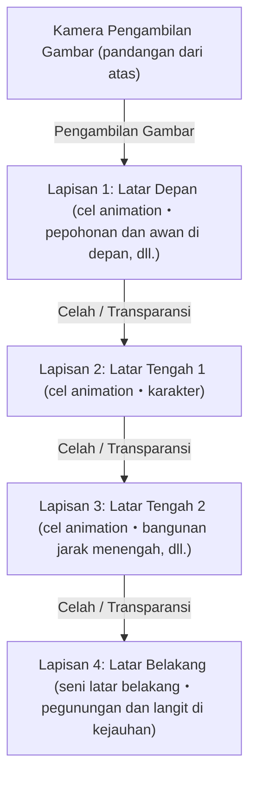

Kamera multiplane adalah sebuah alat di mana beberapa lapisan (tingkat) kaca diletakkan di bawah kamera, dan cel animation serta gambar latar diletakkan di masing-masing lapisan untuk diambil gambarnya. Dengan ini, ketika kamera bergerak (pan, tilt, track up, dll.), dengan mengubah kecepatan pergerakan setiap lapisan, ilusi kedalaman tiga dimensi (paralaks) dapat diciptakan. Teknologi ini sendiri telah digunakan sejak lama oleh Disney dan lain-lain, tetapi pengoperasian kamera multiplane di Ghibli sangat menonjol dalam hal ketelitian dan kerumitannya.

"Adegan terbang" yang sangat penting bagi karya Miyazaki, sangat diuntungkan oleh teknologi ini. Misalnya, dengan mengalirkan lautan awan yang membentang di bawah mata, kapal terbang yang melaju di antaranya, dan daratan yang terlihat di kejauhan pada kecepatan yang berbeda-beda, penonton merasakan sensasi pengenalan ruang dan imersi yang kuat seolah-olah mereka benar-benar sedang terbang di langit. Selanjutnya, melalui teknologi "cahaya tembus (transmitted light)" yang menyinari cahaya dari belakang cel animation, ekspresi gradasi halus menggunakan airbrush, dan pengerahan tenaga menggambar gila-gilaan untuk menggerakkan tumbuh-tumbuhan yang tertiup angin satu per satu menggunakan tangan, angin pun bertiup dan udara mengalir di layar. Di era ketika teknologi digital (CGI) belum ada, mereka menggunakan film fisik, cat, dan keajaiban cahaya untuk membangun ruang virtual yang lebih nyata daripada kenyataan.

## 1.4 "Nausicaä of the Valley of the Wind" (1984): Pencapaian Monumental sebagai Prasejarah dan Kedalaman Ekologi

Dirilis pada tahun 1984, "Nausicaä of the Valley of the Wind" secara resmi merupakan karya produksi "Topcraft" sebelum berdirinya Studio Ghibli. Namun, dibuat dengan jajaran sutradara Hayao Miyazaki dan produser Isao Takahata, karya ini secara substansial diposisikan sebagai "Karya ke-0" atau "Karya ke-1" yang menentukan arah Ghibli di kemudian hari.

Karya ini diangkat dari manga berjudul sama yang diserialkan oleh Hayao Miyazaki sendiri di majalah bulanan "Animage", namun versi filmnya merekonstruksi bagian awal dan menyelesaikannya sebagai cerita mandiri. Pencapaian terbesar "Nausicaä" dalam sejarah animasi adalah bahwa film ini berhasil menggambarkan tema fiksi ilmiah yang sangat berat, yaitu "masalah lingkungan (ekologi)", "martabat kehidupan", dan "kebodohan umat manusia", dalam kerangka hiburan dan dengan keindahan visual yang luar biasa.

Berlatar 1000 tahun setelah peradaban industri runtuh akibat perang akhir yang disebut "Seven Days of Fire (Tujuh Hari Api)". Sebuah dunia di mana hutan jamur bernama "Sea of Decay (Lautan Pembusukan)" yang mengeluarkan miasma (gas beracun) kian meluas dan serangga-serangga raksasa mendominasi. Pengaturan dunia yang penuh keputusasaan ini mencerminkan rasa krisis Miyazaki yang kuat terhadap ketakutan akan perang nuklir selama Perang Dingin dan perusakan lingkungan yang semakin memburuk. Namun, Miyazaki tidak jatuh ke dalam dualisme sederhana "perlindungan alam" vs "kejahatan manusia". Pembalikan besar dalam cerita di mana Sea of Decay sebenarnya adalah sistem untuk memurnikan bumi yang tercemar, menghadapkan kita pada kekuatan penyembuhan diri alam yang mengerikan dan kekerdilan manusia di hadapannya.

Hal yang tak tergantikan saat membicarakan "Nausicaä" dari sisi teknis adalah penggambaran serangga-serangga raksasa, termasuk "Ohmu". Animasi makhluk ganjil dengan banyak segmen dan mata yang bergerak maju bergelombang ini, menghasilkan rasa berat, kengerian, dan semacam keilahian yang luar biasa berkat teknik menggambar khusus menggunakan karet (seperti memotret dengan menggeser bagian cel animation yang terpisah) dan perhitungan waktu yang cermat. Selain itu, pergerakan kain yang terasa menahan angin dalam adegan terbang Mehve (pesawat luncur Nausicaä), dan lintasan mulus yang seolah-olah memvisualisasikan hubungan antara gravitasi dan gaya angkat, memperlihatkan kepada dunia "katarsis terbang" yang menjadi ciri khas sejati animasi Miyazaki.

Desain tokoh utama (heroine) Nausicaä juga inovatif. Ia bukanlah "gadis yang harus dilindungi" belaka, melainkan seorang prajurit yang mengendarai Mehve, menembakkan senjata api, dan mengayunkan pedang sendiri, sekaligus sosok keibuan yang memiliki kasih sayang mendalam terhadap semua kehidupan. Sosok karakter yang kompleks ini, yang memiliki kekuatan dan kelembutan, kemarahan dan kesedihan, menjadi salah satu titik puncak sekaligus titik awal citra pahlawan wanita tidak hanya dalam karya-karya Ghibli berikutnya, tetapi juga dalam fiksi modern.

## 1.5 Pendirian Studio Ghibli dan "Castle in the Sky" (1986): Aksi Petualangan Puncak

Menyusul kesuksesan "Nausicaä", dengan keuntungan sebagai modal, "Studio Ghibli" secara resmi didirikan pada tahun 1985. Tujuan pendiriannya hanya satu: "untuk terus memproduksi animasi panjang bioskop berkualitas tinggi". Berbeda dengan produksi massal yang asal-asalan dari animasi TV, Ghibli lahir sebagai basis independen untuk mengejar kualitas tanpa kompromi.

Dan pada tahun 1986, "Castle in the Sky" dirilis sebagai film animasi panjang peringatan pertama di bawah nama Studio Ghibli. Berdasarkan ide yang telah disusun oleh Hayao Miyazaki sejak masa sekolah dasarnya, karya ini memadukan pulau terapung Laputa dari 'Gulliver's Travels' karya Jonathan Swift sebagai motif, dengan semua elemen utama petualangan aksi klasik (boy meets girl), seperti pertemuan seorang anak laki-laki dan perempuan, batu terbang misterius, bajak laut udara, dan pasukan militer dengan ambisi jahat, menjadikannya mahakarya yang benar-benar bisa disebut sebagai "puncak dari film aksi-petualangan".

Kehebatan "Castle in the Sky" terletak pada daya dorong cerita yang mendebarkan dan obsesi tak lazim pada detail yang tersebar di seluruh penjuru layar. Dari adegan penyerangan geng Dola terhadap kapal terbang (Tiger Moth) di awal, hingga aksi kejar-kejaran Pazu dan Sheeta di Lembah Slag, layarnya selalu "dinamis". Desain mekanik dari Lembah Slag, pergerakan piston mesin uap, putaran roda gigi, dan melesatnya kereta tambang. Mesin dan kendaraan ini bukanlah sekadar latar atau properti, melainkan digambar penuh vitalitas seolah-olah mereka memiliki nyawa sendiri. "Kecintaan pada mesin" Miyazaki dan intensitas gambar yang mencoba mengabadikan bahkan "panas dan bau" yang dipancarkan oleh mesin-mesin itu, memberikan realitas yang luar biasa pada dunia fiksi.

Dalam hal tema, apa yang disajikan oleh "Castle in the Sky" adalah "keterputusan antara teknologi canggih dan manusia", serta "ikatan dengan bumi". Kekuatan sains luar biasa dari Kekaisaran Laputa yang dulunya menguasai dunia pada akhirnya menjadi penyebab kehancuran mereka sendiri. Klimaks film ini, visi sebuah "Pohon Besar" raksasa yang memeluk batu terbang raksasa dari kedalaman Laputa yang runtuh dan naik ke luar angkasa, sangatlah simbolis. Akhir di mana objek buatan yang menjadi simbol teknologi hancur berkeping-keping, dan hanya Pohon Besar yang merupakan simbol kehidupan yang tersisa, diringkas dalam dialog Sheeta: "Berakar di bumi, hidup bersama angin. Melewati musim dingin bersama benih, menyanyikan musim semi bersama burung. Tak peduli seberapa mengerikan senjata yang kau miliki, seberapa banyak robot malang yang kau kendalikan, kau tidak bisa hidup jika terpisah dari bumi." Ini adalah kritik keras Miyazaki terhadap peradaban modern yang berlanjut dari "Nausicaä", dan doa universal untuk kembali ke alam.

Selain itu, kontribusi seni latar belakang oleh direktur seni Toshiro Nozaki dan Nizo Yamamoto dalam karya ini tak ternilai harganya. Keindahan hening dari adegan di mana lautan awan menyingkir dan memperlihatkan taman raksasa yang tertutup lumut dan robot prajurit saat mencapai Laputa, membuktikan bagaimana gambar latar belakang dalam animasi dapat menentukan martabat sebuah karya. Di sinilah terjadi perpaduan sempurna antara penyutradaraan Miyazaki yang dinamis dan seni latar yang statis.

## 1.6 Penutup: Awal Mula Legenda

"Nausicaä of the Valley of the Wind" dan "Castle in the Sky". Dalam dua mahakarya awal ini, Hayao Miyazaki dan Isao Takahata, serta para staf Studio Ghibli, menunjukkan bagaimana mereka mengeluarkan potensi yang dimiliki medium animasi hingga batas maksimum. Memberikan bobot dan tekstur pada mekanik fiksi hasil imajinasi, menghembuskan realitas ke dalam ekosistem imajiner, serta menyisipkan kritik sosial dan tema filosofis yang kompleks ke dalam hiburan yang membuat pria dan wanita dari segala usia menahan napas. Mereka mencapai prestasi luar biasa ini melalui jumlah cel animation yang sangat besar dan kerja manual yang bisa dibilang seperti kegilaan para perajin.

Kedua karya ini mengangkat standar teknis dan ekspresif ke tingkat yang jauh lebih tinggi, dan kemudian berdiri sebagai "tembok besar bernama Ghibli" di dunia animasi Jepang. Dan pada saat yang sama, studio kecil ini kelak akan memicu fenomena budaya global dan menulis ulang sejarah animasi itu sendiri, secara harfiah menjadi "Bab 1" dari sebuah legenda yang epik. Jalan menuju "My Neighbor Totoro", "Grave of the Fireflies", dan "Princess Mononoke", semuanya berawal dari angin "Nausicaä" dan langit "Laputa".

# Bab 2: Persimpangan Sehari-hari dan Luar Biasa——Dunia yang Digambarkan oleh "My Neighbor Totoro", "Grave of the Fireflies", dan "Kiki's Delivery Service"

Saat mengurai sejarah Studio Ghibli, paruh kedua tahun 1980-an adalah periode yang menjadi titik balik yang menentukan. Dari aksi "pedang dan sihir" yang megah atau "petualangan terbang" yang digambarkan dalam film sebelumnya "Castle in the Sky" (1986), Ghibli berbalik arah secara drastis ke arah "keseharian", seperti pemandangan asli pedesaan Jepang atau kehidupan masyarakat kota di negara Barat. Dalam bab ini, kita akan membahas 3 film yaitu "My Neighbor Totoro" dan "Grave of the Fireflies" yang secara ajaib ditayangkan bersamaan pada tahun 1988, serta karya hit besar tahun 1989 "Kiki's Delivery Service", dan membedah secara menyeluruh revolusi teknis dan tematik yang ditorehkan film-film ini dalam sejarah animasi.

## 1. Kegilaan dan Keajaiban Penayangan Bersamaan: Hayao Miyazaki dan Isao Takahata, Dua Versi "Showa"

Pada musim semi 1988, bentuk penayangan yang sangat mustahil dibayangkan saat ini—penayangan bersama "My Neighbor Totoro" dan "Grave of the Fireflies"—terwujud. Ini bukanlah sekadar pengemasan komersial biasa, melainkan kristalisasi "kegilaan dan keajaiban" di mana Studio Ghibli sebagai organisasi, dan terlebih lagi dua kreator jenius Hayao Miyazaki dan Isao Takahata, saling memercikkan api.

### 1-1. Kehidupan dan Kematian yang Saling Bertolak Belakang
"My Neighbor Totoro" berlatar desa pertanian di Jepang pada tahun 30-an era Showa (1950-an), dan merupakan pujian bagi kehidupan yang menggambarkan interaksi antara roh alam dan anak-anak. Di sisi lain, "Grave of the Fireflies" berlatar di Kobe sekitar akhir perang pada tahun 20 era Showa (1945), dan menggambarkan kenyataan mengerikan dari kakak beradik yang kehilangan nyawa mereka di tengah api peperangan dengan realisme yang mendalam. Walaupun pengaturan zamannya hanya terpaut sekitar 10 tahun, kedua karya ini merangkum tema yang sepenuhnya saling bertolak belakang: "kehidupan dan kematian" serta "fantasi yang diidealkan dan realitas yang kejam".

Studio Ghibli pada saat itu menerapkan sistem produksi yang hampir bisa disebut sembrono dengan menjalankan dua bakat raksasa secara bersamaan. Terjadi perebutan staf animator, dan jadwal produksi berada di ambang kehancuran. Namun, sebagai hasilnya, lingkungan yang keras ini mendorong kualitas kedua karya ke titik maksimumnya. Hayao Miyazaki membangun dunia "Totoro" di mana kekuatan kehidupan bawah sadar berdenyut dengan lebih kuat, sebagai antitesis terhadap realisme menyeluruh Isao Takahata, dan Takahata mengangkat ekspresi animasi Jepang ke dimensi dokumenter untuk menandingi fantasi karya Miyazaki.

### 1-2. Pembedaan Penggambaran Showa dan Lahirnya "Animasi Dokumenter"
Penyutradaraan Isao Takahata dalam "Grave of the Fireflies" menghancurkan tata bahasa animasi konvensional. Lintas jatuh bom pembakar akibat pengeboman B-29, goyangan nyala api di rumah-rumah yang terbakar, dan yang terpenting, perubahan fisik Seita dan Setsuko yang semakin melemah akibat kelaparan. Untuk mengekspresikan hal ini, desainer warna Michiyo Yasuda dan kawan-kawan sangat menekankan "warna coklat tua berlumpur, berdarah, dan berjelaga" yang tidak bisa sepenuhnya diekspresikan dengan warna animasi konvensional.

Sebaliknya, dalam "My Neighbor Totoro", Hayao Miyazaki merekonstruksi "Jepang indah yang mungkin pernah ada" dari dalam ingatannya. Itu bukanlah sekadar lukisan realistis, melainkan sebuah percobaan untuk menangkap "kilauan" dunia dari sudut pandang anak-anak di atas cel animation. Pembedaan penggambaran kedua versi "Showa" ini memaksimalkan spektrum ekspresi yang bisa ditunjukkan oleh medium animasi dan menjadi tonggak monumental dalam sejarah film Jepang.

## 2. Revolusi Seni Latar Belakang: Kazuo Oga dan Nizo Yamamoto Menciptakan "Udara dan Kelembaban"

Daya persuasi luar biasa yang dimiliki oleh karya Ghibli sangat bergantung tidak hanya pada akting karakternya, melainkan juga kekuatan seni latar belakang yang membentang di belakangnya. Pada masa ini, seni latar belakang Studio Ghibli telah mencapai puncaknya.

### 2-1. Atmosfer Lembab dari "Hutan Totoro" Karya Kazuo Oga
Tidak berlebihan jika dikatakan bahwa kontribusi Kazuo Oga, yang ditunjuk sebagai direktur seni untuk "My Neighbor Totoro", telah mengubah sejarah seni animasi Jepang. Alam yang digambar Oga secara maksimal memanfaatkan karakteristik poster color (cat poster). Walaupun menggunakan poster color yang opak dan bukannya cat air transparan, melalui takaran air dan sentuhan kuas yang pas, ia berhasil mengekspresikan "kelembaban" yang khas dari iklim Jepang, "bau rumput yang menyengat", dan bahkan "suhu cahaya matahari yang menembus dedaunan".

Secara khusus, latar belakang pemandangan saat Satsuki dan Mei bertemu Totoro di halte bus saat hujan sangatlah menakjubkan. Tekstur aspal yang basah oleh hujan, kedalaman hutan kuil pelindung yang tenggelam dalam kegelapan, dan lapisan udara yang diciptakan oleh cahaya lampu jalan. Seni Oga bukanlah sekadar "tiruan lanskap", melainkan keajaiban visualisasi "informasi kasat mata" seperti angin yang berhembus, suhu, dan kelembaban.

### 2-2. Kerinduan akan Barat dan Realisme Arsitektur
Di sisi lain, kota Koriko yang menjadi latar belakang "Kiki's Delivery Service" adalah kota fiktif yang diciptakan dengan memadukan elemen-elemen dari berbagai kota di Eropa, seperti Stockholm dan Visby di Pulau Gotland, Swedia, serta Lisbon, Paris, dan lain-lain. Seni latar belakang di sini memiliki arah yang berlawanan dari "Totoro" yang menggambarkan lanskap Jepang.

Bangunan-bangunan batu khas Eropa, rentetan atap genteng, dan jalan menanjak menuju laut. Untuk menggambar semua ini dengan daya persuasi, para staf seni Ghibli melakukan observasi lokasi (location hunting) dan mempelajari struktur arsitektur dengan sangat rinci. Bahkan untuk satu tekstur batu, mereka menghitung tingkat pelapukan dan tingkat refleksi cahaya matahari, lalu menerjemahkannya ke dalam warna yang terlihat paling indah sebagai latar belakang animasi. Kekuatan seni yang tidak membiarkan "kerinduan akan Barat" ini berakhir sekadar fantasi, melainkan menampilkannya sebagai ruang hidup tempat orang-orang benar-benar hidup dan bekerja di dunia nyata, sangatlah mencengangkan.

## 3. Tema Modern dalam "Kiki's Delivery Service": "Tenaga Kerja dan Kemerosotan (Slump)"

Saat perilisannya, "Kiki's Delivery Service" mendapat dukungan luar biasa dari banyak pemuda, terutama dari para perempuan pekerja. Alasannya karena film ini, meskipun secara permukaannya berbalut fantasi "kisah pertumbuhan seorang gadis penyihir", pada intinya adalah drama yang sangat nyata dan universal mengenai "kerja dan bakat (kemerosotan)".

### 3-1. Momen saat Bakat Berubah Menjadi "Pekerjaan"
Tokoh utama Kiki menggunakan bakat sihir "terbang di langit" sejak lahir untuk memulai layanan jasa pengiriman. Ini sangat selaras dengan proses yang dialami oleh para kreator atau pekerja lepas (freelance) modern di mana mereka mulai menggunakan keahlian khusus atau bakat mereka sebagai "modal" untuk berpartisipasi dalam masyarakat. Di awal cerita, terbang di langit adalah sebuah kegembiraan dan ekspresi diri bagi Kiki. Namun, saat itu menjadi "pekerjaan", ia dihadapkan pada tuntutan yang tidak masuk akal dari klien (seperti dalam episode pai ikan haring), dan setelah ia mulai menerima uang sebagai imbalannya, arti sihir perlahan berubah di dalam dirinya.

### 3-2. Kemerosotan (Slump) dan Kehilangan Identitas
Di pertengahan cerita, Kiki tiba-tiba kehilangan kekuatan sihirnya, tidak bisa terbang di langit, dan bahkan tidak bisa memahami perkataan kucing hitamnya, Jiji. Ini adalah gejolak identitas seorang gadis di masa pubertas, dan pada saat yang sama merupakan metafora yang sempurna dari "kekeringan bakat (slump)" yang dihadapi oleh para kreator.

Di sinilah peran Ursula, seorang siswi pelukis yang sedang melukis di pondok di hutan, menjadi sangat penting. Ursula berkata kepada Kiki, "Di saat seperti itu, kita cuma bisa meronta-ronta", "Gambar, gambar, teruslah menggambar", "Kalau masih tidak bisa juga, berhentilah menggambar. Jalan-jalan kek, lihat pemandangan kek, tidur siang kek, jangan lakukan apa-apa". Kata-kata ini adalah penderitaan yang dialami oleh semua orang yang terlibat dalam aktivitas ekspresi seni, termasuk para animator bahkan Hayao Miyazaki sendiri, dan sekaligus resep obat untuk mengatasi hal itu.

### 3-3. Tekad untuk "Terbang dengan Darah"
Mengenai lukisannya sendiri, Ursula bercerita bahwa, "Dulu aku bisa menggambar tanpa perlu memikirkan apa-apa, tapi sekarang tidak lagi. Aku harus menggambar lukisanku sendiri." Sihir Kiki pun sama. Era di mana ia dapat terbang tanpa sadar hanya dengan bakat lahirnya telah berakhir, dan ia kini harus "memperoleh kembali" sihir itu melalui tekad dan usahanya sendiri. Di klimaks cerita, adegan di mana Kiki mengangkangi sapu lidi dan melesat ke langit dengan ekspresi putus asa, bukan lagi fantasi yang elegan. Itu adalah gambaran sesungguhnya dari seorang profesional yang menghadapi batas kemampuannya sendiri dan menggunakan "keterampilannya" dengan tekad hingga batuk berdarah.

## 4. Struktur dan Keterkaitan Tema

Meskipun sekilas 3 karya ini memiliki latar dunia masing-masing yang berdiri sendiri, jika dilihat melalui poros karya-karya penulis Ghibli, ada kesinambungan yang jelas serta persimpangan tema yang ada.

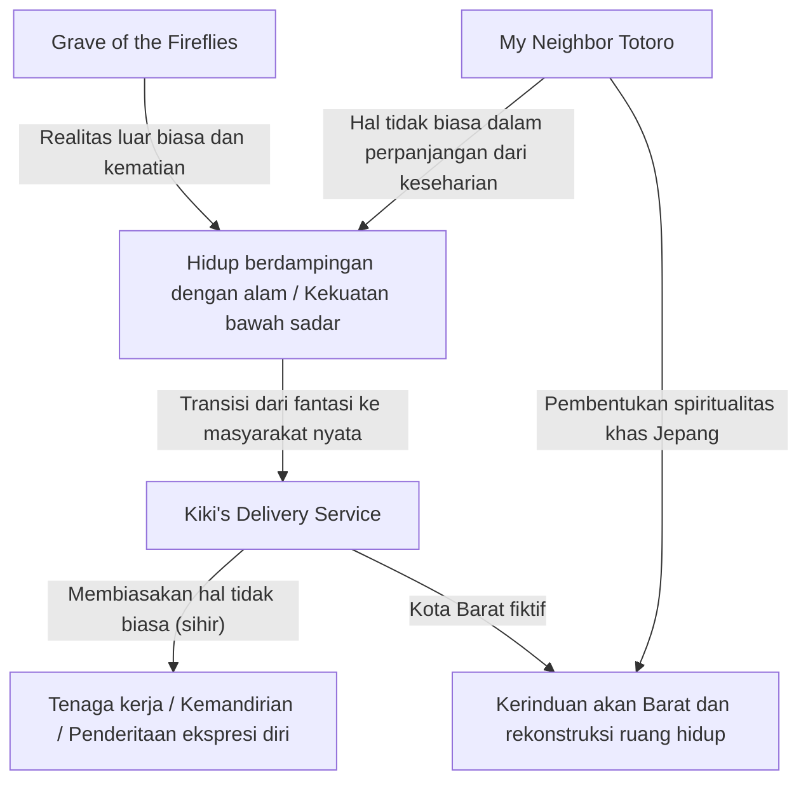

"Hal tidak biasa (fantasi) yang tersembunyi di dalam keseharian" yang dihadirkan oleh "Totoro" mendapat mitologi yang jauh lebih kuat ketika dikontraskan dengan realisme ekstrem dari "Grave of the Fireflies". Kemudian, teknik ekspresi dan animasi yang telah mapan di sana menjadi senjata yang ampuh dalam "Kiki's Delivery Service" untuk menggambarkan tema yang paradoks yaitu "bagaimana makhluk yang tidak biasa (penyihir) perlahan-lahan membaur ke dalam keseharian (dunia kerja) masyarakat modern".

## 5. Kesimpulan: Batu Loncatan Menuju Tahap Berikutnya

Selama periode dari 1988 hingga 1989 ini, Studio Ghibli telah menjelajahi setiap batas yang bisa digambarkan oleh animasi: "kehidupan dan kematian", "Jepang dan Barat", "fantasi dan realisme", serta "bakat dan kerja" hanya dalam waktu beberapa tahun singkat. Keterampilan yang dikembangkan di sini untuk dengan cermat mengamati dan menggambarkan akting dari kehidupan sehari-hari, ditambah dengan kekuatan seni latar belakang untuk menyematkan udara dan emosi ke dalam pemandangan, kemudian diwariskan kepada karya-karya bertema lebih kompleks dan dewasa seperti "Only Yesterday" (1991) dan "Porco Rosso" (1992).

Tiga karya yaitu "My Neighbor Totoro", "Grave of the Fireflies", dan "Kiki's Delivery Service" bukanlah sekadar sederetan karya besar semata. Ketiganya adalah monumen sejarah yang merekam momen perkembangan yang paling menggebu dan paling menyakitkan, saat medium ekspresi animasi menetas dari hiburan anak-anak menjadi sebuah "seni komprehensif" yang menggambarkan bahkan jurang terdalam semangat manusia dan penderitaan struktural dari masyarakat.

# Bab 3: Kerinduan pada Penerbangan dan Romansa Orang Dewasa——Puncak Realisme dalam "Porco Rosso" dan "Whisper of the Heart"

Melihat kilas balik sejarah Studio Ghibli, film "Porco Rosso" (1992) dan "Whisper of the Heart" (1995) yang dirilis dari awal hingga pertengahan tahun 1990-an mungkin pada pandangan pertama terlihat sebagai film yang bertolak belakang. Yang pertama adalah film fantasi berlatar Laut Adriatik, menggambarkan pertempuran dan kesedihan seorang penerbang bayaran yang berubah menjadi babi akibat sebuah kutukan. Sedangkan yang kedua adalah drama remaja berlatar belakang Tama New Town (Kota Baru Tama) di masa kini, yang menggambarkan kepolosan cinta dan kegelisahan akan masa depan siswa-siswi sekolah menengah pertama.

Namun, di bawah permukaan dari kedua karya ini, mengalir keinginan pencarian yang tak terpuaskan dari Studio Ghibli, atau lebih tepatnya dari para kreator jenius Hayao Miyazaki dan Yoshifumi Kondo, untuk mengejar batas maksimal dari "realisme (kenyataan)" melalui media animasi. Dan pada dasarnya, terdapat kerinduan yang sangat kuat akan "penerbangan"—terbang secara fisik di angkasa, atau melampaui batas diri dan membuat lompatan spiritual. Dalam bab ini, kita akan menggali lebih dalam dari sisi latar belakang historis dan teori teknis, tentang bagaimana dua karya ini menempati posisi unik dalam sejarah animasi, dan inovasi teknis serta pencapaian tematik apa yang telah berhasil mereka capai.

## 1. "Porco Rosso"——Puncak Aerodinamika dan Lagu Kesedihan untuk Era yang Hilang

"Porco Rosso" (Judul Asli: Il Porco Rosso) memiliki asal mula yang unik: proyek ini pada awalnya direncanakan sebagai film pendek untuk diputar di dalam penerbangan Japan Airlines, namun berkembang menjadi film layar lebar ketika dibayangi kenyataan kelam akan Perang Yugoslavia. Karya ini memiliki sentuhan yang sangat personal, diciptakan oleh Hayao Miyazaki untuk dirinya sendiri dan sebagai "film untuk para pria paruh baya yang otaknya telah kelelahan dan menjadi seperti tahu".

### 1.1 Hayao Miyazaki dan Pesawat Terbang: Fetisisme Mekanik dan Penggambaran Aerodinamika yang Cermat

Obsesi Hayao Miyazaki akan "terbang" memang sudah terkenal, tetapi penggambaran kapal terbang dalam "Porco Rosso" adalah bentuk paling murni dari ekspresi fetisisme mekanik pribadinya dan pemahamannya yang mendalam terhadap aerodinamika. Kapal terbang yang muncul dalam karya ini—Savoia S.21 berwarna merah tua, pesawat kesayangan sang tokoh utama Porco Rosso (meskipun ini aslinya karya orisinal hasil perpaduan elemen pesawat nyata seperti Macchi M.33 dan Savoia-Marchetti S.59), pesawat pesaingnya yaitu Curtiss, maupun berbagai jenis armada udara bajak laut—semuanya bukan sekadar latar atau properti, melainkan bergerak lincah dan berjiwa layaknya karakter yang mandiri.

Yang perlu digarisbawahi secara khusus adalah, "kebohongan dan kebenaran hukum fisika" dalam animasi telah dikontrol dengan keseimbangan yang sempurna, mulai dari hambatan udara, gaya angkat, torsi baling-baling, getaran mesin, bahkan hingga penggambaran hidrodinamika air ketika pesawat lepas landas dan mendarat di permukaan air.

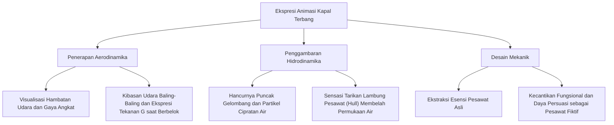

Pada adegan saat Savoia milik Porco menyalakan mesin, dari silinder yang dihidupkan, bodi pesawat yang mulai bergetar pelan, hingga saat asap hitam keluar dari pipa knalpot—seluruh rentetan proses ini ditampilkan melalui getaran detail gambar cel dan pencahayaan berganda (teknik pembuatan film analog kala itu). Dalam sekuens pertempuran udara (dogfight), beban fisik yang dirasakan tubuh sang pilot akibat menahan gaya gravitasi (G) ketika pesawat berbelok dengan tajam, lalu tuas kemudi (joystick) dan pedal (rudder pedals) yang sedikit digeser saat pesawat dikendalikan hampir stall—hal ini direkam dalam hitungan (pembagian bingkai per detik) dengan waktu yang super presisi. Ini adalah hasil dari menjiplak sempurna "sensasi fisik penerbangan" dari dalam pikiran Miyazaki ke gulungan seluloid oleh tangan-tangan para animator ahli.

### 1.2 Penentangan terhadap Fasisme dan Anarkisme yang Bergema di Langit Laut Adriatik

Latar film ini berada di Laut Adriatik, Italia pada akhir 1920-an. Secara latar belakang era, film ini berlangsung di masa gejolak sekaligus kecemasan saat bayang-bayang Perang Dunia I membekas, dan Partai Fasis pimpinan Mussolini mulai bangkit menuju puncak kekuasaan. Porco Rosso (nama aslinya Marco Pagot) dahulunya adalah pilot jagoan Angkatan Udara Italia, tetapi ia lalu merasa putus asa terhadap sistem negara dan kemiliteran. Dia pun mengutuk dirinya sendiri agar menjelma menjadi babi, lalu memilih jalur hidup sebagai pemburu bayaran di luar hukum yang bebas berpendapat (anarkis).

Kutipan terkenal Porco yang berbunyi, "Lebih baik jadi babi daripada menjadi fasis," sama sekali tidak sekadar gaya bahasa macho khas "Hardboiled". Kalimat tersebut mewakili protes tajam anti-fasisme dan anarkisme Miyazaki secara langsung—yakni menolak masuk ke dalam perangkat pemaksa kekuatan besar bernama Negara, sekaligus berupaya menegaskan hak dan harga diri manusia yang merdeka di ruang udara yang terbebas dari wilayah kenegaraan.

Mendekati akhir film, adegan saat Porco dan kawan seperjuangannya di masa lalu, Ferrarin (yang sekarang telah menjadi mayor Angkatan Udara Fasis), mengadakan pertemuan sembunyi-sembunyi di gedung bioskop adalah salah satu adegan paling politis dalam film ini. Ferrarin mengeluhkan bahwa "Kami harus terbang atas nama negara, bangsa, atau para sponsor konyol semacamnya." Pada titik ini, kebahagiaan murni terbang bebas di udara disorot sangat kontras dan dengan tajam diungkapkan, menjadi sekadar ideologi suatu negara, bahkan beralih menjadi alat peperangan. Tidak ada penjelasan konkret mengapa Porco dapat berubah jadi babi, tetapi wujud ini memperlihatkan keputusasaannya yang begitu dalam menyaksikan manusia saling membunuh satu sama lain tanpa henti di dunia ini, menjadikannya sarana agar bebas secara emosi menjauhi pergaulan lingkungan yang suka berkuasa; wujud tersebut juga bisa dijelaskan lewat paradoks "kau tidak akan bisa menjunjung tinggi martabat kemanusiaanmu, kalau terus hidup bagaikan seorang manusia".

### 1.3 "Babi yang tidak bisa terbang, hanyalah babi biasa."——Romansa, Kekecewaan, dan Kutukan Pria Paruh Baya

Hal yang sangat menyentuh dan selalu terngiang dalam hati banyak orang dewasa mengenai "Porco Rosso", adalah kenyataan bahwa film ini sebenarnya merupakan lagu kesedihan yang menyayat hati tentang "hal-hal yang telah hilang". Porco menyimpan perasaan kehilangan yang mendalam dan *survivor's guilt* (rasa bersalah sebagai penyintas) kepada kawan seperjuangannya di masa lalu yang kehilangan nyawa dalam Perang Dunia Pertama (adegan ilusi pesawat-pesawat yang naik ke hamparan awan adalah salah satu adegan terbaik dalam sejarah sinema).

Seperti yang disimbolkan oleh nyanyian chanson Gina "Waktu Cherry Memerah (Le Temps des cerises)" (yang dikenal sebagai lagu mengenang jatuhnya Komune Paris), film ini penuh dengan nostalgia mendalam atas hari-hari baik yang telah berlalu, masa muda yang tak akan pernah bisa diraih lagi, dan kehilangan yang tidak bisa dikembalikan lagi. Kisah cinta orang dewasa antara Porco dan Gina yang telah matang, tetapi selalu dibatasi jarak yang tak akan pernah bisa dijembatani, menduduki posisi unik dalam karya-karya Ghibli. Porco terkadang menghindari kasih sayang Gina ataupun pelibatan diri ke kenyataan kehidupan bersosial dengan memakai "kutukan" sebagai alasannya. Di balik slogan film ini, "Ini yang namanya keren (Kakkoii towa, kou iu koto sa)," tersembunyi penerimaan diri yang getir dari "seorang pria paruh baya"—yakni kesepian karena selalu setia berkorban pada rasa keindahannya sendiri, dan bagaimana menerima bagian dirinya yang perlahan menjadi makin kuno termakan usia.

## 2. "Whisper of the Heart"——Realisme Pahit Pubertas dan Keajaiban Ruang

"Whisper of the Heart" yang dirilis pada tahun 1995, adalah monumen karya yang naskah cerita, papan cerita, serta produksinya dipegang penuh oleh Hayao Miyazaki, sementara satu-satunya posisi sutradara untuk film durasi layar lebar diberikan kepada Yoshifumi Kondo, seorang animator inti dari Studio Ghibli. Meski berdasarkan adaptasi manga "shoujo" karya Aoi Hiiragi yang berjudul sama, campur tangan Miyazaki dan Kondo telah membawanya lebih dari sekadar kisah romansa konvensional, meraciknya dengan halus menjadi cerminan remaja sejati yang diwarnai penderitaan menuju jenjang ke depan, keraguan, dan kebimbangan mencapai jati diri yang baru mekar.

### 2.1 Tatapan Yoshifumi Kondo: Esensi Animasi yang Menetap pada Sikap Kehidupan Sehari-hari

Daya tarik utama dan pencapaian teknis dari karya ini adalah ketelitian sutradara Yoshifumi Kondo terhadap "akting sehari-hari". Dalam animasi, jauh lebih sulit untuk menggambar gerakan yang nyata dengan penjiwaan dari "tindakan sehari-hari biasa" secara akurat—seperti orang yang sedang berjalan, duduk, menyeduh teh, hingga berlari naik tangga—daripada menampilkan animasi adegan "luar biasa (spektakuler)" yang digerakkan oleh pertempuran sihir dan ledakan robot belaka.

Yoshifumi Kondo pernah bertugas sebagai pengarah animasi (Animation Director) dalam mahakarya karya sutradara Isao Takahata (seperti "Grave of the Fireflies", "Only Yesterday", dll). Kondo adalah "ahli pemeranan hidup", di mana setiap garis dan gerak otot karakter di layar, bergesernya pusat gravitasi karakter ketika bergerak ke area lain, sampai pada psikologis terpendam bisa direfleksikan ke pergerakan secara pas. Dalam "Whisper of the Heart", keterampilan observasi luar biasa ini terbukti telah dipraktikkan tanpa cela sedikit pun.

Sebagai contoh, perubahan postur tubuh saat sang tokoh utama Shizuku Tsukishima sedang membaca buku di dalam perpustakaan, lalu langkah kaki kala sedang buru-buru menuruni tangga rumah, atau saat terjadi interaksi sarat luapan cinta dan rasa jengkel yang tak kasatmata yang bergantian tercampur dari pandangan dan bahu yang diangkat ketika menghadapi Seiji Amasawa. Serpihan demi serpihan mikro-animasi di sini menyuguhkan kesan keberadaan nyata, serasa Shizuku benar-benar berada di tempatnya dengan hela napas kehidupannya sendiri. Dibandingkan dengan kesenangan lepas landas ke alam fantasi melalui animasi Miyazaki, ini murni saripati sejati animasi yang mengakar pada pemahaman akan pergerakan kehidupan di dunia riil mengenai "kehidupan manusia" secara berpijak.

### 2.2 Pencarian Lokasi dan Penataan Ruang Lingkungan: Tama New Town Sebagai "Kota yang Hidup"

Karakter utama lain dari karya ini adalah kota itu sendiri sebagai latar panggung ceritanya. Berdasarkan pencarian lokasi yang ekstensif dan cermat yang dipandu oleh sekitar Stasiun Seiseki-Sakuragaoka di Tokyo (seputaran pinggiran kota dari "Kota Baru Tama"), karya rancangan ini memiliki penuangan realitas yang fantastis sehingga mampu diramu dalam komposisi latar dunia.

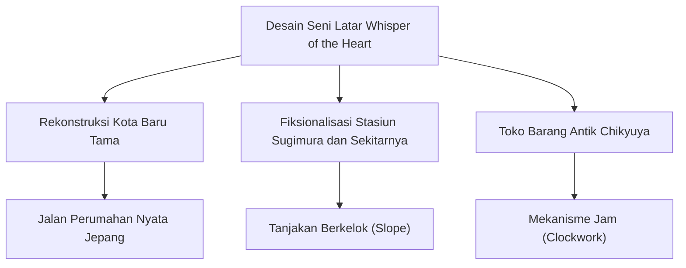
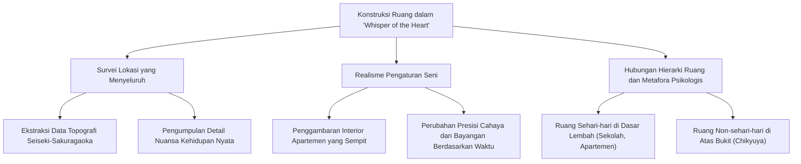

Gambar latar belakang oleh sutradara seni Satoshi Kuroda dan rekan-rekannya dengan apik menggambarkan tekstur beton anorganik dari apartemen (danchi), lereng yang curam, gang-gang sempit, dan pemandangan kota di waktu senja. Hal yang patut mendapat perhatian khusus adalah penggambaran "apartemen sempit" tempat Shizuku tinggal. Buku-buku yang meluap, meja makan yang berantakan, serta kamar sempit untuk dua saudari dengan ranjang susun. Penggambaran ruang kehidupan yang nyata, terasa menyesakkan (namun tetap memberikan kehangatan) ini, mendukung dahaga Shizuku untuk terbang, yaitu "ingin keluar dari sini dan pergi ke dunia yang lebih luas" (= dorongan untuk menulis cerita).

Selain itu, topografi kota (perbedaan ketinggian) berfungsi dengan sangat baik sebagai metafora psikologis. Keseharian Shizuku (sekolah dan apartemen) berada di "bawah", sedangkan toko barang antik "Chikyuya" yang ia temukan dengan panduan kucing misterius (Moon) berada di "atas bukit" setelah menaiki tanjakan yang curam. Perbedaan ketinggian ini secara langsung mengekspresikan secara visual ambisi spiritual Shizuku untuk naik, dan kesulitan dalam melangkah ke wilayah yang tidak diketahui.

### 2.3 Sumber Panas untuk Penciptaan dan Rasa Sakit Pencapaian Diri: "Penerbangan Batin" yang Dipandu oleh Baron

'Whisper of the Heart' bukan hanya sebuah film romantis, tetapi sekaligus merupakan sebuah "kisah pencerahan diri seorang kreator" yang intens. Berhadapan dengan Seiji yang hendak belajar di Italia (terbang) dengan tujuan yang jelas sebagai perajin biola, Shizuku yang merasa cemas mulai menulis cerita (novel fantasi yang merupakan kisah di dalam kisah 'Whisper of the Heart') untuk memastikan "batu permata kasar" yang ada di dalam dirinya.

Hal yang menarik di sini adalah, di dalam dunia cerita buatannya, disisipkan sekuens di mana Shizuku "terbang di langit" bersama Baron sang kucing bangsawan. Adegan fantastis yang latar belakang seninya digarap oleh pelukis Naohisa Inoue—yang dikenal dengan "Iblard"—ini, bertolak belakang dengan penerbangan fisik dalam 'Porco Rosso', dan menggambarkan "penerbangan batin" sebagai pembebasan imajinasi.

Namun, karya ini tidak berakhir hanya sebagai cerita mimpi belaka. Setelah Shizuku selesai menulis novelnya tanpa tidur maupun istirahat, lalu meminta pemilik Chikyuya membacanya, ia menyadari dengan pedih bahwa karyanya masih sangat kasar dan belum matang, kemudian ia menangis tersedu-sedu. Kepedihan dari adegan saat ia berhadapan dengan tembok kejam penciptaan, dan menyadari batas bakatnya sendiri (bahwa sebagai batu kasar ia tidak akan bersinar), menusuk hati semua orang yang terlibat dalam dunia penciptaan. Hayao Miyazaki dan Yoshifumi Kondo menghindari penggambaran kesuksesan yang mudah, dan melalui sosok seorang gadis sekolah menengah pertama, mereka melukiskan etika perajin yang keras bahwa "meski begitu, (kita) harus terus mengasah dan memolesnya".

## 3. Kesimpulan: Pesawat Terbang dan Biola, Kisah Masing-Masing "Perajin"

'Porco Rosso' dan 'Whisper of the Heart'. Seekor babi paruh baya yang terbang melintasi langit Laut Adriatik, dan seorang murid sekolah menengah pertama yang mengayuh sepedanya menaiki bukit di Tama New Town. Sekilas dua kisah yang tampaknya tidak memiliki titik temu ini, terhubung kuat oleh poros "penghormatan terhadap sifat pengerajin".

Fio dari Perusahaan Piccolo serta para pekerja wanita yang memperbaiki dan meningkatkan pesawat kesayangan Porco dengan sempurna. Dan juga Seiji yang bekerja keras dalam pelatihan pembuatan biola di Cremona, serta pemilik Chikyuya yang terus memperbaiki jam antik. Karya-karya Ghibli secara konsisten telah menyanyikan pujian tertinggi kepada para "perajin (artisan)" yang menciptakan sesuatu dengan tangan mereka sendiri dan terus mengasah keterampilan mereka.

Sebagaimana Porco yang berjuang untuk melindungi kebebasan di langit, Shizuku juga mengambil senjata berupa kata-kata untuk merajut suara batinnya sendiri (ceritanya). "Penerbangan" fisik dan "Lompatan" oleh imajinasi. Meskipun metode ekspresinya berbeda, puncak realisme yang dicapai oleh Studio Ghibli pada masa ini telah membakar ke dalam film sebuah visual yang menakjubkan dari kehendak luhur manusia yang melawan gravitasi dunia nyata (keterikatan sosial dan keterbatasan diri), namun tetap berusaha untuk terbang lebih tinggi. Pada bab berikutnya, kita akan membahas konflik antara alam dan manusia dalam karya epik yang belum pernah ada sebelumnya, yang dilahirkan dari bersatunya realisme dan naturalisme ekstrem dengan imajinasi mitologis ini: 'Princess Mononoke'.

# Bab 4: Ekologi dan Imajinasi Mitologis (Princess Mononoke)

'Princess Mononoke', yang dirilis pada tahun 1997, merupakan prototipe monumental yang menjadi batas air (titik balik) yang jelas dalam karier Studio Ghibli dan sutradara Hayao Miyazaki. Karya ini tidak hanya sekadar melampaui batas film animasi, namun juga membawa dampak budaya dan industri yang sangat besar, yang cukup untuk menulis ulang sejarah perfilman Jepang itu sendiri. Dalam bab ini, kita akan mengungkap dengan sangat mendetail tema-tema berlapis yang dimiliki karya ini——dekonstruksi sejarah abad pertengahan Jepang, fase baik-buruk yang non-dualis, serta perpaduan antara CG (Computer Graphics) sebagai titik balik teknologis dengan animasi cel tradisional.

## 1. Konteks Industri: Ledakan Biaya Produksi dan Pembaruan Rekor Box Office

Produksi 'Princess Mononoke' adalah proyek raksasa yang belum pernah terjadi sebelumnya bagi Studio Ghibli, mempertaruhkan nasib perusahaan tersebut. Sejak awal, sutradara Hayao Miyazaki menghadapinya dengan tekad bahwa "ini mungkin menjadi karya terakhir sebelum pensiun," dan prinsip ke-sutradaraan-nya yang tanpa kompromi ini membuat periode produksi dan anggaran membengkak tanpa batas. Total biaya produksi dikatakan mencapai sekitar 2 miliar yen, yang merupakan angka di luar nalar untuk film Jepang pada masa itu. Jumlah gambar mencapai sekitar 144.000 lembar, yang setara dengan 2 hingga 3 kali lipat dari film animasi layar lebar biasa.

Untuk memulihkan risiko besar ini, produser Toshio Suzuki melancarkan bauran media dan strategi periklanan dalam skala yang belum pernah ada sebelumnya. Kalimat slogan yang mencolok, "Hiduplah." (Ikiro.), oleh Shigesato Itoi berfungsi sebagai sebuah jawaban atas suasana yang penuh sesak dan bernuansa akhir abad yang menyelimuti masyarakat Jepang pada masa itu (trauma tahun 1995 seperti Gempa Bumi Besar Hanshin-Awaji dan Insiden Sarin di Kereta Bawah Tanah Tokyo).

Alhasil, karya ini mencatat jumlah penonton sebesar 14,2 juta dan meraup pendapatan box office sebesar 19,3 miliar yen. Hal ini secara signifikan memecahkan rekor pendapatan box office sepanjang masa untuk film Jepang pada waktu itu (rekor yang sebelumnya dipegang oleh 'E.T.'), serta memantapkan posisi Studio Ghibli sebagai pembuat "film nasional" di Jepang. Kesuksesan industri ini membuktikan bahwa animasi Jepang bisa menjadi bisnis raksasa meskipun menangani tema-tema yang berat untuk orang dewasa, dan memberikan pengaruh besar pada model bisnis industri anime di masa mendatang.

## 2. Latar Waktu dan Rekonstruksi Mitologis: Mengapa Zaman Muromachi?

Hayao Miyazaki dengan sengaja memilih "Zaman Muromachi", periode transisi dalam sejarah Jepang, sebagai latar untuk karya ini. Pemilihan Zaman Muromachi yang penuh dengan kekacauan, bukannya Zaman Edo (di mana sistem kelas menjadi kaku, dan masyarakatnya damai serta terkendali) atau Zaman Sengoku (perebutan kekuasaan para panglima perang) yang sering digambarkan oleh drama sejarah konvensional, memiliki niat filosofis yang mendalam.

Zaman Muromachi adalah masa di mana transisi dari masyarakat yang berpusat pada pertanian ke ekonomi uang, perkembangan industri kerajinan tangan, dan di atas segalanya, "keunggulan teknologi manusia atas alam" mulai muncul dengan jelas. Produksi besi (tatara-buki) dilakukan secara bersungguh-sungguh, dan seiring dengan itu deforestasi semakin maju, sementara di sisi lain masih terdapat hutan perawan yang lebat di pegunungan, dan diyakini bahwa para dewa benar-benar ada. Dengan kata lain, itu adalah zaman batas (borderline) di mana manusia dan alam, atau zaman modern dan pra-modern bertabrakan dan berkonflik secara keras.

Sangat dipengaruhi oleh penelitian sejarawan Yoshihiko Amino mengenai "orang-orang non-agraris (perajin, pedagang, pelacur, seniman, dll)" (seperti konsep muen, kugai, raku), Miyazaki mendekonstruksi pandangan sejarah Jepang konvensional yang homogen sebagai "Negara Mizuho" (Tanah yang Kaya akan Padi). Kota Besi (Tatara-ba) yang muncul dalam film tersebut digambarkan sebagai semacam suaka (tempat perlindungan/wilayah bebas) yang tidak tunduk pada kekuasaan kaisar maupun daimyo. Di sana, para penderita kusta (orang sakit) atau perempuan yang dijual, yang telah didorong ke pinggiran masyarakat, menjadi mandiri melalui kemampuan teknologis yang tinggi dalam memproduksi besi, dan membangun utopia mereka sendiri.

Dengan demikian, 'Princess Mononoke' bukanlah sekadar fantasi belaka, melainkan upaya untuk menyoroti sisi gelap sejarah dan merekonstruksi identitas serta pandangan terhadap alam dari masyarakat Jepang, mulai dari level mitos.

## 3. Nona Eboshi dan San: Non-dualisme Kebaikan dan Kejahatan

Hal paling terobosan dari karya ini terletak pada peninggalan total terhadap paradigma konvensional ala Hollywood atau Disney tentang "memberi penghargaan pada yang baik dan menghukum yang jahat". Mereka tidak menghukum manusia, yang berada di pihak yang merusak alam, dengan cap sekadar sebagai "penjahat", namun sebaliknya, menggambarkan aktivitas kehidupan dan martabat manusia dengan sangat kuat.

Simbolnya adalah pemimpin Tatara-ba, yaitu Nona Eboshi (Eboshi Gozen). Ia adalah dalang dari kerusakan alam yang membunuh dewa-dewa gunung dan membuka hutan, tetapi di saat yang sama ia adalah seorang humanis yang luar biasa dan seorang revolusioner yang melindungi kaum lemah yang ditelantarkan oleh masyarakat, serta memberi mereka tujuan hidup dan martabat. Eboshi sama sekali tidak merusak hutan untuk kepentingan pribadinya. Agar manusia bisa keluar dari kemiskinan dan diskriminasi serta bertahan hidup secara mandiri, tidak ada pilihan lain selain menaklukkan alam dan memproduksi besi. Kontradiksi bahwa "motif yang baik pada akhirnya melanggar wilayah pihak lain (alam)" ini, tidak lain adalah esensi dari karma manusia.

Di sisi lain, San (Princess Mononoke) adalah seorang gadis yang dibuang oleh manusia dan dibesarkan oleh anjing gunung. Ia membenci manusia, dan mengincar nyawa Eboshi demi melindungi hutan, namun ia sendiri juga adalah makhluk yang berada di ambang batas yang tidak bisa sepenuhnya menjadi seekor "binatang". Ashitaka berdiri di antara dua keadilan yang saling bertentangan ini——"hak manusia untuk bertahan hidup" dan "kesucian alam"——dan mencoba untuk "melihat dan memutuskannya dengan mata yang tak berkabut", namun ia juga tidak dapat menemukan solusi yang pasti.

Pada akhir cerita, Shishigami (Dewa Rusa) lenyap setelah kepalanya dikembalikan, dan hutan purba pun hilang. Namun, Tatara-ba juga runtuh, dan orang-orang bersumpah untuk memulai kembali dari nol dengan berkata, "Mari kita jadikan tempat ini desa yang baik." Ashitaka dan San memilih untuk hidup bersama, namun mereka tidak akan tinggal di bawah satu atap. Ashitaka tinggal di Tatara-ba, dan San tinggal di hutan, dan mereka mengambil wujud koeksistensi, yakni "sesekali akan pergi menemui satu sama lain." Hal ini menolak katarsis gampangan dari harmoni sempurna antara manusia dan alam, dan menjadi sebuah pesan yang keras namun penuh harapan: "hiduplah" dalam hubungan yang tegang yang akan berlanjut selamanya.

## 4. Titik Balik Teknologi: Perpaduan Tingkat Tinggi antara CG dan Animasi Gambaran Tangan

'Princess Mononoke' juga patut dikenang sebagai karya pertama di mana Computer Graphics (CG) diperkenalkan secara serius di Studio Ghibli. Hayao Miyazaki sudah lama memiliki dedikasi absolut pada teknik perajin gambar tangan (animasi cel), tetapi demi mewujudkan dinamisme dan kompleksitas luar biasa yang harus diekspresikan dalam karya ini, pengenalan teknologi digital tak dapat dihindari.

Namun, penggunaan CG di Ghibli bukanlah peralihan ke full 3DCG, melainkan semata-mata sebagai "penggabungan digital" dan "perpaduan 3D/2D" untuk memperluas dan melengkapi kemampuan ekspresi dari gambaran tangan. Dari total 1.620 potongan adegan, potongan CG hanya mencapai lebih dari 100 potong, akan tetapi efeknya sangatlah besar.

### Penggambaran Dewa Bencana (Tatari-gami)

Hal yang paling simbolis dan memiliki tingkat kesulitan teknologi tertinggi adalah penggambaran Dewa Bencana (dewa babi hutan yang terkena kutukan) di bagian awal. Penggambaran tentakel mirip ular yang tak terhitung jumlahnya (kutukan berbentuk ular) yang menggeliat dan maju sambil melilit layaknya lumpur, adalah jumlah pekerjaan yang seperti mimpi buruk bagi animator gambaran tangan.

Di sini, tim produksi mengadopsi metode yang menggabungkan simulasi partikel (partikel) 3DCG dengan gambar tangan. Pertama, gerakan dasar dan kerangka tentakel dibangun dengan 3DCG, dan kemudian tekstur gambaran tangan dipetakan (di-mapping) ke atasnya. Lebih jauh lagi, animator menambahkan detail (retouching) dengan tangan di atas materi CG tersebut, yang menghapus hawa dingin dan anorganik khas CG, sehingga mencapai ekspresi yang organik dan hidup, persis seperti wujud dari "dendam" itu sendiri.

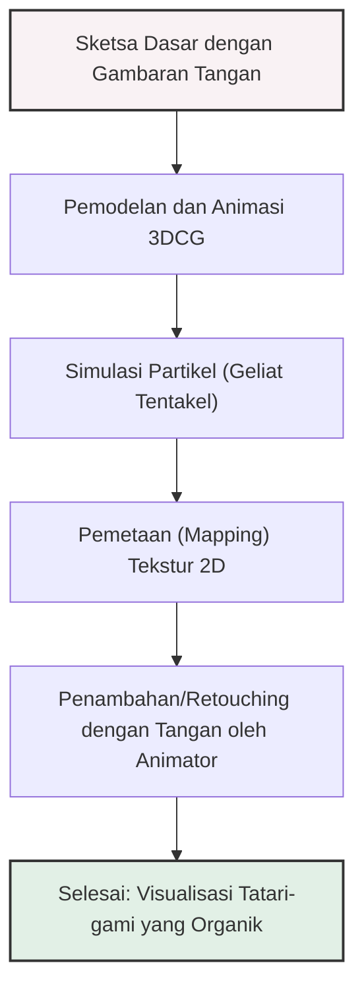

### Pemetaan Digital dan Pergerakan Kamera yang Dinamis

Inovasi lainnya adalah pemrosesan digital dari gambar latar belakang (seni). Sebelumnya, pan spasial tiga dimensi (gerakan melingkar) seolah-olah kamera bergerak memutar dalam animasi cel, sangat bergantung pada keterampilan pengerajin tingkat tinggi (penghitungan perspektif) yang menggambar latar belakang dengan secara sengaja mendistorsikannya.

Dalam 'Princess Mononoke', pada adegan di mana Ashitaka meninggalkan desa dan adegan yang mengekspresikan kedalaman hutan Shishigami, teknologi "Pemetaan 3D (3D Mapping)" digunakan; di mana gambar latar belakang indah yang digambar tangan oleh staf seni ditempelkan sebagai tekstur ke model topografi yang dibangun dalam 3DCG. Berkat ini, hal itu memungkinkan terciptanya kedalaman ruang yang menyerupai film aksi langsung dan pergerakan kamera dinamis yang bergerak bebas, sambil tetap mempertahankan kehangatan lukisan tangan dan keindahan yang tampak seperti lukisan.

Selain itu, siklus kehidupan ketika tanaman seketika berkecambah, tumbuh, dan layu di bawah kaki Shishigami, juga diekspresikan dengan sepenuhnya memanfaatkan teknologi morphing dan komposisi digital. Dengan cara ini, CG dalam 'Princess Mononoke' sama sekali tidak digunakan untuk memamerkan kecanggihan teknologi, melainkan berfungsi sebagai kuas (alat) esensial untuk membumikan visi mitologis dan memukau yang ada di dalam benak Hayao Miyazaki ke layar nyata.

## Penutup

'Princess Mononoke' adalah salah satu titik puncak yang telah dicapai oleh Studio Ghibli. Sembari menancapkan akarnya dalam-dalam pada tanah sejarah Abad Pertengahan Jepang, masalah ekologi dan non-dualisme tentang baik-buruk yang dikisahkan di dalamnya, mulai membawa makna yang semakin aktual di dalam masyarakat global modern. Ditambah lagi, keindahan visual perpaduan seimbang yang ajaib antara gambaran tangan dan digital ini, membanggakan tingkat kesempurnaan yang tidak ada bandingannya baik sebelumnya maupun sesudahnya. Pada bab berikutnya, "Bab 5: Keajaiban Keseharian dan Nostalgia (Spirited Away)", kita akan membahas titik balik baru Ghibli yang berputar arah dari skala mitologis ini, dan menyelam ke dalam lanskap batin seorang gadis modern.

# Bab 5: Transisi Digital dan Evaluasi Global (Spirited Away, The Cat Returns)

Dalam sejarah Studio Ghibli, awal tahun 2000-an merupakan era titik balik paling dramatis secara teknis, ekspresif, maupun komersial. Pada bab ini, kita akan merinci semaksimal mungkin dari perspektif profesional; bagaimana transisi dari animasi cel ke lingkungan digital penuh memperluas ekspresi visual dari karya-karya Ghibli ke wilayah yang belum pernah ada sebelumnya, dan bagaimana perwujudannya dalam 'Spirited Away' (2001) beserta batu loncatan bagi generasi penerus, yaitu 'The Cat Returns' (2002), melampaui batasan domestik Jepang dan membawa evaluasi global serta dampak budaya yang mendalam.

## 1. Dari Analog ke Digital: Pergeseran Paradigma Teknologi Studio Ghibli dan Rekonstruksi Estetika

"Digitalisasi" dalam produksi animasi tidak hanya semata-mata berarti efisiensi kerja atau pengurangan biaya. Ini adalah pergeseran paradigma fundamental dalam produksi video di mana setiap elemen visual dalam layar bisa secara penuh dikendalikan sebagai data numerik. Pengenalan teknologi digital dalam Studio Ghibli diuji coba pada tahun 1997 dalam 'Princess Mononoke' dengan geliat tentakel Tatari-gami, tekstur semi-transparan dari Daidarabotchi, serta beberapa latar belakang 3DCG, dilanjutkan pada 'My Neighbors the Yamadas' di tahun 1999 di mana pengecatan digital (digital paint) penuh diadopsi. Namun, di dalam karya-karya yang disutradarai Hayao Miyazaki, 'Spirited Away'-lah yang pertama kali dengan sempurna mencapai tugas sulit untuk merekonstruksi segala detail dengan saksama di dalam ruang digital sembari mempertahankan tekstur hidup yang dimiliki animasi cel konvensional.

Melalui transisi penuh ke sistem serba digital ini, secara fisik "sel" (cel) gambar dan "cat lukis untuk animasi" menghilang dari tempat produksi. Alur kerja pun menjadi mapan: gambar utama (genga) dan gambar gerak (douga) yang dilukis di atas kertas dipindai dengan resolusi tinggi, lalu diwarnai secara digital di dalam perangkat lunak. Hasilnya, batasan fisik yang khas dari proses analog pun akhirnya terlepaskan; misalnya redaman cahaya tembus yang terjadi akibat tumpukan berlapis-lapis gambar cel (yang membuat gambar menjadi gelap), maupun cacat seperti goresan atau debu pada cel.

Lebih revolusioner lagi adalah peningkatan dramatis dalam daya ekspresi pada proses "perekaman (compositing)". Pemisahan objek dalam layar (karakter, siput di bagian depan, bangunan di latar belakang, efek, dll) ke dalam layer (lapisan) tanpa batas, dan memberikan setiap layer kedalaman fokus (depth of field) yang berbeda, memungkinkan ekspresi kedalaman multi-lapis tingkat tinggi yang meniru lensa kamera pada film aksi langsung. Ekspresi spasial yang pada masa analog terbatas hanya pada beberapa lapis oleh peralatan kamera multiplane, kini bisa memiliki lapisan tanpa batas di dalam ruang digital; sehingga kebesaran ukuran dari pemandian "Aburaya" yang menjulang, dan kedalaman tanpa dasar dari tangga yang menuju jurang, kini tampil mendekati pandangan penonton melalui perspektif yang menakjubkan.

## 2. Alkemi Desain Warna Michiyo Yasuda: Ekspansi Tak Terbatas pada Ekspresi Warna berkat Pewarnaan Full Digital

Elemen yang paling mendapatkan manfaat dari transisi digital ini adalah "warna". Pewarna jenius, Michiyo Yasuda, yang telah mendukung desain warna karya-karya Hayao Miyazaki dan Isao Takahata selama bertahun-tahun bahkan sejak sebelum berdirinya Studio Ghibli, sukses menyihir layar dengan mantra yang belum pernah ada sebelumnya melalui peralihan total pada pengecatan digital.

Di era saat cat fisik digunakan, terdapat batasan yang jelas dalam jumlah warna yang bisa digunakan. Variasi jenis cat warna yang digunakan pada satu karya terbatas hanya berkisar beberapa ratus warna, dan untuk mengekspresikan perubahan bayangan rumit dan cahaya sekitar yang samar pada waktu senja, mereka hanya bisa membidik efek ilusi optik di dalam palet warna yang terbatas. Namun, melalui transisi menuju lingkungan digital, secara teori memampukan penanganan jumlah warna yang tak terbatas, yaitu sekitar 16,77 juta warna (warna 24 bit).

Dalam 'Spirited Away', Michiyo Yasuda tidak memanfaatkan palet warna tak terbatas ini demi sebuah "paduan warna psikedelik yang eksentrik", melainkan demi "reproduksi cahaya dari lingkungan yang sungguh nyata" dan "ekspresi perasaan dari karakter yang presisi dan rumit". Kota ajaib tempat Chihiro tersesat, atau pencahayaan beraneka warna dari pemandian "Aburaya" tempat para dewa-dewa memulihkan rasa lelah mereka, tidak hanya sekadar meriah belaka. Yasuda secara amat halus mengontrol bagaimana setiap objek dipengaruhi oleh sumber cahaya sesuai dengan waktu dan kelembaban ruangannya, seperti pada; sorot lampu dari lentera merah yang memantul acak di atas jalan berbatu yang basah, bayangan halus yang jatuh di pipi Chihiro, tekstur makanan dari dunia lain yang berlumur lemak yang dihabiskan secara rakus oleh orang tuanya yang telah diubah menjadi babi, dan kilau sisik hijau zamrud (emerald green) tembus pandang milik Haku saat menjadi naga yang begitu nyata.

Yang secara spesifik menakjubkan adalah "keselarasan (harmoni)" antara karakter dengan latar belakang seni. Di era analog, putusnya hubungan tekstur antara latar gambaran tangan dan gambar dari cel adalah suatu hal yang mudah terjadi, namun berkat penyertaan komposisi digital, sebuah manipulasi filter digital berskala halus pun kini dapat diproses demi mengakomodasi aura latar belakang menyesuaikan warna dari karakternya. Sekuens perjalanan menuju Rawa-rawa Bawah dengan menumpangi kereta Listrik Perairan Lautan, dan rentetan perubahan warna langit dan permukaan air kala bergeser dari waktu senja menuju saat pertemuan dengan arwah (petang), lantas disambut gelapnya langit malam hari, yang turut dibubuhi bayangan setengah tembus pandang milik para penumpang kereta yang jatuh, adalah wujud visualisasi puitis dari sinergi sempurna nan gemilang antara kendali akurat tingkat tinggi terhadap gradasi digital dan intuisi warna milik Yasuda yang diakui dalam buku catatan sejarah animasi.

## 3. Animisme Khas Jepang dan Cerita Rakyat "Kamikakushi (Disembunyikan oleh Roh)"

Alasan mengapa karya ini menerima tingkat apresiasi secara global yang belum pernah terjadi adalah, selain keindahan wujud visualisasinya yang memukau, pandangan alam akan "Animisme (kepercayaan roh)" yang sangat khas Jepang telah berhasil dituangkan dengan elok ke dalam rangkaian kisah inisiasi (ritual perjalanan kehidupan) dari seorang anak perempuan modern.

Setting dari latar tempat di mana dewa-dewa (kami) hadir menghampiri rumah pemandian untuk menanggalkan seluruh keletihannya sedemikiannya membentangkan sebuah gagasan yang bernuansa menyegarkan sekaligus kompleks ditinjau dari prinsip pandangan dunia monoteisme Barat. Sebuah rupa sosok dewa sungai yang berlumurkan lumpur tebal bersama tumpukan sampah-sampah besar seperti sepeda yang dibuang secara tidak bertanggung jawab oleh manusia, hingga mengubah wujudnya ke dalam bentuk "Okusare-sama (Roh Busuk)", adalah suatu pesan langsung yang mengecam kerusakan lingkungan modern sekaligus suatu presentasi pandangan ajaran agama Shinto mengenai "pembersihan najis/kotoran". Motif folklor (budaya) lokal/kedaerahan semacam itu telah dikaitkan dengan mulus dengan problem lingkungan global secara universal.

Lalu, seperti yang ditunjukkan oleh judul "Kamikakushi" (disembunyikan oleh roh/dewa), karya ini adalah kisah mengembara di sekitar garis batas antara hidup dan mati. Reruntuhan dari taman hiburan lama selepas terowongan, yang berbatasan dengan pemandian Aburaya di seberang sungai, jelas merupakan metafora dari "Dunia Lain" atau "Dunia Bawah". Di dalam cerita rakyat Jepang, terdapat larangan tabu bernama "Yomotsuhegui" bahwa mereka yang diculik ke dunia roh tidak akan dapat kembali ke dunia asal jika memakan makanan dari dunia sana. Tabu ini telah disisipkan pada adegan ketika Chihiro menerima makanan aneh dari Haku, yang menunjukkan bagaimana pemahaman mendalam Miyazaki tentang budaya rakyat menopang kuat tulang punggung cerita.

## 4. Sistem Rumah Pemandian (Aburaya) dan Kritik Total atas Kapitalisme - Konsumerisme

Di samping menyandang balutan desain animisme, kenyataan dari "Aburaya" yang menjadi panggung utama cerita ini sesungguhnya berfungsi sebagai metafora dari birokrasi modern dan masyarakat kapitalis. Gaya arsitektur Aburaya itu sendiri, yang merupakan perpaduan gaya bangunan pura-pura Barat era Meiji dengan penginapan air panas tradisional Jepang yang melebur secara aneh (grotesque), menyimbolkan modernisasi Jepang yang penuh kekacauan.

Pemandian air panas megah dengan Yubaba yang bertahta di pucuk pimpinannya ini adalah masyarakat hierarkis secara total, dan merupakan ruang di mana semua tindakan ditentukan oleh "kontrak" dan "kerja". Mereka yang bekerja di sini akan dirampas "nama" milik mereka sendiri. Penggambaran tentang Chihiro yang disusutkan menjadi satu huruf "Sen" adalah penghancuran identitas, dan sebuah metafora tajam tentang proses manusia yang distandardisasi sebagai "tenaga kerja" atau "roda gigi" yang dapat ditukar-ganti dalam sistem kapitalisme yang masif. Aturan bahwa mereka yang menolak untuk bekerja akan diubah menjadi hewan (babi atau batu bara), mengkonfrontasikan kita dengan realitas kejam masyarakat modern bahwa "mereka yang tidak bekerja tidak diizinkan untuk hidup".

Selain itu, karakter spesifik bernama "Kaonashi (Tanpa Wajah)" yang muncul dalam karya ini berfungsi sebagai simbol patologi yang dihasilkan oleh masyarakat konsumerisme modern. Dia tidak memiliki suaranya sendiri, dan hanya dapat berkomunikasi dengan memberikan objek keinginan orang lain (emas pasir) tanpa batas. Kemudian, dengan menelan orang lain, ia meminjam suara dan kepribadian mereka untuk memperbesar dirinya sendiri. Sosok Kaonashi ini tidak lain adalah karikatur dari manusia modern yang telah kehilangan koneksi sejati dengan orang lain, dan hanya berusaha menutupi kekosongan dirinya melalui kekuatan konsumsi material dan uang. Bagaimana para pegawai Aburaya berkerumun demi uang yang disebarkan Kaonashi dan pada akhirnya ditelan olehnya, menunjukkan pandangan kritis Hayao Miyazaki yang dingin tentang bagaimana kapitalisme hasrat menghancurkan kemanusiaan dan meruntuhkan komunitas.

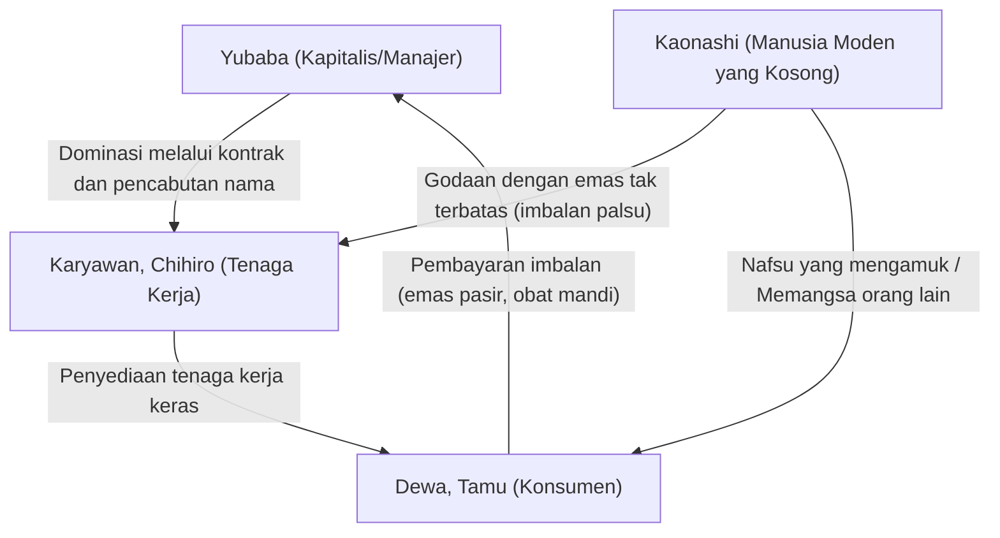

## 5. Meraih Pengakuan Secara Mendunia (Global): Kejutan Akibat Memenangi Penghargaan Academy Award dan Menciptakan Rekor Pemasukan Tertinggi

Berbekal berbagai kedalaman tema yang saling bertautan dan perpaduan estetika visual mutlak dari pewarnaan serba digital, 'Spirited Away' dengan mudah melampaui kerangka media animasi dan mengukir namanya dalam sejarah perfilman dunia.

Di Festival Film Internasional Berlin ke-52 pada tahun 2002, menyingkirkan sederet mahakarya film live-action, film ini memenangkan penghargaan tertinggi, "Golden Bear", yang menjadikannya film animasi kedua dalam sejarah (setelah 'Cinderella' sekitar setengah abad yang lalu) yang meraihnya. Prestasi ini adalah momen bersejarah di mana animasi tidak lagi hanya dianggap sebagai hiburan untuk anak-anak, melainkan diakui secara global sebagai karya seni tingkat tinggi. Selanjutnya pada tahun 2003, film ini memenangkan penghargaan Film Fitur Animasi Terbaik di Academy Awards ke-75. Dalam industri film Amerika di mana karya 3DCG dari Disney dan Pixar mulai menjadi arus utama, signifikansi dari animasi gambaran tangan 2D Jepang (termasuk pemrosesan digital) yang berdiri di puncak tidak dapat diukur.

Secara khusus, kenyataan bahwa John Lasseter, tokoh sentral Pixar dan kawan lama Hayao Miyazaki, secara sukarela mengambil peran sebagai sutradara eksekutif untuk versi Amerika Utara, memainkan peran yang menentukan dalam ekspansi global dari karya-karya Ghibli. Berkat upaya keras Lasseter, film ini dirilis di seluruh Amerika Serikat melalui jaringan distribusi Disney, dan mengukir kuat keberadaan "Ghibli" di hati para kreator di seluruh dunia.

Di Jepang sendiri, dampak sosialnya sangat besar. Angka pendapatan box office sebesar 31,68 miliar yen adalah rekor hit mega yang belum pernah terjadi sebelumnya yang memecahkan rekor posisi pertama dalam sejarah perfilman Jepang pada saat itu dengan skor hampir ganda, dan memicu fenomena sosial hingga memunculkan ungkapan "1 dari 4 warga Jepang telah menontonnya di bioskop." Kesuksesan ini sangat mengubah model bisnis dari industri perfilman Jepang secara keseluruhan, dan sepenuhnya membuktikan bahwa film animasi memiliki kekuatan box office masif yang melebihi film live-action.

## 6. 'The Cat Returns' dan Penunjukan Sutradara Generasi Berikutnya: Diversifikasi Ghibli dan Stabilisasi Sistem Digital

Tepat setelah antusiasme besar bersejarah yang ditimbulkan oleh 'Spirited Away', karya yang dirilis pada tahun 2002 adalah 'The Cat Returns' garapan sutradara Hiroyuki Morita. Karya ini adalah fitur berdurasi menengah (waktu tayang 75 menit) yang berposisi sebagai karya spin-off dari cerita yang ditulis oleh Shizuku Tsukishima, protagonis dari 'Whisper of the Heart', dan memiliki sejarah pembentukan yang unik; dimulai dari tahap perencanaan sebagai "Proyek Kucing" untuk taman hiburan.

Upaya untuk mendiversifikasi lini produksi studio dengan mempekerjakan sutradara muda maupun dari luar studio—selain dari dua raksasa berkarisma mutlak yaitu Hayao Miyazaki dan Isao Takahata—telah selalu menjadi masalah yang penting namun sulit bagi Ghibli. 'The Cat Returns' mewujudkan pembuatan film ringan dan gesit, yang dimungkinkan justru karena sistem produksi full-digital telah mapan secara teknis di dalam studio.

Berbeda dengan 'Spirited Away' yang membanjiri jiwa penonton dengan tema berat dan jumlah informasi gambar yang luar biasa, 'The Cat Returns' menggambarkan petualangan Haru, seorang siswi SMA biasa yang tanpa sengaja tersesat ke dunia lain (Kerajaan Kucing) yang terletak tepat di sebelah kesehariannya, dengan sentuhan ringan yang santai. Di sini, kita dapat melihat strategi jangka panjang studio untuk memfungsikan teknologi digital sebagai infrastruktur dalam memproduksi "fantasi menawan" secara massal dengan jadwal stabil dan kualitas tinggi, tidak hanya terpaku pada mahakarya besar berskala "berat, tebal, panjang, besar".

Selain itu, pesona skenario gubahan Reiko Yoshida, pemodelan karakter-karakter yang memikat seperti Baron (Baron Humbert von Gikkingen) dan Muta, serta penanganan tema bahwa "mereka yang tidak bisa menjalani waktunya sendiri akan kehilangan dirinya (menjadi kucing)" sangatlah apik. Meskipun sekilas tampak sebagai aksi petualangan komedi yang ceria, rasa takut di mana hilangnya hak menentukan nasib sendiri akan membawa perubahan identitas (menjadi kucing), sesungguhnya adalah tema yang sangat modern dan sejalan dengan ketakutan akan "hilangnya nama" di dalam 'Spirited Away', dan keberhasilan karya ini dalam mencerna tema tersebut dengan sangat baik ke dalam kerangka hiburan patut diapresiasi tinggi.

## 7. Ringkasan Bab 5: Titik Pencapaian Mukjizat Lahir dari Perpaduan Tradisi dan Inovasi

Pada awal era 2000-an, Studio Ghibli berada di era keemasan di mana persilangan antara "inovasi (transisi ke lingkungan produksi full-digital)" teknis dan "tradisi (tekstur hidup dari animasi gambaran tangan dan animisme Jepang)" dalam ekspresi mencapai keseimbangan yang ajaib, mendaki ke ketinggian yang belum pernah dicapai sebelumnya.

Teknologi digital di Ghibli tidak pernah digunakan sekadar sebagai alat untuk meningkatkan efisiensi atau membuat gambar menjadi datar (seperti 3DCG dengan tampilan cel murahan). Hal itu benar-benar dijinakkan sebagai "alat tingkat tertinggi untuk membebaskan kekuatan garis dan kemungkinan lukisan yang digambar oleh tangan manusia dari batasan fisik, serta menjadikannya lebih dalam dan kaya." Seperti yang dibuktikan secara sempurna oleh desain warna Michiyo Yasuda, teknologi mutakhir hanya akan mencapai titik puncak artistik sejati ketika dipadukan dengan kesadaran estetika luar biasa dari pengerajin ahli.

Kekuatan karakter pembuat (kreator) mutlak dan kedalaman pandangan dunia yang ditawarkan oleh 'Spirited Away', serta kekuatan produksi studio yang stabil dan kemungkinan pergantian generasi maupun diversifikasi yang ditunjukkan oleh 'The Cat Returns'. Melalui era pergolakan ini, Studio Ghibli telah benar-benar menghancurkan kerangka batasan dari sekadar studio animasi satu negara, dan bertransformasi menjadi merek global satu-satunya yang memimpin ekspresi film di seluruh dunia. Akan tetapi, ekspansi masif dan reputasi global yang tak tertandingi ini, di saat yang sama secara diam-diam membebankan masalah berat berikutnya (yang terus menyiksa Ghibli hingga hari ini) jauh ke dalam inti studio: "kebutuhan untuk memisahkan diri dari sistem yang sangat bergantung pada sosok jenius tunggal, Hayao Miyazaki".

# Bab 6: Anti-Perang dan Cinta, Mekanisme Sihir (Howl's Moving Castle, Tales from Earthsea)

## Pendahuluan: Fajar Era Baru Ghibli dan Dunia yang Berguncang

Di pertengahan tahun 2000-an, Studio Ghibli menyambut datangnya sebuah titik balik yang besar. Sutradara Hayao Miyazaki mendirikan monumen di dalam sejarah film Jepang melalui 'Spirited Away', memenangkan Academy Award, dan mengukuhkan reputasi globalnya. Namun, di bawah pijakannya, dunia nyata sedang berguncang hebat. Perang melawan teror yang berkelanjutan pasca serangan teroris beruntun di tahun 2001, serta Perang Irak yang meletus di tahun 2003. Di saat dunia mulai ditelan oleh rantai perpecahan dan kekerasan, pandangan Miyazaki pun secara lebih langsung tertuju pada "perang dan kebodohan manusia".

Di saat yang sama, di dalam internal Studio Ghibli sendiri, masalah besar mengenai pergantian generasi mulai tampak ke permukaan. Dalam bab ini, kita akan membahas dua karya yang menempati posisi sangat unik di dalam sejarah Ghibli dengan sangat dalam dari sudut pandang teknis, sejarah, dan tematik; yaitu 'Howl's Moving Castle' (2004) di mana Hayao Miyazaki melukiskan amarahnya yang membara terhadap Perang Irak dan penerimaannya akan "penuaan" dengan teknologi animasi luar biasa, serta 'Tales from Earthsea' (2006) di mana Goro Miyazaki, putra sulung Hayao Miyazaki, secara tidak biasa diangkat untuk debut sutradara dan menantang ekspresi tema filosofis serta menghadapi konflik dengan penulis asli karyanya.

---

## 'Howl's Moving Castle': Puncak Steampunk dan Teriakan Anti-Perang

Meski didasarkan pada sastra anak-anak karya Diana Wynne Jones, 'Howl's Moving Castle', Hayao Miyazaki menuangkan karakter penulisannya yang kuat ke dalamnya dan membangun cerita orisinal yang sangat berbeda dari karya aslinya. Karya tersebut berlatar di dunia di mana sihir dan mesin bercampur baur, menjadikannya tidak hanya sebuah kisah cinta epik, tetapi sekaligus juga sebuah film anti-perang yang pedih.

### 1. Mekanisme Kastil Bergerak dan Titik Kritis dari Teknologi Animasi

Yang pantas disebut sebagai peran utama sesungguhnya dari karya ini adalah sang tokoh pada judulnya sendiri: "Kastil Bergerak" (Howl's Moving Castle). Ekspresi animasi dari kastil ini menunjukkan sebuah titik kritis bagi Studio Ghibli, dan sebagai perpanjangannya, bagi perpaduan antara animasi gambaran tangan dengan 3DCG.

Desain kastilnya adalah arsitektur chimerical (mutan) yang berbentuk aneh, yang ditambal-sulam dari barang rongsokan tak terhitung jumlahnya seperti meriam, rumah, cerobong asap, roda gigi, serta kaki yang mirip seperti kaki burung raksasa. Ini adalah puncak desain mekanik steampunk yang dikuasai oleh Hayao Miyazaki; dan bagaimana derit logam, katup yang menyemburkan uap, serta cara berjalannya yang canggung namun agak jenaka, dipenuhi dengan kesan hidup layaknya sebuah makhluk raksasa.

Satu hal yang patut dicatat secara teknis adalah pendekatan terhadap masalah tentang bagaimana cara membuat struktur raksasa yang sangat rumit ini dianimasikan. Ghibli menggunakan teknologi 3DCG yang telah dibina melalui dewa bencana di 'Princess Mononoke' maupun dalam 'Spirited Away' untuk membangun gerak dasar dari kastil tersebut melalui CG. Namun, mereka tidak hanya sekadar merender model 3D, melainkan secara cermat menumpuk tekstur gambaran tangan dan detail di atasnya; sehingga mereka sepenuhnya berhasil menggabungkan "tekstur gambaran tangan yang hangat" khas Ghibli dengan "perubahan perspektif dinamis dan tiga dimensi yang merupakan keunggulan CG".

Bagian-bagian yang menyusun kastil (bagian rumah, roda gigi, kaki, dll.) bergoyang, berderit, dan berdistorsi pada waktu yang berbeda-beda menyesuaikan dengan guncangan berjalan. Pekerjaan untuk menghitung "guncangan asinkron" ini agar ia berdiri tegak sebagai animasi, memakan waktu hingga pada taraf yang dapat dikatakan sebagai sebuah kegilaan. Pada rangkaian adegan menjelang akhir ketika kastil runtuh dan lalu direkonstruksi ulang, keadaan di mana gaya gravitasi dan kekuatan sihir saling bersaing diwujudkan secara brilian melalui vektor pergerakan dari setiap kepingan komponennya.

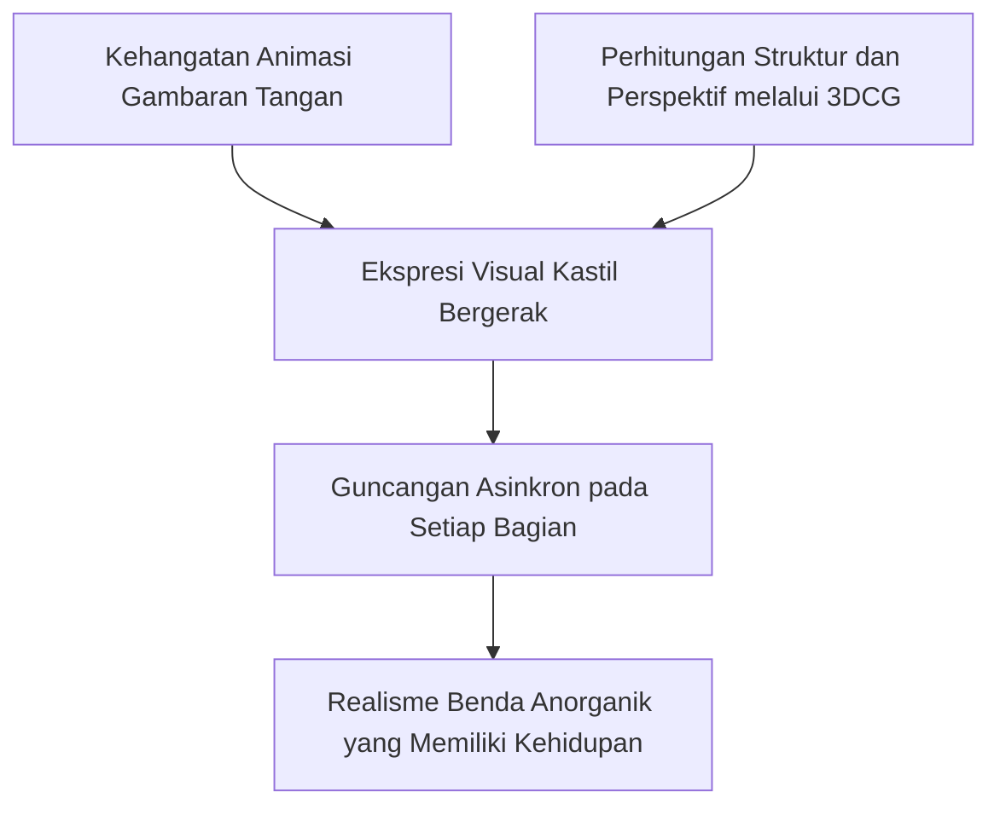

### 2. Bayang-bayang Perang Irak: Pesan Anti-Perang yang Intens Digambarkan oleh Hayao Miyazaki

Selama produksi 'Howl's Moving Castle', invasi militer ke Irak oleh Amerika telah dimulai di dunia nyata. Hayao Miyazaki memiliki kemarahan dan kekecewaan yang kuat yang tak pernah ada sebelumnya terhadap perang tersebut. Emosi itu melemparkan bayang-bayang gelap yang tajam di seluruh bagian dalam karya ini.

Perang yang digambarkan dalam karya ini tidak dilukiskan sebagai benturan keadilan yang jelas antara negara-negara bermusuhan. Tidak ada penjelasan sama sekali kepada penonton pihak mana yang benar dan mana yang salah; melainkan ia hanya melukiskan bagaimana pesawat tempur aneh yang menutupi langit secara membabi buta membom kota dan mengubahnya menjadi lautan api bersama rasa putus asa yang luar biasa. Ketakutan dari "kehancuran tanpa alasan" inilah yang menusuk esensi peperangan di zaman modern.
Tokoh utama Howl, meskipun melarikan diri dari wajib militer sebagai penyihir, berubah wujud setiap malam menjadi monster burung raksasa, dan pergi ke medan perang sendirian untuk menghancurkan kapal perang dan pesawat pengebom dari kedua negara. Namun, semakin dia menggunakan kekuatannya, semakin dia kehilangan kemanusiaannya, dan semakin mendekati menjadi monster sepenuhnya. Ini adalah metafora tentang bagaimana kontradiksi "kekerasan demi perdamaian" pada akhirnya menggerogoti dan menghancurkan jiwa seseorang. Adegan di mana Howl menatap kota yang terbakar dan meludah, "Baik kawan maupun lawan, semuanya adalah pembunuh," secara langsung mencerminkan jeritan kesedihan Hayao Miyazaki terhadap Perang Irak.

Dalam karya-karya Miyazaki sebelumnya (misalnya "Nausicaä of the Valley of the Wind" atau "Princess Mononoke"), tema tentang bagaimana bertahan hidup di tengah konflik dihadirkan, namun dalam "Howl", sikap penolakan total dan tegas ditegakkan, bahwa "perang itu sendiri adalah kebodohan mutlak, dan ikut serta di dalamnya berarti kematian jiwa."

### 3. Transisi Visual antara "Tua" dan "Muda": Makna dari Kutukan Sophie

Representasi inovatif lainnya dalam karya ini adalah "transisi usia" dari tokoh utama, Sophie. Dikutuk oleh Penyihir Belantara (Witch of the Waste), Sophie berubah dari gadis berusia 18 tahun menjadi nenek berusia 90 tahun. Namun, seiring berjalannya cerita, penampilannya terus berubah tanpa hambatan dari seorang wanita tua menjadi gadis, dari seorang gadis menjadi wanita paruh baya, selaras dengan naik turunnya emosi dan kondisi mentalnya.

Dalam animasi, tidak menetapkan pengaturan karakter (desain) secara baku adalah tantangan yang sangat tidak biasa. Sutradara animasi Akihiko Yamashita dan timnya, saat menggambar Sophie tua, tidak sekadar menambahkan kerutan, melainkan dengan cermat mengamati dan menggambarkan struktur tulang, penurunan otot, dan yang terpenting, "perubahan postur terhadap gravitasi". Saat menjadi wanita tua, punggung Sophie membungkuk, dan langkahnya terasa berat. Namun, saat dia mencoba melindungi Howl, atau saat dia mendapatkan kembali kepercayaan dirinya dan berbicara dengan tegas, punggungnya menjadi lurus, kerutannya memudar, dan bahkan nada suaranya menjadi lebih muda (kemampuan akting Chieko Baisho yang luar biasa sebagai pengisi suara juga berkontribusi besar di sini).

Hayao Miyazaki menggunakan trik visual ini untuk menggambarkan tema bahwa "penuaan tidak hanya sekadar fenomena fisik, tetapi juga keadaan psikologis." Bahkan sebelum dia dikutuk, Sophie memiliki harga diri yang rendah, menutup hatinya, dan secara internal sudah "tua". Kutukan itu hanya mencerminkan kondisi batinnya ke penampilannya. Namun, karena terbebas dari atribut sosial sebagai wanita tua, ironisnya ia menjadi mampu bertindak lebih berani dan energik dibandingkan masa remajanya.

Representasi "transisi usia" ini adalah puncak dari penggambaran psikologis yang memanfaatkan sepenuhnya karakteristik animasi yaitu "mampu mengubah bentuk secara bebas," dan memvisualisasikan lintasan jiwa manusia yang memulihkan penerimaan dirinya melalui cinta, dengan cara yang paling indah.

---

## "Tales from Earthsea": Debut Goro Miyazaki dan Filosofi Bayangan

Pada tahun 2006, dua tahun setelah "Howl's Moving Castle", Studio Ghibli mengadaptasi literatur fantasi terkenal dunia karya Ursula K. Le Guin, "Earthsea", menjadi film animasi. Namun, yang duduk di kursi sutradara bukanlah Hayao Miyazaki, melainkan putra sulungnya, Goro Miyazaki, yang sampai saat itu sama sekali tidak memiliki pengalaman dalam produksi film.

### 1. Penunjukan yang Tidak Biasa dan Latar Belakang Produksi

Adaptasi film "Earthsea" telah menjadi impian lama Hayao Miyazaki. Namun, ketika izin adaptasi film akhirnya diberikan oleh penulis asli Le Guin, Hayao Miyazaki sedang dalam proses produksi "Howl's Moving Castle" dan tidak dapat mengambil peran sebagai sutradara. Oleh karena itu, produser Toshio Suzuki menunjuk Goro Miyazaki, yang saat itu menjabat sebagai direktur Museum Ghibli di Mitaka dan memiliki karir sebagai arsitek.

Toshio Suzuki menemukan "kegelapan modern dan realitas anak muda yang tidak dimiliki Hayao Miyazaki" dalam papan cerita konfrontasi antara Arren dan naga yang digambar oleh Goro. Namun, Hayao Miyazaki sangat menentang keputusan ini, dan hubungan ayah-anak itu menjadi terputus. Kekhawatiran Hayao bahwa "seseorang yang tidak memahami animasi sama sekali tidak dapat menyutradarainya" sangat beralasan, dan Goro ditempatkan dalam situasi brutal di mana ia harus mengarahkan produksi sambil memimpin staf veteran Ghibli, menghadapi tekanan besar dan tembok penghalang mutlak yaitu ayahnya.

### 2. Konflik dengan Penulis Asli Ursula K. Le Guin dan Esensinya

Film "Tales from Earthsea" yang telah selesai, meskipun sukses di box office, menuai badai pro dan kontra dari para kritikus dan penggemar. Yang paling serius adalah konflik yang menentukan dengan penulis asli Le Guin.

Le Guin merilis komentar tentang film tersebut di situs webnya, secara dingin menyatakan, "It is not my book. It is your movie. (Ini bukan buku saya. Ini film Anda)." Apa yang dia permasalahkan adalah bahwa tema-tema halus dan introspektif dari karya aslinya digantikan dengan aksi dangkal dan dualisme baik-buruk.

Dalam buku pertama dari novel asli "Earthsea", "bayangan" yang dihadapi oleh tokoh utama Ged (Sparrowhawk) adalah perwujudan dari arogansi dan kelemahannya sendiri, dan pada akhirnya Ged tidak mengalahkan bayangan itu, melainkan merangkul dan mengintegrasikannya untuk membentuk jati diri yang sebenarnya. Ini adalah filosofi mendalam yang didasarkan pada pendekatan psikologi Jung.

Namun, dalam versi film (yang utamanya berdasarkan pada buku ketiga dari karya asli), bayangan batin dari tokoh utama Arren terpisah darinya dan digambarkan sebagai entitas yang terpisah. Dan klimaks akhirnya disederhanakan menjadi pertempuran fisik melawan penyihir jahat, Cob, yang mencari keabadian. Di mata Le Guin, perubahan ini dipandang sangat merusak tema inti dari karya asli, yaitu "pertumbuhan dan penerimaan spiritual batin."

### 3. Filosofi Bayangan dan Cahaya: Konflik Arren dan Patologi Masyarakat Modern

Meskipun ada kritik dari Le Guin dan alur cerita yang masih kasar, nilai unik dapat ditemukan dalam "Tales from Earthsea" karya Goro Miyazaki dalam hal kemampuannya untuk dengan tajam mencerminkan patologi khas yang diderita oleh pemuda Jepang di tahun 2000-an.

Tokoh utama, Arren, menusuk dan membunuh ayahnya (sang raja) tanpa alasan dan melarikan diri dari negaranya. Dia terus-menerus dihantui oleh "kecemasan yang tidak diketahui", terkoyak antara kemelekatan pada kehidupan dan ketakutan akan kematian. Sosok Arren ini menelusuri keadaan psikologis anak-anak muda di masyarakat Jepang yang stagnan pasca pecahnya gelembung ekonomi, yang melakukan kejahatan keji tanpa alasan yang jelas, atau anak-anak muda yang kehilangan makna hidup dan mengatakan, "Saya ingin mati."

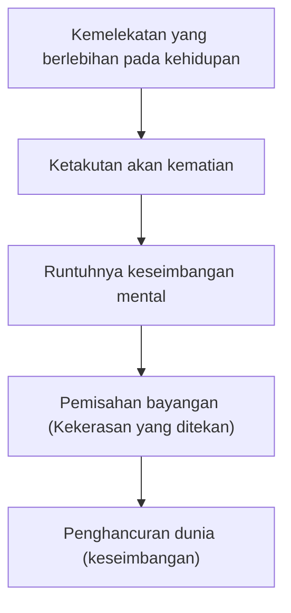

Dialog Therru, "Aku benci orang yang tidak menghargai kehidupan," yang merupakan tema utama film tersebut, sering dikritik karena terlalu langsung dan terkesan menggurui. Namun, mengingat pengalaman Goro Miyazaki sebagai arsitek yang menghadapi masalah lingkungan, dan kutukan serta konflik karena lahir sebagai putra dari sutradara besar Hayao Miyazaki, perasaan frustrasi Arren bahwa "dia tidak tahu apa yang harus dilakukan dengan hidupnya sendiri" juga merupakan jeritan pedih dari Goro sendiri.

Selain itu, penyihir Cob, yang mendambakan keabadian dan mencoba untuk menghancurkan keseimbangan dunia, merupakan karikatur dari umat manusia modern itu sendiri, yang mencoba menyangkal takdir alamiah yaitu "kematian" melalui teknologi dan teknologi medis modern. Paradoks bahwa menolak kematian berarti menolak kehidupan. Konflik antara Arren dan Cob mungkin terlihat seperti pertarungan antara yang baik dan yang jahat di permukaan, tetapi pada dasarnya terdapat pertanyaan eksistensial tentang "bagaimana menerima kehidupan yang terbatas."

Dalam hal teknologi animasi, meskipun kurang memiliki kesan terbang yang luar biasa seperti karya-karya Hayao Miyazaki, atau vitalitas dari karakter figuran yang terasa hidup hingga ke detailnya, namun latar belakang seninya yang hening (terutama penggambaran laut yang badai di mana naga-naga saling memangsa, dan warna-warna suram dari Kota Hort yang hancur) dengan terampil mengekspresikan suasana apokaliptik bahwa dunia secara bertahap menuju pada kematian.

---

## Kesimpulan: Harga Sebuah Keajaiban dan Warisan untuk Generasi Berikutnya

"Howl's Moving Castle" dan "Tales from Earthsea". Kedua karya ini adalah simbol dari periode transisi di mana Studio Ghibli mencapai fase kedewasaannya, dan pada saat yang sama harus menghadapi kecemasan tentang masa depannya.

Dalam "Howl's Moving Castle", Hayao Miyazaki memanfaatkan keajaiban animasi secara maksimal, seraya menggambarkan kengerian menggunakan keajaiban (kekuatan) tersebut dan keputusasaan yang mendalam terhadap kekerasan nyata yaitu peperangan. Kemudian, ia mempercayakan keselamatan dari hal tersebut pada "menerima proses penuaan" dan "cinta tanpa pamrih".

Di sisi lain, Goro Miyazaki dalam "Tales from Earthsea", menantang kastil ajaib raksasa yang dibangun oleh ayahnya, dan mencoba untuk berbicara tentang "penerimaan hidup dan mati" dengan suaranya sendiri meskipun terluka. Itu mungkin tidak sempurna, namun itu juga merupakan dokumenter pedih sebagai metafora untuk Studio Ghibli itu sendiri, tentang bagaimana generasi penerus menghadapi warisan para pendahulunya, dan bagaimana mereka mengintegrasikan bayangan mereka sendiri.

Keajaiban (animasi) bukanlah maha kuasa. Namun, justru usaha untuk tetap melukiskan cahaya di dalam kegelapan, bahkan setelah mengetahui batasan dan harganya, adalah hal yang sangat memukau yang ada di dalam karya-karya Ghibli di era ini.

(Akhir Bab 6)

# Bab 7: Akar Kehidupan dan Kembalinya Animasi Gambar Tangan (Ponyo on the Cliff by the Sea, The Secret World of Arrietty)

Ketika kita melihat kembali sejarah Studio Ghibli, dan secara perluasan, sejarah industri animasi Jepang secara keseluruhan, periode dari akhir 2000-an hingga awal 2010-an diposisikan sebagai titik balik teknologi dan ideologis yang sangat unik. Di Hollywood, animasi 3DCG penuh yang diwakili oleh Pixar dan DreamWorks berkuasa sebagai standar de facto dari pasar film, dan bahkan di anime televisi domestik Jepang dan rilis teater, digitalisasi proses produksi (lukisan digital dan penggunaan 3DCG untuk latar belakang dan mekanik) telah sepenuhnya terbentuk sebagai gelombang yang tidak dapat diubah.

Di era keemasan digital yang didominasi oleh "efisiensi dan akurasi yang diperhitungkan" seperti itu, Hayao Miyazaki dan Studio Ghibli mengambil langkah drastis menuju arah yang benar-benar berlawanan. Yaitu "kembali secara menyeluruh ke animasi gambar tangan" dan "mengejar ekspresi kehidupan yang primitif". Bab ini akan membandingkan kegilaan animasi fluida makro dalam "Ponyo on the Cliff by the Sea" (2008) yang disutradarai oleh Hayao Miyazaki, dengan redefinisi pergeseran sudut pandang mikro dan skala dalam karya debut sutradara Hiromasa Yonebayashi, "The Secret World of Arrietty" (2010), sambil menggali kedalaman teknologi dan ideologi tentang bagaimana Ghibli mencetak "nafas kehidupan dalam animasi" ke dalam film.

## 1. "Ponyo on the Cliff by the Sea": Kegilaan Penolakan CG dan Munculnya "Buku Bergambar yang Bergerak"

Studio Ghibli tidak pernah benar-benar menolak teknologi digital. Mereka selalu dengan cerdik memasukkan teknologi terbaru ke dalam konteks animasi cel, seperti penggambaran Dewa Tatari dan pengenalan lukisan digital dalam "Princess Mononoke" (1997), pemrosesan spasial dalam "Spirited Away" (2001), dan penggerak kastil yang rumit menggunakan 3DCG dalam "Howl's Moving Castle" (2004). Namun, dalam "Ponyo on the Cliff by the Sea", Hayao Miyazaki membuat keputusan yang bertentangan dengan perkembangan zaman, dengan secara sengaja dan menyeluruh menolak penggunaan 3DCG.

Inti dari keputusan ini adalah rasa krisis yang kuat dari Miyazaki sendiri bahwa "akurasi berlebihan" yang dibawa oleh teknologi digital menghilangkan pesona asli dari animasi, yaitu "kesenangan deformasi" dan "fisikalitas animator yang bersemayam dalam garis yang digambar". Alhasil, jumlah frame yang digambar untuk karya ini melebihi 170.000 lembar, suatu pengecualian dari segala pengecualian untuk karya Ghibli. Ini adalah volume pekerjaan yang luar biasa gila dan sulit dipercaya dalam industri animasi Jepang yang didasarkan pada animasi terbatas (limited animation).

Fitur visual terbesar dari karya ini adalah dipertahankannya sentuhan kasar pensil warna dan cat air di layar apa adanya. Animasi cel konvensional memiliki aturan standar untuk secara jelas memisahkan karakter (cel) dan seni latar belakang, di mana cel diekspresikan dengan warna solid yang seragam. Namun, dalam "Ponyo", batas antara latar belakang seni dan cel sengaja dilebur. Goresan pensil warna dan rembesan cat air juga diterapkan pada garis luar karakter, memberikan tekstur organik yang membuat seluruh layar tampak menyatu dan bernapas sebagai satu "buku bergambar yang bergerak". Ini dapat dikatakan sebagai ekspresi orisinalitas penulis yang hampir brutal, menghancurkan tata bahasa animasi semiotik, dan secara langsung membenturkan penonton dengan "kejutan primitif dari gambar yang bergerak".

## 2. Fusi Dinamika Fluida dan Animisme: Interpretasi Fisika pada Gelombang

Pencapaian terbesar dalam sejarah teknologi animasi yang ditinggalkan oleh "Ponyo on the Cliff by the Sea" adalah ekspresi "air" dan "ombak". Dalam produksi video modern, ekspresi air adalah ranah yang sepenuhnya dikuasai oleh CG menggunakan simulasi fluida (sistem partikel). Dengan menggunakan perhitungan fisika, sangat mudah untuk menghasilkan laut fotorealistik yang dapat mengecoh mata sebagai hal yang nyata. Namun, Hayao Miyazaki menolaknya, dan membangun semuanya dengan "garis" dari pensil para animator.

Yang patut disorot secara khusus adalah sekuens luar biasa di bagian pertengahan——adegan di mana Ponyo berlari melintasi ombak berbentuk ikan purba raksasa untuk mengejar Sosuke. Laut di sini bukanlah sekadar fluida Newtonian (kumpulan H2O) yang diatur oleh persamaan Navier-Stokes dalam dinamika fluida. Sutradara animasi Katsuya Kondo dan para animator top Ghibli yang bertanggung jawab atas gambar kunci, secara intuitif menafsirkan ulang perilaku air (inersia, viskositas, tegangan permukaan, dan tekanan) sebagai "gerak dinamis otot" dan "massa berat dari organisme raksasa".

Ombak yang ditunggangi Ponyo mengandung dinamisme momen ketika tegangan permukaan melampaui batas dan pecah, serta kesan material seperti jeli berviskositas tinggi yang menyembur dari laut dalam, secara bersamaan. Dengan sengaja menyimpang dari akurasi fisik dan melakukan visualisasi animistik seperti menggambar "mata" raksasa di ujung ombak, film ini menanamkan kesan kuat kepada penonton bahwa "laut itu sendiri adalah makhluk hidup raksasa yang memiliki kehendak". Bahkan percikan air saat ombak pecah tidak dibuat sebagai partikel yang teratur, melainkan dianimasikan secara penuh dengan gambar tangan sebagai "makhluk hidup" yang masing-masing memiliki bentuk tidak beraturan. Proses pengerjaan "meniupkan nyawa pada air" ini sangat menguras mental dan fisik para animator, tetapi sebagai hasilnya, terciptalah visual bersejarah dengan "panas" dan "bobot" yang tidak mungkin dihasilkan oleh CG.

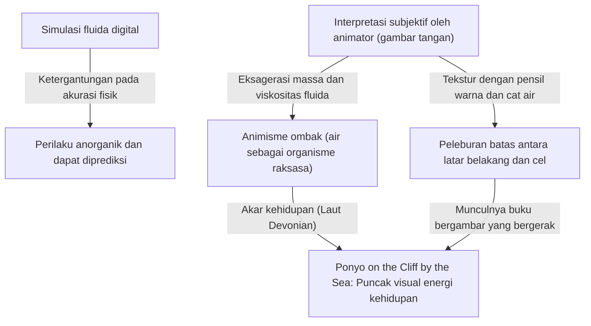

## 3. Regresi ke Akar Kehidupan: Ledakan Kambrium dan Ibu Laut

Bahkan dalam struktur cerita dan pembangunan pandangan dunianya, "Ponyo" berorientasi pada regresi menuju bentuk fundamental kehidupan. Kota Sosuke yang tenggelam sepenuhnya oleh badai seharusnya digambarkan sebagai sisa-sisa bencana yang tragis dalam film kepanikan biasa. Namun, dalam karya ini, hal tersebut digambarkan sebagai ruang yang sangat meriah dan indah, di mana ikan-ikan purba (amfibi Devonian dan placoderm, seperti Dunkleosteus dan Bothriolepis) berenang dengan santai di atas kota yang tenggelam.

Kota bawah laut yang transparan dan indah ini adalah metafora dari laut primordial tempat kehidupan di Bumi lahir, atau rahim raksasa yang berisi air ketuban. Hayao Miyazaki secara positif menggambarkan proses di mana masyarakat sipil rapuh (daratan) yang dibangun oleh umat manusia ditelan dan bergabung dengan alam (laut), yang memiliki daya tampung dan daya hancur yang luar biasa. Eksistensi Ponyo itu sendiri adalah perwujudan dari "pohon filogenetik evolusi" yang diwujudkan sebagai ontogeni dengan kecepatan luar biasa, dari ikan menjadi makhluk setengah ikan-manusia, kemudian melalui amfibi hingga menjadi manusia (makhluk darat). Momentum luar biasa dari animasi gambar tangan yang menembus seluruh karya adalah ekspresi dari "energi ledakan saat kehidupan lahir dan menjadi hidup," layaknya Ledakan Kambrium.

## 4. "The Secret World of Arrietty": Sudut Pandang Sang Pesulap Skala, Hiromasa Yonebayashi

Jika "Ponyo" menggambarkan ledakan kekuatan hidup pada skala makro yang sangat besar, "The Secret World of Arrietty" yang dirilis dua tahun kemudian adalah sebuah mahakarya yang secara menyeluruh mengeksplorasi fisika dan ekspresi visual di dunia mikro. Karya debut sutradara Hiromasa Yonebayashi, seorang animator andalan Ghibli yang dikenal dengan nama panggilan "Maro", didasarkan pada literatur anak-anak karya Mary Norton. Namun, film ini tidak menjadikan konsep "manusia mini setinggi 10 cm" sekadar sebagai gimik fantasi belaka, melainkan mengangkatnya menjadi realisme luar biasa melalui perhitungan yang akurat atas skala dan pergerakan sudut pandang yang cermat.

Kemampuan persepsi spasial yang luar biasa dan teknik tata letak (komposisi layar) dari sutradara Yonebayashi secara dramatis mengubah rumah bergaya Jepang berukuran raksasa yang biasa dihuni manusia, menjadi "tebing curam", "hutan lebat", dan "labirin yang luas dan berbahaya" bagi Arrietty dan kaum manusia mini lainnya. Mereka memanjat tembok besar dengan menggunakan paku sebagai pijakan, berpindah ke tempat tinggi dengan memanfaatkan daya rekat selotip bolak-balik, dan mengenakan jarum pentul di pinggang mereka sebagai pedang untuk perlindungan diri. Penggambaran adegan aksi ini bukan sekadar mengecilkan gerakan manusia biasa. Itu dibangun sebagai animasi yang sangat meyakinkan secara fisika, yang berdasarkan pada redefinisi "gravitasi", "tekstur", dan "kekuatan otot" pada skala 10 cm.

## 5. Keajaiban Dinamika Fluida dan Desain Akustik dalam Skala Mikro

Puncak dari teknologi animasi dalam karya ini adalah visualisasi yang presisi dari hukum fisika pada skala mikro (terutama perubahan perilaku fluida dan bubuk karena efek skala). Dalam dinamika fluida, diketahui bahwa ketika skala objek menjadi sangat kecil, pengaruh tegangan permukaan dan gaya viskositas menjadi lebih dominan dibandingkan gravitasi (gaya inersia).

Sebagai contoh, ingatlah adegan di mana ibu Arrietty, Homily, menuangkan teh dari teko. Di dunia berukuran manusia, air mengalir turun dengan mulus dalam garis-garis tipis, mengikuti gravitasi. Namun, di dunia manusia mini berukuran 10 cm, pengaruh tegangan permukaan air secara relatif menjadi jauh lebih besar. Karena itu, teh yang dituangkan membentuk gumpalan tetesan air yang besar dan jatuh seperti bongkahan jeli yang berat, dengan bunyi "pluk, pluk". Dinamika fluida yang khas dari dunia mikro ini direproduksi secara sempurna melalui mata pengamatan yang tajam dan teknik menggambar dari para animator. Selain itu, representasi kesan berat seperti batu raksasa dari sebutir gula batu, dan kekakuan seperti kanvas tebal saat menarik keluar tisu, juga merupakan elemen penting yang membuat penonton merasakan skala manusia mini tersebut.

Selain itu, hal yang mengukuhkan kesan skala ini adalah desain akustik yang sangat halus dan dinamis (Foley sound) dari Koji Kasamatsu. Saat kamera beralih ke sudut pandang Arrietty, langkah kaki manusia terdengar seperti suara dentuman bass yang berat layaknya gempa bumi, dan suara mesin kulkas menjadi suara gemuruh bagaikan ruang mesin pabrik. Di sisi lain, suara gesekan kain dan tetesan air juga sangat diperkuat, disesuaikan dengan resolusi telinga manusia mini. Dengan memanipulasi skala secara dramatis tidak hanya melalui ekspresi visual tetapi juga pendengaran, penonton sepenuhnya tenggelam (disinkronisasi) ke dalam sudut pandang 10 cm Arrietty.

## 6. Manipulasi Ruang Tajam (Depth of Field) dan Tata Letak ala Lensa Makro

Satu hal lagi fitur visual dari "Arrietty" yang tidak boleh dilewatkan adalah manipulasi "ruang tajam (efek bokeh)" yang disengaja dan ekstrem dalam seni latar belakang. Biasanya, latar belakang seni karya Studio Ghibli (keahlian yang diwakili oleh seniman seperti Kazuo Oga dan Yoji Takeshige) secara cermat digambar dengan ketajaman yang merata (pan focus) hingga ke setiap sudut layar, sering kali menyajikan betapa luasnya dunia.

Namun dalam karya ini, pada adegan yang menggambarkan sudut pandang manusia mini, ketika fokus diarahkan pada Arrietty, perabotan, barang-barang kebutuhan sehari-hari manusia, tumbuhan, dan objek lainnya di belakang digambar dengan blur (bokeh) yang sangat besar, seolah-olah difoto dari jarak dekat menggunakan kamera refleks lensa tunggal (SLR) dengan lensa makro terpasang. "Fokus dangkal" ini adalah metode tata letak canggih yang secara visual mengekspresikan ketegangan dan rasa klaustrofobia bahwa dunia manusia mini selalu berdampingan dengan ketidaktahuan yang sangat besar dan tidak terduga (dunia manusia). Bukan hanya dengan menambahkan efek bokeh melalui pemrosesan fotografi digital, tetapi juga dengan perpaduan antara analog dan digital—di mana garis luar dengan sengaja dikaburkan sejak tahap pembuatan lukisan latar belakang—suasana dunia mikro berhasil direpresentasikan secara luar biasa.

## 7. Ringkasan: Menggambarkan "Cahaya Kehidupan" dari Kedua Ujung Skala

"Ponyo on the Cliff by the Sea" dan "The Secret World of Arrietty". Yang satu menggambarkan energi laut induk yang mengamuk dan ledakan kehidupan dari perspektif makro, dengan metode "kegilaan" pensil warna dan murni gambar tangan secara keseluruhan. Yang lainnya menggambarkan aktivitas sehari-hari yang tenang dan keajaiban hukum fisika mikroskopis dari perspektif mikro, melalui tata letak yang cermat serta kontrol visual dan pendengaran yang diperhitungkan dengan sangat teliti.

Meskipun arah pendekatan mereka berada pada dua ujung ekstrem yaitu makro dan mikro, pencapaian Studio Ghibli selama periode ini sama saja. Itulah bentuk pamungkas dari animasi, menentang "keakuratan anorganik" yang dibawa oleh CG, dengan menanamkan kehidupan animistik ke dalam setiap goresan garis dan sapuan kuas di latar belakang yang digambar dengan tangan para animator. Wawasan Ghibli yang mendalam menemukan "cahaya kehidupan" dalam proporsi yang sama, baik dalam gelombang laut yang raksasa maupun dalam setetes teh yang berat. Hal ini dapat dikatakan sebagai pemberontakan dari para pencipta yang paling indah, paling kuat, dan paling membanggakan, melawan industri video modern yang semakin tertelan oleh gelombang efisiensi.

# Bab 8: Mahakarya Para Maestro dan Warisan untuk Masa Depan

Sejak tahun 2010-an, Studio Ghibli, yang telah lama berkuasa sebagai ikon pencetak sejarah dalam animasi Jepang maupun global, memasuki fase unik yang dapat disebut sebagai "puncak karya" (mahakarya) dari dua sosok penciptanya: Hayao Miyazaki dan Isao Takahata. Melampaui batas-batas hiburan, seri karya yang merujuk pada diri sendiri (self-referential) ini dilahirkan, dengan mengamati karma para kreator itu sendiri, filosofi, serta merenungkan akhir hayat. Bab ini akan membedah tiga mahakarya: "The Wind Rises" (2013), "The Tale of the Princess Kaguya" (2013), dan "The Boy and the Heron" (2023). Ketiga film ini bukan hanya merupakan titik puncak bagi Studio Ghibli, tetapi juga merangkum "kehancuran dan kelahiran kembali". Secara rinci, kita akan menjelajahi pesan-pesan terakhir yang mereka tinggalkan untuk industri animasi, serta transmisi ke generasi berikutnya dari perspektif teknologi dan pemikiran secara mendalam.

## 1. "The Wind Rises" —— Kutukan Penciptaan dan Akhir dari Mimpi Indah, Pengakuan Kontradiksi Hayao Miyazaki

"The Wind Rises", yang dirilis pada tahun 2013, adalah karya semi-otobiografi di mana Hayao Miyazaki dengan jelas mengekspos "kontradiksi" yang telah ia pendam selama bertahun-tahun, lebih gamblang dari sebelumnya. Tokoh utama dari karya ini, Jiro Horikoshi, adalah tokoh sejarah nyata yang merancang Pesawat Tempur Berbasis Kapal Induk Tipe 0 (Zero Fighter), namun Miyazaki menggabungkannya dengan esensi seorang penulis kontemporer, Tatsuo Hori, untuk melukiskan potret seorang "pencipta".

### Puncak Kontradiksi Diri antara Keindahan Senjata dan Penderitaan Perang
Hayao Miyazaki, di samping sebagai pencinta senjata dan pesawat terbang yang fanatik, juga merupakan seorang pendukung perdamaian yang teguh. Kontradiksi ini—"Mencintai senjata yang indah, namun membenci peperangan yang menjadikannya alat pembunuh"—telah diangkat secara berkala dalam film seperti "Porco Rosso" dan "Howl's Moving Castle". Akan tetapi, dalam "The Wind Rises", ia berhenti membungkus pesannya dengan fantasi manis. Hasrat murni Jiro untuk "hanya ingin membuat pesawat yang indah", pada akhirnya membuahkan Zero Fighter, sebuah "mimpi terkutuk" yang mengirim banyak pemuda menuju kematian mereka dan mengubah Jepang menjadi padang abu. Caproni, sang perancang pesawat dari Italia yang berbicara dengan Jiro dalam dunia mimpinya, bertanya "Dunia dengan piramida atau dunia tanpa piramida, mana yang akan kamu pilih?" lalu menambahkan, "Masa hidup dari fase kreatif manusia hanya 10 tahun." Ini bukan sekadar pandangan mendalam tentang cemerlangnya sebuah bakat beserta bayaran kejamnya, melainkan juga pengakuan menyakitkan Miyazaki sendiri—tentang bagaimana dirinya mengorbankan nyawanya dan orang-orang di sekitarnya, semata-mata demi melahirkan "fiksi indah" yang disebut animasi.

### Pendekatan Eksperimental pada "Angin" dan "Suara" dalam Teknologi Animasi
Dari sudut pandang teknis, "The Wind Rises" merupakan akumulasi tertinggi dari penguasaan Ghibli dalam menyajikan "angin" dan "penerbangan". Mulai dari adegan mimpi di awal film, penerbangan pesawat kertas di Karuizawa, hingga uji coba terbang sungguhan, teknik animasinya membuat aliran udara seakan benar-benar terlihat; satu kata: menakjubkan. Penggambaran obsesif mulai dari kilap logam duralumin pesawat hingga detail setiap paku keling, memancarkan kecintaan ekstrem terhadap dunia mekanik.
Lebih jauh, hal lain yang patut diapresiasi secara khusus adalah eksperimen berani pada aspek tata suara. Dalam film ini, sebagian besar efek suara (SE)—seperti putaran baling-baling pesawat, embusan kereta uap, hingga getaran tanah saat Gempa Besar Kanto—diperankan langsung oleh "suara manusia". Lewat pendekatan animisme ini, berbagai mesin hingga bencana alam menjelma bagaikan makhluk hidup raksasa yang memiliki kehendaknya sendiri, menghasilkan nuansa realisme yang luar biasa kuat. Pemilihan Hideaki Anno, sutradara "Neon Genesis Evangelion", sebagai pengisi suara Jiro juga sangatlah simbolis. Suara Anno—yang bukan aktor profesional—terdengar datar seakan emosinya terkuras habis, dan sangat pas mencerminkan sosok Jiro: "kegilaan yang murni" karena terpaku sepenuhnya pada teknologi. Kehidupan Jiro yang indah namun kejam dengan istrinya, Naoko, yang menderita tuberkulosis, juga secara cerdas menonjolkan realisme khas Miyazaki, yang mengaburkan batas antara egoisme dan kasih sayang.

## 2. "The Tale of the Princess Kaguya" —— Denyut Kehidupan dari Ruang Kosong dan Eksperimen Puncak Isao Takahata

Di tahun yang sama ketika Hayao Miyazaki melukiskan pergulatan internalnya melalui "The Wind Rises", Isao Takahata menyelesaikan eksperimen luar biasa yang memutarbalikkan sejarah animasi cel lewat karya penyutradaraannya yang pertama dalam 14 tahun, "The Tale of the Princess Kaguya". Dengan menelan biaya produksi 5 miliar yen dan proses selama 8 tahun yang fantastis, karya ini mendorong batas "lukisan" dalam animasi hingga ke puncaknya; sebuah pencapaian seni tiada banding dan sekaligus menjadi wasiat terakhir serta karya terbesar dari Isao Takahata.

### Sistem Pre-scoring, Garis-garis yang Bernyawa, serta Antitesis untuk Disney
Metode utama animasi di Jepang, animasi cel, umumnya menggunakan sistem di mana batas dengan ketebalan yang seragam diisi dengan satu warna rata (biasa disebut *anime shading*). Akan tetapi, Takahata meyakini bahwa pendekatan semacam ini "merenggut daya hidup dari gambar, menjadikannya benda mati yang berasal dari masa lalu". Yang ia cari adalah "sketsa yang hidup (kehidupan yang mengalir saat ini juga)"—suatu bentuk gairah sama seperti saat pelukis pertama kali menggoreskan kuas di atas kanvasnya. Menempatkan animator seperti Kazuo Oga dan Osamu Tanabe sebagai pilar, proses produksi film ini mengambil pendekatan nekat: membiarkan garis kasar dari pensil dan arang, serta cat warna pastel pucat khas cat air murni, agar tercetak di layar apa adanya.
Lebih lanjut, sutradara Takahata juga menerapkan teknik "Pre-scoring" (Prescoring). Ini adalah metode di mana aktor mengisi suara karakter terlebih dahulu; lalu berdasarkan ritme suara, tarikan napas, hingga mimik wajah dan gerak tubuh aktor saat rekaman (yang direkam menggunakan kamera), barulah animator membuat gambar karakternya. Hasilnya, realisme dari lantunan dialog Aki Asakura (Putri Kaguya) dan Kengo Kora (Sutemaru) tersinkronisasi sempurna dengan detail mikro gerakan otot maupun letupan emosi karakternya, menghasilkan kehadiran (eksistensi) yang amat kuat. Ini menjadi sebuah antitesis tegas terhadap standar animasi modern yang terlalu mengandalkan pendekatan karakter bergaya "simbolik".

### Estetika Ruang Kosong dan Ledakan Emosi —— Dampak Mengejutkan Sekuens Lari Cepat
Karakteristik penyutradaraan dan teknik penceritaan terbesar dari "The Tale of the Princess Kaguya" adalah "ruang kosong (estetika apa yang tak tergambar)". Ujung-ujung layar dibuat kabur bak cat air, dan seringkali latar belakang sengaja dibiarkan tidak selesai (kosong). Melalui peninggalan "ruang bagi imajinasi penonton" ini, Takahata justru memaksa pemirsanya untuk secara aktif mengisi kedalaman dunia di balik layar tersebut, mengajak mereka terlibat dalam tontonan yang aktif.
Dampak terkuat dari metode ini terlihat nyata pada sekuens ketika Putri Kaguya melarikan diri dari pesta perayaan istana, berlari kencang menuju pegunungan. Ketika kemarahan, keputusasaan, dan dorongan untuk melepaskan belenggu mencapai titik nadir, gambaran seni yang begitu halus tiba-tiba beralih menjadi garisan liar layaknya lukisan tinta; sementara latar belakangnya ikut sirna menjadi bentuk sketsa, ibarat tertelan pusaran amarah. Adegan di mana garis saling bertabrakan dan cat saling menciprat ini menandai momen ketika animasi berevolusi dari sekadar "simbol yang digambar" menjadi "visualisasi emosi murni", menciptakan sebuah mahakarya tiada tara yang pantas diukir dalam sejarah sinema dunia. Musik latar bergaya sakral Buddha di akhir film ketika Ibu Kota Bulan digambarkan, juga menciptakan warna kontras yang sangat indah; ia semakin menegaskan pandangan hidup dan mati seorang Takahata—yang justru memeluk "kotoran" maupun "keceriaan kehidupan" dalam keseharian di Bumi.

## 3. "The Boy and the Heron" —— Labirin Simbolisme dan Wasiat bagi Generasi Masa Depan

Setelah sempat mengumumkan pensiun dari film layar lebar pada tahun 2013, Hayao Miyazaki kembali 10 tahun kemudian dengan menyajikan "The Boy and the Heron" (2023). Film ini sama sekali bukan sekadar kisah petualangan megah dan katartik ala "Spirited Away", melainkan sebuah labirin berhias simbolisme super kompleks yang mengaburkan garis batas antara mimpi dan realitas, kehidupan dan kematian, serta penciptaan dan kehancuran.

### Elemen Otobiografi dan Metafora Lengkap Atas Karya-karyanya di Masa Lalu
Karakter utamanya, Mahito, yang harus kehilangan sang ibu di sebuah insiden kebakaran pada usia belia, dipindahkan keluar dari kota oleh ayahnya yang mengepalai pabrik senjata. Latar belakang ini sendiri sangat merujuk pada trauma masa kecil Miyazaki (pindah ke Utsunomiya karena perang, kenangan akan serangan udara, hingga rasa rindu yang berat pada sang ibunda). Burung Bangau Abu-abu mengerikan (The Grey Heron) yang membujuk Mahito masuk ke dunia roh (dunia bawah) bisa diartikan sebagai perwujudan Produser Toshio Suzuki, yang menjadi sekutu Miyazaki meski acapkali berseteru sengit, atau sebagai representasi "pembawa tipu muslihat" (trickster) dari diri Miyazaki sendiri.
Dunia ruh (dunia bawah) tersebut bak tempat di mana motif lama karya-karya Studio Ghibli diputarbalikkan menjadi bengkok dan dibangun ulang. Ada patung batu gigantis bagaikan kastil di "Laputa: Castle in the Sky", Warawara yang mirip seperti Kodama dalam "Princess Mononoke", serta mansion megah serupa rumah pemandian dari "Spirited Away". Namun, itu semua tidak muncul sebagai bentuk "fan service" (Layanan untuk Penggemar) atau sekadar memparodikan diri. Ia tampak seperti "Kubah Pemakaman Imajinasi" yang ditumpuk di dalam kepala Miyazaki sendiri, menyodorkan sisa-sisa dosanya bagi pemirsa. Burung Pelikan pemangsa manusia dan kerumunan Burung Parkit yang kental nuansa fasisme, turut menebas realita keji tentang kegilaan kawanan serta darah kekerasan yang tergores dalam sejarah peradaban manusia.

### Runtuhnya "Menara" dan Metafora bagi Industri Animasi
Misteri utama film ini bersumbu pada "Paman Buyut", sang penjaga harmoni dunia roh (dunia bawah). Sang Paman terus menyusun kepingan balok mainan polos bebas noda dalam reruntuhan batu meteor (yang merupakan menara) yang jatuh dari langit, guna mempertahankan keseimbangan dunia yang berada di ambang kiamat. Rasanya mustahil menyangkal bahwa Paman Buyut merupakan metafora sempurna dari Isao Takahata, atau justru sisi "Dewa Pencipta dari Ghibli" alias Miyazaki sendiri. Paman Buyut meminta Mahito untuk mengambil alih tahtanya, memohon agar ia, "Bawalah batu-batu suci tanpa noda itu dan buatlah dunia indah milikmu sendiri." Akan tetapi, Mahito mengarah kepada luka di kepalanya (simbol dari kebohongan dan niat busuknya), sehingga ia dengan tegas menolak warisan dunia utopis (fiksi) yang serba putih tak bercela itu. Karena penolakan tersebut, pilar pembatas semesta pun runtuh dan gerombolan burung tumpah ke dunia nyata.
Adegan ini sepenuhnya merupakan pengumuman yang diucapkan sendiri oleh Hayao Miyazaki atas "Keruntuhan Imperium Studio Ghibli". Menara fantasi sakti peninggalan dirinya sudah menemui ajalnya. Para generasi muda tidak boleh menetap manis dalam pelindung menara steril rakitan sesepuh, melainkan wajib mencari cara menapak di lautan bara di tengah neraka dunia nyata (lautan api) yang berselimut kemunafikan. Pesan yang serasa ingin melempar namun terbungkus teguh oleh harapan inilah; inti mutlak dari warisan yang digoreskan Miyazaki melalui judul "The Boy and the Heron" (secara harfiah judul asli film ini bermakna: Bagaimana Caramu Menjalani Hidup?).

## 4. Warisan Studio Ghibli dan Masa Depan Animasi —— Silsilah Menuju Ponoc dan Apa yang Akan Datang

Melampaui dataran puncaknya dan usai jatuhnya "menara" pelindung mahakarya dua sosok genius di atasnya, bagaimanakah gen Studio Ghibli menempuh garis waktu hingga mencapai generasi yang baru? Selama bertahun-tahun, eksistensi Ghibli selalu tersandera oleh bakat seniman luar biasa dan dominasi absolut sang raksasa, Hayao Miyazaki dan Isao Takahata; sehingga sistem manajerial dan pembaruan estafet tenaga kerjanya acap kali ditikam oleh serangkaian masalah pelik. Meskipun begitu, spirit kehebatan serta talenta animator unggulan hasil cetakan Ghibli, perlahan tapi pasti merambah ke sekujur penjuru industri, sehingga benih kehidupan baru telah mengakar kuat.

### Studio Ponoc dan Pelestarian Animasi Gambar Tangan
Suksesor tertua dari silsilahnya tidak lain merupakan "Studio Ponoc", perusahaan yang didirikan secara resmi oleh Yoshiaki Nishimura, salah satu tokoh pentolan produser Studio Ghibli. Mengusung Sutradara Hiromasa Yonebayashi—sosok di balik penggarapan "The Secret World of Arrietty" dan "When Marnie Was There"—Studio Ponoc dengan konsisten mengasuh tradisi adilihung Ghibli pada lanskap dan presisi tajam "animasi gambar tangan", yang terejawantahkan dalam rentetan film andalannya: "Mary and the Witch's Flower" serta "The Imaginary".
Sistem proses penyusunan industri animasi terkini memang berlari pesat mengejar tren pemakaian piranti 3DCG canggih; namun misi luhur Ponoc yang kokoh mempertahankan corak "nuansa lembut di ujung balutan garis tangan manusia" serta "efek lebai super yang melabrak hukum fisika" (mengembangkan gerak animasi bayangan atau defleksi daya tarik bumi super absurd), pantas dianugerahi aplaus megah. Mereka tidak puas hanya mendompleng dan meniru pamor lama Ghibli; malah Studio ini rajin memancing tunas-tunas pahlawan muda animasi lewat album kompilasi pendek, "Modest Heroes". Hal tersebut membuktikan Ponoc memang layak didapuk sebagai pemikul takdir, penjaga api obor teknik gambar tangan agar tidak keburu punah dimakan waktu.

### Penyebaran Pengaruh dan Arah Masa Depan Ghibli
Keturunan DNA dari Ghibli tak sekadar mendarat pada rahim Ponoc semata. Jajaran maestro puncak level global—mulai dari kaisar eks-Chief Creative Officer (CCO) Pixar Animation Studios, John Lasseter—tercatat ikut terpengaruh kuat oleh ilmu racikan Takahata dan Miyazaki, menukil kepiawaian mengukur irama penokohan ala "Ma" (Jeda Kosong), hingga kekuatan denyut jantung pada keindahan rutinitas kecil karakter sehari-hari (saat menyantap hidangan hangat, keuletan bersih-bersih rumah, maupun ritme mengayunkan tapak kaki). Pun begitu dengan sederetan karya penguasa layar animasi epik masa kini di dataran Jepang seperti sang pencipta "Makoto Shinkai" maupun sutradara kondang "Mamoru Hosoda"; keduanya kerap menghunus kedalaman relung tata lanskap bumi ala Ghibli, berikut pandangan gaib nuansa persembahan animisme yang telah dipaku dalam mahakarya para sesepuh animasi di masa-masa awal berdirinya Ghibli.

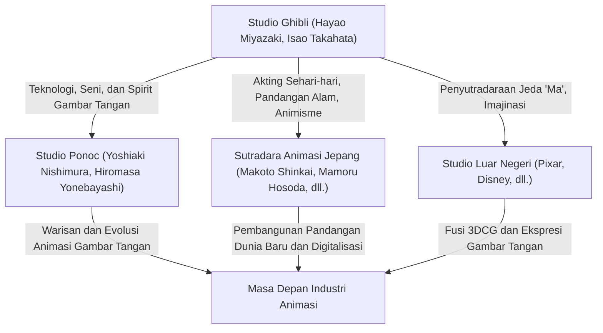

Sang "Menara" memang mungkin telah roboh tak berbekas, namun sekawanan burung layang yang melenggang bebas dari sarang runtuh tersebut akan menyeberangi benua tanpa henti, menanam benih di seluruh permukaan bumi. Bayaran dosa masa kreatif yang ditampilkan pada film "The Wind Rises"; mukjizat tiada batas dari ekspresi coretan perasa "The Tale of the Princess Kaguya", lalu penutup pamungkas dari ketegaran bertahan hidup di hamparan lautan kenyataan dari "The Boy and the Heron". Ketiganya berhasil menembus jeruji pembatas sehelai pita film biasa semata, mekar mendunia menembus batas zaman, melambung ke kasta tertinggi sebagai warisan kultural umat ras manusia yang pantas abadi melegenda.
Pada penghujung tahun 2023, Studio Ghibli resmi berpindah masuk menaungi payung perusahaan raksasa, jaringan penyiaran media Nippon TV; pertanda dibukanya lembaran anyar pada lini pengelolaan manajerialnya. Namun jangan khawatir, karena eksistensi seri perjalanannya, yakni "Babak Kedelapan", dipastikan pantang pudar, tidak akan melenyap walau dibatasi tembok fisikal studio beton biasa. Percayalah, jutaan peninggalan pesona sakti kekuatan teknik lukisan jari para seniman yang menghidupkan seluruh napas Studio, telah terlanjur menjalar mewabah di nadi para perintis baru tanpa nama. Ia memercik tanpa lelah ke permukaan kanvas di semesta alam pada era pasca-Ghibli; menjalin pundi-pundi harapan dan karya orisinal cemerlang secara berkelanjutan di garis horizon dimensi selanjutnya. Titisan darah berharga maha karya Ghibli bukan sekadar menancap abadi pada lembaran rol seluloid berkarat di lemari pamer tua belaka, namun pada sejatinya tergambar terang melalui sumpah masa depan para penikmat pertunjukannya, sebuah penantian aksi nyata bertabur harapan saat mereka semua bangkit sambil menyerukan lantang, "Jadi, bagaimana kita akan menjalani kehidupan setelah ini?".
