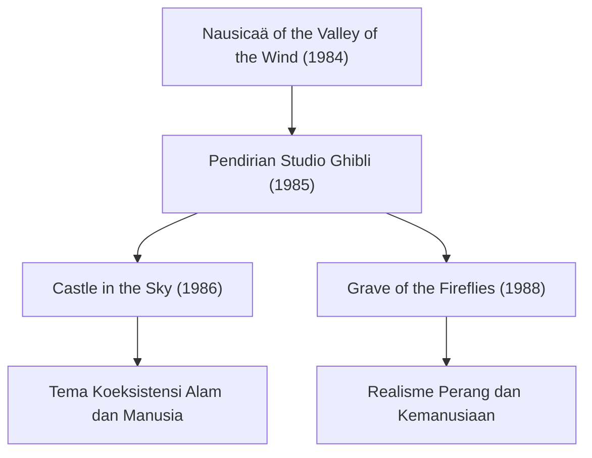

# Jejak Film Studio Ghibli: Pesan Kehidupan dan Alam yang Digambarkan Melalui Animasi

Studio Ghibli telah melampaui batasan sebagai sebuah studio produksi animasi biasa, memegang posisi yang unik bukan hanya di Jepang melainkan juga dalam budaya sinema dunia. Sejak didirikan pada tahun 1985, studio ini telah melahirkan banyak mahakarya bersejarah dengan berpusat pada dua kreator jenius: Hayao Miyazaki dan Isao Takahata. Artikel ini akan mengupas tuntas sejarah Studio Ghibli, evolusi teknisnya, serta transformasi tema yang mengalir di seluruh karyanya dengan memadukan sudut pandang fisika, sejarah, dan teknologi.

## Pendirian Studio Ghibli dan Tantangan Awal

Sejarah Studio Ghibli berawal dari kesuksesan film *Nausicaä of the Valley of the Wind* (*Kaze no Tani no Naushika*) yang dirilis pada tahun 1984. Meskipun secara ketat film ini diproduksi sebelum Ghibli resmi didirikan, kerja sama tim dan pendanaan yang dipupuk selama proses produksinya menjadi fondasi berdirinya studio ini kelak.

Tepat setelah pendiriannya, melalui *Castle in the Sky* (*Tenkuu no Shiro Rapyuta*), Ghibli mengejar puncak teknik animasi tradisional menggunakan seluloid (cel animation). Khususnya, representasi cahaya dari batu terbang (*Aetherium / Levitation Stone*) dan gumpalan awan memanfaatkan teknologi komposisi optik pada masa itu secara maksimal. Teknik untuk mereproduksi fenomena fisika seperti hamburan dan pembiasan cahaya menggunakan seluloid yang digambar tangan serta efek filter saat pengambilan gambar telah meningkatkan standar global saat itu secara signifikan.

## Pertumbuhan Ekonomi dan Fantasi Keseharian: Akhir 80-an hingga 90-an

Di tengah ledakan ekonomi gelembung (bubble economy) di Jepang, Ghibli mengambil langkah yang belum pernah terjadi sebelumnya dengan menayangkan *My Neighbor Totoro* (*Tonari no Totoro*) dan *Grave of the Fireflies* (*Hotaru no Haka*) secara bersamaan. Di satu sisi menggambarkan alam pastoral dan roh penjaga pada era Showa 30-an (1950-an), sementara di sisi lain memperlihatkan kenyataan pahit pada akhir Perang Dunia II. Dua arah yang saling bertolak belakang inilah yang justru menjadi simbol dari multidimensionalitas Studio Ghibli.

Dari segi teknis, sejak periode ini representasi kedalaman menggunakan kamera multiplane (*multiplane camera*) menjadi semakin matang dan halus. Ini adalah teknik di mana gambar latar belakang dibagi menjadi beberapa lapisan dan digerakkan dengan kecepatan berbeda, menciptakan kesan kedalaman fisik secara tiga dimensi (efek paralaks) pada layar dua dimensi. Hal ini merupakan inovasi visual yang dapat dianggap sebagai cikal bakal representasi ruang melalui 3DCG di era digital masa depan.

## Ekologi dan Imajinasi Mitologis: Dampak Dahsyat *Princess Mononoke*

Dirilis pada tahun 1997, *Princess Mononoke* (*Mononoke Hime*) menjadi titik balik besar bagi Studio Ghibli, baik secara teknis maupun tematis. Film ini melukiskan pertarungan sengit antara dewa-dewa hutan dan umat manusia, menyampaikan pesan mendalam dan kompleks yang tidak bisa disederhanakan oleh dualisme hitam-putih antara baik dan jahat.

Hal yang patut mendapat perhatian khusus di sini adalah penggambaran dinamika fluida dalam animasinya. Sebagian teknologi digital (CGI) mulai diperkenalkan untuk menggambarkan geliat kutukan yang menyelubungi Dewa Terkutuk (*Tatari-gami*), percikan darah, serta aliran air. Kendati demikian, fondasinya tetap berakar pada pengamatan dan rekonstruksi hukum fisika oleh tangan para animator. Kemampuan menangkap mekanika Newton secara intuitif—seperti pergerakan zat kental maupun sensasi massa benda yang runtuh mengikuti gaya gravitasi—lalu melebih-lebihkan dan mendistorsikannya secara artistik, memberikan pengaruh mendalam bagi para kreator di seluruh dunia.

## Transisi ke Era Digital dan Pengakuan Internasional: *Spirited Away*

Film rilisan tahun 2001, *Spirited Away* (*Sen to Chihiro no Kamikakushi*), mencetak sejarah dengan memecahkan rekor box office Jepang serta memenangkan Academy Award untuk Film Animasi Terbaik, mengukuhkan reputasi global studio ini secara tak terbantahkan.

Mulai dari film ini, Ghibli beralih sepenuhnya dari animasi seluloid tradisional ke pewarnaan digital (*digital paint*). Namun, mereka tidak menggunakan teknologi digital sekadar untuk "efisiensi", melainkan demi "memperluas daya ekspresi visual". Dengan memadukan simulasi fisik yang hanya dimungkinkan oleh teknologi digital—seperti gradasi warna yang tak terbatas, pengolahan tata cahaya yang rumit, dan kejernihan air—mereka berhasil membangun alur kerja khas yang sama sekali tidak menghilangkan kehangatan goresan tangan manusia.

## Inovasi Isao Takahata dan Puncak Realisme: *The Tale of the Princess Kaguya*

Sementara Hayao Miyazaki menggambarkan dunia melalui kacamata fantasi, Isao Takahata secara konsisten terus meluncurkan eksplorasi avant-garde yang mempertanyakan kembali esensi dan kerangka animasi itu sendiri. Puncak dari eksplorasi tersebut terwujud dalam *The Tale of the Princess Kaguya* (*Kaguya-hime no Monogatari*).

Dalam karya ini, diterapkan pendekatan psikologis tingkat tinggi: garis gambar sengaja dibuat terputus-putus dan dipadukan dengan sapuan warna pastel layaknya lukisan cat air, mendorong otak penonton untuk "menyempurnakan" sendiri gambar tersebut. Pada adegan pelarian kencang di mana energi kinetik seolah meledak, latar belakang digambar dengan sapuan kuas yang kasar demi menghadirkan sensasi distorsi ruang dan kecepatan tinggi ala relativitas secara visual. Ini merupakan teknik ekspresi yang memanfaatkan mekanisme persepsi dan kognisi manusia secara cerdik, berada pada spektrum yang bertolak belakang dari sekadar realisme fotografis.

## Warisan untuk Masa Depan dan Potensi Animasi

Kumpulan karya Studio Ghibli tidak berhenti sebagai hiburan belaka; karya-karya tersebut terus mempertanyakan isu lingkungan yang dihadapi umat manusia, cara kita hidup berdampingan dengan teknologi, serta makna mendasar dari hakikat "hidup". Peralihan dari seluloid ke digital, pencarian tanpa henti terhadap tekstur analog, dan sikap tulus dalam merespons zamannya—jejak langkah ini memperlihatkan potensi tak terbatas yang dimiliki animasi sebagai media ekspresi seni.

Dunia yang dihidupkan oleh Ghibli menyimpan hembusan kehidupan dan keindahan hukum fisika dalam setiap hembusan angin dan riak air yang berkilau. Di masa kini dan mendatang, tugas kitalah untuk terus menelaah pesan yang mereka tinggalkan dan mewariskannya kepada generasi penerus.
