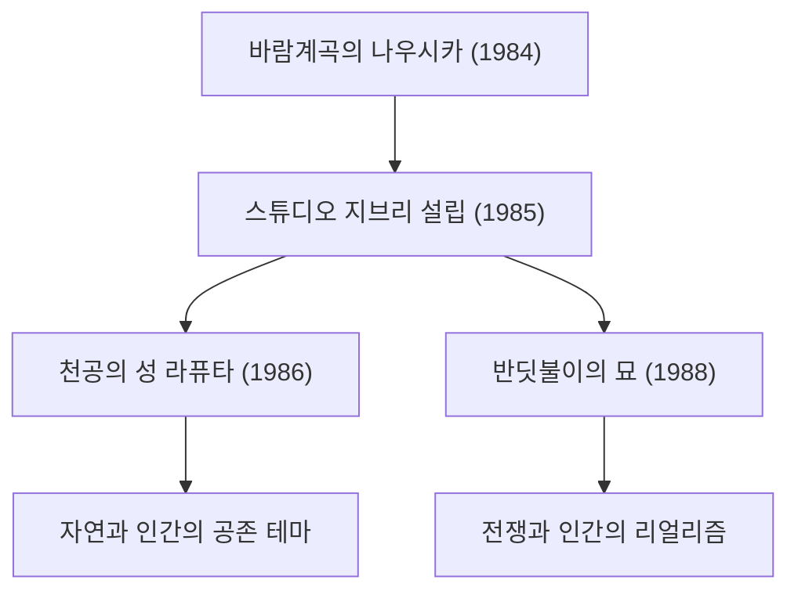

# 지브리 영화의 궤적: 애니메이션이 그리는 생명과 자연의 메시지

스튜디오 지브리는 단순한 애니메이션 제작사의 틀을 넘어 일본뿐 아니라 전 세계 영상 문화에서 독보적인 위치를 차지하고 있습니다. 1985년 설립 이래, 미야자키 하야오와 다카하타 이사오라는 두 천재 크리에이터를 중심으로 수많은 역사적 걸작을 탄생시켜 왔습니다. 본 글에서는 스튜디오 지브리의 역사, 기술적 진화, 그리고 작품 전반을 관통하는 테마의 변천에 대해 물리학적·역사적·기술적 시각을 교차하며 깊이 있게 살펴봅니다.

## 스튜디오 지브리의 창설과 초기 도전

스튜디오 지브리의 역사는 1984년 개봉한 『바람계곡의 나우시카』의 성공에서 시작됩니다. 이 작품은 엄밀히 말해 지브리 설립 전의 작품이지만, 제작 과정에서 다져진 팀워크와 자금이 훗날 스튜디오 설립의 초석이 되었습니다.

설립 직후 발표된 『천공의 성 라퓨타』에서는 셀화를 활용한 전통적인 애니메이션 기술의 극치를 추구했습니다. 특히 비행석의 빛이나 구름의 표현에는 당시의 광학 합성 기술이 유감없이 활용되었습니다. 빛의 산란과 굴절 같은 물리적 현상을 수작업 셀화와 촬영 필터 워크로 재현해 낸 기술은 당시 세계 표준을 크게 끌어올렸습니다.

## 경제 성장과 일상의 판타지: 80년대 후반~90년대

일본이 버블 경제로 들끓던 시기, 지브리는 『이웃집 토토로』와 『반딧불이의 묘』 동시 상영이라는 전대미문의 도전을 감행했습니다. 한편에서는 쇼와 30년대의 목가적인 자연과 정령을 그리고, 다른 한편에서는 제2차 세계대전 말기의 비참한 현실을 묘사했습니다. 이처럼 상반된 두 가지 벡터야말로 지브리가 지닌 다면성을 상징합니다.

기술적으로는 이 시기부터 멀티플레인 카메라를 활용한 원근감(깊이감) 표현이 한층 더 정교해졌습니다. 배경화를 여러 층으로 나누어 배치하고 각각 다른 속도로 움직임으로써 2D 화면에 물리적인 입체감(패럴랙스 효과)을 부여하는 기법입니다. 이는 훗날 디지털 시대 3DCG를 통한 공간 표현의 선구적 시도라 할 수 있는 시각적 연출이었습니다.

## 생태주의와 신화적 상상력: 『원령공주(모노노케 히메)』의 충격

1997년 개봉한 『원령공주(모노노케 히메)』는 스튜디오 지브리에 있어 기술적으로도 테마적으로도 커다란 전환점이 되었습니다. 본 작품에서는 숲의 신들과 인간 간의 처절한 대립을 다루며, 선악 이분법으로는 규정할 수 없는 복합적인 메시지를 던졌습니다.

여기서 주목해야 할 점은 애니메이션에서의 유체역학적 표현입니다. 재앙신(타타리가미)을 휘감는 저주의 꿈틀거림이나 튀는 핏방울, 물의 흐름 등을 표현하기 위해 일부 디지털 기술(CGI)이 도입되었습니다. 그러나 그 근간은 어디까지나 애니메이터들의 손에 의한 물리 법칙 관찰과 재구성에 있었습니다. 점성을 지닌 물체의 움직임이나 중력에 따라 무너져 내리는 물체의 질량감 등, 뉴턴 역학을 직관적으로 포착하여 이를 과장하고 변형해 그려낸 기술은 전 세계 크리에이터들에게 큰 충격을 안겨주었습니다.

## 디지털화로의 전환과 국제적 평가: 『센과 치히로의 행방불명』

2001년 작 『센과 치히로의 행방불명』은 일본 역대 흥행 수익 기록을 갈아치우는 역사적 흥행을 거두었으며, 아카데미 장편 애니메이션상을 수상하는 등 세계적인 찬사를 확고히 다졌습니다.

이 작품을 기점으로 지브리는 전통적인 셀화 작업에서 디지털 페인팅으로 완전히 전환했습니다. 그러나 그들은 디지털 기술을 단순한 '효율화'의 수단이 아니라 '표현력의 확장'을 위한 도구로 활용했습니다. 무한한 색채 계조와 정교한 광원 처리, 투명감 넘치는 물의 묘사 등 디지털 특유의 물리적 시뮬레이션을 도입하면서도, 수작업 특유의 따뜻함을 결코 잃지 않는 독자적인 워크플로를 확립한 것입니다.

## 다카하타 이사오의 혁신과 리얼리즘의 극치: 『가구야 공주 이야기』

미야자키 하야오가 판타지를 통해 세상을 그려낸 반면, 다카하타 이사오는 끊임없이 애니메이션의 틀 자체에 질문을 던지는 전위적인 도전을 거듭해 왔습니다. 그 집대성이 바로 『가구야 공주 이야기』입니다.

이 작품에서는 의도적으로 선을 끊어지게 스케치하고 수채화 같은 옅은 색채를 사용하여 관객의 뇌 안에서 영상을 '보완'하도록 유도하는 고도의 심리학적 접근을 취했습니다. 운동 에너지가 폭발하듯 질주하는 장면에서는 배경을 거친 터치로 그려내어 상대성 이론에 가까운 공간의 왜곡과 속도감을 시각적으로 구현해 냈습니다. 이는 사실주의의 대척점에서 인간의 지각과 인지 메커니즘을 절묘하게 활용한 독창적인 표현 기법입니다.

## 미래로의 계승과 애니메이션의 가능성

스튜디오 지브리의 작품들은 단순한 오락거리를 넘어 인류가 직면한 환경 문제, 기술과의 공존 방식, 그리고 '살아간다는 것'의 근원적인 의미를 끊임없이 되묻고 있습니다. 셀화에서 디지털로의 전환, 아날로그 질감에 대한 집념, 그리고 늘 시대와 마주하는 진지한 태도. 이러한 궤적은 애니메이션이라는 표현 매체가 가진 무한한 가능성을 우리에게 여실히 보여줍니다.

지브리가 그리는 세계는 바람의 사소한 일렁임 하나, 물의 반짝임 하나에도 생명의 숨결과 물리 법칙의 아름다움이 깃들어 있습니다. 우리는 앞으로도 그들이 남긴 메시지를 되새기며, 다음 세대로 그 가치를 계승해 나가야 할 것입니다.
