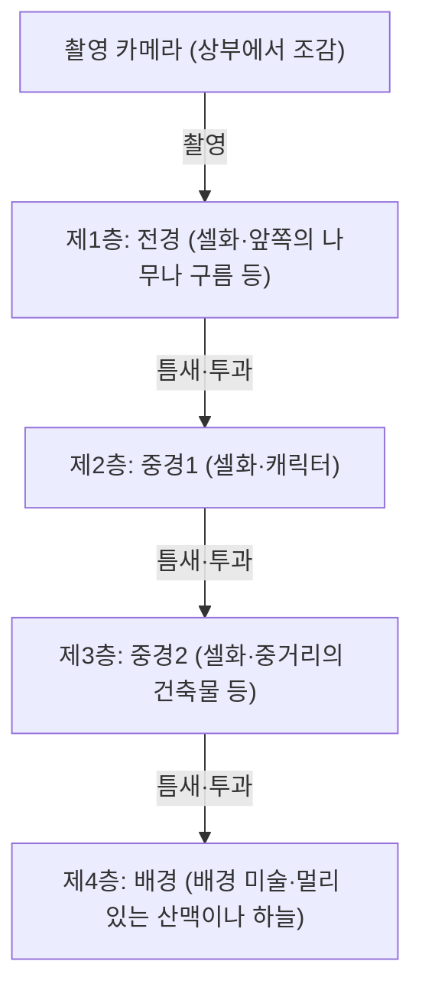
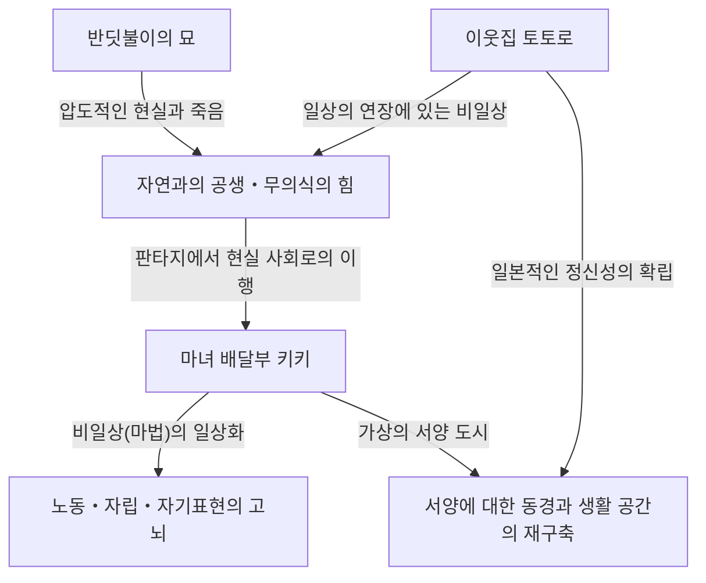
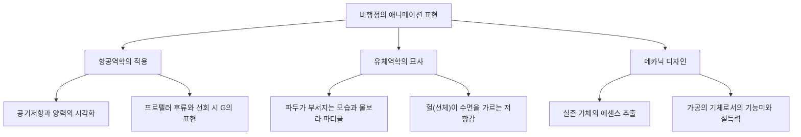
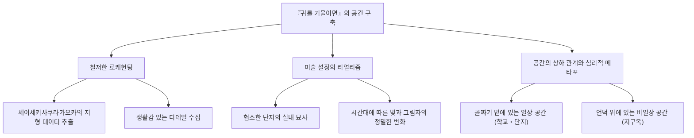
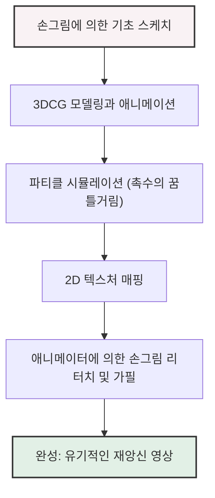
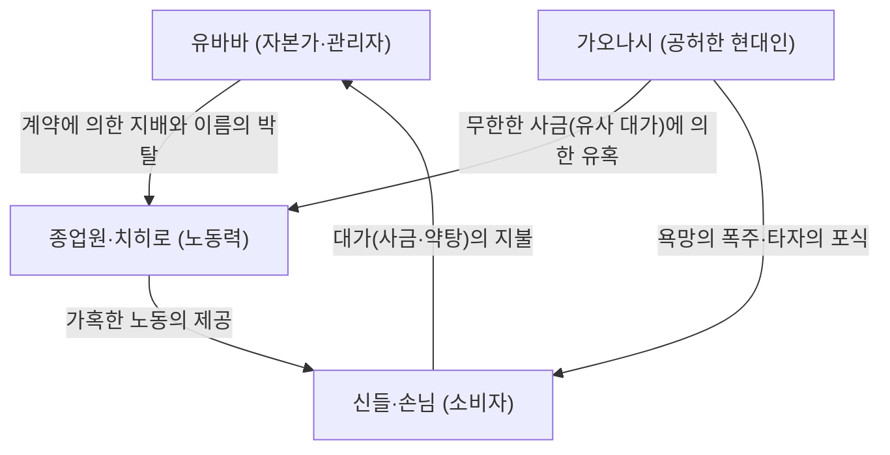
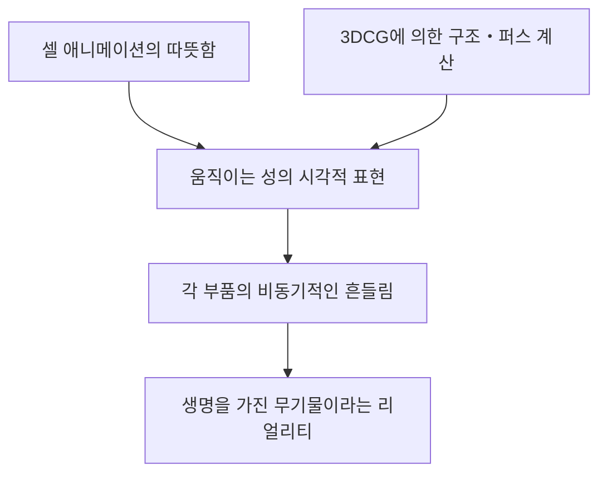
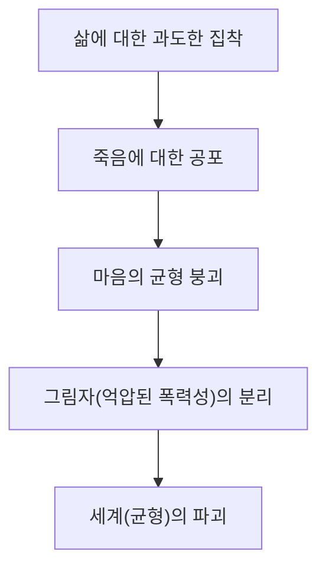
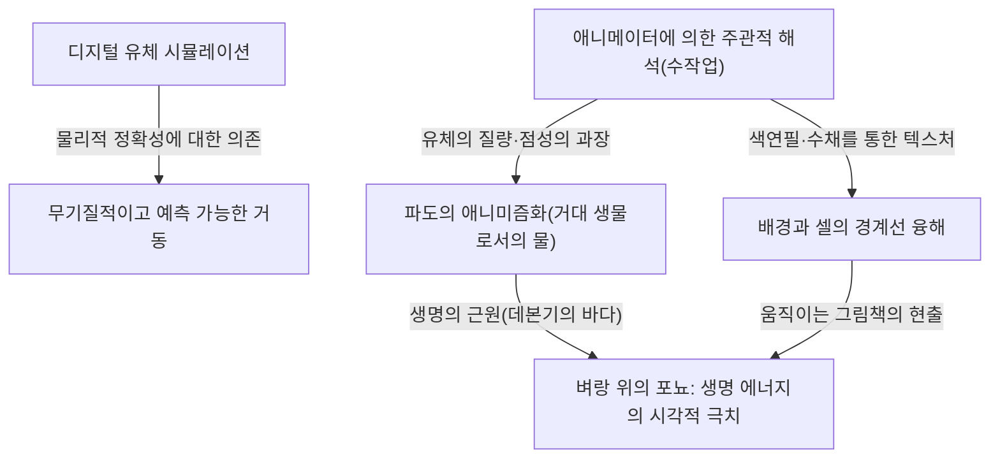
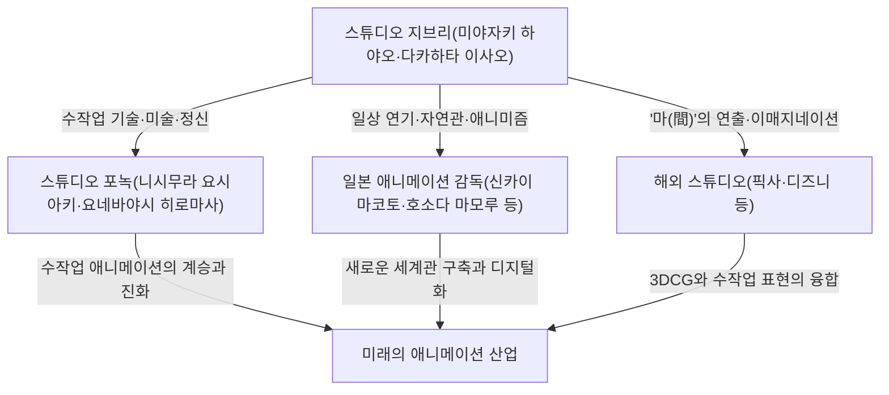

# 제1장: 창설과 초기의 걸작들 (바람계곡의 나우시카, 천공의 성 라퓨타)

## 1.1 애니메이션 역사에서의 특이점, 스튜디오 지브리의 탄생

일본의 애니메이션 산업, 아니 세계의 애니메이션 역사를 조감할 때, 1980년대 중반에 일어난 하나의 '사건'을 무시할 수 없다. 그것이야말로 스튜디오 지브리의 설립이다. 지브리의 역사는 단순한 한 기업, 한 제작 스튜디오의 역사가 아니라 셀화라는 아날로그 기술이 도달한 표현의 극점과 애니메이션이라는 매체가 가진 '대중성'과 '예술성'의 기적적인 융합의 역사 그 자체이다. 본 장에서는 스튜디오 지브리 창설의 경위를 살펴보면서, 그 실질적인 원점인 『바람계곡의 나우시카』(1984년)와 스튜디오 지브리 명의의 첫 작품 『천공의 성 라퓨타』(1986년)에 초점을 맞추어, 다카하타 이사오와 미야자키 하야오라는 두 명의 천재가 어떻게 애니메이션 표현의 한계를 돌파해 나갔는지를 논한다.

스튜디오 지브리의 설립 전야, 일본의 TV 애니메이션은 '리미티드 애니메이션'이라는 기법을 통해 독자적인 진화를 이루고 있었다. 초당 24프레임을 모두 사용하는 디즈니적인 풀 애니메이션에 비해, 매수를 줄이면서도 정지 화상이나 카메라 워크(팬, 틸트 등)를 구사하여 다이너미즘을 연출하는 기법은 비용 절감이라는 필요악에서 시작되어 어느덧 독자적인 영상 문법으로 확립되어 있었다. 그러나 다카하타 이사오와 미야자키 하야오가 목표로 했던 것은 그 틀에 수렴되는 것이 아니었다. 그들은 토에이 동화(현 토에이 애니메이션) 시절부터 길러온, 공간의 치밀한 구축, 생활 연기의 리얼리티, 그리고 무엇보다도 '움직인다는 것의 근원적인 기쁨'을 추구하는 애니메이션을 극장용 장편이라는 최고의 포맷으로 실현하기를 갈망했던 것이다.

## 1.2 다카하타 이사오와 미야자키 하야오의 작가성: 객관성과 주관성의 기적적인 교차

스튜디오 지브리의 작품군을 깊이 이해하기 위해서는 그 핵심을 이루는 다카하타 이사오와 미야자키 하야오라는 두 가지 서로 다른 재능의 성질, 그리고 그 상호작용을 파악해 둘 필요가 있다. 두 사람은 모두 토에이 동화 출신이며 노동조합 활동 등을 통해 깊은 유대감으로 맺어져 있었지만, 애니메이션 연출가로서의 지향성은 대극에 있었다고 해도 과언이 아니다.

미야자키 하야오의 작가성은 압도적인 '주관적 공간 인식'과 '운동의 페티시즘'으로 특징지어진다. 미야자키가 그리는 화면은 물리 법칙을 때로는 초월하면서도 보는 이의 신체 감각에 직접 호소하는 강렬한 설득력을 가지고 있다. 비행 장면에서의 부유감, 거대한 질량을 가진 물체가 움직일 때의 중저음을 느끼게 하는 듯한 중량감, 그리고 미세한 바람의 흐름이나 수면의 반짝임 등 세계 자체가 살아있는 생물처럼 꿈틀거리는 감각은 미야자키의 뇌리에 있는 비전을 애니메이터의 신체를 통해 셀화에 정착시킨 결과이다. 그는 레이아웃(화면 구성)에 있어 광각 렌즈적인 왜곡이나 독특한 원근법을 다용하여 화면의 깊이와 동선을 교묘하게 컨트롤한다.

이에 반해 다카하타 이사오의 작가성은 철저한 '객관성'과 '논리적 구축'에 있다. 다카하타 자신은 그림을 그리지 않는 연출가였기 때문에 애니메이션 화면을 한 단계 더 높은 메타적 시점에서 조감할 수 있었다. 그의 연출은 캐릭터의 심리나 사회 구조, 그리고 일상의 사소한 동작의 리얼리티를 극한까지 파고드는 것에 중점을 둔다. 공간 배치, 조명, 캐릭터의 동기 부여에 이르기까지 모든 것이 치밀한 계산 위에 성립되어 있으며, 관객에게 감정 이입을 촉구하는 한편 항상 한 걸음 물러선 시점에서 세계를 관찰하게 만드는 듯한 브레히트적인 소외 효과도 겸비하고 있다.

이 '주관적·직관적인 미야자키'와 '객관·논리적인 다카하타'라는 두 가지 재능이 서로 견제하고 존경하면서 하나의 스튜디오의 뼈대가 된 것이 지브리의 풍요로운 작품군을 탄생시킨 가장 큰 원동력이었다. 초기의 지브리 작품에서 다카하타는 프로듀서라는 입장에서 미야자키의 폭주를 통제하고 동시에 작품의 골격을 견고하게 만드는 매우 중요한 역할을 수행하고 있다.

## 1.3 셀화 애니메이션의 기술적 특이점과 멀티플레인 카메라

스튜디오 지브리의 대단함은 주제의 심오함뿐만 아니라 그것을 뒷받침하는 압도적인 기술력에 있다. 특히 『나우시카』에서 『라퓨타』에 이르는 시기는 아날로그 셀화 애니메이션 기술이 하나의 완성형, 혹은 '기술적 특이점'에 도달하고 있는 시기였다.

지브리 작품의 화면이 가지는 압도적인 정보량과 실재감은 치밀하게 그려진 배경 미술과 몇 겹으로 겹쳐진 셀화의 레이어에 의해 만들어진다. 여기서 특기할 만한 것은 '멀티플레인 카메라(다단식 카메라)'를 이용한 공간 표현의 극치이다.

멀티플레인 카메라란 카메라 아래에 여러 층(단)의 유리를 설치하고 각각에 셀화나 배경화를 배치하여 촬영하는 장치이다. 이로 인해 카메라가 움직일 때(팬이나 틸트, 트랙 업 등) 각 층의 이동 속도를 다르게 함으로써 유사적인 3차원의 깊이(시차)를 만들어 낼 수 있다. 이 기술 자체는 디즈니 등이 예전부터 사용하던 것이지만, 지브리에서의 멀티플레인 카메라 운용은 그 정교함과 복잡함에 있어서 타의 추종을 불허했다.

미야자키 작품에 불가결한 '비행 장면'은 이 기술의 혜택을 최대한으로 받고 있다. 예를 들어 발아래 펼쳐진 운해, 그 사이를 누비며 나는 비행정, 나아가 멀리 보이는 대지라는 복잡한 공간을 각각의 층이 다른 속도로 흘러감으로써, 관객은 정말로 하늘을 날고 있는 듯한 강렬한 공간 인식과 몰입감을 얻는다. 게다가 셀화의 뒤에서 빛을 비추는 '투과광' 기술이나 에어브러시를 사용한 미묘한 그라데이션 표현, 그리고 바람에 나부끼는 초목을 한 장 한 장 손으로 그려서 움직이게 하는 광기에 가까운 작화 칼로리의 투입으로 화면에는 바람이 불고 공기가 흐른다. 디지털 기술(CGI)이 존재하지 않던 시대에 그들은 물리적인 필름과 물감, 그리고 빛의 마술을 구사하여 현실 이상으로 리얼한 가상 공간을 구축하고 있었던 것이다.

## 1.4 『바람계곡의 나우시카』 (1984년): 전사로서의 금자탑과 에콜로지의 심층

1984년에 개봉한 『바람계곡의 나우시카』는 공식적으로는 스튜디오 지브리 설립 전인 '톱크래프트' 제작 작품이지만, 미야자키 하야오 감독, 다카하타 이사오 프로듀서라는 진용으로 만들어져 이후 지브리의 방향성을 결정지은 실질적인 '제0작' 혹은 '제1작'으로 자리매김한다.

본 작품은 월간지 '아니메쥬'에서 미야자키 하야오 자신이 연재하고 있던 동명 만화를 원작으로 하고 있으나, 영화판은 그 초반 부분을 재구성하여 하나의 독립된 이야기로 완결시키고 있다. 『나우시카』가 애니메이션 역사에 새긴 가장 큰 공적은 '환경 문제(에콜로지)'와 '생명의 존엄', 그리고 '인류의 우행'이라는 지극히 중후한 SF적 테마를 엔터테인먼트의 틀 안에서, 그것도 압도적인 영상미를 통해 끝까지 그려냈다는 데 있다.

'불의 7일간'이라 불리는 최종 전쟁으로 산업 문명이 붕괴한 지 1000년 후. 유독한 장기를 뿜어내는 '부해'라 불리는 균류의 숲이 확대되고 거대한 벌레들이 지배하는 세계. 이 절망적인 세계관 설정은 냉전 하의 핵전쟁의 공포나 심각해지는 환경 파괴에 대한 미야자키의 강한 위기감이 반영되어 있다. 그러나 미야자키는 단순한 '자연 보호'나 '인간의 악'이라는 이원론에 빠지지 않는다. 부해가 사실은 오염된 지구를 정화하기 위한 시스템이라는 극 중의 커다란 반전은 자연이 가진 무서운 자기 회복력과 그 앞에서의 인간의 왜소함을 들이민다.

기술적인 측면에서 『나우시카』를 이야기할 때 빼놓을 수 없는 것이 '오무(왕충)'를 비롯한 거대한 벌레들의 표현이다. 수많은 마디와 눈을 가진 이 이형의 생물이 꿈틀거리며 전진하는 애니메이션은 고무를 이용한 특수한 작화 기법(여러 셀화의 파츠를 어긋나게 하여 촬영하는 기법 등)이나 치밀한 타이밍의 계산을 통해 압도적인 중량감과 불기함, 그리고 일종의 신성함마저 만들어내고 있다. 또한 메베(나우시카가 타는 비행구)의 비상 장면에서의 바람의 저항을 느끼게 하는 천의 움직임이나 중력과 양력의 관계를 시각화한 듯한 매끄러운 궤도는 미야자키 애니메이션의 진면목인 '난다는 것의 카타르시스'를 세계에 알렸다.

나우시카라는 히로인의 조형도 혁신적이었다. 그녀는 단순히 '보호받아야 할 소녀'가 아니라 스스로 메베를 몰고 총을 쏘며 검을 휘두르는 전사이면서 동시에 모든 생명에 대한 깊은 자애를 가진 모성적인 존재이기도 하다. 강함과 다정함, 분노와 슬픔을 아울러 가진 이 복잡한 캐릭터상은 이후의 지브리 작품뿐만 아니라 현대 픽션에 있어서 여성 히어로상의 한 도달점이자 원점이 되었다.

## 1.5 스튜디오 지브리 설립과 『천공의 성 라퓨타』 (1986년): 궁극의 모험 활극

『나우시카』의 성공을 바탕으로 그 이익을 밑천 삼아 1985년에 '스튜디오 지브리'는 정식으로 설립되었다. 그 설립 목적은 단 하나, '질 높은 극장용 장편 애니메이션을 계속해서 만드는 것'이었다. TV 애니메이션의 조악한 남발과는 선을 긋고 타협 없는 퀄리티를 추구하기 위한 독립 거점으로서 지브리는 첫 울음을 터뜨린 것이다.

그리고 1986년, 스튜디오 지브리 명의의 기념비적인 제1회 장편 작품으로 『천공의 성 라퓨타』가 개봉된다. 미야자키 하야오가 초등학생 시절에 구상하고 있었다는 아이디어를 베이스로 한 이 작품은, 스위프트의 『걸리버 여행기』에 등장하는 부유도 라퓨타를 모티브로 소년과 소녀의 만남, 수수께끼의 비행석, 공중 해적, 그리고 사악한 야심을 가진 군대라는 고전적인 모험 활극(보이 미츠 걸)의 왕도 요소를 모두 담아낸, 그야말로 '활극의 극북'이라고도 부를 수 있는 걸작이다.

『라퓨타』의 훌륭함은 숨 쉴 틈 없는 이야기의 추진력과 화면 구석구석까지 펼쳐져 있는 비정상적일 정도의 디테일에 대한 집착에 있다. 초반부 비행선(타이거 모스호)에 대한 도라 일당의 습격 장면에서부터 파즈와 시타가 도망치는 슬래그 계곡의 추격극에 이르기까지 화면은 항상 '동적'이다. 슬래그 계곡의 메카닉적인 조형, 증기 기관의 피스톤 운동, 톱니바퀴의 회전, 그리고 광차의 질주. 이러한 기계나 탈것은 단순한 배경이나 소도구가 아니라 그것 자체가 생명을 가지고 있는 것처럼 역동감 넘치게 그려져 있다. 미야자키가 가진 '기계에 대한 애정'과 '그것이 발산하는 열기나 냄새'조차도 정착시키려는 작화의 열량이 가공의 세계에 압도적인 리얼리티를 부여하고 있다.

테마성에 있어서 『라퓨타』가 제시하는 것은 '고도화된 테크놀로지와 인간의 분단', 그리고 '대지와의 결속'이다. 과거 세계를 지배했던 라퓨타 제국의 초절정 과학력은 최종적으로 스스로를 멸망시키는 원인이 되었다. 영화의 클라이맥스, 붕괴하는 라퓨타의 심부에서 거대한 비행석을 품은 거대한 '큰 나무'가 우주로 상승해 가는 비전은 지극히 상징적이다. 테크놀로지의 상징이었던 인공물이 무너져 내리고 생명의 상징인 큰 나무만이 남는 이 결말은, 시타가 말하는 "흙에 뿌리를 내리고, 바람과 함께 살아가자. 씨앗과 함께 겨울을 넘기고, 새들과 함께 봄을 노래하자. 아무리 무서운 무기를 가지고 있어도, 수많은 가엾은 로봇을 조종하더라도, 흙에서 떨어져서는 살 수 없는 거야"라는 대사에 집약되어 있다. 이것은 『나우시카』에서 이어지는, 현대 문명에 대한 미야자키의 통렬한 비평이며 자연으로의 회귀라는 보편적인 기도이다.

또한 이 작품에 있어서 미술 감독 노자키 토시로와 야마모토 니조에 의한 배경 미술의 공헌은 헤아릴 수 없다. 라퓨타 도달 시의, 운해가 맑게 개고 이끼 낀 거대한 정원과 로봇 병사가 나타나는 장면의 정밀한 아름다움은 애니메이션에 있어서 배경화가 어떻게 작품의 품격을 결정짓는지를 증명하고 있다. 동(動)의 미야자키 연출과 정(靜)의 미술의 완벽한 융합이 여기에 있었다.

## 1.6 결어: 전설의 시작

『바람계곡의 나우시카』와 『천공의 성 라퓨타』. 이 초기의 2대 걸작에서 미야자키 하야오와 다카하타 이사오, 그리고 스튜디오 지브리의 스태프들은 애니메이션이라는 표현 수단이 가질 수 있는 잠재력을 극한까지 끌어내 보였다. 공상의 산물인 가공의 메카닉에 중량과 촉감을 부여하고, 상상 속의 생태계에 리얼리티를 불어넣으며, 복잡한 사회 비평이나 철학적인 테마를 남녀노소가 숨을 죽이고 바라보는 엔터테인먼트 속에 내포시킨다. 이 엄청난 묘기를 그들은 방대한 매수의 셀화와 장인의 광기라고도 할 수 있는 수작업을 통해 이루어 낸 것이다.

이 두 작품은 기술적·표현적 기준을 아득히 높은 곳으로 끌어올렸고, 그 후의 일본 애니메이션계에 '지브리라는 거대한 벽'으로 가로막아서게 된다. 그리고 동시에 이 작은 스튜디오가 이윽고 세계적인 문화 현상을 불러일으키고 애니메이션의 역사 그 자체를 다시 써 내려가게 된다는, 장대한 전설의 문자 그대로의 '제1장'이었다. 뒤이어 나오는 『이웃집 토토로』나 『반딧불이의 묘』, 그리고 『모노노케 히메』에 이르는 여정은 모두 이 『나우시카』의 바람과 『라퓨타』의 하늘에서 시작되었던 것이다.
# 제2장: 일상과 비일상이 교차하는 지점——『이웃집 토토로』『반딧불이의 묘』『마녀 배달부 키키』가 그린 세계

스튜디오 지브리의 역사를 파헤쳐 보면, 1980년대 후반은 결정적인 전환점이 된 시기이다. 전작 『천공의 성 라퓨타』(1986년)에서 그려진 장대한 "검과 마법" 혹은 "하늘을 나는 모험 활극"에서 일변하여, 지브리는 일본의 원풍경이나 서양 서민들의 삶이라는 "일상"으로 크게 키를 돌렸다. 본 장에서는 1988년에 기적적인 동시 상영을 이뤄낸 『이웃집 토토로』『반딧불이의 묘』, 그리고 1989년의 대히트작 『마녀 배달부 키키』의 3작품을 다루며, 이들이 애니메이션 역사에 새긴 기술적・주제적 혁명을 철저하게 해부한다.

## 1. 동시 상영의 광기와 기적: 미야자키 하야오와 타카하타 이사오, 두 개의 "쇼와"

1988년 봄, 『이웃집 토토로』와 『반딧불이의 묘』의 동시 상영이라는, 현재로서는 상상조차 할 수 없는 흥행 형태가 실현되었다. 이는 단순한 상업적인 패키징이 아니라, 스튜디오 지브리라는 조직, 나아가 미야자키 하야오와 타카하타 이사오라는 두 명의 천재 크리에이터가 불꽃을 튀긴 "광기와 기적"의 결정체였다.

### 1-1. 등 맞댄 삶과 죽음
『이웃집 토토로』는 쇼와 30년대(1950년대) 일본의 농촌을 무대로, 자연의 정령과 아이들의 교류를 그린 생명의 찬가이다. 한편, 『반딧불이의 묘』는 쇼와 20년(1945년) 종전 전후의 고베를 무대로, 전화 속에서 목숨을 잃어가는 남매의 처참한 현실을 철저한 리얼리즘으로 그려냈다. 시대 배경은 불과 약 10년밖에 차이 나지 않지만, 이 두 작품은 "삶과 죽음", "이상화된 판타지와 잔혹한 현실"이라는, 완전히 등 맞댄 테마를 내포하고 있다.

당시의 스튜디오 지브리는 두 개의 거대한 재능을 동시에 가동한다는 무모하다고도 할 수 있는 제작 체제를 구축했다. 작화 스태프의 쟁탈전이 벌어졌고, 스케줄은 파탄의 위기에 처했다. 그러나 결과적으로 이 가혹한 환경이 양 작품의 퀄리티를 극한까지 끌어올리게 된다. 미야자키 하야오는 타카하타 이사오의 철저한 리얼리즘에 대한 안티테제로 더욱 힘차고 무의식하의 생명력이 약동하는 『토토로』의 세계를 구축했고, 타카하타는 미야자키가 그리는 판타지에 대항하기 위해 일본 애니메이션 표현을 다큐멘터리적인 차원으로 끌어올렸다.

### 1-2. 쇼와의 묘사 구별과 "애니메이션 다큐멘터리"의 탄생
『반딧불이의 묘』에서의 타카하타 이사오의 연출은 기존 애니메이션의 문법을 파괴하는 것이었다. B29 폭격에 의한 소이탄의 낙하 궤도, 불타오르는 가옥의 불길의 일렁임, 그리고 무엇보다 굶주림으로 쇠약해져 가는 세이타와 세츠코의 신체적 변화. 이것들을 표현하기 위해 색채 설계의 야스다 미치요 등은 기존의 애니메이션 컬러로는 다 표현할 수 없는 "진흙과 피와 그을음에 찌든 다갈색"을 철저하게 추구했다.

대조적으로 『이웃집 토토로』에서는, 미야자키 하야오가 자신의 기억 속에 있는 "과거에 있었을지도 모르는, 아름다운 일본"을 재구축했다. 그것은 단순한 사실주의가 아니라, 아이의 시선으로 본 세계의 "반짝임"을 셀화 위에 정착시키려는 시도였다. 이 두 "쇼와"의 묘사 구별은 애니메이션이라는 매체가 가진 표현의 진폭을 최대한으로 증명하는 것이며, 일본 영화사에 있어 금자탑이 되었다.

## 2. 배경 미술의 혁명: 오가 카즈오와 야마모토 니조가 만들어낸 "공기와 습기"

지브리 작품이 지닌 압도적인 설득력은 캐릭터의 연기뿐만 아니라, 그 뒤에 펼쳐지는 배경 미술의 힘에 의존하는 바가 극히 크다. 이 시기, 스튜디오 지브리의 배경 미술은 하나의 도달점을 맞이하고 있었다.

### 2-1. 오가 카즈오가 그리는 "토토로의 숲"의 습윤한 대기

『이웃집 토토로』의 미술 감독으로 발탁된 오가 카즈오의 공적은 일본 애니메이션 미술의 역사를 바꾸었다고 해도 과언이 아니다. 오가가 그리는 자연은 포스터 컬러의 특성을 극한까지 살린 것이다. 투명 수채화가 아닌 불투명한 포스터 컬러를 사용하면서도, 절묘한 물 조절과 붓의 터치를 통해 일본 풍토 특유의 "습기"나 "숨 막힐 듯한 풀 냄새", 그리고 "나뭇잎 사이로 비치는 햇빛의 온도"까지도 표현해 냈다.

특히 사츠키와 메이가 비 오는 버스 정류장에서 토토로와 조우하는 장면의 배경 미술은 압권이다. 비에 젖은 아스팔트의 질감, 어둠에 잠긴 마을 숲의 깊이, 전등 불빛이 만들어내는 공기의 층. 오가의 미술은 단순한 "풍경의 모사"가 아니라, 그곳에 부는 바람이나 온도, 습도와 같은 "보이지 않는 정보"를 시각화하는 마법이었다.

### 2-2. 서양에 대한 동경과 건축적 리얼리즘
한편, 『마녀 배달부 키키』의 무대가 되는 코리코라는 도시는 스웨덴의 스톡홀름이나 고틀란드 섬의 비스뷔, 나아가 리스본이나 파리 등 유럽의 다양한 도시의 요소를 융합하여 만들어진 가상의 도시이다. 이곳에서의 배경 미술은 일본의 풍경을 그린 『토토로』와는 대극의 벡터를 가지고 있었다.

유럽의 석조 건축물, 기와지붕의 이어짐, 그리고 바다로 이어지는 언덕길. 이것들을 설득력 있게 그리기 위해 지브리의 미술 스태프는 철저한 로케이션 헌팅과 건축 구조 학습을 진행했다. 돌의 질감 하나를 보더라도, 풍화의 정도나 태양 빛의 반사율을 계산하여 애니메이션의 배경으로서 가장 아름답게 보이는 색채로 번역되었다. 이 "서양에 대한 동경"을 단순한 판타지로 끝내지 않고, 현실에서 사람들이 생활하고 노동하는 공간으로서 그려낸 미술의 힘은 경이롭다.

## 3. 『마녀 배달부 키키』에 있어서의 현대적 테마: "노동과 슬럼프"

『마녀 배달부 키키』는 개봉 당시 많은 젊은이들, 특히 일하는 여성들로부터 열광적인 지지를 모았다. 그 이유는 이 작품이 표면적으로는 "마녀 소녀의 성장 이야기"라는 판타지의 껍질을 쓰고 있으면서도, 그 본질에 있어서 극히 현대적이고 보편적인 "노동과 재능(슬럼프)"을 둘러싼 리얼한 드라마였기 때문이다.

### 3-1. 재능이 "노동"으로 바뀌는 순간
주인공 키키는 타고난 "하늘을 나는" 마법의 재능을 살려 택배 일을 시작한다. 이는 현대의 크리에이터나 프리랜서 노동자가 자신의 특기나 재능을 "자본"으로 삼아 사회에 참여해 나가는 과정과 완전히 겹친다. 초반의 키키에게 있어 하늘을 나는 것은 기쁨이자 자기표현이었다. 그러나 그것이 "일(노동)"이 되고, 클라이언트의 불합리한 요구(청어 파이 에피소드 등)에 직면하며, 그 대가로 금전을 받게 되면서 그녀 안에서 마법의 의미가 변질되어 간다.

### 3-2. 슬럼프와 정체성의 상실
중반부, 키키는 갑자기 마법의 힘을 잃고 하늘을 날지 못하게 되며, 검은 고양이 지지의 말도 알아듣지 못하게 된다. 이는 사춘기 소녀의 정체성 흔들림임과 동시에, 크리에이터가 직면하는 "재능의 고갈(슬럼프)"의 완벽한 메타포이다.

여기서 중요한 역할을 하는 것이 숲속 오두막에서 그림을 그리는 미술학도 우르술라이다. 우르술라는 키키에게 "그럴 때는 발버둥 칠 수밖에 없어", "그리고, 그리고, 계속 그리는 거야", "그래도 안 되면 그리는 걸 그만둬. 산책을 하거나 경치를 보거나 낮잠을 자거나, 아무것도 하지 마"라고 말을 건넨다. 이 대사는 미야자키 하야오 자신을 포함한 애니메이터들, 나아가 표현 활동에 관련된 모든 인간이 직면하는 고뇌와 그 처방전 자체이다.

### 3-3. "피로 나는" 것의 각오
우르술라는 자신의 그림에 대해 "전에는 아무 생각 없이도 그릴 수 있었지만, 지금은 달라. 내 자신의 그림을 그려야 해"라고 말한다. 키키의 마법도 마찬가지다. 타고난 재능(마법)만으로 날 수 있었던 무의식의 시대는 끝을 고하고, 그녀는 스스로의 의지와 노력에 의해 마법을 "재획득"해야만 한다. 클라이맥스에서 키키가 대걸레에 올라타 필사적인 형상으로 하늘로 날아오르는 장면은 더 이상 우아한 판타지가 아니다. 그것은 자기 자신의 한계와 마주하며, 피를 토하는 듯한 심정으로 "기술"을 행사하는 프로페셔널의 모습 그 자체이다.

## 4. 테마의 구조와 상호 관계

이 3작품은 언뜻 보기에는 각각 독립된 세계관을 가지고 있는 것 같지만, 지브리의 작가성이라는 축으로 보면 명확한 연속성과 테마의 교차점이 존재한다.

『토토로』가 제시한 "일상 속에 숨어 있는 비일상(판타지)"은 『반딧불이의 묘』라는 극한의 리얼리즘과의 대비를 통해 한층 더 견고한 신화성을 획득했다. 그리고 거기서 확립된 표현 수단과 애니메이션 기술은 『마녀 배달부 키키』에서 "비일상적인 존재(마녀)가 어떻게 현대 사회의 일상(노동)에 녹아들어 가는가"라는 역설적인 테마를 그리기 위한 강력한 무기가 된 것이다.

## 5. 맺음말: 다음 스테이지를 위한 포석

1988년부터 1989년에 걸친 이 시기, 스튜디오 지브리는 "삶과 죽음", "일본과 서양", "판타지와 리얼리즘", 그리고 "재능과 노동"이라는, 애니메이션이 그릴 수 있는 모든 극한을 불과 수년 만에 주파해 버렸다. 여기서 배양된, 일상의 연기를 철저하게 관찰하고 그려내는 기술, 그리고 풍경에 공기와 감정을 깃들게 하는 배경 미술의 힘은 이후의 『추억은 방울방울』(1991년)이나 『붉은 돼지』(1992년)와 같은 더 어른을 위한 복잡한 테마를 가진 작품군으로 이어지게 된다.

『이웃집 토토로』『반딧불이의 묘』『마녀 배달부 키키』의 3작품은 단순한 명작의 나열이 아니다. 그것은 애니메이션이라는 표현 매체가 어린이를 위한 오락에서 인간 정신의 심연이나 사회의 구조적인 고뇌까지도 그려내는 "종합 예술"로 탈피해 나가는, 그 가장 뜨겁고도 가장 고통스러운 우화(羽化)의 순간을 기록한 역사적 모뉴먼트인 것이다.
# 제3장: 비행에 대한 동경과 어른의 로망——『붉은 돼지』와 『귀를 기울이면』에서의 리얼리즘의 도달점

스튜디오 지브리의 역사를 조감할 때, 1990년대 전반부터 중반에 걸쳐 발표된 『붉은 돼지』(1992년)와 『귀를 기울이면』(1995년)은, 얼핏 보면 대극에 위치한 작품처럼 여겨질지도 모른다. 전자가 아드리아해를 무대로, 저주에 의해 돼지의 모습이 된 현상금 사냥꾼 비행정 조종사의 싸움과 애수를 그린 판타지인 반면, 후자는 현대의 다마 뉴타운을 무대로, 중학생 남녀의 풋풋한 사랑과 진로에 대한 갈등을 그린 청춘 군상극이다.

그러나 이 두 작품의 밑바탕에 흐르고 있는 것은, 애니메이션이라는 표현 수단을 이용해 '리얼리즘(현실감)'을 극한까지 추구하고자 하는 스튜디오 지브리의, 아니, 미야자키 하야오와 콘도 요시후미라는 희대의 크리에이터들의 끊임없는 탐구심이다. 그리고 그 근저에는 '비행'——물리적인 하늘을 나는 것, 혹은 스스로의 한계를 넘어 정신적으로 비약하는 것——에 대한 강렬한 동경이 존재한다. 본장에서는 이 두 작품이 애니메이션 역사상 얼마나 특이한 위치를 차지하며, 어떠한 기술적・주제적 성취를 이루어냈는지를, 역사적 배경과 기술론 양면에서 깊이 파헤쳐 본다.

## 1. 『붉은 돼지』——항공역학의 극치와 잃어버린 시대의 만가

『붉은 돼지』(원제: Il Porco Rosso)는 본래 일본항공의 기내 상영용 단편 필름으로 기획되었던 것이, 유고슬라비아 분쟁이라는 현실의 무거운 그림자가 드리워지는 형태로 장편 영화로 발전했다는 특이한 태생을 가진다. 본작은 미야자키 하야오가 스스로를 위해, 그리고 '지쳐서 뇌세포가 두부가 된 중년 남성을 위한 영화'로 만들어낸, 지극히 개인적인 감촉을 지닌 작품이다.

### 1.1 미야자키 하야오와 비행기: 메카닉에 대한 페티시즘과 항공역학의 치밀한 묘사

미야자키 하야오의 '비행'에 대한 집착은 일찍부터 유명하지만, 『붉은 돼지』에서의 비행정 묘사는 그 자신의 메카닉에 대한 페티시즘과 항공역학에 대한 깊은 이해가 가장 순화된 형태로 표출되어 있다. 본작에 등장하는 비행정——주인공 포르코 로소의 애기인 진홍빛 사보이아 S.21(모델이 된 것은 마키 M.33이나 사보이아 마르케티 S.59 등 실존 기체의 요소를 혼효한 오리지널)이나 라이벌인 커티스의 기체, 공적 연합의 잡다한 비행정 무리——은 단순한 배경이나 소도구가 아니라 그 자체로 자율적인 캐릭터로서 약동하고 있다.

특기할 만한 것은, 공기저항, 양력, 프로펠러의 토크, 엔진의 진동, 그리고 수면으로부터의 이수・착수 시의 유체역학적인 표현에 이르기까지, 애니메이션에 있어서의 '물리 법칙의 거짓과 진실'이 절묘한 밸런스로 통제되고 있다는 점이다.

포르코의 사보이아가 엔진을 시동하는 장면에서는 실린더에 불이 붙고, 기체 전체가 미세한 진동을 시작하여, 배기관에서 검은 연기가 뿜어져 나오기까지의 일련의 과정이 셀화의 세밀한 진동과 다중 노출(당시의 아날로그 촬영 기술)을 통해 표현되어 있다. 공중전(도그파이트)의 시퀀스에서는 선회 시의 G(중력가속도)를 견디는 파일럿의 육체적인 부하나, 실속(스톨) 아슬아슬하게 기체를 통제하는 조종간과 러더 페달의 미세한 움직임이 지극히 정확한 타이밍(코마우치)으로 묘사되어 있다. 이는 미야자키 하야오의 뇌내에 존재하는 '비행의 신체 감각'이 애니메이터들의 손을 통해 셀룰로이드 위에 완벽하게 트레이스된 결과이다.

### 1.2 아드리아해의 하늘에 울려 퍼지는 파시즘에 대한 저항과 아나키즘

본작의 무대는 1920년대 말의 이탈리아, 아드리아해. 시대 배경으로는 제1차 세계대전의 상흔이 남아 있고, 무솔리니가 이끄는 파시스트당이 대두하고 있는 광조와 불안의 시대이다. 포르코 로소(본명 마르코 파고트)는 과거 이탈리아 공군의 에이스 파일럿이었으나, 국가와 군대라는 시스템에 절망하여 스스로에게 저주를 걸어 돼지가 되었고, 현상금 사냥꾼이라는 아웃로(아나키스트)로서 살아가는 길을 택했다.

포르코의 "파시스트가 되느니 돼지가 되는 편이 나아"라는 유명한 대사는 단순한 하드보일드풍의 결정적 대사가 아니다. 그것은 국가라는 거대한 폭력 장치에 편입되는 것을 거부하고, 개인의 자유와 존엄을 하늘이라는 무국적의 공간에서 찾는 미야자키 하야오 자신의 강렬한 반파시즘과 아나키즘의 표명이다.

영화 후반, 포르코가 과거의 전우 페라린(현재는 파시스트 공군의 소령)과 영화관에서 밀회하는 장면은 본작의 정치적 배경을 짙게 반영하고 있다. 페라린은 "국가라든가 민족이라든가 시시한 스폰서를 짊어지고 날아야만 해"라고 푸념한다. 여기서는 하늘을 나는 순수한 기쁨이 국가의 이데올로기나 전쟁의 도구로 변질되어 가는 과정이 냉철하게 그려져 있다. 포르코가 돼지가 된 이유는 명시되지 않으나, 그것은 인간끼리 서로 죽이는 부조리한 세계에 대한 깊은 절망이며, 동조 압력을 강화하는 사회로부터 스스로를 소외시키기 위한 방어 기제, 혹은 '인간의 모습을 한 채로는 인간으로서의 존엄을 유지할 수 없다'는 역설의 표현으로 기능하고 있다.

### 1.3 "날지 않는 돼지는 그냥 돼지일 뿐이야"——중년 남성의 로망, 좌절, 그리고 저주

『붉은 돼지』가 많은 어른들의 마음을 사로잡고 놓지 않는 것은, 본작이 '잃어버린 것'에 대한 애절한 만가(엘레지)이기 때문이다. 포르코는 제1차 세계대전에서 스러져간 전우들(구름 평원으로 올라가는 비행기의 환영 장면은 영화사에 남는 명장면이다)에 대한 강한 상실감과 서바이버즈 길트(생존자의 죄책감)를 안고 있다.

지나가 부르는 샹송 '체리가 익어갈 무렵(Le Temps des cerises)'(파리 코뮌의 붕괴를 애도하는 노래로 알려져 있다)이 상징하듯, 이 영화는 지나가 버린 좋은 시절, 결코 손이 닿지 않는 청춘, 그리고 비가역적인 상실에 대한 깊은 노스탤지어로 가득 차 있다. 포르코와 지나의 성숙했지만 결코 교차할 수 없는 거리감을 가진 어른의 연애 묘사는 지브리 작품 중에서도 특이한 위치를 차지한다. 포르코는 '저주'를 핑계로 지나의 애정이나 현실의 사회 참여로부터 도피하고 있는 측면도 있다. "멋지다는 건, 이런 거다."라는 캐치카피의 이면에는, 자신의 미학에 순사하는 것의 고독과 구식이 되어가는 자기 자신을 받아들인다는, 통절한 '중년 남성의 자기 수용'의 이야기가 숨겨져 있는 것이다.

## 2. 『귀를 기울이면』——사춘기의 통절한 리얼리즘과 공간의 마법

1995년에 개봉된 『귀를 기울이면』은, 미야자키 하야오가 프로듀스・각본・콘티를 담당하고, 스튜디오 지브리의 핵심 애니메이터였던 콘도 요시후미가 유일하게 장편 감독을 맡은 기념비적 작품이다. 히이라기 아오이의 동명 순정만화를 원작으로 하면서도, 미야자키와 콘도의 손에 의해 본작은 단순한 러브스토리의 틀을 넘어, 진로, 재능, 그리고 자기실현에 대한 불안으로 흔들리는 사춘기의 리얼한 초상으로 승화되었다.

### 2.1 콘도 요시후미의 시선: 일상의 몸짓에 깃든 애니메이션의 진수

본작의 가장 큰 매력이자 기술적 성취라 할 수 있는 것은, 콘도 요시후미 감독의 철저한 '일상 연기'에 대한 고집이다. 애니메이션에 있어서 마법이나 폭발, 로봇의 전투와 같은 '비일상적(스펙터클)'인 움직임을 그리는 것보다, 사람이 걷고, 앉고, 차를 끓이고, 계단을 뛰어오르는 등의 '아무렇지 않은 일상의 동작'을 정확하게, 그리고 감정을 담아 그리는 편이 훨씬 곤란하다고 여겨진다.

콘도 요시후미는 다카하타 이사오 감독 작품(『반딧불이의 묘』, 『추억은 방울방울』 등)에서 작화 감독을 맡아, 캐릭터의 골격이나 근육의 움직임, 무게 중심의 이동, 그리고 심리 상태를 동작에 반영시키는 '생활 연기'의 달인이었다. 『귀를 기울이면』에서는 그 탁월한 관찰안이 유감없이 발휘되고 있다.

예를 들어 주인공 츠키시마 시즈쿠가 도서관에서 책을 읽을 때의 자세의 변화, 서둘러 계단을 내려갈 때의 발놀림, 혹은 연심과 초조함이 섞인 상태에서 아마사와 세이지와의 대화 시의 시선의 추이나 어깨를 으쓱하는 모습. 이들 하나하나의 미세한 애니메이션이 시즈쿠라는 소녀가 확실히 그곳에 존재하며, 숨 쉬고 있다는 강렬한 실재감을 만들어내고 있다. 이는 판타지 세계를 비상하는 미야자키 애니메이션의 쾌감과는 다른, 현실에 발을 딛고 '인간의 삶'을 그려내는 애니메이션의 진수이다.

### 2.2 로케이션 헌팅과 공간 구축: 다마 뉴타운이라는 '살아있는 거리'

본작의 또 다른 주역은 무대가 된 거리 그 자체이다. 도쿄도의 세이세키사쿠라가오카(다마 뉴타운 근교) 주변에서 진행된 철저한 로케이션 헌팅을 바탕으로, 본작의 미술 배경은 경이로운 리얼리티를 가지고 구축되었다.

미술 감독 구로다 사토시 등에 의한 배경화는 단지의 무기질적인 콘크리트의 질감, 급경사의 비탈길, 좁은 뒷골목, 그리고 해 질 녘의 거리 풍경을 훌륭하게 그려내고 있다. 특히 주목해야 할 것은 시즈쿠가 사는 '좁은 단지'의 묘사이다. 넘쳐나는 책, 잡연한 식탁, 이층 침대가 있는 좁은 자매의 방. 이 숨 막힐 듯한 (하지만 따뜻함이 있는) 리얼한 생활 공간의 묘사가, 시즈쿠의 "이곳에서 벗어나 더 넓은 세계로 가고 싶다"는 비상에 대한 갈망(＝이야기를 쓰고 싶다는 충동)을 뒷받침하고 있다.

또한 거리의 지형(고저차)이 훌륭하게 심리적인 메타포로 기능하고 있다. 시즈쿠의 일상(학교나 단지)은 '아래'에 있고, 신비한 고양이(문)에게 이끌려 당도하게 되는 앤틱 숍 '지구옥(地球屋)'은 가파른 언덕을 다 오른 '언덕 위'에 있다. 이 고저차는 그대로 시즈쿠의 정신적인 상승 지향과, 미지의 영역으로 발을 내딛는 것의 곤란함을 시각적으로 표현하고 있다.

### 2.3 창작을 향한 열원과 자기실현의 아픔: 바론이 이끄는 '내면의 비행'

『귀를 기울이면』은 연애 영화인 동시에, 강렬한 '크리에이터의 자기 계발 이야기'이기도 하다. 바이올린 장인이라는 명확한 목표를 향해 이탈리아로 유학(비행)을 떠나려는 세이지에 대해 초조함을 느낀 시즈쿠는, 자신 안의 '원석'을 확인하기 위해 이야기(『귀를 기울이면』의 작중작인 판타지 소설)를 쓰기 시작한다.

여기서 흥미로운 것은 작중작의 세계에서 시즈쿠가 고양이 남작 바론과 함께 '하늘을 나는' 시퀀스가 삽입되는 점이다. 배경 미술을 '이바라드'로 알려진 화가 이노우에 나오히사가 담당한 이 환상적인 장면은, 『붉은 돼지』의 물리적인 비행과는 대극에 있는, 상상력의 해방으로서의 '내면의 비행'을 그리고 있다.

그러나 본작은 단순한 꿈같은 이야기로 끝나지 않는다. 불면불휴로 다 쓴 소설을 지구옥 주인에게 읽어달라고 한 후, 시즈쿠는 자신의 작품이 거칠고 미숙하다는 것을 통감하고 통곡한다. 창작의 잔혹한 벽에 직면하여, 자신의 재능의 한계(원석인 채로는 빛나지 않는다는 것)를 깨닫는 이 장면의 통절함은, 모든 물건 만들기에 종사하는 인간의 가슴을 찌른다. 미야자키 하야오와 콘도 요시후미는 안이한 성공을 그리는 것을 피하고, "그래도 깎고 계속 다듬어야 한다"는 엄격한 장인의 윤리를 중학생 소녀의 모습을 통해 그려낸 것이다.

## 3. 결론: 비행기와 바이올린, 각각의 '장인'들의 이야기

『붉은 돼지』와 『귀를 기울이면』. 아드리아해의 하늘을 달리는 중년의 돼지와, 다마 뉴타운의 비탈길을 자전거로 뛰어오르는 중학생. 얼핏 아무런 접점도 없어 보이는 이 두 이야기는 '장인 정신에 대한 존경'이라는 축으로 견고하게 맺어져 있다.

포르코의 애기를 완벽하게 수리하고 튠업하는 피콜로 사의 피오나 여성 직공들. 그리고 크레모나에서 바이올린 만들기 수행에 매진하는 세이지나, 앤틱 시계를 계속해서 수리하는 지구옥의 주인. 지브리 작품은 일관되게 자신의 손으로 물건을 만들어내고 기술을 연마해 나가는 '장인(아르티장)'들에 대한 더없는 찬가를 연주해 왔다.

포르코가 하늘의 자유를 지키기 위해 싸우듯이, 시즈쿠 또한 자신 내면의 목소리(이야기)를 자아내기 위해 언어라는 무기를 손에 쥔다. 물리적인 '비행'과 상상력에 의한 '비약'. 표현의 수단은 다르지만, 스튜디오 지브리가 이 시기에 도달한 리얼리즘의 극치는, 현실 세계의 중력(사회의 얽매임이나 자기 자신의 한계)에 저항하며, 그럼에도 불구하고 높이 날아오르려는 인간의 숭고한 의지를 압도적인 영상미로 필름에 새겨 넣은 것이다. 다음 장에서는 이 철저한 리얼리즘과 자연주의가 신화적 상상력과 결합함으로써 탄생한 전대미문의 에픽, 『모노노케 히메』에서의 자연과 인간의 상극에 대해 논해 본다.
# 제4장: 에콜로지와 신화적 상상력 (모노노케 히메)

1997년에 개봉된 『모노노케 히메(원령공주)』는 스튜디오 지브리 및 미야자키 하야오 감독의 커리어에 있어서 명확한 분수령이 된 기념비적 프로토타입이다. 본작은 단순한 애니메이션 영화의 틀을 넘어, 일본 영화사 자체를 다시 쓸 정도의 거대한 문화적·산업적 임팩트를 가져왔다. 본장에서는 이 작품이 가진 중층적인 테마성——일본 중세사의 탈구축, 비이원론적인 선악의 위상, 그리고 기술적 전환점으로서의 CG(컴퓨터 그래픽스)와 전통적 셀 애니메이션의 융합——에 대해 극한까지 상세하게 해명해 나간다.

## 1. 산업적 콘텍스트: 제작비의 폭발과 흥행 기록의 갱신

『모노노케 히메』의 제작은 스튜디오 지브리에게 있어 전례 없는 규모의 사운을 건 거대 프로젝트였다. 애초부터 미야자키 하야오 감독은 "이것이 마지막 은퇴작이 될지도 모른다"는 각오로 임했으며, 그 타협 없는 작가주의는 제작 기간과 예산을 끝없이 팽창시켰다. 총 제작비는 약 20억 엔이라고 일컬어지며, 당시의 일본 영화로서는 상식을 벗어난 금액이다. 작화 매수는 약 14만 4000장에 달했으며, 이는 통상적인 장편 애니메이션의 2~3배에 해당한다.

이 거대한 리스크를 회수하기 위해 스즈키 토시오 프로듀서는 전례 없는 규모의 미디어 믹스와 선전 전략을 전개했다. "살아라."라는 이토이 시게사토에 의한 강렬한 캐치카피는, 당시 일본 사회를 뒤덮고 있던 세기말적·폐색적인 공기감(한신·아와지 대진재나 지하철 사린 사건 등 1995년의 트라우마)에 대한 하나의 해답으로서 기능했다.

결과적으로 본작은 관객 동원 수 1420만 명, 흥행 수입 193억 엔을 기록했다. 당시 일본 영화의 역대 흥행 수입 기록(『E.T.』가 보유하고 있던 기록)을 크게 갈아치우며, 일본에서 '국민적 영화'로서의 스튜디오 지브리의 지위를 확고부동한 것으로 만들었다. 이 산업적 성공은 일본의 애니메이션이 성인 대상의 묵직한 테마를 다루더라도 거대한 비즈니스가 될 수 있음을 증명했고, 이후 애니메이션 산업의 비즈니스 모델에 막대한 영향을 미쳤다.

## 2. 시대 설정과 신화적 재구축: 왜 무로마치 시대인가

미야자키 하야오는 본작의 무대로서 굳이 '무로마치 시대'라는 일본사의 이행기를 선택했다. 기존의 시대극이 즐겨 그렸던 에도 시대(신분 제도가 고정화되어 평화롭고 통제된 사회)나 센고쿠 시대(무장들의 권력 투쟁)가 아니라, 무로마치 시대라는 카오스로 가득 찬 시대를 택한 것에는 깊은 사상적 의도가 있다.

무로마치 시대는 농업 중심의 사회에서 화폐 경제로의 이행, 수공업의 발달, 그리고 무엇보다 '자연에 대한 인간 테크놀로지의 우위'가 명확하게 나타나기 시작한 시대이다. 철의 생산(타타라부키)이 본격화되고 그에 수반하는 삼림 벌채가 진행되는 한편, 여전히 산속에는 깊은 원시림이 남아 있어 신들이 실재한다고 믿어지고 있었다. 즉, 인간과 자연, 혹은 근대와 전근대가 격렬하게 충돌하고 상극하는 경계선의 시대였던 것이다.

역사학자 아미노 요시히코의 '비농업민(장인, 상인, 유녀, 예능민 등)'에 관한 연구(무연·공계·락)에 강하게 영향을 받은 미야자키는, 기존의 '풍요로운 벼의 나라(미즈호노쿠니)'라는 균질적인 일본 사관을 해체했다. 영화에 등장하는 타타라바(제철 마을)는 천황이나 다이묘의 지배가 미치지 않는 일종의 아질(성소·자유 영역)로서 그려진다. 그곳에서는 사회의 주변부로 내몰린 한센병 환자(병자)나 팔려 온 여자들이 철을 생산한다는 고도의 기술력에 의해 자립하고 독자적인 유토피아를 구축하고 있다.

이처럼 『모노노케 히메』는 단순한 판타지가 아니라 역사의 암부에 빛을 비추어 일본인의 아이덴티티와 자연관을 신화의 레벨에서 재구축하려는 시도였다.

## 3. 에보시 고젠과 산: 선악의 비이원론

본작의 가장 획기적인 점은 구태의연한 할리우드적, 혹은 디즈니적인 '권선징악'의 패러다임을 완전히 포기했다는 데 있다. 자연을 파괴하는 측인 인간들을 단순한 '악'으로 단죄하지 않고, 오히려 그들의 삶의 영위와 존엄을 힘차게 그리고 있다.

그 상징이 타타라바의 리더인 에보시 고젠이다. 그녀는 산의 신들을 죽이고 숲을 개척하는 자연 파괴의 원흉인 동시에, 사회로부터 버림받은 약자들을 보호하고 그들에게 살아갈 목적과 존엄을 부여하는 탁월한 휴머니스트이자 혁명가이기도 하다. 에보시는 결코 사리사욕을 위해 숲을 파괴하고 있는 것이 아니다. 인간들이 빈곤과 차별에서 벗어나 자립하여 살아남기 위해서는 자연을 정복하고 철을 생산할 수밖에 없는 것이다. 이 '선한 동기가 결과적으로 타자(자연)의 영역을 침범한다'는 모순이야말로 인간 업보의 본질이다.

이에 맞서는 산(모노노케 히메)은 인간에게 버려져 들개에게 길러진 소녀이다. 그녀는 인간을 증오하고 숲을 지키기 위해 에보시의 목숨을 노리지만, 그녀 자신도 또한 완전한 '짐승'이 되지는 못하는 경계적 존재이다. 아시타카는 이 양립할 수 없는 두 가지 정의——'인간의 생존 권리'와 '자연의 신성성'——사이에 서서 "흐림 없는 눈으로 지켜보고, 결정하는" 것을 시도하지만, 그에게도 명확한 해결책은 발견되지 않는다.

이야기의 결말에서 시시가미(사슴신)는 머리를 돌려받고 소멸하며, 태고의 숲은 사라진다. 그러나 타타라바 또한 붕괴하고, 사람들은 "이곳을 좋은 마을로 만들자"며 제로에서부터의 재출발을 맹세한다. 아시타카와 산은 함께 살아가는 것을 택하지만, 한 지붕 아래에서 살지는 않는다. 아시타카는 타타라바에, 산은 숲에 살며 "때때로 만나러 가겠다"는 공존의 형태를 취한다. 이것은 인간과 자연 사이의 완전한 조화라는 안이한 카타르시스를 거절하고, 영원히 계속되는 긴장 관계 속에서 "살아라"라는 가혹하지만 희망 있는 메시지이다.

## 4. 기술적 전환점: CG와 손그림 애니메이션의 고도 융합

『모노노케 히메』는 스튜디오 지브리에서 컴퓨터 그래픽스(CG)가 처음으로 본격적으로 도입된 작품으로서도 기억되어야 한다. 미야자키 하야오는 오랜 세월 손그림(셀 애니메이션)의 장인적 기술에 절대적인 고집을 가지고 있었지만, 본작에서 표현해야 할 압도적인 다이너미즘과 복잡성을 실현하기 위해서는 디지털 기술의 도입이 불가피했다.

그러나 지브리의 CG 사용은 풀 3DCG로의 이행이 아니라, 어디까지나 손그림의 표현력을 확장하고 보완하기 위한 '디지털 컴포지트'와 '3D/2D의 융합'이었다. CG 컷은 총 1620컷 중 약 100여 컷에 불과하지만, 그 효과는 절대적이었다.

### 재앙신(타타리가미)의 표현

가장 상징적이면서 기술적 난이도가 높았던 것이 오프닝의 재앙신(저주받은 멧돼지 신)의 표현이다. 무수한 뱀과 같은 촉수(뱀 모양의 저주)가 꿈틀거리며, 진흙처럼 얽히고설키며 나아가는 묘사는 손그림 애니메이터에게 악몽과도 같은 작업량이 된다.

여기서 제작팀은 3DCG의 파티클(입자) 시뮬레이션과 손그림 작화를 조합하는 수법을 채택했다. 먼저 촉수의 기본적인 움직임이나 골격을 3DCG로 구축하고, 거기에 손그림 텍스처를 매핑한다. 나아가 그 CG 소재 위에서 애니메이터가 손그림으로 가필(리터치)을 실시함으로써, CG 특유의 무기질적인 차가움을 지워버리고 유기적이며 생생한, 그야말로 '원념' 그 자체와 같은 표현에 도달했다.

### 디지털 매핑과 다이내믹한 카메라 워크

또 하나의 혁신은 배경화(미술)의 디지털 처리이다. 종래 셀 애니메이션에서 카메라를 선회하는 듯한 입체적인 팬(패닝)은 배경을 왜곡시켜 그리는 극히 고도의 장인기(퍼스펙티브의 계산)에 의존하고 있었다.

『모노노케 히메』에서는 아시타카가 마을을 출발하는 장면이나 시시가미의 숲의 깊숙함을 표현하는 장면에서, 3DCG로 구축한 지형 모델에 미술 스태프가 손으로 그린 아름다운 배경화를 텍스처로서 붙이는 '3D 매핑' 기술이 사용되었다. 이로 인해 손그림의 따뜻함과 회화적인 아름다움을 유지하면서, 실사 영화와 같은 공간의 깊이와 종횡무진으로 이동하는 다이내믹한 카메라 워크가 가능해졌다.

또한 시시가미의 발밑에서 식물이 순식간에 발아하고 성장했다가 시들어가는 생명의 사이클도, 모핑 기술과 디지털 컴포지트를 구사하여 표현되었다. 이처럼 『모노노케 히메』에서의 CG는 결코 기술을 과시하기 위한 것이 아니라, 미야자키 하야오의 뇌리에 있는 신화적이면서도 환혹적인 비전을 현실의 스크린에 정착시키기 위한 불가결한 붓(툴)으로서 기능했던 것이다.

## 맺음말

『모노노케 히메』는 스튜디오 지브리가 도달한 하나의 극북이다. 일본의 중세라는 역사적 토양에 깊이 뿌리를 내리면서도, 그곳에서 이야기되는 에콜로지의 문제와 선악의 비이원론은 현대의 글로벌 사회에서 점점 더 액추얼한 의미를 가지기 시작하고 있다. 그리고 손그림과 디지털이 기적적인 밸런스로 융합된 영상미는 전에도 후에도 유례를 찾아볼 수 없는 완성도를 자랑한다. 다음 장 '제5장: 일상의 마법과 향수 (센과 치히로의 행방불명)'에서는 이 신화적 스케일에서 일전하여, 현대 소녀의 심상 풍경으로 잠행해 들어가는 지브리의 새로운 전환에 대해 고찰한다.
# 제5장: 디지털 전환과 세계적 평가 (센과 치히로의 행방불명, 고양이의 보은)

스튜디오 지브리의 역사에 있어, 2000년대 초반은 기술적, 표현적, 그리고 상업적으로 가장 극적인 전환점이 된 시대이다. 본 장에서는 셀 애니메이션에서 풀 디지털 환경으로의 전환이 어떻게 지브리 작품의 영상 표현을 전례 없는 영역으로 넓혔는지, 그리고 그 결실인 『센과 치히로의 행방불명』(2001년)과 차세대를 향한 포석으로서의 『고양이의 보은』(2002년)이 일본 국내의 틀을 넘어 어떠한 세계적 평가와 문화적 영향을 가져왔는지를 전문가의 시각에서 극한까지 상세히 서술한다.

## 1. 아날로그에서 디지털로: 스튜디오 지브리의 기술적 패러다임 시프트와 미학의 재구축

애니메이션 제작에 있어서의 '디지털화'란, 단순히 작업의 효율화나 비용 절감을 의미하는 것이 아니다. 그것은 화면 내에 존재하는 모든 시각 요소를 수치 데이터로서 완전히 통제 가능하게 한다는, 영상 제작의 근원적인 패러다임 시프트였다. 스튜디오 지브리에 있어서 디지털 기술의 도입은, 1997년의 『모노노케 히메』에서 재앙신의 촉수의 꿈틀거림이나 데다라봇치의 반투명한 질감, 일부 3DCG 배경 등에서 시험적으로 이루어졌고, 이어지는 1999년의 『이웃집 야마다군』에서 완전한 디지털 페인트가 채용되었다. 그러나, 미야자키 하야오 감독 작품에 있어, 기존의 셀 애니메이션이 가지고 있던 생생한 질감을 유지하면서 그것을 디지털 공간에서 치밀하게 재구축한다는 지극히 어려운 과업을 완전히 달성한 것은 『센과 치히로의 행방불명』이 최초가 된다.

이 풀 디지털 체제로의 완전한 전환에 의해, 제작 현장에서는 물리적인 '셀화'나 '애니메이션용 물감'이 자취를 감추었다. 종이에 그려진 원화·동화를 스캐너로 고해상도로 스캔하여, 소프트웨어 상에서 디지털 채색을 입히는 워크플로우가 확립된 것이다. 이로 인해, 물리적인 셀화를 여러 장 겹침으로써 발생하던 투과광의 감쇠(그림이 어두워지는 현상)나, 셀 흠집·먼지의 혼입과 같은 아날로그 특유의 물리적 제약으로부터 마침내 해방되었다.

더욱 혁신적이었던 것은 '촬영(컴포지트)' 공정에서의 표현력의 비약적인 향상이다. 화면 상의 오브젝트(캐릭터, 앞쪽의 민달팽이, 안쪽의 건물, 이펙트 등)를 무제한의 레이어로 분할하고, 각각에 다른 초점 심도(피사계 심도)를 가지게 한다는, 실사 영화의 카메라 렌즈를 모방한 고도의 다층적 깊이 표현이 가능해졌다. 아날로그 시대의 멀티플레인 카메라 장치에서는 몇 개 층이 한계였던 공간 표현이, 디지털 공간에서는 무한한 계층을 가지는 것이 가능해져, 유야(기름집)의 우뚝 솟은 듯한 거대함이나, 나락으로 이어지는 계단의 헤아릴 수 없는 깊이가, 압도적인 퍼스펙티브를 가지고 관객의 눈앞에 다가오게 된 것이다.

## 2. 색채 설계·야스다 미치요의 연금술: 풀 디지털 채색이 가져온 색채 표현의 무한한 확장

이 디지털 전환의 가장 큰 혜택을 받은 것이 '색채'라는 요소이다. 스튜디오 지브리 창설 이전부터 미야자키 하야오·타카하타 이사오 작품의 색채 설계를 오랫동안 뒷받침해 온 천재적 컬러리스트, 야스다 미치요는, 디지털 페인트로의 완전한 전환을 통해 전례 없는 마법을 화면에 거는 데 성공했다.

물리적인 물감을 사용하던 시대에는 사용 가능한 색상 수에 명확한 한계가 존재했다. 한 작품에서 사용되는 물감의 종류는 수백 색 정도가 상한선이었으며, 복잡한 음영이나 해 질 녘의 미묘한 환경광의 변화를 표현하기 위해서는 한정된 팔레트 안에서 착시적인 효과를 노릴 수밖에 없었다. 그러나 디지털 환경으로의 전환에 의해 이론상으로는 약 1677만 색(24bit 컬러)이라는 무한한 색상 수를 다루는 것이 가능해졌다.

『센과 치히로의 행방불명』에서 야스다 미치요는 이 무한한 팔레트를 '기교를 부린 사이키델릭한 배색'을 위해서가 아니라, '철저하게 리얼리티 있는 환경광의 재현'과 '캐릭터의 정교한 감정 표현'을 위해 활용했다. 치히로가 길을 잃고 헤매는 신비한 마을이나, 팔백만 신들이 피로를 푸는 '유야(기름집)'의 극채색 조명은 단순히 화려하기만 한 것이 아니다. 붉은 등불의 빛이 젖은 돌바닥에 난반사되는 모습, 치히로의 뺨에 떨어지는 섬세한 그림자, 돼지로 변해버린 부모가 게걸스럽게 먹어 치우는 이계 음식의 기름진 텍스처, 그리고 하쿠가 용의 모습이 되었을 때 비늘의 생생하면서도 투명감 있는 에메랄드그린 등, 각각의 오브젝트가 광원으로부터 받는 영향을 시간대나 공간의 습도에 맞추어 미세하게 컨트롤하고 있는 것이다.

특히 압권인 것은 캐릭터와 미술 배경의 '조화(하모니)'이다. 아날로그 시대에는 아무래도 손으로 그린 배경화와 셀화 사이에 질감의 단절이 생기기 쉬웠으나, 디지털 컴포지트의 도입으로 배경의 공기감(앰비언트 라이트)을 캐릭터의 색채에 스며들게 하기 위한 미세한 디지털 필터 처리가 가능해졌다. 카이바라 전철(바다원전철)을 타고 늪의 바닥으로 향하는 시퀀스에서, 해 질 녘에서 황혼기, 그리고 밤으로 변해가는 하늘과 수면의 색조 변화, 그곳에 승객의 반투명한 그림자가 드리워지는 묘사는, 디지털 그라데이션의 정교한 제어와 야스다의 예민한 색채 감각이 멋지게 융합된 애니메이션 역사에 남을 영상시이다.

## 3. 일본적 애니미즘과 『행방불명』의 민속학

본 작품이 세계적으로 유례없는 평가를 획득한 이유는, 그 압도적인 영상미에 더해 지극히 일본적인 '애니미즘(범령설)'의 세계관을 현대적인 소녀의 통과의례(이니시에이션) 이야기로 훌륭하게 승화시켰다는 점에 있다.

팔백만 신들이 매일의 피로를 풀기 위해 목욕탕에 온다는 설정 자체가 일신교적인 서양의 가치관에서는 지극히 신선하고도 심오하게 비쳤다. 강의 신이 오물이나 인간이 불법 투기한 자전거, 대형 쓰레기 등에 범벅이 되어 '오물신'으로 변해 있는 묘사는, 현대의 환경 파괴에 대한 직접적인 메시지인 동시에 '부정을 불제한다(액운을 씻어낸다)'는 신도의 근원적인 개념의 시각화이다. 이러한 로컬(토착적)한 민속학적 모티프가 글로벌(보편적)한 환경 문제로 매끄럽게 접속되어 있다.

또한 '행방불명(카미카쿠시)'이라는 타이틀이 보여주듯, 본 작품은 삶과 죽음의 경계선을 방황하는 이야기이다. 터널을 빠져나온 앞에 있는 폐허 테마파크, 그곳에서 강을 사이에 두고 존재하는 유야(기름집)는 명백히 '이계' 혹은 '명계'의 메타포이다. 일본의 민간 전승에서, 행방불명을 당한 자가 이계의 음식을 입에 대면 원래 세계로 돌아갈 수 없게 된다는 '요모츠헤구이(황천의 음식을 먹음)'의 금기가, 치히로가 하쿠로부터 신비한 음식을 받는 장면에 짜여 있어, 미야자키 하야오의 깊은 민속학적 교양이 이야기의 골격을 견고하게 지탱하고 있다.

## 4. 유야(기름집)의 시스템과 철저한 자본주의·소비사회 비판

애니미즘의 의장을 두르고 있으면서도, 이야기의 주된 무대가 되는 '유야(기름집)'의 실태는 지극히 근대적인 관료제와 자본주의 사회의 메타포로서 기능하고 있다. 화양절충, 메이지 시대의 의양풍 건축과 전통적인 온천 여관이 그로테스크하게 융합된 듯한 유야의 건축 양식 자체가 혼돈스러운 일본의 근대화 그 자체를 상징하고 있다.

유바바가 정점에 군림하는 이 거대한 유야는 철저한 계층 사회이며, 모든 행동이 '계약'과 '노동'에 의해 규정되는 공간이다. 이곳에서 일하는 자들은 자신의 '이름'을 빼앗긴다. 치히로가 '센'이라는 한 글자로 축감되는 묘사는 정체성의 박탈이며, 인간이 거대한 자본주의 시스템 속에서 교환 가능한 '노동력', '톱니바퀴'로서 규격화되는 과정의 날카로운 은유이다. 일하는 것을 거부하면 동물(돼지나 석탄)로 변해버린다는 규율은 '노동 없는 자는 생존이 허락되지 않는다'는 현대 사회의 냉혹한 현실을 들이밀고 있다.

더욱이 본 작품에 등장하는 '가오나시(얼굴 없는 요괴)'라는 특이한 캐릭터는, 현대의 소비사회가 낳은 병리의 상징으로서 기능한다. 그는 자신의 목소리를 가지지 못하고, 타자의 욕망(사금)을 끝없이 줌으로써만 커뮤니케이션을 도모할 수 있다. 그리고 타자를 삼킴으로써, 그 타자의 목소리나 성격을 빌려 자아를 비대화시켜 간다. 이 가오나시의 모습은 타자와의 진정한 연결 고리를 상실하고, 물질적인 소비나 화폐의 힘에 의해서만 자신의 공허함을 채우려는 현대인의 캐리커처에 다름 아니다. 유야의 종업원들이 가오나시가 뿌리는 돈에 떼 지어 몰려들고, 이윽고 삼켜져 가는 모습은, 욕망의 자본주의가 어떻게 인간성을 파괴하고 공동체를 붕괴시키는가 하는 미야자키 하야오의 냉철한 비평안을 보여준다.

## 5. 세계적 평가의 획득: 아카데미상 수상과 흥행 기록의 수립이 가져온 충격

이러한 겹겹이 쳐진 깊은 주제 의식과, 풀 디지털 채색에 의한 극한의 영상미가 융합된 『센과 치히로의 행방불명』은 애니메이션이라는 미디어의 틀을 가볍게 뛰어넘어, 세계 영화사에 그 이름을 새기게 된다.

2002년의 제52회 베를린 국제 영화제에서 쟁쟁한 실사 걸작들을 누르고, 애니메이션 영화로서는 사상 2번째(『신데렐라』 이후 약 반세기 만)가 되는 최고상 '황금곰상'을 수상했다. 이 쾌거는 애니메이션이 어린이를 위한 엔터테인먼트에 머물지 않고, 고도의 예술 작품으로서 세계적으로 인지된 역사적 순간이었다. 나아가 이듬해인 2003년, 제75회 아카데미상에서 장편 애니메이션 영화상을 획득했다. 디즈니나 픽사의 3DCG 작품이 주류가 되어가고 있던 미국 영화계에서 일본의 2D 손그림 애니메이션(디지털 처리 포함)이 정점에 선 것의 의의는 헤아릴 수 없다.

특히 픽사의 중심인물이자 오랜 기간 미야자키 하야오의 맹우이기도 한 존 라세터가 북미판의 총지휘를 자청한 것은, 지브리 작품의 세계 전개에 있어 결정적인 역할을 다했다. 라세터의 노력에 의해 디즈니의 배급망을 타고 전미에 개봉되어, 전 세계의 크리에이터들에게 'Ghibli'의 존재를 깊이 각인시킨 것이다.

일본 국내에 있어서도 그 사회적 영향력은 절대적이었다. 흥행 수입 316억 8000만 엔이라는 숫자는 당시 일본 영화에 있어 역대 1위의 기록을 더블 스코어에 가깝게 갈아치운 전무후무한 메가 히트였으며, '국민의 4명 중 1명이 극장에서 보았다'고 일컬어질 정도의 사회 현상을 불러일으켰다. 이 성공은 일본 영화 산업 전체의 비즈니스 모델을 크게 변용시켰고, 애니메이션 영화가 실사 영화를 능가하는 거대한 흥행 파워를 가지고 있음을 완전히 증명한 것이다.

## 6. 『고양이의 보은』과 차세대 감독의 기용: 지브리의 다각화와 디지털 체제의 안정화

『센과 치히로의 행방불명』으로 인한 역사적인 대열광 직후, 2002년에 개봉한 것이 모리타 히로유키 감독의 『고양이의 보은』이다. 본 작품은 『귀를 기울이면』의 주인공 츠키시마 시즈쿠가 쓴 이야기라는 스핀오프적인 위치를 가지는 중편 작품(상영 시간 75분)으로, 기획 단계에서는 테마파크를 위한 '고양이 프로젝트'로서 출발한 이색적인 성립 배경을 지닌다.

미야자키 하야오·타카하타 이사오라는 압도적인 카리스마를 지닌 양대 거두 이외의 젊은 피·외부 감독을 기용하여, 스튜디오의 제작 라인을 다양화시킨다는 시도는 지브리에게 있어 항상 중요하고도 곤란한 과제였다. 『고양이의 보은』은 풀 디지털 제작 체제가 스튜디오 내에 기술적으로 정착되었기에 비로소 가능해진, 경쾌하고 풋워크(발놀림)가 가벼운 작품 만들기를 체현하고 있다.

중후한 주제 의식과 압도적인 묘사량으로 관객의 정신을 압도한 『센과 치히로』와는 대조적으로, 『고양이의 보은』은 일상의 바로 곁에 있는 이세계(고양이의 나라)로 헤매어 들어가는 지극히 평범한 여고생 하루의 모험을, 어깨에 힘을 뺀 경묘한 터치로 그리고 있다. 여기에는 디지털 기술을 '중후장대'한 대작뿐만 아니라, '세련된 판타지'를 안정된 스케줄과 높은 퀄리티로 양산하기 위한 인프라로서 기능시키고자 하는 스튜디오의 장기적인 전략을 엿볼 수 있다.

또한 요시다 레이코의 각본이 주는 묘미나 바론(훔베르트 폰 지킹겐 남작), 무타와 같은 매력적인 캐릭터의 조형, 그리고 '자신의 시간을 살지 못하는 자는 자신을 잃어버린다(고양이가 되어 버린다)'라는 테마의 처리 또한 빼어나다. 언뜻 보면 밝은 코미디 터치의 모험 활극이지만, 자기 결정권의 상실이 정체성의 변용(고양이화)을 가져온다는 공포는, 사실 『센과 치히로』에서의 '이름을 빼앗기는' 공포와도 밑바탕이 통하는 지극히 현대적인 테마이며, 그것이 엔터테인먼트의 틀 안에서 훌륭하게 소화되고 있다는 점은 높이 평가받아야 한다.

## 7. 제5장의 총괄: 전통과 혁신의 융합이 낳은 기적의 도달점

2000년대 초반의 스튜디오 지브리는 기술적인 '혁신(풀 디지털 제작 환경으로의 전환)'과 표현에 있어서의 '전통(손그림 애니메이션의 생생한 질감과 일본적 애니미즘)'이 기적적인 밸런스로 교차하며, 전례 없는 높은 경지로 도달했던 황금기였다.

지브리에 있어서의 디지털 기술은 단순한 효율화나 그림을 평탄하게 만들기 위한 툴(안이한 셀 룩 3DCG 등)로서 사용되는 일은 결코 없었다. 그것은 철저하게 '인간의 손에 의해 그려진 선의 힘이나 회화의 가능성을 물리적인 제약으로부터 해방시키고, 더욱 깊고 풍요롭게 만들기 위한 최상급의 도구'로서 완벽히 길들여진 것이다. 야스다 미치요의 색채 설계가 완벽하게 증명했듯이, 최첨단의 테크놀로지는 숙련된 장인이 가지는 탁월한 미의식과 결합되었을 때 비로소 진정한 예술적 도달점에 이르게 된다.

『센과 치히로의 행방불명』이 들이민 압도적인 작가성과 세계관의 강도, 그리고 『고양이의 보은』이 보여준 스튜디오로서의 안정된 제작력과 세대교체·다각화의 가능성. 이 격동의 시기를 거치며, 스튜디오 지브리는 단순한 한 국가의 애니메이션 스튜디오라는 틀을 완전히 파괴하고, 세계의 영화 표현을 견인하는 유일무이한 세계적 브랜드로 변모를 이룩한 것이다. 그러나 이 전인미답의 거대화와 세계적 명성은, 동시에 '미야자키 하야오라는 특이한 천재에 극도로 의존한 시스템으로부터의 탈피'라는, 다음번의(그리고 현재에 이르기까지 지브리를 계속 괴롭히고 있는) 무거운 과제를 스튜디오의 심부에 조용히 들이미는 것이기도 했다.
# 제6장: 반전과 사랑, 마법의 메커니즘 (하울의 움직이는 성, 게드전기)

## 시작하며: 지브리 신시대의 개막과 흔들리는 세계

2000년대 중반, 스튜디오 지브리는 큰 전환점을 맞이하고 있었다. 『센과 치히로의 행방불명』이라는 일본 영화사에 남을 금자탑을 세우고, 아카데미상을 수상하며, 세계적 평가를 부동의 것으로 만든 미야자키 하야오 감독. 그러나 그 발밑에서는 현실 세계가 크게 요동치고 있었다. 2001년의 동시다발 테러에서 이어지는 대테러 전쟁, 그리고 2003년에 발발한 이라크 전쟁. 세계가 분단과 폭력의 연쇄에 집어삼켜져 가는 가운데, 미야자키 하야오의 시선은 보다 직접적으로 '전쟁과 인간의 어리석음'을 향하게 된다.

동시에 스튜디오 지브리 내부에서도 세대교체라는 거대한 과제가 현재화되고 있었다. 본 장에서는, 미야자키 하야오가 이라크 전쟁에 대한 격렬한 분노와 '늙음'의 수용을 압도적인 애니메이션 기술로 그려낸 『하울의 움직이는 성』(2004년), 그리고 미야자키 하야오의 장남인 미야자키 고로가 이례적인 발탁으로 감독 데뷔를 이루고 원작자와의 대립 및 철학적인 테마의 표현에 도전한 『게드전기』(2006년)라는, 지브리의 역사에 있어서 지극히 특이한 위치를 차지하는 두 작품에 대해, 그 기술적, 역사적, 그리고 테마적 측면에서 극한까지 깊이 고찰해 나간다.

---

## 『하울의 움직이는 성』: 스팀펑크의 극치와 반전의 외침

다이애나 윈 존스의 아동 문학 『마법사 하울과 불의 악마』를 원작으로 삼으면서도, 미야자키 하야오는 거기에 자신만의 강렬한 작가성을 쏟아부어, 원작과는 크게 다른 독자적인 이야기를 구축했다. 그것은 마법과 기계가 혼재하는 세계를 무대로 한 장대한 러브 스토리인 동시에 통렬한 반전 영화이기도 하다.

### 1. 움직이는 성의 메커니즘과 애니메이션 기술의 임계점

본작의 진정한 주역이라고도 할 수 있는 것이, 타이틀이기도 한 '움직이는 성'이다. 이 성의 애니메이션 표현은 스튜디오 지브리, 나아가 셀 애니메이션과 3DCG의 융합에 있어서 하나의 임계점을 보여주고 있다.

성의 디자인은 대포, 가옥, 굴뚝, 톱니바퀴, 거대한 새의 발과 같은 보행 다리 등 무수한 정크 부품이 기워 맞춰진 이형의 키메라 건축이다. 이것은 미야자키 하야오가 특기로 하는 스팀펑크적인 메카닉 디자인의 극치이며, 금속이 삐걱거리는 소리, 증기를 내뿜는 밸브, 그리고 볼품없으면서도 어딘가 유머러스하게 보행하는 모습은 거대한 생물로서의 생명감이 넘친다.

기술적으로 특기할 만한 점은, 이 복잡하기 짝이 없는 거대 구조물을 어떻게 애니메이션화할 것인가 하는 과제에 대한 접근이다. 지브리는 『모노노케 히메』의 재앙신이나 『센과 치히로의 행방불명』 등에서 길러온 3DCG 기술을 구사하여, 성의 베이스가 되는 움직임을 CG로 구축했다. 그러나 단순한 3D 모델의 렌더링이 아니라, 그 위에 손으로 그린 텍스처나 디테일을 치밀하게 겹쳐 올림으로써, 지브리 특유의 '따뜻함이 있는 수작업의 질감'과 'CG만의 입체적이고 다이내믹한 퍼스의 변화'를 완벽하게 융합시킨 것이다.

성을 구성하는 각 부품(가옥 부분, 톱니바퀴, 다리 등)은 보행의 충격에 맞춰 각각 다른 타이밍에 흔들리고, 삐걱거리고, 일그러진다. 이 '비동기적인 흔들림'을 계산하여 애니메이션으로 성립시키는 작업은 광기에 가깝다고 할 수 있을 정도의 수고를 요했다. 성이 붕괴하고 다시 재구축되는 종반의 시퀀스에서는 중력과 마법의 힘이 길항하는 모습이 부품 하나하나의 움직임의 벡터에 의해 멋지게 표현되어 있다.

### 2. 이라크 전쟁의 그림자: 미야자키 하야오가 그린 강렬한 반전 메시지

『하울의 움직이는 성』의 제작 중, 현실 세계에서는 미국에 의한 이라크 군사 침공이 시작되고 있었다. 미야자키 하야오는 이 전쟁에 대해 전례 없을 정도의 격렬한 분노와 실망을 품고 있었다. 그 감정은 본작의 곳곳에 강렬하고 어두운 그림자를 드리우고 있다.

본작에 등장하는 전쟁은 명확한 적대국 간의 정의의 충돌로 그려지지 않는다. 어느 쪽이 정의이고 어느 쪽이 악인지 관객에게는 일절 설명되지 않고, 그저 하늘을 뒤덮은 기괴한 군용기가 무차별적으로 거리를 폭격하며 불바다로 만들어가는 모습이 압도적인 절망감과 함께 묘사된다. 이 '이유 없는 파괴'의 공포야말로 현대 전쟁의 본질을 찌르고 있다.

주인공 하울은 마법사로서 군의 소집을 피해 도망치면서도, 밤마다 거대한 새 괴물을 연상시키는 모습으로 변신하여 단신으로 전장에 나가 양국의 군함이나 폭격기를 파괴하고 있다. 그러나 힘을 쓰면 쓸수록 그는 인간성을 잃고 완전한 괴물에 가까워져 간다. 이것은 '평화를 위한 폭력'이라는 모순이 최종적으로 개인의 영혼을 어떻게 좀먹고 파괴해 가는가에 대한 메타포이다. 하울이 불타오르는 거리를 내려다보며 "아군이든 적군이든 살인귀 놈들"이라고 내뱉는 장면에는 이라크 전쟁에 대한 미야자키 하야오 자신의 비통한 외침이 그대로 겹쳐 있다.

기존의 미야자키 작품(예를 들어 『바람계곡의 나우시카』나 『모노노케 히메』)에서는 싸움 속에서 어떻게 살아갈 것인가 하는 테마가 제시되었지만, 『하울』에서는 '전쟁 자체가 절대적인 우행이며, 거기에 참가하는 것 자체가 영혼의 죽음을 의미한다'는 철저한 거부의 자세가 일관되고 있다.

### 3. '늙음'과 '젊음'의 시각적 유전: 소피의 저주가 의미하는 것

본작의 또 다른 획기적인 표현은 주인공 소피의 '연령의 유전'이다. 황무지의 마녀에게 저주를 받아 18세 소녀에서 90세 노파로 모습이 변해버린 소피. 그러나 이야기의 진행과 함께 그녀의 외모는 노파에서 소녀로, 소녀에서 중년 여성으로, 감정의 기복이나 정신 상태에 동조하여 심리스하게 계속 변화한다.

애니메이션에 있어서 캐릭터의 설정(디자인)을 고정하지 않는다는 것은 극히 이례적인 도전이다. 작화 감독 야마시타 아키히코 등은 노파 소피를 그릴 때, 단순히 주름을 늘리는 것이 아니라 골격, 근육의 쇠퇴, 그리고 무엇보다 '중력에 대한 자세의 변화'를 치밀하게 관찰하고 묘사했다. 노파일 때의 소피는 허리가 굽고 보행에 무거움이 수반된다. 그러나 그녀가 하울을 감싸려 할 때나 자신감을 되찾고 힘차게 발언할 때, 그 등은 곧게 펴지고 주름이 사라지며 목소리의 톤마저 젊어진다(바이쇼 치에코의 성우로서의 경이로운 연기력도 여기에 크게 공헌하고 있다).

미야자키 하야오는 이 시각적 트릭을 이용하여 '늙음이란 물리적인 현상인 동시에 심리적인 상태이기도 하다'는 테마를 그려냈다. 소피는 저주를 받기 전부터 자기 평가가 낮고 마음을 닫아 내면적으로는 이미 '늙어' 있었다. 저주는 그녀의 내면을 외면에 반영시킨 것에 불과하다. 그러나 노파라는 사회적인 속성에서 해방됨으로써 아이러니하게도 그녀는 소녀 시절보다 대담하고 에너제틱하게 행동할 수 있게 된다.

이 '연령의 유전' 표현은 애니메이션이 가진 '형태를 자유롭게 바꿀 수 있다'는 특성을 최대한으로 살린 심리 묘사의 극치이며, 사랑을 통해 자기 긍정감을 회복해 나가는 인간 영혼의 궤적을 이보다 더 아름다울 수 없을 정도로 시각화하고 있다.

---

## 『게드전기』: 미야자키 고로의 데뷔와 그림자의 철학

『하울의 움직이는 성』으로부터 2년 후인 2006년, 스튜디오 지브리는 어슐러 K. 르 귄의 세계적 판타지 문학 『어스시의 마법사(게드전기)』를 애니메이션 영화화했다. 그러나 감독 자리에 앉은 것은 미야자키 하야오가 아니라, 그때까지 영상 제작 경험이 일절 없었던 장남 미야자키 고로였다.

### 1. 이례적인 발탁과 제작 배경

『게드전기』의 영화화는 미야자키 하야오에게 있어 오랜 비원이었다. 그러나 원작자 르 귄으로부터 마침내 영화화 허락이 떨어졌을 때, 미야자키 하야오는 『하울의 움직이는 성』을 제작 중이어서 감독을 맡을 수 없었다. 그래서 프로듀서 스즈키 토시오가 백우시(지목)를 날린 것이, 당시 미타카의 숲 지브리 미술관의 관장을 맡고 건축가로서의 커리어를 가지고 있었던 미야자키 고로이다.

스즈키 토시오는 고로가 그린 아렌과 용이 대치하는 콘티에서 '미야자키 하야오에게는 없는 현대적인 어두움, 젊은이의 리얼리티'를 발견했다. 그러나 이 결정에 대해 미야자키 하야오는 맹반발했고, 부자 관계는 단절 상태에 빠졌다. "애니메이션을 전혀 모르는 인간이 감독을 할 수는 없다"는 하야오의 우려는 지당한 것이었고, 고로는 거대한 압박감과 아버지라는 절대적인 벽에 직면하면서 지브리의 베테랑 스태프들을 통솔하여 제작을 지휘해야 하는 가혹한 상황에 놓였다.

### 2. 원작자 어슐러 K. 르 귄과의 알력과 그 본질

완성된 영화 『게드전기』는 흥행적으로는 성공을 거두었으나 비평가나 팬들로부터는 찬반양론의 폭풍을 불러일으켰다. 가장 심각했던 것은 원작자 르 귄과의 결정적인 알력이다.

르 귄은 자신의 사이트에 영화에 대한 코멘트를 발표하며 "It is not my book. It is your movie.(이것은 나의 책이 아니다. 당신의 영화다)"라고 냉철하게 평했다. 그녀가 문제 삼은 것은 원작이 가진 섬세하고 내성적인 테마가 단락적인 액션이나 선악의 이원론으로 바뀌어버렸다는 점이다.

원작 『게드전기』 제1권에서 주인공 게드(새매)가 대치하는 '그림자'는 그 자신의 오만함이나 약함이 구현화된 것으로, 최종적으로 게드는 그 그림자를 쓰러뜨리는 것이 아니라 껴안고 통합함으로써 진정한 자아를 확립한다. 이것은 융 심리학적인 접근에 기반한 깊은 철학이다.

그러나 영화판(주로 원작의 제3권을 베이스로 하고 있다)에서는 주인공 아렌의 내면의 그림자가 그에게서 분리되어 별개의 존재로 그려진다. 그리고 최종적인 클라이맥스는 불로불사를 추구하는 악의 마법사 거미와의 물리적인 전투로 집약되어 버렸다. 르 귄의 눈에는 이 개변이 원작의 핵심인 '내면적 정신의 성장과 수용'이라는 테마를 현저히 훼손하는 것으로 비친 것이다.

### 3. 그림자와 빛의 철학: 아렌의 갈등과 현대 사회의 병리

르 귄으로부터의 비판이나 구성상의 조잡함은 있지만, 미야자키 고로의 『게드전기』에는 2000년대 일본의 젊은이들이 안고 있던 특유의 병리가 날카롭게 반영되어 있다는 점에서 독자적인 가치를 찾아낼 수 있다.

주인공 아렌은 이유도 없이 아버지(국왕)를 찔러 죽이고 나라를 도망친다. 그는 항상 '정체불명의 불안'에 시달리며, 삶에 대한 집착과 죽음에 대한 공포 사이에서 찢겨 있다. 이 아렌의 모습은 버블 붕괴 후의 폐색된 일본 사회에서 명확한 이유 없이 흉악 범죄를 저지르는 젊은이들이나, 삶의 의미를 잃고 '죽고 싶다'고 입에 담는 젊은이들의 심리 상태를 트레이스하고 있다.

영화의 메인 테마인 "생명을 소중히 여기지 않는 녀석 따윈 정말 싫어"라는 테루의 대사는 너무나 직접적이고 설교 같다고 비판받는 경우도 많다. 그러나 미야자키 고로가 건축가로서 환경 문제와 마주해온 경험이나, 거장 미야자키 하야오의 아들로 태어난 주박과 갈등을 고려하면, 아렌의 '자신의 목숨조차 어떻게 해야 좋을지 모르겠다'는 초조함은 고로 자신의 통절한 외침이기도 했다.

또한 불로불사를 희구하고 세계의 균형(밸런스)을 파괴하려는 마법사 거미는 현대의 테크놀로지나 의료 기술에 의해 '죽음'이라는 자연의 섭리를 부정하려는 현대 인류 그 자체의 캐리커처이다. 죽음을 거부하는 것은 곧 삶을 거부하는 것이라는 패러독스. 아렌과 거미의 대립은 표층적으로는 선악의 싸움으로 보이지만, 그 근저에는 '유한한 생명을 어떻게 수용할 것인가'라는 실존적인 물음이 깔려 있다.

애니메이션 기술의 측면에서는 미야자키 하야오 작품과 같은 압도적인 비상감이나 세부까지 피가 통하는 모브 캐릭터의 약동감은 부족하지만, 정밀한 배경 미술(특히 용이 동족상잔을 하는 폭풍의 바다 묘사나, 황폐해진 호트 타운의 음울한 색채)은 세계가 완만하게 죽음을 향해 가고 있다는 종말적인 공기감을 교묘하게 표현하고 있다.

---

## 맺음말: 마법의 대가와 다음 세대로의 계승

『하울의 움직이는 성』과 『게드전기』. 이 두 작품은 스튜디오 지브리가 성숙기를 맞이하고, 동시에 미래에 대한 불안과 마주해야 했던 과도기의 상징이다.

미야자키 하야오는 『하울의 움직이는 성』에서 애니메이션이라는 마법을 극한까지 구사하면서, 그 마법(힘)을 사용하는 것의 무서움과 전쟁이라는 현실의 폭력에 대한 깊은 절망을 그렸다. 그리고 그곳으로부터의 구원을 '늙음을 받아들이는 것'과 '무상의 사랑'에 의탁했다.

한편, 미야자키 고로는 『게드전기』에서 아버지가 만들어낸 거대한 마법의 성에 도전하며, 상처 입으면서도 자신의 목소리로 '삶과 죽음의 수용'을 이야기하려 했다. 그것은 볼품없었을지도 모르지만, 다음 세대가 선인의 유산과 어떻게 마주하고, 어떻게 자신의 그림자를 통합해 나갈 것인가 하는, 스튜디오 지브리 자체의 메타포로서의 통절한 다큐멘터리이기도 했다.

마법(애니메이션)은 만능이 아니다. 그러나 그 한계와 대가를 안 뒤에, 그럼에도 어둠 속에 빛을 그려내려는 영위야말로 이 시대 지브리 작품에 깃든 대단함인 것이다.

(제6장 끝)
# 제7장: 생명의 근원과 수작업으로의 회귀 (벼랑 위의 포뇨, 마루 밑 아리에티)

스튜디오 지브리의 역사, 나아가 일본 애니메이션 역사 전체를 조감해 볼 때, 2000년대 후반부터 2010년대 초반에 걸친 시기는 지극히 특이한 기술적·사상적 전환점으로 자리매김된다. 할리우드에서는 픽사나 드림웍스로 대표되는 풀 3DCG 애니메이션이 영화 시장의 사실상 표준으로 군림하고 있었고, 일본 국내의 TV 애니메이션이나 극장판 작품에 있어서도 제작 공정의 디지털화(디지털 페인트나 3DCG를 통한 배경 및 메카닉 묘사)가 불가역적인 흐름으로서 완전히 정착해 있었다.

그러한 '효율과 계산된 정확성'이 지배하는 디지털 전성기에, 미야자키 하야오 및 스튜디오 지브리는 완전히 반대되는 방향으로 강렬하게 방향을 틀었다. 그것이 '수작업 애니메이션으로의 철저한 회귀'와 '원초적인 생명 표현의 추구'이다. 본장에서는 미야자키 하야오 감독작 <벼랑 위의 포뇨>(2008년)에서 나타난 거시적 유체 애니메이션의 광기와, 요네바야시 히로마사의 감독 데뷔작 <마루 밑 아리에티>(2010년)에서 나타난 미시적 시점 이동 및 스케일감의 재정의를 대비하면서, 지브리가 어떻게 '애니메이션에 있어서의 생명의 숨결'을 필름에 새겨 넣었는지 그 기술적·사상적 심연에 다가간다.

## 1. <벼랑 위의 포뇨>: CG 배척이라는 광기와 '움직이는 그림책'의 현출

스튜디오 지브리가 결코 디지털 기술을 부정해 온 것은 아니다. <모노노케 히메>(1997년)에서의 재앙신 표현이나 디지털 페인트의 도입, <센과 치히로의 행방불명>(2001년)에서의 공간 처리, <하울의 움직이는 성>(2004년)에서 3DCG를 활용한 성의 복잡한 구동 표현 등, 항상 최신 기술을 셀 애니메이션의 맥락에 교묘하게 도입해 왔다. 그러나 <벼랑 위의 포뇨>에서 미야자키 하야오는 의도적으로 3DCG의 사용을 철저히 배척한다는, 시대에 역행하는 결단을 내렸다.

이 결단의 근저에 있었던 것은 디지털 기술이 가져다주는 '과도한 정확성'이 애니메이션 본연의 매력인 '데포르메의 쾌락'이나 '선에 깃든 애니메이터의 신체성'을 앗아가고 있다는 미야자키 자신의 강한 위기감이었다. 결과적으로 본작의 작화 매수는 지브리 작품으로서는 이례 중의 이례인 17만 장을 돌파했다. 이는 리미티드 애니메이션을 기조로 하는 일본 애니메이션 업계에 있어 제정신이라고는 할 수 없는 광기 어린 물량이다.

본작의 시각적인 최대 특징은 색연필이나 수채의 거친 터치를 화면상에 그대로 남기고 있다는 점에 있다. 기존의 셀 애니메이션은 캐릭터(셀)와 배경 미술을 명확히 분리하고, 셀은 균일한 단색 칠로 표현하는 것이 정석이었다. 그러나 <포뇨>에서는 배경 미술과 셀의 경계선을 의도적으로 융해시키고 있다. 색연필의 스트로크나 수채의 번짐이 캐릭터의 윤곽선에도 적용되어, 화면 전체가 하나의 '움직이는 그림책'으로서 일체화되어 호흡하는 듯한 유기적인 텍스처를 획득하고 있다. 이는 기호론적인 애니메이션의 문법을 파괴하고, 관객을 향해 '그림이 움직인다는 것의 원시적인 놀라움'을 직접적으로 부딪치는, 지극히 폭력적일 정도의 작가성의 발로라고 할 수 있다.

## 2. 유체역학과 애니미즘의 융합: 파도의 물리학적 해석

<벼랑 위의 포뇨>에서 애니메이션 기술의 역사에 이름을 남길 최대의 달성은 '물' 및 '파도'의 표현이다. 현대의 영상 제작에 있어 물의 표현은 유체 시뮬레이션(파티클 시스템)을 이용한 CG의 독무대이다. 물리 연산을 이용하면 진짜와 착각할 만큼의 포토리얼한 바다를 생성하는 것은 쉽다. 그러나 미야자키 하야오는 그것을 거절하고, 모든 것을 애니메이터의 연필을 통한 '선'으로 구축했다.

특기할 만한 것은 중반의 압도적인 시퀀스——거대한 고대어 형태를 한 파도 위를 포뇨가 질주하며 소스케를 쫓아가는 장면이다. 이곳에서의 바다는 유체역학에서의 나비에-스토크스 방정식이 지배하는 단순한 뉴턴 유체(H2O의 집합체)가 아니다. 작화 감독인 콘도 카츠야나 원화를 담당한 지브리의 톱 애니메이터들은 물의 거동(관성, 점성, 표면장력, 압력)을 '근육의 약동'이나 '거대 생물의 무거운 질량'으로서 직감적으로 재해석하고 있다.

포뇨가 타는 파도는 표면장력이 한계를 넘어 튕겨 날아가는 순간의 다이너미즘과, 심해에서 솟아오르는 고점도의 젤리 같은 물질감을 동시에 내포하고 있다. 물리학적인 정확성을 굳이 일탈하여, 파도의 끝부분에 거대한 '눈'을 그려 넣는 등의 애니미즘적인 시각화를 행함으로써 '바다 자체가 의지를 가진 거대한 생명체이다'라는 강렬한 감각을 관객에게 심어준다. 파도가 부서질 때의 물보라(비말)조차도 규칙적인 파티클이 아니라, 하나하나가 불규칙한 형상을 가진 '생물'로서 수작업으로 풀 애니메이트되어 있다. 이 '물에 생명을 불어넣는' 작화 작업은 애니메이터들의 정신과 육체를 극한까지 깎아내는 것이었지만, 그 결과로서 CG로는 절대 만들어 낼 수 없는 '열량'과 '중량감'을 수반하는 역사적인 영상이 탄생했다.

## 3. 생명의 근원으로의 퇴행: 캄브리아기 폭발과 어머니의 바다

이야기의 구조나 세계관 구축에 있어서도 <포뇨>는 생명의 근원적인 존재 방식으로의 퇴행을 지향하고 있다. 폭풍우에 의해 완전히 수몰된 소스케의 마을은 일반적인 패닉 영화라면 비참한 재해의 상흔으로 그려졌을 것이다. 그러나 본작에서는 수몰된 마을 위를 고대어(데본기의 양서류나 판피류, 예를 들어 둔클레오스테우스나 보트리올레피스 등)가 유유히 헤엄쳐 다니는, 지극히 축제적이고 아름다운 공간으로서 묘사된다.

이 투명하고 아름다운 수몰 도시는 지구상의 생명이 탄생한 원시의 바다, 혹은 양수로 가득 찬 거대한 자궁의 은유이다. 미야자키 하야오는 여기서 인류가 구축한 취약한 문명 사회(육지)가 압도적인 포용력과 파괴력을 겸비한 자연(바다)에 삼켜지고 융합해 가는 과정을 긍정적으로 그리고 있다. 포뇨라는 존재 자체가 어류에서 반어인, 그리고 양서류를 거쳐 인간(육지의 생물)에 이르는 '진화의 계통수'를 개체 발생으로서 맹렬한 속도로 체현하는 존재이다. 전편을 꿰뚫는 수작업 애니메이션의 압도적인 운동량은 캄브리아기 폭발과도 같은 '생명이 탄생하고 약동하는 순간의 폭발적인 에너지' 그 자체의 표현인 것이다.

## 4. <마루 밑 아리에티>: 스케일감의 마술사·요네바야시 히로마사의 시점

<포뇨>가 압도적인 거시적 스케일로 생명력의 폭발을 그렸다고 한다면, 그 2년 후에 개봉된 <마루 밑 아리에티>는 철저한 미시적 세계에서의 물리학과 시각 표현을 탐구한 걸작이다. 지브리 최고의 실력파 애니메이터이자 '마로'라는 애칭으로 알려진 요네바야시 히로마사의 감독 데뷔작인 본작은, 메리 노튼의 아동 문학을 원작으로 하면서도 '신장 10cm의 소인'이라는 설정을 단순한 판타지의 기믹으로 끝내지 않고, 엄밀한 스케일감의 계산과 치밀한 시점 이동을 통해 압도적인 리얼리즘으로 승화시키고 있다.

요네바야시 감독의 탁월한 공간 인식 능력과 레이아웃(화면 구성) 기술은 우리 인간이 일상적으로 생활하는 거대한 일본 가옥을 아리에티 일행과 같은 소인들에게는 '가파른 절벽', '울창한 숲', '광대하고 위험한 미궁'으로 극적으로 변용시킨다. 못을 발판 삼아 거대한 벽을 오르고, 양면테이프의 점착력을 이용해 높은 곳으로 이동하며, 시침핀을 호신용 검으로서 허리에 찬다. 이러한 액션 묘사는 단순히 인간의 동작을 축소한 것만이 아니다. 10cm라는 스케일에서의 '중력'과 '질감', 그리고 '근력'의 재정의에 기반한, 지극히 물리학적으로 설득력 있는 애니메이션으로 구축되어 있다.

## 5. 마이크로 스케일에서의 유체역학과 음향 설계의 묘미

본작에 있어서의 애니메이션 기술의 백미는 마이크로 스케일에서의 물리 법칙(특히 스케일 효과에 의한 유체나 분체의 거동 변화)의 정교한 시각화이다. 유체역학에 있어서는 물체의 스케일이 극단적으로 작아지면 중력(관성력)보다도 표면장력이나 점성력의 영향이 지배적이 된다는 것이 알려져 있다.

예를 들어, 아리에티의 어머니 호밀리가 티팟으로 차를 따르는 장면을 떠올려 보길 바란다. 인간 사이즈의 세계라면 물은 중력에 따라 가느다란 선 모양이 되어 매끄럽게 흘러내린다. 그러나 10cm 소인의 세계에서는 물의 표면장력의 영향이 상대적으로 지극히 커진다. 그로 인해 부어지는 차는 커다란 물방울 덩어리가 되어 하나의 무거운 젤리처럼 '뚝, 뚝'하고 떨어진다. 이 미시적 세계 특유의 유체 다이내믹스를 애니메이터의 예리한 관찰안과 작화 기술을 통해 완벽하게 재현하고 있는 것이다. 또한, 각설탕 한 알이 가지는 거대한 바위와 같은 중량감이나, 티슈 페이퍼를 뽑아낼 때의 두꺼운 돛대 천과 같은 강성의 표현도 소인의 스케일감을 관객에게 체감하게 하는 중요한 요소가 되고 있다.

나아가, 이 스케일감을 결정짓고 있는 것이 카사마츠 코지에 의한 지극히 섬세하고도 다이내믹한 음향 설계(폴리 사운드)이다. 아리에티의 시점으로 카메라가 전환되면, 인간의 발소리는 거대한 지진 소리 같은 중저음으로 울리고, 냉장고의 모터 소리는 공장 기계실과 같은 굉음이 된다. 한편, 천이 스치는 소리나 물방울이 떨어지는 소리도 소인의 귀 해상도에 맞춰 극단적으로 증폭되어 표현된다. 시각 표현뿐만 아니라 청각에서도 스케일감을 극적으로 조작함으로써 관객은 완전히 아리에티의 10cm 시좌로 몰입(동기화)하게 되는 것이다.

## 6. 피사계 심도의 조작과 매크로 렌즈적 레이아웃

또 하나, <아리에티>의 영상적 특징으로서 놓칠 수 없는 것이 배경 미술에 있어서의 의도적이고도 극단적인 '피사계 심도(보케 효과)'의 조작이다. 통상적으로 스튜디오 지브리 작품의 배경 미술(오가 카즈오나 타케시게 요지 등으로 대표되는 장인 기술)은 화면 구석구석까지 팬 포커스로 치밀하게 그려져 세계의 확장을 제시하는 경우가 많다.

그러나 본작에 있어 소인의 시점을 그리는 컷에서는, 아리에티에게 초점이 맞추어져 있는 배후에서 인간의 가구나 일용품, 식물 등이 마치 일안 반사식 카메라에 매크로 렌즈를 장착하여 근접 촬영한 것처럼 극단적으로 크게 흐려진 채 그려져 있다. 이 '얕은 초점'은 소인의 세계가 항상 거대하고 예측 불가능한 미지(인간의 세계)와 이웃하고 있다는 긴장감이나 폐색감을 시각적으로 표현하는 고도의 레이아웃 수법이다. 디지털 촬영 처리를 이용한 보케 효과의 부가뿐만 아니라 배경 미술의 작화 단계에서부터 의도적으로 윤곽을 흐리게 그린다는 아날로그와 디지털의 융합을 통해 미시적 세계의 공기감을 훌륭하게 표현하고 있다.

## 7. 총괄: 스케일의 양극단에서 그리는 '생명의 빛남'

<벼랑 위의 포뇨>와 <마루 밑 아리에티>. 한쪽은 거시적 시점으로 거칠게 몰아치는 어머니 바다의 에너지와 생명의 폭발을 색연필의 광기와 전편 수작업이라는 수법으로 그려내었다. 다른 한쪽은 미시적 시점으로 조용한 일상의 영위와 미세한 물리 법칙의 묘미를 치밀한 레이아웃과 치밀하게 계산된 시각·청각 컨트롤을 통해 그려내었다.

접근의 방향성은 매크로와 마이크로라는 양극단에 위치하고 있지만, 이 시기의 스튜디오 지브리가 도달한 경지는 동일하다. 그것은 CG가 초래하는 '무기질적인 정확성'에 저항하며 애니메이터의 손에 의해 그려진 선 한 가닥 한 가닥, 배경 붓터치 한 번 한 번에 애니미즘적인 생명을 깃들게 한다는 궁극적인 애니메이션의 모습이다. 거대한 파도의 너울 속에도, 한 방울의 무거운 찻방울 속에도 동일하게 '생명의 빛남'을 찾아내는 지브리의 깊은 통찰력. 그것은 효율화의 물결에 휩쓸려 가는 현대의 영상 산업에 대한, 가장 아름답고 가장 힘차며 그리고 가장 긍지 높은 창작자들의 반역이었다고 할 수 있을 것이다.
# 제8장: 거장들의 집대성과 미래로의 계승

일본의 애니메이션 역사, 나아가 세계의 에포크 메이킹으로서 계속해서 군림해 온 스튜디오 지브리는 2010년대 이후, 창설자인 미야자키 하야오와 다카하시 이사오라는 두 거장의 '집대성'이라고 불러야 할 특이한 단계에 돌입했다. 엔터테인먼트로서의 틀을 넘어, 크리에이터 자신의 업, 철학, 그리고 삶의 종언을 응시한 자기 지시적인 작품군이 탄생하게 된다. 본장에서는 『바람이 분다』(2013), 『가구야 공주 이야기』(2013), 그리고 『그대들은 어떻게 살 것인가』(2023)라는 스튜디오 지브리의 도달점이자 동시에 '파괴와 재생'을 내포하는 세 편의 걸작을 해부하고, 그들이 애니메이션 산업에 남긴 유언과 차세대로의 계승에 대해 기술적·사상적 관점에서 극한까지 상세히 서술한다.

## 1. 『바람이 분다』——창조의 주박과 아름다운 꿈의 끝, 미야자키 하야오의 모순의 고백

2013년에 개봉한 『바람이 분다』는, 미야자키 하야오가 오랫동안 계속 품어왔던 '모순'을, 전례 없을 정도로 생생하게 노출시킨 자전적이라고도 할 수 있는 작품이다. 본작의 주인공 호리코시 지로는, 영식 함상 전투기(제로센)의 설계자인 실존 인물이지만, 미야자키는 거기에 동시대의 문학자 호리 다쓰오의 에센스를 융합시켜, 한 명의 '창조자'의 초상을 그려냈다.

### 병기의 아름다움과 전쟁의 비참함이라는 자기 모순의 극치
미야자키 하야오는 열광적인 병기 매니아·항공기 매니아인 동시에 확고한 평화주의자이다. 이 '아름다운 병기를 사랑하면서, 그것이 살인 도구로 쓰이는 전쟁을 증오한다'는 모순은 『붉은 돼지』나 『하울의 움직이는 성』에서도 단속적으로 그려져 왔다. 그러나 『바람이 분다』에서 그는 더 이상 판타지라는 포장지로 감싸는 것을 그만두었다. 지로의 '그저 아름다운 비행기를 만들고 싶다'는 순수한 기술적 욕구는, 최종적으로 수많은 젊은이를 사지로 몰아넣고, 일본을 초토화시키는 제로센이라는 '저주받은 꿈'으로 결실을 맺는다. 몽상의 공간에서 지로와 대화하는 이탈리아의 항공기 설계자 카프로니는, "피라미드가 있는 세계와 없는 세계, 어느 쪽을 택하겠는가"라고 묻고, "창조적 인생의 허용 시간은 10년이다"라고 고한다. 이것은 재능의 빛남과 그 잔혹한 대가에 대한 깊은 통찰이며, 미야자키 하야오 자신이 애니메이션이라는 '아름다운 허구'를 만들어내기 위해 스스로의 인생과 주변을 얼마나 희생해 왔는가 하는 통절한 참회록이기도 하다.

### 애니메이션 기술에 있어서의 '바람'과 '소리'의 실험적 접근
기술적인 관점에서 보면, 『바람이 분다』는 지브리가 배양해 온 '바람'과 '비상' 표현의 총결산이다. 오프닝의 꿈 시퀀스부터 가루이자와에서의 종이비행기 비행, 그리고 시험 비행에 이르기까지, 대기의 흐름이 눈에 보이는 듯한 작화 기술은 압권이라는 한마디로 요약된다. 기체의 두랄루민 질감이나 리벳 한 알 한 알에 이르는 집념 어린 묘사는, 메카닉에 대한 편애의 극치이다.
게다가 특기할 만한 것은 음향 면에서의 대담한 실험이다. 본작에서는 비행기의 프로펠러 소리, 증기 기관차의 배기음, 나아가 관동대지진의 지명(地鳴)에 이르기까지 많은 효과음(SE)이 '인간의 목소리'로 표현되었다. 이러한 애니미즘적인 접근을 통해, 기계나 자연재해가 마치 의지를 가진 거대한 생물인 것 같은 기이한 생생함을 획득하고 있다. 또한, 주인공 지로의 성우로 『신세기 에반게리온』의 감독인 안노 히데아키를 기용한 것도 상징적이다. 전문 배우가 아닌 안노의 감정 기복이 깎여나간 듯한 투박한 목소리는, 기술에 홀려 움직이는 지로의 '순수하기에 존재하는 광기'를 훌륭하게 체현해 냈다. 결핵을 앓는 아내 나오코와의 아름답고도 잔혹한 나날 또한, 에고이즘과 사랑의 경계선을 모호하게 만드는 미야자키의 리얼리즘을 돋보이게 한다.

## 2. 『가구야 공주 이야기』——여백이 말하는 생명의 역동과 다카하시 이사오의 궁극적 실험

미야자키 하야오가 『바람이 분다』로 자신의 내면을 묘파한 같은 해, 다카하타 이사오는 14년 만의 감독작 『가구야 공주 이야기』로 셀 애니메이션의 역사를 뒤엎는 궁극의 실험을 완성시켰다. 총 제작비 50억 엔, 제작 기간 8년이라는 엄청난 리소스를 쏟아부은 본작은, 애니메이션의 '회화성'을 극한까지 넓힌 미술적 도달점이며, 다카하타 이사오의 유작이자 최고 걸작이다.

### 프레스코 형식과 선의 생생함, 디즈니에 대한 안티테제
일본 애니메이션의 주류인 셀 애니메이션은 균일한 선으로 둘러싸인 영역을 단색으로 칠하는 기법(이른바 애니 칠)을 기본으로 한다. 하지만 다카하타는 그 기법이 "그림에서 생명력을 빼앗고, 완성된 과거의 것으로 만들어 버린다"고 생각했다. 그가 원한 것은 화가가 캔버스를 향해 붓을 놀리는 순간의 '스케치의 생생함(현재 진행형의 역동감)'이다. 애니메이터 오가 가즈오나 타나베 오사무 등을 핵심으로 두고, 본작에서는 연필이나 목탄의 거친 터치, 수채화 같은 옅은 색채를 그대로 스크린에 정착시킨다는 광기 어린 작업이 이루어졌다.
게다가, 다카하타 감독은 '프레스코(프리 스코어링)' 형식을 채용했다. 이것은 성우의 연기를 먼저 수록하고, 그 목소리의 억양이나 숨결, 나아가 수록 당시의 표정이나 몸짓(비디오 카메라로 촬영되고 있었다)을 바탕으로 애니메이터가 그림을 그려내는 기법이다. 이를 통해 아사쿠라 아키(가구야 공주)나 코라 켄고(스테마루) 등이 내는 목소리의 리얼리티가, 캐릭터의 미세한 근육 움직임이나 감정의 기미와 완전히 싱크로되어 압도적인 실재감을 획득했다. 이것은 기호화된 캐릭터 표현에 의존하기 쉬운 현대 애니메이션에 대한 통렬한 안티테제였다.

### 여백의 미학과 감정의 폭발——질주 시퀀스의 충격
『가구야 공주 이야기』의 가장 큰 기술적·연출적 특징은 '여백(그려 넣지 않는 미학)'이다. 화면의 가장자리는 수채화처럼 흐릿하게 처리되고, 배경조차도 완전히 그려 넣지 않는 경우가 많다. 다카하타는 '관객의 상상력이 파고들 여지'를 남김으로써, 반대로 스크린 너머로 펼쳐지는 세계의 깊이를 관객이 보완하게 하여 능동적인 감상을 촉구했다.
이 기법이 가장 무시무시한 효과를 발휘한 것이, 가구야 공주가 궁의 연회에서 도망쳐 산을 향해 질주하는 시퀀스이다. 그녀의 분노와 절망, 속박에 대한 저항이 정점에 달한 순간, 정중한 선화는 돌연 거친 수묵화 같은 터치로 변모하고, 배경은 감정의 격류에 휩쓸린 것처럼 데생 수준까지 붕괴한다. 선이 어지럽고 색이 흩날리는 이 장면은 애니메이션이 '그려진 기호'에서 '순수한 감정의 시각화'로 비약한 순간이며, 세계 영화사에 새겨져야 할 기적적인 명장면이다. 달의 도시 묘사에서의 무기질적이고 불교적인 음악과의 대비도 지구의 '더러움'과 '생명의 기쁨'을 긍정하는 다카하타의 사생관을 부각시키고 있다.

## 3. 『그대들은 어떻게 살 것인가』——상징주의의 미궁과 차세대로의 유언

2013년에 한 번은 장편에서의 은퇴를 선언했던 미야자키 하야오가, 10년의 세월을 거쳐 완성시킨 『그대들은 어떻게 살 것인가』(2023). 본작은 예전의 『센과 치히로의 행방불명』처럼 카타르시스를 동반하는 왕도의 모험 활극이 아니라, 꿈과 현실, 삶과 죽음, 그리고 창조와 파괴가 뒤섞이는 지극히 난해하고 상징주의적인 미궁이다.

### 자전적 요소와 과거작의 총괄적 은유
주인공 마히토는, 어릴 적 어머니를 화재로 잃고 군수 공장을 운영하는 아버지와 함께 피난을 간다. 이 설정 자체가 미야자키 자신의 유년기 체험(우쓰노미야로의 피난, 공습의 기억, 어머니에 대한 사모)을 짙게 반영하고 있다. 그를 이세계로 이끄는 기괴한 왜가리는, 미야자키의 오랜 맹우이자 때로는 격렬하게 충돌했던 프로듀서 스즈키 도시오의 은유로도, 혹은 미야자키 자신의 내면의 트릭스터로도 해석할 수 있다.
이세계(아래의 세계)는, 지금까지의 지브리 작품의 모티프가 기괴하게 왜곡되고 재구축된 듯한 공간이다. 『천공의 성 라퓨타』를 떠올리게 하는 거석, 『원령공주』의 코다마를 닮은 와라와라, 『센과 치히로』의 온천장을 방불케 하는 양관. 그러나 그것들은 단순한 팬 서비스나 셀프 패러디가 아니다. 미야자키가 자신의 뇌리에 축적된 '이매지네이션의 무덤', 혹은 업의 집적을 관객에게 제시하고 있는 것처럼 보인다. 인간을 잡아먹는 펠리컨이나 파시즘을 암시하는 듯한 잉꼬 떼는 인간의 역사가 가진 폭력성이나 대중의 광기를 날카롭게 비판하고 있다.

### 붕괴하는 '탑'과 애니메이션 산업에 대한 메타포
본작의 핵심은, 이세계의 균형을 유지하는 '큰할아버지'의 존재이다. 그는 우주에서 떨어진 운석(탑) 안에서 악의 없는 나무 블록을 쌓음으로써 세계의 밸런스를 간신히 유지하고 있다. 이 큰할아버지야말로 다카하타 이사오, 혹은 미야자키 하야오 자신(=스튜디오 지브리의 창조신)의 메타포라는 것은 의심할 여지가 없다. 큰할아버지는 마히토에게 "악의 없는 돌로 너 자신의 아름다운 세계를 만들어라"라며 후계자를 부탁하지만, 마히토는 스스로의 머리에 있는 상처(자신이 한 거짓말과 악의의 상징)를 가리키며, 완전무결한 허구의 세계를 잇는 것을 거절한다. 그리고 탑은 붕괴하고 새들은 현실 세계로 풀려난다.
이것은 미야자키 하야오가 내린 '스튜디오 지브리라는 제국의 종언' 선언이나 다름없다. 자신들이 구축한 애니메이션이라는 마법의 탑은 이미 수명을 다했다. 차세대는 과거의 거성이 만들어낸 안전하고 무균한 탑 안에 머무르는 것이 아니라, 상처와 악의로 가득 찬 현실 세계(불바다)를 스스로의 발로 살아나가야 한다. 이 내동댕이치는 듯한, 그러나 힘찬 메시지야말로 『그대들은 어떻게 살 것인가』라는 타이틀에 담긴 미야자키 하야오의 유언이다.

## 4. 스튜디오 지브리의 유산과 애니메이션의 미래——포녹으로의 계보와 앞으로

거장 두 사람이 도달한 극지와, 그 '탑'의 붕괴를 거쳐 스튜디오 지브리의 유전자는 어떻게 미래로 계승되는 것일까. 미야자키·다카하타의 압도적인 카리스마와 천재적인 작가성에 의존하던 지브리는 조직으로서의 신진대사나 시스템화라는 측면에서는 항상 과제를 안고 있었다. 그러나 그들이 키워낸 애니메이터들과 그 정신은 확실하게 업계 전체로 파급되어 새로운 생명을 싹틔우고 있다.

### 스튜디오 포녹과 수작업 애니메이션의 계승
그 가장 직접적인 후계자라고 할 수 있는 것이, 지브리의 프로듀서였던 니시무라 요시아키가 설립한 '스튜디오 포녹'이다. 『마루 밑 아리에티』, 『추억의 마니』를 감독한 요네바야시 히로마사를 중심으로 설립된 이 스튜디오는 『메리와 마녀의 꽃』이나 『다락방의 라저』를 통해 지브리가 배양해 온 고도의 '수작업 애니메이션' 기술과 역동적인 배경 미술의 전통을 현대에 이어받고 있다.
현대의 애니메이션 제작은 3DCG나 디지털 툴로의 이행이 두드러지지만, 수작업 특유의 선의 따스함이나 물리 법칙을 뛰어넘은 애니메이션적인 과장(오바케 작화나 중력의 데포르메)을 유지·발전시키려는 포녹의 시도는 지극히 중요하다. 그들은 지브리의 모방에 머물지 않고 단편 앤솔러지 『작은 영웅』 등에서 새로운 크리에이터의 육성에도 주력하며, 수작업 애니메이션의 등불을 꺼뜨리지 않기 위한 정통적인 기술적 계승을 담당하고 있다.

### 영향의 확산과 지브리의 앞으로
지브리의 유전자는 포녹에만 머물지 않는다. 픽사 애니메이션 스튜디오의 전 CCO 존 라세터를 비롯해, 전 세계의 톱 크리에이터들이 미야자키나 다카하타의 연출 기법, 특히 '마(間)'를 두는 방식이나 일상의 미세한 동작(식사, 청소, 보행 등)에 깃든 캐릭터의 생명감에서 지대한 영향을 받고 있다. 신카이 마코토나 호소다 마모루 같은 현대 일본 애니메이션을 견인하는 감독들의 작품에도, 풍경 묘사나 애니미즘적 자연관에 있어서 지브리의 각인이 깊게 찍혀 있다.

'탑'은 붕괴했을지도 모르지만, 그곳에서 날아오른 새들은 전 세계로 흩어져 새로운 씨앗을 뿌리고 있다. 『바람이 분다』에서 제시된 창조의 업, 『가구야 공주 이야기』에서 증명된 표현의 무한한 가능성, 그리고 『그대들은 어떻게 살 것인가』에서 들이밀어진 현실을 살아가는 각오. 이것들은 단순한 영화 작품의 틀을 넘어 인류의 문화유산으로서 영원히 이야기될 것이다.
2023년 말, 스튜디오 지브리는 닛폰 TV 산하에 들어가며 기업으로서 새로운 국면을 맞이했다. 그러나 스튜디오 지브리의 '제8장'은 물리적인 스튜디오의 틀을 넘어 계속되어 간다. 그들이 남긴 물음과 압도적인 수작업 기술은, 앞으로 태어날 무수한 크리에이터들의 손에 의해 다음 시대의 새로운 캔버스에 그려져 나갈 것이다. 지브리의 진정한 유산이란 과거의 필름 속이 아니라, 그것을 본 우리가 '어떻게 살 것인가'라는 미래의 행동 그 자체에 맡겨져 있다.
