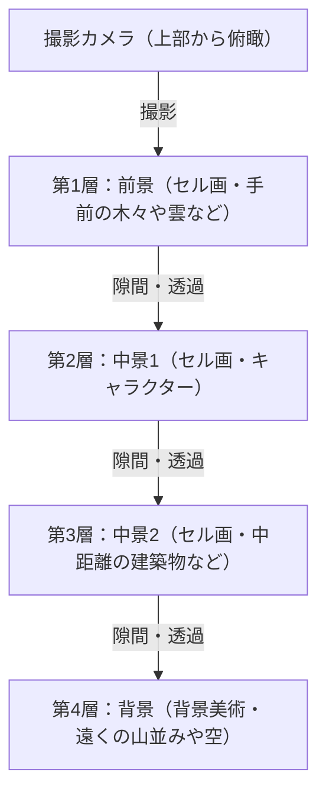
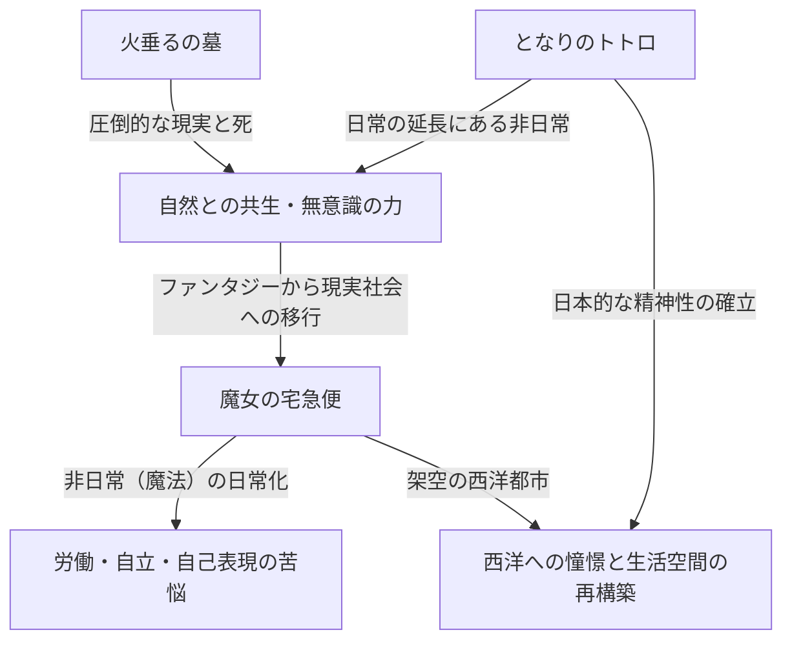
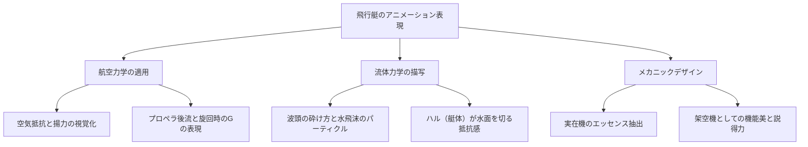
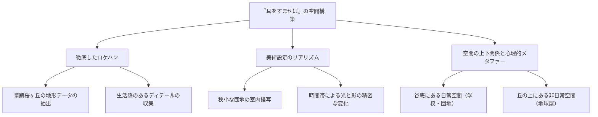
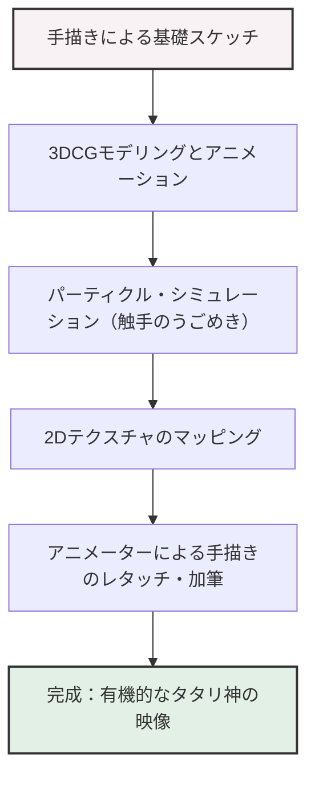
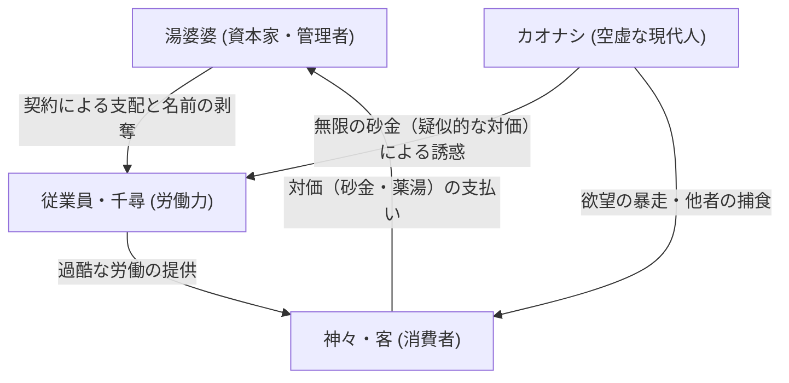
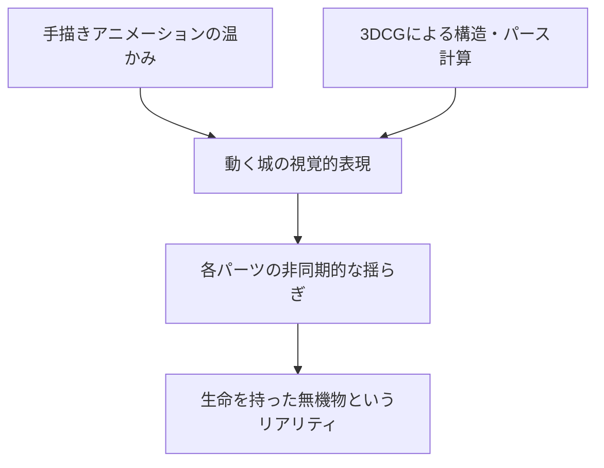
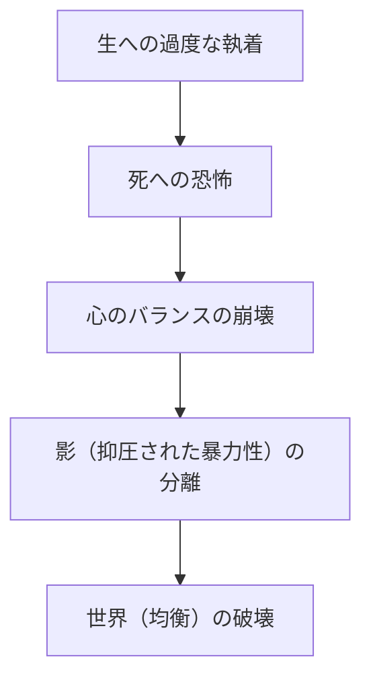
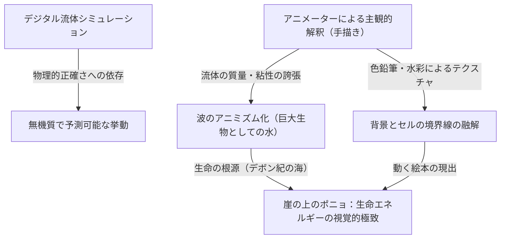
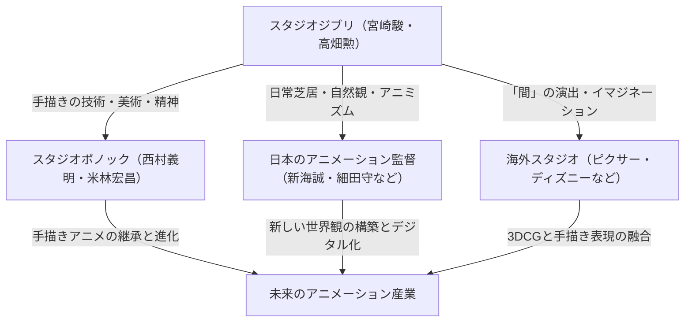

# 第1章：創設と初期の傑作たち（風の谷のナウシカ、天空の城ラピュタ）

## 1.1 アニメーション史における特異点、スタジオジブリの誕生

日本のアニメーション産業、いや世界のアニメーション史を俯瞰したとき、1980年代半ばに起きた一つの「事件」を無視することはできない。それこそが、スタジオジブリの設立である。ジブリの歴史は、単なる一企業、一制作スタジオの歴史ではなく、セル画というアナログ技術が到達した表現の極点と、アニメーションという媒体が持つ「大衆性」と「芸術性」の奇跡的な融合の歴史そのものである。本章では、スタジオジブリ創設の経緯を紐解きながら、その実質的な原点である『風の谷のナウシカ』（1984年）と、スタジオジブリ名義での初作品『天空の城ラピュタ』（1986年）に焦点を当て、高畑勲と宮崎駿という二人の天才がいかにしてアニメーション表現の限界を突破していったかを論じる。

スタジオジブリの設立前夜、日本のテレビアニメーションは「リミテッド・アニメーション」という手法によって独自の進化を遂げていた。秒間24コマをフルに使うディズニー的なフルアニメーションに対し、枚数を減らしながらも止め絵やカメラワーク（パン、ティルトなど）を駆使してダイナミズムを演出する手法は、コスト削減の必要悪から始まり、いつしか独自の映像文法として確立されていた。しかし、高畑勲と宮崎駿が目指したのは、その枠に収まるものではなかった。彼らは東映動画（現・東映アニメーション）時代から培ってきた、空間の緻密な構築、生活芝居のリアリティ、そして何よりも「動くことの根源的な喜び」を追求するアニメーションを、劇場長編という最高のフォーマットで実現することを渇望していたのである。

## 1.2 高畑勲と宮崎駿の作家性：客観性と主観性の奇跡的な交差

スタジオジブリの作品群を深く理解するためには、その中核をなす高畑勲と宮崎駿という二つの異なる才能の性質、そしてその相互作用を把握しておく必要がある。両者は共に東映動画出身であり、労働組合活動などを通じて深い絆で結ばれていたが、アニメーション演出家としての志向性は対極にあったと言っても過言ではない。

宮崎駿の作家性は、圧倒的な「主観的空間認識」と「運動のフェティシズム」に特徴づけられる。宮崎の描く画面は、物理法則を時に超越しながらも、観る者の身体感覚に直接訴えかける強烈な説得力を持っている。飛行シーンにおける浮遊感、巨大な質量を持つ物体が動く際の重低音を感じさせるような重量感、そして微細な風の流れや水面のきらめきなど、世界そのものが生き物のように蠢く感覚は、宮崎の脳内にあるビジョンをアニメーターの身体を通してセル画に定着させた結果である。彼はレイアウト（画面構成）において、広角レンズ的な歪みや独特のパースペクティブを多用し、画面の奥行きと動線を巧みにコントロールする。

対して高畑勲の作家性は、徹底した「客観性」と「論理的構築」にある。高畑自身は絵を描かない演出家であったが故に、アニメーションの画面をより一段高いメタ的な視点から俯瞰することができた。彼の演出は、キャラクターの心理や社会構造、そして日常の些細な動作のリアリティを極限まで突き詰めることに重きが置かれる。空間配置、照明、キャラクターの動機づけに至るまで、すべてが緻密な計算の上に成り立っており、観客に感情移入を促す一方で、常に一歩引いた視点から世界を観察させるようなブレヒト的な異化効果をも持ち合わせている。

この「主観的・直感的な宮崎」と「客観・論理的な高畑」という二つの才能が、互いに牽制し合い、尊敬し合いながら、ひとつのスタジオの屋台骨となったことが、ジブリの豊穣な作品群を生み出す最大の原動力であった。初期のジブリ作品において、高畑はプロデューサーという立場で宮崎の暴走をコントロールし、同時に作品の骨格を強固なものにするという極めて重要な役割を果たしている。

## 1.3 セル画アニメーションの技術的特異点とマルチプレーンカメラ

スタジオジブリの凄まじさは、テーマの深遠さだけではなく、それを支える圧倒的な技術力にある。特に『ナウシカ』から『ラピュタ』にかけての時期は、アナログのセル画アニメーション技術がひとつの完成形、あるいは「技術的特異点」に到達しつつある時期であった。

ジブリ作品の画面が持つ圧倒的な情報量と実在感は、緻密に描き込まれた背景美術と、何層にも重ねられたセル画のレイヤーによって生み出されている。ここで特筆すべきは、「マルチプレーンカメラ（多段式カメラ）」を用いた空間表現の極致である。

マルチプレーンカメラとは、カメラの下に複数のガラスの層（段）を設け、それぞれにセル画や背景画を配置して撮影する装置である。これにより、カメラが動いた（パンやティルト、トラックアップなど）際に、各層の移動速度を変えることで、擬似的な三次元の奥行き（視差）を生み出すことができる。この技術自体はディズニーなどが古くから用いていたものであるが、ジブリにおけるマルチプレーンカメラの運用は、その精緻さと複雑さにおいて群を抜いていた。

宮崎作品に不可欠な「飛行シーン」は、この技術の恩恵を最大限に受けている。例えば、眼下に広がる雲海、その間を縫って飛ぶ飛行艇、さらに奥に見える大地といった複雑な空間を、それぞれの層が異なる速度で流れることで、観客は本当に空を飛んでいるかのような強烈な空間認識と没入感を得る。さらに、セル画の裏から光を当てる「透過光」技術や、エアブラシを用いた微妙なグラデーション表現、そして風になびく草木を1枚1枚手書きで動かすという狂気じみた作画カロリーの投入によって、画面には風が吹き、空気が流れる。デジタル技術（CGI）が存在しない時代において、彼らは物理的なフィルムと絵の具、そして光の魔術を駆使して、現実以上にリアルな仮想空間を構築していたのである。

## 1.4 『風の谷のナウシカ』（1984年）：前史としての金字塔とエコロジーの深層

1984年に公開された『風の谷のナウシカ』は、正式にはスタジオジブリ設立前の「トップクラフト」制作の作品であるが、宮崎駿監督、高畑勲プロデューサーという布陣で作られ、後のジブリの方向性を決定づけた実質的な「第0作」あるいは「第1作」として位置づけられる。

本作は、月刊誌「アニメージュ」で宮崎駿自身が連載していた同名漫画を原作としているが、映画版はその序盤部分を再構成し、ひとつの独立した物語として完結させている。『ナウシカ』がアニメーション史に刻んだ最大の功績は、「環境問題（エコロジー）」と「生命の尊厳」、そして「人類の愚行」という極めて重厚なSF的テーマを、エンターテインメントの枠組みの中で、しかも圧倒的な映像美をもって描き切ったことにある。

「火の七日間」と呼ばれる最終戦争によって産業文明が崩壊してから1000年後。有毒な瘴気を放つ「腐海」と呼ばれる菌類の森が拡大し、巨大な蟲たちが支配する世界。この絶望的な世界観設定は、冷戦下の核戦争の恐怖や、深刻化する環境破壊に対する宮崎の強い危機感が反映されている。しかし宮崎は、単なる「自然保護」や「人間悪」という二元論に陥ることはない。腐海が実は汚染された地球を浄化するためのシステムであるという劇中の大きな反転は、自然の持つ恐るべき自己回復力と、その前における人間の矮小さを突きつける。

技術的側面から『ナウシカ』を語る上で欠かせないのが、「王蟲（オーム）」をはじめとする巨大な蟲たちの表現である。多数の節や眼を持つこの異形の生物が、うねるように前進するアニメーションは、ゴムを用いた特殊な作画技法（複数のセル画のパーツをずらして撮影する手法など）や、緻密なタイミングの計算によって、圧倒的な重量感と不気味さ、そしてある種の神々しさを生み出している。また、メーヴェ（ナウシカの乗る飛行具）の飛翔シーンにおける、風の抵抗を感じさせる布の動きや、重力と揚力の関係を視覚化したかのような滑らかな軌道は、宮崎アニメの真骨頂である「飛ぶことのカタルシス」を世界に知らしめた。

ナウシカというヒロインの造形も革新的であった。彼女は単なる「守られるべき少女」ではなく、自らメーヴェを駆り、銃を撃ち、剣を振るう戦士でありながら、同時にすべての命に対する深い慈愛を持った母性的な存在でもある。強さと優しさ、怒りと悲しみを併せ持つこの複雑なキャラクター像は、その後のジブリ作品のみならず、現代のフィクションにおける女性ヒーロー像のひとつの到達点にして原点となった。

## 1.5 スタジオジブリ設立と『天空の城ラピュタ』（1986年）：究極の冒険活劇

『ナウシカ』の成功を受け、その利益を元手にして1985年に「スタジオジブリ」は正式に設立された。その設立の目的はただ一つ、「質の高い劇場用長編アニメーションを作り続けること」であった。テレビアニメの粗製濫造とは一線を画し、妥協のないクオリティを追求するための独立拠点として、ジブリは産声を上げたのである。

そして1986年、スタジオジブリ名義での記念すべき第1回長編作品として『天空の城ラピュタ』が公開される。宮崎駿が小学生時代に構想していたというアイデアをベースにした本作は、スウィフトの『ガリヴァー旅行記』に登場する浮島ラピュタをモチーフに、少年と少女の出会い、謎の飛行石、空中海賊、そして邪悪な野心を持つ軍隊といった、古典的な冒険活劇（ボーイ・ミーツ・ガール）の王道要素をすべて詰め込んだ、まさに「活劇の極北」とも呼べる傑作である。

『ラピュタ』の素晴らしさは、息もつかせぬ物語の推進力と、画面の隅々にまで張り巡らされた異常なまでのディテールへの執着にある。冒頭の飛行船（タイガーモス号）へのドーラ一家の襲撃シーンから、パズーとシータが逃げ込むスラッグ渓谷の追跡劇に至るまで、画面は常に「動的」である。スラッグ渓谷のメカニックな造形、蒸気機関のピストン運動、歯車の回転、そしてトロッコの疾走。これらの機械や乗り物は、単なる背景や小道具ではなく、それ自体が生命を持っているかのように躍動感に満ちて描かれている。宮崎の持つ「機械への愛情」と「それが発する熱や匂い」さえも定着させようとする作画の熱量が、架空の世界に圧倒的なリアリティを付与している。

テーマ性において『ラピュタ』が提示するのは、「高度なテクノロジーと人間の分断」、そして「大地との結びつき」である。かつて世界を支配したラピュタ帝国の超絶的な科学力は、最終的に自らを滅ぼす原因となった。映画のクライマックス、崩壊するラピュタの深部から巨大な飛行石を抱いた巨大な「大樹」が宇宙へと上昇していくビジョンは、極めて象徴的である。テクノロジーの象徴であった人工物が崩れ去り、生命の象徴である大樹のみが残るこの結末は、シータの語る「土に根をおろし、風と共に生きよう。種と共に冬を越え、鳥と共に春を歌おう。どんなに恐ろしい武器を持っても、たくさんのかわいそうなロボットを操っても、土から離れては生きられないのよ」というセリフに集約されている。これは『ナウシカ』から続く、現代文明に対する宮崎の痛烈な批評であり、自然への回帰という普遍的な祈りである。

また、本作における美術監督・野崎俊郎と山本二三による背景美術の貢献は計り知れない。ラピュタ到達時の、雲海が晴れ渡り、苔生した巨大な庭園とロボット兵が現れるシーンの静謐な美しさは、アニメーションにおける背景画がいかに作品の品格を決定づけるかを証明している。動の宮崎演出と、静の美術の完璧な融合がここにあった。

## 1.6 結語：伝説の始まり

『風の谷のナウシカ』と『天空の城ラピュタ』。この初期の二大傑作において、宮崎駿と高畑勲、そしてスタジオジブリのスタッフたちは、アニメーションという表現手法が持ち得るポテンシャルを極限まで引き出してみせた。空想の産物である架空のメカニックに重量と手触りを与え、想像上の生態系にリアリティを吹き込み、複雑な社会批評や哲学的なテーマを、老若男女が息を呑んで見つめるエンターテインメントの中に内包させる。この途方もない離れ業を、彼らは膨大な枚数のセル画と、職人狂気とも言える手作業によって成し遂げたのである。

これら二つの作品は、技術的・表現的な基準を遥か高みへと引き上げ、その後の日本アニメーション界に「ジブリという巨大な壁」として立ちはだかることとなる。そして同時に、この小さなスタジオが、やがて世界的な文化現象を巻き起こし、アニメーションの歴史そのものを塗り替えていくという、壮大な伝説の文字通りの「第1章」であった。後に続く『となりのトトロ』や『火垂るの墓』、そして『もののけ姫』へと至る道筋は、すべてこの『ナウシカ』の風と『ラピュタ』の空から始まっていたのである。

# 第2章：日常と非日常の交差点——『となりのトトロ』『火垂るの墓』『魔女の宅急便』が描いた世界

スタジオジブリの歴史を紐解く上で、1980年代後半は決定的な転換点となった時期である。前作『天空の城ラピュタ』（1986年）で描かれたような、壮大な「剣と魔法」あるいは「空飛ぶ冒険活劇」から一転し、ジブリは日本の原風景や西洋の市井の人々の暮らしという「日常」へと大きく舵を切った。本章では、1988年に奇跡的な同時上映を果たした『となりのトトロ』『火垂るの墓』、そして1989年の大ヒット作『魔女の宅急便』の3作品を取り上げ、これらがアニメーション史に刻んだ技術的・テーマ的な革命を徹底的に解剖する。

## 1. 同時上映の狂気と奇跡：宮崎駿と高畑勲、二つの「昭和」

1988年春、『となりのトトロ』と『火垂るの墓』の同時上映という、現在ではおよそ考えられない興行形態が実現した。これは単なる商業的なパッケージングではなく、スタジオジブリという組織、ひいては宮崎駿と高畑勲という二人の天才クリエイターが火花を散らした「狂気と奇跡」の結晶であった。

### 1-1. 背中合わせの生と死
『となりのトトロ』は昭和30年代（1950年代）の日本の農村を舞台に、自然の精霊と子供たちの交流を描いた生命の賛歌である。一方、『火垂るの墓』は昭和20年（1945年）の終戦前後の神戸を舞台に、戦火の中で命を落としていく兄妹の凄惨な現実を徹底したリアリズムで描き出した。時代設定こそ約10年しか違わないものの、この2作品は「生と死」「理想化されたファンタジーと残酷な現実」という、完全に背中合わせのテーマを内包している。

当時のスタジオジブリは、二つの巨大な才能を同時に稼働させるという無謀とも言える制作体制を敷いた。作画スタッフの奪い合いが生じ、スケジュールは破綻の危機に瀕した。しかし、結果としてこの過酷な環境が、両作品のクオリティを極限まで押し上げることとなる。宮崎駿は高畑勲の徹底したリアリズムに対するアンチテーゼとして、より力強く、無意識下の生命力が躍動する『トトロ』の世界を構築し、高畑は宮崎の描くファンタジーに対抗すべく、日本のアニメーション表現をドキュメンタリー的な次元へと引き上げた。

### 1-2. 昭和の描き分けと「アニメーション・ドキュメンタリー」の誕生
『火垂るの墓』における高畑勲の演出は、従来のアニメーションの文法を破壊するものだった。B29の爆撃による焼夷弾の落下軌道、燃え盛る家屋の炎の揺らぎ、そして何より飢餓によって衰弱していく清太と節子の身体的変化。これらを表現するために、色彩設計の保田道世らは、従来のアニメカラーでは表現しきれない「泥と血と煤にまみれた茶褐色」を徹底的に追求した。

対照的に『となりのトトロ』では、宮崎駿が自身の記憶の中にある「かつてあったかもしれない、美しい日本」を再構築した。それは単なる写実ではなく、子供の視点から見た世界の「輝き」をセル画上に定着させる試みであった。この二つの「昭和」の描き分けは、アニメーションという媒体が持つ表現の振れ幅を最大限に証明するものであり、日本映画史における金字塔となった。

## 2. 背景美術の革命：男鹿和雄と山本二三が作り上げた「空気と湿気」

ジブリ作品が持つ圧倒的な説得力は、キャラクターの芝居だけでなく、その後ろに広がる背景美術の力に負うところが極めて大きい。この時期、スタジオジブリの背景美術は一つの到達点を迎えていた。

### 2-1. 男鹿和雄の描く「トトロの森」の湿潤な大気

『となりのトトロ』の美術監督に抜擢された男鹿和雄の功績は、日本のアニメーション美術の歴史を変えたと言っても過言ではない。男鹿の描く自然は、ポスターカラーの特性を極限まで活かしたものである。透明水彩ではなく不透明なポスターカラーを用いながらも、絶妙な水加減と筆のタッチによって、日本の風土特有の「湿気」や「むせ返るような草の匂い」、そして「木漏れ日の温度」までも表現してのけた。

特に、サツキとメイが雨のバス停でトトロと遭遇するシーンの背景美術は圧巻である。雨に濡れたアスファルトの質感、暗闇に沈む鎮守の森の深さ、電灯の光が作り出す空気の層。男鹿の美術は単なる「風景の模写」ではなく、そこに吹く風や温度、湿度といった「見えない情報」を視覚化する魔法であった。

### 2-2. 西洋への憧憬と建築的リアリズム
一方、『魔女の宅急便』の舞台となるコリコという街は、スウェーデンのストックホルムやゴットランド島のヴィスビュー、さらにはリスボンやパリなど、ヨーロッパの様々な都市の要素を融合させて作られた架空の街である。ここでの背景美術は、日本の風景を描いた『トトロ』とは対極のベクトルを持っていた。

ヨーロッパの石造りの建築物、瓦屋根の連なり、そして海へと続く坂道。これらを説得力を持って描くために、ジブリの美術スタッフは徹底したロケハンと建築構造の学習を行った。石の質感一つをとっても、風化の度合いや太陽の光の反射率を計算し、アニメーションの背景として最も美しく見える色彩へと翻訳されている。この「西洋への憧憬」を単なるファンタジーで終わらせず、現実に人々が生活し、労働している空間として描き出した美術の力は驚異的である。

## 3. 『魔女の宅急便』における現代的テーマ：「労働とスランプ」

『魔女の宅急便』は、公開当時多くの若者、特に働く女性たちから熱狂的な支持を集めた。その理由は、本作が表面的には「魔女の女の子の成長物語」というファンタジーの皮を被りながら、その本質において極めて現代的で普遍的な「労働と才能（スランプ）」を巡るリアルなドラマだったからである。

### 3-1. 才能が「労働」に変わる瞬間
主人公のキキは、生まれ持った「空を飛ぶ」という魔法の才能を活かして宅配便の仕事を始める。これは、現代のクリエイターやフリーランスの労働者が、自身の特技や才能を「資本」として社会に参画していくプロセスと完全に重なる。序盤のキキにとって、空を飛ぶことは喜びであり自己表現であった。しかし、それが「仕事（労働）」となり、クライアントの理不尽な要求（ニシンのパイのエピソードなど）に直面し、対価としての金銭を受け取るようになると、彼女の中で魔法の意味が変質していく。

### 3-2. スランプとアイデンティティの喪失
中盤、キキは突如として魔法の力を失い、空を飛べなくなり、黒猫のジジの言葉も分からなくなる。これは思春期の少女のアイデンティティの揺らぎであると同時に、クリエイターが直面する「才能の枯渇（スランプ）」の完璧なメタファーである。

ここで重要な役割を果たすのが、森の小屋で絵を描く画学生のウルスラである。ウルスラはキキに対し、「そういう時はジタバタするしかない」「描いて、描いて、描きまくる」「それでも駄目なら、描くのをやめる。散歩したり、景色を見たり、昼寝したり、何もしない」と語りかける。このセリフは、宮崎駿自身を含むアニメーターたち、ひいては表現活動に関わるすべての人間が直面する苦悩と、その処方箋そのものである。

### 3-3. 「血で飛ぶ」ことの覚悟
ウルスラは自身の絵について「前は何も考えなくても描けたが、今は違う。自分自身の絵を描かなければならない」と語る。キキの魔法も同じである。生まれ持った才能（魔法）だけで飛べていた無意識の時代は終わりを告げ、彼女は自分自身の意志と努力によって、魔法を「再獲得」しなければならない。クライマックスにおいて、キキがデッキブラシに跨り、必死の形相で空へと飛び上がるシーンは、もはや優雅なファンタジーではない。それは自己の限界と向き合い、血を吐くような思いで「技術」を行使するプロフェッショナルの姿そのものである。

## 4. テーマの構造と相互関係

これら3作品は、一見するとそれぞれ独立した世界観を持っているが、ジブリの作家性という軸で見ると、明確な連続性とテーマの交差点が存在する。

『トトロ』が提示した「日常の中に潜む非日常（ファンタジー）」は、『火垂るの墓』という極限のリアリズムとの対比によって、より一層の強固な神話性を獲得した。そして、そこで確立された表現手法とアニメーション技術は、『魔女の宅急便』において「非日常的な存在（魔女）が、いかにして現代社会の日常（労働）に溶け込んでいくか」という逆説的なテーマを描くための強力な武器となったのである。

## 5. 結び：次なるステージへの布石

1988年から1989年にかけてのこの時期、スタジオジブリは「生と死」「日本と西洋」「ファンタジーとリアリズム」、そして「才能と労働」という、アニメーションが描き得るあらゆる極限を僅か数年の間に走破してしまった。ここで培われた、日常の芝居を徹底的に観察し描き出す技術、そして風景に空気と感情を宿らせる背景美術の力は、後の『おもひでぽろぽろ』（1991年）や『紅の豚』（1992年）といった、より大人向けの複雑なテーマを持つ作品群へと受け継がれていく。

『となりのトトロ』『火垂るの墓』『魔女の宅急便』の3作品は、単なる名作の羅列ではない。それはアニメーションという表現媒体が、子供向けの娯楽から、人間の精神の深淵や社会の構造的な苦悩までもを描き出す「総合芸術」へと脱皮していく、その最も熱く、そして最も苦しい羽化の瞬間を記録した歴史的モニュメントなのである。

# 第3章：飛行への憧憬と大人のロマン——『紅の豚』と『耳をすませば』におけるリアリズムの到達点

スタジオジブリの歴史を俯瞰するうえで、1990年代前半から中盤にかけて発表された『紅の豚』（1992年）と『耳をすませば』（1995年）は、一見すると対極に位置する作品のように思われるかもしれない。前者がアドリア海を舞台に、呪いによって豚の姿となった賞金稼ぎの飛行艇乗りの戦いと哀愁を描くファンタジーであるのに対し、後者は現代の多摩ニュータウンを舞台に、中学生の男女の初々しい恋と進路への葛藤を描いた青春群像劇である。

しかし、この二つの作品を通底しているのは、アニメーションという表現手法を用いて「リアリズム（現実感）」を極限まで追求しようとするスタジオジブリの、いや、宮崎駿と近藤喜文という稀代のクリエイターたちの飽くなき探求心である。そして、その根底には「飛行」——物理的な空を飛ぶこと、あるいは自らの限界を超えて精神的に飛躍すること——への強烈な憧憬が存在する。本章では、この二作品がアニメーション史においていかに特異な位置を占め、どのような技術的・テーマ的達成を成し遂げたのかを、歴史的背景と技術論の両面から深く掘り下げていく。

## 1. 『紅の豚』——航空力学の極致と失われた時代の挽歌

『紅の豚』（原題：Il Porco Rosso）は、もともと日本航空の機内上映用ショートフィルムとして企画されたものが、ユーゴスラビア紛争という現実の重い影を落とす形で長編映画へと発展したという特異な出自を持つ。本作は、宮崎駿が自らのために、そして「疲れて脳細胞が豆腐になった中年男のための映画」として作り上げた、極めてパーソナルな手触りを持つ作品である。

### 1.1 宮崎駿と飛行機：メカニックへのフェティシズムと航空力学の緻密な描写

宮崎駿の「飛行」への執着はつとに有名だが、『紅の豚』における飛行艇の描写は、彼自身のメカニックへのフェティシズムと航空力学への深い理解が最も純化された形で表出している。本作に登場する飛行艇——主人公ポルコ・ロッソの愛機である真紅のサボイアS.21（モデルとなったのはマッキ M.33やサボイア・マルケッティ S.59など実在の機体の要素を混淆したオリジナル）や、ライバルであるカーチスの機体、空賊連合の雑多な飛行艇群——は、単なる背景や小道具ではなく、それ自体が自律したキャラクターとして躍動している。

特筆すべきは、空気抵抗、揚力、プロペラのトルク、エンジンの振動、そして水面からの離水・着水時の流体力学的な表現に至るまで、アニメーションにおける「物理法則の嘘と真実」が絶妙なバランスでコントロールされている点である。

ポルコのサボイアがエンジンを始動させるシーンでは、シリンダーに火が入り、機体全体が微小な振動を始め、排気管から黒煙が吐き出されるまでの一連のプロセスが、セル画の細やかな振動と多重露光（当時のアナログ撮影技術）によって表現されている。空中戦（ドッグファイト）のシークエンスでは、旋回時のG（重力加速度）に耐えるパイロットの肉体的な負荷や、失速（ストール）スレスレで機体をコントロールする操縦桿とラダーペダルの微細な動きが、極めて正確なタイミング（コマ打ち）で描写されている。これは、宮崎駿の脳内に存在する「飛行の身体感覚」が、アニメーターたちの手を通じてセルロイドの上に完璧にトレースされた結果である。

### 1.2 アドリア海の空に響くファシズムへの抵抗とアナーキズム

本作の舞台は1920年代末のイタリア、アドリア海。時代背景としては、第一次世界大戦の爪痕が残り、ムッソリーニ率いるファシスト党が台頭しつつある狂騒と不安の時代である。ポルコ・ロッソ（本名マルコ・パゴット）は、かつてイタリア空軍のエースパイロットであったが、国家と軍隊というシステムに絶望し、自らに呪いをかけて豚となり、賞金稼ぎというアウトロー（アナーキスト）として生きる道を選んだ。

ポルコの「ファシストになるより豚の方がマシさ」という有名な台詞は、単なるハードボイルドな決め台詞ではない。それは、国家という巨大な暴力装置に組み込まれることを拒絶し、個人の自由と尊厳を空という無国籍の空間に求める、宮崎駿自身の強烈なアンチ・ファシズムとアナーキズムの表明である。

映画の後半、ポルコがかつての戦友フェラーリン（現在はファシスト空軍の少佐）と映画館で密会するシーンは、本作の政治的背景を色濃く反映している。フェラーリンは「国家とか民族とかくだらないスポンサーを背負って飛ばなきゃならないんだ」と零す。ここでは、空を飛ぶ純粋な喜びが、国家のイデオロギーや戦争の道具へと変質していく過程が冷徹に描かれている。ポルコが豚になった理由は明示されないが、それは人間同士が殺し合う不条理な世界への深い絶望であり、同調圧力を強める社会から自らを疎外するための防衛機制、あるいは「人間の姿をしたままでは人間としての尊厳を保てない」というパラドックスの表現として機能している。

### 1.3 「飛ばねぇ豚はただの豚だ」——中年男性のロマン、挫折、そして呪い

『紅の豚』が多くの大人の心を捉えて離さないのは、本作が「失われたもの」への哀切な挽歌（エレジー）であるからだ。ポルコは、第一次世界大戦で散っていった戦友たち（雲の平原へ昇っていく飛行機の幻影のシーンは、映画史に残る名シーンである）への強い喪失感とサバイバーズ・ギルト（生存者の罪悪感）を抱えている。

ジーナが歌うシャンソン「さくらんぼの実る頃（Le Temps des cerises）」（パリ・コミューンの崩壊を悼む歌として知られる）が象徴するように、この映画は過ぎ去りし良き時代、決して手の届かない青春、そして不可逆な喪失に対する深いノスタルジアに満ちている。ポルコとジーナの成熟した、しかし決して交わることのない距離感を持った大人の恋愛描写は、ジブリ作品の中でも特異な位置を占める。ポルコは「呪い」を言い訳にして、ジーナの愛情や現実の社会参加から逃避している側面もある。「カッコイイとは、こういうことさ。」というキャッチコピーの裏には、己の美学に殉じることの孤独と、時代遅れになっていく自分自身を受け入れるという、痛切な「中年男性の自己受容」の物語が隠されているのだ。

## 2. 『耳をすませば』——思春期の痛切なリアリズムと空間の魔法

1995年に公開された『耳をすませば』は、宮崎駿がプロデュース・脚本・絵コンテを担当し、スタジオジブリの中核アニメーターであった近藤喜文が唯一長編監督を務めた記念碑的作品である。柊あおいの同名少女漫画を原作としながらも、宮崎と近藤の手によって、本作は単なるラブストーリーの枠を超え、進路、才能、そして自己実現への不安に揺れる思春期のリアルな肖像へと昇華された。

### 2.1 近藤喜文の眼差し：日常の仕草に宿るアニメーションの真髄

本作の最大の魅力であり、技術的達成と言えるのは、近藤喜文監督の徹底した「日常芝居」へのこだわりである。アニメーションにおいて、魔法や爆発、ロボットの戦闘といった「非日常的（スペクタクル）」な動きを描くよりも、人が歩く、座る、お茶を淹れる、階段を駆け上がるといった「何気ない日常の動作」を正確に、かつ感情を伴って描く方が遥かに困難とされている。

近藤喜文は、高畑勲監督作品（『火垂るの墓』『おもひでぽろぽろ』など）で作画監督を務め、キャラクターの骨格や筋肉の動き、重心の移動、そして心理状態を動作に反映させる「生活芝居」の達人であった。『耳をすませば』では、その卓越した観察眼がいかんなく発揮されている。

例えば、主人公の月島雫が図書館で本を読むときの姿勢の変化、焦って階段を下りる際の足運び、あるいは恋心と苛立ちが混ざった状態での天沢聖司とのやり取りにおける視線の推移や肩のすくめ方。これら一つ一つの微細なアニメーションが、雫という少女が確かにそこに存在し、息づいているという強烈な実在感を生み出している。これは、ファンタジー世界を飛翔する宮崎アニメの快感とは異なる、地に足の着いた「人間の生」を描き出すアニメーションの真髄である。

### 2.2 ロケーション・ハンティングと空間構築：多摩ニュータウンという「生きた街」

本作のもう一つの主役は、舞台となった街そのものである。東京都の聖蹟桜ヶ丘（多摩ニュータウン近郊）周辺で行われた徹底的なロケーション・ハンティングに基づき、本作の美術背景は驚異的なリアリティをもって構築された。

美術監督の黒田聡らによる背景画は、団地の無機質なコンクリートの質感、急勾配の坂道、狭い路地裏、そして夕暮れの街並みを見事に描き出している。特に注目すべきは、雫が住む「狭い団地」の描写である。あふれかえる本、雑然とした食卓、二段ベッドのある狭い姉妹の部屋。この息が詰まるような（しかし温かみのある）リアルな生活空間の描写が、雫の「ここから抜け出して、もっと広い世界へ行きたい」という飛翔への渇望（＝物語を書きたいという衝動）を裏打ちしている。

また、街の地形（高低差）が見事に心理的なメタファーとして機能している。雫の日常（学校や団地）は「下」にあり、不思議な猫（ムーン）に導かれてたどり着くアンティークショップ「地球屋」は急な坂を登り切った「丘の上」にある。この高低差は、そのまま雫の精神的な上昇志向と、未知の領域へ踏み出すことの困難さを視覚的に表現している。

### 2.3 創作への熱源と自己実現の痛み：バロンが導く「内なる飛行」

『耳をすませば』は恋愛映画であると同時に、強烈な「クリエイターの自己啓発物語」でもある。バイオリン職人という明確な目標に向かってイタリアへ留学（飛行）しようとする聖司に対し、焦燥感を抱いた雫は、自分の中の「原石」を確かめるために物語（『耳をすませば』の作中作であるファンタジー小説）を書き始める。

ここで興味深いのは、作中作の世界において、雫が猫の男爵バロンと共に「空を飛ぶ」シークエンスが挿入される点である。背景美術を「イバラード」で知られる画家・井上直久が手がけたこの幻想的なシーンは、『紅の豚』の物理的な飛行とは対極にある、イマジネーションの解放としての「内なる飛行」を描いている。

しかし、本作は単なる夢物語では終わらない。不眠不休で書き上げた小説を地球屋の主人に読んでもらった後、雫は自分の作品が荒削りで未熟であることを痛感し、号泣する。創作の残酷な壁に直面し、自分の才能の限界（原石のままでは光らないこと）を知るこのシーンの痛切さは、すべてのモノづくりに携わる人間の胸を刺す。宮崎駿と近藤喜文は、安易な成功を描くことを避け、「それでも削り、磨き続けなければならない」という厳しい職人の倫理を、中学生の少女の姿を通して描き出したのである。

## 3. 結論：飛行機とバイオリン、それぞれの「職人」たちの物語

『紅の豚』と『耳をすませば』。アドリア海の空を駆ける中年の豚と、多摩ニュータウンの坂道を自転車で駆け上がる中学生。一見何の接点もないように見えるこの二つの物語は、「職人性へのリスペクト」という軸で強固に結びついている。

ポルコの愛機を完璧に修理・チューンナップするピッコロ社のフィオや女性工員たち。そして、クレモナでバイオリン作りの修行に励む聖司や、アンティーク時計を修理し続ける地球屋の主人。ジブリ作品は一貫して、自らの手でモノを作り出し、技術を磨き続ける「職人（アルチザン）」たちへの無上の賛歌を奏でてきた。

ポルコが空の自由を守るために戦うように、雫もまた自らの内なる声（物語）を紡ぐために言葉という武器を手に取る。物理的な「飛行」と想像力による「飛躍」。表現の手法は異なれど、スタジオジブリがこの時期に到達したリアリズムの極致は、現実世界の重力（社会のしがらみや自己の限界）に抗い、それでもなお高く飛び立とうとする人間の崇高な意志を、圧倒的な映像美をもってフィルムに焼き付けたのである。次章では、この徹底したリアリズムと自然主義が、神話的想像力と結びつくことで生み出された前代未聞のエピック、『もののけ姫』における自然と人間の相克について論じていく。

# 第4章：エコロジーと神話的想像力（もののけ姫）

1997年に公開された『もののけ姫』は、スタジオジブリおよび宮崎駿監督のキャリアにおいて、明確な分水嶺となった記念碑的プロトタイプである。本作は単なるアニメーション映画の枠を超え、日本映画史そのものを書き換えるほどの巨大な文化的・産業的インパクトをもたらした。本章では、同作が持つ重層的なテーマ性——日本中世史の脱構築、非二元論的な善悪の位相、そして技術的転換点としてのCG（コンピュータグラフィックス）と伝統的セルアニメーションの融合——について、極限まで詳細に解き明かしていく。

## 1. 産業的コンテクスト：製作費の爆発と興行記録の更新

『もののけ姫』の製作は、スタジオジブリにとってかつてない規模の社運を賭けた巨大プロジェクトであった。当初から宮崎駿監督は「これが最後の引退作になるかもしれない」という覚悟で臨んでおり、その妥協なき作家主義は製作期間と予算を青天井で膨張させた。総製作費は約20億円と言われ、当時の日本映画としては常軌を逸した金額である。作画枚数は約14万4000枚に達し、これは通常の長編アニメーションの2〜3倍に相当する。

この巨大なリスクを回収するため、鈴木敏夫プロデューサーは前例のない規模でのメディアミックスと宣伝戦略を展開した。「生きろ。」という糸井重里による鮮烈なキャッチコピーは、当時の日本社会を覆っていた世紀末的・閉塞的な空気感（阪神・淡路大震災や地下鉄サリン事件といった1995年のトラウマ）に対する一つのアンサーとして機能した。

結果として、本作は観客動員数1420万人、興行収入193億円を記録。当時の日本映画の歴代興行収入記録（『E.T.』が保持していた記録）を大きく塗り替え、日本において「国民的映画」としてのスタジオジブリの地位を不動のものにした。この産業的成功は、日本のアニメーションが大人向けの重厚なテーマを扱っても巨大なビジネスになり得ることを証明し、後のアニメ産業のビジネスモデルに多大な影響を与えた。

## 2. 時代設定と神話的再構築：なぜ室町時代なのか

宮崎駿は本作の舞台として、あえて「室町時代」という日本史の移行期を選び取った。従来の時代劇が好んで描いた江戸時代（身分制度が固定化され、平和で統制された社会）や戦国時代（武将たちの権力闘争）ではなく、室町時代というカオスに満ちた時代を選んだことには、深い思想的意図がある。

室町時代は、農業中心の社会から貨幣経済への移行、手工業の発達、そして何より「自然に対する人間のテクノロジーの優位」が明確に現れ始めた時代である。鉄の生産（たたら吹き）が本格化し、それに伴う森林伐採が進む一方で、いまだ山々には深い原生林が残り、神々が実在すると信じられていた。つまり、人間と自然、あるいは近代と前近代が激しく衝突し、相克するボーダーラインの時代だったのだ。

歴史学者・網野善彦の「非農業民（職人、商人、遊女、芸能民など）」に関する研究（無縁・公界・楽）に強く影響を受けた宮崎は、従来の「瑞穂の国」という均質的な日本史観を解体した。映画に登場するタタラ場は、天皇や大名の支配が及ばない一種のアジール（避難所・自由領域）として描かれる。そこでは、社会の周縁に追いやられたハンセン病患者（病者）や売られた女たちが、鉄を生産するという高度な技術力によって自立し、独自のユートピアを築いている。

このように、『もののけ姫』は単なるファンタジーではなく、歴史の暗部に光を当て、日本人のアイデンティティと自然観を神話のレベルから再構築する試みであった。

## 3. エボシ御前とサン：善悪の非二元論

本作の最も画期的な点は、旧来のハリウッド的、あるいはディズニー的な「勧善懲悪」のパラダイムを完全に放棄したことにある。自然を破壊する側である人間たちを単純な「悪」として断罪せず、むしろ彼らの生の営みと尊厳を力強く描いている。

その象徴がタタラ場のリーダーであるエボシ御前である。彼女は山の神々を殺し、森を切り開く自然破壊の元凶であると同時に、社会から見捨てられた弱者たちを保護し、彼らに生きる目的と尊厳を与える卓越したヒューマニストであり、革命家でもある。エボシは決して私欲のために森を破壊しているわけではない。人間たちが貧困と差別から抜け出し、自立して生き抜くためには、自然を征服し、鉄を生産するしかないのだ。この「善なる動機が結果として他者（自然）の領域を侵犯する」という矛盾こそが、人間の業の本質である。

対するサン（もののけ姫）は、人間に捨てられ、山犬に育てられた少女である。彼女は人間を憎悪し、森を守るためにエボシの命を狙うが、彼女自身もまた完全な「獣」にはなりきれない境界的存在である。アシタカは、これら相容れない二つの正義——「人間の生存の権利」と「自然の神聖性」——の間に立ち、「曇りなき眼で見定め、決める」ことを試みるが、彼にも明確な解決策は見出せない。

物語の結末において、シシ神は首を返されて消滅し、太古の森は失われる。しかし、タタラ場もまた崩壊し、人々は「ここをいい村にしよう」とゼロからの再出発を誓う。アシタカとサンは共に生きることを選ぶが、一つ屋根の下で暮らすことはない。アシタカはタタラ場に、サンは森に住み、「時々会いに行く」という共存の形をとる。これは、人間と自然の間の完全な調和という安易なカタルシスを拒絶し、永遠に続く緊張関係の中で「生きろ」という過酷だが希望のあるメッセージである。

## 4. 技術的転換点：CGと手描きアニメーションの高度な融合

『もののけ姫』は、スタジオジブリにおいてコンピュータグラフィックス（CG）が初めて本格的に導入された作品としても記憶されるべきである。宮崎駿は長年、手描き（セルアニメーション）の職人的技術に絶対的なこだわりを持っていたが、本作で表現すべき圧倒的なダイナミズムと複雑さを実現するためには、デジタル技術の導入が不可避であった。

しかし、ジブリのCG使用は、フル3DCGへの移行ではなく、あくまで手描きの表現力を拡張・補完するための「デジタルコンポジット」と「3D/2Dの融合」であった。CGカットは全1620カット中、約100カット強に過ぎないが、その効果は絶大であった。

### タタリ神の表現

最も象徴的かつ技術的難易度が高かったのが、冒頭のタタリ神（呪いを受けた猪神）の表現である。無数のヘビのような触手（蛇状の呪い）がうごめき、泥のように絡みつきながら進む描写は、手描きのアニメーターにとって悪夢のような作業量となる。

ここで制作チームは、3DCGのパーティクル（粒子）シミュレーションと、手描きの作画を組み合わせる手法を採用した。まず、触手の基本的な動きや骨格を3DCGで構築し、それに手描きのテクスチャをマッピングする。さらに、そのCG素材の上からアニメーターが手描きで加筆（レタッチ）を行うことで、CG特有の無機質な冷たさを消し去り、有機的で生々しい、まさに「怨念」そのもののような表現に到達した。

### デジタルマッピングとダイナミックなカメラワーク

もう一つの革新は、背景画（美術）のデジタル処理である。従来、セルアニメーションにおいてカメラを回り込ませるような立体的なパン（回り込み）は、背景を歪ませて描くという極めて高度な職人技（パースペクティブの計算）に依存していた。

『もののけ姫』では、アシタカが村を出発するシーンや、シシ神の森の奥深さを表現するシーンにおいて、3DCGで構築した地形モデルに、美術スタッフが手描きで描いた美しい背景画をテクスチャとして貼り付ける「3Dマッピング」技術が使用された。これにより、手描きの温もりと絵画的な美しさを保ちながら、実写映画のような空間の奥行きと、縦横無尽に移動するダイナミックなカメラワークが可能となった。

また、シシ神の足元で植物が一瞬にして発芽し、成長しては枯れていく生命のサイクルも、モーフィング技術とデジタルコンポジットを駆使して表現された。このように、『もののけ姫』におけるCGは、決して技術を誇示するためのものではなく、宮崎駿の脳内にある神話的かつ幻惑的なビジョンを現実のスクリーンに定着させるための、不可欠な筆（ツール）として機能したのである。

## 結び

『もののけ姫』は、スタジオジブリが到達した一つの極北である。日本の中世という歴史的土壌に深く根を下ろしながらも、そこで語られるエコロジーの問題と善悪の非二元論は、現代のグローバル社会においてますますアクチュアルな意味を持ち始めている。そして、手描きとデジタルが奇跡的なバランスで融合した映像美は、後にも先にも類を見ない完成度を誇る。次章『第5章：日常の魔法と郷愁（千と千尋の神隠し）』では、この神話的スケールから一転して、現代の少女の心象風景へと潜っていくジブリの新たな転回について考察する。

# 第5章：デジタル移行と世界的評価（千と千尋の神隠し、猫の恩返し）

スタジオジブリの歴史において、2000年代初頭は技術的、表現的、そして商業的に最も劇的な転換点となった時代である。本章では、セルアニメーションからフルデジタル環境への移行がいかにしてジブリ作品の映像表現をかつてない領域へと押し広げたのか、そしてその結実たる『千と千尋の神隠し』（2001年）と、次世代への布石としての『猫の恩返し』（2002年）が、日本国内の枠を超えてどのような世界的評価と文化的影響をもたらしたのかを、プロフェッショナルの視座から極限まで詳述する。

## 1. アナログからデジタルへ：スタジオジブリの技術的パラダイムシフトと美学の再構築

アニメーション制作における「デジタル化」とは、単に作業の効率化やコスト削減を意味するものではない。それは、画面内に存在するすべての視覚要素を数値データとして完全に統制可能にするという、映像制作の根底的なパラダイムシフトであった。スタジオジブリにおけるデジタル技術の導入は、1997年の『もののけ姫』においてタタリ神の触手のうごめきや、ディダラボッチの半透明な質感、一部の3DCG背景などで試験的に行われ、続く1999年の『ホーホケキョ となりの山田くん』で完全なデジタルペイントが採用された。しかし、宮崎駿監督作品において、従来のセルアニメーションが持っていた生々しい質感を保ちつつ、それをデジタル空間で緻密に再構築するという至難の業を完全に達成したのは『千と千尋の神隠し』が初となる。

このフルデジタル体制への完全移行により、制作現場からは物理的な「セル画」や「アニメーション用絵の具」が姿を消した。紙に描かれた原画・動画をスキャナーで高解像度で取り込み、ソフトウェア上でデジタル彩色を施すワークフローが確立されたのである。これにより、物理的なセル画を何枚も重ねることによって生じていた透過光の減衰（絵が暗くなる現象）や、セル傷・ゴミの混入といったアナログ特有の物理的制約からついに解放された。

さらに革新的だったのは「撮影（コンポジット）」工程における表現力の飛躍的な向上である。画面上のオブジェクト（キャラクター、手前のなめくじ、奥の建物、エフェクトなど）を無制限のレイヤーに分割し、それぞれに異なる焦点深度（被写界深度）を持たせるという、実写映画のカメラレンズを模倣した高度な多層的奥行き表現が可能となった。アナログ時代のマルチプレーン・カメラ装置では数層が限界であった空間表現が、デジタル空間では無限の階層を持つことが可能になり、油屋のそびえ立つような巨大さや、奈落へと続く階段の底知れぬ深さが、圧倒的なパースペクティブをもって観客の目に迫るようになったのである。

## 2. 色彩設計・保田道世の錬金術：フルデジタル彩色がもたらした色彩表現の無限の拡張

このデジタル移行の最大の恩恵を受けたのが、「色彩」という要素である。スタジオジブリ創設以前から宮崎駿・高畑勲作品の色彩設計を長年支え続けた天才的カラーリスト、保田道世は、デジタルペイントへの完全移行によって、かつてない魔法を画面にかけることに成功した。

物理的な絵の具を使用していた時代、使用可能な色数には明確な限界が存在した。ひとつの作品で使われる絵の具の種類は数百色程度が上限であり、複雑な陰影や夕暮れ時の微妙な環境光の変化を表現するには、限定されたパレットの中で錯視的な効果を狙うしかなかった。しかし、デジタル環境への移行により、理論上は約1677万色（24bitカラー）という無限の色数を扱うことが可能となった。

『千と千尋の神隠し』において、保田道世はこの無限のパレットを「奇をてらったサイケデリックな配色」のためではなく、「徹底的にリアリティのある環境光の再現」と「キャラクターの精緻な感情表現」のために活用した。千尋が迷い込む不思議の町や、八百万の神々が疲れを癒やす「油屋」の極彩色の照明は、単に派手なだけではない。赤い提灯の光が濡れた石畳に乱反射する様子、千尋の頬に落ちる繊細な影、豚にされてしまった両親が貪り食う異界の食物の脂ぎったテクスチャ、そしてハクが竜の姿になった際の鱗の生々しくも透明感のあるエメラルドグリーンなど、それぞれのオブジェクトが光源から受ける影響を、時間帯や空間の湿度に合わせて微細にコントロールしているのだ。

特に圧巻なのは、キャラクターと美術背景の「調和（ハーモニー）」である。アナログ時代はどうしても手描きの背景画とセル画の間に質感の断絶が生じがちであったが、デジタルコンポジットの導入により、背景の空気感（アンビエント・ライト）をキャラクターの色彩に馴染ませるための微細なデジタルフィルター処理が可能となった。海原電鉄に乗って沼の底へと向かうシークエンスにおいて、夕暮れから逢魔が時、そして夜へと移り変わる空と水面の色調変化、そこに乗客の半透明の影が落ちる描写は、デジタルグラデーションの精緻な制御と、保田の鋭敏な色彩感覚が見事に融合したアニメーション史に残る映像詩である。

## 3. 日本的アニミズムと『神隠し』の民俗学

本作が世界的に類例のない評価を獲得した理由は、その圧倒的な映像美に加え、極めて日本的な「アニミズム（汎霊説）」の世界観を、現代的な少女の通過儀礼（イニシエーション）の物語へと見事に昇華させた点にある。

八百万の神々が日々の疲れを癒やすために風呂屋にやってくる、という設定自体が、一神教的な西洋の価値観からは極めて新鮮かつ深遠に映った。河の神がヘドロや人間の不法投棄した自転車、粗大ゴミにまみれて「オクサレ様」と化している描写は、現代の環境破壊に対する直接的なメッセージであると同時に、「穢れを祓う」という神道の根源的な概念の視覚化である。こうしたローカル（土着的）な民俗学的モチーフが、グローバル（普遍的）な環境問題へとシームレスに接続されている。

また、「神隠し」というタイトルが示す通り、本作は生と死の境界線を彷徨う物語である。トンネルを抜けた先にある廃墟のテーマパーク、そこから川を隔てて存在する油屋は、明らかに「異界」あるいは「冥界」のメタファーである。日本の民間伝承において、神隠しに遭った者が異界の食べ物を口にすると元の世界に戻れなくなるという「黄泉戸喫（よもつへぐい）」のタブーが、千尋がハクから不思議な食べ物をもらうシーンに組み込まれており、宮崎駿の深い民俗学的教養が物語の骨格を強固に支えている。

## 4. 湯屋（油屋）のシステムと徹底した資本主義・消費社会批判

アニミズムの意匠をまといながらも、物語の主たる舞台となる「油屋」の実態は、極めて近代的な官僚制と資本主義社会のメタファーとして機能している。和洋折衷、明治期の擬洋風建築と伝統的温泉宿がグロテスクに融合したような油屋の建築様式自体が、混沌とした日本の近代化そのものを象徴している。

湯婆婆が頂点に君臨するこの巨大な湯屋は、徹底した階層社会であり、全ての行動が「契約」と「労働」によって規定される空間である。ここで働く者たちは、自らの「名前」を奪われる。千尋が「千」という一文字に縮減される描写は、アイデンティティの剥奪であり、人間が巨大な資本主義システムの中で交換可能な「労働力」「歯車」として規格化される過程の鋭い隠喩である。働くことを拒めば動物（豚や石炭）に変えられてしまうという掟は、「労働なき者は生存を許されない」という現代社会の冷酷な現実を突きつけている。

さらに、本作に登場する「カオナシ」という特異なキャラクターは、現代の消費社会が生み出した病理の象徴として機能する。彼は自らの声を持たず、他者の欲望（砂金）を際限なく与えることでしかコミュニケーションを図れない。そして他者を飲み込むことで、その他者の声や性格を借りて自己を肥大化させていく。このカオナシの姿は、他者との真の繋がりを喪失し、物質的な消費や貨幣の力によってのみ自己の空虚を埋めようとする現代人のカリカチュアに他ならない。油屋の従業員たちがカオナシのばらまく金に群がり、やがて呑み込まれていく様は、欲望の資本主義がいかにして人間性を破壊し、共同体を崩壊させるかという宮崎駿の冷徹な批評眼を示している。

## 5. 世界的評価の獲得：アカデミー賞受賞と興行記録の樹立がもたらした衝撃

こうした幾重にも張り巡らされた深いテーマ性と、フルデジタル彩色による極限の映像美が融合した『千と千尋の神隠し』は、アニメーションというメディアの枠を軽々と越え、世界の映画史にその名を刻むこととなる。

2002年の第52回ベルリン国際映画祭において、実写の並み居る傑作群を抑え、アニメーション映画としては史上2作目（『シンデレラ』以来約半世紀ぶり）となる最高賞「金熊賞」を受賞。この快挙は、アニメーションが子供向けのエンターテインメントにとどまらず、高度な芸術作品として世界的に認知された歴史的瞬間であった。さらに翌2003年、第75回アカデミー賞において長編アニメーション映画賞を獲得。ディズニーやピクサーの3DCG作品が主流となりつつあったアメリカ映画界において、日本の2D手描きアニメーション（デジタル処理を含む）が頂点に立ったことの意義は計り知れない。

特に、ピクサーの中心人物であり、長年の宮崎駿の盟友でもあるジョン・ラセターが北米版の総指揮を買って出たことは、ジブリ作品の世界展開において決定的な役割を果たした。ラセターの尽力により、ディズニーの配給網に乗って全米で公開され、世界のクリエイターたちに「Ghibli」の存在を深く刻み込んだのである。

日本国内においても、その社会的影響力は絶大であった。興行収入316億8000万円という数字は、当時の日本映画における歴代1位の記録をダブルスコア近くで塗り替える空前絶後のメガヒットであり、「国民の4人に1人が劇場で観た」と称されるほどの社会現象を巻き起こした。この成功は、日本映画産業全体のビジネスモデルを大きく変容させ、アニメーション映画が実写映画を凌駕する巨大な興行パワーを持つことを完全に証明したのである。

## 6. 『猫の恩返し』と次世代監督の起用：ジブリの多角化とデジタル体制の安定化

『千と千尋の神隠し』による歴史的な大熱狂の直後、2002年に公開されたのが森田宏幸監督による『猫の恩返し』である。本作は『耳をすませば』の主人公・月島雫が書いた物語というスピンオフ的な位置づけを持つ中編作品（上映時間75分）であり、企画段階ではテーマパーク向けの「猫のプロジェクト」としてスタートした異色の成り立ちを持つ。

宮崎駿・高畑勲という圧倒的なカリスマ性を持つ二大巨頭以外の若手・外部監督を起用し、スタジオの制作ラインを多様化させるという試みは、ジブリにとって常に重要かつ困難な課題であった。『猫の恩返し』は、フルデジタル制作体制がスタジオ内に技術的に定着したからこそ可能になった、軽快でフットワークの軽い作品づくりを体現している。

重厚なテーマ性と圧倒的な書き込み量で観客の精神を圧倒した『千と千尋』とは対照的に、『猫の恩返し』は、日常のすぐ隣にある異世界（猫の国）へと迷い込むごく普通の女子高生・ハルの冒険を、肩の力の抜けた軽妙なタッチで描いている。ここには、デジタル技術を「重厚長大」な大作のみならず、「小粋なファンタジー」を安定したスケジュールと高いクオリティで量産するためのインフラとして機能させようというスタジオの長期的な戦略が見て取れる。

また、吉田玲子による脚本の妙味や、バロン（フンベルト・フォン・ジッキンゲン男爵）やムタといった魅力的なキャラクターの造形、そして「自分の時間を生きられない者は、自分を見失う（猫になってしまう）」というテーマの処理も秀逸である。一見すると明るいコメディタッチの冒険活劇であるが、自己決定権の喪失がアイデンティティの変容（猫化）をもたらすという恐怖は、実は『千と千尋』における「名前を奪われる」恐怖とも底通する極めて現代的なテーマであり、それがエンターテインメントの枠組みの中で見事に消化されている点は高く評価されるべきである。

## 7. 第5章の総括：伝統と革新の融合が生んだ奇跡の到達点

2000年代初頭のスタジオジブリは、技術的な「革新（フルデジタル制作環境への移行）」と、表現における「伝統（手描きアニメーションの生々しい質感と日本的アニミズム）」が奇跡的なバランスで交差し、かつてない高みへと到達した黄金期であった。

ジブリにおけるデジタル技術は、単なる効率化や、絵を平坦にするためのツール（安易なセルルック3DCGなど）として用いられることは決してなかった。それはあくまで「人間の手によって描かれた線の力や絵画の可能性を、物理的な制約から解放し、さらに奥深く豊かにするための最上級の道具」として徹底的に飼い慣らされたのである。保田道世の色彩設計が完璧に証明したように、最先端のテクノロジーは、熟練の職人が持つ卓越した美意識と結合したときにこそ、初めて真の芸術的到達点へと至る。

『千と千尋の神隠し』が突きつけた圧倒的な作家性と世界観の強度、そして『猫の恩返し』が示したスタジオとしての安定した制作力と世代交代・多角化の可能性。この激動の時期を経て、スタジオジブリは単なる一国のアニメーションスタジオという枠を完全に破壊し、世界の映画表現を牽引する唯一無二の世界的ブランドへと変貌を遂げたのである。しかし、この前人未到の巨大化と世界的名声は、同時に「宮崎駿という特異な天才に極度に依存したシステムからの脱却」という、次なる（そして現在に至るまでジブリを苦しめ続ける）重い課題を、スタジオの深部に静かに突きつけることにもなるのである。

# 第6章：反戦と愛、魔法のメカニズム（ハウルの動く城、ゲド戦記）

## はじめに：ジブリ新時代の幕開けと揺らぐ世界

2000年代中盤、スタジオジブリは大きな転換点を迎えていた。『千と千尋の神隠し』という日本映画史に残る金字塔を打ち立て、アカデミー賞を受賞し、世界的評価を不動のものとした宮崎駿監督。しかし、その足元では現実世界が大きく揺れ動いていた。2001年の同時多発テロから連なる対テロ戦争、そして2003年に勃発したイラク戦争。世界が分断と暴力の連鎖に飲み込まれていく中で、宮崎駿の視線はより直接的に「戦争と人間の愚かさ」に向けられるようになる。

同時に、スタジオジブリ内部でも世代交代という巨大な課題が顕在化しつつあった。本章では、宮崎駿がイラク戦争への激しい怒りと「老い」の受容を圧倒的なアニメーション技術で描き出した『ハウルの動く城』（2004年）、そして宮崎駿の長男である宮崎吾朗が異例の抜擢で監督デビューを果たし、原作者との対立や哲学的なテーマの表現に挑んだ『ゲド戦記』（2006年）という、ジブリの歴史において極めて特異な位置を占める2作品について、その技術的、歴史的、そしてテーマ的側面から極限まで深く考察していく。

---

## 『ハウルの動く城』：スチームパンクの極致と反戦の叫び

ダイアナ・ウィン・ジョーンズの児童文学『魔法使いハウルと火の悪魔』を原作としながらも、宮崎駿はそこに自身の強烈な作家性を注ぎ込み、原作とは大きく異なる独自の物語を構築した。それは、魔法と機械が混在する世界を舞台にした、壮大なラブストーリーであると同時に、痛烈な反戦映画でもある。

### 1. 動く城のメカニズムとアニメーション技術の臨界点

本作の真の主役とも言えるのが、タイトルにもなっている「動く城」である。この城のアニメーション表現は、スタジオジブリ、ひいては手描きアニメーションと3DCGの融合における一つの臨界点を示している。

城のデザインは、大砲、家屋、煙突、歯車、巨大な鳥の足のような歩行脚など、無数のジャンクパーツが継ぎ接ぎされた異形のキメラ建築である。これは宮崎駿が得意とするスチームパンク的なメカニックデザインの極致であり、金属の軋む音、蒸気を吹き出すバルブ、そして不格好でありながらどこかユーモラスに歩行する様は、巨大な生き物としての生命感に溢れている。

技術的な特筆すべき点は、この複雑極まりない巨大構造物をいかにしてアニメーションさせるかという課題へのアプローチである。ジブリは『もののけ姫』のタタリ神や『千と千尋の神隠し』などで培ってきた3DCG技術を駆使し、城のベースとなる動きをCGで構築した。しかし、単なる3Dモデルのレンダリングではなく、その上から手描きのテクスチャやディテールを緻密に重ね合わせることで、ジブリ特有の「温かみのある手描きの質感」と「CGならではの立体的でダイナミックなパースの変化」を完全に融合させたのである。

城を構成する各パーツ（家屋の部分、歯車、足など）は、歩行の衝撃に合わせてそれぞれ異なるタイミングで揺れ、きしみ、歪む。この「非同期的な揺れ」を計算し、アニメーションとして成立させる作業は狂気の沙汰と言えるほどの手間を要した。城が崩壊し、再び再構築される終盤のシークエンスでは、重力と魔法の力が拮抗する様子が、パーツ一つ一つの動きのベクトルによって見事に表現されている。

### 2. イラク戦争の影：宮崎駿が描いた強烈な反戦メッセージ

『ハウルの動く城』の制作中、現実世界ではアメリカによるイラクへの軍事侵攻が開始されていた。宮崎駿はこの戦争に対し、かつてないほどの激しい怒りと失望を抱いていた。その感情は、本作の随所に強烈な暗い影を落としている。

本作に登場する戦争は、明確な敵対国同士の正義のぶつかり合いとして描かれない。どちらが正義でどちらが悪なのか、観客には一切説明されず、ただただ空を覆い尽くす奇怪な軍用機が無差別に街を爆撃し、火の海に変えていく様子が圧倒的な絶望感とともに描画される。この「理由なき破壊」の恐怖こそが、現代の戦争の本質を突いている。

主人公のハウルは、魔法使いとして軍の招集から逃げ回りながらも、夜な夜な巨大な鳥の怪物を思わせる姿に変身し、単身で戦場に赴き両国の軍艦や爆撃機を破壊している。しかし、力を使えば使うほど、彼は人間性を失い、完全な化物へと近づいていく。これは「平和のための暴力」という矛盾が、最終的に個人の魂をどのように蝕み、破壊していくかというメタファーである。ハウルが燃え盛る街を見下ろし、「味方だろうが敵だろうが、人殺しどもめ」と吐き捨てるシーンには、イラク戦争に対する宮崎駿自身の悲痛な叫びがそのまま重なっている。

従来の宮崎作品（例えば『風の谷のナウシカ』や『もののけ姫』）では、争いの中でいかに生きるかというテーマが提示されていたが、『ハウル』においては「戦争自体が絶対的な愚行であり、そこに参加すること自体が魂の死を意味する」という徹底した拒絶の姿勢が貫かれている。

### 3. 「老い」と「若さ」の視覚的流転：ソフィーの呪いが意味するもの

本作のもう一つの画期的な表現は、主人公ソフィーの「年齢の流転」である。荒地の魔女に呪いをかけられ、18歳の少女から90歳の老婆へと姿を変えられてしまったソフィー。しかし、物語の進行とともに、彼女の容姿は老婆から少女へ、少女から中年の女性へと、感情の起伏や精神状態に同調してシームレスに変化し続ける。

アニメーションにおいて、キャラクターの設定（デザイン）を固定しないということは極めて異例の挑戦である。作画監督の山下明彦らは、老婆のソフィーを描く際、単にシワを増やすのではなく、骨格、筋肉の衰え、そして何より「重力に対する姿勢の変化」を緻密に観察し、描写した。老婆の時のソフィーは腰が曲がり、歩行には重さが伴う。しかし、彼女がハウルを庇おうとする時や、自信を取り戻して力強く発言する時、その背筋は伸び、シワが消え、声のトーンまでが若返る（倍賞千恵子の声優としての驚異的な演技力もここに大きく貢献している）。

宮崎駿は、この視覚的トリックを用いて「老いとは物理的な現象であると同時に、心理的な状態でもある」というテーマを描き出した。ソフィーは呪いをかけられる前から、自己評価が低く、心を閉ざし、内面的には既に「老いて」いた。呪いは彼女の内面を外見に反映させたに過ぎない。しかし、老婆という社会的な属性から解放されたことで、皮肉にも彼女は少女時代よりも大胆に、エネルギッシュに行動できるようになる。

この「年齢の流転」表現は、アニメーションが持つ「形を自由に変えられる」という特性を最大限に活かした心理描写の極致であり、愛を通して自己肯定感を回復していく人間の魂の軌跡を、これ以上ないほど美しく視覚化している。

---

## 『ゲド戦記』：宮崎吾朗のデビューと影の哲学

『ハウルの動く城』から2年後の2006年、スタジオジブリはアーシュラ・K・ル＝グウィンの世界的ファンタジー文学『ゲド戦記』をアニメーション映画化した。しかし、監督の座に座ったのは宮崎駿ではなく、それまで映像制作の経験が一切なかった長男・宮崎吾朗であった。

### 1. 異例の抜擢と制作の背景

『ゲド戦記』の映画化は、宮崎駿にとって長年の悲願であった。しかし、原作者のル＝グウィンからようやく映画化の許諾が下りた際、宮崎駿は『ハウルの動く城』の制作中であり監督を引き受けることができなかった。そこでプロデューサーの鈴木敏夫が白羽の矢を立てたのが、当時三鷹の森ジブリ美術館の館長を務め、建築家としてのキャリアを持っていた宮崎吾朗である。

鈴木敏夫は、吾朗が描いたアレンと竜の対峙する絵コンテに「宮崎駿にはない現代的な暗さ、若者のリアリティ」を見出した。しかし、この決定に対して宮崎駿は猛反発し、親子関係は断絶状態に陥った。「アニメーションを全くわかっていない人間に監督はできない」という駿の懸念はもっともであり、吾朗は巨大なプレッシャーと父という絶対的な壁に直面しながら、ジブリのベテランスタッフを束ねて制作を指揮するという過酷な状況に置かれた。

### 2. 原作者アーシュラ・K・ル＝グウィンとの軋轢とその本質

完成した映画『ゲド戦記』は、興行的には成功を収めたものの、批評家やファンからは賛否両論の嵐を巻き起こした。最も深刻だったのは、原作者ル＝グウィンとの決定的な軋轢である。

ル＝グウィンは自身のサイトで映画に対するコメントを発表し、「It is not my book. It is your movie.（これは私の本ではない。あなたの映画だ）」と冷徹に評した。彼女が問題視したのは、原作が持つ繊細で内省的なテーマが、短絡的なアクションや善悪の二元論にすり替えられてしまった点である。

原作の『ゲド戦記』第1巻において、主人公ゲド（ハイタカ）が対峙する「影」は、彼自身の傲慢さや弱さが具現化したものであり、最終的にゲドはその影を打ち倒すのではなく、抱きしめ、統合することで真の自己を確立する。これはユング心理学的なアプローチに基づく深い哲学である。

しかし映画版（主に原作の第3巻をベースにしている）では、主人公アレンの内なる影が彼から分離し、別個の存在として描かれる。そして最終的なクライマックスは、不老不死を求める悪の魔法使いクモとの物理的な戦闘に集約されてしまった。ル＝グウィンの目には、この改変が原作の核である「内なる精神の成長と受容」というテーマを著しく損なうものとして映ったのである。

### 3. 影と光の哲学：アレンの葛藤と現代社会の病理

ル＝グウィンからの批判や構成上の粗さはあるものの、宮崎吾朗の『ゲド戦記』には、2000年代の日本の若者が抱えていた特有の病理が鋭く反映されている点において、独自の価値を見出すことができる。

主人公アレンは、理由もなく父親（国王）を刺し殺し、国を逃亡する。彼は常に「正体不明の不安」に苛まれ、生に対する執着と死への恐怖の間で引き裂かれている。このアレンの姿は、バブル崩壊後の閉塞した日本社会において、明確な理由なく凶悪犯罪に走る若者たちや、生きる意味を見失い「死にたい」と口にする若者たちの心理状態をトレースしている。

映画のメインテーマである「命を大切にしないやつなんて大嫌いだ」というテルーのセリフは、あまりにも直接的で説教臭いと批判されることも多い。しかし、宮崎吾朗が建築家として環境問題に向き合ってきた経験や、巨匠・宮崎駿の息子として生まれた呪縛と葛藤を考慮すれば、アレンの「自分の命すらどうしていいかわからない」という焦燥感は、吾朗自身の痛切な叫びでもあった。

また、不老不死を希求し、世界の均衡（バランス）を破壊しようとする魔法使いクモは、現代のテクノロジーや医療技術によって「死」という自然の摂理を否定しようとする現代人類そのもののカリカチュアである。死を拒絶することは、すなわち生を拒絶することであるというパラドックス。アレンとクモの対立は、表層的には善悪の戦いに見えるが、その根底には「限りある命をいかに受容するか」という実存的な問いが横たわっている。

アニメーション技術の面では、宮崎駿作品のような圧倒的な飛翔感や、細部まで血の通ったモブキャラクターの躍動感には欠けるものの、静謐な背景美術（特に竜が共食いをする嵐の海の描写や、荒廃したホート・タウンの陰鬱な色彩）は、世界が緩やかに死に向かっているという終末的な空気感を巧みに表現している。

---

## 結語：魔法の代償と次世代への継承

『ハウルの動く城』と『ゲド戦記』。この2つの作品は、スタジオジブリが成熟期を迎え、同時に未来への不安と向き合わねばならなかった過渡期の象徴である。

宮崎駿は『ハウルの動く城』において、アニメーションという魔法を極限まで駆使しながら、その魔法（力）を使うことの恐ろしさと、戦争という現実の暴力に対する深い絶望を描いた。そして、そこからの救済を「老いを受け入れること」と「無償の愛」に託した。

一方、宮崎吾朗は『ゲド戦記』において、父の作り上げた巨大な魔法の城に挑み、傷つきながらも自身の声で「生と死の受容」を語ろうとした。それは不格好であったかもしれないが、次世代が先人の遺産とどう向き合い、どうやって自身の影を統合していくかという、スタジオジブリ自体のメタファーとしての痛切なドキュメンタリーでもあった。

魔法（アニメーション）は万能ではない。しかし、その限界と代償を知った上で、なお暗闇の中に光を描き出そうとする営みこそが、この時代のジブリ作品に宿る凄みなのである。

（第6章 終わり）

# 第7章：生命の根源と手描きの回帰（崖の上のポニョ、借りぐらしのアリエッティ）

スタジオジブリの歴史、ひいては日本のアニメーション史全体を俯瞰したとき、2000年代後半から2010年代初頭にかけての時期は、極めて特異な技術的・思想的転換点として位置づけられる。ハリウッドではピクサーやドリームワークスに代表されるフル3DCGアニメーションが映画市場のデファクトスタンダードとして君臨し、日本国内のテレビアニメや劇場作品においても、制作工程のデジタル化（デジタルペイントや3DCGによる背景・メカニックの描画）が不可逆的な波として完全に定着していた。

そのような「効率と計算された正確さ」が支配するデジタル全盛期において、宮崎駿およびスタジオジブリは、全く逆のベクトルへと強烈な舵を切った。それが「手描きアニメーションへの徹底的な回帰」と「プリミティブな生命表現の追求」である。本章では、宮崎駿監督作『崖の上のポニョ』（2008年）におけるマクロな流体アニメーションの狂気と、米林宏昌の監督デビュー作『借りぐらしのアリエッティ』（2010年）におけるミクロな視点移動とスケール感の再定義を対比しながら、ジブリがいかにして「アニメーションにおける生命の息吹」をフィルムに焼き付けたのか、その技術的・思想的深淵に迫る。

## 1. 『崖の上のポニョ』：CG排斥という狂気と「動く絵本」の現出

スタジオジブリは決してデジタル技術を否定してきたわけではない。『もののけ姫』（1997年）でのタタリ神の表現やデジタルペイントの導入、『千と千尋の神隠し』（2001年）での空間処理、『ハウルの動く城』（2004年）における3DCGを用いた城の複雑な駆動表現など、常に最新技術をセルアニメーションの文脈に巧みに取り込んできた。しかし、『崖の上のポニョ』において、宮崎駿は意図的に3DCGの使用を徹底的に排斥するという、時代に逆行する決断を下した。

この決断の根底にあったのは、デジタル技術がもたらす「過剰な正確さ」が、アニメーション本来の魅力である「デフォルメの快楽」や「描線に宿るアニメーターの身体性」を奪っているという宮崎自身の強い危機感であった。結果として本作の作画枚数は、ジブリ作品としては異例中の異例である17万枚を突破した。これはリミテッドアニメーションを基調とする日本のアニメーション業界において、正気の沙汰とは言えない狂気的な物量である。

本作の視覚的な最大の特徴は、色鉛筆や水彩の荒々しいタッチを画面上にそのまま残している点にある。従来のセルアニメーションは、キャラクター（セル）と背景美術を明確に分離し、セルは均一なベタ塗りで表現するのが定石であった。しかし『ポニョ』では、背景美術とセルの境界線を意図的に融解させている。色鉛筆のストロークや水彩の滲みがキャラクターの輪郭線にも適用され、画面全体がひとつの「動く絵本」として一体化して呼吸しているかのような有機的なテクスチャを獲得している。これは、記号論的なアニメーションの文法を破壊し、観客に対して「絵が動くことの原始的な驚き」を直接的にぶつける、極めて暴力的なまでの作家性の発露と言える。

## 2. 流体力学とアニミズムの融合：波の物理学的解釈

『崖の上のポニョ』においてアニメーション技術の歴史に名を残す最大の達成は、「水」および「波」の表現である。現代の映像制作において、水の表現は流体シミュレーション（パーティクルシステム）を用いたCGの独壇場である。物理演算を用いれば、本物と見紛うばかりのフォトリアルな海を生成することは容易だ。しかし、宮崎駿はそれを拒絶し、すべてをアニメーターの鉛筆による「線」で構築した。

特筆すべきは、中盤の圧倒的なシークエンス——巨大な古代魚の形をした波の上を、ポニョが疾走しながら宗介を追いかけるシーンである。ここでの海は、流体力学におけるナビエ＝ストークス方程式が支配する単なるニュートン流体（H2Oの集合体）ではない。作画監督の近藤勝也や、原画を担当したジブリのトップアニメーターたちは、水の挙動（慣性、粘性、表面張力、圧力）を、「筋肉の躍動」や「巨大生物の重たい質量」として直感的に再解釈している。

ポニョが乗る波は、表面張力が限界を超えて弾け飛ぶ瞬間のダイナミズムと、深海から湧き上がる高粘度のゼリー状の物質感を同時に内包している。物理学的な正確さをあえて逸脱し、波の先端に巨大な「目」を描き入れるなどのアニミズム的な視覚化を行うことで、「海そのものが意思を持った巨大な生命体である」という強烈な感覚を観客に植え付ける。波が砕ける際の水しぶき（飛沫）さえも、規則的なパーティクルではなく、ひとつひとつが不規則な形状を持った「生き物」として手描きでフルアニメートされている。この「水に命を吹き込む」という作画作業は、アニメーターたちの精神と肉体を極限まで削り取るものであったが、その結果としてCGには絶対に生み出せない「熱量」と「重量感」を伴う歴史的な映像が誕生した。

## 3. 生命の根源への退行：カンブリア爆発と母なる海

物語の構造や世界観の構築においても、『ポニョ』は生命の根源的なあり方への退行を志向している。嵐によって完全に水没した宗介の町は、通常のパニック映画であれば悲惨な災害の爪痕として描かれるはずだ。しかし本作では、水没した町の上を古代魚（デボン紀の両生類や板皮類、例えばダンクルオステウスやボトリオレピスなど）が悠然と泳ぎ回る、極めて祝祭的で美しい空間として描写される。

この透明で美しい水没都市は、地球上の生命が誕生した原始の海、あるいは羊水に満たされた巨大な子宮のメタファーである。宮崎駿はここで、人類の構築した脆い文明社会（陸）が、圧倒的な包容力と破壊力を併せ持つ自然（海）に飲み込まれ、融合していく過程を肯定的に描いている。ポニョという存在自体が、魚類から半魚人、そして両生類を経て人間（陸の生物）へと至る「進化の系統樹」を個体発生として猛スピードで体現する存在である。全編を貫く手描きアニメーションの圧倒的な運動量は、カンブリア爆発のごとき「生命が誕生し、躍動する瞬間の爆発的なエネルギー」そのものの表現なのである。

## 4. 『借りぐらしのアリエッティ』：スケール感の魔術師・米林宏昌の視点

『ポニョ』が圧倒的なマクロのスケールで生命力の爆発を描いたとすれば、その2年後に公開された『借りぐらしのアリエッティ』は、徹底したミクロの世界における物理学と視覚表現を探求した傑作である。ジブリきっての凄腕アニメーターであり、「マロ」の愛称で知られる米林宏昌の監督デビュー作となる本作は、メアリー・ノートンの児童文学を原作としながらも、「身長10cmの小人」という設定を単なるファンタジーのギミックとして終わらせず、厳密なスケール感の計算と緻密な視点移動によって、圧倒的なリアリズムへと昇華させている。

米林監督の卓越した空間認識能力とレイアウト（画面構成）の技術は、我々人間が日常的に暮らす巨大な日本家屋を、アリエッティたち小人にとっては「切り立った絶壁」「鬱蒼とした森」「広大で危険な迷宮」へと劇的に変容させる。釘を足場として巨大な壁を登り、両面テープの粘着力を利用して高所へ移動し、マチ針を護身用の剣として腰に帯びる。これらのアクション描写は、単に人間の動作を縮小しただけのものではない。10cmというスケールにおける「重力」と「質感」、そして「筋力」の再定義に基づいた、極めて物理学的に説得力のあるアニメーションとして構築されている。

## 5. マイクロスケールにおける流体力学と音響設計の妙

本作におけるアニメーション技術の白眉は、マイクロスケールにおける物理法則（特にスケール効果による流体や粉体の挙動変化）の精緻な視覚化である。流体力学においては、物体のスケールが極端に小さくなると、重力（慣性力）よりも表面張力や粘性力の影響が支配的になることが知られている。

例えば、アリエッティの母・ホミリーがティーポットでお茶を注ぐシーンを思い出してほしい。人間サイズの世界であれば、水は重力に従って細い線状になって滑らかに流れ落ちる。しかし、10cmの小人の世界では、水の表面張力の影響が相対的に極めて大きくなる。そのため、注がれるお茶は大きな水滴の塊となり、一つの重たいゼリーのように「ボトッ、ボトッ」と落下する。このミクロの世界特有の流体のダイナミクスを、アニメーターの鋭利な観察眼と作画技術によって完璧に再現しているのである。また、角砂糖の一粒が持つ巨大な岩のような重量感や、ティッシュペーパーを引っ張り出す際の分厚い帆布のような剛性の表現も、小人のスケール感を観客に体感させる重要な要素となっている。

さらに、このスケール感を決定づけているのが、笠松広司による極めて繊細かつダイナミックな音響設計（フォーリーサウンド）である。アリエッティの視点にカメラが切り替わると、人間の足音は巨大な地鳴りのような重低音として響き、冷蔵庫のモーター音は工場の機械室のような轟音となる。一方で、布が擦れる音や水滴が落ちる音も、小人の耳の解像度に合わせて極端に増幅されて表現される。視覚表現だけでなく、聴覚からもスケール感を劇的に操作することで、観客は完全にアリエッティの10cmの視座へと没入（同期）させられるのだ。

## 6. 被写界深度の操作とマクロレンズ的レイアウト

もうひとつ、『アリエッティ』の映像的特徴として見逃せないのが、背景美術における意図的かつ極端な「被写界深度（ボケ味）」の操作である。通常、スタジオジブリ作品の背景美術（男鹿和雄や武重洋二らに代表される職人技）は、画面の隅々までパンフォーカスで緻密に描き込まれ、世界の広がりを提示することが多い。

しかし本作において、小人の視点を描くカットでは、アリエッティにピントが合っている背後で、人間の家具や日用品、植物などが、まるで一眼レフカメラにマクロレンズを装着して近接撮影したかのように、極端に大きくボケて描かれている。この「ピントの浅さ」は、小人の世界が常に巨大で予測不可能な未知（人間の世界）と隣り合わせであるという緊張感や閉塞感を視覚的に表現する高度なレイアウト手法である。デジタル撮影処理を用いたボケ味の付加だけでなく、背景美術の作画段階から意図的に輪郭をぼかして描くというアナログとデジタルの融合によって、ミクロの世界の空気感を見事に表現している。

## 7. 総括：スケールの両極端から描く「生命の輝き」

『崖の上のポニョ』と『借りぐらしのアリエッティ』。一方は、マクロな視点で荒れ狂う母なる海のエネルギーと生命の爆発を、色鉛筆の狂気と全編手描きという手法で描き出した。もう一方は、ミクロな視点で静かな日常の営みと微細な物理法則の妙を、緻密なレイアウトと計算し尽くされた視覚・聴覚のコントロールによって描き出した。

アプローチの方向性はマクロとミクロという両極端に位置しているが、この時期のスタジオジブリが到達した境地は同じである。それは、CGがもたらす「無機質な正確さ」に抗い、アニメーターの手によって描かれた線の一本一本、背景の筆致の一塗りに、アニミズム的な生命を宿らせるという究極のアニメーションの姿である。巨大な波のうねりの中にも、一滴の重たいお茶の雫の中にも、等しく「生命の輝き」を見出すジブリの深い洞察力。それは、効率化の波に飲み込まれゆく現代の映像産業に対する、最も美しく、最も力強く、そして最も誇り高い作り手たちの反逆であったと言えるだろう。

# 第8章：巨匠たちの集大成と未来への継承

日本のアニメーション史、ひいては世界のエポックメイキングとして君臨し続けたスタジオジブリは、2010年代以降、創設者である宮崎駿と高畑勲という二人の巨匠の「集大成」とも呼ぶべき特異なフェーズへと突入した。エンターテインメントとしての枠を超え、クリエイター自身の業、哲学、そして生の終焉を見据えた自己言及的な作品群が誕生することになる。本章では、『風立ちぬ』（2013）、『かぐや姫の物語』（2013）、そして『君たちはどう生きるか』（2023）という、スタジオジブリの到達点であり同時に「破壊と再生」を内包する3つの傑作を解剖し、彼らがアニメーション産業に残した遺言と、次世代への継承について技術的・思想的観点から極限まで詳述する。

## 1. 『風立ちぬ』——創造の呪縛と美しい夢の果て、宮崎駿の矛盾の告白

2013年に公開された『風立ちぬ』は、宮崎駿が長年抱え続けてきた「矛盾」を、かつてないほど生々しく露呈させた自伝的とも言える作品である。本作の主人公・堀越二郎は、零式艦上戦闘機（ゼロ戦）の設計者である実在の人物だが、宮崎はそこに同時代の文学者・堀辰雄のエッセンスを融合させ、ひとりの「創造者」の肖像を描き出した。

### 兵器の美と戦争の悲惨さという自己矛盾の極致
宮崎駿は熱狂的な兵器マニア・航空機マニアであると同時に、強固な平和主義者である。この「美しい兵器を愛しながら、それが人殺しの道具として使われる戦争を憎む」という矛盾は、『紅の豚』や『ハウルの動く城』でも断続的に描かれてきた。しかし、『風立ちぬ』において、彼はもはやファンタジーのオブラートで包むことをやめた。二郎の「ただ美しい飛行機を作りたい」という純粋な技術的欲求は、最終的に数多の若者を死地に送り込み、日本を焦土と化すゼロ戦という「呪われた夢」として結実する。夢想の空間で二郎と対話するイタリアの航空機設計者カプローニは、「ピラミッドのある世界とない世界、どちらを選ぶか」と問い、「創造的人生の持ち時間は10年だ」と告げる。これは才能の輝きとその残酷な代償についての深い洞察であり、宮崎駿自身がアニメーションという「美しい虚構」を生み出すために、自らの人生と周囲をいかに犠牲にしてきたかという痛切な懺悔録でもある。

### アニメーション技術における「風」と「音」の実験的アプローチ
技術的な観点から見ると、『風立ちぬ』はジブリが培ってきた「風」と「飛翔」の表現の総決算である。冒頭の夢のシークエンスから、軽井沢での紙飛行機の飛空、そして試験飛行に至るまで、大気の流れが目に見えるかのような作画技術は圧巻の一言に尽きる。機体のジュラルミンの質感や、リベットの一粒一粒に至るまでの執念深い描写は、メカニックへの偏愛の極致である。
さらに特筆すべきは、音響面での大胆な実験である。本作では、飛行機のプロペラ音、蒸気機関車の排気音、さらには関東大震災の地鳴りに至るまで、多くの効果音（SE）が「人間の声」によって表現された。このアニミズム的なアプローチにより、機械や自然災害がまるで意思を持った巨大な生物であるかのような異様な生々しさを獲得している。また、主人公・二郎の声優に『新世紀エヴァンゲリオン』の監督である庵野秀明を起用したことも象徴的である。プロの俳優ではない庵野の、感情の起伏が削ぎ落とされたような朴訥とした声は、技術に憑き動かされる二郎の「純粋さゆえの狂気」を見事に体現していた。結核を患う妻・菜穂子との美しくも残酷な日々もまた、エゴイズムと愛の境界線を曖昧にする宮崎のリアリズムを際立たせている。

## 2. 『かぐや姫の物語』——余白が語る生命の躍動と高畑勲の究極的実験

宮崎駿が『風立ちぬ』で自身の内面を描破した同年、高畑勲は14年ぶりの監督作『かぐや姫の物語』で、セルアニメーションの歴史を覆す究極の実験を完成させた。総製作費50億円、製作期間8年という途方もないリソースを注ぎ込んだ本作は、アニメーションの「絵画性」を極限まで押し広げた美術的到達点であり、高畑勲の遺作にして最高傑作である。

### プレスコ形式と線の生々しさ、ディズニーへのアンチテーゼ
日本のアニメーションの主流であるセルアニメーションは、均一な線で囲まれた領域を単色で塗りつぶす手法（いわゆるアニメ塗り）を基本とする。しかし高畑は、その手法が「絵から生命力を奪い、完成された過去のものにしてしまう」と考えた。彼が求めたのは、画家がキャンバスに向かって筆を走らせた瞬間の「スケッチの生々しさ（現在進行形の躍動感）」である。アニメーターの男鹿和雄や田辺修らを中核に据え、本作では鉛筆や木炭の粗いタッチ、水彩画のような淡い色彩をそのままスクリーンに定着させるという狂気的な作業が行われた。
さらに、高畑監督は「プレスコ（プレスコアリング）」形式を採用した。これは声優の演技を先に収録し、その声の抑揚や息遣い、さらには収録時の表情や身振り（ビデオカメラで撮影されていた）をベースにアニメーターが絵を描き起こす手法である。これにより、朝倉あき（かぐや姫）や高良健吾（捨丸）らの発する声のリアリティが、キャラクターの微細な筋肉の動きや感情の機微と完全にシンクロし、圧倒的な実在感を獲得した。これは、記号化されたキャラクター表現に頼りがちな現代アニメーションへの痛烈なアンチテーゼであった。

### 余白の美学と感情の爆発——疾走シークエンスの衝撃
『かぐや姫の物語』の最大の技術的・演出的特徴は「余白（描き込まない美学）」である。画面の端は水彩画のようにぼかされ、背景すらも完全に描き込まれないことが多い。高畑は「観客の想像力が入り込む余地」を残すことで、逆にスクリーンの奥に広がる世界の奥行きを観客に補完させ、能動的な鑑賞を促した。
この手法が最も凄まじい効果を発揮したのが、かぐや姫が御所の宴から逃げ出し、山へ向かって疾走するシークエンスである。彼女の怒りと絶望、束縛への抵抗が頂点に達した瞬間、丁寧な線画は突如として荒々しい墨絵のようなタッチへと変貌し、背景は感情の激流に飲み込まれるかのようにデッサンレベルまで崩壊する。線が乱れ、色が飛び散るこのシーンは、アニメーションが「描かれた記号」から「純粋な感情の視覚化」へと飛躍した瞬間であり、世界の映画史に刻まれるべき奇跡的な名シーンである。月の都の描写における無機質で仏教的な音楽との対比も、地球の「穢れ」と「生命の喜び」を肯定する高畑の死生観を浮き彫りにしている。

## 3. 『君たちはどう生きるか』——象徴主義の迷宮と次世代への遺言

2013年に一度は長編からの引退を宣言した宮崎駿が、10年の歳月を経て完成させた『君たちはどう生きるか』（2023）。本作は、かつての『千と千尋の神隠し』のようなカタルシスを伴う王道の冒険活劇ではなく、夢と現実、生と死、そして創造と破壊が入り乱れる極めて難解で象徴主義的な迷宮である。

### 自伝的要素と過去作の総括的暗喩
主人公の眞人（まひと）は、幼くして母を火事で失い、軍需工場を営む父と共に疎開する。この設定自体が宮崎自身の幼少期の体験（宇都宮への疎開、空襲の記憶、母への思慕）を色濃く反映している。彼を異世界へと誘う不気味なアオサギは、宮崎の長年の盟友であり時に激しく衝突したプロデューサー・鈴木敏夫の暗喩とも、あるいは宮崎自身の内なるトリックスターとも解釈できる。
異世界（下の世界）は、これまでのジブリ作品のモチーフが不気味に歪められ、再構築されたような空間である。『天空の城ラピュタ』を思わせる巨石、『もののけ姫』のコダマに似たワラワラ、『千と千尋』の湯屋を彷彿とさせる洋館。しかし、それらは単なるファンサービスやセルフパロディではない。宮崎が自らの脳内に蓄積された「イマジネーションの墓場」、あるいは業の集積を観客に提示しているかのように見える。人間を食らうペリカンや、ファシズムを暗示するようなインコの群れは、人間の歴史が持つ暴力性や大衆の狂気を鋭く批判している。

### 崩壊する「塔」とアニメーション産業へのメタファー
本作の核心は、異世界の均衡を保つ「大叔父」の存在である。彼は宇宙から降ってきた隕石（塔）の中で、悪意のない積み木を積むことで世界のバランスを辛うじて維持している。この大叔父こそが高畑勲、あるいは宮崎駿自身（＝スタジオジブリの創造神）のメタファーであることは疑いようがない。大叔父は眞人に「悪意のない石で、君自身の美しい世界を作れ」と後継を託すが、眞人は自らの頭にある傷（自らがついた嘘と悪意の象徴）を指し示し、完全無欠な虚構の世界を継ぐことを拒絶する。そして塔は崩壊し、鳥たちは現実世界へと解き放たれる。
これは、宮崎駿による「スタジオジブリという帝国の終焉」の宣言に他ならない。自分たちが築き上げたアニメーションという魔法の塔は、もはや寿命を迎えている。次世代は、過去の巨星が作り上げた安全で無菌な塔の中に留まるのではなく、傷や悪意に満ちた現実世界（火の海）を自らの足で生きていかなければならない。この突き放すような、しかし力強いメッセージこそが、『君たちはどう生きるか』というタイトルに込められた宮崎駿の遺言である。

## 4. スタジオジブリの遺産とアニメーションの未来——ポノックへの系譜とこれから

巨匠二人が辿り着いた極地と、その「塔」の崩壊を経て、スタジオジブリの遺伝子はいかにして未来へと継承されるのだろうか。宮崎・高畑の圧倒的なカリスマ性と天才的な作家性に依存していたジブリは、組織としての新陳代謝やシステム化という面では常に課題を抱えていた。しかし、彼らが育て上げたアニメーターたちと、その精神は確実に業界全体へと波及し、新たな命を芽吹かせている。

### スタジオポノックと手描きアニメーションの継承
その最も直接的な後継者と言えるのが、ジブリのプロデューサーであった西村義明が設立した「スタジオポノック」である。『借りぐらしのアリエッティ』『思い出のマーニー』を監督した米林宏昌を中心に設立されたこのスタジオは、『メアリと魔女の花』や『屋根裏のラジャー』を通じて、ジブリが培ってきた高度な「手描きアニメーション」の技術と、ダイナミックな背景美術の伝統を現代に受け継いでいる。
現代のアニメーション制作は3DCGやデジタルツールへの移行が著しいが、手描きならではの線の温かみや、物理法則を超えたアニメーション的な誇張（オバケ作画や重力のデフォルメ）を維持・発展させようとするポノックの試みは極めて重要である。彼らはジブリの模倣に留まらず、短編アンソロジー『ちいさな英雄』などで新たなクリエイターの育成にも注力し、手描きアニメの灯を絶やさぬための正統な技術的継承を担っている。

### 影響の広がりとジブリのこれから
ジブリの遺伝子はポノックだけに留まらない。ピクサー・アニメーション・スタジオの元CCOジョン・ラセターをはじめ、世界中のトップクリエイターたちが宮崎や高畑の演出手法、とりわけ「間（ま）」の取り方や、日常の微細な動作（食事、掃除、歩行など）に宿るキャラクターの生命感から多大な影響を受けている。新海誠や細田守といった現代の日本アニメーションを牽引する監督たちの作品にも、風景描写やアニミズム的自然観においてジブリの刻印が深く押されている。

「塔」は崩壊したかもしれないが、そこから飛び立った鳥たちは世界中に散らばり、新たな種を蒔いている。『風立ちぬ』で示された創造の業、『かぐや姫の物語』で証明された表現の無限の可能性、そして『君たちはどう生きるか』で突きつけられた現実を生きる覚悟。これらは単なる映画作品の枠を超え、人類の文化遺産として永遠に語り継がれるだろう。
2023年末、スタジオジブリは日本テレビの傘下に入り、企業としての新たなフェーズを迎えた。しかし、スタジオジブリの「第8章」は物理的なスタジオの枠組みを超えて続いていく。彼らが遺した問いと圧倒的な手描きの技術は、これから生まれる無数のクリエイターたちの手によって、次なる時代の新しいキャンバスへと描き出されていくのである。ジブリの真の遺産とは、過去のフィルムの中ではなく、それを見た私たちが「どう生きるか」という未来の行動そのものに託されている。

