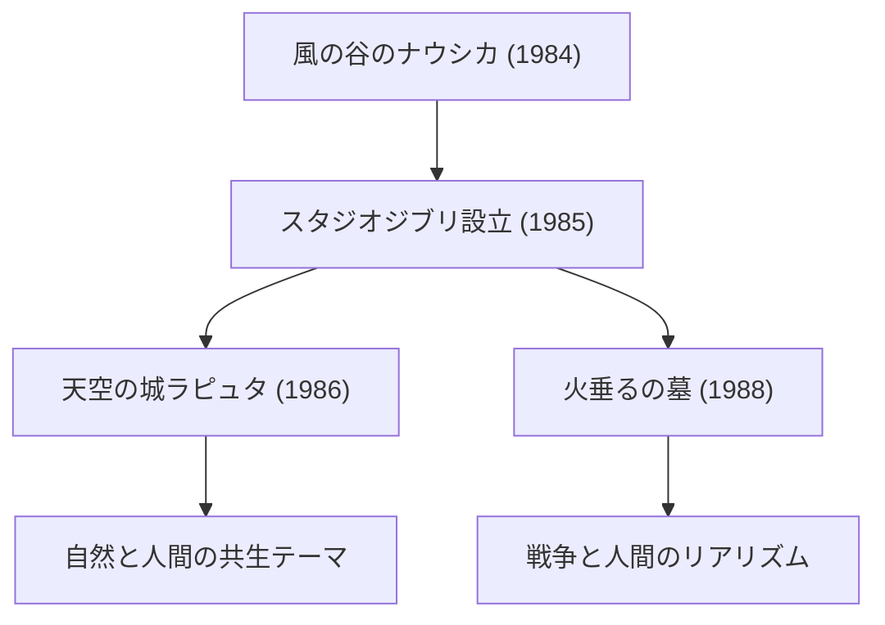

# ジブリ映画の軌跡：アニメーションが描く生命と自然のメッセージ

スタジオジブリは、単なるアニメーション制作会社の枠を超え、日本のみならず世界の映像文化において特異な地位を占めています。1985年の設立以来、宮崎駿と高畑勲という二人の天才クリエイターを中心に、数々の歴史的傑作を生み出してきました。本記事では、スタジオジブリの歴史、技術的進化、そして作品に通底するテーマの変遷について、物理学的・歴史的・技術的な視点を交えながら深掘りしていきます。

## スタジオジブリの創設と初期の挑戦

スタジオジブリの歴史は、1984年公開の『風の谷のナウシカ』の成功から始まります。この作品は厳密にはジブリ設立前の作品ですが、その制作過程で培われたチームワークと資金が、後のスタジオ設立の礎となりました。

設立直後の『天空の城ラピュタ』では、セル画を用いた伝統的なアニメーション技術の極致が追求されました。特に、飛行石の光や雲の表現には、当時の光学合成技術がフル活用されています。光の散乱や屈折といった物理現象を、手描きのセル画と撮影時のフィルターワークで再現する技術は、当時の世界標準を大きく引き上げるものでした。

## 経済成長と日常のファンタジー：80年代後半〜90年代

日本がバブル景気に沸く中、ジブリは『となりのトトロ』と『火垂るの墓』の同時上映という前代未聞の挑戦を行いました。一方は昭和30年代の牧歌的な自然と精霊を描き、もう一方は第二次世界大戦末期の悲惨な現実を描く。この相反する二つのベクトルこそが、ジブリの持つ多面性を象徴しています。

技術的には、この時期からマルチプレーン・カメラを用いた奥行きの表現がより洗練されていきました。背景画を複数の層に分けて配置し、それぞれ異なる速度で動かすことで、二次元の画面に物理的な立体感（パララックス効果）を生み出す手法です。これは、後のデジタル時代の3DCGによる空間表現の先駆けとも言える視覚的工夫でした。

## エコロジーと神話的想像力：『もののけ姫』の衝撃

1997年公開の『もののけ姫』は、スタジオジブリにとって技術的にもテーマ的にも大きな転換点となりました。本作では、森の神々と人間との壮絶な対立が描かれ、善悪二元論では割り切れない複雑なメッセージが提示されました。

ここで注目すべきは、アニメーションにおける流体力学の表現です。タタリ神が纏う呪いの蠢きや、血しぶき、水流の表現には、一部デジタル技術（CGI）が導入されました。しかし、その根幹はあくまでアニメーターの手による物理法則の観察と再構築にあります。粘性を持つ物体の動きや、重力に従って崩れ落ちる物体の質量感など、ニュートン力学を直感的に捉え、それを誇張・変形して描き出す技術は、世界中のクリエイターに衝撃を与えました。

## デジタル化への移行と国際的評価：『千と千尋の神隠し』

2001年の『千と千尋の神隠し』は、日本の興行収入記録を塗り替える歴史的ヒットとなり、アカデミー賞長編アニメーション賞を受賞するなど、世界的な評価を決定づけました。

この作品から、ジブリは伝統的なセル画からデジタルペイントへと完全に移行しました。しかし、彼らはデジタル技術を「効率化」のためではなく、「表現力の拡張」のために使用しました。色彩の無限の階調や、複雑な光源処理、透明感のある水の表現など、デジタルならではの物理的シミュレーションを取り入れつつも、手描きの温もりを一切損なわない独自のワークフローを確立したのです。

## 高畑勲の革新とリアリズムの極致：『かぐや姫の物語』

宮崎駿がファンタジーを通じて世界を描く一方で、高畑勲は常にアニメーションの枠組みそのものを問い直す前衛的な挑戦を続けてきました。その集大成が『かぐや姫の物語』です。

この作品では、線の描線をあえて途切れさせ、水彩画のような淡い色彩を用いることで、観客の脳内で映像を「補完」させるという高度な心理的アプローチがとられました。運動エネルギーが爆発するような疾走シーンでは、背景を粗いタッチで描くことで、相対性理論的な空間の歪みや速度感を視覚的に表現しています。これは、写実主義とは対極にある、人間の知覚と認知のメカニズムを巧みに利用した表現技法です。

## 未来への継承とアニメーションの可能性

スタジオジブリの作品群は、単なるエンターテインメントにとどまらず、人類が直面する環境問題、テクノロジーとの付き合い方、そして「生きる」ことの根源的な意味を問いかけ続けています。セル画からデジタルへの移行、アナログの質感の追求、そして常に時代と向き合う真摯な姿勢。これらの軌跡は、アニメーションという表現媒体が持つ無限の可能性を私たちに示しています。

ジブリが描く世界は、風の動き一つ、水のきらめき一つに、生命の息吹と物理法則の美しさが宿っています。私たちはこれからも、彼らが遺したメッセージを読み解き、新たな世代へと語り継いでいく必要があるのです。
