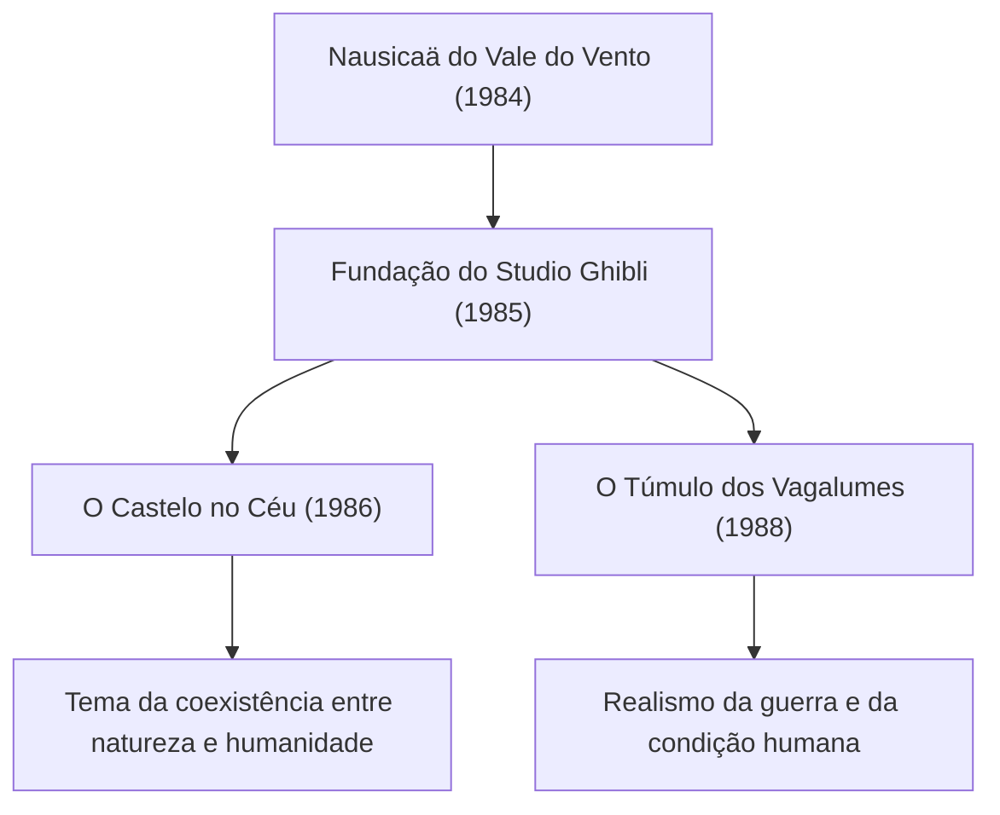

# A Trajetória dos Filmes do Studio Ghibli: A Mensagem de Vida e Natureza Retratada pela Animação

O Studio Ghibli transcende a mera definição de um estúdio de animação, ocupando uma posição singular na cultura visual não apenas do Japão, mas de todo o mundo. Desde a sua fundação em 1985, tendo como figuras centrais os geniais criadores Hayao Miyazaki e Isao Takahata, produziu inúmeras obras-primas históricas. Neste artigo, aprofundaremos a história do Studio Ghibli, sua evolução técnica e as transformações dos temas subjacentes às suas obras, incorporando perspectivas físicas, históricas e tecnológicas.

## A Fundação do Studio Ghibli e os Primeiros Desafios

A história do Studio Ghibli começa com o sucesso de *Nausicaä do Vale do Vento* (1984). Embora este filme tenha sido produzido a rigor antes da fundação formal do estúdio, o trabalho em equipe e o capital acumulados durante sua produção serviram de alicerce para a posterior criação da empresa.

Logo após a fundação, *O Castelo no Céu* buscou o ápice da técnica de animação tradicional em células (cel animation). Em particular, a luz da pedra mágica e a representação das nuvens utilizaram plenamente a tecnologia de composição óptica da época. A técnica de reproduzir fenômenos físicos, como a dispersão e a refração da luz, por meio de cels pintados à mão combinados com filtros de câmera, elevou significativamente os padrões globais da época.

## Crescimento Econômico e Fantasia do Cotidiano: Finais dos Anos 80 aos Anos 90

Em meio à euforia da economia da bolha no Japão, o Ghibli assumiu o desafio sem precedentes de lançar simultaneamente em sessão dupla *Meu Amigo Totoro* e *O Túmulo dos Vagalumes*. Enquanto um retratava a natureza bucólica e os espíritos do Japão dos anos 1950, o outro retratava a dura e trágica realidade do final da Segunda Guerra Mundial. Esses dois vetores opostos sintetizam com perfeição a multifacetada identidade do estúdio.

Do ponto de vista técnico, foi a partir desse período que a representação de profundidade usando câmeras multiplano se tornou ainda mais sofisticada. Ao posicionar as pinturas de fundo em múltiplas camadas e movê-las em velocidades distintas, criava-se uma tridimensionalidade física (efeito paralaxe) em uma tela bidimensional. Esse recurso visual antecipou os métodos de representação espacial em 3DCG da posterior era digital.

## Ecologia e Imaginação Mítica: O Impacto de 'Princesa Mononoke'

Lançado em 1997, *Princesa Mononoke* marcou um divisor de águas tanto temático quanto tecnológico para o Studio Ghibli. O filme retratou o confronto feroz entre os deuses da floresta e os seres humanos, apresentando uma mensagem complexa que transcende o maniqueísmo ingênuo do bem contra o mal.

Um aspecto que merece destaque é a representação da mecânica dos fluidos na animação. A movimentação ondulante da maldição que envolve o deus Tatari, os respingos de sangue e o fluxo da água contaram com a introdução pontual de tecnologias digitais (CGI). No entanto, o cerne dessa realização reside na observação e reconstrução das leis físicas feitas à mão pelos animadores. A habilidade de apreender intuitivamente a mecânica newtoniana — como o movimento de matérias viscosas e a sensação de massa de corpos que desabam sob a gravidade —, exagerando-a e estilizando-a visualmente, causou profundo impacto nos criadores de todo o mundo.

## A Transição para o Digital e a Consagração Internacional: 'A Viagem de Chihiro'

Em 2001, *A Viagem de Chihiro* tornou-se um marco histórico ao quebrar recordes de bilheteria no Japão e consolidou o reconhecimento internacional do estúdio ao conquistar o Oscar de Melhor Filme de Animação.

A partir desta produção, o Ghibli fez a transição completa da animação tradicional em cels para a pintura digital. Contudo, adotaram a tecnologia digital não apenas como meio de "otimização", mas para a "expansão do poder expressivo". Incorporando simulações físicas digitais — tais como gradientes infinitos de cores, tratamentos complexos de fontes de iluminação e a representação cristalina da água —, estabeleceram um fluxo de trabalho único que preservou integralmente o calor e a sensibilidade do traço manual.

## A Inovação de Isao Takahata e o Ápice do Realismo: 'O Conto da Princesa Kaguya'

Enquanto Hayao Miyazaki retrata o mundo através da fantasia, Isao Takahata manteve-se constantemente engajado em desafios vanguardistas que questionavam a própria estrutura da animação. O ápice dessa busca é *O Conto da Princesa Kaguya*.

Nesta obra, adotou-se uma abordagem psicológica sofisticada: as linhas do traço são deliberadamente interrompidas e complementadas por cores suaves de aquarela, induzindo o cérebro do espectador a "completar" a imagem. Nas cenas de corrida desenfreada, onde a energia cinética parece explodir, o fundo é esboçado com pinceladas enérgicas e rústicas, transmitindo visualmente a distorção espacial e a sensação extrema de velocidade como uma metáfora quase relativística. Trata-se de uma técnica expressiva situada no extremo oposto do fotorrealismo, tirando proveito engenhoso dos mecanismos de percepção e cognição humanos.

## A Herança para o Futuro e as Potencialidades da Animação

O acervo de obras do Studio Ghibli vai muito além do entretenimento convencional, interrogando continuamente questões cruciais como os dilemas ambientais da humanidade, a nossa relação com a tecnologia e o significado primordial do ato de "viver". A transição dos cels para o meio digital, a busca incessante pelas texturas analógicas e a postura sincera diante de cada época: essa trajetória revela-nos as infinitas potencialidades da animação enquanto veículo expressivo.

No universo concebido pelo Ghibli, no menor sussurro do vento ou no brilho efêmero da água, residem o sopro da vida e a beleza das leis da física. Cabe a nós continuar decifrando as mensagens que eles nos legaram e transmiti-las com fervor às futuras gerações.
