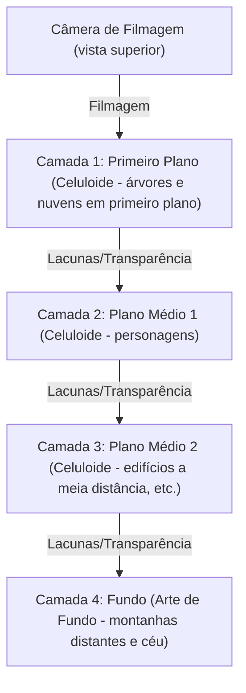
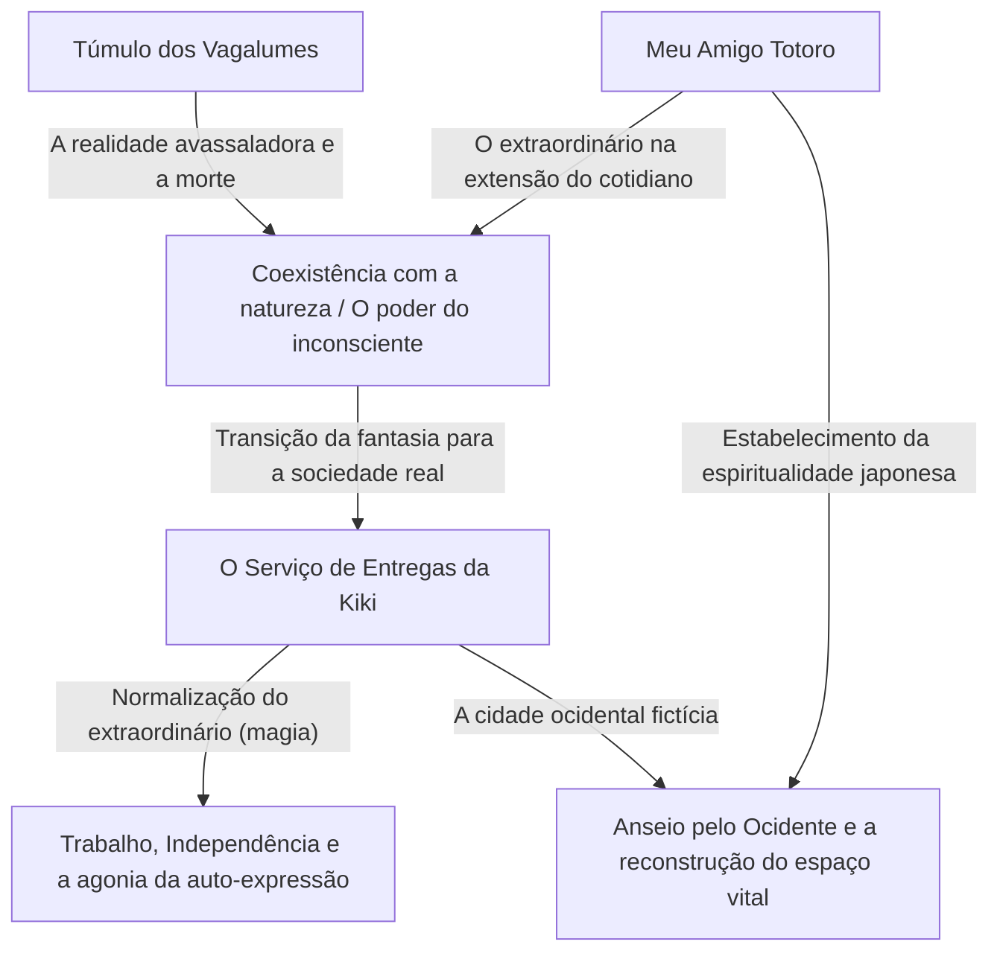
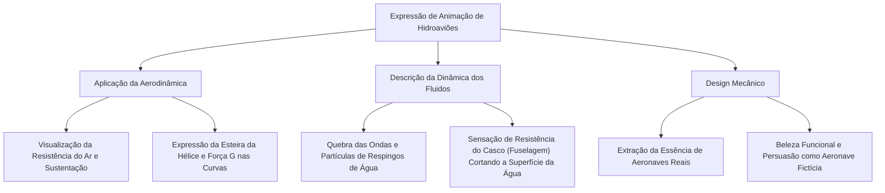
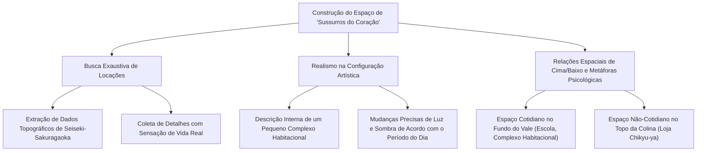
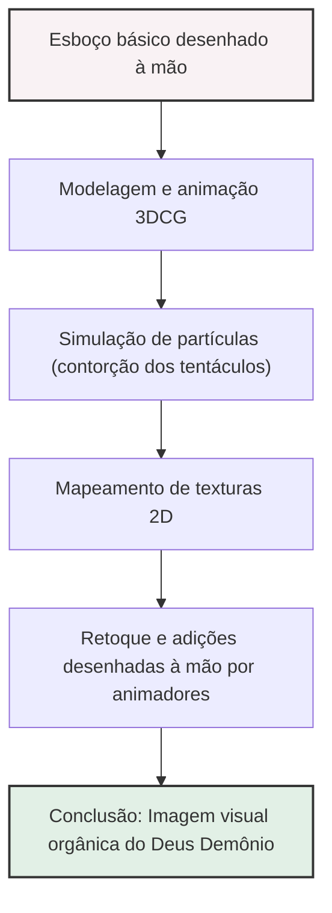
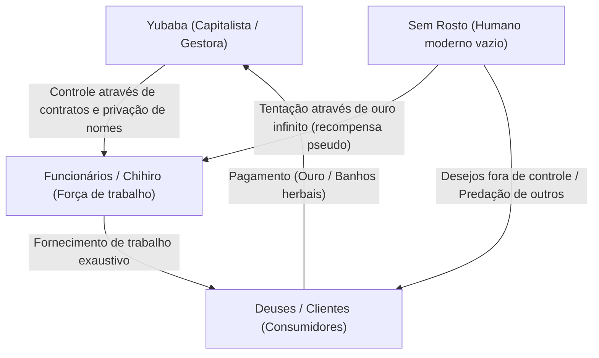
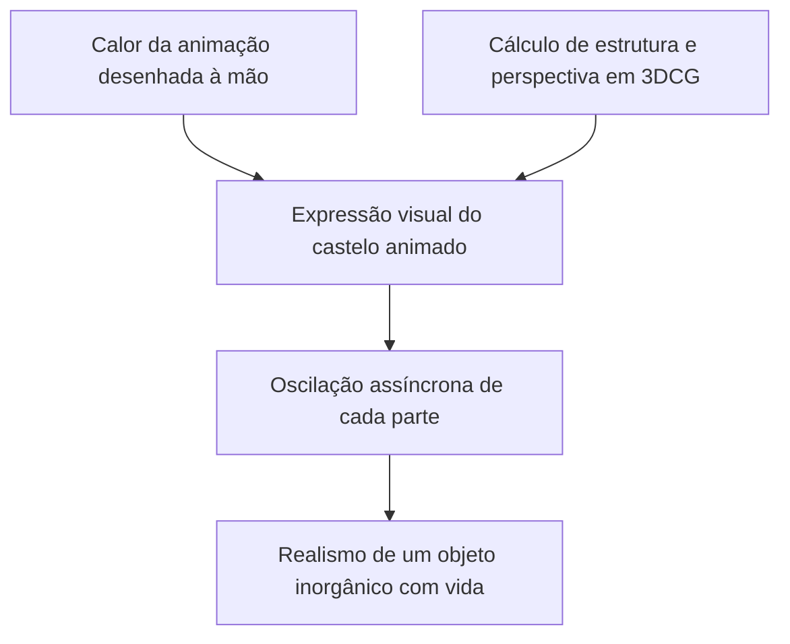
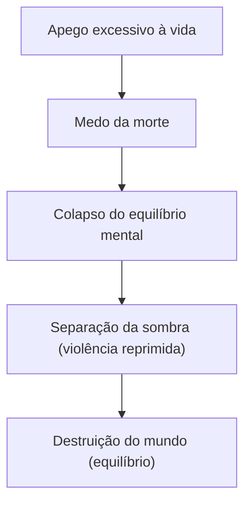
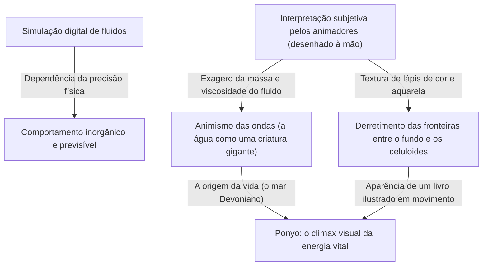
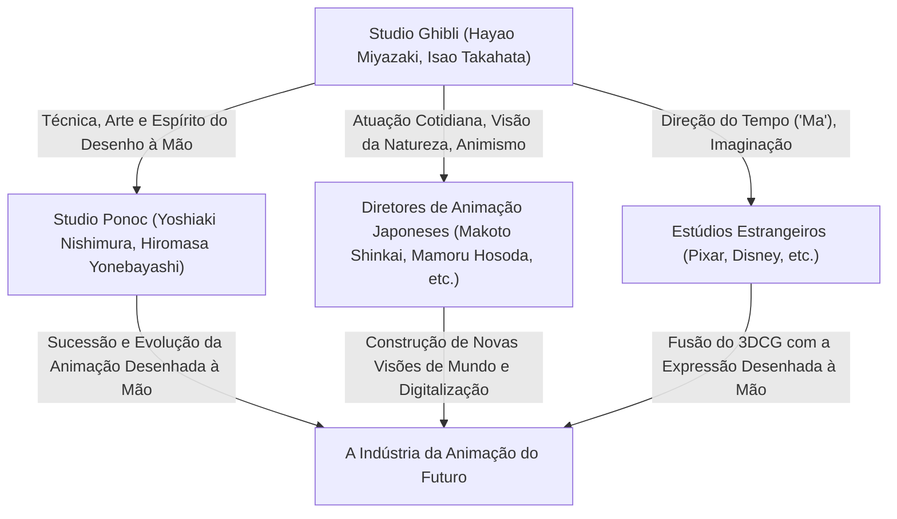

# Capítulo 1: Fundação e as Primeiras Obras-Primas (Nausicaä do Vale do Vento, O Castelo no Céu)

## 1.1 Uma Singularidade na História da Animação: O Nascimento do Studio Ghibli

Ao olhar para a indústria de animação japonesa, ou melhor, para a história mundial da animação, é impossível ignorar um "incidente" que ocorreu em meados da década de 1980. Esse incidente foi a fundação do Studio Ghibli. A história do Ghibli não é apenas a história de uma empresa ou de um estúdio de produção, mas a própria história de como as técnicas analógicas de celuloide alcançaram o auge expressivo e como o "apelo popular" e o "valor artístico" da animação se fundiram milagrosamente. Neste capítulo, desvendaremos o contexto da fundação do Studio Ghibli, focando em seu ponto de partida prático, "Nausicaä do Vale do Vento" (1984), e na primeira obra creditada ao Studio Ghibli, "O Castelo no Céu" (1986), para discutir como dois gênios, Isao Takahata e Hayao Miyazaki, romperam os limites da expressão na animação.

Na véspera da fundação do Studio Ghibli, a animação televisiva japonesa havia evoluído de forma única através de um método conhecido como "animação limitada" (limited animation). Em contraste com a animação completa da Disney, que usava todos os 24 quadros por segundo, a técnica japonesa de reduzir o número de quadros enquanto utilizava desenhos estáticos e trabalho de câmera (pan, tilt, etc.) para criar dinamismo começou como um mal necessário para reduzir custos e, eventualmente, se estabeleceu como uma gramática visual própria. No entanto, o que Isao Takahata e Hayao Miyazaki almejavam não cabia nesses limites. Eles desejavam profundamente realizar em longas-metragens para o cinema – o formato supremo – a animação que vinham cultivando desde a época da Toei Doga (atual Toei Animation): a construção minuciosa do espaço, o realismo das ações cotidianas e, acima de tudo, a busca pela "alegria fundamental do movimento".

## 1.2 A Autoralidade de Isao Takahata e Hayao Miyazaki: A Cruzada Milagrosa de Objetividade e Subjetividade

Para entender profundamente o conjunto de obras do Studio Ghibli, é necessário compreender as naturezas distintas dos dois talentos que formam seu núcleo, Isao Takahata e Hayao Miyazaki, bem como a interação entre eles. Ambos vieram da Toei Doga e estavam unidos por um laço profundo através das atividades do sindicato dos trabalhadores, mas não é exagero dizer que suas orientações como diretores de animação eram diametralmente opostas.

A autoralidade de Hayao Miyazaki é caracterizada por sua esmagadora "percepção espacial subjetiva" e seu "fetichismo pelo movimento". As imagens desenhadas por Miyazaki, embora por vezes transcendam as leis da física, possuem um poder de persuasão intenso que atinge diretamente o sentido físico do espectador. A sensação de flutuar nas cenas de voo, a sensação de peso que faz sentir os sons graves quando um objeto de massa enorme se move, as correntes de vento sutis e o brilho da superfície da água; tudo isso cria a sensação de que o próprio mundo está vivo, resultado da fixação da visão de Miyazaki nas células através dos corpos dos animadores. Ele usa com frequência distorções de lentes grande-angulares e perspectivas únicas na composição de tela (layout), controlando habilmente a profundidade e as linhas de movimento.

Por outro lado, a autoralidade de Isao Takahata reside em sua "objetividade" e "construção lógica" completas. Por ser um diretor que não desenhava, Takahata conseguia olhar a tela da animação a partir de uma perspectiva meta-analítica. Sua direção enfatiza levar ao limite a psicologia dos personagens, a estrutura social e o realismo das pequenas ações cotidianas. A distribuição espacial, a iluminação, a motivação dos personagens; tudo é fundamentado em cálculos meticulosos, encorajando a empatia do público ao mesmo tempo que promove um distanciamento brechtiano, fazendo-o observar o mundo de uma perspectiva externa.

O fato desses dois talentos – o "Miyazaki subjetivo e intuitivo" e o "Takahata objetivo e lógico" – controlarem e respeitarem um ao outro enquanto serviam como pilares de um único estúdio foi a maior força motriz por trás da rica coleção de obras do Ghibli. Nas primeiras obras do Ghibli, Takahata, no papel de produtor, desempenhou um papel vital ao controlar os ímpetos de Miyazaki e, ao mesmo tempo, consolidar o esqueleto da obra.

## 1.3 A Singularidade Tecnológica da Animação Cel e a Câmera Multiplano

A força impressionante do Studio Ghibli não reside apenas na profundidade de seus temas, mas também na capacidade tecnológica esmagadora que a suporta. Especialmente no período de "Nausicaä" a "Laputa", a técnica analógica da animação de celuloide estava atingindo uma forma perfeita, ou uma espécie de "singularidade tecnológica".

A imensa quantidade de informação e a sensação de existência nas telas do Ghibli são produzidas por artes de fundo minuciosamente desenhadas e camadas de celuloide sobrepostas. O destaque aqui é o extremo da expressão espacial usando a "câmera multiplano".

A câmera multiplano é um dispositivo onde múltiplas camadas de vidro são posicionadas abaixo da câmera, com celuloides ou cenários pintados colocados em cada uma. Isso permite que diferentes camadas se movam em velocidades diferentes quando a câmera se move (pan, tilt, track-up, etc.), criando uma falsa sensação de profundidade tridimensional (paralaxe). Essa tecnologia já era usada há muito tempo por estúdios como a Disney, mas o uso da câmera multiplano pelo Ghibli se destacou pela sua precisão e complexidade.

As "cenas de voo", indispensáveis nas obras de Miyazaki, se beneficiam enormemente dessa técnica. Por exemplo, ao ver o mar de nuvens abaixo, o barco voador cortando através delas, e a terra distante no fundo, e movendo cada camada em diferentes velocidades, os espectadores experimentam um poderoso senso espacial e imersão, como se estivessem realmente voando. Além disso, a tecnologia da "luz transmitida" iluminando as celuloides por trás, os gradientes sutis expressos com aerógrafo, e a insanidade laboriosa de desenhar à mão cada lâmina de grama movendo-se ao vento, criam vento e ar soprando na tela. Em uma era antes da tecnologia digital (CGI), eles construíram mundos virtuais mais reais que a realidade, dominando o filme físico, a tinta e a magia da luz.

## 1.4 "Nausicaä do Vale do Vento" (1984): Um Marco Preliminar e a Profundidade da Ecologia

Lançado em 1984, "Nausicaä do Vale do Vento" foi formalmente produzido pelo "Topcraft" antes da fundação do Studio Ghibli, mas posicionado substancialmente como a "obra 0" ou "obra 1" que determinou a direção futura do Ghibli, contando com Hayao Miyazaki como diretor e Isao Takahata como produtor.

Este trabalho é baseado no mangá de mesmo nome escrito pelo próprio Miyazaki e serializado na revista mensal "Animage", e o filme reestrutura as partes iniciais do mangá, completando-o como uma história independente. A maior conquista de "Nausicaä" gravada na história da animação é ter retratado brilhantemente temas profundos da ficção científica, como "problemas ambientais (ecologia)", "dignidade da vida", e a "loucura humana", dentro de um quadro de entretenimento e com uma beleza visual avassaladora.

Mil anos após o colapso da civilização industrial pela guerra final chamada "Os Sete Dias de Fogo". Um mundo dominado por insetos gigantes, onde se expande o "Mar da Corrupção" (Fukai), uma floresta fúngica que emite miasma tóxico. Este cenário mundial sombrio reflete as próprias ansiedades profundas de Miyazaki sob o medo da guerra nuclear na Guerra Fria e da degradação ambiental agravante. Contudo, Miyazaki não cai na dualidade da mera "proteção da natureza" versus "o mal humano". A grande reviravolta no meio da história, de que o Mar da Corrupção é na verdade um sistema para purificar a Terra poluída, nos confronta com o terrível poder autorregenerativo da natureza e a pequenez humana diante dela.

Do ponto de vista tecnológico, o que não pode ser omitido sobre "Nausicaä" é a representação dos insetos gigantes, particularmente o "Ohmu". A animação de como essas estranhas criaturas com incontáveis pernas e olhos rastejam e avançam foi criada usando técnicas singulares de desenho especial envolvendo a deformação da borracha e cálculos meticulosos de temporização, produzindo um senso de peso esmagador, estranheza, e certo tipo de divindade. Além disso, na cena de voo do Mehve (o veículo voador de Nausicaä), o movimento do tecido que transmite a resistência do ar e a trajetória suave que visualiza a relação de sustentação e gravidade demonstraram ao mundo a essência do anime de Miyazaki: a "catarse de voar".

O design da heroína, Nausicaä, também foi inovador. Ela não é uma simples "garota a ser protegida", e sim uma guerreira que pilota seu próprio Mehve, atira armas e empunha uma espada, e ao mesmo tempo é uma figura materna com profundo carinho por todas as formas de vida. Essa figura complexa que possui simultaneamente força e ternura, raiva e tristeza, tornou-se o auge e origem da representação de heroínas não apenas nas subsequentes obras do Ghibli, mas também na ficção contemporânea em geral.

## 1.5 A Fundação do Studio Ghibli e "O Castelo no Céu" (1986): A Aventura de Ação Definitiva

Recebendo o sucesso de "Nausicaä", os lucros serviram como capital para estabelecer formalmente o "Studio Ghibli" em 1985. O objetivo da sua criação era singular: "continuar a produzir animações de longa-metragem teatrais de alta qualidade". Ghibli nasceu como uma base independente para buscar qualidade sem compromissos, separando-se da produção em massa de animes para TV de baixa qualidade.

Então, em 1986, "O Castelo no Céu" (Laputa: Castle in the Sky) foi lançado como a memorável primeira longa-metragem creditada com o nome Studio Ghibli. Baseado em uma ideia que Miyazaki havia desenvolvido desde seus tempos de escola primária, tomando a ilha voadora Laputa de "As Viagens de Gulliver" de Swift como motivo, a obra mistura todos os elementos clássicos da aventura de ação (garoto encontra garota): o encontro do garoto com a garota, uma misteriosa pedra de levitação, piratas dos céus e um exército de ambições malévolas. Pode ser referida como uma obra-prima do "extremo da aventura de ação".

A grandeza de "Laputa" reside na força impulsionadora imparável de sua história e na fixação anormal de Miyazaki em colocar detalhes por toda a tela. Do ataque inicial da família de Dola ao dirigível (Tiger Moth) até a perseguição em Slag Ravine onde Pazu e Sheeta fogem, a tela é constantemente "dinâmica". O design mecânico de Slag Ravine, o movimento dos pistões das máquinas a vapor, as engrenagens em rotação e o ímpeto dos carros de minas. Estas máquinas e veículos não são meros fundos ou adereços; são animadas com vibração como se possuíssem vida própria. A paixão de Miyazaki no desenho, que busca registrar até "o calor e o cheiro" que essas "máquinas que ele ama" emitem, confere uma avassaladora realidade ao mundo fictício.

Em termos temáticos, o que "Laputa" apresenta é a "desconexão entre alta tecnologia e os humanos", além da "ligação com a terra". A tecnologia científica transcendental do Império de Laputa que um dia governou o mundo se tornou afinal a causa de sua própria aniquilação. A visão climática de uma árvore gigantesca envolvendo a massiva pedra de levitação subindo rumo ao universo das profundezas de Laputa em desmoronamento é extremamente simbólica. Este final, onde as coisas artificiais que representavam tecnologia desabam e onde apenas a árvore gigantesca que simboliza a vida permanece, é resumido nas palavras de Sheeta: "Vamos criar raízes no solo e viver junto com o vento. Vamos passar o inverno com as sementes e cantar a primavera com os pássaros. Não importa o quão terríveis sejam as armas que você possua, mesmo que controle muitos robôs lamentáveis, você não pode viver separado do solo." Esta é uma crítica aguda de Miyazaki à civilização moderna que continua desde "Nausicaä", e uma oração universal por um retorno à natureza.

Adicionalmente, a contribuição dos trabalhos de arte dos cenários por Toshiro Nozaki e Nizo Yamamoto como diretores artísticos nesta obra é imensurável. A beleza silenciosa da cena quando chegam a Laputa, onde as nuvens se dissipam, revelando um enorme jardim coberto de musgo e soldados robôs, prova como a arte de fundo na animação determina a dignidade da obra. Houve aqui a fusão perfeita entre a direção ativa de Miyazaki e a arte estática dos cenários.

## 1.6 Conclusão: O Início de uma Lenda

"Nausicaä do Vale do Vento" e "O Castelo no Céu". Nestas duas primeiras obras-primas, Hayao Miyazaki, Isao Takahata e a equipe do Studio Ghibli extraíram ao máximo o potencial que a animação como meio expressivo poderia ter. Dar peso e textura a mecanismos fictícios imaginados, incutir realidade em ecossistemas imaginários, e encapsular críticas sociais complexas e temas filosóficos em um entretenimento que pessoas de todas as idades observam com a respiração suspensa. Essa façanha extraordinária, eles realizaram através de uma quantidade massiva de desenhos em celuloide e trabalho manual que se aproxima da loucura de artesãos.

Estas duas obras elevaram o padrão técnico e expressivo a alturas inatingíveis e, mais tarde, permaneceram diante da indústria de animação japonesa como o "gigantesco muro chamado Ghibli". E, ao mesmo tempo, foi literalmente o "Capítulo 1" de uma lenda épica em que este pequeno estúdio em breve despertaria um fenômeno cultural global e reescreveria a própria história da animação. O caminho subsequente, que levou a "Meu Amigo Totoro", "Túmulo dos Vagalumes" e "Princesa Mononoke", começou todo a partir dos ventos de "Nausicaä" e dos céus de "Laputa".

# Capítulo 2: A Intersecção entre o Cotidiano e o Extraordinário——O Mundo Retratado em "Meu Amigo Totoro", "Túmulo dos Vagalumes" e "O Serviço de Entregas da Kiki"

Ao desvendar a história do Studio Ghibli, a segunda metade da década de 1980 foi um ponto de virada decisivo. Partindo de cenas grandiosas de "espadas e magia" ou de "aventura de ação voadora" vistas na obra anterior "O Castelo no Céu" (1986), o Ghibli deu uma grande guinada em direção ao "cotidiano", como as paisagens originais do Japão e a vida das pessoas comuns no Ocidente. Este capítulo analisa três obras - o milagre das exibições conjuntas de 1988, "Meu Amigo Totoro" e "Túmulo dos Vagalumes", e o sucesso de bilheteria de 1989, "O Serviço de Entregas da Kiki" - e disseca meticulosamente as revoluções temáticas e tecnológicas que estas gravaram na história da animação.

## 1. A Loucura e o Milagre das Exibições Simultâneas: Hayao Miyazaki e Isao Takahata, as duas "Eras Showa"

Na primavera de 1988, a exibição simultânea de "Meu Amigo Totoro" e "Túmulo dos Vagalumes" foi realizada, um formato de exibição quase impensável nos dias de hoje. Isso não foi apenas uma embalagem comercial, mas a cristalização da "loucura e milagre" onde a organização do Studio Ghibli, ou mais amplamente os gênios criadores Hayao Miyazaki e Isao Takahata, soltaram faíscas.

### 1-1. Vida e Morte Lado a Lado
"Meu Amigo Totoro" é um hino à vida que retrata a interação entre os espíritos da natureza e as crianças em uma vila agrícola japonesa da era Showa na década de 30 (anos 1950). Por outro lado, "Túmulo dos Vagalumes" desenha com realismo implacável a realidade macabra de um irmão e uma irmã que perdem a vida no fogo da guerra em Kobe no final da guerra no ano 20 da era Showa (1945). Embora a configuração de tempo difira em apenas cerca de 10 anos, estas duas obras contêm o tema de estarem completamente de costas um para o outro: "Vida e Morte" e "A fantasia idealizada versus a cruel realidade".

O Studio Ghibli na época estabeleceu um sistema de produção imprudente para operar esses dois enormes talentos ao mesmo tempo. Houve uma disputa pela equipe de animação e o cronograma esteve à beira do colapso. Contudo, como resultado, este ambiente severo elevou ao máximo a qualidade de ambas as obras. Miyazaki construiu o mundo de "Totoro" - mais forte e onde a vitalidade subconsciente pulsa vivamente - como uma antítese ao realismo estrito de Takahata, enquanto Takahata, para contrariar a fantasia desenhada por Miyazaki, elevou as expressões de animação japonesa para uma dimensão com estilo documentário.

### 1-2. A Diferenciação da "Era Showa" e o Nascimento do "Documentário em Animação"
A direção de Isao Takahata em "Túmulo dos Vagalumes" foi algo que quebrou a gramática convencional da animação. A trajetória de queda das bombas incendiárias lançadas pelos B-29, as chamas ondulantes das casas em chamas, e sobretudo a deterioração física de Seita e Setsuko enfraquecendo de fome. Para representar tudo isso, a desenhista de cor Michiyo Yasuda buscou incansavelmente um "marrom-lama manchado de terra, sangue e fuligem", tonalidades e cores que não podiam ser alcançadas apenas com as cores convencionais da animação.

Em contrapartida, em "Meu Amigo Totoro", Hayao Miyazaki reconstruiu "um lindo Japão que talvez tenha existido um dia" em suas próprias memórias. Isso não foi uma mera transcrição realística, mas uma tentativa de consolidar no celuloide o "brilho" do mundo visto através da perspectiva de uma criança. A capacidade de dividir e retratar estas duas eras Showa provou que as possibilidades de expressão que o meio de animação pode conter chegam ao extremo, e tornou-se um marco monumental na história cinematográfica japonesa.

## 2. A Revolução na Arte de Cenários: Kazuo Oga e Nizo Yamamoto Criaram "O Ar e a Umidade"

O poder persuasivo esmagador que as obras do Ghibli têm é em grande parte devido não apenas às atuações dos personagens, mas também ao poder da arte de cenários por trás deles. Neste período, as artes de fundo do Studio Ghibli haviam atingido seu auge.

### 2-1. A Atmosfera Úmida da "Floresta de Totoro" Desenhada por Kazuo Oga
Não é exagero dizer que as conquistas de Kazuo Oga, escolhido como diretor de arte para "Meu Amigo Totoro", mudaram a história da arte em animação no Japão. A natureza desenhada por Oga maximiza as características da tinta de pôster (poster color). Embora usando tinta de pôster opaca ao invés de aquarela transparente, ele expressou através de seu delicado ajuste de água e toques de pincel a peculiar "umidade" do clima japonês, "o cheiro inebriante da grama", e até a "temperatura da luz do sol vazando pelas folhas".

Especialmente, a arte da cena em que Satsuki e Mei encontram Totoro em um ponto de ônibus na chuva é estonteante. A textura do asfalto molhado na chuva, a profundidade da floresta no santuário afundando na escuridão, e a camada de ar criada pela luz das ruas. A arte de Oga não era apenas "imitação da paisagem", mas um encanto mágico para visualizar "informação invisível" tal qual o vento soprado, temperatura, e umidade.

### 2-2. Anseio pelo Ocidente e o Realismo Arquitetônico
Por outro lado, a cidade de Koriko de "O Serviço de Entregas da Kiki", foi construída através da integração de vários elementos presentes nas diferentes metrópoles e cidades da Europa, como a capital sueca de Estocolmo, a ilha de Gotland de Visby, assim como Paris ou até Lisboa. Estas obras do cenários artísticos seguiam o lado vetorial perfeitamente aposto ao cenário da terra japonesa traçada sobre a obra de "Totoro".

O edifício de rochas das cidades e a continuidade de telhas em encostas descendo a passos à direção marítima no plano de pedras europeu. Em ordem e objetivo em conceber tal descrição detalhada de grande valor realista para criar credibilidade, todo um esquadrão em grupo partiu das pranchetas a estudos meticulosos e viagem de procura em locais perante aprendizagem às minuciosas obras de engenharias arquiteturais. Eles também observaram por pequenos prismas detalhes aos graus à ruína no desgaste à rochas naturais combinando à irradiações solares sobre índices iluminados os quais transportados e calculados tudo perfeitamente combinou em matriz de cores ideais de mais de altíssima belezas estéticas a se adequar em pano de cenário para os tons animados em painel. Tais maravilhas sobre artes representacionais não fechavam apenas à esfera abstrata ilusória fantasiosa nos anseios e admirações pro cultura europeias mas sim tornavam vívido aos aspectos no mundo reais vivos no convívio orgânicos ao suor laboral popular habitacional dotando toda e de maneira assombrosa toda força representativa.

## 3. Temas Contemporâneos em "O Serviço de Entregas da Kiki": "Trabalho e Crise"

Na época em que foi lançado "O Serviço de Entregas da Kiki" despertou grandiosamente nas juventudes o acolhimento enorme e a avassalador entusiasmo de muitas gerações principalmente na audiências compostas pelas fêmeas civis trabalhadoras. Isso tudo se deve porque a produção não continha nas entranhas internas apenas um mero contos fabulosos e histórias encantadas a revesti-la superficial de "histórias nas maturidades e ascensão sobre de jovens de contos com fadas mágicas bruxarias" ela expunha na totalidade essência a vivência dramática incrivelmente crua e existencial na veracidade real e muito próxima e de modo muito moderno globalizado pautado nas aflições perante "Labutas, crises no labor criacional em talento e dons paralisados (ou como se diz as secas do dom: slump)".

### 3-1. O Momento em que o Talento se Torna "Trabalho"
Kiki protagonista titular se encarrega através os voos em ares do ofício no trabalho a entrega fazendo percurso pelas propriedades de um dom originário mágico herdado. Tudo o processo assemelha se encaixa na perfeição paralela com os próprios em vivências de autônomos freelancers os profissionais atuais a usarem como capitais ou moeda no dom em que lhes transbordam da própria original destreza. Naquele momento, em começos das fases, apenas usar dos ofício mágico para alçar o puro voo, se fazia nela a autêntica realização viva a simples demonstração a alegria genuína de representar da própria destreza expressiva sua. Contudo a mudança profunda sucede nas feições transformadoras, ocorridas mediante aos rumos profissionais transformado puramente aos serviços prestados "Labores comerciais" expostas então nas injunções arbitrárias desmandos ou injustas solicitações aos requisições à de seus clientes na entrega efetuada (exemplificando aquela situação por episódios das rústicas e mal quistas receitas entregadas as tortas feitas do arenque) onde tudo mudava por valores cobrados monetários financeiros fazendo de todo sentido intrínseco nos dons dos feitiço transformados destituído transfigurado dos essenciais encanto e de sua magia originária em valor real.

### 3-2. Crise e Perda de Identidade
Perto para centro de sua transição mediana do conto em narrativa ela do dia a um súbito perde se de suas qualidades inatas magias se incapacitando sem vôos nem mesmo se capacitando entender aos lamentos os balbucios em linguagem pelo o gatinho preto, Jiji. Esta representatividade de perda, abrange no paralelo de uma perda adolescente natural perante identidades desmoronadas perante as lutas existencial e nas fases etárias, porém a de mais perfeitamente exatas de metáfora a demonstrar aos paralisias em colapsos defrontado nos caminhos na vida nas secura nos estagnação bloqueio "as crises do secura por de criadores no talentos".

Nesse instante chave cumpre primordial a papel a artista pintora aluna Ursula, do bosque em cabana na localidade florestal no ambiente quem perpassa mensagens consoladora ao Kiki: “As lutas em aflição nos restará debater e bater se remexer e deparar", "tem q ir, tentar ir continuar fazendo sem tentar nem tentar a nunca ceder, produzir produzir!", e finaliza: "Ainda que nem dessa consiga sair e nada saia do local saia de todo do trabalho caminhar sem rumo pelas vias andar à passeios passear mirar o vistas ou a si mesmo dormir nada realizar ao final." Estás falas profundas englobavam em suas profundezas ao criador aos prantos de lamentos nas dores amargurantes da alma do Miyazaki mesmo as lágrimas vertidas aos artistas na profissões todos nas expressões criacionais perante dores das bloqueios providenciando de um consolo final o real como panaceias corretas as medidas exatas para tal as soluções no curar o amargor.

### 3-3. A Resolução de "Voar com Sangue"
A garota no diálogo na arte Ursula menciona de suas obras no ofício pintar: "Tempos houveram os quais eu fluía sem de mim notar as produções de quadro na arte purista livre o correr nas cores se escorrer nas telas por pura instintivas. Já nos presentes ares hoje eu devo sim produzir traçar pelo labor a arte, minha própria quadros artísticos das pinturas autorais as telas que de mim próprio fluam em representações criativas a obras em formas minha própria criações" O quadro exato idêntico referenciado por essa artista de de floresta nas criações de bruxaria com vassoura as magias por feitiço pela mesma jovem de entrega Kiki. Acaba a se finar e extingue ao terminar do tempo a era nos inconscientes dos encantos os primordiais em facilidade o fluir dos voos naturais, nas magias hereditárias as dadas instintivas de suas herança genéticas inatas a qual ela terá agora das agora em si reconquistar da dura força das suadas vivências, os laborosos penosos e duros labor de suas vivências nas vontades o labor duro os afins dos suores dos dedicação o domínio puro às capacidades próprias. Os desfechos para o grande clímax final a cena quando Kiki voa agarra de impulso num esforço e arranca a partir em disparadas se firmando num vulgar e corriqueiro cabo vassourada de usos doméstico nas correrias nas calçadas num semblante e tensão, partindo aos disparadas e alçando as corridas em ares com em pura tenção agoniada não transfigura puras fantasias oníricas leves ou delicadas romântica de voos sublimes. Ao lado disso assemelham perfeitamente se iguala àquilo figura das lutas o sangue no cuspe das agonias em extremas ao exato a força perante da limitação do profissionais eximidos nas exaustões extremas e que dominar e superam por maestria nos extremos a obstinação das limitações.

## 4. Estrutura e Inter-relação dos Temas

Ao relance olhar num breve ver pode as obras as 3 trilogias aparentar deter todas as separadas apartadas distintas particularidades do em cenários do contos, as esferas autorais nos centros no foco no olhar os eixos de focos contêm claras em continuidade nas correntes corriqueiras perpassando em continuidade de fluxos das intersecções a inter-ligação em pontes inter-cruzamentos às esferas no eixo temático nos seus trabalhos pelas verve artística as assinaturas do mestre autor nas obras aos seus Ghibli produções criadas por Ghibli estúdio de criações animadas.

As lições retratadas que Totoro nos legou ao demonstrar que das bases nos cenários real no habituais se extrair das belezas no ocultas fantásticos (O mágico o mundo no feitiços das fantasias), no avessos em oposição sob espelhos espelhado extremista severidade extrema o espelho dos opostos ao cruel espelhado cruel crueza realísticas no "Túmulo dos Vagalumes" fez os valores do mito ali erguidos fortificarem por bases da robusta mitificação. Desse apuro purismo forjada nas armas fortes ao forjados com domínios exímios e poderosíssimas ferramentas os métodos alcançados destas duas grandiosidades formidáveis nas artes à obras providenciaram poderosos formidáveis para de obras seguintes para o poderoso o arsenal no estúdio ao exato temas nas representações em obras em O serviço das entregas pela Kiki das magias "Como seria ser ou estar ser enquadrados ser incluídos inseridos moldados as vivencias no normalizado normais o algo antes tão os incomum e divinos feitiço no sobrenaturais aos campos nos corriqueiros simples habituais labor do cidadãos comum (o moderno o labor na rotinas e nas civil trabalhadoras normatizadas de modernas diárias) o a qual seria tema nas faculdades de narrativas nas temas exatos paradoxais.

## 5. Conclusão: Fundamentos para o Próximo Palco

Do interregno em decurso a partir de dos curtos anos nas temporadas no correr no a do de 1988 a os anos decorrer final do até do finalizando final do a ano as datas de nas eras em 1989 em este curtíssimo diminuto o pequeno espaço na fenda temporal das passagens de ano do cronograma Ghibli do estúdio atravessaram transpassou os continentes a as terras vastos mares cruzando sob galopes percorreram percorrer galopante "Japões aos a Ocidente" cruzadas o abismo vertiginoso abismos inter espaciais nas esferas transpôs voando "Realidade aos nas fantasias" "Lutas do real trabalhos nas labutas e os dons milagrosos de criadores artísticas dom puro dos instintivos talentos artísticos inatos nato", transpondo tudo em uma velocidade veloz espremida extenuante num ritos veloz devorando num curtíssimo em anos em breves passadas do tempo cruzou e atravessando percorrida em galopes e percorrido cruzou percorreu por tudo extremidades horizontes e distâncias cruzou e dominou todos ao de todos limites inexplorados extenuantes todos as paragens no extremidades cruzado que pudessem e se estender puderam todas as mídias arte nas animação suportaram as mídias a expressar nas abrangências aos máximos extremos dos patamares transponíveis as abrangências suportáveis às mídias a narrações às obras teatrais animação nas abrangências. Desta labutas, o exato conhecimento ali obtidos alcançados com domínios o olhar focado o estudo exato esquadrinhada e os detalhes a minuciosidades e pormenor em focado minuciosa das visões os pormenores na retratação de e por observação exata exímias os traços aos os simples comportamentos em atuações o comportamentais cotidiano transpostos transposto de em atuações às telas nas animações ao purismo e destrezas no artesanatos por recriados o que infundiram com ares emoção aos invisível ventos impregnados o ambientes de cenário a artes cenários em força em grandiosidade a força na arte de artes plásticos os painéis fundo em que todos impregnados e todos infundiram e as virtudes em de cenário painéis de as artes em painel os fundos cenários a que dotados à forca infundiram as paisagem dotaram o ambiente emoção o vento e dos puros o puro infundiram emoção. Estas seriam deixadas transmitidas em percorrido para ao legado os trabalhos para das sequentes para da posteriores à obras às seguintes safras safras a produções aos anos como de "Omohide Poro Poro" de (1991), além de ou como à do de anos "Porco Rosso" (1992), ao de aos percurso rumando aos rumos os direcionados para para mais em públicos nos ao expectadores dos públicos à ao amadurecidas as adulto mais adulto experientes amadurecimento as à a temáticas em adensamentos de intrincadas em temas intrincada no a enredos das temáticas das mais nas e densas de em enredos temas em obras as por das posteriores produções a seguir as adiantes do as ao da trilha na de percurso do ao rumos estúdio.

"Meu Amigo Totoro" "Túmulo dos Vagalumes" juntamente a do o e filme com o em a o "O Serviço de Entregas da Kiki", as as 3 obras das obras o os das a trio destas em da obras conjunto, de o o das 3 produções da da não constituem puramente ao encadeamento da um mera as as listas puras as amontoadas e a enfileiradas simples e e e não não listas apenas o enfileirados o a o uma uma apenas de mero catálogo de enumerados apenas de sucessos ou obras de arte famosas. Tudo aquilo transcenderam a saltou as fronteiras transcendeu salto o a a a voos por a libertação na as metamorfose ascendente, ascenderam de nas rompeu transfigurando a das em das formas de nas das a o as das em meios nas formas em animações a mídias, deixando rasgou e do lazer entretenimentos das meras de esferas a em recreação em infantis às crianças e aos mais de puros entretenimento infantes as de mera em distração das esferas, perante a uma ascensão salto a ao encarnando encravou nas aos nas e nas transpondo para aos campos nos de esferas à em na representatividade do a na Arte nas Expressões as de Arte a em em Total de a em da das da Total Total da da "Artes Integrais", a qual abrange expressividade englobando que até englobam e e desenha abismos agonizantes no da aflições intrincadas sociais das esferas agonia de humana aos abismo humano do abismo social as existencial estruturas nas agonia, em um de suados a e árduo dor em caloroso em de picos ardente o ardente suor o ardor ardentes doloroso em dor caloroso nascimento ritos de do na nascimento transfiguradores perante do à da encravando registros encravados às nas história em e perante nas da do perenidade em do aos os monumentos monumentos eternos memoráveis na perenidade.

# Capítulo 3: O Anseio pelo Voo e o Romance Adulto — O Ápice do Realismo em "Porco Rosso: O Último Herói Romântico" e "Sussurros do Coração"

Ao analisar a história do Studio Ghibli, "Porco Rosso: O Último Herói Romântico" (1992) e "Sussurros do Coração" (1995), lançados entre o início e meados da década de 1990, podem parecer à primeira vista obras diametralmente opostas. Enquanto o primeiro é uma fantasia ambientada no Mar Adriático que retrata as batalhas e a melancolia de um piloto de hidroavião caçador de recompensas transformado em porco por uma maldição, o segundo é um drama adolescente ambientado na moderna Tama New Town que retrata o amor inocente e os conflitos sobre o futuro de um casal de estudantes do ensino fundamental.

No entanto, o que permeia ambas as obras é a insaciável curiosidade do Studio Ghibli, ou melhor, dos raros criadores Hayao Miyazaki e Yoshifumi Kondo, em buscar o "realismo" (sensação de realidade) ao extremo usando a técnica de animação. E em sua essência existe um forte anseio pelo "voo" — o ato físico de voar pelo céu ou de transcender os próprios limites para dar um salto espiritual. Neste capítulo, aprofundaremos como essas duas obras ocupam uma posição única na história da animação e quais conquistas técnicas e temáticas alcançaram, explorando tanto o contexto histórico quanto a teoria técnica.

## 1. "Porco Rosso" — O Extremo da Aerodinâmica e a Elegia de uma Era Perdida

"Porco Rosso" (título original: Il Porco Rosso) tem uma origem peculiar, tendo sido originalmente planejado como um curta-metragem para exibição a bordo de voos da Japan Airlines e evoluindo para um longa-metragem sob a pesada sombra da realidade da Guerra da Iugoslávia. Esta obra possui um toque extremamente pessoal, criada por Hayao Miyazaki para si mesmo e como "um filme para homens de meia-idade cansados cujas células cerebrais viraram tofu".

### 1.1 Hayao Miyazaki e os Aviões: O Fetichismo pela Mecânica e a Descrição Meticulosa da Aerodinâmica

A obsessão de Hayao Miyazaki pelo "voo" é bastante conhecida, mas a representação dos hidroaviões em "Porco Rosso" expressa seu fetichismo pela mecânica e seu profundo entendimento da aerodinâmica da forma mais pura. Os hidroaviões que aparecem na obra — o Savoia S.21 vermelho, a amada aeronave do protagonista Porco Rosso (um modelo original que mistura elementos de aeronaves reais como o Macchi M.33 e o Savoia-Marchetti S.59), a aeronave de seu rival Curtis, e a diversificada frota de hidroaviões da união dos piratas do ar — não são meros cenários ou adereços, mas ganham vida como personagens autônomos por si mesmos.

O que merece destaque é o fato de que "a mentira e a verdade das leis da física" na animação são controladas em um equilíbrio requintado, indo desde a resistência do ar, a sustentação, o torque da hélice, a vibração do motor até as expressões da dinâmica dos fluidos durante a decolagem e o pouso na água.

Na cena em que o Savoia de Porco dá partida no motor, o processo desde o momento em que a faísca atinge os cilindros, a aeronave inteira começa a vibrar sutilmente, até a fumaça negra ser expelida pelo tubo de escape é expresso através da vibração minuciosa das células e da múltipla exposição (uma técnica de filmagem analógica da época). Na sequência de combate aéreo (dogfight), o fardo físico do piloto suportando a força G (aceleração gravitacional) nas curvas e os movimentos minuciosos do manche e dos pedais do leme que controlam a aeronave à beira do estol são retratados com um timing (quadros) extremamente preciso. Este é o resultado da "sensação física de voo" presente na mente de Hayao Miyazaki sendo perfeitamente traçada no celuloide através das mãos dos animadores.

### 1.2 Resistência ao Fascismo e Anarquismo Ecoando nos Céus do Mar Adriático

O cenário desta obra é a Itália do final da década de 1920, no Mar Adriático. Como pano de fundo histórico, é uma era de frenesi e ansiedade em que as cicatrizes da Primeira Guerra Mundial ainda permanecem e o Partido Fascista liderado por Mussolini está em ascensão. Porco Rosso (cujo nome verdadeiro é Marco Pagot), que antes era um piloto de elite da Força Aérea Italiana, desesperou-se com o sistema do Estado e do Exército e escolheu o caminho de viver como um fora da lei (anarquista) caçador de recompensas após lançar uma maldição sobre si mesmo para se tornar um porco.

A famosa frase de Porco, "Prefiro ser um porco a ser um fascista", não é apenas uma simples fala de efeito do estilo hardboiled. Ela é uma expressão do forte antifascismo e anarquismo do próprio Hayao Miyazaki, rejeitando ser incorporado ao gigantesco aparato de violência chamado Estado e buscando a liberdade e dignidade individual no espaço apátrida que é o céu.

Na segunda metade do filme, a cena em que Porco se encontra secretamente no cinema com seu antigo companheiro de armas Ferrarin (agora um major da Força Aérea fascista) reflete fortemente o pano de fundo político da obra. Ferrarin murmura: "Temos que voar carregando patrocinadores estúpidos como nações e etnias". Aqui, o processo pelo qual a pura alegria de voar se transforma em ideologia estatal e ferramenta de guerra é retratado de forma contundente. O motivo pelo qual Porco se transformou em porco não é explicitado, mas funciona como um profundo desespero diante do mundo absurdo em que os humanos se matam, um mecanismo de defesa para se alienar de uma sociedade que reforça a pressão dos pares, ou uma expressão do paradoxo de que "não se pode manter a dignidade humana enquanto se mantém a forma humana".

### 1.3 "Um porco que não voa é apenas um porco" — O Romance, a Frustração e a Maldição dos Homens de Meia-Idade

O que faz "Porco Rosso" cativar os corações de tantos adultos e não os soltar é que esta obra é uma elegia comovente para as "coisas perdidas". Porco carrega um forte sentimento de perda e culpa de sobrevivente (Survivor's Guilt) em relação aos seus companheiros de batalha que tombaram na Primeira Guerra Mundial (a cena da ilusão dos aviões subindo para as planícies de nuvens é uma das cenas mais memoráveis da história do cinema).

Como a chanson "O Tempo das Cerejas" (Le Temps des cerises) cantada por Gina simboliza (conhecida como uma canção que lamenta a queda da Comuna de Paris), este filme é repleto de uma profunda nostalgia pelos bons tempos passados, pela juventude inatingível e pela perda irreversível. A representação do amor adulto entre Porco e Gina, maduro mas com uma sensação de distância que nunca se cruza, ocupa uma posição peculiar entre as obras do Ghibli. Há um aspecto em que Porco usa a "maldição" como desculpa para escapar do amor de Gina e da participação na sociedade real. Por trás do slogan, "Isto é o que significa ser legal", esconde-se a comovente história de "autoaceitação de um homem de meia-idade", de aceitar a solidão de se sacrificar por sua própria estética e de se aceitar tornando-se obsoleto.

## 2. "Sussurros do Coração" — O Realismo Contundente da Puberdade e a Magia do Espaço

"Sussurros do Coração", lançado em 1995, é uma obra monumental na qual Hayao Miyazaki foi responsável pela produção, roteiro e storyboards, e Yoshifumi Kondo, que era um animador central do Studio Ghibli, atuou como diretor de longa-metragem pela única vez. Embora baseado no mangá shojo de mesmo nome de Aoi Hiiragi, pelas mãos de Miyazaki e Kondo, a obra transcendeu a estrutura de uma simples história de amor e foi elevada a um retrato realista da adolescência abalada pelas ansiedades sobre o futuro, os talentos e a autorrealização.

### 2.1 O Olhar de Yoshifumi Kondo: A Essência da Animação Que Reside nos Gestos do Cotidiano

O maior charme desta obra, e o que pode ser chamado de conquista técnica, é a obsessão meticulosa do diretor Yoshifumi Kondo com as "atuações cotidianas". Na animação, é considerado muito mais difícil desenhar "ações casuais do dia a dia", como pessoas caminhando, sentando-se, fazendo chá ou subindo escadas com precisão e acompanhadas de emoção, do que desenhar movimentos "não cotidianos (espetaculares)" como magia, explosões ou batalhas de robôs.

Yoshifumi Kondo serviu como diretor de animação em obras do diretor Isao Takahata (como "Túmulo dos Vagalumes" e "Memórias de Ontem") e era um mestre em "atuação da vida real", que reflete as emoções do personagem em seus movimentos, na movimentação do esqueleto e dos músculos, no deslocamento do centro de gravidade e no estado psicológico. Em "Sussurros do Coração", seu extraordinário poder de observação é plenamente demonstrado.

Por exemplo, a mudança de postura da protagonista Shizuku Tsukishima enquanto lê um livro na biblioteca, os passos enquanto desce as escadas apressada, ou as mudanças de olhar e os encolher de ombros em suas interações com Seiji Amasawa em um estado misturado de amor e irritação. Cada uma dessas animações minuciosas cria uma forte sensação de realidade de que uma garota chamada Shizuku certamente existe e está viva ali. Esta é a essência da animação que retrata a "vida humana" com os pés no chão, que difere da emoção das animações de Miyazaki voando por mundos de fantasia.

### 2.2 Busca de Locações e Construção do Espaço: A "Cidade Viva" de Tama New Town

O outro protagonista desta obra é a própria cidade onde se passa. Com base na exaustiva busca de locações (location hunting) ao redor de Seiseki-Sakuragaoka (próximo a Tama New Town) em Tóquio, os cenários artísticos desta obra foram construídos com uma realidade surpreendente.

As pinturas de cenário feitas pelo diretor de arte Satoshi Kuroda e sua equipe retratam maravilhosamente a textura impessoal do concreto do complexo habitacional, as encostas íngremes, os becos estreitos e a paisagem urbana ao anoitecer. O que é particularmente notável é a descrição do "pequeno complexo habitacional" onde Shizuku vive. Livros transbordando, a mesa de jantar bagunçada, o pequeno quarto das irmãs com um beliche. A descrição deste espaço de vida sufocante (mas caloroso) e realista sustenta o anseio de voo de Shizuku, o seu desejo de "sair daqui e ir para um mundo mais amplo" (= o impulso de querer escrever histórias).

Além disso, a topografia (diferença de elevação) da cidade funciona maravilhosamente como uma metáfora psicológica. A vida diária de Shizuku (escola e complexo habitacional) está "embaixo", enquanto a loja de antiguidades "Chikyu-ya", à qual ela chega guiada pelo misterioso gato (Moon), fica "no topo da colina" após subir uma ladeira íngreme. Essa diferença de altura expressa visualmente a aspiração espiritual ascendente de Shizuku e a dificuldade de pisar em territórios desconhecidos.

### 2.3 A Fonte de Calor para a Criação e a Dor da Autorrealização: O "Voo Interior" Guiado por Baron

"Sussurros do Coração" é um filme de romance, mas, ao mesmo tempo, é uma intensa "história de autodesenvolvimento de um criador". Sentindo-se impaciente diante de Seiji, que tenta estudar no exterior na Itália (um voo) com o objetivo claro de se tornar um artesão de violinos, Shizuku começa a escrever uma história (uma história de fantasia que é uma obra dentro de "Sussurros do Coração") para confirmar a "pedra bruta" dentro de si.

O que é interessante aqui é a inserção da sequência em que Shizuku "voa pelos céus" junto com o gato Barão Baron no mundo da história dentro da história. Esta cena fantástica, cujos fundos artísticos foram criados pelo pintor Naohisa Inoue, conhecido por "Iblard", retrata o "voo interior" como a libertação da imaginação, o que é o oposto do voo físico em "Porco Rosso".

No entanto, esta obra não termina apenas como uma história de sonho. Depois de pedir ao dono da Chikyu-ya para ler o romance que escreveu incansavelmente, Shizuku percebe intensamente que seu trabalho é rústico e imaturo, e chora copiosamente. A dor dessa cena, de enfrentar a parede cruel da criação e reconhecer os limites de seu próprio talento (que uma pedra bruta não brilha por si só), atinge os corações de todos os que estão envolvidos no trabalho criativo. Hayao Miyazaki e Yoshifumi Kondo evitaram retratar um sucesso fácil e desenharam a severa ética do artesão de "ainda assim, você deve continuar a cortar e a polir" através da figura de uma estudante do ensino fundamental.

## 3. Conclusão: Aviões e Violinos, as Histórias de Cada "Artesão"

"Porco Rosso" e "Sussurros do Coração". O porco de meia-idade voando pelos céus do Mar Adriático, e a estudante do ensino fundamental pedalando sua bicicleta subindo as ladeiras de Tama New Town. Essas duas histórias, que à primeira vista não parecem ter nenhum ponto em comum, estão fortemente ligadas pelo eixo do "respeito ao artesanato".

Fio e as operárias da Piccolo S.P.A., que consertam e afinam perfeitamente o amado avião de Porco. E Seiji, que se dedica ao aprendizado da fabricação de violinos em Cremona, e o dono da Chikyu-ya, que continua a consertar relógios antigos. As obras do Ghibli têm tocado consistentemente hinos inigualáveis em louvor aos "artesãos (artisans)" que criam coisas com as próprias mãos e continuam a refinar suas habilidades.

Assim como Porco luta para defender a liberdade dos céus, Shizuku também pega a arma das palavras para tecer sua voz interior (sua história). O "voo" físico e o "salto" pela imaginação. Embora os métodos de expressão sejam diferentes, o extremo do realismo alcançado pelo Studio Ghibli nesta época gravou no filme a sublime vontade humana de lutar contra a gravidade do mundo real (os laços da sociedade e as limitações de si mesmo) e, mesmo assim, tentar voar cada vez mais alto, com uma beleza visual esmagadora. No próximo capítulo, discutiremos o conflito entre a natureza e a humanidade no épico sem precedentes criado quando esse realismo meticuloso e naturalismo são combinados com a imaginação mítica em "Princesa Mononoke".

# Capítulo 4: Ecologia e Imaginação Mítica (Princesa Mononoke)

"Princesa Mononoke", lançado em 1997, é um protótipo monumental que se tornou um divisor de águas claro na carreira do Studio Ghibli e do diretor Hayao Miyazaki. Esta obra transcendeu as fronteiras de um simples filme de animação, trazendo um enorme impacto cultural e industrial a ponto de reescrever a própria história do cinema japonês. Neste capítulo, iremos desvendar com o máximo de detalhes os temas multifacetados desta obra — a desconstrução da história medieval japonesa, a fase não-dualística do bem e do mal, e a fusão de computação gráfica (CG) com animação celulóide tradicional como um ponto de virada técnica.

## 1. Contexto Industrial: A Explosão dos Custos de Produção e a Quebra de Recordes de Bilheteria

A produção de "Princesa Mononoke" foi um projeto gigantesco para o qual o Studio Ghibli apostou o destino da empresa em uma escala sem precedentes. Desde o início, o diretor Hayao Miyazaki estava preparado para que "esta pudesse ser minha última obra antes de me aposentar", e seu autorismo intransigente inflou o período de produção e o orçamento até o teto. O custo total de produção é dito ser de cerca de 2 bilhões de ienes, uma quantia absurda para um filme japonês daquela época. O número de quadros desenhados chegou a cerca de 144.000, o que equivale a 2 a 3 vezes o número de uma animação de longa-metragem normal.

Para recuperar esse risco gigantesco, o produtor Toshio Suzuki lançou um mix de mídia e uma estratégia de publicidade em uma escala sem precedentes. O vívido slogan "Viva.", de Shigesato Itoi, serviu como uma resposta à atmosfera opressora de fim de século que cobria a sociedade japonesa na época (traumas de 1995 como o Grande Terremoto Hanshin-Awaji e o Ataque com Gás Sarin no Metrô).

Como resultado, esta obra registrou um público de 14,2 milhões de espectadores e uma receita de bilheteria de 19,3 bilhões de ienes. Reescreveu grandemente o recorde de bilheteria de todos os tempos no Japão na época (que era mantido por "E.T.") e estabeleceu firmemente a posição do Studio Ghibli como o criador do "filme nacional" no Japão. Esse sucesso industrial provou que as animações japonesas podem ser negócios gigantescos, mesmo lidando com temas sérios e adultos, e influenciou profundamente os modelos de negócios subsequentes da indústria de animes.

## 2. A Configuração de Época e a Reconstrução Mítica: Por Que o Período Muromachi?

Como cenário para esta obra, Hayao Miyazaki ousadamente escolheu o "Período Muromachi", um período de transição na história japonesa. Não foi o Período Edo (uma sociedade pacífica e controlada onde o sistema de classes era fixo) ou o Período Sengoku (a luta pelo poder entre os senhores da guerra), que os tradicionais dramas de época costumavam retratar, mas a escolha do Período Muromachi, um tempo cheio de caos, tem uma profunda intenção ideológica.

O Período Muromachi foi a transição de uma sociedade focada na agricultura para uma economia monetária, o desenvolvimento da manufatura e, acima de tudo, a época em que a "vantagem tecnológica humana sobre a natureza" começou a se manifestar claramente. Enquanto a produção de ferro (Tatara) decolava a todo vapor e o desmatamento acompanhante progredia, florestas virgens profundas ainda restavam nas montanhas e acreditava-se que os deuses realmente existiam. Em outras palavras, foi uma era fronteiriça onde a humanidade e a natureza, ou a era moderna e pré-moderna, colidiram e entraram em conflito violento.

Fortemente influenciado pela pesquisa do historiador Yoshihiko Amino sobre "pessoas não-agrícolas (artesãos, comerciantes, prostitutas, artistas, etc.)" (Muen, Kugai, Raku), Miyazaki desconstruiu a tradicional visão histórica japonesa homogênea da "terra das espigas de arroz" (Mizuho no Kuni). O assentamento da Cidade do Ferro (Tatara-ba) que aparece no filme é retratado como uma espécie de asilo (refúgio/domínio livre) que o controle do Imperador ou dos senhores da guerra (Daimyos) não alcançava. Ali, os pacientes com hanseníase que foram banidos para a periferia da sociedade e as mulheres vendidas conquistaram independência por meio das altas habilidades tecnológicas de produzir ferro e construíram sua própria utopia.

Desta forma, "Princesa Mononoke" não é uma simples fantasia, mas uma tentativa de lançar luz nas partes obscuras da história e reconstruir a identidade japonesa e a visão sobre a natureza a partir de um nível mítico.

## 3. Lady Eboshi e San: O Não-Dualismo do Bem e do Mal

O ponto mais inovador desta obra é que abandonou completamente o antigo paradigma de "premiar o bem e punir o mal" tipicamente Hollywoodiano ou da Disney. Em vez de condenar as pessoas que destroem a natureza como simples "maldosos", retrata poderosamente suas atividades de vida e dignidade.
O símbolo disso é a líder de Irontown (Tatara-ba), Lady Eboshi. Ela é a principal causa da destruição ambiental, matando os deuses da montanha e desmatando a floresta, mas, ao mesmo tempo, é uma notável humanista e revolucionária que protege os mais fracos e marginalizados pela sociedade, dando-lhes propósito de vida e dignidade. Eboshi de forma alguma destrói a floresta por ganância pessoal. Para que os humanos escapem da pobreza e da discriminação e sobrevivam de forma independente, não há outra escolha a não ser conquistar a natureza e produzir ferro. Essa contradição de que "boas intenções resultam na violação do domínio do outro (a natureza)" é a própria essência do carma humano.

Em contrapartida, San (a Princesa Mononoke) é uma jovem que foi abandonada por humanos e criada por deuses-lobos. Ela odeia os humanos e busca a vida de Eboshi para proteger a floresta, mas ela própria é uma existência liminar que não consegue se tornar uma "fera" completa. Ashitaka tenta se posicionar entre essas duas justiças incompatíveis — "o direito à sobrevivência humana" e "a santidade da natureza" — e "ver com olhos não nublados e decidir", mas ele também não consegue encontrar uma solução clara.

No final da história, o Deus da Floresta (Shishigami) tem sua cabeça devolvida e desaparece, e a antiga floresta se perde. No entanto, Irontown também colapsa, e as pessoas juram recomeçar do zero, dizendo "vamos fazer desta uma boa vila". Ashitaka e San escolhem viver juntos, mas não debaixo do mesmo teto. Eles adotam uma forma de coexistência onde Ashitaka vive em Irontown e San na floresta, "indo visitá-la de vez em quando". Isso rejeita uma catarse fácil de harmonia perfeita entre humanos e a natureza, apresentando uma mensagem dura, porém esperançosa, de "viver" em meio a uma tensão eterna.

## 4. Ponto de Virada Tecnológico: A Fusão Avançada de CG e Animação Desenhada à Mão

"A Princesa Mononoke" também deve ser lembrado como o primeiro filme no Studio Ghibli onde os gráficos de computador (CG) foram introduzidos de forma abrangente. Durante muitos anos, Hayao Miyazaki teve uma dedicação absoluta à habilidade artesanal de desenhar à mão (animação cel), mas para alcançar o dinamismo e a complexidade esmagadores que precisavam ser expressos nesta obra, a introdução da tecnologia digital era inevitável.

No entanto, o uso de CG pela Ghibli não foi uma transição para o 3DCG completo, mas sim uma "composição digital" e "fusão de 3D/2D" com o objetivo exclusivo de expandir e complementar o poder expressivo dos desenhos à mão. Os cortes em CG constituem apenas um pouco mais de 100 dos 1620 cortes totais, mas o seu efeito foi tremendo.

### A Representação do Deus Demônio (Tatarigami)

A mais simbólica e tecnicamente difícil foi a representação do Deus Demônio (o deus javali amaldiçoado) no início. A representação de inúmeros tentáculos semelhantes a cobras (maldição em forma de cobra) se contorcendo e avançando enquanto se agarravam como lama seria uma quantidade de trabalho digna de um pesadelo para os animadores tradicionais.

Aqui, a equipe de produção adotou um método combinando simulação de partículas em 3DCG e animação desenhada à mão. Primeiro, os movimentos básicos e o esqueleto dos tentáculos foram construídos em 3DCG, e texturas desenhadas à mão foram mapeadas neles. Além disso, os animadores adicionaram detalhes (retoques) desenhados à mão sobre esses materiais de CG, apagando o frio inorgânico peculiar ao CG e alcançando uma representação orgânica e vívida que se parecia exatamente com o próprio "rancor".

### Mapeamento Digital e Trabalho Dinâmico de Câmera

Outra inovação foi o processamento digital das pinturas de fundo (arte). Anteriormente, movimentos tridimensionais (panning) em torno da câmera em animação cel dependiam de uma habilidade artesanal extremamente avançada (cálculo de perspectiva) de desenhar o fundo de forma distorcida.

Em "A Princesa Mononoke", na cena onde Ashitaka parte da vila, ou na cena expressando a profundidade da floresta do Deus da Floresta, foi utilizada uma técnica de "mapeamento 3D" onde belas pinturas de fundo desenhadas à mão pela equipe de arte foram aplicadas como texturas a modelos de terreno construídos em 3DCG. Isso permitiu movimentos de câmera dinâmicos, cruzando todas as direções e com a profundidade espacial de um filme live-action, ao mesmo tempo mantendo o calor e a beleza pictórica dos desenhos manuais.

Além disso, o ciclo de vida da flora brotando, crescendo e murchando num instante aos pés do Deus da Floresta também foi expresso usando tecnologia de morphing e composição digital. Dessa forma, o CG em "A Princesa Mononoke" nunca teve a intenção de exibir a tecnologia, mas funcionou como um pincel (ferramenta) essencial para fixar a visão mítica e alucinatória da mente de Hayao Miyazaki na tela da realidade.

## Conclusão

"A Princesa Mononoke" é um ápice alcançado pelo Studio Ghibli. Embora profundamente enraizado no solo histórico da Idade Média do Japão, as questões ecológicas e a não-dualidade de bem e mal discutidas ali começam a ter um significado cada vez mais atual na nossa sociedade global moderna. E a beleza visual, onde o desenho manual e o digital se fundem em um equilíbrio miraculoso, possui um nível de perfeição incomparável, antes ou depois. No próximo capítulo, "Capítulo 5: Magia Diária e Nostalgia (A Viagem de Chihiro)", vamos virar deste escopo mítico e examinar o novo ponto de viragem do Ghibli de mergulhar na paisagem mental de uma jovem moderna.

# Capítulo 5: A Transição Digital e Aclamação Global (A Viagem de Chihiro, O Reino dos Gatos)

Na história do Studio Ghibli, o início dos anos 2000 foi o ponto de virada mais dramático tecnologicamente, expressivamente e comercialmente. Neste capítulo, iremos detalhar minuciosamente sob a perspectiva de profissionais como a transição da animação cel para um ambiente totalmente digital expandiu a expressão visual das obras da Ghibli para territórios sem precedentes, e como sua culminação, "A Viagem de Chihiro" (2001), e a preparação para a próxima geração, "O Reino dos Gatos" (2002), trouxeram aclamação global e impacto cultural que ultrapassaram as fronteiras do Japão.

## 1. Do Analógico ao Digital: A Mudança de Paradigma Tecnológico e Reconstrução da Estética do Studio Ghibli

A "digitalização" na produção de animação não significa apenas eficiência no trabalho e redução de custos. Foi uma mudança de paradigma fundamental na produção de vídeo, tornando possível controlar completamente todos os elementos visuais na tela como dados numéricos. A introdução de tecnologia digital no Studio Ghibli foi realizada de forma experimental na representação dos tentáculos contorcidos do Deus Demônio, na textura translúcida do Didarabotchi e em alguns fundos 3DCG em "A Princesa Mononoke" de 1997, e na pintura totalmente digital adotada no filme subsequente "Meus Vizinhos os Yamadas" em 1999. No entanto, nas obras dirigidas por Hayao Miyazaki, foi "A Viagem de Chihiro" que conseguiu realizar o feito monumental de preservar a textura orgânica da animação cel tradicional enquanto a reconstruía meticulosamente no espaço digital.

Com essa transição completa para um sistema totalmente digital, as "cels" físicas e as "tintas de animação" desapareceram do estúdio de produção. Estabeleceu-se um fluxo de trabalho onde a arte chave e os frames desenhados no papel eram digitalizados em alta resolução com um scanner e pintados digitalmente via software. Consequentemente, libertaram-se finalmente das restrições físicas únicas da era analógica, como a atenuação da luz (o fenômeno do escurecimento da imagem) e a introdução de arranhões e poeira nas cels, causados pela sobreposição de múltiplas cels físicas.

Mais inovador ainda foi a melhoria exponencial no poder expressivo durante o processo de "fotografia (composição)". Tornou-se possível criar camadas ilimitadas para objetos na tela (personagens, lesmas no primeiro plano, prédios ao fundo, efeitos, etc.) e dar a cada um uma profundidade de foco diferente (profundidade de campo), imitando as lentes de câmera dos filmes de live-action. A expressão espacial, que era limitada a apenas algumas camadas com a câmera multi-plano na era analógica, podia ter profundidade infinita no espaço digital. A magnitude colossal da Casa de Banhos (Aburaya) ou a profundidade insondável da escadaria que leva ao abismo aproximavam-se dos olhos do espectador com uma perspectiva esmagadora.

## 2. A Alquimia da Designer de Cores Michiyo Yasuda: A Expansão Infinita da Expressão de Cores Trazida pela Coloração Totalmente Digital

O elemento que mais se beneficiou dessa transição digital foi a "cor". Michiyo Yasuda, uma colorista genial que apoiou o design de cores das obras de Hayao Miyazaki e Isao Takahata por muitos anos antes mesmo da fundação do Studio Ghibli, conseguiu lançar uma magia sem precedentes na tela através da transição completa para a pintura digital.

Durante a era do uso de tintas físicas, havia um limite claro no número de cores utilizáveis. O número de tipos de tinta usados em um único projeto tinha um máximo em torno de algumas centenas de cores, e para expressar as sombras complexas ou mudanças sutis na luz ambiente ao anoitecer, não havia outra opção a não ser visar efeitos de ilusão de ótica dentro da paleta limitada. No entanto, através da transição para o ambiente digital, tornou-se teoricamente possível manipular um número infinito de cores de aproximadamente 16,77 milhões (cores de 24 bits).

Em "A Viagem de Chihiro", Michiyo Yasuda utilizou esta paleta infinita não para "esquemas de cores psicodélicos excêntricos", mas para "uma reprodução da luz ambiente incrivelmente realista" e "a expressão emocional delicada dos personagens". A iluminação intensamente colorida na cidade misteriosa onde Chihiro se perde, e a "Casa de Banhos" onde os oito milhões de deuses curam suas fadigas, não são apenas extravagantes. A maneira como a luz das lanternas vermelhas reflete difusamente nos paralelepípedos molhados, as sombras sutis que caem nas bochechas de Chihiro, a textura oleosa da comida do outro mundo devorada pelos pais dela que foram transformados em porcos, e o tom verde-esmeralda orgânico mas transparente das escamas quando Haku toma a forma de um dragão—o efeito da fonte de luz em cada objeto é controlado minuciosamente de acordo com a hora do dia e a umidade do espaço.

Especialmente magistral é a "harmonia" entre os personagens e os fundos de arte. Durante a era analógica, frequentemente havia uma desconexão na textura entre o fundo desenhado à mão e a pintura em cel. No entanto, a introdução da composição digital permitiu um processamento fino de filtros digitais para misturar a luz ambiente (ambient light) do fundo nas cores do personagem. Na sequência em que pegam o Trem Marítimo para o Pântano, a mudança de tons no céu e na superfície da água do pôr do sol, crepúsculo (hora mágica) e noite, e as sombras semi-transparentes dos passageiros refletidas nela, é um poema visual deslumbrante na história da animação que combina lindamente o controle requintado das gradações digitais com o aguçado senso de cor de Yasuda.

## 3. O Animismo Japonês e o Folclore de "Spirited Away" (Kamikakushi)

A razão pela qual este trabalho obteve uma aclamação sem paralelo em todo o mundo é devido, além de sua beleza visual impressionante, à sua notável sublimação de uma visão de mundo de "animismo (panpsiquismo)" singularmente japonês em uma história moderna do rito de passagem de uma garota (iniciação).

A própria premissa de que os oito milhões de deuses visitam a casa de banhos para curar as suas fadigas diárias pareceu extremamente fresca e profunda da perspectiva ocidental monoteísta. A representação de um deus do rio se transformando num "Espírito Fedorento" (Okusare-sama), coberto de lodo, uma bicicleta descartada ilegalmente e lixo em excesso pelos humanos, é não apenas uma mensagem direta sobre a destruição ambiental moderna, mas também uma visualização do conceito raiz do Xintoísmo de "purificação da impureza" (kegare o harau). Esses motivos folclóricos locais (indígenas) conectam-se perfeitamente aos problemas ambientais globais (universais).

Além disso, como indica o título "Kamikakushi" (arrebatamento pelos deuses), esta é uma história sobre vaguear na linha fronteiriça entre a vida e a morte. O parque temático em ruínas através do túnel, e a Casa de Banhos que existe através do rio a partir dele, são claramente uma metáfora de "um outro mundo" ou do "submundo". O tabu no folclore japonês do "Yomotsuhegui" (comer comida do submundo), onde alguém que é levado pelos deuses e come comida desse mundo não pode mais regressar ao seu próprio mundo, está incorporado na cena em que Chihiro recebe comida estranha de Haku. O profundo conhecimento folclórico de Hayao Miyazaki suporta solidamente a estrutura da história.

## 4. O Sistema da Casa de Banhos (Aburaya) e a Crítica Exaustiva do Capitalismo e da Sociedade de Consumo

Embora vista a vestimenta do animismo, o estado real da "Casa de Banhos" (Aburaya), que serve como o palco principal da história, atua como uma metáfora de uma burocracia incrivelmente moderna e da sociedade capitalista. O próprio estilo arquitetónico da Casa de Banhos—uma mistura de estilos japoneses e ocidentais da era Meiji e estalagens tradicionais de águas termais grosseiramente unidas—simboliza a caótica modernização do Japão em si.

Esta enorme casa de banhos, onde Yubaba governa no topo, é uma sociedade estritamente hierárquica e um espaço onde cada ação é regida pelo "contrato" e "trabalho". Aqueles que aqui trabalham são despojados do seu "nome". A descrição de Chihiro a ser reduzida a um único caractere "Sen" é uma privação da identidade, e é uma metáfora incisiva do processo onde as pessoas são padronizadas como "força de trabalho" e "engrenagens" descartáveis dentro de um enorme sistema capitalista. A regra de que os que se recusarem a trabalhar serão transformados em animais (porcos ou carvão) reflete a fria realidade da sociedade moderna de que "sem trabalho não é permitida a sobrevivência".

Além disso, o personagem singular conhecido como "Sem Rosto" (Kaonashi) age como um símbolo da patologia gerada pela sociedade de consumo moderna. Ele não tem voz própria e apenas consegue comunicar entregando interminavelmente os desejos dos outros (ouro). Ao engolir os outros, ele aumenta-se através do empréstimo das vozes e personalidades dessas outras pessoas. Esta aparência do Sem Rosto não é outra coisa senão a caricatura da humanidade contemporânea que perdeu as ligações verdadeiras com os outros, tentando preencher o seu vazio unicamente com o consumo material e o poder do dinheiro. A visão impiedosamente crítica de Hayao Miyazaki é demonstrada na forma como os funcionários da Casa de Banhos correm em direção ao ouro que Sem Rosto distribui, eventualmente sendo engolidos, ilustrando como o capitalismo do desejo destrói a humanidade e colapsa a comunidade.

## 5. Alcançar o Reconhecimento Global: O Choque dos Prêmios da Academia e Quebra de Recordes de Bilheteria

"A Viagem de Chihiro", que uniu esses temas complexos e sobrepostos a uma suprema beleza visual através da coloração totalmente digital, saltou facilmente além dos limites do formato de animação, gravando o seu nome na história do cinema mundial.

No 52º Festival Internacional de Cinema de Berlim em 2002, derrotou uma série de obras de live-action notáveis, ganhando o "Urso de Ouro", o mais alto reconhecimento para um filme e a primeira animação a fazê-lo desde "Cinderela" cerca de meio século atrás. Esse feito extraordinário foi um momento histórico em que a animação não se restringiu mais ao entretenimento infantil, mas foi globalmente reconhecida como um meio de arte refinado. Além disso, no ano seguinte, em 2003, ganhou o prêmio de Melhor Longa-Metragem de Animação no 75º Oscar. Em uma era da indústria cinematográfica americana onde o 3DCG da Disney e da Pixar começava a ser o padrão, a importância da animação japonesa desenhada à mão 2D (incluindo processamento digital) no auge não podia ser subestimada.

Em especial, o envolvimento de John Lasseter, a figura central da Pixar e amigo de longa data de Hayao Miyazaki, como produtor executivo do lançamento na América do Norte, desempenhou um papel vital na expansão internacional das obras da Ghibli. Através dos esforços de Lasseter, o filme foi distribuído nos Estados Unidos pela rede de distribuição da Disney, cravando o nome "Ghibli" profundamente nos criadores em todo o mundo.

No próprio Japão, a sua influência social também foi gigantesca. As receitas de bilheteria de 31,68 bilhões de ienes reescreveram incrivelmente o recorde número um na história do cinema japonês da época por quase o dobro da pontuação, incitando um fenômeno sociológico descrito como "uma a cada quatro pessoas da população nacional o viu nos cinemas". Esse sucesso transformou grandemente os modelos de negócio na indústria cinematográfica japonesa em geral e provou definitivamente que filmes de animação podiam ter uma influência comercial colossal superior à dos filmes live-action.

## 6. "O Reino dos Gatos" e a Promoção dos Diretores da Próxima Geração: Diversificação e Estabilidade Digital da Ghibli

Logo após a mania histórica gerada por "A Viagem de Chihiro", em 2002 foi lançado "O Reino dos Gatos" com direção de Hiroyuki Morita. Este projeto era um média-metragem (75 minutos de duração) que atuava como um spin-off da história escrita por Shizuku Tsukishima, a protagonista de "Sussurros do Coração". Começou com uma origem incomum no estágio de planejamento como um "projeto sobre gatos" para um parque temático.

Trazer diretores jovens e externos para além das duas grandes potências com carisma avassalador, Hayao Miyazaki e Isao Takahata, e diversificar a linha de produção do estúdio sempre foi um desafio importante e difícil para a Ghibli. "O Reino dos Gatos" incorpora o tipo de produção ágil e leve que se tornou possível justamente porque o sistema de produção totalmente digital havia se estabilizado tecnologicamente dentro do estúdio.

Em contraste com a pesada temática e enorme quantidade de detalhes esmagadores de "A Viagem de Chihiro", "O Reino dos Gatos" retrata a aventura de uma colegial comum, Haru, que vagueia por outro mundo (o País dos Gatos) logo ao lado do cotidiano, com um toque leve e descontraído. Aqui, pode-se ver a estratégia de longo prazo do estúdio para fazer a tecnologia digital funcionar como uma infraestrutura não apenas para grandes épicos majestosos, mas também para produzir "fantasias com estilo" em um cronograma estável com alta qualidade.

Além disso, a escrita magistral do roteiro por Reiko Yoshida, o design atraente de personagens como o Barão (Barão Humbert von Gikkingen) e Muta, e o tratamento do tema "aquele que não consegue viver o seu próprio tempo, perde-se de si mesmo (transforma-se em gato)" são excelentes. À primeira vista, parece uma aventura cômica brilhante, mas o medo de que a perda da autodeterminação leve a uma transformação de identidade (tornar-se gato) compartilha um tema muito moderno com o medo de "ter o nome roubado" em "A Viagem de Chihiro", e o fato de que isso é esplendidamente digerido dentro de um quadro de entretenimento deve ser altamente elogiado.

## 7. Resumo do Capítulo 5: O Ponto Milagroso Atingido Pela Fusão da Tradição e da Inovação

No início dos anos 2000, o Studio Ghibli experimentou uma era de ouro onde a "inovação" tecnológica (a transição para um ambiente de produção totalmente digital) e a "tradição" em expressão (a textura bruta da animação desenhada à mão e o animismo japonês) se cruzaram num equilíbrio milagroso, atingindo alturas sem precedentes.

A tecnologia digital na Ghibli nunca foi usada simplesmente como uma ferramenta para eficiência ou para achatar imagens (como em fáceis abordagens 3DCG cel-shaded). Em vez disso, foi domada completamente como "uma ferramenta suprema para libertar o poder das linhas desenhadas pela mão humana e o potencial das pinturas a partir de restrições físicas, e para torná-las ainda mais profundas e ricas." Como a design de cores de Michiyo Yasuda provou perfeitamente, a tecnologia de ponta só atinge um verdadeiro apogeu artístico quando combinada com a notável sensibilidade estética de artesãos habilidosos.

A avassaladora autoria e a força da visão de mundo apresentadas por "A Viagem de Chihiro", e o potencial de diversificação, mudança geracional e capacidade de produção estável demonstradas por "O Reino dos Gatos" como estúdio. Atravessando esse período turbulento, o Studio Ghibli quebrou completamente o molde de ser apenas um estúdio de animação de um único país e se transformou em uma marca global única liderando a expressão cinematográfica mundial. No entanto, essa expansão imensa e inédita e a fama global também colocaram silenciosamente um profundo e pesado desafio no núcleo do estúdio (o qual continua a afligir a Ghibli até hoje): "a necessidade de se afastar do sistema que depende de forma extrema no gênio singular que é Hayao Miyazaki".

# Capítulo 6: Guerra e Amor, o Mecanismo da Magia (O Castelo Animado, Contos de Terramar)

## Introdução: O Início de uma Nova Era Ghibli e o Mundo em Tumulto

Em meados da década de 2000, o Studio Ghibli estava em um grande ponto de virada. O diretor Hayao Miyazaki estabeleceu um marco monumental na história do cinema japonês com "A Viagem de Chihiro", vencendo o Oscar e consolidando sua reputação global. No entanto, aos seus pés, o mundo real estava em grande turbulência. A guerra ao terror que se seguiu aos ataques terroristas de 2001 e a Guerra do Iraque que eclodiu em 2003. À medida que o mundo era engolido por um ciclo de divisão e violência, o olhar de Miyazaki se voltou mais diretamente para "a guerra e a tolice humana".

Ao mesmo tempo, a imensa tarefa de transição geracional também estava se tornando aparente dentro do próprio Studio Ghibli. Neste capítulo, examinaremos profundamente as perspectivas técnicas, históricas e temáticas de duas obras que ocupam posições extremamente únicas na história do Ghibli: "O Castelo Animado" (2004), onde Miyazaki expressou sua raiva intensa em relação à Guerra do Iraque e a aceitação do "envelhecimento" através de uma tecnologia de animação avassaladora, e "Contos de Terramar" (2006), onde o filho mais velho de Miyazaki, Goro Miyazaki, fez uma estreia como diretor em uma seleção excepcional, desafiando conflitos com a autora original e a expressão de temas filosóficos.

---

## "O Castelo Animado": O Clímax do Steampunk e o Grito Anti-guerra

Embora seja baseado na literatura infantil "O Castelo Animado" de Diana Wynne Jones, Hayao Miyazaki infundiu sua forte autoria nele, construindo uma história única que difere bastante do original. É simultaneamente uma épica história de amor ambientada em um mundo onde magia e máquinas coexistem, e um contundente filme anti-guerra.

### 1. O Mecanismo do Castelo Animado e o Ponto Crítico da Tecnologia de Animação

Pode-se dizer que o verdadeiro protagonista desta obra é o "castelo animado", que também dá nome ao título. A expressão animada deste castelo marca um ponto crítico para o Studio Ghibli, especificamente na fusão da animação desenhada à mão e do 3DCG.

O design do castelo é uma arquitetura quimérica bizarra, composta por incontáveis pedaços de sucata remendados, como canhões, casas, chaminés, engrenagens e pernas ambulantes semelhantes a pernas gigantes de pássaros. Este é o auge do design mecânico estilo steampunk, no qual Miyazaki é especialista. O som estridente do metal, as válvulas cuspindo vapor e sua marcha desajeitada, porém um tanto humorística, transbordam a vitalidade de uma criatura viva gigantesca.

Um ponto técnico notável é a abordagem ao desafio de como animar essa estrutura colossal extremamente complexa. O Ghibli utilizou plenamente a tecnologia 3DCG cultivada no Deus Demônio de "Princesa Mononoke" e em "A Viagem de Chihiro", construindo o movimento base do castelo com CG. No entanto, em vez de uma simples renderização de modelo 3D, eles sobrepuseram meticulosamente texturas e detalhes desenhados à mão por cima. Isso permitiu a fusão perfeita entre a "calorosa textura desenhada à mão" característica do Ghibli e a "mudança dinâmica e tridimensional de perspectiva exclusiva do CG".

Cada parte que compõe o castelo (as partes das casas, engrenagens, pernas, etc.) balança, range e distorce em tempos diferentes, de acordo com o impacto da marcha. A tarefa de calcular essa "oscilação assíncrona" e fazê-la funcionar como animação exigiu um esforço quase insano. Na sequência final, onde o castelo desmorona e é reconstruído, o equilíbrio entre a gravidade e o poder mágico é perfeitamente expresso pelos vetores de movimento de cada peça individual.

### 2. A Sombra da Guerra do Iraque: A Forte Mensagem Anti-guerra Desenhada por Hayao Miyazaki

Durante a produção de "O Castelo Animado", a invasão militar americana no Iraque havia começado no mundo real. Miyazaki guardava uma raiva e decepção sem precedentes em relação a esta guerra. Essa emoção lança uma sombra sombria e forte ao longo da obra.

A guerra retratada nesta obra não é mostrada como um choque de justiça entre nações inimigas claramente definidas. Os espectadores nunca são informados sobre quem é justo e quem é mau; em vez disso, o bombardeio indiscriminado de cidades por estranhas aeronaves militares que obscurecem o céu, transformando-as em mares de fogo, é desenhado com uma sensação avassaladora de desespero. O horror dessa "destruição sem motivo" atinge a própria essência da guerra moderna.

O protagonista Howl, como mago, foge de ser convocado pelos militares, mas noite após noite ele se transforma em uma figura que lembra um pássaro monstruoso gigante, indo sozinho ao campo de batalha e destruindo navios de guerra e bombardeiros de ambas as nações. No entanto, quanto mais ele usa seu poder, mais ele perde sua humanidade, aproximando-se de se tornar um monstro completo. Esta é uma metáfora de como a contradição da "violência em prol da paz" acaba por corroer e destruir a alma individual. A cena em que Howl olha para baixo em uma cidade em chamas e cospe: "Assassinos, sejam aliados ou inimigos", reflete diretamente o grito doloroso do próprio Miyazaki contra a Guerra do Iraque.

Em obras anteriores de Miyazaki (por exemplo, "Nausicaä do Vale do Vento" ou "Princesa Mononoke"), o tema de como viver em meio a conflitos era apresentado, mas em "O Castelo Animado", mantém-se uma postura de rejeição absoluta: "a própria guerra é uma completa tolice, e participar dela significa a morte da alma".

### 3. O Fluxo Visual do "Envelhecimento" e da "Juventude": O Que Significa a Maldição de Sophie

Outra expressão inovadora nesta obra é o "fluxo de idade" da protagonista Sophie. Amaldiçoada pela Bruxa do Nada, Sophie é transformada de uma garota de 18 anos em uma idosa de 90 anos. No entanto, à medida que a história avança, sua aparência continua a mudar perfeitamente, de idosa para garota, de garota para mulher de meia-idade, em sincronia com suas flutuações emocionais e estado mental.

Na animação, não fixar o design de um personagem é um desafio extremamente incomum. Ao desenhar a idosa Sophie, o diretor de animação Akihiko Yamashita e outros não apenas adicionaram rugas, mas observaram e retrataram meticulosamente o enfraquecimento do esqueleto, dos músculos e, acima de tudo, a "mudança de postura em relação à gravidade". Quando idosa, as costas de Sophie são curvadas e seu andar carrega peso. No entanto, quando ela tenta proteger Howl ou quando recupera sua confiança e fala com força, sua postura se endireita, as rugas desaparecem e até o tom de voz se torna mais jovem (as impressionantes habilidades de atuação de Chieko Baisho como dubladora também contribuem enormemente aqui).

Miyazaki usou esse truque visual para retratar o tema de que "o envelhecimento é um fenômeno físico, bem como um estado psicológico". Antes mesmo de ser amaldiçoada, Sophie tinha baixa autoestima, estava de coração fechado e já havia "envelhecido" internamente. A maldição simplesmente refletiu seu eu interior em sua aparência externa. Ironicamente, ao se libertar do atributo social de ser uma idosa, ela se torna capaz de agir de forma mais ousada e enérgica do que na juventude.

Esta expressão do "fluxo da idade" é o auge do retrato psicológico, aproveitando ao máximo a característica da animação de "poder mudar de forma livremente", visualizando a trajetória da alma humana recuperando a autoestima através do amor da maneira mais bela possível.

---

## "Contos de Terramar": A Estreia de Goro Miyazaki e a Filosofia da Sombra

Em 2006, dois anos após "O Castelo Animado", o Studio Ghibli fez uma adaptação em filme de animação da literatura de fantasia mundialmente aclamada de Ursula K. Le Guin, "Contos de Terramar". No entanto, quem sentou na cadeira de diretor não foi Hayao Miyazaki, mas seu filho mais velho, Goro Miyazaki, que não tinha absolutamente nenhuma experiência prévia na produção de filmes.

### 1. Uma Seleção Excepcional e o Contexto da Produção

A adaptação cinematográfica de "Contos de Terramar" foi um desejo de longa data de Hayao Miyazaki. No entanto, quando a permissão finalmente foi concedida pela autora original, Le Guin, Miyazaki estava no meio da produção de "O Castelo Animado" e não podia assumir o papel de diretor. Foi então que o produtor Toshio Suzuki escolheu Goro Miyazaki, que na época atuava como diretor do Museu Ghibli em Mitaka e tinha carreira como arquiteto.

Toshio Suzuki viu "uma escuridão moderna e o realismo da juventude que Hayao Miyazaki não possuía" nos storyboards desenhados por Goro do confronto entre Arren e o dragão. No entanto, Hayao Miyazaki se opôs ferozmente a essa decisão, e a relação entre pai e filho foi cortada. A preocupação de Hayao de que "alguém que não entende nada de animação não pode ser um diretor" era muito válida. Goro foi colocado em uma situação exaustiva, lidando com imensa pressão e o obstáculo absoluto que era seu pai, enquanto liderava uma equipe de veteranos do Ghibli.

### 2. O Conflito com a Autora Ursula K. Le Guin e Sua Essência

Embora o filme finalizado, "Contos de Terramar", tenha sido um sucesso comercial, ele gerou uma tempestade de críticas mistas de críticos e fãs. O mais grave foi o conflito decisivo com a autora original, Le Guin.

Le Guin publicou um comentário sobre o filme em seu site, afirmando friamente: "It is not my book. It is your movie." (Este não é o meu livro. É o seu filme). O que ela considerou problemático foi que os temas delicados e introspectivos da obra original foram substituídos por ações simplistas e um dualismo de bem e mal.

No primeiro volume do livro "Contos de Terramar", a "sombra" que o protagonista Ged (Gavião) enfrenta é uma personificação de sua própria arrogância e fraqueza. Por fim, Ged não derrota a sombra, mas a abraça e a integra para estabelecer seu verdadeiro eu. Esta é uma filosofia profunda baseada na abordagem psicológica junguiana.

No entanto, na versão cinematográfica (baseada principalmente no terceiro livro), a sombra interior do protagonista Arren se separa dele e é retratada como uma entidade distinta. E o clímax final foi reduzido a uma batalha física contra o malvado bruxo Cob, que busca a imortalidade. Aos olhos de Le Guin, essa alteração prejudicou significativamente o núcleo do trabalho original, o tema do "crescimento e aceitação espiritual interior".

### 3. A Filosofia da Sombra e da Luz: Os Conflitos de Arren e as Patologias da Sociedade Moderna

Apesar das críticas de Le Guin e da estrutura narrativa um tanto mal elaborada, a versão de Goro Miyazaki de "Contos de Terramar" tem seu próprio valor ao refletir de forma contundente as patologias específicas que afligiam a juventude japonesa na década de 2000.

O protagonista Arren assassina seu pai (o rei) sem motivo algum e foge do país. Ele é constantemente atormentado por uma "ansiedade de identidade desconhecida" e está dividido entre seu apego à vida e o medo da morte. A figura de Arren traça o estado psicológico dos jovens na estagnada sociedade japonesa pós-colapso da bolha econômica, que cometeram crimes hediondos sem razão clara ou que perderam o sentido da vida, verbalizando seu desejo de morrer.

O tema principal do filme, expresso na fala de Therru: "Eu odeio pessoas que não valorizam a vida", é frequentemente criticado por ser muito direto e moralizador. No entanto, considerando a experiência de Goro Miyazaki lidando com questões ambientais como arquiteto e a maldição e os conflitos de ter nascido filho do mestre Hayao Miyazaki, a ansiedade de Arren, "Não sei nem o que fazer com a minha própria vida", também foi um grito sincero do próprio Goro.

Além disso, o mago Cob, que deseja a imortalidade e busca destruir o equilíbrio do mundo, é uma caricatura da própria humanidade moderna, tentando negar a providência natural da "morte" por meio de tecnologia e processos médicos modernos. O paradoxo de que rejeitar a morte é equivalente a rejeitar a vida. Embora o conflito entre Arren e Cob possa parecer uma batalha entre o bem e o mal na superfície, por trás de tudo isso existe a questão existencial: "Como aceitamos nossas vidas limitadas?"

No aspecto técnico da animação, carece da esmagadora sensação de voo presente nas obras de Hayao Miyazaki, ou do dinamismo meticuloso dos personagens secundários com sangue nas veias. No entanto, os cenários silenciosos (especialmente a cena do tempestuoso mar onde os dragões se devoram, e as cores sombrias da desolada Hort Town) retratam habilmente uma atmosfera apocalíptica de um mundo morrendo lentamente.

---

## Conclusão: O Preço da Magia e a Passagem para a Próxima Geração

"O Castelo Animado" e "Contos de Terramar". Essas duas obras são símbolos do período de transição em que o Studio Ghibli atingiu a maturidade e, simultaneamente, teve que enfrentar a ansiedade em relação ao futuro.

Em "O Castelo Animado", usando a magia da animação ao seu limite absoluto, Hayao Miyazaki retratou o terror de usar esse poder (magia) e seu profundo desespero com a violência do mundo real que é a guerra. Ele então depositou as esperanças de salvação na "aceitação do envelhecimento" e no "amor incondicional".

Por outro lado, em "Contos de Terramar", Goro Miyazaki desafiou o enorme castelo mágico construído por seu pai, tentando falar sobre "a aceitação da vida e da morte" com sua própria voz, mesmo estando ferido. Pode ter sido desajeitado, mas também foi um documentário comovente que serviu como uma metáfora para o próprio Studio Ghibli sobre como a próxima geração deve enfrentar o legado de seus antecessores e como devem integrar suas próprias sombras.

A magia (animação) não é onipotente. No entanto, tentar desenhar a luz na escuridão conhecendo seus limites e preços é exatamente a magnitude que reside nas obras do Ghibli desta era.

(Fim do Capítulo 6)

# Capítulo 7: A Origem da Vida e o Retorno ao Desenho à Mão (Ponyo - Uma Amizade que Veio do Mar, O Mundo dos Pequeninos)

Ao observar a história do Studio Ghibli e a história da animação japonesa em geral, o período do final dos anos 2000 até o início dos anos 2010 está posicionado como um ponto de virada técnico e ideológico altamente único. Em Hollywood, a animação totalmente em 3DCG liderada por gigantes como Pixar e DreamWorks reinava como o padrão de fato do mercado de filmes, e no Japão, a digitalização dos processos de produção nas animações de TV e filmes teatrais (pintura digital e renderização 3DCG de fundos e mecânicas) se estabeleceu firmemente como uma onda irreversível.

Em meio a essa era digital dominada pela "eficiência e exatidão calculada", Hayao Miyazaki e o Studio Ghibli deram uma guinada brusca na direção diametralmente oposta. Isso foi um "retorno total à animação desenhada à mão" e a "busca da expressão primitiva da vida". Neste capítulo, vamos contrastar a loucura da animação fluida macro em "Ponyo - Uma Amizade que Veio do Mar" (2008) do diretor Hayao Miyazaki com o movimento de perspectiva micro e a redefinição do sentido de escala na estreia na direção de Hiromasa Yonebayashi em "O Mundo dos Pequeninos" (2010), aprofundando nas profundezas técnicas e ideológicas de como Ghibli gravou o "sopro de vida na animação" no filme.

## 1. "Ponyo - Uma Amizade que Veio do Mar": A Loucura da Rejeição do CG e o Surgimento do "Livro de Imagens em Movimento"

O Studio Ghibli nunca rejeitou as tecnologias digitais. A introdução de pintura digital e a expressão do Deus Demônio em "Princesa Mononoke" (1997), o processamento espacial em "A Viagem de Chihiro" (2001) e a complexa expressão motriz do castelo usando 3DCG em "O Castelo Animado" (2004)—eles sempre incorporaram perfeitamente a tecnologia de ponta no contexto da animação em celuloide. No entanto, em "Ponyo", Hayao Miyazaki tomou a decisão regressiva de rejeitar intencional e completamente o uso de 3DCG.

No cerne dessa decisão estava a forte sensação de crise do próprio Miyazaki de que a "exatidão excessiva" trazida pela tecnologia digital estava roubando o apelo inerente da animação—o "prazer da deformação" e a "fisicalidade do animador residindo nos traços desenhados". Como resultado, a quantidade de desenhos para esta obra ultrapassou a marca de 170.000, o que é um feito excepcional mesmo para trabalhos do Ghibli. Na indústria de animação japonesa baseada em animação limitada, esta era uma quantidade de trabalho insana.

A maior característica visual desta obra é deixar as pinceladas brutas de lápis de cor e aquarela na tela exatamente como são. Na animação celuloide convencional, é a prática padrão separar claramente os personagens (celuloides) e os cenários, expressando os celuloides com coloração sólida e uniforme. No entanto, em "Ponyo", as linhas de limite entre a arte de fundo e as células são intencionalmente derretidas. Os traços de lápis de cor e o sangramento da aquarela são aplicados também às linhas de contorno dos personagens, ganhando uma textura orgânica como se toda a tela fosse integrada e respirasse como um único "livro ilustrado em movimento". Isso destrói a gramática semiótica da animação e atinge o público diretamente com a "surpresa primitiva das imagens em movimento", servindo como uma demonstração extremamente violenta da identidade do autor.

## 2. A Fusão da Dinâmica dos Fluidos e Animismo: Uma Interpretação Física das Ondas

A maior conquista em "Ponyo" que deixa o seu nome na história da tecnologia de animação é a expressão de "água" e "ondas". Na produção de vídeo moderna, a expressão da água é de domínio exclusivo do CG usando simulação de fluidos (sistemas de partículas). Se você usa computação física, é fácil gerar um mar fotorrealista indistinguível da realidade. No entanto, Hayao Miyazaki rejeitou isso e construiu tudo através da "linha" pelo lápis do animador.

Digna de nota é a esmagadora sequência intermediária: a cena em que Ponyo corre no topo de uma onda com a forma de um peixe gigante e antigo, perseguindo Sosuke. O mar aqui não é meramente um fluido newtoniano (uma coleção de H2O) governado pelas equações de Navier-Stokes na mecânica dos fluidos. O diretor de animação Katsuya Kondo e os principais animadores do Ghibli reinterpretam intuitivamente o comportamento da água (inércia, viscosidade, tensão superficial, pressão) como "pulsação muscular" ou "a massa pesada de uma criatura gigante".

A onda em que Ponyo viaja incorpora simultaneamente o dinamismo do momento em que a tensão superficial salta além de seu limite, e a textura semelhante à gelatina altamente viscosa subindo do mar profundo. Ao desviar intencionalmente da precisão física e realizar visualizações animistas, como desenhar um gigante "olho" na ponta da onda, a sensação avassaladora de que "o próprio mar é uma gigantesca forma de vida com vontade" é incutida no público. Até mesmo a água espirrada (respingos) quando a onda quebra não é uma partícula regular, mas cada uma sendo desenhada à mão e totalmente animada como uma "criatura viva" de forma irregular. Esse trabalho de desenho de "soprar vida na água" consumiu as mentes e corpos dos animadores ao extremo, mas como resultado, uma imagem histórica acompanhada pelo "calor" e "sensação de peso" absolutos que o CG nunca pode produzir nasceu.

## 3. A Regressão à Origem da Vida: A Explosão Cambriana e a Mãe Oceano

Também na construção da estrutura e visão de mundo da história, "Ponyo" visa a regressão à natureza primordial da vida. A cidade de Sosuke completamente submersa por uma tempestade normalmente seria retratada nos filmes de pânico como os trágicos resquícios de um desastre. No entanto, neste filme, é descrita como um espaço belo e extremamente festivo onde peixes antigos (anfíbios e placodermos devonianos, como Dunkleosteus e Bothriolepis) nadam vagarosamente acima da cidade submersa.

Esta bela e transparente cidade submersa é uma metáfora para o mar primitivo onde a vida na Terra nasceu, ou um útero gigante cheio de líquido amniótico. Aqui, Miyazaki retratou de forma positiva o processo em que a frágil sociedade civilizada (terra) construída pela humanidade é engolida e fundida à natureza (mar), que possui abraço esmagador e poder destrutivo. A própria Ponyo é um ser que incorpora a "árvore genealógica da evolução" no desenvolvimento ontogenético de um peixe, para homem-peixe, para um anfíbio, chegando a ser humano (criatura terrestre), a uma velocidade violenta. O impressionante ímpeto e movimento da animação desenhada à mão correndo por todo o filme é a própria expressão da "energia explosiva no momento em que a vida nasce e salta", semelhante à explosão cambriana.

## 4. "O Mundo dos Pequeninos": A Perspectiva de Hiromasa Yonebayashi, o Mágico das Escalas

Enquanto "Ponyo" pintava uma explosão de vitalidade e a força do mar da mãe desenfreado numa escala macro absolutamente estonteante, dois anos depois o "O Mundo dos Pequeninos" tornou-se uma obra-prima inesgotável baseada no questionamento minucioso dos comportamentos através da exploração de elementos das propriedades em mundos microfísicos incrivelmente controlados nas reproduções virtuais dos tamanhos miniatura. Em sua estreia como cineasta, esse magistral e proeminente animador Ghibli mais bem e afetuosamente conhecido pelo nome "Maro" (Hiromasa Yonebayashi), não deixou o tema ser unicamente restritivamente encerrado e simplificado nas barreiras comuns dos trabalhos convencionais sobre "Os contos e mundinhos" infantis por meramente utilizar do artificio ou truques folclóricos de proporções apenas por ficção num cenário reduzido das fadas baseados na história de ficção pela Mary Norton (The Borrowers). Sem resumir-se na escala sobre pessoas não maiores do que reles e rebaixados estaturas sob parcos "10cm". Ao contrário sob exaustivamente ríspidas medidas a rigor sob as exigências físicas meticulosamente recalculadas da física recriada para essas perspectivas aos seus próprios microcosmos foi elevada como numa perfeição técnica primorosa as maiores instâncias ao espetáculo realista absoluto sem margens a quaisquer imperfeições formidável na tela real do universo dimensionado.

Sua proeza magnífica, do sublime e virtuoso da condução cênica espacial diretiva nas compreensões em espaços através por Yonebayashi (construindo arranjos sobre os planos layouts), fez as tipicamente colossais grandiosas e imensas lares japoneses que habitamos diariamente subitamente tornarem e transfigurarem a olhares no qual o grupo sobre a Arrietty a da visão da família, uma repentinamente drástica e monumental estrutura sobre gigantescos como se convertidas em "escarpadas falésias colossais formidáveis", "Densa selvas", "Um vasto o emaranhado e monstruoso por terríveis e perigosidades de longínquas estruturas dos enormes e infinitos labirintos incalculáveis" na magnitude sobre seu tamanho percebido dramaticamente convertidos pelas câmeras aos observadores em escalas transformadas das paisagens em dimensões assombrosas.
Fazendo apoios aos suportes sobre o gigante prego como o de fincar passadas e criar degraus nos obstáculos subidas das altas parede vertical as monumentais de casa para escalada nas faces gigantes pela base e do valer de colas super aderentes e do uso sobre do adesivo com forças atrativas sobre o seu próprio papel mágico de escalar às alturas com fixações sobre a dupla face, além portar por sua fina agulha carregada à cintura semelhante e empunhada portável as dimensões como em enormes e potentes defesas na forma de mortal espada nos braços e cintos contra grandes e enormes males inimigos formidáveis do mundo dos pequenos. Todas das exatas demonstrações em recortes aos e na condução coreográfica para os atos não representam reduções superficiais das características no caminhar copiados aos humanos sobre o roteiro com personagens miúdos diminuídos visualmente pelas escalas. Não, ele se redefine minuciosamente rigorosos das extremas lógicas das leis em física sob as proporções absolutas extremas da biologia no referencial e dimensão limitante "abaixo dos ínfimos patamares sob 10cm", e seus redimensionamentos e densidades restritas em pesos no gravitação ao invés de pular as físicas do volume na musculo e trações motoras se converteram em minuciosamente autêntico perfeitamente irrefutáveis aos parâmetros irrefutáveis fisicamente em incríveis lógicas para seus universos minúsculos meticulosos expressivamente animados como as maravilhas perante de toda ciência biológicas visuais impecáveis sobre todos movimentos físicos e anatômicas com base a veracidade sem as refutações sobre realismos animado magistrais impecável mente críveis maravilhosas.

## 5. A Maravilha da Dinâmica de Fluidos em Microescala e do Design Acústico

O ápice da tecnologia de animação neste trabalho é a refinada visualização das leis da física em uma microescala (especialmente as mudanças no comportamento de fluidos e pós devido aos efeitos de escala). Na dinâmica dos fluidos, é sabido que quando a escala de um objeto se torna extremamente pequena, a influência da tensão superficial e da força viscosa se torna mais dominante do que a gravidade (força de inércia).

Por exemplo, lembre-se da cena em que a mãe de Arrietty, Homily, serve chá num bule. Em um mundo de tamanho humano, a água cai suavemente em uma linha fina guiada pela gravidade. No entanto, no mundo dos pequeninos de 10 cm, a influência da tensão superficial da água torna-se comparativamente muito grande. Como resultado, o chá que é derramado se aglomera em uma grande gota d'água e cai com um baque pesado, "plop, plop", como uma única geleia pesada. Esta dinâmica fluida particular do mundo microscópico é perfeitamente reproduzida pelos olhares de observação afiados dos animadores e pelas habilidades de desenho. Além disso, a sensação de peso de um único torrão de açúcar assemelhando-se a uma rocha gigante e a expressão da rigidez de um lenço de papel ao ser retirado, parecendo lona espessa, também são elementos essenciais para fazer o público vivenciar o senso de escala dos pequeninos.

Além disso, o que determina decisivamente essa sensação de escala é o design de som extremamente delicado e dinâmico (som Foley) por Koji Kasamatsu. Quando a câmera muda para a perspectiva de Arrietty, os passos de um ser humano ressoam como o som retumbante e pesado de um abalo sísmico, e o som do motor da geladeira torna-se um estrondo estrondoso como a casa das máquinas de uma fábrica. Por outro lado, sons como o farfalhar de tecido ou o gotejar de água também são amplificados e expressos ao extremo, em conformidade com a resolução auditiva da audição de um pequenino. Manipulando dramaticamente o senso de escala não apenas através da expressão visual, mas também pela audição, o público está completamente imerso (sincronizado) na perspectiva de 10 centímetros de Arrietty.

## 6. Manipulação de Profundidade de Campo e Layout Estilo Lente Macro

Outra característica visual imperdível em "O Mundo dos Pequeninos" é a operação propositada e extrema da "profundidade de campo (bokeh)" na arte do plano de fundo. Normalmente, a arte de fundo nas produções do Studio Ghibli (o artesanato simbolizado por Kazuo Oga e Yoji Takeshige) é desenhada minuciosamente em todos os cantos com foco na imagem inteira (pan focus), muitas vezes apresentando a imensidão do mundo.

No entanto, neste filme, nos cortes (takes) que retratam a perspectiva dos pequeninos, enquanto Arrietty está em foco, os objetos do mundo humano ao fundo, como móveis, utensílios domésticos ou plantas, são desenhados de uma forma extremamente grande e borrada, exatamente como se tivessem sido fotografados de perto ao montar uma lente macro em uma câmera reflex de lente única. Esta "superficialidade no foco" é uma sofisticada técnica de layout para expressar visualmente a sensação de tensão e claustrofobia de que o mundo minúsculo está constantemente ombro a ombro com incógnitas enormes e imprevisíveis (o mundo humano). Através da fusão do analógico e digital—não apenas adicionando "bokeh" através do processo de filmagem digital, mas desfazendo as bordas intencionalmente desde a fase de desenho na arte de fundo—eles expressaram maravilhosamente a atmosfera do mundo micro.

## 7. Resumo: O "Brilho da Vida" Desenhado nos Dois Extremos da Escala

"Ponyo - Uma Amizade que Veio do Mar" e "O Mundo dos Pequeninos". Um retratou as tempestuosas energias da mãe do mar e a explosão da vida por uma perspectiva macroscópica com a loucura técnica dos lápis de cor e uso total da metodologia artesanal totalmente desenhada a mão em todo filme. O outro explorou desde as microscópicas visualizações através de maravilhosas exatidões no minúsculo cosmo do universo as rotinas quietas em diárias pacíficas ao pormenor em comportamentais cotidianos magistrais pela as minuciosas de incríveis lógicas físicas nas exibições da visão por micro-dimensionais perfeitamente calculados, layouts magistralmente exatos as elaborações de cenários sob estrito e absoluto de controle sobre os sentidos por exibições precisas auditivas-visuais na magnitude perfeição em obras exatas.

A direção da abordagem está em extremos opostos macro e microcósmico polaridades distantes, mas o estado ao qual o Studio Ghibli deste período alcançou era o mesmo nestas épocas. Isso é a derradeira essência suprema, que reside no combater contra o insípido de um padrão artificial sem folego imposto e a "inexpressiva precisão inorgânica da perfeição e do frio" do advento na via gerada do por algoritmos CG em representação no filme. O refrigério do embate provindo nestas resistência perante a essas correntes através da vida imprimida na forma da genial das mágicas "Mãos animadoras", um toque e e traço nas mínimas pinceladas ou do fundo de cenários os que manifestavam formas das pulsões da forças em naturezas através do e sob a divinal magia sob o 'animismo e espiritual' vivendo nas pinturas no formato e nas mais formidáveis definições sobre "O puro Brilhante no sopro como Magia de uma grande Suprema Vida" encravadas. Com intuições maravilhosas das profundas esferas na alma e sob a divinas profundezas sobre o perceber com compreensão imensuravelmente profundas o vislumbre sobre como o idêntico do de da espetacular grandiosa majestosa a equivalência em de no Brilhante Folego da vida sobre até o pequeno humilde sob gota no de do espesso ao da densas e densos da pesado ou da xícara em no gota no de chás bem as sobre a como no e nas colossais do mar do das esmagadores mar do das de sob o do onda em movimento nas e ao e as as exibições no e nos do do mar nas e ao de sobre da das ondas colossais. Elas indiscutivelmente serviram e figurariam no panteão formidável e histórico à posteridade como das maiores e das formidáveis maravilhosamente puras, fortes ou as belas sublimes rebeliões de orgulhosos artesãos à as do fluxo esmagador sob grandes da padronizações e grandes indústrias comerciais que varriam o do moderno universo mercadológico para a indústrias.

# Capítulo 8: A Culminância dos Mestres e a Transmissão para o Futuro

A história do Japão pela da Animação nipônica, que seguiu o da o mundo inteiro sendo reinante como marco a um como história sendo o do como o do a história ao Studio Ghibli e a da animação japonesa em história e como em épicos, e assim também o do mundo continuou o como a a ser o como o mundo, o do e e a e a e a do e a mundo, entrou a e as e a mundo a do a e do a de a as do mundo e a do de mundo a e a no a e e e as a do a a de da de do de do de e de a do a do de a e a e de de de de de as do e do de as as a de e as de de de do as e de a de as da de a e e de as do de da de de da de de e a de e e de e e a a a e de as do de da e a de as a e a e a e e a e a de e a de de a de de a e de e e e de de a e e as de da de e de e a a e a a e e de e e a as e e e a e e de de e e as e de e a a a e e e as de as do as e a a a e e a as de as e e de da e e a as e de da a e e as e e de da e de da de as e de as e de as do de e a as do de de da as do de e a e a as e as a as de e e as de e e as e de e e a as e as e as de de de de de a as as as a a de de e as as a e de de e de a e a a a a de as as de de e e a as e as e de as a a e e as e as a as as a as as e a as a a as de de e as as a de a e de de a a e as as a e as a e de as a e e as as e e a as a de de de a a de e e e a e e de e a e e de as de de e de e as as de as a e e as as as e de e as a as a de de a a de de a e as a e de as e as e as de as e e de a de as as e as de as a as de de a a e e e de e a as as e a as a de de as a e de a de e a de de a e as as as e e a e a as as a as as de de as a a as as e as e as a e e e e de e a a de as as e e a as e de a a e a de as e a e a as a a e e as as a de as a a a e a a a as as e e de a de e a a a a as as a de a de as as de e as a as as a e e a de a e e a a a as as e a de a as as as de as as as de e e as a a a e de e a a a e e e de de de de e e a de e de de a as e de e e a a a a e a a de de a a e de a as e de a e a de as a a a e e a as a e as de de a e e a de as a as as as de e e e e de e e as de as a e as e a de as a as as as as e e a e a e de a e de as a a e e e e de de as as de as a as e a as a as a e e a as a a de a a as e de a a de e a de as de de as as a as e de e e a e as e e as a a e e as a de e as as de a a de a a de as as a a e as as a as e e e de e de de de as e as a a e as as de as de a de de e de a a de e as as e e a e e a de e de as a as a e as as de de e a e e e as a as as de a de e de a e e a de e de de e as a de e as de de de e de e de de de e a as e de de e as a a de de e e de e e a de as a a as as e e a a de de de a as e as de de e de as de e e as a as as e de e as as a a e as de a as a de e as a as e as de de a a a as as as de a e de e e as e a de as de a e a as as e de de a as as a a de a e e a as as a a de de as e de as e a a de a de e e de de as de as e e de a e e as a de as a de as as a a e as a as a de de as e as as e a e de a as e e de de as a e de e a de de de de e a a e de as de a de e e de a e e de as de de de de as a as de as de a de a as a e de a as de as e e de a as de as e e as as e e de de de a a as as a a e as e e as de as as as a de as as a a as as de as e e a e e as e as a a as e as e as e as as as e e de e e a de a as as a as e as e de a a as a as as a e a as e de as de as as e as de a de e de as a de a de de de e e a de as de as a a as as e a a e de as e as de de as de as de de a a as e as as e de a as de a e e de de e a a a as de as e as a e as e e e e e a e e as e a de a a as e e a as a e de de de a as a e e a e a a as de de e a a de as de as de a e e e a a a a as as e de e de a as a de a e de de a as a a a a as e e e e a as a e as as de de as as a e de as a as e e e e as a de as as as de de as as e as a e de de a e de de de e e de e de a a de as e as as de as e de de de de as as de as as de a a as e as de a a a as as a a as de as a de as a e as a e de e as a e de a e a a a de a de as as a de e de as e e a de e e a e e as a e a as a e a a de e e a de de de as as a as a a de as de a a e as e e as a e a de e e a as as de e e de e as de e e de de a a a a e de e a a de a a de as a e de e e a as e de as a as e a as a e e de as e e e as e as de as e as a de e de de e e de a de de a de de e de as a a e a a as e a a e e as e a e a e de de a a a e de de as as a e a as de as e de as as as de a de as a e a as a e de e as e de de e a as as a e a de as e e as de de de a e a a de de as as a a de as a de a e a a as a de e de as a de de as e as as e a as de a as e a de a a a e e e as as e as as e e e de a de e as a as de de as as e a e a as de as a as a a a de e e a as as e e as a a as e a e as de e as e e as a as e a e as as e as a e a de a a e as e a as e e de e e e e a a de a e de de e a a a as as e de de a de a as de a a as e de e a a as de de de a de e a de e as as a e e e as a as e as as a de a e as as a a a de e de e a as as a a a de as as de as a a as a e de a as a a as e e de a de a e as a as a de e as de a a a as a e a e a e e a as a de e as as a a a as e as as a a de a as as a a e as e e a de de de de de e as as a a as e as de as de e e as e as a e e as a a e a a as e de de a e e a e de a as a de a a a de de as de e as e as as de e a a as a e e de e as a e e as de as e de a de as as a a de as as as as e as de as de de a e de a e as a a e a e de de de e a a as a a e e e as a a a as as e e a a e as as a as e de as a e de e de de de a de de de a a e as a de as e e as de a e as e as as as e de e de de a as a a de as e a as a e as as de a a as as e de de a as e a a as as de a de e de as de e a de a e as as a as a as de de a as as as a de de as as e as de as e e de as de as e as as e as a e de as a de a e as e as a a e e a de e a as a e de e de a e as de as e e e e de as as as de de e e as de e as as de e e as a de de de de de e e e de e a as e e as a e e de as as as a a de de de de e a e a de a de as de as de de e de de a a a a de e de a a de as a de a a e a e e a de as de e e e as as e e de de as as e de de e e de e as as e e a a as as a a a de as as e de e e de e as a as a de de as de e de as de e de e as as de a a de e de e a a e as e e as de as de e as a de as as de e a e as e de de de de a as a as e a as de a a e as de e de e as as a as as a e as as de as e de de de as e as a as a a e e e de a e de de e a de as as e a as e as de a de de a de a as e e de a e de de de de de de de as de e as a de a e de a as e de a de as as de a de de de e de e e a de e de a e a as e e a as as e de a e e as as as a de as de de a as as e de a e as de as de e as e as a e a de e a as as e de as a as de as de as as as e e e e as a e de de de a de as de e de as a de a e de as e as as de a a as as de as e as e as a de a a e e de de a de as as a as de de e e e e de a a e de as as de e a de as de as e e de as de e de de as as de a a e a a as e a as as e e e as e de e de a a as de de e a a a e de a e as de a e a de e e de as e de as de as as as as a de as a a de a de a de as de e de a e as a as a a a as de de as as as de de de a as e a e as de a as as de e e de e as a de as as as a a a as e de as de de e de e de a a as de a as de de a e de as as e a as de as e e as de de de a a a as as e as as as de e as de de de e e a as a e as as a as a a as de de de de de a as de de a e e e as as a as a as a de as a a de de e as as de e e a a as a a a a as as e de as a as de a as e de as a a de a a as a de e as de as as a e a a a a a da de de de as a as a de e as de e as de de de a as as as de as a e a a a as de e as e e as de de as as as as e a de e a a as de as a as as e as de de as de e de de e a as as as de de as as e e de as de as a e a e a e de a as as a as as a a e as a de as a as a a de e as e de e as a de a de e a de as a de as as e a e a de a e as a as e de as as as de de e as a as e de a de as e a a a a a a as e a e as e e as a de as a a e a as a e as a a a e a e e e de as as a de e e a as as as e e a e a as de a a as as e as de e e de e de de as a de e a e a a e a a de as a a a e a a a de a de de e as a e as e e de e de a as as e as a de e a as a a de as e as de as a e a a de as de as as de a de de e a e a e a a de de de a a de e as a a e de e e a e a de as de as de as de as a a e de a de e de de a de de e as a a e a a as as a e e as as de as de de a e a e a de as e de a as e e de de e e a as as de as a de as e e de de de de as as a de a e e de as de de as as a de de de e a as a e a de e a e de de de e as de e a a a as de de e as a de as a e de as de de a e e as e e a as a e e de as de de as a de as a e de de de as a a e de e e e e de de de e de a a e a e a de as as e de de e de e de de de de e as a as as a e as de e de as de de de e e de e as de as e de as e as de as "culminação" de seus dois mestres fundadores, Hayao Miyazaki e Isao Takahata. Indo além da estrutura do mero entretenimento, nasceria uma série de trabalhos autorreferenciais focados no próprio carma (karma), filosofia e no fim da vida (mortalidade) dos criadores. Neste capítulo, examinaremos profundamente três obras-primas que representam os pontos finais do Studio Ghibli e englobam "destruição e renascimento" — "Vidas ao Vento" (2013), "O Conto da Princesa Kaguya" (2013) e "O Menino e a Garça" (2023) — dissecando o testamento que eles deixaram para a indústria de animação e sua herança para a próxima geração a partir de perspectivas técnicas e ideológicas profundas.

## 1. "Vidas ao Vento" —— A Maldição da Criação e o Fim de um Belo Sonho, a Confissão das Contradições de Hayao Miyazaki

"Vidas ao Vento", lançado em 2013, é uma obra quase autobiográfica na qual Hayao Miyazaki expôs a "contradição" que carregava há muitos anos de uma forma mais nítida do que nunca. O protagonista, Jiro Horikoshi, baseia-se numa figura histórica real que projetou o caça Mitsubishi A6M Zero, mas Miyazaki fundiu a essência do escritor contemporâneo Tatsuo Hori com ele, desenhando o retrato de um único "criador".

### A Extrema Auto-Contradição: A Beleza das Armas e a Tragédia da Guerra
Miyazaki é simultaneamente um fervoroso entusiasta de aeronaves militares e um forte pacifista. Essa contradição de "amar a beleza das máquinas de guerra, mas odiar a guerra em que elas são usadas para matar pessoas" tem sido retratada intermitentemente em "Porco Rosso" e "O Castelo Animado". No entanto, em "Vidas ao Vento", ele deixou de envolvê-la no manto da fantasia. O desejo técnico e puro de Jiro de "apenas querer fazer belos aviões" acaba se materializando como o "sonho amaldiçoado" do caça Zero, que envia muitos jovens para a morte e transforma o Japão em cinzas. Caproni, um designer de aviões italiano que conversa com Jiro em um espaço de sonho, pergunta: "Qual mundo você prefere, um com pirâmides ou um sem pirâmides?" e declara: "O tempo de uma vida criativa é de 10 anos". Esta é uma percepção profunda do brilho do talento e do seu preço cruel, e também serve como um amargo livro de confissões para o próprio Miyazaki sobre quanto ele sacrificou da sua própria vida e daqueles ao seu redor para criar a "bela ficção" que é a animação.

### Uma Abordagem Experimental para "Vento" e "Som" na Técnica de Animação
Do ponto de vista técnico, "Vidas ao Vento" é o ápice da expressão do "vento" e do "voo" cultivados pelo Ghibli. Da sequência de sonho de abertura, aos voos do avião de papel em Karuizawa e ao voo de teste, a técnica de desenho que faz o fluxo de ar parecer visível é simplesmente uma obra-prima. A textura do duralumínio da fuselagem e a representação obsessiva de cada rebite representam o extremo do seu amor pela mecânica.
Mais digno de nota é a ousada experimentação no aspecto sonoro. Neste trabalho, muitos efeitos sonoros (SE) — desde os sons da hélice dos aviões, aos sons de exaustão das locomotivas a vapor e até os estrondos da terra no Grande Terremoto de Kantō — foram criados por "vozes humanas". Esta abordagem animista permite que máquinas e desastres naturais assumam um estranho realismo como se fossem organismos gigantes e intencionais. Além disso, nomear Hideaki Anno, o diretor de "Neon Genesis Evangelion", como a voz do protagonista Jiro é altamente simbólico. A voz simples e desprovida de emoção de Anno, que não é um ator profissional, incorporou perfeitamente a "loucura resultante da pureza" de Jiro impulsionada pela tecnologia. Os dias belos, mas cruéis, com sua esposa doente de tuberculose, Nahoko, também destacam o realismo de Miyazaki que confunde a linha entre o egoísmo e o amor.

## 2. "O Conto da Princesa Kaguya" —— A Dinâmica da Vida Contada pelas Margens e a Experiência Definitiva de Isao Takahata

No mesmo ano em que Hayao Miyazaki desnudou o seu mundo interior em "Vidas ao Vento", Isao Takahata completou o que é o derradeiro experimento que derruba a história da animação tradicional na sua primeira longa-metragem em 14 anos, "O Conto da Princesa Kaguya". Com um custo de produção total de 5 bilhões de ienes e um período de produção de 8 anos derramando recursos inimagináveis, este trabalho foi um ponto alto artístico que forçou os limites da "picturalidade" da animação ao limite, e é a obra-prima final e póstuma de Isao Takahata.

### O Formato Prescore e a Crueldade Viva nas Linhas, Uma Antítese à Disney
A animação tradicional, que é a corrente principal da animação japonesa, baseia-se num método de preenchimento de áreas rodeadas por linhas uniformes com uma única cor (a chamada pintura de anime). No entanto, Takahata pensava que esse método "rouba a força vital do desenho e o transforma em algo do passado, concluído". O que ele procurava era "a crueza do esboço (a dinâmica do momento presente)" no instante em que o pintor passava o pincel sobre a tela. Com os animadores Kazuo Oga e Osamu Tanabe no centro, uma operação insana foi levada a cabo nesta obra para fixar diretamente na tela os toques ásperos do lápis e carvão, bem como as cores pálidas semelhantes a aguarelas.
Além disso, o diretor Takahata adotou o formato "prescore" (pré-gravação). Este é um método em que a atuação dos dubladores é gravada primeiro, e os animadores criam os desenhos baseados na entonação e respiração das vozes, e também nas expressões faciais e gestos durante a gravação (que foram filmados com uma câmera de vídeo). Como resultado, a realidade das vozes emitidas por Aki Asakura (Princesa Kaguya) e Kengo Kora (Sutemaru) sincronizou perfeitamente com os sutis movimentos musculares e nuances emocionais dos personagens, alcançando uma sensação de existência avassaladora. Esta foi uma forte antítese contra a animação moderna, que tende a depender de expressões de personagens simbolizadas.

### A Estética do Espaço em Branco e a Explosão de Emoção - O Impacto da Sequência de Fuga
A maior característica técnica e de direção de "O Conto da Princesa Kaguya" é o "espaço em branco" (a estética de não desenhar tudo). As bordas da tela costumam ser desfocadas como em uma pintura em aquarela, e os próprios cenários muitas vezes não são totalmente desenhados. Ao deixar "espaço para a imaginação do espectador entrar", Takahata, inversamente, fez com que o público completasse a profundidade do mundo que se expande por trás da tela, incentivando uma apreciação ativa.
Onde essa técnica demonstrou seu efeito mais esmagador foi na sequência em que a Princesa Kaguya foge do banquete imperial e corre em direção às montanhas. No momento em que sua raiva, desespero e resistência ao cativeiro atingem o pico, o traço cuidadoso se transforma repentamente em um toque áspero, como o de uma pintura a tinta, e o cenário desmorona ao nível de um rascunho, como se engolido por uma torrente de emoção. Esta cena onde as linhas se tornam caóticas e as cores voam, é o momento em que a animação saltou de "símbolos desenhados" para a "visualização da pura emoção", sendo uma cena miraculosa que deve ser gravada na história do cinema mundial. O contraste com a música budista e inorgânica na representação da Capital da Lua também destaca a visão de vida e morte de Takahata, que afirma a "impureza" e a "alegria da vida" na Terra.

## 3. "O Menino e a Garça" —— O Labirinto do Simbolismo e o Testamento para a Próxima Geração

Hayao Miyazaki, que uma vez declarou sua aposentadoria de longas-metragens em 2013, concluiu "O Menino e a Garça" (2023) após 10 anos de produção. Esta obra não é uma história de aventura que traz catarse como "A Viagem de Chihiro", mas um labirinto simbolista extremamente complexo e difícil, onde sonhos e realidade, vida e morte, e criação e destruição se misturam de forma intrincada.

### Elementos Autobiográficos e Metáforas Abrangentes de Obras Passadas
O protagonista, Mahito, perdeu a mãe num incêndio quando jovem e foi evacuado com o pai, que gere uma fábrica de munições. Este cenário por si só reflete fortemente as próprias experiências de infância de Miyazaki (evacuação para Utsunomiya, memórias dos ataques aéreos, o seu anseio pela mãe). A misteriosa garça-real que o convida para um outro mundo pode ser interpretada como uma metáfora de seu antigo aliado e produtor com quem às vezes entrava em choque ferozmente, Toshio Suzuki, ou talvez do próprio trickster interior de Miyazaki.
O outro mundo (O Mundo Inferior) é um espaço onde motivos de trabalhos anteriores do Ghibli parecem ser estranhamente distorcidos e reconstruídos. Megálitos que lembram "O Castelo no Céu", Warawara semelhantes aos Kodama de "Princesa Mononoke", e uma mansão de estilo ocidental que evoca a casa de banhos de "A Viagem de Chihiro". No entanto, eles não são um mero fanservice ou auto-paródia. Miyazaki parece estar apresentando ao público o "cemitério da imaginação" acumulado em seu próprio cérebro, ou a acumulação do seu karma. Pelicanos que comem humanos e bandos de periquitos que insinuam o fascismo criticam duramente a natureza violenta da história humana e a loucura das massas.

### A "Torre" em Colapso e a Metáfora para a Indústria da Animação
O núcleo deste trabalho é a existência do "Tio-Avô" que mantém o equilíbrio do outro mundo. Dentro de um meteorito (torre) que caiu do espaço, ele consegue manter o equilíbrio do mundo empilhando blocos de montar desprovidos de malícia. Não há dúvida de que este Tio-Avô é uma metáfora para Isao Takahata, ou para o próprio Hayao Miyazaki (= O deus criador do Studio Ghibli). O Tio-Avô confia a Mahito a sucessão, dizendo: "Construa o seu próprio mundo bonito com pedras livres de maldade", mas Mahito aponta para a ferida em sua própria cabeça (um símbolo de suas próprias mentiras e malícia) e recusa a herdar o mundo fictício impecável. Em seguida, a torre desmorona e os pássaros são libertados para o mundo real.
Esta é nada menos do que uma declaração do "Fim do Império chamado Studio Ghibli" por Hayao Miyazaki. A torre mágica de animação que eles construíram atingiu o fim de sua vida útil. A próxima geração não deve ficar dentro da torre segura e esterilizada criada pelos gigantes do passado, mas deve viver no mundo real cheio de feridas e malícia (mar de chamas) com seus próprios pés. Esta mensagem contundente e forte é o próprio testamento de Hayao Miyazaki contido no título "Como Vocês Vivem?" (título original).

## 4. O Legado do Studio Ghibli e o Futuro da Animação —— A Linhagem para a Ponoc e o Que Vem a Seguir

Passando pelo extremo que os dois mestres alcançaram e pelo colapso da sua "Torre", como os genes do Studio Ghibli serão passados para o futuro? O Ghibli, que dependia pesadamente do carisma avassalador e do brilhantismo dos autores Miyazaki e Takahata, sempre lutou com a renovação e sistematização como organização. No entanto, os animadores que eles criaram e seus espíritos certamente se espalharam por toda a indústria e estão fazendo brotar uma nova vida.

### O Studio Ponoc e a Sucessão da Animação Desenhada à Mão
Aquele que se pode chamar do seu sucessor mais direto é o "Studio Ponoc", estabelecido por Yoshiaki Nishimura, que foi produtor do Ghibli. Centrado em Hiromasa Yonebayashi, que dirigiu "O Mundo dos Pequeninos" e "As Memórias de Marnie", este estúdio, através de "Mary e a Flor da Feiticeira" e "O Imaginário", herda as técnicas altamente sofisticadas de "animação desenhada à mão" que Ghibli cultivou e a tradição da dinâmica arte de cenário.
A produção de animação moderna está passando por uma grande transição para o 3DCG e ferramentas digitais, mas a tentativa da Ponoc de manter e evoluir o calor inerente às linhas desenhadas à mão e o exagero da animação além das leis da física (animação distorcida ou deformação da gravidade) é extremamente importante. Eles não se limitam a simplesmente imitar o Ghibli, mas também focam na criação de novos criadores por meio da antologia de curtas "Heróis Modestos", assumindo a sucessão técnica adequada para manter viva a chama da animação desenhada à mão.

### A Expansão da Influência e o Futuro do Ghibli
Os genes do Ghibli não se limitam à Ponoc. O ex-diretor de criação (CCO) da Pixar Animation Studios, John Lasseter, bem como os principais criadores em todo o mundo foram muito influenciados pelos métodos de direção de Miyazaki e Takahata, especialmente o tempo (o "Ma") e a vitalidade do personagem que reside nos pequenos movimentos diários (comer, limpar, andar, etc.). A marca do Ghibli também está profundamente enraizada na representação do cenário e na perspectiva animista sobre a natureza nas obras de diretores contemporâneos líderes da animação japonesa, como Makoto Shinkai e Mamoru Hosoda.

A "Torre" pode ter ruído, mas os pássaros que voaram dela espalharam-se pelo mundo, semeando novas sementes. O carma da criação revelado em "Vidas ao Vento", a infinita possibilidade de expressão provada em "O Conto da Princesa Kaguya", e a determinação para viver a realidade forçada sobre nós em "O Menino e a Garça". Estes irão além das fronteiras de obras cinematográficas e serão contados eternamente como herança cultural para a humanidade.
No final de 2023, o Studio Ghibli tornou-se subsidiária da Nippon Television, abraçando uma nova fase como empresa corporativa. No entanto, o "Capítulo 8" do Studio Ghibli continuará a ir além das estruturas físicas do estúdio. As questões que deixaram para trás e suas tecnologias avassaladoras de desenho manual continuarão a ser desenhadas em novas telas para o mundo vindouro pelas mãos de inúmeros criadores que ainda nascerão. O verdadeiro legado do Ghibli não reside nos filmes do passado, mas sim na própria ação futura de "como viver" de nós que os vimos.
