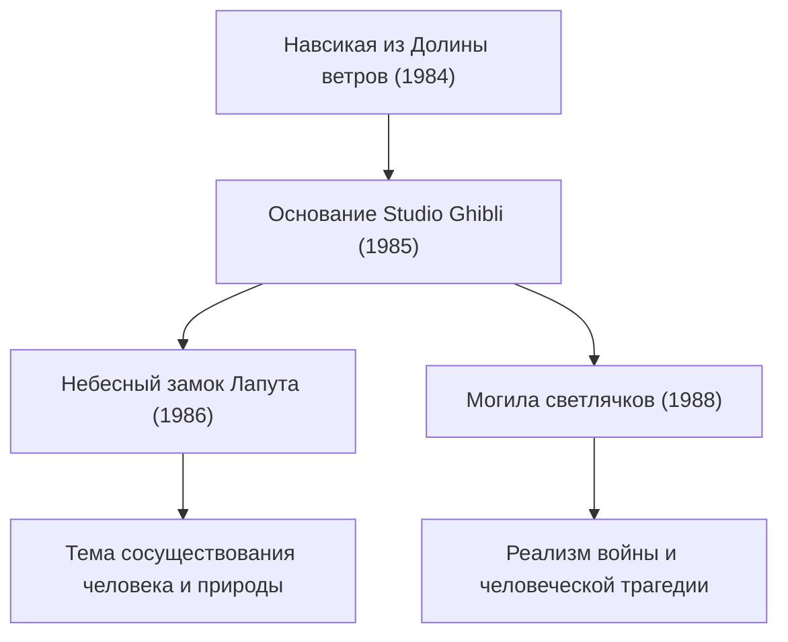

# Путь фильмов студии Ghibli: послание жизни и природы через анимацию

Студия Ghibli давно вышла за рамки обычной анимационной студии, заняв уникальное место в мировой и японской визуальной культуре. С момента своего основания в 1985 году под руководством двух гениальных создателей — Хаяо Миядзаки и Исао Такахаты — она подарила миру множество исторических шедевров. В этой статье мы подробно рассмотрим историю студии Ghibli, её технологическую эволюцию и трансформацию сквозных тем сквозь призму физики, истории и технологий анимации.

## Основание студии Ghibli и первые вызовы

История студии Ghibli берет свое начало с успеха фильма «Навсикая из Долины ветров» (1984). Строго говоря, эта картина была создана еще до официального основания Ghibli, однако сплоченная команда и финансовые ресурсы, сформировавшиеся в процессе её производства, стали фундаментом для создания будущей студии.

В первой картине новосозданной студии — «Небесный замок Лапута» — традиционная технология рисованной целлулоидной анимации (цел-анимации) была доведена до совершенства. В частности, для изображения сияния летающего камня и динамики облаков активно применялась оптическая композиция того времени. Техника воссоздания физических явлений, таких как рассеяние и преломление света, с помощью вручную расписанных целлулоидных листов и фильтров при киносъемке существенно подняла мировые стандарты анимации.

## Экономический подъем и повседневное фэнтези: конец 1980-х — 1990-е годы

В разгар японского экономического «пузыря» Ghibli решилась на беспрецедентный шаг — одновременный прокат картин «Мой сосед Тоторо» и «Могила светлячков». Одна лента рассказывала об идиллической природе и духах Японии 1950-х годов (эпохи Сёва), а другая обнажала трагическую реальность конца Второй мировой войны. Эти два противоположных вектора стали ярким символом многогранности студии.

С технической точки зрения в этот период значительно усовершенствовалась передача глубины пространства с помощью многоплановой камеры (мультиплана). Разделение фоновых рисунков на несколько слоев и их перемещение с разной скоростью создавали на двухмерном экране физическое ощущение объема (эффект параллакса). Этот визуальный прием стал непосредственным предшественником пространственного моделирования в эпоху современной трехмерной компьютерной графики (3DCG).

## Экология и мифологическое воображение: феномен «Принцессы Мононоке»

Вышедшая в 1997 году «Принцесса Мононоке» стала поворотным моментом для студии как в технологическом, так и в идейном плане. Фильм повествует о яростном противостоянии лесных богов и людей, выходя далеко за рамки черно-белого дуализма добра и зла и поднимая сложные этические вопросы.

Особого внимания здесь заслуживает визуализация гидро- и гидроаэродинамики в анимации. Для изображения клубящегося проклятия демона Татаригами, брызг крови и водных потоков частично применялись цифровые технологии (CGI). Однако фундаментом по-прежнему оставалось скрупулезное наблюдение аниматоров за законами физики и их художественное переосмысление. Способность интуитивно уловить законы ньютоновской механики — движение вязких сред, ощущение массы падающих под действием гравитации тел — и выразить их через гиперболизацию и пластику поразила аниматоров по всему миру.

## Переход к цифре и международное признание: «Унесенные призраками»

В 2001 году лента «Унесенные призраками» побила все рекорды кассовых сборов в истории японского кинематографа, завоевала премию «Оскар» за лучший анимационный полнометражный фильм и окончательно закрепила за Ghibli всемирный триумф.

Начиная с этой работы студия полностью перешла от традиционного раскрашивания целлулоида к цифровой живописи. При этом цифровые инструменты использовались не ради банальной «оптимизации процессов», а для «расширения выразительных возможностей». Бесконечные градации оттенков, сложная работа со светотенью, прозрачность воды — студия интегрировала физические симуляции, доступные благодаря цифре, создав уникальный рабочий процесс, не потерявший ни капли живого тепла ручной рисовки.

## Новаторство Исао Такахаты и вершина реализма: «Сказание о принцессе Кагуя»

В то время как Хаяо Миядзаки познавал мир через язык фэнтези, Исао Такахата непрестанно экспериментировал, подвергая сомнению сами конвенции и рамки традиционной анимации. Кульминацией этих поисков стало «Сказание о принцессе Кагуя».

В этой картине был применен тонкий психологический прием: намеренно прерывистые контурные линии и пастельные тона акварели побуждали воображение зрителя самостоятельно «достраивать» образ в сознании. В сцене стремительного бега, где кинетическая энергия достигает кульминации, экспрессивные грубые мазки фона визуально передают скорость и релятивистское искажение пространства. Этот подход, диаметрально противоположный фотореализму, виртуозно задействует механизмы человеческого восприятия и когнитивной психологии.

## Наследие для будущего и потенциал анимации

Творчество Studio Ghibli никогда не ограничивалось простым развлечением: оно неустанно задает фундаментальные вопросы об экологии, сосуществовании человека и технологий и истинном смысле слова «жить». Переход от целлулоида к цифре, трепетное сохранение аналоговой текстуры и честный диалог со своей эпохой — весь этот пройденный путь демонстрирует безграничные выразительные возможности анимационного искусства.

В мирах, созданных Ghibli, в каждом порыве ветра и в каждом проблеске воды чувствуется дыхание жизни и гармония законов физики. Нам же остается бережно считывать заложенные авторами смыслы и передавать их следующим поколениям.
