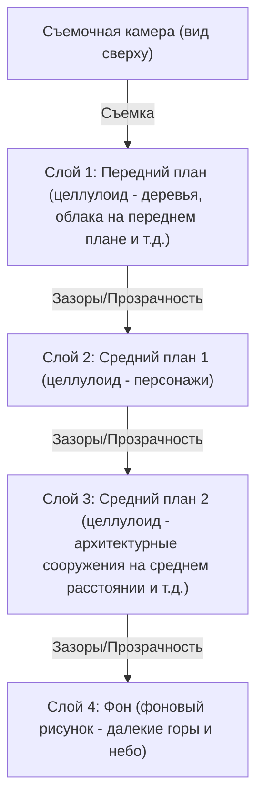
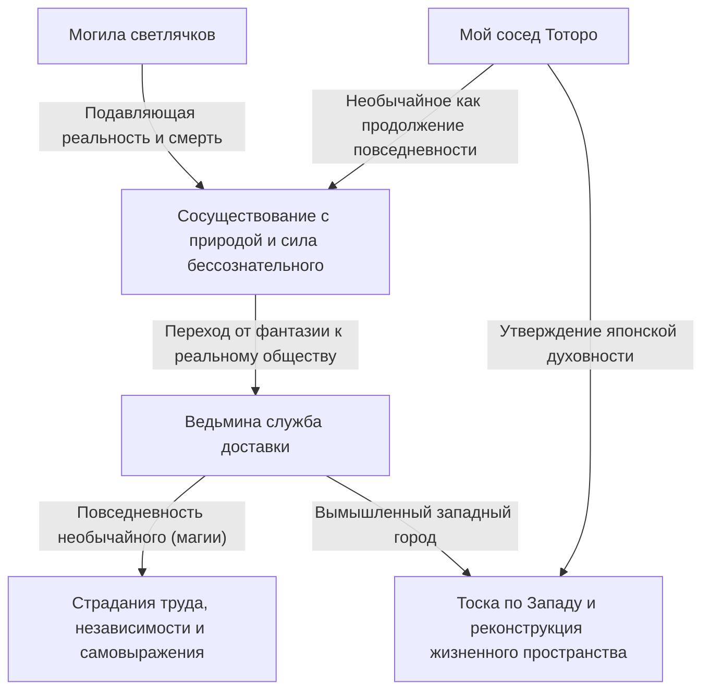
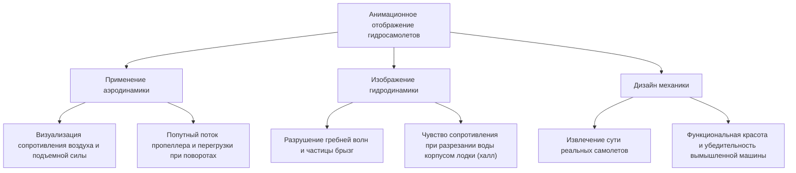
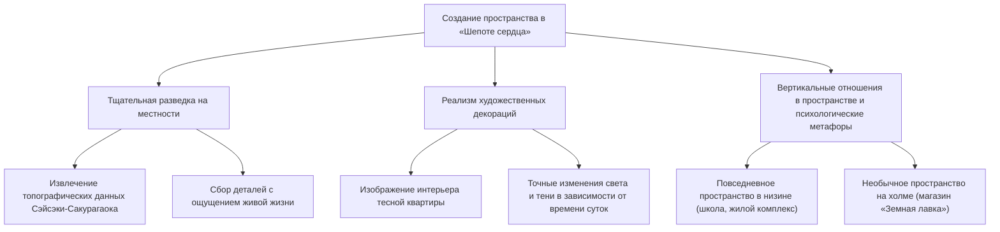
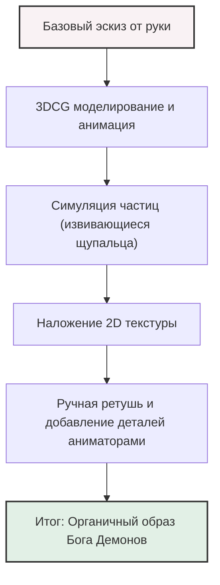
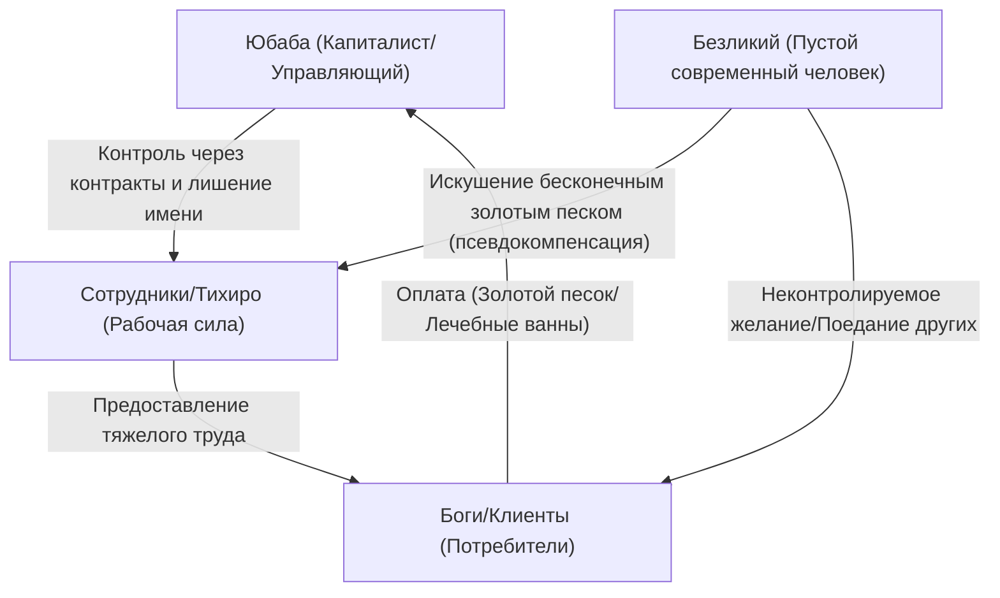
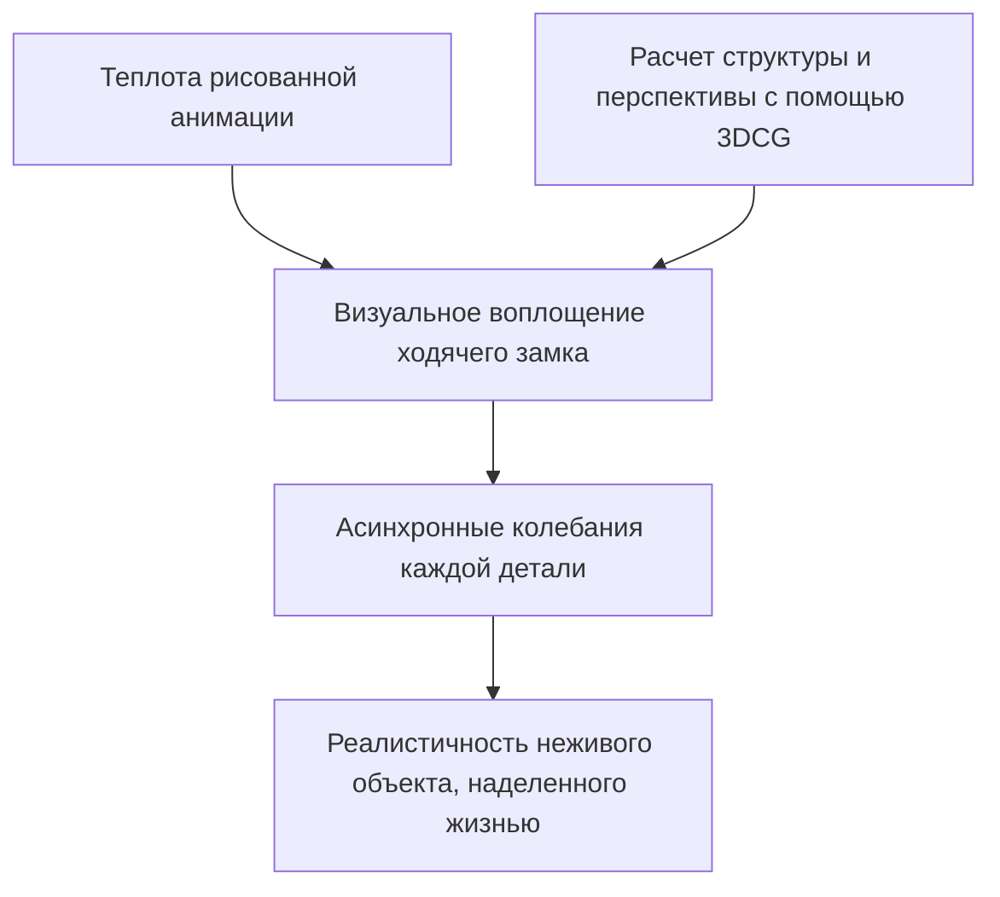
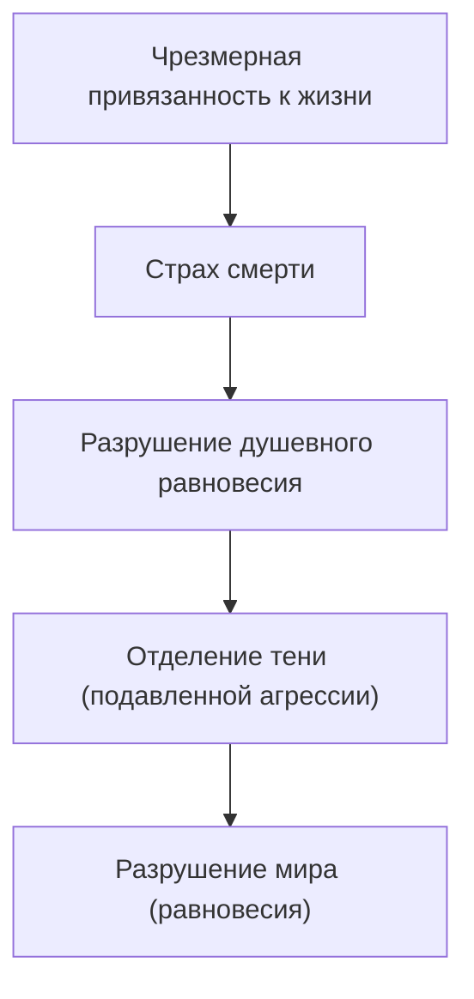
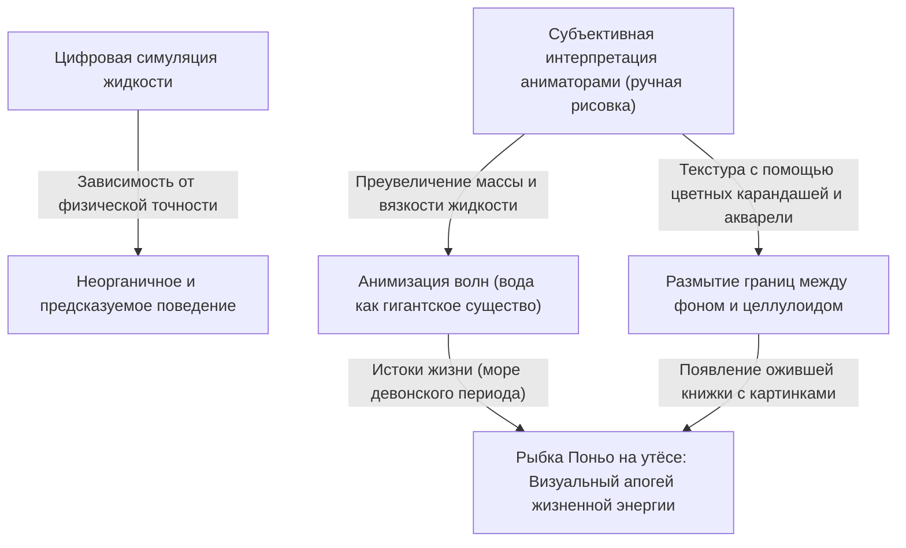
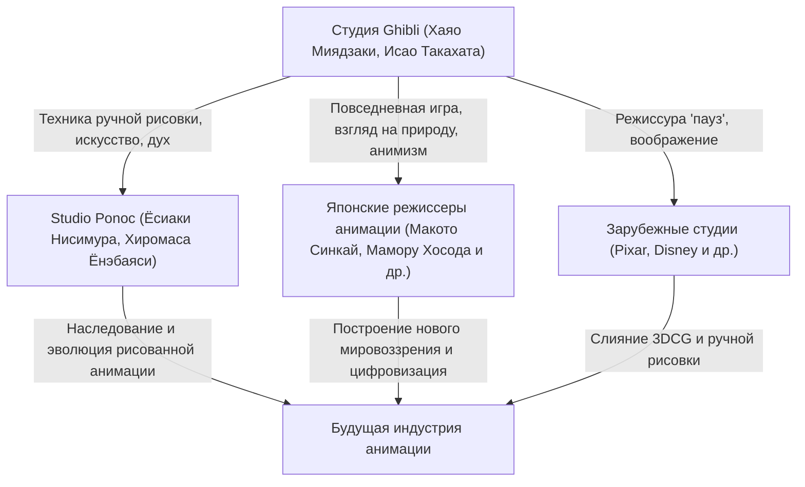

# Глава 1: Основание и ранние шедевры («Навсикая из Долины ветров», «Небесный замок Лапута»)

## 1.1 Сингулярность в истории анимации, рождение Studio Ghibli

Когда мы бросаем взгляд на японскую анимационную индустрию — и даже на историю мировой анимации в целом — невозможно проигнорировать одно «событие», произошедшее в середине 1980-х годов. Это было основание Studio Ghibli. История Ghibli — это не просто история одной компании или производственной студии, это история достижения аналоговой технологией целлулоидной анимации высшей точки выразительности и чудесного слияния «популярности» и «артистизма», присущих анимации как медиа. В этой главе мы рассмотрим обстоятельства основания Studio Ghibli, сосредоточив внимание на ее фактической отправной точке — «Навсикае из Долины ветров» (1984) и первой работе под именем Studio Ghibli — «Небесном замке Лапута» (1986). Мы обсудим, как два гения, Исао Такахата и Хаяо Миядзаки, смогли преодолеть границы анимационной выразительности.

Накануне основания Studio Ghibli японская телевизионная анимация прошла путь уникальной эволюции благодаря технике «лимитированной анимации». В отличие от диснеевской полной анимации, использующей все 24 кадра в секунду, метод создания динамизма за счет уменьшения количества кадров при одновременном использовании статичных изображений и операторской работы (панорамирование, наклон и т.д.) начинался как необходимое зло для снижения затрат, но со временем утвердился как самостоятельная визуальная грамматика. Однако Исао Такахата и Хаяо Миядзаки стремились к чему-то большему, что не вписывалось в эти рамки. Они жаждали реализовать анимацию, которая преследовала бы тщательное построение пространства, реализм повседневных действий и, прежде всего, «фундаментальную радость движения», которую они культивировали со времен работы в Toei Doga (ныне Toei Animation), в высшем формате — полнометражном театральном фильме.

## 1.2 Авторский стиль Исао Такахаты и Хаяо Миядзаки: Чудесное пересечение объективности и субъективности

Чтобы глубоко понять работы Studio Ghibli, необходимо осознать природу двух разных талантов, составляющих ее ядро — Исао Такахаты и Хаяо Миядзаки, а также их взаимодействие. Оба они были выходцами из Toei Doga и были связаны глубокими узами, в том числе через деятельность профсоюза, но не будет преувеличением сказать, что их устремления как режиссеров анимации находились на противоположных полюсах.

Авторский стиль Хаяо Миядзаки характеризуется подавляющим «субъективным восприятием пространства» и «фетишизмом движения». Кадры, нарисованные Миядзаки, иногда превосходят законы физики, но обладают сильной убедительностью, напрямую обращаясь к телесным ощущениям зрителя. Ощущение парения в сценах полета, чувство тяжести, заставляющее почувствовать низкочастотный гул движущихся объектов огромной массы, а также мельчайшие потоки ветра и мерцание поверхности воды — это чувство, что сам мир копошится как живое существо, является результатом фиксации видений в мозге Миядзаки на целлулоиде через тела аниматоров. В компоновке кадров (лэйауте) он часто использует искажения, похожие на широкоугольный объектив, и уникальную перспективу, искусно контролируя глубину экрана и линии движения.

В отличие от него, авторский стиль Исао Такахаты заключается в абсолютной «объективности» и «логическом построении». Поскольку сам Такахата был режиссером, который не рисовал, он мог смотреть на экран анимации с более высокой, мета-перспективы. В его режиссуре акцент делается на доведение до предела реалистичности психологии персонажей, социальных структур и тривиальных повседневных действий. От пространственного расположения и освещения до мотивации персонажей — всё основано на тщательных расчетах, и хотя это побуждает зрителей сопереживать, оно также обладает брехтовским эффектом отчуждения, заставляя их всегда наблюдать за миром с отстраненной точки зрения.

Эти два таланта — «субъективный и интуитивный Миядзаки» и «объективный и логичный Такахата», — сдерживая и уважая друг друга, стали основой одной студии, что и явилось главной движущей силой, породившей богатую коллекцию произведений Ghibli. В ранних работах Ghibli Такахата играл чрезвычайно важную роль в качестве продюсера, контролируя безудержные порывы Миядзаки и в то же время укрепляя структуру произведения.

## 1.3 Технологическая сингулярность целлулоидной анимации и многоярусная мультстанок (multiplane camera)

Удивительность Studio Ghibli заключается не только в глубине затрагиваемых тем, но и в подавляющем техническом мастерстве, которое их поддерживает. В частности, период от «Навсикаи» до «Лапуты» был временем, когда технология аналоговой целлулоидной анимации приближалась к своему завершенному виду, или «технологической сингулярности».

Подавляющий объем информации и ощущение реальности экранов произведений Ghibli создаются благодаря тщательно прорисованным фонам и множеству слоев целлулоида. Здесь особо следует отметить вершину пространственного выражения с использованием «мультстанка с многоярусным столом (multiplane camera)».

Многоярусный мультстанок — это устройство, в котором под камерой расположено несколько слоев стекла (ярусов), на каждый из которых помещается целлулоид или фоновый рисунок для съемки. Это позволяет создавать псевдотрехмерную глубину (параллакс) за счет изменения скорости движения каждого слоя при движении камеры (панорамирование, наклон, наезд и т.д.). Эта технология издавна использовалась студией Disney и другими, но применение многоярусной камеры в Ghibli выделялось своей точностью и сложностью.

«Сцены полета», без которых невозможно представить работы Миядзаки, получают максимальную выгоду от этой технологии. Например, в сложном пространстве, где внизу простирается море облаков, между ними летит дирижабль, а еще дальше видна земля, каждый слой движется с разной скоростью, и зритель получает сильное ощущение пространства и погружения, как будто он действительно летит в небе. Более того, благодаря технологии «проходящего света», освещающей целлулоид сзади, деликатной градации с использованием аэрографа и безумной затрате усилий на анимацию, когда каждое колеблющееся на ветру растение рисуется вручную кадр за кадром, на экране дует ветер и течет воздух. В эпоху до существования цифровых технологий (CGI) они использовали физическую пленку, краски и магию света, чтобы создать виртуальное пространство, которое было более реальным, чем сама реальность.

## 1.4 «Навсикая из Долины ветров» (1984): Монумент предыстории и глубина экологии

Фильм «Навсикая из Долины ветров», выпущенный в 1984 году, формально был произведен студией «Topcraft» до основания Studio Ghibli, но он был создан командой в лице режиссера Хаяо Миядзаки и продюсера Исао Такахаты, и позиционируется как фактическая «нулевая» или «первая» работа, определившая дальнейшее направление развития Ghibli.

Эта работа основана на одноименной манге, которую сам Хаяо Миядзаки публиковал в ежемесячном журнале «Animage», но киноверсия реконструирует ее начальную часть и завершает как единую независимую историю. Величайшее достижение «Навсикаи» в истории анимации заключается в том, что она смогла полностью раскрыть чрезвычайно глубокие научно-фантастические темы «экологических проблем (экологии)», «достоинства жизни» и «глупости человечества» в рамках развлекательного кино, да еще и с ошеломляющей визуальной красотой.

1000 лет прошло с тех пор, как индустриальная цивилизация была разрушена в результате финальной войны, известной как «Семь дней огня». Мир, в котором расширяется грибной лес под названием «Лес разложения», испускающий ядовитые миазмы, и которым правят гигантские насекомые. Этот отчаянный сеттинг мира отражает сильное чувство кризиса у Миядзаки по отношению к страху ядерной войны во время холодной войны и обостряющемуся разрушению окружающей среды. Однако Миядзаки не впадает в простую дихотомию «защиты природы» и «человеческого зла». Главный поворот в фильме, когда Лес разложения на самом деле оказывается системой для очищения загрязненной Земли, сталкивает нас с пугающей способностью природы к самовосстановлению и ничтожностью человека перед ее лицом.

С технической точки зрения, говоря о «Навсикае», нельзя не упомянуть об изображении гигантских насекомых, в том числе «Ому». Анимация, в которой это странное существо со множеством сегментов и глаз извивается при движении вперед, создает подавляющее чувство тяжести, жуткости и некой божественности благодаря специальным методам анимации с использованием резины (например, методу съемки нескольких частей целлулоида со сдвигом) и точным расчетам тайминга. Кроме того, в сценах полета на Меве (летательном аппарате Навсикаи) движение ткани, передающее сопротивление ветра, и плавная траектория, словно визуализирующая связь между гравитацией и подъемной силой, продемонстрировали всему миру «катарсис полета», являющийся истинной сутью анимации Миядзаки.

Формирование героини Навсикаи также было инновационным. Она не просто «девушка, которую нужно защищать», она — воин, который сам пилотирует Меве, стреляет из пистолета и размахивает мечом, но в то же время она — материнская фигура с глубокой привязанностью ко всей жизни. Этот сложный образ персонажа, сочетающий в себе силу и нежность, гнев и печаль, стал не только отправной, но и высшей точкой для образа женщины-героя в современных произведениях искусства, а не только в последующих работах Ghibli.

## 1.5 Основание Studio Ghibli и «Небесный замок Лапута» (1986): Идеальный приключенческий боевик

После успеха «Навсикаи» на вырученные средства в 1985 году была официально основана «Studio Ghibli». Цель ее создания была только одна: «продолжать создавать качественные полнометражные театральные анимационные фильмы». Ghibli родилась как независимая база для стремления к бескомпромиссному качеству, отличающаяся от массового производства телевизионной анимации низкого пошиба.

И вот в 1986 году в качестве памятного первого полнометражного фильма под маркой Studio Ghibli выходит «Небесный замок Лапута». Эта работа, основанная на идее, задуманной Хаяо Миядзаки еще в начальной школе, с мотивом парящего острова Лапута из «Путешествий Гулливера» Свифта, включает в себя все классические элементы приключенческого боевика (мальчик встречает девочку) — встречу юноши и девушки, таинственный летающий камень, воздушных пиратов и армию со злыми амбициями — настоящий шедевр, который можно назвать «пределом экшена».

Великолепие «Лапуты» заключается в захватывающей дух движущей силе повествования и одержимости невероятными деталями, пронизывающими каждый уголок экрана. От сцены нападения семьи Долы на дирижабль («Тигровая бабочка») в самом начале до погони в Ущелье Слагов, куда сбегают Пазу и Сита, экран всегда остается «динамичным». Механический дизайн Ущелья Слагов, движение поршней паровой машины, вращение шестеренок и стремительный бег вагонетки. Эти машины и транспортные средства — не просто фон или реквизит; они нарисованы с такой живостью, как будто сами обладают жизнью. Сила страсти к анимации, пытающейся зафиксировать присущую Миядзаки «любовь к машинам» и даже «тепло и запахи, которые они излучают», придает вымышленному миру подавляющую реальность.

С тематической точки зрения «Лапута» представляет собой «отрыв человека от передовых технологий» и «связь с землей». Трансцендентная научная мощь Империи Лапута, которая когда-то правила миром, в конечном итоге стала причиной ее собственной гибели. Видение в кульминации фильма, когда гигантское «великое дерево», обнимающее гигантский летающий камень из глубин рушащейся Лапуты, поднимается в космос, чрезвычайно символично. Этот финал, где разрушаются искусственные объекты, символизирующие технологии, и остается только великое дерево, символизирующее жизнь, обобщается в словах Ситы: «Пустим корни в землю, будем жить вместе с ветром. Перезимуем вместе с семенами, споем о весне вместе с птицами. Каким бы страшным оружием ты ни владел, сколькими бы жалкими роботами ни управлял, ты не сможешь жить вдали от земли». Это острая критика современной цивилизации от Миядзаки, продолжающаяся со времен «Навсикаи», и универсальная молитва о возвращении к природе.

Кроме того, вклад фоновых рисунков, созданных арт-директорами Тосиро Нодзаки и Нидзо Ямамото в этом фильме, неизмерим. Спокойная красота сцены по прибытии на Лапуту, когда море облаков рассеивается и появляется гигантский сад, поросший мхом, и роботы-солдаты, доказывает, насколько фоновый рисунок в анимации определяет достоинство произведения. Здесь произошло идеальное слияние динамичной режиссуры Миядзаки и статичного искусства.

## 1.6 Заключение: Начало легенды

«Навсикая из Долины ветров» и «Небесный замок Лапута». В этих двух ранних шедеврах Хаяо Миядзаки, Исао Такахата и сотрудники Studio Ghibli довели потенциал анимации как средства выражения до абсолютного предела. Они придали вес и осязаемость вымышленным механизмам, являющимся плодом воображения, вдохнули реальность в воображаемые экосистемы и включили сложную социальную критику и философские темы в развлечение, которое с замиранием сердца смотрят люди всех возрастов. Этот невероятный подвиг был достигнут ими благодаря огромному количеству целлулоидных кадров и ручному труду, который можно назвать ремесленным безумием.

Эти две работы подняли технические и выразительные стандарты на невиданную высоту и в дальнейшем стали «огромной стеной под названием Ghibli» для японской анимационной индустрии. И в то же время это была буквально «Глава 1» грандиозной легенды о том, как эта небольшая студия в конечном итоге вызовет глобальный культурный феномен и перепишет саму историю анимации. Путь, ведущий к последующим фильмам «Мой сосед Тоторо», «Могила светлячков» и «Принцесса Мононоке», — всё это началось с ветра «Навсикаи» и неба «Лапуты».
# Глава 2: Пересечение повседневного и необычайного — миры, созданные в фильмах «Мой сосед Тоторо», «Могила светлячков» и «Ведьмина служба доставки»

В истории Studio Ghibli вторая половина 1980-х годов стала решающим поворотным моментом. Резко отойдя от грандиозных историй о «мечах и магии» или «приключенческих боевиков в небесах», как это было показано в предыдущем фильме «Небесный замок Лапута» (1986), Ghibli взяла курс на «повседневность», обратившись к исконным японским пейзажам и жизни простых людей на Западе. В этой главе рассматриваются три картины: «Мой сосед Тоторо» и «Могила светлячков», чудесным образом вышедшие в прокат одновременно в 1988 году, а также суперхит 1989 года «Ведьмина служба доставки», и проводится тщательный анализ технологической и тематической революции, которую они вписали в историю анимации.

## 1. Безумие и чудо одновременного показа: Хаяо Миядзаки и Исао Такахата, две версии эпохи Сёва

Весной 1988 года был реализован формат проката, который сегодня почти невозможно себе представить: одновременный показ фильмов «Мой сосед Тоторо» и «Могила светлячков». Это была не просто коммерческая упаковка, а кристаллизация «безумия и чуда», рожденного столкновением искр внутри организации Studio Ghibli, и в частности между двумя гениальными творцами — Хаяо Миядзаки и Исао Такахатой.

### 1-1. Жизнь и смерть спиной друг к другу
«Мой сосед Тоторо» — это гимн жизни, рассказывающий о взаимодействии детей и духов природы в японской деревне 30-х годов периода Сёва (1950-е годы). С другой стороны, «Могила светлячков» с бескомпромиссным реализмом показывает ужасающую реальность брата и сестры, погибающих в огне войны в Кобе около 20-го года Сёва (1945 год), незадолго до и после окончания войны. Несмотря на разницу во времени действия всего около 10 лет, эти две работы несут в себе абсолютно противоположные темы, стоящие спиной друг к другу: «жизнь и смерть» и «идеализированная фантазия и жестокая реальность».

Studio Ghibli того времени внедрила производственную систему, которую можно было назвать безрассудной, заставив одновременно работать два огромных таланта. Началась борьба за аниматоров, графики оказались на грани срыва. Однако в итоге эта суровая среда довела качество обеих работ до абсолютного предела. Хаяо Миядзаки, в качестве антитезы суровому реализму Такахаты, создал мир «Тоторо», в котором пульсирует более сильная, бессознательная жизненная сила, а Такахата, чтобы противостоять фантазии Миядзаки, поднял японскую анимацию на документальный уровень.

### 1-2. Разное изображение эпохи Сёва и рождение «анимационного документального кино»
Режиссура Исао Такахаты в «Могиле светлячков» разрушила традиционную грамматику анимации. Траектория падения зажигательных бомб во время налетов B-29, колебания пламени горящих домов и, прежде всего, физические изменения Сэйты и Сэцуко, слабеющих от голода. Чтобы выразить это, художник по цвету Митиё Ясуда и её команда скрупулезно добивались создания «коричневатого оттенка, покрытого грязью, кровью и копотью», который невозможно было передать с помощью обычных анимационных цветов.

В отличие от этого, в фильме «Мой сосед Тоторо» Хаяо Миядзаки воссоздал «прекрасную Японию, которая, возможно, когда-то существовала» из своих собственных воспоминаний. Это был не просто реализм, а попытка зафиксировать на целлулоиде «сияние» мира глазами ребенка. Это разное изображение двух версий эпохи «Сёва» максимально продемонстрировало широту выразительных возможностей медиа анимации и стало монументальным достижением в истории японского кинематографа.

## 2. Революция в фоновой графике: «воздух и влажность», созданные Кадзуо Огой и Нидзо Ямамото

Подавляющая убедительность произведений Ghibli во многом зависит не только от актерской игры персонажей, но и от силы фонового искусства, простирающегося позади них. В этот период фоновая графика Studio Ghibli достигла своей вершины.

### 2-1. Влажный воздух «леса Тоторо» в работах Кадзуо Оги
Без преувеличения можно сказать, что достижения Кадзуо Оги, выбранного арт-директором фильма «Мой сосед Тоторо», изменили историю японского анимационного искусства. Природа, нарисованная Огой, максимально использует свойства плакатных красок. Используя непрозрачные плакатные краски вместо прозрачной акварели, с помощью идеального количества воды и мазков кисти, он смог передать «влажность», присущую японскому климату, «удушливый запах травы» и даже «температуру солнечного света, пробивающегося сквозь деревья».

Особенно впечатляет фоновое искусство в сцене, где Сацуки и Мэй встречают Тоторо на автобусной остановке под дождем. Текстура мокрого от дождя асфальта, глубина священного леса, погружающегося в темноту, слой воздуха, создаваемый светом уличного фонаря. Искусство Оги было не просто «копированием пейзажа», а магией, которая визуализировала «невидимую информацию», такую как дующий там ветер, температура и влажность.

### 2-2. Тоска по Западу и архитектурный реализм
С другой стороны, Корико, город, где разворачивается действие «Ведьминой службы доставки», — это вымышленный город, созданный путем слияния элементов различных европейских городов, таких как Стокгольм и Висбю на острове Готланд в Швеции, а также Лиссабон и Париж. Фоновое искусство здесь имело совершенно противоположный вектор по сравнению с «Тоторо», изображавшим японские пейзажи.

Европейские каменные здания, ряды черепичных крыш и склоны, ведущие к морю. Чтобы убедительно изобразить их, художественный персонал Ghibli провел тщательный поиск натуры и изучение архитектурных конструкций. Даже текстура камня рассчитывалась с учетом степени выветривания и коэффициента отражения солнечного света, после чего переводилась в цвета, которые наиболее красиво выглядели бы в качестве анимационного фона. Способность этого искусства не просто оставить «тоску по Западу» на уровне фантазии, а изобразить его как пространство, где люди реально живут и работают, поразительна.

## 3. Современная тема в «Ведьминой службе доставки»: «Труд и творческий кризис»

На момент выхода «Ведьмина служба доставки» собрала восторженную поддержку многих молодых людей, особенно работающих женщин. Причина заключалась в том, что это произведение, внешне прикрываясь фантастической оболочкой «истории взросления девочки-ведьмы», в своей сути было крайне современной и универсальной реалистичной драмой о «труде и таланте (творческом кризисе)».

### 3-1. Момент, когда талант превращается в «труд»
Главная героиня Кики начинает работать в службе доставки, используя свой врожденный магический талант «летать по небу». Это полностью совпадает с процессом того, как современные создатели и фрилансеры участвуют в жизни общества, используя свои навыки и таланты в качестве «капитала». В начале для Кики полет был радостью и самовыражением. Однако, когда это становится «работой (трудом)», когда она сталкивается с неразумными требованиями клиентов (например, в эпизоде с пирогом из сельди) и начинает получать деньги в качестве вознаграждения, смысл магии внутри неё трансформируется.

### 3-2. Творческий кризис и потеря идентичности
В середине истории Кики внезапно теряет свою магическую силу, больше не может летать, и перестает понимать язык черного кота Дзидзи. Это не только колебания идентичности девочки-подростка, но и идеальная метафора «истощения таланта (творческого кризиса)», с которым сталкиваются творческие люди.

Здесь важную роль играет Урсула, студентка-художница, рисующая картины в лесной хижине. Урсула говорит Кики: «В такие моменты остается только барахтаться», «Рисовать, рисовать и еще раз рисовать», «Если и это не поможет, перестать рисовать. Гулять, смотреть на пейзажи, спать днем, ничего не делать». Эти слова — страдания, с которыми сталкиваются аниматоры, включая самого Хаяо Миядзаки, и, в более широком смысле, все люди, занимающиеся творчеством, а также рецепт от этих страданий.

### 3-3. Решимость «летать на крови»
Урсула говорит о своих картинах: «Раньше я могла рисовать не задумываясь, но теперь всё иначе. Я должна рисовать свои собственные картины». То же самое касается и магии Кики. Эпоха бессознательного полета только за счет врожденного таланта (магии) подошла к концу, и она должна «вновь обрести» магию благодаря своей собственной воле и усилиям. В кульминации сцена, где Кики с отчаянным лицом взмывает в небо верхом на полотёре, уже не является изящной фантазией. Это образ профессионала, сталкивающегося со своими собственными пределами и применяющего «технику» с чувствами, подобными кашлю кровью.

## 4. Структура тем и их взаимосвязь

На первый взгляд эти три произведения имеют свои собственные независимые миры, но с точки зрения авторского стиля Ghibli, между ними существует четкая преемственность и пересечение тем.

«Необычайное (фантазия), скрытое в повседневности», представленное в «Тоторо», приобрело еще более сильный мифологический характер благодаря контрасту с экстремальным реализмом «Могилы светлячков». А методы выразительности и анимационные технологии, утвердившиеся там, стали мощным оружием в «Ведьминой службе доставки» для изображения парадоксальной темы: «как необычайное существо (ведьма) сливается с повседневной жизнью (трудом) современного общества».

## 5. Заключение: Подготовка к следующему этапу

В этот период с 1988 по 1989 год Studio Ghibli всего за несколько лет прошла через все мыслимые пределы, которые может изобразить анимация: «жизнь и смерть», «Япония и Запад», «фантазия и реализм», а также «талант и труд». Взращенное здесь мастерство скрупулезного наблюдения и изображения повседневной игры актеров, а также сила фонового искусства, наполняющего пейзажи воздухом и эмоциями, передадутся последующим произведениям с более сложными темами для взрослых, таким как «Ещё вчера» (1991) и «Порко Россо» (1992).

Три фильма: «Мой сосед Тоторо», «Могила светлячков» и «Ведьмина служба доставки» — это не просто перечисление шедевров. Это исторический памятник, запечатлевший самый горячий и самый болезненный момент вылупления, когда медиа анимации трансформировалось из развлечения для детей во «всеобъемлющее искусство», способное изобразить как глубины человеческого духа, так и структурные страдания общества.
# Глава 3: Стремление к полету и романтика взрослых — Вершина реализма в фильмах «Порко Россо» и «Шепот сердца»

При взгляде на историю Studio Ghibli фильмы «Порко Россо» (1992) и «Шепот сердца» (1995), выпущенные в первой половине и середине 1990-х годов, на первый взгляд могут показаться совершенно противоположными произведениями. В то время как первый — это фэнтези, действие которого разворачивается на Адриатическом море и рассказывает о битвах и печалях пилота гидросамолета, охотника за головами, превратившегося в свинью из-за проклятия, второй — это подростковая драма о первой любви и сомнениях в выборе жизненного пути школьников, разворачивающаяся в современном спальном районе Тама.

Однако то, что объединяет оба этих произведения — это неустанное стремление Studio Ghibli, а точнее, выдающихся творцов Хаяо Миядзаки и Ёсифуми Кондо, довести «реализм» (ощущение реальности) до абсолюта, используя анимацию как средство выразительности. А в основе этого лежит непреодолимая страсть к «полету» — как к физическому парению в небе, так и к духовному скачку за пределы собственных возможностей. В этой главе мы глубоко проанализируем, какое уникальное место занимают эти две картины в истории анимации и каких технических и тематических высот они достигли, рассматривая их как с точки зрения исторического контекста, так и через призму технологий.

## 1. «Порко Россо» — Вершина аэродинамики и элегия об утраченной эпохе

«Порко Россо» (оригинальное название: Il Porco Rosso) имеет необычную историю создания: изначально он задумывался как короткометражный фильм для показа на борту самолетов Japan Airlines, но перерос в полнометражную картину под тяжелой тенью реальных событий Югославского конфликта. Эта работа отличается глубоко личным характером, созданная Хаяо Миядзаки для себя самого и как «фильм для усталых мужчин среднего возраста, чьи мозги превратились в тофу».

### 1.1 Хаяо Миядзаки и самолеты: Фетишизм к технике и детальное изображение аэродинамики

Одержимость Хаяо Миядзаки «полетами» широко известна, но в «Порко Россо» изображение гидросамолетов является наиболее чистым выражением его фетишизма к технике и глубокого понимания аэродинамики. Появляющиеся в фильме гидросамолеты — любимая машина главного героя Порко Россо, малиновый Savoia S.21 (оригинальная модель, в которой смешаны элементы реальных самолетов, таких как Macchi M.33 и Savoia-Marchetti S.59), самолет его соперника Кертисса, а также разношерстный флот воздушных пиратов — это не просто фон или реквизит, они сами по себе выступают как самостоятельные и живые персонажи.

Особого упоминания заслуживает то, как в анимации с идеальным балансом контролируются «ложь и правда законов физики», вплоть до изображения сопротивления воздуха, подъемной силы, крутящего момента пропеллера, вибрации двигателя, а также гидродинамики при взлете с воды и посадке на нее.

В сцене запуска двигателя «Савойи» Порко весь процесс — от воспламенения в цилиндрах, микровибраций всего корпуса, до выброса черного дыма из выхлопной трубы — передан с помощью мельчайшей дрожи целлулоидных рисунков и мультиэкспозиции (аналоговой технологии съемки того времени). В эпизодах воздушных боев (догфайтов) физические нагрузки пилотов, выдерживающих перегрузки (G) при разворотах, и едва заметные движения ручки управления и педалей при контроле машины на грани сваливания, изображены с предельно точным таймингом. Это результат того, как «телесные ощущения полета», существующие в голове Хаяо Миядзаки, были безупречно перенесены на целлулоид руками аниматоров.

### 1.2 Сопротивление фашизму и анархизм, звучащие в небе Адриатики

Действие картины разворачивается в конце 1920-х годов в Италии, над Адриатическим морем. Исторический фон — это эпоха безумия и тревог, когда все еще свежи шрамы Первой мировой войны, а фашистская партия во главе с Муссолини набирает силу. Порко Россо (настоящее имя Марко Пагот), в прошлом ас итальянских ВВС, разочаровавшись в системе государства и армии, проклинает себя, превращаясь в свинью, и выбирает путь вне закона (анархиста), зарабатывая на жизнь как охотник за головами.

Знаменитая фраза Порко «Лучше быть свиньей, чем фашистом» — это не просто крутая реплика в стиле хард-бойлд. Это мощное заявление самого Хаяо Миядзаки о его антифашизме и анархизме, отказ стать частью гигантского аппарата государственного насилия, и поиск личной свободы и достоинства в небе, пространстве без государственных границ.

Во второй половине фильма сцена тайной встречи Порко с бывшим боевым товарищем Феррарином (теперь майором фашистских ВВС) в кинотеатре ярко отражает политический подтекст картины. Феррарин бросает фразу: «Мы вынуждены летать ради таких ничтожных спонсоров, как государство и нация». Здесь хладнокровно показан процесс, как чистая радость полета извращается, превращаясь в инструмент государственной идеологии и войны. Причина, по которой Порко стал свиньей, прямо не называется, но это глубокое отчаяние от абсурдного мира, где люди убивают друг друга; это защитный механизм, позволяющий отстраниться от общества, усиливающего давление конформизма, или же выражение парадокса, что «сохраняя человеческий облик, невозможно сохранить человеческое достоинство».

### 1.3 «Свинья, которая не летает, — это просто свинья» — Романтика, разочарования и проклятия мужчин среднего возраста

Причина, по которой «Порко Россо» захватывает сердца многих взрослых, заключается в том, что эта картина — скорбная элегия о «том, что потеряно». Порко несет в себе сильное чувство утраты и вину выжившего по своим товарищам, погибшим в Первой мировой войне (сцена с призраками самолетов, поднимающимися к облачной равнине, является одним из величайших моментов в истории кинематографа).

Как символизирует шансон «Время вишен» (Le Temps des cerises) в исполнении Джины (известный как песня-плач по падению Парижской коммуны), этот фильм пронизан глубокой ностальгией по ушедшим добрым временам, навсегда недосягаемой юности и необратимым потерям. Изображение зрелой, но никогда не пересекающейся любви между Порко и Джиной, с ее дистанцией, занимает особое место среди произведений Ghibli. Порко также использует свое «проклятие» как предлог, чтобы сбежать от любви Джины и участия в реальном обществе. За рекламным слоганом «Вот что значит быть крутым» скрывается болезненная история «принятия себя мужчиной среднего возраста», одиночество человека, принесшего себя в жертву собственной эстетике, и смирение со своей собственной старомодностью.

## 2. «Шепот сердца» — Пронзительный реализм юности и магия пространства

Фильм «Шепот сердца», вышедший в 1995 году, является монументальной работой, в которой Хаяо Миядзаки выступил продюсером, сценаристом и автором раскадровок, а Ёсифуми Кондо, ведущий аниматор Studio Ghibli, стал единственным режиссером полнометражной ленты за свою карьеру. Основываясь на одноименной сёдзё-манге Аои Хираги, благодаря усилиям Миядзаки и Кондо фильм вышел далеко за рамки простой любовной истории, превратившись в реалистичный портрет юности, терзаемой тревогами о будущем, таланте и самореализации.

### 2.1 Взгляд Ёсифуми Кондо: Суть анимации, сокрытая в повседневных жестах

Главным очарованием этой работы и её техническим достижением можно назвать бескомпромиссное внимание режиссера Ёсифуми Кондо к «повседневной игре». В анимации считается гораздо более сложным точно и эмоционально изобразить «незаметные повседневные действия», такие как ходьба, присаживание, заваривание чая или бег по лестнице, нежели «необычные (зрелищные)» движения, такие как магия, взрывы или битвы роботов.

Ёсифуми Кондо работал режиссером-аниматором в фильмах Исао Такахаты (таких как «Могила светлячков» и «Еще вчера») и был мастером «повседневной игры», отражающей скелет и движения мышц персонажей, смещение центра тяжести и психологическое состояние в каждом жесте. В «Шепоте сердца» этот выдающийся дар наблюдательности раскрыт в полной мере.

Например, изменения в позе главной героини Сидзуку Цукисимы при чтении книги в библиотеке, её движения ног, когда она торопливо спускается по лестнице, или перемена во взглядах и пожимание плечами в сценах с Сэйдзи Амасавой, когда смешиваются влюбленность и раздражение. Каждая из этих мельчайших анимаций создает сильное ощущение реальности того, что девочка по имени Сидзуку действительно существует и дышит. Это и есть истинная суть анимации, которая изображает приземленную «человеческую жизнь», отличающаяся от эйфории полета в фантастических мирах Миядзаки.

### 2.2 Разведка на местности и создание пространства: «Живой город» под названием Тама-Нью-Таун

Ещё одним главным героем фильма является сам город, ставший местом действия. Художественные фоны картины были созданы с поразительной реалистичностью на основе тщательной разведки на местности, проведенной в районе Сэйсэки-Сакурагаока в Токио (недалеко от Тама-Нью-Таун).

Фоновые рисунки, созданные арт-директором Сатоси Куродой и его командой, мастерски передают текстуру безжизненного бетона многоквартирных домов, крутые склоны, узкие переулки и вечерние улицы. Особого внимания заслуживает изображение «тесной квартиры», где живет Сидзуку. Переполненные книжные полки, захламленный обеденный стол, тесная комната сестер с двухъярусной кроватью. Это почти удушающее (но в то же время уютное) реалистичное изображение жизненного пространства подчеркивает жажду Сидзуку к полету: «Я хочу вырваться отсюда и отправиться в большой мир» (= импульс к написанию истории).

Кроме того, рельеф города (перепады высот) блестяще выполняет роль психологической метафоры. Повседневная жизнь Сидзуку (школа и дом) находится «внизу», а антикварный магазин «Земная лавка», куда она попадает, ведомая таинственным котом (Муном), находится на вершине крутого подъема — «на холме». Этот перепад высот визуально выражает как духовное стремление Сидзуку к вершинам, так и трудности шага в неизведанную область.

### 2.3 Источник вдохновения для творчества и боль самореализации: «Внутренний полет» под руководством Барона

«Шепот сердца» — это одновременно и романтический фильм, и мощная «история самопознания творца». В ответ на намерение Сэйдзи уехать учиться в Италию (взлететь) к ясной цели стать скрипичным мастером, Сидзуку, охваченная тревогой, начинает писать историю (фэнтезийный роман, вложенный в сам фильм «Шепот сердца»), чтобы проверить свой внутренний «неограненный камень».

Что здесь интересно, так это включение эпизода «полета в небе» Сидзуку вместе с кошачьим бароном (Бароном) в мире написанной ею истории. Эта фантастическая сцена, фон для которой нарисовал художник Наохиса Иноуэ, известный своими работами по Ибларду, представляет собой полную противоположность физическим полетам из «Порко Россо» — это «внутренний полет» как высвобождение воображения.

Однако эта картина не заканчивается просто как сказка. После того, как владелец «Земной лавки» читает ее роман, написанный без сна и отдыха, Сидзуку со слезами осознает, насколько её работа грубая и незрелая. Пронзительность этой сцены, в которой она сталкивается с жестокой стеной творчества и осознает пределы своего таланта (то, что необработанный камень не сияет), ранит сердце каждого человека, занимающегося созиданием. Хаяо Миядзаки и Ёсифуми Кондо избежали изображения легкого успеха и через образ школьницы показали строгую ремесленную этику: «несмотря ни на что, ты должен продолжать шлифовать и полировать».

## 3. Заключение: Самолеты и скрипки — истории соответствующих «ремесленников»

«Порко Россо» и «Шепот сердца». Свинья средних лет, мчащаяся по небу над Адриатикой, и школьники, едущие на велосипедах по склонам Тама-Нью-Таун. Эти две истории, на первый взгляд не имеющие ничего общего, прочно связаны осью «уважения к ремеслу».

Фио и женщины-механики компании Пикколо, безупречно ремонтирующие и настраивающие любимый самолет Порко. Сэйдзи, усердно обучающийся изготовлению скрипок в Кремоне, и хозяин «Земной лавки», продолжающий чинить старинные часы. Произведения Ghibli неизменно поют высшую хвалу «ремесленникам (артизанам)», которые создают вещи своими руками и продолжают оттачивать свое мастерство.

Подобно тому, как Порко сражается за свободу неба, Сидзуку берет в руки оружие слов, чтобы сплести свой внутренний голос (историю). Физический «полет» и «прыжок» с помощью воображения. И хотя методы выражения различаются, вершина реализма, которой Studio Ghibli достигла в тот период, с ошеломляющей визуальной красотой запечатлела на пленке благородную волю человека, который сопротивляется гравитации реального мира (социальным оковам и собственным ограничениям) и, несмотря ни на что, стремится взлететь еще выше. В следующей главе мы обсудим конфликт между природой и человеком в «Принцессе Мононоке» — беспрецедентном эпосе, родившемся из соединения этого бескомпромиссного реализма и натурализма с мифологическим воображением.
# Глава 4: Экология и мифологическое воображение (Принцесса Мононоке)

Выпущенная в 1997 году «Принцесса Мононоке» стала монументальным прототипом и четким водоразделом в карьере Studio Ghibli и режиссера Хаяо Миядзаки. Это произведение вышло за рамки простого анимационного фильма и оказало настолько огромное культурное и индустриальное влияние, что переписало саму историю японского кинематографа. В этой главе мы максимально подробно раскроем многослойную тематику данной работы: деконструкцию японской средневековой истории, недуалистический аспект добра и зла, а также слияние компьютерной графики (CG) и традиционной сел-анимации как технологический поворотный момент.

## 1. Индустриальный контекст: Взрывной рост производственных затрат и обновление кассовых рекордов

Производство «Принцессы Мононоке» стало гигантским проектом беспрецедентного масштаба, на который Studio Ghibli поставила судьбу компании. С самого начала режиссер Хаяо Миядзаки приступил к работе с решимостью, что «это может быть последняя работа перед уходом на пенсию», и его бескомпромиссный авторский подход привел к бесконтрольному росту сроков и бюджета. Совокупные затраты на производство, как говорят, составили около 2 миллиардов иен, что для японского кино того времени было суммой, выходящей за рамки здравого смысла. Количество нарисованных кадров достигло примерно 144 000, что в два-три раза превышает обычный показатель для полнометражной анимации.

Чтобы окупить эти колоссальные риски, продюсер Тосио Судзуки развернул беспрецедентную по масштабам медиамикс- и рекламную стратегию. Яркий слоган «Живи.» (Икиро.), придуманный Сигэсато Итои, послужил своеобразным ответом на атмосферу конца века и чувство безысходности, охватившие тогда японское общество (травмы 1995 года, такие как Великое землетрясение Хансин-Авадзи и зариновая атака в метро).

В результате фильм собрал 14,2 миллиона зрителей и принес кассовые сборы в 19,3 миллиарда иен. Он значительно превзошел предыдущий рекорд кассовых сборов в Японии (который удерживал «Инопланетянин»), закрепив за Studio Ghibli статус создателя «национального кино» в Японии. Этот коммерческий успех доказал, что японская анимация может стать огромным бизнесом, даже если в ней затрагиваются серьезные темы для взрослых, и оказал огромное влияние на бизнес-модели последующей аниме-индустрии.

## 2. Исторический сеттинг и мифологическая реконструкция: Почему период Муромати?

В качестве места действия фильма Хаяо Миядзаки намеренно выбрал переходный период японской истории — период Муромати. Выбор этого наполненного хаосом времени, а не периода Эдо (с фиксированной сословной системой и мирным, контролируемым обществом) или периода Сэнгоку (с борьбой за власть между военачальниками), которые так любили изображать в традиционных исторических драмах (дзидайгэки), имел глубокий философский замысел.

Период Муромати — это время перехода от аграрного общества к денежной экономике, развития ремесленного производства и, что самое главное, время, когда начало четко проявляться «превосходство человеческих технологий над природой». Производство железа (татара-буки) заработало в полную силу, что сопровождалось масштабной вырубкой лесов; в то же время в горах все еще оставались густые первобытные леса, и люди верили в реальное существование богов. Иными словами, это была пограничная эпоха, когда человек и природа, модерн и премодерн яростно сталкивались и конфликтовали.

Находясь под сильным влиянием исследований историка Ёсихико Амино о «неземледельческом населении (ремесленники, торговцы, куртизанки, артисты и т.д.)» (концепции муэн, кугай, раку), Миядзаки разрушил традиционный однородный взгляд на японскую историю как на «страну обильных рисовых колосьев» (Мидзухо-но куни). Показанный в фильме город Татара-ба (железоделательный город) изображается как своего рода азиль (убежище, свободная территория), на которую не распространяется власть императора и даймё. Там больные проказой, оттесненные на обочину общества, и проданные женщины становятся независимыми благодаря своим высоким технологическим навыкам производства железа и строят свою собственную утопию.

Таким образом, «Принцесса Мононоке» — это не просто фэнтези, а попытка пролить свет на темные страницы истории и реконструировать японскую идентичность и взгляд на природу на мифологическом уровне.

## 3. Госпожа Эбоси и Сан: Недуализм добра и зла

Самый новаторский аспект этого произведения заключается в полном отказе от традиционной голливудской или диснеевской парадигмы «поощрения добра и наказания зла». Фильм не осуждает людей, разрушающих природу, как простое «зло», а скорее с силой описывает их жизнедеятельность и достоинство.

Символом этого является госпожа Эбоси, лидер Татара-ба. Она — первопричина разрушения природы, вырубающая леса и убивающая горных богов, но в то же время она выдающийся гуманист и революционер, которая защищает слабых и отвергнутых обществом людей, давая им цель в жизни и достоинство. Эбоси разрушает лес отнюдь не из эгоистичных побуждений. Для того чтобы люди вырвались из нищеты и дискриминации, стали независимыми и выжили, у них нет иного выбора, кроме как покорить природу и производить железо. Это противоречие, когда «благие намерения в результате приводят к вторжению на территорию другого (природы)», и есть сама суть человеческой кармы (действий).

Ей противостоит Сан (Принцесса Мононоке) — девушка, брошенная людьми и воспитанная волками. Она ненавидит людей и покушается на жизнь Эбоси, чтобы защитить лес, но она сама является пограничным существом, которое не может стать полноценным «зверем». Аситака встает между этими двумя несовместимыми правдами — «правом человека на выживание» и «священностью природы» — и пытается «смотреть незамутненным взором и решать», однако и он не может найти четкого решения.

В конце истории Лесному Богу (Сисигами) возвращают его голову, и он исчезает, а древний лес утрачивается. Однако Татара-ба также разрушена, и люди клянутся начать все с нуля, говоря: «Мы построим здесь хорошую деревню». Аситака и Сан выбирают жизнь, но не собираются жить под одной крышей. Аситака остается в Татара-ба, а Сан живет в лесу, и они выбирают форму сосуществования: «Я буду иногда приходить повидаться». Это отказ от легкого катарсиса в виде полной гармонии между человеком и природой; это суровое, но полное надежды послание — «живи» в условиях вечного напряжения.

## 4. Технологический поворотный момент: Высокоуровневое слияние CG и ручной анимации

«Принцессу Мононоке» следует также помнить как первую работу Studio Ghibli, в которой была полномасштабно внедрена компьютерная графика (CG). На протяжении многих лет Хаяо Миядзаки был абсолютно предан ремесленному мастерству ручной рисовки (сел-анимации), но для реализации подавляющего динамизма и сложности, которые необходимо было выразить в этом фильме, внедрение цифровых технологий стало неизбежным.

Тем не менее использование CG в Ghibli не было переходом к полному 3DCG, а оставалось исключительно «цифровым композитингом» и «слиянием 3D/2D» для расширения и дополнения выразительности ручной анимации. Из 1620 кадров сцен с использованием CG было чуть более 100, но их эффект оказался колоссальным.

### Изображение Бога Демонов (Татари-гами)

Самым символичным и технически сложным было изображение Бога Демонов (проклятого бога-кабана) в начале фильма. Сцена, где бесчисленные змееподобные щупальца (змеевидное проклятие) извиваются и сплетаются, как грязь, при движении, стала бы для аниматоров, рисующих от руки, кошмаром с точки зрения объема работы.

Здесь производственная команда применила метод, сочетающий симуляцию частиц в 3DCG и ручную рисовку. Сначала базовые движения и скелет щупалец были созданы в 3DCG, после чего на них была наложена нарисованная от руки текстура. Более того, поверх этого CG-материала аниматоры вручную добавили детали (ретушь), что позволило стереть присущий CG неорганический холод и достичь органического, живого выражения, напоминающего саму «злую обиду» (проклятие).

### Цифровой маппинг и динамичная операторская работа

Еще одной инновацией стала цифровая обработка фоновых изображений (арта). Ранее в сел-анимации объемное панорамирование (облет), имитирующее движение камеры по кругу, зависело от высочайшего ремесленного мастерства (расчета перспективы), при котором фон рисовался с искажениями.

В «Принцессе Мононоке» в сценах, где Аситака покидает деревню, или где передается глубина леса Лесного Бога, использовалась технология «3D-маппинга»: на топографическую модель, созданную в 3DCG, в качестве текстур накладывались красивые фоны, нарисованные от руки художниками-постановщиками. Это позволило сохранить теплоту ручной работы и живописную красоту, при этом достигнув пространственной глубины, характерной для игрового кино, и динамичной работы камеры, свободно перемещающейся во всех направлениях.

Кроме того, жизненный цикл растений, мгновенно прорастающих, вырастающих и увядающих у ног Лесного Бога, также был выражен с помощью технологий морфинга и цифрового композитинга. Таким образом, CG в «Принцессе Мононоке» ни в коем случае не предназначалась для демонстрации технологий; она послужила необходимой кистью (инструментом) для закрепления мифологического и завораживающего видения, существовавшего в голове Хаяо Миядзаки, на реальном экране.

## Заключение

«Принцесса Мононоке» — это один из крайних рубежей, которых достигла Studio Ghibli. Будучи глубоко укорененным в исторической почве японского Средневековья, фильм поднимает экологические проблемы и недуализм добра и зла, которые обретают все большую актуальность в современном глобальном обществе. А визуальная красота, в которой ручная рисовка и цифровые технологии слились в чудесном балансе, может похвастаться беспрецедентным совершенством, не имеющим равных ни до, ни после. В следующей главе «Глава 5: Магия повседневности и ностальгия (Унесенные призраками)» мы рассмотрим новый поворот Ghibli, который резко переходит от этого мифологического масштаба к погружению во внутренний мир современной девочки.
# Глава 5: Переход на цифру и мировое признание ("Унесенные призраками", "Возвращение кота")

В истории Studio Ghibli начало 2000-х годов стало периодом самых драматичных поворотных моментов в техническом, выразительном и коммерческом планах. В этой главе с профессиональной точки зрения будет максимально подробно описано, как переход от целлулоидной анимации к полностью цифровой среде расширил визуальную выразительность произведений Ghibli до небывалых ранее масштабов, и как результат этого — «Унесенные призраками» (2001) и «Возвращение кота» (2002), заложившее основу для следующего поколения, — принесли мировое признание и оказали культурное влияние, вышедшее далеко за пределы Японии.

## 1. От аналога к цифре: технический сдвиг парадигмы и реструктуризация эстетики Studio Ghibli

«Цифровизация» в производстве анимации не означает простое повышение эффективности работы или снижение затрат. Это был фундаментальный сдвиг парадигмы в кинопроизводстве, позволяющий полностью контролировать все визуальные элементы на экране как числовые данные. Внедрение цифровых технологий в Studio Ghibli было экспериментально применено в «Принцессе Мононоке» в 1997 году для извивающихся щупалец бога Татари, полупрозрачной текстуры Дидарабочи и некоторых 3DCG-фонов, а затем в 1999 году в «Моих соседях Ямада» была использована полностью цифровая покраска. Однако именно в «Унесенных призраками» в фильмах режиссера Хаяо Миядзаки впервые была полностью достигнута сложнейшая задача — сохранить живую текстуру традиционной целлулоидной анимации и тщательно воссоздать ее в цифровом пространстве.

С этим полным переходом на цифровую систему из производственного процесса исчезли физические «целлулоидные кадры» и «анимационные краски». Был установлен рабочий процесс, при котором нарисованные на бумаге ключевые и промежуточные кадры сканировались в высоком разрешении, а затем раскрашивались в цифровом виде с помощью программного обеспечения. Это позволило наконец освободиться от физических ограничений, свойственных аналоговому формату, таких как ослабление проходящего света (явление, когда изображение становится темнее), вызванное наложением множества физических целлулоидных слоев, а также попадание царапин и пыли на целлулоид.

Еще более инновационным стал скачкообразный рост выразительности на этапе «съемки (композитинга)». Стало возможным высокоуровневое многослойное выражение глубины, имитирующее объектив камеры в игровом кино: объекты на экране (персонажи, слизень на переднем плане, здание на заднем плане, эффекты и т.д.) делились на неограниченное количество слоев, каждому из которых придавалась различная глубина резкости. Пространственная выразительность, которая в эпоху аналоговых многоплановых камер была ограничена несколькими слоями, в цифровом пространстве получила возможность иметь бесконечное количество уровней, так что возвышающаяся громада купальни Абура-я и бездонная глубина лестницы, ведущей в пропасть, стали представать перед глазами зрителей с ошеломляющей перспективой.

## 2. Алхимия цветового дизайна Митиё Ясуды: бесконечное расширение цветовой выразительности благодаря полностью цифровой раскраске

Элемент, получивший наибольшую выгоду от этого цифрового перехода, — это «цвет». Гениальный колорист Митиё Ясуда, которая долгие годы, еще до основания Studio Ghibli, поддерживала цветовой дизайн в работах Хаяо Миядзаки и Исао Такахаты, благодаря полному переходу на цифровую покраску смогла сотворить на экране небывалое ранее волшебство.

В эпоху использования физических красок существовал четкий предел количества доступных цветов. Максимальное количество видов красок, используемых в одном произведении, составляло около нескольких сотен, и для передачи сложных теней или тонких изменений окружающего освещения в сумерках приходилось полагаться на оптические иллюзии в рамках ограниченной палитры. Однако с переходом в цифровую среду стало возможным теоретически оперировать бесконечным количеством цветов — около 16,77 миллиона (24-битный цвет).

В фильме «Унесенные призраками» Митиё Ясуда использовала эту бесконечную палитру не для «эксцентричных психоделических цветовых схем», а для «тщательно реалистичного воспроизведения окружающего освещения» и «тонкого выражения эмоций персонажей». Загадочный город, в который забредает Тихиро, и яркое, многоцветное освещение купальни «Абура-я», где восемь миллионов богов исцеляются от усталости, — это не просто пестрота. То, как свет красных фонарей рассеянно отражается на мокрой брусчатке, тонкие тени, падающие на щеки Тихиро, жирная текстура еды из потустороннего мира, которую жадно поглощают ее родители, превратившиеся в свиней, и живой, но в то же время прозрачный изумрудно-зеленый цвет чешуи Хаку, когда он принимает форму дракона, — влияние источника света на каждый объект тонко контролируется в соответствии со временем суток и влажностью пространства.

Особенно впечатляет «гармония» между персонажами и художественными фонами. В аналоговую эпоху между нарисованными вручную фонами и целлулоидными кадрами неизбежно возникал разрыв в текстурах, но благодаря внедрению цифрового композитинга стало возможным применение тонких цифровых фильтров для того, чтобы атмосфера фона (окружающий свет) сливалась с цветами персонажей. В эпизоде поездки на поезде по морю к станции «Дно Болота» изменение оттенков неба и поверхности воды при переходе от сумерек к часу демонов и затем к ночи, а также изображение полупрозрачных теней пассажиров, падающих на воду, — это визуальная поэзия, оставшаяся в истории анимации, в которой великолепно слились точный контроль цифровых градиентов и острое цветовое чутье Ясуды.

## 3. Японский анимизм и фольклористика «Унесенных призраками» (Камикакуси)

Причина, по которой это произведение получило беспрецедентное признание в мире, заключается в том, что в дополнение к его ошеломляющей визуальной красоте в нем великолепно сублимировано сугубо японское мировоззрение «анимизма» (панентеизма) в современную историю обряда инициации (перехода) молодой девушки.

Сама по себе концепция, согласно которой восемь миллионов богов приходят в купальню, чтобы исцелиться от повседневной усталости, казалась чрезвычайно свежей и глубокой с точки зрения монотеистических западных ценностей. Изображение бога рек, который превратился в «Духа Помоек», покрывшись илом, незаконно выброшенным людьми велосипедом и крупногабаритным мусором, является прямым посланием против современного разрушения окружающей среды, а также визуализацией фундаментальной концепции синтоизма об «очищении от скверны». Такие локальные (автохтонные) фольклорные мотивы плавно связываются с глобальными (универсальными) экологическими проблемами.

Кроме того, как следует из названия «Камикакуси» (Спрятанная богами / Унесенная призраками), это история о блуждании по границе между жизнью и смертью. Заброшенный тематический парк за туннелем и купальня Абура-я, расположенная за рекой, являются явными метафорами «иного мира» или «преисподней». Табу из японского фольклора «ёмоцухэгуи», согласно которому человек, похищенный духами, отведав пищи иного мира, уже не может вернуться в свой родной мир, включено в сцену, где Тихиро получает таинственную еду от Хаку, и глубокие фольклорные познания Хаяо Миядзаки прочно поддерживают костяк истории.

## 4. Система купальни (Абура-я) и бескомпромиссная критика капитализма и общества потребления

Несмотря на то, что купальня «Абура-я», являющаяся главной сценой повествования, облачена в анимистический дизайн, ее реальность функционирует как метафора крайне современной бюрократии и капиталистического общества. Сам архитектурный стиль Абура-я, представляющий собой гротескное слияние японского и западного стилей, псевдозападной архитектуры эпохи Мэйдзи и традиционной гостиницы с горячими источниками, символизирует саму хаотичную модернизацию Японии.

Эта гигантская купальня, на вершине которой правит Юбаба, представляет собой строго иерархическое общество, пространство, где все действия определяются «договором» и «трудом». Те, кто здесь работает, лишаются своих «имен». То, что имя Тихиро сокращается до одного иероглифа «Сэн», является лишением идентичности, острой метафорой процесса, в котором человек стандартизируется как взаимозаменяемая «рабочая сила», «винтик» в гигантской капиталистической системе. Закон, согласно которому отказ от работы приводит к превращению в животных (свиней или угольков), указывает на жестокую реальность современного общества: «тем, кто не трудится, не позволено выживать».

Более того, специфический персонаж «Безликий» (Каонаси), появляющийся в фильме, функционирует как символ патологии, порожденной современным обществом потребления. У него нет собственного голоса, и он может общаться, только бесконечно предлагая объекты чужих желаний (золотой песок). А поглощая других, он заимствует их голоса и характеры, гипертрофируя собственное «я». Этот образ Безликого — не что иное, как карикатура на современного человека, который потерял истинную связь с другими людьми и пытается заполнить свою внутреннюю пустоту исключительно за счет материального потребления и силы денег. То, как сотрудники Абура-я роятся вокруг разбрасываемого Безликим золота и в конце концов оказываются проглоченными, демонстрирует хладнокровный критический взгляд Хаяо Миядзаки на то, как капитализм желаний разрушает человечность и разрушает сообщества.

## 5. Достижение мирового признания: шок от получения премии Оскар и установления кассовых рекордов

«Унесенные призраками», в которых слились эта многослойная глубокая тематика и экстремальная визуальная красота благодаря полностью цифровой раскраске, с легкостью вышли за рамки медиа анимации и вписали свое имя в историю мирового кинематографа.

На 52-м Берлинском международном кинофестивале в 2002 году, обойдя многочисленные шедевры игрового кино, он получил высшую награду «Золотой медведь», став вторым анимационным фильмом в истории (и первым за полвека после «Золушки»), удостоенным такой чести. Это выдающееся достижение стало историческим моментом, когда анимация была признана во всем мире не просто как развлечение для детей, а как высокое произведение искусства. В следующем, 2003 году, фильм получил премию «Оскар» в категории «Лучший анимационный полнометражный фильм». В американской киноиндустрии, где работы Disney и Pixar в формате 3DCG становились мейнстримом, значимость того, что японская 2D-рисованная анимация (включая цифровую обработку) достигла вершины, невозможно переоценить.

В частности, тот факт, что Джон Лассетер, ключевая фигура Pixar и давний друг Хаяо Миядзаки, взял на себя руководство североамериканской версией, сыграл решающую роль в глобальном продвижении произведений Ghibli. Благодаря усилиям Лассетера фильм был выпущен в США через дистрибьюторскую сеть Disney, глубоко запечатлев существование «Ghibli» в умах творцов по всему миру.

В самой Японии его социальное влияние также было колоссальным. Кассовые сборы в размере 31,68 миллиарда иен стали беспрецедентным мегахитом, побив тогдашний рекорд номер один в японском кино почти в два раза, и вызвали социальный феномен, о котором говорили, что «каждый четвертый гражданин посмотрел его в кинотеатре». Этот успех значительно изменил бизнес-модель всей японской киноиндустрии и полностью доказал, что анимационные фильмы обладают огромной кассовой мощью, превосходящей игровые фильмы.

## 6. «Возвращение кота» и привлечение режиссеров следующего поколения: диверсификация Ghibli и стабилизация цифровой системы

Сразу после исторического ажиотажа, вызванного «Унесенными призраками», в 2002 году был выпущен фильм «Возвращение кота» режиссера Хироюки Мориты. Это произведение представляет собой фильм средней продолжительности (время показа 75 минут), позиционируемый как спин-офф, являющийся историей, написанной Сидзуку Цукисимой, главной героиней фильма «Шепот сердца», и имеет уникальную историю создания: на стадии планирования оно начиналось как «Кошачий проект» для тематического парка.

Попытка диверсифицировать производственную линию студии за счет привлечения молодых и приглашенных режиссеров помимо двух гигантов с подавляющей харизмой — Хаяо Миядзаки и Исао Такахаты — всегда была важной и сложной задачей для Ghibli. «Возвращение кота» воплощает в себе создание легкого и непринужденного произведения, которое стало возможным только благодаря тому, что в студии технически укоренилась система полностью цифрового производства.

В отличие от «Унесенных призраками», которые ошеломляли разум зрителей своей глубокой тематикой и колоссальным количеством деталей, «Возвращение кота» в непринужденной и легкой манере рассказывает о приключениях Хару, самой обычной старшеклассницы, забредающей в иной мир (Кошачье королевство), находящийся прямо по соседству с повседневной жизнью. Здесь прослеживается долгосрочная стратегия студии использовать цифровые технологии не только для создания «тяжелых и масштабных» шедевров, но и в качестве инфраструктуры для массового производства «изящного фэнтези» со стабильным графиком и высоким качеством.

Также превосходны прелесть сценария Рэйко Ёсиды, дизайн таких очаровательных персонажей, как Барон (барон Гумберт фон Зиккинген) и Мута, а также раскрытие темы «тот, кто не может жить своим собственным временем, теряет себя (превращается в кошку)». На первый взгляд это светлое приключенческое действо с комедийными нотками, но страх того, что потеря права на самоопределение приводит к изменению идентичности (превращению в кошку), на самом деле является крайне современной темой, перекликающейся со страхом «лишения имени» в «Унесенных призраками», и тот факт, что это было великолепно интегрировано в рамки развлекательного жанра, заслуживает высокой оценки.

## 7. Итоги 5-й главы: вершина чуда, рожденного слиянием традиций и инноваций

В начале 2000-х годов Studio Ghibli переживала золотой век, когда технические «инновации (переход на полностью цифровую среду производства)» и «традиции (живая текстура рисованной анимации и японский анимизм)» в выразительности пересеклись в чудесном балансе, достигнув небывалых высот.

Цифровые технологии в Ghibli никогда не использовались просто как инструмент для повышения эффективности или уплощения изображения (например, как дешевый 3DCG с имитацией целлулоида). Они были тщательно приручены исключительно как «высококлассный инструмент для того, чтобы освободить силу линий, нарисованных человеческой рукой, и потенциал живописи от физических ограничений, сделав их еще более глубокими и богатыми». Как прекрасно доказал цветовой дизайн Митиё Ясуды, передовые технологии достигают истинной художественной вершины только тогда, когда они сочетаются с выдающимся эстетическим чувством опытных мастеров.

Подавляющая авторская индивидуальность и сила мировоззрения, продемонстрированные в «Унесенных призраками», а также стабильные производственные возможности студии, потенциал для смены поколений и диверсификации, показанные в «Возвращении кота». Пройдя через этот бурный период, Studio Ghibli полностью разрушила рамки просто анимационной студии одной страны и превратилась в уникальный мировой бренд, ведущий за собой мировое кинематографическое выражение. Однако этот беспрецедентный рост и мировая слава одновременно тихо поставили перед глубинными структурами студии следующую тяжелую задачу (которая продолжает мучить Ghibli и по сей день): «отказ от системы, чрезмерно зависимой от уникального гения Хаяо Миядзаки».
# Глава 6: Антивоенный посыл и любовь, механизмы магии («Ходячий замок», «Сказания Земноморья»)

## Введение: Начало новой эры студии Ghibli и нестабильный мир

В середине 2000-х годов студия Ghibli достигла важного поворотного момента. Режиссер Хаяо Миядзаки создал монументальное произведение, вошедшее в историю японского кинематографа, — «Унесенные призраками», получил премию «Оскар» и закрепил за собой мировое признание. Однако в это же время реальный мир вокруг него сильно сотрясался. Война с терроризмом, последовавшая за терактами 2001 года, и война в Ираке, разразившаяся в 2003 году. По мере того как мир погружался в пучину раскола и цепную реакцию насилия, взгляд Хаяо Миядзаки всё более прямолинейно обращался к теме «войны и человеческой глупости».

В то же время внутри студии Ghibli становилась всё более очевидной огромная проблема смены поколений. В этой главе мы предельно глубоко, с технической, исторической и тематической точек зрения, рассмотрим два произведения, занимающих крайне специфическое место в истории Ghibli: «Ходячий замок» (2004 г.), в котором Хаяо Миядзаки с помощью потрясающих анимационных технологий выразил свой яростный гнев по поводу войны в Ираке и принятие «старения», и «Сказания Земноморья» (2006 г.), ставшие режиссерским дебютом старшего сына Хаяо Миядзаки, Горо Миядзаки, который был назначен на этот пост в порядке исключения и столкнулся с конфликтом с автором оригинала и сложным философским подтекстом.

---

## «Ходячий замок»: Вершина стимпанка и антивоенный крик

Хотя в основе лежит детская книга Дианы Уинн Джонс «Ходячий замок», Хаяо Миядзаки вложил в нее свой сильный авторский почерк и создал уникальную историю, сильно отличающуюся от оригинала. Это одновременно грандиозная история любви, разворачивающаяся в мире, где сосуществуют магия и механизмы, и пронзительный антивоенный фильм.

### 1. Механизмы ходячего замка и критическая точка анимационных технологий

Истинным главным героем этого произведения можно назвать вынесенный в название «ходячий замок». Анимационное воплощение этого замка представляет собой критическую точку для студии Ghibli и, в более широком смысле, для слияния рисованной анимации и 3DCG.

Дизайн замка представляет собой гротескное химерное сооружение, склеенное из бесчисленных кусков хлама: пушек, домов, дымоходов, шестеренок и шагающих ног, похожих на гигантские птичьи лапы. Это вершина стимпанк-механики, в которой Хаяо Миядзаки является мастером; скрип металла, клапаны, выпускающие пар, и неуклюжая, но в чем-то комичная походка переполнены ощущением жизни, присущим гигантскому существу.

Особого внимания с технической точки зрения заслуживает подход к решению задачи о том, как анимировать это невероятно сложное гигантское сооружение. Студия Ghibli использовала технологии 3DCG, накопленные при создании бога Татари в «Принцессе Мононоке» и в «Унесенных призраками», чтобы построить базовые движения замка с помощью компьютерной графики. Однако это был не просто рендеринг 3D-модели: кропотливо накладывая поверх нее нарисованные от руки текстуры и детали, они смогли полностью объединить характерную для Ghibli «теплую текстуру ручной рисовки» с «трехмерными и динамичными изменениями перспективы, возможными только в CG».

Каждая деталь, из которой состоит замок (части домов, шестеренки, ноги и т.д.), раскачивается, скрипит и деформируется в разное время в соответствии с ударами при ходьбе. Вычисление этих «асинхронных колебаний» и превращение их в анимацию потребовало безумного количества усилий. В финальной сцене, где замок рушится и перестраивается заново, противоборство гравитации и магической силы великолепно выражено через векторы движения каждой отдельной детали.

### 2. Тень войны в Ираке: Мощный антивоенный посыл Хаяо Миядзаки

Во время создания «Ходячего замка» в реальном мире началось военное вторжение Америки в Ирак. Хаяо Миядзаки испытывал по поводу этой войны беспрецедентный, яростный гнев и разочарование. Эти эмоции отбрасывают густую темную тень на многие аспекты этого произведения.

Война, представленная в фильме, не изображается как столкновение справедливостей между четко определенными враждующими странами. Зрителю совершенно не объясняют, кто прав, а кто виноват; ему лишь с подавляющим чувством отчаяния показывают, как гротескные военные самолеты, застилающие небо, без разбору бомбят города, превращая их в море огня. Именно этот ужас «беспричинного разрушения» бьет в самую суть современных войн.

Главный герой Хаул, будучи волшебником, скрывается от призыва в армию, но каждую ночь превращается в некое подобие гигантского птицеподобного монстра и в одиночку отправляется на поле боя, уничтожая военные корабли и бомбардировщики обеих стран. Однако чем больше он использует свою силу, тем больше теряет человечность, приближаясь к состоянию полного чудовища. Это метафора того, как противоречие «насилия ради мира» в конечном итоге разъедает и разрушает душу человека. В сцене, где Хаул смотрит сверху вниз на пылающий город и презрительно бросает: «Свои или враги, всё равно убийцы», явственно слышится собственный горестный крик Хаяо Миядзаки по поводу войны в Ираке.

В предыдущих работах Миядзаки (например, «Навсикая из Долины ветров» или «Принцесса Мононоке») поднималась тема того, как выжить в условиях конфликта, но в «Ходячем замке» последовательно проводится позиция абсолютного неприятия, согласно которой «война сама по себе является абсолютной глупостью, а участие в ней означает смерть души».

### 3. Визуальная текучесть «старости» и «молодости»: Что означает проклятие Софи

Еще одно новаторское решение этого произведения — «возрастная текучесть» главной героини, Софи. Проклятая Ведьмой Пустоши, Софи превратилась из 18-летней девушки в 90-летнюю старуху. Однако по мере развития сюжета ее облик плавно меняется от старухи к девушке, от девушки к женщине средних лет, синхронно с перепадами ее эмоций и психическим состоянием.

В анимации отказ от фиксированного дизайна персонажа — это крайне необычный и смелый шаг. Режиссер-аниматор Акихико Ямасита и его команда, рисуя старую Софи, не просто добавили ей морщин, а тщательно наблюдали и изображали скелет, ослабление мышц и, самое главное, «изменение осанки по отношению к гравитации». Будучи старухой, Софи ходит сгорбившись, и в ее походке чувствуется тяжесть. Но когда она пытается защитить Хаула или когда к ней возвращается уверенность в себе и она говорит твердо, ее спина выпрямляется, морщины исчезают, и даже тон голоса становится моложе (здесь также огромный вклад вносит потрясающее актерское мастерство сэйю Тиэко Байсё).

Хаяо Миядзаки использовал этот визуальный трюк, чтобы проиллюстрировать тему: «Старение — это не только физическое явление, но и психологическое состояние». Еще до того, как на Софи наложили проклятие, у нее была заниженная самооценка, она была замкнутой и внутренне уже «постарела». Проклятие лишь отразило ее внутренний мир в ее внешности. Однако освободившись от социальных ожиданий благодаря статусу старухи, по иронии судьбы, она становится способна действовать смелее и энергичнее, чем в девичестве.

Эта выразительность «возрастной текучести» является вершиной психологического портрета, максимально использующего присущее анимации свойство «свободно менять форму», и красивейшим образом визуализирует траекторию человеческой души, восстанавливающей чувство собственного достоинства через любовь.

---

## «Сказания Земноморья»: Дебют Горо Миядзаки и философия тени

Спустя два года после выхода «Ходячего замка», в 2006 году, студия Ghibli экранизировала всемирно известное фэнтезийное произведение Урсулы К. Ле Гуин «Сказания Земноморья» в виде анимационного фильма. Однако в кресло режиссера сел не Хаяо Миядзаки, а его старший сын, Горо Миядзаки, не имевший до этого никакого опыта в производстве кино.

### 1. Беспрецедентное назначение и предыстория создания

Экранизация «Сказаний Земноморья» была давней заветной мечтой Хаяо Миядзаки. Однако, когда автор оригинала Ле Гуин наконец дала разрешение на экранизацию, Хаяо Миядзаки находился в процессе работы над «Ходячим замком» и не мог взять на себя режиссуру. Тогда выбор продюсера Тосио Судзуки пал на Горо Миядзаки, который в то время занимал пост директора Музея Ghibli в Митаке и имел карьеру архитектора.

Тосио Судзуки увидел в раскадровке противостояния Аррена и дракона, нарисованной Горо, «современную мрачность и реалистичность молодежи, которых нет у Хаяо Миядзаки». Однако Хаяо Миядзаки яростно воспротивился этому решению, и отношения между отцом и сыном были разорваны. Опасения Хаяо о том, что «человек, совершенно не разбирающийся в анимации, не может быть режиссером», были вполне обоснованными, и Горо оказался в тяжелейшей ситуации: под огромным давлением и столкнувшись с абсолютной стеной в лице отца, ему предстояло руководить производством и сплотить вокруг себя ветеранов студии Ghibli.

### 2. Конфликт с автором оригинала Урсулой К. Ле Гуин и его суть

Готовый фильм «Сказания Земноморья» хоть и имел кассовый успех, вызвал бурю противоречивых отзывов критиков и фанатов. Самым серьезным оказался непреодолимый конфликт с автором оригинала, Ле Гуин.

Ле Гуин опубликовала комментарий к фильму на своем сайте, холодно отметив: «It is not my book. It is your movie. (Это не моя книга. Это ваш фильм)». Её возмутило то, что тонкие и интроспективные темы оригинала были подменены поверхностным экшеном и дуализмом добра и зла.

В первой книге оригинальных «Сказаний Земноморья» «тень», которой противостоит главный герой Гед (Ястреб), является воплощением его собственного высокомерия и слабости, и в конечном счете Гед не побеждает эту тень, а принимает её, обнимает и интегрирует в себя, тем самым утверждая свое истинное «я». Это глубокая философия, основанная на юнгианском психологическом подходе.

Однако в киноверсии (основанной в основном на третьей книге) внутренняя тень главного героя Аррена отделяется от него и изображается как самостоятельное существо. И финальная кульминация свелась к физической битве со злым волшебником Пауком, ищущим бессмертия. В глазах Ле Гуин это изменение выглядело как нечто, что серьезно разрушило главную тему оригинала — «внутренний духовный рост и принятие».

### 3. Философия тени и света: Внутренний конфликт Аррена и патологии современного общества

Несмотря на критику со стороны Ле Гуин и структурные недочеты, в «Сказаниях Земноморья» Горо Миядзаки можно найти уникальную ценность в том, что в них остро отражены специфические патологии, от которых страдала японская молодежь в 2000-х годах.

Главный герой Аррен без всякой причины закалывает своего отца (короля) и бежит из страны. Он постоянно терзается «непонятной тревогой» и разрывается между привязанностью к жизни и страхом смерти. Этот образ Аррена копирует психологическое состояние молодых людей в замкнутом японском обществе после краха экономики «мыльного пузыря», которые совершают жестокие преступления без видимых причин, или тех, кто потерял смысл жизни и говорит: «Я хочу умереть».

Главная тема фильма, выраженная в словах Теру: «Я ненавижу тех, кто не ценит жизнь», часто критикуется как слишком прямолинейная и нравоучительная. Однако если учесть опыт Горо Миядзаки как архитектора, сталкивающегося с экологическими проблемами, и его проклятие и конфликт как сына великого мастера Хаяо Миядзаки, то отчаяние Аррена, выражающееся в словах «Я даже не знаю, что делать с собственной жизнью», было в то же время пронзительным криком самого Горо.

Кроме того, волшебник Паук, жаждущий бессмертия и пытающийся разрушить баланс в мире, является карикатурой на само современное человечество, которое с помощью современных технологий и медицинских достижений пытается отрицать законы природы, такие как «смерть». Парадокс заключается в том, что отвергать смерть — значит отвергать саму жизнь. Противостояние Аррена и Паука на первый взгляд кажется битвой добра со злом, но в его основе лежит экзистенциальный вопрос: «как принять конечную жизнь».

Что касается анимационных технологий, хотя фильму не хватает подавляющего чувства полета и жизненной динамики массовки, прорисованной до мельчайших деталей, характерных для работ Хаяо Миядзаки, спокойная фоновая прорисовка (в особенности изображение штормового моря, где драконы пожирают друг друга, и мрачные цвета разрушенного Хорт-Тауна) искусно передает апокалиптическую атмосферу медленного умирания мира.

---

## Заключение: Цена магии и передача наследия следующему поколению

«Ходячий замок» и «Сказания Земноморья». Эти два произведения являются символами переходного периода, когда студия Ghibli вступила в пору зрелости и в то же время была вынуждена столкнуться со страхом перед будущим.

В «Ходячем замке» Хаяо Миядзаки, доводя до предела использование магии анимации, описал ужас использования этой магии (силы) и глубокое отчаяние перед лицом реального насилия — войны. И спасение от этого он доверил «принятию старости» и «безусловной любви».

С другой стороны, Горо Миядзаки в «Сказаниях Земноморья» бросил вызов гигантскому волшебному замку, построенному его отцом, и, хоть и получив раны, попытался своим собственным голосом рассказать о «принятии жизни и смерти». Возможно, это было неуклюже, но в то же время это была пронзительная документальная метафора самой студии Ghibli о том, как следующему поколению справляться с наследием своих предшественников и как интегрировать свою собственную тень.

Магия (анимация) не всесильна. Однако именно попытки, зная об её ограничениях и цене, продолжать рисовать свет во тьме, и составляют величие произведений Ghibli этой эпохи.

(Конец 6 главы)
# Глава 7: Истоки жизни и возвращение к рисовке от руки ("Рыбка Поньо на утёсе", "Ариэти из страны лилипутов")

Если окинуть взглядом историю Studio Ghibli и, более того, всю историю японской анимации в целом, период со второй половины 2000-х до начала 2010-х годов можно рассматривать как крайне специфический поворотный пункт в техническом и идейном плане. В Голливуде полноформатная 3DCG-анимация, представленная Pixar и DreamWorks, царила как де-факто стандарт кинорынка, а в Японии цифровизация производственного процесса (цифровая покраска, а также прорисовка фонов и механики с помощью 3DCG) стала необратимой волной и полностью утвердилась в телевизионном и полнометражном аниме.

В эту эпоху цифрового расцвета, где господствовали "эффективность и рассчитанная точность", Хаяо Миядзаки и Studio Ghibli сделали резкий поворот в совершенно противоположном направлении. Этим направлением стали "полное возвращение к рисованной от руки анимации" и "стремление к примитивному выражению жизни". В данной главе мы сопоставим безумие макроскопической плавной анимации в фильме Хаяо Миядзаки "Рыбка Поньо на утёсе" (2008) с переопределением масштаба и микроскопическим смещением точки зрения в режиссерском дебюте Хиромасы Ёнэбаяси "Ариэти из страны лилипутов" (2010), чтобы приблизиться к технической и идеологической глубине того, как Ghibli запечатлела "дыхание жизни в анимации" на киноплёнке.

## 1. "Рыбка Поньо на утёсе": Безумие отказа от CG и появление "ожившей книжки с картинками"

Studio Ghibli никогда не отрицала цифровые технологии. Она всегда умело внедряла новейшие технологии в контекст традиционной анимации (целулоидной), что видно на примере изображения бога Татари и внедрения цифровой покраски в "Принцессе Мононоке" (1997), пространственной обработки в "Унесённых призраками" (2001) и сложного движения замка с использованием 3DCG в "Ходячем замке" (2004). Однако при создании "Рыбки Поньо на утёсе" Хаяо Миядзаки принял намеренное решение, идущее вразрез с веяниями времени, — полностью отказаться от использования 3DCG.

В основе этого решения лежало сильное чувство тревоги самого Миядзаки за то, что "чрезмерная точность", привносимая цифровыми технологиями, лишает анимацию её изначального очарования — "удовольствия от деформации" и "телесности аниматора, кроющейся в линиях". В результате количество рисунков для этого фильма превысило 170 тысяч, что стало исключительным случаем даже для работ Ghibli. В японской индустрии анимации, где в основе лежит лимитированная анимация, такой объем материала граничит с безумием, не поддающимся здравому смыслу.

Главная визуальная особенность этой работы заключается в том, что грубые штрихи цветных карандашей и акварели оставлены на экране в их первозданном виде. В традиционной целулоидной анимации персонажи (целлулоиды) и фоны четко разделялись, и персонажи обычно закрашивались равномерным сплошным цветом. Однако в "Поньо" границы между фонами и персонажами намеренно размыты. Штрихи цветных карандашей и подтеки акварели применяются и к контурам персонажей, благодаря чему весь экран обретает органичную текстуру, словно единая "ожившая книжка с картинками", которая дышит как единое целое. Это можно назвать крайне агрессивным, вплоть до насилия, проявлением авторского стиля, который разрушает семиотическую грамматику анимации и напрямую обрушивает на зрителя "первобытное удивление от движущихся картинок".

## 2. Слияние гидродинамики и анимизма: Физическая интерпретация волн

Величайшим достижением "Рыбки Поньо на утёсе", вошедшим в историю анимационных технологий, является изображение "воды" и "волн". В современном видеопроизводстве вода является безраздельной вотчиной CG с использованием симуляции жидкостей (систем частиц). С помощью физических вычислений легко создать фотореалистичный океан, который не отличить от настоящего. Однако Хаяо Миядзаки отверг этот путь, построив всё с помощью "линий", нарисованных карандашами аниматоров.

Особого внимания заслуживает потрясающая сцена в середине фильма, где Поньо мчится по волнам в форме гигантских древних рыб, преследуя Сосукэ. Океан здесь — это не просто ньютоновская жидкость (скопление H2O), управляемая уравнениями Навье-Стокса из гидродинамики. Режиссер анимации Кацуя Кондо и ведущие аниматоры Ghibli интуитивно переосмыслили поведение воды (инерцию, вязкость, поверхностное натяжение, давление) как "динамику мышц" и "тяжелую массу гигантских существ".

Волны, на которых скачет Поньо, одновременно заключают в себе динамизм момента, когда поверхностное натяжение превышает предел и разрывается, и высоковязкую желеобразную материальность, поднимающуюся из глубин. Намеренно отклоняясь от физической точности и используя анимистическую визуализацию, такую как прорисовка огромных "глаз" на гребнях волн, фильм внушает зрителям сильное ощущение, что "сам океан — это разумное гигантское живое существо". Даже брызги от разбивающихся волн — это не обычные частицы, а нарисованные от руки "живые существа", каждое из которых имеет неправильную форму и полностью анимировано. Эта работа по "вдыханию жизни в воду" требовала от аниматоров невероятного истощения как духовных, так и физических сил, но в результате появились исторические кадры с "теплотой" и "чувством тяжести", которые абсолютно невозможно воссоздать с помощью CG.

## 3. Регрессия к истокам жизни: Кембрийский взрыв и мать-море

В структуре повествования и построении мира "Поньо" также стремится к регрессии к первозданным формам жизни. Город Сосукэ, полностью затопленный штормом, в обычном фильме-катастрофе был бы показан как трагический след бедствия. Но в этом фильме он изображен как невероятно праздничное и прекрасное пространство, где над затопленным городом неспешно плавают древние рыбы (земноводные и плакодермы девонского периода, такие как дунклеостей и ботриолепис).

Этот прозрачный и красивый затопленный город является метафорой первобытного океана, где зародилась жизнь на Земле, или гигантской утробы, наполненной околоплодными водами. Здесь Хаяо Миядзаки в позитивном ключе показывает процесс того, как хрупкое цивилизованное общество (суша), построенное человечеством, поглощается и сливается с природой (морем), обладающей подавляющей терпимостью и разрушительной силой. Само существование Поньо на огромной скорости воплощает "эволюционное древо" в индивидуальном развитии: от рыбы к рыбочеловеку, затем через амфибию к человеку (сухопутному существу). Огромный объем ручной анимации, пронизывающий весь фильм, — это воплощение "взрывной энергии момента зарождения и пульсации жизни", подобной кембрийскому взрыву.

## 4. "Ариэти из страны лилипутов": Взгляд мастера масштабов Хиромасы Ёнэбаяси

Если "Поньо" с невероятным макроскопическим размахом изобразил взрыв жизненной силы, то выпущенный два года спустя фильм "Ариэти из страны лилипутов" — это шедевр, который исследует физику и визуальное представление в абсолютно микроскопическом мире. Дебютная режиссерская работа одного из лучших аниматоров Ghibli, Хиромасы Ёнэбаяси, известного под прозвищем "Маро", основана на детской литературе Мэри Нортон. Однако он не сводит концепцию "10-сантиметровых лилипутов" к простой фэнтезийной уловке, а благодаря строгим расчетам масштаба и тщательному смещению точки зрения возвышает ее до потрясающего реализма.

Выдающиеся способности режиссера Ёнэбаяси к пространственному восприятию и техника компоновки (лэйаута) кардинально трансформируют огромный японский дом, в котором повседневно живут люди, в "отвесные скалы", "густой лес" и "огромный опасный лабиринт" для лилипутов, таких как Ариэти. Подниматься по огромной стене, используя гвозди в качестве ступенек, перемещаться на высоту с помощью липкости двустороннего скотча, носить булавку на поясе как меч для самообороны. Эти сцены экшена — не просто уменьшенные движения человека. Они построены как крайне убедительная с точки зрения физики анимация, основанная на переопределении "гравитации", "текстуры" и "мышечной силы" в масштабе 10 сантиметров.

## 5. Чудеса гидродинамики и звукового дизайна в микромасштабе

Венцом анимационных технологий в этой работе является точная визуализация законов физики в микромасштабе (в частности, изменений в поведении жидкостей и порошков из-за масштабного эффекта). В гидродинамике известно, что когда масштаб объекта становится экстремально малым, влияние поверхностного натяжения и вязкости преобладает над гравитацией (силой инерции).

Вспомните, например, сцену, где Хомили, мать Ариэти, наливает чай из чайника. В мире человеческих размеров вода плавно стекает тонкой струйкой под действием гравитации. Однако в 10-сантиметровом мире лилипутов влияние поверхностного натяжения воды становится относительно огромным. Поэтому наливаемый чай превращается в большую каплю и падает с тяжелым звуком "плюх, плюх", словно цельный кусок желе. Эта специфическая для микромира динамика жидкостей была идеально воспроизведена благодаря острому глазу и технике рисования аниматоров. Кроме того, передача ощущения тяжести одного кусочка сахара, сравнимого с огромным валуном, или жесткости вытягиваемой бумажной салфетки, подобной толстой парусине, стали важными элементами, позволяющими зрителям прочувствовать масштаб лилипутов.

Более того, этот масштаб окончательно закрепляется крайне тонким и динамичным звуковым дизайном (шумовым оформлением) Кодзи Касамацу. Когда камера переключается на перспективу Ариэти, шаги человека отдаются тяжелым басом, похожим на огромный гул земли, а шум мотора холодильника становится ревом, как в машинном отделении завода. С другой стороны, звуки трения ткани или падающих капель воды также экстремально усиливаются в соответствии с разрешающей способностью ушей лилипутов. Резко управляя восприятием масштаба не только визуально, но и через слух, зритель полностью погружается (синхронизируется) с 10-сантиметровой точкой зрения Ариэти.

## 6. Управление глубиной резкости и компоновка в стиле макрообъектива

Еще одной визуальной особенностью "Ариэти", которую нельзя упускать из виду, является намеренное и экстремальное управление "глубиной резкости" (боке) в фонах. Обычно фоны в работах Studio Ghibli (мастерство, представленное такими художниками, как Кадзуо Ога и Ёдзи Такэсигэ) детально прорисованы с пан-фокусом до каждого уголка экрана, часто демонстрируя широту мира.

Однако в этой работе в кадрах, показывающих перспективу лилипутов, позади находящейся в фокусе Ариэти человеческая мебель, предметы быта, растения и т. д. нарисованы крайне размытыми, как если бы они были сняты вблизи на зеркальную камеру с макрообъективом. Эта "малая глубина резкости" — сложная техника компоновки, визуально выражающая напряжение и чувство замкнутости от того, что мир лилипутов всегда соседствует с огромной, непредсказуемой неизвестностью (миром людей). Микромир и его атмосфера великолепно переданы не только путем добавления эффекта боке с помощью цифровой постобработки, но и за счет слияния аналогового и цифрового подходов, когда контуры намеренно размываются еще на этапе рисования фонов.

## 7. Итог: "Сияние жизни", показанное с двух противоположных концов масштаба

"Рыбка Поньо на утёсе" и "Ариэти из страны лилипутов". С одной стороны, с макроскопической точки зрения изображена энергия бушующего моря-матери и взрыв жизни посредством безумия цветных карандашей и полностью ручной рисовки. С другой стороны, с микроскопической точки зрения показана тихая повседневная жизнь и чудеса тонких законов физики с помощью точной компоновки кадра и тщательно рассчитанного контроля над зрением и слухом.

Хотя направления подходов находятся на противоположных полюсах — макро и микро, — вершина, достигнутая Studio Ghibli в этот период, одна и та же. Это идеальный образ анимации, где анимистическая жизнь вдыхается в каждую линию, нарисованную рукой аниматора, и в каждый мазок на фоне, противостоя "неорганичной точности", привносимой CG. Глубокая проницательность Ghibli, которая находит "сияние жизни" в равной степени и в гигантской волне, и в тяжелой капле чая. Это можно назвать самым красивым, самым сильным и самым гордым бунтом творцов против современной видеоиндустрии, которая поглощается волной стремления к эффективности.
# Глава 8: Кульминация творчества мастеров и наследие для будущего

Студия Ghibli, продолжавшая царить как создатель эпохальных произведений в истории японской анимации и в мире, с 2010-х годов вступила в специфическую фазу, которую можно назвать «кульминацией» творчества двух её основателей и мастеров — Хаяо Миядзаки и Исао Такахаты. Выйдя за рамки развлекательного кино, они создали ряд самореферентных произведений, обращающихся к карме самих творцов, философии и неизбежности конца жизни. В этой главе мы препарируем три шедевра — «Ветер крепчает» (2013), «Сказание о принцессе Кагуя» (2013) и «Мальчик и птица» (Как поживаете?) (2023), которые стали вершиной студии Ghibli и одновременно несут в себе «разрушение и перерождение», а также предельно подробно, с технической и идеологической точек зрения, рассмотрим завещание, оставленное ими анимационной индустрии, и передачу наследия следующему поколению.

## 1. «Ветер крепчает» — проклятие созидания и конец прекрасной мечты, признание противоречий Хаяо Миядзаки

Вышедший в 2013 году фильм «Ветер крепчает» является во многом автобиографической работой, в которой Хаяо Миядзаки обнажил «противоречия», долгие годы таившиеся в нем, столь живо, как никогда ранее. Главный герой фильма Дзиро Хорикоси — реальный человек, конструктор палубного истребителя «Зеро», однако Миядзаки соединил в нем сущность писателя той же эпохи Тацуо Хори, нарисовав портрет одинокого «творца».

### Крайность внутреннего противоречия между красотой оружия и ужасами войны
Хаяо Миядзаки — страстный поклонник военной техники и авиации, и в то же время убежденный пацифист. Это противоречие — «любить прекрасное оружие, но ненавидеть войну, где оно используется как инструмент убийства» — периодически находило отражение в таких работах, как «Порко Россо» и «Ходячий замок». Однако в фильме «Ветер крепчает» он перестал заворачивать это в обертку фэнтези. Чистое техническое желание Дзиро «просто создать прекрасный самолет» в конечном итоге воплощается в «проклятую мечту» — создание «Зеро», отправившего на верную смерть множество молодых людей и превратившего Японию в выжженную землю. Итальянский авиаконструктор Капрони, беседующий с Дзиро в пространстве грез, спрашивает: «Какой мир ты выберешь: с пирамидами или без?» и заявляет: «Время творческой жизни составляет 10 лет». Это глубокое озарение о блеске таланта и его жестокой цене, а также мучительная исповедь самого Хаяо Миядзаки о том, скольким пожертвовал он своей жизнью и окружением ради создания «прекрасной иллюзии», называемой анимацией.

### Экспериментальный подход к «ветру» и «звуку» в анимационных технологиях
С технической точки зрения «Ветер крепчает» — это итог всех наработок студии Ghibli в изображении «ветра» и «полета». От эпизода сна в самом начале до полета бумажного самолетика в Каруидзаве и испытательных полетов — техника рисовки, при которой потоки воздуха словно становятся видимыми, поистине захватывает дух. Навязчивое внимание к текстуре дюралюминия на корпусе самолета и к каждой отдельной заклепке — это апогей страсти к механике.
Еще более примечателен смелый эксперимент в области звука. В этом фильме многие звуковые эффекты (SE), такие как шум пропеллеров самолета, выхлоп паровоза и даже гул землетрясения в Канто, были созданы с помощью «человеческого голоса». Благодаря этому анимистическому подходу механизмы и стихийные бедствия обретают странную живость, будто они являются гигантскими живыми существами, наделенными волей. Также символичен выбор на роль Дзиро режиссера «Евангелиона» Хидэаки Анно. Лишенный эмоциональных всплесков, наивный голос непрофессионального актера Анно великолепно воплотил «безумие от чистоты» Дзиро, одержимого технологиями. Прекрасные, но жестокие дни с женой Наоко, страдающей туберкулезом, также подчеркивают реализм Миядзаки, размывающий границу между эгоизмом и любовью.

## 2. «Сказание о принцессе Кагуя» — пульсация жизни в пустом пространстве и радикальный эксперимент Исао Такахаты

В том же году, когда Хаяо Миядзаки исследовал свой внутренний мир в «Ветре крепчает», Исао Такахата в своем первом за 14 лет режиссерском проекте «Сказание о принцессе Кагуя» завершил беспрецедентный эксперимент, перевернувший историю целлулоидной анимации. Этот фильм, потребовавший колоссальных ресурсов — общего бюджета в 5 миллиардов иен и 8 лет работы, — стал вершиной художественных достижений, расширившей «живописность» анимации до предела, и является последней и величайшей работой Исао Такахаты.

### Формат прескоринга, живость линий и антитеза Disney
Основным методом традиционной японской целлулоидной анимации является заливка областей, обведенных однородными линиями, одним цветом (так называемая аниме-заливка). Однако Такахата считал, что этот метод «лишает рисунок жизненной силы, превращая его в нечто завершенное, принадлежащее прошлому». Он искал «живость наброска (динамику настоящего времени)» — момент, когда художник только проводит кистью по холсту. Собрав команду аниматоров, во главе с Кадзуо Ога и Осаму Танабэ, они проделали безумную работу, чтобы перенести на экран грубые штрихи карандаша и угля, а также нежные цвета акварели.
Кроме того, режиссер Такахата применил формат «прескоринга» (pre-scoring). При этом методе сначала записывалась игра актеров озвучивания, а затем аниматоры рисовали кадры, опираясь на интонации, дыхание, а также выражение лиц и жесты актеров во время записи (что фиксировалось на видеокамеру). Благодаря этому реальность голосов Аки Асакуры (Кагуя) и Кэнго Коры (Сутэмару) полностью синхронизировалась с мельчайшими движениями мышц и эмоциональными нюансами персонажей, достигнув поразительного эффекта присутствия. Это была жесткая антитеза современной анимации, склонной полагаться на символическое изображение персонажей.

### Эстетика пустоты и взрыв эмоций — потрясающая сцена бега
Главной технической и режиссерской особенностью «Сказания о принцессе Кагуя» является «пустота (эстетика недосказанности)». Края кадра размыты, словно акварель, а фон зачастую не прорисован до конца. Такахата оставил «место для зрительского воображения», побуждая зрителей к активному восприятию и позволяя им самим достраивать глубину мира на экране.
Этот метод проявился с наибольшей силой в сцене, где принцесса Кагуя сбегает с банкета во дворце и мчится к горам. В момент, когда её гнев, отчаяние и сопротивление оковам достигают предела, аккуратный линейный рисунок внезапно превращается в грубые мазки тушью, а фон рушится до уровня эскиза, словно поглощенный бурей эмоций. Эта сцена, где линии ломаются, а цвета разлетаются в стороны, — момент, когда анимация перешла от «нарисованных символов» к «чистой визуализации эмоций», чудесный эпизод, который должен быть вписан в историю мирового кино. Контраст с безжизненной, буддийской музыкой в сцене описания лунной столицы также подчеркивает взгляды Такахаты на жизнь и смерть, утверждающие земную «грязь» и «радость жизни».

## 3. «Мальчик и птица» — лабиринт символизма и завещание следующему поколению

Хаяо Миядзаки, объявивший о своем уходе из полнометражного кино в 2013 году, спустя 10 лет завершил фильм «Мальчик и птица» (Как поживаете?) (2023). Это не классический приключенческий боевик с катарсисом в духе «Унесенных призраками», а крайне сложный, символический лабиринт, где переплетаются сон и реальность, жизнь и смерть, созидание и разрушение.

### Автобиографические элементы и всеобъемлющие метафоры прошлых работ
Главный герой Махито в раннем возрасте теряет мать в огне и эвакуируется вместе с отцом, владельцем военного завода. Сама эта завязка сильно отражает детские переживания самого Миядзаки (эвакуация в Уцуномию, воспоминания об авианалетах, тоска по матери). Зловещая серая цапля, которая заманивает его в другой мир, может трактоваться и как метафора давнего союзника Миядзаки, продюсера Тосио Судзуки, с которым он порой яростно конфликтовал, и как внутренний трикстер самого Миядзаки.
Другой мир (Нижний мир) — это пространство, где мотивы из предыдущих работ Ghibli жутковато искажены и пересобраны. Огромные камни, напоминающие «Небесный замок Лапута», Варавара, похожие на кодама из «Принцессы Мононоке», особняк в западном стиле, вызывающий в памяти купальни из «Унесенных призраками». Однако это не просто фан-сервис или самопародия. Кажется, Миядзаки представляет зрителям «кладбище воображения», накопленное в его мозгу, или скопление кармы. Пеликаны, поедающие людей, и стаи попугаев, намекающие на фашизм, остро критикуют жестокость человеческой истории и безумие масс.

### Рушащаяся «Башня» и метафора анимационной индустрии
В центре фильма находится «Двоюродный дед», поддерживающий равновесие иного мира. Находясь внутри метеорита (башни), упавшего из космоса, он с трудом сохраняет баланс мира, складывая строительные блоки, лишенные злого умысла. Несомненно, этот Двоюродный дед является метафорой Исао Такахаты или самого Хаяо Миядзаки (= бога-творца студии Ghibli). Дед просит Махито стать его преемником: «Построй свой собственный прекрасный мир из камней, не несущих зла». Однако Махито указывает на шрам на своей голове (символ собственной лжи и злобы) и отказывается унаследовать безупречный вымышленный мир. После этого башня рушится, а птицы вырываются в реальный мир.
Это не что иное, как провозглашение Хаяо Миядзаки «конца империи под названием Студия Ghibli». Волшебная башня анимации, которую они построили, уже отжила свой век. Следующее поколение должно не оставаться в безопасной, стерильной башне, созданной титанами прошлого, а своими ногами ступать по реальному миру (морю огня), полному ран и зла. Именно это отталкивающее, но мощное послание и является завещанием Хаяо Миядзаки, заложенным в названии «Как поживаете?».

## 4. Наследие студии Ghibli и будущее анимации — преемственность Ponoc и что дальше

Как же гены студии Ghibli будут переданы в будущее после достижения двумя мастерами пика своего творчества и разрушения их «башни»? Студия Ghibli, опиравшаяся на подавляющую харизму и гениальность Миядзаки и Такахаты, всегда испытывала трудности с обновлением и систематизацией как организация. Однако аниматоры, которых они воспитали, и их дух несомненно распространились на всю индустрию, давая жизнь новым росткам.

### Studio Ponoc и наследование традиций рисованной анимации
Самым прямым наследником можно назвать Studio Ponoc, основанную продюсером Ghibli Ёсиаки Нисимурой. Эта студия, созданная вокруг Хиромасы Ёнэбаяси, режиссера «Ариэтти из страны лилипутов» и «Воспоминаний о Марни», через такие фильмы, как «Мэри и ведьмин цветок» и «Мальчик и птица» (The Imaginary / 屋根裏のラジャー), передает в современность высокие технологии «рисованной анимации» и традиции динамичного фонового искусства, выращенные в Ghibli.
В современном анимационном производстве заметен переход к 3DCG и цифровым инструментам, однако попытки Ponoc сохранить и развить теплоту линий, присущую ручной рисовке, и анимационное преувеличение, преодолевающее законы физики («призрачная» анимация и деформация гравитации), крайне важны. Они не останавливаются на подражании Ghibli, но также сосредотачиваются на воспитании новых творцов, создав короткометражную антологию «Скромные герои» (Chiisana Eiyuu), и несут ответственность за законную техническую преемственность, чтобы не дать погаснуть свету рисованной анимации.

### Распространение влияния и будущее Ghibli
Гены Ghibli сохранились не только в Ponoc. Ведущие мировые творцы, начиная с бывшего креативного директора Pixar Animation Studios Джона Лассетера, испытали огромное влияние режиссерских методов Миядзаки и Такахаты, особенно в использовании «пауз (ма)» и жизненной силе персонажей, скрытой в мельчайших повседневных действиях (еда, уборка, ходьба и т.д.). В работах режиссеров, ведущих современную японскую анимацию, таких как Макото Синкай и Мамору Хосода, также глубоко запечатлен след Ghibli в изображении пейзажей и анимистическом взгляде на природу.

Возможно, «башня» разрушилась, но птицы, вылетевшие из неё, разлетелись по всему миру и сеют новые семена. Карма созидания, показанная в «Ветре крепчает», бесконечные возможности самовыражения, доказанные в «Сказании о принцессе Кагуя», и готовность жить в реальности, брошенная в лицо в «Мальчике и птице». Эти вещи выходят за рамки простых кинопроизведений и будут вечно передаваться из поколения в поколение как культурное наследие человечества.
В конце 2023 года студия Ghibli вошла в состав Nippon Television, вступив в новую корпоративную фазу. Однако «Глава 8» студии Ghibli продолжается за пределами физической структуры студии. Вопросы, которые они оставили, и подавляющая техника ручной рисовки будут перенесены на новые холсты следующей эпохи руками бесчисленных творцов, которые еще родятся. Истинное наследие Ghibli заключается не в старых пленках, а в будущих действиях тех из нас, кто видел их, — в том, «как мы будем жить».
