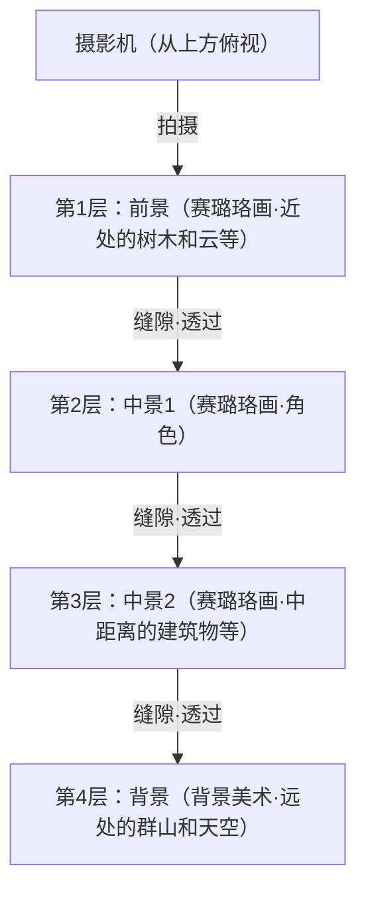
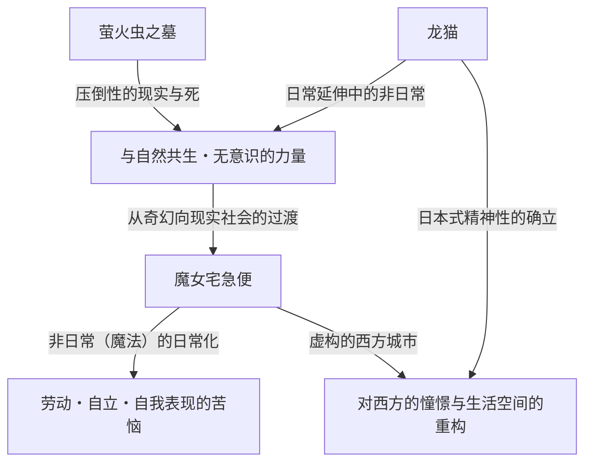
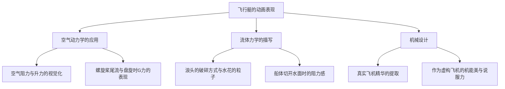
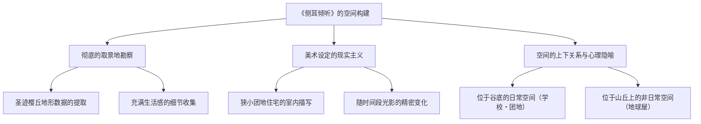
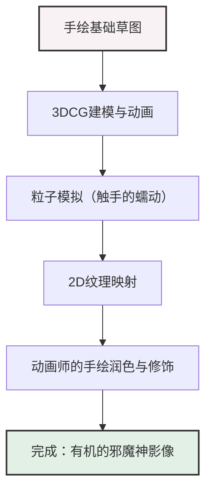
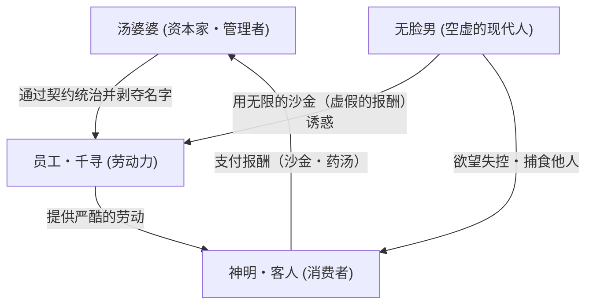
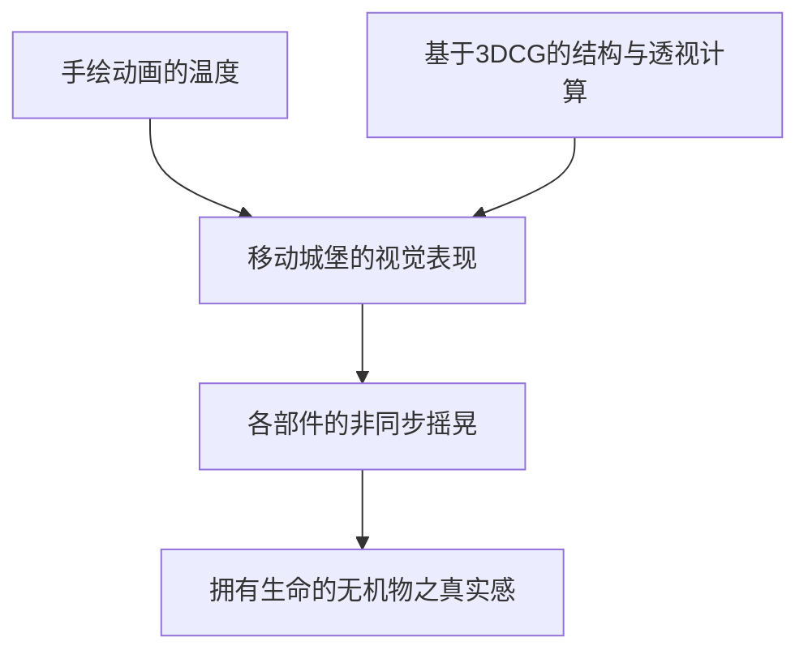
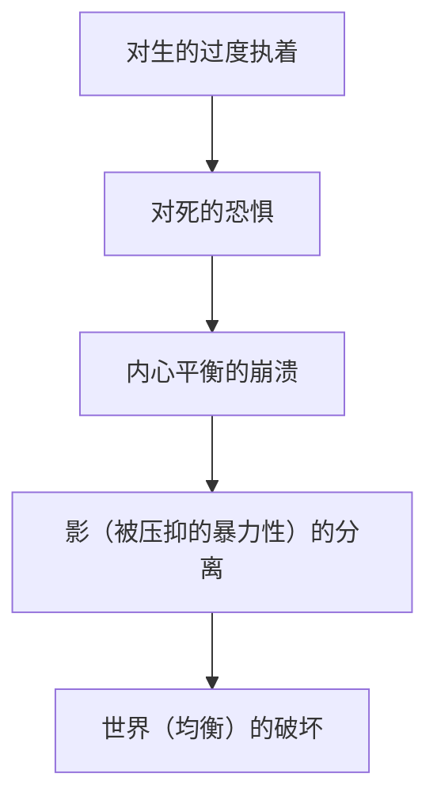
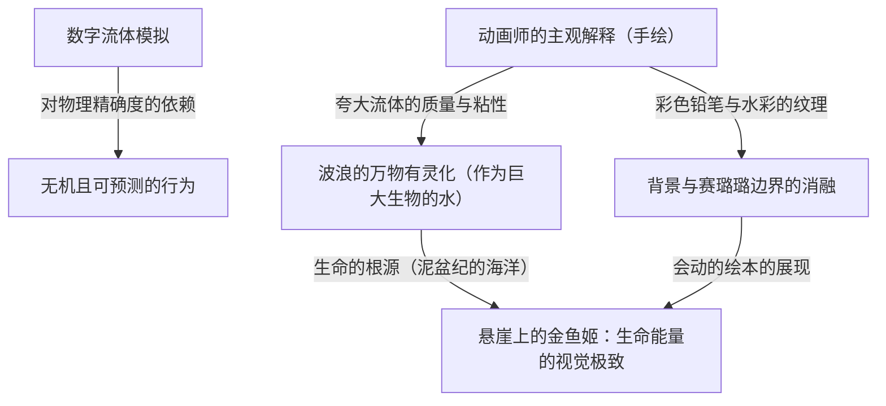
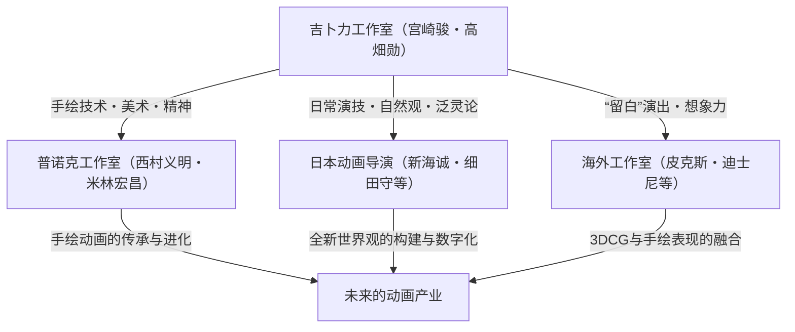

# 第1章：创立与早期的杰作（风之谷、天空之城）

## 1.1 动画史上的奇点，吉卜力工作室的诞生

当我们俯瞰日本动画产业，甚至是世界动画史时，无法忽视发生在1980年代中期的一个“事件”。那就是吉卜力工作室的设立。吉卜力的历史，并非单纯是一家企业、一家制作工作室的历史，而是赛璐珞这一模拟技术所达到的表现极点，以及动画这一媒介所拥有的“大众性”与“艺术性”奇迹般融合的历史本身。本章将一边梳理吉卜力工作室创立的经过，一边聚焦于其名义上的原点《风之谷》（1984年）以及以吉卜力工作室名义发表的首部作品《天空之城》（1986年），论述高畑勋与宫崎骏这两位天才如何突破动画表现的极限。

在吉卜力工作室设立的前夕，日本的电视动画通过一种被称为“有限动画”的手法实现了独自的进化。相对于每秒完全使用24帧的迪士尼式全动画，通过减少帧数的同时，驱使静止画和摄影机运动（摇摄、俯仰等）来演出动态感的手法，虽然始于削减成本的必要之恶，却在不知不觉中被确立为独特的影像文法。然而，高畑勋和宫崎骏所追求的，绝非局限于这个框架之内的东西。他们渴望在剧场版长篇这一最高规格的格式中，实现自东映动画（现·东映动画公司）时代以来所培养的对空间缜密的构建、生活演技的真实感，以及比什么都重要的对“运动的根本喜悦”的追求。

## 1.2 高畑勋与宫崎骏的作家性：客观性与主观性的奇迹交汇

为了深刻理解吉卜力工作室的作品群，必须把握构成其核心的高畑勋与宫崎骏这两种截然不同的才能的性质，以及它们之间的相互作用。两人皆出身于东映动画，通过工会活动等结下了深厚的羁绊，但作为动画演出家的志向性却毫不夸张地处于两个极端。

宫崎骏的作家性以压倒性的“主观空间认知”与“对运动的拜物教”为特征。宫崎所描绘的画面，时而超越物理法则，却拥有直接诉诸观者身体感觉的强烈说服力。飞行场景中的悬浮感、拥有巨大质量的物体移动时让人感到重低音般的重量感，以及微风的流动或水面的波光粼粼等，那种世界本身如同生物般蠕动的感觉，是宫崎将脑内的视觉意象通过动画师的身体定格在赛璐珞画上的结果。他在构图（画面构成）上大量运用广角镜头般的扭曲和独特的透视，巧妙地控制画面的景深和动线。

相对地，高畑勋的作家性则在于彻底的“客观性”与“逻辑构建”。正因为高畑自身是不画画的演出家，所以他能够从更高一层的元视角来俯瞰动画的画面。他的演出重点在于将角色的心理、社会结构，以及日常琐碎动作的真实感追究到极限。从空间配置、照明到角色的动机，一切都建立在缜密的计算之上，在促使观众产生感情代入的同时，也具备了一种让人始终从退一步的视角观察世界的布莱希特式间离效果。

这种“主观、直觉的宫崎”与“客观、逻辑的高畑”这两种才能，在相互牵制、相互尊敬中成为一家工作室的顶梁柱，这是创造出吉卜力丰饶作品群的最大原动力。在吉卜力早期的作品中，高畑以制作人的立场控制着宫崎的暴走，同时也发挥了巩固作品骨架的极其重要的作用。

## 1.3 赛璐珞动画的技术奇点与多平面摄影机

吉卜力工作室的惊人之处不仅在于主题的深奥，更在于支撑它的压倒性技术实力。特别是在从《风之谷》到《天空之城》的这段时期，模拟的赛璐珞动画技术正处于达到一个完美形态，或者说是“技术奇点”的时期。

吉卜力作品画面所拥有的压倒性信息量与真实感，是由缜密绘制的背景美术与重叠了许多层的赛璐珞图层所产生的。这里特别值得一提的是，使用“多平面摄影机（多段式摄影机）”所达到的空间表现极至。

多平面摄影机是一种在摄影机下方设置多层玻璃层（段），在每一层放置赛璐珞画或背景画进行拍摄的装置。借此，当摄影机移动（摇摄、俯仰、推镜头等）时，通过改变各层的移动速度，可以产生拟似的三维深度（视差）。这项技术本身虽然是迪士尼等公司自古以来就在使用的东西，但吉卜力在多平面摄影机的运用上，其精致度和复杂性却是出类拔萃的。

宫崎作品中不可或缺的“飞行场景”最大程度地受惠于这项技术。例如，眼底展开的云海、在其中穿梭飞行的飞行艇，以及更深处可见的大地等复杂的空间，随着各自图层以不同的速度流转，观众能够获得仿佛真的在天空中飞行般强烈的空间认知和沉浸感。此外，通过从赛璐珞背面打光的“透过光”技术、使用喷枪绘制的微妙渐变表现，以及将随风飘动的草木一帧一帧地手绘出来这种堪称疯狂的作画能量投入，画面中便有了风的吹拂和空气的流动。在数字技术（CGI）还不存在的时代，他们驱使物理的胶片和颜料，以及光影的魔术，构建了比现实更加逼真的虚拟空间。

## 1.4 《风之谷》（1984年）：作为前史的金字塔与生态学的深层

1984年上映的《风之谷》在名义上是吉卜力工作室设立前由“Topcraft”制作的作品，但它由宫崎骏担任导演、高畑勋担任制作人这样的阵容制作而成，作为决定了后来吉卜力发展方向的实质上的“第0作”或“第1作”而被定位。

本作以宫崎骏自己在月刊杂志《Animage》上连载的同名漫画为原作，但电影版对其开篇部分进行了重构，将其作为一个独立的故事使之完结。《风之谷》在动画史上刻下的最大功绩在于，它在娱乐的框架内，以压倒性的影像美将“环境问题（生态）”、“生命的尊严”以及“人类的愚行”这一极其厚重的科幻主题描绘得淋漓尽致。

在被称为“火之七日”的最终战争导致产业文明崩溃的1000年后。散发着有毒瘴气、被称为“腐海”的菌类森林不断扩大，由巨大的虫类支配的世界。这个绝望的世界观设定，反映了宫崎对冷战下核战争的恐惧以及对日益严重的环境破坏的强烈危机感。然而宫崎并没有陷入单纯的“保护自然”或“人类邪恶”的二元论中。剧中腐海实际上是净化被污染地球的系统的这一重大反转，直逼自然所拥有的可怕自我恢复力，以及人类在其面前的渺小。

从技术层面上谈论《风之谷》时不可或缺的，是以“王虫”为首的巨大虫类的表现。拥有许多体节和眼睛的这种异形生物，宛如起伏般前进的动画，通过使用橡胶的特殊作画技法（将多张赛璐珞画的部件错开拍摄的手法等）以及缜密的时间计算，产生了压倒性的重量感、诡异感，以及某种神圣感。此外，在海鸥（滑翔翼，娜乌西卡乘坐的飞行器）的飞翔场景中，让人感受到风阻的布料运动，以及仿佛将重力与升力关系视觉化般流畅的轨迹，向世界展示了宫崎动画的真谛——“飞翔的宣泄”。

娜乌西卡这一女主角的塑造也是革新性的。她并非单纯“应当被保护的少女”，而是亲自驾驭海鸥、开枪射击、挥舞剑刃的战士，同时也是对所有生命怀有深深慈爱的母性存在。兼具坚强与温柔、愤怒与悲伤的这种复杂的角色形象，不仅成为了之后吉卜力作品，更是现代虚构作品中女性英雄形象的一个顶点与原点。

## 1.5 吉卜力工作室的设立与《天空之城》（1986年）：终极的冒险活剧

借着《风之谷》成功的东风，以其利润为本金，1985年“吉卜力工作室”正式设立。其设立的目的只有一个，那就是“继续制作高质量的剧场版长篇动画”。为了与电视动画的粗制滥造划清界限，作为追求不妥协质量的独立基地，吉卜力诞生了。

然后在1986年，作为吉卜力工作室名义下值得纪念的第1部长篇作品，《天空之城》上映了。本作以宫崎骏在小学时代构思的想法为基础，以斯威夫特的《格列佛游记》中登场的浮岛拉普达为动机，将少年与少女的相遇、神秘的飞行石、空中海贼、以及怀有邪恶野心的军队等经典冒险活剧（Boy Meets Girl）的王道要素悉数塞入，是一部堪称“活剧的极北”的杰作。

《天空之城》的绝妙之处，在于令人喘不过气的故事推进力，以及遍布画面各个角落对细节的近乎异常的执着。从开篇朵拉一家袭击飞艇（虎蛾号）的场景，到巴鲁和希达逃入的斯勒格峡谷的追逐战，画面始终是“动态”的。斯勒格峡谷的机械造型、蒸汽机的活塞运动、齿轮的旋转，以及矿车的疾驰。这些机械和交通工具，不仅仅是背景或道具，它们本身仿佛拥有生命般充满了跃动感被描绘出来。宫崎拥有的“对机械的喜爱”以及试图连“其散发的热量与气味”都固定下来的作画热量，赋予了架空世界压倒性的真实感。

在主题性上，《天空之城》所展现的是“高度发展的科技与人类的割裂”，以及“与大地的连结”。曾经支配世界的拉普达帝国那超绝的科学力量，最终成为了毁灭自身的原因。在电影的高潮部分，从崩溃的拉普达深处，抱着巨大飞行石的巨大“大树”向宇宙上升的景象，极具象征意义。作为科技象征的人工造物崩塌，仅留下作为生命象征的大树的这个结局，浓缩在希达所说的台词中：“扎根于泥土，与风共存。与种子一起越冬，与鸟儿一起歌唱春天。不管你拥有多么可怕的武器，操控着多少可怜的机器人，只要离开土地就无法生存。”这是延续自《风之谷》的宫崎对现代文明的痛烈批评，是对回归自然这一普遍的祈愿。

此外，本作中美术监督野崎俊郎和山本二三在背景美术上的贡献是不可估量的。在到达拉普达时，云海散去，布满青苔的巨大庭园与机器人兵出现的场景中那种静谧的美，证明了动画中的背景画是如何决定作品的品格的。这里展现了宫崎动之演出与静之美术的完美融合。

## 1.6 结语：传说的开始

《风之谷》与《天空之城》。在这初期的两大杰作中，宫崎骏与高畑勋，以及吉卜力工作室的工作人员们，将动画这一表现手法所能拥有的潜力发挥到了极致。赋予幻想产物中的架空机械以重量与触感，为想象中的生态系统注入真实感，将复杂的社会批评与哲学主题内含于令男女老少都屏息凝神的娱乐之中。这种不可思议的绝技，是他们通过数量庞大的赛璐珞画，以及堪称职人疯狂的手工作业来完成的。

这两部作品将技术与表现的基准提升到了遥远的高度，成为了在之后的日本动画界中横亘着的“名为吉卜力的巨大高墙”。与此同时，这也是一家小小的工作室日后将掀起世界级的文化现象、改写动画历史本身的宏大传说字面意义上的“第1章”。随后通往《龙猫》与《萤火虫之墓》，再到《幽灵公主》的道路，全部都始于这《风之谷》的风与《天空之城》的天空。

# 第2章：日常与非日常的交汇点——《龙猫》《萤火虫之墓》《魔女宅急便》所描绘的世界

在梳理吉卜力工作室的历史时，20世纪80年代后半期是一个决定性的转折点。从前作《天空之城》（1986年）所描绘的那种宏大的“剑与魔法”抑或“空中冒险动作剧”突然转变，吉卜力将方向大幅转向了日本的原初风景以及西方市井平民生活这种“日常”。本章将选取1988年奇迹般实现同日上映的《龙猫》《萤火虫之墓》，以及1989年的大热之作《魔女宅急便》这3部作品，彻底解剖它们在动画史上刻下的技术与主题上的革命。

## 1. 同日上映的疯狂与奇迹：宫崎骏与高畑勋，两个“昭和”

1988年春，实现了《龙猫》与《萤火虫之墓》同日上映这一在如今几乎无法想象的发行形态。这并非单纯的商业包装，而是吉卜力工作室这一组织，进而是宫崎骏与高畑勋这两位天才创作者擦出火花的“疯狂与奇迹”的结晶。

### 1-1. 背靠背的生与死
《龙猫》以昭和30年代（20世纪50年代）的日本农村为舞台，描绘了自然精灵与孩子们的交流，是一首生命的赞歌。另一方面，《萤火虫之墓》以昭和20年（1945年）二战结束前后的神户为舞台，以彻底的现实主义手法描绘了在战火中失去生命的兄妹俩凄惨的现实。尽管时代背景仅相差约10年，但这两部作品却内含着“生与死”“理想化的奇幻与残酷的现实”这样完全背靠背的主题。

当时的吉卜力工作室建立了一种堪称鲁莽的制作体制，让两位巨大的天才同时运转。发生了争夺作画人员的情况，日程安排濒临破产的危机。然而，结果这种严酷的环境却将两部作品的质量推向了极限。宫崎骏作为对高畑勋彻底的现实主义的反命题，构建了更加强有力、无意识的生命力跃动着的《龙猫》世界；而高畑为了对抗宫崎所描绘的奇幻，将日本的动画表现提升到了纪录片般的维度。

### 1-2. 昭和的不同描绘与“动画纪录片”的诞生
《萤火虫之墓》中高畑勋的演出，破坏了以往动画的语法。B-29轰炸机投下燃烧弹的下落轨迹、燃烧着的房屋火焰的摇曳，以及最重要的是因饥饿而衰弱的清太和节子身体的变化。为了表现这些，色彩设计保田道世等人彻底追求了以往动画色彩无法完全表现的“沾满泥土、鲜血和煤灰的茶褐色”。

与之相对照的是，在《龙猫》中，宫崎骏重构了自己记忆中“可能曾经存在过的、美丽的日本”。那并非单纯的写实，而是将从孩子视角看到的世界的“光辉”定格在赛璐珞画上的尝试。对这两个“昭和”的不同描绘，最大限度地证明了动画这一媒介所具有的表现幅度，成为了日本电影史上的金字塔。

## 2. 背景美术的革命：男鹿和雄与山本二三创造的“空气与湿气”

吉卜力作品所具有的压倒性说服力，不仅在于角色的表演，很大程度上还要归功于其背后广阔的背景美术的力量。这一时期，吉卜力工作室的背景美术达到了一个顶峰。

### 2-1. 男鹿和雄描绘的“龙猫森林”的湿润大气

被提拔为《龙猫》美术监督的男鹿和雄的功绩，说改变了日本动画美术的历史也不为过。男鹿所描绘的自然，将广告颜料的特性发挥到了极致。尽管使用的是不透明的广告颜料而非透明水彩，但通过绝妙的水分控制和笔触，甚至表现出了日本风土特有的“湿气”“令人窒息般的草香”以及“透过树叶的阳光的温度”。

特别是小月和小梅在雨中的公交站与龙猫相遇场景的背景美术，堪称压轴。被雨水打湿的柏油路面的质感、沉浸在黑暗中的镇守之森的深度、电灯光制造出的空气层。男鹿的美术不仅仅是“风景的临摹”，而是将吹拂那里的风、温度、湿度等“看不见的信息”视觉化的魔法。

### 2-2. 对西方的憧憬与建筑现实主义
另一方面，《魔女宅急便》的舞台克里克城，是一个融合了瑞典的斯德哥尔摩、哥特兰岛的维斯比，乃至里斯本、巴黎等欧洲各种城市元素而创造出的虚构城市。这里的背景美术有着与描绘日本风景的《龙猫》截然相反的方向。

欧洲的石造建筑、连绵的瓦片屋顶，以及通向大海的坡道。为了有说服力地描绘这些，吉卜力的美术人员进行了彻底的外景考察和建筑结构的学习。哪怕只是一块石头的质感，也会计算其风化程度和阳光的反射率，并将其转化为作为动画背景看起来最美丽的色彩。将这种“对西方的憧憬”不仅停留在奇幻层面，而是作为人们在现实中生活、劳作的空间描绘出来的美术力量，是令人惊叹的。

## 3. 《魔女宅急便》中的现代主题：“劳动与瓶颈期”

《魔女宅急便》在上映当时，获得了众多年轻人，特别是职业女性的狂热支持。其原因在于，本片表面上披着“魔女女孩的成长故事”的奇幻外衣，但其本质却是围绕极其现代且普遍的“劳动与才能（瓶颈期）”的真实戏剧。

### 3-1. 才能变为“劳动”的瞬间
主人公琪琪利用与生俱来的“在空中飞翔”的魔法才能，开始了快递送货的工作。这与现代创作者和自由职业者将自身的特长和才能作为“资本”参与社会的进程完全重合。对于初期的琪琪来说，在空中飞翔是喜悦，是自我表现。然而，当它变成“工作（劳动）”，面临客户不讲理的要求（鲱鱼派的插曲等），并作为报酬获得金钱时，她心中的魔法的意义便发生了质变。

### 3-2. 瓶颈期与自我认同的丧失
到了中段，琪琪突然失去了魔法的力量，无法在空中飞翔，也听不懂黑猫吉吉的话了。这既是青春期少女自我认同的动摇，同时也是创作者所面临的“才能枯竭（瓶颈期）”的完美隐喻。

在这里发挥重要作用的，是在森林小屋里画画的美术生乌露丝拉。乌露丝拉对琪琪说：“那种时候只能挣扎。”“画，画，拼命地画。”“如果还是不行，就不画了。散步、看风景、睡午觉，什么都不做。”这段台词，正是包括宫崎骏本人在内的动画师们，进而所有从事表现活动的人所面临的苦恼及其处方本身。

### 3-3. “用血飞翔”的觉悟
乌露丝拉谈到自己的画时说：“以前什么都不想就能画，但现在不一样了。必须画出自己的画。”琪琪的魔法也是一样。仅靠与生俱来的才能（魔法）就能飞翔的无意识时代宣告结束，她必须通过自己的意志和努力，来“重新获得”魔法。在最高潮部分，琪琪骑着长柄刷，带着拼命的神情飞向天空的场景，已经不再是优雅的奇幻了。那是直面自身的极限，带着呕心沥血般的意念行使“技术”的专业人士的身姿本身。

## 4. 主题的结构与相互关系

这3部作品乍看之下各自拥有独立的世界观，但从吉卜力作者性的轴线来看，存在着明确的连续性和主题的交汇点。

《龙猫》所提示的“潜藏在日常中的非日常（奇幻）”，通过与《萤火虫之墓》这一极致现实主义的对比，获得了更加坚固的神话性。而由此确立的表现手法和动画技术，在《魔女宅急便》中，成为了描绘“非日常的存在（魔女）如何融入现代社会日常（劳动）”这一悖论性主题的强有力武器。

## 5. 结语：迈向下一阶段的布局

从1988年到1989年的这一时期，吉卜力工作室在短短几年间，走完了“生与死”“日本与西方”“奇幻与现实”，以及“才能与劳动”等动画所能描绘的所有极致。在这里培养出的彻底观察并描绘日常表演的技术，以及让风景蕴含空气与感情的背景美术的力量，被传承到了之后《岁月的童话》（1991年）和《红猪》（1992年）等面向成年人、具有更复杂主题的作品群中。

《龙猫》《萤火虫之墓》《魔女宅急便》这3部作品，并非单纯的名作罗列。它们记录了动画这一表现媒介，从面向儿童的娱乐，蜕变到描绘人类精神深渊和社会结构性苦恼的“综合艺术”，那最热烈、最痛苦的羽化瞬间，是一座历史性的丰碑。

# 第3章：对飞行的憧憬与成年人的浪漫——《红猪》与《侧耳倾听》中现实主义的顶点

在俯瞰吉卜力工作室的历史时，1990年代前半期至中期发表的《红猪》（1992年）与《侧耳倾听》（1995年），乍看之下可能像是处于两个极端的作品。前者以亚得里亚海为舞台，是一部描绘因诅咒变成猪的赏金猎人飞行艇驾驶员的战斗与哀愁的奇幻作品；而后者则以现代的多摩新城为舞台，是一部描绘初中生男女间青涩的恋情与对未来进路的纠葛的青春群像剧。

然而，贯穿这两部作品的，是吉卜力工作室——不，是宫崎骏与近藤喜文这两位稀世创作者，试图利用动画这一表现手法将“现实主义（真实感）”追求到极致的永无止境的探索心。并且，在其根底存在着对“飞行”——物理上的在空中飞翔，或是超越自身极限在精神上的飞跃——的强烈憧憬。本章将从历史背景和技术论两方面，深入探讨这两部作品在动画史上占据着怎样特异的地位，以及达成了何种技术与主题上的成就。

## 1. 《红猪》——空气动力学的极致与失落时代的挽歌

《红猪》（原题：Il Porco Rosso）最初是作为日本航空机上放映用的短片而企划的，但由于南斯拉夫冲突这一现实的沉重阴影，它以一种特异的出身发展成了长篇电影。本作是宫崎骏为自己，也是作为“为疲惫到脑细胞变成豆腐的中年男人制作的电影”而打造的，具有极其个人化触感的作品。

### 1.1 宫崎骏与飞机：对机械的恋物癖与空气动力学的缜密描写

宫崎骏对“飞行”的执着早已闻名，但在《红猪》中对飞行艇的描写，将他自身对机械的恋物癖与对空气动力学的深刻理解以最纯粹的形式表现了出来。本作中登场的飞行艇——主人公波鲁克・罗梭的爱机，鲜红的萨伏依亚S.21（原型是混合了马基 M.33和萨伏依亚-马尔凯蒂 S.59等真实机体元素的原创设计），以及宿敌卡地士的机体，还有空贼联盟的各种杂牌飞行艇——不仅仅是背景或道具，其本身就作为自律的角色跃动着。

值得特书的是，从空气阻力、升力、螺旋桨的扭矩、发动机的振动，到从水面起飞、降落时的流体力学表现，动画中“物理法则的虚假与真实”被控制在绝妙的平衡之中。

在波鲁克的萨伏依亚启动发动机的场景中，从气缸点火、机体整体开始微小的振动，直到排气管吐出黑烟的一系列过程，都是通过赛璐珞画细微的振动和多重曝光（当时的模拟摄影技术）来表现的。在空战（Dogfight）桥段中，承受盘旋时G力（重力加速度）的飞行员肉体上的负荷，以及在失速（Stall）边缘控制机体的操纵杆与方向舵踏板的微细动作，都以极其精确的时机（作画张数）被描绘出来。这是存在于宫崎骏脑内的“飞行的身体感觉”，通过动画师们的手在赛璐珞上被完美追踪的结果。

### 1.2 响彻亚得里亚海空中的反法西斯抵抗与无政府主义

本作的舞台是1920年代末的意大利亚得里亚海。时代背景方面，正是留下了第一次世界大战的伤痕，墨索里尼率领的法西斯党正在抬头的狂躁与不安的时代。波鲁克・罗梭（本名马可・帕哥特）曾是意大利空军的王牌飞行员，但他对国家与军队的体制感到绝望，对自己施下诅咒变成猪，选择了作为赏金猎人这一法外之徒（无政府主义者）生存的道路。

波鲁克那句著名的台词“要我变成法西斯，我宁愿当只猪”，并非仅仅是一句冷酷的耍帅台词。它拒绝被编入国家这一巨大的暴力装置中，在天空这个无国籍的空间里寻求个人的自由与尊严，是宫崎骏自身强烈的反法西斯主义与无政府主义的表态。

电影后半段，波鲁克与昔日战友菲拉林（现为法西斯空军少校）在电影院密会的场景，浓厚地反映了本作的政治背景。菲拉林抱怨道：“我们不得不背负着国家或民族这些无聊的赞助商去飞行”。在这里，冷酷地描绘了在空中飞行的纯粹喜悦，变质为国家意识形态和战争工具的过程。虽然没有明确说明波鲁克变成猪的原因，但那是对人类互相残杀的荒诞世界的深深绝望，也是为了将自己从不断施加从众压力的社会中疏远出来的防御机制，或者说是作为“如果保持人类的姿态就无法保持作为人的尊严”这种悖论的表现而起作用的。

### 1.3 “不飞的猪，就只是只普通的猪”——中年男性的浪漫、挫折与诅咒

《红猪》之所以能抓住许多成年人的心久久不放，是因为本作是一首对“失去之物”的哀切挽歌（Elegy）。波鲁克对在第一次世界大战中散落的战友们（向云之平原升去的飞机幻影场景，是留名电影史的名场面）抱有强烈的丧失感和幸存者内疚（Survivor's Guilt）。

正如吉娜演唱的香颂《樱桃成熟时（Le Temps des cerises）》（作为哀悼巴黎公社瓦解的歌曲而闻名）所象征的那样，这部电影充满了对逝去的美好时代、永远无法触及的青春，以及不可逆转的丧失的深深怀旧（Nostalgia）。波鲁克与吉娜成熟的、然而保持着绝不交汇距离感的成年人恋爱描写，在吉卜力作品中占据了特异的位置。波鲁克也有着以“诅咒”为借口，逃避吉娜的爱情和现实社会参与的一面。在“所谓帅气，就是这么回事。”这句宣传语背后，隐藏着为自己的美学殉道的孤独，以及接受正在变得落后于时代的自己，这样痛切的“中年男性的自我接纳”的故事。

## 2. 《侧耳倾听》——青春期痛切的现实主义与空间的魔法

1995年上映的《侧耳倾听》，是宫崎骏担任制片人、编剧、分镜，由吉卜力工作室的核心动画师近藤喜文唯一担任长篇导演的纪念碑式的作品。虽然改编自柊葵的同名少女漫画，但在宫崎与近藤的手中，本作超越了单纯的爱情故事框架，升华为在进路、才能以及自我实现的焦虑中摇摆不定的青春期的真实肖像。

### 2.1 近藤喜文的视线：寄宿于日常举止中的动画真谛

本作最大的魅力，可以说是技术上的成就，即近藤喜文导演对“日常演技”的彻底执着。在动画中，相比描绘魔法、爆炸、机器人战斗等“非日常（奇观）”的动作，准确且伴随情感地描绘人走路、坐下、泡茶、跑上楼梯等“不经意的日常动作”被认为要困难得多。

近藤喜文曾在高畑勋导演的作品（《萤火虫之墓》、《岁月的童话》等）中担任作画监督，是将角色的骨骼与肌肉的运动、重心的移动，以及将心理状态反映在动作上的“生活演技”的达人。在《侧耳倾听》中，他卓越的观察眼得到了淋漓尽致的发挥。

例如，主人公月岛雯在图书馆看书时姿势的变化、焦急下楼梯时的步法，或者在夹杂着恋慕与烦躁的状态下与天泽圣司交流时视线的推移与耸肩的方式。这每一个细微的动画，都产生了名为雯的少女确实存在于那里、呼吸着那样的强烈真实感。这是与在奇幻世界中飞翔的宫崎动画的快感不同的，脚踏实地描绘“人类的生活”的动画的真谛。

### 2.2 取景地勘察与空间构建：多摩新城这座“活生生的街道”

本作的另一个主角，是作为舞台的街道本身。基于在东京都圣迹樱丘（多摩新城近郊）周边进行的彻底的取景地勘察（Location Hunting），本作的美术背景以惊人的真实感被构建出来。

美术监督黑田聪等人创作的背景画，出色地描绘出了团地住宅无机质的混凝土质感、陡峭的坡道、狭窄的后巷，以及黄昏的街景。特别值得注意的是，对雯居住的“狭窄团地”的描写。堆满的书本、杂乱的餐桌、有着双层床的狭窄姐妹房间。这种令人窒息（但又带有温暖）的真实生活空间的描写，支撑了雯“想从这里逃脱，去往更广阔的世界”这种对飞翔的渴望（＝想要写故事的冲动）。

此外，街道的地形（高低差）出色地发挥了作为心理隐喻的作用。雯的日常（学校和团地）在“下方”，而被不可思议的猫（阿月）引导到达的古董店“地球屋”则在爬完陡坡的“山丘上”。这种高低差，直接在视觉上表现了雯精神上的上升志向，以及迈向未知领域时的困难。

### 2.3 创作的热源与自我实现的痛楚：男爵引导的“内在飞行”

《侧耳倾听》在是一部爱情电影的同时，也是一部强烈的“创作者的自我启迪物语”。相对于为了成为小提琴工匠这一明确目标而打算去意大利留学（飞行）的圣司，感到焦躁的雯，为了确认自己内心的“原石”，开始写故事（《侧耳倾听》的作中作奇幻小说）。

这里有趣的是，在作中作的世界里，插入了雯与猫男爵巴隆一起“在空中飞翔”的片段。这一由以《依巴拉度》闻名的画家井上直久负责背景美术的梦幻场景，描绘了与《红猪》物理飞行截然相反的，作为想象力解放的“内在飞行”。

然而，本作并没有仅仅以梦物语结束。在将不眠不休写成的小说让地球屋的主人读过之后，雯痛切地感到自己的作品粗糙且不成熟，放声大哭。面临创作残酷的壁垒，认清自己才能的极限（保持原石的状态是不会发光的）的这个场景的痛楚，刺痛了所有从事创造（制造）工作的人的心。宫崎骏和近藤喜文避免描绘轻易的成功，通过初中生少女的身影，描绘了“即使如此也必须不断削减、打磨”的严厉工匠伦理。

## 3. 结论：飞机与小提琴，各自的“工匠”们的故事

《红猪》与《侧耳倾听》。驰骋在亚得里亚海天空的中年猪，和骑着自行车在多摩新城的坡道上飞驰的初中生。这两个乍看没有任何交点的故事，以“对工匠精神的尊重”为轴心紧密地结合在一起。

完美修理和调试波鲁克爱机的保可洛公司的菲奥和女工们。还有在克雷莫纳努力修行制作小提琴的圣司，以及持续修理古董钟表的地球屋主人。吉卜力作品一贯地，对用自己的双手创造事物、不断磨练技术的“工匠（Artisan）”们奏响了无上的赞歌。

正如波鲁克为了守护天空的自由而战一样，雯也为了编织自己内心的声音（故事）而拿起了语言这一武器。物理上的“飞行”与想象力的“飞跃”。虽然表现手法不同，但吉卜力工作室在这一时期达到的现实主义顶点，是以压倒性的影像美，将人类对抗现实世界的重力（社会的羁绊和自身的极限），却依然试图高飞的崇高意志烙印在了胶片上。在下一章中，我们将探讨这种彻底的现实主义与自然主义，与神话想象力结合后所产生的前所未有的史诗，《幽灵公主》中自然与人类的冲突。

# 第4章：生态学与神话想象力（幽灵公主）

1997年上映的《幽灵公主》，是吉卜力工作室及宫崎骏导演职业生涯中一个明确的分水岭，也是一部具有纪念碑意义的原型之作。这部作品超越了单纯的动画电影的范畴，带来了足以改写日本电影史本身的巨大文化与产业影响。本章将对该作品所具有的多重主题性——日本中世纪史的解构、非二元论的善恶维度，以及作为技术转折点的CG（计算机图形学）与传统赛璐珞动画的融合——进行极其详尽的剖析。

## 1. 产业背景：制作费的激增与票房纪录的刷新

《幽灵公主》的制作，对吉卜力工作室而言是一项前所未有、赌上公司命运的巨大项目。从一开始，宫崎骏导演就抱着“这可能是最后的引退之作”的觉悟来对待，其不妥协的作者主义使得制作周期和预算无止境地膨胀。总制作费据说约为20亿日元，这对当时的日本电影来说是一个打破常理的数字。作画张数达到了约14万4000张，相当于普通长篇动画的2至3倍。

为了收回这一巨大的风险，制片人铃木敏夫展开了史无前例的跨媒体企划与宣传战略。由糸井重里创作的“活下去。”这一鲜明的广告语，对当时笼罩在日本社会的世纪末、压抑的氛围（如阪神淡路大地震和地铁沙林毒气事件等1995年的创伤）起到了某种回应的作用。

结果，本作创下了观影人数1420万人、票房收入193亿日元的纪录。大幅刷新了当时的日本电影历代票房纪录（由《E.T.》保持的纪录），使吉卜力工作室在日本作为“国民级电影”的地位不可动摇。这种产业上的成功，证明了即使日本动画处理面向成人的厚重主题，也能成为巨大的商业项目，对后来的动画产业商业模式产生了深远的影响。

## 2. 时代设定与神话重构：为什么是室町时代

宫崎骏特意选择了“室町时代”这一日本史的过渡期作为本作的舞台。他没有选择以往时代剧喜欢描绘的江户时代（身份制度固化、和平且受管制的社会）或战国时代（武将们的权力斗争），而是选择了充满混沌的室町时代，其中有着深刻的思想意图。

室町时代是从以农业为中心的社会向货币经济过渡、手工业发展的时代，最重要的是，这是一个“人类技术对自然的优势”开始明确显现的时代。铁的生产（踏鞴吹炼）开始正式化，随之而来的是森林采伐的加剧，但同时群山中依然留存着幽深的原始森林，人们依然相信神明的真实存在。也就是说，那是一个人类与自然，或者说近代与前近代激烈冲突、相互克制的边界线时代。

深受历史学家网野善彦关于“非农业民（工匠、商人、游女、演艺民等）”的研究（无缘·公界·乐）影响的宫崎，解构了以往“瑞穗之国”这种同质化的日本史观。电影中登场的达达拉城，被描绘成一种天皇和大名统治无法触及的“避难所”（庇护所·自由领域）。在那里，被赶到社会边缘的麻风病患者（病患）和被卖掉的女人，通过生产铁这种高度的技术能力实现自立，建立起独特的乌托邦。

像这样，《幽灵公主》并不仅仅是一部奇幻作品，而是照亮了历史的暗部，试图从神话的层面对日本人的身份认同和自然观进行重构的尝试。

## 3. 幻姬（黑帽大人）与珊：善恶的非二元论

本作最具突破性的一点在于，它彻底放弃了传统好莱坞式或迪士尼式的“劝善惩恶”范式。它没有将破坏自然的一方——人类简单地定罪为“恶”，反而强有力地描绘了他们的生存营生与尊严。

其象征便是达达拉城的领袖——幻姬（黑帽大人）。她既是杀害山神、开辟森林的破坏自然的元凶，同时也是一位保护被社会遗弃的弱者、赋予他们生存目的与尊严的卓越的人道主义者和革命家。幻姬绝不是为了私欲而去破坏森林。人类为了摆脱贫困与歧视，为了自立地活下去，除了征服自然、生产铁之外别无他法。这种“善良的动机结果却侵犯了他者（自然）的领域”的矛盾，正是人类业障的本质。

相对的，珊（幽灵公主）是一个被人类遗弃、由山犬抚养长大的少女。她憎恶人类，为了保护森林而企图取幻姬的性命，但她自己同样也是一个无法完全成为“野兽”的边界存在。阿席达卡站在这些互不相容的两种正义——“人类生存的权利”与“自然的神圣性”——之间，试图“用不被蒙蔽的双眼看清一切并做出决定”，但他同样无法找到明确的解决对策。

在故事的结尾，兽神（麒麟兽）被归还了头颅后消散，太古的森林也不复存在。然而，达达拉城也同样崩溃，人们发誓“要在这里建一个好村子”，从零开始重新出发。阿席达卡和珊都选择了活下去，但并没有生活在同一个屋檐下。阿席达卡住在达达拉城，珊住在森林，采取了“我会偶尔去见你”的共存形式。这拒绝了人类与自然之间实现完全和谐这种轻易的情感宣泄，而是在永远持续的紧张关系中传达出“活下去”这样残酷却带有希望的信息。

## 4. 技术转折点：CG与手绘动画的高度融合

《幽灵公主》也应被铭记为吉卜力工作室首次正式引入计算机图形学（CG）的作品。多年来，宫崎骏对手绘（赛璐珞动画）的工匠技术有着绝对的执着，但为了实现在本作中应该表现出的压倒性的动态感与复杂性，数字技术的引入是不可避免的。

然而，吉卜力对CG的使用，并非向全3DCG过渡，而终究是为了扩展和补充手绘表现力的“数字合成”与“3D/2D的融合”。虽然在总共1620个镜头中，CG镜头仅有100多个，但其效果却是巨大的。

### 邪魔神（邪魔神）的表现

最具象征意义且技术难度最高的是开篇对邪魔神（受到诅咒的野猪神）的刻画。无数像蛇一样的触手（蛇状的诅咒）蠕动着，像泥浆一样缠绕着前进的描写，对手绘动画师来说是噩梦般的工作量。

在此，制作团队采用了将3DCG的粒子（Particle）模拟与手绘画作相结合的手法。首先，用3DCG构建出触手的基本运动和骨架，并在其上映射手绘的纹理（Texture）。进而，动画师在这些CG素材之上进行手绘润色（修饰），从而消除了CG特有的无机质的冰冷感，达到了有机而生动、宛如“怨念”本身的表现。

### 数字映射与动态摄像机运镜

另一项革新是背景画（美术）的数字处理。以往，在赛璐珞动画中，那种让摄像机环绕的立体推轨镜头（环视），极大地依赖于通过扭曲背景来作画这种极高难度的工匠技艺（透视计算）。

在《幽灵公主》中，如阿席达卡离开村庄的场景，或是表现兽神森林深邃的场景里，使用了将美术人员手绘的优美背景画作为纹理贴在用3DCG构建的地形模型上的“3D映射（3D Mapping）”技术。通过这种方式，在保持手绘的温度与绘画般的美感的同时，实现了如同真人电影般的空间深度，以及可以纵横驰骋移动的动态摄像机运镜。

此外，在兽神的脚下，植物瞬间发芽、生长并枯萎的生命循环，也是充分利用变形（Morphing）技术和数字合成表现出来的。像这样，《幽灵公主》中的CG，绝不是为了炫耀技术，而是作为将宫崎骏脑海中那神话般且令人目眩的神奇景象固定在现实银幕上的不可或缺的画笔（工具）而发挥着作用。

## 结语

《幽灵公主》是吉卜力工作室所达到的一处极北之境。它虽然深深扎根于日本中世纪这一历史土壤之中，但其中所讲述的生态学问题和善恶非二元论，在现代的全球化社会中开始具有越来越强烈的现实意义。而且，手绘与数字技术以奇迹般的平衡相融合的影像美，拥有着空前绝后的完成度。在下一章《第5章：日常的魔法与乡愁（千与千寻）》中，我们将探讨吉卜力如何从这种神话般的规模发生大转折，潜入现代少女心象风景的全新转向。

# 第5章：数字转型与全球赞誉（《千与千寻》、《猫的报恩》）

在吉卜力工作室的历史上，2000年代初是在技术、表现手法和商业上发生最具戏剧性转折的时代。本章将从专业人士的视角，极致详细地探讨从赛璐珞动画向全数字化环境的过渡，是如何将吉卜力作品的影像表现推向未曾有过的境界，以及其结晶之作《千与千寻》（2001年）和作为向下一代布局的《猫的报恩》（2002年）是如何超越日本国内的界限，带来何种世界级的赞誉和文化影响的。

## 1. 从模拟到数字：吉卜力工作室的技术范式转换与美学重构

在动画制作中，“数字化”并不单纯意味着提高工作效率或削减成本。这是一场影像制作根本性的范式转换，意味着能够将画面中存在的所有视觉元素作为数值数据进行完全控制。吉卜力工作室引入数字技术，是在1997年的《幽灵公主》中针对邪魔神触手的蠕动、迪达拉博奇（巨型神明）的半透明质感，以及部分3DCG背景等方面进行了试验性应用，随后在1999年的《我的邻居山田君》中采用了完全的数字上色。然而，在宫崎骏导演的作品中，首次完美实现在保留传统赛璐珞动画所具有的生动质感的同时，将其在数字空间中进行细致重构这一极其困难之举的，正是《千与千寻》。

随着向全数字体制的彻底过渡，物理上的“赛璐珞片”和“动画用颜料”从制作现场消失了。确立了用扫描仪将画在纸上的原画和动画以高分辨率录入，并在软件上进行数字上色的工作流程。由此，终于从模拟时代特有的物理限制中解放出来，例如由于重叠多张物理赛璐珞片而导致的透射光衰减（画面变暗的现象），以及赛璐珞片上的划痕和灰尘混入等问题。

更具革命性的是在“摄影（合成）”工序中表现力的飞跃性提升。将画面上的对象（角色、前景的鼻涕虫、背景的建筑物、特效等）分割为无限的图层，并让每一层拥有不同的焦深（景深），从而能够模仿真人电影的摄像机镜头，实现高度多层的景深表现。在模拟时代的各种多层摄影机装置中，几层已经是极限的立体空间表现，在数字空间中则可以拥有无限的层次。油屋那高耸入云的巨大感，以及通向深渊的阶梯那深不可测的深度，带着压倒性的透视感逼近观众的视野。

## 2. 色彩设计·保田道世的炼金术：全数字上色带来的色彩表现的无限扩展

这种数字转型最大的受益者是“色彩”这一元素。在吉卜力工作室创立之前，就长期支撑着宫崎骏、高畑勋作品色彩设计的天才色彩师保田道世，通过完全向数字上色的过渡，成功地为画面施加了前所未有的魔法。

在使用物理颜料的时代，可使用的颜色数量存在明确的上限。一部作品中使用的颜料种类最多只有数百种左右，为了表现复杂的阴影或黄昏时微妙的环境光变化，只能在有限的调色板中试图达到视觉错觉的效果。然而，随着向数字环境的过渡，理论上可以处理约1677万色（24位色彩）这种无限数量的颜色。

在《千与千寻》中，保田道世并没有将这无限的调色板用于“标新立异的迷幻配色”，而是用于“再现极其真实的环境光”和“细致入微地表现角色的情感”。千寻误入的不可思议的小镇，以及八百万神明洗去疲惫的“油屋”中那色彩斑斓的照明，绝不只是单纯的华丽。红灯笼的光在湿润的石板路上漫反射的景象、落在千寻脸颊上的细腻阴影、变成猪的父母贪婪吞食的异界食物那油腻的质感，以及白龙变成龙的姿态时鳞片那生动且具有透明感的翠绿色等，都根据时间段和空间的湿度，对各个对象受光源影响的情况进行了细微的控制。

尤其令人叹为观止的是角色与美术背景的“和谐（Harmony）”。在模拟时代，手绘背景画和赛璐珞片之间难免会产生质感上的割裂，但通过引入数字合成，可以进行细微的数字滤镜处理，使背景的氛围感（环境光）融入角色的色彩中。在乘坐海原电铁前往沼底的序列中，从黄昏到逢魔时刻再到夜晚的天空和水面色调变化，以及乘客半透明的影子落在其中的描写，是数字渐变的精细控制与保田敏锐的色彩感觉完美融合的、动画史上留名的影像诗。

## 3. 日本式泛灵论与《神隐》的民俗学

本作之所以获得世界上史无前例的评价，原因除了其压倒性的影像美之外，还在于它将极具日本特色的“泛灵论（万物有灵论）”世界观，完美升华为了现代少女的成年礼（启蒙）故事。

八百万神明为了洗去日常的疲惫而来到澡堂，这个设定本身在坚持一神教的西方价值观看来就显得极其新鲜而深奥。河神被污泥、人类非法倾倒的自行车和大型垃圾所覆盖，化作“腐烂神（オクサレ様）”的描写，既是对现代环境破坏的直接信息，同时也是神道教中“拔除污秽”这一根本概念的视觉化。这种本土（土著）的民俗学主题，与全球性（普遍性）的环境问题实现了无缝连接。

此外，正如“神隐（千与千寻的日文原名意为被神明隐藏起来）”这个标题所示，本作是一个在生与死的边界线上彷徨的故事。穿过隧道后的废墟主题公园，以及与那里隔河相望的油屋，显然是“异界”或“冥界”的隐喻。在日本的民间传说中，遭到神隐的人如果吃了异界的食物就再也无法回到原来的世界，这种名为“黄泉之食”的禁忌，被融入了千寻从白龙那里得到不可思议的食物的场景中。宫崎骏深厚的民俗学修养强有力地支撑着故事的骨架。

## 4. 汤屋（油屋）的系统与彻底的资本主义·消费社会批判

虽然披着泛灵论的外衣，但作为故事主要舞台的“油屋”的实质，却是作为极其现代的官僚制和资本主义社会的隐喻在发挥作用。和洋折衷、明治时期拟洋风建筑与传统温泉旅馆怪异融合而成的油屋建筑样式本身，就象征着混沌的日本近代化本身。

以汤婆婆为顶点的这个巨大汤屋，是一个彻底的等级社会，是一个所有行为都由“契约”和“劳动”来规定的空间。在这里工作的人，会被剥夺自己的“名字”。千寻被缩减为一个“千”字的描写，是身份认同的剥夺，也是人类在巨大的资本主义系统中作为可交换的“劳动力”和“齿轮”被规格化过程的尖锐隐喻。拒绝工作就会被变成动物（猪或煤炭）的规定，直指“不劳动者不配生存”的现代社会冷酷现实。

此外，本作中登场的名为“无脸男”的特异角色，作为现代消费社会所产生的病理象征而发挥作用。他没有自己的声音，只能通过无节制地给予他人的欲望（沙金）来进行交流。然后通过吞噬他人，借用他人的声音和性格来使自己膨胀。无脸男的这种姿态，正是丧失了与他人真正联系，试图仅靠物质消费和金钱的力量来填补自己空虚的现代人的讽刺画。油屋的员工们群聚在无脸男撒下的金子周围，最终被吞噬的模样，展现了宫崎骏对欲望的资本主义如何破坏人性、使共同体崩溃的冷酷批判眼光。

## 5. 获得世界级赞誉：斩获奥斯卡奖与创下票房纪录所带来的冲击

这种交织着重重深度的深刻主题性，与全数字上色带来的极致影像美相结合的《千与千寻》，轻而易举地跨越了动画这一媒介的界限，将其名字刻在了世界电影史上。

在2002年的第52届柏林国际电影节上，它力压群雄，战胜了众多真人电影杰作，成为史上第二部（自《灰姑娘》以来时隔约半个世纪）荣获最高奖“金熊奖”的动画电影。这一壮举是动画电影不再局限于儿童娱乐，而是作为高度的艺术作品获得世界认可的历史性瞬间。接着在第二年的2003年，荣获第75届奥斯卡金像奖最佳动画长片奖。在迪士尼和皮克斯的3DCG作品逐渐成为主流的美国电影界，日本的2D手绘动画（包含数字处理）能够站上顶峰，其意义是无法估量的。

特别是作为皮克斯的核心人物，同时也是宫崎骏多年盟友的约翰·拉塞特主动承担北美版总指挥一职，在吉卜力作品的全球推广中发挥了决定性的作用。在拉塞特的尽力下，该片搭乘迪士尼的发行网络在全美上映，将“Ghibli”的存在深深印刻在了全球创作者们的心中。

在日本国内，其社会影响力也是巨大的。316亿8000万日元的票房收入，以接近两倍的分数刷新了当时日本电影历代第一的纪录，是一部空前绝后的超级大作，甚至引发了被称作“四分之一的国民都在影院观看过”的社会现象。这一成功极大地改变了整个日本电影产业的商业模式，彻底证明了动画电影具有凌驾于真人电影之上的巨大票房力量。

## 6. 《猫的报恩》与起用新生代导演：吉卜力的多元化与数字体制的稳定化

在《千与千寻》引发历史性的狂热之后，紧接着在2002年上映的是由森田宏幸导演的《猫的报恩》。本作是《侧耳倾听》的主人公月岛雯所写的衍生性质的中篇作品（片长75分钟），在企划阶段，它有着作为面向主题公园的“猫的企划”而启动的与众不同的渊源。

起用拥有压倒性魅力的宫崎骏和高畑勋这两大巨头以外的年轻或外部导演，使工作室的制作线多样化，这对吉卜力来说始终是一个重要且困难的课题。《猫的报恩》体现了一种轻松灵活的作品创作，这正是因为全数字制作体制在工作室内部技术上已然扎根才得以实现的。

与通过厚重的主题性和压倒性的作画量震撼观众精神的《千与千寻》形成鲜明对比的是，《猫的报恩》以轻松幽默的笔触，描绘了误入日常旁边的异世界（猫之国）的极普通的女子高中生小春的冒险。在这里，可以看出工作室的长期战略：不仅仅将数字技术用于“厚重庞大”的巨作，也旨在将其作为以稳定的日程和高质量量产“轻巧奇幻作品”的基础设施来发挥作用。

此外，由吉田玲子负责的剧本的巧妙之处，男爵（佛贝鲁·冯·吉金肯男爵）和胖胖（穆塔）等极具魅力的角色塑造，以及对“无法活出自己时间的人，会迷失自我（变成猫）”这一主题的处理也非常出色。乍看之下是一部明朗喜剧风格的冒险活剧，但丧失自我决定权会带来身份认同的改变（猫化）这一恐惧，实际上与《千与千寻》中“被剥夺名字”的恐惧暗通款曲，是一个极具现代性的主题。这一点在娱乐的框架内被出色地消化，应该得到高度评价。

## 7. 第5章总结：传统与创新的融合所诞生的奇迹顶点

2000年代初的吉卜力工作室，是技术上的“创新（向全数字制作环境过渡）”与表现上的“传统（手绘动画生动的质感与日本式泛灵论）”以奇迹般的平衡交汇，达到前所未有高度的黄金期。

吉卜力对于数字技术的运用，绝不仅仅是为了提高效率，或是将其作为使画面变得平坦的工具（如廉价的赛璐珞风格3DCG等）。它始终被彻底驯服为“为了从物理限制中解放人类手绘线条的力量和绘画的可能性，并使其更加深邃丰富而使用的最顶级的工具”。正如保田道世的色彩设计所完美证明的那样，最前沿的科技只有与熟练工匠卓越的审美意识相结合时，才能首次达到真正的艺术顶点。

《千与千寻》展现了压倒性的作者性和世界观强度，而《猫的报恩》则展现了工作室稳定的制作能力以及世代交替、多元化的可能性。经历了这段动荡的时期，吉卜力工作室彻底打破了仅作为一国动画工作室的框架，蜕变为引领世界电影表现的独一无二的世界级品牌。然而，这种前人未及的巨大化和世界级声誉，同时也将“摆脱极度依赖宫崎骏这个特异天才的系统”这一接下来的（并且至今仍在折磨着吉卜力的）沉重课题，静静地推到了工作室的深处。

# 第6章：反战与爱，魔法的机制（哈尔的移动城堡、地海战记）

## 引言：吉卜力新时代的序幕与动荡的世界

2000年代中期，吉卜力工作室迎来了巨大的转折点。宫崎骏导演凭借《千与千寻》树立了日本电影史上的不朽金字塔，荣获奥斯卡金像奖，确立了不可动摇的世界级评价。然而，就在这辉煌的脚下，现实世界却在剧烈动荡。从2001年的911事件引发的反恐战争，到2003年爆发的伊拉克战争。在世界被卷入分裂与暴力连锁反应的过程中，宫崎骏的目光开始更直接地投向了“战争与人类的愚蠢”。

与此同时，吉卜力工作室内部也逐渐显现出世代交替这一巨大课题。本章将对吉卜力历史上占据极其特殊地位的两部作品进行技术、历史以及主题层面的极限深入探讨：一部是宫崎骏以压倒性的动画技术描绘出对伊拉克战争的强烈愤怒与对“衰老”的接纳的《哈尔的移动城堡》（2004年）；另一部则是宫崎骏的长子宫崎吾朗被破格提拔完成导演首秀，挑战与原作者的冲突及哲学性主题表达的《地海战记》（2006年）。

---

## 《哈尔的移动城堡》：蒸汽朋克的极致与反战的呐喊

尽管以戴安娜·温·琼斯的儿童文学《魔法师哈尔与火之恶魔》为原著，但宫崎骏在其中倾注了自身强烈的作家个性，构建了一个与原著大相径庭的独特故事。这既是一部以魔法与机械交织的世界为舞台的宏大爱情故事，同时也是一部痛彻心扉的反战电影。

### 1. 移动城堡的机制与动画技术的临界点

可以说本作真正的绝对主角就是标题中的“移动城堡”。这座城堡的动画表现，展示了吉卜力工作室，乃至手绘动画与3DCG融合的一个临界点。

城堡的设计是一个由大炮、房屋、烟囱、齿轮以及犹如巨大鸟类的步行足等无数废弃零件拼凑而成的异形嵌合体建筑。这是宫崎骏所擅长的蒸汽朋克式机械设计的极致，金属的摩擦声、喷出蒸汽的阀门，以及那笨拙却又莫名幽默的行走姿态，洋溢着作为巨大生物的生命感。

技术上值得特书一笔的，是如何让这个复杂至极的巨大构造物动起来的课题解决方案。吉卜力运用在《幽灵公主》的邪魔神和《千与千寻》等作品中积累的3DCG技术，用CG构建了城堡基础的运动。然而，他们并没有停留在单纯的3D模型渲染，而是将其与手绘的纹理和细节精密地叠加，从而将吉卜力特有的“手绘的温暖质感”与“CG独有的立体且动态的透视变化”完美地融合在了一起。

构成城堡的各个部件（房屋部分、齿轮、脚等），会随着步行的冲击在各自不同的时机摇晃、嘎吱作响、扭曲。计算这种“非同步的摇晃”并使其作为动画成立的工作，需要耗费近乎疯狂的心血。在城堡崩塌又再次重组的尾声阶段中，重力与魔法力量的相互抗衡，通过每一个零件运动的矢量被出色地表现了出来。

### 2. 伊拉克战争的阴影：宫崎骏描绘的强烈反战信息

在《哈尔的移动城堡》制作期间，现实世界中美国开始了对伊拉克的军事入侵。宫崎骏对这场战争怀有前所未有的强烈愤怒与失望。这种情感在本作的各个角落投下了强烈的暗影。

本作中出现的战争，并没有被描绘成敌对国家之间明确的正义碰撞。究竟孰正孰邪，对观众没有进行任何解释，只是以压倒性的绝望感描绘了遮天蔽日的怪异军机无差别地轰炸城市、将其化为火海的景象。这种“无理由破坏”的恐惧，正是戳中了现代战争的本质。

主人公哈尔作为魔法师，一边逃避军队的征召，一边每晚化身为仿佛巨大鸟怪的形态，只身奔赴战场破坏两国的军舰和轰炸机。然而，力量用得越多，他就越失去人性，逐渐变成彻底的怪物。这是一个隐喻：“为了和平的暴力”这一矛盾，最终将如何侵蚀并毁灭个人的灵魂。哈尔俯视着燃烧的城市，唾骂道：“管他是敌是友，这帮杀人凶手”，这个场景直接重叠了宫崎骏自身对伊拉克战争的悲痛呐喊。

在以往的宫崎骏作品（例如《风之谷》或《幽灵公主》）中，提示的是在纷争中如何生存的主题，而在《哈尔》中，则贯彻了“战争本身就是绝对的愚蠢行径，参与其中就意味着灵魂的死亡”这种彻底拒绝的姿态。

### 3. “老”与“少”的视觉流转：苏菲诅咒的含义

本作另一个划时代的表现是主人公苏菲的“年龄流转”。被荒野女巫施下诅咒后，苏菲从18岁的少女变成了90岁的老妇人。但是，随着故事的推进，她的容貌在老妇人与少女、少女与中年女性之间，随着情感起伏和精神状态同频，不断进行着无缝变化。

在动画中不固定角色的设定（设计），是一项极其罕见的挑战。作画监督山下明彦等人在绘制老妇人苏菲时，不仅是单纯地增加皱纹，而是精密观察并描绘了骨骼、肌肉的衰退，以及最重要的“对抗重力的姿势变化”。老妇人时期的苏菲弯腰驼背，走路带着沉重感。但是，当她想要保护哈尔，或者找回自信强有力地发言时，她的背脊会挺直，皱纹会消失，甚至连声音的声调都会变年轻（倍赏千惠子作为声优的惊人演技也在此做出了巨大贡献）。

宫崎骏利用这种视觉把戏，描绘了“衰老既是物理现象，同时也是心理状态”的主题。苏菲在被施加诅咒之前，自我评价就很低，封闭内心，在内在上已经“老了”。诅咒不过是将她的内在反映到了外表上。然而，从老妇人这一社会属性中解放出来后，讽刺的是，她反而能比少女时代采取更大胆、更有活力的行动。

这种“年龄流转”的表现，是将动画所拥有的“能够自由改变形态”的特性发挥到极致的心理描写，将人类灵魂通过爱恢复自我肯定感的轨迹，进行了无可比拟的绝美视觉化。

---

## 《地海战记》：宫崎吾朗的首秀与影之哲学

《哈尔的移动城堡》上映两年后的2006年，吉卜力工作室将厄休拉·K·勒古恩的世界级奇幻文学《地海战记》改编成了动画电影。然而，坐上导演位子的并非宫崎骏，而是此前毫无影像制作经验的长子宫崎吾朗。

### 1. 破格提拔与制作背景

将《地海战记》拍成电影，是宫崎骏长年以来的夙愿。但是，当终于从原作者勒古恩那里获得电影化许可时，宫崎骏正忙于制作《哈尔的移动城堡》，无法接任导演。于是，制片人铃木敏夫便选中了当时担任三鹰之森吉卜力美术馆馆长、拥有建筑师履历的宫崎吾朗。

铃木敏夫在吾朗绘制的亚伦与龙对峙的分镜图中，看出了“宫崎骏所没有的现代黑暗感与年轻人的真实感”。然而，对于这个决定，宫崎骏进行了强烈抗议，父子关系陷入了决裂状态。“完全不懂动画的人是做不了导演的”，宫崎骏的担忧不无道理。吾朗面临着巨大的压力以及父亲这座绝对的高墙，在统率吉卜力的资深员工指挥制作的严酷境地中苦苦挣扎。

### 2. 与原作者厄休拉·K·勒古恩的摩擦及其本质

完成后的电影《地海战记》，虽然在票房上取得了成功，但在评论家和粉丝中却掀起了毁誉参半的风暴。最为严重的是与原作者勒古恩之间决定性的摩擦。

勒古恩在自己的网站上发表了对电影的评论，冷酷地评价道：“It is not my book. It is your movie.（这不是我的书，这是你的电影。）”她认为问题在于，原著所拥有的细腻而内省的主题，被偷换成了短视的动作戏和善恶二元论。

在原著《地海战记》第一卷中，主人公格得（雀鹰）所对抗的“黑影”，是他自身的傲慢与软弱的具象化。最终格得并没有打倒那个黑影，而是拥抱并统合了它，从而确立了真正的自我。这是基于荣格心理学视角的深刻哲学。

然而在电影版（主要以原著第三卷为基础）中，主人公亚伦内心的黑影从他身上分离出来，被描绘成了独立的实体。并且最终的高潮被归结为与寻求长生不老的邪恶魔法师蜘蛛的物理战斗。在勒古恩看来，这种改编严重损害了原著核心的“内在精神的成长与接纳”这一主题。

### 3. 影与光的哲学：亚伦的纠葛与现代社会的病理

尽管受到了勒古恩的批评以及在结构上存在粗糙之处，但宫崎吾朗的《地海战记》在尖锐反映2000年代日本年轻人所特有的病理这一点上，能够发现其独特的价值。

主人公亚伦无缘无故地刺死了父亲（国王）并逃离国家。他总是被“来历不明的不安”所折磨，在对生存的执着与对死亡的恐惧之间被撕裂。亚伦的这个形象，描摹了在泡沫经济破灭后停滞的日本社会中，那些毫无理由便走向恶性犯罪的年轻人，以及迷失生存意义、把“想死”挂在嘴边的年轻人们的心理状态。

电影的主题台词，恬娜所说的“我最讨厌不爱惜生命的人”，经常被批评为过于直接且说教味太浓。但是，如果考虑到宫崎吾朗作为建筑师面对环境问题的经验，以及作为巨匠宫崎骏之子所背负的束缚与纠葛，亚伦那种“连自己的命都不知该如何是好”的焦躁感，也是吾朗自身痛彻心扉的呐喊。

此外，渴求长生不老、试图破坏世界均衡（平衡）的魔法师蜘蛛，正是通过现代科技和医疗技术试图否定“死”这一自然法则的现代人类本身的讽刺画。拒绝死亡，也就是拒绝生存，这是一个悖论。亚伦与蜘蛛的对立，表面上看是善恶之战，但在其根底，横亘着“如何接纳有限生命”这一存在主义的拷问。

在动画技术方面，虽然缺乏宫崎骏作品那种压倒性的飞翔感以及连细节都充满血肉的群演的跃动感，但静谧的背景美术（尤其是龙同类相食的暴风雨海面的描绘，以及荒废的霍特镇阴郁的色彩），巧妙地表现出了世界正在缓缓走向死亡的末日氛围。

---

## 结语：魔法的代价与向下一代的传承

《哈尔的移动城堡》与《地海战记》。这两部作品，是吉卜力工作室迎来成熟期，同时又不得不面对对未来的不安的过渡期的象征。

宫崎骏在《哈尔的移动城堡》中，将动画这种魔法运用到了极致，同时也描绘了使用这种魔法（力量）的恐怖，以及对战争这种现实暴力深深的绝望。然后，他将从中获得救赎的希望寄托在了“接纳衰老”与“无偿的爱”上。

另一方面，宫崎吾朗在《地海战记》中，挑战父亲建造的巨大魔法城堡，即便遍体鳞伤，也试图用自己的声音讲述“对生与死的接纳”。这或许有些笨拙，但它也是一部关于下一代应如何面对先人遗产、如何统合自身阴影的痛切的纪录片，是吉卜力工作室自身的一个隐喻。

魔法（动画）并非万能。但是，在知晓其局限与代价之后，依然试图在黑暗中描绘出光芒的营生，正是这个时代的吉卜力作品所蕴含的惊人魄力。

（第6章 完）

# 第7章：生命的根源与手绘的回归（悬崖上的金鱼姬、借东西的小人阿莉埃蒂）

纵观吉卜力工作室的历史，乃至整个日本动画史，2000年代后期至2010年代初期这段时期，被定位为一个极其特殊的技​​术与思想转折点。在好莱坞，以皮克斯和梦工厂为代表的全3DCG动画作为电影市场的事实标准君临天下，而在日本国内的电视动画和剧场版作品中，制作流程的数字化（数字上色以及通过3DCG绘制背景和机械）也已作为不可逆转的浪潮完全确立。

在这样一个被“效率与计算出的精确度”所支配的数字全盛期，宫崎骏及吉卜力工作室却向着完全相反的矢量强力转舵。那便是“对手绘动画的彻底回归”与“对原始生命表现的追求”。本章将对比宫崎骏导演作品《悬崖上的金鱼姬》（2008年）中宏观流体动画的疯狂，与米林宏昌导演处女作《借东西的小人阿莉埃蒂》（2010年）中微观视角的移动与尺度感的重新定义，探讨吉卜力是如何将“动画中生命的呼吸”烙印在胶片上的，并深入剖析其技术与思想的深渊。

## 1. 《悬崖上的金鱼姬》：排斥CG的疯狂与“会动的绘本”的展现

吉卜力工作室绝非一直否定数字技术。无论是《幽灵公主》（1997年）中邪魔神的表现和数字上色的引入，还是《千与千寻》（2001年）中的空间处理，亦或是《哈尔的移动城堡》（2004年）中使用3DCG表现城堡复杂的驱动等，他们总是巧妙地将最新技术融入赛璐璐动画的语境中。然而，在《悬崖上的金鱼姬》中，宫崎骏刻意做出了彻底排斥使用3DCG的逆时代潮流的决定。

这一决定的根源在于宫崎骏自身的强烈危机感：他认为数字技术带来的“过度精确”，正在剥夺动画本来的魅力，即“变形的快感”和“线条中蕴含的动画师的身体性”。结果，本作的作画张数突破了17万张，这在吉卜力作品中也是属于特例中的特例。在以有限动画为基调的日本动画业界，这是极其疯狂、难以用常理度之的工作量。

本作在视觉上的最大特征，在于将彩色铅笔和水彩粗犷的笔触原封不动地保留在画面上。传统的赛璐璐动画明确分离角色（赛璐璐）和背景美术，赛璐璐通常以均匀的平涂来表现。然而在《金鱼姬》中，背景美术和赛璐璐的边界被刻意消融了。彩色铅笔的笔触和水彩的晕染也被应用到角色的轮廓线上，使得整个画面如同一个“会动的绘本”般，获得了一体化且仿佛在呼吸的有机纹理。可以说，这破坏了符号学的动画语法，将“画作动起来的原始惊奇”直接冲击观众，是极具暴力色彩的作家性的流露。

## 2. 流体力学与万物有灵论的融合：波浪的物理学解释

在《悬崖上的金鱼姬》中，名留动画技术史的最大成就是“水”和“波浪”的表现。在现代影视制作中，水的表现是使用流体模拟（粒子系统）的CG的独角戏。只要使用物理演算，生成足以乱真的照片级真实海洋轻而易举。然而，宫崎骏拒绝了这一点，一切都用动画师铅笔的“线”来构建。

值得特书一笔的是中段压倒性的片段——波妞在形似巨大古代鱼的波浪上疾驰，追赶宗介的场景。这里的海，绝非流体力学中由纳维-斯托克斯方程支配的单纯牛顿流体（H2O的集合体）。作画监督近藤胜也以及负责原画的吉卜力顶级动画师们，将水的行为（惯性、粘性、表面张力、压力）直观地重新解释为“肌肉的跃动”和“巨大生物的沉重质量”。

波妞乘坐的波浪，同时内含表面张力超越极限迸发瞬间的动态，以及从深海涌现的高粘度果冻状的物质感。通过刻意偏离物理学的精确度，在波浪顶端画上巨大的“眼睛”等万物有灵论的视觉化处理，给观众植入了“大海本身就是一个拥有意志的巨大生命体”的强烈感觉。甚至连波浪破碎时的水花（飞沫），也不是规则的粒子，而是被当作一个个形状不规则的“生物”，以全动画手绘完成。这种“为水注入生命”的作画工作，极度消耗了动画师们的精神与肉体，但其结果是诞生了伴随着CG绝对无法创造的“热量”与“重量感”的历史性影像。

## 3. 回归生命根源：寒武纪大爆发与母亲之海

在故事结构和世界观的构建上，《金鱼姬》也志向于回归生命根源的存在方式。因暴风雨而完全被水淹没的宗介的小镇，在通常的灾难电影中应该被描绘成悲惨灾难的伤痕。然而在本作中，古代鱼（泥盆纪的两栖类和盾皮鱼类，例如邓氏鱼或沟鳞鱼等）在被水淹没的小镇上方悠然游弋，被描绘成一个极具庆典色彩的美丽空间。

这座透明而美丽的水下都市，是地球上生命诞生的原始海洋，抑或是充满羊水的巨大子宫的隐喻。宫崎骏在这里，对人类构建的脆弱文明社会（陆地）被兼具压倒性包容力与破坏力的自然（海洋）所吞噬并融合的过程，进行了肯定的描绘。波妞这一存在本身，就以极快的速度在个体发育中体现了从鱼类到半鱼人，再经过两栖类最终成为人类（陆地生物）的“进化系统树”。贯穿全篇的手绘动画的压倒性运动量，正是如同寒武纪大爆发般“生命诞生并跃动瞬间的爆发性能量”本身的表现。

## 4. 《借东西的小人阿莉埃蒂》：尺度感魔术师·米林宏昌的视角

如果说《金鱼姬》以压倒性的宏观尺度描绘了生命力的爆发，那么其2年后上映的《借东西的小人阿莉埃蒂》，则是彻底探求微观世界中物理学与视觉表现的杰作。作为吉卜力首屈一指的干练动画师、以“麻吕”为爱称的米林宏昌的导演处女作，本作虽然改编自玛丽·诺顿的儿童文学，却并未将“身高10cm的小人”这一设定仅仅停留在奇幻的噱头上，而是通过严密的尺度感计算和致密的视角移动，将其升华为压倒性的现实主义。

米林导演卓越的空间认知能力和布局（画面构成）技术，将我们人类日常居住的巨大日式房屋，对阿莉埃蒂等小人来说，戏剧性地转变为“陡峭的绝壁”、“郁郁葱葱的森林”、“广阔而危险的迷宫”。把钉子作为踏脚点攀爬巨大的墙壁，利用双面胶的粘力向高处移动，将大头针作为防身剑佩在腰间。这些动作描写，并非单纯地将人类的动作缩小。它们是基于10cm尺度下的“重力”、“质感”以及“肌肉力量”的重新定义，被构建为极具物理学说服力的动画。

## 5. 微观尺度下流体力学与音响设计的奥妙

本作动画技术中最精彩的部分，是对微观尺度下物理法则（特别是由于尺度效应引起的流体或粉体行为变化）的精细视觉化。在流体力学中众所周知，当物体的尺度变得极度微小时，表面张力和粘性力的影响将变得比重力（惯性力）更加具有支配性。

例如，请回想一下阿莉埃蒂的母亲霍米莉用茶壶倒茶的场景。如果是人类尺寸的世界，水会顺应重力变成细线状平滑地流下。然而，在10cm的小人世界里，水表面张力的影响相对变得极大。因此，倒出来的茶水变成大水滴块，像一块沉重的果冻一样“吧嗒、吧嗒”地落下。动画师敏锐的观察眼光和作画技术，完美地重现了这种微观世界特有的流体动力学。此外，一颗方糖所具有的如巨岩般的重量感，以及抽拉纸巾时如同厚重帆布般的刚性表现，也都成为了让观众体感小人尺度感的重要要素。

此外，决定这种尺度感的，是笠松广司极其细腻且充满动感的音响设计（拟音）。当摄像机切换到阿莉埃蒂的视角时，人类的脚步声回荡为如同巨大地鸣般的重低音，冰箱的马达声变成了像工厂机房一样的轰鸣声。另一方面，布料摩擦的声音或水滴落下的声音，也配合小人耳朵的分辨率被极端地放大表现。通过不仅从视觉表现，更从听觉上对尺度感进行戏剧性的操作，观众被完全代入（同步）到了阿莉埃蒂10cm的视角之中。

## 6. 景深的控制与微距镜头式的布局

另一个不容忽视的《阿莉埃蒂》的影像特征，是背景美术中刻意且极端的“景深（散景效果）”的控制。通常，吉卜力工作室作品的背景美术（以男鹿和雄和武重洋二等人为代表的匠人技艺）多采用全景深将画面的每一个角落都致密地描绘出来，以展现世界的广阔。

然而在本作中，在描绘小人视角的镜头里，在焦点对准阿莉埃蒂的背后，人类的家具、日用品、植物等，就像在单反相机上安装了微距镜头进行近距离拍摄一样，被描绘成极其严重的虚化模糊。这种“浅焦点”，是在视觉上表现小人的世界始终与巨大且不可预测的未知（人类的世界）相邻的紧张感和封闭感的高级布局手法。不仅是利用数字摄影处理添加散景效果，更在背景美术的作画阶段就刻意将轮廓模糊描绘，通过这种模拟与数字的融合，完美地表现了微观世界的空气感。

## 7. 总结：从尺度的两极描绘的“生命的光辉”

《悬崖上的金鱼姬》与《借东西的小人阿莉埃蒂》。一方，以宏观视角将波涛汹涌的母亲之海的能量与生命的爆发，用彩色铅笔的疯狂与全篇手绘的手法描绘了出来。另一方，以微观视角将宁静的日常营生与微小物理法则的奥妙，通过致密的布局和计算到了极致的视觉与听觉控制描绘了出来。

尽管切入的方向性位于宏观与微观这两极，但这一时期吉卜力工作室所达到的境界却是相同的。那就是，对抗CG带来的“无机的精确度”，在动画师亲手画出的每一根线条、背景的每一笔涂抹中，赋予万物有灵般的生命，这是动画的终极姿态。无论是在巨大的波浪翻滚之中，还是在一滴沉重的茶水之中，吉卜力深邃的洞察力都能同等地发现“生命的光辉”。这可以说是最美丽、最有力、也是最高傲的创作者们，对逐渐被效率化浪潮吞没的现代影视产业的绝地反击。

# 第8章：大师们的集大成与向未来的传承

日本动画史，乃至作为世界划时代标志而君临天下的吉卜力工作室，自2010年代以后，进入了一个特异的阶段，这可以被称为创始人宫崎骏和高畑勋两位大师的“集大成”。超越了作为娱乐的框架，诞生了一系列注视着创作者自身的业障、哲学以及生命终焉的自我指涉式的作品群。在本章中，我们将解剖《起风了》（2013）、《辉夜姬物语》（2013）以及《你想活出怎样的人生》（2023）这三部既是吉卜力工作室的顶点、同时又内含“破坏与再生”的杰作，从技术与思想的极度详尽的角度，阐述他们留给动画产业的遗言以及向下一代的传承。

## 1. 《起风了》——创造的诅咒与美丽梦想的尽头，宫崎骏矛盾的告白

2013年上映的《起风了》，是一部可以说是自传性质的作品，它将宫崎骏长年抱有的“矛盾”以前所未有的生动方式暴露出来。本作的主人公堀越二郎，是零式舰上战斗机（零战）设计者的真实人物，但宫崎骏将同时代的文学家堀辰雄的本质融合其中，描绘出了一个“创造者”的肖像。

### 兵器之美与战争悲惨的自我矛盾之极致
宫崎骏不仅是狂热的兵器迷、航空器迷，同时也是坚定的和平主义者。这种“爱着美丽的兵器，却憎恨它作为杀人工具被使用的战争”的矛盾，在《红猪》和《哈尔的移动城堡》中也断断续续地被描绘过。然而，在《起风了》中，他已经不再用幻想的糖衣来包裹。二郎“只想制造美丽的飞机”的纯粹技术欲望，最终结出了零战这个“被诅咒的梦想”的果实，将无数年轻人送往死地，让日本化为焦土。在梦想的空间里与二郎对话的意大利飞机设计师卡普罗尼问道：“有金字塔的世界和没有金字塔的世界，你选择哪一个？”并宣告“创造性人生的时间只有10年”。这是对才华的光辉及其残酷代价的深刻洞察，也是宫崎骏自身为了创造动画这种“美丽的虚构”，如何牺牲了自己的人生和周围人的痛切忏悔录。

### 动画技术中关于“风”与“声音”的实验性尝试
从技术的角度来看，《起风了》是吉卜力长期积累的关于“风”与“飞翔”表现的总决算。从开头的梦境片段，到轻井泽的纸飞机飞翔，再到试飞，仿佛能看到大气流动的作画技术，只能用叹为观止来形容。机体硬铝的质感，甚至对每一颗铆钉的执着描绘，都是对机械偏爱的极致。
此外，值得大书特书的是音响方面的大胆实验。在本作中，飞机的螺旋桨声、蒸汽机车的排气声，甚至关东大地震的地鸣声等许多音效（SE），都是通过“人声”来表现的。通过这种泛灵论的方法，机械和自然灾害获得了仿佛拥有意志的巨大生物般的奇异生动感。此外，起用《新世纪福音战士》的导演庵野秀明担任主人公二郎的配音也具有象征意义。并非专业演员的庵野那缺乏感情起伏、质朴无华的声音，完美地体现了被技术驱使的二郎那“因纯粹而产生的疯狂”。与患有结核病的妻子菜穗子美丽而残酷的日常生活，也凸显了宫崎骏模糊利己主义与爱之边界的现实主义。

## 2. 《辉夜姬物语》——留白讲述的生命跃动与高畑勋的终极实验

就在宫崎骏在《起风了》中描绘自身内心的同一年，高畑勋凭借时隔14年的导演作品《辉夜姬物语》，完成了颠覆赛璐珞动画历史的终极实验。这部耗资50亿日元总制作费、历时8年制作周期的作品，将动画的“绘画性”推向了极限的美术顶点，是高畑勋的遗作兼最高杰作。

### 预先配音形式与线条的生动感，对迪士尼的反叛
作为日本动画主流的赛璐珞动画，基本手法是用均一的线条围住区域并涂上单色（即所谓的动画涂色）。然而高畑勋认为，这种手法“剥夺了绘画的生命力，使其成为已完成的过去之物”。他所追求的，是画家面对画布挥毫泼墨瞬间的“素描的生动感（现在进行时的跃动感）”。以动画师男鹿和雄、田边修等人为核心，本作进行了一项疯狂的工作，即将铅笔和木炭的粗糙笔触、水彩画般淡雅的色彩原封不动地固定在银幕上。
此外，高畑导演采用了“预先配音（Prescoring）”的形式。这是一种先录制声优的表演，然后以声音的抑扬顿挫、呼吸，甚至录音时的表情和动作（由摄像机拍摄）为基础，由动画师绘制画面的手法。由此，朝仓亚纪（辉夜姬）和高良健吾（舍丸）等人的声音的真实感，与角色微小的肌肉运动和情感的微妙变化完美同步，获得了压倒性的真实感。这是对容易依赖符号化角色表现的现代动画的强烈反叛。

### 留白的美学与情感的爆发——疾跑片段的冲击
《辉夜姬物语》在技术与演出上最大的特征是“留白（不画满的美学）”。画面的边缘像水彩画一样被晕开，甚至连背景也经常不完全画满。高畑勋通过留下“观众想象力介入的空间”，反过来让观众去补全银幕深处广阔世界的深度，促使他们进行能动的欣赏。
这一手法发挥出最惊人效果的，是辉夜姬逃离宫中宴会，向山里疾跑的片段。在她愤怒、绝望以及对束缚的抵抗达到顶点的瞬间，细致的线稿突然变成了粗犷的水墨画般的笔触，背景仿佛被情感的激流吞没，崩溃到了素描的程度。线条凌乱、色彩飞溅的这个场景，是动画从“被描绘的符号”飞跃到“纯粹情感的视觉化”的瞬间，是应该被铭刻在世界电影史上的奇迹般的名场面。在月之都的描写中，与无机质的、佛教般的音乐的对比，也凸显了高畑勋肯定地球的“污秽”与“生命的喜悦”的生死观。

## 3. 《你想活出怎样的人生》——象征主义的迷宫与给下一代的遗言

2013年曾一度宣布从长篇动画引退的宫崎骏，历经10年岁月完成了《你想活出怎样的人生》（2023）。本作并非像曾经的《千与千寻》那样伴随着宣泄的王道冒险活剧，而是梦境与现实、生与死、以及创造与破坏交织的极其晦涩且象征主义的迷宫。

### 自传要素与过去作品的总结性隐喻
主人公真人（Mahito），幼时因火灾失去母亲，与经营军工厂的父亲一同疏散。这个设定本身就浓厚地反映了宫崎骏自身的幼年体验（疏散到宇都宫、空袭的记忆、对母亲的思慕）。诱导他进入异世界的那只诡异的苍鹭，既可以解释为宫崎骏多年的盟友、有时也会激烈冲突的制片人铃木敏夫的隐喻，也可以解释为宫崎骏自身内在的骗子（Trickster）。
异世界（下面的世界），是一个将迄今为止吉卜力作品的母题怪异地扭曲、重构般的空间。让人联想到《天空之城》的巨石，与《幽灵公主》中的木灵相似的哇啦哇啦，让人仿佛看到《千与千寻》中汤屋的洋馆。然而，它们绝非单纯的粉丝福利或自我戏仿。宫崎骏似乎在向观众展示他大脑中积累的“想象力的坟墓”，抑或是业障的堆积。吃人的鹈鹕、暗示法西斯主义的鹦鹉群，尖锐地批判了人类历史所拥有的暴力性和大众的疯狂。

### 崩塌的“塔”与对动画产业的隐喻
本作的核心是维持异世界平衡的“舅公”的存在。他在从宇宙降落的陨石（塔）中，通过堆叠没有恶意的积木，勉强维持着世界的平衡。这位舅公毫无疑问就是高畑勋，或者是宫崎骏自身（=吉卜力工作室的创造神）的隐喻。舅公将后继之事托付给真人，说“用没有恶意的石头，创造出你自己美丽的世界”，但真人指着自己头上的伤疤（自己撒谎和恶意的象征），拒绝继承完美无缺的虚构世界。于是塔崩塌了，鸟儿们被释放到了现实世界。
这无异于宫崎骏对“吉卜力工作室这个帝国的终结”的宣言。他们建立的动画这座魔法之塔，已经迎来了寿命的终结。下一代不应该留在过去的巨星建立的安全无菌的塔中，而必须用自己的双脚，在充满伤痕和恶意的现实世界（火海）中活下去。这种仿佛将人推开、却又强有力的信息，正是宫崎骏寄托在《你想活出怎样的人生》这个标题中的遗言。

## 4. 吉卜力工作室的遗产与动画的未来——普诺克的系谱与未来

在两位大师抵达极境以及那座“塔”的崩塌之后，吉卜力工作室的基因将如何向未来传承呢？依赖于宫崎骏、高畑勋压倒性的领袖魅力和天才般作家性的吉卜力，在作为组织的新陈代谢和系统化方面一直面临着课题。然而，他们培养出来的动画师们，以及他们的精神，确实波及了整个行业，正在孕育出新的生命。

### 普诺克工作室与手绘动画的传承
可以说其最直接的继承者，就是由吉卜力制片人西村义明设立的“普诺克工作室（Studio Ponoc）”。这个以执导了《借东西的小人阿莉埃蒂》、《回忆中的玛妮》的米林宏昌为中心设立的工作室，通过《玛丽与魔女之花》和《阁楼的拉杰》，将吉卜力培育出的高度的“手绘动画”技术和充满动态的背景美术传统传承至今。
现代的动画制作正显著地向3DCG和数字化工具过渡，但普诺克试图维持并发展手绘特有的线条温度，以及超越物理法则的动画式夸张（幽灵作画或重力的变形）的尝试极其重要。他们并没有停留在模仿吉卜力上，还通过短篇选集《小小英雄》等致力于培养新的创作者，担负着不让手绘动画之火熄灭的正统技术传承。

### 影响的扩大与吉卜力的未来
吉卜力的基因并不仅限于普诺克。以皮克斯动画工作室前CCO约翰·拉塞特为首，全世界的顶级创作者们都从宫崎骏和高畑勋的演出手法，特别是“留白（间）”的处理方式，以及在日常微小动作（吃饭、打扫、行走等）中蕴含的角色生命力中受到了巨大的影响。在引领现代日本动画的新海诚和细田守等导演的作品中，风景描写和泛灵论的自然观上也深深地烙印着吉卜力的印记。

“塔”也许已经崩塌，但从中飞出的鸟儿们散落到世界各地，播下了新的种子。在《起风了》中展现的创造之业障，在《辉夜姬物语》中被证明的表现的无限可能性，以及在《你想活出怎样的人生》中被强加的活在现实中的觉悟。这些早已超越了单纯的电影作品框架，作为人类的文化遗产，将被永远传唱。
2023年底，吉卜力工作室归入日本电视台旗下，迎来了作为企业的新阶段。但是，吉卜力工作室的“第8章”将超越物理工作室的框架继续下去。他们留下的问题和压倒性的手绘技术，将由今后诞生的无数创作者之手，在下一个时代的新画布上描绘出来。吉卜力真正的遗产，不在过去的胶片中，而是寄托在看了那些胶片的我们“想活出怎样的人生”这一未来的行动本身之中。

