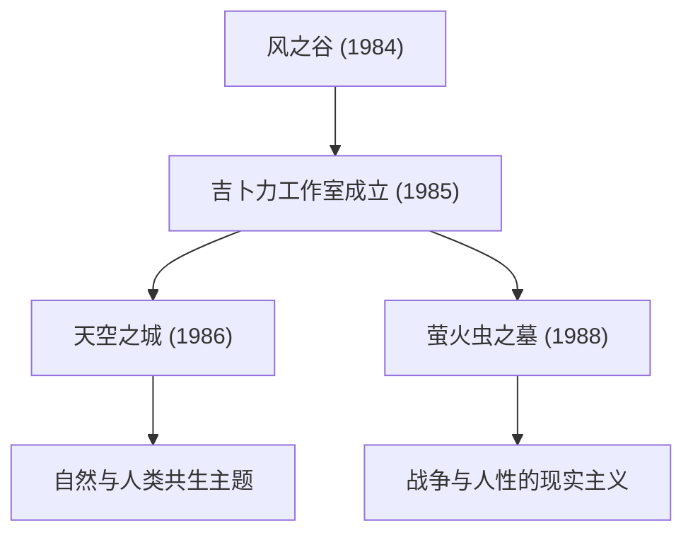

# 吉卜力电影的轨迹：动画描摹的生命与自然启示

吉卜力工作室已经超越了单纯动画制作公司的范畴，在日本乃至全球影像文化中占据着独特地位。自1985年成立以来，以宫崎骏与高畑勋这两位天才创作者为核心，诞生了无数载入史册的杰作。本文将结合物理学、历史及技术视角，深入探讨吉卜力工作室的历史、技术演进以及贯穿各部作品的主题变迁。

## 吉卜力工作室的创立与早期的挑战

吉卜力工作室的历史始于1984年上映的《风之谷》所取得的成功。严格来说，这部作品创作于吉卜力成立之前，但在其制作过程中培养的团队默契与积累的资金，成为了后来创立工作室的基石。

创立之初推出的《天空之城》，将使用赛璐珞胶片的传统手绘动画技术推向了极致。特别是在飞行石的光芒与云层的表现上，充分运用了当时的光学合成技术。通过手绘赛璐珞胶片与摄影时的滤镜处理来再现光线的散射与折射等物理现象，这一技术大幅提升了当时世界动画的水准。

## 经济增长与日常的奇幻：80年代后半期至90年代

在日本沉浸于泡沫经济繁荣之时，吉卜力进行了一项前所未闻的挑战——将《龙猫》与《萤火虫之墓》同时上映。一部描绘昭和三十年代田园诗般的自然与生灵，另一部则描绘第二次世界大战末期的悲惨现实。正是这两个截然相反的维度，象征了吉卜力所具备的多面性。

在技术层面，从这一时期开始，利用多层式摄像机（Multiplane Camera）表现纵深感的手法变得更加成熟。将背景画分为多个层次放置，并以不同速度移动，从而在二维画面中产生物理层面的立体感（视差效果）。这种视觉巧思可以说是后来数字化时代利用3DCG进行空间表现的先驱。

## 生态学与神话想象力：《幽灵公主》的震撼

1997年上映的《幽灵公主》对于吉卜力工作室而言，无论在技术上还是主题上，都是一个巨大的转折点。本片描绘了森林诸神与人类之间惨烈的对立，展现了无法用善恶二元论简单概括的深刻寓意。

在此尤为值得关注的，是动画中对流体力学的表现。在邪魔神周身缠绕的诅咒涌动、飞溅的鲜血以及水流的呈现上，部分引入了数字技术（CGI）。然而，其核心依然立足于动画师亲手对物理法则的观察与重构。无论是具黏性物体的运动，还是顺应重力坍塌解体物体的质感，这种直观把握牛顿力学并予以夸张和变形描摹的技术，令全球创作者为之赞叹。

## 迈向数字化与国际盛誉：《千与千寻》

2001年的《千与千寻》刷新了日本影史票房纪录，成为一部现象级的大作，并荣获奥斯卡最佳动画长片奖，奠定了其全球公认的崇高地位。

从这部作品开始，吉卜力从传统赛璐珞手绘彻底转向了数码上色。然而，他们并没有将数字技术单纯当作“追求效率”的工具，而是将其用于“拓展表现力”。在融入无限色彩色阶、复杂光源处理、通透水流质感等数字特有的物理模拟的同时，建立了一套绝不破坏手绘温度的独特制作流程。

## 高畑勋的革新与现实主义的极致：《辉夜姬的物语》

在宫崎骏通过奇幻描摹世界的同时，高畑勋则始终在进行重新审视动画框架本身的前卫挑战。其集大成之作便是《辉夜姬的物语》。

在这部作品中，特意采用了断断续续的素描线条与如水彩画般清淡的色彩，采用了一种让观众在脑海中对画面进行“自我补完”的高度心理学手法。在动能爆发般的狂奔场景中，通过粗犷笔触描绘背景，在视觉上展现出近乎相对论式的空间扭曲与极速飞驰感。这是一种与写实主义截然相反、巧妙利用人类知觉与认知机制的表现手法。

## 面向未来的传承与动画的无限可能

吉卜力工作室的作品群绝不仅仅停留在娱乐层面，它始终在拷问着人类所面临的环境问题、与科技的相处之道，以及“生存”的本源意义。从赛璐珞胶片到数字化的变迁、对模拟质感的执着追求，以及时刻面对时代的真诚态度。这一道道轨迹，向我们展示了动画这一表现媒介所蕴含的无限潜能。

在吉卜力所描绘的世界里，哪怕是一阵微风的拂动、一泓水波的闪烁，都蕴藏着生命的呼吸与物理法则之美。在未来的岁月里，我们依然需要不断解读他们留下的深刻启示，并将其传承给新的一代。
