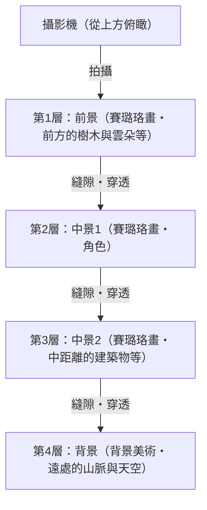
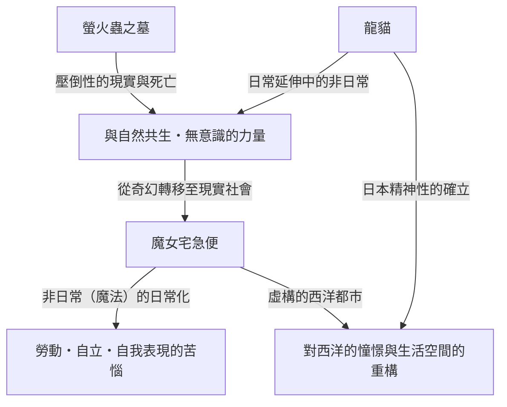
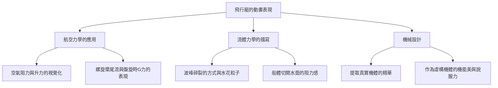
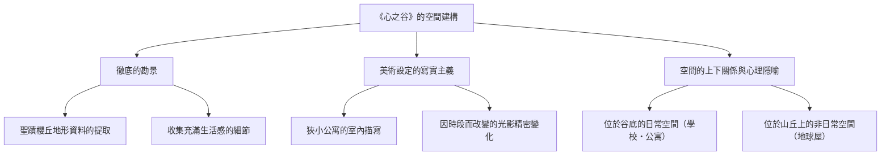
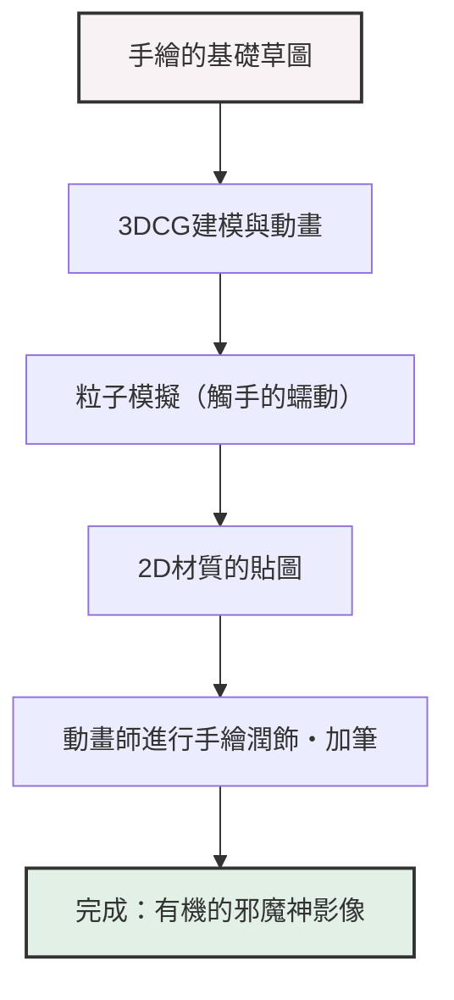
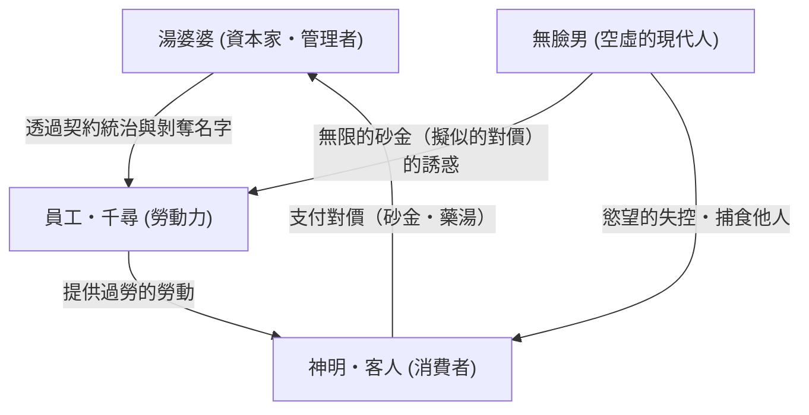
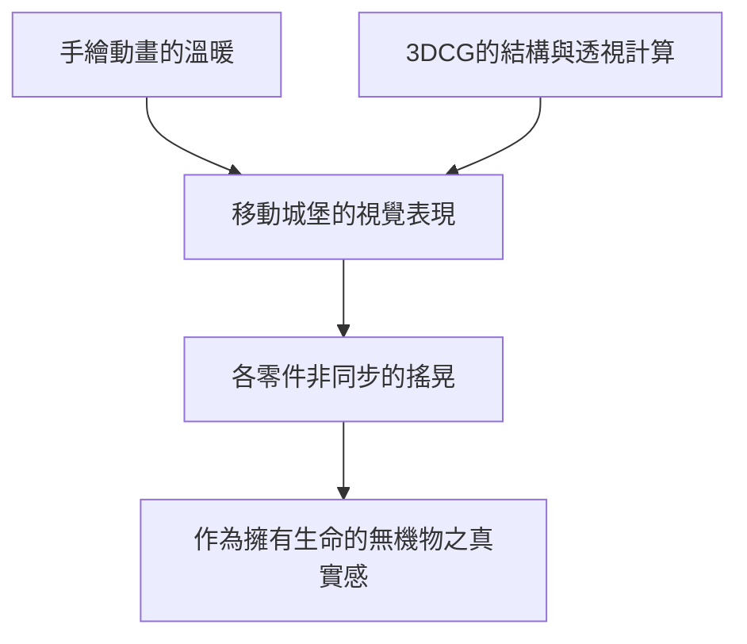
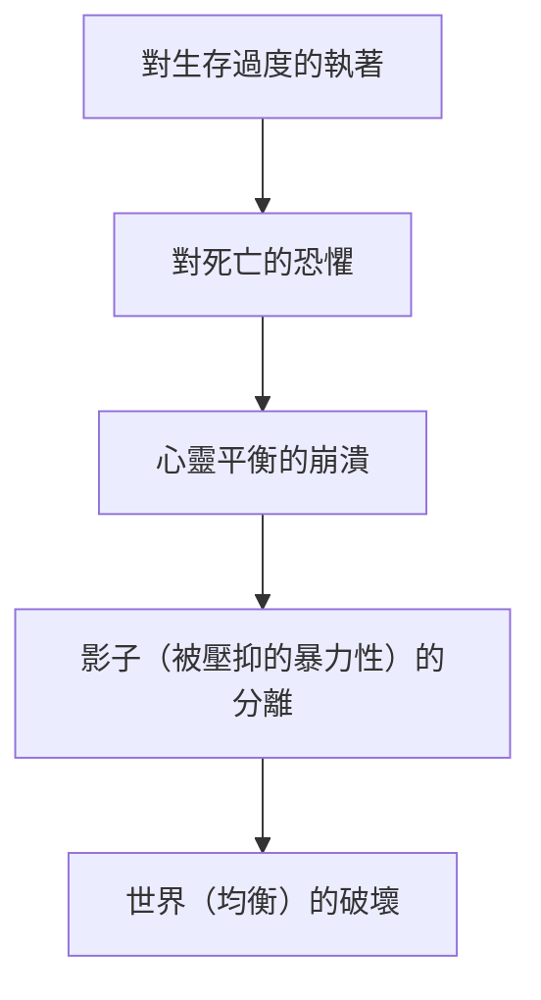
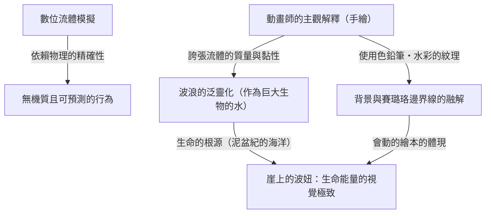
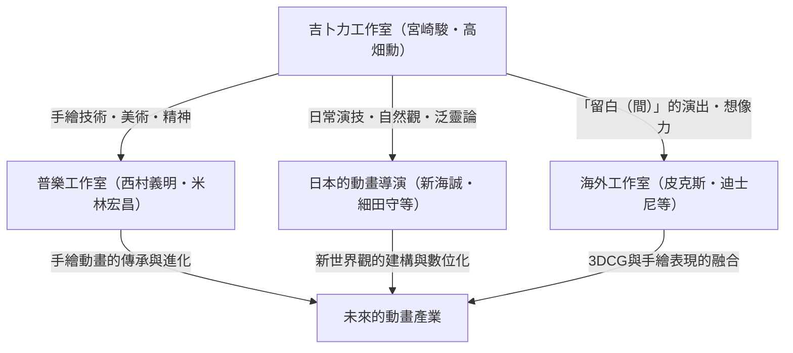

# 第1章：創立與初期的傑作（風之谷、天空之城）

## 1.1 動畫史上的特異點，吉卜力工作室的誕生

俯瞰日本動畫產業，甚至世界動畫史，我們無法忽視1980年代中期發生的一件「事件」。那就是吉卜力工作室的成立。吉卜力的歷史，不僅僅是一家企業、一個製作工作室的歷史，更是賽璐珞這種類比技術所能達到的表現極點，以及動畫這種媒介所具備的「大眾性」與「藝術性」奇蹟般融合的歷史本身。本章將在梳理吉卜力工作室創立經過的同時，聚焦於其具備實質起點意義的《風之谷》（1984年），以及以吉卜力工作室名義推出的首部作品《天空之城》（1986年），論述高畑勳與宮崎駿這兩位天才如何突破動畫表現的極限。

在吉卜力工作室成立前夕，日本的電視動畫憑藉「有限動畫（Limited Animation）」手法取得了獨特的進化。相對於每秒充分使用24格的迪士尼式全動畫，這種減少張數卻同時大量使用靜止畫與運鏡（平移、傾斜等）來營造動態感的手法，雖始於削減成本的必要之惡，卻在不知不覺中確立為獨特的影像語法。然而，高畑勳與宮崎駿的目標並未侷限於此。他們渴望將自東映動畫（現為東映大動畫）時期便培養出的對空間的精密建構、生活演繹的真實感，以及最重要的是「對運動的根本性喜悅」的追求，在劇場版長篇這個最高規格的形式中實現。

## 1.2 高畑勳與宮崎駿的作者性：客觀性與主觀性的奇蹟交會

為了深入理解吉卜力工作室的作品群，必須掌握構成其核心的高畑勳與宮崎駿這兩種截然不同的才華特質，以及它們之間的交互作用。兩人皆出身於東映動畫，透過工會活動等結下了深厚的羈絆，但作為動畫導演的志向可以說是處於完全的兩極。

宮崎駿的作者性，特徵在於壓倒性的「主觀空間認知」與「運動的拜物教（Fetishism）」。宮崎筆下的畫面，有時超越了物理法則，卻擁有直接訴諸觀者身體感官的強烈說服力。飛行場景中的漂浮感、帶有巨大質量的物體移動時彷彿能感受到重低音般的重量感，以及微細的氣流與水面波光等，整個世界如同生物般蠕動的感覺，都是將宮崎腦中的願景透過動畫師的身體定格於賽璐珞畫上的結果。他在構圖（Layout）中，大量使用廣角鏡頭般的變形與獨特的透視法，巧妙地控制畫面的深度與動線。

相對地，高畑勳的作者性在於徹底的「客觀性」與「邏輯建構」。正因為高畑本身是一位不畫圖的導演，他才能夠從更高一層的後設視角來俯瞰動畫畫面。他的執導，著重於將角色的心理、社會結構，乃至日常微小動作的真實感推向極致。從空間配置、照明，到角色的動機賦予，一切都建立在精密的計算之上；在促使觀眾投入情感的同時，也始終具備如布萊希特式的疏離效果，讓觀眾從退一步的視角觀察世界。

這「主觀、直覺的宮崎」與「客觀、邏輯的高畑」兩種才華，互相牽制、互相尊敬，成為撐起同一家工作室的棟樑，正是孕育出吉卜力豐饒作品群的最大原動力。在早期的吉卜力作品中，高畑以製作人的身分控制宮崎的暴衝，同時穩固了作品的骨幹，發揮了極其重要的作用。

## 1.3 賽璐珞動畫的技術特異點與多層式攝影機

吉卜力工作室的驚人之處，不僅在於主題的深奧，更在於支撐它的壓倒性技術實力。尤其是在從《風之谷》到《天空之城》的這個時期，類比賽璐珞動畫技術正迎來一個完成型，或者說達到了「技術特異點」。

吉卜力作品畫面所具備的壓倒性資訊量與存在感，是由精密繪製的背景美術，以及層層疊加的賽璐珞圖層所創造出來的。在這裡特別值得一提的，是使用「多層式攝影機（Multiplane Camera）」達到空間表現的極致。

多層式攝影機，是一種在攝影機下方設置多層玻璃（層架），並在每層放置賽璐珞畫或背景畫進行拍攝的裝置。藉此，當攝影機移動（平移、傾斜、推進等）時，透過改變各層的移動速度，可以產生擬似三維的深度（視差）。這項技術本身是迪士尼等公司自古以來就在使用的，但吉卜力在運用多層式攝影機的精密與複雜程度上，可以說是出類拔萃。

宮崎作品中不可或缺的「飛行場景」，正是最大程度受惠於這項技術的結果。例如，眼下展開的雲海、穿梭其間飛行的飛行艇，以及更深處可見的大地等複雜的空間，因為各層以不同的速度流動，觀眾會獲得彷彿真的在空中飛行般強烈的空間認知與沉浸感。此外，還有從賽璐珞畫背面打光的「透過光」技術、使用噴槍（Airbrush）描繪出微妙漸層的表現，加上為了讓隨風搖曳的花草能一幕幕手繪動起來而投入的近乎瘋狂的作畫心力，讓畫面中吹起了風、流動著空氣。在數位技術（CGI）不存在的時代，他們驅使物理性的底片、顏料與光影魔術，建構了比現實更為真實的虛擬空間。

## 1.4 《風之谷》（1984年）：作為前史的金字塔與生態學的深層

1984年上映的《風之谷》，正式而言是吉卜力工作室成立前由「Topcraft」製作的作品，但它由宮崎駿擔任導演、高畑勳擔任製作人這樣的陣容打造，並決定了後來吉卜力方向性，因此被定位為具備實質意義的「第0部」或「第1部」作品。

本作以宮崎駿親自在月刊雜誌《Animage》上連載的同名漫畫為原作，電影版將其序盤部分重新構成，作為一個獨立的故事完結。《風之谷》在動畫史上刻下的最大功績，在於將「環境問題（Ecology）」、「生命的尊嚴」以及「人類的愚行」這些極其沉重的科幻主題，在娛樂的框架內，並且以壓倒性的影像美呈現出來。

被稱為「火之七日」的最終戰爭導致產業文明崩潰後的1000年。散發著有毒瘴氣、被稱為「腐海」的菌類森林不斷擴大，這是一個由巨大蟲類統治的世界。這種令人絕望的世界觀設定，反映了宮崎對冷戰下核戰的恐懼，以及日益嚴重的環境破壞的強烈危機感。然而宮崎並沒有陷入單純的「自然保護」或「人類之惡」這種二元論中。腐海其實是為了淨化被污染的地球而存在的系統，劇中這一個巨大的反轉，直指自然界所具備的可怕自我恢復能力，以及在它面前人類的渺小。

從技術層面來談論《風之谷》時，不可或缺的是以「王蟲（Ohmu）」為首的巨大蟲類的表現。擁有多個體節與眼睛的異形生物如波浪般前進的動畫，是透過使用橡膠的特殊作畫技法（將多個賽璐珞零件錯開拍攝的手法等）與精密的時機計算，產生了壓倒性的重量感與詭異感，以及某種神聖感。此外，在駕駛梅維（娜烏西卡乘坐的飛行具）飛翔的場景中，讓人感受到風阻的布料動態，以及彷彿將重力與升力的關係視覺化般流暢的軌跡，向世界展示了宮崎動畫的真髓——「飛行的淨化作用（Catharsis）」。

娜烏西卡這位女主角的塑造也極具革命性。她不只是個單純「需要被保護的少女」，而是親自駕駛梅維、開槍、揮劍的戰士，同時又對所有生命抱持著深厚慈愛的母性存在。這個兼具堅強與溫柔、憤怒與悲傷的複雜角色形象，不僅成為後來吉卜力作品，更是現代虛構作品中女性英雄形象的一個頂點與原點。

## 1.5 吉卜力工作室設立與《天空之城》（1986年）：究極的冒險活劇

承接《風之谷》的成功，以其利潤為本錢，1985年「吉卜力工作室」正式設立。設立的目的只有一個，那就是「持續製作高品質的劇場版長篇動畫」。為與電視動畫的粗製濫造劃清界線，並作為追求不妥協品質的獨立據點，吉卜力應運而生。

隨後在1986年，以吉卜力工作室名義推出的首部紀念性長篇作品《天空之城》上映。本作以宮崎駿在小學時代構思的想法為基礎，並以斯威夫特《格列佛遊記》中登場的浮島拉普達為母題，融入了少年與少女的相遇、神祕的飛行石、空中海賊，以及懷抱邪惡野心的軍隊等，古典冒險活劇（Boy meets girl）的王道元素一應俱全，可謂「活劇之極北」的傑作。

《天空之城》的精彩之處，在於令人屏息的故事推進力，以及對畫面每個角落都充滿異常執著的細節。從片頭朵拉一家襲擊飛行船（虎蛾號）的場景，到巴魯與希達逃入斯巴克溪谷的追逐戰，畫面始終是「動態」的。斯巴克溪谷的機械造型、蒸汽機關的活塞運動、齒輪的旋轉，以及礦車的疾馳。這些機械與交通工具並不僅是背景或道具，它們被描繪得彷彿自身就擁有生命般充滿躍動感。宮崎擁有的「對機械的愛」以及連「其散發的熱度與氣味」都想記錄下來的作畫熱情，賦予了虛構世界壓倒性的真實感。

在主題性上，《天空之城》提出的是「高度科技與人類的分裂」以及「與大地的連結」。曾經統治世界的拉普達帝國那超凡的科學力，最終成為毀滅自己的原因。電影的高潮，從崩潰的拉普達深處，抱著巨大飛行石的巨大「大樹」冉冉升向宇宙的景象，極具象徵意義。作為科技象徵的人造物崩毀，唯獨作為生命象徵的大樹留存，這個結局濃縮在希達的台詞中：「扎根土裡，和風一起生存。和種子一起越冬，和鳥兒一起歌頌春天。不管你有多少可怕的武器，操控多少可憐的機器人，離開了泥土就活不下去的。」這是延續自《風之谷》的、宮崎對現代文明的痛烈批評，也是回歸自然的普遍祈願。

此外，本作中由美術監督野崎俊郎與山本二三所帶來的背景美術貢獻更是無可估量。抵達拉普達時，雲海散去，長滿青苔的巨大庭園與機器人兵現身的場景那份靜謐之美，證明了動畫中的背景畫能在多大程度上決定作品的品格。動態的宮崎執導與靜態的美術，在這裡達成了完美的融合。

## 1.6 結語：傳說的開始

《風之谷》與《天空之城》。在這兩部早期的傑作中，宮崎駿與高畑勳，以及吉卜力工作室的員工們，將動畫這種表現手法所能擁有的潛力發揮到了極限。賦予空想產物的虛構機械重量與觸感，為想像中的生態系注入真實感，並將複雜的社會批評與哲學性主題，內含於男女老幼都能屏息觀看的娛樂之中。他們靠著龐大數量的賽璐珞畫與近乎職人狂熱的手工作業，完成了這項驚人的壯舉。

這兩部作品將技術與表現的標準提升到了遙不可及的高度，並作為「吉卜力這堵巨大的高牆」阻擋在後來的日本動畫界面前。同時，這個小小的工作室，終將掀起世界性的文化現象，並改寫動畫歷史本身，這兩部作品正是這部壯闊傳說名副其實的「第一章」。後來接續的《龍貓》、《螢火蟲之墓》，乃至走向《魔法公主》的道路，全部都是從這《風之谷》的風與《天空之城》的天空開始的。

# 第2章：日常與非日常的交會點——《龍貓》、《螢火蟲之墓》、《魔女宅急便》所描繪的世界

回顧吉卜力工作室的歷史，1980年代後半是一個具有決定性轉捩點的時期。有別於前作《天空之城》（1986年）所描繪的宏大「劍與魔法」或「飛行冒險活劇」，吉卜力將方向大幅轉向日本的原始風景或西洋平民的「日常」生活。本章將探討1988年奇蹟般同時上映的《龍貓》、《螢火蟲之墓》，以及1989年的大賣座作品《魔女宅急便》這3部作品，並徹底剖析它們在動畫史上刻下的技術與主題革命。

## 1. 同時上映的瘋狂與奇蹟：宮崎駿與高畑勳，兩個「昭和」

1988年春季，《龍貓》與《螢火蟲之墓》的同時上映，實現了在現代幾乎無法想像的發行形態。這不僅僅是商業上的包裝，而是吉卜力工作室這個組織，進一步說是宮崎駿與高畑勳這兩位天才創作者擦出火花的「瘋狂與奇蹟」的結晶。

### 1-1. 背對背的生與死
《龍貓》以昭和30年代（1950年代）的日本農村為舞台，描繪了自然精靈與孩子們交流的生命讚歌。另一方面，《螢火蟲之墓》則以昭和20年（1945年）二戰結束前後的神戶為舞台，以徹底的寫實主義描繪了在戰火中殞命的兄妹的悽慘現實。儘管時代設定僅相差約10年，但這兩部作品內含著「生與死」、「被理想化的奇幻與殘酷的現實」這種完全背對背的主題。

當時的吉卜力工作室，採用了幾乎可以說是無謀的製作體制——同時讓兩位巨大的天才運作。引發了作畫人員的爭奪戰，時程安排面臨破產的危機。然而，結果是這種嚴酷的環境將兩部作品的品質推向了極限。宮崎駿作為對高畑勳徹底寫實主義的反向命題，建構了《龍貓》這個更強大、無意識的生命力躍動的世界；而高畑為了對抗宮崎描繪的奇幻，將日本的動畫表現提升到了宛如紀錄片般的層次。

### 1-2. 昭和的描繪差異與「動畫紀錄片」的誕生
《螢火蟲之墓》中高畑勳的演出，破壞了傳統動畫的語法。B29轟炸機投下燃燒彈的軌跡、燃燒房屋中火焰的搖曳，以及最重要的，清太與節子因飢餓而衰弱的身體變化。為了表現這些，色彩設計保田道世等人徹底追求了傳統動畫色彩無法表現的「沾滿泥巴、血與煤灰的茶褐色」。

對比之下，在《龍貓》中，宮崎駿重新建構了他記憶中「過去可能存在過、美麗的日本」。這不僅僅是寫實，而是一種試圖將孩子視角下世界的「光輝」定格在賽璐珞畫上的嘗試。這兩種「昭和」的描繪差異，最大程度地證明了動畫這種媒介所能表現的振幅，並成為日本電影史上的金字塔。

## 2. 背景美術的革命：男鹿和雄與山本二三創造的「空氣與濕度」

吉卜力作品之所以擁有壓倒性的說服力，很大程度上不僅是因為角色的演技，更在於其背後展開的背景美術的力量。在這個時期，吉卜力工作室的背景美術迎來了一個頂點。

### 2-1. 男鹿和雄筆下「龍貓森林」的濕潤大氣
被拔擢為《龍貓》美術監督的男鹿和雄的功績，可以說改變了日本動畫美術的歷史。男鹿所描繪的自然，將廣告顏料的特性發揮到了極限。雖然使用的是不透明的廣告顏料而非透明水彩，但藉由絕妙的水分控制與筆觸，他成功表現出了日本風土特有的「濕氣」、「令人窒息的草香」，甚至是「樹葉縫隙間陽光的溫度」。

特別是在皋月與梅伊在下雨的公車站遇見龍貓的場景，背景美術堪稱傑作。被雨淋濕的柏油路質感、沉入黑暗的鎮守之森的深度、路燈光線營造出的空氣層。男鹿的美術不單純是「風景的臨摹」，而是將那裡吹拂的風、溫度、濕度等「看不見的資訊」視覺化的魔法。

### 2-2. 對西洋的憧憬與建築的寫實主義
另一方面，《魔女宅急便》的舞台柯里柯鎮，是一個融合了瑞典斯德哥爾摩、哥得蘭島的維斯比，甚至里斯本、巴黎等歐洲各個城市元素的虛構城鎮。這裡的背景美術，與描繪日本風景的《龍貓》有著截然相反的向量。

歐洲石造的建築物、綿延的瓦屋頂，以及通往海邊的坡道。為了具有說服力地描繪這些，吉卜力的美術人員進行了徹底的外景勘查與建築結構的學習。即使是一塊石頭的質感，也計算了風化的程度與太陽光的反射率，並翻譯成最適合動畫背景的色彩。將這種「對西洋的憧憬」不只停留在奇幻層面，而是描繪成現實中人們生活、勞動的空間，這份美術的力量令人驚嘆。

## 3. 《魔女宅急便》中的現代主題：「勞動與低潮」

《魔女宅急便》在上映當時，獲得了許多許多年輕人，尤其是職業女性狂熱的支持。其原因在於，這部作品表面上披著「魔女女孩的成長故事」的奇幻外衣，其本質卻是一齣圍繞著極其現代且普遍的「勞動與才華（低潮）」的真實戲劇。

### 3-1. 才華轉變為「勞動」的瞬間
主角琪琪運用與生俱來「在空中飛行」的魔法才華開始了快遞的工作。這與現代的創作者或自由工作者將自身的特長與才華作為「資本」參與社會的過程完全重合。初期的琪琪，在空中飛行是一種喜悅，也是自我表現。然而，當這變成「工作（勞動）」，面對客戶不合理的要求（如鯡魚派的橋段等），並收取金錢作為報酬時，魔法對她而言的意義便發生了質變。

### 3-2. 低潮與自我認同的喪失
故事中段，琪琪突然失去了魔法的力量，無法在空中飛行，也聽不懂黑貓吉吉的話。這既是青春期少女自我認同的動搖，同時也是創作者面臨「才華枯竭（低潮）」的完美隱喻。

在這裡扮演重要角色的是在森林小屋裡畫畫的女畫學生烏露絲拉。烏露絲拉對琪琪說：「這種時候只能掙扎了」、「畫、畫、拼命地畫」、「如果還是不行，就停止畫畫。散步、看風景、睡午覺，什麼都不做。」這段台詞，正是包含宮崎駿自身在內的動畫師們，乃至所有參與表現活動的人們所面臨的苦惱，及其處方箋本身。

### 3-3. 「用血飛行」的覺悟
烏露絲拉談到自己的畫作時說：「以前什麼都不想就能畫出來，但現在不一樣了。我必須畫出屬於自己的畫。」琪琪的魔法也是如此。單靠與生俱來的才華（魔法）就能飛翔的無意識時代已經宣告結束，她必須透過自己的意志與努力來「重新獲得」魔法。在故事的高潮，琪琪跨上長柄刷，面露拼命的神情飛上天空的場景，已經不再是優雅的奇幻。那是直面自己的極限，帶著彷彿要吐血般的意志行使「技術」的專業人士姿態。

## 4. 主題的結構與相互關係

這3部作品乍看之下各自擁有獨立的世界觀，但若以吉卜力的作者性為主軸來看，存在著明確的連續性與主題交會點。

《龍貓》所提出的「潛藏於日常中的非日常（奇幻）」，透過與《螢火蟲之墓》這種極限寫實主義的對比，獲得了更加堅固的神話性。而在那裡確立的表現手法與動畫技術，則成為《魔女宅急便》中描繪「非日常的存在（魔女）如何融入現代社會的日常（勞動）」這種逆向主題的強大武器。

## 5. 結語：通往下一個舞台的佈局

從1988年到1989年的這段時期，吉卜力工作室在短短數年內，走遍了「生與死」、「日本與西洋」、「奇幻與寫實」，以及「才華與勞動」等動畫所能描繪的所有極限。在這裡培養出來的，徹底觀察並描繪日常演技的技術，以及讓風景蘊含空氣與情感的背景美術之力，被繼承到後來的《兒時的點點滴滴》（1991年）與《紅豬》（1992年）等擁有更成熟、複雜主題的作品群中。

《龍貓》、《螢火蟲之墓》、《魔女宅急便》這3部作品，不僅僅是名作的羅列。它是記錄了動畫這種表現媒介，從兒童娛樂脫殼成為能描繪人類精神深淵與社會結構性苦惱的「綜合藝術」，那個最熱烈、也最痛苦的羽化瞬間的歷史紀念碑。

# 第3章：對飛行的憧憬與大人的浪漫——《紅豬》與《心之谷》中寫實主義的頂點

俯瞰吉卜力工作室的歷史，1990年代前半至中期發表的《紅豬》（1992年）與《心之谷》（1995年），乍看之下可能會讓人覺得是兩部位於極端的作品。前者以亞得里亞海為舞台，是一部描繪因詛咒而變成豬的賞金獵人飛行員的戰鬥與哀愁的奇幻作品；而後者則以現代的多摩新市鎮為舞台，是一部描繪中學男女生青澀戀情與對升學的糾葛的青春群像劇。

然而，貫穿這兩部作品的，是吉卜力工作室，或者更確切地說，是宮崎駿與近藤喜文這兩位稀世創作者，試圖運用動畫這種表現手法將「寫實主義（現實感）」追求至極限的無盡探求心。而在其根底，存在著對「飛行」——實體的在空中飛翔，或是超越自身極限在精神上飛躍——的強烈憧憬。本章將從歷史背景與技術論的雙面深入探討，這兩部作品在動畫史上佔據了多麼特異的位置，以及達成了什麼樣的技術與主題成就。

## 1. 《紅豬》——航空力學的極致與失落時代的輓歌

《紅豬》（原名：Il Porco Rosso）原本是作為日本航空機內放映用的短片企劃，後來卻在南斯拉夫內戰這真實世界的沉重陰影下，發展成了長篇電影，有著相當特異的出身。本作是宮崎駿為了自己，同時也是作為一部「獻給疲勞到腦細胞變成豆腐的中年男子的電影」而創作的，是一部帶有極其個人色彩的作品。

### 1.1 宮崎駿與飛機：對機械的拜物教與航空力學的精密描寫

宮崎駿對「飛行」的執著早已為人所知，而在《紅豬》中對飛行艇的描寫，可以說是他自身對機械的拜物教（Fetishism）與對航空力學的深刻理解以最純粹的形式表現出來的結果。本作中登場的飛行艇——主角波魯克・羅素的愛機，那架鮮紅色的Savoia S.21（其原型是混合了Macchi M.33與Savoia-Marchetti S.59等真實機體元素的獨創機型）、對手卡地士的機體，以及空賊聯盟的各式雜牌飛行艇——都不僅僅是背景或道具，它們本身就如同有自主意識的角色般躍動著。

特別值得一提的是，從空氣阻力、升力、螺旋槳的扭矩、引擎的震動，到從水面起飛、降落時的流體力學表現，動畫中「物理法則的虛與實」被控制在絕妙的平衡之中。

在波魯克的Savoia發動引擎的場景中，氣缸點火、機體全體開始微小震動、從排氣管吐出黑煙，這一連串的過程透過賽璐珞畫細微的震動與多重曝光（當時的類比拍攝技術）表現出來。在空戰（狗鬥）的片段中，飛行員承受盤旋時G（重力加速度）的肉體負荷，以及在接近失速邊緣控制機體的操縱桿與方向舵踏板的微小動作，都以極其準確的時機（畫格分配）被描繪出來。這是存在於宮崎駿腦中的「飛行身體感」，透過動畫師們的手，完美地描摹在賽璐珞底片上的結果。

### 1.2 響徹亞得里亞海空的對法西斯主義抵抗與無政府主義

本作的舞台是1920年代末的義大利，亞得里亞海。作為時代背景，這是一個第一次世界大戰的傷痕猶存，由墨索里尼率領的法西斯黨逐漸抬頭的狂躁與不安的時代。波魯克・羅素（本名馬可・帕哥特）曾經是義大利空軍的王牌飛行員，但他對國家與軍隊這個體制感到絕望，對自己下咒變成了豬，選擇了作為賞金獵人這種法外之徒（無政府主義者）生存的道路。

波魯克那句著名的台詞「與其當法西斯，我寧願當一隻豬」，不單純只是一句硬漢式的耍帥台詞。那是宮崎駿自身強烈的反法西斯與無政府主義的表態，拒絕被編入國家這個巨大的暴力裝置之中，而在天空這個無國界的空間裡尋求個人的自由與尊嚴。

電影後半段，波魯克與昔日戰友法拉林（現為法西斯空軍少校）在電影院密會的場景，濃厚地反映了本作的政治背景。法拉林抱怨道：「我現在不得不背負著國家、民族這種無聊的贊助商來飛行。」這裡冷徹地描繪了純粹在空中飛翔的喜悅，是如何變質為國家意識形態與戰爭工具的過程。波魯克變成豬的原因雖然沒有明示，但那是對人類互相殘殺這種荒謬世界深深的絕望，是為了將自己從強迫同化的社會中疏離出來的防衛機制，抑或可說是「如果保持人類的樣貌就無法維持作為人的尊嚴」這種矛盾的表現。

### 1.3 「不會飛的豬，就只是隻平凡的豬」——中年男子的浪漫、挫折與詛咒

《紅豬》之所以能緊緊抓住許多成年人的心，是因為本作是一首獻給「已逝事物」的哀切輓歌（Elegy）。波魯克對在第一次世界大戰中隕落的戰友們（幻影中的飛機升向雲之平原的場景，是電影史上留名的經典畫面）抱持著強烈的失落感與倖存者內疚（Survivor's Guilt）。

正如吉娜所演唱的香頌《櫻桃結果時》（Le Temps des cerises）（被廣泛認為是哀悼巴黎公社瓦解的歌曲）所象徵的那樣，這部電影充滿了對逝去的美好時代、永遠無法觸及的青春，以及不可逆轉的喪失的深深懷舊之情（Nostalgia）。波魯克與吉娜之間那種成熟、卻始終保持著永不交集距離感的大人戀愛描寫，在吉卜力作品中佔據了特異的位置。波魯克以「詛咒」為藉口，也有逃避吉娜的愛情或參與現實社會的一面。在「所謂帥氣，就是這麼一回事。」這句宣傳語背後，隱藏著為貫徹自己的美學而殉道的孤獨，以及接受自己逐漸落後於時代這種痛切的「中年男子的自我接納」故事。

## 2. 《心之谷》——青春期痛切的寫實主義與空間魔法

1995年上映的《心之谷》，由宮崎駿擔任製作、編劇與分鏡，並由身為吉卜力工作室核心動畫師的近藤喜文擔任唯一一部長篇導演的紀念碑式作品。雖然以柊葵的同名少女漫畫為原作，但在宮崎與近藤的手中，本作超越了單純愛情故事的框架，昇華為一幅描寫在升學、才華，以及自我實現的不安中搖擺的青春期真實肖像。

### 2.1 近藤喜文的眼光：日常舉止中蘊含的動畫真髓

本作最大的魅力，同時也是可以被稱為技術成就的，是近藤喜文導演對「日常演技」徹底的堅持。在動畫中，比起描繪魔法、爆炸、機器人戰鬥這種「非日常的（奇觀）」動態，要準確且伴隨情感地描繪人走路、坐下、泡茶、跑上樓梯等「不經意的日常動作」，被認為是困難得多的。

近藤喜文曾擔任高畑勳導演作品（《螢火蟲之墓》、《兒時的點點滴滴》等）的作畫監督，是一位將角色的骨骼與肌肉的運動、重心的轉移，以及心理狀態反映在動作上的「生活演技」達人。在《心之谷》中，他卓越的觀察力得到了充分的發揮。

例如，主角月島雫在圖書館看書時姿勢的變化、著急地下樓梯時的步伐，或是在夾雜著愛慕與煩躁的狀態下，與天澤聖司互動時視線的推移與聳肩的方式。這些每一個微小的動畫細節，都產生了一種強烈的存在感，讓人感覺到名為雫的少女確實存在於那裡並呼吸著。這與在奇幻世界中飛翔的宮崎動畫的快感不同，是腳踏實地描繪「人類生活」的動畫真髓。

### 2.2 勘景與空間建構：多摩新市鎮這個「活著的城鎮」

本作的另一個主角，是作為舞台的城鎮本身。基於在東京都聖蹟櫻丘（多摩新市鎮近郊）周邊進行的徹底實地勘景，本作的美術背景以驚人的真實感被建構出來。

以美術監督黑田聰等人繪製的背景畫，完美地描繪出了公寓那無機質的混凝土質感、陡峭的坡道、狹窄的後巷，以及黃昏的街景。特別值得注意的是對雫居住的「狹窄公寓」的描寫。滿溢而出的書本、雜亂的餐桌、有著雙層床的狹窄姊妹房間。這種令人喘不過氣（卻又帶有溫暖）的真實生活空間描寫，支撐著雫「想逃離這裡，前往更廣闊的世界」這種對飛翔的渴望（＝想寫故事的衝動）。

此外，城鎮的地形（高低差）完美地發揮了心理隱喻的作用。雫的日常（學校和公寓）在「下方」，而被不可思議的貓（阿月）引導到達的古董店「地球屋」則在爬完陡坡的「山丘上」。這個高低差，在視覺上直接表現了雫精神上的向上志向，以及踏入未知領域的困難。

### 2.3 創作的熱源與自我實現的痛苦：男爵引導的「內在飛行」

《心之谷》是一部愛情電影，同時也是一部強烈的「創作者自我啟發故事」。面對朝著小提琴工匠這個明確目標準備去義大利留學（飛行）的聖司，抱持焦躁感的雫，為了確認自己心中的「原石」，開始寫起故事（《心之谷》劇中劇的奇幻小說）。

這裡有趣的是，在劇中劇的世界裡，插入了雫與貓男爵一起「在空中飛翔」的片段。這個由以「依巴拉度」聞名的畫家井上直久負責背景美術的夢幻場景，描繪了與《紅豬》的實體飛行截然相反的，作為想像力解放的「內在飛行」。

然而，本作並沒有以單純的美夢結束。在不眠不休地寫完小說並請地球屋的主人讀過之後，雫痛切地意識到自己的作品還很粗糙且不成熟，因而嚎啕大哭。面對創作這堵殘酷的牆，並了解到自己才華的極限（若只是原石便不會發光），這個場景的痛切刺痛了所有從事創作的人的心。宮崎駿與近藤喜文避免了描寫輕易的成功，而是透過中學少女的身影，描繪了「即使如此也必須不斷削磨、持續打磨」的嚴格職人倫理。

## 3. 結論：飛機與小提琴，各自的「職人」們的故事

《紅豬》與《心之谷》。馳騁在亞得里亞海天空的中年豬，與騎著自行車衝上多摩新市鎮坡道的中學生。這兩個乍看之下毫無交集的故事，卻以「對職人精神的尊敬」這個主軸緊密地連結在一起。

完美修理、改裝波魯克愛機的保可洛公司的菲兒與女性員工們。還有在克雷莫納努力修行製作小提琴的聖司，以及持續修理古董鐘錶的地球屋主人。吉卜力作品始終如一地，奏響著獻給那些親手創造事物、不斷磨練技術的「職人（Artisan）」們的無上讚歌。

就像波魯克為了守護天空的自由而戰一樣，雫也為了編織自己內在的聲音（故事）而拿起文字作為武器。實體的「飛行」與想像力的「飛躍」。雖然表現的手法不同，但吉卜力工作室在這個時期達到的寫實主義極致，是將反抗現實世界的重力（社會的羈絆與自身的極限），卻依然試圖高高飛起的人類崇高意志，以壓倒性的影像美燒錄在底片上。在下一章中，我們將論述這種徹底的寫實主義與自然主義，在與神話想像力結合後孕育出的前所未聞的史詩——《魔法公主》中自然與人類的相剋。

# 第4章：生態學與神話想像力（魔法公主）

1997年上映的《魔法公主》，在吉卜力工作室以及宮崎駿導演的職業生涯中，是一部作為明確分水嶺的紀念碑式原型作品。本作超越了單純動畫電影的框架，帶來了足以改寫日本電影史本身的巨大文化與產業衝擊。本章將極度詳細地解讀該作品所具備的多層次主題性——日本中世紀史的解構、非二元論的善惡相位，以及作為技術轉捩點的CG（電腦動畫）與傳統賽璐珞動畫的融合。

## 1. 產業脈絡：製作費的爆發與票房紀錄的更新

《魔法公主》的製作，對吉卜力工作室而言是一項史無前例、賭上公司命運的巨大計畫。從一開始宮崎駿導演就抱著「這可能會是最後的引退之作」的覺悟來面對，其不妥協的作者主義讓製作期間與預算無上限地膨脹。總製作費據說約為20億日圓，對當時的日本電影來說這是一個脫離常軌的金額。作畫張數達到約14萬4000張，這相當於普通長篇動畫的2到3倍。

為了回收這個巨大的風險，製作人鈴木敏夫展開了史無前例規模的媒體組合與宣傳策略。由糸井重里創作的鮮明宣傳語「活下去。」（生きろ。），作為對籠罩當時日本社會的世紀末、封閉氛圍（阪神淡路大地震與地下鐵沙林毒氣事件等1995年的創傷）的一種回答發揮了作用。

結果，本作創下了1420萬觀影人次、193億日圓票房收入的紀錄。大幅刷新了當時日本電影的歷代票房紀錄（由《E.T.》保持的紀錄），確立了吉卜力工作室在日本作為「國民電影」不可動搖的地位。這個產業上的成功，證明了日本動畫即使處理適合成人的沉重主題也能成為巨大的商業項目，對後來的動畫產業商業模式產生了深遠的影響。

## 2. 時代設定與神話重建：為什麼是室町時代

宮崎駿刻意選擇了「室町時代」這個日本史的過渡期作為本作的舞台。他沒有選擇傳統時代劇喜歡描繪的江戶時代（身分制度固定化、和平且受統治的社會）或戰國時代（武將們的權力鬥爭），而是選擇了充滿混沌的室町時代，這背後有著深刻的思想意圖。

室町時代是從以農業為中心的社會向貨幣經濟過渡、手工業發達，以及最重要的是「人類科技對自然界的優勢」開始明確顯現的時代。製鐵（踏鞴吹煉）全面展開，伴隨而來的是森林砍伐的加劇；但另一方面，群山中仍殘留著深邃的原始林，人們相信神明確實存在。也就是說，這是一個神與人，或者說近代與前近代激烈衝突、相剋的邊界時代。

受到歷史學家網野善彥關於「非農業民（職人、商人、遊女、藝能民等）」的研究（無緣・公界・樂）強烈影響的宮崎，解構了傳統「瑞穗之國」這種同質性的日本史觀。電影中登場的達達拉城，被描繪成一種天皇或大名統治不及的庇護所（避難所・自由領域）。在那裡，被社會邊緣化的痲瘋病患（病者）或被賣掉的女人們，藉由生產鐵這種高度的技術能力獨立自主，建立起獨特的烏托邦。

如此一來，《魔法公主》不僅僅是一部奇幻作品，更是一次照亮歷史暗處，從神話層面重構日本人認同與自然觀的嘗試。

## 3. 黑帽大人與小桑：善惡的非二元論

本作最具劃時代意義的一點，在於完全放棄了舊有ハリウッド（好萊塢）式，或者迪士尼式的「勸善懲惡」典範。它沒有將破壞自然的一方——人類單純地定罪為「惡」，反而是強而有力地描繪了他們生存的營生與尊嚴。

其象徵就是達達拉城的領袖黑帽大人。她既是殺死山神、開墾森林的破壞自然的元凶，同時也是保護被社會遺棄的弱者、給予他們生存目的與尊嚴的卓越人道主義者，甚至可說是一名革命家。黑帽大人絕非為了私慾而破壞森林。人類為了擺脫貧困與歧視，為了自立生存下去，除了征服自然、生產鐵之外別無他法。這種「良善的動機結果卻侵犯了他者（自然）的領域」的矛盾，正是人類業障的本質。

相對的，小桑（魔法公主）是被人類拋棄，由山犬養大的少女。她憎恨人類，為了保護森林而想要黑帽大人的命，但她自己也是個無法完全成為「野獸」的邊界存在。阿席達卡站在這兩種無法相容的正義——「人類生存的權利」與「自然的神聖性」——之間，試圖「以澄澈的雙眼看清事實並做出決定」，但他自己也找不到明確的解決方案。

在故事的結局中，山獸神（鹿神）在還回頭顱後消滅，太古的森林消失了。然而，達達拉城也崩毀了，人們發誓「要從頭開始，把這裡建立成一個好村莊」。阿席達卡和小桑選擇了共同生存，但他們並沒有住在同一個屋簷下。阿席達卡住在達達拉城，小桑住在森林裡，採取了「偶爾去見你」的共存形式。這拒絕了人類與自然之間完美和諧這種廉價的淨化作用，是在永遠持續的緊張關係中「活下去」這句殘酷卻充滿希望的訊息。

## 4. 技術轉捩點：CG與手繪動畫的高度融合

《魔法公主》也應該被銘記為吉卜力工作室首次全面導入電腦動畫（CG）的作品。宮崎駿多年來對手繪（賽璐珞動畫）的職人技術有著絕對的堅持，但為了實現本作必須表現的壓倒性動態感與複雜度，數位技術的導入是不可避免的。

然而，吉卜力的CG運用並非轉向全3DCG，而是始終作為擴張、補充手繪表現力的「數位合成（Digital Composite）」與「3D/2D的融合」。CG鏡頭在全1620個鏡頭中僅佔100多個，但其效果卻是巨大的。

### 邪魔神的表現

最具象徵性且技術難度最高的，是片頭邪魔神（受到詛咒的豬神）的表現。無數如蛇般的觸手（蛇狀的詛咒）蠕動著，如泥巴般糾纏前進的描寫，對手繪動畫師來說將會是如惡夢般的工作量。

在這裡，製作團隊採用了結合3DCG粒子（Particle）模擬與手繪作畫的手法。首先用3DCG建構觸手的基本動作與骨架，並貼上手繪的材質（Texture）。接著，動畫師在那層CG素材的上方，以手繪進行加筆（潤飾），從而消除了CG特有的無機質冰冷感，達到了有機且生動、簡直就是「怨念」本身的表現。

### 數位貼圖與充滿動態的運鏡

另一個創新是背景畫（美術）的數位處理。在傳統的賽璐珞動畫中，讓攝影機環繞拍攝這類立體的平移（Pan）鏡頭，必須依賴將背景扭曲繪製這種極其高度的職人技術（透視計算）。

在《魔法公主》中，阿席達卡離開村莊的場景，以及表現山獸神森林深處的場景，使用了「3D貼圖（3D Mapping）」技術：將美術人員手繪的美麗背景畫，作為材質貼在用3DCG建構的地形模型上。這使得在保持手繪的溫暖與繪畫般的美感的同時，也能實現如真人電影般空間的深度，以及縱橫無盡移動的動態運鏡。

此外，山獸神腳下的植物在瞬間發芽、成長然後枯萎的生命循環，也是驅使變形（Morphing）技術與數位合成表現出來的。就這樣，《魔法公主》中的CG絕非用來炫耀技術，而是作為將宮崎駿腦中那神話且令人目眩的願景定格在現實銀幕上不可或缺的畫筆（工具）而發揮作用。

## 結語

《魔法公主》是吉卜力工作室達到的一個極北之境。它深植於日本中世紀這個歷史土壤，但其中講述的生態問題與善惡的非二元論，在現代全球社會中卻開始具有越來越現實的意義。而手繪與數位以奇蹟般的平衡融合出的影像美，誇耀著空前絕後的完成度。在下一章《第5章：日常的魔法與鄉愁（神隱少女）》中，我們將探討從這種神話的規模轉變，潛入現代少女心象風景的吉卜力的新轉向。

# 第5章：數位轉型與世界級評價（神隱少女、貓的報恩）

在吉卜力工作室的歷史中，2000年代初期是在技術、表現手法以及商業層面上最具戲劇性轉折的時代。本章將以專業的視角極度詳細地闡述，從賽璐珞動畫轉向全數位環境是如何將吉卜力作品的影像表現推向了前所未有的領域，以及其結出的碩果《神隱少女》（2001年）和作為為下一代佈局的《貓的報恩》（2002年），是如何跨越日本國內的框架，帶來什麼樣的世界級評價與文化影響。

## 1. 從類比到數位：吉卜力工作室的技術典範轉移與美學重構

動畫製作中的「數位化」，不僅僅意味著作業的效率化或成本的降低。它是一種將畫面內存在的所有視覺元素完全轉化為數值資料以進行控制的，影像製作根本上的典範轉移。吉卜力工作室導入數位技術，是在1997年的《魔法公主》中對邪魔神觸手的蠕動、迪達拉波奇（山獸神化身）半透明的質感、部分3DCG背景等方面進行了實驗性的嘗試，隨後在1999年的《隔壁的山田君》中全面採用了數位上色。然而，在宮崎駿導演的作品中，能保留傳統賽璐珞動畫所具有的生動質感，同時在數位空間中精密地將其重構，完全達成這項艱難挑戰的，正是首次以全數位製作的《神隱少女》。

由於完全轉向全數位體制，製作現場不再有物理性的「賽璐珞畫」或「動畫用顏料」。確立了將畫在紙上的原畫、動畫用掃描器高解析度讀取，並在軟體上進行數位上色的工作流程。藉此，工作室終於從類比時代特有的物理限制（例如將多張物理賽璐珞畫疊加會產生透過光的衰減導致畫面變暗，以及賽璐珞畫刮傷或混入灰塵）中解放出來。

更具革命性的是「攝影（合成）」工程中表現力飛躍性的提升。畫面上的物件（角色、前方的那骨、深處的建築物、特效等）可以被分割成無限的圖層，並讓每一層擁有不同的焦深（景深），這種模仿真人電影攝影機鏡頭的高度多層次景深表現成為可能。在類比時代使用多層式攝影機裝置最多只能疊加幾層的空間表現，在數位空間中可能擁有無限的階層，使得油屋高聳入雲的巨大感，以及通往深淵的樓梯那深不見底的深度，能以壓倒性的透視感逼近觀眾的眼前。

## 2. 色彩設計・保田道世的煉金術：全數位上色帶來的色彩表現無限擴張

這場數位轉型最大的受益者是「色彩」這個元素。從吉卜力工作室創立以前便長期支撐宮崎駿、高畑勳作品色彩設計的天才色彩師保田道世，透過完全轉向數位上色，成功地為畫面施展了前所未有的魔法。

在使用物理顏料的時代，可使用的顏色數量有著明確的極限。一部作品所使用的顏料種類上限約為數百種，為了表現複雜的陰影或黃昏時微妙的環境光變化，只能在有限的調色盤中尋求錯覺般的效果。然而，轉向數位環境後，理論上可以處理約1677萬色（24bit色彩）這種無限的顏色數量。

在《神隱少女》中，保田道世運用這個無限的調色盤，並非為了「標新立異的迷幻配色」，而是為了「徹底重現實境環境光」與「角色精密的感情表現」。千尋誤入的不可思議的小鎮，以及八百萬神明洗去疲憊的「油屋」那極彩色的照明，不只是單純的華麗。紅燈籠的光線在潮濕石板路上漫射的樣子、落在千尋臉頰上的細膩陰影、被變成豬的父母貪婪吞食的異界食物那油膩的質感，以及白龍變成龍的形態時鱗片那生動又帶有透明感的翡翠綠等，所有的物件受到光源影響的程度，都配合著時段與空間的濕度被細微地控制著。

特別令人嘆為觀止的，是角色與美術背景之間的「調和（Harmony）」。在類比時代，手繪的背景畫與賽璐珞畫之間難免會產生質感的斷層，但透過導入數位合成，使得能夠進行微細的數位濾鏡處理，讓背景的空氣感（環境光）融入角色的色彩中。在搭乘海原電鐵前往沼底的片段中，從黃昏到逢魔之時、再進入夜晚的天空與水面色調的變化，以及乘客半透明的影子落在其中的描繪，正是數位漸層的精密控制與保田敏銳的色彩感覺完美融合的，留名動畫史的影像詩。

## 3. 日本式泛靈論與《神隱》的民俗學

本作之所以能獲得世界上史無前例的評價，除了其壓倒性的影像美之外，更在於它將極具日本特色的「泛靈論（萬物有靈論）」世界觀，巧妙地昇華為現代少女的成年禮（Initiation）故事。

八百萬神明為了洗去日常的疲憊而來到澡堂，這個設定本身，從一神教的西洋價值觀來看顯得極其新鮮且深奧。河神被污泥、人類非法傾倒的自行車、大型垃圾弄得滿身髒污，化身為「腐爛神」的描寫，既是對現代環境破壞的直接訊息，也是神道教根本概念「祓除污穢」的視覺化。這些在地（鄉土）的民俗學母題，與全球性（普遍）的環境問題無縫地連接在一起。

此外，正如標題「神隱」所示，本作是一個徘徊在生死邊界線上的故事。穿過隧道後出現的廢墟主題樂園，以及與之隔著一條河存在的油屋，明顯是「異界」或「冥界」的隱喻。在日本民間傳說中，遭遇神隱的人如果吃了異界的食物就再也回不到原來世界的「黃泉戶喫」禁忌，被融入了千尋從白龍那裡獲得不可思議食物的場景中，宮崎駿深厚的民俗學素養堅實地支撐著故事的骨架。

## 4. 湯屋（油屋）的系統與徹底的資本主義・消費社會批判

雖然披著泛靈論的外衣，但作為故事主要舞台的「油屋」，其實際狀態是作為極其近代的官僚制度與資本主義社會的隱喻而運作著。和洋折衷、明治時期的擬洋風建築與傳統溫泉旅館怪誕融合的油屋建築樣式本身，就象徵了混沌的日本近代化。

由湯婆婆君臨頂點的這個巨大湯屋，是一個徹底的階層社會，所有的行動都由「契約」與「勞動」所規定的空間。在這裡工作的人們，會被剝奪自己的「名字」。千尋被縮減為「千」這一個字的描寫，是剝奪自我認同，也是人類在巨大的資本主義系統中被規格化為可交換的「勞動力」、「齒輪」過程的尖銳隱喻。拒絕工作就會被變成動物（豬或煤炭）的規矩，揭示了現代社會「不勞動者不得生存」的冷酷現實。

此外，本作中登場的「無臉男」這個特異角色，發揮了現代消費社會所產生的病理象徵作用。他沒有自己的聲音，只能透過無止盡地給予他人的慾望（砂金）來溝通。然後藉由吞噬他人，借用他人的聲音或性格來讓自己無限膨脹。這個無臉男的姿態，正是不折不扣的現代人諷刺畫：喪失了與他人真正的連結，只能透過物質消費或金錢的力量來填補自己的空虛。油屋的員工們群聚在無臉男撒下的金錢周圍，最終被吞噬的模樣，展現了宮崎駿冷徹的批評眼光，揭示了慾望的資本主義是如何破壞人性、瓦解共同體的。

## 5. 獲得世界級評價：奧斯卡獎的榮獲與票房紀錄的締造帶來的衝擊

這些層層疊疊的深刻主題性，與全數位上色所帶來的極致影像美融合的《神隱少女》，輕易地跨越了動畫這個媒介的框架，在世界電影史上刻下了它的名字。

在2002年第52屆柏林影展中，壓倒了眾多真人傑作，成為史上第二部（繼《仙履奇緣》後約半世紀以來）獲得最高榮譽「金熊獎」的動畫電影。這項壯舉是一個歷史性的瞬間，證明了動畫不僅僅是兒童的娛樂，而是作為高度的藝術作品在世界上獲得了認可。緊接著在隔年2003年，獲得了第75屆奧斯卡最佳動畫長片獎。在迪士尼和皮克斯的3DCG作品逐漸成為主流的美國電影界，日本的2D手繪動畫（包含數位處理）能站上頂點，其意義是無法估量的。

特別是皮克斯的核心人物，也是宮崎駿多年盟友的約翰・拉薩特（John Lasseter）挺身而出擔任北美版總指揮，在吉卜力作品的世界推廣上扮演了決定性的角色。在拉薩特的努力下，《神隱少女》搭上迪士尼的發行網在全美上映，在全世界創作者的心中深深地刻下了「Ghibli」的存在。

在日本國內，其社會影響力也是巨大的。316億8000萬日圓的票房收入，是一個以將近雙倍的分數刷新了當時日本電影歷代第一名紀錄的空前絕後超級大賣座，甚至引起了被稱為「國民中每4人就有1人在戲院觀看」的社會現象。這次成功大幅改變了整個日本電影產業的商業模式，完全證明了動畫電影擁有凌駕真人電影的龐大票房威力。

## 6. 《貓的報恩》與起用新生代導演：吉卜力的多角化與數位體制的穩定化

在《神隱少女》帶來歷史性狂熱的緊接著，2002年上映的是由森田宏幸導演的《貓的報恩》。本作是《心之谷》的主角月島雫所寫的故事，具有外傳性質的中篇作品（片長75分鐘），企劃階段是作為主題樂園的「貓的企劃」而啟動的，有著與眾不同的誕生背景。

起用擁有壓倒性魅力的宮崎駿、高畑勳兩大巨頭以外的年輕、外部導演，讓工作室的製作線多樣化，這對吉卜力來說一直是一項重要且困難的課題。《貓的報恩》體現了一種輕快、機動性高的作品製作方式，這正是因為全數位製作體制已經在工作室內部技術性地確立後才得以實現的。

相對於以沉重的主題性與壓倒性的作畫量震撼觀眾精神的《千與千尋》，《貓的報恩》以輕鬆幽默的筆觸，描繪了一個再普通不過的女高中生小春，誤入日常旁邊的異世界（貓之國）的冒險。在這裡可以看出工作室的長期戰略：不只將數位技術用於「沉重龐大」的鉅作，也要將其作為能以穩定的時程表與高品質量產「精緻奇幻小品」的基礎設施。

此外，吉田玲子編劇的巧妙，男爵（佛貝魯・馮・吉金肯男爵）與胖胖等充滿魅力的角色塑造，以及對「無法活在自己時間裡的人，會迷失自我（變成貓）」這個主題的處理也非常出色。乍看之下是明亮喜劇風格的冒險活劇，但喪失自我決定權會帶來認同轉變（貓化）的恐懼，其實與《神隱少女》中「被奪走名字」的恐懼有著異曲同工之處，這是極其現代的主題，而它能在娛樂的框架內被完美地消化這一點，應獲得高度評價。

## 7. 第5章的總結：傳統與革新融合誕生的奇蹟頂點

2000年代初期的吉卜力工作室，是一個技術上的「革新（向全數位製作環境轉型）」與表現上的「傳統（手繪動畫的生動質感與日本式泛靈論）」以奇蹟般的平衡交會，達到了前所未有高度的黃金期。

在吉卜力，數位技術絕對不會被當作單純為了效率化，或是讓畫面變得扁平的工具（例如廉價的賽璐珞風格3DCG）來使用。它始終被徹底馴服為「將人類雙手畫出的線條力量與繪畫的潛力，從物理限制中解放出來，使其變得更深邃豐富的最頂級道具」。正如保田道世的色彩設計所完美證明的，最先進的科技，只有與熟練職人所擁有的卓越美學結合時，才能真正達到藝術的頂點。

《神隱少女》所展現的壓倒性作者性與世界觀的強度，以及《貓的報恩》所展示的工作室穩定的製作能力與世代交替、多角化的可能性。經歷了這個激動的時期，吉卜力工作室完全打破了單純一國動畫工作室的框架，蛻變為引領世界電影表現、獨一無二的世界級品牌。然而，這種前人未及的巨大化與世界名聲，同時也將「擺脫極度依賴宮崎駿這位特異天才的系統」這個接下來的（並且至今仍折磨著吉卜力的）沉重課題，靜靜地推向了工作室的深處。

# 第6章：反戰與愛，魔法的機制（霍爾的移動城堡、地海戰記）

## 前言：吉卜力新時代的揭幕與動盪的世界

2000年代中期，吉卜力工作室迎來了一個重大的轉捩點。宮崎駿導演以《神隱少女》創下了日本電影史上的金字塔，榮獲奧斯卡獎，使其世界級評價不可動搖。然而，在他的腳下，現實世界正發生著劇烈的動盪。從2001年的911事件開始的一連串反恐戰爭，以及2003年爆發的伊拉克戰爭。在世界被分裂與暴力的連鎖吞噬之際，宮崎駿的視線開始更直接地轉向「戰爭與人類的愚蠢」。

同時，吉卜力工作室內部也逐漸顯露出世代交替這個巨大的課題。本章將針對吉卜力歷史中佔有極其特異地位的兩部作品進行探討：一部是宮崎駿以壓倒性的動畫技術描繪對伊拉克戰爭的強烈憤怒與接受「衰老」的《霍爾的移動城堡》（2004年）；另一部則是宮崎駿的長子宮崎吾朗破例被提拔為導演初試啼聲，挑戰與原作者對立及表現哲學性主題的《地海戰記》（2006年）。我們將從技術、歷史與主題等多個層面，對這兩部作品進行極度深度的考察。

---

## 《霍爾的移動城堡》：蒸汽龐克的極致與反戰的吶喊

雖然以黛安娜・韋恩・瓊斯的兒童文學《魔幻城堡》（Howl's Moving Castle）為原作，但宮崎駿在其中傾注了自身強烈的作者性，建構了與原作大相逕庭的獨特故事。這不僅是以魔法與機械混雜的世界為舞台的壯大愛情故事，同時也是一部痛烈的反戰電影。

### 1. 移動城堡的機制與動畫技術的臨界點

可以說本作真正的核心主角，就是作為片名的「移動城堡」。這座城堡的動畫表現，標誌著吉卜力工作室，甚至可說是手繪動畫與3DCG融合的一個臨界點。

城堡的設計是由大砲、房屋、煙囪、齒輪、如巨大鳥腳般的步行腳等無數廢棄零件拼湊而成的異形嵌合體建築。這是宮崎駿擅長的蒸汽龐克式機械設計的極致，金屬的摩擦聲、噴出蒸汽的閥門，以及雖然笨拙卻帶有些許滑稽感的步行姿態，充滿了宛如巨大生物般的生命感。

在技術上特別值得一提的，是面對「如何讓這座極其複雜的巨大構造物動起來」這個課題的方法。吉卜力充分運用了在《魔法公主》的邪魔神與《神隱少女》等作品中培養出來的3DCG技術，用CG建構了城堡動作的基礎。然而，它並不是單純的3D模型渲染，而是從上方精密地疊加上手繪的紋理與細節，將吉卜力特有的「溫暖手繪質感」與「唯有CG才能呈現的立體且動態的透視變化」完美融合。

構成城堡的各個零件（房屋部分、齒輪、腳等）會配合步行的衝擊，以各自不同的時間點搖晃、摩擦、扭曲。計算這種「非同步的搖晃」並將其成立為動畫的作業，其耗費的功夫簡直可以說是瘋狂。在故事尾聲城堡崩塌並再次重構的片段中，重力與魔法力量抗衡的樣子，透過每一個零件移動的向量被完美地表現出來。

### 2. 伊拉克戰爭的陰影：宮崎駿描繪的強烈反戰訊息

在《霍爾的移動城堡》製作期間，現實世界中美國對伊拉克的軍事入侵已經開始。宮崎駿對這場戰爭抱持著前所未有的強烈憤怒與失望。這種情感在本作的各處投下了強烈的陰影。

本作中登場的戰爭，並未被描繪成明確的敵對國之間的正義衝突。觀眾完全得不到哪一方是正義、哪一方是邪惡的解釋，只是伴隨著壓倒性的絕望感，描繪著遮蔽天空的怪異軍用機無差別地轟炸城鎮，將其化為火海的景象。這種「無理由破壞」的恐懼，正戳中了現代戰爭的本質。

主角霍爾身為魔法師，雖然四處逃避軍隊的徵召，但每到夜晚就會變身成宛如巨大鳥類怪物的姿態，單槍匹馬前往戰場破壞兩國的軍艦與轟炸機。然而，他越是使用力量，就越是失去人性，逐漸接近完全的怪物。這是「為了和平而施加暴力」這種矛盾，最終將如何侵蝕並破壞個人靈魂的隱喻。霍爾俯視著燃燒的城鎮，吐出一句「不管是自己人還是敵人，全都是些殺人魔」，這個場景完全重疊了宮崎駿自身對伊拉克戰爭的悲痛吶喊。

在過去的宮崎作品（例如《風之谷》或《魔法公主》）中，提出了如何在鬥爭中生存下去的主題，但在《霍爾的移動城堡》中，貫徹了「戰爭本身就是絕對的愚行，參與其中就意味著靈魂的死亡」這種徹底拒絕的態度。

### 3. 「衰老」與「年輕」的視覺流轉：蘇菲詛咒的意義

本作另一個具劃時代意義的表現，是主角蘇菲「年齡的流轉」。被荒野女巫下咒，從18歲少女變成90歲老太婆的蘇菲。然而，隨著故事的進行，她的容貌從老太婆變回少女，又從少女變成中年婦女，與她感情的起伏或精神狀態同步，不斷地無縫變化。

在動畫中，角色的設定（設計）不固定，是一項極為罕見的挑戰。作畫監督山下明彥等人在描繪老太婆蘇菲時，並非單純地增加皺紋，而是精密地觀察並描寫了骨骼、肌肉的衰退，以及最重要的「對抗重力的姿勢變化」。老太婆時期的蘇菲彎著腰，步行伴隨著沉重感。然而，當她想要保護霍爾時，或是找回自信強而有力地發言時，她會挺直背脊，皺紋消失，連聲音的音調都會變得年輕（倍賞千惠子作為聲優那驚人的演技也在這裡做出了巨大貢獻）。

宮崎駿運用這個視覺上的戲法，描繪了「衰老不僅是物理現象，同時也是心理狀態」的主題。蘇菲在被下咒之前，自我評價就很低，封閉心靈，內在其實已經「衰老」了。詛咒只是將她的內在反映在外表上而已。然而，諷刺的是，從老太婆這個社會屬性中解放出來後，她反而能比少女時代更大膽、更有活力地行動。

這種「年齡流轉」的表現，是將動畫所具備的「能自由改變形狀」特性發揮到極致的心理描寫極北，將透過愛來恢復自我肯定感的人類靈魂軌跡，以無與倫比的美麗視覺化。

---

## 《地海戰記》：宮崎吾朗的初試啼聲與影子的哲學

《霍爾的移動城堡》上映兩年後的2006年，吉卜力工作室將娥蘇拉・勒瑰恩（Ursula K. Le Guin）的世界級奇幻文學《地海戰記》（Tales from Earthsea）改編為動畫電影。然而，坐在導演位子上的並非宮崎駿，而是此前完全沒有影像製作經驗的長子・宮崎吾朗。

### 1. 破例的提拔與製作背景

將《地海戰記》電影化，對宮崎駿來說是多年的夙願。然而，當原作者勒瑰恩終於給予電影化許可時，宮崎駿正在製作《霍爾的移動城堡》，無法接下導演一職。於是製作人鈴木敏夫選中的人選，是當時擔任三鷹之森吉卜力美術館館長、擁有建築師資歷的宮崎吾朗。

鈴木敏夫在吾朗所畫的亞刃與龍對峙的分鏡圖中，看出了「宮崎駿所沒有的現代陰暗感與年輕人的真實感」。然而，宮崎駿對這個決定強烈反對，父子關係陷入斷絕狀態。「完全不懂動畫的人是不可能當導演的」，宮崎駿的擔憂確實有其道理，吾朗在面臨巨大壓力與父親這道絕對高牆的同時，被置於必須統率吉卜力資深員工指揮製作的嚴酷狀況中。

### 2. 與原作者娥蘇拉・勒瑰恩的摩擦及其本質

完成的電影《地海戰記》在票房上雖然取得了成功，但在影評人與粉絲之間卻掀起了褒貶不一的風暴。其中最嚴重的，是與原作者勒瑰恩之間決定性的摩擦。

勒瑰恩在自己的網站上發表了對電影的評論，冷酷地評價道：「It is not my book. It is your movie.（這不是我的書。這是你的電影。）」。她所認為的問題點在於，原作所具備的細膩內省主題，被偷換成了短視的動作場面與善惡的二元論。

在原作《地海戰記》第一集中，主角格得（雀鷹）所對峙的「影子」，是他自身傲慢與軟弱的具象化，最終格得並沒有打倒那個影子，而是擁抱它、統合它，從而確立了真正的自我。這是基於榮格心理學方法的深刻哲學。

然而在電影版（主要以原作第三集為基礎）中，主角亞刃內在的影子從他身上分離出來，被描繪成一個獨立的存在。最終的高潮，也匯聚成了與追求長生不老的邪惡魔法師蜘蛛之間的實體戰鬥。在勒瑰恩眼中，這個改編嚴重損害了原作核心「內在精神的成長與接納」的主題。

### 3. 影與光的哲學：亞刃的糾葛與現代社會的病理

儘管有來自勒瑰恩的批評與結構上的粗糙之處，但宮崎吾朗的《地海戰記》中，敏銳地反映了2000年代日本年輕人所抱持的特有病理，在這一點上可以找出其獨特的價值。

主角亞刃毫無理由地刺殺了父親（國王），逃離國家。他經常被「來路不明的不安」折磨，在對生存的執著與對死亡的恐懼之間被撕裂。這個亞刃的模樣，正是泡沫經濟崩潰後封閉的日本社會中，沒有明確理由就犯下兇惡犯罪的年輕人，或是失去生存意義口口聲聲說「想死」的年輕人們心理狀態的描摹。

電影的主題「我最討厭不愛惜生命的人」這句瑟魯的台詞，常被批評過於直接且充滿說教味。然而，如果考慮到宮崎吾朗作為建築師面對環境問題的經驗，以及生為大師宮崎駿之子所承受的束縛與糾葛，亞刃那種「連自己的生命都不知道該怎麼辦」的焦躁感，也是吾朗自身痛切的吶喊。

此外，追求長生不老、試圖破壞世界均衡（Balance）的魔法師蜘蛛，正是試圖以現代科技或醫療技術來否定「死亡」這個自然法則的現代人類本身的諷刺畫。拒絕死亡，也就是拒絕生存，這是一個矛盾。亞刃與蜘蛛的對立，表面上看起來是善惡的戰鬥，但在其根底，橫亙著「如何接受有限生命」這個存在主義式的問題。

在動畫技術方面，雖然缺乏如宮崎駿作品般壓倒性的飛翔感，或是連細部都充滿血肉的群眾角色躍動感，但靜謐的背景美術（尤其是描寫龍在暴風雨的海上自相殘殺，以及荒廢的霍特鎮那陰鬱的色彩），巧妙地表現出世界正緩慢走向死亡的末日氛圍。

---

## 結語：魔法的代價與向次世代的傳承

《霍爾的移動城堡》與《地海戰記》。這兩部作品象徵了吉卜力工作室迎來成熟期，同時也必須面對未來不安的過渡期。

宮崎駿在《霍爾的移動城堡》中，將動畫這種魔法發揮到極致，同時描繪了使用該魔法（力量）的恐怖，以及對戰爭這個現實暴力深深的絕望。並且，他將從中獲得救贖的希望託付給了「接受衰老」與「無償的愛」。

另一方面，宮崎吾朗在《地海戰記》中，挑戰了父親所建立的巨大魔法城堡，儘管傷痕累累，仍試圖用自己的聲音講述「生與死的接納」。這或許顯得笨拙，但它也是一部痛切的紀錄片，作為吉卜力工作室本身的隱喻，探討著次世代該如何面對前人的遺產，並如何統合自身的影子。

魔法（動畫）並不是萬能的。然而，在了解其極限與代價後，仍試圖在黑暗中描繪出光芒的營生，正是這個時代吉卜力作品中蘊藏的震撼力。

（第6章 完）

# 第7章：生命的根源與回歸手繪（崖上的波妞、借物少女艾莉緹）

俯瞰吉卜力工作室的歷史，乃至整個日本動畫史，2000年代後半至2010年代初期的這個時期，被定位為極其特異的技術與思想轉捩點。在好萊塢，以皮克斯（Pixar）和夢工廠（DreamWorks）為代表的全3DCG動畫君臨電影市場成為業界標準；而在日本國內的電視動畫與劇場版作品中，製作工程的數位化（數位上色以及使用3DCG繪製背景與機械）也作為不可逆轉的浪潮完全定型。

在這樣由「效率與計算出的精確」所支配的全盛數位時代中，宮崎駿與吉卜力工作室卻朝著完全相反的向量猛烈轉舵。那便是「徹底回歸手繪動畫」與「追求原始的生命表現」。本章將透過對比宮崎駿導演作品《崖上的波妞》（2008年）中宏觀流體動畫的狂氣，以及米林宏昌導演處女作《借物少女艾莉緹》（2010年）中微觀視點轉移與比例尺（Scale）感的重新定義，深入探討吉卜力是如何將「動畫中生命的氣息」燒錄在底片上，並逼近其技術與思想的深淵。

## 1. 《崖上的波妞》：排斥CG的狂氣與「會動的繪本」之體現

吉卜力工作室絕非否定數位技術。從《魔法公主》（1997年）中邪魔神表現及導入數位上色、《神隱少女》（2001年）中的空間處理，到《霍爾的移動城堡》（2004年）中使用3DCG展現城堡的複雜驅動表現等，他們始終巧妙地將最新技術融入賽璐珞動畫的脈絡中。然而，在《崖上的波妞》中，宮崎駿刻意下達了徹底排斥使用3DCG這項逆時代潮流的決斷。

這個決斷的根底，源自於宮崎自身強烈的危機感：他認為數位技術帶來的「過度精確」，正在剝奪動畫原本的魅力——「變形的快感」以及「蘊含於線條中的動畫師身體性」。結果本作的作畫張數突破了17萬張，這在吉卜力作品中也是極為罕見的特例。在以有限動畫為基調的日本動畫業界中，這可以說是近乎瘋狂的龐大物量。

本作在視覺上最大的特徵，在於將色鉛筆或水彩粗獷的筆觸原封不動地保留在畫面上。傳統賽璐珞動畫的定式，是將角色（賽璐珞）與背景美術明確分離，賽璐珞部分則以均勻的平塗來表現。然而在《波妞》中，背景美術與賽璐珞的邊界線被刻意融解了。色鉛筆的筆觸與水彩的暈染也被應用於角色的輪廓線上，使得整個畫面彷彿一本「會動的繪本」，獲得了一體化呼吸般有機的紋理（Texture）。這破壞了符號學式的動畫語法，將「圖畫動起來的原始驚奇」直接拋向觀眾，可說是一種近乎暴力的作者性爆發。

## 2. 流體力學與泛靈論的融合：波浪的物理學解釋

在《崖上的波妞》中，名留動畫技術史的最大成就是對「水」以及「波浪」的表現。在現代的影像製作中，水的表現是使用流體模擬（粒子系統）的CG獨角戲。只要使用物理運算，要生成幾乎以假亂真的照片級真實（Photoreal）海洋易如反掌。然而，宮崎駿拒絕了這一點，全部使用動畫師鉛筆下的「線條」來建構。

特別值得一提的，是中段那段壓倒性的片段——波妞在巨大的古代魚形狀的波浪上疾馳，追趕著宗介的場景。這裡的海洋，並非流體力學中由納維-斯托克斯方程式（Navier-Stokes equations）所支配的單純牛頓流體（H2O的集合體）。作畫監督近藤勝也以及擔任原畫的吉卜力頂尖動畫師們，將水的行為（慣性、黏性、表面張力、壓力），直覺性地重新解釋為「肌肉的躍動」或「巨大生物沉重的質量」。

波妞乘坐的波浪，同時內含了表面張力超越極限而彈開瞬間的動態感，以及從深海湧上的高黏度果凍狀的物質感。刻意偏離物理學的精確度，在波浪的尖端畫上巨大的「眼睛」等，進行泛靈論（萬物有靈論）式的視覺化，從而向觀眾植入「海洋本身就是擁有意志的巨大生命體」這種強烈的感覺。就連波浪碎裂時的水花（飛沫），也不是規律的粒子，而是將每一個都視為擁有不規則形狀的「生物」，以手繪進行全動畫製作。這項「為水注入生命」的作畫作業，將動畫師們的精神與肉體消磨到了極限，但其結果，誕生了CG絕對無法創造出的、伴隨著「熱量」與「重量感」的歷史性影像。

## 3. 退回生命的根源：寒武紀大爆發與母親之海

在故事的結構與世界觀的建構上，《波妞》也傾向於退回生命最根本的狀態。宗介居住的城鎮因暴風雨而完全被水淹沒，如果是普通的災難電影，這應該被描繪成悲慘的災害痕跡。然而在本作中，水淹沒的城鎮上方，古代魚（泥盆紀的兩棲類或盾皮魚類，例如鄧氏魚或溝鱗魚等）悠然地游來游去，被描寫成一個極具慶典氣氛且美麗的空間。

這個透明而美麗的水下都市，是地球上生命誕生的原始海洋，抑或是充滿羊水的巨大子宮的隱喻。宮崎駿在這裡，將人類所建構的脆弱文明社會（陸地），被同時擁有壓倒性包容力與破壞力的自然（海洋）吞噬並融合的過程，作了肯定的描繪。波妞這個存在本身，就是以極快的速度透過個體發生（Ontogeny），體現從魚類到半魚人，再經歷兩棲類最終成為人類（陸地生物）這條「進化系統樹」的存在。貫穿全片的壓倒性手繪動畫運動量，正是宛如寒武紀大爆發般「生命誕生、躍動瞬間爆發性能量」本身的表現。

## 4. 《借物少女艾莉緹》：比例尺感魔術師・米林宏昌的視點

如果說《波妞》是以壓倒性的宏觀規模描繪了生命力的爆發，那麼兩年後上映的《借物少女艾莉緹》，則是一部探討徹底微觀世界中物理學與視覺表現的傑作。作為吉卜力首屈一指的厲害動畫師、以「麻呂」愛稱聞名的米林宏昌導演的處女作，本作雖然以瑪麗·諾頓（Mary Norton）的兒童文學為原作，但並沒有將「身高10公分的小人」這個設定僅僅停留在奇幻的噱頭，而是透過嚴密的比例尺計算與精密的視點轉移，將其昇華為壓倒性的寫實主義。

米林導演卓越的空間認知能力與構圖（Layout）技術，將我們人類日常居住的巨大日本房屋，對艾莉緹等小人而言，戲劇性地轉變為「陡峭的懸崖」、「鬱鬱蔥蔥的森林」以及「廣闊而危險的迷宮」。將釘子作為踏腳石攀登巨大的牆壁、利用雙面膠的黏性移動到高處，並將珠針作為防身的劍佩帶在腰間。這些動作描寫不僅僅是將人類的動作縮小而已。它們是基於10公分比例尺下的「重力」、「質感」，以及對「肌肉力量」的重新定義，所建構出的在物理學上極具說服力的動畫。

## 5. 微觀尺度中的流體力學與音響設計之妙

本作在動畫技術上的精彩之處，在於對微觀尺度中物理法則（特別是因比例尺效應導致的流體或粉體行為變化）的精密視覺化。在流體力學中，眾所周知當物體的尺度變得極端小時，表面張力或黏滯力的影響會比重力（慣性力）更佔主導地位。

例如，請回想一下艾莉緹的母親荷米莉用茶壺倒茶的場景。在人類尺寸的世界裡，水會順著重力變成細線狀滑順地流下。然而，在10公分小人的世界裡，水表面張力的相對影響變得非常大。因此，倒出來的茶會變成大水滴塊，像一顆沉重的果凍般「撲通、撲通」地落下。這個微觀世界特有的流體動態，透過動畫師銳利的觀察眼與作畫技術被完美地重現。此外，一顆方糖所擁有宛如巨大岩石般的重量感，以及抽出面紙時如同厚重帆布般的剛性表現，也是讓觀眾體會小人比例尺感的重要元素。

進一步決定這種比例尺感的，是笠松廣司極其細膩且充滿動態的音響設計（擬音，Foley sound）。當攝影機切換到艾莉緹的視點時，人類的腳步聲會響起如巨大地鳴般的重低音，冰箱的馬達聲則變成宛如工廠機房般的轟鳴聲。另一方面，布料摩擦的聲音或水滴落下的聲音，也會配合小人耳朵的解析度被極端放大表現。不僅是視覺表現，透過從聽覺戲劇性地操作比例尺感，觀眾完全被沉浸（同步）於艾莉緹10公分的視角中。

## 6. 景深的操控與微距鏡頭式構圖

另一個不可忽視的《艾莉緹》影像特徵，是背景美術中有意且極端的「景深（散景效果）」操控。通常，吉卜力工作室作品的背景美術（以男鹿和雄或武重洋二等人為代表的職人技藝），往往會在畫面的每個角落都進行全景深（Pan focus）的精密描繪，以展現世界的廣闊。

然而在本作中，描繪小人視點的鏡頭裡，在對焦於艾莉緹的背景處，人類的家具、日用品、植物等，彷彿是單眼相機裝上微距鏡頭進行近距離拍攝般，被極度模糊地描繪出來。這種「淺景深」，是一種高度的構圖手法，用以視覺化地表現小人世界始終與巨大且不可預測的未知（人類世界）比鄰而居的緊張感與封閉感。不僅是使用數位攝影處理添加散景效果，而是從背景美術的作畫階段就有意地模糊輪廓，這種類比與數位的融合，完美地表現出了微觀世界的空氣感。

## 7. 總結：從尺度的兩極描繪的「生命光輝」

《崖上的波妞》與《借物少女艾莉緹》。一方以宏觀的視點，用色鉛筆的狂氣與全片手繪的手法，描繪了波濤洶湧的母親之海的能量與生命的爆發。另一方則以微觀的視點，透過精密的構圖以及對視覺、聽覺精打細算的控制，描繪了安靜的日常營生與微細物理法則的奧妙。

儘管切入方向位於宏觀與微觀的兩極，但這個時期的吉卜力工作室所達到的境界是相同的。那便是抗拒CG帶來的「無機質的精確」，在動畫師手中畫出的一根根線條、背景的一筆塗抹中，注入泛靈論式的生命，這才是動畫終極的姿態。在巨大的波浪翻滾中，以及一滴沉重的茶水中，吉卜力那同等發掘出「生命光輝」的深刻洞察力。這可以說是對即將被效率化浪潮吞噬的現代影像產業，最美麗、最有力，同時也是最驕傲的創作者們的叛逆吧。

# 第8章：大師們的集大成與對未來的傳承

身為日本動畫史、甚至世界動畫史劃時代指標的吉卜力工作室，在2010年代之後，進入了創辦人宮崎駿與高畑勳兩位大師可稱為「集大成」的特異階段。超越了娛樂的框架，誕生了凝視創作者自身的業障、哲學以及生命終結的自我言及（Self-referential）作品群。本章將解剖《風起》（2013）、《輝耀姬物語》（2013）以及《蒼鷺與少年》（2023）這三部作為吉卜力工作室頂點、同時內含「破壞與再生」的傑作，並從技術與思想觀點，極度詳細地探討他們留給動畫產業的遺言，以及對次世代的傳承。

## 1. 《風起》——創造的束縛與美麗夢想的盡頭，宮崎駿矛盾的告白

2013年上映的《風起》，是一部將宮崎駿長年抱持的「矛盾」前所未有地生動揭露出來的，堪稱自傳式的作品。本作主角堀越二郎是設計零式艦上戰鬥機（零戰）的真實人物，但宮崎將同時代文學家堀辰雄的精華融入其中，描繪出了一位「創造者」的肖像。

### 武器之美與戰爭悲慘性此一自我矛盾的極致
宮崎駿是一位狂熱的武器迷、航空器迷，同時也是一位堅定的和平主義者。這種「愛著美麗的武器，卻憎恨它被當作殺人工具使用的戰爭」的矛盾，在《紅豬》與《霍爾的移動城堡》中也斷斷續續地描繪過。然而，在《風起》中，他已經不再用奇幻的糖衣來包裝。二郎「只是想製造美麗的飛機」這種純粹的技術慾望，最終結出了將無數年輕人送入死地、讓日本化為焦土的零戰這個「被詛咒的夢想」。在夢想空間中與二郎對話的義大利航空器設計師卡普羅尼，問道：「有金字塔的世界和沒有金字塔的世界，你選哪一個？」，並宣告「創造性人生的保鮮期只有10年」。這是關於才華的光輝及其殘酷代價的深刻洞察，也是宮崎駿自身為了創造動畫這個「美麗的虛構」，如何犧牲自己的人生與周遭事物的痛切懺悔錄。

### 動畫技術中對「風」與「聲音」的實驗性嘗試
從技術觀點來看，《風起》是吉卜力長期培養的「風」與「飛翔」表現的總結算。從開頭的夢境片段、輕井澤紙飛機的飛行，到試飛階段，那種彷彿能看見大氣流動的作畫技術只能用嘆為觀止來形容。機體硬鋁的質感、細至每一顆鉚釘的執著描寫，是對機械偏愛的極致。
更值得一提的，是音響方面大膽的實驗。本作中，從飛機的螺旋槳聲、蒸汽火車的排氣聲，甚至是關東大地震的地鳴，許多音效（SE）都是由「人聲」來表現的。透過這種泛靈論式的手法，機械與自然災害獲得了彷彿擁有意志的巨大生物般奇異的生動感。此外，起用《新世紀福音戰士》的導演庵野秀明擔任主角二郎的聲優也具有象徵意義。並非專業演員的庵野，那種彷彿被削去了感情起伏的質樸聲音，完美地體現了被技術驅使的二郎「因純粹而生的狂氣」。患有結核病的妻子菜穗子與他那美麗卻殘酷的日子，也凸顯了宮崎那模糊了利己主義與愛之間界線的寫實主義。

## 2. 《輝耀姬物語》——留白講述的生命躍動與高畑勳的終極實驗

就在宮崎駿於《風起》中描繪自己內心的同年，高畑勳在睽違14年的導演作品《輝耀姬物語》中，完成了顛覆賽璐珞動畫歷史的終極實驗。這部投入總製作費50億日圓、製作期間8年這種驚人資源的作品，是將動畫的「繪畫性」擴展到極致的美術頂點，也是高畑勳的遺作暨最高傑作。

### 先期錄音形式與線條的生動感，對迪士尼的反向命題
日本動畫主流的賽璐珞動畫，基本手法是以均勻線條包圍的區域塗上單色（即所謂的動畫塗色）。然而高畑認為，這種手法「會剝奪圖畫的生命力，使其成為已經完成的過去式」。他所追求的，是畫家在畫布上揮灑畫筆瞬間的「素描生動感（現在進行式的躍動感）」。以動畫師男鹿和雄、田辺修等人為核心，本作進行了一項瘋狂的作業：將鉛筆或木炭粗獷的筆觸、如水彩畫般淡淡的色彩原封不動地定格在銀幕上。
此外，高畑導演採用了「先期錄音（Pre-scoring）」形式。這是先錄製聲優的演技，然後以其聲音的抑揚頓挫、氣息，甚至是錄音時的表情與肢體動作（由攝影機拍攝下來）為基礎，由動畫師繪製畫面的手法。藉此，朝倉亞紀（輝耀姬）與高良健吾（捨丸）等人發出的聲音的真實感，與角色微細的肌肉運動或感情的微妙變化完美同步，獲得了壓倒性的存在感。這是對容易依賴符號化角色表現的現代動畫痛烈的反向命題。

### 留白的美學與情感的爆發——疾走片段的衝擊
《輝耀姬物語》最大的技術與演出特徵是「留白（不畫滿的美學）」。畫面的邊緣如水彩畫般被暈開，甚至背景也經常完全沒有畫滿。高畑透過留下「觀眾想像力介入的餘地」，反過來讓觀眾去補足銀幕深處展開的世界深度，促使主動的觀賞。
這個手法發揮出最驚人效果的，是輝耀姬逃離皇宮的宴會，向山裡疾走的片段。當她的憤怒、絕望與對束縛的抵抗達到頂點的瞬間，仔細的線條畫突然變成了粗獷如水墨畫般的筆觸，背景也彷彿被情感的激流吞噬般崩壞至素描等級。線條紊亂、色彩飛濺的這個場景，是動畫從「被描繪的符號」飛躍至「純粹情感視覺化」的瞬間，是應該被銘刻在世界電影史上的奇蹟名場景。月之都描寫中無機質且佛教氛圍的音樂與之對比，也凸顯了高畑肯定地球「污穢」與「生命喜悅」的生死觀。

## 3. 《蒼鷺與少年》——象徵主義的迷宮與對次世代的遺言

曾在2013年一度宣布從長篇動畫引退的宮崎駿，歷經10年歲月完成的《蒼鷺與少年》（2023）。本作並非像過去《神隱少女》那樣伴隨著淨化作用（Catharsis）的王道冒險活劇，而是一個夢境與現實、生與死，以及創造與破壞交錯的，極其難解且充滿象徵主義的迷宮。

### 自傳性元素與過去作品的總結性暗喻
主角真人（Mahito），年幼時因火災失去母親，與經營軍需工廠的父親一同疏散。這個設定本身就濃厚地反映了宮崎自身的幼年體驗（疏散到宇都宮、空襲的記憶、對母親的思慕）。引誘他前往異世界的詭異蒼鷺，可以解讀為宮崎多年的盟友、有時也激烈衝突的製作人鈴木敏夫的暗喻，或者是宮崎自身內在的搗蛋鬼（Trickster）。
異世界（下界）是一個將過去吉卜力作品的母題詭異地扭曲、重構的空間。令人聯想到《天空之城》的巨石、類似《魔法公主》木靈的哇啦哇啦、讓人想起《神隱少女》湯屋的洋館。然而，這些絕不僅是單純的粉絲福利或自我惡搞（Self-parody）。這看起來彷彿是宮崎將自己腦中累積的「想像力的墳場」，或是業障的集合體展示給觀眾看。吃人的鵜鶘，或是暗示法西斯主義的鸚鵡群，尖銳地批判了人類歷史所帶有的暴力性與大眾的瘋狂。

### 崩毀的「塔」與對動畫產業的隱喻
本作的核心，是維持異世界均衡的「曾舅公」的存在。他在從宇宙降落的隕石（塔）中，藉由堆疊沒有惡意的積木，勉強維持著世界的平衡。這位曾舅公毫無疑問就是高畑勳，或是宮崎駿自身（＝吉卜力工作室的造物主）的隱喻。曾舅公將後繼之事託付給真人，要他「用沒有惡意的石頭，創造你自己的美麗世界」，但真人指著自己頭上的傷痕（自己說謊與惡意的象徵），拒絕繼承這個完美無缺的虛構世界。然後塔崩塌了，鳥群被釋放到現實世界。
這無異於宮崎駿所發表的「吉卜力工作室這個帝國的終結」宣言。他們建立起來的動畫這座魔法之塔，已經迎來了壽命的終點。次世代不能停留在過去巨星建立的安全無菌的塔裡，而必須用自己的雙腳，在充滿傷痛與惡意的現實世界（火海）中活下去。這個雖然將人推開，卻強而有力的訊息，正是包含在《蒼鷺與少年（君たちはどう生きるか，你想活出怎樣的人生）》這個標題中宮崎駿的遺言。

## 4. 吉卜力工作室的遺產與動畫的未來——普樂的系譜與今後

歷經兩位大師達到的極地，以及那座「塔」的崩毀，吉卜力工作室的基因將如何傳承給未來？過度依賴宮崎、高畑壓倒性魅力與天才作者性的吉卜力，在作為組織的新陳代謝或系統化方面始終存在課題。然而，他們培育出來的動畫師們與其精神，確實波及了整個業界，並萌發了新的生命。

### 普樂工作室（Studio Ponoc）與手繪動畫的傳承
可以說是其最直接後繼者的，是由曾任吉卜力製作人的西村義明設立的「普樂工作室」。這個以曾執導《借物少女艾莉緹》、《回憶中的瑪妮》的米林宏昌為中心設立的工作室，透過《瑪麗與魔女之花》和《閣樓的拉傑》，將吉卜力培養出來的高度「手繪動畫」技術與充滿動態的背景美術傳統傳承到了現代。
現代的動畫製作正顯著地向3DCG與數位工具轉移，但普樂試圖維持並發展手繪獨有的線條溫度，以及超越物理法則的動畫式誇張（妖怪作畫或重力的變形），這項嘗試極其重要。他們不只停留在模仿吉卜力，也透過短篇選集《小小英雄》等致力於培育新的創作者，擔負著不讓手繪動畫的燈火熄滅的正統技術傳承。

### 影響的擴大與吉卜力的今後
吉卜力的基因並不只停留在普樂。包含皮克斯動畫工作室前CCO約翰·拉薩特在內，世界頂尖的創作者們都從宮崎或高畑的演出手法，特別是對「留白（間）」的拿捏，以及日常微小動作（吃飯、打掃、走路等）中宿有的角色生命感中受到了極大的影響。引領現代日本動畫的新海誠或細田守等導演的作品中，在風景描寫與泛靈論的自然觀上，也深深印刻著吉卜力的印記。

「塔」或許已經崩塌，但從那裡飛出的鳥兒們散佈到世界各地，正在播下新的種子。《風起》中展示的創造之業、《輝耀姬物語》中證明了表現的無限可能性，以及《蒼鷺與少年》中被要求面對現實生存的覺悟。這些超越了單純電影作品的框架，將作為人類的文化遺產被永遠傳頌吧。
2023年底，吉卜力工作室成為日本電視台的子公司，迎來了作為企業的新階段。然而，吉卜力工作室的「第8章」將超越實體工作室的框架繼續下去。他們留下的問題與壓倒性的手繪技術，將由今後誕生的無數創作者的手，描繪在下一個時代的新畫布上。吉卜力真正的遺產，並不存在於過去的底片中，而是被託付給了看了那些作品的我們「將如何活下去」這個未來的行動本身。
