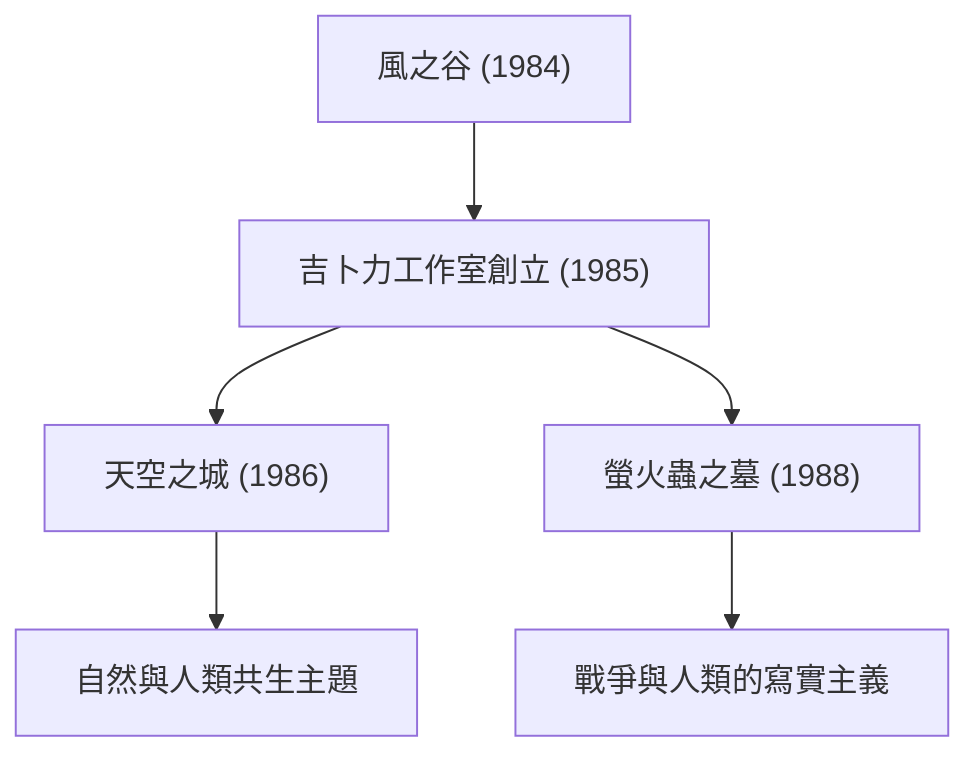

# 吉卜力電影的軌跡：動畫描繪的生命與自然訊息

吉卜力工作室超越了一般動畫製作公司的範疇，不僅在日本，更在全球影像文化中佔據著獨特的地位。自 1985 年成立以來，以宮崎駿與高畑勳這兩位天才創作者為核心，誕生了無數名留青史的傑作。本文將結合物理學、歷史學與技術等多重維度，深入探討吉卜力工作室的歷史、技術演進，以及貫穿各部作品之核心主題的變遷。

## 吉卜力工作室的創立與初期的挑戰

吉卜力工作室的歷史，始於 1984 年上映的《風之谷》所獲得的巨大成功。嚴格來說，這部作品是在吉卜力正式創立前所製作的，但其製作過程中所累積的團隊默契與資金，成為日後工作室成立的基石。

工作室成立後隨即推出的《天空之城》，將使用賽璐珞畫的傳統動畫技術推向了極致。特別是在飛行石的光芒與雲層的表現上，充分運用了當時的光學合成技術。透過手繪賽璐珞畫與攝影時的濾鏡效果，重現光線散射與折射等物理現象，這項技術大幅提升了當時的全球動畫水準。

## 經濟成長與日常的奇幻想像：80年代後半～90年代

在日本沉浸於泡沫經濟的榮景之際，吉卜力進行了一項前所未聞的挑戰——同時上映《龍貓》與《螢火蟲之墓》。前者描繪了昭和 30 年代田園牧歌般的自然風景與森林精靈，後者則刻劃了第二次世界大戰末期的悲慘現實。這兩個截然相反的面向，正是象徵吉卜力多面特質的最佳體現。

在技術層面上，從這一時期開始，利用多平面攝影機所呈現的景深表現變得更加細膩純熟。這種手法將背景畫分割為多個圖層分開配置，並以不同速度移動，從而在二維畫面上營造出物理性的立體感（視差效應）。這項視覺巧思，可說是日後數位時代 3DCG 空間表現的先驅。

## 生態學與神話想像力：《魔法公主》的震撼

1997 年上映的《魔法公主》，無論在技術上還是主題上，都是吉卜力工作室重大的轉折點。本作描繪了森林神祇與人類之間慘烈的對立，並提出了無法以善惡二元論一概而論的複雜命題。

值得關注的是動畫中對流體力學的呈現。邪魔神身上纏繞的詛咒蠕動、飛濺的鮮血與水流的表現，部分引進了數位技術（CGI）。然而，其核心本質依然在於動畫師親手對物理法則所進行的細緻觀察與重構。無論是黏性物體的流動、還是隨重力崩落的物體質量感，這種憑直覺掌握牛頓力學並進行誇張與形變表現的技術，震撼了全球的創作者。

## 邁向數位化與國際讚譽：《神隱少女》

2001 年的《神隱少女》刷新了日本影史票房紀錄，成為歷史性的現象級賣座之作，更榮獲奧斯卡金像獎最佳動畫長片，奠定了吉卜力在國際上的崇高聲譽。

從這部作品開始，吉卜力全面由傳統賽璐珞畫轉型為數位繪製。然而，他們運用數位技術並非為了「提高效率」，而是為了「拓展表現力」。無論是無窮無盡的色彩階調、複雜的光源處理，還是具有透明感的水流呈現，都在導入數位特有的物理模擬時，同時保留手繪的溫暖質感，確立了獨樹一格的工作流程。

## 高畑勳的革新與寫實主義的極致：《輝耀姬物語》

相對於宮崎駿透過奇幻描繪世界，高畑勳則不斷進行前衛嘗試，持續反思動畫本身的框架與極限。其集大成之作正是《輝耀姬物語》。

在這部作品中，刻意採用了留白斷續的筆觸，並運用如水彩畫般的淡雅色彩，採取了讓觀眾在腦海中自主「補全」畫面意境的高度心理學手法。在動能爆發的疾馳狂奔場景中，以粗獷豪放的筆法勾勒背景，在視覺上具象呈現了宛如相對論般的空間扭曲與極限速度感。這是一種與傳統寫實主義截然相反、巧妙利用人類知覺與認知機制的表現技法。

## 傳承未來與動畫的無限可能

吉卜力工作室的作品群不僅是單純的娛樂，更持續叩問著人類所面臨的環境問題、與科技共處的方式，以及「活著」這一命題的根本意義。從賽璐珞邁向數位化、對手繪手感質地的執著追求，以及始終真誠面對時代的態度——這些走過的軌跡，向我們展示了動畫作為一種表現媒介所蘊含的無限可能。

在吉卜力所描繪的世界裡，無論是一縷微風的流轉，還是水面的一抹波光，都蘊含著生命的氣息與物理法則的優美。我們在未來也應當繼續解讀他們所留下的訊息，並將這份感動代代傳承下去。
