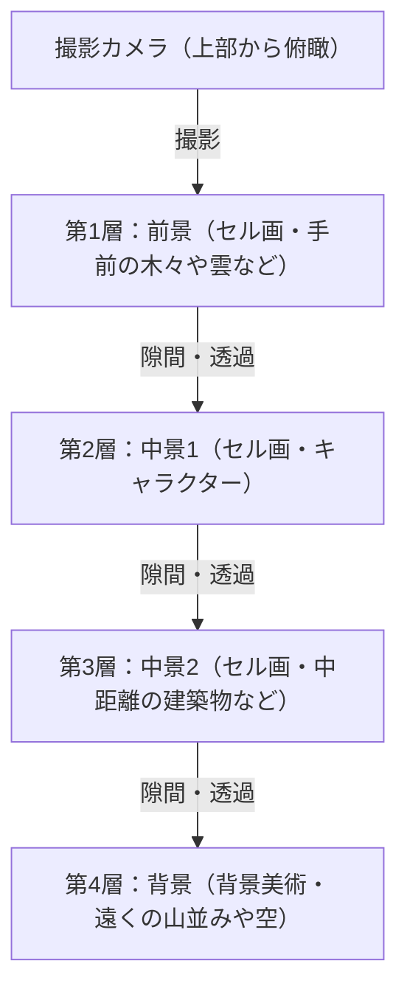

# 第1章：創設と初期の傑作たち（風の谷のナウシカ、天空の城ラピュタ）

## 1.1 アニメーション史における特異点、スタジオジブリの誕生

日本のアニメーション産業、いや世界のアニメーション史を俯瞰したとき、1980年代半ばに起きた一つの「事件」を無視することはできない。それこそが、スタジオジブリの設立である。ジブリの歴史は、単なる一企業、一制作スタジオの歴史ではなく、セル画というアナログ技術が到達した表現の極点と、アニメーションという媒体が持つ「大衆性」と「芸術性」の奇跡的な融合の歴史そのものである。本章では、スタジオジブリ創設の経緯を紐解きながら、その実質的な原点である『風の谷のナウシカ』（1984年）と、スタジオジブリ名義での初作品『天空の城ラピュタ』（1986年）に焦点を当て、高畑勲と宮崎駿という二人の天才がいかにしてアニメーション表現の限界を突破していったかを論じる。

スタジオジブリの設立前夜、日本のテレビアニメーションは「リミテッド・アニメーション」という手法によって独自の進化を遂げていた。秒間24コマをフルに使うディズニー的なフルアニメーションに対し、枚数を減らしながらも止め絵やカメラワーク（パン、ティルトなど）を駆使してダイナミズムを演出する手法は、コスト削減の必要悪から始まり、いつしか独自の映像文法として確立されていた。しかし、高畑勲と宮崎駿が目指したのは、その枠に収まるものではなかった。彼らは東映動画（現・東映アニメーション）時代から培ってきた、空間の緻密な構築、生活芝居のリアリティ、そして何よりも「動くことの根源的な喜び」を追求するアニメーションを、劇場長編という最高のフォーマットで実現することを渇望していたのである。

## 1.2 高畑勲と宮崎駿の作家性：客観性と主観性の奇跡的な交差

スタジオジブリの作品群を深く理解するためには、その中核をなす高畑勲と宮崎駿という二つの異なる才能の性質、そしてその相互作用を把握しておく必要がある。両者は共に東映動画出身であり、労働組合活動などを通じて深い絆で結ばれていたが、アニメーション演出家としての志向性は対極にあったと言っても過言ではない。

宮崎駿の作家性は、圧倒的な「主観的空間認識」と「運動のフェティシズム」に特徴づけられる。宮崎の描く画面は、物理法則を時に超越しながらも、観る者の身体感覚に直接訴えかける強烈な説得力を持っている。飛行シーンにおける浮遊感、巨大な質量を持つ物体が動く際の重低音を感じさせるような重量感、そして微細な風の流れや水面のきらめきなど、世界そのものが生き物のように蠢く感覚は、宮崎の脳内にあるビジョンをアニメーターの身体を通してセル画に定着させた結果である。彼はレイアウト（画面構成）において、広角レンズ的な歪みや独特のパースペクティブを多用し、画面の奥行きと動線を巧みにコントロールする。

対して高畑勲の作家性は、徹底した「客観性」と「論理的構築」にある。高畑自身は絵を描かない演出家であったが故に、アニメーションの画面をより一段高いメタ的な視点から俯瞰することができた。彼の演出は、キャラクターの心理や社会構造、そして日常の些細な動作のリアリティを極限まで突き詰めることに重きが置かれる。空間配置、照明、キャラクターの動機づけに至るまで、すべてが緻密な計算の上に成り立っており、観客に感情移入を促す一方で、常に一歩引いた視点から世界を観察させるようなブレヒト的な異化効果をも持ち合わせている。

この「主観的・直感的な宮崎」と「客観・論理的な高畑」という二つの才能が、互いに牽制し合い、尊敬し合いながら、ひとつのスタジオの屋台骨となったことが、ジブリの豊穣な作品群を生み出す最大の原動力であった。初期のジブリ作品において、高畑はプロデューサーという立場で宮崎の暴走をコントロールし、同時に作品の骨格を強固なものにするという極めて重要な役割を果たしている。

## 1.3 セル画アニメーションの技術的特異点とマルチプレーンカメラ

スタジオジブリの凄まじさは、テーマの深遠さだけではなく、それを支える圧倒的な技術力にある。特に『ナウシカ』から『ラピュタ』にかけての時期は、アナログのセル画アニメーション技術がひとつの完成形、あるいは「技術的特異点」に到達しつつある時期であった。

ジブリ作品の画面が持つ圧倒的な情報量と実在感は、緻密に描き込まれた背景美術と、何層にも重ねられたセル画のレイヤーによって生み出されている。ここで特筆すべきは、「マルチプレーンカメラ（多段式カメラ）」を用いた空間表現の極致である。

マルチプレーンカメラとは、カメラの下に複数のガラスの層（段）を設け、それぞれにセル画や背景画を配置して撮影する装置である。これにより、カメラが動いた（パンやティルト、トラックアップなど）際に、各層の移動速度を変えることで、擬似的な三次元の奥行き（視差）を生み出すことができる。この技術自体はディズニーなどが古くから用いていたものであるが、ジブリにおけるマルチプレーンカメラの運用は、その精緻さと複雑さにおいて群を抜いていた。

宮崎作品に不可欠な「飛行シーン」は、この技術の恩恵を最大限に受けている。例えば、眼下に広がる雲海、その間を縫って飛ぶ飛行艇、さらに奥に見える大地といった複雑な空間を、それぞれの層が異なる速度で流れることで、観客は本当に空を飛んでいるかのような強烈な空間認識と没入感を得る。さらに、セル画の裏から光を当てる「透過光」技術や、エアブラシを用いた微妙なグラデーション表現、そして風になびく草木を1枚1枚手書きで動かすという狂気じみた作画カロリーの投入によって、画面には風が吹き、空気が流れる。デジタル技術（CGI）が存在しない時代において、彼らは物理的なフィルムと絵の具、そして光の魔術を駆使して、現実以上にリアルな仮想空間を構築していたのである。

## 1.4 『風の谷のナウシカ』（1984年）：前史としての金字塔とエコロジーの深層

1984年に公開された『風の谷のナウシカ』は、正式にはスタジオジブリ設立前の「トップクラフト」制作の作品であるが、宮崎駿監督、高畑勲プロデューサーという布陣で作られ、後のジブリの方向性を決定づけた実質的な「第0作」あるいは「第1作」として位置づけられる。

本作は、月刊誌「アニメージュ」で宮崎駿自身が連載していた同名漫画を原作としているが、映画版はその序盤部分を再構成し、ひとつの独立した物語として完結させている。『ナウシカ』がアニメーション史に刻んだ最大の功績は、「環境問題（エコロジー）」と「生命の尊厳」、そして「人類の愚行」という極めて重厚なSF的テーマを、エンターテインメントの枠組みの中で、しかも圧倒的な映像美をもって描き切ったことにある。

「火の七日間」と呼ばれる最終戦争によって産業文明が崩壊してから1000年後。有毒な瘴気を放つ「腐海」と呼ばれる菌類の森が拡大し、巨大な蟲たちが支配する世界。この絶望的な世界観設定は、冷戦下の核戦争の恐怖や、深刻化する環境破壊に対する宮崎の強い危機感が反映されている。しかし宮崎は、単なる「自然保護」や「人間悪」という二元論に陥ることはない。腐海が実は汚染された地球を浄化するためのシステムであるという劇中の大きな反転は、自然の持つ恐るべき自己回復力と、その前における人間の矮小さを突きつける。

技術的側面から『ナウシカ』を語る上で欠かせないのが、「王蟲（オーム）」をはじめとする巨大な蟲たちの表現である。多数の節や眼を持つこの異形の生物が、うねるように前進するアニメーションは、ゴムを用いた特殊な作画技法（複数のセル画のパーツをずらして撮影する手法など）や、緻密なタイミングの計算によって、圧倒的な重量感と不気味さ、そしてある種の神々しさを生み出している。また、メーヴェ（ナウシカの乗る飛行具）の飛翔シーンにおける、風の抵抗を感じさせる布の動きや、重力と揚力の関係を視覚化したかのような滑らかな軌道は、宮崎アニメの真骨頂である「飛ぶことのカタルシス」を世界に知らしめた。

ナウシカというヒロインの造形も革新的であった。彼女は単なる「守られるべき少女」ではなく、自らメーヴェを駆り、銃を撃ち、剣を振るう戦士でありながら、同時にすべての命に対する深い慈愛を持った母性的な存在でもある。強さと優しさ、怒りと悲しみを併せ持つこの複雑なキャラクター像は、その後のジブリ作品のみならず、現代のフィクションにおける女性ヒーロー像のひとつの到達点にして原点となった。

## 1.5 スタジオジブリ設立と『天空の城ラピュタ』（1986年）：究極の冒険活劇

『ナウシカ』の成功を受け、その利益を元手にして1985年に「スタジオジブリ」は正式に設立された。その設立の目的はただ一つ、「質の高い劇場用長編アニメーションを作り続けること」であった。テレビアニメの粗製濫造とは一線を画し、妥協のないクオリティを追求するための独立拠点として、ジブリは産声を上げたのである。

そして1986年、スタジオジブリ名義での記念すべき第1回長編作品として『天空の城ラピュタ』が公開される。宮崎駿が小学生時代に構想していたというアイデアをベースにした本作は、スウィフトの『ガリヴァー旅行記』に登場する浮島ラピュタをモチーフに、少年と少女の出会い、謎の飛行石、空中海賊、そして邪悪な野心を持つ軍隊といった、古典的な冒険活劇（ボーイ・ミーツ・ガール）の王道要素をすべて詰め込んだ、まさに「活劇の極北」とも呼べる傑作である。

『ラピュタ』の素晴らしさは、息もつかせぬ物語の推進力と、画面の隅々にまで張り巡らされた異常なまでのディテールへの執着にある。冒頭の飛行船（タイガーモス号）へのドーラ一家の襲撃シーンから、パズーとシータが逃げ込むスラッグ渓谷の追跡劇に至るまで、画面は常に「動的」である。スラッグ渓谷のメカニックな造形、蒸気機関のピストン運動、歯車の回転、そしてトロッコの疾走。これらの機械や乗り物は、単なる背景や小道具ではなく、それ自体が生命を持っているかのように躍動感に満ちて描かれている。宮崎の持つ「機械への愛情」と「それが発する熱や匂い」さえも定着させようとする作画の熱量が、架空の世界に圧倒的なリアリティを付与している。

テーマ性において『ラピュタ』が提示するのは、「高度なテクノロジーと人間の分断」、そして「大地との結びつき」である。かつて世界を支配したラピュタ帝国の超絶的な科学力は、最終的に自らを滅ぼす原因となった。映画のクライマックス、崩壊するラピュタの深部から巨大な飛行石を抱いた巨大な「大樹」が宇宙へと上昇していくビジョンは、極めて象徴的である。テクノロジーの象徴であった人工物が崩れ去り、生命の象徴である大樹のみが残るこの結末は、シータの語る「土に根をおろし、風と共に生きよう。種と共に冬を越え、鳥と共に春を歌おう。どんなに恐ろしい武器を持っても、たくさんのかわいそうなロボットを操っても、土から離れては生きられないのよ」というセリフに集約されている。これは『ナウシカ』から続く、現代文明に対する宮崎の痛烈な批評であり、自然への回帰という普遍的な祈りである。

また、本作における美術監督・野崎俊郎と山本二三による背景美術の貢献は計り知れない。ラピュタ到達時の、雲海が晴れ渡り、苔生した巨大な庭園とロボット兵が現れるシーンの静謐な美しさは、アニメーションにおける背景画がいかに作品の品格を決定づけるかを証明している。動の宮崎演出と、静の美術の完璧な融合がここにあった。

## 1.6 結語：伝説の始まり

『風の谷のナウシカ』と『天空の城ラピュタ』。この初期の二大傑作において、宮崎駿と高畑勲、そしてスタジオジブリのスタッフたちは、アニメーションという表現手法が持ち得るポテンシャルを極限まで引き出してみせた。空想の産物である架空のメカニックに重量と手触りを与え、想像上の生態系にリアリティを吹き込み、複雑な社会批評や哲学的なテーマを、老若男女が息を呑んで見つめるエンターテインメントの中に内包させる。この途方もない離れ業を、彼らは膨大な枚数のセル画と、職人狂気とも言える手作業によって成し遂げたのである。

これら二つの作品は、技術的・表現的な基準を遥か高みへと引き上げ、その後の日本アニメーション界に「ジブリという巨大な壁」として立ちはだかることとなる。そして同時に、この小さなスタジオが、やがて世界的な文化現象を巻き起こし、アニメーションの歴史そのものを塗り替えていくという、壮大な伝説の文字通りの「第1章」であった。後に続く『となりのトトロ』や『火垂るの墓』、そして『もののけ姫』へと至る道筋は、すべてこの『ナウシカ』の風と『ラピュタ』の空から始まっていたのである。

