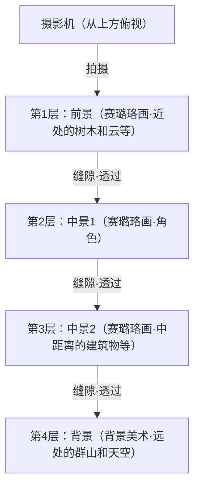

# 第1章：创立与早期的杰作（风之谷、天空之城）

## 1.1 动画史上的奇点，吉卜力工作室的诞生

当我们俯瞰日本动画产业，甚至是世界动画史时，无法忽视发生在1980年代中期的一个“事件”。那就是吉卜力工作室的设立。吉卜力的历史，并非单纯是一家企业、一家制作工作室的历史，而是赛璐珞这一模拟技术所达到的表现极点，以及动画这一媒介所拥有的“大众性”与“艺术性”奇迹般融合的历史本身。本章将一边梳理吉卜力工作室创立的经过，一边聚焦于其名义上的原点《风之谷》（1984年）以及以吉卜力工作室名义发表的首部作品《天空之城》（1986年），论述高畑勋与宫崎骏这两位天才如何突破动画表现的极限。

在吉卜力工作室设立的前夕，日本的电视动画通过一种被称为“有限动画”的手法实现了独自的进化。相对于每秒完全使用24帧的迪士尼式全动画，通过减少帧数的同时，驱使静止画和摄影机运动（摇摄、俯仰等）来演出动态感的手法，虽然始于削减成本的必要之恶，却在不知不觉中被确立为独特的影像文法。然而，高畑勋和宫崎骏所追求的，绝非局限于这个框架之内的东西。他们渴望在剧场版长篇这一最高规格的格式中，实现自东映动画（现·东映动画公司）时代以来所培养的对空间缜密的构建、生活演技的真实感，以及比什么都重要的对“运动的根本喜悦”的追求。

## 1.2 高畑勋与宫崎骏的作家性：客观性与主观性的奇迹交汇

为了深刻理解吉卜力工作室的作品群，必须把握构成其核心的高畑勋与宫崎骏这两种截然不同的才能的性质，以及它们之间的相互作用。两人皆出身于东映动画，通过工会活动等结下了深厚的羁绊，但作为动画演出家的志向性却毫不夸张地处于两个极端。

宫崎骏的作家性以压倒性的“主观空间认知”与“对运动的拜物教”为特征。宫崎所描绘的画面，时而超越物理法则，却拥有直接诉诸观者身体感觉的强烈说服力。飞行场景中的悬浮感、拥有巨大质量的物体移动时让人感到重低音般的重量感，以及微风的流动或水面的波光粼粼等，那种世界本身如同生物般蠕动的感觉，是宫崎将脑内的视觉意象通过动画师的身体定格在赛璐珞画上的结果。他在构图（画面构成）上大量运用广角镜头般的扭曲和独特的透视，巧妙地控制画面的景深和动线。

相对地，高畑勋的作家性则在于彻底的“客观性”与“逻辑构建”。正因为高畑自身是不画画的演出家，所以他能够从更高一层的元视角来俯瞰动画的画面。他的演出重点在于将角色的心理、社会结构，以及日常琐碎动作的真实感追究到极限。从空间配置、照明到角色的动机，一切都建立在缜密的计算之上，在促使观众产生感情代入的同时，也具备了一种让人始终从退一步的视角观察世界的布莱希特式间离效果。

这种“主观、直觉的宫崎”与“客观、逻辑的高畑”这两种才能，在相互牵制、相互尊敬中成为一家工作室的顶梁柱，这是创造出吉卜力丰饶作品群的最大原动力。在吉卜力早期的作品中，高畑以制作人的立场控制着宫崎的暴走，同时也发挥了巩固作品骨架的极其重要的作用。

## 1.3 赛璐珞动画的技术奇点与多平面摄影机

吉卜力工作室的惊人之处不仅在于主题的深奥，更在于支撑它的压倒性技术实力。特别是在从《风之谷》到《天空之城》的这段时期，模拟的赛璐珞动画技术正处于达到一个完美形态，或者说是“技术奇点”的时期。

吉卜力作品画面所拥有的压倒性信息量与真实感，是由缜密绘制的背景美术与重叠了许多层的赛璐珞图层所产生的。这里特别值得一提的是，使用“多平面摄影机（多段式摄影机）”所达到的空间表现极至。

多平面摄影机是一种在摄影机下方设置多层玻璃层（段），在每一层放置赛璐珞画或背景画进行拍摄的装置。借此，当摄影机移动（摇摄、俯仰、推镜头等）时，通过改变各层的移动速度，可以产生拟似的三维深度（视差）。这项技术本身虽然是迪士尼等公司自古以来就在使用的东西，但吉卜力在多平面摄影机的运用上，其精致度和复杂性却是出类拔萃的。

宫崎作品中不可或缺的“飞行场景”最大程度地受惠于这项技术。例如，眼底展开的云海、在其中穿梭飞行的飞行艇，以及更深处可见的大地等复杂的空间，随着各自图层以不同的速度流转，观众能够获得仿佛真的在天空中飞行般强烈的空间认知和沉浸感。此外，通过从赛璐珞背面打光的“透过光”技术、使用喷枪绘制的微妙渐变表现，以及将随风飘动的草木一帧一帧地手绘出来这种堪称疯狂的作画能量投入，画面中便有了风的吹拂和空气的流动。在数字技术（CGI）还不存在的时代，他们驱使物理的胶片和颜料，以及光影的魔术，构建了比现实更加逼真的虚拟空间。

## 1.4 《风之谷》（1984年）：作为前史的金字塔与生态学的深层

1984年上映的《风之谷》在名义上是吉卜力工作室设立前由“Topcraft”制作的作品，但它由宫崎骏担任导演、高畑勋担任制作人这样的阵容制作而成，作为决定了后来吉卜力发展方向的实质上的“第0作”或“第1作”而被定位。

本作以宫崎骏自己在月刊杂志《Animage》上连载的同名漫画为原作，但电影版对其开篇部分进行了重构，将其作为一个独立的故事使之完结。《风之谷》在动画史上刻下的最大功绩在于，它在娱乐的框架内，以压倒性的影像美将“环境问题（生态）”、“生命的尊严”以及“人类的愚行”这一极其厚重的科幻主题描绘得淋漓尽致。

在被称为“火之七日”的最终战争导致产业文明崩溃的1000年后。散发着有毒瘴气、被称为“腐海”的菌类森林不断扩大，由巨大的虫类支配的世界。这个绝望的世界观设定，反映了宫崎对冷战下核战争的恐惧以及对日益严重的环境破坏的强烈危机感。然而宫崎并没有陷入单纯的“保护自然”或“人类邪恶”的二元论中。剧中腐海实际上是净化被污染地球的系统的这一重大反转，直逼自然所拥有的可怕自我恢复力，以及人类在其面前的渺小。

从技术层面上谈论《风之谷》时不可或缺的，是以“王虫”为首的巨大虫类的表现。拥有许多体节和眼睛的这种异形生物，宛如起伏般前进的动画，通过使用橡胶的特殊作画技法（将多张赛璐珞画的部件错开拍摄的手法等）以及缜密的时间计算，产生了压倒性的重量感、诡异感，以及某种神圣感。此外，在海鸥（滑翔翼，娜乌西卡乘坐的飞行器）的飞翔场景中，让人感受到风阻的布料运动，以及仿佛将重力与升力关系视觉化般流畅的轨迹，向世界展示了宫崎动画的真谛——“飞翔的宣泄”。

娜乌西卡这一女主角的塑造也是革新性的。她并非单纯“应当被保护的少女”，而是亲自驾驭海鸥、开枪射击、挥舞剑刃的战士，同时也是对所有生命怀有深深慈爱的母性存在。兼具坚强与温柔、愤怒与悲伤的这种复杂的角色形象，不仅成为了之后吉卜力作品，更是现代虚构作品中女性英雄形象的一个顶点与原点。

## 1.5 吉卜力工作室的设立与《天空之城》（1986年）：终极的冒险活剧

借着《风之谷》成功的东风，以其利润为本金，1985年“吉卜力工作室”正式设立。其设立的目的只有一个，那就是“继续制作高质量的剧场版长篇动画”。为了与电视动画的粗制滥造划清界限，作为追求不妥协质量的独立基地，吉卜力诞生了。

然后在1986年，作为吉卜力工作室名义下值得纪念的第1部长篇作品，《天空之城》上映了。本作以宫崎骏在小学时代构思的想法为基础，以斯威夫特的《格列佛游记》中登场的浮岛拉普达为动机，将少年与少女的相遇、神秘的飞行石、空中海贼、以及怀有邪恶野心的军队等经典冒险活剧（Boy Meets Girl）的王道要素悉数塞入，是一部堪称“活剧的极北”的杰作。

《天空之城》的绝妙之处，在于令人喘不过气的故事推进力，以及遍布画面各个角落对细节的近乎异常的执着。从开篇朵拉一家袭击飞艇（虎蛾号）的场景，到巴鲁和希达逃入的斯勒格峡谷的追逐战，画面始终是“动态”的。斯勒格峡谷的机械造型、蒸汽机的活塞运动、齿轮的旋转，以及矿车的疾驰。这些机械和交通工具，不仅仅是背景或道具，它们本身仿佛拥有生命般充满了跃动感被描绘出来。宫崎拥有的“对机械的喜爱”以及试图连“其散发的热量与气味”都固定下来的作画热量，赋予了架空世界压倒性的真实感。

在主题性上，《天空之城》所展现的是“高度发展的科技与人类的割裂”，以及“与大地的连结”。曾经支配世界的拉普达帝国那超绝的科学力量，最终成为了毁灭自身的原因。在电影的高潮部分，从崩溃的拉普达深处，抱着巨大飞行石的巨大“大树”向宇宙上升的景象，极具象征意义。作为科技象征的人工造物崩塌，仅留下作为生命象征的大树的这个结局，浓缩在希达所说的台词中：“扎根于泥土，与风共存。与种子一起越冬，与鸟儿一起歌唱春天。不管你拥有多么可怕的武器，操控着多少可怜的机器人，只要离开土地就无法生存。”这是延续自《风之谷》的宫崎对现代文明的痛烈批评，是对回归自然这一普遍的祈愿。

此外，本作中美术监督野崎俊郎和山本二三在背景美术上的贡献是不可估量的。在到达拉普达时，云海散去，布满青苔的巨大庭园与机器人兵出现的场景中那种静谧的美，证明了动画中的背景画是如何决定作品的品格的。这里展现了宫崎动之演出与静之美术的完美融合。

## 1.6 结语：传说的开始

《风之谷》与《天空之城》。在这初期的两大杰作中，宫崎骏与高畑勋，以及吉卜力工作室的工作人员们，将动画这一表现手法所能拥有的潜力发挥到了极致。赋予幻想产物中的架空机械以重量与触感，为想象中的生态系统注入真实感，将复杂的社会批评与哲学主题内含于令男女老少都屏息凝神的娱乐之中。这种不可思议的绝技，是他们通过数量庞大的赛璐珞画，以及堪称职人疯狂的手工作业来完成的。

这两部作品将技术与表现的基准提升到了遥远的高度，成为了在之后的日本动画界中横亘着的“名为吉卜力的巨大高墙”。与此同时，这也是一家小小的工作室日后将掀起世界级的文化现象、改写动画历史本身的宏大传说字面意义上的“第1章”。随后通往《龙猫》与《萤火虫之墓》，再到《幽灵公主》的道路，全部都始于这《风之谷》的风与《天空之城》的天空。
