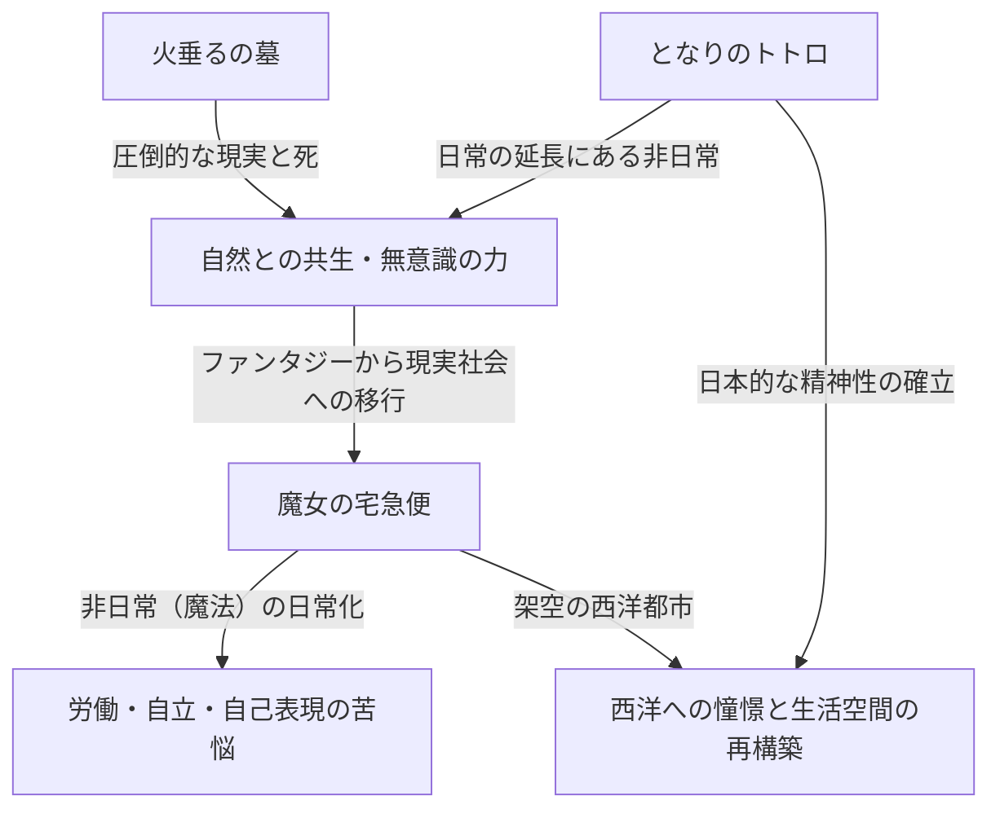

# 第2章：日常と非日常の交差点——『となりのトトロ』『火垂るの墓』『魔女の宅急便』が描いた世界

スタジオジブリの歴史を紐解く上で、1980年代後半は決定的な転換点となった時期である。前作『天空の城ラピュタ』（1986年）で描かれたような、壮大な「剣と魔法」あるいは「空飛ぶ冒険活劇」から一転し、ジブリは日本の原風景や西洋の市井の人々の暮らしという「日常」へと大きく舵を切った。本章では、1988年に奇跡的な同時上映を果たした『となりのトトロ』『火垂るの墓』、そして1989年の大ヒット作『魔女の宅急便』の3作品を取り上げ、これらがアニメーション史に刻んだ技術的・テーマ的な革命を徹底的に解剖する。

## 1. 同時上映の狂気と奇跡：宮崎駿と高畑勲、二つの「昭和」

1988年春、『となりのトトロ』と『火垂るの墓』の同時上映という、現在ではおよそ考えられない興行形態が実現した。これは単なる商業的なパッケージングではなく、スタジオジブリという組織、ひいては宮崎駿と高畑勲という二人の天才クリエイターが火花を散らした「狂気と奇跡」の結晶であった。

### 1-1. 背中合わせの生と死
『となりのトトロ』は昭和30年代（1950年代）の日本の農村を舞台に、自然の精霊と子供たちの交流を描いた生命の賛歌である。一方、『火垂るの墓』は昭和20年（1945年）の終戦前後の神戸を舞台に、戦火の中で命を落としていく兄妹の凄惨な現実を徹底したリアリズムで描き出した。時代設定こそ約10年しか違わないものの、この2作品は「生と死」「理想化されたファンタジーと残酷な現実」という、完全に背中合わせのテーマを内包している。

当時のスタジオジブリは、二つの巨大な才能を同時に稼働させるという無謀とも言える制作体制を敷いた。作画スタッフの奪い合いが生じ、スケジュールは破綻の危機に瀕した。しかし、結果としてこの過酷な環境が、両作品のクオリティを極限まで押し上げることとなる。宮崎駿は高畑勲の徹底したリアリズムに対するアンチテーゼとして、より力強く、無意識下の生命力が躍動する『トトロ』の世界を構築し、高畑は宮崎の描くファンタジーに対抗すべく、日本のアニメーション表現をドキュメンタリー的な次元へと引き上げた。

### 1-2. 昭和の描き分けと「アニメーション・ドキュメンタリー」の誕生
『火垂るの墓』における高畑勲の演出は、従来のアニメーションの文法を破壊するものだった。B29の爆撃による焼夷弾の落下軌道、燃え盛る家屋の炎の揺らぎ、そして何より飢餓によって衰弱していく清太と節子の身体的変化。これらを表現するために、色彩設計の保田道世らは、従来のアニメカラーでは表現しきれない「泥と血と煤にまみれた茶褐色」を徹底的に追求した。

対照的に『となりのトトロ』では、宮崎駿が自身の記憶の中にある「かつてあったかもしれない、美しい日本」を再構築した。それは単なる写実ではなく、子供の視点から見た世界の「輝き」をセル画上に定着させる試みであった。この二つの「昭和」の描き分けは、アニメーションという媒体が持つ表現の振れ幅を最大限に証明するものであり、日本映画史における金字塔となった。

## 2. 背景美術の革命：男鹿和雄と山本二三が作り上げた「空気と湿気」

ジブリ作品が持つ圧倒的な説得力は、キャラクターの芝居だけでなく、その後ろに広がる背景美術の力に負うところが極めて大きい。この時期、スタジオジブリの背景美術は一つの到達点を迎えていた。

### 2-1. 男鹿和雄の描く「トトロの森」の湿潤な大気
『となりのトトロ』の美術監督に抜擢された男鹿和雄の功績は、日本のアニメーション美術の歴史を変えたと言っても過言ではない。男鹿の描く自然は、ポスターカラーの特性を極限まで活かしたものである。透明水彩ではなく不透明なポスターカラーを用いながらも、絶妙な水加減と筆のタッチによって、日本の風土特有の「湿気」や「むせ返るような草の匂い」、そして「木漏れ日の温度」までも表現してのけた。

特に、サツキとメイが雨のバス停でトトロと遭遇するシーンの背景美術は圧巻である。雨に濡れたアスファルトの質感、暗闇に沈む鎮守の森の深さ、電灯の光が作り出す空気の層。男鹿の美術は単なる「風景の模写」ではなく、そこに吹く風や温度、湿度といった「見えない情報」を視覚化する魔法であった。

### 2-2. 西洋への憧憬と建築的リアリズム
一方、『魔女の宅急便』の舞台となるコリコという街は、スウェーデンのストックホルムやゴットランド島のヴィスビュー、さらにはリスボンやパリなど、ヨーロッパの様々な都市の要素を融合させて作られた架空の街である。ここでの背景美術は、日本の風景を描いた『トトロ』とは対極のベクトルを持っていた。

ヨーロッパの石造りの建築物、瓦屋根の連なり、そして海へと続く坂道。これらを説得力を持って描くために、ジブリの美術スタッフは徹底したロケハンと建築構造の学習を行った。石の質感一つをとっても、風化の度合いや太陽の光の反射率を計算し、アニメーションの背景として最も美しく見える色彩へと翻訳されている。この「西洋への憧憬」を単なるファンタジーで終わらせず、現実に人々が生活し、労働している空間として描き出した美術の力は驚異的である。

## 3. 『魔女の宅急便』における現代的テーマ：「労働とスランプ」

『魔女の宅急便』は、公開当時多くの若者、特に働く女性たちから熱狂的な支持を集めた。その理由は、本作が表面的には「魔女の女の子の成長物語」というファンタジーの皮を被りながら、その本質において極めて現代的で普遍的な「労働と才能（スランプ）」を巡るリアルなドラマだったからである。

### 3-1. 才能が「労働」に変わる瞬間
主人公のキキは、生まれ持った「空を飛ぶ」という魔法の才能を活かして宅配便の仕事を始める。これは、現代のクリエイターやフリーランスの労働者が、自身の特技や才能を「資本」として社会に参画していくプロセスと完全に重なる。序盤のキキにとって、空を飛ぶことは喜びであり自己表現であった。しかし、それが「仕事（労働）」となり、クライアントの理不尽な要求（ニシンのパイのエピソードなど）に直面し、対価としての金銭を受け取るようになると、彼女の中で魔法の意味が変質していく。

### 3-2. スランプとアイデンティティの喪失
中盤、キキは突如として魔法の力を失い、空を飛べなくなり、黒猫のジジの言葉も分からなくなる。これは思春期の少女のアイデンティティの揺らぎであると同時に、クリエイターが直面する「才能の枯渇（スランプ）」の完璧なメタファーである。

ここで重要な役割を果たすのが、森の小屋で絵を描く画学生のウルスラである。ウルスラはキキに対し、「そういう時はジタバタするしかない」「描いて、描いて、描きまくる」「それでも駄目なら、描くのをやめる。散歩したり、景色を見たり、昼寝したり、何もしない」と語りかける。このセリフは、宮崎駿自身を含むアニメーターたち、ひいては表現活動に関わるすべての人間が直面する苦悩と、その処方箋そのものである。

### 3-3. 「血で飛ぶ」ことの覚悟
ウルスラは自身の絵について「前は何も考えなくても描けたが、今は違う。自分自身の絵を描かなければならない」と語る。キキの魔法も同じである。生まれ持った才能（魔法）だけで飛べていた無意識の時代は終わりを告げ、彼女は自分自身の意志と努力によって、魔法を「再獲得」しなければならない。クライマックスにおいて、キキがデッキブラシに跨り、必死の形相で空へと飛び上がるシーンは、もはや優雅なファンタジーではない。それは自己の限界と向き合い、血を吐くような思いで「技術」を行使するプロフェッショナルの姿そのものである。

## 4. テーマの構造と相互関係

これら3作品は、一見するとそれぞれ独立した世界観を持っているが、ジブリの作家性という軸で見ると、明確な連続性とテーマの交差点が存在する。

『トトロ』が提示した「日常の中に潜む非日常（ファンタジー）」は、『火垂るの墓』という極限のリアリズムとの対比によって、より一層の強固な神話性を獲得した。そして、そこで確立された表現手法とアニメーション技術は、『魔女の宅急便』において「非日常的な存在（魔女）が、いかにして現代社会の日常（労働）に溶け込んでいくか」という逆説的なテーマを描くための強力な武器となったのである。

## 5. 結び：次なるステージへの布石

1988年から1989年にかけてのこの時期、スタジオジブリは「生と死」「日本と西洋」「ファンタジーとリアリズム」、そして「才能と労働」という、アニメーションが描き得るあらゆる極限を僅か数年の間に走破してしまった。ここで培われた、日常の芝居を徹底的に観察し描き出す技術、そして風景に空気と感情を宿らせる背景美術の力は、後の『おもひでぽろぽろ』（1991年）や『紅の豚』（1992年）といった、より大人向けの複雑なテーマを持つ作品群へと受け継がれていく。

『となりのトトロ』『火垂るの墓』『魔女の宅急便』の3作品は、単なる名作の羅列ではない。それはアニメーションという表現媒体が、子供向けの娯楽から、人間の精神の深淵や社会の構造的な苦悩までもを描き出す「総合芸術」へと脱皮していく、その最も熱く、そして最も苦しい羽化の瞬間を記録した歴史的モニュメントなのである。

