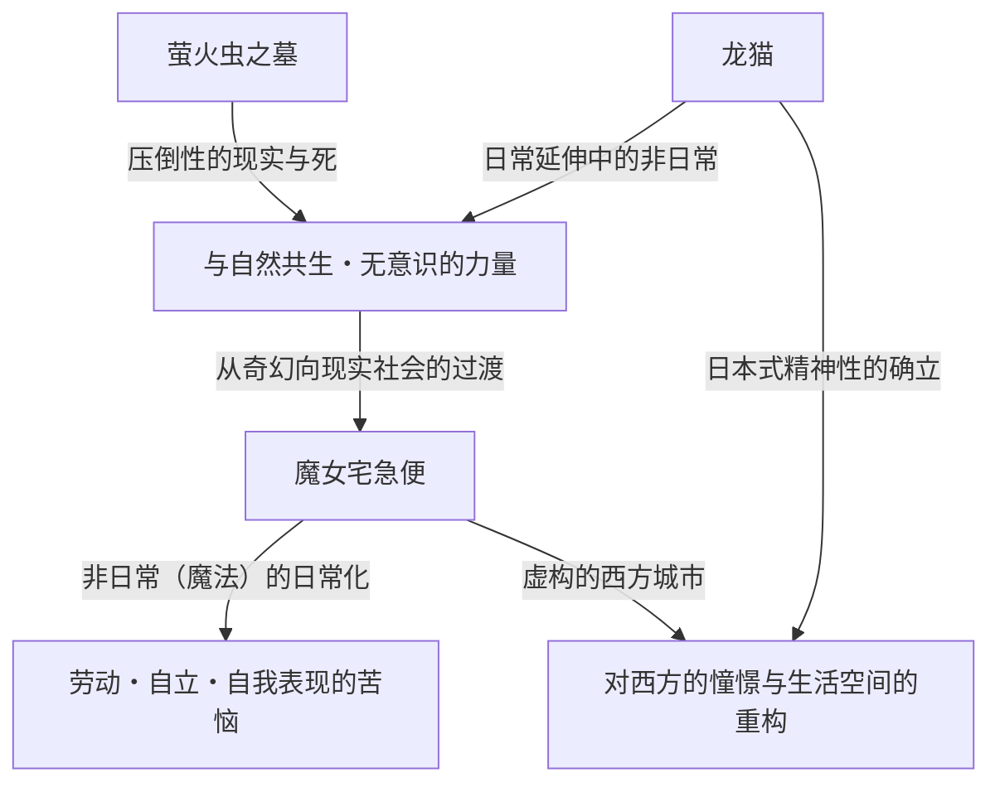

# 第2章：日常与非日常的交汇点——《龙猫》《萤火虫之墓》《魔女宅急便》所描绘的世界

在梳理吉卜力工作室的历史时，20世纪80年代后半期是一个决定性的转折点。从前作《天空之城》（1986年）所描绘的那种宏大的“剑与魔法”抑或“空中冒险动作剧”突然转变，吉卜力将方向大幅转向了日本的原初风景以及西方市井平民生活这种“日常”。本章将选取1988年奇迹般实现同日上映的《龙猫》《萤火虫之墓》，以及1989年的大热之作《魔女宅急便》这3部作品，彻底解剖它们在动画史上刻下的技术与主题上的革命。

## 1. 同日上映的疯狂与奇迹：宫崎骏与高畑勋，两个“昭和”

1988年春，实现了《龙猫》与《萤火虫之墓》同日上映这一在如今几乎无法想象的发行形态。这并非单纯的商业包装，而是吉卜力工作室这一组织，进而是宫崎骏与高畑勋这两位天才创作者擦出火花的“疯狂与奇迹”的结晶。

### 1-1. 背靠背的生与死
《龙猫》以昭和30年代（20世纪50年代）的日本农村为舞台，描绘了自然精灵与孩子们的交流，是一首生命的赞歌。另一方面，《萤火虫之墓》以昭和20年（1945年）二战结束前后的神户为舞台，以彻底的现实主义手法描绘了在战火中失去生命的兄妹俩凄惨的现实。尽管时代背景仅相差约10年，但这两部作品却内含着“生与死”“理想化的奇幻与残酷的现实”这样完全背靠背的主题。

当时的吉卜力工作室建立了一种堪称鲁莽的制作体制，让两位巨大的天才同时运转。发生了争夺作画人员的情况，日程安排濒临破产的危机。然而，结果这种严酷的环境却将两部作品的质量推向了极限。宫崎骏作为对高畑勋彻底的现实主义的反命题，构建了更加强有力、无意识的生命力跃动着的《龙猫》世界；而高畑为了对抗宫崎所描绘的奇幻，将日本的动画表现提升到了纪录片般的维度。

### 1-2. 昭和的不同描绘与“动画纪录片”的诞生
《萤火虫之墓》中高畑勋的演出，破坏了以往动画的语法。B-29轰炸机投下燃烧弹的下落轨迹、燃烧着的房屋火焰的摇曳，以及最重要的是因饥饿而衰弱的清太和节子身体的变化。为了表现这些，色彩设计保田道世等人彻底追求了以往动画色彩无法完全表现的“沾满泥土、鲜血和煤灰的茶褐色”。

与之相对照的是，在《龙猫》中，宫崎骏重构了自己记忆中“可能曾经存在过的、美丽的日本”。那并非单纯的写实，而是将从孩子视角看到的世界的“光辉”定格在赛璐珞画上的尝试。对这两个“昭和”的不同描绘，最大限度地证明了动画这一媒介所具有的表现幅度，成为了日本电影史上的金字塔。

## 2. 背景美术的革命：男鹿和雄与山本二三创造的“空气与湿气”

吉卜力作品所具有的压倒性说服力，不仅在于角色的表演，很大程度上还要归功于其背后广阔的背景美术的力量。这一时期，吉卜力工作室的背景美术达到了一个顶峰。

### 2-1. 男鹿和雄描绘的“龙猫森林”的湿润大气
被提拔为《龙猫》美术监督的男鹿和雄的功绩，说改变了日本动画美术的历史也不为过。男鹿所描绘的自然，将广告颜料的特性发挥到了极致。尽管使用的是不透明的广告颜料而非透明水彩，但通过绝妙的水分控制和笔触，甚至表现出了日本风土特有的“湿气”“令人窒息般的草香”以及“透过树叶的阳光的温度”。

特别是小月和小梅在雨中的公交站与龙猫相遇场景的背景美术，堪称压轴。被雨水打湿的柏油路面的质感、沉浸在黑暗中的镇守之森的深度、电灯光制造出的空气层。男鹿的美术不仅仅是“风景的临摹”，而是将吹拂那里的风、温度、湿度等“看不见的信息”视觉化的魔法。

### 2-2. 对西方的憧憬与建筑现实主义
另一方面，《魔女宅急便》的舞台克里克城，是一个融合了瑞典的斯德哥尔摩、哥特兰岛的维斯比，乃至里斯本、巴黎等欧洲各种城市元素而创造出的虚构城市。这里的背景美术有着与描绘日本风景的《龙猫》截然相反的方向。

欧洲的石造建筑、连绵的瓦片屋顶，以及通向大海的坡道。为了有说服力地描绘这些，吉卜力的美术人员进行了彻底的外景考察和建筑结构的学习。哪怕只是一块石头的质感，也会计算其风化程度和阳光的反射率，并将其转化为作为动画背景看起来最美丽的色彩。将这种“对西方的憧憬”不仅停留在奇幻层面，而是作为人们在现实中生活、劳作的空间描绘出来的美术力量，是令人惊叹的。

## 3. 《魔女宅急便》中的现代主题：“劳动与瓶颈期”

《魔女宅急便》在上映当时，获得了众多年轻人，特别是职业女性的狂热支持。其原因在于，本片表面上披着“魔女女孩的成长故事”的奇幻外衣，但其本质却是围绕极其现代且普遍的“劳动与才能（瓶颈期）”的真实戏剧。

### 3-1. 才能变为“劳动”的瞬间
主人公琪琪利用与生俱来的“在空中飞翔”的魔法才能，开始了快递送货的工作。这与现代创作者和自由职业者将自身的特长和才能作为“资本”参与社会的进程完全重合。对于初期的琪琪来说，在空中飞翔是喜悦，是自我表现。然而，当它变成“工作（劳动）”，面临客户不讲理的要求（鲱鱼派的插曲等），并作为报酬获得金钱时，她心中的魔法的意义便发生了质变。

### 3-2. 瓶颈期与自我认同的丧失
到了中段，琪琪突然失去了魔法的力量，无法在空中飞翔，也听不懂黑猫吉吉的话了。这既是青春期少女自我认同的动摇，同时也是创作者所面临的“才能枯竭（瓶颈期）”的完美隐喻。

在这里发挥重要作用的，是在森林小屋里画画的美术生乌露丝拉。乌露丝拉对琪琪说：“那种时候只能挣扎。”“画，画，拼命地画。”“如果还是不行，就不画了。散步、看风景、睡午觉，什么都不做。”这段台词，正是包括宫崎骏本人在内的动画师们，进而所有从事表现活动的人所面临的苦恼及其处方本身。

### 3-3. “用血飞翔”的觉悟
乌露丝拉谈到自己的画时说：“以前什么都不想就能画，但现在不一样了。必须画出自己的画。”琪琪的魔法也是一样。仅靠与生俱来的才能（魔法）就能飞翔的无意识时代宣告结束，她必须通过自己的意志和努力，来“重新获得”魔法。在最高潮部分，琪琪骑着长柄刷，带着拼命的神情飞向天空的场景，已经不再是优雅的奇幻了。那是直面自身的极限，带着呕心沥血般的意念行使“技术”的专业人士的身姿本身。

## 4. 主题的结构与相互关系

这3部作品乍看之下各自拥有独立的世界观，但从吉卜力作者性的轴线来看，存在着明确的连续性和主题的交汇点。

《龙猫》所提示的“潜藏在日常中的非日常（奇幻）”，通过与《萤火虫之墓》这一极致现实主义的对比，获得了更加坚固的神话性。而由此确立的表现手法和动画技术，在《魔女宅急便》中，成为了描绘“非日常的存在（魔女）如何融入现代社会日常（劳动）”这一悖论性主题的强有力武器。

## 5. 结语：迈向下一阶段的布局

从1988年到1989年的这一时期，吉卜力工作室在短短几年间，走完了“生与死”“日本与西方”“奇幻与现实”，以及“才能与劳动”等动画所能描绘的所有极致。在这里培养出的彻底观察并描绘日常表演的技术，以及让风景蕴含空气与感情的背景美术的力量，被传承到了之后《岁月的童话》（1991年）和《红猪》（1992年）等面向成年人、具有更复杂主题的作品群中。

《龙猫》《萤火虫之墓》《魔女宅急便》这3部作品，并非单纯的名作罗列。它们记录了动画这一表现媒介，从面向儿童的娱乐，蜕变到描绘人类精神深渊和社会结构性苦恼的“综合艺术”，那最热烈、最痛苦的羽化瞬间，是一座历史性的丰碑。
