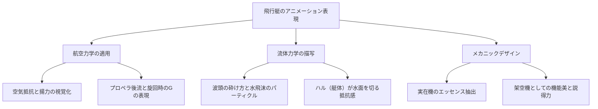
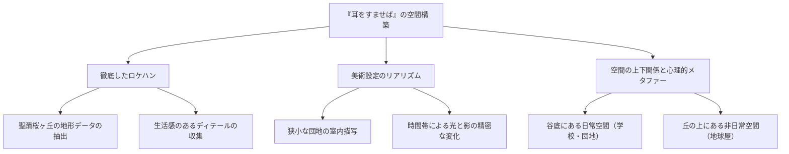

# 第3章：飛行への憧憬と大人のロマン——『紅の豚』と『耳をすませば』におけるリアリズムの到達点

スタジオジブリの歴史を俯瞰するうえで、1990年代前半から中盤にかけて発表された『紅の豚』（1992年）と『耳をすませば』（1995年）は、一見すると対極に位置する作品のように思われるかもしれない。前者がアドリア海を舞台に、呪いによって豚の姿となった賞金稼ぎの飛行艇乗りの戦いと哀愁を描くファンタジーであるのに対し、後者は現代の多摩ニュータウンを舞台に、中学生の男女の初々しい恋と進路への葛藤を描いた青春群像劇である。

しかし、この二つの作品を通底しているのは、アニメーションという表現手法を用いて「リアリズム（現実感）」を極限まで追求しようとするスタジオジブリの、いや、宮崎駿と近藤喜文という稀代のクリエイターたちの飽くなき探求心である。そして、その根底には「飛行」——物理的な空を飛ぶこと、あるいは自らの限界を超えて精神的に飛躍すること——への強烈な憧憬が存在する。本章では、この二作品がアニメーション史においていかに特異な位置を占め、どのような技術的・テーマ的達成を成し遂げたのかを、歴史的背景と技術論の両面から深く掘り下げていく。

## 1. 『紅の豚』——航空力学の極致と失われた時代の挽歌

『紅の豚』（原題：Il Porco Rosso）は、もともと日本航空の機内上映用ショートフィルムとして企画されたものが、ユーゴスラビア紛争という現実の重い影を落とす形で長編映画へと発展したという特異な出自を持つ。本作は、宮崎駿が自らのために、そして「疲れて脳細胞が豆腐になった中年男のための映画」として作り上げた、極めてパーソナルな手触りを持つ作品である。

### 1.1 宮崎駿と飛行機：メカニックへのフェティシズムと航空力学の緻密な描写

宮崎駿の「飛行」への執着はつとに有名だが、『紅の豚』における飛行艇の描写は、彼自身のメカニックへのフェティシズムと航空力学への深い理解が最も純化された形で表出している。本作に登場する飛行艇——主人公ポルコ・ロッソの愛機である真紅のサボイアS.21（モデルとなったのはマッキ M.33やサボイア・マルケッティ S.59など実在の機体の要素を混淆したオリジナル）や、ライバルであるカーチスの機体、空賊連合の雑多な飛行艇群——は、単なる背景や小道具ではなく、それ自体が自律したキャラクターとして躍動している。

特筆すべきは、空気抵抗、揚力、プロペラのトルク、エンジンの振動、そして水面からの離水・着水時の流体力学的な表現に至るまで、アニメーションにおける「物理法則の嘘と真実」が絶妙なバランスでコントロールされている点である。

ポルコのサボイアがエンジンを始動させるシーンでは、シリンダーに火が入り、機体全体が微小な振動を始め、排気管から黒煙が吐き出されるまでの一連のプロセスが、セル画の細やかな振動と多重露光（当時のアナログ撮影技術）によって表現されている。空中戦（ドッグファイト）のシークエンスでは、旋回時のG（重力加速度）に耐えるパイロットの肉体的な負荷や、失速（ストール）スレスレで機体をコントロールする操縦桿とラダーペダルの微細な動きが、極めて正確なタイミング（コマ打ち）で描写されている。これは、宮崎駿の脳内に存在する「飛行の身体感覚」が、アニメーターたちの手を通じてセルロイドの上に完璧にトレースされた結果である。

### 1.2 アドリア海の空に響くファシズムへの抵抗とアナーキズム

本作の舞台は1920年代末のイタリア、アドリア海。時代背景としては、第一次世界大戦の爪痕が残り、ムッソリーニ率いるファシスト党が台頭しつつある狂騒と不安の時代である。ポルコ・ロッソ（本名マルコ・パゴット）は、かつてイタリア空軍のエースパイロットであったが、国家と軍隊というシステムに絶望し、自らに呪いをかけて豚となり、賞金稼ぎというアウトロー（アナーキスト）として生きる道を選んだ。

ポルコの「ファシストになるより豚の方がマシさ」という有名な台詞は、単なるハードボイルドな決め台詞ではない。それは、国家という巨大な暴力装置に組み込まれることを拒絶し、個人の自由と尊厳を空という無国籍の空間に求める、宮崎駿自身の強烈なアンチ・ファシズムとアナーキズムの表明である。

映画の後半、ポルコがかつての戦友フェラーリン（現在はファシスト空軍の少佐）と映画館で密会するシーンは、本作の政治的背景を色濃く反映している。フェラーリンは「国家とか民族とかくだらないスポンサーを背負って飛ばなきゃならないんだ」と零す。ここでは、空を飛ぶ純粋な喜びが、国家のイデオロギーや戦争の道具へと変質していく過程が冷徹に描かれている。ポルコが豚になった理由は明示されないが、それは人間同士が殺し合う不条理な世界への深い絶望であり、同調圧力を強める社会から自らを疎外するための防衛機制、あるいは「人間の姿をしたままでは人間としての尊厳を保てない」というパラドックスの表現として機能している。

### 1.3 「飛ばねぇ豚はただの豚だ」——中年男性のロマン、挫折、そして呪い

『紅の豚』が多くの大人の心を捉えて離さないのは、本作が「失われたもの」への哀切な挽歌（エレジー）であるからだ。ポルコは、第一次世界大戦で散っていった戦友たち（雲の平原へ昇っていく飛行機の幻影のシーンは、映画史に残る名シーンである）への強い喪失感とサバイバーズ・ギルト（生存者の罪悪感）を抱えている。

ジーナが歌うシャンソン「さくらんぼの実る頃（Le Temps des cerises）」（パリ・コミューンの崩壊を悼む歌として知られる）が象徴するように、この映画は過ぎ去りし良き時代、決して手の届かない青春、そして不可逆な喪失に対する深いノスタルジアに満ちている。ポルコとジーナの成熟した、しかし決して交わることのない距離感を持った大人の恋愛描写は、ジブリ作品の中でも特異な位置を占める。ポルコは「呪い」を言い訳にして、ジーナの愛情や現実の社会参加から逃避している側面もある。「カッコイイとは、こういうことさ。」というキャッチコピーの裏には、己の美学に殉じることの孤独と、時代遅れになっていく自分自身を受け入れるという、痛切な「中年男性の自己受容」の物語が隠されているのだ。

## 2. 『耳をすませば』——思春期の痛切なリアリズムと空間の魔法

1995年に公開された『耳をすませば』は、宮崎駿がプロデュース・脚本・絵コンテを担当し、スタジオジブリの中核アニメーターであった近藤喜文が唯一長編監督を務めた記念碑的作品である。柊あおいの同名少女漫画を原作としながらも、宮崎と近藤の手によって、本作は単なるラブストーリーの枠を超え、進路、才能、そして自己実現への不安に揺れる思春期のリアルな肖像へと昇華された。

### 2.1 近藤喜文の眼差し：日常の仕草に宿るアニメーションの真髄

本作の最大の魅力であり、技術的達成と言えるのは、近藤喜文監督の徹底した「日常芝居」へのこだわりである。アニメーションにおいて、魔法や爆発、ロボットの戦闘といった「非日常的（スペクタクル）」な動きを描くよりも、人が歩く、座る、お茶を淹れる、階段を駆け上がるといった「何気ない日常の動作」を正確に、かつ感情を伴って描く方が遥かに困難とされている。

近藤喜文は、高畑勲監督作品（『火垂るの墓』『おもひでぽろぽろ』など）で作画監督を務め、キャラクターの骨格や筋肉の動き、重心の移動、そして心理状態を動作に反映させる「生活芝居」の達人であった。『耳をすませば』では、その卓越した観察眼がいかんなく発揮されている。

例えば、主人公の月島雫が図書館で本を読むときの姿勢の変化、焦って階段を下りる際の足運び、あるいは恋心と苛立ちが混ざった状態での天沢聖司とのやり取りにおける視線の推移や肩のすくめ方。これら一つ一つの微細なアニメーションが、雫という少女が確かにそこに存在し、息づいているという強烈な実在感を生み出している。これは、ファンタジー世界を飛翔する宮崎アニメの快感とは異なる、地に足の着いた「人間の生」を描き出すアニメーションの真髄である。

### 2.2 ロケーション・ハンティングと空間構築：多摩ニュータウンという「生きた街」

本作のもう一つの主役は、舞台となった街そのものである。東京都の聖蹟桜ヶ丘（多摩ニュータウン近郊）周辺で行われた徹底的なロケーション・ハンティングに基づき、本作の美術背景は驚異的なリアリティをもって構築された。

美術監督の黒田聡らによる背景画は、団地の無機質なコンクリートの質感、急勾配の坂道、狭い路地裏、そして夕暮れの街並みを見事に描き出している。特に注目すべきは、雫が住む「狭い団地」の描写である。あふれかえる本、雑然とした食卓、二段ベッドのある狭い姉妹の部屋。この息が詰まるような（しかし温かみのある）リアルな生活空間の描写が、雫の「ここから抜け出して、もっと広い世界へ行きたい」という飛翔への渇望（＝物語を書きたいという衝動）を裏打ちしている。

また、街の地形（高低差）が見事に心理的なメタファーとして機能している。雫の日常（学校や団地）は「下」にあり、不思議な猫（ムーン）に導かれてたどり着くアンティークショップ「地球屋」は急な坂を登り切った「丘の上」にある。この高低差は、そのまま雫の精神的な上昇志向と、未知の領域へ踏み出すことの困難さを視覚的に表現している。

### 2.3 創作への熱源と自己実現の痛み：バロンが導く「内なる飛行」

『耳をすませば』は恋愛映画であると同時に、強烈な「クリエイターの自己啓発物語」でもある。バイオリン職人という明確な目標に向かってイタリアへ留学（飛行）しようとする聖司に対し、焦燥感を抱いた雫は、自分の中の「原石」を確かめるために物語（『耳をすませば』の作中作であるファンタジー小説）を書き始める。

ここで興味深いのは、作中作の世界において、雫が猫の男爵バロンと共に「空を飛ぶ」シークエンスが挿入される点である。背景美術を「イバラード」で知られる画家・井上直久が手がけたこの幻想的なシーンは、『紅の豚』の物理的な飛行とは対極にある、イマジネーションの解放としての「内なる飛行」を描いている。

しかし、本作は単なる夢物語では終わらない。不眠不休で書き上げた小説を地球屋の主人に読んでもらった後、雫は自分の作品が荒削りで未熟であることを痛感し、号泣する。創作の残酷な壁に直面し、自分の才能の限界（原石のままでは光らないこと）を知るこのシーンの痛切さは、すべてのモノづくりに携わる人間の胸を刺す。宮崎駿と近藤喜文は、安易な成功を描くことを避け、「それでも削り、磨き続けなければならない」という厳しい職人の倫理を、中学生の少女の姿を通して描き出したのである。

## 3. 結論：飛行機とバイオリン、それぞれの「職人」たちの物語

『紅の豚』と『耳をすませば』。アドリア海の空を駆ける中年の豚と、多摩ニュータウンの坂道を自転車で駆け上がる中学生。一見何の接点もないように見えるこの二つの物語は、「職人性へのリスペクト」という軸で強固に結びついている。

ポルコの愛機を完璧に修理・チューンナップするピッコロ社のフィオや女性工員たち。そして、クレモナでバイオリン作りの修行に励む聖司や、アンティーク時計を修理し続ける地球屋の主人。ジブリ作品は一貫して、自らの手でモノを作り出し、技術を磨き続ける「職人（アルチザン）」たちへの無上の賛歌を奏でてきた。

ポルコが空の自由を守るために戦うように、雫もまた自らの内なる声（物語）を紡ぐために言葉という武器を手に取る。物理的な「飛行」と想像力による「飛躍」。表現の手法は異なれど、スタジオジブリがこの時期に到達したリアリズムの極致は、現実世界の重力（社会のしがらみや自己の限界）に抗い、それでもなお高く飛び立とうとする人間の崇高な意志を、圧倒的な映像美をもってフィルムに焼き付けたのである。次章では、この徹底したリアリズムと自然主義が、神話的想像力と結びつくことで生み出された前代未聞のエピック、『もののけ姫』における自然と人間の相克について論じていく。

