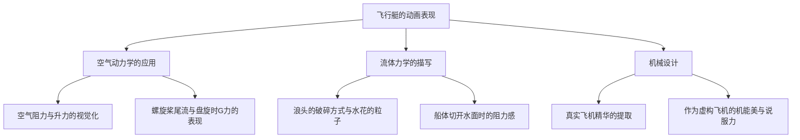
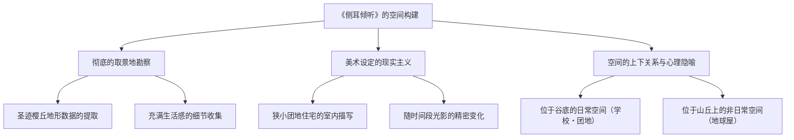

# 第3章：对飞行的憧憬与成年人的浪漫——《红猪》与《侧耳倾听》中现实主义的顶点

在俯瞰吉卜力工作室的历史时，1990年代前半期至中期发表的《红猪》（1992年）与《侧耳倾听》（1995年），乍看之下可能像是处于两个极端的作品。前者以亚得里亚海为舞台，是一部描绘因诅咒变成猪的赏金猎人飞行艇驾驶员的战斗与哀愁的奇幻作品；而后者则以现代的多摩新城为舞台，是一部描绘初中生男女间青涩的恋情与对未来进路的纠葛的青春群像剧。

然而，贯穿这两部作品的，是吉卜力工作室——不，是宫崎骏与近藤喜文这两位稀世创作者，试图利用动画这一表现手法将“现实主义（真实感）”追求到极致的永无止境的探索心。并且，在其根底存在着对“飞行”——物理上的在空中飞翔，或是超越自身极限在精神上的飞跃——的强烈憧憬。本章将从历史背景和技术论两方面，深入探讨这两部作品在动画史上占据着怎样特异的地位，以及达成了何种技术与主题上的成就。

## 1. 《红猪》——空气动力学的极致与失落时代的挽歌

《红猪》（原题：Il Porco Rosso）最初是作为日本航空机上放映用的短片而企划的，但由于南斯拉夫冲突这一现实的沉重阴影，它以一种特异的出身发展成了长篇电影。本作是宫崎骏为自己，也是作为“为疲惫到脑细胞变成豆腐的中年男人制作的电影”而打造的，具有极其个人化触感的作品。

### 1.1 宫崎骏与飞机：对机械的恋物癖与空气动力学的缜密描写

宫崎骏对“飞行”的执着早已闻名，但在《红猪》中对飞行艇的描写，将他自身对机械的恋物癖与对空气动力学的深刻理解以最纯粹的形式表现了出来。本作中登场的飞行艇——主人公波鲁克・罗梭的爱机，鲜红的萨伏依亚S.21（原型是混合了马基 M.33和萨伏依亚-马尔凯蒂 S.59等真实机体元素的原创设计），以及宿敌卡地士的机体，还有空贼联盟的各种杂牌飞行艇——不仅仅是背景或道具，其本身就作为自律的角色跃动着。

值得特书的是，从空气阻力、升力、螺旋桨的扭矩、发动机的振动，到从水面起飞、降落时的流体力学表现，动画中“物理法则的虚假与真实”被控制在绝妙的平衡之中。

在波鲁克的萨伏依亚启动发动机的场景中，从气缸点火、机体整体开始微小的振动，直到排气管吐出黑烟的一系列过程，都是通过赛璐珞画细微的振动和多重曝光（当时的模拟摄影技术）来表现的。在空战（Dogfight）桥段中，承受盘旋时G力（重力加速度）的飞行员肉体上的负荷，以及在失速（Stall）边缘控制机体的操纵杆与方向舵踏板的微细动作，都以极其精确的时机（作画张数）被描绘出来。这是存在于宫崎骏脑内的“飞行的身体感觉”，通过动画师们的手在赛璐珞上被完美追踪的结果。

### 1.2 响彻亚得里亚海空中的反法西斯抵抗与无政府主义

本作的舞台是1920年代末的意大利亚得里亚海。时代背景方面，正是留下了第一次世界大战的伤痕，墨索里尼率领的法西斯党正在抬头的狂躁与不安的时代。波鲁克・罗梭（本名马可・帕哥特）曾是意大利空军的王牌飞行员，但他对国家与军队的体制感到绝望，对自己施下诅咒变成猪，选择了作为赏金猎人这一法外之徒（无政府主义者）生存的道路。

波鲁克那句著名的台词“要我变成法西斯，我宁愿当只猪”，并非仅仅是一句冷酷的耍帅台词。它拒绝被编入国家这一巨大的暴力装置中，在天空这个无国籍的空间里寻求个人的自由与尊严，是宫崎骏自身强烈的反法西斯主义与无政府主义的表态。

电影后半段，波鲁克与昔日战友菲拉林（现为法西斯空军少校）在电影院密会的场景，浓厚地反映了本作的政治背景。菲拉林抱怨道：“我们不得不背负着国家或民族这些无聊的赞助商去飞行”。在这里，冷酷地描绘了在空中飞行的纯粹喜悦，变质为国家意识形态和战争工具的过程。虽然没有明确说明波鲁克变成猪的原因，但那是对人类互相残杀的荒诞世界的深深绝望，也是为了将自己从不断施加从众压力的社会中疏远出来的防御机制，或者说是作为“如果保持人类的姿态就无法保持作为人的尊严”这种悖论的表现而起作用的。

### 1.3 “不飞的猪，就只是只普通的猪”——中年男性的浪漫、挫折与诅咒

《红猪》之所以能抓住许多成年人的心久久不放，是因为本作是一首对“失去之物”的哀切挽歌（Elegy）。波鲁克对在第一次世界大战中散落的战友们（向云之平原升去的飞机幻影场景，是留名电影史的名场面）抱有强烈的丧失感和幸存者内疚（Survivor's Guilt）。

正如吉娜演唱的香颂《樱桃成熟时（Le Temps des cerises）》（作为哀悼巴黎公社瓦解的歌曲而闻名）所象征的那样，这部电影充满了对逝去的美好时代、永远无法触及的青春，以及不可逆转的丧失的深深怀旧（Nostalgia）。波鲁克与吉娜成熟的、然而保持着绝不交汇距离感的成年人恋爱描写，在吉卜力作品中占据了特异的位置。波鲁克也有着以“诅咒”为借口，逃避吉娜的爱情和现实社会参与的一面。在“所谓帅气，就是这么回事。”这句宣传语背后，隐藏着为自己的美学殉道的孤独，以及接受正在变得落后于时代的自己，这样痛切的“中年男性的自我接纳”的故事。

## 2. 《侧耳倾听》——青春期痛切的现实主义与空间的魔法

1995年上映的《侧耳倾听》，是宫崎骏担任制片人、编剧、分镜，由吉卜力工作室的核心动画师近藤喜文唯一担任长篇导演的纪念碑式的作品。虽然改编自柊葵的同名少女漫画，但在宫崎与近藤的手中，本作超越了单纯的爱情故事框架，升华为在进路、才能以及自我实现的焦虑中摇摆不定的青春期的真实肖像。

### 2.1 近藤喜文的视线：寄宿于日常举止中的动画真谛

本作最大的魅力，可以说是技术上的成就，即近藤喜文导演对“日常演技”的彻底执着。在动画中，相比描绘魔法、爆炸、机器人战斗等“非日常（奇观）”的动作，准确且伴随情感地描绘人走路、坐下、泡茶、跑上楼梯等“不经意的日常动作”被认为要困难得多。

近藤喜文曾在高畑勋导演的作品（《萤火虫之墓》、《岁月的童话》等）中担任作画监督，是将角色的骨骼与肌肉的运动、重心的移动，以及将心理状态反映在动作上的“生活演技”的达人。在《侧耳倾听》中，他卓越的观察眼得到了淋漓尽致的发挥。

例如，主人公月岛雯在图书馆看书时姿势的变化、焦急下楼梯时的步法，或者在夹杂着恋慕与烦躁的状态下与天泽圣司交流时视线的推移与耸肩的方式。这每一个细微的动画，都产生了名为雯的少女确实存在于那里、呼吸着那样的强烈真实感。这是与在奇幻世界中飞翔的宫崎动画的快感不同的，脚踏实地描绘“人类的生活”的动画的真谛。

### 2.2 取景地勘察与空间构建：多摩新城这座“活生生的街道”

本作的另一个主角，是作为舞台的街道本身。基于在东京都圣迹樱丘（多摩新城近郊）周边进行的彻底的取景地勘察（Location Hunting），本作的美术背景以惊人的真实感被构建出来。

美术监督黑田聪等人创作的背景画，出色地描绘出了团地住宅无机质的混凝土质感、陡峭的坡道、狭窄的后巷，以及黄昏的街景。特别值得注意的是，对雯居住的“狭窄团地”的描写。堆满的书本、杂乱的餐桌、有着双层床的狭窄姐妹房间。这种令人窒息（但又带有温暖）的真实生活空间的描写，支撑了雯“想从这里逃脱，去往更广阔的世界”这种对飞翔的渴望（＝想要写故事的冲动）。

此外，街道的地形（高低差）出色地发挥了作为心理隐喻的作用。雯的日常（学校和团地）在“下方”，而被不可思议的猫（阿月）引导到达的古董店“地球屋”则在爬完陡坡的“山丘上”。这种高低差，直接在视觉上表现了雯精神上的上升志向，以及迈向未知领域时的困难。

### 2.3 创作的热源与自我实现的痛楚：男爵引导的“内在飞行”

《侧耳倾听》在是一部爱情电影的同时，也是一部强烈的“创作者的自我启迪物语”。相对于为了成为小提琴工匠这一明确目标而打算去意大利留学（飞行）的圣司，感到焦躁的雯，为了确认自己内心的“原石”，开始写故事（《侧耳倾听》的作中作奇幻小说）。

这里有趣的是，在作中作的世界里，插入了雯与猫男爵巴隆一起“在空中飞翔”的片段。这一由以《依巴拉度》闻名的画家井上直久负责背景美术的梦幻场景，描绘了与《红猪》物理飞行截然相反的，作为想象力解放的“内在飞行”。

然而，本作并没有仅仅以梦物语结束。在将不眠不休写成的小说让地球屋的主人读过之后，雯痛切地感到自己的作品粗糙且不成熟，放声大哭。面临创作残酷的壁垒，认清自己才能的极限（保持原石的状态是不会发光的）的这个场景的痛楚，刺痛了所有从事创造（制造）工作的人的心。宫崎骏和近藤喜文避免描绘轻易的成功，通过初中生少女的身影，描绘了“即使如此也必须不断削减、打磨”的严厉工匠伦理。

## 3. 结论：飞机与小提琴，各自的“工匠”们的故事

《红猪》与《侧耳倾听》。驰骋在亚得里亚海天空的中年猪，和骑着自行车在多摩新城的坡道上飞驰的初中生。这两个乍看没有任何交点的故事，以“对工匠精神的尊重”为轴心紧密地结合在一起。

完美修理和调试波鲁克爱机的保可洛公司的菲奥和女工们。还有在克雷莫纳努力修行制作小提琴的圣司，以及持续修理古董钟表的地球屋主人。吉卜力作品一贯地，对用自己的双手创造事物、不断磨练技术的“工匠（Artisan）”们奏响了无上的赞歌。

正如波鲁克为了守护天空的自由而战一样，雯也为了编织自己内心的声音（故事）而拿起了语言这一武器。物理上的“飞行”与想象力的“飞跃”。虽然表现手法不同，但吉卜力工作室在这一时期达到的现实主义顶点，是以压倒性的影像美，将人类对抗现实世界的重力（社会的羁绊和自身的极限），却依然试图高飞的崇高意志烙印在了胶片上。在下一章中，我们将探讨这种彻底的现实主义与自然主义，与神话想象力结合后所产生的前所未有的史诗，《幽灵公主》中自然与人类的冲突。
