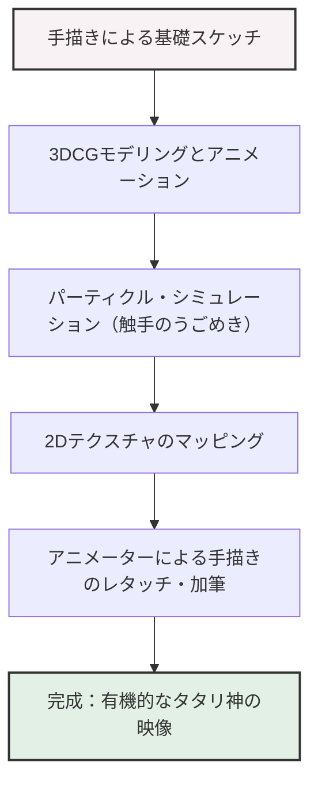

# 第4章：エコロジーと神話的想像力（もののけ姫）

1997年に公開された『もののけ姫』は、スタジオジブリおよび宮崎駿監督のキャリアにおいて、明確な分水嶺となった記念碑的プロトタイプである。本作は単なるアニメーション映画の枠を超え、日本映画史そのものを書き換えるほどの巨大な文化的・産業的インパクトをもたらした。本章では、同作が持つ重層的なテーマ性——日本中世史の脱構築、非二元論的な善悪の位相、そして技術的転換点としてのCG（コンピュータグラフィックス）と伝統的セルアニメーションの融合——について、極限まで詳細に解き明かしていく。

## 1. 産業的コンテクスト：製作費の爆発と興行記録の更新

『もののけ姫』の製作は、スタジオジブリにとってかつてない規模の社運を賭けた巨大プロジェクトであった。当初から宮崎駿監督は「これが最後の引退作になるかもしれない」という覚悟で臨んでおり、その妥協なき作家主義は製作期間と予算を青天井で膨張させた。総製作費は約20億円と言われ、当時の日本映画としては常軌を逸した金額である。作画枚数は約14万4000枚に達し、これは通常の長編アニメーションの2〜3倍に相当する。

この巨大なリスクを回収するため、鈴木敏夫プロデューサーは前例のない規模でのメディアミックスと宣伝戦略を展開した。「生きろ。」という糸井重里による鮮烈なキャッチコピーは、当時の日本社会を覆っていた世紀末的・閉塞的な空気感（阪神・淡路大震災や地下鉄サリン事件といった1995年のトラウマ）に対する一つのアンサーとして機能した。

結果として、本作は観客動員数1420万人、興行収入193億円を記録。当時の日本映画の歴代興行収入記録（『E.T.』が保持していた記録）を大きく塗り替え、日本において「国民的映画」としてのスタジオジブリの地位を不動のものにした。この産業的成功は、日本のアニメーションが大人向けの重厚なテーマを扱っても巨大なビジネスになり得ることを証明し、後のアニメ産業のビジネスモデルに多大な影響を与えた。

## 2. 時代設定と神話的再構築：なぜ室町時代なのか

宮崎駿は本作の舞台として、あえて「室町時代」という日本史の移行期を選び取った。従来の時代劇が好んで描いた江戸時代（身分制度が固定化され、平和で統制された社会）や戦国時代（武将たちの権力闘争）ではなく、室町時代というカオスに満ちた時代を選んだことには、深い思想的意図がある。

室町時代は、農業中心の社会から貨幣経済への移行、手工業の発達、そして何より「自然に対する人間のテクノロジーの優位」が明確に現れ始めた時代である。鉄の生産（たたら吹き）が本格化し、それに伴う森林伐採が進む一方で、いまだ山々には深い原生林が残り、神々が実在すると信じられていた。つまり、人間と自然、あるいは近代と前近代が激しく衝突し、相克するボーダーラインの時代だったのだ。

歴史学者・網野善彦の「非農業民（職人、商人、遊女、芸能民など）」に関する研究（無縁・公界・楽）に強く影響を受けた宮崎は、従来の「瑞穂の国」という均質的な日本史観を解体した。映画に登場するタタラ場は、天皇や大名の支配が及ばない一種のアジール（避難所・自由領域）として描かれる。そこでは、社会の周縁に追いやられたハンセン病患者（病者）や売られた女たちが、鉄を生産するという高度な技術力によって自立し、独自のユートピアを築いている。

このように、『もののけ姫』は単なるファンタジーではなく、歴史の暗部に光を当て、日本人のアイデンティティと自然観を神話のレベルから再構築する試みであった。

## 3. エボシ御前とサン：善悪の非二元論

本作の最も画期的な点は、旧来のハリウッド的、あるいはディズニー的な「勧善懲悪」のパラダイムを完全に放棄したことにある。自然を破壊する側である人間たちを単純な「悪」として断罪せず、むしろ彼らの生の営みと尊厳を力強く描いている。

その象徴がタタラ場のリーダーであるエボシ御前である。彼女は山の神々を殺し、森を切り開く自然破壊の元凶であると同時に、社会から見捨てられた弱者たちを保護し、彼らに生きる目的と尊厳を与える卓越したヒューマニストであり、革命家でもある。エボシは決して私欲のために森を破壊しているわけではない。人間たちが貧困と差別から抜け出し、自立して生き抜くためには、自然を征服し、鉄を生産するしかないのだ。この「善なる動機が結果として他者（自然）の領域を侵犯する」という矛盾こそが、人間の業の本質である。

対するサン（もののけ姫）は、人間に捨てられ、山犬に育てられた少女である。彼女は人間を憎悪し、森を守るためにエボシの命を狙うが、彼女自身もまた完全な「獣」にはなりきれない境界的存在である。アシタカは、これら相容れない二つの正義——「人間の生存の権利」と「自然の神聖性」——の間に立ち、「曇りなき眼で見定め、決める」ことを試みるが、彼にも明確な解決策は見出せない。

物語の結末において、シシ神は首を返されて消滅し、太古の森は失われる。しかし、タタラ場もまた崩壊し、人々は「ここをいい村にしよう」とゼロからの再出発を誓う。アシタカとサンは共に生きることを選ぶが、一つ屋根の下で暮らすことはない。アシタカはタタラ場に、サンは森に住み、「時々会いに行く」という共存の形をとる。これは、人間と自然の間の完全な調和という安易なカタルシスを拒絶し、永遠に続く緊張関係の中で「生きろ」という過酷だが希望のあるメッセージである。

## 4. 技術的転換点：CGと手描きアニメーションの高度な融合

『もののけ姫』は、スタジオジブリにおいてコンピュータグラフィックス（CG）が初めて本格的に導入された作品としても記憶されるべきである。宮崎駿は長年、手描き（セルアニメーション）の職人的技術に絶対的なこだわりを持っていたが、本作で表現すべき圧倒的なダイナミズムと複雑さを実現するためには、デジタル技術の導入が不可避であった。

しかし、ジブリのCG使用は、フル3DCGへの移行ではなく、あくまで手描きの表現力を拡張・補完するための「デジタルコンポジット」と「3D/2Dの融合」であった。CGカットは全1620カット中、約100カット強に過ぎないが、その効果は絶大であった。

### タタリ神の表現

最も象徴的かつ技術的難易度が高かったのが、冒頭のタタリ神（呪いを受けた猪神）の表現である。無数のヘビのような触手（蛇状の呪い）がうごめき、泥のように絡みつきながら進む描写は、手描きのアニメーターにとって悪夢のような作業量となる。

ここで制作チームは、3DCGのパーティクル（粒子）シミュレーションと、手描きの作画を組み合わせる手法を採用した。まず、触手の基本的な動きや骨格を3DCGで構築し、それに手描きのテクスチャをマッピングする。さらに、そのCG素材の上からアニメーターが手描きで加筆（レタッチ）を行うことで、CG特有の無機質な冷たさを消し去り、有機的で生々しい、まさに「怨念」そのもののような表現に到達した。

### デジタルマッピングとダイナミックなカメラワーク

もう一つの革新は、背景画（美術）のデジタル処理である。従来、セルアニメーションにおいてカメラを回り込ませるような立体的なパン（回り込み）は、背景を歪ませて描くという極めて高度な職人技（パースペクティブの計算）に依存していた。

『もののけ姫』では、アシタカが村を出発するシーンや、シシ神の森の奥深さを表現するシーンにおいて、3DCGで構築した地形モデルに、美術スタッフが手描きで描いた美しい背景画をテクスチャとして貼り付ける「3Dマッピング」技術が使用された。これにより、手描きの温もりと絵画的な美しさを保ちながら、実写映画のような空間の奥行きと、縦横無尽に移動するダイナミックなカメラワークが可能となった。

また、シシ神の足元で植物が一瞬にして発芽し、成長しては枯れていく生命のサイクルも、モーフィング技術とデジタルコンポジットを駆使して表現された。このように、『もののけ姫』におけるCGは、決して技術を誇示するためのものではなく、宮崎駿の脳内にある神話的かつ幻惑的なビジョンを現実のスクリーンに定着させるための、不可欠な筆（ツール）として機能したのである。

## 結び

『もののけ姫』は、スタジオジブリが到達した一つの極北である。日本の中世という歴史的土壌に深く根を下ろしながらも、そこで語られるエコロジーの問題と善悪の非二元論は、現代のグローバル社会においてますますアクチュアルな意味を持ち始めている。そして、手描きとデジタルが奇跡的なバランスで融合した映像美は、後にも先にも類を見ない完成度を誇る。次章『第5章：日常の魔法と郷愁（千と千尋の神隠し）』では、この神話的スケールから一転して、現代の少女の心象風景へと潜っていくジブリの新たな転回について考察する。

