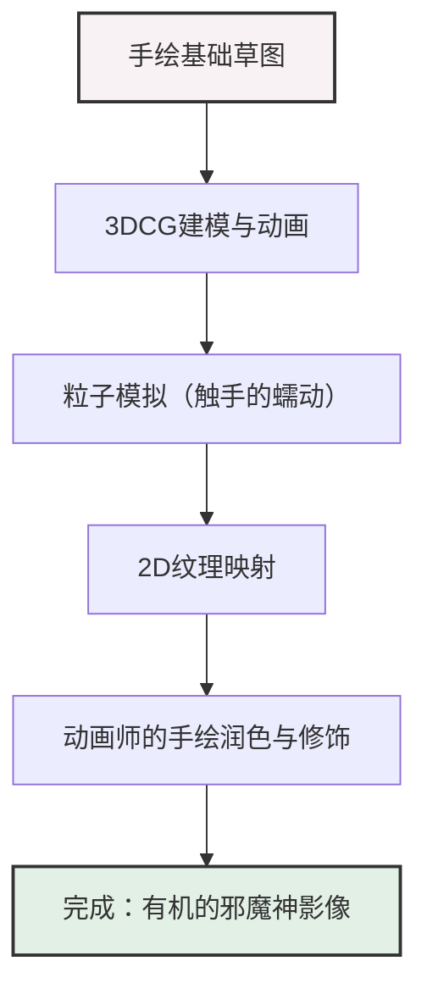

# 第4章：生态学与神话想象力（幽灵公主）

1997年上映的《幽灵公主》，是吉卜力工作室及宫崎骏导演职业生涯中一个明确的分水岭，也是一部具有纪念碑意义的原型之作。这部作品超越了单纯的动画电影的范畴，带来了足以改写日本电影史本身的巨大文化与产业影响。本章将对该作品所具有的多重主题性——日本中世纪史的解构、非二元论的善恶维度，以及作为技术转折点的CG（计算机图形学）与传统赛璐珞动画的融合——进行极其详尽的剖析。

## 1. 产业背景：制作费的激增与票房纪录的刷新

《幽灵公主》的制作，对吉卜力工作室而言是一项前所未有、赌上公司命运的巨大项目。从一开始，宫崎骏导演就抱着“这可能是最后的引退之作”的觉悟来对待，其不妥协的作者主义使得制作周期和预算无止境地膨胀。总制作费据说约为20亿日元，这对当时的日本电影来说是一个打破常理的数字。作画张数达到了约14万4000张，相当于普通长篇动画的2至3倍。

为了收回这一巨大的风险，制片人铃木敏夫展开了史无前例的跨媒体企划与宣传战略。由糸井重里创作的“活下去。”这一鲜明的广告语，对当时笼罩在日本社会的世纪末、压抑的氛围（如阪神淡路大地震和地铁沙林毒气事件等1995年的创伤）起到了某种回应的作用。

结果，本作创下了观影人数1420万人、票房收入193亿日元的纪录。大幅刷新了当时的日本电影历代票房纪录（由《E.T.》保持的纪录），使吉卜力工作室在日本作为“国民级电影”的地位不可动摇。这种产业上的成功，证明了即使日本动画处理面向成人的厚重主题，也能成为巨大的商业项目，对后来的动画产业商业模式产生了深远的影响。

## 2. 时代设定与神话重构：为什么是室町时代

宫崎骏特意选择了“室町时代”这一日本史的过渡期作为本作的舞台。他没有选择以往时代剧喜欢描绘的江户时代（身份制度固化、和平且受管制的社会）或战国时代（武将们的权力斗争），而是选择了充满混沌的室町时代，其中有着深刻的思想意图。

室町时代是从以农业为中心的社会向货币经济过渡、手工业发展的时代，最重要的是，这是一个“人类技术对自然的优势”开始明确显现的时代。铁的生产（踏鞴吹炼）开始正式化，随之而来的是森林采伐的加剧，但同时群山中依然留存着幽深的原始森林，人们依然相信神明的真实存在。也就是说，那是一个人类与自然，或者说近代与前近代激烈冲突、相互克制的边界线时代。

深受历史学家网野善彦关于“非农业民（工匠、商人、游女、演艺民等）”的研究（无缘·公界·乐）影响的宫崎，解构了以往“瑞穗之国”这种同质化的日本史观。电影中登场的达达拉城，被描绘成一种天皇和大名统治无法触及的“避难所”（庇护所·自由领域）。在那里，被赶到社会边缘的麻风病患者（病患）和被卖掉的女人，通过生产铁这种高度的技术能力实现自立，建立起独特的乌托邦。

像这样，《幽灵公主》并不仅仅是一部奇幻作品，而是照亮了历史的暗部，试图从神话的层面对日本人的身份认同和自然观进行重构的尝试。

## 3. 幻姬（黑帽大人）与珊：善恶的非二元论

本作最具突破性的一点在于，它彻底放弃了传统好莱坞式或迪士尼式的“劝善惩恶”范式。它没有将破坏自然的一方——人类简单地定罪为“恶”，反而强有力地描绘了他们的生存营生与尊严。

其象征便是达达拉城的领袖——幻姬（黑帽大人）。她既是杀害山神、开辟森林的破坏自然的元凶，同时也是一位保护被社会遗弃的弱者、赋予他们生存目的与尊严的卓越的人道主义者和革命家。幻姬绝不是为了私欲而去破坏森林。人类为了摆脱贫困与歧视，为了自立地活下去，除了征服自然、生产铁之外别无他法。这种“善良的动机结果却侵犯了他者（自然）的领域”的矛盾，正是人类业障的本质。

相对的，珊（幽灵公主）是一个被人类遗弃、由山犬抚养长大的少女。她憎恶人类，为了保护森林而企图取幻姬的性命，但她自己同样也是一个无法完全成为“野兽”的边界存在。阿席达卡站在这些互不相容的两种正义——“人类生存的权利”与“自然的神圣性”——之间，试图“用不被蒙蔽的双眼看清一切并做出决定”，但他同样无法找到明确的解决对策。

在故事的结尾，兽神（麒麟兽）被归还了头颅后消散，太古的森林也不复存在。然而，达达拉城也同样崩溃，人们发誓“要在这里建一个好村子”，从零开始重新出发。阿席达卡和珊都选择了活下去，但并没有生活在同一个屋檐下。阿席达卡住在达达拉城，珊住在森林，采取了“我会偶尔去见你”的共存形式。这拒绝了人类与自然之间实现完全和谐这种轻易的情感宣泄，而是在永远持续的紧张关系中传达出“活下去”这样残酷却带有希望的信息。

## 4. 技术转折点：CG与手绘动画的高度融合

《幽灵公主》也应被铭记为吉卜力工作室首次正式引入计算机图形学（CG）的作品。多年来，宫崎骏对手绘（赛璐珞动画）的工匠技术有着绝对的执着，但为了实现在本作中应该表现出的压倒性的动态感与复杂性，数字技术的引入是不可避免的。

然而，吉卜力对CG的使用，并非向全3DCG过渡，而终究是为了扩展和补充手绘表现力的“数字合成”与“3D/2D的融合”。虽然在总共1620个镜头中，CG镜头仅有100多个，但其效果却是巨大的。

### 邪魔神（邪魔神）的表现

最具象征意义且技术难度最高的是开篇对邪魔神（受到诅咒的野猪神）的刻画。无数像蛇一样的触手（蛇状的诅咒）蠕动着，像泥浆一样缠绕着前进的描写，对手绘动画师来说是噩梦般的工作量。

在此，制作团队采用了将3DCG的粒子（Particle）模拟与手绘画作相结合的手法。首先，用3DCG构建出触手的基本运动和骨架，并在其上映射手绘的纹理（Texture）。进而，动画师在这些CG素材之上进行手绘润色（修饰），从而消除了CG特有的无机质的冰冷感，达到了有机而生动、宛如“怨念”本身的表现。

### 数字映射与动态摄像机运镜

另一项革新是背景画（美术）的数字处理。以往，在赛璐珞动画中，那种让摄像机环绕的立体推轨镜头（环视），极大地依赖于通过扭曲背景来作画这种极高难度的工匠技艺（透视计算）。

在《幽灵公主》中，如阿席达卡离开村庄的场景，或是表现兽神森林深邃的场景里，使用了将美术人员手绘的优美背景画作为纹理贴在用3DCG构建的地形模型上的“3D映射（3D Mapping）”技术。通过这种方式，在保持手绘的温度与绘画般的美感的同时，实现了如同真人电影般的空间深度，以及可以纵横驰骋移动的动态摄像机运镜。

此外，在兽神的脚下，植物瞬间发芽、生长并枯萎的生命循环，也是充分利用变形（Morphing）技术和数字合成表现出来的。像这样，《幽灵公主》中的CG，绝不是为了炫耀技术，而是作为将宫崎骏脑海中那神话般且令人目眩的神奇景象固定在现实银幕上的不可或缺的画笔（工具）而发挥着作用。

## 结语

《幽灵公主》是吉卜力工作室所达到的一处极北之境。它虽然深深扎根于日本中世纪这一历史土壤之中，但其中所讲述的生态学问题和善恶非二元论，在现代的全球化社会中开始具有越来越强烈的现实意义。而且，手绘与数字技术以奇迹般的平衡相融合的影像美，拥有着空前绝后的完成度。在下一章《第5章：日常的魔法与乡愁（千与千寻）》中，我们将探讨吉卜力如何从这种神话般的规模发生大转折，潜入现代少女心象风景的全新转向。
