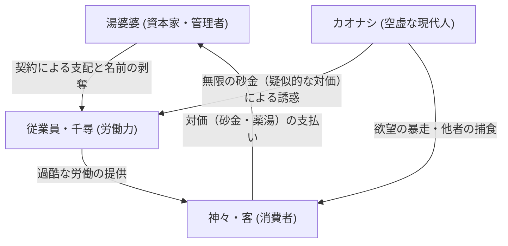

# 第5章：デジタル移行と世界的評価（千と千尋の神隠し、猫の恩返し）

スタジオジブリの歴史において、2000年代初頭は技術的、表現的、そして商業的に最も劇的な転換点となった時代である。本章では、セルアニメーションからフルデジタル環境への移行がいかにしてジブリ作品の映像表現をかつてない領域へと押し広げたのか、そしてその結実たる『千と千尋の神隠し』（2001年）と、次世代への布石としての『猫の恩返し』（2002年）が、日本国内の枠を超えてどのような世界的評価と文化的影響をもたらしたのかを、プロフェッショナルの視座から極限まで詳述する。

## 1. アナログからデジタルへ：スタジオジブリの技術的パラダイムシフトと美学の再構築

アニメーション制作における「デジタル化」とは、単に作業の効率化やコスト削減を意味するものではない。それは、画面内に存在するすべての視覚要素を数値データとして完全に統制可能にするという、映像制作の根底的なパラダイムシフトであった。スタジオジブリにおけるデジタル技術の導入は、1997年の『もののけ姫』においてタタリ神の触手のうごめきや、ディダラボッチの半透明な質感、一部の3DCG背景などで試験的に行われ、続く1999年の『ホーホケキョ となりの山田くん』で完全なデジタルペイントが採用された。しかし、宮崎駿監督作品において、従来のセルアニメーションが持っていた生々しい質感を保ちつつ、それをデジタル空間で緻密に再構築するという至難の業を完全に達成したのは『千と千尋の神隠し』が初となる。

このフルデジタル体制への完全移行により、制作現場からは物理的な「セル画」や「アニメーション用絵の具」が姿を消した。紙に描かれた原画・動画をスキャナーで高解像度で取り込み、ソフトウェア上でデジタル彩色を施すワークフローが確立されたのである。これにより、物理的なセル画を何枚も重ねることによって生じていた透過光の減衰（絵が暗くなる現象）や、セル傷・ゴミの混入といったアナログ特有の物理的制約からついに解放された。

さらに革新的だったのは「撮影（コンポジット）」工程における表現力の飛躍的な向上である。画面上のオブジェクト（キャラクター、手前のなめくじ、奥の建物、エフェクトなど）を無制限のレイヤーに分割し、それぞれに異なる焦点深度（被写界深度）を持たせるという、実写映画のカメラレンズを模倣した高度な多層的奥行き表現が可能となった。アナログ時代のマルチプレーン・カメラ装置では数層が限界であった空間表現が、デジタル空間では無限の階層を持つことが可能になり、油屋のそびえ立つような巨大さや、奈落へと続く階段の底知れぬ深さが、圧倒的なパースペクティブをもって観客の目に迫るようになったのである。

## 2. 色彩設計・保田道世の錬金術：フルデジタル彩色がもたらした色彩表現の無限の拡張

このデジタル移行の最大の恩恵を受けたのが、「色彩」という要素である。スタジオジブリ創設以前から宮崎駿・高畑勲作品の色彩設計を長年支え続けた天才的カラーリスト、保田道世は、デジタルペイントへの完全移行によって、かつてない魔法を画面にかけることに成功した。

物理的な絵の具を使用していた時代、使用可能な色数には明確な限界が存在した。ひとつの作品で使われる絵の具の種類は数百色程度が上限であり、複雑な陰影や夕暮れ時の微妙な環境光の変化を表現するには、限定されたパレットの中で錯視的な効果を狙うしかなかった。しかし、デジタル環境への移行により、理論上は約1677万色（24bitカラー）という無限の色数を扱うことが可能となった。

『千と千尋の神隠し』において、保田道世はこの無限のパレットを「奇をてらったサイケデリックな配色」のためではなく、「徹底的にリアリティのある環境光の再現」と「キャラクターの精緻な感情表現」のために活用した。千尋が迷い込む不思議の町や、八百万の神々が疲れを癒やす「油屋」の極彩色の照明は、単に派手なだけではない。赤い提灯の光が濡れた石畳に乱反射する様子、千尋の頬に落ちる繊細な影、豚にされてしまった両親が貪り食う異界の食物の脂ぎったテクスチャ、そしてハクが竜の姿になった際の鱗の生々しくも透明感のあるエメラルドグリーンなど、それぞれのオブジェクトが光源から受ける影響を、時間帯や空間の湿度に合わせて微細にコントロールしているのだ。

特に圧巻なのは、キャラクターと美術背景の「調和（ハーモニー）」である。アナログ時代はどうしても手描きの背景画とセル画の間に質感の断絶が生じがちであったが、デジタルコンポジットの導入により、背景の空気感（アンビエント・ライト）をキャラクターの色彩に馴染ませるための微細なデジタルフィルター処理が可能となった。海原電鉄に乗って沼の底へと向かうシークエンスにおいて、夕暮れから逢魔が時、そして夜へと移り変わる空と水面の色調変化、そこに乗客の半透明の影が落ちる描写は、デジタルグラデーションの精緻な制御と、保田の鋭敏な色彩感覚が見事に融合したアニメーション史に残る映像詩である。

## 3. 日本的アニミズムと『神隠し』の民俗学

本作が世界的に類例のない評価を獲得した理由は、その圧倒的な映像美に加え、極めて日本的な「アニミズム（汎霊説）」の世界観を、現代的な少女の通過儀礼（イニシエーション）の物語へと見事に昇華させた点にある。

八百万の神々が日々の疲れを癒やすために風呂屋にやってくる、という設定自体が、一神教的な西洋の価値観からは極めて新鮮かつ深遠に映った。河の神がヘドロや人間の不法投棄した自転車、粗大ゴミにまみれて「オクサレ様」と化している描写は、現代の環境破壊に対する直接的なメッセージであると同時に、「穢れを祓う」という神道の根源的な概念の視覚化である。こうしたローカル（土着的）な民俗学的モチーフが、グローバル（普遍的）な環境問題へとシームレスに接続されている。

また、「神隠し」というタイトルが示す通り、本作は生と死の境界線を彷徨う物語である。トンネルを抜けた先にある廃墟のテーマパーク、そこから川を隔てて存在する油屋は、明らかに「異界」あるいは「冥界」のメタファーである。日本の民間伝承において、神隠しに遭った者が異界の食べ物を口にすると元の世界に戻れなくなるという「黄泉戸喫（よもつへぐい）」のタブーが、千尋がハクから不思議な食べ物をもらうシーンに組み込まれており、宮崎駿の深い民俗学的教養が物語の骨格を強固に支えている。

## 4. 湯屋（油屋）のシステムと徹底した資本主義・消費社会批判

アニミズムの意匠をまといながらも、物語の主たる舞台となる「油屋」の実態は、極めて近代的な官僚制と資本主義社会のメタファーとして機能している。和洋折衷、明治期の擬洋風建築と伝統的温泉宿がグロテスクに融合したような油屋の建築様式自体が、混沌とした日本の近代化そのものを象徴している。

湯婆婆が頂点に君臨するこの巨大な湯屋は、徹底した階層社会であり、全ての行動が「契約」と「労働」によって規定される空間である。ここで働く者たちは、自らの「名前」を奪われる。千尋が「千」という一文字に縮減される描写は、アイデンティティの剥奪であり、人間が巨大な資本主義システムの中で交換可能な「労働力」「歯車」として規格化される過程の鋭い隠喩である。働くことを拒めば動物（豚や石炭）に変えられてしまうという掟は、「労働なき者は生存を許されない」という現代社会の冷酷な現実を突きつけている。

さらに、本作に登場する「カオナシ」という特異なキャラクターは、現代の消費社会が生み出した病理の象徴として機能する。彼は自らの声を持たず、他者の欲望（砂金）を際限なく与えることでしかコミュニケーションを図れない。そして他者を飲み込むことで、その他者の声や性格を借りて自己を肥大化させていく。このカオナシの姿は、他者との真の繋がりを喪失し、物質的な消費や貨幣の力によってのみ自己の空虚を埋めようとする現代人のカリカチュアに他ならない。油屋の従業員たちがカオナシのばらまく金に群がり、やがて呑み込まれていく様は、欲望の資本主義がいかにして人間性を破壊し、共同体を崩壊させるかという宮崎駿の冷徹な批評眼を示している。

## 5. 世界的評価の獲得：アカデミー賞受賞と興行記録の樹立がもたらした衝撃

こうした幾重にも張り巡らされた深いテーマ性と、フルデジタル彩色による極限の映像美が融合した『千と千尋の神隠し』は、アニメーションというメディアの枠を軽々と越え、世界の映画史にその名を刻むこととなる。

2002年の第52回ベルリン国際映画祭において、実写の並み居る傑作群を抑え、アニメーション映画としては史上2作目（『シンデレラ』以来約半世紀ぶり）となる最高賞「金熊賞」を受賞。この快挙は、アニメーションが子供向けのエンターテインメントにとどまらず、高度な芸術作品として世界的に認知された歴史的瞬間であった。さらに翌2003年、第75回アカデミー賞において長編アニメーション映画賞を獲得。ディズニーやピクサーの3DCG作品が主流となりつつあったアメリカ映画界において、日本の2D手描きアニメーション（デジタル処理を含む）が頂点に立ったことの意義は計り知れない。

特に、ピクサーの中心人物であり、長年の宮崎駿の盟友でもあるジョン・ラセターが北米版の総指揮を買って出たことは、ジブリ作品の世界展開において決定的な役割を果たした。ラセターの尽力により、ディズニーの配給網に乗って全米で公開され、世界のクリエイターたちに「Ghibli」の存在を深く刻み込んだのである。

日本国内においても、その社会的影響力は絶大であった。興行収入316億8000万円という数字は、当時の日本映画における歴代1位の記録をダブルスコア近くで塗り替える空前絶後のメガヒットであり、「国民の4人に1人が劇場で観た」と称されるほどの社会現象を巻き起こした。この成功は、日本映画産業全体のビジネスモデルを大きく変容させ、アニメーション映画が実写映画を凌駕する巨大な興行パワーを持つことを完全に証明したのである。

## 6. 『猫の恩返し』と次世代監督の起用：ジブリの多角化とデジタル体制の安定化

『千と千尋の神隠し』による歴史的な大熱狂の直後、2002年に公開されたのが森田宏幸監督による『猫の恩返し』である。本作は『耳をすませば』の主人公・月島雫が書いた物語というスピンオフ的な位置づけを持つ中編作品（上映時間75分）であり、企画段階ではテーマパーク向けの「猫のプロジェクト」としてスタートした異色の成り立ちを持つ。

宮崎駿・高畑勲という圧倒的なカリスマ性を持つ二大巨頭以外の若手・外部監督を起用し、スタジオの制作ラインを多様化させるという試みは、ジブリにとって常に重要かつ困難な課題であった。『猫の恩返し』は、フルデジタル制作体制がスタジオ内に技術的に定着したからこそ可能になった、軽快でフットワークの軽い作品づくりを体現している。

重厚なテーマ性と圧倒的な書き込み量で観客の精神を圧倒した『千と千尋』とは対照的に、『猫の恩返し』は、日常のすぐ隣にある異世界（猫の国）へと迷い込むごく普通の女子高生・ハルの冒険を、肩の力の抜けた軽妙なタッチで描いている。ここには、デジタル技術を「重厚長大」な大作のみならず、「小粋なファンタジー」を安定したスケジュールと高いクオリティで量産するためのインフラとして機能させようというスタジオの長期的な戦略が見て取れる。

また、吉田玲子による脚本の妙味や、バロン（フンベルト・フォン・ジッキンゲン男爵）やムタといった魅力的なキャラクターの造形、そして「自分の時間を生きられない者は、自分を見失う（猫になってしまう）」というテーマの処理も秀逸である。一見すると明るいコメディタッチの冒険活劇であるが、自己決定権の喪失がアイデンティティの変容（猫化）をもたらすという恐怖は、実は『千と千尋』における「名前を奪われる」恐怖とも底通する極めて現代的なテーマであり、それがエンターテインメントの枠組みの中で見事に消化されている点は高く評価されるべきである。

## 7. 第5章の総括：伝統と革新の融合が生んだ奇跡の到達点

2000年代初頭のスタジオジブリは、技術的な「革新（フルデジタル制作環境への移行）」と、表現における「伝統（手描きアニメーションの生々しい質感と日本的アニミズム）」が奇跡的なバランスで交差し、かつてない高みへと到達した黄金期であった。

ジブリにおけるデジタル技術は、単なる効率化や、絵を平坦にするためのツール（安易なセルルック3DCGなど）として用いられることは決してなかった。それはあくまで「人間の手によって描かれた線の力や絵画の可能性を、物理的な制約から解放し、さらに奥深く豊かにするための最上級の道具」として徹底的に飼い慣らされたのである。保田道世の色彩設計が完璧に証明したように、最先端のテクノロジーは、熟練の職人が持つ卓越した美意識と結合したときにこそ、初めて真の芸術的到達点へと至る。

『千と千尋の神隠し』が突きつけた圧倒的な作家性と世界観の強度、そして『猫の恩返し』が示したスタジオとしての安定した制作力と世代交代・多角化の可能性。この激動の時期を経て、スタジオジブリは単なる一国のアニメーションスタジオという枠を完全に破壊し、世界の映画表現を牽引する唯一無二の世界的ブランドへと変貌を遂げたのである。しかし、この前人未到の巨大化と世界的名声は、同時に「宮崎駿という特異な天才に極度に依存したシステムからの脱却」という、次なる（そして現在に至るまでジブリを苦しめ続ける）重い課題を、スタジオの深部に静かに突きつけることにもなるのである。

