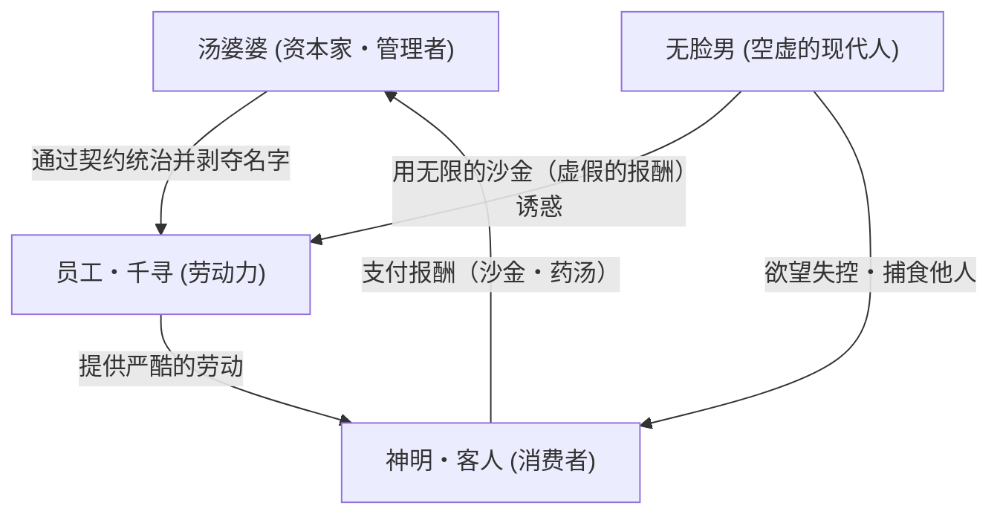

# 第5章：数字转型与全球赞誉（《千与千寻》、《猫的报恩》）

在吉卜力工作室的历史上，2000年代初是在技术、表现手法和商业上发生最具戏剧性转折的时代。本章将从专业人士的视角，极致详细地探讨从赛璐珞动画向全数字化环境的过渡，是如何将吉卜力作品的影像表现推向未曾有过的境界，以及其结晶之作《千与千寻》（2001年）和作为向下一代布局的《猫的报恩》（2002年）是如何超越日本国内的界限，带来何种世界级的赞誉和文化影响的。

## 1. 从模拟到数字：吉卜力工作室的技术范式转换与美学重构

在动画制作中，“数字化”并不单纯意味着提高工作效率或削减成本。这是一场影像制作根本性的范式转换，意味着能够将画面中存在的所有视觉元素作为数值数据进行完全控制。吉卜力工作室引入数字技术，是在1997年的《幽灵公主》中针对邪魔神触手的蠕动、迪达拉博奇（巨型神明）的半透明质感，以及部分3DCG背景等方面进行了试验性应用，随后在1999年的《我的邻居山田君》中采用了完全的数字上色。然而，在宫崎骏导演的作品中，首次完美实现在保留传统赛璐珞动画所具有的生动质感的同时，将其在数字空间中进行细致重构这一极其困难之举的，正是《千与千寻》。

随着向全数字体制的彻底过渡，物理上的“赛璐珞片”和“动画用颜料”从制作现场消失了。确立了用扫描仪将画在纸上的原画和动画以高分辨率录入，并在软件上进行数字上色的工作流程。由此，终于从模拟时代特有的物理限制中解放出来，例如由于重叠多张物理赛璐珞片而导致的透射光衰减（画面变暗的现象），以及赛璐珞片上的划痕和灰尘混入等问题。

更具革命性的是在“摄影（合成）”工序中表现力的飞跃性提升。将画面上的对象（角色、前景的鼻涕虫、背景的建筑物、特效等）分割为无限的图层，并让每一层拥有不同的焦深（景深），从而能够模仿真人电影的摄像机镜头，实现高度多层的景深表现。在模拟时代的各种多层摄影机装置中，几层已经是极限的立体空间表现，在数字空间中则可以拥有无限的层次。油屋那高耸入云的巨大感，以及通向深渊的阶梯那深不可测的深度，带着压倒性的透视感逼近观众的视野。

## 2. 色彩设计·保田道世的炼金术：全数字上色带来的色彩表现的无限扩展

这种数字转型最大的受益者是“色彩”这一元素。在吉卜力工作室创立之前，就长期支撑着宫崎骏、高畑勋作品色彩设计的天才色彩师保田道世，通过完全向数字上色的过渡，成功地为画面施加了前所未有的魔法。

在使用物理颜料的时代，可使用的颜色数量存在明确的上限。一部作品中使用的颜料种类最多只有数百种左右，为了表现复杂的阴影或黄昏时微妙的环境光变化，只能在有限的调色板中试图达到视觉错觉的效果。然而，随着向数字环境的过渡，理论上可以处理约1677万色（24位色彩）这种无限数量的颜色。

在《千与千寻》中，保田道世并没有将这无限的调色板用于“标新立异的迷幻配色”，而是用于“再现极其真实的环境光”和“细致入微地表现角色的情感”。千寻误入的不可思议的小镇，以及八百万神明洗去疲惫的“油屋”中那色彩斑斓的照明，绝不只是单纯的华丽。红灯笼的光在湿润的石板路上漫反射的景象、落在千寻脸颊上的细腻阴影、变成猪的父母贪婪吞食的异界食物那油腻的质感，以及白龙变成龙的姿态时鳞片那生动且具有透明感的翠绿色等，都根据时间段和空间的湿度，对各个对象受光源影响的情况进行了细微的控制。

尤其令人叹为观止的是角色与美术背景的“和谐（Harmony）”。在模拟时代，手绘背景画和赛璐珞片之间难免会产生质感上的割裂，但通过引入数字合成，可以进行细微的数字滤镜处理，使背景的氛围感（环境光）融入角色的色彩中。在乘坐海原电铁前往沼底的序列中，从黄昏到逢魔时刻再到夜晚的天空和水面色调变化，以及乘客半透明的影子落在其中的描写，是数字渐变的精细控制与保田敏锐的色彩感觉完美融合的、动画史上留名的影像诗。

## 3. 日本式泛灵论与《神隐》的民俗学

本作之所以获得世界上史无前例的评价，原因除了其压倒性的影像美之外，还在于它将极具日本特色的“泛灵论（万物有灵论）”世界观，完美升华为了现代少女的成年礼（启蒙）故事。

八百万神明为了洗去日常的疲惫而来到澡堂，这个设定本身在坚持一神教的西方价值观看来就显得极其新鲜而深奥。河神被污泥、人类非法倾倒的自行车和大型垃圾所覆盖，化作“腐烂神（オクサレ様）”的描写，既是对现代环境破坏的直接信息，同时也是神道教中“拔除污秽”这一根本概念的视觉化。这种本土（土著）的民俗学主题，与全球性（普遍性）的环境问题实现了无缝连接。

此外，正如“神隐（千与千寻的日文原名意为被神明隐藏起来）”这个标题所示，本作是一个在生与死的边界线上彷徨的故事。穿过隧道后的废墟主题公园，以及与那里隔河相望的油屋，显然是“异界”或“冥界”的隐喻。在日本的民间传说中，遭到神隐的人如果吃了异界的食物就再也无法回到原来的世界，这种名为“黄泉之食”的禁忌，被融入了千寻从白龙那里得到不可思议的食物的场景中。宫崎骏深厚的民俗学修养强有力地支撑着故事的骨架。

## 4. 汤屋（油屋）的系统与彻底的资本主义·消费社会批判

虽然披着泛灵论的外衣，但作为故事主要舞台的“油屋”的实质，却是作为极其现代的官僚制和资本主义社会的隐喻在发挥作用。和洋折衷、明治时期拟洋风建筑与传统温泉旅馆怪异融合而成的油屋建筑样式本身，就象征着混沌的日本近代化本身。

以汤婆婆为顶点的这个巨大汤屋，是一个彻底的等级社会，是一个所有行为都由“契约”和“劳动”来规定的空间。在这里工作的人，会被剥夺自己的“名字”。千寻被缩减为一个“千”字的描写，是身份认同的剥夺，也是人类在巨大的资本主义系统中作为可交换的“劳动力”和“齿轮”被规格化过程的尖锐隐喻。拒绝工作就会被变成动物（猪或煤炭）的规定，直指“不劳动者不配生存”的现代社会冷酷现实。

此外，本作中登场的名为“无脸男”的特异角色，作为现代消费社会所产生的病理象征而发挥作用。他没有自己的声音，只能通过无节制地给予他人的欲望（沙金）来进行交流。然后通过吞噬他人，借用他人的声音和性格来使自己膨胀。无脸男的这种姿态，正是丧失了与他人真正联系，试图仅靠物质消费和金钱的力量来填补自己空虚的现代人的讽刺画。油屋的员工们群聚在无脸男撒下的金子周围，最终被吞噬的模样，展现了宫崎骏对欲望的资本主义如何破坏人性、使共同体崩溃的冷酷批判眼光。

## 5. 获得世界级赞誉：斩获奥斯卡奖与创下票房纪录所带来的冲击

这种交织着重重深度的深刻主题性，与全数字上色带来的极致影像美相结合的《千与千寻》，轻而易举地跨越了动画这一媒介的界限，将其名字刻在了世界电影史上。

在2002年的第52届柏林国际电影节上，它力压群雄，战胜了众多真人电影杰作，成为史上第二部（自《灰姑娘》以来时隔约半个世纪）荣获最高奖“金熊奖”的动画电影。这一壮举是动画电影不再局限于儿童娱乐，而是作为高度的艺术作品获得世界认可的历史性瞬间。接着在第二年的2003年，荣获第75届奥斯卡金像奖最佳动画长片奖。在迪士尼和皮克斯的3DCG作品逐渐成为主流的美国电影界，日本的2D手绘动画（包含数字处理）能够站上顶峰，其意义是无法估量的。

特别是作为皮克斯的核心人物，同时也是宫崎骏多年盟友的约翰·拉塞特主动承担北美版总指挥一职，在吉卜力作品的全球推广中发挥了决定性的作用。在拉塞特的尽力下，该片搭乘迪士尼的发行网络在全美上映，将“Ghibli”的存在深深印刻在了全球创作者们的心中。

在日本国内，其社会影响力也是巨大的。316亿8000万日元的票房收入，以接近两倍的分数刷新了当时日本电影历代第一的纪录，是一部空前绝后的超级大作，甚至引发了被称作“四分之一的国民都在影院观看过”的社会现象。这一成功极大地改变了整个日本电影产业的商业模式，彻底证明了动画电影具有凌驾于真人电影之上的巨大票房力量。

## 6. 《猫的报恩》与起用新生代导演：吉卜力的多元化与数字体制的稳定化

在《千与千寻》引发历史性的狂热之后，紧接着在2002年上映的是由森田宏幸导演的《猫的报恩》。本作是《侧耳倾听》的主人公月岛雯所写的衍生性质的中篇作品（片长75分钟），在企划阶段，它有着作为面向主题公园的“猫的企划”而启动的与众不同的渊源。

起用拥有压倒性魅力的宫崎骏和高畑勋这两大巨头以外的年轻或外部导演，使工作室的制作线多样化，这对吉卜力来说始终是一个重要且困难的课题。《猫的报恩》体现了一种轻松灵活的作品创作，这正是因为全数字制作体制在工作室内部技术上已然扎根才得以实现的。

与通过厚重的主题性和压倒性的作画量震撼观众精神的《千与千寻》形成鲜明对比的是，《猫的报恩》以轻松幽默的笔触，描绘了误入日常旁边的异世界（猫之国）的极普通的女子高中生小春的冒险。在这里，可以看出工作室的长期战略：不仅仅将数字技术用于“厚重庞大”的巨作，也旨在将其作为以稳定的日程和高质量量产“轻巧奇幻作品”的基础设施来发挥作用。

此外，由吉田玲子负责的剧本的巧妙之处，男爵（佛贝鲁·冯·吉金肯男爵）和胖胖（穆塔）等极具魅力的角色塑造，以及对“无法活出自己时间的人，会迷失自我（变成猫）”这一主题的处理也非常出色。乍看之下是一部明朗喜剧风格的冒险活剧，但丧失自我决定权会带来身份认同的改变（猫化）这一恐惧，实际上与《千与千寻》中“被剥夺名字”的恐惧暗通款曲，是一个极具现代性的主题。这一点在娱乐的框架内被出色地消化，应该得到高度评价。

## 7. 第5章总结：传统与创新的融合所诞生的奇迹顶点

2000年代初的吉卜力工作室，是技术上的“创新（向全数字制作环境过渡）”与表现上的“传统（手绘动画生动的质感与日本式泛灵论）”以奇迹般的平衡交汇，达到前所未有高度的黄金期。

吉卜力对于数字技术的运用，绝不仅仅是为了提高效率，或是将其作为使画面变得平坦的工具（如廉价的赛璐珞风格3DCG等）。它始终被彻底驯服为“为了从物理限制中解放人类手绘线条的力量和绘画的可能性，并使其更加深邃丰富而使用的最顶级的工具”。正如保田道世的色彩设计所完美证明的那样，最前沿的科技只有与熟练工匠卓越的审美意识相结合时，才能首次达到真正的艺术顶点。

《千与千寻》展现了压倒性的作者性和世界观强度，而《猫的报恩》则展现了工作室稳定的制作能力以及世代交替、多元化的可能性。经历了这段动荡的时期，吉卜力工作室彻底打破了仅作为一国动画工作室的框架，蜕变为引领世界电影表现的独一无二的世界级品牌。然而，这种前人未及的巨大化和世界级声誉，同时也将“摆脱极度依赖宫崎骏这个特异天才的系统”这一接下来的（并且至今仍在折磨着吉卜力的）沉重课题，静静地推到了工作室的深处。
